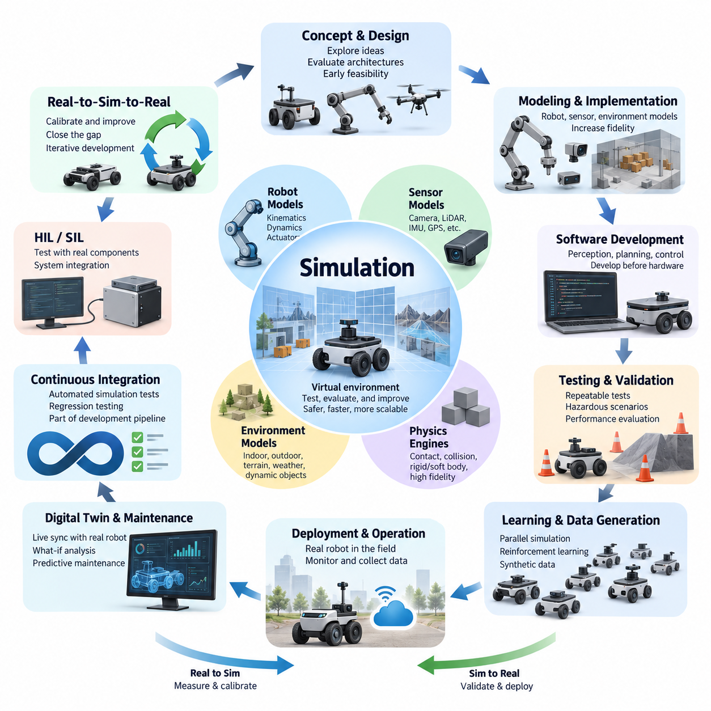
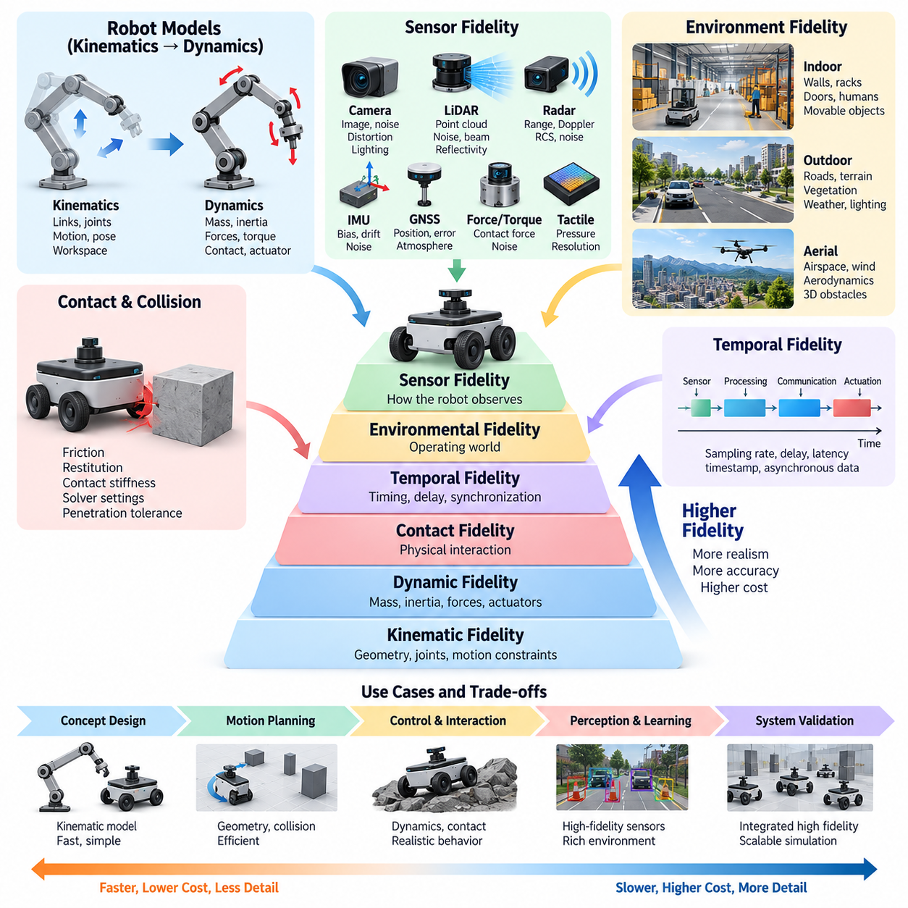
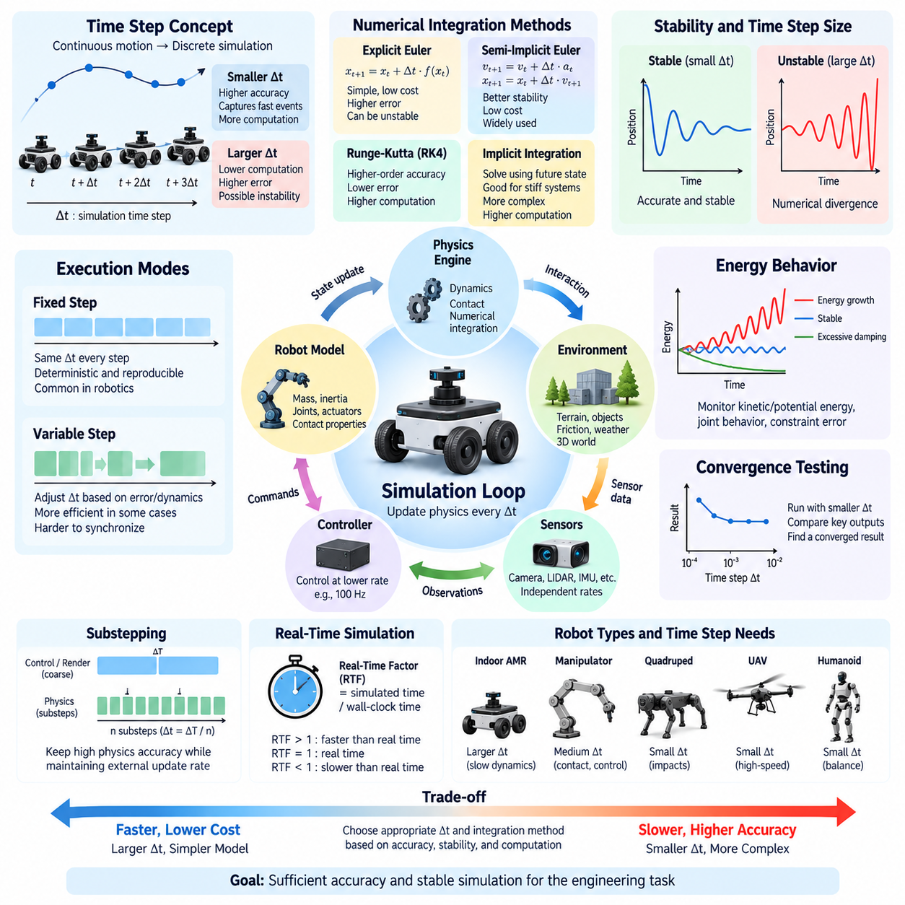
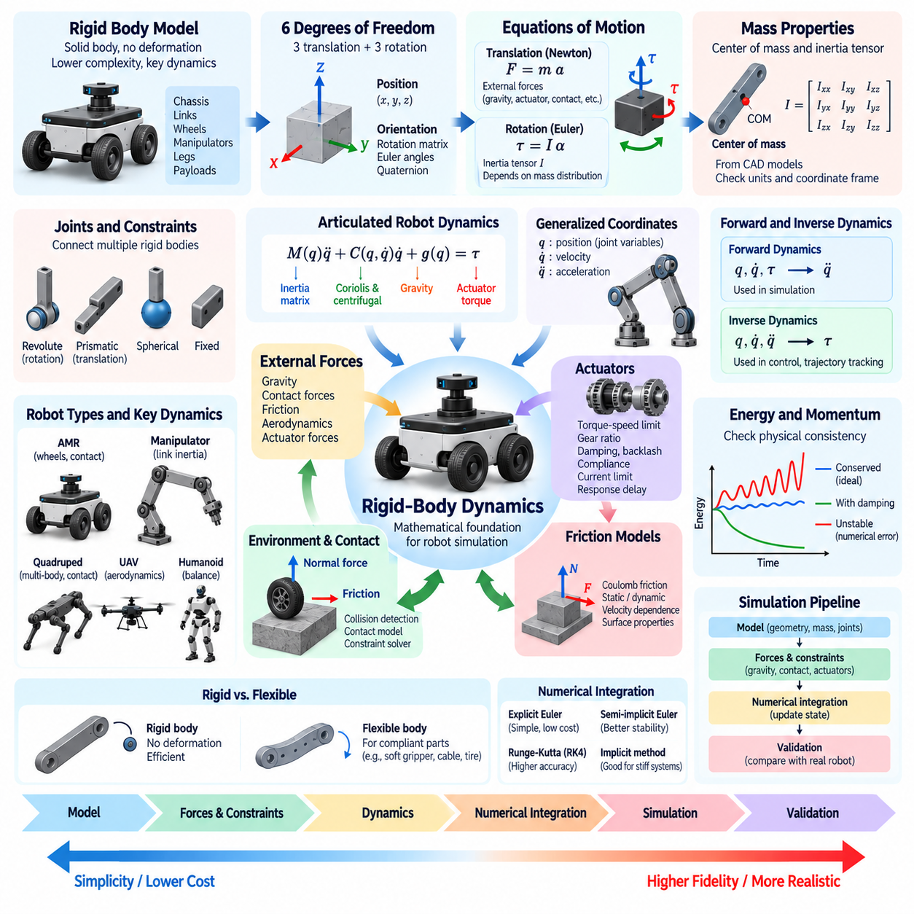
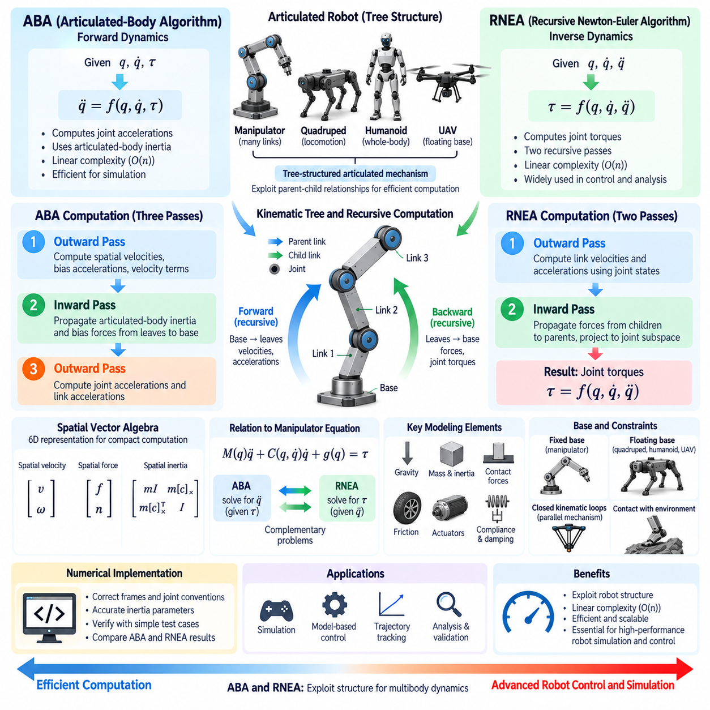
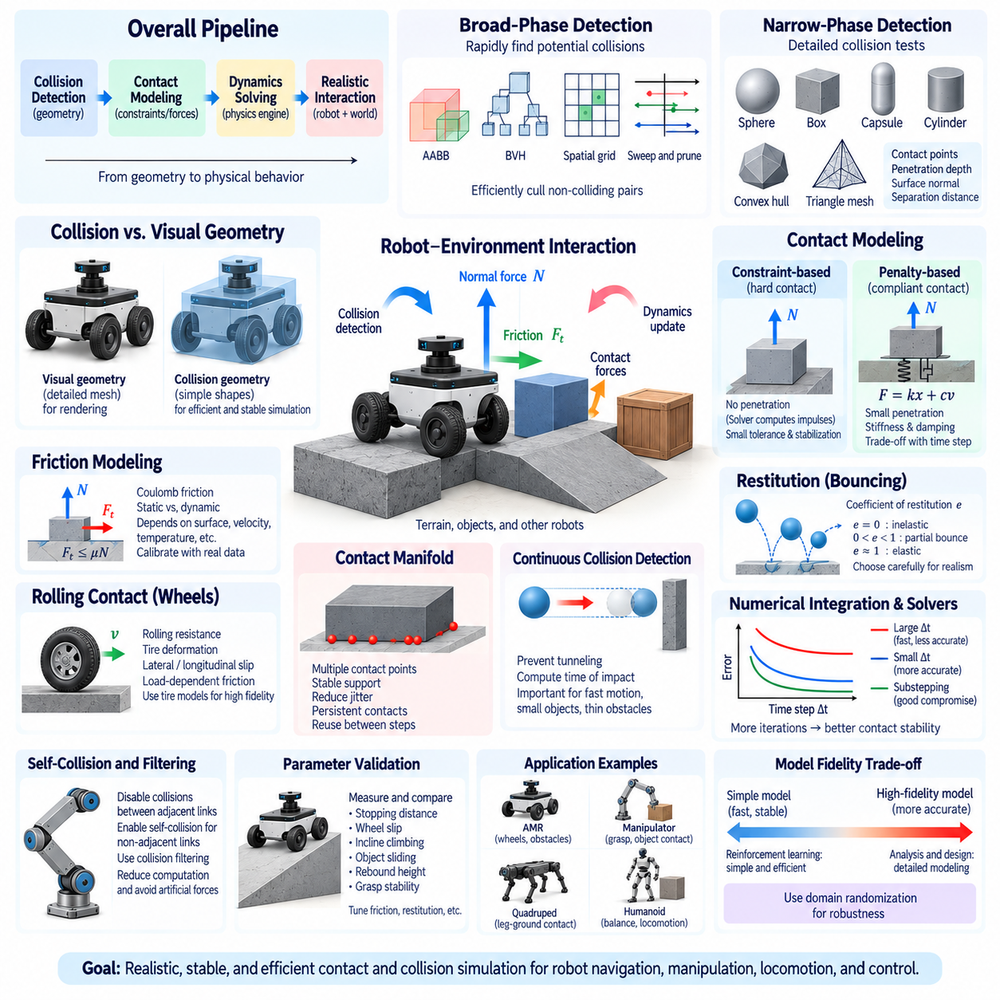
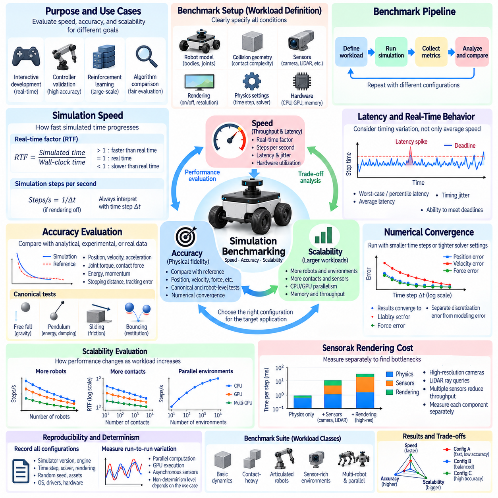
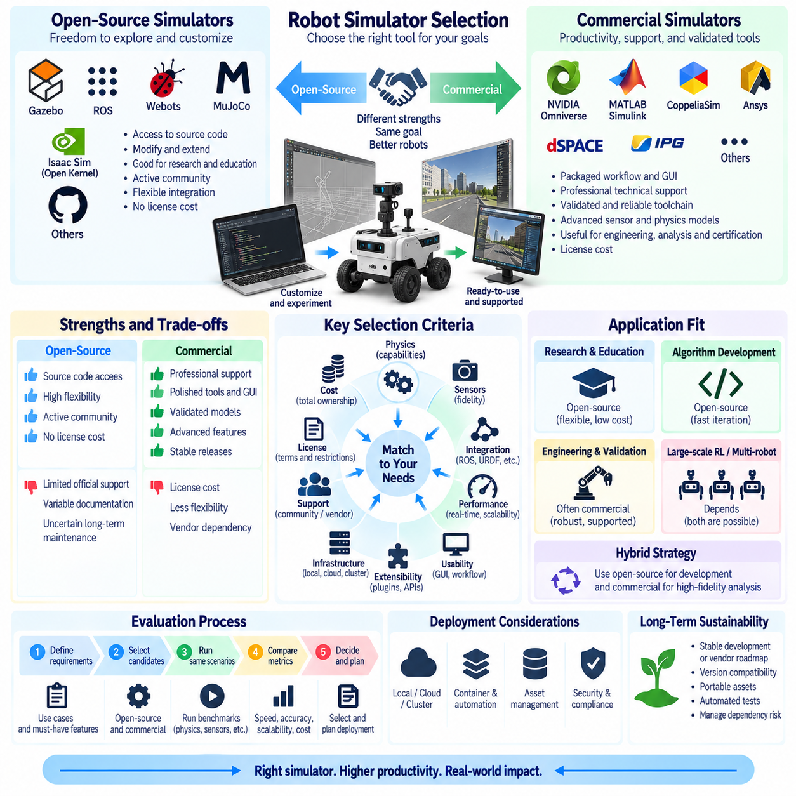
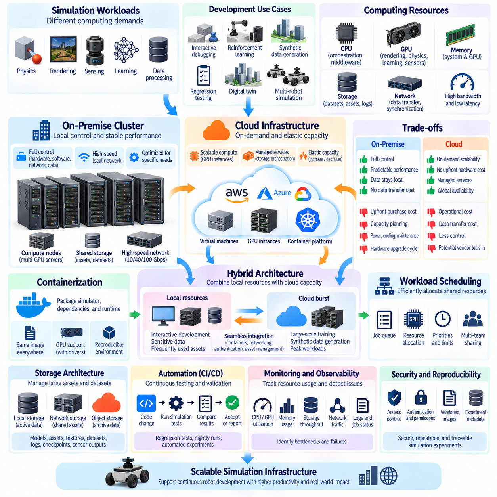
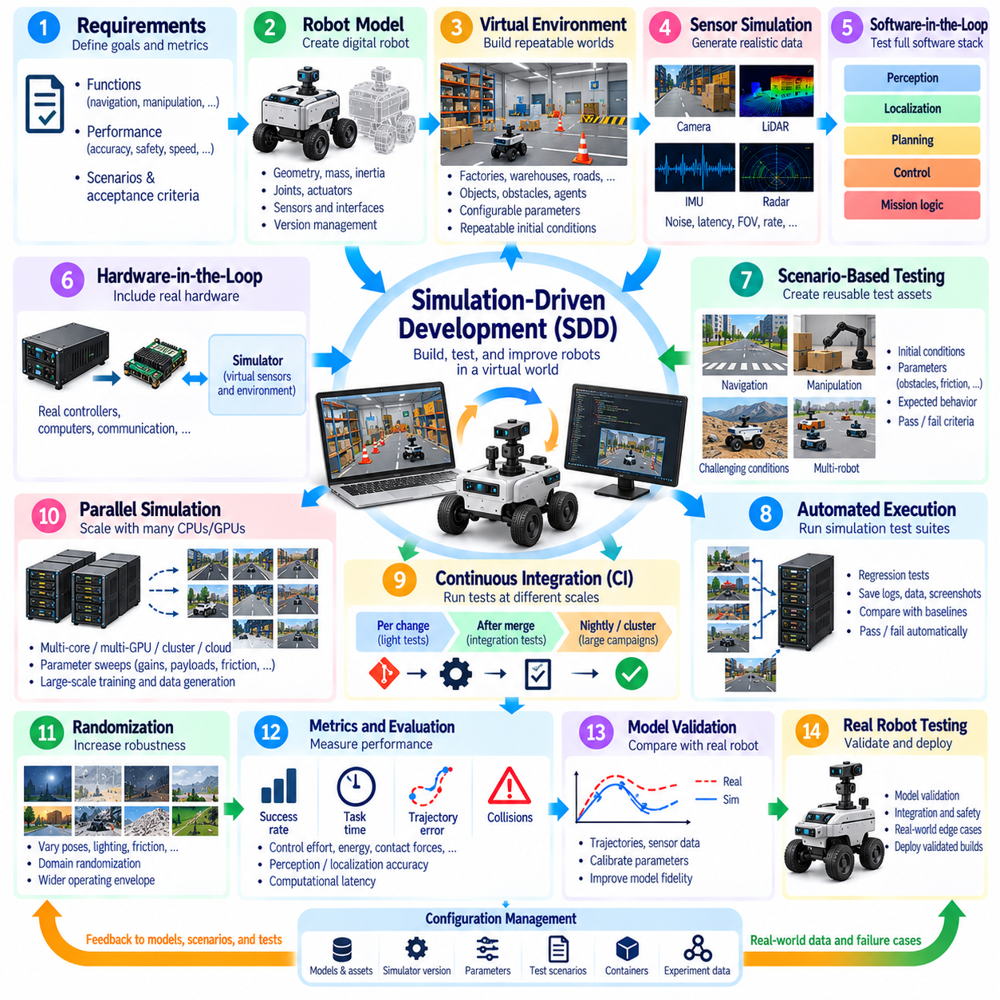

**Volume 11. Simulation and Digital Twin**

# Chapter 01. Simulation Fundamentals

## 01.01. Role of Simulation in Robot Development Lifecycle

{width="7.268055555555556in" height="7.268055555555556in"}

Simulation plays a foundational role throughout the robot development lifecycle because robotic systems combine mechanical structures, electronics, sensors, actuators, control software, perception algorithms, and artificial intelligence. Testing all of these elements directly on physical hardware is expensive and slow. Simulation provides a virtual environment in which engineers can design, integrate, test, and refine the complete robotic system before committing every change to hardware.

In early development, simulation supports concept exploration before detailed mechanical or electrical designs are finalized. Engineers can construct simplified representations of a mobile robot, manipulator, quadruped, humanoid, or UAV and examine basic behaviors such as mobility, workspace, stability, turning radius, payload effects, and actuator requirements. This allows unsuitable architectures to be rejected early, when design modifications are relatively inexpensive and have limited impact on downstream development.

As the design matures, simulation becomes a quantitative engineering tool rather than merely a visualization environment. Robot geometry, mass, inertia, joints, actuators, friction, contact properties, and environmental constraints can be represented through mathematical and physics-based models. Engineers can then evaluate whether control algorithms and mechanical parameters produce acceptable behavior under realistic operating conditions while progressively increasing simulation fidelity as development requirements become more demanding.

Simulation is particularly valuable for software development because robot software can often be developed before complete hardware becomes available. Localization, mapping, perception, navigation, trajectory planning, manipulation, and supervisory software can interact with simulated sensors and actuators through interfaces resembling those of the real robot. The development team can therefore begin system integration earlier and reduce the dependency between software progress and physical prototype availability.

Another important function is repeatable testing. Physical experiments are affected by changing environments, hardware wear, battery condition, operator behavior, and many other uncontrolled factors. A simulator can reproduce the same initial state, environmental configuration, robot parameters, and test sequence repeatedly. This repeatability enables engineers to compare software revisions objectively, reproduce failures, perform regression testing, and determine whether an algorithmic modification actually improves system behavior.

Simulation also makes hazardous and destructive scenarios practical to investigate. A real robot may be damaged when testing excessive slopes, high-speed collisions, unstable manipulation, actuator saturation, extreme payloads, or controller failures. Some conditions may also create risks for nearby personnel. Virtual experiments allow these situations to be explored without damaging expensive prototypes, although successful simulation results must never be treated as a complete substitute for physical safety validation.

The role of simulation expands substantially when perception systems are introduced. Virtual cameras, depth sensors, LiDAR, radar, IMUs, GNSS receivers, force sensors, and other devices can generate observations from modeled environments. Sensor characteristics such as noise, bias, drift, resolution, field of view, synchronization, atmospheric effects, and rendering fidelity can then be incorporated progressively. The broader simulation structure therefore separates fundamental simulation concepts from dedicated sensor simulation and environment modeling topics.

For autonomous robots, simulation provides a scalable method for evaluating interactions between perception, localization, planning, and control. Thousands of scenarios can represent different obstacle arrangements, pedestrian movements, terrain conditions, illumination states, sensor disturbances, or navigation goals. Automated scenario execution can expose rare combinations that would be difficult to reproduce deliberately in field tests, making simulation particularly useful for robustness testing and systematic exploration of operational boundaries.

Simulation is equally important for learning-based robotics. Reinforcement learning and other data-intensive methods may require millions or billions of interactions, making direct collection on physical robots impractical. Parallel simulation can execute many virtual environments simultaneously and accelerate experience generation. Synthetic observations and demonstrations can also supplement real datasets, while controlled variation of textures, lighting, geometry, dynamics, and sensor characteristics helps expose learning systems to broader operating distributions.

However, simulation effectiveness depends on recognizing the difference between the simulated system and the physical system. Incorrect inertia, friction, actuator dynamics, contact behavior, sensor noise, communication delay, or environmental appearance can cause algorithms that perform well virtually to fail on real hardware. This discrepancy is commonly addressed through system identification, calibration, domain randomization, Real-to-Sim matching, and Sim-to-Real evaluation rather than by assuming that greater visual realism automatically produces greater engineering validity.

Hardware-in-the-Loop and Software-in-the-Loop approaches extend simulation into system integration. In Software-in-the-Loop testing, production software operates against simulated robot components and environments. Hardware-in-the-Loop testing introduces real controllers, embedded computers, communication interfaces, or other physical components while the remaining system is simulated. These intermediate stages create a controlled progression from purely virtual development toward complete physical validation and can expose timing, interface, and integration problems earlier.

Simulation also supports continuous integration and continuous validation. Whenever developers modify control, navigation, perception, or middleware software, automated simulation scenarios can execute predefined tests and compare results against acceptance criteria. Failures can prevent problematic software from progressing toward deployment. This transforms simulation from an occasional engineering activity into part of the software delivery pipeline, complementing unit tests with system-level behavioral validation.

The lifecycle role of simulation does not end when a robot enters service. Models created during development can evolve toward digital twins that receive information from physical robots and represent their operational state. Such systems can support state visualization, what-if analysis, fleet analytics, and predictive maintenance. The project structure therefore treats simulation fundamentals as the foundation for later digital-twin concepts including real-time state mirroring, predictive simulation, fleet-level aggregation, and maintenance applications.

A mature robot development process therefore uses simulation at multiple fidelity levels rather than attempting to build one universally detailed model. Lightweight kinematic models are appropriate for some planning and architectural questions, dynamic models become necessary for forces and motion, sensor models support perception development, and high-fidelity environments address more demanding validation or learning tasks. Selecting fidelity according to the engineering question preserves computational efficiency while maintaining sufficient realism for meaningful conclusions.

Simulation and physical testing should consequently form a continuous feedback loop. Parameters measured from prototypes improve virtual models, simulation identifies conditions requiring physical experiments, field failures generate new virtual regression scenarios, and simulation results guide subsequent hardware and software revisions. This iterative Real-to-Sim-to-Real process gradually improves both the robot and the models used to understand it, rather than treating virtual and physical development as separate engineering activities.

Within a complete robotics software architecture, simulation connects many otherwise separate disciplines, including control, ROS 2 middleware, data architecture, autonomous driving, SLAM, perception, navigation, robot learning, manipulation, and system validation. The surrounding curriculum reflects this relationship by positioning Simulation and Digital Twin alongside these major software domains rather than treating simulation as an isolated visualization utility.

Ultimately, the purpose of simulation is not to eliminate physical prototypes or field testing. Its role is to move learning, integration, failure discovery, and design iteration earlier in the lifecycle while making those activities safer, faster, more repeatable, and more scalable. A simulation-driven robot development lifecycle combines virtual experiments, automated validation, hardware integration, field measurements, and continuous model refinement so that physical testing is focused on the uncertainties that genuinely require the real world.

## 01.02. Simulation Fidelity Levels Kinematics Dynamics Sensor

{width="7.268055555555556in" height="7.268055555555556in"}

Simulation fidelity describes how closely a virtual model reproduces the aspects of a physical robot and its environment that matter for a particular engineering task. Fidelity is not a single measure of realism. A simulation may accurately reproduce robot geometry while simplifying actuator dynamics, or provide realistic sensor images while using approximate contact physics. Effective simulation therefore begins by identifying which physical behaviors must be represented accurately.

A useful fidelity hierarchy begins with geometric and kinematic simulation. At this level, the robot is represented through links, joints, coordinate frames, dimensions, and motion constraints without explicitly calculating the forces that generate motion. Joint positions, velocities, forward kinematics, inverse kinematics, reachable workspace, collision geometry, and basic vehicle trajectories can be evaluated efficiently. This level is particularly suitable for early architecture studies and motion-planning development.

Kinematic simulation is computationally inexpensive because it can prescribe motion directly rather than solving the complete equations of motion. For an AMR, a differential-drive or Ackermann model can predict position and heading from commanded wheel or steering motion. For a manipulator, joint configurations can be transformed into end-effector poses. However, such models cannot accurately predict wheel slip, acceleration limits, contact forces, structural loading, or actuator saturation.

Dynamic simulation introduces mass, inertia, force, torque, gravity, friction, damping, compliance, and actuator behavior. Instead of determining only where a robot moves, the simulator calculates how forces produce acceleration and how the system evolves over time. Rigid-body dynamics therefore becomes essential when evaluating stability, locomotion, manipulation, suspension behavior, high-speed motion, collision response, or controllers whose performance depends strongly on physical interactions.

The transition from kinematic to dynamic fidelity significantly increases modeling requirements. Accurate mass distribution and inertia tensors become important, while joint friction, gearbox characteristics, motor torque limits, wheel-ground interaction, damping, and mechanical compliance may also influence results. Incorrect physical parameters can produce apparently plausible motion while generating misleading engineering conclusions. Higher fidelity is useful only when the underlying model parameters are sufficiently accurate for the intended analysis.

Contact and collision modeling forms another major dimension of physical fidelity. A simulator must determine when geometries intersect and calculate appropriate contact forces or constraints. Friction coefficients, restitution, penetration tolerance, solver configuration, contact stiffness, and numerical stabilization can strongly influence simulated behavior. These effects become especially important for grasping, legged locomotion, wheel-terrain interaction, object manipulation, and robots operating on uneven surfaces.

Sensor fidelity is different from mechanical fidelity because it concerns how the robot observes its virtual environment. A low-fidelity sensor may provide ideal geometric measurements without noise or latency, while a higher-fidelity model may reproduce resolution, field of view, measurement uncertainty, bias, drift, distortion, occlusion, synchronization errors, and environmental interference. Sensor fidelity should therefore be selected independently from the fidelity of robot dynamics.

Camera simulation can range from simple geometric projection to photorealistic rendering. Basic models are sufficient for checking camera placement, visibility, and field of view. More advanced perception development may require realistic materials, textures, shadows, illumination, lens distortion, motion blur, depth characteristics, and environmental variation. Ray tracing and physically based rendering can further improve visual realism, but their computational cost may be unnecessary for algorithms that depend primarily on geometry.

LiDAR simulation similarly ranges from ideal range measurements to detailed point-cloud generation. Higher-fidelity models can represent beam patterns, angular resolution, minimum and maximum range, measurement noise, surface reflectivity, missed returns, multi-path effects, and motion-related distortion. Radar, IMU, GNSS, force-torque, and tactile sensors require different error models because their physical measurement principles and dominant sources of uncertainty differ substantially.

Temporal fidelity is another critical consideration. Real robotic systems contain sampling periods, communication delays, actuator response times, sensor exposure intervals, timestamp errors, and asynchronous data streams. A simulation that reproduces geometry and physics accurately but assumes instantaneous communication may produce unrealistic controller or sensor-fusion performance. Simulation time step, numerical integration, sensor update frequency, and software scheduling therefore influence overall system fidelity.

Environmental fidelity determines how accurately the operating world is represented. Indoor environments may require walls, racks, doors, floors, humans, and movable objects, while outdoor robots may require roads, slopes, curbs, vegetation, terrain deformation, weather, and changing illumination. UAV simulation introduces airspace, wind, aerodynamic effects, and three-dimensional obstacles. The required detail depends on whether the objective is navigation, control, perception, safety evaluation, or learning.

High fidelity does not always mean that every element must be modeled in maximum detail. A navigation planner may require accurate geometry and obstacle motion while needing only simplified vehicle dynamics. Suspension development may demand detailed wheel-terrain physics but little visual realism. Perception training may require sophisticated rendering and sensor characteristics while using relatively simple robot dynamics. Fidelity should therefore be treated as a multidimensional engineering configuration rather than a universal quality setting.

Increasing fidelity normally increases computational cost. Detailed collision meshes, small integration time steps, complex contact solvers, high-resolution cameras, dense LiDAR ray casting, deformable materials, and photorealistic rendering can substantially reduce simulation speed. This creates a tradeoff among accuracy, execution speed, scalability, and cost. A simulator used for interactive engineering may prioritize real-time execution, while reinforcement-learning infrastructure may prioritize thousands of parallel environments.

A practical development strategy is progressive fidelity. Engineers can begin with simple kinematic models to validate architecture, coordinate systems, interfaces, and basic algorithms. Dynamic properties can then be introduced when force-dependent behavior becomes important, followed by more realistic actuator, contact, sensor, and environmental models. This progression prevents development teams from paying the computational and modeling cost of high fidelity before the corresponding accuracy is actually required.

Validation against real measurements is necessary to determine whether additional fidelity produces useful accuracy. Robot trajectories, joint responses, acceleration, motor behavior, stopping distance, sensor noise, latency, and contact behavior can be measured experimentally and compared with simulation. Differences reveal which parameters require calibration or which physical effects are missing. Fidelity is therefore meaningful only when it can be related to observable behavior of the physical system.

For Sim-to-Real transfer, the objective is not necessarily to create a perfect digital copy of reality. Some parameters can be calibrated precisely, while uncertain parameters can intentionally vary across plausible ranges through domain randomization. Training or validating across these variations can produce algorithms that are less dependent on one exact virtual model. High nominal accuracy and controlled variability can therefore complement each other rather than representing competing simulation strategies.

Simulation fidelity should ultimately be selected according to the engineering question, required accuracy, available computation, and development stage. Kinematic fidelity provides efficient geometric reasoning, dynamic fidelity represents force-driven physical behavior, sensor fidelity reproduces observation processes, and environmental and temporal fidelity provide operational context. Combining these levels deliberately creates simulations that are sufficiently realistic for their purpose without becoming unnecessarily complex or computationally expensive.

## 01.03. Simulation Time Step Stability and Numerical Integration

{width="7.268055555555556in" height="7.268055555555556in"}

Simulation time step is one of the most important numerical parameters in robot simulation because continuous physical motion must be approximated by calculations performed at discrete moments. The time step, commonly written as Δt, determines how far simulation time advances during each physics update. A smaller step usually captures rapid motion and contact more accurately, while a larger step reduces computation but increases numerical error and the possibility of unstable behavior.

A physical robot evolves continuously according to differential equations describing position, velocity, acceleration, forces, and other states. A digital simulator cannot generally solve these equations continuously, so it estimates the next system state from the current state at regular intervals. Numerical integration is the mathematical process used for this transition. Consequently, simulation accuracy depends not only on the physical model but also on the integration algorithm and selected time step.

The simplest integration method is explicit Euler integration. It estimates the next state using derivatives evaluated at the current state, making the method computationally inexpensive and straightforward to implement. However, explicit Euler can accumulate substantial error and may become unstable when the time step is too large, particularly in systems containing stiff springs, high-frequency dynamics, fast actuators, or strong contact forces. Its simplicity therefore comes with significant stability limitations.

Semi-implicit Euler, also called symplectic Euler in many simulation contexts, updates velocity before using the updated velocity to calculate position. This small structural change often provides better stability for mechanical systems while retaining low computational cost. For this reason, variants of semi-implicit integration are widely useful in real-time rigid-body simulation, where thousands of bodies, joints, constraints, and contacts may need to be evaluated repeatedly within limited computational budgets.

Higher-order methods can provide improved numerical accuracy. Runge-Kutta methods evaluate system derivatives at multiple intermediate points during each integration interval and combine these estimates to calculate the next state. The fourth-order Runge-Kutta method, commonly called RK4, can achieve substantially lower integration error than basic Euler methods for smooth dynamics. The trade-off is increased computation because several derivative evaluations are required for every simulation step.

Implicit integration methods address another important problem: numerical stiffness. A stiff system contains dynamics operating at significantly different time scales, such as rigid contacts combined with compliant components or high-gain controllers interacting with mechanical structures. Explicit methods may require extremely small time steps to remain stable. Implicit methods evaluate equations using information associated with the future state, improving stability but requiring more complex numerical solution procedures.

Time-step selection therefore represents a balance between accuracy, stability, and computational performance. If Δt is excessively large, fast physical events may be skipped or poorly represented, producing oscillation, penetration, energy growth, inaccurate trajectories, or complete numerical divergence. If Δt is unnecessarily small, simulation may become extremely slow without providing meaningful improvements for the engineering objective. The appropriate value depends on the fastest relevant dynamics in the modeled system.

Contact-rich robotics makes time-step selection especially difficult. During wheel-ground contact, grasping, walking, collision, or manipulation, forces can change rapidly over short intervals. A large time step may allow objects to penetrate deeply before collision constraints are resolved or may miss brief contacts entirely. Smaller steps, improved contact solvers, constraint stabilization, and appropriate stiffness and damping parameters are often required to maintain realistic and numerically stable interactions.

Robot controllers introduce additional timing considerations. A physics engine might update dynamics at a high frequency while the controller operates at a lower frequency. For example, several physics steps may occur between two control updates. Sensors may also operate at independent rates. Maintaining explicit relationships among physics frequency, control frequency, and sensor frequency is important because unrealistic synchronization can make a controller appear more stable or responsive than it would be on physical hardware.

Fixed-step simulation uses the same Δt for every physics update. This approach provides deterministic timing and is particularly useful for robotics testing, reinforcement learning, regression testing, and reproducible experiments. Given identical initial conditions and deterministic components, repeated simulations can follow the same numerical sequence. Fixed stepping also simplifies synchronization among physics, controllers, sensors, logging systems, and middleware such as ROS 2.

Variable-step integration adjusts the time step according to estimated numerical error or changes in system dynamics. Large steps can be used when the system evolves slowly, while smaller steps are selected during rapid transitions. This can improve computational efficiency in some scientific simulations. However, variable timing complicates deterministic execution, real-time synchronization, controller scheduling, and sensor timing, making fixed-step approaches particularly common in interactive and robotics-oriented physics simulation.

Real-time simulation introduces another distinction between simulation time and wall-clock time. A simulator running with a 1 ms physics step does not necessarily complete each step in 1 ms of real time. If computation is faster than the required rate, the simulator may run faster than real time; if rendering or physics calculations become expensive, it may run slower. Real-time factor expresses this relationship and is an important performance metric when software must interact synchronously with external systems.

Substepping provides a practical compromise when the application requires a relatively coarse external update interval but internal physics requires finer resolution. A simulator may divide one application frame into several smaller physics steps. Controllers or visualization systems can continue operating at their intended rates while contact and dynamics calculations use smaller internal intervals. Substepping is particularly useful for high-speed motion, stiff constraints, legged locomotion, and complex collision scenarios.

Numerical stability should not be confused with physical accuracy. A simulation can remain numerically stable while representing the real robot incorrectly because mass, inertia, friction, actuator dynamics, or contact parameters are inaccurate. Conversely, an accurate physical model can behave poorly when integrated with an unsuitable numerical method or excessively large time step. Reliable simulation therefore requires both appropriate model fidelity and appropriate numerical configuration.

Energy behavior provides a useful indication of integration quality. Numerical methods may artificially add or remove energy from a simulated mechanical system. Artificial energy growth can cause oscillations to increase until the system becomes unstable, while excessive numerical damping can make motion unrealistically sluggish. Monitoring kinetic energy, potential energy, joint behavior, constraint errors, and contact responses can help identify integration problems that may not be obvious from visual inspection alone.

A practical method for selecting the time step is convergence testing. The same scenario is executed repeatedly using progressively smaller time steps, and important outputs such as trajectory, velocity, contact force, stopping distance, joint response, or energy are compared. When further reduction of Δt produces only negligible changes in the quantities relevant to the engineering task, the simulation has reached a useful numerical resolution for that particular application.

The required time step also varies with robot type. Slowly moving indoor AMRs can often tolerate coarser dynamic resolution than high-speed UAVs, highly compliant manipulators, quadrupeds experiencing repeated foot impacts, or humanoids maintaining dynamic balance. Consequently, a single universal time step should not be assumed for all robotic systems. Numerical settings must reflect the dominant frequencies, contact conditions, controller bandwidth, and validation objectives of each platform.

Large-scale parallel simulation introduces an additional trade-off because even a small increase in computational cost per step becomes significant when thousands of environments execute simultaneously. Reinforcement-learning systems may intentionally simplify dynamics or select relatively large stable steps to maximize simulation throughput. Techniques such as decoupled rendering, GPU physics, vectorized computation, and controlled substepping can preserve essential dynamic behavior while maintaining high experience-generation rates.

Ultimately, simulation time step, numerical integration, and stability form a tightly connected engineering problem. The objective is not simply to choose the smallest possible Δt or the most sophisticated integrator, but to achieve sufficient numerical accuracy and stable physical behavior at an acceptable computational cost. Careful time-scale analysis, synchronization, substepping, convergence testing, and comparison with real measurements allow simulation to become a reliable foundation for robot control, learning, validation, and Sim-to-Real development.

## 01.04. Rigid Body Dynamics Theory for Robot Simulation

{width="7.268055555555556in" height="7.268055555555556in"}

Rigid-body dynamics provides the mathematical foundation for representing the motion of robots whose mechanical components can be approximated as solid bodies that do not deform under applied forces. Most robot simulation systems model chassis, links, wheels, manipulators, legs, and payloads as interconnected rigid bodies. This approximation greatly reduces computational complexity while preserving the dominant mechanical behavior required for control, locomotion, manipulation, and system-level simulation.

A rigid body has six degrees of freedom in three-dimensional space: three translational coordinates and three rotational coordinates. Its configuration can therefore be described by the position of a reference point, usually the center of mass, together with its orientation. Position is commonly represented by a three-dimensional vector, while orientation may be represented using rotation matrices, Euler angles, or quaternions depending on numerical and software requirements.

Translational motion follows Newton\'s second law, which relates the total external force acting on a body to its mass and linear acceleration. Conceptually, the relationship is expressed as F = ma. External forces may include gravity, actuator forces, contact reactions, aerodynamic forces, friction, and forces transmitted through joints. By integrating acceleration over time, the simulator obtains velocity and position, allowing the rigid body to move through the virtual environment.

Rotational motion follows the corresponding angular dynamics described by Euler\'s equations. Torque produces angular acceleration according to the body\'s inertia properties, but rotational dynamics are more complex than translational motion because the moment of inertia depends on mass distribution and orientation. The inertia tensor represents resistance to angular acceleration around different axes and therefore becomes one of the most important physical parameters in accurate robot simulation.

The center of mass and inertia tensor must be defined consistently with the geometry and coordinate frame of each rigid body. Two robot links with identical mass can exhibit very different rotational responses if their mass distributions differ. CAD models are often used to estimate mass properties, but imported values should be checked carefully because incorrect units, simplified geometry, missing components, or inappropriate coordinate transformations can produce unrealistic dynamic behavior.

A robot normally consists of multiple rigid bodies connected through joints. Revolute joints permit rotation around an axis, prismatic joints permit translation, and fixed joints constrain relative motion completely. More complex mechanisms may use spherical, planar, universal, or compound joint representations. These constraints transform a collection of independent rigid bodies into an articulated multibody system whose motion is governed jointly by body dynamics and kinematic relationships.

Generalized coordinates provide a compact representation of articulated robot configuration. Instead of describing every link independently using six coordinates, the system can be represented using joint variables such as angles and displacements. The vector q typically represents generalized position, while q̇ and q̈ represent generalized velocity and acceleration. This formulation allows robot dynamics to be expressed efficiently in terms of the actual controllable degrees of freedom.

A common equation for articulated robot dynamics is M(q)q̈ + C(q,q̇)q̇ + g(q) = τ, with additional terms introduced for contact, friction, external forces, or constraints. M represents the configuration-dependent mass matrix, C captures Coriolis and centrifugal effects, g represents gravitational effects, and τ represents generalized actuator forces or torques. This equation forms a conceptual bridge between theoretical mechanics, robot control, and physics-engine implementation.

Forward dynamics calculates acceleration from the current robot state and applied forces or torques. Given q, q̇, and τ, the simulator determines q̈ and integrates the result forward in time. This is the typical operation required during physics simulation because controllers generate commands and the simulator predicts resulting motion. Efficient forward-dynamics algorithms become especially important for robots containing many articulated degrees of freedom.

Inverse dynamics solves the complementary problem. Given desired positions, velocities, and accelerations, it determines the forces or torques required to produce that motion. Inverse dynamics is widely used in robot control, trajectory tracking, model-based control, and actuator analysis. Comparing inverse-dynamics predictions with simulated or measured actuator loads can also help identify modeling errors and determine whether motors and transmissions are appropriately sized.

Gravity is a simple but fundamental external force. Each rigid body experiences gravitational loading according to its mass, while the resulting joint torques depend on configuration and center-of-mass location. Gravity compensation is therefore important for manipulators and humanoids, while the combined center of mass strongly affects the stability of mobile and legged robots. Incorrect gravity direction, magnitude, or mass distribution can invalidate otherwise sophisticated simulations.

Constraints are central to multibody simulation because joints, contacts, and mechanical structures restrict possible motion. Physics engines may formulate these relationships as algebraic constraints combined with differential equations. Constraint solvers then calculate reaction forces or impulses that prevent prohibited motion. Numerical drift can gradually violate constraints, so stabilization techniques are often employed to maintain joint alignment and physically plausible configurations.

Contact introduces discontinuous interactions into otherwise smooth rigid-body dynamics. When a wheel touches the ground, a manipulator grasps an object, or a robot collides with an obstacle, the simulator must detect contact and calculate normal and tangential responses. Normal forces prevent penetration, while friction generates tangential forces opposing relative motion. Contact modeling therefore links rigid-body dynamics directly to collision detection and numerical constraint solving.

Friction has a particularly strong influence on robot behavior. Wheel traction, braking, turning, grasp stability, foot contact, and object manipulation all depend on frictional interaction. The Coulomb friction model is frequently used as a practical approximation, although real surfaces exhibit more complicated behavior including static friction, dynamic friction, velocity dependence, deformation, and anisotropy. Simulation parameters should therefore be calibrated against the behavior relevant to the target robot.

Actuators connect control software to rigid-body dynamics. Motors may be represented as ideal torque sources in simple simulations, while higher-fidelity models include torque-speed limits, gear ratios, efficiency, damping, backlash, compliance, current limits, and response delay. The actuator model determines how commanded control signals become physical forces and torques, making it critical when simulation is used for controller tuning or Sim-to-Real transfer.

Energy and momentum provide useful physical consistency checks. In an isolated ideal rigid-body system, linear momentum, angular momentum, and mechanical energy follow conservation principles. Contacts, friction, damping, actuators, and numerical integration modify these quantities in predictable ways. Unexpected energy growth, unrealistic momentum changes, or persistent oscillations can indicate incorrect parameters, unstable integration, constraint errors, or unsuitable contact settings.

Different robot classes emphasize different aspects of rigid-body dynamics. AMRs require accurate chassis, wheel, steering, suspension, and ground-contact behavior. Manipulators emphasize articulated-link inertia and actuator torque. Quadrupeds and humanoids require accurate multibody dynamics and rapidly changing contacts, while UAVs combine rigid-body motion with aerodynamic forces and propulsion. The underlying theory remains common even though the dominant physical effects differ.

Rigid-body models intentionally ignore structural deformation unless compliance is explicitly introduced through joints, springs, dampers, or specialized deformable-body models. This assumption is appropriate when deformation has limited influence on the behavior being studied. Flexible links, tires, soft grippers, cables, fabrics, and highly compliant mechanisms may require additional modeling techniques when deformation becomes essential to control, contact, sensing, or structural performance.

Reliable rigid-body simulation ultimately depends on the combination of correct mechanics, accurate physical parameters, appropriate constraints, stable numerical integration, and validation against real measurements. The mathematical model defines how forces and torques produce motion, while the physics engine transforms these principles into computational algorithms. Understanding this foundation makes it possible to diagnose unrealistic behavior rather than treating the simulator as an opaque system, and prepares the basis for advanced articulated-body algorithms, contact modeling, and high-fidelity robot simulation.

## 01.05. Articulated Body Algorithm ABA and RNEA Principles

{width="7.268055555555556in" height="7.268055555555556in"}

The Articulated-Body Algorithm (ABA) and Recursive Newton-Euler Algorithm (RNEA) are fundamental computational methods for multibody robot dynamics. Both exploit the tree structure of articulated mechanisms instead of treating the robot as one large unconstrained system. This recursive viewpoint is especially important for manipulators, quadrupeds, humanoids, and other robots containing many connected links because it enables efficient calculation of motion, forces, and joint torques.

ABA primarily solves the forward-dynamics problem. Given the robot configuration q, generalized velocity q̇, and applied joint torques τ, it computes the resulting generalized acceleration q̈. Conceptually, ABA evaluates q̈ = f(q,q̇,τ), including the influence of link inertia, Coriolis and centrifugal effects, gravity, and external forces. The calculated acceleration can then be integrated numerically to update velocity and position during physics simulation.

RNEA addresses the complementary inverse-dynamics problem. Given q, q̇, and a desired or known q̈, it calculates the generalized forces or joint torques required to generate that motion. Its conceptual relationship can be written as τ = f(q,q̇,q̈). This makes RNEA particularly useful for model-based control, trajectory tracking, actuator load estimation, feedforward torque calculation, system analysis, and verification of dynamic models.

Both algorithms become easier to understand through the concept of a kinematic tree. A robot consists of a base and links connected through joints, forming parent-child relationships. Information can therefore propagate recursively from the base toward the leaves and then return toward the base. Instead of constructing and solving every interaction globally, recursive algorithms reuse intermediate quantities along this structure, significantly improving computational efficiency for large articulated systems.

Spatial vector algebra provides a compact mathematical framework for implementing these algorithms. Linear and angular motion can be combined into six-dimensional spatial velocity and acceleration vectors, while forces and moments can be represented together as spatial force vectors. Spatial inertia matrices similarly describe the mass, center of mass, and rotational inertia of each rigid body. This unified representation simplifies transformations and recursive calculations across connected coordinate frames.

RNEA is commonly described using two recursive passes. During the outward or forward pass, the algorithm travels from the base toward the end links and calculates link velocities and accelerations using joint states and parent-link motion. During the inward or backward pass, it propagates forces from child links toward their parents. Projecting these forces onto each joint motion subspace produces the generalized torque required at that joint.

Gravity can be incorporated into RNEA through the base acceleration or as an equivalent external effect. External forces applied to individual links can also be included during the force recursion. Consequently, the resulting joint torque represents the combined requirement associated with inertia, gravity, velocity-dependent effects, and external loading. This allows the same computational framework to support both theoretical inverse dynamics and realistic robot control calculations.

ABA requires a more involved recursion because forward dynamics must determine acceleration from applied torque without explicitly solving the full joint-space dynamics equation whenever possible. The algorithm introduces articulated-body inertia, which represents the effective dynamic influence of a link together with its descendants. This information is propagated through the mechanism so that each joint acceleration can be determined while accounting for the coupled behavior of the entire articulated subtree.

A typical ABA computation can be interpreted as three recursive stages. The first outward pass calculates spatial velocities, bias accelerations, and velocity-dependent terms. An inward pass then propagates articulated inertia and bias forces from the leaves toward the base. A final outward pass computes joint accelerations and link accelerations. Although implementations differ in notation, this recursive structure captures the central principle of ABA.

The distinction between rigid-body inertia and articulated-body inertia is important. Rigid-body inertia describes the mass properties of one individual link. Articulated-body inertia represents how an entire connected subtree responds dynamically when observed through a particular joint or parent body. By recursively combining the dynamic influence of descendants, ABA avoids repeatedly forming and directly inverting the complete joint-space mass matrix during ordinary forward-dynamics evaluation.

This efficiency becomes increasingly important as robot complexity grows. A straightforward formulation of forward dynamics may construct the mass matrix M(q) and solve M(q)q̈ = τ - C(q,q̇)q̇ - g(q). Such an approach is mathematically valid, but direct matrix operations can become expensive for systems with many degrees of freedom. ABA exploits articulated structure and can achieve computational complexity that scales linearly with the number of joints for tree-structured mechanisms.

RNEA also has linear computational complexity for ordinary tree-structured robots because each link is processed through a limited set of operations during the outward and inward recursions. This makes inverse dynamics practical at high control frequencies. A controller can calculate feedforward torques from a desired trajectory and combine them with feedback terms, allowing the commanded actuator effort to account explicitly for the robot\'s changing inertia, gravity, and dynamic coupling.

ABA and RNEA are closely related to the standard manipulator equation M(q)q̈ + C(q,q̇)q̇ + g(q) = τ. RNEA evaluates the torque side when acceleration is known, whereas ABA determines acceleration when torque is known. They therefore solve complementary forms of the same underlying rigid-body mechanics. Understanding this relationship helps connect compact textbook equations with the recursive algorithms actually used in robotics software and simulation engines.

The algorithms must also account for different base conditions. A fixed-base manipulator has a base rigidly attached to the environment, while a floating-base robot such as a quadruped, humanoid, UAV, or free-moving platform possesses additional unactuated base degrees of freedom. Floating-base dynamics requires the base motion to participate in the recursion, making momentum, external contact forces, and whole-body coupling particularly important for locomotion and balance.

Tree structures are naturally suited to ABA and RNEA, but closed kinematic loops require additional treatment. Parallel mechanisms, four-bar linkages, certain suspension systems, and robots containing mechanically closed chains introduce constraints that cannot be represented as a simple parent-child tree without modification. Simulation frameworks may break loops computationally and enforce closure using constraint equations, Lagrange multipliers, impulses, or specialized constrained-dynamics algorithms.

Contact forces also extend the basic algorithms. During manipulation or locomotion, external forces from the environment can be introduced into link dynamics, but unknown contact forces require additional contact or constraint solving. For a quadruped, for example, ABA can compute articulated motion while a contact solver determines forces that prevent supporting feet from penetrating the ground. The complete simulation therefore combines multibody dynamics with collision detection and constraint resolution.

Numerical implementation requires careful treatment of coordinate frames, joint conventions, inertia parameters, and spatial transformations. A sign error, incorrect joint axis, inconsistent inertia frame, or inaccurate center of mass can propagate through recursive calculations and produce unrealistic forces or accelerations. Unit tests using simple mechanisms, comparison with analytical solutions, and cross-checking ABA and RNEA relationships are valuable methods for verifying an implementation.

In practical robot simulation, ABA is especially valuable when actuator torques must produce physically consistent motion at every simulation step, while RNEA is valuable when the required actuator effort for a specified motion must be determined. Modern robotics libraries and physics systems may combine these algorithms with Jacobian calculations, contact solvers, numerical integration, optimization, and control methods to construct complete dynamic simulation and whole-body control pipelines.

Together, ABA and RNEA demonstrate a central principle of computational robotics: mechanical structure should be exploited rather than ignored. By propagating motion and force information recursively through articulated links, they transform multibody dynamics from a potentially expensive global calculation into an efficient structured computation. Their principles provide an essential foundation for high-performance robot simulation, model-based control, legged locomotion, manipulation, and advanced whole-body dynamics.

## 01.06. Contact and Collision Modeling in Simulation

{width="7.268055555555556in" height="7.268055555555556in"}

Contact and collision modeling determines how simulated robots physically interact with terrain, objects, infrastructure, and other robots. Rigid-body dynamics can describe free motion accurately, but realistic robot simulation also requires a mechanism for detecting when bodies touch and calculating the forces or impulses generated by that interaction. Contact modeling therefore connects geometric collision detection with physical constraint solving and strongly influences the realism and stability of simulation.

Collision handling is commonly divided into collision detection and collision response. Collision detection determines whether two geometric bodies intersect or approach closely enough to establish contact. Collision response then determines how the bodies should react physically. Separating these stages allows efficient geometric algorithms to identify potential contacts before more expensive dynamics calculations are performed only for the interactions that actually matter.

Broad-phase collision detection rapidly eliminates pairs of objects that are unlikely to collide. Instead of performing detailed geometric tests between every possible pair, the simulator uses simplified spatial representations such as axis-aligned bounding boxes, bounding-volume hierarchies, spatial grids, sweep-and-prune methods, or other acceleration structures. This stage becomes essential when environments contain hundreds or thousands of objects because exhaustive pairwise checking would be computationally expensive.

Narrow-phase collision detection performs detailed tests on the candidate pairs produced by the broad phase. It determines whether the actual collision geometries intersect and calculates information such as contact points, penetration depth, surface normals, and sometimes separation distance. Primitive shapes such as spheres, boxes, capsules, cylinders, and convex hulls are computationally efficient, while detailed triangle meshes provide more geometric fidelity at greater computational cost.

Collision geometry should therefore be distinguished from visual geometry. A robot may use a detailed mesh for rendering while employing simplified convex shapes for collision calculations. This approach reduces computational cost and often improves numerical robustness without significantly affecting the physical behavior relevant to the simulation. Excessively detailed collision meshes can create many unstable contact points, increase solver workload, and make real-time simulation unnecessarily difficult.

Once contact is detected, the simulator must prevent physically impossible interpenetration. One approach treats contact as a constraint that restricts relative motion along the surface normal. A constraint solver computes forces or impulses required to satisfy this condition. Another approach uses compliant contact models in which small penetration generates restoring forces based on stiffness and damping. Physics engines may use either approach or combine elements of both depending on their numerical architecture.

Constraint-based contact is often described as hard contact because bodies are intended to remain nonpenetrating. The solver determines normal reactions that prevent motion into the contacting surface while permitting separation. Because exact enforcement can be numerically difficult, practical engines allow small tolerances and use stabilization techniques. Solver iteration count, error reduction, penetration tolerance, and time step can therefore influence the apparent rigidity of contact.

Penalty-based contact instead represents the interaction using virtual springs and dampers. When two bodies penetrate slightly, penetration depth generates a restoring force, while relative velocity contributes damping. Increasing stiffness reduces visible penetration but can create numerically stiff equations requiring smaller simulation time steps. Excessive damping can suppress realistic motion, whereas insufficient damping may produce bouncing or persistent oscillation after contact.

The surface normal determines the direction of normal contact force, but realistic interaction also requires tangential behavior. Friction resists relative motion along the contact surface and is critical for mobile robots, manipulators, legged robots, and object handling. Without appropriate friction, wheels may slide instead of generating traction, grasped objects may fall, robot feet may slip, and braking or steering behavior may differ substantially from the physical system.

Coulomb friction is widely used as a practical model. It limits tangential friction force according to the normal force and a friction coefficient. Static friction attempts to prevent relative motion up to a threshold, while kinetic or dynamic friction acts after sliding begins. Real materials are more complicated, and friction may depend on velocity, temperature, surface condition, deformation, direction, or contamination, so simulation coefficients often require empirical calibration.

Rolling contact introduces additional effects for wheeled robots. A perfectly rigid wheel interacting through ideal Coulomb friction does not reproduce every property of a real pneumatic or compliant tire. Rolling resistance, tire deformation, contact patch behavior, lateral slip, longitudinal slip, and load-dependent friction can influence acceleration, braking, steering, and energy consumption. High-fidelity vehicle simulation may therefore require specialized tire models beyond basic rigid contact.

Restitution determines how much relative velocity is recovered after an impact and therefore controls apparent bouncing behavior. A restitution coefficient near zero represents a highly inelastic impact, while larger values preserve more rebound velocity. In robotics, restitution must be selected carefully because excessive values can produce unrealistic bouncing during wheel-ground contact, grasping, or foot impacts, especially when combined with large time steps or unstable solver parameters.

Contact manifolds represent collections of contact points between interacting bodies. A box resting on the floor, for example, should generally be supported by multiple points rather than an arbitrarily changing single point. Stable manifold generation helps distribute forces and reduce jitter. Persistent contact information can also improve temporal coherence because the solver can reuse relevant contact structure between successive simulation steps instead of reconstructing the interaction completely.

Continuous collision detection addresses situations where objects move so far during one simulation step that discrete collision tests can miss an impact. This problem, often called tunneling, can occur with fast robots, small objects, thin obstacles, or large time steps. Continuous methods consider motion over the interval and estimate the time of impact, reducing the probability that a rapidly moving body passes through another object without generating a collision.

Contact modeling is tightly coupled with numerical integration. Smaller time steps generally reduce penetration and improve detection of rapidly changing interactions, but increase computation. Larger steps may require stronger stabilization or additional solver iterations. Substepping can provide a compromise by allowing controllers and rendering to operate at moderate frequencies while physics and contact calculations execute several smaller internal steps for improved stability.

Solver formulation also affects contact behavior. Iterative solvers can efficiently process large numbers of constraints but may leave residual errors when iteration counts are limited. Direct methods can provide accurate solutions for some systems but may become expensive as problem size grows. Modern physics engines therefore balance accuracy, convergence speed, parallelism, and numerical robustness according to their intended applications, from interactive simulation to high-fidelity engineering analysis.

Robotic systems frequently contain intentional self-contact exclusions. Adjacent links connected by a joint may overlap geometrically in ways that should not generate collision forces, while distant links may need self-collision detection to prevent physically impossible configurations. Collision filtering allows developers to specify which bodies can interact. Proper filtering reduces computational load and prevents artificial forces caused by mechanically connected components.

Contact parameters should be validated using measurable physical experiments rather than selected only by visual appearance. Tests can include stopping distance, wheel slip, incline climbing, object sliding, rebound height, grasp stability, or foot-ground interaction. Comparing these measurements with simulation helps calibrate friction, restitution, stiffness, damping, and solver settings. Parameter identification is especially important when simulation results will influence controller tuning or Sim-to-Real transfer.

Different robotics applications place different demands on contact simulation. Indoor AMRs emphasize wheel-floor traction, obstacle collision, and curb interaction. Outdoor robots require uneven terrain and variable surface properties. Manipulators require stable grasp and object contact, while quadrupeds and humanoids depend on rapid switching between supporting and non-supporting contacts. The required model should therefore reflect the dominant physical interactions of the target platform.

High-fidelity contact is not automatically the best choice for every task. Reinforcement learning with thousands of parallel environments may favor simplified contact models that are stable and computationally efficient, while suspension design or manipulation analysis may justify greater detail. Domain randomization can vary friction and related parameters across plausible ranges, reducing dependence on a single uncertain contact model and improving robustness to real-world variation.

Ultimately, reliable contact and collision simulation requires coordinated treatment of geometry, detection, contact mechanics, friction, numerical integration, and constraint solving. Collision algorithms determine where interaction occurs, while contact models determine how forces and motion change afterward. When these elements are calibrated and validated together, simulation can reproduce the physical interactions required for robot navigation, manipulation, locomotion, safety testing, control development, and Sim-to-Real deployment.

## 01.07. Simulation Benchmarking Speed Accuracy Scalability

{width="7.268055555555556in" height="7.268055555555556in"}

Simulation benchmarking provides a systematic way to evaluate whether a robotics simulator delivers sufficient speed, accuracy, and scalability for its intended engineering purpose. No simulator is universally optimal because different applications emphasize different requirements. Interactive development may prioritize real-time responsiveness, controller validation may emphasize numerical accuracy, while reinforcement learning may require thousands of parallel environments and extremely high simulation throughput.

Benchmark design should begin with a clearly defined workload rather than a single generic performance number. A useful benchmark specifies the robot model, number of rigid bodies and joints, collision geometry, contact complexity, sensors, rendering configuration, physics time step, solver settings, and computing hardware. Without these conditions, results such as frames per second or simulation steps per second provide little information and cannot be compared reliably across platforms.

Simulation speed describes how rapidly virtual time can be computed relative to available computational resources. One common measure is the real-time factor, defined as simulated elapsed time divided by wall-clock elapsed time. A real-time factor of one means simulation progresses at approximately the same rate as reality, while values above one indicate faster-than-real-time execution and values below one indicate that computation cannot keep pace with physical time.

Physics throughput can also be measured using simulation steps per second. This metric is especially useful when rendering is disabled and the primary objective is dynamics computation or reinforcement learning. However, the number must always be interpreted together with the physics time step. Ten thousand steps per second with a very small Δt may represent a different amount of simulated time than fewer steps using a larger interval, so raw step frequency alone can be misleading.

Latency is another important performance dimension. A simulator may achieve high average throughput while occasionally producing long computation delays. Such timing variation can disrupt Hardware-in-the-Loop testing, ROS 2 communication, interactive teleoperation, or real-time controller evaluation. Benchmarking should therefore consider average latency, worst-case or percentile latency, timing jitter, and the ability to maintain required deadlines rather than relying only on average execution speed.

Accuracy benchmarking evaluates whether simulation outputs reproduce expected physical or mathematical behavior. Reference values may come from analytical solutions, trusted numerical models, controlled experiments, or measurements from the real robot. Relevant quantities include position, velocity, acceleration, joint torque, contact force, energy, momentum, stopping distance, trajectory tracking error, and sensor measurements. The selected metrics should correspond directly to the intended use of the simulator.

Simple canonical tests are valuable because they isolate specific physical behaviors. Free-fall experiments can evaluate gravity and integration, pendulums can reveal energy and damping behavior, sliding blocks can test friction, bouncing objects can evaluate restitution, and articulated chains can test joint constraints and multibody dynamics. These controlled scenarios make it easier to identify the source of errors before benchmarking complete robots with many interacting subsystems.

Robot-level accuracy tests extend these principles to realistic applications. A mobile robot can be evaluated using acceleration, braking, turning radius, wheel slip, and slope-climbing tests. Manipulators can be compared through end-effector trajectories, joint torques, payload responses, and contact tasks. Quadrupeds and humanoids require evaluation of foot contacts, body motion, balance, impact response, and locomotion trajectories under repeatable initial conditions.

Numerical convergence provides an important method for separating discretization error from modeling error. A benchmark can execute the same scenario using progressively smaller physics time steps or tighter solver tolerances. If the results approach a stable solution, the simulator demonstrates numerical convergence for that workload. If the converged solution still differs from physical measurements, the remaining discrepancy is more likely associated with model assumptions or parameter calibration.

Performance and accuracy must therefore be evaluated together. A configuration using a large time step and few solver iterations may execute rapidly but produce excessive penetration or inaccurate dynamics. Increasing solver iterations and reducing the time step may improve results while reducing throughput. Benchmarking should expose this trade-off explicitly rather than presenting the fastest configuration as inherently superior to slower but more accurate alternatives.

Scalability describes how simulation performance changes as workload size increases. Robot simulation may scale along several dimensions, including the number of rigid bodies, joints, contacts, sensors, robots, environments, or rendered pixels. A scalable system maintains useful throughput as these quantities increase and efficiently uses additional CPU cores, GPUs, memory capacity, and accelerator resources rather than experiencing disproportionate performance degradation.

Multi-robot simulation provides a practical scalability benchmark because it combines dynamics, sensing, communication, and environmental interaction. A test can begin with one robot and progressively increase the fleet size while measuring real-time factor, memory consumption, CPU and GPU utilization, sensor throughput, and latency. This reveals whether bottlenecks arise from physics, rendering, middleware communication, memory bandwidth, or synchronization between simulation components.

Parallel reinforcement-learning environments introduce another form of scalability. Instead of simulating one highly detailed world, hundreds or thousands of independent environments may execute simultaneously. Useful metrics include environment steps per second, samples generated per second, GPU utilization, memory per environment, and scaling efficiency as the environment count increases. The optimal configuration often differs significantly from that used for visually rich interactive simulation.

Sensor simulation can dominate computational cost even when rigid-body physics remains inexpensive. High-resolution cameras require rendering and image transfer, while LiDAR may require large numbers of ray queries. Multiple cameras, depth sensors, radar models, or semantic outputs can substantially reduce throughput. Benchmarks should therefore measure physics-only performance separately from sensor-enabled and fully rendered workloads so that bottlenecks can be attributed correctly.

Hardware utilization provides additional insight beyond elapsed time. CPU utilization can reveal whether physics calculations are effectively parallelized, while GPU utilization indicates whether rendering, ray tracing, or GPU-based dynamics are using available accelerator capacity. Memory usage and bandwidth can become limiting factors in large scenes or parallel environments. Profiling these resources helps distinguish algorithmic limitations from insufficient or poorly utilized hardware.

Benchmark reproducibility requires strict control of configuration. Simulator version, physics engine, time step, solver type, solver iterations, rendering settings, random seeds, robot assets, environment assets, driver versions, operating system, and hardware should be recorded. Automated benchmark scripts should initialize identical scenarios, execute defined workloads, collect metrics, and store results. Reproducibility allows performance regressions to be detected when software or simulation assets change.

Determinism is related to reproducibility but should be measured separately. Parallel computation, floating-point ordering, GPU execution, asynchronous sensors, and multithreaded solvers can cause repeated runs to diverge slightly even when initial conditions are identical. A benchmark can quantify run-to-run variation rather than assuming bitwise-identical results. The acceptable level of nondeterminism depends on whether the simulator is used for debugging, regression testing, learning, or statistical evaluation.

A useful benchmark suite should include several workload classes rather than a single complex scenario. Lightweight dynamics tests measure fundamental physics performance, contact-heavy tests stress collision and constraint solving, articulated robots evaluate multibody algorithms, sensor-rich environments test rendering and perception pipelines, and multi-environment workloads measure parallel scalability. Together these tests provide a more representative picture of simulator capability.

Benchmark results should be interpreted in relation to the target development stage. Early algorithm development may accept simplified physics in exchange for rapid iteration. Controller verification may require tighter numerical tolerances and validated dynamics. Perception development may emphasize sensor fidelity and rendering throughput, while large-scale learning may prioritize parallel experience generation. The same simulator can therefore require different benchmark configurations for different lifecycle activities.

Ultimately, simulation benchmarking is a multidimensional engineering process rather than a race for the highest frame rate. Speed determines how quickly experiments can be executed, accuracy determines whether their conclusions are trustworthy, and scalability determines whether the system can support increasing robot, sensor, and environment complexity. A well-designed benchmark combines these dimensions to identify the configuration that provides sufficient fidelity and performance for the intended robotics application.

## 01.08. Open Source vs Commercial Simulator Selection Guide

{width="7.268055555555556in" height="7.268055555555556in"}

Choosing between open-source and commercial robot simulators is an engineering decision that affects development speed, customization, long-term maintainability, integration, cost, and technical risk. The appropriate choice depends less on whether a simulator is free or paid than on whether its physics, sensor models, robotics interfaces, workflow, licensing conditions, and computing requirements match the objectives of the robot development lifecycle.

Open-source simulators provide access to source code and generally allow developers to inspect, modify, extend, and integrate internal components. This transparency is valuable for research, algorithm development, education, and specialized robotics systems where standard functionality is insufficient. Teams can implement custom sensors, dynamics models, plugins, interfaces, or experimental algorithms without depending entirely on a vendor's development roadmap.

Access to source code also improves technical traceability. When unexpected behavior occurs, engineers can investigate implementation details rather than treating the simulator as a black box. This can be important when analyzing numerical behavior, collision handling, coordinate transformations, sensor pipelines, or middleware communication. Source access does not guarantee correctness, but it provides greater opportunity to identify assumptions and diagnose implementation-level problems.

Open-source ecosystems can also encourage interoperability because researchers and developers frequently contribute integrations with robotics frameworks, control libraries, datasets, and model formats. Community-developed examples may accelerate prototyping and provide reference implementations for common robots. However, integration quality can vary substantially, and compatibility between simulator versions, plugins, drivers, operating systems, and external libraries must be evaluated before adoption.

The main operational risk of an open-source simulator is that community availability does not necessarily provide guaranteed engineering support. Documentation may be incomplete, development priorities may change, maintainers may leave, and important defects may remain unresolved. Organizations adopting such software should therefore evaluate project activity, release frequency, issue management, contributor diversity, documentation quality, automated testing, and the feasibility of maintaining internal modifications.

Commercial simulators generally emphasize packaged workflows, professional support, validated toolchains, graphical interfaces, documentation, and integration with engineering processes. Vendor support can reduce the time required to diagnose installation, licensing, compatibility, or simulation problems. For organizations operating under delivery schedules, the ability to obtain formal technical assistance may be more important than having unrestricted access to every internal implementation detail.

Commercial tools may also provide specialized engineering capabilities that would be expensive to reproduce internally. Examples include advanced vehicle dynamics, high-fidelity sensor simulation, multiphysics coupling, engineering material models, automated test infrastructure, scenario management, optimization, and verification workflows. Such functionality can be valuable when simulation is used not only for algorithm development but also for system design, engineering analysis, validation, or certification-related evidence.

Licensing must be treated as a technical and business constraint rather than merely a purchasing issue. Commercial licenses may be assigned per user, workstation, floating seat, compute node, simulation instance, or feature package. Large-scale parallel simulation can therefore change costs dramatically. Open-source licenses also impose conditions, particularly when software is modified, redistributed, embedded into products, or combined with components using different licenses.

Total cost of ownership is broader than license price. An open-source simulator with no acquisition fee may require substantial internal engineering effort for installation, integration, debugging, maintenance, and upgrades. A commercial simulator may have significant license costs but reduce internal support effort. Evaluation should therefore include engineering labor, infrastructure, training, customization, support, migration, maintenance, and expected operational lifetime.

Physics requirements should be evaluated independently of licensing model. The team should determine whether the simulator can represent the required rigid-body dynamics, articulated mechanisms, contacts, friction, deformable elements, terrain, fluids, or other physical phenomena. A simulator that performs well for manipulation may not provide the best vehicle dynamics, while a platform optimized for autonomous driving may not be suitable for contact-rich robotic manipulation.

Sensor requirements can be equally decisive. Camera, depth, LiDAR, radar, IMU, GNSS, force-torque, tactile, and custom sensors may require different simulation architectures. Evaluation should consider not only whether a sensor type exists but also its fidelity, configurable noise, timing behavior, calibration representation, data rate, synchronization, and compatibility with the target perception stack. Rendering quality alone should not be interpreted as sensor accuracy.

Robotics integration is another major selection criterion. A simulator intended for robot development should fit the software architecture surrounding it, including middleware, robot description formats, control interfaces, logging, visualization, and automation. Compatibility with ROS 2, URDF, SDF, MJCF, USD, or other relevant formats can reduce conversion work, although the exact requirements depend on the development environment and simulator architecture.

Performance and scalability must be tested using representative workloads. Interactive visualization may require stable real-time operation, while reinforcement learning can require hundreds or thousands of parallel environments. Multi-robot development may increase physics, sensor, communication, and memory workloads simultaneously. Benchmarking should therefore measure real-time factor, simulation throughput, latency, hardware utilization, memory consumption, and scaling behavior under the intended configuration.

Deployment infrastructure also influences simulator selection. Some environments are designed primarily for local workstations, while others can operate efficiently on GPU servers, clusters, containers, or cloud infrastructure. Teams should examine installation automation, headless execution, remote operation, container support, job scheduling, asset distribution, and license availability on compute nodes before committing to a large-scale simulation architecture.

Usability affects productivity even when two simulators provide similar technical capabilities. Graphical scene editors can accelerate environment construction and debugging, while script-oriented workflows may be more appropriate for automated experiments and continuous integration. The relevant question is whether engineers can efficiently create scenes, configure robots, reproduce experiments, inspect failures, and automate workloads using the development practices of the organization.

Extensibility should be evaluated at several levels. A simulator may allow user scripts while restricting modifications to the physics engine or rendering pipeline. Another platform may expose plugin interfaces, source code, APIs, custom shaders, sensor extensions, or low-level dynamics functionality. Teams should identify which components are expected to change during the project and verify that the simulator exposes stable extension mechanisms at those boundaries.

Long-term sustainability is especially important for robotics programs that may operate for many years. Simulator upgrades can change APIs, asset formats, physics behavior, rendering systems, or hardware requirements. Open-source projects may experience changes in maintainership, while commercial products may change licensing, product strategy, or supported platforms. Projects should therefore maintain portable robot assets, automated tests, documented configurations, and abstraction layers where practical.

Vendor lock-in and internal maintenance burden represent opposite forms of dependency. Heavy use of proprietary formats and vendor-specific APIs can make migration difficult, while extensive modification of open-source code can create a private fork that becomes expensive to maintain. A sustainable architecture minimizes unnecessary dependence on either extreme by separating simulator-specific adapters from reusable robot models, control software, evaluation logic, and experiment definitions.

Security and software supply-chain requirements should also be considered. Open-source dependencies require tracking versions, vulnerabilities, licenses, and upstream changes. Commercial products require assessment of vendor update mechanisms, binary provenance, support policies, and deployment permissions. In controlled or industrial environments, simulator software may need to fit existing cybersecurity, software bill of materials, access-control, and update-management processes.

A practical selection process should begin by defining mandatory requirements and representative scenarios before comparing products. Candidate simulators can then execute the same robot models, contact tests, sensor workloads, control loops, and scalability experiments. This proof-of-concept approach provides stronger evidence than feature tables because it exposes integration difficulty, numerical behavior, workflow limitations, hardware requirements, and actual engineering effort.

Hybrid strategies are also possible. An organization may use an open-source simulator for rapid algorithm development and automated regression testing while employing a commercial engineering platform for specialized high-fidelity analysis. Different simulators can also be assigned to perception, dynamics, reinforcement learning, or system validation. Such an approach requires clearly defined interfaces and reference tests so that differences between simulation environments can be understood.

The final selection should therefore balance capability, fidelity, performance, integration, extensibility, support, licensing, cost, and lifecycle risk rather than treating open-source and commercial software as opposing categories. The most suitable simulator is the one that satisfies validated engineering requirements with acceptable operational risk while preserving enough flexibility for future robot, sensor, software, and infrastructure evolution.

## 01.09. Simulation Infrastructure Cloud and On Premise Cluster

{width="7.268055555555556in" height="7.268055555555556in"}

Simulation infrastructure determines how robot simulation workloads are executed, scaled, shared, and maintained across development teams. A single engineering workstation may be sufficient for interactive debugging, but large-scale reinforcement learning, synthetic-data generation, regression testing, digital twins, and multi-robot simulation can require substantially greater computing capacity. Cloud and on-premise clusters provide two major infrastructure models for expanding simulation beyond individual workstations.

Simulation workloads are heterogeneous because physics, rendering, sensing, learning, and data processing place different demands on computing resources. CPU cores may execute orchestration, middleware, and some physics workloads, while GPUs accelerate rendering, ray tracing, parallel physics, neural networks, and sensor generation. Memory capacity, GPU memory, storage throughput, and network bandwidth can become equally important when scenes, robot assets, datasets, and generated observations grow in scale.

An on-premise simulation cluster consists of computing resources installed and managed within an organization. It may range from several GPU workstations connected through a local network to dedicated rack servers containing multiple high-performance GPUs. Centralized storage, high-speed networking, workload scheduling, monitoring, and user management transform individual machines into shared infrastructure capable of supporting multiple robotics projects and engineering teams.

On-premise infrastructure provides direct control over hardware configuration, software versions, networking, security, and data location. Engineers can optimize systems for specific simulators, GPU architectures, physics engines, or machine-learning frameworks. Local high-speed networks can also support rapid movement of large simulation assets and datasets without repeated Internet transfers, which is valuable when robotics development generates terabytes of sensor data, synthetic data, logs, and checkpoints.

The primary limitation of on-premise infrastructure is capacity planning. Hardware must generally be purchased before future demand is fully known, creating the possibility of either insufficient capacity or underutilized equipment. GPU servers also require power, cooling, physical space, networking, storage, maintenance, and administrative support. Hardware generations evolve rapidly, so infrastructure planning should consider useful service life and upgrade paths rather than only initial computational performance.

Cloud infrastructure provides computing resources on demand through virtual machines, GPU instances, storage services, container platforms, and managed orchestration systems. Simulation capacity can be increased when large experiments are required and reduced afterward. This elasticity is particularly useful for workloads with irregular demand, such as temporary reinforcement-learning campaigns, large synthetic-data generation jobs, release validation, or short periods of intensive parameter exploration.

Cloud scalability does not automatically guarantee cost efficiency. GPU instances, persistent storage, data transfer, managed services, and long-running idle resources can create substantial operating expenses. Simulation workloads that execute continuously at high utilization may eventually favor owned infrastructure, whereas short-lived or highly variable workloads can benefit from cloud elasticity. Cost analysis should therefore consider utilization patterns rather than comparing only server purchase price with hourly cloud pricing.

A hybrid architecture combines local or on-premise resources with cloud capacity. Interactive development, sensitive datasets, frequently used assets, and stable workloads can remain on local infrastructure, while burst workloads are transferred to cloud resources when additional capacity is required. This approach can reduce dependence on either infrastructure model, but it requires compatible containers, asset management, authentication, networking, job definitions, and experiment tracking across environments.

Containerization is important for reproducible simulation infrastructure. Containers can package simulator dependencies, middleware, libraries, configuration files, and runtime environments into controlled software images. The same image can then execute on developer workstations, cluster nodes, or compatible cloud systems. GPU-enabled containers require appropriate host drivers and runtime support, so container portability should be validated rather than assumed across different GPU generations and infrastructure platforms.

Workload scheduling determines how shared compute resources are assigned to simulation jobs. A scheduler can queue experiments, allocate CPUs and GPUs, enforce resource limits, assign priorities, and recover capacity after jobs complete. Instead of manually selecting available machines, engineers submit workloads with explicit resource requirements. This becomes increasingly important when multiple teams simultaneously execute training, testing, rendering, synthetic-data generation, and parameter-sweep workloads.

Simulation infrastructure benefits from separating interactive and batch workloads. Interactive simulation requires low latency and immediate access for engineers performing debugging or scene development. Batch simulation emphasizes throughput and can wait in a queue before consuming large amounts of compute capacity. Reserving appropriate resource pools or scheduling policies prevents long-running training jobs from blocking engineering work that requires responsive GPU access.

Distributed simulation introduces communication and synchronization overhead. Dividing a workload across multiple GPUs or nodes can improve throughput only when the additional computation exceeds the cost of transferring states, observations, gradients, assets, or synchronization messages. High-bandwidth, low-latency networking becomes increasingly important for tightly coupled distributed workloads, while independent simulation environments can often scale efficiently because communication between nodes is limited.

Storage architecture is a fundamental component of simulation infrastructure. Robot models, USD or mesh assets, textures, maps, datasets, container images, logs, checkpoints, sensor outputs, and generated trajectories may consume large amounts of storage. High-performance local storage can support active workloads, shared network storage can distribute common assets, and object or archival storage can retain large datasets that do not require immediate low-latency access.

Data locality strongly influences performance. Repeatedly loading large environments or datasets across a congested network can leave expensive GPUs waiting for data rather than performing computation. Frequently accessed assets can therefore be cached near compute nodes, while preprocessing and data staging can occur before simulation begins. Infrastructure monitoring should measure storage and network behavior together with GPU utilization to identify these hidden bottlenecks.

Headless execution allows simulations to run without an interactive graphical desktop and is essential for automated cluster workloads. Physics tests, reinforcement-learning environments, synthetic-data pipelines, and regression suites can execute as unattended jobs controlled through scripts or APIs. When visual rendering is required, off-screen GPU rendering can generate camera and sensor outputs without displaying an interactive window, enabling scalable server-side execution.

Automation connects simulation infrastructure with continuous integration and continuous testing. Changes to robot software, control algorithms, models, or simulator configurations can trigger predefined simulation suites. Results can be compared against performance and behavior thresholds before software is accepted. Larger nightly or scheduled campaigns can complement smaller tests executed on every change, allowing infrastructure capacity to be allocated according to test cost and development urgency.

Observability is necessary because large simulation systems can fail in ways that are difficult to diagnose from individual application logs. Infrastructure monitoring should capture CPU and GPU utilization, GPU memory, system memory, storage throughput, network traffic, job duration, queue time, failures, and simulator-level metrics. Centralized logs and experiment metadata allow engineers to distinguish software defects from resource exhaustion, infrastructure faults, and performance regressions.

Resource utilization should be measured continuously rather than inferred from hardware specifications. A cluster containing many GPUs can still deliver poor productivity if workloads are CPU-bound, blocked by storage, limited by GPU memory, or frequently waiting in queues. Utilization metrics can guide scheduling policies, hardware purchases, workload optimization, and capacity expansion while revealing whether additional GPUs would actually remove the dominant system bottleneck.

Security and access control become more important as infrastructure is shared across projects and locations. Authentication, authorization, network segmentation, secrets management, software image control, and dataset permissions should determine who can execute workloads and access assets. Cloud deployments additionally require careful configuration of externally reachable services and storage permissions, while on-premise systems require equivalent protection against unauthorized internal access.

Reproducibility requires infrastructure configuration to become part of the simulation experiment record. Simulator version, container image, robot assets, physics parameters, GPU type, driver, middleware, random seeds, and job configuration can all affect results. Infrastructure-as-code and version-controlled deployment definitions can help recreate environments, while immutable or carefully versioned software images reduce differences between developer, test, and production simulation systems.

Capacity planning should connect technical metrics with expected robotics workloads. The relevant question is not simply how many GPUs a cluster contains, but how many experiments, environments, sensor streams, training jobs, or regression suites it can complete within required deadlines. Benchmarking representative workloads provides a stronger basis for infrastructure sizing than theoretical GPU performance because simulation often depends on several interacting hardware resources.

Ultimately, cloud and on-premise clusters should be treated as complementary infrastructure options rather than universally competing solutions. On-premise systems provide control, predictable local access, and strong performance for sustained workloads, while cloud resources provide elasticity and rapid capacity expansion. A well-designed simulation infrastructure combines compute, storage, networking, scheduling, containers, automation, observability, security, and reproducibility into a scalable platform for continuous robot development.

## 01.10. Simulation Driven Development SDD Workflow Overview

{width="7.268055555555556in" height="7.268055555555556in"}

Simulation-Driven Development (SDD) is a robotics engineering workflow in which simulation becomes a continuous development environment rather than a tool used only near the end of a project. Robot models, software, sensors, controllers, environments, and test scenarios are developed and evaluated together in virtual environments before extensive physical testing. This approach enables engineering teams to discover integration problems earlier and iterate without depending continuously on physical robot availability.

The SDD workflow begins by translating system requirements into measurable simulation objectives. Functional requirements such as navigation, manipulation, docking, obstacle avoidance, localization, or locomotion should be associated with scenarios and acceptance criteria. Performance requirements can define limits for tracking error, stopping distance, task completion time, collision rate, energy consumption, or computational latency. Simulation then becomes a mechanism for evaluating these requirements repeatedly.

A digital representation of the robot provides the foundation of the workflow. Geometry, mass, inertia, joints, actuators, sensors, collision shapes, and control interfaces should represent the physical system at the fidelity required by the development task. Robot descriptions may evolve as mechanical designs change, making configuration and version management important. The objective is not maximum fidelity everywhere, but sufficient fidelity for the engineering decisions being evaluated.

Virtual environments provide repeatable operating conditions for robot development. Engineers can construct factories, warehouses, roads, terrain, homes, laboratories, or other operational spaces and populate them with obstacles, equipment, objects, and other agents. Environmental parameters can then be varied systematically. Unlike physical testing, the same initial conditions can be restored repeatedly, allowing software changes to be compared under controlled conditions.

Sensor simulation connects the virtual environment to the robot perception stack. Cameras, depth sensors, LiDAR, radar, IMU, GNSS, force sensors, and other devices generate observations that approximate the interfaces used by the physical robot. Noise, latency, resolution, field of view, update rate, and calibration parameters can be introduced when required. This allows perception and localization software to execute before every physical sensor configuration is available.

Software-in-the-Loop (SIL) testing executes robot software against simulated hardware and environments. Navigation, planning, perception, decision-making, control, and mission logic can therefore be tested using interfaces similar to those used on the physical platform. SIL enables rapid automated execution and is particularly useful during early development because software failures can be reproduced without risking hardware damage or requiring access to a complete robot.

As development progresses, Hardware-in-the-Loop (HIL) can introduce real controllers, embedded computers, communication devices, or other hardware into the simulation loop. The simulator supplies virtual plant or sensor behavior while actual hardware executes part of the operational software stack. HIL helps reveal timing, communication, driver, computational, and integration problems that pure software simulation may not reproduce accurately, providing a bridge toward complete physical testing.

Scenario-based testing converts operational situations into reusable test assets. A mobile robot may encounter blocked routes, narrow passages, moving obstacles, slippery surfaces, localization disturbances, or docking errors. A manipulator may encounter variations in object position, payload, friction, or contact. Each scenario can define initial conditions, environmental parameters, expected behavior, termination conditions, and quantitative pass or fail criteria.

Automated execution transforms individual simulation scenarios into regression suites. Whenever robot software, models, parameters, or configurations change, selected tests can execute automatically and compare new results with defined acceptance thresholds or previous baselines. Failures can preserve logs, trajectories, sensor data, screenshots, and simulation states for diagnosis. This makes simulation part of continuous integration rather than an occasional manual engineering activity.

Continuous Integration (CI) can organize simulation tests according to computational cost and urgency. Lightweight unit and component simulations can execute for every software change, while larger integration scenarios may run after merges or at scheduled intervals. Expensive multi-robot, long-duration, sensor-rich, or randomized campaigns can execute overnight or on dedicated clusters. This layered strategy provides rapid feedback without requiring every test to run for every modification.

Parallel simulation increases the amount of validation that can be performed within a fixed development period. Independent scenarios can execute across multiple CPU cores, GPUs, workstations, cluster nodes, or cloud instances. Parameter sweeps can explore controller gains, sensor configurations, payloads, friction values, environmental conditions, and failure cases. Reinforcement-learning workloads can similarly generate experience from many environments simultaneously.

Randomization expands testing beyond a small set of deterministic scenarios. Initial robot poses, object locations, sensor noise, lighting, friction, mass, latency, terrain properties, or disturbances can vary across simulation runs. This exposes software to a wider operating envelope and helps identify brittle assumptions. Domain randomization can additionally support Sim-to-Real transfer by reducing dependence on one precisely modeled virtual environment.

Simulation results should be measured rather than judged only through visual observation. Metrics can include success rate, task duration, trajectory error, collision count, minimum obstacle distance, control effort, energy consumption, contact forces, localization error, perception accuracy, and computational latency. Structured metrics allow configurations and software versions to be compared objectively and enable automated systems to determine whether defined acceptance criteria have been satisfied.

Failure reproduction is one of the strongest advantages of SDD. When a physical robot encounters an unexpected event, relevant logs and environmental conditions can be used to construct or refine a simulation scenario. Engineers can then reproduce the failure, modify software, and execute the scenario repeatedly. Once corrected, the scenario can remain in the regression suite so that future changes are automatically checked against the previously discovered problem.

Model validation maintains the relationship between simulation and physical reality. Measurements from real robots can be compared with simulated trajectories, actuator responses, contact behavior, sensor outputs, or energy consumption. Differences can guide calibration of mass, inertia, friction, actuator dynamics, sensor noise, latency, and other parameters. Simulation models should therefore evolve as physical prototypes and operational data provide better evidence about actual system behavior.

SDD does not eliminate physical testing. Simulation cannot perfectly reproduce every mechanical tolerance, surface interaction, sensor artifact, communication failure, environmental disturbance, or unexpected human behavior. Instead, simulation shifts large amounts of repeatable development and validation into a controllable environment so that physical testing can focus on model validation, integration, safety, edge cases, and phenomena that cannot be represented adequately in simulation.

The workflow therefore forms a continuous feedback loop between virtual and physical development. Requirements define scenarios and metrics; models and software are evaluated in simulation; selected functions progress through SIL and HIL; validated builds are deployed to physical robots; real-world measurements reveal discrepancies and new failure cases; and those observations are fed back into models, scenarios, parameters, and regression tests.

Configuration management is essential because simulation results depend on more than application source code. Robot models, environment assets, simulator versions, physics parameters, sensor settings, container images, random seeds, test scenarios, and hardware configurations can all influence outcomes. Recording these dependencies with experiment results enables engineers to reproduce failures and compare builds without unknowingly changing the underlying simulation conditions.

Simulation infrastructure supports SDD by providing reproducible environments and sufficient compute capacity for continuous testing. Developer workstations can support interactive debugging, while on-premise clusters or cloud resources can execute batch tests, randomized campaigns, synthetic-data generation, and large-scale learning. Containers, workload schedulers, shared asset repositories, monitoring, and experiment tracking allow these resources to operate as a coordinated engineering platform.

Traceability connects requirements, scenarios, software versions, simulation results, and physical validation. When a requirement changes, engineers should be able to identify the scenarios that evaluate it and the builds that have passed those tests. Similarly, when a failure occurs, its software version, simulation configuration, input conditions, and resulting data should be recoverable. This transforms simulation outputs into structured engineering evidence rather than disposable experiment results.

Ultimately, Simulation-Driven Development establishes a closed engineering cycle of model, simulate, measure, validate, deploy, observe, and improve. Its value comes from moving repeatable experimentation earlier in the lifecycle while continuously reconnecting virtual results with physical evidence. When integrated with SIL, HIL, CI, automated testing, scalable infrastructure, and real-world validation, SDD can support faster iteration, broader test coverage, safer experimentation, and more reliable robot deployment.
