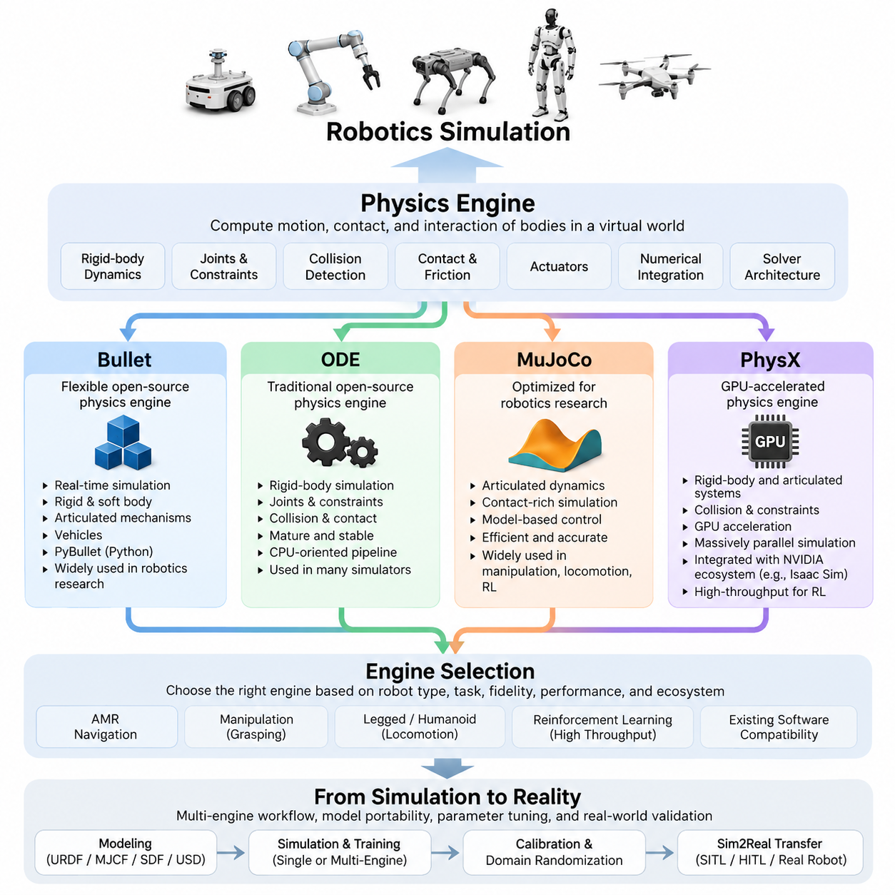
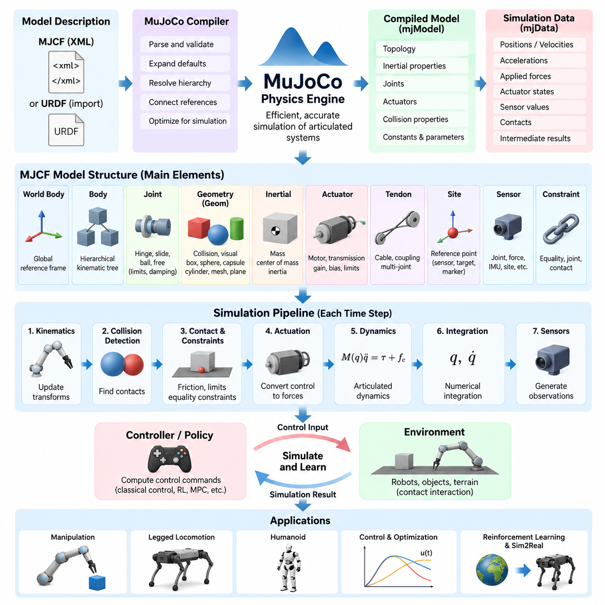
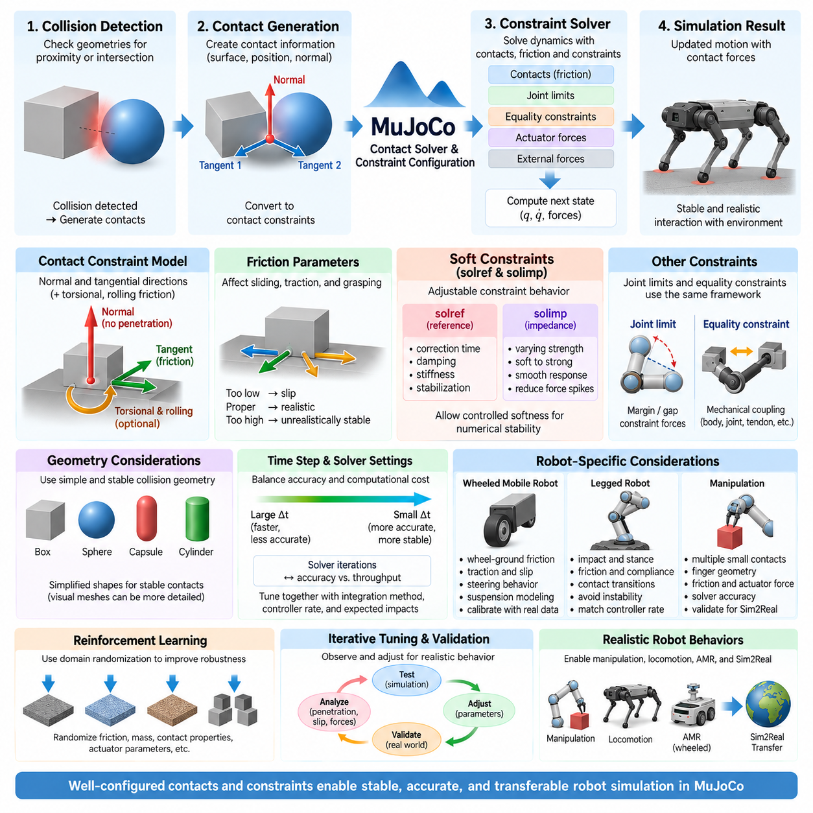
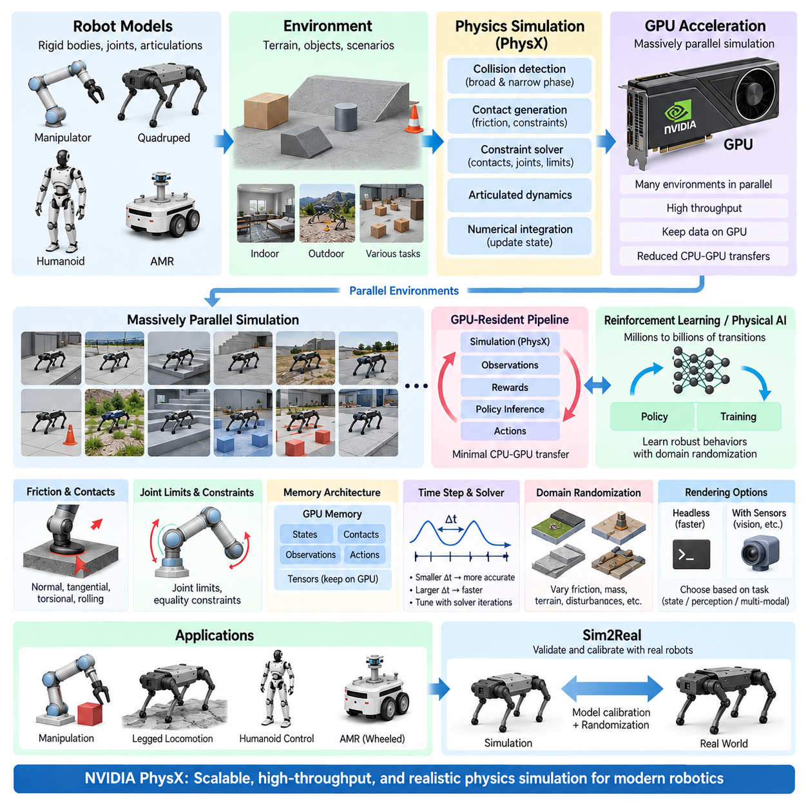
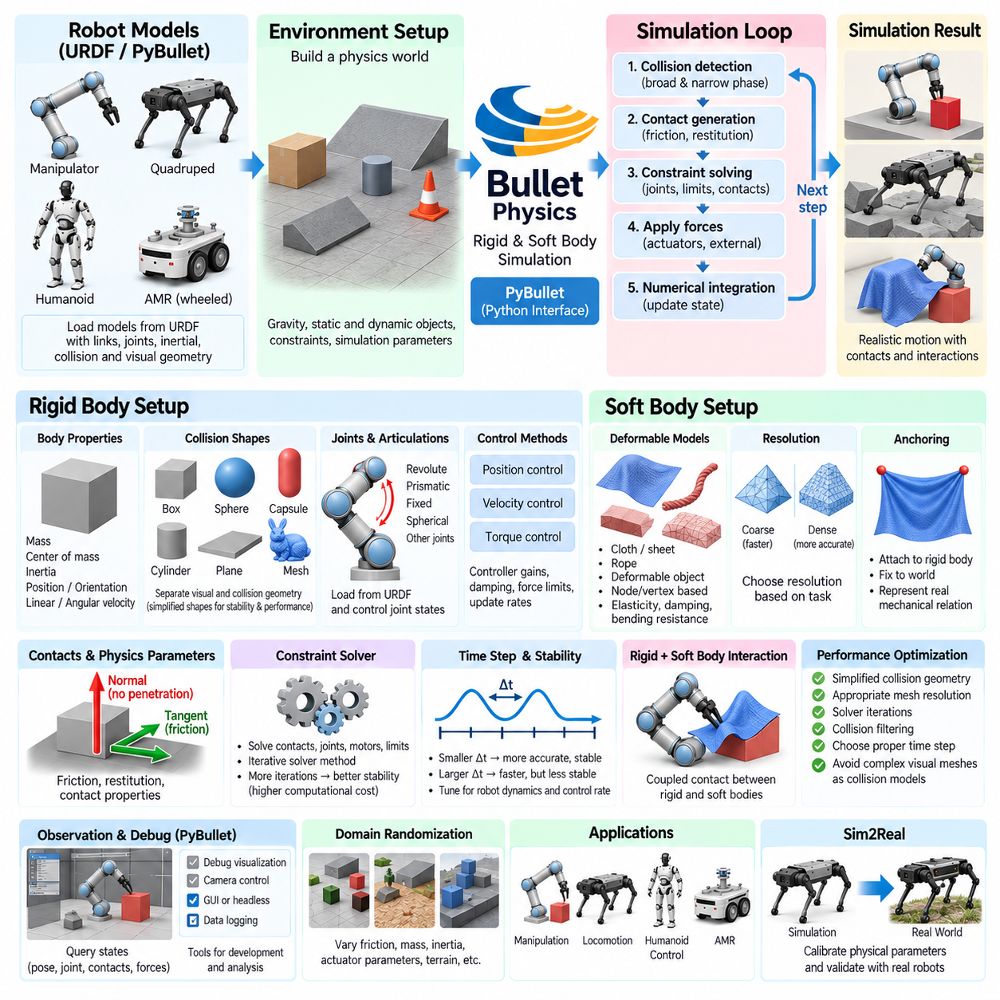
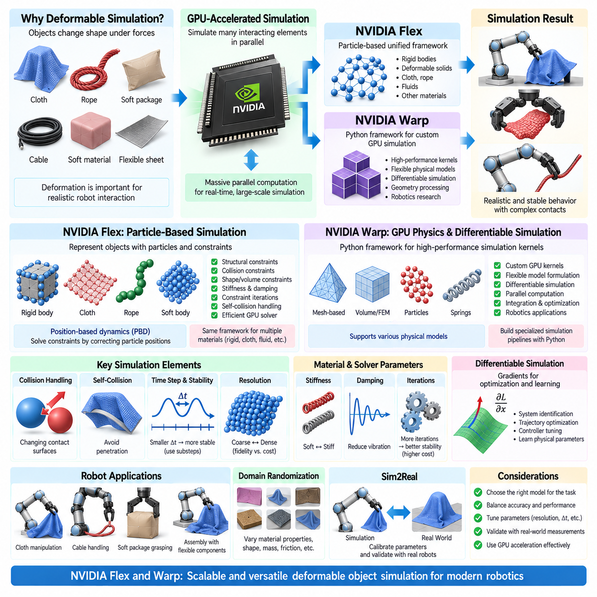
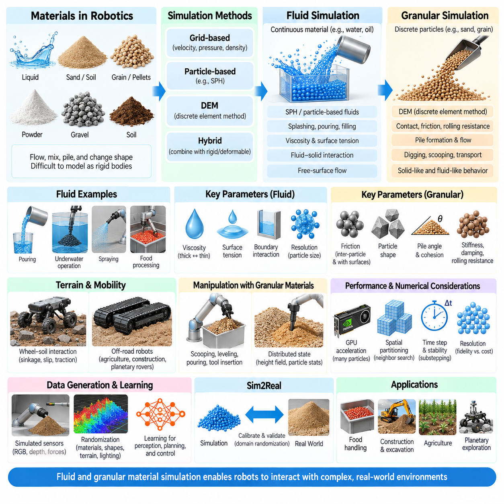
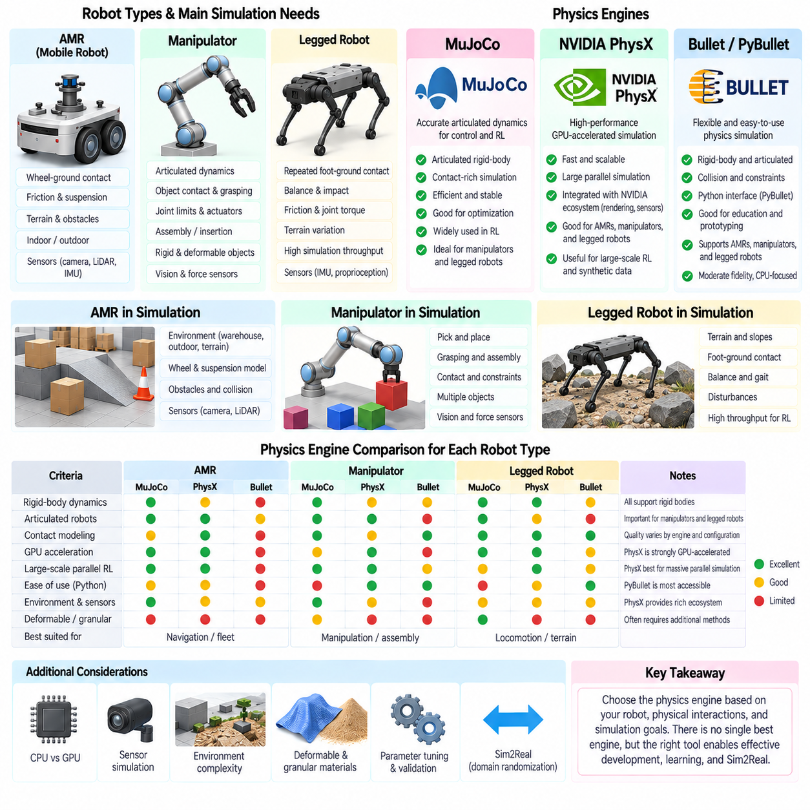
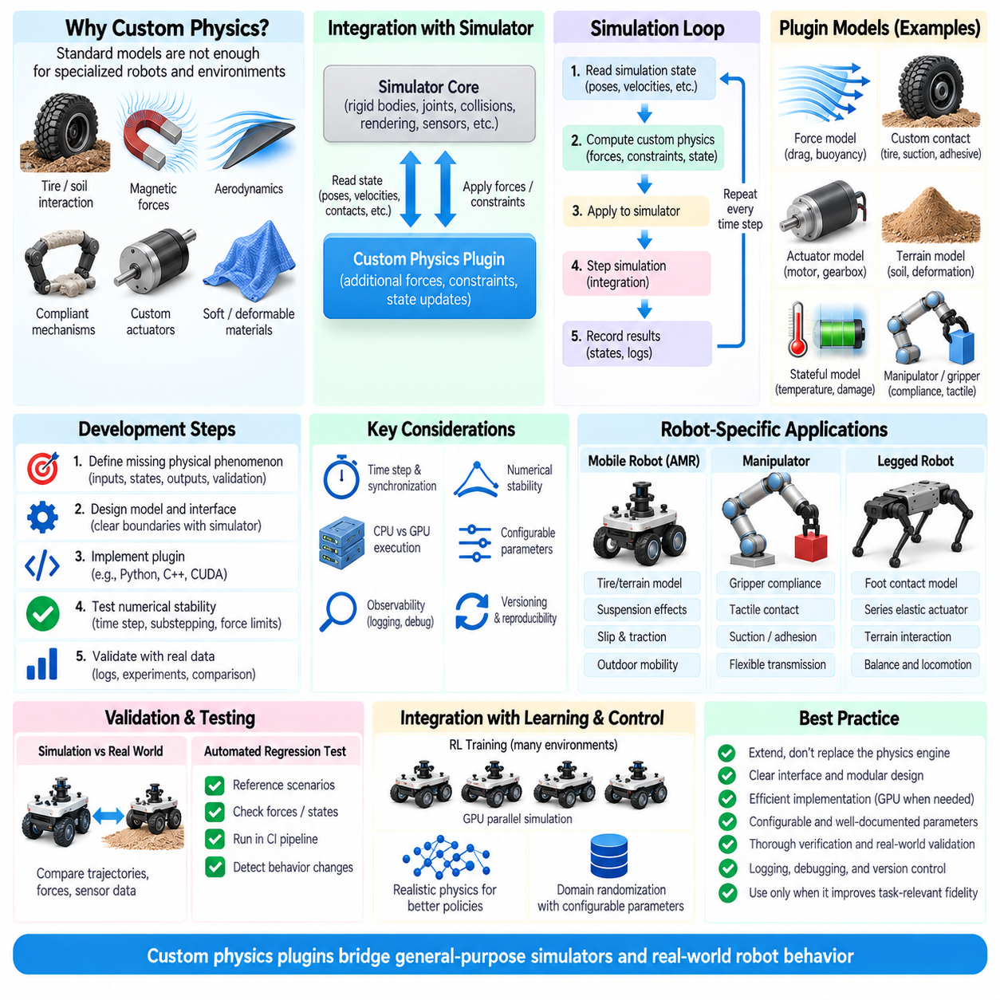
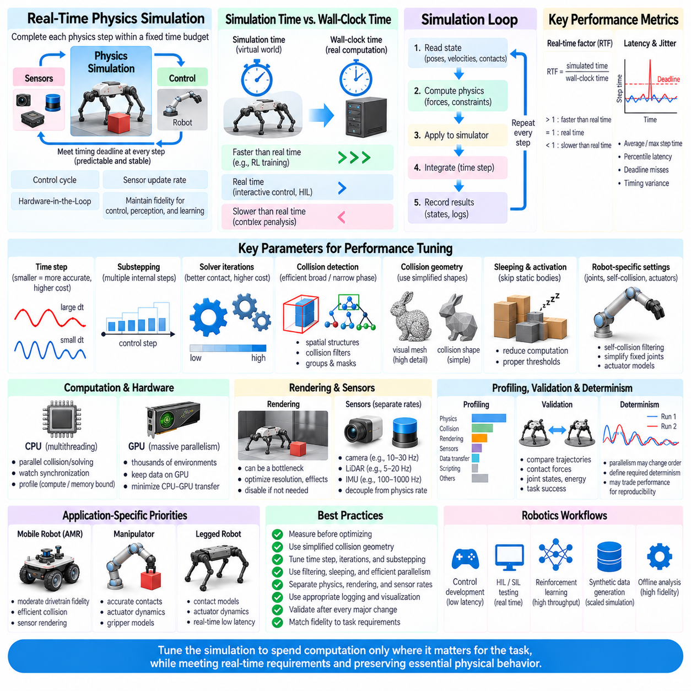

**Volume 11. Simulation and Digital Twin**

# Chapter 02. Physics Engines

## 02.01. Physics Engine Landscape Bullet ODE Mujoco PhysX

{width="7.268055555555556in" height="7.268055555555556in"}

물리 엔진(Physics Engine)은 가상 환경에서 물체가 이동하고 충돌하며 힘에 반응하고 서로 상호작용하는 방식을 근사 계산함으로써 로봇 시뮬레이션(Robot Simulation)의 계산적 기반을 형성한다. 물리 엔진은 강체 동역학(Rigid-Body Dynamics), 관절(Joint), 구속조건(Constraint), 마찰(Friction), 접촉(Contact), 액추에이터(Actuator)를 지배하는 방정식을 수치적으로 계산한다. 로보틱스(Robotics)에서 물리 엔진의 선택은 시각적 현실성뿐만 아니라 제어기 동작, 강화학습(Reinforcement Learning), 시스템 식별(System Identification), 검증 정확도, 그리고 시뮬레이션에서 실제 하드웨어로 알고리즘을 이전하는 난이도에도 영향을 미친다.

물리 엔진은 일반적으로 이산 시간 간격(Discrete Time Step)을 기준으로 시뮬레이션 세계의 상태를 진행시킨다. 각 단계에서 물체의 상태를 적분하고, 힘과 액추에이터 명령을 평가하며, 충돌을 감지하고, 물리적 구속조건을 구성한 후 관련 방정식을 계산하여 가속도, 속도, 위치 및 접촉력을 결정한다. 수치 적분(Numerical Integration), 구속조건 공식화(Constraint Formulation), 충돌 감지(Collision Detection), 솔버 아키텍처(Solver Architecture)의 차이 때문에 동일한 로봇 모델도 서로 다른 엔진에서 실행하면 다른 동작을 나타낼 수 있다.

Bullet은 실시간 충돌 감지(Real-Time Collision Detection)와 강체 시뮬레이션(Rigid-Body Simulation)을 중심으로 설계된 널리 사용되는 오픈소스(Open Source) 물리 엔진이다. 관절형 메커니즘(Articulated Mechanism), 구속조건, 접촉 동역학(Contact Dynamics), 차량 및 여러 형태의 변형체 시뮬레이션(Deformable-Body Simulation)을 지원한다. 로보틱스 분야에서는 특히 파이썬 인터페이스(Python Interface)를 제공하는 PyBullet을 통해 널리 활용되었으며, 연구자는 완전한 그래픽 시뮬레이션 애플리케이션을 구축하지 않고도 환경을 구성하고 로봇을 제어하며 관측값을 수집하고 반복 실험을 수행할 수 있다.

Bullet은 계산 효율성, 유연성 및 비교적 간단한 통합 방법 사이에서 균형을 제공하기 때문에 빠른 로보틱스 실험에 적합하다. 매니퓰레이터(Manipulator), 이동 로봇(Mobile Robot), 파지 실험(Grasping Experiment), 강화학습 환경을 비교적 적은 인프라로 구축할 수 있다. 충돌 시스템과 설정 가능한 동역학 파라미터는 프로토타입 개발에 유용하지만, 실제 접촉 거동을 정확하게 재현하려면 마찰, 반발계수(Restitution), 감쇠(Damping), 솔버 반복 횟수(Solver Iteration), 시뮬레이션 시간 간격 등을 세심하게 조정해야 한다.

오픈 다이내믹스 엔진(Open Dynamics Engine), 즉 ODE는 또 다른 전통적인 오픈소스 강체 동역학 엔진이다. 강체 시뮬레이션, 관절, 구속조건, 충돌 처리 및 접촉 모델링(Contact Modeling)을 제공하며 역사적으로 여러 로봇 시뮬레이터에 통합되어 사용되어 왔다. ODE는 관절 동역학, 충돌 감지 및 반복적 구속조건 계산이 범용 시뮬레이션 루프 내에서 실행되는 전통적인 CPU 중심 물리 처리 파이프라인을 보여준다는 점에서 아키텍처 관점에서도 중요한 의미를 가진다.

ODE는 전통적인 로보틱스 시뮬레이션 구조를 이해하거나 기존 ODE 인터페이스에 의존하는 시스템을 유지하는 데 여전히 유용하다. 성숙한 아키텍처를 통해 다양한 이동 로봇 및 관절형 시스템을 처리할 수 있지만, 최신 워크로드는 점차 대규모 병렬 환경, 높은 처리량의 학습, 복잡한 접촉 및 GPU 가속을 요구하고 있다. 따라서 ODE의 적합성은 단순한 기능 수보다 주변 시뮬레이터, 요구되는 충실도(Fidelity), 기존 소프트웨어 호환성 및 계산 규모에 더 크게 좌우된다.

MuJoCo는 원래 모델 기반 제어(Model-Based Control)와 로보틱스 연구를 위해 개발되었으며, 관절형 메커니즘, 접촉이 많은 동역학(Contact-Rich Dynamics), 최적화(Optimization) 및 계산 효율성을 중요하게 다룬다. 모델링 방식은 운동학적 트리(Kinematic Tree), 관절, 액추에이터, 텐던(Tendon), 구속조건 및 접촉 형상으로 구성된 로봇과 밀접하게 연계되어 있다. 이러한 특성으로 인해 MuJoCo는 매니퓰레이션(Manipulation), 보행(Locomotion), 최적 제어(Optimal Control), 강화학습 및 휴머노이드(Humanoid)나 다족 로봇(Legged Robot) 연구에서 특히 중요한 위치를 차지하게 되었다.

MuJoCo의 주요 장점 가운데 하나는 모델 표현(Model Representation)과 동역학 계산(Dynamics Computation)이 밀접하게 연결되어 있다는 점이다. 질량, 관성(Inertia), 관절 한계, 감쇠, 액추에이터 특성, 등식 구속조건(Equality Constraint), 접촉 파라미터와 같은 로봇의 물리적 속성이 모델에 명시적으로 표현되고 시뮬레이션 계산에 직접 참여한다. 따라서 MuJoCo는 시뮬레이터를 단순한 시각화 환경으로 사용하는 것이 아니라 물리 파라미터를 체계적으로 제어해야 하는 연구에서 높은 가치를 가진다.

접촉 모델링은 특히 매니퓰레이션과 보행에서 중요하다. 물체를 파지하거나, 사족보행 로봇(Quadruped)의 발 접촉을 유지하거나, 휴머노이드의 균형을 유지하거나, 주변 환경을 밀어내는 동작에서는 서로 결합된 접촉 구속조건이 전체 시스템의 거동을 지배할 수 있다. MuJoCo는 이러한 상호작용을 효율적으로 표현하고 계산하기 위한 설정 가능한 메커니즘을 제공한다. 그러나 높은 시뮬레이션 품질은 엔진 자체뿐만 아니라 현실적인 형상, 관성, 액추에이터 동역학, 마찰 파라미터, 제어기 타이밍 및 수치 계산 설정에 의해 결정된다.

NVIDIA PhysX는 성숙한 강체 시뮬레이션 기능과 강력한 GPU 중심 계산을 결합한다는 점에서 물리 엔진 환경의 또 다른 발전 방향을 보여준다. PhysX는 강체, 관절형 시스템, 충돌 감지, 구속조건 및 다양한 물리적 상호작용을 지원하면서 NVIDIA의 시뮬레이션 생태계와 자연스럽게 결합된다. 로보틱스에서는 하나의 정밀한 로봇을 시뮬레이션하는 수준에서 수백 또는 수천 개의 환경을 동시에 평가하는 규모로 확장해야 할 때 이러한 특성이 특히 중요해진다.

GPU 가속(GPU Acceleration)은 로봇 학습에서 시뮬레이션의 역할 자체를 변화시킨다. 전통적인 시뮬레이션은 하나의 환경을 기본적인 계산 단위로 취급하는 경우가 많았지만, 현대 강화학습 시스템은 많은 환경을 대규모 배치(Batch) 형태로 동시에 실행할 수 있다. PhysX 기반 GPU 파이프라인은 수많은 물리적 상호작용을 병렬로 처리하여 경험 데이터 수집과 정책 평가에 필요한 시간을 줄일 수 있다. 이러한 방식은 NVIDIA Isaac Sim 및 관련 로봇 학습 프레임워크에서 사용되는 고처리량 시뮬레이션(High-Throughput Simulation) 워크플로의 핵심 기반이 된다.

따라서 이러한 엔진들을 정확히 동일한 물리 문제를 해결하는 상호 교환 가능한 구현체로 간주해서는 안 된다. Bullet은 접근성과 유연한 오픈소스 실험을 강조하고, ODE는 성숙한 전통적 동역학 아키텍처를 대표하며, MuJoCo는 효율적인 관절 동역학과 접촉 중심 로봇 동역학에 강점을 가진다. PhysX는 대규모 GPU 가속 시뮬레이션의 중요한 기반을 제공한다. 각 엔진의 수학적 공식화, 접촉 모델, API, 하드웨어 요구사항 및 통합 생태계의 차이는 실제 로봇 개발에서 의미 있는 차이를 만들어낸다.

따라서 엔진 선택은 보편적인 순위를 정하는 방식이 아니라 대상 로봇과 실험 목적에서 출발해야 한다. 자율이동로봇(AMR) 내비게이션 프로젝트는 안정적인 바퀴-지면 상호작용과 ROS 통합을 우선할 수 있으며, 매니퓰레이션은 신뢰할 수 있는 다중 접촉(Multi-Contact) 거동을 요구한다. 다족 및 휴머노이드 로봇은 관절 동역학과 접촉 안정성에 더 높은 요구조건을 가지며, 강화학습에서는 수천 개 환경의 시뮬레이션 처리량이 중요해질 수 있다. 이러한 요구사항은 이후 AMR, 매니퓰레이터 및 다족 로봇을 위한 물리 엔진 비교에서 구체적으로 구분된다.

성능(Performance)과 물리적 충실도(Physical Fidelity) 역시 서로 독립적인 목표라기보다 상충관계(Trade-Off)를 형성한다. 더 작은 시간 간격, 더 많은 솔버 반복, 상세한 충돌 메시(Collision Mesh), 복잡한 접촉 모델은 특정 물리적 거동을 개선할 수 있지만 계산 비용을 증가시킨다. 반대로 형상과 동역학을 지나치게 단순화하면 학습 속도를 높일 수 있지만 비현실적인 정책을 만들 가능성이 있다. 따라서 효과적인 시뮬레이션에서는 목표 작업에 영향을 미치는 물리 현상을 식별하고 그러한 현상에 계산 충실도를 우선적으로 배분해야 한다.

결정성(Determinism)도 중요한 실무적 고려사항이다. 로보틱스 개발에서는 하나의 제어기, 정책 또는 물리 파라미터만 변경하면서 동일한 실험을 반복해야 하는 경우가 많다. 부동소수점 연산(Floating-Point Execution), 병렬 처리, 충돌 처리 순서, 솔버 수렴(Solver Convergence), GPU 계산은 실행 간 차이를 발생시킬 수 있다. 따라서 엔지니어는 엄격한 수치적 재현성(Numerical Reproducibility)과 통계적 재현성(Statistical Reproducibility)을 구분하고 시뮬레이터와 학습 파이프라인에 적합한 검증 절차를 정의해야 한다.

모델 이식성(Model Portability) 또한 중요하다. 로보틱스 프로젝트에서 여러 시뮬레이션 환경을 함께 사용하는 사례가 증가하고 있기 때문이다. URDF, MJCF, SDF, USD는 서로 다른 모델링 철학을 가지고 있으며 형식 변환 과정에서 모든 물리적 속성이 동일하게 유지되는 것은 아니다. 따라서 질량과 관성, 관절 정의, 충돌 형상, 액추에이터 특성, 마찰 및 구속조건 파라미터는 모델을 다른 환경으로 이전한 후 반드시 검증해야 한다. 이러한 이유로 전체 구성에서는 물리 엔진 기초 다음 단계에서 URDF 및 MJCF 로봇 모델링을 별도의 영역으로 다룬다.

현대 로보틱스 시뮬레이션에서는 하나의 물리 엔진을 영구적으로 선택하기보다 하나의 개발 생명주기(Development Lifecycle)에서 여러 엔진을 사용하는 방식이 점차 중요해지고 있다. 경량 환경은 알고리즘 프로토타이핑에 활용하고, 다른 엔진은 제어기 개발을 위한 고품질 관절 동역학을 제공하며, GPU 중심 플랫폼은 대규모 강화학습 실험을 수행할 수 있다. 이후 실제 제품 수준의 검증에서는 시뮬레이션을 소프트웨어 인 더 루프(Software-in-the-Loop), 하드웨어 인 더 루프(Hardware-in-the-Loop), 실제 로봇 시험과 결합할 수 있다.

이러한 다중 엔진(Multi-Engine) 관점은 시뮬레이션-현실 전이(Sim2Real Transfer)에서 특히 중요하다. 범용 물리 엔진은 실제 모터, 변속기, 타이어, 유연 구조물, 표면, 지연시간(Latency), 백래시(Backlash), 센서 타이밍의 모든 특성을 자동으로 재현하지 못한다. 따라서 측정된 파라미터, 시스템 식별 및 실제 환경 실험을 통해 시뮬레이션을 보정해야 한다. 이후 도메인 랜덤화(Domain Randomization)를 통해 불확실한 파라미터를 변화시킴으로써 학습된 제어기가 하나의 이상적인 시뮬레이션 조건에 지나치게 의존하지 않도록 할 수 있다.

궁극적으로 Bullet, ODE, MuJoCo, PhysX는 동일한 핵심 문제, 즉 로봇 개발에 사용할 수 있을 만큼 빠르게 물리적 상호작용을 유용한 수준으로 근사 계산하는 문제에 대한 서로 다른 공학적 접근법을 나타낸다. 각 엔진의 솔버 아키텍처, 계산 특성, 모델링 가정 및 생태계에서의 역할을 이해하면 엔지니어는 특정 엔진의 인지도보다는 응용 요구조건에 따라 적절한 시뮬레이션 기술을 선택할 수 있다. 이러한 기반은 이후의 엔진별 설정, 로봇 모델링, 센서 시뮬레이션, 시뮬레이션-현실 전이, 대규모 병렬 시뮬레이션(Massively Parallel Simulation)을 이해하기 위한 기초가 된다.

## 02.02. MuJoCo Architecture and Model Description [w/Code]

{width="7.268055555555556in" height="7.268055555555556in"}

MuJoCo는 관절형 기계 시스템(Articulated Mechanical System)을 효율적이고 정확하게 시뮬레이션하도록 설계된 물리 엔진(Physics Engine)으로, 특히 로보틱스(Robotics), 생체역학(Biomechanics), 제어(Control), 머신러닝(Machine Learning)에 중점을 둔다. MuJoCo의 아키텍처는 모델 컴파일(Model Compilation), 순방향 동역학(Forward Dynamics), 구속조건 해석(Constraint Solving), 충돌 감지(Collision Detection), 구동(Actuation), 수치 적분(Numerical Integration)을 하나의 통합된 시뮬레이션 파이프라인(Simulation Pipeline)으로 구성한다. 따라서 관절, 접촉, 액추에이터 및 동적으로 결합된 운동이 중요한 로봇을 시뮬레이션하는 데 특히 적합하다.

MuJoCo 시뮬레이션은 시뮬레이션 대상 시스템의 물리적 구조와 속성을 정의하는 모델 기술(Model Description)에서 시작한다. 주요 네이티브 표현 형식은 MuJoCo 모델링 XML 형식(MuJoCo Modeling XML Format), 즉 MJCF이며, URDF와 같은 다른 모델 형식도 지원되는 워크플로를 통해 가져올 수 있다. MJCF는 바디(Body), 관절(Joint), 지오메트리(Geometry), 사이트(Site), 카메라(Camera), 센서(Sensor), 액추에이터(Actuator), 텐던(Tendon), 구속조건(Constraint)을 계층적으로 구성하여 로봇과 환경을 구조화된 모델로 표현한다.

모델(Model)과 시뮬레이션 데이터(Simulation Data)의 구분은 MuJoCo 아키텍처의 기본 개념이다. 컴파일된 모델(Compiled Model)은 토폴로지(Topology), 치수, 관성 속성(Inertial Property), 관절 정의, 액추에이터 파라미터, 충돌 속성 등 주로 변하지 않는 정보를 포함한다. 반면 시뮬레이션 데이터는 일반화 위치(Generalized Position), 속도, 가속도, 적용 힘(Applied Force), 액추에이터 상태, 센서 값, 접촉 정보 및 동역학 계산 과정에서 생성되는 중간 값 등 지속적으로 변화하는 시스템 상태를 나타낸다.

MuJoCo는 시뮬레이션을 시작하기 전에 사람이 읽을 수 있는 모델 기술을 최적화된 내부 표현(Optimized Internal Representation)으로 컴파일한다. 컴파일 과정에서는 계층적 관계를 해석하고, 기본 파라미터(Default Parameter)를 확장하며, 객체 참조(Object Reference)를 연결하고, 물리적 속성을 동역학 계산에 최적화된 구조로 변환한다. 이 단계에서 다양한 모델링 오류를 탐지함으로써 잘못된 설정이 장시간 수행되는 제어, 최적화 또는 강화학습(Reinforcement Learning) 실험으로 전파되는 것을 방지할 수 있다.

월드 바디(World Body)는 MJCF 모델의 루트(Root)를 구성하며 시뮬레이션 환경의 전역 기준 좌표계(Global Reference Frame)를 설정한다. 이후 바디들은 이 루트 아래에 계층적으로 배치된다. 자식 바디(Child Body)는 부모 바디(Parent Body)를 기준으로 정의되며, 이를 통해 직렬 매니퓰레이터(Serial Manipulator), 사족보행 로봇(Quadruped), 휴머노이드(Humanoid), 이동형 매니퓰레이터(Mobile Manipulator) 등의 로봇 구조를 자연스럽게 표현할 수 있는 운동학적 트리(Kinematic Tree)가 형성된다. 시뮬레이션 중 관절 구성이 변화하면 변환 관계(Transformation)가 이러한 계층 구조를 따라 전파된다.

바디(Body)는 좌표계(Coordinate Frame)를 정의하고 물리적 구성요소를 포함하지만, 반드시 그 자체가 시각적으로 보이는 객체를 의미하지는 않는다. 바디에 연결된 지오메트리(Geometry)는 충돌 표면(Collision Surface), 시각적 외형 또는 두 기능을 동시에 제공할 수 있으며, 관성 속성은 질량 분포를 나타낸다. 바디 좌표계와 지오메트리를 분리하면 복잡한 물리 시스템을 효율적으로 표현할 수 있다. 따라서 하나의 바디에 여러 지오메트리를 연결하면서도 불필요한 동적 바디나 관절을 추가하지 않을 수 있다.

관절(Joint)은 하나의 바디가 부모 바디를 기준으로 움직일 수 있는 자유도(Degree of Freedom)를 결정한다. MuJoCo는 회전 운동(Rotational Motion), 병진 운동(Translational Motion), 구면 운동(Spherical Motion), 비구속 운동(Unconstrained Motion)에 적합한 다양한 관절 유형을 지원한다. 관절 정의에는 축(Axis), 한계(Limit), 감쇠(Damping), 강성(Stiffness), 기준 구성(Reference Configuration) 및 동역학에 영향을 미치는 기타 파라미터를 포함할 수 있다. 이렇게 생성된 일반화 좌표(Generalized Coordinate)는 엔진이 관절 운동을 계산할 때 사용하는 수학적 상태 표현이 된다.

일반적으로 지옴(Geom)으로 표현되는 지오메트리 요소(Geometry Element)는 충돌 감지, 접촉 생성(Contact Generation), 질량 관련 모델링 및 시각화에 사용되는 형상을 정의한다. 박스(Box), 구(Sphere), 캡슐(Capsule), 원통(Cylinder), 평면(Plane) 등의 기본 형상을 복잡한 객체를 위한 메시 기반 지오메트리(Mesh-Based Geometry)와 함께 사용할 수 있다. 지나치게 상세한 메시는 제어기에 중요한 물리 현상에는 거의 도움이 되지 않으면서 접촉 계산량을 증가시킬 수 있으므로 효율적인 충돌 지오메트리(Collision Geometry)를 구성하는 것이 중요하다.

정확한 관성 모델링(Inertial Modeling) 역시 중요하다. 각 동적 바디(Dynamic Body)는 물리적으로 타당한 질량(Mass), 질량중심(Center of Mass), 회전 관성(Rotational Inertia)을 가져야 한다. 시각적인 로봇 모델이 정확해 보이더라도 비현실적인 관성 값은 불안정하거나 실제와 다른 거동을 발생시킬 수 있다. MuJoCo는 적절한 설정에서 지오메트리를 기반으로 일부 관성 정보를 계산할 수 있지만, 높은 물리적 충실도(Physical Fidelity)가 요구되는 엔지니어링 모델에서는 측정값, CAD 기반 속성 또는 검증된 추정값을 반영해야 한다.

액추에이터(Actuator)는 제어 명령(Control Command)과 시뮬레이션된 기계적 운동을 연결하는 인터페이스를 제공한다. MuJoCo는 모든 관절이 이상적인 토크 소스(Ideal Torque Source)에 의해 직접 구동된다고 가정하지 않고, 모터 및 기타 전달 관계(Transmission Relationship)를 표현할 수 있는 설정 가능한 구동 프레임워크(Actuation Framework)를 제공한다. 제어 입력(Control Input)은 액추에이터 동역학, 게인 메커니즘(Gain Mechanism), 바이어스 항(Bias Term), 전달 정의(Transmission Definition), 힘 제한(Force Limit)을 거쳐 변환된 후 시뮬레이션 시스템에 작용하는 일반화 힘(Generalized Force)에 기여한다.

관절과 액추에이터를 분리하는 것은 현실적인 로봇 모델링에서 중요하다. 관절은 허용되는 기계적 운동을 정의하는 반면, 액추에이터는 그 운동에 제어력이 어떻게 적용되는지를 정의한다. 따라서 로봇은 수동 관절(Passive Joint), 여러 구동 메커니즘, 결합된 전달계(Coupled Transmission), 또는 관절 한계와 독립적인 액추에이터 한계를 가질 수 있다. 이러한 구분은 매니퓰레이션(Manipulation), 다족보행(Legged Locomotion), 유연 메커니즘(Compliant Mechanism), 시뮬레이션-현실 전이(Sim2Real Transfer)를 연구할 때 특히 중요해진다.

텐던(Tendon)은 단순한 하나의 액추에이터와 하나의 관절 간 관계를 넘어 모델을 확장한다. 텐던은 여러 관절의 조합이나 공간 경로(Spatial Path)에 따라 힘이 결정되는 기계적 결합(Mechanical Coupling)을 표현할 수 있다. 따라서 케이블 구동 메커니즘(Cable-Driven Mechanism), 생체역학 시스템, 로봇 핸드(Robot Hand), 결합 구동 아키텍처(Coupled Actuation Architecture)에 유용하다. 또한 등식 구속조건(Equality Constraint)을 비롯한 여러 구속 메커니즘을 이용하면 모든 종속 관계를 명시적인 강체 연결로 표현하지 않고도 모델 구성요소 사이의 관계를 정의할 수 있다.

사이트(Site)는 바디에 부착되는 경량 기준 위치 및 방향(Reference Position and Orientation)을 제공한다. 일반적으로 센서 위치, 측정 지점, 텐던 경로 위치, 말단장치(End-Effector) 기준점, 목표 지점(Target), 시각화 마커(Visualization Marker)를 정의하는 데 사용된다. 사이트는 추가적인 강체를 생성할 필요가 없기 때문에 기본 동역학 모델을 간결하게 유지하면서 로봇에 기능적인 기준 좌표계(Functional Reference Frame)를 연결하는 편리한 방법을 제공한다.

MuJoCo는 센서 정의(Sensor Definition) 역시 물리 모델과 직접 통합한다. 센서는 관절, 액추에이터, 바디, 사이트, 힘, 가속도, 속도, 방향 및 기타 시뮬레이션 상태와 관련된 물리량을 관측할 수 있다. 이를 통해 시뮬레이션 관측값(Simulated Observation)을 제어기가 사용하는 동일한 기계적 구조를 중심으로 구성할 수 있다. 이후 센서 출력은 전통적인 제어 알고리즘, 상태 추정기(State Estimator), 강화학습 정책(Reinforcement-Learning Policy), 데이터 수집 파이프라인(Data-Collection Pipeline)의 입력으로 사용할 수 있다.

접촉 동역학(Contact Dynamics)은 모델 기술과 환경 상호작용(Environmental Interaction)을 연결한다. 충돌 가능한 지오메트리는 교차 또는 근접 여부를 검사하고, 이후 생성된 접촉은 동역학 문제의 구속조건에 반영된다. 마찰과 접촉 파라미터는 표면이 미끄러지거나, 고착되거나, 구르거나, 분리되는 방식에 영향을 준다. 보행과 매니퓰레이션에서는 지면 반력(Ground Reaction Force)과 객체 상호작용이 운동 방정식에 직접 영향을 주기 때문에 이러한 파라미터가 로봇 거동을 크게 변화시킬 수 있다.

시뮬레이션 파이프라인(Simulation Pipeline)은 수치 적분을 통해 상태를 진행시키기 전에 운동학(Kinematics), 적용 힘, 구동, 접촉, 구속조건 및 관절 동역학(Articulated Dynamics)을 평가한다. 따라서 위치와 속도 변수는 물리 모델과 독립적으로 갱신되는 것이 아니다. 대신 로봇 구조, 관성, 제어 입력, 외력(External Force), 환경 상호작용이 결합된 계산 결과로 결정된다. 이러한 통합 공식화(Integrated Formulation)는 MuJoCo가 제어 중심 시뮬레이션(Control-Oriented Simulation)에 유용한 핵심 이유 중 하나이다.

MJCF는 복잡한 로봇 모델에서 중복을 줄일 수 있는 재사용 가능한 모델링 메커니즘(Reusable Modeling Mechanism)도 지원한다. 기본 클래스(Default Class)를 통해 여러 요소 그룹에 공통 속성을 적용할 수 있으며, 에셋(Asset)을 사용하여 메시, 텍스처(Texture), 재질(Material)을 재사용할 수 있다. 모델 구성(Model Composition) 메커니즘을 활용하면 재사용 가능한 구성요소로 더 큰 시스템을 구축할 수 있다. 이러한 기능은 링크(Link), 액추에이터, 센서 또는 환경 객체를 공유하는 여러 로봇 제품군을 유지관리할 때 더욱 중요해진다.

따라서 로보틱스 개발 관점에서 실용적인 MuJoCo 아키텍처는 여러 관심 영역을 분리하면서도 계산적으로는 서로 긴밀하게 연결한다. MJCF는 물리 시스템을 기술하고, 컴파일러(Compiler)는 이를 실행 가능한 모델로 변환하며, 시뮬레이션 데이터는 시간에 따라 변화하는 상태를 저장한다. 동역학 파이프라인은 물리적 상호작용을 계산하고 제어기는 시간에 따라 액추에이터 입력을 변경한다. 이후 센서와 로깅 시스템(Logging System)은 시뮬레이션 결과를 상위 수준 로보틱스 소프트웨어와 학습 알고리즘에 제공한다.

궁극적으로 이러한 아키텍처의 유용성은 모델 품질(Model Quality)에 의해 결정된다. 상세한 시각적 메시만으로는 잘못된 관성, 비현실적인 마찰, 이상화된 액추에이터, 부정확한 관절 한계 또는 부적절한 제어 타이밍을 보완할 수 없다. 따라서 신뢰할 수 있는 MuJoCo 모델은 실제 기계 시스템과 비교하여 파라미터를 점진적으로 검증하는 공학적 표현(Engineering Representation)으로 관리해야 한다. 이러한 접근법은 제어 개발, 강화학습, 시스템 식별(System Identification), 이후의 시뮬레이션-현실 보정(Sim2Real Calibration)을 위한 기반을 제공한다.

## 02.03. MuJoCo Contact Solver and Constraint Configuration [w/Code]

{width="7.268055555555556in" height="7.268055555555556in"}

접촉 해석(Contact Solving)은 MuJoCo에서 가장 중요한 수치 계산 과정 중 하나이다. 로봇의 동작은 강체(Rigid Body)와 주변 환경 사이에서 반복적으로 발생하는 상호작용에 크게 의존하기 때문이다. 보행, 파지, 밀기, 균형 유지, 구름 운동, 객체 조작은 모두 운동 방정식에 힘과 구속조건(Constraint)을 추가하는 접촉을 발생시킨다. MuJoCo는 이러한 상호작용을 통합된 구속조건 프레임워크(Unified Constraint Framework)에서 처리하여 접촉, 관절 한계(Joint Limit), 등식 구속조건(Equality Constraint), 마찰 관련 효과가 동역학 계산에 함께 반영되도록 한다.

충돌 감지(Collision Detection)를 통해 지오메트리(Geometry)가 충분히 가까워지거나 서로 교차한 것으로 판단되면 MuJoCo는 상호작용하는 표면을 나타내는 접촉 정보(Contact Information)를 생성한다. 이러한 접촉은 허용 가능한 운동과 그 결과 발생하는 힘에 영향을 주는 수학적 구속조건으로 변환된다. 단순히 기하학적 침투가 발생한 이후 이를 수정하는 것이 아니라 접촉 거동을 동역학 계산에 포함하여 접촉력, 마찰, 관성, 액추에이터 힘 및 외력이 함께 다음 시스템 상태를 결정하도록 한다.

접촉 구속조건(Contact Constraint)은 일반적으로 접촉 표면에 수직인 방향과 마찰에 관련된 추가적인 방향으로 구성된다. 수직 성분(Normal Component)은 물체 사이의 침투를 억제하고, 접선 성분(Tangential Component)은 미끄러짐에 대한 저항을 표현한다. 설정에 따라 마찰 거동에는 비틀림(Torsional Motion)과 구름 운동(Rolling Motion)에 관련된 효과도 포함될 수 있다. 이러한 다차원적 표현은 단순한 수직 접촉만으로 안정적인 거동을 설명할 수 없는 로봇의 발, 바퀴, 그리퍼(Gripper), 객체 등을 모델링할 때 특히 중요하다.

마찰 파라미터(Friction Parameter)는 시뮬레이션된 로봇의 거동에 큰 영향을 미친다. 마찰이 너무 작으면 사족보행 로봇(Quadruped)의 발이 미끄러지거나, 이동 로봇의 바퀴가 접지력을 잃거나, 그리퍼로 파지한 객체가 빠져나갈 수 있다. 반대로 지나치게 높은 마찰은 비현실적으로 안정적인 접촉을 만들고 제어기의 문제점을 감출 수 있다. 따라서 마찰계수(Friction Coefficient)는 실제 물리적 접촉면을 합리적으로 표현해야 하며, 제어 검증이나 시뮬레이션-현실 전이(Sim2Real Transfer)를 목적으로 한다면 궁극적으로 실제 측정값을 이용해 보정해야 한다.

MuJoCo는 모든 접촉을 완벽한 강체 접촉으로 처리하는 대신 구속조건의 거동을 조절할 수 있는 연성 구속조건 공식화(Soft Constraint Formulation)를 사용한다. 이상적인 강체 접촉은 특히 많은 물체가 동시에 상호작용할 때 해결하기 어려운 수치 문제를 발생시킬 수 있다. 제어된 연성(Softness)은 실제 시스템의 유연성(Compliance)을 근사하면서 수치적 안정성을 향상시킨다. 여기서 목적은 반드시 재료의 실제 변형을 직접 시뮬레이션하는 것이 아니라 현실적인 시뮬레이션 시간 간격에서 안정적이고 물리적으로 의미 있는 구속조건 거동을 구현하는 것이다.

이러한 거동을 설정하는 두 가지 중요한 개념이 솔버 기준 파라미터(Solver Reference Parameter)와 솔버 임피던스 파라미터(Solver Impedance Parameter)이며, 일반적으로 solref와 solimp를 통해 설정된다. 기준 파라미터는 구속조건 위반이 목표 상태를 향해 어떻게 변화하는지에 영향을 주며, 임피던스 파라미터는 구속조건의 동작 범위에 따라 얼마나 강하게 작용하는지를 제어한다. 두 파라미터를 함께 사용하면 접촉 연성, 감쇠, 침투 응답, 관절 한계 및 기타 구속조건의 거동을 유연하게 설정할 수 있다.

solref 설정은 구속조건의 동적 응답(Dynamic Response)을 정의하는 것으로 이해할 수 있다. 선택된 파라미터화(Parameterization)에 따라 보정 시간(Correction Time), 감쇠(Damping), 강성(Stiffness), 구속조건 안정화(Constraint Stabilization)와 관련된 특성을 결정한다. 빠른 보정이 설정된 접촉은 더 강체에 가까운 특성을 나타낼 수 있지만 더 작은 시간 간격이나 높은 수준의 수치적 수렴을 요구할 수 있다. 반대로 더 부드러운 응답은 안정성을 향상시킬 수 있지만 구속력이 원하는 상태를 복원하기 전에 더 큰 침투나 변위를 허용할 수 있다.

solimp 파라미터는 구속조건이 기준 상태에서 벗어날 때 구속조건 임피던스(Constraint Impedance)가 어떻게 변화하는지를 결정한다. 전체 영역에 하나의 일정한 강성 형태의 응답을 적용하는 대신 MuJoCo는 구속조건 위반 정도에 따라 구속 강도를 부드럽게 변화시킬 수 있다. 이를 통해 초기 접촉에서는 비교적 부드럽게 동작하지만 침투량이 증가할수록 점진적으로 강해지는 접촉을 구성할 수 있으며, 급격한 힘의 변화를 줄이면서 과도한 구속조건 위반을 제한할 수 있다.

관절 한계(Joint Limit) 역시 동일한 일반적 구속조건 아키텍처를 사용한다. 관절이 허용된 운동 범위에 접근하거나 이를 초과하면 적분 이후 단순히 관절 좌표를 강제로 제한하는 대신 솔버가 추가적인 운동을 억제하는 힘을 생성할 수 있다. 마진(Margin)과 갭(Gap) 관련 설정은 구속조건이 언제 활성화되고 접촉 또는 한계 조건이 어떻게 해석되는지를 결정한다. 이를 통해 관절 한계가 관성, 액추에이터 힘, 외부 하중 및 다른 구속조건과 일관된 방식으로 상호작용할 수 있다.

등식 구속조건(Equality Constraint)은 모델의 구성요소 사이에서 유지되어야 하는 관계를 표현한다. 일반적인 운동학적 트리(Kinematic Tree)만으로 편리하게 표현하기 어려운 기계적 결합(Mechanical Coupling), 바디 연결, 관절 관계, 텐던 관계 및 기타 종속성을 구현하는 데 사용할 수 있다. 등식 구속조건 역시 전체 솔버 프레임워크에 포함되므로 각 시뮬레이션 단계에서 접촉, 액추에이터, 관절 한계 및 외력과 동적으로 상호작용할 수 있다.

구속조건 설정에서는 충돌 지오메트리(Collision Geometry)도 함께 고려해야 한다. 지나치게 상세한 시각적 메시(Visual Mesh)는 복잡하거나 빠르게 변화하는 접촉을 생성하여 솔버의 계산 부하를 증가시키고 수치적 노이즈(Numerical Noise)를 발생시킬 수 있다. 따라서 로보틱스 모델에서는 상세한 메시를 시각화에 유지하면서 박스(Box), 캡슐(Capsule), 구(Sphere), 원통(Cylinder) 또는 적절하게 설계된 볼록 근사(Convex Approximation)와 같은 단순화된 형상을 충돌 계산에 사용하는 경우가 많다. 동역학에서는 시각적으로 정확한 표면보다 안정적인 접촉 지오메트리가 더 중요할 수 있다.

시간 간격(Time Step)의 선택은 접촉 솔버의 거동과 직접적인 관계를 가진다. 큰 시뮬레이션 시간 간격은 계산 비용을 감소시키지만 다음 접촉 평가 이전에 물체가 상당한 거리를 이동하도록 만들 수 있으며, 이는 침투량을 증가시키고 구속조건 계산을 어렵게 할 수 있다. 작은 시간 간격은 일반적으로 시간 해상도(Temporal Resolution)와 접촉 안정성을 향상시키지만 더 많은 계산을 요구한다. 따라서 솔버 파라미터는 적분 방법(Integration Method), 제어기 갱신 주기, 예상 충돌 속도 및 기계적 강성과 함께 조정해야 한다.

솔버 반복 횟수(Solver Iteration)와 수렴 설정(Convergence Setting)은 정확도와 계산 처리량(Computational Throughput) 사이의 또 다른 균형을 제공한다. 휴머노이드의 발, 정교한 로봇 핸드(Dexterous Hand), 적층된 객체 또는 다수의 동시 충돌이 포함된 복잡한 접촉 장면은 단순한 자유 공간 운동보다 더 많은 계산을 요구할 수 있다. 솔버 계산량을 증가시키면 잔여 구속조건 오류(Residual Constraint Error)를 줄일 수 있지만 지나친 계산은 실시간 동작이나 강화학습 처리량을 제한할 수 있다. 적절한 설정은 물리적 작업과 시뮬레이션 규모 모두에 따라 결정되어야 한다.

바퀴형 이동 로봇(Wheeled Mobile Robot)의 접촉 설정에서는 이동이 지속적인 바퀴-지면 상호작용(Wheel-Ground Interaction)에 의존하므로 특별한 주의가 필요하다. 마찰은 종방향 접지력(Longitudinal Traction)을 제공하면서 모델링된 조향과 횡방향 거동이 현실적으로 유지되도록 해야 한다. 단순화된 바퀴 형상, 서스펜션 가정, 노면 특성 및 솔버 설정은 가속, 제동, 회전 및 슬립(Slip)에 상당한 영향을 줄 수 있다. 따라서 실외 자율이동로봇(Outdoor AMR) 시뮬레이션에서는 기본 파라미터에 의존하기보다 실제 차량에서 측정한 거동을 기준으로 보정해야 할 수 있다.

다족 로봇(Legged Robot)은 보행 주기(Gait Cycle) 동안 접촉이 반복적으로 생성되고 사라지기 때문에 다른 요구사항을 가진다. 발 충격(Foot Impact), 입각 안정성(Stance Stability), 마찰, 유연성 및 접촉 전환 시점(Contact Transition Timing)은 균형과 보행 정책에 직접적인 영향을 준다. 지나치게 강한 접촉은 수치적 불안정성이나 비현실적인 충격 임펄스(Impact Impulse)를 발생시킬 수 있고, 지나치게 부드러운 접촉은 로봇이 지면으로 가라앉거나 튀어 오르는 것처럼 보이게 할 수 있다. 따라서 솔버 설정은 목표 제어기 대역폭(Controller Bandwidth)과 예상되는 지면 상호작용에 맞추어야 한다.

매니퓰레이션(Manipulation)은 여러 개의 작은 접촉 영역이 객체의 성공적인 파지 여부를 결정할 수 있기 때문에 추가적인 어려움을 가진다. 손가락 형상, 마찰, 액추에이터 힘, 접촉 연성, 객체 관성 및 솔버 정확도는 서로 강하게 상호작용한다. 비현실적으로 높은 마찰이나 과도한 구속조건 안정화 때문에 성공하는 파지는 실제 로봇에서는 실패할 수 있다. 따라서 접촉 파라미터는 단순히 시연을 성공시키기 위한 편의적 설정값이 아니라 검증이 필요한 모델 파라미터(Model Parameter)로 취급해야 한다.

강화학습(Reinforcement Learning)에서는 가장 빠르고 안정적인 설정이 반드시 가장 좋은 설정을 의미하지 않는다. 학습 정책(Policy)은 수치적 인공 효과(Numerical Artifact), 과도한 마찰, 비현실적인 유연성 또는 결정론적 접촉 거동(Deterministic Contact Behavior)을 이용하는 방향으로 학습될 수 있다. 파라미터 랜덤화(Parameter Randomization)를 통해 학습 과정에서 마찰, 접촉 속성, 객체 질량, 액추에이터 특성 및 기타 불확실한 물리량을 변화시킬 수 있다. 이를 통해 정책이 물리적 변화에 대응하도록 만들고 하나의 정밀하게 조정되었지만 실제와 다를 수 있는 시뮬레이션 환경에 지나치게 의존하는 것을 줄일 수 있다.

효과적인 MuJoCo 접촉 설정(Contact Configuration)은 모델 설계, 솔버 설정, 수치적 시험(Numerical Testing), 실제 환경 검증(Real-World Validation)을 결합하는 반복적인 공학 과정이다. 엔지니어는 단순히 시뮬레이션이 시각적으로 안정적으로 보일 때까지 파라미터를 조정하는 것이 아니라 침투, 미끄러짐, 진동, 충격 응답, 구속력 및 제어기 거동을 관찰해야 한다. 시간 간격, 마찰, 지오메트리, 감쇠, 액추에이터 거동 및 구속조건 파라미터가 서로 영향을 미칠 수 있으므로 변경 사항을 체계적으로 시험해야 한다.

궁극적으로 MuJoCo의 접촉 솔버(Contact Solver)는 이상적인 수학적 강체 동역학과 실제 로봇에서 발생하는 불완전한 물리적 상호작용을 연결하는 설정 가능한 가교 역할을 한다. 접촉, 마찰, 관절 한계, 등식 관계 및 기타 구속조건은 서로 독립적인 사후 보정이 아니라 동역학 해의 결합된 구성요소로 처리된다. 지오메트리, solref, solimp, 마찰, 솔버 계산량 및 시간 간격을 신중하게 설정하면 매니퓰레이션, 보행, AMR 동역학, 강화학습 및 신뢰성 높은 시뮬레이션-현실 전이를 위한 견고한 기반을 구축할 수 있다.

## 02.04. NVIDIA PhysX GPU Accelerated Simulation [w/Code]

{width="7.268055555555556in" height="7.268055555555556in"}

NVIDIA PhysX는 강체(Rigid Body), 관절형 메커니즘(Articulated Mechanism), 충돌(Collision), 접촉(Contact), 구속조건(Constraint) 및 기타 물리적 상호작용을 효율적으로 시뮬레이션하도록 설계된 실시간 물리 엔진(Real-Time Physics Engine)이다. 로보틱스(Robotics)에서 PhysX의 중요성은 일반적인 실시간 시뮬레이션을 넘어 현대적인 PhysX 구현이 GPU 병렬 처리(GPU Parallelism)를 활용할 수 있다는 점에 있다. 이를 통해 단일 로봇 검증부터 강화학습(Reinforcement Learning) 및 피지컬 AI(Physical AI)를 위한 대규모 병렬 환경까지 다양한 시뮬레이션 워크로드를 지원할 수 있다.

전통적인 CPU 중심 물리 시뮬레이션(CPU-Oriented Physics Simulation)은 동역학 계산 작업의 상당 부분을 제한된 수의 프로세서 코어를 이용해 처리한다. 이러한 방식은 다양한 공학 응용에 효과적이지만 수백 또는 수천 개의 유사한 환경을 동시에 평가해야 할 경우 병목현상(Bottleneck)이 발생할 수 있다. GPU 가속 PhysX는 병렬화가 가능한 물리 연산을 대규모 병렬 GPU 하드웨어에 배치하여 이러한 문제를 해결하며, 대규모 로봇 실험의 전체 시뮬레이션 처리량(Simulation Throughput)을 증가시킨다.

기본적인 시뮬레이션 루프(Simulation Loop)는 물리적 상태 전파(Physical State Propagation)를 기반으로 한다. 로봇 바디는 질량(Mass), 관성(Inertia), 자세(Pose), 속도(Velocity)를 가지며, 관절(Joint)과 아티큘레이션(Articulation)은 허용되는 상대 운동을 정의한다. 충돌 감지는 상호작용하는 지오메트리(Geometry)를 식별하고, 접촉 생성(Contact Generation)은 잠재적인 상호작용 지점을 설정하며, 구속조건 솔버(Constraint Solver)는 접촉과 기계적 관계를 만족하는 데 필요한 힘을 계산한다. 이후 수치 적분(Numerical Integration)을 통해 위치와 속도를 다음 시뮬레이션 상태로 진행시킨다.

GPU 가속이 모든 물리 연산을 자동으로 더 빠르게 만든다는 의미는 아니다. 성능은 워크로드 크기, 객체 수, 접촉 밀도(Contact Density), 아티큘레이션 복잡도, 메모리 이동, 솔버 설정 및 활용 가능한 병렬성의 정도에 따라 달라진다. 하나의 단순한 로봇만 포함하는 소규모 시뮬레이션에서는 고성능 GPU를 충분히 활용하지 못할 수 있다. 가장 큰 장점은 유사한 계산 구조를 가진 많은 환경이나 물리적 상호작용을 동시에 처리할 수 있을 때 나타난다.

이러한 특성은 강화학습에서 특히 중요하다. 학습 정책(Learning Policy)이 유용한 행동을 습득하기까지 수백만 또는 수십억 개의 시뮬레이션 상태 전이(Simulation Transition)가 필요할 수 있다. 환경을 순차적으로 실행하면 데이터 수집 시간이 지나치게 길어질 수 있다. GPU 기반 시뮬레이션은 많은 로봇 인스턴스가 동시에 관측값(Observation)을 생성하고, 행동(Action)을 실행하고, 보상(Reward)을 계산하며, 물리 상태를 진행하도록 만들어 시뮬레이션 처리량을 전체 학습 시스템 아키텍처의 핵심 요소로 변화시킨다.

PhysX는 강체, 관절, 구속조건 및 아티큘레이션 구조(Articulation Structure)를 이용하여 로봇 메커니즘을 표현한다. 아티큘레이션은 매니퓰레이터(Manipulator), 사족보행 로봇(Quadruped), 휴머노이드(Humanoid)가 동적으로 결합된 링크(Link)의 체인 또는 트리 구조를 가지기 때문에 로보틱스에서 특히 중요하다. 효율적인 관절형 바디 처리(Articulated-Body Processing)는 하나의 관절이나 접촉점에 가해진 힘이 로봇 모델에 정의된 기계적 관계를 유지하면서 전체 메커니즘의 운동에 영향을 주도록 한다.

충돌 감지(Collision Detection)는 또 다른 주요 계산 단계이다. 광역 단계(Broad Phase)는 서로 상호작용할 가능성이 있는 객체 쌍을 식별하고, 보다 상세한 협역 단계(Narrow Phase)는 실제 기하학적 접촉을 판정한다. 대규모 병렬 환경에서는 잠재적인 충돌 쌍이 매우 많아질 수 있으므로 효율적인 공간 구성(Spatial Organization)이 중요하다. 단순화된 충돌 지오메트리와 적절한 충돌 필터링(Collision Filtering)을 적용하면 로봇 작업에 필요한 물리적 상호작용을 유지하면서 불필요한 계산을 크게 줄일 수 있다.

접촉이 생성되면 솔버(Solver)는 비침투 조건(Non-Penetration), 마찰(Friction), 관절, 한계(Limit) 및 기타 구속조건을 만족하도록 응답을 계산한다. 보행에서는 발이 지형과 어떻게 상호작용하는지를 결정하고, 매니퓰레이션에서는 파지 안정성과 객체 운동에 영향을 주며, 자율이동로봇(AMR)에서는 바퀴-지면 상호작용과 장애물 접촉에 영향을 미친다. 따라서 특히 수천 개의 환경을 학습 목적으로 실행할 때에는 솔버 정확도와 계산 비용 사이의 균형을 고려해야 한다.

GPU 시뮬레이션에서는 메모리 아키텍처(Memory Architecture)가 중요한 설계 요소가 된다. 물리 상태, 접촉 정보, 관측값, 행동 및 학습 텐서(Learning Tensor)가 여러 계산 구성요소 사이에서 이동해야 할 수 있다. 데이터가 CPU와 GPU 메모리 사이를 반복적으로 이동하면 전송 오버헤드(Transfer Overhead)로 인해 가속 효과가 감소할 수 있다. 따라서 고처리량 로봇 학습 아키텍처에서는 가능한 경우 물리 상태, 정책 추론(Policy Inference), 보상 계산 및 관측 처리를 GPU 내부에 유지하려고 한다.

이러한 GPU 상주형 워크플로(GPU-Resident Workflow)는 PhysX가 현대적인 로봇 학습 프레임워크와 통합될 때 중요한 아키텍처적 장점이 된다. 시뮬레이션은 학습 알고리즘이 사용할 상태 텐서(State Tensor)를 직접 생성할 수 있으며, 정책 출력은 대규모 데이터를 반복적으로 CPU 측 데이터 구조로 변환하지 않고 액추에이터 명령으로 다시 전달될 수 있다. 결과적으로 단순히 충돌 계산이 빨라지는 것이 아니라 병렬 텐서 계산(Parallel Tensor Computation)에 최적화된 더욱 긴밀한 시뮬레이션-학습 파이프라인이 형성된다.

NVIDIA Isaac Sim은 PhysX를 보다 광범위한 로보틱스 시뮬레이션 환경의 일부로 활용한다. 물리 시뮬레이션을 로봇 모델, 환경, 센서, 렌더링(Rendering), ROS 관련 통합 및 합성 데이터(Synthetic Data) 워크플로와 결합할 수 있다. 이를 통해 동일한 가상 장면(Virtual Scene)을 동역학 시험과 인지 중심 시뮬레이션(Perception-Oriented Simulation)에 함께 사용할 수 있다. 따라서 전체 구성에서 PhysX는 이후 별도로 다루는 Isaac Sim 및 Omniverse와 자연스럽게 연결되는 물리 시뮬레이션 기반을 제공한다.

Isaac Lab은 환경, 작업(Task), 관측값, 행동, 보상, 랜덤화(Randomization), 학습 워크플로를 확장 가능한 시뮬레이션을 중심으로 구성함으로써 이러한 방향을 로봇 학습 영역으로 확장한다. 하나의 로봇 모델을 여러 환경에 반복적으로 인스턴스화(Instantiate)할 수 있으며, 각각의 인스턴스는 서로 다른 상태나 랜덤화된 물리 파라미터를 경험할 수 있다. 이러한 벡터화 실행(Vectorized Execution)은 보행, 매니퓰레이션, 휴머노이드 제어 및 대규모 상호작용 데이터가 필요한 작업에서 특히 유용하다.

병렬 시뮬레이션(Parallel Simulation)은 환경을 설계하는 방법 자체를 변화시킨다. 하나의 시각적으로 복잡한 세계를 구축하고 불필요한 모든 요소를 복제하기보다 학습 목표에 영향을 미치는 물리적 요소를 식별해야 한다. 충돌 지오메트리, 아티큘레이션 속성, 액추에이터 모델, 접촉 및 작업 관련 객체에는 계산 자원을 배분해야 하지만, 관측이나 동역학에 영향을 주지 않는 장식용 지오메트리는 단순화하거나 비활성화할 수 있다.

대규모 GPU 자원을 사용할 수 있더라도 시간 간격(Time Step) 설정은 여전히 중요하다. 물리 시간 간격(Physics Time Step)은 동적 상태가 얼마나 자주 진행되는지를 결정하며, 제어 행동은 제어 디시메이션(Control Decimation)을 통해 더 낮은 빈도로 갱신할 수 있다. 더 작은 물리 시간 간격은 접촉 해상도와 안정성을 향상시킬 수 있지만 계산량을 증가시킨다. 따라서 선택된 값은 액추에이터 동역학, 제어기 대역폭(Controller Bandwidth), 예상 충격, 접촉 강성 및 작업에서 요구되는 정확도를 반영해야 한다.

따라서 GPU 처리량은 시뮬레이션 충실도(Simulation Fidelity)와 함께 평가해야 한다. 비현실적인 마찰, 부정확한 관성, 이상화된 액추에이터 또는 불안정한 접촉을 사용하면서 초당 환경 처리량만 극대화하면 엄청난 양의 낮은 품질 경험 데이터를 생성할 수 있다. 피지컬 AI에서 유용한 시뮬레이션 성능은 단순한 시뮬레이션 스텝 수보다 물리적으로 의미 있는 학습 경험(Physically Meaningful Training Experience)을 얼마나 빠르게 생성할 수 있는가의 관점에서 이해하는 것이 적절하다.

도메인 랜덤화(Domain Randomization)는 대규모 병렬 시뮬레이션의 이점을 크게 활용할 수 있다. 서로 다른 환경에서 마찰, 질량, 질량중심(Center of Mass), 액추에이터 출력, 지형 특성, 외란(Disturbance), 객체 위치 또는 기타 불확실한 물리량을 동시에 변화시킬 수 있다. 이에 따라 정책은 하나의 결정론적 세계가 아니라 다양한 물리 조건의 분포에 노출된다. 이러한 접근법은 강건성(Robustness)을 향상시킬 수 있으며 다양한 시뮬레이션-현실 전이 워크플로의 중요한 구성요소가 된다.

대규모 GPU 시뮬레이션은 자원 관리(Resource Management) 문제도 발생시킨다. 환경 수가 증가하면 강체 상태, 아티큘레이션 데이터, 접촉, 센서, 관측값 및 학습 텐서를 저장하기 위한 GPU 메모리 사용량이 증가한다. 렌더링을 수행하면 추가적인 메모리와 연산 자원이 필요할 수 있다. 따라서 엔지니어는 최대 환경 수가 항상 최적의 설정이라고 가정하기보다 GPU 활용률, 메모리 사용량, 시뮬레이션 처리량, 솔버 계산 비용 및 학습 성능을 함께 프로파일링(Profiling)해야 한다.

시각적 렌더링이 필요하지 않은 경우 헤드리스 시뮬레이션(Headless Simulation)을 사용하면 처리량을 향상시킬 수 있다. 강화학습 실험은 지속적으로 렌더링된 이미지보다 물리 상태 전이를 필요로 하는 경우가 많으므로 그래픽 연산을 줄이거나 제거할 수 있다. 반대로 비전 기반 정책(Vision-Based Policy)은 카메라 또는 기타 시뮬레이션 센서 데이터를 필요로 하므로 렌더링 비용이 파이프라인에 추가된다. 따라서 최적의 아키텍처는 학습 문제가 상태 기반(State-Based), 인지 기반(Perception-Based), 또는 멀티모달(Multimodal)인지에 따라 달라진다.

자율이동로봇(AMR)의 경우 PhysX는 강체 운동, 서스펜션 관련 메커니즘, 바퀴 상호작용, 충돌, 페이로드(Payload) 효과 및 환경 접촉을 모델링할 수 있다. 사족보행 로봇과 휴머노이드에서는 관절 동역학과 반복적인 발-지면 접촉이 핵심이 되며, 매니퓰레이터에서는 정확한 관절 거동과 객체 접촉이 중요하다. 이러한 서로 다른 워크로드는 GPU 가속을 범용적인 하나의 설정으로 취급하기보다 응용 분야에 맞는 물리 설정과 결합해야 한다는 점을 보여준다.

높은 시뮬레이션 처리량을 확보하더라도 실제 하드웨어(Real Hardware)를 이용한 검증은 여전히 필요하다. 질량 분포, 마찰, 모터 응답, 관절 감쇠, 지연시간(Latency), 유연성(Compliance), 지형 상호작용과 같은 물리 파라미터는 가능한 경우 실제 시스템에서 측정하거나 시스템 식별(System Identification)을 통해 추정해야 한다. 이후 시뮬레이션과 실제 거동 사이의 차이를 이용해 모델 보정(Model Calibration)과 랜덤화 범위를 결정할 수 있다. GPU 가속은 더 많은 실험을 가능하게 하지만 물리적으로 신뢰할 수 있는 모델이 필요하다는 근본적인 요구사항을 제거하지는 않는다.

따라서 NVIDIA PhysX는 현대 로보틱스에서 단순히 빠른 물리 솔버(Physics Solver) 이상의 역할을 수행한다. GPU 상주형 계산, 병렬 환경, 관절형 로봇 모델, 학습 프레임워크 및 도메인 랜덤화와 결합되면 확장 가능한 시뮬레이션 인프라(Scalable Simulation Infrastructure)의 일부가 된다. PhysX의 핵심 가치는 물리 계산을 전체 학습 파이프라인과 함께 설계할 때 나타나며, 이를 통해 제어, 강화학습, 검증 및 시뮬레이션-현실 전이를 위한 대규모의 유용한 상호작용 데이터를 효율적으로 생성할 수 있다.

## 02.05. Bullet Physics Rigid Body and Soft Body Setup [w/Code]

{width="7.268055555555556in" height="7.268055555555556in"}

Bullet Physics는 강체(Rigid Body), 관절형 메커니즘(Articulated Mechanism), 충돌(Collision), 구속조건(Constraint), 변형 가능한 객체(Deformable Object)를 모델링하기 위한 유연한 시뮬레이션 프레임워크(Simulation Framework)를 제공한다. 로보틱스(Robotics)에서는 일반적으로 PyBullet을 통해 사용하며, PyBullet은 편리한 파이썬 인터페이스(Python Interface)를 통해 물리 기능을 제공한다. 이를 통해 연구자는 기반 C++ 엔진으로 완전한 물리 애플리케이션을 직접 개발하지 않고도 로봇 환경을 구성하고, 제어 알고리즘을 실행하며, 접촉을 평가하고, 시뮬레이션 데이터를 생성할 수 있다.

Bullet 시뮬레이션은 일반적으로 중력(Gravity), 충돌 객체(Collision Object), 동적 바디(Dynamic Body), 구속조건 및 시뮬레이션 파라미터가 포함된 물리 세계(Physics World)를 구성하는 것에서 시작한다. 각 시뮬레이션 단계에서는 충돌 관계를 평가하고, 접촉 및 구속조건 응답을 계산하며, 힘과 액추에이터 명령을 적용한 다음 바디 상태를 시간에 따라 적분한다. 결과적인 거동의 품질은 물리 파라미터, 충돌 지오메트리(Collision Geometry), 솔버 설정(Solver Setting), 선택된 시뮬레이션 시간 간격(Time Step)에 따라 결정된다.

강체 시뮬레이션(Rigid-Body Simulation)은 물체의 형상이 외력이 작용하더라도 크게 변형되지 않는다고 가정한다. 따라서 각각의 강체는 질량(Mass), 질량중심(Center of Mass), 관성(Inertia), 위치(Position), 방향(Orientation), 선속도(Linear Velocity), 각속도(Angular Velocity) 등의 속성으로 표현된다. 바닥이나 고정 장애물과 같은 정적 객체(Static Object)는 일반적으로 동적 운동을 하지 않지만, 동적 객체는 중력, 접촉, 외부에서 적용된 힘 및 다른 바디와의 상호작용에 반응한다.

충돌 형상(Collision Shape)은 바디가 충돌 감지(Collision Detection)에 어떻게 참여하는지를 정의한다. Bullet은 박스(Box), 구(Sphere), 캡슐(Capsule), 원통(Cylinder), 평면(Plane) 등의 기본 형상과 함께 복잡한 객체를 위한 메시 기반(Mesh-Based) 및 복합 표현(Compound Representation)을 지원한다. 상세한 렌더링 메시(Rendering Mesh)는 불필요한 삼각형을 포함할 수 있기 때문에 시각적 지오메트리(Visual Geometry)와 충돌 지오메트리를 분리하는 것이 바람직하다. 단순화된 충돌 형상은 로봇 작업에 필요한 물리적 특성을 유지하면서 시뮬레이션 성능, 접촉 안정성 및 재현성을 향상시키는 경우가 많다.

질량과 관성은 목표로 하는 실제 물리 시스템과 일관되도록 설정해야 한다. 현실적인 치수를 가진 바디라도 관성이 잘못 설정되면 회전, 가속 또는 충격에 대한 반응이 비현실적으로 나타날 수 있다. 로봇 링크(Robot Link)의 관성 값은 CAD 모델, 실제 측정 또는 검증된 공학적 추정값에서 얻을 수 있다. 질량중심 역시 중요하며, 작은 위치 변화만으로도 균형 로봇(Balancing Robot), 페이로드(Payload)를 운반하는 매니퓰레이터(Manipulator), 경사면을 이동하는 모바일 플랫폼(Mobile Platform)의 거동에 상당한 영향을 줄 수 있다.

Bullet은 강체들을 관절(Joint) 또는 구속조건으로 연결하여 관절형 메커니즘을 표현한다. 회전 관절(Revolute Joint), 직동 관절(Prismatic Joint), 고정 관절(Fixed Joint), 구면 관절(Spherical Joint) 및 기타 기계적 관계를 이용하여 로봇 구조를 구성할 수 있다. URDF 모델은 PyBullet을 통해 자주 로드되며 링크, 관절, 관성 속성, 충돌 지오메트리 및 시각적 지오메트리를 외부에서 정의할 수 있다. 모델을 로드한 이후에는 관절 상태를 측정하고 제어하면서 물리 엔진이 결합된 운동(Coupled Motion)을 계산한다.

관절 제어(Joint Control)는 모델과 인터페이스에 따라 위치(Position), 속도(Velocity), 힘 및 토크(Force and Torque)와 관련된 명령을 이용해 구현할 수 있다. 위치 또는 속도 제어는 많은 로보틱스 실험에서 편리한 추상화를 제공하며, 토크 중심 제어(Torque-Oriented Control)는 기반 동역학을 보다 직접적으로 활용한다. 비현실적인 액추에이터 가정이 강체 모델 자체가 정확한 경우에도 시뮬레이션 거동을 지배할 수 있으므로 제어기 게인(Controller Gain), 관절 감쇠(Joint Damping), 모터 힘 한계, 갱신 주기 및 기계적 구속조건을 신중하게 선택해야 한다.

충돌 감지를 통해 서로 충돌 가능한 두 형상이 상호작용하는 것으로 판단되면 접촉 생성(Contact Generation)이 수행된다. 물리 솔버(Physics Solver)는 마찰(Friction), 반발계수(Restitution), 바디 관성, 적용된 힘 및 구속조건을 고려하면서 과도한 침투를 방지하는 응답을 계산한다. 표면 속성은 로보틱스 응용에 큰 영향을 미친다. 바퀴 접지력(Wheel Traction), 발의 안정성, 객체 미끄러짐, 파지 성공 여부 및 충격 거동은 마찰이나 반발계수 파라미터가 변경되면 크게 달라질 수 있다.

따라서 구속조건 해석(Constraint Solving)은 안정적인 Bullet 시뮬레이션의 핵심 요소이다. 각 시뮬레이션 단계에서 여러 접촉, 관절, 모터 및 기계적 한계를 동시에 만족시켜야 할 수 있다. 반복 솔버 방법(Iterative Solver Method)은 사용 가능한 계산 시간 내에서 물리적으로 일관된 해를 근사한다. 솔버 계산량을 증가시키면 일부 접촉 중심 시나리오(Contact-Rich Scenario)의 정확성과 안정성을 향상시킬 수 있지만 계산 비용도 증가하므로 솔버 설정은 안정성, 정확도 및 처리량(Throughput) 사이의 균형 문제이다.

시뮬레이션 시간 간격은 수치적 안정성(Numerical Stability)과 밀접한 관련이 있다. 작은 시간 간격을 사용하면 충돌, 빠르게 변화하는 힘, 관절 운동을 더 빈번하게 평가할 수 있지만 동일한 시뮬레이션 시간을 처리하기 위해 더 많은 계산이 필요하다. 큰 시간 간격은 침투, 진동 또는 불안정한 접촉 거동을 증가시킬 수 있다. 적절한 값은 로봇 동역학, 제어 주파수(Control Frequency), 충격의 크기, 관절 강성 및 실험에서 요구하는 정확도에 따라 결정해야 한다.

Bullet은 연성체 시뮬레이션(Soft-Body Simulation)도 지원하여 강체 가정을 넘어서는 환경을 구성할 수 있다. 연성체(Soft Body)는 접촉, 중력, 내부 힘 및 외부 하중에 따라 변형될 수 있다. 대표적인 예로 천과 같은 표면(Cloth-Like Surface), 로프(Rope), 변형 가능한 시트(Deformable Sheet), 기타 유연 구조물(Flexible Structure)이 있다. 이러한 기능은 로봇과 객체의 상호작용을 강체만으로 적절하게 표현할 수 없을 때 유용하지만, 변형체 시뮬레이션은 일반적으로 추가적인 계산 복잡성과 파라미터 민감성을 수반한다.

연성체는 하나의 강체 변환(Rigid Transform)과 관성 텐서(Inertia Tensor)만으로 표현하는 대신 변형 가능한 내부 구조를 나타내는 모델이 필요하다. 노드(Node) 또는 정점(Vertex)은 서로 상대적으로 이동할 수 있으며, 구조적 관계가 이러한 변형에 저항한다. 모델에 따라 탄성 거동(Elastic Behavior), 감쇠(Damping), 굽힘 저항(Bending Resistance) 및 기타 속성이 객체의 형상 변화를 결정한다. 따라서 연성체 설정에서는 기하학적 해상도(Geometric Resolution)와 기계적 파라미터를 모두 고려해야 한다.

해상도(Resolution)는 변형체 시뮬레이션에 특히 큰 영향을 미친다. 조밀한 메시(Dense Mesh)는 국부적인 변형을 보다 정확하게 표현할 수 있지만 계산해야 하는 자유도(Degree of Freedom)와 물리적 관계의 수를 증가시킨다. 거친 표현(Coarse Representation)은 계산 비용이 낮지만 중요한 주름, 굽힘 또는 국부 접촉을 표현하지 못할 수 있다. 따라서 단순히 메시의 세부 수준을 최대화하기보다 실제 매니퓰레이션 작업에 필요한 수준을 기준으로 적절한 해상도를 선택해야 한다.

연성체와 강체 로봇 사이의 접촉은 결합된 상호작용 문제(Coupled Interaction Problem)를 형성한다. 매니퓰레이터가 변형 가능한 객체를 누르거나 파지하면 힘에 의해 객체의 형상이 변화하고, 이러한 변형은 이후의 접촉 지오메트리와 힘을 다시 변화시킨다. 안정적인 시뮬레이션을 위해 충돌 마진(Collision Margin), 감쇠, 강성(Stiffness), 솔버 파라미터 및 시간 간격을 신중하게 조정해야 할 수 있다. 시각적으로 그럴듯하게 보이는 것만으로 모델링된 재료 거동이 물리적으로 정확하다고 판단해서는 안 된다.

앵커링(Anchoring)은 연성체의 선택된 영역을 강체 또는 고정된 위치에 연결하는 메커니즘을 제공한다. 이를 통해 그리퍼가 잡고 있는 천, 구조물에 부착된 유연 부품 또는 특정 지점에서 구속된 변형체를 표현할 수 있다. 비현실적인 경계조건(Boundary Condition)은 전체 변형 거동을 지배할 수 있으므로 올바른 앵커 위치 설정이 중요하다. 연결 조건은 목표로 하는 실제 시스템에 존재하는 기계적 관계를 적절하게 나타내야 한다.

강체 모델과 연성체 모델은 하나의 Bullet 환경에서 함께 사용할 수 있으므로 로봇이 일반적인 객체와 변형 가능한 재료 모두와 상호작용하는 상황을 시뮬레이션할 수 있다. 예를 들어 로봇 팔(Robot Arm)은 한 작업에서 박스를 조작하고 다른 작업에서는 유연한 시트를 다룰 수 있으며, 주변 환경 구조물은 계속 강체로 유지할 수 있다. 이러한 혼합 시뮬레이션(Mixed Simulation) 기능은 공통 프로그래밍 인터페이스와 제어 아키텍처 안에서 구성할 수 있는 로보틱스 실험의 범위를 확장한다.

PyBullet은 이러한 시뮬레이션을 관찰하기 위한 실용적인 도구를 제공한다. 사용자는 액추에이터와 외력을 명령하면서 바디 자세(Body Pose), 관절 위치, 속도, 접촉점(Contact Point), 적용된 힘 및 기타 상태 변수를 조회할 수 있다. 디버그 시각화(Debug Visualization)와 카메라 기능은 개발 및 상태 확인을 지원한다. 대규모 자동화 실험에서는 대화형 그래픽 인터페이스 없이 시뮬레이션을 실행하여 불필요한 렌더링 오버헤드(Rendering Overhead)를 줄일 수도 있다.

성능 최적화(Performance Optimization)는 실험에 실질적인 영향을 미치는 물리적 특성에 집중해야 한다. 단순화된 충돌 지오메트리, 적절한 메시 해상도, 합리적인 솔버 반복 횟수, 충돌 필터링(Collision Filtering), 신중하게 선택된 시간 간격은 계산량을 상당히 줄일 수 있다. 복잡한 시각적 에셋(Visual Asset)을 자동으로 복잡한 충돌 모델로 사용할 필요는 없다. 이러한 구분은 최적화, 데이터셋 생성 또는 강화학습을 위해 많은 로봇 에피소드(Episode)를 실행해야 할 때 특히 중요하다.

시뮬레이션-현실 전이(Sim2Real) 개발에서는 Bullet의 파라미터를 현실의 정확한 표현으로 간주하기보다 실제 시스템을 기준으로 보정해야 한다. 질량, 관성, 마찰, 감쇠, 액추에이터 응답, 관절 거동, 접촉 특성 및 연성 재료 속성에는 불확실성이 존재한다. 측정과 시스템 식별(System Identification)을 통해 이러한 불확실성의 범위를 줄일 수 있으며, 파라미터 랜덤화(Parameter Randomization)를 이용하면 학습 과정에서 제어기나 학습 정책을 현실적으로 가능한 물리적 변화에 노출시킬 수 있다.

강체 시뮬레이션은 변형이 로봇 작업에 미치는 영향이 무시할 수 있을 정도로 작은 경우 일반적으로 적합하며, 연성체 시뮬레이션은 변형 자체가 인지(Perception), 접촉, 매니퓰레이션 또는 제어에 영향을 미치는 경우 도입해야 한다. 작업상의 명확한 이유 없이 변형체 물리를 추가하면 계산 비용과 보정 요구사항만 증가할 수 있다. 따라서 계층적 모델링 전략(Layered Modeling Strategy)은 물리적으로 의미 있는 가장 단순한 표현에서 시작하고 검증을 통해 필요성이 확인될 때만 복잡성을 추가하는 방식이 적절하다.

궁극적으로 Bullet Physics는 전통적인 강체 로봇 동역학과 변형 가능한 객체의 상호작용을 하나의 공통 시뮬레이션 워크플로에서 모델링할 수 있는 다목적 환경을 제공한다. 신뢰할 수 있는 결과는 기하학적 또는 수치적 복잡성을 최대화하는 것보다 적절한 표현을 선택하고 해당 파라미터를 검증하는 것에 더 크게 의존한다. 신중하게 설정된 바디, 관절, 충돌, 접촉, 구속조건, 연성체 속성 및 솔버 설정은 로봇 프로토타이핑, 제어 개발, 학습 및 시뮬레이션-현실 전이 실험을 위한 실용적인 기반을 제공한다.

## 02.06. Flex and Warp Deformable Object Simulation [w/Code]

{width="7.268055555555556in" height="7.268055555555556in"}

변형 객체 시뮬레이션(Deformable-Object Simulation)은 접촉, 중력, 구동 또는 외부 하중에 의해 형상이 크게 변화하는 재료를 표현함으로써 로보틱스(Robotics)를 강체 가정(Rigid-Body Assumption)의 범위를 넘어 확장한다. 천(Cloth), 케이블(Cable), 유연 시트(Flexible Sheet), 연성 패키지(Soft Package), 탄성 부품(Elastic Component), 유연 구조물(Compliant Structure)은 항상 강체로 적절하게 근사할 수 있는 것은 아니다. NVIDIA Flex와 Warp는 대규모로 상호작용하는 물리 요소의 계산을 병렬 GPU 처리(Parallel GPU Processing)를 이용해 가속하는 계산 집약적 시뮬레이션(Computationally Intensive Simulation)의 서로 다른 접근법을 나타낸다.

NVIDIA Flex는 여러 물리 현상을 하나의 통합된 계산 모델(Unified Computational Model)을 통해 표현할 수 있는 입자 기반 시뮬레이션 프레임워크(Particle-Based Simulation Framework)로 개발되었다. 모든 객체를 전통적인 강체로만 처리하는 대신 Flex는 구속조건(Constraint)으로 연결된 입자(Particle)를 이용하여 물리 시스템을 기술한다. 입자 사이의 관계를 변경함으로써 동일한 기반 솔버 개념을 이용해 강체, 변형 가능한 고체(Deformable Solid), 천, 로프(Rope), 유체(Fluid) 및 기타 재료를 하나의 공통 시뮬레이션 환경에서 표현할 수 있다.

입자 기반 표현(Particle-Based Representation)이 중요한 이유는 입자 사이의 상대 운동을 통해 변형이 자연스럽게 발생하기 때문이다. 유연한 시트는 인접 입자가 이동하면서 굽어지고 늘어날 수 있으며 구조적 구속조건(Structural Constraint)은 과도한 변형을 억제한다. 로프는 연속적으로 연결된 입자의 배열로 표현할 수 있고, 연성 체적(Soft Volume)은 형상이나 부피를 유지하는 내부 관계를 이용할 수 있다. 따라서 물리적 거동은 입자 간격, 구속조건 설정, 강성(Stiffness), 감쇠(Damping), 충돌 속성(Collision Property)에 크게 좌우된다.

Flex는 복잡한 힘 기반 재료 방정식을 직접 적분하기보다 주로 입자의 위치를 보정하여 구속조건을 해결하는 위치 기반 동역학(Position-Based Dynamics) 방식을 사용한다. 이러한 공식화는 특히 많은 접촉이나 변형 요소가 존재하는 경우 대화형 및 실시간 응용에서 안정적인 거동을 제공할 수 있다. 이 방법은 강건한 수치적 거동과 계산 효율성을 우선하지만, 설정되는 파라미터를 실제 재료 특성의 직접적인 측정값과 동일하게 해석해서는 안 된다.

구속조건 반복(Constraint Iteration)은 Flex 시뮬레이션에서 중요한 역할을 한다. 각 시간 단계(Time Step)에서 구조, 충돌, 형상 유지 및 기타 구속조건을 반복적으로 계산하여 위반 정도를 줄일 수 있다. 반복 횟수를 증가시키면 재료가 더 단단하게 보이고 구속조건 만족도가 향상될 수 있지만 계산량 역시 증가한다. 따라서 재료 거동은 명목상의 강성 설정뿐만 아니라 시간 간격, 입자 해상도(Particle Resolution), 솔버 반복 횟수(Solver Iteration), 구속조건 토폴로지(Constraint Topology)의 영향을 함께 받는다.

변형 객체에서는 상호작용 중 접촉 표면 자체가 변화하기 때문에 충돌 처리(Collision Handling)가 더욱 복잡해진다. 로봇 그리퍼(Robot Gripper)가 연성 패키지를 압축하면 객체의 형상이 변화하고, 이러한 변화는 이후의 접촉 위치와 힘을 다시 변화시킨다. 천은 자기 자신 위로 접힐 수 있고, 로프는 객체 주변을 감을 수 있으며, 유연 부품은 다수의 동시 접촉을 발생시킬 수 있다. 따라서 실용적인 시뮬레이션 성능을 유지하려면 효율적인 광역 충돌 처리(Broad-Phase Collision Processing)와 국부 충돌 처리(Local Collision Processing)가 필수적이다.

자기 충돌(Self-Collision)은 천, 케이블 및 기타 얇은 변형 구조에서 특히 중요하다. 적절한 자기 충돌 처리가 없으면 동일한 객체의 서로 다른 영역이 서로 관통하여 물리적으로 타당하지 않은 형상을 만들 수 있다. 자기 충돌을 활성화하면 현실성은 향상되지만 잠재적인 상호작용 수가 크게 증가할 수 있다. 따라서 입자 간격, 충돌 반경(Collision Radius), 필터링(Filtering), 솔버 파라미터를 함께 설정하여 안정성과 계산 비용 사이의 균형을 맞춰야 한다.

NVIDIA Warp는 GPU 시뮬레이션에 대해 다른 방향에서 접근한다. Warp는 CPU와 NVIDIA GPU에서 실행할 수 있는 고성능 시뮬레이션 및 수치 계산 커널(Numerical Kernel)을 작성하기 위한 파이썬 프레임워크(Python Framework)이다. 고정된 하나의 물리 엔진만 제공하는 대신 개발자가 파이썬 중심 프로그래밍 방식으로 계산 연산을 표현하고 적합한 커널을 병렬 실행용으로 컴파일할 수 있도록 한다. 이러한 특성으로 인해 Warp는 사용자 정의 미분 가능 시뮬레이션(Differentiable Simulation), 지오메트리 처리(Geometry Processing), 로보틱스 및 물리 연구에 유용하다.

Warp의 커널 기반 아키텍처(Kernel-Based Architecture)는 많은 수의 유사한 연산을 포함하는 문제에 자연스럽게 대응한다. 입자 갱신, 메시 처리(Mesh Processing), 접촉 계산, 적분(Integration), 최적화 및 기타 수치 연산을 병렬로 평가할 수 있다. 이를 통해 연구자는 모든 GPU 커널을 저수준 CUDA 코드로 직접 구현하지 않고도 특수 목적 시뮬레이션 파이프라인을 구축하면서 계산량이 많은 워크로드에 하드웨어 병렬성을 활용할 수 있다.

변형 시뮬레이션에서 Warp는 구현되는 모델에 따라 입자, 메시, 스프링(Spring), 연속체 역학(Continuum Mechanics) 또는 기타 수치적 표현을 기반으로 하는 공식화를 지원할 수 있다. 변형 객체는 표면 삼각형(Surface Triangle), 체적 요소(Volumetric Element), 노드(Node), 입자 등을 이용해 표현할 수 있으며, 이들의 상태는 물리 방정식에 따라 변화한다. 이러한 유연성은 천, 케이블, 연성 고체(Soft Solid), 유연 로봇 부품이 반드시 동일한 수학적 표현을 요구하지 않기 때문에 중요한 가치를 가진다.

유한요소법 형태의 방법(Finite-Element-Style Method)은 하나의 물체를 작은 요소로 분할하고 각 요소가 어떻게 늘어나고, 압축되고, 전단되고, 굽혀지는지를 계산함으로써 변형을 표현할 수 있다. 단순화된 입자 구속조건과 비교하면 이러한 공식화는 연속체 재료 파라미터(Continuum Material Parameter)와 보다 직접적인 관계를 제공할 수 있지만 일반적으로 더 많은 계산과 세심한 수치 처리를 요구한다. 충분한 병렬 구조를 가진 공식에서는 GPU 병렬 처리를 이용하여 많은 요소를 동시에 계산함으로써 이러한 비용을 줄일 수 있다.

미분 가능 시뮬레이션은 Warp 기반 워크플로와 관련된 또 하나의 중요한 기능이다. 시뮬레이션이 파라미터 또는 제어 입력 변화에 따라 출력이 어떻게 변화하는지를 나타내는 미분값(Derivative)을 제공할 수 있다면 경사 기반 최적화(Gradient-Based Optimization)가 가능해진다. 로보틱스 연구자는 이러한 정보를 시스템 식별(System Identification), 궤적 최적화(Trajectory Optimization), 제어기 튜닝(Controller Tuning), 물리 파라미터 학습 등에 사용할 수 있다. 이를 통해 물리 시뮬레이션을 최적화 및 머신러닝 파이프라인과 직접 연결할 수 있다.

미분 가능성(Differentiability)의 유용성은 모델링된 물리 현상에 따라 달라진다. 접촉, 마찰, 불연속성(Discontinuity), 토폴로지 변화(Topology Change), 대변형(Large Deformation)은 복잡한 경사 거동을 발생시킬 수 있다. 수학적으로 미분 가능한 구현이라고 해서 모든 최적화 문제가 안정적이거나 물리적으로 의미 있다는 것을 보장하지는 않는다. 따라서 변형 시뮬레이션을 최적화 파이프라인의 일부로 사용할 때에는 모델 가정, 경사 품질(Gradient Quality), 파라미터 스케일링(Parameter Scaling), 접촉 공식화를 함께 검토해야 한다.

메시 및 입자 해상도는 Flex와 Warp 방식의 변형 시뮬레이션 모두에서 큰 영향을 미친다. 해상도를 높이면 국부적인 굽힘, 접힘, 압축 및 접촉을 더욱 정확하게 표현할 수 있지만 상태 크기(State Size), 충돌 후보 수, 메모리 사용량 및 솔버 계산 부하가 함께 증가한다. 따라서 적절한 해상도는 단순히 객체의 시각적 외형을 기준으로 결정하는 것이 아니라 로봇 작업에 중요한 물리적 공간 규모(Physical Scale)를 기준으로 결정해야 한다.

시간 간격(Time Step)의 선택 역시 매우 중요하다. 연성 재료는 빠른 탄성 응답(Elastic Response)을 나타낼 수 있으며 지나치게 큰 시간 간격으로 시뮬레이션하면 불안정해질 수 있다. 더 작은 시간 간격은 안정성과 접촉 해상도를 향상시킬 수 있지만 계산 비용을 증가시킨다. 서브스테핑(Substepping)은 하나의 큰 제어 주기 안에서 물리 계산을 여러 번 수행함으로써 실용적인 절충안을 제공한다. 따라서 솔버 반복, 감쇠, 강성, 질량 분포 및 시간 간격은 서로 연결된 하나의 수치 시스템으로 조정해야 한다.

변형 객체의 로봇 매니퓰레이션(Robotic Manipulation)은 인지와 제어가 결합된 문제(Coupled Perception-and-Control Problem)를 형성한다. 자세를 일반적으로 6자유도(Six Degrees of Freedom)로 표현할 수 있는 강체와 달리 변형 객체는 형상을 기술하기 위해 많은 상태 변수를 필요로 할 수 있다. 따라서 제어기는 단순한 위치와 방향뿐만 아니라 키포인트(Keypoint), 메시 상태, 입자 분포, 접힘(Fold), 장력(Tension), 접촉 영역 등에 대한 정보를 필요로 할 수 있다. 시뮬레이션은 이러한 표현을 개발하기 위한 제어 가능한 환경을 제공한다.

변형 시뮬레이션은 학습 데이터(Training Data)를 생성하는 데에도 유용하다. 가상 로봇은 다양한 조건에서 천, 케이블, 패키지 또는 유연 부품과 상호작용하면서 지오메트리, 힘, 접촉, 행동 및 그 결과로 발생하는 변형을 기록할 수 있다. 랜덤화(Randomization)를 통해 재료 강성, 감쇠, 마찰, 질량, 객체 크기, 초기 형상 및 환경 조건을 변화시킬 수 있다. 이러한 변화는 학습 시스템이 하나의 이상적인 재료 설정에 지나치게 의존하는 것을 방지하는 데 도움을 줄 수 있다.

그러나 변형 객체의 시뮬레이션-현실 전이(Sim2Real Transfer)는 실제 재료가 비선형 탄성(Nonlinear Elasticity), 히스테리시스(Hysteresis), 이방성(Anisotropy), 소성 변형(Plastic Deformation), 내부 감쇠(Internal Damping), 제조 편차(Manufacturing Variation)와 같은 복잡한 거동을 나타내기 때문에 일반적으로 강체 객체보다 어렵다. 시뮬레이터는 모든 재료 현상을 완벽하게 재현하지 않더라도 작업에 중요한 거동을 재현할 수 있다. 따라서 검증은 변형량, 접촉 응답, 굽힘, 장력, 파지 안정성처럼 로봇 작업에 영향을 주는 측정 가능한 물리량에 집중해야 한다.

시스템 식별을 이용하면 실제 실험으로부터 변형 객체의 파라미터를 추정할 수 있다. 알려진 하중을 재료에 가하고 변위, 형상 변화, 진동 또는 힘 응답을 측정한 다음 시뮬레이션 관측 결과가 실제 거동을 재현하도록 시뮬레이션 파라미터를 조정할 수 있다. 시뮬레이션 공식과 측정량이 신뢰할 수 있는 미분값을 제공한다면 미분 가능 또는 경사 기반 방법(Differentiable or Gradient-Based Method)을 이용하여 이러한 보정 과정을 가속할 수 있다.

따라서 Flex와 Warp는 서로 완전히 동일하거나 상호 교환 가능한 엔진이라기보다 서로 다른 추상화 수준(Level of Abstraction)을 제공하는 기술로 이해해야 한다. Flex는 여러 물리 재료 유형을 효율적으로 시뮬레이션하도록 설계된 통합 입자 및 구속조건 접근법(Unified Particle-and-Constraint Approach)을 강조하는 반면, Warp는 특수 목적 물리 및 미분 가능 시뮬레이션 워크플로를 구축할 수 있는 프로그래밍 가능한 GPU 계산 프레임워크(Programmable GPU Computing Framework)를 제공한다. 적절한 선택은 요구되는 물리 모델, 개발 유연성, 계산 규모 및 통합 환경에 따라 달라진다.

로보틱스에서 변형 객체 시뮬레이션은 변형이 인지, 계획(Planning), 접촉 또는 제어에 실질적인 영향을 미칠 때 도입해야 한다. 목표는 물리적 복잡성을 최대화하는 것이 아니라 성공적인 로봇 동작에 필요한 현상을 적절하게 표현하는 것이다. GPU 가속은 더욱 상세한 모델의 실용적 사용을 가능하게 하지만, 해상도, 구속조건, 재료 파라미터, 충돌 처리, 솔버 설정 및 검증 절차를 신중하게 선택해야만 결과적인 시뮬레이션이 피지컬 AI(Physical AI)와 시뮬레이션-현실 전이 개발에 실질적으로 활용될 수 있다.

## 02.07. Fluid and Granular Material Simulation for Robots

{width="7.268055555555556in" height="7.268055555555556in"}

유체 및 입상 재료 시뮬레이션(Fluid and Granular Material Simulation)은 물질이 지속적으로 흐르고, 분리되고, 혼합되고, 쌓이거나 실질적인 형상이 변화하는 환경을 표현함으로써 기존의 강체(Rigid Body) 및 변형 객체(Deformable Object) 중심의 로봇 물리를 확장한다. 액체, 분말, 모래, 토양, 곡물, 펠릿(Pellet) 및 이와 유사한 재료는 소수의 강체만으로 적절하게 표현하기 어렵다. 이러한 재료를 다루는 로봇에는 분산된 운동, 접촉, 압력, 마찰 및 물질 이동(Material Transport)을 표현할 수 있는 시뮬레이션 방법이 필요하다.

유체 시뮬레이션(Fluid Simulation)은 입자 또는 체적 요소(Volume Element)가 서로에 대해 지속적으로 이동하는 재료를 표현한다. 로보틱스(Robotics)에서 관련된 사례로는 물 취급, 액체 따르기, 용기 채우기, 세척, 분사, 식품 가공 및 완전히 또는 부분적으로 잠긴 메커니즘과의 상호작용 등이 있다. 로봇은 객체의 운동뿐만 아니라 매니퓰레이션(Manipulation) 과정에서 용기의 방향, 가속도, 장애물, 도구 및 변화하는 경계조건(Boundary Condition)에 유체가 어떻게 반응하는지도 예측해야 할 수 있다.

유체를 표현하기 위해 여러 수치적 접근법(Numerical Approach)을 사용할 수 있다. 격자 기반 방법(Grid-Based Method)은 공간 셀(Spatial Cell)에 걸쳐 속도, 압력, 밀도 및 관련 물리량을 표현하는 반면, 입자 기반 접근법(Particle-Based Approach)은 이동하는 물질 표본을 추적한다. 일반적으로 SPH라고 하는 평활 입자 유체역학(Smoothed Particle Hydrodynamics)은 고정된 표면 표현 없이 유체 요소가 공간을 이동할 수 있기 때문에 자유 표면 액체(Free-Surface Liquid)를 표현하는 데 특히 직관적이다. 각 접근법은 정확도, 안정성, 메모리 사용량 및 계산 처리량(Computational Throughput) 사이에서 서로 다른 절충관계(Trade-Off)를 가진다.

입자 기반 유체 시뮬레이션(Particle-Based Fluid Simulation)은 튀김(Splashing), 따르기(Pouring), 분리 및 복잡하게 움직이는 경계가 포함된 상황에 적합하다. 각각의 입자는 재료의 일부를 나타내며 밀도, 압력, 점성(Viscosity) 및 기타 물리적 관계에 따라 주변 입자와 상호작용한다. 겉으로 보이는 유체 표면은 입자 분포로부터 형성된다. 따라서 해상도(Resolution)는 입자 간격과 밀접하게 관련되며, 입자가 작을수록 더 세밀하게 표현할 수 있지만 계산량과 메모리 요구량은 크게 증가한다.

점성은 유체 내부의 상대 운동에 대한 저항을 결정하며 로봇 매니퓰레이션에 큰 영향을 미친다. 물과 같은 액체는 빠르게 흐르는 반면 오일, 소스, 젤 또는 산업용 유체는 훨씬 느리게 반응할 수 있다. 액적(Droplet), 가느다란 유체 흐름 또는 소량의 액체를 조작하는 경우 표면장력(Surface Tension)도 중요해질 수 있다. 정확한 시뮬레이션을 위해서는 모든 재료에 동일한 유체 모델을 적용하는 것이 아니라 작업에 따라 필요한 물리 효과를 선택해야 한다.

경계 상호작용(Boundary Interaction)은 유체가 용기, 로봇 도구, 파이프, 표면 및 움직이는 메커니즘에 어떻게 반응하는지를 결정한다. 로봇이 한 용기에서 다른 용기로 액체를 따르는 작업에서는 유체-고체 경계(Fluid-Solid Boundary)가 지속적으로 변화한다. 접촉 조건, 벽면 마찰, 접착 가정(Adhesion Assumption), 충돌 해상도 및 수치적 경계 처리는 시뮬레이션된 흐름이 실제 거동과 얼마나 유사한지에 영향을 줄 수 있다. 따라서 신뢰할 수 있는 매니퓰레이션을 위해서는 유체 파라미터와 주변 고체 지오메트리(Solid Geometry)를 모두 정확하게 표현해야 한다.

입상 재료(Granular Material)는 이와 다른 형태의 복합적인 거동을 나타낸다. 모래, 토양, 쌀, 곡물, 분말, 펠릿, 자갈 및 이와 유사한 재료는 접촉과 마찰을 통해 상호작용하는 다수의 개별 요소로 구성된다. 입상 재료는 하중을 지지할 때에는 고체처럼 거동하고, 부을 때에는 유체처럼 흐르며, 외부에서 교란되면 국부적으로 재배열될 수 있다. 이러한 복합적인 특성으로 인해 입상 재료 시뮬레이션은 농업, 건설, 물류, 광업, 식품 취급 및 비정형 지형(Unstructured Terrain)에서 작동하는 로봇에 특히 중요하다.

일반적으로 DEM이라고 하는 이산요소법(Discrete Element Method)은 입상 물질을 접촉이 명시적으로 계산되는 개별 입자 또는 요소의 집합으로 표현한다. 힘은 중첩(Overlap), 강성(Stiffness), 감쇠(Damping), 마찰(Friction), 구름 저항(Rolling Resistance) 및 기타 접촉 속성에 따라 결정될 수 있다. DEM은 입자 상호작용을 개념적으로 직접 표현할 수 있지만 입자 수와 잠재적인 접촉 수가 증가함에 따라 계산 비용이 빠르게 증가한다.

입자 형상(Particle Shape)은 입상 재료의 거동에 큰 영향을 미친다. 구형 입자(Spherical Particle)는 계산 효율성이 높지만 불규칙한 모래, 자갈, 곡물 또는 산업용 재료에 비해 지나치게 쉽게 구를 수 있다. 더 복잡한 입자 형상, 입자 클러스터(Particle Cluster), 추가적인 구름 저항 모델을 사용하면 벌크 거동(Bulk Behavior)을 더욱 정확하게 재현할 수 있지만 솔버 계산 비용은 증가한다. 따라서 요구되는 표현 방식은 흐름, 퇴적 형성(Pile Formation), 접지력(Traction), 굴착 저항(Excavation Resistance), 파지 안정성(Grasp Stability)과 같은 작업 수준의 물리적 특성에 따라 선택해야 한다.

마찰은 입상 재료 시뮬레이션에서 가장 지배적인 파라미터 중 하나이다. 입자 간 마찰(Inter-Particle Friction)은 재료가 안정적인 더미를 형성하는 각도에 영향을 주며, 입자와 로봇 표면 사이의 마찰은 굴착, 밀기, 퍼내기(Scooping), 운반에 영향을 미친다. 구름 저항, 응집력(Cohesion), 입자 강성 및 감쇠 역시 전체적인 벌크 거동을 변화시킬 수 있다. 서로 다른 미시적 파라미터 조합이 시각적으로는 유사하지만 기계적으로는 서로 다른 결과를 생성할 수 있으므로 측정 가능한 재료 응답을 기준으로 보정(Calibration)하는 것이 중요하다.

입상 재료 시뮬레이션은 변형 가능한 지형(Deformable Terrain)과 상호작용하는 이동 로봇(Mobile Robot)에 특히 유용하다. 느슨한 토양 위를 이동하는 바퀴나 트랙(Track)은 고정된 강체 표면과 접촉하는 것이 아니다. 접촉 영역 주변에서 입자가 이동하고, 압축되고, 전단(Shear)되며, 축적되어 침하(Sinkage)와 변화하는 접지력을 발생시킨다. 이에 따라 지형 형상과 차량 동역학(Vehicle Dynamics)이 서로 결합된다. 이러한 시뮬레이션은 오프로드 자율이동로봇(Off-Road AMR), 행성 탐사 로버(Planetary Rover), 농업 로봇, 건설 장비 및 자율 굴착 시스템 연구를 지원할 수 있다.

바퀴형 로봇(Wheeled Robot)에서는 바퀴 하중, 슬립(Slip), 토양 변형 및 접지력 사이의 관계가 매우 중요하다. 강체 지면 모델에서는 충분한 접지력을 예측할 수 있지만 느슨한 입상 표면에서는 상당한 바퀴 침하나 슬립이 발생할 수 있다. 입자 기반 또는 테라메카닉스 기반 시뮬레이션(Particle-Based or Terramechanics-Informed Simulation)은 이러한 효과를 서로 다른 수준의 충실도(Fidelity)로 표현할 수 있다. 적절한 접근법은 상세한 토양 상호작용, 제어기 개발, 경로 계획(Route Planning), 대규모 학습 중 어떤 것을 목표로 하는지에 따라 달라진다.

입상 재료의 로봇 매니퓰레이션은 재료 상태가 많은 입자에 분산되어 있기 때문에 추가적인 어려움을 발생시킨다. 곡물을 퍼내거나, 모래를 평탄화하거나, 펠릿을 붓거나, 도구를 토양에 삽입하면 국부 밀도와 입자 배열이 변화한다. 이러한 상태는 하나의 객체 자세(Object Pose)만으로 적절하게 표현할 수 없다. 따라서 인지와 제어에서는 높이 맵(Height Field), 점유 분포(Occupancy Distribution), 입자 통계, 추정 체적, 표면 지오메트리 또는 학습된 잠재 표현(Learned Latent Representation)을 사용할 수 있다.

GPU 가속(GPU Acceleration)은 상호작용이 많은 계산 요소에 분산되어 있기 때문에 유체 및 입상 재료 시뮬레이션 모두에서 매우 유용하다. 이웃 탐색(Neighbor Search), 충돌 검사, 입자 갱신, 구속조건 평가 및 필드 계산(Field Calculation)은 상당 부분 병렬화할 수 있다. 현대적인 GPU 프레임워크를 사용하면 기존 순차적 구현보다 훨씬 많은 입자를 시뮬레이션할 수 있지만, 실제 성능은 메모리 접근, 이웃 밀도, 동기화(Synchronization), 솔버 복잡도에 크게 좌우된다.

효율적인 입자 시뮬레이션을 위해서는 공간 분할(Spatial Partitioning)이 필수적이다. 모든 입자를 다른 모든 입자와 비교하면 입자 수가 증가함에 따라 계산이 현실적으로 불가능해진다. 격자 구조(Grid Structure), 공간 해싱(Spatial Hashing), 경계 체적(Bounding Volume), 이웃 탐색 알고리즘을 이용하면 상호작용 계산을 가까운 요소로 제한할 수 있다. 따라서 고처리량 유체 또는 입상 재료 시뮬레이션을 설계할 때 효율적인 이웃 관계 구성은 물리 솔버 자체만큼 중요할 수 있다.

시간 간격(Time Step)의 선택은 재료 강성과 충돌 동역학(Collision Dynamics)에 밀접하게 연결된다. 큰 시간 간격은 입자가 경계를 관통하거나 빠른 상호작용을 놓치게 만들고 불안정한 압력 및 접촉 응답을 발생시킬 수 있다. 작은 시간 간격은 수치 해상도를 향상시키지만 계산 비용을 크게 증가시킨다. 서브스테핑(Substepping), 적응형 전략(Adaptive Strategy), 신중하게 선택된 강성 또는 유연성(Compliance)은 로봇 실험에서 실용적인 처리량을 유지하면서 안정성을 확보하는 데 도움을 줄 수 있다.

시뮬레이션 해상도는 로봇에 중요한 상호작용의 공간 규모를 기준으로 결정해야 한다. 작은 스쿠프(Scoop)를 이용하는 매니퓰레이션 작업은 대규모 지형 변형을 중심으로 하는 내비게이션 연구보다 훨씬 미세한 입자를 요구할 수 있다. 지나치게 높은 해상도는 작업 수준의 정확도를 반드시 향상시키지 않으면서 계산 자원만 소비할 수 있다. 다중 해상도(Multi-Resolution) 또는 하이브리드 방법(Hybrid Method)을 이용하면 세밀한 국부 상호작용과 멀리 떨어진 재료의 단순화된 표현을 결합할 수도 있다.

유체 및 입상 재료 시뮬레이션은 인지 시스템(Perception System)을 위한 합성 데이터 생성(Synthetic Data Generation)에도 활용할 수 있다. 재료 구성이 여러 실험에서 변화하는 동안 시뮬레이션된 카메라, 깊이 센서(Depth Sensor), 힘 측정값 및 로봇 상태를 기록할 수 있다. 재료 속성, 입자 분포, 용기 형상, 조명, 지형 및 로봇 행동을 랜덤화(Randomization)하면 분할(Segmentation), 상태 추정(State Estimation), 매니퓰레이션 계획 또는 학습 기반 제어를 위한 다양한 학습 조건을 생성할 수 있다.

시뮬레이션-현실 전이(Sim2Real Transfer)는 실제 유체와 입상 재료가 하나의 파라미터 집합으로 표현하기 어려운 다양한 특성을 나타내기 때문에 여전히 어려운 문제이다. 수분 함량은 토양의 응집력을 변화시킬 수 있고, 입자 크기 분포는 입상 재료의 흐름을 변화시키며, 온도는 유체 점성에 영향을 줄 수 있다. 따라서 하나의 완벽하게 보정된 시뮬레이션을 기대하기보다 측정, 시스템 식별(System Identification), 파라미터 분포 및 도메인 랜덤화(Domain Randomization)를 결합하여 목표 작업과 관련된 불확실성을 표현할 수 있다.

검증(Validation)은 단순한 시각적 유사성보다 관찰 가능한 물리적 거동에 집중해야 한다. 유체의 경우 유량(Flow Rate), 충전 수준(Fill Level), 비산 분포(Splash Distribution), 안정화 시간(Settling Time), 주입된 체적(Poured Volume) 등이 유용한 측정값이 될 수 있다. 입상 재료에서는 퇴적각(Pile Angle), 침하, 접지력, 힘 응답, 재료 변위 또는 굴착 저항 등을 검증할 수 있다. 이러한 작업 관련 물리량을 일치시키는 것은 단순히 현실적으로 보이는 애니메이션을 생성하는 것보다 시뮬레이션의 유용성을 더 강하게 입증한다.

하이브리드 시뮬레이션(Hybrid Simulation)은 로봇이 강체, 변형 구조, 유체 및 입상 재료와 동시에 상호작용하는 경우 유용할 수 있다. 건설 로봇은 관절형 강체 동역학(Articulated Rigid-Body Dynamics)과 토양 상호작용을 결합할 수 있으며, 식품 가공 로봇은 액체 또는 입상 재료가 들어 있는 강체 용기를 조작할 수 있다. 시뮬레이션 아키텍처는 계산 비용을 제어하면서 이러한 물리 영역을 조정하고 영역 사이에서 충분히 일관된 결합(Coupling)을 유지해야 한다.

궁극적으로 유체 및 입상 재료 시뮬레이션은 세계를 고정된 강체 표면과 개별 고체 객체만으로 단순화할 수 없는 환경에서 로봇의 상호작용을 연구하기 위한 계산 환경을 제공한다. 입자 기반 방법(Particle-Based Method), 격자 기반 방법, 이산요소법(DEM), 하이브리드 접근법은 서로 다른 수준의 물리적 충실도와 계산 비용을 제공한다. 이러한 방법을 GPU 가속, 보정, 적절한 해상도 및 실제 환경 검증과 결합하면 매니퓰레이션, 오프로드 이동성(Off-Road Mobility), 산업 자동화(Industrial Automation), 복잡한 물질 환경에서 동작하는 피지컬 AI(Physical AI)를 위한 중요한 기반을 구축할 수 있다.

## 02.08. Physics Engine Comparison AMR Manipulator Legged

{width="7.268055555555556in" height="7.268055555555556in"}

:::

로보틱스(Robotics)를 위한 물리 엔진(Physics Engine)의 선택은 단순히 엔진의 인기도가 아니라 로봇에서 지배적으로 발생하는 물리적 상호작용(Physical Interaction)을 기준으로 시작해야 한다. 자율이동로봇(Autonomous Mobile Robot), 산업용 매니퓰레이터(Industrial Manipulator), 레그드 로봇(Legged Robot)은 접촉 모델링(Contact Modeling), 관절 동역학(Articulated Dynamics), 수치적 안정성(Numerical Stability), 지형 표현(Terrain Representation), 센서 시뮬레이션(Sensor Simulation), 계산 처리량(Computational Throughput)에 서로 다른 요구사항을 가진다. 따라서 가장 적절한 엔진은 시뮬레이션이 지원해야 하는 실험, 제어기, 학습 워크로드 및 시뮬레이션-현실 전이(Sim2Real) 목표에 따라 결정된다.

자율이동로봇(AMR)은 주로 지속적인 바퀴-지면 접촉(Wheel-Ground Contact)을 통해 이동한다. 이러한 시뮬레이션에는 안정적인 강체 동역학(Rigid-Body Dynamics), 바퀴 및 캐스터 모델링(Caster Modeling), 마찰(Friction), 서스펜션 거동(Suspension Behavior), 충돌 감지(Collision Detection), 바닥, 경사로, 연석, 장애물 또는 변형 가능한 지형과의 상호작용이 필요하다. 일반적인 실내 내비게이션에서는 매우 상세한 접촉 물리가 불필요할 수 있지만, 실외 이동성(Outdoor Mobility)에서는 타이어 슬립(Tire Slip), 지형 형상, 서스펜션 스트로크(Suspension Travel), 변화하는 노면 특성을 훨씬 풍부하게 표현해야 할 수 있다.

매니퓰레이터는 관절 동역학과 객체 접촉이 거동을 지배하기 때문에 다른 형태의 물리 문제를 가진다. 정확한 관절 운동, 관성(Inertia), 액추에이터 한계(Actuator Limit), 충돌 지오메트리(Collision Geometry), 마찰, 파지 접촉(Grasp Contact), 페이로드 동역학(Payload Dynamics)이 핵심 요구사항이다. 픽앤플레이스(Pick-and-Place) 응용은 비교적 단순한 강체 객체만으로도 효과적으로 구현할 수 있지만, 조립(Assembly), 삽입(Insertion), 정교한 매니퓰레이션(Dexterous Manipulation), 변형 객체 취급(Deformable-Object Handling)은 점차 정밀한 접촉 및 구속조건 거동을 요구한다.

레그드 로봇은 보행이 발-지면 접촉(Foot-Ground Contact)의 반복적인 생성과 해제에 의존하기 때문에 특히 까다로운 접촉 조건을 요구한다. 균형(Balance), 충격(Impact), 마찰, 관절 토크(Joint Torque), 액추에이터 동역학(Actuator Dynamics), 몸체 관성, 지형 형상이 지속적으로 상호작용한다. 작은 수치적 오차도 보행 안정성(Gait Stability)이나 학습된 제어 정책에 영향을 줄 수 있다. 또한 강화학습(Reinforcement Learning) 워크플로에서는 수백만 또는 수십억 번의 시뮬레이션 제어 단계가 필요할 수 있기 때문에 높은 시뮬레이션 처리량도 중요하다.

MuJoCo는 관절형 강체 동역학(Articulated Rigid-Body Dynamics), 접촉 중심 제어 연구(Contact-Rich Control Research), 최적화 중심 로보틱스(Optimization-Oriented Robotics)에 특히 강점을 가진다. 모델 표현(Model Representation), 효율적인 동역학 계산, 액추에이터 프레임워크(Actuator Framework), 구속조건(Constraint), 접촉 솔버(Contact Solver)는 매니퓰레이터와 레그드 시스템에 적합하다. 또한 시각적으로 복잡한 시뮬레이션 환경 없이도 많은 로봇 인스턴스 또는 에피소드를 평가할 수 있기 때문에 강화학습에도 폭넓게 활용할 수 있다.

매니퓰레이터의 경우 MuJoCo는 관절 공간 제어(Joint-Space Control), 작업 공간 제어(Task-Space Control), 파지, 접촉, 힘 상호작용(Force Interaction), 동적 운동을 연구하기 위한 간결한 환경을 제공한다. 로봇 모델에는 관성 속성, 액추에이터, 관절 한계, 텐던(Tendon), 센서 및 접촉 파라미터를 포함할 수 있다. 따라서 사실적인 장면 생성(Photorealistic Scene Generation)이나 대규모 GPU 병렬 합성 데이터 파이프라인보다 동역학과 제어가 주요 목표인 경우에 매력적인 엔진이다.

레그드 로보틱스(Legged Robotics) 역시 안정적인 관절 동역학과 효율적인 반복 시뮬레이션이 보행 연구에 필수적이므로 MuJoCo가 자연스럽게 적용될 수 있는 영역이다. 사족보행 로봇(Quadruped), 이족보행 로봇(Biped), 휴머노이드(Humanoid)를 다양한 지형과 접촉 조건에서 학습하거나 평가할 수 있다. 그러나 학습된 정책을 실제 로봇으로 신뢰성 있게 전이하려면 마찰, 액추에이터 응답, 지연시간(Latency), 관절 감쇠(Joint Damping), 접촉 특성과 같은 시뮬레이션 파라미터를 여전히 보정(Calibration)하거나 랜덤화(Randomization)해야 한다.

NVIDIA PhysX는 강력한 GPU 가속(GPU Acceleration)과 NVIDIA 시뮬레이션 생태계와의 통합을 기반으로 고성능 강체 시뮬레이션(High-Performance Rigid-Body Simulation)에 중점을 둔다. 이러한 특성은 많은 수의 로봇, 환경, 접촉 또는 객체를 병렬로 시뮬레이션해야 할 때 특히 유용하다. 피지컬 AI(Physical AI) 워크플로에서는 GPU 기반 시뮬레이션을 통해 물리, 렌더링(Rendering), 합성 센서 생성(Synthetic Sensor Generation), 학습 인프라를 확장 가능한 계산 환경 내에서 연결할 수 있다.

AMR의 경우 내비게이션 및 이동성 실험을 복잡한 3D 환경, 다수의 동적 객체 또는 GPU로 생성된 센서 데이터와 함께 수행해야 할 때 PhysX가 유용하다. 창고 플릿(Warehouse Fleet), 물류 환경 및 대규모 합성 데이터셋은 확장 가능한 시뮬레이션의 이점을 얻을 수 있다. 실외 AMR에서는 관절형 차량 모델, 서스펜션, 충돌 지오메트리 및 지형 표현을 추가로 결합할 수 있지만, 전문적인 타이어-토양 물리(Tire-Soil Physics)는 여전히 추가적인 모델링이 필요할 수 있다.

매니퓰레이터 시뮬레이션 역시 대규모 병렬 학습(Parallel Learning), 합성 데이터 생성 또는 통합된 인지 및 매니퓰레이션(Integrated Perception and Manipulation)이 포함된 워크로드에서 PhysX의 이점을 얻을 수 있다. 여러 로봇 인스턴스가 다수의 객체와 상호작용하는 동안 카메라 및 기타 시뮬레이션 센서가 학습용 관측 데이터를 생성할 수 있다. 따라서 GPU 가속 환경은 하나의 고충실도 동역학 실험을 넘어 수천 번의 반복적인 매니퓰레이션 에피소드를 수행하는 것이 목표일 때 특히 유용하다.

PhysX는 GPU에서 다수의 환경을 동시에 실행함으로써 레그드 로봇 강화학습도 지원할 수 있다. 대규모 병렬 환경을 이용하면 정책(Policy)이 지형, 마찰, 외란(Disturbance), 로봇 파라미터 및 명령의 다양한 변화 조건을 경험할 수 있다. 이러한 방식의 장점은 단일 로봇 시뮬레이션의 속도뿐만 아니라 정책 최적화(Policy Optimization)를 위해 다수의 독립적인 환경을 함께 처리함으로써 얻을 수 있는 전체 처리량(Aggregate Throughput)에 있다.

Bullet Physics와 PyBullet은 강체 동역학, 관절형 로봇, 충돌 처리, 구속조건 및 실험적 로보틱스를 위한 유연하고 접근성이 높은 환경을 제공한다. 파이썬 중심 워크플로(Python-Oriented Workflow)는 로봇 시뮬레이션 환경을 구성하고 알고리즘을 통합하는 진입 장벽을 낮춘다. Bullet은 AMR, 매니퓰레이터, 레그드 로봇을 모두 지원할 수 있으므로 최대 GPU 규모의 처리량보다 빠른 구현이 중요한 교육, 프로토타이핑(Prototyping), 알고리즘 검증 및 연구에 유용하다.

AMR의 경우 PyBullet을 이용하면 비교적 적은 개발 노력으로 바퀴형 플랫폼, 장애물, 경사로, 관절, 서스펜션 요소 및 기본적인 바퀴-지면 상호작용을 모델링할 수 있다. 내비게이션 로직, 로봇 운동학(Kinematics), 충돌 거동 및 중간 수준 충실도의 동역학을 시험하는 데 적합하다. 상세한 테라메카닉스(Terramechanics), 고정밀 타이어 모델 또는 초대규모 병렬 환경이 필수적이라면 추가적인 도구나 더욱 전문화된 시뮬레이션 접근법이 필요할 수 있다.

매니퓰레이터 응용에서 Bullet은 URDF 기반 관절형 모델, 관절 제어, 충돌 질의(Collision Query), 접촉력(Contact Force), 파지 실험, 강체 및 연성체(Soft Body)와의 상호작용을 지원한다. 이를 통해 보다 전문화된 환경으로 이동하기 전에 매니퓰레이션 알고리즘을 개발하기 위한 실용적인 플랫폼을 제공한다. 동일한 파이썬 인터페이스를 컴퓨터 비전(Computer Vision), 계획(Planning), 강화학습 및 로봇 제어 소프트웨어와 연결할 수도 있다.

Bullet은 레그드 로봇도 시뮬레이션할 수 있으며 보행 실험에 폭넓게 사용되어 왔지만 접촉 복잡도가 증가할수록 솔버 설정(Solver Configuration)이 더욱 중요해진다. 시간 간격(Time Step), 마찰, 관절 감쇠, 액추에이터 한계, 접촉 강성(Contact Stiffness), 솔버 반복 횟수(Solver Iteration)는 보행 거동을 크게 변화시킬 수 있다. 이 엔진은 프로토타이핑에 여전히 유용하지만, 보행 연구에서는 선택한 설정이 제어기에 중요한 실제 물리 현상을 재현하는지 검증해야 한다.

물리 엔진 선택은 시뮬레이션이 CPU 중심(CPU-Oriented)인지 GPU 중심(GPU-Oriented)인지에 따라서도 달라진다. 매우 효율적인 CPU 엔진은 최적화, 제어기 개발 또는 중간 규모 강화학습에 적합할 수 있는 반면, 수천 개의 환경이나 매우 많은 물리 요소를 동시에 평가해야 하는 경우 GPU 시뮬레이션이 점차 유리해진다. 따라서 올바른 비교를 위해서는 단일 시뮬레이션 단계의 실행 시간만이 아니라 전체 워크로드(Total Workload)를 고려해야 한다.

센서 요구사항(Sensor Requirement)은 엔진 선택에 또 다른 판단 기준을 제공한다. AMR은 일반적으로 카메라, 깊이 센서(Depth Sensor), LiDAR, 관성측정장치(IMU), 위치추정 시스템(Localization System)에 의존하며, 매니퓰레이터는 RGB-D 카메라, 촉각 관측(Tactile Observation), 힘-토크 센싱(Force-Torque Sensing), 정밀한 객체 상태가 필요할 수 있다. 레그드 로봇은 고유수용감각(Proprioception), IMU, 관절 센싱 및 지형 관측에 크게 의존한다. 따라서 인지가 학습 또는 제어 루프에 포함되는 경우 물리 시뮬레이션과 센서 시뮬레이션을 함께 평가해야 한다.

환경 복잡도(Environment Complexity) 역시 선호되는 시뮬레이션 아키텍처를 변화시킨다. 제어 연구자는 정확한 동역학과 최소한의 시각적 지오메트리만 필요할 수 있지만, 자율 로봇 개발자는 창고, 공장, 실외 지형, 조명, 시맨틱 라벨(Semantic Label), 합성 카메라 데이터가 필요할 수 있다. 후자의 경우 물리, 렌더링, 에셋(Asset), 센서 및 데이터 생성 사이의 통합이 기반 강체 솔버 자체만큼 중요할 수 있다.

변형 및 입상 재료 상호작용(Deformable and Granular Interaction)은 물리 엔진 비교를 더욱 복잡하게 만든다. 천, 케이블, 식품 또는 연성 포장을 취급하는 매니퓰레이터에는 기존 강체 물리를 넘어서는 시뮬레이션이 필요하다. 모래나 느슨한 토양에서 이동하는 실외 AMR에는 지형 변형과 접지력 모델(Traction Model)이 필요할 수 있다. 하나의 범용 강체 엔진이 모든 재료에 대해 자동으로 가장 높은 충실도를 제공하는 것은 아니므로 특수한 입자 기반(Particle), 유한요소법(FEM), 이산요소법(DEM) 또는 사용자 정의 물리(Custom Physics) 구성요소를 기본 시뮬레이터와 결합해야 할 수 있다.

시뮬레이션-현실 전이 성능은 궁극적으로 엔진의 이름보다 전체 모델의 품질에 더 크게 좌우된다. 질량, 관성, 마찰, 액추에이터 동역학, 제어기 타이밍(Controller Timing), 지연시간, 접촉 속성, 센서 노이즈(Sensor Noise), 지형 및 객체 파라미터는 실제 물리 시스템을 충분한 수준으로 표현해야 한다. 시스템 식별(System Identification)과 검증(Validation)을 통해 어떤 파라미터에 높은 정확도가 필요한지 결정하고, 신뢰성 있게 보정하기 어려운 불확실성은 도메인 랜덤화(Domain Randomization)를 통해 표현할 수 있다.

따라서 실용적인 로보틱스 조직은 모든 작업을 하나의 플랫폼으로 표준화하기보다 여러 물리 엔진을 함께 사용할 수 있다. MuJoCo는 동역학 중심의 제어 및 보행 연구에 활용하고, PhysX 기반 환경은 GPU 규모 시뮬레이션과 통합 피지컬 AI 파이프라인을 지원하며, Bullet 또는 PyBullet은 접근성이 높은 프로토타이핑 및 알고리즘 실험 환경을 제공할 수 있다. 이후 필요한 경우 변형체, 유체, 입상 재료 또는 기타 작업 특화 물리를 처리하기 위한 전문 솔버(Specialized Solver)를 추가할 수 있다.

AMR에서는 바퀴-지면 상호작용, 지형, 충돌 환경, 센서 통합 및 플릿 규모 테스트(Fleet-Scale Testing)를 중심으로 판단해야 한다. 매니퓰레이터에서는 관절 동역학, 접촉 품질, 파지, 객체 다양성 및 인지 통합이 핵심 요소가 된다. 레그드 로봇에서는 안정적인 반복 접촉, 액추에이터 동역학, 지형 변화, 제어 주파수(Control Frequency), 학습 처리량(Learning Throughput)이 지배적인 요소가 된다. 이러한 서로 다른 우선순위 때문에 물리 엔진은 로봇 유형과 개발 단계에 따라 선택하는 것이 적절하다.

따라서 가장 강력한 시뮬레이션 전략은 보편적으로 우수한 하나의 물리 엔진을 찾는 것이 아니라 로봇 성능을 결정하는 물리 현상과 계산 워크로드에 시뮬레이션 아키텍처를 맞추는 것이다. MuJoCo, PhysX, Bullet은 모두 AMR, 매니퓰레이터 및 레그드 로봇에서 유용한 기능을 제공하지만 실제 가치는 작업에 따라 달라진다. 최종적으로 실제 로봇을 이용한 검증은 선택한 물리 환경이 개발, 학습 및 시뮬레이션-현실 전이에 충분한 정확도를 제공하는지를 판단하는 기준이 된다.

## 02.09. Custom Physics Plugin Development for Simulators [w/Code]

{width="7.268055555555556in" height="7.268055555555556in"}

사용자 정의 물리 플러그인(Custom Physics Plugin)은 시뮬레이터에 내장된 모델만으로 로봇 응용에서 요구되는 물리적 거동을 표현할 수 없을 때 필요하다. 표준 엔진은 강체 동역학(Rigid-Body Dynamics), 관절(Joint), 충돌(Collision), 마찰(Friction), 일반적인 구속조건(Constraint)을 제공하지만, 특수한 로봇에서는 타이어 모델(Tire Model), 토양 상호작용(Soil Interaction), 자기력(Magnetic Force), 유연 메커니즘(Compliant Mechanism), 공기역학적 효과(Aerodynamic Effect), 특수 액추에이터(Unusual Actuator), 독자적인 하드웨어 거동이 필요할 수 있다. 플러그인은 기존의 장면, 제어 및 시각화 인프라를 유지하면서 시뮬레이터의 기능을 확장한다.

플러그인 개발의 첫 단계는 기본 시뮬레이터에서 누락된 물리 현상을 정의하는 것이다. 목표는 단순히 시각적으로 나타나는 거동이 아니라 측정 가능한 입력(Input), 상태(State), 출력(Output), 검증 기준(Validation Criteria)을 통해 표현해야 한다. 예를 들어 오프로드 바퀴 모델(Off-Road Wheel Model)은 바퀴 하중, 각속도(Angular Velocity), 지형 특성, 슬립(Slip)을 입력받아 종방향 힘(Longitudinal Force), 횡방향 힘(Lateral Force), 저항 및 지형에 따른 효과를 출력할 수 있다.

사용자 정의 모델(Custom Model)은 명확하게 정의된 인터페이스 경계(Interface Boundary)를 통해 시뮬레이터와 상호작용해야 한다. 일반적으로 시뮬레이터는 바디 자세(Body Pose), 속도, 관절 상태, 충돌 정보 및 적분 타이밍(Integration Timing)을 관리하고, 플러그인은 추가적인 힘, 토크(Torque), 구속조건 또는 상태 전이(State Transition)를 계산한다. 이러한 역할을 명확히 분리하면 플러그인이 물리 엔진에서 이미 처리하고 있는 기능을 중복 구현하는 것을 방지하고 사용자 정의 모델과 핵심 솔버(Core Solver) 사이의 불일치를 줄일 수 있다.

플러그인의 실행은 시뮬레이션 루프(Simulation Loop)와 동기화되어야 한다. 일반적인 처리 순서는 현재 시뮬레이션 상태를 읽고, 사용자 정의 물리 모델을 계산하고, 힘이나 구속조건을 적용하고, 엔진을 진행시킨 다음 결과 상태를 기록하는 방식이다. 힘을 적분 전에 적용하는 것과 이후에 상태를 보정하는 것은 서로 다른 결과를 만들기 때문에 정확한 실행 순서가 중요하다. 결정론적 타이밍(Deterministic Timing)은 특히 제어기 시험, 강화학습(Reinforcement Learning), 하드웨어 인 더 루프(Hardware-in-the-Loop) 워크플로에서 중요하다.

사용자 정의 물리 계산을 설계할 때에는 시뮬레이터의 시간 간격(Time Step)도 고려해야 한다. 작은 적분 간격에서 안정적인 모델이라도 실행 빈도가 낮아지면 불안정해질 수 있다. 빠른 동역학(Fast Dynamics)은 로봇 제어기보다 높은 주파수로 작동하는 서브스테핑(Substepping) 또는 내부 솔버(Internal Solver)를 요구할 수 있다. 따라서 플러그인 개발자는 시뮬레이션 주파수(Simulation Frequency), 제어 주파수(Control Frequency), 센서 주파수(Sensor Frequency), 내부 모델 갱신 주파수를 구분해야 한다.

힘 기반 플러그인(Force-Based Plugin)은 가장 단순한 형태의 사용자 정의 물리 확장 중 하나이다. 플러그인은 바디 또는 관절의 상태를 관측하고 수학적 모델에 따라 추가적인 힘이나 토크를 계산한다. 공기역학적 항력(Aerodynamic Drag), 구름 저항(Rolling Resistance), 사용자 정의 액추에이터 힘, 자기적 인력(Magnetic Attraction), 부력(Buoyancy), 특수한 서스펜션 효과(Suspension Effect)는 물리 엔진의 기본적인 구속조건 공식화를 변경할 필요가 없다면 이러한 방식으로 구현할 수 있다.

보다 복잡한 상호작용에는 사용자 정의 구속조건(Custom Constraint) 또는 접촉 모델(Contact Model)이 필요할 수 있다. 예를 들어 표준 쿨롱 마찰(Coulomb Friction)은 타이어-도로 상호작용, 무한궤도 차량(Tracked Vehicle), 흡착 그리퍼(Suction Gripper), 접착 접촉(Adhesive Contact), 이방성 표면(Anisotropic Surface)을 표현하는 데 충분하지 않을 수 있다. 특수 모델은 상대속도(Relative Velocity), 수직 하중(Normal Load), 접촉 방향(Contact Orientation), 재료 파라미터 및 내부 상태를 이용하여 힘을 계산할 수 있다. 이때 기본 접촉 솔버(Native Contact Solver)가 이미 생성한 힘과 충돌하는 응답을 중복 적용하지 않도록 주의해야 한다.

상태 유지형 물리 모델(Stateful Physical Model)은 여러 시뮬레이션 단계에 걸쳐 내부 변수를 유지한다. 온도, 히스테리시스(Hysteresis), 액추에이터 압력, 타이어 변형, 배터리 상태에 따른 모터 거동, 토양 다짐(Soil Compaction), 재료 손상(Material Damage)은 현재 순간의 로봇 상태만으로 항상 계산할 수 있는 것은 아니다. 따라서 플러그인은 자체적인 상태를 관리하고 이를 시간에 따라 일관되게 갱신해야 한다. 반복 실험이 통제된 초기조건(Initial Condition)에서 시작할 수 있도록 리셋 동작(Reset Behavior)도 정의해야 한다.

사용자 정의 액추에이터 모델링(Custom Actuator Modeling)은 시뮬레이션-현실 전이(Sim2Real) 개발에서 특히 중요하다. 이상적인 위치 또는 토크 명령은 모터 포화(Motor Saturation), 기어박스 마찰(Gearbox Friction), 백래시(Backlash), 지연(Delay), 전류 제한(Current Limit), 열적 거동(Thermal Behavior), 제어기 대역폭(Controller Bandwidth)을 충분히 표현하지 못하는 경우가 많다. 플러그인은 상위 수준 명령을 보다 현실적인 관절 힘과 내부 액추에이터 상태로 변환할 수 있다. 이를 통해 제어 소프트웨어가 실제 로봇에서 발생하는 제한조건과 더욱 유사한 환경을 경험할 수 있다.

실외 이동 로봇(Outdoor Mobile Robot)은 특수한 물리 확장이 필요한 대표적인 사례이다. 일반적인 강체 접촉은 평평한 실내 바닥에서 이동하는 바퀴를 근사할 수 있지만 느슨한 지형에서 발생하는 침하(Sinkage), 슬립, 토양 변형 또는 하중에 따른 접지력(Traction)을 충분히 표현하지 못할 수 있다. 사용자 정의 테라메카닉스 모델(Custom Terramechanics Model)은 지형 파라미터, 바퀴 형상, 수직 하중 및 슬립 조건을 이용하여 바퀴-지면 힘을 추정하고, 기본 시뮬레이터는 차체 동역학, 서스펜션, 충돌 및 관절 운동을 계속 처리하도록 구성할 수 있다.

매니퓰레이터(Manipulator) 응용에서는 그리퍼 유연성(Gripper Compliance), 촉각 접촉(Tactile Contact), 흡착(Suction), 유연 전달계(Flexible Transmission), 특수 엔드 이펙터(Specialized End Effector)를 위한 플러그인이 필요할 수 있다. 전체 물리 엔진을 교체하는 대신 추가적인 충실도(Fidelity)가 필요한 상호작용만 사용자 정의 구성요소로 확장할 수 있다. 이러한 모듈형 전략(Modular Strategy)은 개발 노력을 줄이는 동시에 표준 충돌 감지, 관절 동역학(Articulated Dynamics), 렌더링(Rendering), 센서 시뮬레이션(Sensor Simulation)을 계속 활용할 수 있게 한다.

레그드 로봇(Legged Robot)은 사용자 정의 액추에이터, 발 접촉(Foot Contact), 유연성 또는 지형 모델의 이점을 얻을 수 있다. 직렬 탄성 액추에이터(Series Elastic Actuator), 비선형 관절 마찰(Nonlinear Joint Friction), 변형 가능한 발 패드(Deformable Foot Pad), 특수한 지면 재료는 기본 관절 및 접촉 파라미터만으로 표현하기 어려운 거동을 요구할 수 있다. 사용자 정의 모델은 누락된 물리 현상이 보행, 균형, 에너지 소비, 충격 응답 또는 제어기 전이에 실질적인 영향을 미친다는 것이 실험을 통해 확인된 경우에 도입해야 한다.

구현 언어(Implementation Language)와 실행 위치(Execution Location)는 플러그인의 성능에 영향을 준다. 고수준 파이썬 인터페이스(High-Level Python Interface)는 빠른 실험을 가능하게 하지만 수천 개의 접촉 또는 시뮬레이션 인스턴스에서 매 단계 처리가 필요한 경우 비용이 커질 수 있다. 성능이 중요한 모델은 C++, CUDA 또는 컴파일된 커널(Compiled Kernel)로 구현하면서 설정 및 실험을 위한 파이썬 바인딩(Python Binding)을 유지할 수 있다. 인터페이스는 불필요한 데이터 전송과 반복적인 메모리 할당을 최소화하도록 설계해야 한다.

GPU 기반 시뮬레이터(GPU-Based Simulator)는 추가적인 아키텍처 고려사항을 요구한다. 시뮬레이션 상태를 GPU와 CPU 메모리 사이에서 반복적으로 이동시키면 병렬 물리 연산의 성능 이점을 상쇄할 수 있다. 시뮬레이터 아키텍처가 지원한다면 사용자 정의 GPU 커널(Custom GPU Kernel)을 이용하여 디바이스에 상주하는 데이터(Device-Resident Data)에 대해 직접 힘이나 상태 갱신을 계산할 수 있다. 수천 개의 환경을 동시에 실행할 수 있는 강화학습에서는 특히 배치 중심 구현(Batch-Oriented Implementation)이 중요하다.

플러그인은 구현 세부사항과 물리 파라미터(Physical Parameter)를 분리하여 외부에 제공해야 한다. 강성(Stiffness), 감쇠(Damping), 마찰계수(Friction Coefficient), 모터 상수(Motor Constant), 지형 속성, 공기역학 계수(Aerodynamic Coefficient), 유연성(Compliance) 등의 파라미터는 소스 코드를 변경하지 않고 설정할 수 있어야 한다. 구조화된 설정(Structured Configuration)은 파라미터 스윕(Parameter Sweep), 시스템 식별(System Identification), 도메인 랜덤화(Domain Randomization), 서로 다른 로봇 및 시뮬레이션 시나리오에서의 실험 재현성(Reproducibility)을 가능하게 한다.

수치적 안정성(Numerical Stability)은 물리적 정확성(Physical Accuracy)과 독립적으로 평가해야 한다. 이론적으로 적절한 모델이라도 지나치게 강한 힘, 불연속성(Discontinuity), 잘못 조정된 파라미터를 도입하면 시뮬레이터를 불안정하게 만들 수 있다. 힘 제한(Force Limiting), 평활화(Smoothing), 정규화(Regularization), 암시적 공식화(Implicit Formulation), 서브스테핑 또는 유연 근사(Compliant Approximation)가 필요할 수 있다. 안정성 시험은 정상적인 로봇 운용뿐만 아니라 극단적인 상태도 포함해야 한다.

플러그인 개발에서 검증(Verification)과 타당성 검증(Validation)은 서로 다른 목적을 가진다. 검증은 구현된 코드가 의도한 방정식을 올바르게 계산하는지를 확인하는 것이며, 타당성 검증은 해당 방정식이 실제 세계의 관련 거동을 재현하는지를 판단하는 것이다. 단위 테스트(Unit Test)는 수학적 함수와 파라미터 처리를 검증할 수 있지만, 모델이 목표 로봇에 실제로 유용한지를 확인하려면 물리적 실험에서 얻은 측정값과 비교해야 한다.

타당성 검증 데이터셋(Validation Dataset)은 플러그인이 표현하려는 물리 현상을 중심으로 설계해야 한다. 서스펜션 모델은 측정된 바퀴 변위와 차체 가속도(Chassis Acceleration)를 비교할 수 있으며, 액추에이터 모델은 명령 토크, 측정 전류, 속도 및 출력 힘을 이용해 평가할 수 있다. 토양 상호작용 모델은 통제된 지형 조건에서 바퀴 슬립, 침하, 견인력(Drawbar Force) 또는 접지력 측정값을 이용하여 검증할 수 있다.

자동화된 회귀 테스트(Automated Regression Testing)는 시뮬레이터, GPU 드라이버, 컴파일러, 의존성(Dependency) 또는 플러그인 코드가 업데이트될 때 물리 플러그인의 거동이 달라질 수 있기 때문에 중요하다. 기준 시나리오(Reference Scenario)는 예상 궤적, 힘, 에너지, 접촉 이벤트 또는 통계적 범위를 기록할 수 있다. 지속적 통합(Continuous Integration) 파이프라인에서 이러한 테스트를 실행하면 변경된 물리 구성요소가 대규모 학습이나 로봇 배포에 사용되기 전에 예상하지 못한 변화를 식별할 수 있다.

관측 가능성(Observability)은 플러그인 개발 초기부터 설계되어야 한다. 내부 힘, 중간 상태, 구속조건 오차(Constraint Error), 포화 이벤트(Saturation Event), 접촉 변수 및 솔버 진단 정보(Solver Diagnostic)는 로깅(Logging)과 디버깅(Debugging)을 위해 접근 가능해야 한다. 이러한 신호가 없으면 실제 원인이 사용자 정의 물리 구성요소 내부의 수치적 또는 모델링 문제임에도 불구하고 불안정한 로봇 거동을 제어기 문제로 잘못 판단할 수 있다.

사용자 정의 물리가 데이터셋 생성 또는 머신러닝(Machine Learning) 실험의 일부가 되면 버전 관리(Versioning)가 필수적이다. 방정식, 파라미터, 솔버 거동 또는 수치 구현의 변경은 생성되는 경험 데이터의 분포를 변화시킬 수 있다. 따라서 시뮬레이션 결과에는 로봇, 환경 및 학습 메타데이터와 함께 플러그인 버전과 관련 설정을 기록하여 실험을 신뢰성 있게 재현하고 비교할 수 있도록 해야 한다.

강건한 아키텍처(Robust Architecture)는 사용자 정의 물리를 모듈화(Modular)하고 교체 가능하게 유지한다. 로봇 제어기는 특정 플러그인 구현에 불필요하게 의존해서는 안 되며, 플러그인은 가능한 경우 안정적인 시뮬레이터 추상화(Simulator Abstraction)를 통해 통신해야 한다. 이러한 분리는 서로 다른 물리 모델을 비교할 수 있게 하고 시뮬레이터 버전 간 마이그레이션(Migration)을 지원하며, 실험용 물리 코드가 전체 로보틱스 소프트웨어 스택과 분리할 수 없는 형태로 결합되는 위험을 줄인다.

궁극적으로 사용자 정의 물리 플러그인 개발(Custom Physics Plugin Development)은 범용 시뮬레이션과 실제 로봇 및 환경에서 나타나는 특수한 물리적 거동을 연결한다. 목표는 성숙한 물리 엔진을 대체하는 것이 아니라 작업에 필요한 충실도가 부족한 부분만 선택적으로 확장하는 것이다. 명확하게 정의된 인터페이스, 안정적인 수치 적분(Numerical Integration), 설정 가능한 파라미터, 효율적인 실행, 관측 가능성, 검증, 실제 환경 타당성 검증 및 버전 관리를 결합하면 사용자 정의 물리는 고급 로보틱스와 시뮬레이션-현실 전이 개발을 위한 실용적인 구성요소가 될 수 있다.

## 02.10. Real Time Physics Simulation Performance Tuning

{width="7.268055555555556in" height="7.268055555555556in"}

실시간 물리 시뮬레이션(Real-Time Physics Simulation)은 시뮬레이터가 요구되는 모든 물리 업데이트를 정해진 계산 시간 예산(Computational Budget) 내에서 완료해야 한다. 로보틱스(Robotics)에서 이러한 시간 예산은 일반적으로 제어 주기(Control Cycle), 센서 업데이트 주기(Sensor Update Rate) 또는 하드웨어 인 더 루프(Hardware-in-the-Loop) 인터페이스에 의해 결정된다. 따라서 성능 튜닝(Performance Tuning)은 단순히 초당 프레임 수(Frames Per Second)를 최대화하는 것이 아니라 제어, 인지, 학습 및 검증에 필요한 물리적 충실도(Physical Fidelity)를 유지하면서 예측 가능한 시뮬레이션 타이밍을 확보하는 것을 의미한다.

시뮬레이션 시간(Simulation Time)과 실제 경과 시간(Wall-Clock Time)은 근본적으로 구분해야 한다. 시뮬레이션 시간은 가상 물리 시스템의 시간 진행을 나타내며, 실제 경과 시간은 실제 계산에 소요되는 시간을 의미한다. 시뮬레이터는 강화학습(Reinforcement Learning)을 위해 실제 시간보다 빠르게 실행하거나, 복잡한 오프라인 분석을 위해 실제 시간보다 느리게 실행하거나, 대화형 제어 및 하드웨어 인 더 루프 실험을 위해 실제 시간과 동기화할 수 있다. 실시간 실행을 위해서는 각 시뮬레이션 주기가 일관되게 타이밍 마감시간(Timing Deadline)을 충족해야 한다.

물리 시간 간격(Physics Time Step)은 성능에 가장 큰 영향을 미치는 파라미터 중 하나이다. 더 작은 시간 간격은 시간 해상도(Temporal Resolution)를 향상시키고 빠른 동역학, 강성이 높은 접촉(Stiff Contact), 고주파 메커니즘에서 안정성을 높일 수 있지만, 시뮬레이션 시간 1초당 더 많은 솔버 실행이 필요하다. 반대로 큰 시간 간격은 계산량을 줄이지만 침투(Penetration), 진동(Oscillation), 부정확한 충격 또는 불안정한 구속조건을 발생시킬 수 있다. 따라서 시간 간격은 수치적 안정성(Numerical Stability), 물리적 정확성(Physical Accuracy), 계산 비용(Computational Cost)의 균형을 고려하여 선택해야 한다.

서브스테핑(Substepping)은 이러한 균형을 조절하기 위한 또 다른 방법을 제공한다. 시뮬레이터는 비교적 느린 외부 제어 간격을 유지하면서 그 내부에서 여러 개의 더 작은 물리 스텝(Physics Step)을 실행할 수 있다. 이 방식은 제어기가 의도된 주파수로 작동하면서도 물리 엔진이 더 빠른 접촉 또는 기계적 동역학을 처리할 수 있게 한다. 그러나 과도한 서브스테핑은 계산 워크로드를 증가시키고 시뮬레이터가 실시간 마감시간을 충족하지 못하게 만들 수 있다.

솔버 반복 횟수(Solver Iteration)는 접촉 품질과 실행 비용 모두에 직접적인 영향을 미친다. 반복형 물리 솔버(Iterative Physics Solver)는 관절, 접촉, 마찰 및 구속조건 해를 반복적으로 개선한다. 반복 횟수를 늘리면 특히 접촉이 많은 관절형 시스템(Contact-Rich Articulated System)에서 구속조건 오차를 줄이고 안정성을 향상시킬 수 있지만, 일정 수준 이후에는 추가 계산량에 비해 개선 효과가 감소한다. 성능 튜닝에서는 사용 가능한 최대 설정을 자동으로 선택하기보다 작업 수준에서 허용 가능한 거동을 만들어내는 최소한의 솔버 계산량을 찾아야 한다.

충돌 감지(Collision Detection)는 특히 많은 객체가 포함된 장면에서 상당한 시뮬레이션 시간을 소비할 수 있다. 광역 충돌 감지(Broad-Phase Collision Detection)는 먼저 상호작용 가능성이 있는 객체 쌍을 식별하고, 협역 충돌 감지(Narrow-Phase Collision Detection)는 이러한 후보에 대해 상세한 접촉을 계산한다. 효율적인 공간 자료구조(Spatial Structure), 충돌 그룹(Collision Group), 마스크(Mask), 필터링(Filtering)을 이용하면 불필요한 검사를 방지할 수 있다. 물리적으로 절대 상호작용하지 않는 객체들은 지속적으로 비용이 높은 충돌 계산에 참여할 필요가 없다.

작업에 필요한 충실도가 허용하는 범위에서는 충돌 지오메트리(Collision Geometry)도 단순화해야 한다. 상세한 시각적 메시(Visual Mesh)는 수십만 개의 삼각형을 포함할 수 있지만 실제 물리적 기능은 박스(Box), 캡슐(Capsule), 원통(Cylinder), 볼록 껍질(Convex Hull) 또는 단순화된 메시로 표현할 수 있다. 렌더링 지오메트리(Rendering Geometry)와 충돌 지오메트리를 분리하면 접촉 생성 비용을 줄이고 솔버 안정성을 향상시킬 수 있다. 높은 기하학적 세부 수준은 실제 로봇 상호작용을 의미 있게 변화시키는 경우에만 유지해야 한다.

슬리핑 및 활성화 메커니즘(Sleeping and Activation Mechanism)은 정지 상태의 바디(Body)를 반복적인 동역학 업데이트에서 일시적으로 제외하여 계산량을 줄일 수 있다. 창고 객체, 환경 소품 또는 비활성 메커니즘은 오랜 시간 동안 상태가 변하지 않을 수 있으므로 매 스텝마다 완전한 물리 계산을 수행할 필요가 없다. 적절한 슬립 임계값(Sleep Threshold)은 대규모 장면에서 워크로드를 크게 줄일 수 있지만, 지나치게 공격적인 슬리핑은 작지만 물리적으로 중요한 움직임이나 접촉 응답을 억제할 수 있다.

관절형 로봇(Articulated Robot)은 관절, 구속조건, 액추에이터 모델(Actuator Model), 자체 충돌(Self-Collision)로 인해 추가적인 계산 비용을 발생시킨다. 특히 자체 충돌 필터링(Self-Collision Filtering)이 중요한데, 정상적인 로봇 운동에서는 서로 접촉할 수 없는 링크(Link) 조합이 많기 때문이다. 인접하거나 기계적으로 접촉이 불가능한 링크 쌍을 제외하면 유용한 물리적 거동을 희생하지 않고 충돌 검사를 줄일 수 있다. 이와 유사한 단순화는 고정 관절(Fixed Joint), 정적 구조물 및 불필요한 자유도(Degree of Freedom)에도 적용할 수 있다.

접촉 수(Contact Count)는 단순한 객체 수(Object Count)보다 더 중요한 성능 요인이 되는 경우가 많다. 서로 떨어져 있는 많은 객체를 포함한 장면은 효율적으로 시뮬레이션할 수 있지만, 조밀한 적층(Stack), 입상 재료(Granular Material), 복잡한 메시 또는 다수의 동시 로봇 접촉이 존재하는 더 작은 장면은 높은 계산 비용을 요구할 수 있다. 따라서 프로파일링(Profiling)에서는 전체 시뮬레이션 바디 수만 확인하지 말고 활성 접촉, 구속조건 행(Constraint Row), 충돌 쌍(Collision Pair), 솔버 워크로드 및 적분 비용(Integration Cost)을 측정해야 한다.

CPU 성능은 워크로드 분배(Workload Distribution)와 메모리 동작(Memory Behavior)의 영향을 크게 받는다. 물리 엔진은 충돌 감지, 아일랜드 처리(Island Processing), 구속조건 해석 또는 독립적인 시뮬레이션을 여러 CPU 스레드(Thread)에 병렬화할 수 있다. 그러나 동기화(Synchronization), 메모리 대역폭(Memory Bandwidth), 직렬 솔버 단계(Serial Solver Stage)가 병목(Bottleneck)이 될 수 있기 때문에 스레드 수를 늘린다고 성능이 비례하여 증가하는 것은 아니다. 워크로드가 연산 제한(Compute-Bound), 메모리 제한(Memory-Bound), 동기화 제한(Synchronization-Bound) 중 어디에 해당하는지 프로파일링을 통해 확인해야 한다.

GPU 가속(GPU Acceleration)은 물리 워크로드가 높은 수준의 병렬성(Parallelism)을 제공할 때 특히 유용하다. 수천 개의 로봇 환경, 입자, 접촉 또는 독립적인 시뮬레이션을 동시에 처리할 수 있다. 그러나 CPU와 GPU 메모리 사이에서 상태를 반복적으로 전송하면 이러한 성능 이점을 상쇄할 수 있다. 고성능 아키텍처에서는 가능한 경우 시뮬레이션 상태, 관측값(Observation), 보상(Reward), 학습 텐서(Learning Tensor)를 GPU에 유지하고 호스트 프로세서(Host Processor)와의 동기화를 최소화한다.

배치 시뮬레이션(Batch Simulation)은 최적화 목표를 하나의 환경에 대한 지연시간(Latency)에서 여러 환경의 전체 처리량(Throughput)으로 변화시킨다. 강화학습 시스템에서는 수천 개의 환경을 동시에 진행할 수 있다면 개별 환경의 지연시간이 약간 증가하는 것을 허용할 수 있다. 반면 실시간 로봇 제어에서는 전체 처리량보다 예측 가능한 낮은 지연시간(Predictable Low Latency)이 더 중요할 수 있다. 따라서 성능 지표(Performance Metric)는 실제 배포 또는 학습 워크로드에 맞게 정의해야 한다.

렌더링(Rendering)은 물리 시뮬레이션 자체가 실시간 요구조건을 충족하더라도 별도의 병목이 될 수 있다. 고해상도 카메라, 그림자, 반사(Reflection), 레이 트레이싱(Ray Tracing), 세그멘테이션 출력(Segmentation Output), 다중 센서 시점은 상당한 GPU 자원을 소비할 수 있다. 물리 성능과 렌더링 성능은 독립적으로 프로파일링해야 한다. 시각적 관측이 필요하지 않은 제어 실험에서는 렌더링을 완전히 비활성화할 수 있으며, 인지 실험에서는 센서 생성에 명시적인 계산 예산을 할당해야 한다.

센서 시뮬레이션(Sensor Simulation)은 물리 연산 속도에 자동으로 맞추기보다 실제적인 주파수로 동작해야 한다. 물리 엔진은 초당 수백 또는 수천 번의 스텝을 실행할 수 있지만 카메라는 초당 수십 프레임으로 작동하고 LiDAR 및 기타 센서는 서로 다른 업데이트 주기를 사용할 수 있다. 이러한 스케줄을 분리하면 불필요한 센서 계산을 방지할 수 있으며, 센싱, 제어 및 물리 동역학이 비동기적으로 작동하는 실제 로봇 시스템을 더욱 정확하게 표현할 수 있다.

실시간 계수(Real-Time Factor)는 시뮬레이션 시간과 실제 경과 시간의 비율로 정의되는 유용한 시스템 수준 성능 지표이다. 값이 1이면 실시간 실행을 의미하고, 1보다 크면 실제 시간보다 빠른 시뮬레이션, 1보다 작으면 실제 시간보다 느린 실행을 의미한다. 그러나 평균 실시간 계수만으로는 실시간 제어 성능을 충분히 판단할 수 없다. 장기 평균이 적절하더라도 간헐적으로 매우 긴 프레임이 발생하면 제어 마감시간을 위반할 수 있기 때문이다.

따라서 평균 성능과 함께 지연시간 지터(Latency Jitter)를 측정해야 한다. 일반적으로 하나의 스텝을 1밀리초 안에 완료하지만 간헐적으로 20밀리초가 필요한 시뮬레이터는 결정론적 제어 루프(Deterministic Control Loop)에 적합하지 않을 수 있다. 백분위 지연시간(Percentile Latency), 최대 스텝 시간(Maximum Step Time), 마감시간 위반(Deadline Miss), 타이밍 분산(Timing Variance)은 평균값만으로는 확인할 수 없는 동작을 보여준다. 이는 하드웨어 인 더 루프와 소프트웨어 인 더 루프(Software-in-the-Loop) 검증에서 특히 중요하다.

최적화에 앞서 프로파일링을 수행해야 한다. CPU 시간, GPU 시간, 충돌 처리, 솔버 실행, 렌더링, 센서 생성, 데이터 전송, 로깅(Logging), 스크립팅 오버헤드(Scripting Overhead)를 개별적으로 측정해야 한다. 추측을 기반으로 최적화하면 전체 실행 시간에 거의 영향을 미치지 않는 구성요소에 엔지니어링 노력을 낭비할 수 있다. 로봇 수, 접촉 밀도(Contact Density), 환경 복잡도, 센서 구성에 따라 병목이 크게 달라질 수 있으므로 대표적인 시나리오를 이용하여 프로파일링해야 한다.

로깅과 시각화(Visualization)는 예상하지 못한 방식으로 실시간 성능을 저하시킬 수 있다. 모든 물리 스텝에서 모든 상태 변수, 접촉, 이미지 및 진단 값을 기록하면 메모리 트래픽(Memory Traffic), 저장장치 연산(Storage Operation), 동기화 오버헤드가 발생한다. 데이터 수집에서는 적절한 샘플링 주기(Sampling Rate), 버퍼링(Buffering), 비동기 기록(Asynchronous Writing), 선택적인 신호 기록을 사용해야 한다. 운영 환경의 성능을 평가하는 경우 디버그 시각화(Debug Visualization)도 비활성화하거나 최소화해야 한다.

결정론성(Determinism)과 성능은 때때로 서로 상충할 수 있다. 병렬 실행은 연산 순서를 변화시켜 실행마다 작은 수치적 차이를 발생시킬 수 있다. 많은 학습 워크로드에서는 이러한 차이를 허용할 수 있지만, 회귀 테스트(Regression Testing) 또는 안전 관련 검증(Safety-Related Validation)에서는 더 높은 재현성(Reproducibility)이 필요할 수 있다. 엄격한 연산 순서 또는 동기화를 강제하면 사용 가능한 병렬성이 감소하고 실행 비용이 증가할 수 있으므로 필요한 결정론 수준을 명확하게 정의해야 한다.

모델 충실도(Model Fidelity)는 민감도(Sensitivity)에 따라 계산 자원을 할당해야 한다. 레그드 로봇에서는 상세한 액추에이터 동역학이 필수적일 수 있지만 토크 제어기(Torque Controller)에는 사실적인 렌더링이 중요하지 않을 수 있다. AMR 인지 실험에서는 정교한 센서 렌더링이 필요하지만 구동계 동역학(Drivetrain Dynamics)은 중간 수준의 충실도로 충분할 수 있다. 성능 튜닝에서는 오차가 작업 결과에 영향을 미치는 영역의 높은 충실도를 유지하고 민감도가 낮은 물리, 지오메트리, 센서 또는 환경 세부사항을 단순화해야 한다.

적응형 시뮬레이션(Adaptive Simulation)은 현재 조건에 따라 계산 자원을 할당할 수 있다. 안정적인 자유 운동(Free Motion)에서는 더 큰 시간 간격이나 낮은 솔버 계산량을 허용할 수 있지만, 충격이나 조밀한 접촉이 발생하는 경우 더 높은 해상도가 필요할 수 있다. 이러한 접근법은 효율성을 높일 수 있지만 결정론적 타이밍과 검증을 복잡하게 만든다. 하드 실시간(Hard Real-Time) 응용에서는 장면 조건에 따라 실행 비용이 크게 변하는 적응형 알고리즘보다 예측 가능한 고정 계산 한계(Fixed Computational Bound)가 더 적합할 수 있다.

성능 튜닝에서는 중요한 최적화를 수행할 때마다 결과를 검증해야 한다. 로봇의 거동이 허용 가능한 범위를 벗어난다면 실행 속도가 빨라져도 의미가 없기 때문이다. 최적화 전후의 기준 궤적(Reference Trajectory), 접촉력(Contact Force), 관절 상태, 에너지 거동(Energy Behavior), 제어기 출력, 작업 성공 지표(Task Success Metric)를 비교할 수 있다. 이를 통해 해상도 감소, 단순화된 지오메트리, 솔버 반복 감소 또는 실행 설정 변경이 응용에서 필요한 물리 현상을 보존하는지 확인할 수 있다.

따라서 실용적인 최적화 과정은 무분별하게 충실도를 낮추는 방식이 아니라 측정(Measurement)에서 시작하여 목표 지향적인 단순화(Targeted Simplification)로 진행되어야 한다. 시간 간격, 솔버 반복, 충돌 지오메트리, 필터링, 슬리핑, 스레딩(Threading), GPU 실행, 렌더링, 센서 주기 및 데이터 로깅은 하나의 통합된 계산 시스템(Computational System)을 구성하는 요소로 다루어야 한다. 이들 요소의 상호작용에 따라 시뮬레이션이 요구되는 정확성, 처리량, 지연시간 및 안정성을 동시에 달성할 수 있는지가 결정된다.

궁극적으로 실시간 물리 시뮬레이션 성능 튜닝(Real-Time Physics Simulation Performance Tuning)은 시뮬레이션의 복잡도를 로보틱스 워크플로의 타이밍 요구사항과 일치시키는 과정이다. 제어 개발, 하드웨어 인 더 루프 시험, 강화학습, 합성 데이터 생성(Synthetic-Data Generation), 오프라인 엔지니어링 분석(Offline Engineering Analysis)은 각각 서로 다른 성능 특성을 요구한다. 잘 튜닝된 시뮬레이터는 작업 결과에 영향을 미치는 물리적 및 감각적 현상에만 계산 자원을 집중하면서 지속적으로 타이밍을 측정하고, 최적화 과정이 의미 있는 로봇 거동을 훼손하지 않았는지를 검증한다.
