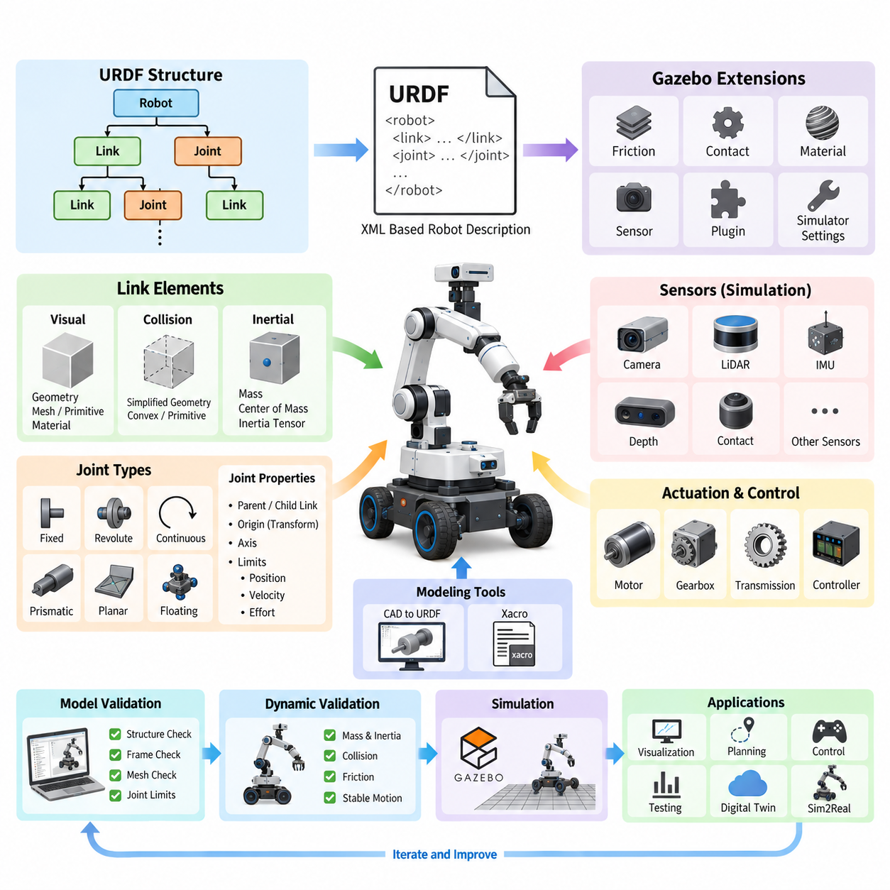
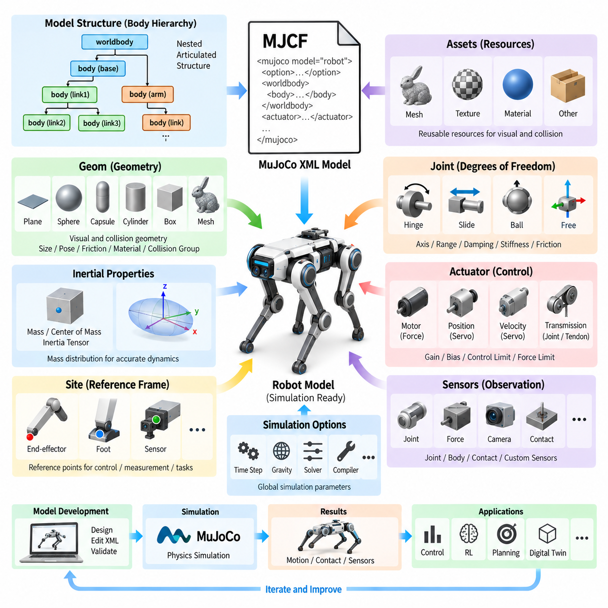
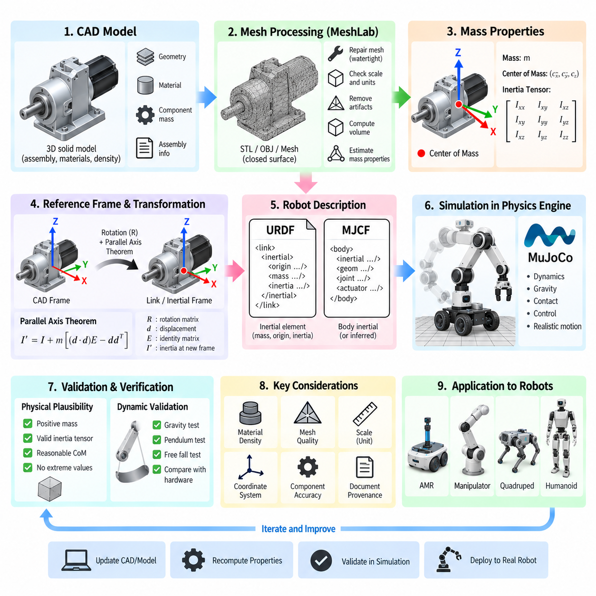
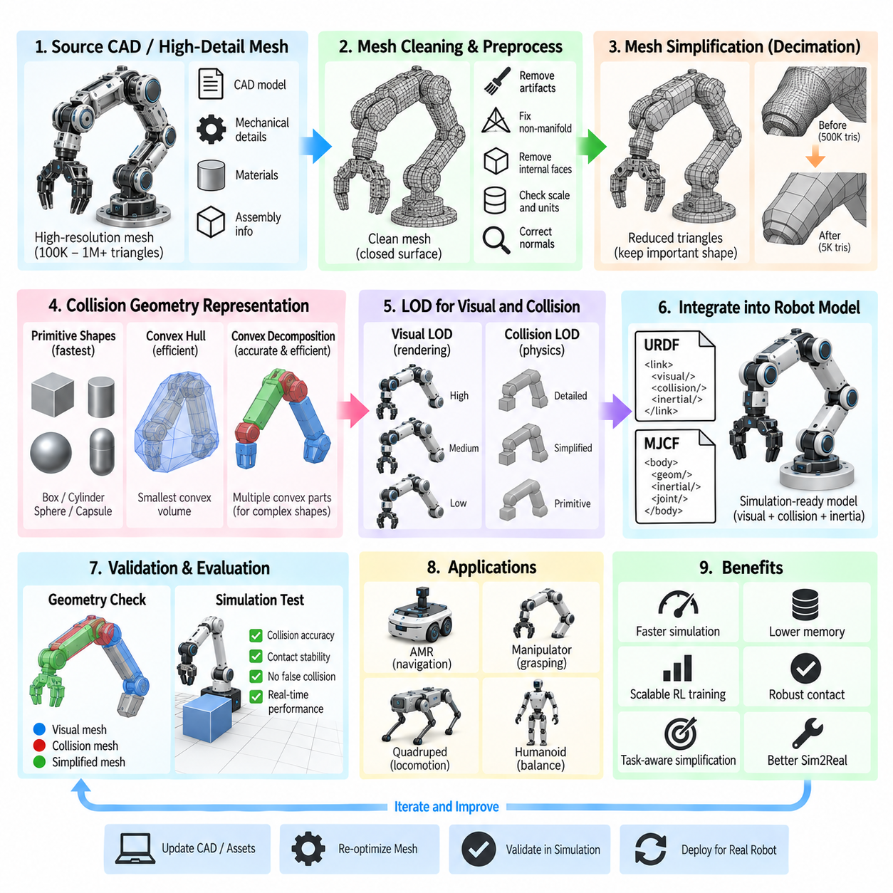
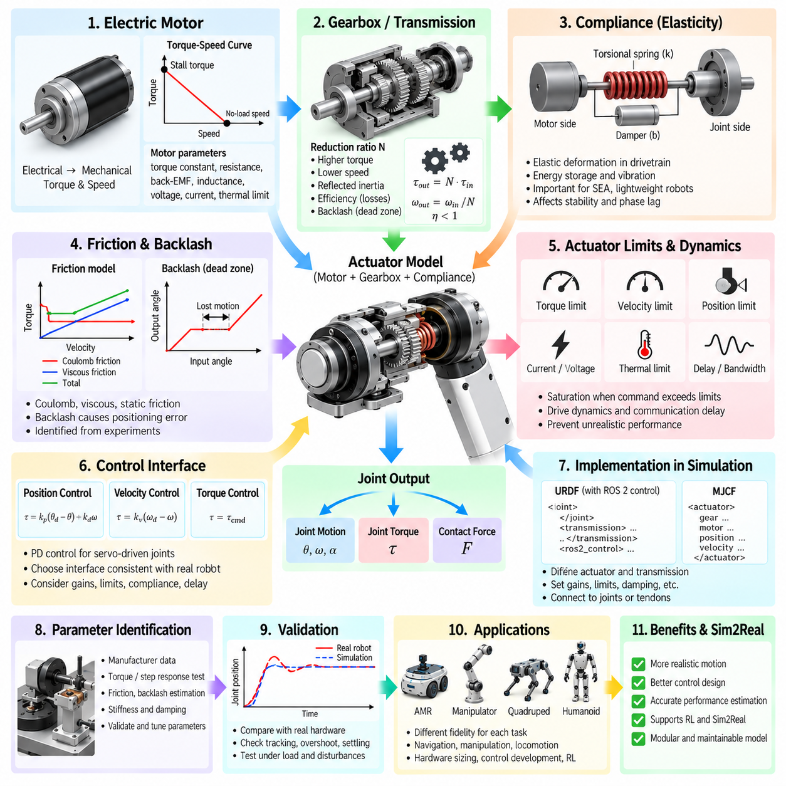
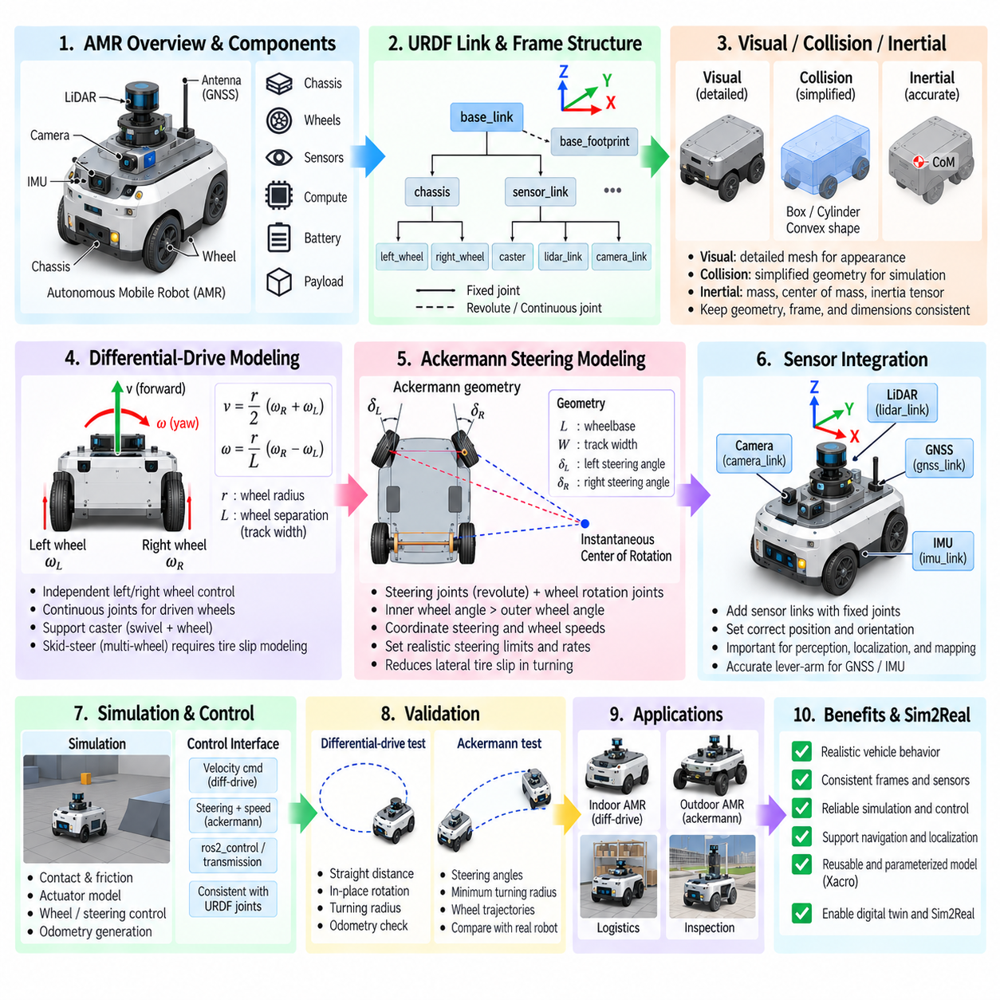
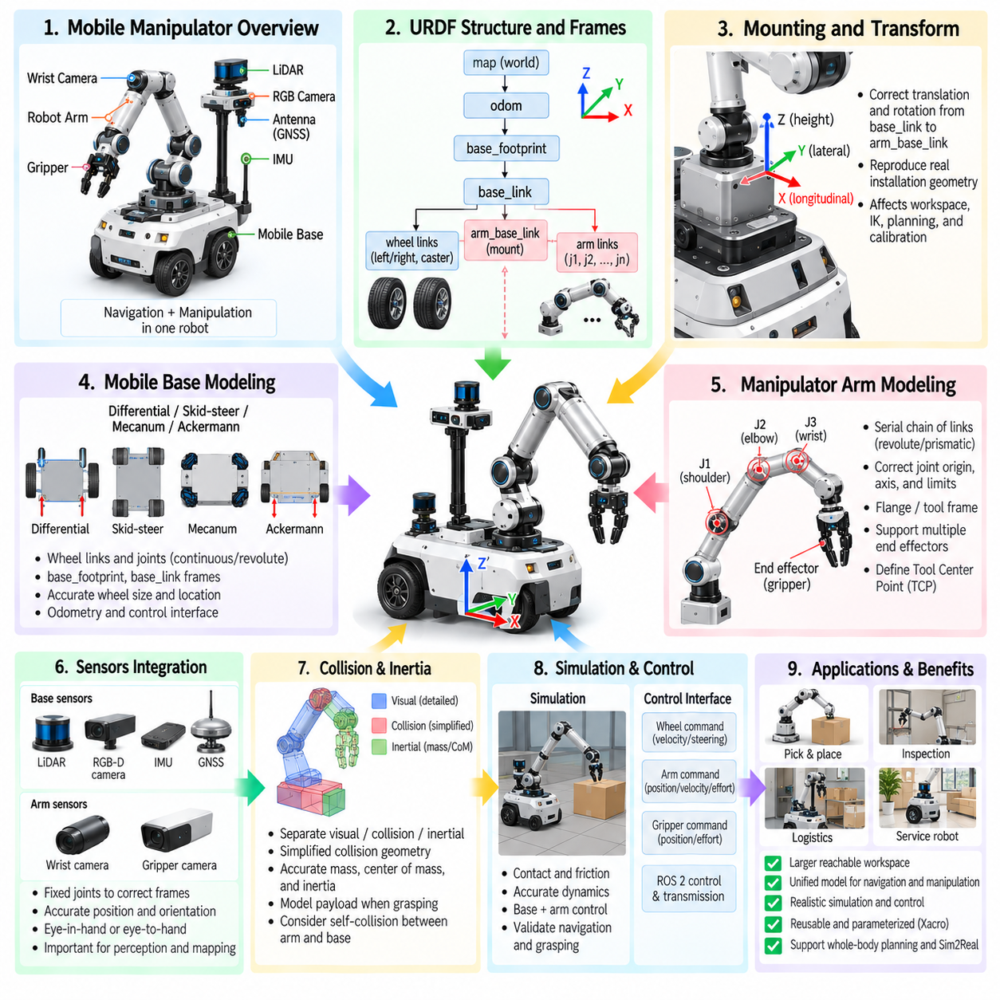
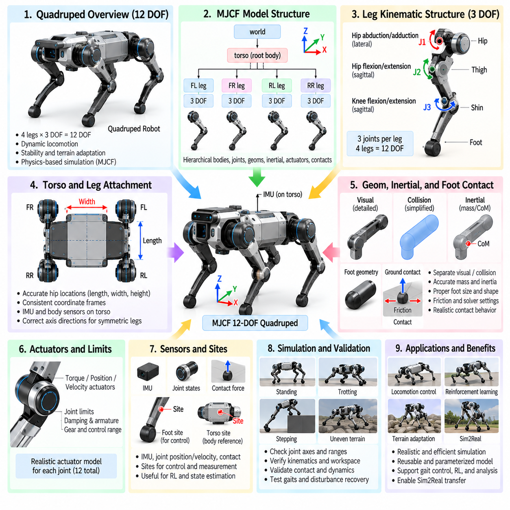
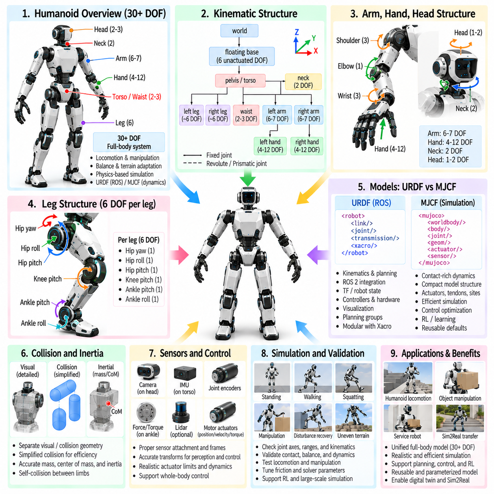
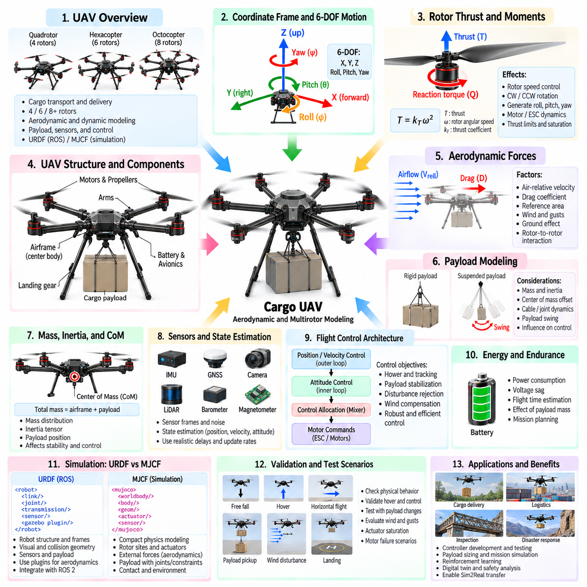

**Volume 11. Simulation and Digital Twin**

# Chapter 03. Robot Modeling URDF MJCF

## 03.01. URDF Format Specification Links Joints Gazebo Tags [w/Code]

{width="7.268055555555556in" height="7.268055555555556in"}

통합 로봇 기술 형식(URDF, Unified Robot Description Format)은 로봇의 물리적 구조와 운동학적 구조를 기술하기 위해 사용되는 XML 기반 표현 형식이다. 시뮬레이션(Simulation) 및 디지털 트윈(Digital Twin) 워크플로에서 URDF는 로봇의 형상(Geometry), 좌표 프레임(Coordinate Frame), 조인트(Joint), 관성 특성(Inertial Property), 충돌 모델(Collision Model)을 연결하는 기계 판독형 정의를 제공한다. 특히 ROS 및 ROS 2 시스템에서 동일한 구조 기술을 시각화, 운동학, 경로 계획, 제어 및 시뮬레이션에 활용할 수 있다는 점에서 중요하다.

URDF 모델은 기본적으로 조인트(Joint)로 연결된 링크(Link)의 트리(Tree) 구조로 구성된다. 링크는 섀시(Chassis), 휠(Wheel), 매니퓰레이터 링크(Manipulator Segment), 센서 하우징(Sensor Housing), 그리퍼 구성요소(Gripper Component)와 같은 강체(Rigid Body)를 나타낸다. 각 링크에는 시각 모델(Visual), 충돌 모델(Collision), 관성 모델(Inertial)을 포함할 수 있다. 이러한 분리는 개발자가 보는 형상과 물리 엔진(Physics Engine)의 충돌 계산에 사용하는 단순화된 형상이 반드시 동일할 필요가 없기 때문에 중요하다.

시각 요소(Visual Element)는 시각화 및 시뮬레이션 환경에서 링크가 어떻게 표현되는지를 정의한다. 형상은 박스(Box), 원통(Cylinder), 구(Sphere)와 같은 기본 형상(Primitive Shape) 또는 상세한 CAD 형상을 나타내는 외부 메시 파일(Mesh File)을 이용하여 표현할 수 있다. 원점 변환(Origin Transform)은 링크 프레임(Link Frame)을 기준으로 시각 형상의 위치와 방향을 지정한다. 또한 재질 정보(Material Information)를 이용하여 지원되는 애플리케이션에서 기본 색상과 텍스처(Texture)를 정의할 수 있다.

충돌 형상(Collision Geometry)은 접촉(Contact) 및 충돌 계산(Collision Calculation)에 사용되는 물리적 형상을 정의한다. 시각화에 사용하는 것과 동일한 메시를 참조할 수도 있지만, 실제 시뮬레이션 모델에서는 단순화된 기본 형상, 볼록 근사(Convex Approximation), 또는 축소된 메시(Reduced Mesh)를 사용하는 경우가 많다. 복잡한 CAD 메시는 충돌 검출(Collision Detection)의 계산 비용을 크게 증가시키고 수치적 문제를 발생시킬 수 있다. 따라서 시각 모델과 충돌 모델을 분리하면 그래픽 현실성과 계산 효율성 사이에서 효과적인 균형을 확보할 수 있다.

관성 요소(Inertial Element)는 동역학 시뮬레이션(Dynamic Simulation)에 필요한 질량 특성(Mass Property)을 정의한다. 일반적으로 링크의 질량(Mass), 질량 중심(Center of Mass)의 위치와 방향, 그리고 3차원 관성 텐서(Inertia Tensor)를 포함한다. 이러한 값은 가속도, 조인트 힘, 접촉 거동 및 전체적인 안정성에 큰 영향을 준다. 부정확하거나 물리적으로 일관되지 않은 관성 매개변수(Inertia Parameter)는 URDF 자체는 정상적으로 로딩되더라도 시뮬레이션에서 비현실적인 진동, 불안정성 또는 예상하지 못한 움직임을 발생시킬 수 있다.

조인트(Joint)는 링크 사이의 관계를 정의하고 로봇이 어떻게 움직일 수 있는지를 결정한다. 대표적인 URDF 조인트 유형에는 고정형(Fixed), 회전형(Revolute), 연속 회전형(Continuous), 직선 이동형(Prismatic), 부유형(Floating), 평면형(Planar)이 있다. 회전형 조인트는 지정된 각도 범위 내에서 회전하고, 연속 회전형 조인트는 제한 없이 회전할 수 있어 휠에 일반적으로 사용된다. 직선 이동형 조인트는 선형 이동을 제공하며, 고정형 조인트는 추가적인 자유도(Degree of Freedom)를 생성하지 않고 두 링크를 강체로 연결한다.

모든 조인트는 부모 링크(Parent Link)와 자식 링크(Child Link)를 지정하여 방향성을 가진 운동학적 트리(Kinematic Tree)를 구성한다. 조인트 원점(Joint Origin)은 부모 프레임에서 조인트 프레임으로의 변환을 정의하고, 축(Axis)은 허용되는 운동 방향을 지정한다. 조인트 제한(Joint Limit)은 위치, 속도 및 힘(Effort)을 제한할 수 있다. 프레임 정의가 정확하지 않으면 작은 축 또는 방향 오차도 운동학적 체인 전체로 전파되어 휠 움직임, 매니퓰레이터 자세 또는 센서 좌표가 잘못될 수 있다.

URDF의 트리 구조는 로봇 기술을 비교적 간단하게 해석하고 처리할 수 있게 하지만 구조적인 제약도 가진다. 표준 URDF 모델은 보다 일반적인 다물체 형식(Multibody Format)과 같은 방식으로 임의의 폐쇄 운동학적 루프(Closed Kinematic Loop)를 직접 표현할 수 없다. 따라서 평행 링크(Parallel Linkage), 복잡한 서스펜션(Complex Suspension), 폐루프 전달기구(Closed-loop Transmission)를 포함하는 메커니즘은 대상 물리 환경에 따라 근사 모델, 시뮬레이터 전용 확장 기능 또는 대체 표현 방식이 필요할 수 있다.

대규모 URDF 모델을 구축할 때는 좌표 프레임 규칙(Coordinate-frame Discipline)이 매우 중요하다. 모바일 로봇(Mobile Robot)은 base_link, 섀시, 휠, LiDAR, 카메라, IMU, GNSS 안테나, 매니퓰레이터 및 툴 중심점(Tool Center) 등에 대한 프레임을 포함할 수 있다. 이러한 프레임은 로봇 소프트웨어 스택 전체에서 사용되는 기하학적 기준 체계를 형성한다. 일관된 축 규칙(Axis Convention)과 정확한 변환(Transform)은 인지, 위치추정, 내비게이션, 제어 및 시뮬레이션 모듈이 공간 정보를 교환할 때 발생하는 통합 오류를 줄여준다.

일반적인 로봇 기술 모델은 하나의 거대한 정적 URDF 파일로 관리되지 않는 경우가 많다. ROS 기반 개발에서는 매크로(Macro), 매개변수(Parameter), 속성(Property), 재사용 가능한 구성요소를 통해 URDF를 생성하기 위해 Xacro가 널리 사용된다. 휠, 서스펜션 어셈블리(Suspension Assembly), 센서 마운트(Sensor Mount), 매니퓰레이터 링크와 같은 반복 구조를 한 번 정의한 뒤 여러 번 인스턴스화(Instantiate)할 수 있다. 또한 매개변수화를 통해 서로 관련된 로봇 변형 모델들이 중복된 기술 파일을 유지하지 않고 공통 구조 모델을 공유할 수 있다.

시뮬레이션에는 기본 URDF 명세(Specification)를 넘어서는 정보가 필요하다. Gazebo 관련 확장 기능은 링크, 조인트 및 로봇 전체에 시뮬레이터 동작을 연결할 수 있다. Gazebo 태그(Gazebo Tag)는 전통적으로 마찰(Friction), 접촉 매개변수(Contact Parameter), 재질 표현(Material Appearance), 센서 설정(Sensor Configuration), 플러그인(Plugin)과 같은 특성을 정의하는 데 사용되어 왔다. 이를 통해 기본 URDF 모델은 로봇의 구조에 집중하면서 시뮬레이션 전용 매개변수가 Gazebo 환경에서 실행하기 위한 추가 정보를 제공할 수 있다.

센서 시뮬레이션(Sensor Simulation) 역시 시뮬레이터별 설정을 통해 로봇 기술 모델에 연결할 수 있다. 카메라, 깊이 센서(Depth Sensor), LiDAR, IMU, 접촉 센서(Contact Sensor) 및 기타 가상 장치는 기본 URDF 요소만으로 완전히 표현되지 않는 매개변수를 필요로 한다. 시뮬레이션 정의에는 업데이트 주기(Update Rate), 시야각(Field of View), 해상도(Resolution), 노이즈 특성(Noise Characteristic), 측정 범위(Measurement Range), 통신 인터페이스(Communication Interface) 등이 포함될 수 있다. 해당 센서 링크와 조인트는 로봇을 기준으로 각 센서의 물리적 자세(Pose)를 설정한다.

구동(Actuation)은 구조 모델링과 실행 가능한 시뮬레이션 사이에 또 하나의 계층을 형성한다. 조인트 정의는 두 링크가 어떻게 움직일 수 있는지를 규정하지만, 시뮬레이터 또는 제어기는 해당 조인트가 어떻게 구동되는지에 대한 추가 정보를 필요로 한다. ROS 2 제어 아키텍처(Control Architecture)는 일반적으로 URDF에 기술된 조인트를 하드웨어 인터페이스(Hardware Interface), 트랜스미션(Transmission), 컨트롤러(Controller), 시뮬레이터 통합 구성요소와 연결한다. 이러한 분리를 통해 유사한 제어 소프트웨어를 먼저 시뮬레이션 하드웨어 인터페이스에 적용하고 이후 실제 로봇 하드웨어에 적용할 수 있다.

Gazebo 플러그인(Gazebo Plugin)은 기본 URDF만으로 표현되지 않는 구동 시스템, 컨트롤러, 센서 및 사용자 정의 동역학(Custom Dynamics) 등의 동작을 구현하는 수단으로 사용되어 왔다. 예를 들어 차동 구동 모바일 로봇(Differential-drive Mobile Robot)은 두 개의 휠 조인트만으로는 충분하지 않으며, 시뮬레이터가 속도 명령을 휠 동작으로 변환하고 이에 대응하는 운동 정보를 발행해야 한다. 현대 Gazebo 통합 방식은 기존 Gazebo Classic 규칙에서 발전해 왔으므로 모델 작성자는 구조적 URDF 정보와 시뮬레이터 버전별 확장 기능을 구분해야 한다.

모델 검증(Model Validation)은 물리 매개변수를 조정하기 전에 구조적 정확성을 확인하는 것부터 시작해야 한다. 링크-조인트 그래프(Link-joint Graph)는 의도한 계층 구조를 형성해야 하며, 참조된 메시 파일에 접근할 수 있어야 하고, 원점과 축이 일관되어야 하며, 조인트 제한이 실제 메커니즘을 반영해야 한다. 이후 시각화 도구를 이용하여 동적 시뮬레이션을 적용하기 전에 형상과 프레임 배치를 확인할 수 있다. 이러한 단계적 검증 과정은 물리 매개변수가 근본적인 모델링 오류를 가리는 것을 방지하고 디버깅(Debugging)을 체계적으로 수행할 수 있도록 한다.

동역학 검증(Dynamic Validation)에서는 질량 분포(Mass Distribution), 관성 텐서, 충돌 형상, 마찰, 조인트 제한 및 액추에이터 동작(Actuator Behavior)을 추가로 확인해야 한다. 시각화 도구에서 올바르게 보이는 모델도 중력이나 접촉 조건에서는 잘못 동작할 수 있다. 질량 중심이나 관성이 비현실적이면 휠이 과도하게 미끄러지거나, 매니퓰레이터가 진동하거나, 로봇 전체가 불안정해질 수 있다. 따라서 로봇 모델링은 단순한 CAD 형상 변환이 아니라 물리 시스템 엔지니어링(Physical System Engineering)의 관점에서 다루어야 한다.

이 장의 구조에서는 URDF를 MJCF, 관성 계산(Inertia Calculation), 메시 최적화(Mesh Optimization), 액추에이터 모델링(Actuator Modeling), AMR 모델링, 모바일 매니퓰레이션(Mobile Manipulation), 사족보행 로봇(Quadruped), 휴머노이드(Humanoid), 화물 무인항공기(Cargo UAV) 모델링과 연계하여 다룬다. 이러한 구성은 중요한 공학적 원칙을 보여준다. 즉 로봇 기술 형식(Robot Description Format)은 더욱 정밀한 기계적 모델, 액추에이터 모델 및 응용 분야별 시뮬레이션 모델을 구축하기 위한 기반이다.

디지털 트윈 및 시뮬레이션 주도 개발(Simulation-driven Development)에서 잘 설계된 URDF는 다양한 엔지니어링 활동이 공유하는 구조적 기준 모델이 될 수 있다. CAD 기반 형상, 센서 배치, 운동학적 관계, 제어 인터페이스 및 시뮬레이션 설정을 일관된 로봇 계층 구조를 중심으로 관리할 수 있다. 전체 소프트웨어 구조에서도 로봇 모델링(Robot Modeling)은 시뮬레이션 및 디지털 트윈(Simulation and Digital Twin) 영역에 배치되며, 물리 엔진, 센서 시뮬레이션, 환경 모델링, 실세계 전이(Sim2Real Transfer), 검증 워크플로와 연결된다.

따라서 가장 유지보수성이 높은 접근 방법은 URDF를 단순한 시각화 파일이 아니라 구조화된 엔지니어링 모델(Structured Engineering Model)로 취급하는 것이다. 링크 프레임은 문서화된 규칙을 따라야 하고, 조인트는 실제 기계적 제약조건(Mechanical Constraint)을 반영해야 하며, 관성 매개변수는 신뢰할 수 있는 CAD 데이터 또는 측정 데이터에서 가져와야 한다. 충돌 형상은 목적에 맞게 최적화해야 하며, 시뮬레이터 전용 Gazebo 태그는 가능한 경우 분리하여 기본 로봇 기술 모델의 이해 가능성, 재사용성 및 이식성(Portability)을 유지해야 한다.

궁극적으로 URDF는 로봇의 기계적 아키텍처(Mechanical Architecture)와 그 물리적 구조를 이해하고 처리해야 하는 소프트웨어 시스템 사이를 연결하는 가교 역할을 한다. 링크는 강체를 정의하고, 조인트는 허용되는 운동을 규정하며, 관성과 충돌 특성은 물리 시뮬레이션을 가능하게 하고, Gazebo 확장 기능은 시뮬레이션 전용 동작을 추가한다. 이러한 요소들이 일관되게 모델링되면 동일한 로봇 기술 모델을 시각화, ROS 2 통합, 컨트롤러 개발, 시뮬레이션 기반 시험, 디지털 트윈 및 이후의 실세계 전이(Sim2Real) 엔지니어링까지 폭넓게 활용할 수 있다.

## 03.02. MJCF Format Deep Dive Body Geom Joint Actuator [w/Code]

{width="7.268055555555556in" height="7.268055555555556in"}

MJCF(MuJoCo XML Modeling Format)는 MuJoCo 물리 엔진(Physics Engine)에서 사용하는 개념을 중심으로 동적 시스템(Dynamic System)을 직접 구성하도록 설계된 계층형 모델 기술 언어(Hierarchical Model-description Language)이다. 로봇 시뮬레이션(Robot Simulation)에서 바디(Body), 형상(Geometry), 조인트(Joint), 관성 특성(Inertial Property), 액추에이터(Actuator), 센서(Sensor), 제약조건(Constraint), 시뮬레이션 관련 매개변수를 하나의 XML 구조로 기술한다. 따라서 기하학적 외형뿐만 아니라 동적 거동이 중요한 관절형 로봇(Articulated Robot)의 모델링에 특히 적합하다.

MJCF의 기본적인 구조 요소는 바디(Body)이다. 바디는 로봇의 물리적·운동학적 구조를 나타내는 중첩된 계층 구조(Nested Hierarchy)를 형성하며, 각각의 자식 바디(Child Body)는 부모 바디(Parent Body)를 기준으로 정의된다. 하나의 바디에는 형상(Geometry), 조인트(Joint), 사이트(Site), 카메라(Camera), 조명(Light), 추가적인 자식 바디가 포함될 수 있다. 이러한 재귀적 구조(Recursive Structure)를 통해 매니퓰레이터, 사족보행 로봇, 휴머노이드, 모바일 매니퓰레이터와 같은 복잡한 기구를 관절형 다물체 시스템(Articulated Multibody System)으로 자연스럽게 표현할 수 있다.

월드바디(Worldbody) 요소는 물리적 장면(Physical Scene)의 루트(Root)를 제공하며 시뮬레이션에 참여하는 바디와 형상을 포함한다. 로봇의 베이스(Base)는 월드바디 바로 아래에 위치할 수 있으며, 팔, 다리, 휠 또는 기타 기구에 속하는 링크는 그 아래에 중첩된다. 위치(Position)와 방향(Orientation) 속성은 부모와 자식 좌표계 사이의 변환을 정의하며, XML 계층 구조를 통해 순기구학(Forward Kinematics)과 동역학 계산(Dynamic Calculation)에 필요한 공간적 관계를 표현할 수 있다.

형상(Geometry)은 주로 지오메트리 요소(Geom Element)를 통해 표현된다. 지오메트리는 평면(Plane), 구(Sphere), 캡슐(Capsule), 타원체(Ellipsoid), 원통(Cylinder), 박스(Box), 메시 기반 형상(Mesh-based Geometry)과 같은 물리적 형태를 정의할 수 있다. 설정에 따라 지오메트리는 시각화와 접촉 계산(Contact Computation)에 모두 사용될 수 있다. 크기, 위치, 방향, 밀도, 질량, 마찰, 충돌 필터링 매개변수, 재질 참조(Material Reference), 외형 정보 등을 속성으로 지정할 수 있다.

기본 형상(Primitive Geometry)은 효율적이고 수치적으로 안정적인 충돌 계산을 제공할 수 있기 때문에 동역학 시뮬레이션에서 특히 중요하다. 상세 메시(Detailed Mesh)는 사실적인 외형이 필요하거나 단순한 기본 형상만으로 실제 물리적 형상을 충분히 근사할 수 없을 때 유용하다. 실용적인 MJCF 모델에서는 그래픽 충실도(Graphical Fidelity)가 물리 시뮬레이션 성능을 불필요하게 저하시키지 않도록 상세한 시각 형상과 단순화된 충돌 형상을 함께 사용하는 경우가 많다.

정확한 동역학을 구현하려면 바디에 물리적으로 타당한 질량(Mass)과 관성 특성(Inertia Property)이 필요하다. MJCF에서는 명시적으로 지정한 관성 정보로 이러한 특성을 설정하거나 적절한 조건에서 연결된 형상으로부터 계산할 수 있다. 질량 분포(Mass Distribution), 질량 중심(Center of Mass), 회전 관성(Rotational Inertia)은 각 바디가 중력, 조인트 힘, 충격 및 접촉력에 어떻게 반응하는지를 결정한다. 따라서 운동학적 구조가 올바르게 보이더라도 잘못된 관성 매개변수는 불안정하거나 비현실적인 거동을 발생시킬 수 있다.

조인트(Joint)는 바디와 부모 바디 사이의 자유도(Degree of Freedom)를 결정한다. MJCF는 힌지(Hinge), 슬라이드(Slide), 볼(Ball), 자유 조인트(Free Joint) 등의 조인트 유형을 지원한다. 힌지 조인트는 하나의 축을 중심으로 회전 운동을 제공하고, 슬라이드 조인트는 하나의 축을 따라 병진 운동을 제공한다. 볼 조인트는 3차원 회전 자유도를 허용하며, 자유 조인트는 병진과 회전을 제한 없이 허용하므로 보행 로봇, 자유 이동 객체, 항공 플랫폼과 같은 부유 베이스 시스템(Floating-base System)에 유용하다.

조인트 설정은 단순히 운동 유형을 선택하는 것 이상을 포함한다. 조인트 축(Joint Axis), 기준 구성(Reference Configuration), 운동 범위(Motion Range), 감쇠(Damping), 강성(Stiffness), 마찰 손실(Friction Loss) 및 기타 동적 특성을 속성으로 정의할 수 있다. 이러한 매개변수를 통해 순수한 운동학적 기술만으로 표현하기 어려운 기계적 거동을 모델링할 수 있다. 특히 조인트 감쇠와 마찰은 시뮬레이션의 움직임을 실제 로봇의 응답과 일치시키는 데 중요하다.

MJCF는 바디에 연결되는 경량 기준 프레임(Lightweight Reference Frame)인 사이트(Site)도 제공한다. 사이트는 물리적인 질량이나 충돌 형상을 나타낼 필요가 없으며, 대신 엔드 이펙터(End-effector), 발 접촉점(Foot Contact Point), 센서 원점(Sensor Origin), 텐던 부착 위치(Tendon Attachment Location), 제어 목표(Control Target)와 같은 중요한 공간적 위치를 지정할 수 있다. 따라서 불필요한 강체를 추가하지 않고 측정, 제어, 역기구학(Inverse Kinematics), 강화학습 관측(Reinforcement-learning Observation), 작업 정의(Task Definition)에 활용할 수 있다.

에셋(Asset)은 재사용 가능한 자원을 물리적인 바디 계층 구조와 분리하여 정의할 수 있도록 한다. 메시(Mesh), 텍스처(Texture), 재질(Material) 등의 자원을 한 번 정의한 후 여러 모델 요소에서 참조할 수 있다. 이러한 분리는 복잡한 로봇 기술 모델의 유지보수를 용이하게 하고 중복을 감소시킨다. 따라서 CAD에서 생성된 메시 자원을 절차적 형상(Procedural Geometry) 및 시뮬레이션용 기본 형상과 함께 사용하면서도 로봇의 운동학적 구조와 논리적으로 분리하여 관리할 수 있다.

MJCF의 주요 강점 중 하나는 명시적인 액추에이터 모델(Actuator Model)이다. 조인트가 허용되는 운동을 정의한다면 액추에이터는 제어 입력(Control Input)이 시스템 내부에서 어떻게 힘이나 운동을 발생시키는지를 정의한다. 액추에이터는 모터와 유사한 힘 생성, 위치 서보(Position Servo), 속도 서보(Velocity Servo), 보다 일반적인 제어 관계를 표현할 수 있다. 이러한 기계적 자유도와 구동의 분리를 통해 하나의 관절형 기구에서 수동 조인트(Passive Joint)와 능동 제어 조인트(Actively Controlled Joint)를 함께 모델링할 수 있다.

모터 액추에이터(Motor Actuator)는 일반적으로 제어 신호를 조인트 또는 전달장치(Transmission)를 통해 적용되는 일반화된 힘(Generalized Force)으로 변환한다. 위치 및 속도 액추에이터는 제어 입력이 목표 위치 또는 목표 속도에 대응하는 서보형 동작을 표현할 수 있다. 이득(Gain), 바이어스(Bias), 제어 제한(Control Limit), 힘 제한(Force Limit)은 명령이 물리적 동작으로 변환되는 과정에 영향을 준다. 이러한 매개변수는 실제 모터, 드라이브 및 임베디드 제어기(Embedded Controller)의 동작을 시뮬레이션에서 근사할 때 중요하다.

전달 관계(Transmission Relationship)는 액추에이터와 액추에이터가 구동하는 기계 구성요소를 연결한다. 직접적인 조인트 구동이 일반적이지만 MJCF는 조인트, 텐던(Tendon), 사이트 등을 이용하는 보다 복잡한 관계도 표현할 수 있다. 이는 케이블 구동 시스템(Cable-driven System), 결합 기구(Coupled Mechanism), 로봇 핸드(Robotic Hand), 생체역학 모델(Biomechanical Model)처럼 액추에이터 좌표와 개별 조인트 좌표가 직접 대응하지 않는 기구에 유용하다. 따라서 액추에이터 계층은 로봇 기계 구조와 제어 시스템을 연결하는 중요한 역할을 수행한다.

접촉 거동(Contact Behavior)은 지오메트리 설정에 크게 의존한다. 마찰 계수(Friction Coefficient), 접촉 차원(Contact Dimensionality), 충돌 그룹(Collision Group), 솔버 관련 매개변수(Solver-related Parameter)는 물체가 접촉할 때 어떻게 상호작용하는지를 결정한다. 모바일 로봇이나 보행 로봇에서는 이러한 매개변수가 휠 접지력, 발과 지면의 상호작용, 미끄러짐 및 안정성에 영향을 준다. 매니퓰레이터에서는 파지와 물체 조작에 영향을 미치므로 정확한 접촉 모델링에는 적절한 형상과 물리적으로 타당한 접촉 매개변수가 모두 필요하다.

MJCF는 대규모 모델에서 반복을 줄일 수 있도록 기본값(Default)과 재사용 가능한 설정 패턴(Configuration Pattern)을 지원한다. 관련된 조인트, 지오메트리 또는 액추에이터에 공통으로 적용되는 특성을 기본 클래스(Default Class)로 그룹화하고 개별 요소에서 이를 상속(Inheritance)할 수 있다. 예를 들어 사족보행 로봇은 네 개의 다리에 유사한 특성을 재사용하면서 서로 다른 매개변수만 재정의할 수 있다. 이러한 방식은 모델의 일관성을 향상시키고 대규모 로봇 모델을 보다 쉽게 수정, 검토 및 유지보수할 수 있게 한다.

MJCF의 등가 제약(Equality), 텐던(Tendon), 센서(Sensor), 접촉 관련 기능은 모델을 단순한 강체 트리(Rigid-body Tree) 이상으로 확장한다. 등가 제약은 모델 구성요소 사이의 관계를 강제할 수 있고, 텐던은 공간적 또는 고정 길이 전달 구조를 표현할 수 있다. 센서는 제어 알고리즘과 학습 시스템에 필요한 물리량을 제공할 수 있다. 이러한 기능을 통해 MJCF는 결합 동역학(Coupled Dynamics), 복잡한 구동, 접촉 중심 조작(Contact-rich Manipulation), 고급 보행 제어(Advanced Locomotion)를 포함하는 모델에 활용될 수 있다.

컴파일러(Compiler)와 옵션(Option) 영역은 모델이 어떻게 해석되고 시뮬레이션되는지에 영향을 준다. 컴파일러 설정에서는 각도 규칙(Angle Convention), 메시 처리(Mesh Processing), 관성 처리(Inertia Handling) 및 기타 모델 생성 동작을 정의할 수 있다. 시뮬레이션 옵션은 시간 간격(Time Step), 중력(Gravity), 수치 적분(Numerical Integration), 솔버 동작(Solver Behavior)과 같은 전역 특성을 제어한다. 이러한 전역 설정을 개별 바디 정의와 분리함으로써 전체 로봇 계층 구조를 변경하지 않고 수치적 거동을 조정할 수 있다.

모델 개발(Model Development)은 구조적 검증(Structural Validation)에서 시작하여 동역학 검증(Dynamic Validation)으로 진행해야 한다. 먼저 바디 계층 구조, 조인트 축, 형상 변환(Geometry Transform), 액추에이터 연결을 검증해야 한다. 이후 질량, 관성, 감쇠, 마찰, 액추에이터 제한, 접촉 특성, 솔버 설정을 단계적으로 조정할 수 있다. 이러한 단계적 접근은 자유도가 많은 시스템에서 특히 중요하며, 구조적 오류가 제어기 불안정성이나 잘못된 물리 매개변수 문제로 오인되는 것을 방지한다.

MJCF는 관측(Observation), 액추에이터, 접촉, 동적 매개변수가 물리 모델과 밀접하게 표현되기 때문에 강화학습(Reinforcement Learning) 및 제어 연구(Control Research)에 특히 효과적이다. 로봇 정책(Robot Policy)은 액추에이터 제어 변수와 상호작용하면서 시뮬레이션된 조인트, 바디, 접촉 및 센서 상태를 입력으로 받을 수 있다. 마찰, 질량, 감쇠 및 액추에이터 특성 등의 매개변수를 변화시켜 강건한 정책 학습(Robust Policy Training)과 실세계 전이(Sim2Real Transfer)를 위한 다양한 시뮬레이션 조건을 생성할 수도 있다.

사족보행 로봇(Quadruped)과 휴머노이드(Humanoid)의 경우 중첩된 바디 계층 구조를 통해 다리, 팔, 몸통 및 부유 베이스(Floating Base)를 자연스럽게 표현할 수 있으며, 힌지 조인트를 통해 각각의 관절 자유도를 정의할 수 있다. 지오메트리는 충돌 및 접촉 표면을 설정하고 액추에이터는 보행 정책(Locomotion Policy)을 위한 제어 인터페이스를 제공한다. 이러한 관계로 인해 MJCF 모델링은 사족보행 구조, 휴머노이드 모델링, 액추에이터 모델링 및 대규모 병렬 강화학습 시뮬레이션(Massively Parallel Reinforcement-learning Simulation)과 밀접하게 연결된다.

따라서 MJCF는 단순히 로봇 형상을 표현하는 XML 형식 이상으로 이해해야 한다. 바디 계층 구조는 다물체 시스템(Multibody System)을 구성하고, 지오메트리는 물리적·시각적 형상을 정의하며, 조인트는 자유도를 설정하고, 액추에이터는 제어 명령을 기계적 동작으로 변환한다. 여기에 관성, 접촉, 제약조건, 센서 및 솔버 설정이 결합되면서 시뮬레이션, 제어 개발, 강화학습, 실세계 전이(Sim2Real) 엔지니어링에 활용할 수 있는 실행 가능한 동역학 모델(Executable Dynamic Model)이 완성된다.

## 03.03. Inertia Property Calculation from CAD meshlab [w/Code]

{width="7.268055555555556in" height="7.268055555555556in"}

정확한 관성 특성(Inertia Properties)은 물리적으로 의미 있는 로봇 시뮬레이션(Robot Simulation)의 기본 요소이다. 모든 강체(Rigid Body)는 질량 분포(Mass Distribution)에 따라 힘과 토크(Torque)에 반응하기 때문이다. 따라서 로봇 링크(Robot Link)에는 대략적인 전체 질량뿐만 아니라 실제 형상과 재질 분포를 반영한 질량 중심(Center of Mass)과 관성 텐서(Inertia Tensor)가 필요하다. 이러한 값의 오류는 로봇 형상과 조인트가 정확하더라도 비현실적인 가속, 진동, 접촉 거동 및 제어기 응답을 발생시킬 수 있다.

강체 시뮬레이션(Rigid-body Simulation)에 필요한 주요 질량 특성(Mass Properties)은 질량(Mass), 질량 중심(Center of Mass), 관성 텐서(Inertia Tensor)이다. 질량은 선형 가속도에 대한 저항을 나타내며, 질량 중심은 병진 동역학(Translational Dynamics)에서 분산된 질량을 하나의 점으로 표현할 수 있는 위치를 나타낸다. 관성 텐서는 3차원 축을 중심으로 한 각가속도(Angular Acceleration)에 대한 저항을 나타내며, 외력, 액추에이터 토크, 중력 또는 접촉력이 작용할 때 링크가 어떻게 회전하는지를 결정한다.

관성 텐서(Inertia Tensor)는 주성분(Principal Term) Ixx, Iyy, Izz와 교차 성분(Cross Term) Ixy, Ixz, Iyz를 포함하는 대칭 3×3 행렬(Symmetric Three-by-three Matrix)로 표현된다. 대각 성분(Diagonal Term)은 좌표축을 중심으로 한 회전 관성을 나타내고, 비대각 관성곱(Product of Inertia)은 비대칭 질량 분포 또는 주관성축(Principal Inertia Axis)과 정렬되지 않은 좌표 프레임 때문에 발생하는 결합 관계를 나타낸다. CAD, URDF, MJCF 및 물리 엔진 사이에서 특성을 전달하려면 이러한 성분을 정확하게 해석해야 한다.

CAD 소프트웨어는 원본 3차원 솔리드 모델(Three-dimensional Solid Model)에 기하학적 체적과 조립체 정보가 포함되어 있기 때문에 로봇의 질량 특성을 계산하기 위한 가장 신뢰할 수 있는 출발점 중 하나이다. 적절한 재질과 밀도(Density)를 구성요소에 지정하면 CAD 도구를 통해 전체 질량, 질량 중심, 주축(Principal Axis), 관성 텐서를 계산할 수 있다. 로봇 링크에 복잡한 하우징, 브래킷, 모터, 배터리, 기어 또는 내부 공동이 포함된 경우 단순한 기하학 공식으로 관성을 추정하는 것보다 이러한 결과가 일반적으로 더 적합하다.

CAD에서 계산된 값의 신뢰성은 원본 모델의 정확성에 의해 결정된다. 누락된 내부 구성요소, 잘못된 재질 밀도, 단순화된 조립체, 모델에서 제외된 체결부품(Fastener), 임시 형상(Placeholder Geometry)은 질량 중심과 관성을 크게 변화시킬 수 있다. 따라서 단순한 기계적 패키징(Mechanical Packaging)을 위한 형상과 동역학 계산을 위한 질량 대표 CAD 모델(Mass-representative CAD Model)을 구분해야 한다. 중요한 로봇 링크의 경우 실제 측정한 구성요소 질량을 이용하여 CAD 기반 특성을 검증하거나 보정할 수 있다.

좌표계(Coordinate System)는 관성 데이터를 변환하는 과정에서 발생하는 주요 오류 원인 중 하나이다. CAD 애플리케이션은 전체 조립체 프레임(Global Assembly Frame), 구성요소 원점(Component Origin), 질량 중심 또는 주관성 프레임(Principal Inertia Frame)을 기준으로 관성 텐서를 출력할 수 있다. 반면 로봇 기술 형식(Robot Description Format)은 다른 링크 또는 관성 프레임을 기준으로 값을 요구할 수 있다. 따라서 수치만 직접 복사하지 말고 출력된 관성 텐서의 기준점과 방향을 함께 기록해야 한다.

하나의 점을 기준으로 알려진 관성을 다른 점을 기준으로 변환해야 하는 경우 평행축 정리(Parallel-axis Theorem)를 이용한다. 관성 텐서는 원래 기준점과 새로운 기준점 사이의 변위(Displacement)와 질량에 따라 변화한다. CAD가 조립체 원점을 기준으로 관성을 출력하지만 시뮬레이션 모델에서는 질량 중심을 관성 프레임으로 사용하는 경우 이러한 변환이 특히 중요하다. 이를 무시하면 수치적으로는 유효하지만 물리적으로는 잘못된 모델이 생성될 수 있다.

좌표 프레임의 회전(Rotation of Coordinate Frames)도 명시적으로 처리해야 한다. CAD 좌표축이 로봇 링크의 좌표축과 다르면 관성 텐서를 대상 좌표계로 변환해야 한다. 프레임 사이에 임의의 회전이 존재하는 경우 Ixx, Iyy, Izz의 순서만 변경하는 것으로는 일반적으로 충분하지 않으며, 비대각 성분을 포함한 전체 텐서를 변환해야 한다. 관성 프레임을 주관성축과 정렬하면 관성곱 성분을 거의 0에 가깝게 만들어 표현을 단순화할 수 있다.

원본 솔리드 CAD 모델 대신 정리된 폴리곤 메시(Polygon Mesh)를 사용할 수 있는 경우 MeshLab을 이용하여 관성 특성 추정을 지원할 수 있다. 메시 기반 워크플로에서는 폐곡면 표현(Closed Surface Representation)으로부터 기하학적 체적, 질량 중심 및 관성 관련 값을 추정할 수 있다. 이는 로봇 자산이 STL, OBJ 또는 기타 폴리곤 형식으로 제공되는 경우 유용하다. 하지만 체적 기반 질량 특성이 의미를 가지려면 메시가 단순한 시각적 표면이 아니라 밀폐된 물리적 체적(Watertight Physical Volume)을 나타내야 한다.

메시 품질(Mesh Quality)은 계산된 물리 특성에 직접적인 영향을 준다. 구멍(Hole), 중복 면(Duplicated Face), 자기 교차(Self-intersection), 비다양체 모서리(Non-manifold Edge), 일관되지 않은 면 방향, 분리된 조각(Disconnected Fragment), 퇴화 삼각형(Degenerate Triangle)은 체적 계산을 왜곡할 수 있다. 따라서 질량 특성을 추출하기 전에 메시를 검사하고 필요한 경우 수정해야 한다. 렌더링(Rendering)은 일부 기하학적 결함을 허용할 수 있으므로 시각적으로 정상적인 모델이 반드시 물리 계산에도 적합한 것은 아니다.

스케일(Scale)은 CAD에서 메시로 변환하는 워크플로에서 또 하나의 핵심 요소이다. 예를 들어 STL 파일은 보편적으로 고정된 물리 단위 규칙을 자체적으로 제공하지 않기 때문에 밀리미터 단위로 내보낸 모델을 다른 애플리케이션에서 미터 단위로 해석할 수 있다. 체적은 선형 크기의 세제곱에 비례하고 관성은 질량과 거리 제곱에 영향을 받기 때문에 단위 오류는 계산된 물리 특성에 매우 큰 차이를 발생시킨다. 따라서 메시 기반 계산 결과를 사용하기 전에 알려진 실제 치수와 비교하여 크기를 반드시 검증해야 한다.

메시 기반 관성 계산(Mesh-based Inertia Calculation)에는 밀도에 대한 가정도 필요하다. 균질한 구성요소(Homogeneous Component)의 경우 기하학적 체적에 재질 밀도를 곱하여 질량을 계산하고 이에 따라 관성값을 일관되게 조정할 수 있다. 또는 실제 구성요소의 질량을 알고 있다면 기하학적 계산 결과를 측정된 질량에 맞추어 정규화(Normalization)할 수 있다. 내부 전자장치, 모터, 배선 및 공동을 단일 재질 밀도로 정확하게 표현하기 어려운 로봇 조립체에서는 이러한 방법이 보다 실용적일 수 있다.

여러 재질로 구성된 로봇 조립체를 균일 밀도 메시(Uniform-density Mesh)로 단순하게 취급해서는 안 된다. 알루미늄 프레임, 강철 샤프트, 플라스틱 커버, 모터, 배터리, 컴퓨팅 하드웨어 및 센서는 매우 불균일한 질량 분포를 형성할 수 있다. 보다 적절한 방법은 구성요소 수준의 특성을 각각 계산하여 수학적으로 결합하거나 CAD에서 필요한 구성요소를 유지하는 것이다. 시뮬레이션 효율을 위해 단순화된 충돌 형상을 사용할 수 있지만, 이것을 반드시 질량 특성 계산의 원본으로 사용해야 하는 것은 아니다.

URDF는 각 링크의 관성 요소(Inertial Element) 내부에 관성 정보를 표현한다. 질량값은 링크 질량을 정의하고, 관성 원점(Inertial Origin)은 링크를 기준으로 질량 중심 프레임을 지정하며, 여섯 개의 독립적인 관성값은 대칭 관성 텐서를 정의한다. 가능하면 이러한 매개변수는 시각 메시(Visual Mesh)에서 단순 추정하지 말고 실제 물리 모델을 기반으로 생성해야 한다. 시각 표현, 충돌 표현, 관성 표현은 각각 서로 다른 공학적 목적을 가지므로 독립적으로 관리하는 것이 적절하다.

MJCF 역시 바디의 질량 특성을 정의하는 관련 기능을 제공하며, 모델 설정에 따라 형상으로부터 특정 특성을 추론할 수도 있다. 그러나 실제 로봇 내부의 질량 분포를 외부 형상만으로 재구성할 수 없는 경우 명시적으로 입력한 CAD 기반 관성값이 중요하다. URDF와 MJCF 중 어느 형식을 사용하더라도 목표는 동일하다. 즉 시뮬레이터에 실제 기계 시스템의 병진 및 회전 응답을 근사할 수 있는 강체 표현(Rigid-body Representation)을 제공하는 것이다.

복잡한 시뮬레이션 시나리오를 실행하기 전에 물리적 타당성 검사(Physical Plausibility Check)를 수행해야 한다. 질량값은 양수여야 하고, 주관성 모멘트(Principal Moment of Inertia)는 물리적으로 유효해야 하며, 관성 텐서는 실제로 구현 가능한 질량 분포와 일치해야 한다. 지나치게 작은 관성값은 수치적 불안정성(Numerical Instability)을 발생시킬 수 있고, 비현실적으로 큰 값은 조인트의 응답을 지나치게 느리게 만들 수 있다. 시뮬레이션 엔진이 잘못된 관성을 경고하거나 자동 보정할 수 있지만 이러한 자동 수정이 공학적 검증을 대신해서는 안 된다.

질량 중심의 시각화(Visualization)는 간단하면서도 효과적인 검증 방법이다. 계산된 질량 중심은 모터, 배터리, 구조 부재, 탑재물(Payload) 및 기타 무거운 구성요소의 위치를 고려할 때 물리적으로 타당한 위치에 존재해야 한다. 예를 들어 자율이동로봇(AMR, Autonomous Mobile Robot)에서는 대형 배터리 팩이 질량 중심을 섀시 하부 방향으로 크게 이동시킬 수 있다. 매니퓰레이터와 보행 로봇에서는 잘못된 질량 중심이 중력 보상(Gravity Compensation), 균형 제어, 보행 거동 및 액추에이터 부하를 크게 왜곡할 수 있다.

정적 특성 검증(Static Property Verification) 이후에는 동역학 검증(Dynamic Validation)을 수행해야 한다. 중력, 알려진 힘 또는 알려진 토크 조건에서 개별 조인트를 작동시키고 시뮬레이션된 가속도와 움직임을 관찰할 수 있다. 진자 형태의 시험(Pendulum-like Test)은 회전 관성 오류를 확인하는 데 유용하고, 자유낙하 및 중력 보상 시험은 잘못된 질량 또는 질량 중심 정의를 발견하는 데 도움을 준다. 시뮬레이션 거동을 실제 하드웨어 측정 결과와 비교하면 시스템 식별(System Identification)을 수행하고 모델 충실도(Model Fidelity)를 점진적으로 향상시킬 수 있다.

모든 구성요소에 동일한 수준의 관성 정확도가 필요한 것은 아니다. 작은 외장 커버와 같은 부품에는 근사값을 사용할 수 있지만 배터리, 모터, 기어박스, 탑재 모듈, 긴 매니퓰레이터 링크, 휠 및 주요 구조 조립체는 시스템 동역학에 크게 기여하므로 보다 높은 정확도가 필요하다. 따라서 모델링 작업은 질량과 공간적 분포가 운동, 균형, 접촉력 또는 액추에이터 요구조건에 실질적인 영향을 주는 구성요소에 집중하는 것이 효과적이다.

유지보수 가능한 엔지니어링 워크플로에서는 중요한 모든 질량 특성의 출처와 이력(Provenance)을 보존해야 한다. CAD 리비전(Revision), 재질 밀도, 측정 질량, 메시 스케일, 좌표 규칙, 질량 중심 기준, 텐서 변환 정보를 로봇 모델과 함께 문서화해야 한다. 기계 구성요소가 변경되면 이러한 특성을 임시로 수동 수정하는 대신 체계적으로 다시 계산할 수 있다. 하나의 로봇 플랫폼에 여러 탑재물, 배터리, 센서 또는 액추에이터 구성이 존재하는 경우 이러한 관리의 중요성은 더욱 커진다.

따라서 전체 CAD-시뮬레이션 워크플로(CAD-to-simulation Workflow)는 기계 설계(Mechanical Design)와 동적 로봇 모델링(Dynamic Robot Modeling)을 연결한다. CAD 또는 검증된 메시는 형상과 질량 분포를 제공하고, MeshLab은 폴리곤 형상을 분석해야 하는 경우 이를 지원할 수 있다. 좌표 및 스케일 변환을 통해 결과를 시뮬레이션 프레임에 정렬한 후 최종 질량, 질량 중심 및 관성 텐서를 URDF 또는 MJCF에 반영한다. 이후 세심한 검증을 수행함으로써 생성된 로봇 모델이 단순히 실제 로봇과 비슷하게 보이는 수준을 넘어 실제 물리 시스템과 유사하게 동작하도록 만들 수 있다.

## 03.04. Mesh Optimization for Simulation Convex Hull LOD [w/Code]

{width="7.268055555555556in" height="7.268055555555556in"}

메시 최적화(Mesh Optimization)는 로봇 모델을 물리 시뮬레이션(Physics Simulation)에 적용하기 위한 핵심 과정이다. 기계 설계 또는 시각화를 위해 생성된 형상은 일반적으로 실시간 충돌 검출(Real-time Collision Detection)에 최적화되어 있지 않기 때문이다. 상세한 CAD 기반 메시는 수십만 또는 수백만 개의 삼각형, 작은 기계적 특징, 내부 표면 및 제조 세부사항을 포함할 수 있다. 이러한 메시를 그대로 사용하면 물리적 거동의 실질적인 향상 없이 메모리 사용량, 충돌 처리 비용, 시뮬레이션 지연 및 수치적 불안정성이 증가할 수 있다.

따라서 시뮬레이션 모델(Simulation Model)에서는 시각 형상(Visual Geometry)과 충돌 형상(Collision Geometry)을 구분해야 한다. 시각 형상은 로봇이 어떻게 보이는지를 결정하며 비교적 상세한 표면, 텍스처(Texture), 기계적 특징을 유지할 수 있다. 반면 충돌 형상은 물리 엔진이 접촉 검출(Contact Detection) 과정에서 평가하는 형상을 나타낸다. 충돌 계산은 시뮬레이션 과정에서 반복적으로 수행되므로 단순화된 충돌 메시를 사용하면 중요한 기계적 상호작용을 유지하면서도 상당한 성능 향상을 얻을 수 있다.

메시 최적화는 각 구성요소의 사용 목적을 이해하는 것에서 시작한다. 대형 섀시 표면, 휠, 매니퓰레이터, 센서 하우징, 그리퍼 및 구조 부재는 서로 다른 요구조건을 가진다. 장식용 커버는 상세한 시각 형상이 필요하더라도 단순한 박스 형태의 충돌 형상만으로 충분할 수 있지만, 작은 물체와 상호작용하는 그리퍼 핑거(Gripper Finger)는 실제 형상에 가까운 근사가 필요할 수 있다. 따라서 접촉에 영향을 미치는 기하학적 특징은 보존하고 물리적 상호작용에 거의 영향을 주지 않는 특징은 적극적으로 단순화해야 한다.

일반적으로 메시 데시메이션(Mesh Decimation)이라고 하는 삼각형 감소(Triangle Reduction)는 원래 형상을 최대한 유지하면서 폴리곤 수를 감소시키는 과정이다. 알고리즘은 기하학적 오차 기준에 따라 정점(Vertex), 모서리(Edge) 또는 면(Face)을 점진적으로 제거하고 남은 표면을 재구성한다. 목표는 단순히 가장 작은 메시를 만드는 것이 아니라 시뮬레이션에서 허용 가능한 기하학적 오차를 유지하는 표현을 찾는 것이다. 지나친 데시메이션은 접촉면, 휠 치수, 조인트 간극 또는 파지 형상을 왜곡할 수 있다.

데시메이션을 수행하기 전에 원본 메시를 정리해야 한다. CAD 내보내기(Export) 과정에서 중복 정점, 겹치는 면, 분리된 조각, 지나치게 작은 삼각형, 내부 표면, 비다양체 형상(Non-manifold Geometry), 일관되지 않은 노멀(Normal)이 생성되는 경우가 많다. 이러한 결함은 렌더링에서는 눈에 띄지 않을 수 있지만 충돌 처리와 이후의 최적화 과정에서 문제를 일으킬 수 있다. MeshLab과 같은 도구는 CAD-시뮬레이션 준비 과정에서 메시 검사, 정리, 단순화, 노멀 수정 및 변환을 지원할 수 있다.

볼록 형상(Convex Geometry)은 많은 물리 엔진이 임의의 오목한 삼각형 메시보다 볼록 객체 사이의 충돌을 더 효율적이고 안정적으로 계산할 수 있기 때문에 특히 중요하다. 볼록 껍질(Convex Hull)은 원래 형상을 포함하는 가장 작은 볼록 체적이다. 복잡한 구성요소를 볼록 껍질로 대체하면 충돌 복잡도를 크게 줄일 수 있으므로 작은 오목한 특징이 물리적 상호작용에 중요하지 않은 하우징, 구조 블록, 탑재물 및 기타 구성요소에 효과적으로 활용할 수 있다.

그러나 하나의 볼록 껍질은 강하게 오목한 객체가 실제로 차지하는 체적을 과대평가할 수 있다. 개방형 프레임(Open Frame), U자형 브래킷, 그리퍼, 휠 구조 및 복잡한 섀시 조립체에는 빈 공간이 존재하지만 하나의 볼록 껍질은 이러한 공간을 채워버릴 수 있다. 이로 인해 실제로는 발생하지 않아야 하는 충돌이 생성되거나 객체가 통과할 수 있는 공간에 진입하지 못할 수 있다. 이러한 경우 하나의 전체 볼록 근사 대신 여러 개의 볼록 구성요소로 형상을 표현할 수 있다.

볼록 분해(Convex Decomposition)는 복잡한 비볼록 메시(Non-convex Mesh)를 여러 개의 근사 볼록 조각으로 분할한다. 이 방법은 볼록 충돌 계산의 효율성과 원래 형상의 정확성 사이에서 절충안을 제공한다. 그러나 생성되는 조각의 수를 제한해야 한다. 각각의 추가적인 볼록 구성요소가 광역 충돌 단계(Broad-phase)와 정밀 충돌 단계(Narrow-phase)의 계산 부하를 증가시키기 때문이다. 따라서 작업에 중요한 접촉 거동을 유지하면서 가능한 한 적은 수의 볼록 조각을 사용하는 것이 공학적 목표이다.

기본 충돌 형상(Primitive Collision Shape)은 볼록 껍질보다도 높은 계산 효율성을 제공할 수 있다. 박스(Box), 원통(Cylinder), 구(Sphere), 캡슐(Capsule) 및 이러한 형상의 조합을 이용하면 많은 로봇 구성요소를 매우 낮은 계산 비용으로 근사할 수 있다. 휠은 원통으로, 링크는 캡슐이나 박스로, 센서 하우징은 단순한 직육면체로 표현할 수 있다. 정확한 표면 세부사항이 내비게이션, 균형, 조작 또는 안전 간격 평가에 영향을 주지 않는 경우 이러한 기본 형상 근사가 특히 효과적이다.

세부 수준(LOD, Level of Detail)은 동일한 객체에 대해 서로 다른 기하학적 해상도를 가진 여러 표현을 제공함으로써 메시 최적화를 확장한다. 객체가 카메라 가까이에 있거나 고품질 렌더링이 필요한 경우 고세부 메시(High-detail Mesh)를 사용하고, 객체가 멀리 떨어져 있거나 많은 인스턴스를 동시에 시뮬레이션해야 할 경우 중간 또는 저세부 버전을 사용할 수 있다. 따라서 LOD는 대규모 환경, 디지털 트윈(Digital Twin), 합성 데이터 생성(Synthetic-data Generation), 다중 로봇 시뮬레이션(Multi-robot Simulation)에서 특히 유용하다.

시각 LOD(Visual LOD)와 충돌 LOD(Collision LOD)는 서로 관련되어 있지만 별도의 최적화 문제로 다루어야 한다. 렌더링 복잡도(Rendering Complexity)는 화면에 표시되는 삼각형, 재질, 텍스처, 조명 및 GPU 작업량에 영향을 받는 반면, 충돌 복잡도(Collision Complexity)는 물리적 형상과 잠재적인 접촉 쌍(Contact Pair)의 수에 영향을 받는다. 시각적으로 멀리 있는 객체는 저해상도 렌더링 메시를 사용하면서도 로봇과의 상호작용에 적절한 충돌 형상을 유지할 수 있다. 반대로 시각적으로 매우 상세한 구성요소도 극도로 단순한 충돌 기본 형상을 사용할 수 있다.

LOD 전환(LOD Transition)은 시각적으로 거슬리는 변화나 일관되지 않은 물리적 거동이 발생하지 않도록 설계해야 한다. 렌더링 메시의 전환은 카메라 거리, 화면상 투영 크기(Projected Screen Size) 또는 성능 요구조건을 기준으로 수행할 수 있다. 반면 충돌 표현은 보다 보수적으로 변경해야 한다. 활성 접촉 상태에서 물리 형상을 변경하면 침투(Penetration), 힘 및 제약조건이 달라질 수 있기 때문이다. 결정론적 로봇 실험(Deterministic Robotics Experiment)에서는 시각 LOD가 동적으로 변하더라도 고정된 충돌 표현을 사용하는 것이 일반적으로 더 적합하다.

최적화 과정에서는 메시 스케일(Mesh Scale)과 좌표 규칙(Coordinate Convention)을 반드시 검증해야 한다. CAD에서 내보낸 형상은 밀리미터 단위를 사용하는 반면 시뮬레이터는 미터 단위를 요구할 수 있으며, 메시 처리 과정에서 적용된 변환으로 원점이 이동하거나 축이 회전할 수도 있다. 기하학적으로 정확하게 단순화된 메시라도 크기나 위치가 잘못되면 사용할 수 없다. 따라서 최적화된 자산은 시뮬레이션에 통합하기 전에 알려진 치수, 링크 프레임, 조인트 위치 및 원본 엔지니어링 모델과 비교하여 검증해야 한다.

메시 원점(Mesh Origin)의 위치 역시 중요하다. 로봇 링크는 URDF, MJCF 또는 다른 모델 형식에서 정의된 좌표 프레임을 기준으로 회전하고 이동한다. 최적화 소프트웨어가 메시 원점을 변경하거나 정점에 직접 변환을 적용하면 시각 또는 충돌 형상이 조인트와 관성 프레임(Inertial Frame)에 대해 잘못 정렬될 수 있다. 안정적인 워크플로에서는 변환 메타데이터(Transformation Metadata)를 유지하거나 자산 준비 과정에서 수행된 모든 병진, 회전 및 스케일링 작업을 명시적으로 기록해야 한다.

충돌 형상과 관성 형상(Inertial Geometry)을 혼동해서는 안 된다. 단순화된 볼록 껍질이나 기본 형상은 충돌 검출에는 이상적일 수 있지만 실제 질량 분포를 정확하게 표현하지 못할 수 있다. 질량, 질량 중심(Center of Mass), 관성 텐서(Inertia Tensor)는 지나치게 단순화된 충돌 메시에서 자동으로 계산하기보다는 검증된 CAD 데이터, 실제 하드웨어 측정값 또는 적절한 물리 모델을 기반으로 정의해야 한다. 형상 최적화는 의도된 강체 동역학(Rigid-body Dynamics)을 변경하지 않으면서 계산 효율성을 향상시켜야 한다.

최적화 품질은 기하학적 기준과 시뮬레이션 수준의 기준을 함께 사용하여 평가해야 한다. 폴리곤 수, 정점 수, 파일 크기, 표면 편차(Surface Deviation), 볼록 조각 수는 유용한 자산 지표이지만 실제 시뮬레이션 결과를 모두 설명하지는 못한다. 충돌 정확도, 접촉 안정성, 침투 거동, 솔버 작업량(Solver Workload), 시뮬레이션 스텝 시간(Simulation Step Time), 실시간 계수(Real-time Factor)도 함께 확인해야 한다. 따라서 최상의 메시는 가장 작은 메시가 아니라 필요한 거동을 유지하는 가장 단순한 표현이다.

로봇 응용 분야에 따라 최적화의 우선순위도 달라진다. 복도를 주행하는 자율이동로봇(AMR, Autonomous Mobile Robot)은 센티미터 수준의 외부 세부사항이 내비게이션에 거의 영향을 주지 않으므로 매우 단순화된 섀시 충돌 형상을 사용할 수 있다. 파지 작업을 수행하는 매니퓰레이터는 정확한 손가락 끝과 물체 접촉면이 필요할 수 있다. 사족보행 로봇(Quadruped)은 신뢰할 수 있는 발과 지면의 상호작용이 필요하며, 휴머노이드(Humanoid)는 계산 효율성과 접촉 충실도(Contact Fidelity)의 균형을 위해 발, 손, 팔다리 및 자기 충돌(Self-collision) 영역을 세심하게 단순화해야 한다.

환경 메시(Environment Mesh) 역시 유사한 최적화가 필요하다. 공장 CAD, 창고 레이아웃, 건물, 지형, 기계설비, 선반 및 인프라는 로봇 자체보다 훨씬 많은 형상을 포함할 수 있다. 불필요한 내부 면, 볼트, 배관, 장식 구조 및 보이지 않는 표면은 충돌 및 렌더링 파이프라인에 과도한 부하를 줄 수 있다. 정적 시각 자산을 단순화된 충돌 구조와 분리하고 대규모 장면에 LOD를 적용하면 동시에 시뮬레이션할 수 있는 로봇이나 환경의 수를 크게 증가시킬 수 있다.

메시 최적화는 강화학습(Reinforcement Learning)과 대규모 병렬 시뮬레이션(Massively Parallel Simulation)에서 더욱 중요해진다. 수백 또는 수천 개의 환경을 동시에 실행하는 경우 개별 충돌 객체에서 발생하는 작은 불필요한 계산 비용도 누적되면 상당한 GPU 또는 CPU 부하가 된다. 단순화된 형상은 시뮬레이션 처리량(Throughput)을 증가시켜 동일한 컴퓨팅 예산으로 더 많은 정책 학습 샘플을 생성할 수 있게 한다. 다만 비현실적인 시뮬레이션 인공물(Simulation Artifact)에 의존하는 행동을 학습하지 않도록 접촉에 중요한 형상은 충분한 정확도를 유지해야 한다.

실세계 전이(Sim2Real Transfer)를 위해서는 학습되거나 시험되는 동작에 영향을 미치는 물리적 상호작용을 유지하면서 형상을 단순화해야 한다. 휠 반경, 발 형상, 지상고(Ground Clearance), 그리퍼 치수 또는 장애물 형상을 지나치게 변경하면 정책이 실제 로봇에는 존재하지 않는 조건을 이용하도록 학습될 수 있다. 따라서 최적화는 작업 인지형(Task-aware)으로 수행되어야 하며, 중요하지 않은 기하학적 세부사항은 적극적으로 제거하되 접촉, 간극, 안정성 및 조작을 결정하는 치수는 정의된 허용오차 내에서 유지해야 한다.

유지보수 가능한 자산 파이프라인(Asset Pipeline)은 원본 CAD 또는 고해상도 메시를 기준 원본(Authoritative Source)으로 보존하면서 특정 목적에 맞는 최적화 파생 자산을 생성해야 한다. 고품질 시각화, 일반 시뮬레이션 렌더링, 충돌 검출 및 저세부 대규모 실행을 위한 별도의 자산을 관리할 수 있다. 기계 설계가 변경될 때 최적화 메시를 다시 생성할 수 있도록 명명 규칙, 원본 리비전(Source Revision), 축소 설정, 스케일, 좌표 변환 및 볼록 분해 매개변수를 기록해야 한다.

전체 워크플로는 상세한 엔지니어링 형상에서 목적별 시뮬레이션 자산(Purpose-specific Simulation Asset)으로 전환되는 과정으로 이해할 수 있다. 원본 CAD를 정리하고 변환한 후 렌더링 요구조건에 따라 시각 메시를 데시메이션하고, 충돌 메시는 기본 형상, 볼록 껍질 또는 제어된 볼록 분해(Controlled Convex Decomposition)로 대체한다. 확장성이 필요한 경우에는 LOD 변형을 생성한다. 이후 이러한 자산을 URDF 또는 MJCF에 통합하고 접촉 시험과 성능 측정을 통해 검증한다.

효과적인 메시 최적화는 궁극적으로 충실도(Fidelity), 강건성(Robustness), 계산 비용(Computational Cost) 사이의 공학적 절충 과정이다. 모든 CAD 삼각형을 유지한다고 해서 시뮬레이션이 본질적으로 더 정확해지는 것은 아니며, 지나친 단순화는 중요한 물리적 상호작용을 결정하는 형상을 제거할 수 있다. 시각 요구조건과 충돌 요구조건을 분리하고, 볼록 표현을 적절하게 적용하며, 필요한 경우 LOD를 사용하고, 최적화 이후 실제 거동을 검증함으로써 로봇 시뮬레이션의 물리적 유용성과 계산 확장성을 동시에 확보할 수 있다.

## 03.05. Actuator Modeling Motor Gearbox Compliance [w/Code]

{width="7.268055555555556in" height="7.268055555555556in"}

액추에이터 모델링(Actuator Modeling)은 시뮬레이션된 로봇의 기계적 구조와 실제 움직임을 발생시키는 힘 및 토크를 연결한다. 순수한 운동학적 조인트(Kinematic Joint)는 움직임이 허용되는 위치와 방향을 정의하지만 실제 모터가 어떻게 그 움직임을 생성하는지는 설명하지 않는다. 따라서 현실적인 시뮬레이션을 위해서는 모터, 기어박스, 전달장치(Transmission), 마찰, 컴플라이언스(Compliance), 제한 조건 및 제어 동역학(Control Dynamics)을 모델링하여 명령된 움직임이 물리적으로 타당한 조인트 거동으로 나타나도록 해야 한다.

전기 모터(Electric Motor)는 전기 에너지를 기계적 토크와 회전 속도로 변환한다. 단순화된 시뮬레이션에서는 액추에이터를 이상적인 토크원(Ideal Torque Source)으로 표현할 수 있지만 실제 모터에는 유한한 토크, 속도, 전류, 전압 및 열적 성능 한계가 존재한다. 모터 특성은 로봇이 얼마나 빠르게 가속할 수 있는지, 어느 정도의 부하를 움직일 수 있는지, 그리고 변화하는 작동 조건에서도 명령된 궤적(Trajectory)을 물리적으로 구현할 수 있는지를 결정한다.

많은 로봇 시뮬레이션에서 모터의 토크-속도 관계(Torque-speed Relationship)는 유용한 1차 근사 모델을 제공한다. 일반적으로 회전 속도가 모터의 작동 한계에 가까워질수록 사용할 수 있는 토크는 감소하며, 전류는 생성되는 토크와 밀접한 관계를 가진다. 이러한 특성을 모델링하면 시뮬레이션 액추에이터가 높은 토크와 높은 속도를 비현실적으로 동시에 생성하는 것을 방지할 수 있다. 더욱 상세한 모델에서는 권선 저항, 역기전력(Back Electromotive Force), 인덕턴스(Inductance), 전압 제한 및 구동 전자장치(Drive Electronics)를 추가로 고려할 수 있다.

회전자 관성(Rotor Inertia) 역시 중요한 액추에이터 특성이다. 조인트 속도가 변화할 때마다 모터 회전자 자체도 함께 가속되어야 하기 때문이다. 회전자 관성은 링크 관성(Link Inertia)에 비해 작아 보일 수 있지만 높은 기어비(Gear Ratio)를 통해 전달되면 그 영향이 크게 증가할 수 있다. 반사 회전자 관성(Reflected Rotor Inertia)을 무시하면 특히 매니퓰레이터, 휴머노이드 및 고감속 로봇 조인트에서 시뮬레이션된 조인트가 실제 하드웨어보다 지나치게 쉽게 가속되고 공격적으로 반응할 수 있다.

기어박스(Gearbox)는 모터의 속도와 토크를 로봇 조인트에 적합한 값으로 변환한다. 감속비(Reduction Ratio)가 N인 이상적인 기어박스는 출력 각속도를 해당 비율만큼 감소시키면서 출력 토크를 대략적으로 증가시킨다. 따라서 상대적으로 고속인 모터를 이용하여 저속·고토크 조인트를 구동할 수 있다. 그러나 이러한 변환은 반사 관성, 마찰, 효율, 백래시(Backlash) 및 제어기가 관찰하는 동적 응답에도 영향을 준다.

액추에이터의 동력과 조인트 토크가 중요한 경우 기어박스 효율(Gearbox Efficiency)을 고려해야 한다. 기어, 베어링, 씰(Seal), 윤활 등에 기계적 손실이 존재하기 때문에 출력 동력은 입력 동력보다 작다. 효율은 회전 방향, 속도, 온도 및 부하에 따라서도 달라질 수 있다. 단순한 모델에서는 일정한 효율 계수를 사용할 수 있지만 에너지 소비나 액추에이터 용량 선정이 시뮬레이션의 목적이라면 작동 조건에 따라 달라지는 손실을 보다 정밀하게 표현할 수 있다.

백래시(Backlash)는 전달장치 구성요소 사이의 간극으로 인해 발생하는 유실 운동(Lost Motion)을 의미한다. 토크의 방향이 반전될 때 모터가 일정한 작은 각도만큼 회전한 후에야 출력 측이 반응할 수 있다. 이러한 데드존(Dead Zone)은 위치 정확도를 저하시키고 충격을 발생시키며 제어기의 진동성 거동을 유발할 수 있다. 백래시는 반복적인 방향 전환이 발생하는 기어 구동 매니퓰레이터, 조향 장치 및 전달장치에서 특히 중요하지만 낮은 충실도의 시뮬레이션에서는 생략할 수도 있다.

마찰(Friction) 역시 전체 구동계(Drivetrain)의 액추에이터 응답에 영향을 준다. 쿨롱 마찰(Coulomb Friction)은 속도와 거의 무관한 저항력을 발생시키고, 점성 마찰(Viscous Friction)은 속도에 따라 증가하며, 정지 마찰(Static Friction)은 충분한 힘이 가해질 때까지 초기 움직임을 억제할 수 있다. 실제 기구에서는 영속도 부근에서 더욱 복잡한 거동이 나타날 수 있다. 단순화된 마찰 모델만 적용하더라도 하드웨어 실험으로 매개변수를 식별하면 시뮬레이션과 실제 조인트 움직임 사이의 일치도를 크게 향상시킬 수 있다.

컴플라이언스(Compliance)는 액추에이터 입력과 기계적 출력 사이에서 발생하는 탄성 변형(Elastic Deformation)을 나타낸다. 실제 로봇의 전달장치는 샤프트, 벨트, 기어, 하모닉 드라이브(Harmonic Drive), 구조 부재, 베어링 및 커플링이 부하를 받을 때 변형되므로 완전히 강체일 수 없다. 일반적인 근사 방법은 전달장치의 컴플라이언스를 모터 측과 조인트 측 사이의 비틀림 스프링(Torsional Spring)과 댐퍼(Damper)로 모델링하는 것이다. 이렇게 구성된 시스템은 에너지를 저장하고 진동하며 이상적인 강체 전달장치에서는 나타나지 않는 위상 지연(Phase Lag)을 보일 수 있다.

스프링-댐퍼 표현(Spring-damper Representation)에는 강성(Stiffness)과 감쇠(Damping) 매개변수가 사용된다. 높은 강성은 모터와 조인트의 움직임을 강하게 결합시키는 반면 낮은 강성은 토크가 작용할 때 측정 가능한 상대 변위를 허용한다. 감쇠는 진동 에너지를 소산시키고 진동이 얼마나 빠르게 감소하는지를 결정한다. 이러한 매개변수는 직렬 탄성 액추에이터, 경량 매니퓰레이터, 보행 로봇, 컴플라이언트 그리퍼(Compliant Gripper), 충격이나 빠르게 변화하는 접촉력을 받는 기구에서 특히 중요하다.

직렬 탄성 액추에이터(SEA, Series Elastic Actuator)는 의도적으로 모터-전달장치 어셈블리와 구동 조인트 사이에 탄성 요소(Elastic Element)를 배치한다. 이 요소의 변형량을 측정하면 전달되는 힘 또는 토크를 간접적으로 추정할 수 있다. 이러한 액추에이터는 힘 제어, 충격 내성 및 상호작용 안전성을 향상시킬 수 있지만 추가적인 동역학을 발생시키므로 시뮬레이션에서 이를 표현해야 한다. 따라서 액추에이터를 단순한 이상적 위치 제어 조인트(Ideal Position-controlled Joint)로만 취급할 수 없다.

액추에이터 제한(Actuator Limit)은 시뮬레이션된 기구가 동작할 수 있는 물리적 범위를 정의한다. 토크 또는 힘 제한은 무제한적인 기계 출력을 방지하며, 속도와 위치 제한은 모터, 기어박스 및 조인트의 실제 성능에 따라 운동을 제한한다. 더 높은 충실도가 필요한 경우 가속도, 전류, 전압 및 전력 제한도 포함할 수 있다. 제어기나 학습 정책(Learned Policy)이 실제 로봇에서 재현할 수 없는 액추에이터 성능을 이용하지 않도록 정확한 제한 조건을 설정하는 것이 중요하다.

포화(Saturation)는 요구된 액추에이터 명령이 이러한 제한 중 하나를 초과할 때 발생한다. 제어기가 모터-드라이브 시스템이 공급할 수 있는 것보다 큰 토크를 요구하면 실제 응답은 명령된 응답과 달라진다. 포화 모델링은 급가속, 고중량 탑재물 운용, 외란 억제(Disturbance Rejection), 급경사 지형 주행 및 동적 보행에서 특히 중요하다. 포화를 고려하지 않으면 시뮬레이션에서 로봇의 성능을 실제보다 상당히 과대평가할 수 있다.

제어 인터페이스(Control Interface)는 상위 수준의 명령이 액추에이터 모델에 전달되는 방식을 결정한다. 시뮬레이션에서는 직접 토크 제어(Direct Torque Control), 목표 조인트 위치, 목표 속도 또는 이러한 변수의 조합을 사용할 수 있다. 위치 제어 액추에이터는 일반적으로 피드백을 이용하여 내부적으로 토크를 생성하는 반면, 토크 제어 시스템은 더 많은 기계적 동역학을 제어기에 직접 노출한다. 실세계 전이(Sim2Real) 거동이 중요한 경우 선택한 인터페이스는 실제 로봇에서 사용할 제어 아키텍처와 대응하도록 구성해야 한다.

위치 제어(Position Control)는 일반적으로 위치 오차와 조인트 속도에 따라 토크를 생성하는 비례-미분 제어(Proportional-derivative Control)로 표현할 수 있다. 이는 서보 구동 기구(Servo-driven Mechanism)를 근사하는 편리한 방법이지만 비현실적인 제어 이득(Control Gain)은 시뮬레이션 액추에이터를 지나치게 강체처럼 만들거나 불안정하게 만들 수 있다. 따라서 제어기 이득은 모터 제한, 기어박스 특성, 컴플라이언스, 감쇠, 시뮬레이션 시간 간격(Time Step), 솔버 설정(Solver Configuration)과 함께 고려해야 하며 독립적으로 조정해서는 안 된다.

액추에이터 동역학(Actuator Dynamics)은 지연(Delay)과 대역폭 제한(Bandwidth Limitation)도 발생시킨다. 실제 모터 드라이브는 상태를 측정하고 제어 명령을 계산하며 전류를 조절하고 기계적 응답을 생성하기까지 유한한 시간이 필요하다. 통신 버스와 임베디드 제어기 역시 추가적인 지연을 발생시킨다. 따라서 제어기 검증이나 실세계 전이를 목적으로 하는 시뮬레이션에서는 명령을 즉시 적용하는 대신 명령 지연, 필터링, 전류 루프 동역학(Current-loop Dynamics) 또는 저역통과 액추에이터 응답(Low-pass Actuator Response)을 포함할 수 있다.

URDF 기반 시스템에서는 이러한 정보의 상당 부분이 조인트, 전달장치, 제어 인터페이스 및 시뮬레이터별 확장 기능으로 분리되어 관리된다. 로봇 기술 모델(Robot Description)은 링크 사이의 기계적 관계를 정의하고 ROS 2 제어(ROS 2 Control) 구성요소 또는 시뮬레이션 플러그인이 명령 인터페이스와 액추에이터 거동을 제공할 수 있다. 이러한 모듈형 구조를 통해 전체 운동학 모델을 다시 정의하지 않고도 동일한 구조적 로봇 모델을 서로 다른 시뮬레이션 또는 실제 하드웨어 구현과 연결할 수 있다.

MJCF에서는 액추에이터 정의를 동역학 모델 내부에 보다 직접적으로 포함할 수 있다. 모터, 위치 액추에이터, 속도 액추에이터 및 전달 관계를 통해 제어 입력을 조인트, 텐던(Tendon) 또는 기타 기계 요소에 연결할 수 있다. 이득, 바이어스(Bias), 제어 범위(Control Range), 힘 범위(Force Range), 감쇠 및 조인트 특성을 결합하여 액추에이터 거동을 표현할 수 있다. 이러한 긴밀한 통합은 제어 최적화(Control Optimization)와 강화학습(Reinforcement Learning) 환경에서 특히 유용하다.

특정 물리 액추에이터의 동작을 시뮬레이션에서 재현하려면 매개변수 식별(Parameter Identification)이 필요하다. 모터 상수는 제조사 데이터에서 얻을 수 있으며 기어비와 정격 효율은 구동계 사양에서 얻을 수 있다. 반면 마찰, 백래시, 유효 강성, 감쇠, 지연 및 모델링되지 않은 손실은 실험적 추정이 필요한 경우가 많다. 계단 응답(Step Response), 토크 시험, 무부하 운동 측정, 부하 시험 및 주파수 응답 실험(Frequency-response Experiment)을 이용하여 이러한 매개변수를 추정할 수 있다.

검증(Validation)은 명목 사양만 확인하는 것이 아니라 대표적인 작동 조건에서 시뮬레이션과 실제 시스템의 거동을 비교해야 한다. 조인트 가속도, 정상상태 속도, 위치 오차, 토크 응답, 오버슈트(Overshoot), 정착 시간(Settling Time), 에너지 소비 및 외부 부하 조건의 응답 등을 비교할 수 있다. 차이가 발생하면 잘못된 모터 매개변수, 전달 손실, 제어기 이득, 컴플라이언스, 마찰 또는 지연이 원인일 수 있으며 시스템 식별을 통해 체계적으로 모델을 개선할 수 있다.

필요한 액추에이터 충실도(Actuator Fidelity)는 시뮬레이션의 목적에 따라 달라진다. 기본적인 내비게이션에서는 대략적인 휠 토크와 속도 제한만으로 충분할 수 있지만 조작 작업에서는 기어박스 마찰과 컴플라이언스가 중요할 수 있다. 동적인 사족보행 로봇이나 휴머노이드의 보행에서는 토크 대역폭, 반사 관성, 포화, 지연 및 접촉에 따른 액추에이터 부하가 큰 영향을 미칠 수 있다. 연구 대상의 거동에 실질적인 영향을 주지 않는다면 모든 전기적 세부사항까지 모델링할 필요는 없다.

실세계 전이(Sim2Real Transfer)에서는 액추에이터 모델링이 특히 중요하다. 이상화된 모터를 이용하여 학습된 정책은 실제 하드웨어가 실행할 수 없는 움직임을 학습할 수 있기 때문이다. 강도, 감쇠, 마찰, 지연 및 기타 불확실한 액추에이터 매개변수를 무작위화(Randomization)하면 강건성을 높일 수 있지만, 이러한 무작위화는 물리적으로 의미 있는 기준 모델(Nominal Model)을 중심으로 적용해야 한다. 따라서 현실적인 모터-기어박스-컴플라이언스 모델은 액추에이터 도메인 랜덤화(Actuator-domain Randomization)의 기반이 된다.

유지보수 가능한 액추에이터 모델은 실제 하드웨어 사양과 시뮬레이션 매개변수 사이의 관계를 보존해야 한다. 모터 모델, 토크 상수(Torque Constant), 회전자 관성, 기어비, 효율, 조인트 제한, 강성, 감쇠, 마찰, 제어기 이득 및 식별된 지연을 각각의 출처와 리비전(Revision)과 함께 문서화해야 한다. 모터나 기어박스가 변경되면 문서화되지 않은 튜닝값에 의존하지 않고 시뮬레이션 모델을 체계적으로 갱신할 수 있다.

궁극적으로 액추에이터 모델링은 기하학적 로봇 기술 모델(Geometric Robot Description)을 물리적으로 의미 있는 움직임을 생성할 수 있는 기계 시스템으로 변환한다. 모터는 토크를 생성하고, 기어박스는 토크와 속도를 변환하며, 전달 손실은 사용 가능한 출력을 변화시키고, 컴플라이언스는 탄성 동역학(Elastic Dynamics)을 발생시키며, 제어기는 명령을 액추에이터 힘으로 변환한다. 이러한 효과를 목적에 적합한 충실도로 모델링하면 시뮬레이션을 제어 개발, 하드웨어 용량 선정, 강화학습 및 실세계 전이 검증에 더욱 효과적으로 활용할 수 있다.

## 03.06. AMR URDF Modeling Differential Drive Ackermann [w/Code]

{width="7.268055555555556in" height="7.268055555555556in"}

자율이동로봇(AMR, Autonomous Mobile Robot)의 URDF 모델은 차량의 외형만을 기술하는 것이 아니라 섀시(Chassis), 휠(Wheel), 조향 메커니즘(Steering Mechanism), 센서(Sensor), 그리고 위치추정(Localization), 내비게이션(Navigation), 제어(Control), 시뮬레이션(Simulation)에 사용되는 기준 프레임(Reference Frame) 사이의 운동학적 관계를 정의해야 한다. 차동 구동(Differential Drive)과 애커먼 조향(Ackermann Steering) 플랫폼은 휠 회전과 조향 기하학을 서로 다른 방식으로 결합하여 차량 운동을 생성하기 때문에 서로 다른 조인트 구조가 필요하다.

모델은 일반적으로 모바일 플랫폼을 나타내는 기본 기준 프레임(Base Reference Frame)에서 시작한다. ROS 기반 시스템에서는 base_link를 주요 차체 프레임으로 사용하는 경우가 많으며, 추가적인 base_footprint 프레임을 통해 내비게이션을 위한 지면 투영 기준(Ground-projected Reference)을 제공할 수 있다. 섀시, 배터리 인클로저(Battery Enclosure), 컴퓨팅 모듈, 탑재 구조물(Payload Structure) 및 기타 강체로 부착된 구성요소는 별도의 좌표 프레임이 필요한 경우 고정 조인트(Fixed Joint)로 연결된 링크로 표현할 수 있다.

주요 섀시에서는 시각 표현(Visual), 충돌 표현(Collision), 관성 표현(Inertial Description)을 분리해야 한다. 상세한 CAD 기반 메시(Mesh)는 실제 형상을 인식할 수 있는 시각 모델을 제공할 수 있지만 충돌 검출에는 단순화된 박스, 원통 또는 볼록 형상(Convex Shape)이 일반적으로 더 적합하다. 특히 질량 분포가 가속, 제동 및 안정성에 큰 영향을 주는 고중량 AMR에서는 관성 정의가 단순화된 충돌 형상이 아니라 실제 차량의 질량, 질량 중심(Center of Mass), 관성 텐서(Inertia Tensor)를 반영해야 한다.

휠 모델링(Wheel Modeling)에서는 정확한 휠 반경, 폭, 위치, 방향 및 회전축이 필요하다. 휠의 각변위(Angular Displacement)가 직접 이동 거리로 변환되기 때문에 휠 치수의 작은 오차도 누적되면 상당한 오도메트리(Odometry) 오차를 발생시킬 수 있다. 휠 원점은 실제 차축 위치와 일치해야 하고 조인트 축은 로봇 모델에서 사용하는 좌표 규칙(Coordinate Convention)을 따라야 한다. 시각적 타이어 메시가 매우 상세하더라도 충돌 형상에서는 유효 구름 반경(Effective Rolling Radius)을 유지해야 한다.

차동 구동(Differential Drive) AMR은 좌측과 우측의 휠 또는 휠 그룹의 각속도를 독립적으로 제어하여 평면 운동을 생성한다. 좌우 휠 속도가 같으면 대체로 직선 운동이 발생하고 서로 다른 속도를 적용하면 요 회전(Yaw Rotation)이 생성된다. 반대 방향의 휠 속도를 적용하면 차량 중심에 가까운 위치에서 회전할 수 있다. 따라서 URDF에서는 시뮬레이터와 제어기가 좌측 및 우측에 독립적인 명령을 적용할 수 있도록 구동 휠 조인트(Driven Wheel Joint)를 정의해야 한다.

차동 구동 운동학(Differential-drive Kinematics)에서 핵심적인 두 가지 기하학적 매개변수는 휠 반경(Wheel Radius)과 휠 간격(Wheel Separation)이다. 휠 간격은 좌측과 우측 구름 경로 사이의 유효 횡방향 거리를 의미한다. 이 값들은 휠 각속도와 함께 차량의 선속도와 각속도를 결정한다. 값이 잘못되면 명령된 움직임, 시뮬레이션된 움직임, 휠 오도메트리 및 위치추정·내비게이션 시스템이 추정한 궤적 사이에 불일치가 발생할 수 있다.

구동 휠은 무제한으로 회전할 수 있으므로 일반적으로 연속 조인트(Continuous Joint)를 통해 섀시에 연결한다. 각 조인트는 부모 섀시 링크(Parent Chassis Link), 자식 휠 링크(Child Wheel Link), 원점(Origin), 회전축(Rotational Axis)을 지정한다. 시뮬레이터 및 제어 아키텍처에 따라 트랜스미션(Transmission) 또는 ros2_control 정보를 이용하여 이러한 조인트를 속도 또는 힘 명령 인터페이스와 연결할 수 있다. 구조적 URDF와 액추에이터 제어 설정은 논리적으로 일관성을 유지해야 한다.

많은 차동 구동 AMR에는 캐스터(Caster)와 같은 수동 지지 휠(Passive Support Wheel)이 필요하다. 캐스터의 수동 동역학을 명시적으로 모델링하는 경우 조향 회전을 위한 스위블 조인트(Swivel Joint)와 휠 회전 조인트가 모두 필요할 수 있다. 캐스터를 고정 지지 구조로 단순화하면 시뮬레이션 비용을 줄일 수 있지만 캐스터 정렬, 진동, 마찰 및 회전 저항과 같은 효과를 표현하지 못할 수 있다. 필요한 모델 충실도(Model Fidelity)는 목적이 내비게이션 시험인지 상세 차량 동역학 분석인지에 따라 달라진다.

스키드 스티어(Skid-steer) 차량은 차동 구동 개념을 4륜 또는 6륜 실외 AMR과 같이 고정된 방향의 다중 휠 플랫폼으로 확장한다. 한쪽에 위치한 휠들은 유사한 속도 명령을 받을 수 있지만 모든 휠 축이 서로 평행하게 유지되기 때문에 회전하려면 타이어 미끄러짐(Tire Slip)이 발생해야 한다. 따라서 현실적인 시뮬레이션에서는 횡방향 마찰(Lateral Friction)과 접촉 거동을 고려해야 한다. 다륜 스키드 스티어 플랫폼을 이상적인 2륜 차동 로봇으로 취급하면 회전 저항과 에너지 손실을 과소평가할 수 있다.

애커먼 조향(Ackermann Steering)은 다른 기계적 원리를 사용한다. 좌우 휠 속도의 차이를 통해 주로 요 운동을 발생시키는 대신, 휠의 조향각을 변경하여 각 휠의 구름 방향이 대략 하나의 공통 순간 회전 중심(Instantaneous Center of Rotation)에서 만나도록 한다. 이러한 구조는 일반적인 선회 과정에서 타이어의 횡방향 미끄러짐을 감소시키며 도로 차량과 비교적 높은 속도로 운행하는 대형 실외 모바일 플랫폼에서 널리 사용되는 방식이다.

따라서 애커먼 방식의 URDF에는 휠 회전 조인트뿐만 아니라 명시적인 조향 조인트(Steering Joint)가 필요하다. 일반적인 전륜 조향(Front-steered) 구성에서는 좌우 조향 너클 링크(Steering Knuckle Link)가 회전형 조향 조인트(Revolute Steering Joint)를 통해 섀시에 연결된다. 이후 휠 링크는 연속 회전 조인트를 통해 조향 너클에 연결된다. 이러한 계층 구조를 사용하면 조향 방향과 휠 회전을 서로 독립적인 기계적 자유도(Degree of Freedom)로 표현할 수 있다.

휠베이스(Wheelbase)와 윤거(Track Width)는 애커먼 기하학(Ackermann Geometry)의 핵심 매개변수이다. 휠베이스는 전륜과 후륜 차축 기준 사이의 종방향 거리이며, 윤거는 좌우 휠 사이의 횡방향 거리를 나타낸다. 차량이 선회할 때 안쪽 조향 휠은 바깥쪽 휠보다 작은 반경의 원을 따라 이동하기 때문에 일반적으로 더 큰 조향각이 필요하다. 좌우 휠에 동일한 조향각을 적용하는 것은 진정한 애커먼 기하학이 아니라 단순화된 근사 방식이다.

따라서 조향 제어기(Steering Controller)는 원하는 곡률(Curvature)에 따라 좌우 조향 조인트를 서로 연동하여 제어해야 한다. 상위 수준의 명령에서는 조향각, 곡률 또는 선속도와 각속도를 지정할 수 있으며, 이후 제어 계층이 개별 휠의 목표 조향각을 계산한다. 구현 방식에 따라 URDF는 기계적인 조인트 구조를 제공하고 ros2_control, 시뮬레이터 플러그인(Simulator Plugin) 또는 차량 제어 소프트웨어가 조향 관계와 액추에이터 명령을 구현한다.

애커먼 선회에서는 안쪽과 바깥쪽 휠이 서로 다른 길이의 경로를 이동하기 때문에 휠 속도의 협조 제어(Wheel-speed Coordination)도 필요하다. 이상적인 저속 모델에서는 단순화된 휠 속도를 사용할 수 있지만 보다 높은 충실도의 차량 시뮬레이션에서는 각 휠에 필요한 서로 다른 회전 속도를 고려해야 한다. 휠베이스, 윤거, 조향각, 차량 속도 및 타이어-노면 상호작용이 증가할수록 개별 휠 궤적의 차이를 고려하는 것이 더욱 중요해진다.

조향 제한(Steering Limit)은 실제 기계 구조와 일치해야 한다. 회전형 조향 조인트에는 조향 액추에이터와 링크 구조에서 결정되는 현실적인 각도 제한, 속도 제한 및 힘 제한을 설정해야 한다. 비현실적으로 큰 조향각은 실제로 구현할 수 없는 회전 반경이나 기계적 간섭을 발생시킬 수 있다. 애커먼 차량은 특히 조향 관성과 액추에이터 동역학이 포함된 경우 곡률을 순간적으로 변경할 수 없으므로 조향 속도(Steering Rate) 역시 중요하다.

따라서 차동 구동과 애커먼 플랫폼은 서로 다른 기동 특성(Maneuverability Characteristics)을 가지며 이러한 차이를 시뮬레이션에 반영해야 한다. 차동 구동은 매우 작은 회전 반경 또는 제자리 회전에 가까운 움직임을 지원할 수 있어 실내 환경에 적합하다. 반면 애커먼 조향은 일반적으로 유한한 최소 회전 반경을 필요로 하지만 차량형 주행에 더 적합한 구름 기하학(Rolling Geometry)을 제공한다. 로봇 모델은 두 시스템을 동일한 운동학적 추상화로 강제하기보다 실제 기계 아키텍처를 표현해야 한다.

센서 프레임(Sensor Frame)은 동일한 URDF 계층 구조에 통합해야 한다. LiDAR, 깊이 카메라(Depth Camera), RGB 카메라, IMU, GNSS 안테나, 초음파 센서(Ultrasonic Sensor) 및 기타 장치를 전용 링크로 표현하고 고정 조인트를 통해 연결할 수 있다. 인지 측정값은 로봇 프레임 트리(Frame Tree)를 통해 변환되므로 센서의 정확한 위치와 방향이 중요하다. 작은 장착 오차도 먼 거리의 관측값을 투영하거나 여러 센서를 결합할 때 상당한 오차로 확대될 수 있다.

실외 AMR에서는 GNSS와 IMU 프레임에 특히 주의해야 한다. 위치추정이 차량 기준 프레임에 대한 실제 센서 장착 위치에 의존하기 때문이다. GNSS 안테나는 차량 중심에서 떨어진 위치에 장착될 수 있고 IMU 역시 섀시의 다른 위치에 설치될 수 있다. 이러한 레버 암 관계(Lever-arm Relationship)를 정확하게 표현하여 위치추정, 센서 융합(Sensor Fusion), 시뮬레이션 및 실제 하드웨어가 동일한 공간적 가정을 공유하도록 해야 한다.

지형 시뮬레이션(Terrain Simulation)을 목적으로 하는 모델에서는 지상고(Ground Clearance), 휠 접촉 위치, 오버행(Overhang), 섀시 치수도 보존해야 한다. 지나치게 단순화된 충돌 모델은 실제 차량이 통과할 수 없는 장애물을 통과하거나 실제로 통과 가능한 지형과 잘못 충돌할 수 있다. 따라서 경사면, 연석(Curb), 불규칙 노면 또는 거친 지형을 주행하는 실외 AMR은 불필요한 CAD 세부사항은 제거하면서도 작업에 중요한 치수는 유지하는 충돌 형상을 사용해야 한다.

수직 휠 이동과 지형 접촉이 중요한 경우 서스펜션(Suspension)을 모델링할 수 있다. 단순한 내비게이션 모델에서는 휠 차축 위치를 섀시에 강체로 고정할 수 있지만 높은 충실도의 모델에서는 서스펜션 링크, 직선형 또는 회전형 조인트, 스프링-댐퍼(Spring-damper) 거동 및 휠 어셈블리를 추가할 수 있다. 이러한 모델링은 서스펜션 움직임이 불규칙 지형에서 타이어 접촉, 섀시 자세, 센서 방향 및 접지력(Traction)에 영향을 주는 실외 AMR에서 특히 유용하다.

로봇 기술 모델에서 생성되는 TF 프레임 계층(TF Frame Hierarchy)은 명확하고 결정론적(Deterministic)으로 유지해야 한다. 내비게이션 및 위치추정 모듈은 map, odom, base_footprint, base_link 및 센서 프레임 사이의 변환에 의존한다. URDF는 일반적으로 로봇 내부의 고정 관계와 관절 관계를 정의하고, 위치추정 또는 오도메트리 시스템은 월드(World)와 관련된 동적 변환을 제공한다. 이러한 역할을 혼합하면 중복되거나 충돌하는 좌표 변환이 발생할 수 있다.

시뮬레이션 통합(Simulation Integration)은 구조 모델에 접촉, 마찰, 액추에이터 및 제어기 거동을 추가한다. 차동 구동 시스템에는 적절한 휠 명령과 오도메트리 생성이 필요하고, 애커먼 시스템에는 연동된 조향과 휠 구동이 필요하다. 물리 엔진의 매개변수는 비현실적인 횡방향 구속을 발생시키지 않으면서 충분한 종방향 접지력(Longitudinal Traction)을 제공해야 한다. 이러한 매개변수는 직선 주행, 선회, 가속, 제동 및 궤적 추종(Trajectory Following) 시험을 통해 검증해야 한다.

검증(Validation)에서는 기하학적으로 예상되는 결과와 시뮬레이션 거동을 비교해야 한다. 차동 구동에서는 명령된 직선 이동 거리, 제자리 회전, 회전 반경 및 휠 오도메트리 일관성을 시험할 수 있다. 애커먼 조향에서는 조향각, 최소 회전 반경, 휠 궤적 및 곡률 응답을 확인해야 한다. 예상하지 못한 오차는 잘못된 휠 반경, 휠 간격, 휠베이스, 윤거, 조인트 축, 마찰 또는 제어기 설정에서 발생하는 경우가 많다.

유지보수 가능한 AMR 기술 모델은 필요한 경우 Xacro를 이용하여 반복 요소와 구성에 따라 달라지는 요소를 매개변수화(Parameterization)해야 한다. 휠 치수, 차축 위치, 센서 마운트, 윤거, 휠베이스, 탑재 모듈 및 선택형 센서를 일관된 매개변수 집합으로부터 생성할 수 있다. 이러한 방식은 하나의 플랫폼 제품군이 공통 아키텍처를 공유하면서 서로 다른 휠 구성, 센서 패키지 또는 섀시 변형을 포함하는 경우 특히 유용하다.

궁극적으로 AMR URDF 모델링은 차량의 기계 구조와 로봇 소프트웨어를 연결하는 물리적 기준 모델(Physical Reference Model)을 구축하는 과정이다. 차동 구동은 좌우 휠의 협조된 운동을 기반으로 하고, 애커먼 조향은 휠 회전과 기계적으로 제약된 조향 기하학을 결합한다. 정확한 링크, 조인트, 휠 치수, 관성 특성, 센서 프레임, 충돌 모델 및 제어 인터페이스를 정의하면 동일한 구조 모델을 내비게이션, 물리 시뮬레이션, 제어기 개발, 디지털 트윈(Digital Twin) 및 실세계 전이(Sim2Real) 검증에 활용할 수 있다.

## 03.07. Mobile Manipulator URDF Arm on Base [w/Code]

{width="7.268055555555556in" height="7.268055555555556in"}

모바일 매니퓰레이터(Mobile Manipulator)는 이동 베이스(Mobile Base)와 하나 이상의 로봇 암(Robotic Arm)을 결합하여 환경을 이동하면서 기존의 고정형 산업용 로봇이 가진 제한된 작업공간을 넘어 조작 작업을 수행할 수 있는 시스템이다. URDF는 이러한 하위 시스템을 하나의 일관된 운동학적 구조(Kinematic Structure)로 표현해야 한다. 모델은 전체 로봇에서 일관된 좌표 프레임(Coordinate Frame)을 유지하면서 베이스 운동, 암 조인트, 엔드 이펙터(End Effector), 센서, 충돌 형상 및 관성 특성을 연결해야 한다.

이동 베이스는 일반적으로 로봇 기술 모델(Robot Description)의 루트(Root)를 구성한다. base_footprint와 base_link 같은 프레임은 내비게이션(Navigation)과 물리 모델링을 위한 기준을 제공하며, 휠 링크와 조인트는 이동 메커니즘(Locomotion Mechanism)을 정의한다. 차동 구동(Differential Drive), 스키드 스티어(Skid Steer), 메카넘(Mecanum) 또는 기타 이동 구성을 이 베이스 구조 아래에 표현할 수 있다. 이후 매니퓰레이터는 독립적인 로봇으로 모델링하는 것이 아니라 기계적으로 의미 있는 장착 프레임(Mounting Frame)을 통해 섀시 상부에 연결한다.

전용 암 장착 프레임(Arm Mounting Frame)은 모바일 플랫폼과 매니퓰레이터 사이에 명확한 인터페이스를 제공한다. arm_base_link, manipulator_mount 또는 pedestal_link와 같은 이름을 사용하여 암과 섀시를 연결하는 물리적 구조를 표현할 수 있다. 이러한 인터페이스는 동일한 암을 이후 다른 베이스에 설치하거나 서로 다른 매니퓰레이터가 동일한 모바일 플랫폼을 공유할 때 유용하다. 따라서 모듈형 프레임 구성(Modular Frame Organization)은 재사용성, 유지보수성 및 구성 관리(Configuration Management)를 향상시킨다.

base_link와 암 장착 프레임 사이의 변환(Transform)은 실제 설치 상태를 정확하게 재현해야 한다. 병진(Translation)은 이동 베이스에 대한 암의 종방향, 횡방향 및 수직 오프셋을 정의하고, 회전(Rotation)은 장착 방향을 정의한다. 작은 오차라도 전체 조작 작업공간(Manipulation Workspace)을 이동시킬 수 있다. 따라서 잘못된 장착 기하학은 역기구학(Inverse Kinematics), 모션 계획(Motion Planning), 충돌 검사(Collision Checking), 물체 접근 및 센서-매니퓰레이터 보정(Sensor-to-manipulator Calibration)에 오류를 발생시킬 수 있다.

암 자체는 회전 조인트(Revolute Joint), 연속 조인트(Continuous Joint), 직선 조인트(Prismatic Joint) 또는 고정 조인트(Fixed Joint)로 연결된 직렬 또는 분기형 링크 체인(Link Chain)으로 표현한다. 일반적인 6자유도(6-DOF) 매니퓰레이터는 숄더(Shoulder), 엘보(Elbow), 리스트(Wrist) 조인트를 포함하며 arm_base_link에서 툴(Tool) 방향으로 자세를 순차적으로 변환한다. 순기구학(Forward Kinematics)이 실제 로봇을 정확하게 재현하려면 각 조인트에 올바른 원점, 축, 운동 제한 및 부모-자식 관계를 정의해야 한다.

조인트 제한(Joint Limit)은 모바일 매니퓰레이터에서 특히 중요하다. 모션 계획은 실제 기계적 작업공간을 준수해야 하기 때문이다. 위치 제한은 구현할 수 없는 조인트 구성을 방지하고, 속도 제한은 실현 가능한 운동 속도를 제한하며, 힘 제한(Effort Limit)은 액추에이터 성능을 근사한다. 이러한 제한은 일반적인 임의의 값이 아니라 실제 매니퓰레이터의 특성과 일치해야 한다. 그렇지 않으면 플래너(Planner)나 제어기가 수학적으로는 유효하지만 실제 기구에서는 구현할 수 없거나 안전하지 않은 궤적을 생성할 수 있다.

암의 말단부에는 일반적으로 엔드 이펙터를 연결하기 위한 인터페이스를 제공하는 플랜지(Flange) 또는 툴 프레임(Tool Frame)이 포함된다. 그리퍼(Gripper), 흡착 장치(Suction Device), 카메라, 검사 도구 또는 응용 분야별 기구를 고정 또는 관절 조인트를 통해 연결할 수 있다. 안정적인 툴 인터페이스를 유지하면 암의 핵심 운동학적 정의를 보존하면서 동일한 매니퓰레이터 모델에서 여러 종류의 엔드 이펙터를 지원할 수 있으며 툴 중심점 설정도 단순화할 수 있다.

툴 중심점(TCP, Tool Center Point)의 정의는 조작 작업에서 필수적이다. TCP는 접근, 파지, 삽입 또는 공정 수행에 사용되는 실제 작업점을 나타내며 마지막 리스트 링크의 원점과 상당히 다를 수 있다. 그리퍼는 두 핑거(Finger) 사이에 TCP를 정의할 수 있으며, 흡착 도구는 흡착면에 TCP를 정의할 수 있다. TCP 위치를 정확하게 설정하면 모션 계획과 작업 명령을 실제 물리적 상호작용 지점에 직접 대응시킬 수 있다.

통합 로봇 전체에서 시각 형상(Visual Geometry)과 충돌 형상(Collision Geometry)은 독립적으로 관리해야 한다. 사실적인 시각화를 위해 상세 메시(Mesh)를 유지할 수 있지만 충돌 형상에는 단순화된 기본 형상(Primitive), 볼록 껍질(Convex Hull) 또는 최적화된 메시를 사용할 수 있다. 특히 매니퓰레이터의 충돌 모델은 계획 알고리즘이 암, 이동 베이스, 환경, 탑재물 및 경우에 따라 로봇 자체의 서로 다른 부분 사이의 충돌을 반복적으로 평가하기 때문에 세심하게 구성해야 한다.

암이 이동 베이스에 장착되면 자기 충돌(Self-collision) 모델링은 더욱 복잡해진다. 매니퓰레이터가 큰 범위로 움직일 때 섀시, 센서 마스트(Sensor Mast), 휠, 배터리 인클로저(Battery Enclosure), 탑재 랙(Payload Rack) 또는 기타 구조물과 충돌할 수 있다. 충돌 행렬(Collision Matrix)을 이용하여 실제로 충돌할 가능성이 없는 링크 조합은 검사에서 제외하고 물리적으로 의미 있는 조합은 유지할 수 있다. 효율적인 자기 충돌 설정은 위험한 자세를 허용하지 않으면서 모션 계획의 계산 비용을 줄인다.

동적 시뮬레이션(Dynamic Simulation)이 필요한 경우 이동 베이스와 매니퓰레이터 모두의 관성 특성(Inertial Property)을 정확하게 표현해야 한다. 각 링크에는 적절한 질량, 질량 중심(Center of Mass), 관성 텐서(Inertia Tensor)가 포함되어야 한다. 암이 확장되거나 탑재물을 들어 올리거나 회전하면 전체 시스템의 질량 중심이 크게 변할 수 있다. 이러한 효과는 매니퓰레이터 움직임에 의해 안정성 여유가 감소하거나 휠 하중이 비대칭적으로 증가할 수 있는 소형 이동 베이스에서 특히 중요하다.

탑재물 모델링(Payload Modeling)은 관성 체인을 로봇 자체의 범위를 넘어 확장한다. 물체를 파지하면 해당 물체의 질량과 관성이 사실상 조작 시스템의 일부가 된다. 비어 있는 경량 그리퍼와 무거운 물체를 들어 올린 그리퍼는 액추에이터 요구 성능과 베이스 안정성에서 상당한 차이를 발생시킨다. 따라서 높은 충실도의 시뮬레이션에서는 조작 성능이나 모바일 플랫폼 안정성을 평가할 때 탑재물의 질량, 질량 중심 및 부착 위치를 표현해야 한다.

암 움직임과 베이스 안정성(Base Stability)의 상호작용은 모바일 매니퓰레이션(Mobile Manipulation)의 핵심적인 특성이다. 암을 수평 방향으로 확장하면 결합된 질량 중심이 지지 영역(Support Region)의 가장자리 방향으로 이동하며, 빠른 암 가속은 섀시에 반력과 모멘트(Reaction Force and Moment)를 발생시킬 수 있다. URDF는 이러한 효과를 분석하기 위한 구조적·관성적 기반을 제공하지만 상세한 안정성 거동은 궁극적으로 물리 엔진, 액추에이터 모델, 접촉 매개변수 및 제어기에 의해 결정된다.

베이스에 장착된 센서는 암과 동일한 프레임 계층(Frame Hierarchy) 안에서 표현해야 한다. LiDAR, RGB 카메라, 깊이 카메라(Depth Camera), IMU 및 기타 센서에는 섀시에 대한 고정 변환(Fixed Transform)이 필요하다. 조작 시스템에서는 암, 리스트 또는 그리퍼 주변에 추가 카메라를 배치하기도 한다. 인지 결과를 모션 계획에서 사용할 수 있는 좌표로 변환해야 하므로 카메라 프레임, 베이스 프레임, 암 링크 및 TCP 사이의 정확한 외부 파라미터 관계(Extrinsic Relationship)가 필수적이다.

아이-인-핸드(Eye-in-hand) 구성에서는 카메라를 움직이는 리스트 또는 엔드 이펙터 링크에 장착한다. 이 경우 암이 움직이면서 카메라의 전체 좌표계에 대한 변환은 지속적으로 변화하지만 장착 링크에 대한 강체 관계는 URDF에서 고정된 상태로 유지된다. 이를 통해 TF 시스템은 현재 조인트 상태를 이용하여 베이스 또는 월드(World)에 대한 카메라 자세를 계산할 수 있다. 정확한 장착 보정은 비주얼 서보잉(Visual Servoing), 파지 자세 추정(Grasp Estimation) 및 근거리 검사에서 필수적이다.

아이-투-핸드(Eye-to-hand) 구성에서는 카메라를 섀시, 마스트 또는 주변 환경에 배치한다. 베이스에 장착된 깊이 카메라는 암의 움직임과 독립된 위치에서 매니퓰레이터의 작업공간을 관찰할 수 있다. URDF에서는 로봇에 물리적으로 부착된 카메라를 정확하게 표현해야 하며 외부 인프라 센서는 일반적으로 별도의 월드 프레임 또는 보정 프레임(Calibration Frame)을 통해 관리한다. 이러한 구분을 유지하면 모호하거나 중복된 좌표 변환을 방지할 수 있다.

모바일 매니퓰레이션에는 베이스의 내비게이션 작업공간(Navigation Workspace)과 암의 조작 작업공간이라는 두 개의 결합된 작업공간이 존재한다. 고정형 매니퓰레이터는 로컬 작업공간 내부의 물체에만 접근할 수 있지만 모바일 매니퓰레이터는 베이스 위치를 변경하여 새로운 암 구성을 만들 수 있다. 따라서 결합된 도달 가능 영역(Reachable Region)은 훨씬 넓어진다. 로봇 모델은 베이스 자세와 암 구성을 서로 독립적인 시스템으로 취급하지 않고 함께 고려하는 플래너를 지원해야 한다.

전신 계획(Whole-body Planning)은 이동 베이스와 매니퓰레이터를 하나의 결합된 구성 공간(Configuration Space)으로 고려한다. 물체에 접근하는 작업은 베이스 이동, 섀시 회전, 암 움직임 또는 이들을 동시에 조정하는 방식으로 수행할 수 있다. URDF는 이러한 계산에 필요한 운동학 트리(Kinematic Tree)를 제공하며, 계획 프레임워크(Planning Framework)는 계획 그룹에 포함할 조인트와 결합 시스템에 적용할 제약 조건을 정의한다.

일반적인 소프트웨어 아키텍처에서는 내비게이션 제어기와 조작 제어기를 분리하여 운영한다. 이동 베이스 제어기는 휠 움직임과 오도메트리(Odometry)를 담당하고, 암 제어기는 매니퓰레이터 조인트와 그리퍼를 관리한다. 상위 수준의 작업 소프트웨어가 두 하위 시스템을 조정한다. 이러한 분리 방식은 성숙한 내비게이션 및 조작 구성요소를 재사용할 수 있게 하며, 통합된 로봇 기술 모델은 각 시스템의 출력을 연결하는 공통 기하학적 기준을 유지한다.

ROS 2 제어(ROS 2 Control) 인터페이스는 베이스와 암에 서로 다른 하드웨어 명령 모드(Hardware Command Mode)를 제공할 수 있다. 휠 조인트는 속도 명령을 사용하고, 조향 메커니즘은 위치 명령을 사용하며, 매니퓰레이터 조인트는 위치, 속도 또는 힘 인터페이스를 사용할 수 있다. URDF와 관련된 제어 기술(Control Description)은 실제 하드웨어 아키텍처와 일관성을 유지해야 하며, 이를 통해 구조적 변경을 최소화하면서 시뮬레이션 제어기를 실제 하드웨어 인터페이스로 교체할 수 있다.

모션 계획(Motion Planning)에는 정확한 운동학 이상의 정보가 필요하다. 계획 그룹(Planning Group), 엔드 이펙터 정의, 가상 조인트(Virtual Joint), 충돌 규칙 및 명명된 구성(Named Configuration)은 일반적으로 로봇 기술 모델과 함께 관리된다. 모바일 매니퓰레이터에서는 암을 하나의 계획 그룹으로, 그리퍼를 다른 그룹으로 구성할 수 있으며 전신 계획이 필요한 경우 베이스-암 결합 시스템을 추가적인 그룹으로 정의할 수 있다. 이러한 모듈형 구조는 작업에 따라 서로 다른 수준의 계획 복잡도를 적용할 수 있게 한다.

map, odom, base_footprint, base_link, 암 링크 및 툴 프레임 사이의 관계는 명확하게 유지되어야 한다. 위치추정(Localization)은 일반적으로 환경에 대한 이동 베이스의 자세를 결정하고, 휠 오도메트리는 로컬 움직임을 추정하며, 로봇 상태 시스템(Robot-state System)은 매니퓰레이터의 조인트 변환을 전파한다. 각 변환의 생성 주체를 명확하게 유지하면 여러 구성요소가 TF 트리에서 서로 충돌하는 관계를 동시에 발행하는 문제를 방지할 수 있다.

시뮬레이션 검증(Simulation Validation)은 먼저 두 하위 시스템을 독립적으로 검사하는 것에서 시작해야 한다. 이동 베이스는 예상된 직선 운동, 회전, 조향 및 오도메트리 동작을 재현해야 하며, 매니퓰레이터는 조인트 제한, 순기구학, 도달 가능한 자세 및 제어기 응답을 재현해야 한다. 이러한 기능을 개별적으로 검증한 후 통합 시험을 통해 조작 위치까지의 내비게이션, 충돌 회피, 파지, 탑재물 처리 및 베이스-암 협조 운동(Coordinated Base-arm Motion)을 평가할 수 있다.

특히 유용한 검증 시나리오는 내비게이션-투-그랩(Navigation-to-grasp)이다. 로봇이 물체에 접근하여 실행 가능한 베이스 자세에서 정지하고, 목표 자세를 감지하거나 전달받은 후 암 궤적을 계획하고 파지를 수행한 다음 탑재물을 운반하면서 이동한다. 이러한 작업 흐름은 내비게이션, 인지, 조작 및 제어 전반의 프레임 일관성을 검증한다. 장착 변환, TCP 정의, 센서 보정 또는 베이스 위치추정의 오류는 이러한 통합 시험 과정에서 쉽게 드러나는 경우가 많다.

Xacro를 이용한 매개변수화(Parameterization)는 모바일 매니퓰레이터 기술 모델의 유지보수성을 크게 향상시킬 수 있다. 베이스 치수, 암 장착 자세, 매니퓰레이터 종류, 센서 패키지, 그리퍼 모델, 휠 구성 및 선택형 탑재 구조물을 재사용 가능한 매개변수 또는 매크로(Macro)로 정의할 수 있다. 이를 통해 하나의 제품군에서 공통된 아키텍처 기술을 기반으로 여러 로봇 변형을 생성하면서 일관된 명명 규칙과 프레임 규칙을 유지할 수 있다.

궁극적으로 모바일 매니퓰레이터 URDF 모델링은 이동성(Mobility)과 조작(Manipulation)을 하나의 통합된 물리적·운동학적 표현으로 구성하는 과정이다. 이동 베이스는 로봇이 작업할 수 있는 공간을 확장하고 암은 물체와 물리적으로 상호작용하는 방법을 결정한다. 정확한 장착 변환, 조인트 정의, 관성 특성, 충돌 모델, 센서, TCP 프레임 및 제어 인터페이스를 구축하면 이러한 기능을 하나의 시스템으로 통합하여 내비게이션, 조작, 디지털 트윈(Digital Twin) 시뮬레이션, 전신 계획 및 실세계 전이(Sim2Real) 배포에 활용할 수 있다.

## 03.08. Quadruped MJCF Modeling 12 DOF Leg Structure [w/Code]

{width="7.268055555555556in" height="7.268055555555556in"}

12자유도(12 Degrees of Freedom)를 가진 사족보행 로봇(Quadruped Robot)은 일반적으로 네 개의 다리에 각각 세 개의 구동 조인트(Actuated Joint)를 배치하여 동적 보행(Dynamic Locomotion), 몸체 안정화(Body Stabilization), 지형 적응(Terrain Adaptation)이 가능한 간결한 구조를 구성한다. MJCF에서는 이러한 아키텍처를 계층형 바디(Hierarchical Body), 조인트(Joint), 지오메트리(Geom), 관성 특성(Inertial Property), 액추에이터(Actuator), 접촉 요소(Contact Element)를 통해 자연스럽게 표현할 수 있다. 모델은 대칭성을 유지하면서 각 다리가 물리 기반 제어(Physics-based Control)에 따라 독립적으로 움직일 수 있도록 구성해야 한다.

몸통(Torso)은 일반적으로 사족보행 로봇 모델의 루트 바디(Root Body)를 구성한다. 몸통에는 로봇의 주요 질량과 관성이 포함되며 전방 좌측(Front-left), 전방 우측(Front-right), 후방 좌측(Rear-left), 후방 우측(Rear-right) 다리를 연결하기 위한 부착 프레임(Attachment Frame)을 제공한다. 몸통 좌표 프레임은 전방, 횡방향, 수직 방향을 명확하게 구분할 수 있도록 일관된 규칙을 따라야 한다. IMU와 같은 센서 역시 이 중앙 바디를 기준으로 정의할 수 있다.

각 다리는 일반적으로 고관절 외전-내전(Hip Abduction-adduction), 고관절 굴곡-신전(Hip Flexion-extension), 무릎 굴곡-신전(Knee Flexion-extension)으로 구성된 3조인트 직렬 체인(Three-joint Serial Chain)으로 모델링한다. 네 개의 동일한 3자유도 체인이 전체 12자유도 다리 구조를 형성한다. 첫 번째 조인트는 주로 다리의 횡방향 움직임을 만들고 두 번째와 세 번째 조인트는 주로 시상면(Sagittal Plane) 운동을 제어한다. 이들을 결합하면 몸통을 기준으로 3차원 작업공간에서 발의 위치를 제어할 수 있다.

MJCF의 중첩 바디 구조(Nested Body Structure)는 이러한 계층 구조를 표현하는 데 특히 적합하다. 고관절 바디(Hip Body)를 몸통에 대해 배치하고 그 아래에 상부 다리 바디(Upper-leg Body)와 하부 다리 바디(Lower-leg Body)를 순차적으로 연결할 수 있다. 각 자식 바디(Child Body)는 부모 바디의 변환을 상속하므로 근위 조인트(Proximal Joint)의 움직임은 자동으로 모든 원위 세그먼트(Distal Segment)에 영향을 준다. 이러한 트리 구조는 실제 운동학적 체인과 밀접하게 대응하며 순방향 동역학(Forward Dynamics)과 제어를 단순화한다.

네 개의 고관절 부착 위치(Hip Attachment Location)는 로봇의 실제 물리적 치수를 정확하게 표현해야 한다. 종방향 오프셋(Longitudinal Offset)은 전방과 후방 다리 사이의 간격을 결정하고 횡방향 오프셋(Lateral Offset)은 몸체 폭과 스탠스 기하학(Stance Geometry)을 결정한다. 잘못된 고관절 위치는 지지 다각형(Support Polygon), 발의 도달 가능 작업공간, 회전 거동 및 동적 안정성을 변화시킨다. 대칭적인 매개변수화(Parameterization)가 유용하지만 좌우 반전된 조인트에서도 올바른 부호와 축 방향을 유지해야 한다.

조인트 축(Joint Axis)은 사족보행 로봇 모델링에서 매우 중요하다. 겉보기에는 대칭적인 다리라도 로컬 프레임(Local Frame)을 미러링하는 방법에 따라 서로 다른 축 규칙이 필요할 수 있기 때문이다. 고관절 외전 조인트는 일반적으로 종방향 축을 중심으로 회전하고, 고관절 및 무릎 굴곡 조인트는 횡방향 축을 중심으로 회전한다. 축 설정 오류는 반대 방향의 움직임이나 결합된 것처럼 보이는 비정상적인 운동을 발생시킬 수 있으므로 보행 제어를 적용하기 전에 각 조인트를 개별적으로 시험해야 한다.

조인트 범위(Joint Range)는 실제 다리의 기계적 제한을 재현해야 한다. 고관절 외전 제한은 횡방향 움직임을 제한하고 고관절과 무릎의 제한은 다리가 펼쳐지고 접힐 수 있는 범위를 결정한다. 지나치게 넓은 범위는 물리적으로 불가능한 자세나 자기 교차(Self-intersection)를 허용할 수 있으며 지나치게 제한적인 범위는 실현 가능한 보행 작업공간을 감소시킨다. 따라서 MJCF의 조인트 범위 설정은 액추에이터 제한(Actuator Limit) 및 제어기 가정과 함께 조정해야 한다.

기하학적 모델링(Geometric Modeling)에서는 시각적 표현과 물리적 충돌 요구사항을 구분해야 한다. 고해상도 메시(High-detail Mesh)를 이용하여 커버, 모터 및 구조 부품을 렌더링할 수 있지만 충돌에는 단순한 캡슐(Capsule), 원통, 박스 또는 볼록 형상(Convex Geometry)을 사용하는 것이 일반적으로 더 적합하다. 특히 다리 링크는 네 개의 움직이는 체인으로 인해 가능한 접촉 조합이 많고 충돌 검출 비용이 크게 증가할 수 있으므로 단순화된 충돌 형상을 사용하는 것이 효과적이다.

관성 특성(Inertial Property)은 사족보행 로봇의 동역학에 큰 영향을 준다. 모든 몸통 및 다리 세그먼트에는 적절한 질량, 질량 중심(Center of Mass), 관성 텐서(Inertia Tensor)가 필요하다. 특히 다리 말단부의 질량은 스윙 관성(Swing Inertia)과 액추에이터 요구 성능을 증가시키므로 중요하다. 전체 질량이 정확하더라도 질량 분포가 비현실적이면 시뮬레이션 로봇이 지나치게 민첩하거나 둔하게 움직일 수 있으므로 링크 수준의 관성은 목표 하드웨어를 반영해야 한다.

발(Foot)은 로봇과 지형 사이의 주요 인터페이스를 형성한다. 실제 발 설계와 시뮬레이션 목적에 따라 구(Sphere), 캡슐, 작은 박스 또는 보다 상세한 충돌 형상으로 모델링할 수 있다. 발의 치수는 접촉 면적, 지면 침투(Terrain Penetration), 마찰 및 안정성에 영향을 준다. 보행 연구에서는 불필요하게 복잡한 접촉면을 가진 시각적으로 정확한 메시보다 단순하면서도 물리적으로 의미 있는 발 형상을 사용하는 것이 더 효과적인 경우가 많다.

지면 접촉(Ground Contact)은 발의 형상뿐만 아니라 마찰과 솔버 매개변수(Solver Parameter)의 영향도 받는다. 종방향 및 횡방향 마찰은 추진에 충분한 접지력(Traction)을 제공하면서도 물리적으로 타당한 미끄러짐(Slip)을 허용해야 한다. 지나치게 높은 마찰은 보행을 비현실적으로 쉽게 만들고, 마찰이 부족하면 불안정한 미끄러짐이 발생한다. 접촉 유연성(Contact Softness), 감쇠(Damping), 침투 허용오차(Penetration Tolerance), 솔버 설정도 착지(Touchdown) 시 충격 거동에 영향을 줄 수 있다.

MJCF 사이트(Site)는 발, 조인트, 몸통 중심 또는 기타 위치에 배치하여 제어와 측정을 위한 기준점을 제공할 수 있다. 발 사이트(Foot Site)는 목표 궤적 추적, 접촉 위치 계산 및 스탠스 기하학 시각화에 특히 유용하다. 몸통 사이트(Torso Site)는 보행 제어기에서 사용하는 몸체 기준점 또는 중심을 나타낼 수 있다. 사이트는 주로 공간적 마커(Spatial Marker)로 기능하므로 물리적 복잡성을 거의 증가시키지 않는다.

센서(Sensor)는 MJCF 모델에 직접 통합할 수 있다. IMU와 유사한 구성은 몸통과 관련된 자세, 각속도 및 가속도 정보를 제공할 수 있으며 조인트 위치와 속도 상태는 고유수용성 제어(Proprioceptive Control)에 활용할 수 있다. 발 접촉 정보는 접촉력(Contact Force) 또는 전용 감지 구조를 통해 얻을 수 있다. 이러한 관측값(Observation)은 모델 기반 제어기(Model-based Controller) 또는 강화학습 정책(Reinforcement-learning Policy)이 사용하는 상태 표현(State Representation)을 구성한다.

액추에이터(Actuator)는 제어 명령을 12개의 다리 조인트에 연결한다. 각각의 고관절과 무릎 조인트에 직접 토크 명령을 적용하거나 위치 또는 속도 기반 액추에이터 모델로 제어할 수 있다. 직접 토크 제어(Direct Torque Control)는 물리적 동역학을 제어기에 더 직접적으로 노출하는 반면 위치 액추에이터(Position Actuator)는 임베디드 서보(Embedded Servo)의 거동을 근사할 수 있다. 액추에이터 유형은 실제 로봇에서 사용할 제어 추상화(Control Abstraction)와 일치해야 한다.

토크 제한(Torque Limit)은 보행 성능이 사용 가능한 조인트 힘에 직접적으로 의존하므로 매우 중요하다. 고관절과 무릎 조인트는 지지, 가속, 점프 및 외란 복구(Disturbance Recovery) 과정에서 서로 다른 부하를 받는다. 무제한적인 시뮬레이션 토크는 정책이 물리적으로 불가능한 동작을 이용하도록 만들 수 있다. 따라서 액추에이터 힘 범위(Force Range), 기어 효과, 감쇠, 아마추어(Armature), 제어 범위(Control Range)를 목표 모터 및 전달장치 특성과 일관되게 설정해야 한다.

조인트 감쇠(Joint Damping)와 아마추어(Armature)는 물리적 현실성과 수치적 거동(Numerical Behavior)을 모두 향상시킬 수 있다. 감쇠는 기계적 저항과 액추에이터 저항으로 인한 에너지 손실을 나타내며, 아마추어는 전달장치를 통해 반사되는 회전자 관성(Reflected Rotor Inertia)을 근사할 수 있다. 이러한 매개변수는 진동, 조인트 가속 및 제어 응답에 영향을 준다. 지나치게 큰 값을 사용하면 로봇을 인위적으로 안정화할 수 있으므로 잘못된 제어기나 솔버 설정을 보상하는 목적으로 사용해서는 안 된다.

사족보행 로봇의 부유 베이스(Floating Base)는 다리 메커니즘 자체의 12개 구동 자유도와 별도로 6개의 비구동 공간 자유도(Unactuated Spatial DOF)를 추가한다. 몸통은 중력, 접촉력 및 다리 구동의 결과에 따라 시뮬레이션 월드에서 자유롭게 병진하고 회전해야 한다. 이러한 구분은 중요하다. 일반적으로 12자유도 사족보행 로봇이라는 표현은 부유 시스템 전체의 일반화 좌표(Generalized Coordinate) 차원이 아니라 구동되는 다리 조인트의 자유도를 의미한다.

초기 자세 설정(Initial Pose Configuration)은 과도한 지면 침투나 조인트 제한 위반 없이 로봇을 물리적으로 유효한 스탠스(Stance)에 배치해야 한다. 고관절과 무릎 각도를 조절하여 기준 기립 높이(Nominal Standing Height)와 지지 다각형을 형성할 수 있다. 불안정하거나 기하학적으로 일관되지 않은 초기 상태에서 시작하면 시뮬레이션 시작 직후 큰 접촉 충격(Contact Impulse)이 발생하여 제어기 디버깅을 어렵게 하고 물리 모델의 오류를 가릴 수 있다.

다리 명명 규칙(Leg Naming Convention)은 전체 모델에서 체계적으로 유지해야 한다. FL, FR, RL, RR과 같은 접두사를 이용하여 전방 좌측, 전방 우측, 후방 좌측, 후방 우측 구성요소를 구분하고, 그 뒤에 일관된 hip, thigh, calf, foot, joint 및 actuator 이름을 사용할 수 있다. 예측 가능한 명명 규칙은 제어기 매핑, 관측 벡터(Observation Vector) 구성, 로깅(Logging), 디버깅 및 시뮬레이션 프레임워크 간 변환을 단순화한다.

MJCF 기본값(Default)과 재사용 가능한 클래스(Reusable Class)를 활용하면 구조적으로 유사한 네 개의 다리에서 중복을 줄일 수 있다. 공통 조인트 감쇠, 지오메트리 특성, 액추에이터 설정, 접촉 매개변수 및 시각적 속성을 한 번 정의하여 재사용할 수 있다. 이후 각 다리별 바디 위치와 축 부호만 별도로 매개변수화할 수 있다. 이러한 구성은 유지보수성을 향상시키고 특정 다리에 실수로 서로 다른 물리 매개변수가 적용되는 위험을 줄인다.

자기 충돌(Self-collision)은 실제 기계적 상호작용에 맞게 구성해야 한다. 하나의 다리 내부에서 서로 인접한 링크는 가능한 모든 충돌 검사가 필요하지 않을 수 있지만 발과 발, 서로 반대편의 다리 또는 다리와 몸통 사이의 충돌은 유지해야 할 수 있다. 불필요한 접촉 쌍(Contact Pair)은 계산 비용을 증가시키고 솔버 아티팩트(Solver Artifact)를 발생시킬 수 있다. 반대로 지나치게 많은 충돌을 비활성화하면 최적화 또는 강화학습 과정에서 로봇이 물리적으로 불가능한 자세를 이용할 수 있다.

보행(Locomotion)은 개별 조인트의 움직임만으로 발생하는 것이 아니라 네 개의 다리 체인을 협조 제어함으로써 생성된다. 걷기(Walking), 트로팅(Trotting), 페이싱(Pacing), 바운딩(Bounding), 복구 동작(Recovery Behavior)은 지지 단계(Stance Phase)와 스윙 단계(Swing Phase)의 타이밍과 분포에서 차이가 난다. MJCF 모델은 이러한 제어기가 작동하는 물리적 구조를 제공한다. 따라서 정확한 기하학, 관성, 액추에이터 제한 및 접촉 특성은 의미 있는 보행 개발과 비교를 위한 전제 조건이다.

강화학습(Reinforcement Learning)에서는 동일한 사족보행 로봇 모델을 다수 병렬 인스턴스(Parallel Instance)로 실행하는 경우가 많으므로 시뮬레이션 효율이 중요하다. 단순화된 충돌 형상, 신중하게 선택한 접촉 쌍, 안정적인 솔버 매개변수 및 간결한 관측 정의는 학습 처리량(Training Throughput)을 크게 향상시킬 수 있다. 그러나 최적화 과정에서 발 형상, 다리 관성, 토크 제한, 마찰 및 액추에이터 동역학처럼 보행 거동을 결정하는 물리적 특성을 제거해서는 안 된다.

검증(Validation)은 개별 구성요소에서 시작하여 전신 거동(Whole-body Behavior)으로 단계적으로 진행해야 한다. 먼저 각 조인트를 독립적으로 구동하여 축 방향과 범위를 검증하고, 이후 다리의 순기구학과 발의 도달 가능 위치를 시험할 수 있다. 정적 기립(Static Standing)을 통해 질량 분포와 접촉 거동을 검증한 다음 스테핑(Stepping), 트로팅, 회전, 외란 복구 및 불규칙 지형 주행과 같은 동적 시험을 수행하면 개별 조인트 시험에서는 발견되지 않았던 오류를 확인할 수 있다.

실세계 전이(Sim2Real Transfer)를 위해서는 보행에 가장 큰 영향을 주는 물리적 관계를 모델에서 재현하면서 불확실한 매개변수의 존재도 고려해야 한다. 링크 질량, 질량 중심, 조인트 제한, 모터 출력, 감쇠, 마찰, 지연 및 지면 상호작용은 가능한 경우 측정하거나 식별할 수 있다. 이후 도메인 랜덤화(Domain Randomization)를 통해 비현실적인 기준 모델을 보상하는 것이 아니라 물리적으로 의미 있는 기준값(Nominal Value)을 중심으로 불확실한 요소를 변화시킬 수 있다.

잘 구성된 12자유도 사족보행 로봇 MJCF 모델은 부유 몸통(Floating Torso), 대칭적인 네 개의 3조인트 다리 체인, 물리적으로 의미 있는 충돌 및 관성 특성, 현실적인 액추에이터, 신중하게 구성된 지형 접촉을 통합한다. 이러한 구조는 기계적 계층을 이해하기 쉽고 계산 가능한 수준으로 유지하면서 보행 제어(Gait Control), 강화학습, 안정성 분석(Stability Analysis), 지형 적응, 디지털 트윈(Digital Twin) 시뮬레이션 및 실세계 전이 검증을 위한 재사용 가능한 기반을 제공한다.

## 03.09. Humanoid URDF MJCF Full Body 30 Plus DOF [w/Code]

{width="7.268055555555556in" height="7.268055555555556in"}

30자유도 이상(30+ Degrees of Freedom)을 가진 휴머노이드 로봇(Humanoid Robot)은 몸통(Torso), 머리(Head), 팔(Arm), 손(Hand), 골반(Pelvis), 다리(Leg)의 협조 운동을 하나의 관절형 시스템(Articulated System)으로 표현하는 전신 모델(Full-body Model)이 필요하다. URDF와 MJCF는 이러한 구조를 기술하기 위한 상호 보완적인 접근법을 제공한다. URDF는 ROS 기반 운동학 및 계획 시스템과 자연스럽게 통합되며, MJCF는 접촉이 많은 동역학(Contact-rich Dynamics), 제어 최적화(Control Optimization), 물리 기반 학습(Physics-based Learning)에 적합한 간결한 표현을 제공한다.

골반 또는 몸통은 일반적으로 휴머노이드 운동학 구조(Humanoid Kinematic Structure)의 중심 바디(Central Body) 역할을 한다. 두 다리는 골반에서 아래쪽으로 연결되고, 상부 몸통은 팔, 목, 머리를 지지한다. 따라서 휴머노이드는 직렬 매니퓰레이터(Serial Manipulator)와 달리 하나의 공통 부유 바디(Floating Body)를 공유하는 여러 개의 관절형 분기(Articulated Branch)를 포함한다. 명확한 계층 구조는 모든 조인트 변환이 하위 링크, 센서, 충돌 형상 및 제어 계산에 영향을 주기 때문에 필수적이다.

부유 베이스 휴머노이드(Floating-base Humanoid)는 구동 조인트(Actuated Joint) 이외에 6개의 비구동 공간 자유도(Unactuated Spatial Degrees of Freedom)를 가진다. 전체 로봇은 중력, 접촉력 및 조인트 구동의 결과에 따라 세 축 방향으로 병진하고 세 축을 중심으로 회전할 수 있다. 따라서 30자유도 이상의 휴머노이드라는 표현은 일반적으로 구동 조인트를 중심으로 의미하며, 일반화된 동적 상태(Generalized Dynamic State)에는 부유 베이스의 위치와 방향도 추가로 포함된다.

각 다리는 일반적으로 고관절(Hip), 무릎(Knee), 발목(Ankle)에 여러 개의 조인트를 포함한다. 대표적인 구조에서는 고관절에 3개의 회전 자유도, 무릎에 1개, 발목에 2개를 제공하여 다리당 약 6개의 구동 자유도를 구성할 수 있다. 이러한 구조를 통해 골반을 기준으로 발의 위치와 방향을 제어하면서 보행, 균형 유지, 회전, 웅크리기, 계단 이동 및 자세 복구 동작을 수행할 수 있다.

고관절은 몸통과 다리 사이에서 힘을 전달하면서 여러 방향의 움직임을 허용하므로 특히 중요하다. 고관절 요(Hip Yaw), 롤(Hip Roll), 피치(Hip Pitch)는 각각 대략 수직축, 종방향축, 횡방향축을 중심으로 하는 회전을 나타낼 수 있다. 정확한 조인트 순서와 좌표 프레임은 실제 기계 설계와 일치해야 한다. 명목상 자유도 수가 동일하더라도 회전 순서가 달라지면 서로 다른 운동학적 거동이 발생하기 때문이다.

무릎은 물리적 메커니즘이 보다 복잡한 링크 구조를 포함할 수 있지만 일반적으로 피치(Pitch) 방향을 중심으로 하는 회전 조인트(Revolute Joint)로 표현한다. 무릎의 운동 범위는 다리 신전, 웅크리기, 스테핑(Stepping), 발의 지면 이격 높이(Foot Clearance)에 큰 영향을 준다. 결합된 기계식 무릎을 하나의 등가 조인트(Equivalent Joint)로 단순화할 수 있지만 외부 운동학을 보존해야 하며, 동역학 모델에서는 관련 관성, 전달장치 거동 및 액추에이터 제한도 재현해야 한다.

발목은 일반적으로 피치와 롤(Roll) 운동을 필요로 하며 이를 통해 발의 방향을 조절하고 균형 및 보행 과정에서 압력 중심(Center of Pressure)을 이동시킨다. 이러한 조인트는 변화하는 몸체 자세와 지형 형상에 맞추어 발의 자세를 조정할 수 있도록 한다. 지면 근처의 작은 모델링 오차도 균형, 접촉력 및 보행 안정성을 크게 변화시킬 수 있으므로 정확한 발목 축, 운동 제한, 액추에이터 출력 및 발 치수가 특히 중요하다.

상체(Upper Body)는 허리(Waist), 어깨(Shoulder), 팔꿈치(Elbow), 손목(Wrist), 목(Neck), 그리고 필요한 경우 관절형 손(Articulated Hand)을 통해 추가적인 자유도를 제공한다. 허리는 요, 롤 또는 피치 운동을 제공할 수 있으며 각 팔은 인간과 유사한 도달 동작을 위해 6개 또는 7개의 자유도를 포함할 수 있다. 목 조인트는 머리와 센서의 방향을 조절한다. 정교한 손(Dexterous Hand)을 명시적으로 모델링하면 손가락 조인트로 인해 전체 자유도가 빠르게 30개를 초과하고 시뮬레이션 복잡성도 크게 증가한다.

휴머노이드의 조인트 명명 규칙(Joint Naming Convention)은 신체의 좌우 방향, 해부학적 영역 및 운동축을 식별할 수 있도록 체계적으로 구성해야 한다. left_hip_pitch, right_shoulder_roll, neck_yaw와 같은 이름은 임의적인 식별자보다 제어기 매핑과 디버깅을 쉽게 만든다. 이러한 일관된 명명 규칙은 수십 개의 조인트를 포함하는 모델을 URDF, MJCF, 제어기, 모션 플래너(Motion Planner), 데이터셋 및 학습 환경 사이에서 공유할 때 특히 중요하다.

좌표 프레임 규칙(Coordinate-frame Convention)은 전신 전체에서 일관성을 유지해야 한다. 좌우 대칭으로 구성된 팔다리는 로컬 프레임(Local Frame)을 어떻게 미러링하느냐에 따라 외형상 동일한 조인트라도 서로 반대되는 축 부호가 필요할 수 있다. 잘못된 축 정의는 정적인 시각화에서는 발견되지 않을 수 있지만 협조 운동(Coordinated Motion) 과정에서 명확하게 드러난다. 따라서 전신 제어나 보행을 적용하기 전에 모든 조인트를 개별적으로 구동하여 검증해야 한다.

조인트 제한(Joint Limit)은 이상화된 인간의 해부학적 운동 범위가 아니라 실제 휴머노이드의 물리적 구조를 반영해야 한다. 기계적 스토퍼(Mechanical Stop), 케이블 배선, 액추에이터 패키징, 링크 간 간섭 및 전달장치 설계로 인해 인간과 유사한 운동 범위보다 훨씬 이전에 움직임이 제한될 수 있다. 위치, 속도 및 힘 제한(Effort Limit)은 플래너나 학습된 제어기가 불가능한 자세를 이용하지 못하도록 하며 전신 운동 생성(Whole-body Motion Generation)을 위한 현실적인 경계를 제공한다.

계산 비용을 제어하기 위해 시각 모델(Visual Model)과 충돌 모델(Collision Model)을 분리해야 한다. 상세한 메시(Mesh)는 휴머노이드의 외형을 보존할 수 있지만 충돌 표현에는 캡슐(Capsule), 박스, 원통, 볼록 껍질(Convex Hull) 또는 단순화된 메시를 사용할 수 있다. 수십 개의 관절 링크를 가진 시스템에서 제한 없는 메시 간 충돌 검사(Mesh-to-mesh Collision Checking)는 계산 비용이 매우 커질 수 있다. 따라서 효율적인 모션 계획, 강화학습(Reinforcement Learning), 실시간 시뮬레이션을 위해 충돌 형상 단순화가 필수적이다.

휴머노이드의 팔다리는 다양한 신체 영역과 상호작용할 수 있으므로 자기 충돌(Self-collision)을 세심하게 설정해야 한다. 손은 몸통이나 반대쪽 팔과 접촉할 수 있고, 복잡한 스테핑 과정에서는 무릎이 서로 가까워지거나 다리끼리 충돌할 수 있다. 물리적으로 충돌할 수 없거나 항상 인접해 있는 링크 쌍은 검사 대상에서 제외하고 의미 있는 상호작용은 유지할 수 있다. 목표는 로봇이 자신의 몸체를 관통하는 것을 허용하지 않으면서 계산량을 줄이는 것이다.

정확한 관성 모델링(Inertial Modeling)은 전신 동역학(Whole-body Dynamics)의 기본 요소이다. 모든 주요 링크에는 실제 구조와 일치하는 질량, 질량 중심(Center of Mass), 관성 텐서(Inertia Tensor)가 필요하다. 몸통, 골반, 팔다리, 배터리, 컴퓨터 및 액추에이터 사이의 질량 분포는 균형과 운동량(Momentum)을 결정한다. 전체 로봇 질량만 일치시키는 것으로는 충분하지 않으며 링크 수준의 질량 분포가 잘못되면 조인트 토크, 충격 응답 및 동적 안정성이 달라진다.

휴머노이드의 전체 질량 중심은 팔다리가 움직이면서 지속적으로 변화한다. 팔을 들어 올리거나 몸통을 굽히거나 한쪽 다리를 들거나 물체를 운반하면 질량 중심과 지지 영역(Support Region) 사이의 관계가 변화한다. 따라서 물리적으로 의미 있는 URDF 또는 MJCF 모델은 현재 전신 구성에 따라 몸체 자세, 접촉력, 운동량 및 발 배치를 조절하는 균형 제어기(Balance Controller)를 개발하기 위한 기반을 제공한다.

발(Foot)은 서기와 보행에서 주요 접촉면을 형성하므로 충돌 형상을 신중하게 설계해야 한다. 발 길이, 폭, 밑창 두께, 뒤꿈치와 발끝 형상 및 접촉 위치는 지지 다각형(Support Polygon)과 압력 분포에 영향을 준다. 지나치게 단순화된 발은 균형 거동을 왜곡할 수 있고 불필요하게 상세한 표면은 불안정한 접촉 계산을 발생시킬 수 있다. 따라서 보행에 중요한 치수를 보존하는 수준으로 표현해야 한다.

휴머노이드 보행(Humanoid Locomotion)은 고정된 운동학적 체인이 아니라 지속적으로 변화하는 접촉 상태(Contact Condition)를 포함한다. 양발 지지(Double Support)에서는 두 발이 지면과 접촉하고, 단일 지지(Single Support)에서는 한쪽 발이 주된 하중을 담당한다. 보행은 이러한 상태 사이를 반복적으로 전환하며 동적 동작에서는 발끝, 뒤꿈치, 손 또는 무릎 접촉이 추가될 수도 있다. 따라서 MJCF의 접촉 정의와 물리 매개변수는 여러 접촉 구성 사이의 안정적이면서 물리적으로 타당한 전환을 지원해야 한다.

마찰(Friction), 접촉 강성(Contact Stiffness), 감쇠(Damping), 침투 거동(Penetration Behavior), 솔버 설정(Solver Setting)은 시뮬레이션된 휴머노이드의 안정성에 큰 영향을 준다. 지나치게 높은 마찰이나 인위적인 감쇠는 제어기의 약점을 숨길 수 있으며, 마찰이 부족하면 올바른 제어 명령이 있어도 안정적인 보행이 어려울 수 있다. 접촉 매개변수는 단순히 로봇을 서 있게 만들기 위한 튜닝 수단이 아니라 물리적 특성으로 설정해야 한다.

액추에이터 모델(Actuator Model)은 제어 명령을 휴머노이드의 많은 조인트와 연결한다. 고관절, 무릎, 발목은 체중을 지지하는 반면 손목이나 목 조인트는 상대적으로 작은 하중에서 작동하므로 각 조인트에 필요한 토크 성능은 크게 다를 수 있다. 목표 제어 아키텍처에 따라 위치, 속도 또는 토크 액추에이터를 표현할 수 있다. 토크 제한과 액추에이터 동역학은 실제 모터, 기어박스 및 전달장치 시스템과 대응해야 한다.

센서(Sensor)는 휴머노이드 전신에 분산되어 있으며 적절한 바디 프레임(Body Frame)에 연결해야 한다. IMU는 일반적으로 골반 또는 몸통과 연결되고 카메라는 머리에 장착할 수 있다. 조인트 엔코더(Joint Encoder)는 고유수용성 상태(Proprioceptive State)를 제공하며 힘 또는 토크 센서는 발목, 손목 또는 기타 인터페이스에 배치될 수 있다. 정확한 센서 변환은 상태 추정(State Estimation), 시각 인지, 균형, 조작 및 전신 제어에 필수적이다.

전신 제어(Whole-body Control)는 여러 개의 조인트를 협조시키면서 동시에 다양한 목표를 만족시킨다. 로봇은 균형을 유지하면서 질량 중심을 제어하고, 발 접촉을 유지하며, 몸통 방향을 조절하고, 손을 목표 위치로 이동시키면서 조인트 제한도 회피해야 할 수 있다. URDF 또는 MJCF 모델은 이러한 작업과 제약 조건, 자코비안(Jacobian), 역동역학(Inverse Dynamics), 최적화 문제를 구성하는 데 필요한 운동학적·동역학적 관계를 제공한다.

휴머노이드 조작(Humanoid Manipulation)은 상체 운동과 균형 사이에 추가적인 상호작용을 발생시킨다. 물체를 향해 팔을 뻗으면 질량이 이동하고 반력이 발생하며, 탑재물을 들어 올리면 시스템 관성과 질량 중심이 변화한다. 따라서 전신 조작(Whole-body Manipulation)에서는 팔을 독립적인 매니퓰레이터로 취급하기보다 팔, 허리, 다리 및 발의 힘을 협조 제어할 수 있다. 탑재물의 영향이 안정성에 중요하다면 해당 물체의 물리 특성도 모델에 포함해야 한다.

URDF는 휴머노이드를 ROS 2, TF, 로봇 상태 발행(Robot-state Publishing), 시각화, 모션 계획, 하드웨어 인터페이스와 통합해야 할 때 특히 유용하다. 링크와 조인트는 기본적인 운동학 트리를 구성하며 추가 설정을 통해 제어기, 전달장치(Transmission), 충돌 규칙 및 계획 그룹(Planning Group)을 정의할 수 있다. Xacro를 이용하면 좌우 대칭 팔다리와 반복 구조를 매개변수화하여 중복을 줄이고 대규모 전신 기술 모델의 일관성을 향상시킬 수 있다.

MJCF는 중첩 바디(Nested Body), 조인트, 지오메트리(Geom), 사이트(Site), 센서, 액추에이터, 텐던(Tendon), 접촉 및 재사용 가능한 기본값(Default)을 물리 중심 모델 내부에서 간결하게 표현할 수 있다. 따라서 접촉 동역학과 반복적인 시뮬레이션이 핵심인 휴머노이드 제어 연구에 적합하다. 공유 클래스(Shared Class)를 이용하여 공통 조인트, 충돌 및 액추에이터 특성을 정의하면서 개별 링크의 차이는 바디별 매개변수로 유지할 수 있다.

URDF와 MJCF 사이의 변환(Conversion)이 모든 물리적 특성을 자동으로 보존한다고 가정해서는 안 된다. 액추에이터 정의, 접촉 설정, 조인트 표현, 기본 매개변수, 관성 처리 및 시뮬레이터별 확장 기능의 차이로 인해 명시적인 검증이 필요할 수 있다. 두 형식을 모두 유지하는 경우 구현 구조가 서로 다르더라도 동일한 기계적 기준 모델(Mechanical Reference Model)을 표현하도록 관리해야 한다.

휴머노이드의 복잡성이 증가할수록 시뮬레이션 효율(Simulation Efficiency)이 더욱 중요해진다. 전체 모델에는 수십 개의 구동 조인트, 다수의 충돌 바디, 여러 센서 및 동시에 발생하는 여러 접촉이 포함될 수 있다. 강화학습에서는 이러한 계산 비용이 수천 개의 병렬 환경(Parallel Environment)으로 확대될 수 있다. 단순화된 충돌 형상, 선택적인 자기 충돌, 재사용 가능한 기본값, 적절한 솔버 설정 및 신중하게 선택된 모델 충실도(Model Fidelity)는 계산 확장성을 유지하는 데 도움이 된다.

검증(Validation)은 개별 조인트에서 시작하여 완전한 전신 거동으로 단계적으로 진행해야 한다. 먼저 조인트 축, 제한 및 액추에이터 방향을 확인하고 이후 팔다리 운동학과 도달 가능 작업공간(Reachable Workspace)을 검증할 수 있다. 정적 기립(Static Standing)을 통해 질량 분포와 발 접촉을 검증하고, 이후 스쿼트(Squatting), 단일 다리 지지, 스테핑, 보행, 팔 뻗기, 외란 복구(Disturbance Recovery), 이동-조작 결합 작업을 통해 더욱 복잡한 모델링 오류를 확인할 수 있다.

실세계 전이(Sim2Real Transfer)를 위해서는 균형, 보행 및 물리적 상호작용에 큰 영향을 미치는 매개변수를 우선적으로 정확하게 모델링해야 한다. 링크 질량, 질량 중심, 액추에이터 출력, 반사 관성(Reflected Inertia), 감쇠, 조인트 마찰, 지연, 발 형상 및 지면 마찰은 가능한 경우 측정하거나 식별해야 한다. 도메인 랜덤화(Domain Randomization)를 통해 남아 있는 불확실성을 표현할 수 있지만 물리적으로 신뢰할 수 있는 기준 휴머노이드 모델(Nominal Humanoid Model)을 중심으로 매개변수를 변화시켜야 한다.

유지보수 가능한 휴머노이드 모델은 기계 설계에서 시뮬레이션 매개변수까지의 추적성(Traceability)을 보존해야 한다. CAD 치수, 링크 질량, 관성 추정값, 모터 사양, 기어박스 비율, 조인트 제한, 센서 장착 변환 및 식별된 동적 매개변수에는 각각 문서화된 출처와 리비전(Revision)이 있어야 한다. 이러한 관리 방식은 30자유도를 초과하는 시스템에서 특히 중요하다. 문서화되지 않은 수동 튜닝은 모델 오류의 위치를 파악하고 결과를 재현하는 것을 어렵게 만들 수 있기 때문이다.

궁극적으로 전신 휴머노이드 모델링(Full-body Humanoid Modeling)은 부유 중심 바디(Floating Central Body), 관절형 다리, 몸통, 팔, 머리, 손, 현실적인 관성 특성, 액추에이터, 센서 및 다중 접촉 상호작용(Multi-contact Interaction)을 하나의 일관된 시스템으로 통합하는 과정이다. 잘 구성된 URDF는 로봇 소프트웨어 통합을 지원하고 정교하게 구성된 MJCF는 동적 시뮬레이션과 학습을 지원한다. 두 모델은 함께 균형, 보행, 조작, 전신 제어, 디지털 트윈(Digital Twin) 및 실세계 전이 검증을 위한 물리적 기반을 제공한다.

## 03.10. Cargo UAV Aerodynamic and Multirotor Modeling [w/Code]

{width="7.268055555555556in" height="7.268055555555556in"}

화물 UAV 모델링(Cargo UAV Modeling)은 기존 로봇 시뮬레이션을 넘어 강체 동역학(Rigid-body Dynamics)을 공기역학적 힘(Aerodynamic Force), 추진력(Propulsion), 탑재물 효과(Payload Effect) 및 비행 제어 거동(Flight-control Behavior)과 결합하는 영역으로 확장한다. 멀티로터 화물 UAV(Multirotor Cargo UAV)는 탑재량과 고장 허용성 요구조건에 따라 4개, 6개, 8개 또는 그 이상의 로터(Rotor)를 사용할 수 있다. 시뮬레이션 모델은 기체(Airframe), 로터 위치, 모터 동역학, 질량 분포, 공기역학적 효과, 센서 및 탑재물을 하나의 물리적으로 일관된 비행 시스템으로 표현해야 한다.

중앙 기체 구조(Central Airframe)는 일반적으로 UAV 모델의 주요 바디(Primary Body)를 구성한다. 암(Arm), 착륙 장치(Landing Gear), 배터리 모듈(Battery Module), 항공전자 장비(Avionics), 화물 구조물(Cargo Structure) 및 로터 어셈블리(Rotor Assembly)는 고정 또는 관절 관계를 통해 이 바디를 기준으로 배치된다. 정확한 좌표계 규칙(Coordinate Convention)은 필수적이다. 추력 방향(Thrust Direction), 공기역학적 힘, IMU 측정값 및 제어기 계산이 모두 일관된 차체 축(Body Axis)에 의존하기 때문이다. 작은 좌표계 오류도 실제 비행 거동에서는 큰 오차를 발생시킬 수 있다.

멀티로터는 기본적으로 3차원 공간에서 자유롭게 움직이는 6자유도(6-DOF) 강체이다. 세 개의 축을 따라 병진하고 롤(Roll), 피치(Pitch), 요(Yaw)를 통해 회전할 수 있다. 지상 로봇과 달리 정상적인 비행 중에는 지속적인 지지 접촉이 존재하지 않는다. 중력(Gravity)은 차량을 지속적으로 아래쪽으로 가속시키며, 로터 추력과 공기역학적 힘은 호버링(Hover), 가속, 기동 및 자세 안정화에 필요한 힘과 모멘트를 생성해야 한다.

각 로터는 일반적으로 자신의 회전축을 따라 추력을 생성한다. 단순화된 모델에서는 추력이 로터 각속도의 제곱에 추력 계수(Thrust Coefficient)를 곱한 값과 관련된 것으로 표현할 수 있다. 따라서 로터 속도를 증가시키면 양력 기여도가 증가하고, 로터 사이의 속도 차이는 제어 모멘트를 발생시킨다. 실제 관계는 프로펠러 형상, 공기 밀도(Air Density), 유입 조건(Inflow Condition), 모터 거동 및 작동 영역에 따라 달라지므로 필요한 모델 충실도(Model Fidelity)는 시뮬레이션 목적에 따라 결정해야 한다.

로터 배치(Rotor Placement)는 각각의 추력 힘이 차량 질량 중심을 기준으로 어떻게 모멘트를 생성하는지를 결정한다. 중심에서 멀리 위치한 로터가 추력을 변화시키면 롤 또는 피치 토크가 발생한다. 멀티로터 제어는 이러한 모멘트 암(Moment Arm)을 이용하여 로터 추력을 전체적으로 또는 차등적으로 변화시킨다. 따라서 특히 긴 암과 분산 추진 시스템을 사용하는 대형 화물 UAV에서는 정확한 로터 좌표가 필수적이다. 이러한 구조에서는 로터 위치가 큰 제어 모멘트를 만들어낼 수 있기 때문이다.

요 제어(Yaw Control)는 일반적으로 로터 회전에 의해 발생하는 공기역학적 반작용 토크(Aerodynamic Reaction Torque)를 이용한다. 인접한 로터는 일반적으로 시계 방향(CW)과 반시계 방향(CCW)을 교대로 배치하여 호버링 상태에서 발생하는 반작용 토크가 서로 대략 상쇄되도록 한다. 이후 두 회전 방향 그룹 사이에 차이를 주면 순 요 모멘트(Net Yaw Moment)가 발생한다. 따라서 시뮬레이션 모델은 로터 회전 방향을 정확하게 보존해야 한다. 부호가 잘못되면 로터 믹서(Mixer) 또는 비행 제어기가 잘못된 방식으로 동작할 수 있다.

제어 할당(Control Allocation) 또는 믹서 모델(Mixer Model)은 원하는 전체 추력과 차체 모멘트를 개별 로터 명령으로 변환한다. 모든 로터의 추력을 함께 변화시키면 주로 수직 힘을 조절하고, 차등적인 조합을 사용하면 롤, 피치 및 요를 생성한다. 쿼드로터(Quadrotor)는 비교적 간단한 할당 행렬(Allocation Matrix)을 사용하는 반면 헥사콥터(Hexacopter)와 옥토콥터(Octocopter)는 더 많은 액추에이터와 잠재적인 중복성(Redundancy)을 제공한다. 화물 플랫폼은 이러한 중복성을 이용하여 탑재 능력, 제어 여유(Control Authority) 또는 고장 허용성(Fault Tolerance)을 향상시킬 수 있다.

모터와 프로펠러 동역학(Motor and Propeller Dynamics)을 항상 순간적인 응답으로 취급해서는 안 된다. 전기 모터, 전자식 속도 제어기(ESC, Electronic Speed Controller) 및 프로펠러가 회전 속도를 변경하는 데는 유한한 시간이 필요하다. 1차 응답 모델(First-order Response Model)은 이러한 지연을 근사할 수 있으며, 보다 높은 충실도의 모델에서는 모터 전기 동역학, 로터 관성, ESC 제한, 전압 효과 및 포화(Saturation)를 포함할 수 있다. 이러한 동역학은 자세 응답에 영향을 주며 공격적인 기동이나 외란 억제(Disturbance Rejection) 과정에서 더욱 중요해진다.

프로펠러 추력은 무한히 증가할 수 없다. 최대 로터 속도, 모터 토크, 전류, 배터리 전압, 열적 제한(Thermal Limit) 및 프로펠러 성능은 추진 시스템의 작동 영역(Propulsion Envelope)을 결정한다. 화물 UAV에서는 무거운 탑재물이 제어에 사용할 수 있는 잔여 추력 여유(Thrust Margin)를 감소시키기 때문에 포화가 특히 중요하다. 최대 추력에 가까운 상태에서 겨우 호버링할 수 있는 차량은 가속, 바람 외란 억제 또는 비상 복구(Emergency Recovery)에 사용할 수 있는 제어 여유가 거의 없다.

호버링(Hover)은 추진 모델을 검증하는 기본적인 조건이다. 정상 상태의 호버링에서는 전체 상향 추력이 차량 중량과 대략 균형을 이루어야 하며 롤, 피치 및 요 모멘트는 평형에 가까워야 한다. 대칭적인 차량에서는 질량 중심이 중앙에 있을 경우 로터 추력이 대략 균등하게 분배될 수 있다. 탑재물의 위치 변화나 비대칭 하드웨어는 정지 상태에서도 서로 다른 로터 추력을 필요로 할 수 있다.

질량 모델링(Mass Modeling)은 화물 UAV에서 특히 중요하다. 탑재물은 전체 이륙 질량(Takeoff Mass)의 상당 부분을 차지할 수 있기 때문이다. 기체, 배터리, 모터, 항공전자 장비, 착륙 장치, 화물 메커니즘 및 탑재물은 모두 전체 질량과 관성에 기여해야 한다. 전체 질량만 모델링하는 것으로는 충분하지 않다. 질량 중심과 관성 텐서(Inertia Tensor)가 회전 응답, 제어기 요구량, 안정성 및 로터 사이의 추력 분배를 결정하기 때문이다.

탑재물 위치(Payload Position)는 질량 중심을 크게 변화시킬 수 있다. 차량 아래에 장착되거나 비대칭적으로 배치되거나 운용 중 이동하는 화물은 질량 중심과 로터 추력 평면 사이의 관계를 변화시킨다. 비행 제어기는 서로 다른 로터 힘과 자세 보정을 생성하여 이를 보상해야 한다. 따라서 화물 운용을 목적으로 하는 시뮬레이션에서는 탑재물을 단순한 시각적 객체로 취급하기보다 질량, 부착 위치, 크기 및 관성을 모델링해야 한다.

매달린 탑재물(Suspended Payload)은 화물이 UAV에 대해 흔들릴 수 있기 때문에 추가적인 동역학을 발생시킨다. 케이블(Cable) 또는 유연한 서스펜션(Flexible Suspension)은 결합된 진자 시스템(Pendulum System)을 형성하며, 차량의 가속이 탑재물의 흔들림을 발생시키고 탑재물의 운동이 항공기에 반력을 발생시킨다. 이러한 거동은 추적 정확도를 저하시키고 공격적인 기동을 불안정하게 만들 수 있다. 따라서 높은 충실도의 화물 시뮬레이션에서는 케이블 제약, 탑재물 조인트, 감쇠 및 흔들림 각도 센싱 또는 추정을 포함할 수 있다.

공기역학적 항력(Aerodynamic Drag)은 주변 공기에 대한 차량의 상대 운동을 방해한다. 단순화된 모델에서는 항력을 상대풍속(Air-relative Velocity), 기준 면적(Reference Area), 항력 계수(Drag Coefficient) 및 공기 밀도의 함수로 근사할 수 있다. 화물 UAV는 대형 프레임과 부피가 큰 탑재물을 가질 수 있으므로 차량 방향에 따라 항력이 크게 달라질 수 있다. 따라서 방향별 항력 모델(Direction-dependent Drag Model)은 하나의 등방성 저항항(Isotropic Resistance Term)을 사용하는 것보다 궤적 및 에너지 예측을 향상시킬 수 있다.

바람(Wind)은 단순한 외력이 아니라 차량 속도에 대해 상대적으로 처리해야 한다. UAV의 속도와 해당 위치의 공기 속도 차이가 공기역학적 상대 운동을 결정한다. 일정한 바람은 지속적인 자세 오프셋과 추가적인 전력 요구를 발생시키며 돌풍(Gust)은 과도 외란(Transient Disturbance)을 만든다. 난류(Turbulence)와 공간적으로 변화하는 바람장을 추가하면 제어기 강건성, 실외 내비게이션, 착륙 또는 구조물 주변 운용을 평가할 수 있다.

로터 공기역학(Rotor Aerodynamics)은 여러 수준의 충실도로 모델링할 수 있다. 기본적인 추력 모델은 계산 효율이 높으며 제어기 개발과 강화학습(Reinforcement Learning)에 충분한 경우가 많다. 보다 상세한 모델에서는 유도 속도(Induced Velocity), 로터 항력, 지면 효과(Ground Effect), 블레이드 플래핑(Blade Flapping), 병진 효과(Translational Effect) 또는 인접 로터 간 상호작용을 표현할 수 있다. 적절한 모델은 불필요한 계산 복잡성을 추가하지 않으면서 목표 비행 영역에 중요한 물리적 효과를 보존해야 한다.

지면 효과(Ground Effect)는 로터가 지면 가까이에서 작동할 때 유도 공기 흐름이 지면에 의해 변화하는 현상이다. 이로 인해 자유공간에서의 비행과 추력 특성이 달라질 수 있으며 이착륙과 저고도 호버링에 영향을 준다. 화물 UAV가 적재 플랫폼이나 착륙 패드에 반복적으로 접근하는 경우 지면 효과를 모델링하면 현실성이 향상될 수 있다. 다만 모델의 복잡도는 요구되는 운용 시나리오의 정확도에 맞추어야 한다.

대형 멀티로터 구성에서는 로터 간 및 로터와 기체 사이의 공기역학적 상호작용이 중요해질 수 있다. 프로펠러 후류(Propeller Wake)는 인접 로터, 구조용 암, 탑재물 또는 동체에 영향을 줄 수 있다. 동축 로터(Coaxial Rotor) 구성에서는 하나의 로터가 다른 로터에 의해 교란된 유동 안에서 작동하기 때문에 특히 강한 공기역학적 결합이 발생한다. 많은 시뮬레이션에서는 단순화된 효율 보정으로 충분할 수 있지만, 상세한 공기역학 분석에는 특수한 모델이 필요할 수 있다.

UAV의 관성 텐서는 로터가 생성하는 모멘트에 대한 각가속도(Angular Acceleration)에 영향을 준다. 대형 화물 플랫폼은 일반적으로 소형 드론보다 높은 회전 관성을 가지며 탑재물의 위치에 따라 관성이 크게 달라질 수 있다. 따라서 제어기 튜닝과 동역학 검증을 위해서는 정확한 롤, 피치, 요 관성값이 필요하다. CAD 기반 추정값은 초기 모델을 제공할 수 있으며, 실제 하드웨어가 확보되면 측정된 질량 특성을 이용하여 추가적으로 보정할 수 있다.

센서(Sensor)는 정확한 좌표 프레임을 사용하여 부착해야 한다. IMU는 일반적으로 각속도와 선형 가속도를 제공하고, GNSS는 실외 환경에서 전역 위치 정보를 제공한다. 기압계(Barometer), 자기계(Magnetometer), 카메라, LiDAR, 레이더(Radar) 및 거리 센서(Range Sensor)는 고도 추정, 장애물 검출, 내비게이션 및 착륙을 지원할 수 있다. 센서 오프셋, 방향, 노이즈, 바이어스(Bias), 지연 및 업데이트 주기는 상태 추정(State Estimation)과 제어 시스템의 거동에 영향을 준다.

상태 추정(State Estimation)은 이러한 센서 측정값을 결합하여 차량의 위치, 속도, 자세, 각속도 및 필요한 경우 바람이나 탑재물 상태를 추정한다. 시뮬레이션 모델은 실제 물리 상태(True Physical State)와 노이즈가 포함된 센서 관측값(Noisy Sensor Observation)을 구분해야 하며, 이를 통해 내비게이션과 제어 알고리즘을 현실적인 정보 제약 조건에서 시험할 수 있다. 완벽한 Ground Truth 피드백은 초기 개발에서 유용하지만 실제 센서가 도입되었을 때 나타나는 문제를 숨길 수 있다.

비행 제어(Flight Control)는 일반적으로 중첩된 제어 루프(Nested Control Loop) 구조로 구성된다. 외부 위치 또는 속도 제어기는 목표 가속도나 자세를 생성하고, 내부 자세 제어기는 목표 차체 모멘트와 전체 추력을 생성한다. 이후 제어 할당 계층(Control-allocation Layer)이 이러한 명령을 개별 로터에 매핑한다. 동적 모델은 물리적 추진 시스템에서 예상되는 거동을 반영할 수 있도록 현실적인 액추에이터 출력과 지연을 제공해야 한다.

화물 운용(Cargo Operation)은 일반적인 비행을 넘어 추가적인 제어 목표를 요구한다. 차량은 탑재물을 들어 올리는 동안 안정적인 자세를 유지하고, 화물 흔들림을 억제하기 위해 가속도를 제한하며, 변화하는 질량을 보상하거나 정밀한 수직 접근을 수행하여 화물을 인수하고 인계해야 할 수 있다. 탑재물 인지 제어(Payload-aware Control)는 추정된 질량, 질량 중심 오프셋 또는 흔들림 상태를 이용하여 궤적 생성과 자세 명령을 변경할 수 있다.

에너지 모델링(Energy Modeling)은 탑재물이 필요한 추력과 임무 지속시간(Mission Endurance)에 직접적인 영향을 주기 때문에 중요하다. 질량이 증가하면 호버링 전력이 증가하고 일반적으로 비행 시간이 감소하며, 전진 속도, 바람, 기동 및 공기역학적 항력도 추가적인 전력 요구량을 변화시킨다. 단순화된 배터리 모델은 에너지 소비량을 추적할 수 있으며, 높은 충실도의 모델에서는 전압 강하(Voltage Sag), 내부 저항, 방전 특성, 온도 및 전력 제한을 포함할 수 있다.

URDF는 ROS 기반 소프트웨어에서 UAV의 구조 계층, 시각 형상, 충돌 형상, 관성 특성, 센서 프레임 및 탑재물 부착 구조를 표현할 수 있다. 그러나 기본 URDF 자체는 완전한 공기역학 모델을 정의하지 않기 때문에 공기역학적 힘과 추진 거동은 일반적으로 시뮬레이터 플러그인 또는 추가 동역학 구성요소를 필요로 한다. 따라서 구조 기술 모델과 비행 동역학 구현은 일관된 프레임과 물리 매개변수를 사용해야 한다.

MJCF는 자유 비행 강체, 로터 사이트(Rotor Site), 액추에이터, 탑재물 바디, 조인트, 센서 및 접촉 형상을 하나의 간결한 물리 모델로 표현할 수 있다. 필요한 경우 외력을 사용하거나 사용자 정의 액추에이터 관계를 구현하여 단순화된 추진 및 공기역학 효과를 적용할 수 있다. 매달린 화물의 경우 관절형 바디(Articulated Body)와 제약조건(Constraint)을 통해 탑재물 운동을 표현할 수 있다. 정확한 구현 방식은 다른 모델에서 사용하는 동일한 질량, 형상, 로터 및 액추에이터 기준 데이터와 일관성을 유지해야 한다.

정상적인 비행 중에는 접촉이 발생하지 않더라도 충돌 모델링(Collision Modeling)은 여전히 중요하다. 착륙 장치는 이륙과 착륙 과정에서 지면과 상호작용해야 하며, 기체와 탑재물은 내비게이션 중 장애물과 충돌할 수 있다. 단순화된 충돌 기본 형상(Collision Primitive)은 일반적으로 충분한 성능을 제공한다. 매달린 화물의 경우 차량과 탑재물이 서로 독립적으로 환경이나 착륙 인프라와 충돌할 수 있으므로 추가적인 고려가 필요하다.

검증(Validation)은 자유낙하(Free Fall), 대칭 호버링, 수직 상승 및 제어된 하강과 같은 기본적인 물리 시험부터 시작해야 한다. 이후 롤, 피치, 요 응답, 수평 가속, 제동 및 궤적 추적을 평가할 수 있다. 탑재물 변화, 질량 중심 오프셋, 바람 외란, 액추에이터 포화 및 모터 고장 시나리오를 추가하면 명목 운용 조건을 벗어난 상황에서도 모델이 물리적으로 타당한지 확인할 수 있다.

궁극적으로 화물 UAV 모델은 기체 형상, 추진, 공기역학, 탑재물 동역학, 센싱, 상태 추정, 제어 및 에너지를 하나의 일관된 시뮬레이션 시스템으로 연결해야 한다. 목표는 모든 유체역학적 현상을 재현하는 것이 아니라 비행에 실질적인 영향을 미치는 힘, 모멘트, 제약조건 및 불확실성을 적절하게 표현하는 것이다. 잘 구성된 모델은 제어기 개발, 탑재량 선정, 임무 시뮬레이션, 디지털 트윈(Digital Twin), 강화학습, 안전성 분석(Safety Analysis) 및 실세계 전이(Sim2Real) 검증을 지원한다.
