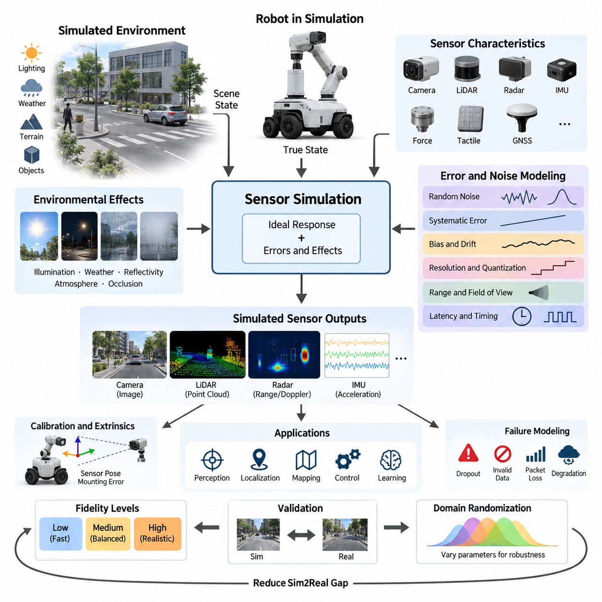
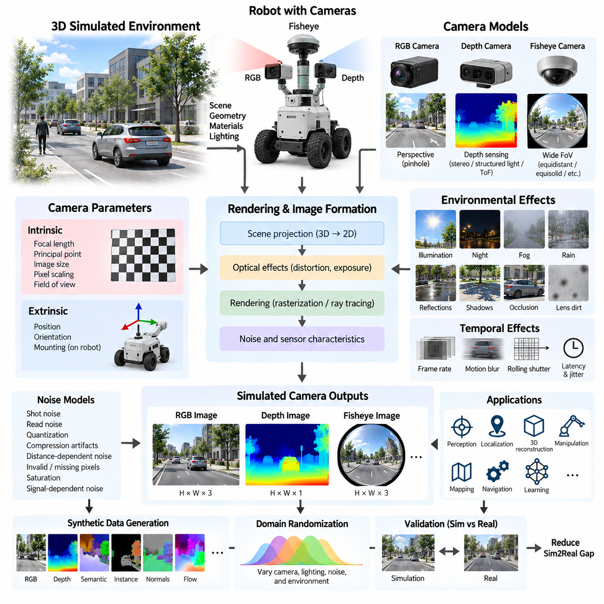
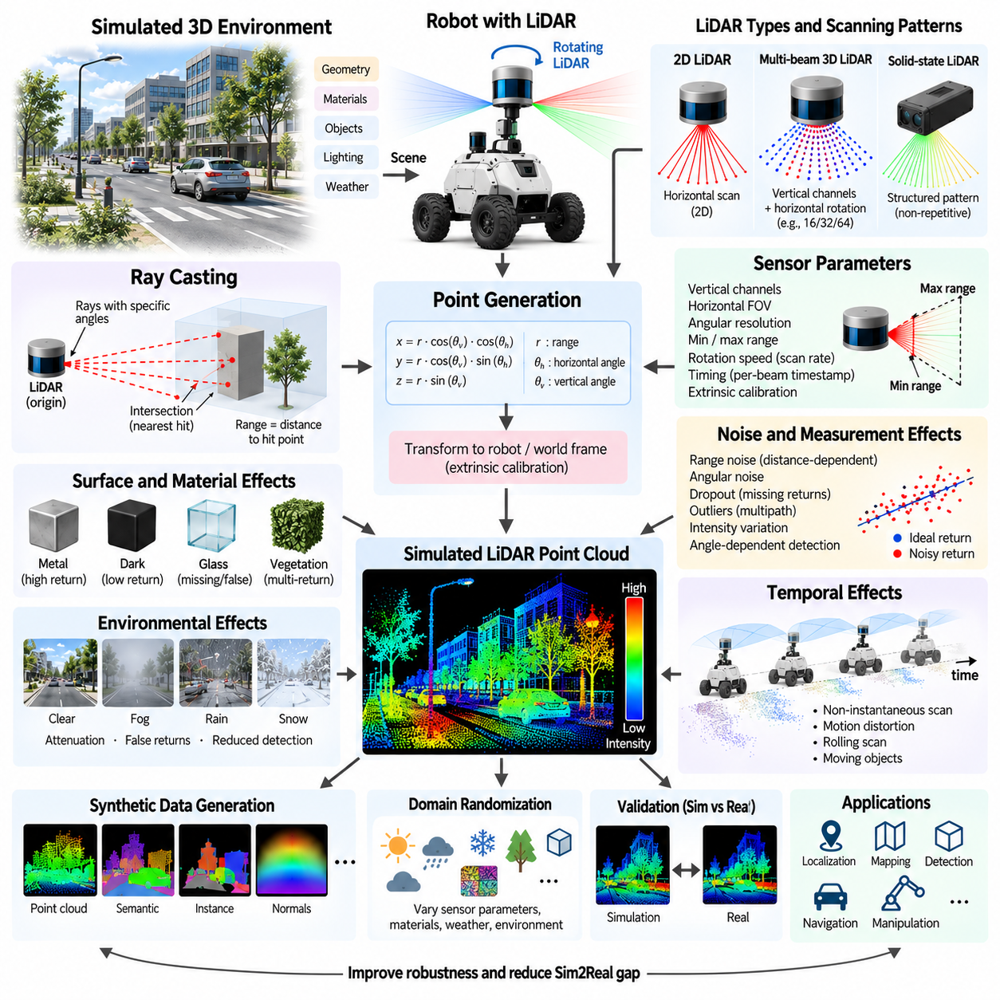
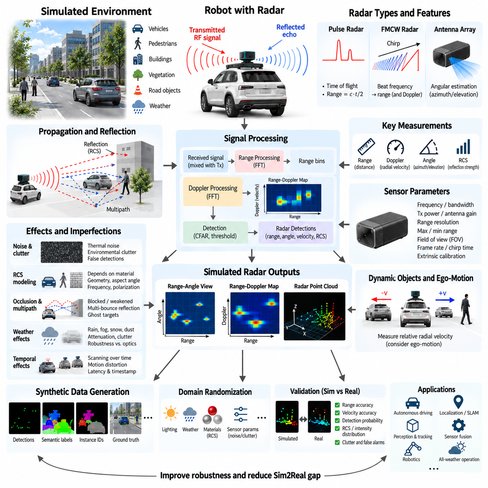
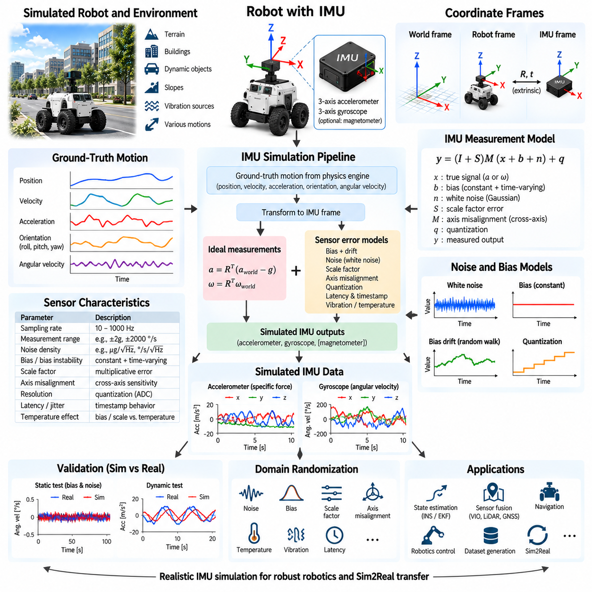
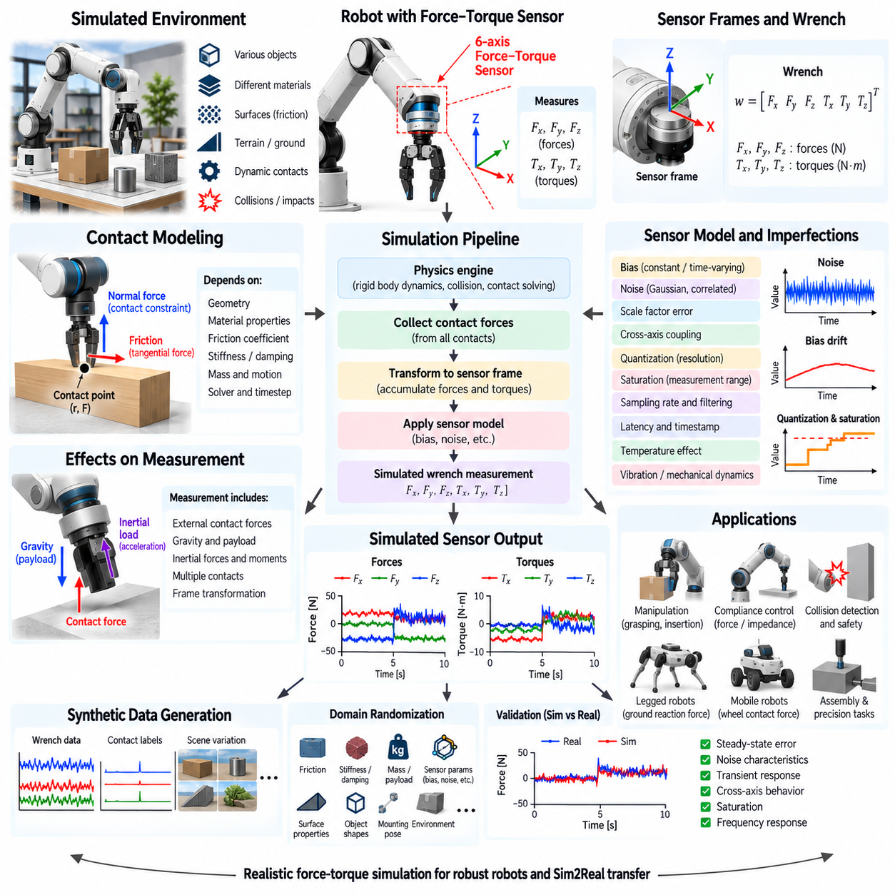
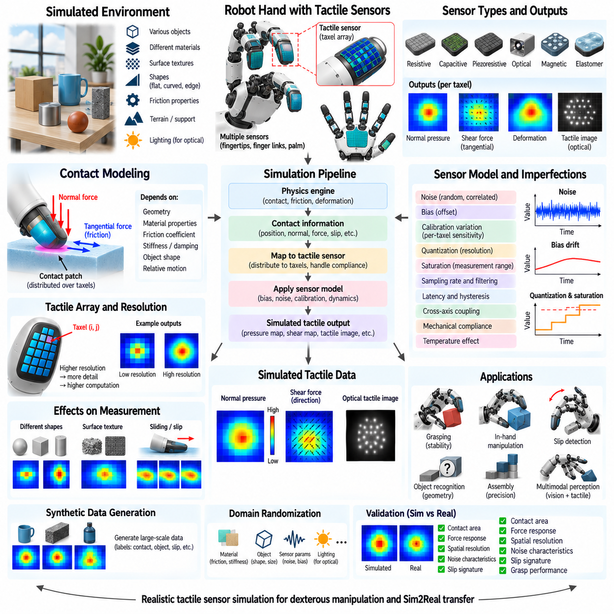
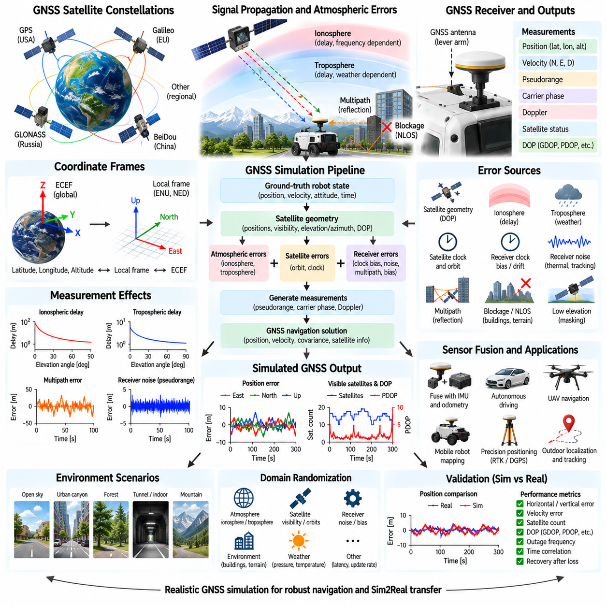
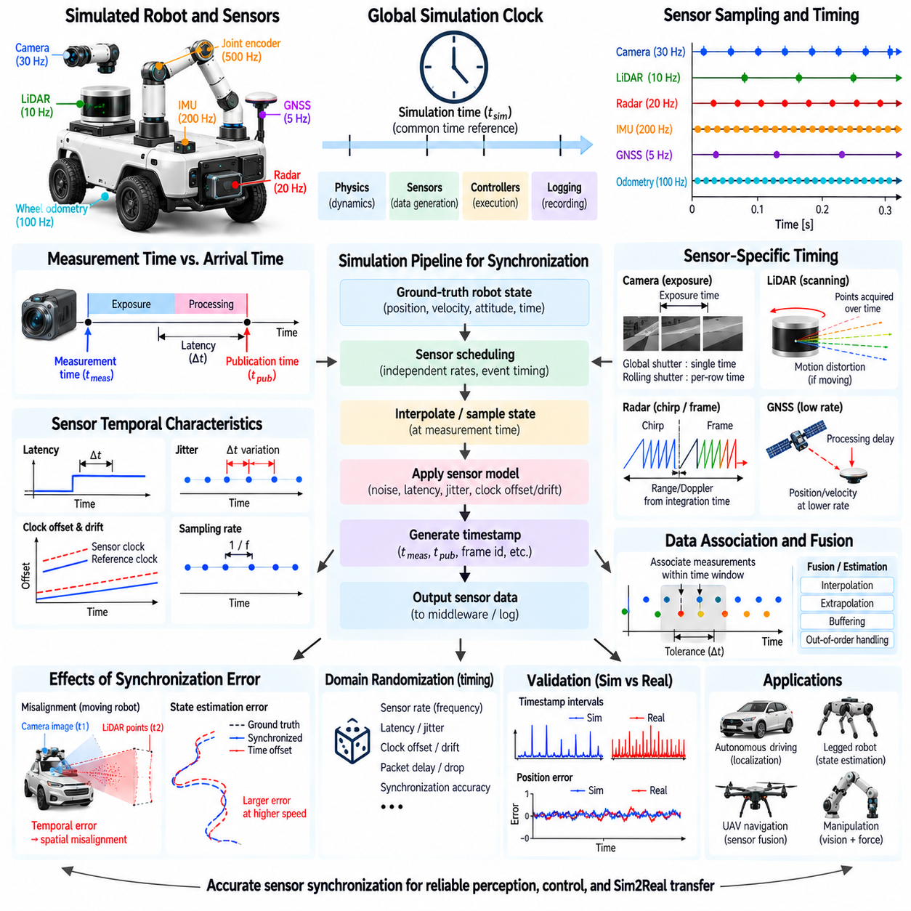
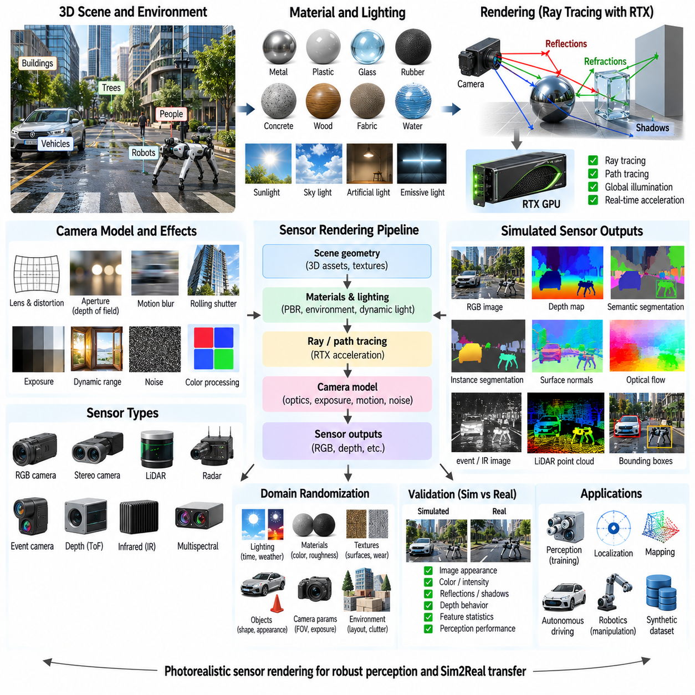

**Volume 11. Simulation and Digital Twin**

# Chapter 04. Sensor Simulation

## 04.01. Sensor Simulation Fidelity and Noise Modeling

{width="7.268055555555556in" height="7.268055555555556in"}

Sensor simulation is the process of reproducing the measurements that physical sensors would generate when a robot interacts with a simulated environment. Its purpose is not merely to provide ideal geometric observations, but to approximate the uncertainty, limitations, timing behavior, and failure characteristics of real sensing hardware. Within a simulation and digital-twin workflow, sensor fidelity therefore determines how realistically perception, localization, mapping, control, and learning algorithms experience the virtual world.

Sensor fidelity describes how closely simulated measurements reproduce the behavior of their physical counterparts. A low-fidelity sensor may return exact distances, poses, or pixel values directly from the simulator, whereas a higher-fidelity model includes measurement uncertainty, finite resolution, latency, environmental interference, calibration errors, and hardware limitations. The required fidelity should be selected according to the engineering objective rather than maximized indiscriminately.

An ideal sensor model can be expressed conceptually as a transformation from the true simulated state to an exact observation. Real sensors instead produce observations affected by multiple disturbances, so a practical model can be represented as measurement = ideal response + systematic error + stochastic error + temporal error. This decomposition is useful because each error source can be modeled, calibrated, randomized, and validated independently before being integrated into a complete sensor simulation.

Random noise represents unpredictable measurement variation and is commonly approximated using probability distributions. Zero-mean Gaussian noise is frequently used as a baseline because many small independent disturbances produce approximately normal behavior. However, realistic sensors may exhibit non-Gaussian distributions, asymmetric errors, outliers, quantization effects, or range-dependent uncertainty. Selecting a noise distribution should therefore be based on measured sensor characteristics whenever real hardware data is available.

Systematic errors differ from random noise because they introduce persistent or predictable deviations. Examples include camera intrinsic calibration errors, LiDAR range offsets, IMU bias, GNSS position bias, mounting misalignment, and scale-factor errors. A simulation containing only random noise can underestimate these effects and make algorithms appear unrealistically robust. Modeling systematic errors is especially important when evaluating calibration, localization, sensor fusion, and long-duration autonomous operation.

Bias and drift are particularly important for sensors whose errors accumulate over time. An IMU, for example, may contain a nearly constant bias combined with slowly varying bias instability and faster measurement noise. When acceleration and angular velocity are integrated to estimate velocity, orientation, or position, even small errors can produce substantial state-estimation deviations. Sensor simulation should therefore reproduce both instantaneous uncertainty and temporal correlation rather than treating every sample as statistically independent.

Resolution and quantization provide another layer of realism. Physical sensors cannot represent arbitrary continuous values because analog-to-digital converters, image pixels, encoder counts, range bins, and other measurement mechanisms impose discrete resolution. Quantization can be modeled by mapping continuous simulated values to finite increments. Although the resulting errors may appear small, they can become significant in precision control, low-speed motion estimation, short-range sensing, or algorithms that depend on subtle measurement differences.

Real sensors also operate within finite measurement ranges and fields of view. A simulated sensor should reproduce minimum and maximum detectable distances, angular coverage, blind regions, saturation, clipping, and invalid measurements. Objects outside a camera image, beyond LiDAR range, below radar sensitivity, or inside a sensor\'s minimum detection distance should not generate unrealistically perfect observations. These constraints often influence perception architecture as strongly as random measurement noise.

Environmental conditions can change sensor quality dynamically. Camera measurements depend on illumination, exposure, reflections, motion blur, weather, and optical properties. LiDAR can be influenced by surface reflectivity, incidence angle, atmospheric particles, and multipath effects. Radar responses depend on geometry, material properties, Doppler behavior, and radar cross section. GNSS can suffer from obstruction and multipath. High-fidelity simulation therefore connects sensor errors to environmental state rather than using fixed noise everywhere.

Temporal fidelity is equally important because robotic sensors do not deliver measurements instantaneously. Each device operates at a particular sampling frequency and may introduce exposure time, scanning duration, processing delay, communication latency, timestamp uncertainty, and jitter. Multiple sensors also operate asynchronously. A simulation that produces perfectly synchronized observations can hide important problems in sensor fusion and state estimation, making timestamp and synchronization behavior essential components of realistic sensor modeling.

Sensor latency can be modeled as a delay between the physical event represented in simulation and the time at which the corresponding measurement becomes available to software. In a moving robot, even tens of milliseconds may create spatial disagreement between camera, LiDAR, IMU, radar, and odometry data. More advanced simulations distinguish sensing delay, internal processing delay, network transmission delay, and software scheduling delay so that timing errors can be investigated systematically.

Failure modeling extends sensor simulation beyond normal operating noise. Physical sensors may temporarily lose measurements, return invalid values, experience packet loss, become saturated, suffer partial occlusion, or degrade because of environmental conditions. Introducing controlled dropout and fault events allows developers to test whether perception and autonomy software can recognize degraded sensing and transition safely to alternative information sources, reduced functionality, or fault-management states.

Spatial calibration errors should also be represented when multiple sensors are mounted on a robot. Each sensor has an extrinsic transformation defining its position and orientation relative to the robot coordinate system. Small mounting deviations can create systematic disagreement between modalities, particularly at long distances. Perturbing these transformations enables evaluation of calibration algorithms and reveals how sensitive perception pipelines are to mechanical tolerances, vibration, maintenance, or sensor replacement.

A practical fidelity strategy normally uses multiple simulation levels. Early software development can employ simplified sensors that are computationally inexpensive and deterministic, enabling rapid debugging and large numbers of tests. Later validation can introduce calibrated noise, latency, environmental effects, and realistic rendering. High-fidelity ray tracing or detailed physical sensor models should be reserved for scenarios where optical, geometric, or electromagnetic realism materially affects the algorithm being evaluated.

This staged approach is important because sensor realism has computational cost. Photorealistic camera rendering, dense ray-cast LiDAR, physically based radar, and complex environmental interactions can consume substantial GPU resources. Excessive fidelity may reduce simulation throughput without improving the validity of a particular experiment. Conversely, insufficient fidelity can create a large simulation-to-reality gap. Effective simulation therefore balances computational efficiency against the specific uncertainty mechanisms relevant to the target system.

Noise parameters should ideally be derived from physical measurements rather than chosen arbitrarily. A real sensor can be operated under controlled conditions while its output is compared with a trusted reference. Statistical analysis can estimate mean error, variance, bias stability, range dependency, dropout probability, and temporal correlation. These measured properties can then parameterize the simulator, creating a real-to-simulation calibration process that makes virtual experiments more representative of deployed hardware.

Validation requires comparing simulated and real sensor outputs under equivalent conditions. Useful comparisons include error distributions, spatial resolution, detection probability, temporal behavior, frequency characteristics, and downstream algorithm performance. Matching a single statistic such as standard deviation is rarely sufficient. A simulated sensor may have the correct average error while still producing unrealistic temporal or environmental behavior that causes perception algorithms to generalize poorly.

For machine learning and Physical AI, perfectly calibrated simulation is not always the final objective. Domain randomization intentionally varies noise magnitude, calibration, lighting, sensor placement, latency, and other parameters across simulated episodes. Instead of learning one idealized virtual sensor configuration, the model encounters a distribution of possible sensing conditions. This can improve robustness by reducing dependence on simulation-specific regularities and preparing the policy or perception model for uncertainty in real deployment.

Sensor simulation should ultimately be treated as part of the complete robotic system model rather than as an isolated rendering function. Camera, LiDAR, radar, IMU, force, tactile, and GNSS simulations provide different observations of the same evolving physical state, and their uncertainties interact through perception and sensor-fusion algorithms. The broader simulation architecture therefore connects sensor fidelity with physics, environment modeling, synchronization, synthetic data generation, and Sim2Real validation.

A mature sensor-simulation workflow progressively connects ideal sensing, calibrated error models, environmental effects, timing behavior, failure injection, and domain randomization. The objective is not to reproduce every microscopic characteristic of hardware, but to reproduce the characteristics that influence robotic decisions. When fidelity is selected and validated according to this principle, simulation becomes a practical engineering instrument for developing perception systems, evaluating autonomy, generating training data, and reducing risk before deployment on physical robots.

## 04.02. Camera Sensor Simulation RGB Depth Fisheye [w/Code]

{width="7.268055555555556in" height="7.268055555555556in"}

Camera sensor simulation reproduces how robotic vision systems observe a virtual environment through RGB, depth, and fisheye imaging models. Instead of exposing perfect scene geometry directly to perception software, the simulator converts three-dimensional scenes into camera measurements governed by optical geometry, resolution, field of view, exposure, depth characteristics, distortion, and noise. This allows vision algorithms to operate through interfaces that resemble physical cameras.

An RGB camera model begins with the transformation of three-dimensional points from the world coordinate frame into the camera coordinate frame. Camera extrinsic parameters define the sensor position and orientation relative to the robot, while intrinsic parameters describe focal length, principal point, pixel scaling, and image dimensions. Together, these parameters determine how visible scene geometry is projected onto the two-dimensional image plane and where objects appear within the generated image.

The pinhole camera model provides the fundamental geometric approximation for perspective imaging. A three-dimensional point expressed in camera coordinates is projected onto an image plane according to its depth and focal length. Objects farther from the camera therefore appear smaller, while parallel structures can converge visually with distance. This simple projection model is computationally efficient and forms the mathematical basis for many simulated RGB and depth cameras used in robotic perception.

Realistic RGB simulation extends geometric projection with scene appearance and illumination. Surface materials, textures, light sources, shadows, reflections, transparency, and environmental conditions influence the final pixel values. Rendering engines may use rasterization for high simulation throughput or ray tracing when more realistic optical interactions are required. The appropriate rendering method depends on whether the objective is functional perception testing, synthetic dataset generation, or highly realistic Sim2Real evaluation.

Camera intrinsic parameters should correspond to the intended physical device whenever simulation is used to validate production perception software. Image width and height determine spatial sampling, while focal length and sensor geometry determine the effective field of view. The principal point represents the optical center in image coordinates. Accurate intrinsic modeling allows the same calibration matrices and projection operations used by real robotic software to be applied to simulated camera data.

Lens distortion becomes increasingly important as the camera field of view grows. Conventional lenses may exhibit radial barrel or pincushion distortion as well as tangential distortion caused by optical or mechanical misalignment. Simulators can apply distortion coefficients to ideal projected coordinates before generating image measurements. This enables developers to evaluate camera calibration, image rectification, feature extraction, visual localization, and perception algorithms under optical conditions closer to those encountered with real hardware.

A depth camera produces an image in which each pixel represents distance information rather than only visible color. Depending on the simulated sensor definition, depth may represent distance along the optical axis or Euclidean range from the camera origin. This distinction must remain consistent with the physical camera and downstream software because different definitions produce different values away from the image center. Depth output is commonly represented using floating-point meters or quantized integer units.

Ideal depth can be generated directly from the simulator\'s scene geometry or rendering depth buffer, but real depth sensors contain substantially more uncertainty. Practical simulation can introduce distance-dependent noise, quantization, invalid pixels, minimum and maximum sensing ranges, edge artifacts, and missing measurements. Reflective, transparent, dark, or geometrically difficult surfaces may also reduce measurement reliability depending on the physical sensing technology that the simulation is intended to approximate.

Depth sensing technologies have different physical characteristics and therefore should not be represented by one universal noise model. Stereo depth depends on image correspondence and baseline geometry, structured-light systems depend on projected patterns and observable surface texture, and time-of-flight cameras estimate distance from modulated optical signals. A simulator may use a common geometric depth renderer for efficiency, but sensor-specific degradation models are needed when these physical differences influence perception performance.

RGB and depth streams are frequently combined as RGB-D sensing for robotic perception. The two measurements may originate from different optical paths or virtual camera origins, requiring accurate extrinsic calibration and image registration. Even when a physical device provides aligned outputs, the simulation should preserve realistic resolution, field of view, timing, and invalid-depth behavior. Proper RGB-D simulation supports object recognition, obstacle detection, three-dimensional reconstruction, manipulation, and visual SLAM development.

Fisheye cameras require a different projection model because their very wide field of view cannot be accurately represented by a standard perspective projection across the entire image. Instead of mapping incident ray angles through a simple pinhole relationship, fisheye models use nonlinear radial mappings such as equidistant, equisolid-angle, stereographic, or orthographic projection. The selected model should correspond to the lens or calibration formulation expected by the deployed perception software.

The principal advantage of fisheye sensing is wide spatial coverage. Mobile robots, autonomous vehicles, quadrupeds, and humanoids can use multiple fisheye cameras to reduce blind regions and observe surrounding environments with fewer sensors. However, strong peripheral distortion changes object shape, scale, and apparent motion. Accurate fisheye simulation is therefore important when developing surround-view perception, visual odometry, localization, semantic segmentation, and neural networks trained on wide-angle imagery.

Camera simulation must also reproduce temporal behavior. RGB and depth devices operate at finite frame rates and may introduce exposure time, processing latency, timestamp offsets, and frame jitter. A moving camera can additionally experience motion blur, while rolling-shutter sensors expose different image rows at slightly different times. These effects can create geometric inconsistencies during rapid robot motion, making temporal camera modeling particularly relevant to visual odometry, drones, legged robots, and high-speed autonomous systems.

Exposure and image formation parameters influence RGB appearance independently of scene geometry. Exposure duration, aperture, sensor sensitivity, dynamic range, white balance, tone mapping, and automatic exposure behavior can alter brightness and contrast. Saturation may remove information from bright regions, while insufficient illumination can increase effective noise in dark regions. Modeling these effects becomes important when perception systems must operate across indoor, outdoor, daytime, nighttime, and rapidly changing lighting conditions.

Noise can be introduced at several stages of the image formation pipeline. Pixel-level models may approximate photon-related shot noise, electronic read noise, fixed-pattern variation, color uncertainty, compression artifacts, and quantization. A simplified simulator may instead apply calibrated Gaussian or signal-dependent noise after rendering. The correct level of complexity depends on whether the target algorithm is sensitive primarily to scene semantics, geometric accuracy, low-light appearance, or detailed imaging characteristics.

Environmental effects further influence simulated camera measurements. Rain, fog, dust, glare, lens contamination, shadows, reflections, and partial occlusion can degrade RGB and depth information simultaneously or differently. Rather than treating these effects solely as visual decoration, simulation can model them as sensing conditions that change detection probability and measurement quality. Such scenarios are valuable for testing autonomous robots expected to operate outside controlled laboratory or factory environments.

Camera placement is another major simulation parameter. Sensor height, orientation, baseline, mounting angle, and mechanical tolerance determine observable regions and influence downstream perception accuracy. Small extrinsic perturbations can be introduced to represent assembly tolerances or calibration errors. For multi-camera systems, overlap between fields of view and relative camera poses should be modeled carefully because they directly affect stereo estimation, panoramic perception, multi-view geometry, and sensor fusion.

Synthetic data generation benefits strongly from camera simulation because rendered scenes can provide RGB images together with exact ground-truth information unavailable or expensive to obtain in reality. Depth, semantic labels, instance masks, optical flow, surface normals, object poses, and bounding boxes can be generated from the same scene state. Appearance and camera parameters can then be randomized to create diverse datasets for training and evaluating robotic perception models without manually annotating every observation.

Domain randomization can vary camera pose, focal parameters, exposure, illumination, texture, noise, distortion, depth uncertainty, and environmental conditions across simulation episodes. The objective is not to reproduce one camera configuration perfectly but to expose learning systems to a distribution of plausible observations. Carefully selected randomization ranges can reduce dependence on synthetic visual artifacts and improve robustness when perception models or learned robot policies are transferred to physical cameras.

Validation should compare simulated cameras with real devices under controlled and representative scenes. RGB comparisons can examine geometry, field of view, distortion, brightness distributions, and feature behavior, while depth validation can analyze range error, missing-data patterns, edge behavior, and uncertainty versus distance. Fisheye validation should additionally examine angular projection accuracy across the image. Downstream perception performance provides an important system-level measure of whether simulation fidelity is sufficient.

A practical camera simulation architecture therefore combines projection geometry, calibrated intrinsics and extrinsics, rendering, optical distortion, depth generation, temporal behavior, noise, and environmental effects. Fidelity can be increased progressively according to development needs rather than applying maximum realism to every experiment. By providing consistent RGB, depth, and fisheye observations together with controllable uncertainty, camera simulation becomes a core tool for perception development, synthetic data generation, validation, and Sim2Real transfer.

## 04.03. LiDAR Point Cloud Simulation Ray Casting [w/Code]

{width="7.268055555555556in" height="7.268055555555556in"}

LiDAR point cloud simulation reproduces the geometric measurements generated when a laser scanner observes a virtual three-dimensional environment. Rather than exposing complete scene geometry to perception software, the simulator emits individual range measurements according to the sensor\'s scanning pattern. These measurements are converted into point clouds that resemble the output of physical LiDAR hardware and can be consumed by localization, mapping, detection, and navigation algorithms.

The fundamental mechanism behind most LiDAR simulation is ray casting. A virtual ray originates from the simulated LiDAR position and travels through the environment along a specified direction. The simulation engine determines whether the ray intersects an object and identifies the nearest valid intersection. The distance between the sensor origin and this intersection represents the ideal range measurement, while the intersection coordinates provide the corresponding three-dimensional point.

A ray can be mathematically represented by an origin and a normalized direction vector. Points along the ray are obtained by increasing a scalar distance from the origin. Scene objects are represented using geometric primitives, polygon meshes, collision geometry, or acceleration structures. The ray-casting engine evaluates intersections between the ray and these representations and normally selects the closest visible surface that satisfies the configured sensing constraints.

A complete LiDAR scan requires many rays arranged according to the physical sensor\'s scanning geometry. A two-dimensional LiDAR may sweep rays across a horizontal angular range, whereas a multi-channel three-dimensional LiDAR uses several vertically separated laser channels while rotating horizontally. Solid-state devices can employ different non-repetitive or structured scanning patterns. Accurate simulation therefore requires modeling not only maximum range and resolution but also the actual angular sampling pattern.

For rotating multi-beam LiDAR, each laser channel has a predefined vertical angle while the sensor continuously changes its horizontal azimuth. Combining the returns from all channels across one revolution creates a three-dimensional point cloud. Sensors with 16, 32, 64, or more channels generate different vertical sampling densities. A simulator should reproduce these channel arrangements because point-cloud sparsity directly affects object detection, terrain perception, and localization performance.

The transformation from a range measurement to a Cartesian point uses the measured distance together with horizontal and vertical beam angles. Each return is initially expressed in the LiDAR coordinate frame and can then be transformed into the robot, odometry, map, or world frame using the sensor\'s extrinsic calibration. Accurate transformations are essential because even small mounting errors can create systematic displacement between LiDAR observations and other sensor measurements.

Maximum and minimum sensing ranges define which ray intersections can generate valid returns. Objects closer than the minimum range may fall inside a blind region, while intersections beyond the maximum range should normally be discarded. Angular resolution determines the spacing between neighboring rays and therefore the density of the resulting point cloud. These parameters must correspond to the target hardware when simulation is intended to reproduce a specific physical LiDAR configuration.

Ideal ray casting produces perfectly accurate intersections, but real LiDAR measurements contain uncertainty. Range noise can be added to each return using statistical models derived from sensor specifications or experimental measurements. The magnitude of the error may depend on distance, incidence angle, surface properties, or environmental conditions. Random angular perturbations can also represent beam-direction uncertainty and produce spatial errors that increase as measured distance becomes larger.

Surface reflectivity strongly influences physical laser returns. Highly reflective materials can produce strong measurements, while dark or low-reflectivity surfaces may reduce detection probability. Transparent and specular materials such as glass can create missing, displaced, or unexpected returns. A higher-fidelity simulator can associate optical or LiDAR-specific material properties with scene surfaces and use them to modify return probability, intensity, and measurement uncertainty.

The incidence angle between a laser beam and a surface also affects measurement quality. A ray striking a surface nearly perpendicular to its normal usually produces a stronger and more stable return than a grazing-angle intersection. At shallow angles, the reflected energy may be insufficient for reliable detection. Modeling angle-dependent return probability helps reproduce sparse measurements on vehicle bodies, building surfaces, vegetation, road boundaries, and other complex structures.

LiDAR intensity provides information beyond geometric range. Physical sensors may report a return-strength value related to reflected optical energy, although the exact meaning and scaling depend on the device. Simulated intensity can be estimated from surface reflectivity, distance, incidence angle, and sensor characteristics. While simplified intensity models cannot perfectly reproduce hardware, they can support algorithms that use reflectance for localization, classification, or feature extraction.

Real LiDAR sensors scan over time rather than capturing every point simultaneously. During a rotating scan, the robot or surrounding objects may move significantly between the first and last measurements. Treating the entire point cloud as an instantaneous observation can therefore create unrealistic data. High-fidelity simulation associates individual rays or groups of rays with acquisition timestamps so that motion distortion can emerge naturally from robot and object movement.

Motion distortion is particularly important for autonomous vehicles, outdoor AMRs, UAVs, and other rapidly moving platforms. A rotating LiDAR mounted on a moving robot observes different portions of the environment from slightly different poses during one revolution. Simulation can reproduce this effect by updating the sensor pose according to each beam timestamp. Deskewing and motion-compensation algorithms can then be evaluated under conditions resembling physical operation.

Environmental effects can further degrade LiDAR measurements. Fog, rain, snow, dust, and airborne particles may attenuate laser energy or generate unwanted returns before the beam reaches the intended surface. Detailed optical simulation can model these interactions physically, while practical robotics simulators often approximate them using range-dependent dropout, random false returns, or reduced detection probability. The required complexity depends on the intended operational environment and validation objective.

Occlusion arises naturally from ray casting because only the first visible intersection is normally returned. Objects behind walls, vehicles, people, vegetation, or other obstacles therefore remain partially or completely invisible. This property makes ray-based simulation valuable for realistic perception testing. However, some physical LiDAR systems can report multiple returns when a beam interacts with semi-transparent or spatially distributed structures such as vegetation, requiring more advanced multi-return modeling.

Point clouds frequently contain missing measurements. A simulated LiDAR can represent these by removing returns according to distance, material, incidence angle, environmental conditions, or calibrated dropout probabilities. Additional outliers can model multipath reflections or unexpected measurements. Such imperfections are important because algorithms trained or validated only with complete, noise-free point clouds may perform poorly when exposed to sparse and irregular real-world measurements.

Scene geometry quality strongly affects LiDAR simulation fidelity. Visual meshes optimized for rendering may contain unnecessary detail, while simplified collision meshes can remove structures that are important to laser perception. Thin poles, curbs, fences, vegetation, cables, and small obstacles can influence navigation even when they occupy few pixels in a camera image. The geometric representation used for ray casting should therefore preserve structures relevant to the intended LiDAR task.

Efficient ray casting is essential because a single LiDAR scan can require tens or hundreds of thousands of intersection queries. Spatial acceleration structures such as bounding volume hierarchies reduce the number of geometry tests required for each ray. Modern simulation engines can execute large batches of rays in parallel using CPUs, GPUs, or hardware-accelerated ray-tracing units. This enables dense LiDAR simulation while maintaining real-time or faster-than-real-time execution.

GPU acceleration becomes especially valuable for synthetic data generation and massively parallel robot simulation. Thousands of virtual sensors may need to generate point clouds simultaneously during reinforcement learning, perception training, or large-scale validation. Batched ray queries and parallel scene traversal allow simulation throughput to scale beyond what sequential CPU ray casting can provide. Fidelity and ray density can also be adjusted according to available computational resources.

LiDAR simulation can provide exact ground-truth information together with the generated point cloud. Each return may be associated with semantic class, instance identifier, surface normal, object velocity, or other scene metadata. These annotations are difficult and expensive to produce manually from real LiDAR data. Synthetic point clouds can therefore support training and evaluation of three-dimensional object detection, semantic segmentation, occupancy estimation, and scene-understanding models.

Domain randomization can vary beam noise, range limits, angular offsets, sensor mounting pose, surface properties, dropout probability, weather, and environmental geometry. Instead of training perception algorithms on one perfectly configured virtual LiDAR, the system encounters a distribution of plausible sensor behaviors. This approach can improve robustness to hardware variation, calibration uncertainty, environmental changes, and differences between simulated and physical sensing.

Validation should compare simulated and real point clouds collected from equivalent scenes. Useful characteristics include range-error distributions, point density, angular structure, dropout patterns, intensity behavior, motion distortion, and detection probability across distance and surface types. Downstream SLAM, localization, obstacle detection, and three-dimensional perception performance can provide additional system-level evidence that the simulated sensor has sufficient fidelity for its intended purpose.

A practical LiDAR simulation pipeline therefore connects scene geometry, sensor pose, beam configuration, ray casting, intersection processing, noise modeling, timing, environmental effects, and coordinate transformation. Fidelity should be increased where these factors materially affect the target algorithm rather than maximizing complexity everywhere. Properly configured ray-based LiDAR simulation provides realistic point clouds for perception development, synthetic data generation, autonomy validation, and Sim2Real transfer.

## 04.04. Radar Simulation Doppler Range RCS Modeling [w/Code]

{width="7.268055555555556in" height="7.268055555555556in"}

Radar simulation reproduces how radio-frequency sensing systems observe objects by transmitting electromagnetic waves and analyzing their reflected signals. Unlike cameras, which primarily measure appearance, or LiDAR, which measures geometric range through optical pulses, radar can directly provide information about distance and relative radial velocity. These properties make radar particularly valuable for autonomous vehicles, outdoor robots, UAVs, and systems operating under poor visibility.

A fundamental radar measurement begins when the sensor transmits an electromagnetic signal toward the environment. Part of this energy interacts with objects and returns to the receiver as an echo. The propagation delay between transmission and reception contains information about target range, while changes in the returned signal frequency or phase can reveal relative motion. Radar simulation attempts to reproduce these measurements without requiring physical radio-frequency hardware.

Range estimation is based on the time required for electromagnetic energy to travel from the radar to a target and return. For a simple pulse radar, the target distance can be expressed as one-half of the propagation time multiplied by the speed of light. The factor of one-half accounts for the round trip. In practical simulation, target geometry and propagation paths determine the delay from which an ideal range measurement can be generated.

Many modern robotic and automotive radars use frequency-modulated continuous-wave technology, commonly abbreviated FMCW. Instead of transmitting isolated pulses, FMCW radar continuously changes the transmitted frequency according to a defined waveform or chirp. The difference between transmitted and received signals produces a beat frequency related to target range. Simulation can model this behavior at different abstraction levels, from direct target measurements to detailed waveform generation and signal processing.

Range resolution describes the radar\'s ability to distinguish two targets located at similar distances. It depends strongly on the transmitted signal bandwidth rather than simply on the total maximum sensing range. A simulation intended for perception development should reproduce finite range resolution by grouping or quantizing measurements into range bins. Otherwise, closely spaced virtual targets may appear unrealistically separable compared with observations produced by physical radar hardware.

The Doppler effect provides one of radar\'s most important capabilities. When the relative distance between radar and target changes, the reflected electromagnetic wave experiences a frequency shift. Approaching and receding targets therefore produce different Doppler signatures. The measured Doppler frequency can be converted into radial velocity, allowing radar to estimate motion directly rather than deriving velocity only from differences between object positions across consecutive frames.

Radar measures the velocity component along the sensor-to-target direction, known as radial velocity. An object moving rapidly perpendicular to the radar line of sight may therefore produce little Doppler velocity even though its true speed is high. This geometric limitation should be preserved in simulation. Realistic Doppler modeling is especially important for tracking vehicles, pedestrians, mobile robots, and other dynamic objects whose motion state must be estimated.

Range and Doppler measurements are often organized into a two-dimensional range-Doppler representation. Signal-processing stages such as Fourier transforms separate reflected energy according to propagation delay and Doppler frequency. Peaks in this representation indicate potential targets at particular distances and radial velocities. A high-fidelity radar simulator can generate intermediate signal representations, while a computationally efficient simulator may directly produce detections with equivalent range and velocity characteristics.

Angular information enables radar to estimate where a target is located relative to the sensor. Multi-antenna arrays compare phase differences among receiving elements to estimate azimuth and, in more advanced systems, elevation. The achievable angular resolution depends on antenna geometry, wavelength, signal processing, and sensor design. Simulated radar should therefore include realistic field of view and angular uncertainty rather than providing exact three-dimensional object positions.

Radar cross section, commonly abbreviated RCS, represents how strongly an object reflects radar energy toward the receiver. RCS is not simply equivalent to physical object size. It depends on target geometry, material properties, radar frequency, polarization, viewing direction, and surface orientation. A large object can produce a weak return under some conditions, while a smaller metallic structure can generate a strong reflection. RCS modeling is therefore central to realistic radar simulation.

A simplified radar simulator may assign a constant RCS value to each object class or material. More advanced models vary RCS according to aspect angle and individual surface geometry. Vehicle bodies, metal infrastructure, building facades, vegetation, pedestrians, and road objects can therefore produce different return strengths. Such modeling helps reproduce the irregular detection patterns encountered when radar-equipped robots move through complex indoor or outdoor environments.

The received radar power decreases substantially with propagation distance. Radar modeling commonly considers transmitted power, antenna gain, wavelength, target RCS, propagation distance, and receiver characteristics through the radar range equation. Even when a simulator does not reproduce the complete radio-frequency signal chain, these relationships can be approximated to determine whether a target produces a detectable return and what signal strength should be associated with it.

Detection is therefore not equivalent to geometric visibility. A target may lie inside the radar field of view but still fail to generate a measurement because its reflected signal is below the detection threshold. Conversely, highly reflective structures may remain detectable at considerable distances. Simulators can model this behavior through signal-to-noise ratio, detection thresholds, probabilistic detection, and range-dependent attenuation instead of returning every geometrically visible object.

Noise and clutter are essential components of radar simulation. Receiver electronics introduce thermal and electronic noise, while the surrounding environment generates reflections from roads, walls, vegetation, terrain, buildings, and other surfaces. These unwanted signals can overlap with legitimate target returns. Modeling noise and clutter allows perception algorithms to experience false detections, uncertain measurements, and varying signal quality rather than unrealistically clean radar observations.

Multipath propagation occurs when radar energy reaches the receiver through more than one path. Reflections from the ground, walls, vehicles, or large metallic structures can create ghost targets or distorted measurements. Urban streets, factories, warehouses, ports, and parking structures can contain strong multipath conditions. Higher-fidelity simulation may trace multiple electromagnetic propagation paths, while simpler models can introduce calibrated false detections or measurement perturbations.

Occlusion in radar differs from purely optical sensing because electromagnetic waves interact with materials according to frequency and physical properties. Some objects strongly block or reflect radar energy, while other structures may permit partial transmission or complex multipath propagation. A simple geometric ray model can approximate direct visibility, but advanced radar simulation may require material-aware reflection, transmission, scattering, and multiple-bounce propagation to reproduce challenging environments.

Weather effects are generally different from those experienced by cameras and optical LiDAR. Radar can remain operational in darkness, fog, rain, and other conditions that significantly degrade optical sensing, although severe precipitation and atmospheric effects can still influence signal attenuation and clutter. Radar simulation for outdoor autonomy should therefore represent both its robustness advantage and the remaining degradation mechanisms rather than treating the sensor as completely unaffected by weather.

Radar measurements are produced over time and must include realistic temporal behavior. Frame rate, chirp duration, processing latency, timestamp accuracy, and communication delay can influence sensor fusion. When radar data is combined with camera, LiDAR, GNSS, or IMU measurements, temporal misalignment can produce inconsistent object positions and velocities. Simulation should therefore preserve sensor timing characteristics when evaluating tracking and multi-sensor perception systems.

Physical radar output can be represented at several abstraction levels. A low-level simulator may generate raw or intermediate signals such as complex in-phase and quadrature samples, range profiles, or range-Doppler maps. A higher-level simulator may generate target detections containing range, azimuth, elevation, radial velocity, RCS, and confidence. Selecting the abstraction level involves balancing electromagnetic fidelity, computational cost, and the requirements of the algorithm under development.

Radar point clouds differ significantly from LiDAR point clouds. They are generally much sparser and represent electromagnetic scattering centers rather than direct samples of visible object surfaces. A vehicle may produce only several strong radar detections, and their locations may not correspond exactly to its geometric boundary. Perception algorithms should therefore be tested with radar observations that preserve realistic sparsity and scattering behavior instead of dense geometry-derived point clouds.

Dynamic-object simulation is particularly important because Doppler information is one of radar\'s primary advantages. Each moving object\'s velocity should be projected onto the radar line of sight to obtain the expected radial velocity. Ego-motion of the robot must also be included because stationary infrastructure can appear to have nonzero relative velocity when the radar platform moves. Correct motion modeling supports realistic tracking, velocity estimation, and moving-object classification.

Synthetic radar data can include ground-truth information that is difficult to obtain from physical sensors. Simulated detections may be associated with object identifiers, semantic classes, true positions, velocities, RCS values, and propagation paths. These annotations support development of radar object detection, tracking, occupancy estimation, sensor fusion, and machine-learning systems while reducing the cost of manually labeling sparse and ambiguous radar measurements.

Domain randomization can vary target RCS, detection probability, range noise, Doppler noise, angular uncertainty, clutter density, multipath behavior, weather, sensor pose, and detection thresholds. Exposing learning algorithms to a range of plausible radar characteristics reduces dependence on one idealized sensor configuration. Randomization can also represent manufacturing variation and environmental uncertainty that would otherwise be difficult to reproduce systematically during physical testing.

Validation should compare simulated and physical radar measurements in equivalent scenarios. Important characteristics include range accuracy, radial-velocity accuracy, angular uncertainty, detection probability, RCS or intensity distributions, clutter, false detections, and target sparsity. Dynamic scenarios are especially valuable because they reveal whether simulated Doppler behavior matches real observations. Downstream tracking and sensor-fusion performance provides an additional system-level validation criterion.

A practical radar simulation architecture therefore connects environment geometry, material characteristics, radar configuration, electromagnetic propagation, range estimation, Doppler processing, RCS modeling, noise, clutter, timing, and detection generation. The appropriate fidelity depends on whether the objective is algorithm development, synthetic data generation, sensor fusion, or detailed sensor validation. Proper modeling enables radar simulation to support robust perception and Sim2Real development across demanding robotic environments.

## 04.05. IMU Simulation Noise Bias Drift Modeling [w/Code]

{width="7.268055555555556in" height="7.268055555555556in"}

An inertial measurement unit, or IMU, estimates a robot's motion by measuring specific force and angular velocity, typically through three-axis accelerometers and three-axis gyroscopes. Some devices additionally include magnetometers, but the core inertial model is based on acceleration and rotation-rate measurements. IMU simulation reproduces these signals from the motion of a virtual robot while adding imperfections that approximate the behavior of physical sensors.

The simulator begins with the ground-truth motion of the rigid body on which the IMU is mounted. Linear position, velocity, acceleration, orientation, and angular velocity are available from the physics engine and can be transformed into the IMU coordinate frame. These ideal quantities provide the reference from which simulated accelerometer and gyroscope measurements are generated before sensor errors, sampling effects, and noise are introduced.

An accelerometer does not directly measure ordinary world-frame linear acceleration. It measures specific force, which represents non-gravitational acceleration expressed in the sensor frame. Consequently, an IMU resting motionless on a horizontal surface normally reports an acceleration magnitude close to gravitational acceleration rather than zero. Correct treatment of gravity and coordinate transformations is therefore fundamental to physically consistent accelerometer simulation.

Gyroscopes measure angular velocity around the sensor's three axes. Ideal gyro measurements can be obtained from the simulated rigid-body angular velocity and transformed into the IMU frame according to the sensor mounting orientation. During rotation, these measurements describe how rapidly the platform turns around each axis. Realistic simulation then modifies the ideal angular rates using bias, random noise, scale-factor errors, drift, quantization, and other sensor imperfections.

A convenient measurement model expresses the sensor output as the ideal signal plus several error components. For each accelerometer or gyroscope axis, the measured value can include constant bias, time-varying bias, random measurement noise, scale-factor error, axis misalignment, and quantization. Separating these components is useful because they arise from different physical mechanisms and affect navigation algorithms differently over short and long operating periods.

White noise represents rapidly varying random uncertainty in consecutive measurements. It is commonly approximated using zero-mean Gaussian noise and applied independently to accelerometer and gyroscope channels. The appropriate noise magnitude depends on sensor quality, sampling frequency, and bandwidth. Although white noise has zero mean over sufficiently long periods, integration causes its effect to accumulate in estimated velocity, orientation, and position, making realistic noise modeling important for inertial navigation.

Bias is an offset added to the true sensor signal. A gyroscope with a small constant bias reports rotation even when the sensor is stationary, while accelerometer bias produces a persistent error in measured specific force. These apparently small offsets become important because inertial navigation repeatedly integrates sensor measurements. Gyroscope bias causes orientation error to grow, and incorrect orientation subsequently causes gravity to be projected incorrectly into estimated translational motion.

Bias is rarely perfectly constant throughout operation. Temperature changes, electronics, mechanical stress, aging, and internal sensor behavior can cause the offset to vary slowly with time. This phenomenon is commonly represented through bias drift or bias instability. A simulator can model slowly evolving bias using stochastic processes such as random walks or first-order correlated models, producing more realistic long-duration behavior than a fixed offset alone.

Random walk models are particularly useful for representing errors that evolve gradually over time. Instead of drawing an entirely independent bias for every sample, the previous bias state is incremented by a small random value. The resulting error has temporal correlation and slowly wanders from its initial value. Gyroscope and accelerometer bias random walks are important when testing estimators that must continuously infer and compensate for changing inertial sensor biases.

Noise density is often provided in IMU specifications and describes measurement noise relative to bandwidth. Converting this value into discrete simulation noise requires consideration of the sampling interval or sampling frequency. Simply applying the same standard deviation at every simulated update rate can produce inconsistent behavior. A physically meaningful simulator therefore relates continuous-time noise parameters to the discrete-time measurements delivered to the robot software.

Scale-factor error represents a proportional difference between the true physical input and the measured output. If an accelerometer has a scale factor slightly above its nominal value, measured acceleration becomes proportionally larger as the actual acceleration increases. Similar behavior occurs in gyroscopes. Scale-factor errors can be represented by multiplicative coefficients for each axis and may be randomized to reproduce manufacturing tolerance or calibration uncertainty.

Axis misalignment and cross-axis sensitivity occur when the physical sensing axes are not perfectly orthogonal or aligned with the assumed sensor coordinate frame. Motion around one axis can consequently influence another measurement channel. A compact simulation model can represent this behavior using a calibration matrix applied to the ideal acceleration or angular velocity vector. Such errors become relevant in high-accuracy localization, navigation, and sensor calibration studies.

Quantization arises because digital IMUs represent measurements using finite numerical resolution. Continuous acceleration and angular-rate values are converted into discrete output levels determined by the sensor's measurement range and analog-to-digital conversion. Quantization may have little influence on high-dynamic motion but can become significant for small signals, low-cost sensors, or precision estimation. Saturation should also be modeled when physical motion exceeds the configured measurement range.

IMU sampling is discrete rather than continuous. Accelerometers and gyroscopes may operate at frequencies ranging from tens to hundreds or thousands of samples per second depending on the device. Simulation should generate measurements according to the intended update rate rather than automatically exposing every physics-engine state update. Differences between physics frequency and sensor frequency can otherwise create unrealistic assumptions about the temporal resolution available to navigation software.

Timestamp behavior is important when IMU data is fused with cameras, LiDAR, radar, GNSS, wheel odometry, or joint encoders. Sensor latency, timestamp offset, communication delay, and jitter can cause measurements representing different physical moments to be processed together. Because IMUs often operate at much higher frequencies than other sensors, even small synchronization errors can influence motion compensation, visual-inertial odometry, LiDAR deskewing, and multi-sensor state estimation.

The mounting pose of an IMU defines its translation and rotation relative to the robot body frame. Orientation errors directly rotate measured acceleration and angular velocity into incorrect directions. Translation from the robot's rotational center also matters because rotational motion can generate tangential and centripetal acceleration at the sensor location. High-fidelity simulation should therefore calculate inertial measurements at the actual virtual mounting position rather than only at the robot origin.

Vibration is another important source of inertial measurement disturbance. Motors, gearboxes, wheels, propellers, suspension systems, and structural resonance can generate oscillatory acceleration and angular-rate components. These disturbances may not be well represented by simple Gaussian white noise. Simulation can introduce frequency-dependent vibration signals or obtain them naturally from sufficiently detailed rigid-body dynamics, enabling evaluation of filtering and estimator robustness.

Temperature dependence can be modeled when long-duration or high-precision behavior is important. Accelerometer and gyroscope bias, scale factor, and noise characteristics may change as sensor temperature varies. A detailed simulator can define temperature-dependent calibration parameters and a thermal state that evolves during operation. Simpler simulations may randomize bias between runs to approximate device-to-device and operating-condition variability without explicitly modeling thermal dynamics.

IMU errors become especially significant because navigation algorithms integrate measurements over time. Angular velocity is integrated to estimate orientation, while acceleration is transformed using the estimated orientation and integrated to obtain velocity and position. Noise, bias, and calibration errors therefore accumulate rather than remaining bounded at the measurement level. Pure inertial navigation inevitably drifts unless additional observations are used to constrain the estimated state.

Sensor fusion reduces this drift by combining complementary measurements. GNSS can provide global position outdoors, cameras and LiDAR can constrain motion relative to environmental features, wheel odometry can estimate planar displacement, and other sensors can provide heading or structural information. Simulated IMU data should therefore contain realistic imperfections so that extended Kalman filters, factor graphs, visual-inertial systems, and other estimators must solve problems comparable to those encountered with physical sensors.

Ground-truth information remains available in simulation even when realistic errors are added to the virtual IMU. The exact pose, velocity, acceleration, angular velocity, and generated bias states can be recorded alongside noisy measurements. This makes simulation valuable for debugging estimation algorithms because developers can distinguish errors caused by sensor noise, incorrect calibration, synchronization, coordinate transformations, or estimator design without relying only on uncertain real-world reference measurements.

Parameters for IMU noise models should ideally be derived from physical sensor measurements or manufacturer specifications. Static data can reveal bias and short-term noise, while longer recordings can expose drift and correlated behavior. Techniques such as Allan deviation analysis are commonly used to characterize inertial sensor noise processes across different time scales. The resulting parameters can then be transferred into the simulator to improve correspondence with target hardware.

Domain randomization can vary accelerometer noise, gyro noise, initial bias, bias drift, scale factors, axis alignment, mounting pose, latency, sampling rate, and vibration between simulation episodes. This prevents learning or estimation systems from depending on one perfectly calibrated virtual IMU. Appropriate parameter variation can represent manufacturing tolerances, aging, calibration uncertainty, and operating conditions while improving robustness when algorithms are transferred to physical robots.

Validation should compare simulated and real IMU measurements under controlled static and dynamic motion. Useful comparisons include mean bias, standard deviation, spectral characteristics, drift over time, saturation behavior, and correlations between samples. System-level validation can additionally compare orientation, velocity, and position errors produced by the same state-estimation algorithm when driven by simulated and physical sensor data under comparable trajectories.

A practical IMU simulation architecture therefore connects rigid-body ground truth, gravity, coordinate transformations, accelerometer and gyroscope models, stochastic noise, bias evolution, calibration errors, sampling, timing, and mounting geometry. The objective is not merely to add random Gaussian values to perfect motion data, but to reproduce the error mechanisms that influence estimation over time. Proper modeling makes the virtual IMU a useful tool for navigation development, sensor fusion, validation, and Sim2Real transfer.

## 04.06. Force Torque Sensor Simulation Contact Forces [w/Code]

{width="7.268055555555556in" height="7.268055555555556in"}

Force-torque sensor simulation reproduces the mechanical interaction loads measured between a robot and its environment. These sensors are commonly mounted at robot wrists, joints, grippers, feet, or structural interfaces and provide information about forces and moments generated during contact. Realistic simulation allows manipulation, assembly, locomotion, collision detection, and compliant-control algorithms to operate on sensor measurements rather than directly accessing ideal contact information from the physics engine.

A six-axis force-torque sensor typically measures three translational force components and three rotational moment components. The measurement can be represented as a wrench containing Fx, Fy, Fz, Tx, Ty, and Tz in a defined sensor coordinate frame. Simulating this wrench requires collecting relevant contact forces from the physics engine and transforming both forces and moments consistently into the coordinate system associated with the virtual sensor.

Contact forces originate from interactions between simulated rigid bodies. When two collision geometries penetrate or approach according to the physics engine\'s contact formulation, the solver generates forces that prevent unrealistic interpenetration and satisfy contact constraints. These forces depend on object mass, relative motion, collision geometry, material parameters, solver configuration, and integration timestep. Force-sensor realism is therefore closely connected to the fidelity of the underlying contact simulation.

Normal contact force acts approximately perpendicular to the contact surface and prevents objects from passing through each other. Depending on the simulator, contact may be modeled using rigid constraints, compliant spring-damper formulations, penalty methods, or combinations of these approaches. Contact stiffness and damping strongly influence peak force, penetration depth, oscillation, and settling behavior, making these parameters important when simulated force measurements are used for controller development.

Tangential contact forces arise primarily from friction between interacting surfaces. Static friction can prevent relative sliding until the tangential force exceeds a limit, while dynamic friction acts during sliding motion. Physics engines commonly approximate these behaviors using Coulomb friction or related models. Accurate friction parameters are important because grasp stability, pushing, insertion, locomotion, wheel traction, and many other robotic behaviors depend directly on tangential contact forces.

A contact occurring away from the sensor origin generates not only force but also torque. The resulting moment depends on the lever arm between the sensor reference point and the contact location together with the applied force. Multiple contacts may contribute simultaneously, requiring their individual forces and moments to be accumulated into a net wrench. This principle is essential for reproducing wrist force-torque sensors used during manipulation and assembly operations.

Coordinate-frame handling is critical because physics engines may calculate contact forces in world, body, or contact frames while robot software expects measurements in the sensor frame. The simulator must rotate force vectors and transform moments correctly before publishing the virtual measurement. Incorrect frame transformations can produce plausible-looking numerical values with physically incorrect directions, making coordinate conventions and sensor mounting transformations important parts of validation.

Gravity and inertial loads can appear in force-torque measurements even when the robot is not touching an external object. A wrist-mounted sensor supporting a gripper and payload measures loads associated with their weight, while acceleration and rotation introduce additional inertial forces and moments. Simulation should distinguish external contact loads from the complete sensor wrench when necessary, particularly when algorithms perform gravity compensation, payload estimation, or collision detection.

Force-torque sensors have finite measurement ranges. Loads exceeding these limits may saturate or clip rather than continue increasing numerically. Resolution and quantization also restrict the smallest changes that can be represented. Modeling these characteristics prevents simulated controllers from relying on unrealistically precise measurements and becomes especially relevant for delicate manipulation, small contact forces, precision assembly, and low-cost sensing hardware.

Measurement noise should be added to ideal wrench values when realistic sensor behavior is required. Each force and torque axis can have different noise characteristics, and the noise magnitude may depend on sensor range, electronics, filtering, and sampling frequency. Gaussian white noise provides a useful baseline model, but real sensors may also contain correlated disturbances, vibration-related components, electrical interference, and load-dependent measurement uncertainty.

Bias introduces a persistent offset into measured force or torque. A sensor may therefore report a small load even when the true external wrench is zero. Bias can originate from electronics, mounting stress, temperature, payload changes, or imperfect calibration. Simulated bias may be constant during a run or allowed to vary slowly with time. Including bias is particularly important when evaluating contact thresholds and controllers that react to relatively small forces.

Cross-axis coupling occurs when loading along one sensor axis affects measurements on other axes. Physical multi-axis force-torque sensors use mechanical structures and strain measurements whose channels are not perfectly independent. Calibration matrices are commonly used to compensate for these interactions. Simulation can represent residual coupling through a matrix transformation applied to the ideal wrench, enabling more realistic testing of precision manipulation and force-control algorithms.

Sampling and filtering influence the dynamic characteristics of force measurements. Physics engines may update at hundreds or thousands of steps per second, while a physical force-torque sensor can operate at a different sampling rate and apply internal filtering. Publishing raw physics forces at every solver iteration may therefore create unrealistic observations. A sensor model should reproduce the intended update rate, filtering bandwidth, latency, and timestamp behavior expected by the robot software.

Contact simulation can produce high-frequency force spikes, particularly during sudden impacts or when stiff contact parameters are combined with relatively large integration timesteps. Physical structures and sensors possess compliance and bandwidth limitations that alter these transients. Appropriate contact parameters, sufficiently stable simulation timesteps, and sensor filtering are therefore required before simulated peak forces can be interpreted as representative of physical measurements.

Compliant contact models are especially useful for tasks involving soft fingertips, rubber surfaces, deformable pads, suction interfaces, or other mechanically compliant structures. A spring-damper approximation can relate penetration or deformation to normal force while dissipating energy through damping. More sophisticated simulations may represent deformable materials directly, but simplified compliance models often provide sufficient behavior for controller development at substantially lower computational cost.

Manipulation tasks place demanding requirements on force simulation. During grasping, contact forces determine whether an object remains stable or slips. During insertion, small lateral forces and torques can reveal alignment errors. During surface following, the controller regulates normal force while maintaining motion. Realistic simulated wrench measurements allow impedance control, admittance control, hybrid position-force control, and learned manipulation policies to be developed before deployment on hardware.

Force-torque sensing is also important for legged robots and humanoids. Sensors located at feet or ankles can estimate ground reaction forces and moments that indicate load distribution and contact stability. Simulated contact forces support balance control, gait development, center-of-pressure estimation, and contact-state detection. The accuracy of these measurements depends heavily on terrain geometry, friction, contact stiffness, timestep selection, and the physics solver.

Mobile robots can use force information indirectly through wheel-ground contact. Normal loads influence available traction, while longitudinal and lateral forces determine acceleration, braking, and cornering behavior. Although a mobile platform may not contain a dedicated force-torque sensor at every wheel, simulated contact forces remain valuable for analyzing suspension behavior, terrain interaction, traction limits, wheel slip, and controller performance under changing payload conditions.

Collision detection can also use force or torque thresholds. Unexpected contact between a robot and an obstacle produces mechanical loads that can trigger protective behavior. If simulated sensors are unrealistically noise-free, threshold selection may become too sensitive for physical deployment. Adding bias, noise, vibration, delay, and transient contact effects allows safety logic to be evaluated with more representative measurements before real-world testing.

Multiple simultaneous contacts require careful aggregation. A gripper may touch an object at several points, a robot foot may contact uneven terrain across a finite area, and an articulated mechanism may experience several collision forces simultaneously. The simulator must determine which contacts mechanically contribute to the virtual sensor and sum their transformed wrenches. Incorrect inclusion or exclusion of contacts can significantly distort the resulting sensor output.

Ground-truth contact information provides an important advantage of simulation. Exact contact locations, surface normals, penetration measures, relative velocities, object identities, and solver-generated forces can be recorded alongside noisy force-torque measurements. Developers can therefore examine why a controller reacted to a particular load and distinguish physical contact behavior from sensor-model errors, filtering effects, coordinate-transform problems, or control-system instability.

Synthetic contact data can support machine-learning applications such as grasp evaluation, contact-state classification, manipulation policy learning, slip prediction, and anomaly detection. Force-torque measurements can be synchronized with camera, depth, tactile, joint, and robot-state information while exact task labels remain available from simulation. This creates multimodal datasets that would otherwise require substantial instrumentation and manual annotation in physical experiments.

Domain randomization can vary friction coefficients, contact stiffness, damping, object mass, payload, sensor bias, noise, calibration, mounting pose, latency, and surface properties across simulation episodes. Such variation prevents control or learning algorithms from depending on one idealized contact configuration. Carefully selected ranges can represent mechanical tolerances and environmental uncertainty while improving robustness when policies and estimators are transferred to physical robots.

Validation should compare simulated and physical sensor outputs during representative static and dynamic loading conditions. Useful tests include known applied forces, known moments, payload loading, impacts, sliding contact, grasping, and controlled surface interaction. Comparisons can examine steady-state error, noise, transient response, cross-axis behavior, saturation, and frequency characteristics, while downstream force-control performance provides an additional system-level validation measure.

A practical force-torque simulation architecture therefore connects rigid-body dynamics, collision detection, contact solving, friction, contact geometry, wrench transformation, sensor dynamics, noise, bias, sampling, and filtering. Fidelity should be chosen according to the interaction task rather than maximizing contact complexity everywhere. Proper modeling provides realistic mechanical feedback for manipulation, locomotion, force control, safety validation, synthetic data generation, and Sim2Real transfer.

## 04.07. Tactile Sensor Simulation for Robot Hand [w/Code]

{width="7.268055555555556in" height="7.268055555555556in"}

Tactile sensor simulation reproduces the distributed contact information perceived by robotic fingers and hands when they touch, grasp, press, slide, or manipulate objects. Unlike a wrist force-torque sensor that measures the net mechanical wrench at one structural location, tactile sensing provides spatially localized information across a contact surface. This allows a robot to reason about where contact occurs, how pressure is distributed, and whether an object is beginning to slip.

Robotic tactile sensors can be implemented using resistive, capacitive, piezoresistive, piezoelectric, optical, magnetic, or elastomer-based sensing technologies. Their physical principles differ, but simulation commonly abstracts them into measurable quantities such as normal pressure, tangential force, deformation, contact location, or taxel intensity. The required abstraction level depends on whether the objective is control development, perception research, synthetic data generation, or detailed sensor design.

A tactile array divides the sensing surface into discrete sensing elements commonly called taxels. Each taxel represents a small spatial region and produces a value related to local contact conditions. A simulated fingertip may contain tens, hundreds, or thousands of taxels depending on the desired spatial resolution. Higher resolution can reveal detailed contact geometry, but it also increases collision-processing, deformation-modeling, data-generation, and communication requirements.

The fundamental input to tactile simulation is contact between the robot hand and an object. A physics engine determines contact positions, surface normals, penetration or deformation, relative velocity, and interaction forces. These quantities can then be projected onto the tactile sensing surface. Instead of exposing raw contact points directly, the sensor model converts physical interactions into spatial measurements resembling those produced by a real tactile device.

Normal pressure is one of the most important tactile quantities. When an object presses against a fingertip, the contact force is distributed over an area rather than concentrated at an ideal mathematical point. A simulator can map normal forces onto nearby taxels using contact patches, kernel functions, or deformation models. The resulting pressure map provides information about contact location, contact area, force distribution, and object geometry.

Tangential forces provide information about friction and impending slip. When a grasped object begins moving relative to the fingertip, shear stress develops across the contact region. Simulated tactile sensors can represent these tangential components separately from normal pressure. Combining normal and shear information enables algorithms to estimate grasp stability, adjust gripping force, detect sliding, and respond before an object is lost.

Contact-patch modeling determines how physical contact is distributed across the virtual sensor surface. A rigid contact solver may produce only a small number of discrete contact points, whereas a real soft fingertip produces a finite deformation region. Simulation can spread contact forces around each point according to sensor compliance or explicitly model deformable materials. This conversion is essential when realistic tactile images or dense pressure maps are required.

Soft tactile surfaces introduce mechanical compliance between the external object and the sensing elements. Elastomer layers deform under contact, causing neighboring taxels to respond even when force is applied locally. Simplified models can approximate this behavior using spring-damper systems or spatial smoothing kernels. Higher-fidelity models may use finite-element or deformable-body simulation to reproduce complex deformation, although their computational cost is substantially greater.

Surface geometry strongly influences tactile observations. Flat, curved, edged, pointed, or textured objects generate different contact patterns even under similar total forces. Fine geometric features may become visible in high-resolution tactile maps when the simulated sensor resolution and deformation model are sufficient. Tactile simulation therefore links object mesh quality, collision geometry, fingertip shape, material compliance, and sensor spatial resolution.

Friction is central to grasping because it determines the relationship between normal loading and available tangential force. Different object and fingertip materials can produce different coefficients of friction and therefore different slip behavior. A tactile simulator should preserve the interaction between friction, contact pressure, tangential motion, and shear measurement when it is used to develop grasp controllers or slip-detection algorithms.

Optical tactile sensors require a different level of modeling from simple pressure arrays. These sensors often observe deformation of an internal elastomer surface using a camera and controlled illumination. Simulation may therefore require rendering the deformed surface, markers, shadows, surface normals, and illumination changes rather than generating only force values. Synthetic tactile images can then be processed using the same computer-vision or learning pipeline used with physical sensors.

Noise should be included when tactile data is intended to represent real hardware. Individual taxels can exhibit random measurement noise, different sensitivity, dead zones, offsets, and temporal fluctuations. Spatially correlated noise may also occur because neighboring sensing elements share mechanical structures or electronics. Modeling these effects prevents perception and control algorithms from relying on unrealistically uniform and perfectly repeatable tactile measurements.

Bias and calibration variation can differ across the tactile array. One taxel may report a slightly higher baseline than another even when no contact is present, while sensitivity to identical pressure can vary spatially. A simulator can assign per-taxel offsets and scale factors through calibration maps. Randomizing these parameters between virtual sensors also helps reproduce manufacturing variation and imperfect calibration encountered in physical robotic hands.

Tactile sensors have finite spatial and force resolution. Very small contacts may affect only one taxel or remain below the detection threshold, while large forces may saturate the measurement range. Quantization can further limit the available intensity levels. Modeling resolution, thresholds, quantization, and saturation is important when algorithms use subtle pressure changes to regulate grasp force or identify small geometric features.

Temporal behavior also influences tactile measurements. Physical sensors operate at finite sampling rates and may contain filtering, latency, hysteresis, or mechanical relaxation. Soft materials can continue deforming after initial contact and recover gradually after unloading. A realistic simulation can include these effects so that tactile signals evolve over time instead of changing instantaneously whenever the physics engine creates or removes a contact.

Slip detection requires particularly careful temporal modeling. Initial slip may appear as changes in shear force, movement of the contact centroid, vibration, or redistribution of pressure across the tactile surface. Simulating these signals allows controllers to increase grip force or modify finger motion before gross sliding occurs. Dynamic friction, sensor sampling frequency, surface texture, and contact compliance all influence the resulting slip signature.

A robotic hand usually contains multiple tactile sensing regions distributed across fingertips, finger links, or the palm. Each sensor has its own pose and local coordinate system relative to the hand kinematic chain. Contact data must therefore be associated with the correct sensing surface and transformed consistently. Multi-finger simulation enables the complete grasp to be represented as a coordinated set of spatial contact observations.

Tactile sensing becomes especially valuable when visual information is insufficient. After an object is grasped, portions of it may be occluded by the fingers, while contact measurements remain directly available. Tactile data can help estimate object pose, recognize local geometry, detect contact transitions, and determine whether the grasp is stable. Simulation allows these behaviors to be investigated without risking damage to hardware or repeatedly instrumenting physical objects.

In-hand manipulation requires continuous interpretation of changing tactile patterns. Rotating, rolling, or repositioning an object within the fingers causes contact regions and force distributions to migrate across the sensor surfaces. Simulated tactile observations can support controllers and learning policies that coordinate finger motion while maintaining stable contact. Such tasks provide a demanding test of contact mechanics, friction, sensor resolution, and temporal fidelity.

Tactile data can be combined with joint position, motor torque, wrist force-torque sensing, cameras, and depth sensors to create multimodal perception. Vision provides global object and scene information, while tactile sensing provides localized mechanical evidence at contact. Simulation can synchronize these modalities using common timestamps and ground truth, enabling research into visuotactile perception, grasp estimation, contact-aware planning, and manipulation.

Ground-truth contact information is a major advantage of tactile simulation. Exact object identities, contact locations, surface normals, forces, relative velocities, deformation states, and slip conditions can be recorded together with simulated sensor outputs. These labels are difficult to obtain accurately from physical experiments and can support supervised learning, debugging, evaluation, and detailed analysis of failures during robotic manipulation.

Synthetic tactile datasets can contain pressure maps, shear maps, tactile images, contact masks, object labels, grasp states, slip labels, and corresponding robot states. Large numbers of interactions can be generated automatically by varying objects, grasp poses, forces, and motions. This approach is particularly useful for data-driven tactile perception because collecting and labeling large-scale physical contact datasets is labor-intensive and can cause sensor wear.

Domain randomization can vary object geometry, friction, stiffness, fingertip compliance, sensor resolution, taxel sensitivity, noise, bias, lighting for optical sensors, mounting pose, sampling rate, and latency. Randomization exposes learning algorithms to a broader range of tactile appearances and mechanical interactions. Carefully selected parameter distributions can improve robustness to sensor manufacturing differences and reduce dependence on an idealized simulation model.

Validation should compare simulated and physical tactile sensors under equivalent contact conditions. Useful experiments include controlled indentation, known normal and tangential loads, sliding, object edges, curved surfaces, and repeated grasps. Comparison metrics can examine contact area, pressure distribution, force response, spatial resolution, noise, hysteresis, slip signatures, and temporal response, as well as downstream grasp or classification performance.

A practical tactile simulation architecture therefore connects collision and contact mechanics, friction, surface geometry, compliant deformation, spatial sensing, sensor dynamics, noise, calibration, and temporal behavior. The required fidelity should match the target tactile technology and manipulation task. Proper modeling provides realistic contact observations for grasping, slip detection, in-hand manipulation, multimodal perception, synthetic data generation, and Sim2Real transfer.

## 04.08. GPS GNSS Simulation with Atmospheric Error [w/Code]

{width="7.268055555555556in" height="7.268055555555556in"}

GPS and GNSS simulation reproduces satellite-based positioning measurements for robots, autonomous vehicles, UAVs, and other mobile systems. GPS is one constellation within the broader Global Navigation Satellite System concept, which can also include Galileo, GLONASS, BeiDou, and regional systems. A useful simulator converts ground-truth robot motion into realistic navigation measurements while reproducing the errors and availability limitations encountered by physical receivers.

GNSS positioning is based on signals transmitted from navigation satellites whose positions and timing information are known. A receiver estimates the propagation time of signals arriving from multiple satellites and converts these delays into pseudorange measurements. Because the receiver clock is not perfectly synchronized with satellite clocks, at least four independent satellite measurements are normally required to estimate three-dimensional position together with receiver clock bias.

A basic simulation can begin with the robot\'s ground-truth position expressed in a global coordinate system. Depending on the application, the simulator may represent this state using latitude, longitude, and altitude, Earth-centered Earth-fixed coordinates, or a local navigation frame. Accurate coordinate transformation is important because robotic software frequently combines globally referenced GNSS measurements with locally referenced IMU, odometry, LiDAR, and map information.

An ideal GNSS simulator could simply output the exact robot position, but such measurements are unsuitable for realistic navigation development. Physical receivers are affected by satellite geometry, atmospheric propagation, receiver noise, multipath, signal blockage, clock errors, and satellite-related uncertainties. A realistic simulation therefore generates measurements by applying these error sources to ideal geometric ranges or directly perturbing the resulting navigation solution according to an appropriate sensor model.

Satellite geometry has a major influence on positioning accuracy. Satellites distributed across different directions in the sky generally provide better geometric constraints than satellites concentrated in a narrow region. This effect is commonly described using dilution-of-precision metrics such as GDOP, PDOP, HDOP, and VDOP. Simulation can reproduce changing satellite geometry as the robot moves or as the satellite constellation evolves over time.

The ionosphere is one of the major atmospheric sources of GNSS error. Satellite radio signals travel through an ionized region of the upper atmosphere where propagation speed depends on electron density and signal frequency. This introduces an additional delay that affects pseudorange measurements. Ionospheric error varies with location, time, solar activity, satellite elevation angle, and frequency, making it an important component of realistic GNSS simulation.

Dual-frequency and multi-frequency receivers can reduce ionospheric error because the delay is frequency dependent. A simple simulator may represent the remaining ionospheric effect as an elevation-dependent or stochastic range error, while a higher-fidelity model can calculate delays for individual satellites using atmospheric parameters. The selected complexity should correspond to whether the objective is general robot navigation testing or detailed GNSS algorithm development.

The troposphere also alters satellite signal propagation. Unlike the ionospheric effect, tropospheric delay is primarily related to atmospheric pressure, temperature, humidity, and the length of the signal path through the lower atmosphere. Satellites near the horizon experience longer atmospheric paths and generally larger delays. Tropospheric models can therefore use satellite elevation together with environmental conditions to generate more physically meaningful pseudorange errors.

Satellite clock and orbit errors contribute additional uncertainty. Navigation messages contain estimates of satellite position and clock state, but these values are not perfectly accurate. Small errors in satellite position or timing propagate into receiver range measurements. For many robotics simulations these effects can be represented statistically, while high-fidelity GNSS simulation may model individual satellite ephemeris and clock errors as time-varying processes.

Receiver clock bias is particularly important because even a very small timing error corresponds to a substantial range error at the speed of light. GNSS positioning algorithms estimate this clock offset together with receiver position. A pseudorange-level simulator should therefore include receiver clock bias and potentially clock drift. This allows positioning and filtering algorithms to operate on measurement structures closer to those provided by real GNSS receivers.

Receiver measurement noise originates from electronics, signal tracking, thermal effects, antenna characteristics, and signal strength. It can be represented by random noise added to pseudorange, carrier phase, Doppler, or final position measurements. The magnitude should reflect receiver quality and operating conditions. Using unrealistically small independent Gaussian noise can significantly overestimate the performance of localization and sensor-fusion algorithms.

Multipath occurs when satellite signals reach the receiver through both direct and reflected propagation paths. Buildings, vehicles, walls, metallic structures, terrain, and other surfaces can reflect GNSS signals, causing distorted pseudorange or carrier-phase measurements. Multipath is particularly significant in urban canyons, industrial sites, ports, and areas near large structures where reflected signals may be strong and persistent.

Non-line-of-sight reception occurs when the direct satellite signal is blocked but a reflected signal remains detectable. This can create large, biased errors rather than simple zero-mean noise. A geometry-aware simulator can determine satellite visibility using ray casting against buildings, terrain, vegetation, or robot structures. Blocked satellites may be removed entirely or assigned degraded measurements depending on the modeled receiver and propagation conditions.

Satellite elevation affects both visibility and measurement quality. Low-elevation satellites experience longer atmospheric paths and are more susceptible to obstruction and multipath. Real receivers often apply an elevation mask and reject satellites below a configured angle. Simulation can reproduce this behavior by calculating satellite elevation and azimuth relative to the receiver before determining whether each signal contributes to the navigation solution.

The number of visible satellites changes with environment and time. An open outdoor area may provide strong satellite coverage, while streets between tall buildings, tunnels, indoor spaces, forests, or areas beneath structures can substantially reduce availability. GNSS simulation should therefore model not only numerical position error but also degraded geometry, intermittent measurements, and complete outages when satellite-based localization is unavailable.

Position errors are often temporally correlated rather than independent from sample to sample. Atmospheric conditions, multipath, receiver bias, and satellite geometry can persist for seconds or minutes, causing the estimated position to drift slowly or remain displaced in one direction. Time-correlated stochastic models can reproduce this behavior more realistically than drawing a completely independent random position offset at every update.

GNSS receivers can provide more than position. Depending on the device, outputs may include altitude, ground velocity, course, satellite status, dilution of precision, pseudorange, carrier phase, Doppler, and measurement covariance. Simulators should expose the measurement level required by the navigation stack. A simple mobile robot may need only position and velocity, while advanced estimators may require raw satellite observations.

Doppler measurements can provide receiver velocity information by observing changes in carrier frequency caused by relative motion between satellites and receiver. Simulated Doppler can be generated from satellite and robot velocities together with clock effects and measurement noise. Velocity derived from Doppler may exhibit different error characteristics from position differences, making it valuable for GNSS-IMU fusion and dynamic navigation.

High-precision systems can be represented through differential GNSS, RTK, or related correction methods. These techniques use additional observations or correction information to reduce common satellite, atmospheric, and clock errors. Simulation can represent improved accuracy, ambiguity behavior, correction latency, and transitions between fixed, float, and degraded solutions when appropriate. This is useful for robots requiring centimeter-level outdoor localization.

GNSS measurements are commonly fused with IMU and wheel odometry because satellite positioning alone may be noisy, intermittent, or unavailable. The IMU provides high-rate relative motion information while GNSS supplies globally referenced corrections that constrain accumulated inertial drift. Simulation should preserve realistic update rates, timestamps, latency, outages, and uncertainty so that Kalman filters, factor graphs, and other estimators encounter representative fusion conditions.

Antenna placement also influences the measurement. The GNSS antenna may be mounted away from the robot reference point, creating a lever arm that becomes relevant during rotation. Nearby robot structures can additionally block or reflect satellite signals. A high-fidelity simulator can therefore model antenna pose, vehicle orientation, surrounding geometry, and satellite line of sight rather than assuming that measurements always originate from the robot\'s geometric center.

Ground-truth information makes simulation particularly useful for localization evaluation. The exact robot trajectory can be recorded together with ideal ranges, visible satellites, atmospheric delays, multipath conditions, receiver errors, and final noisy measurements. Developers can then separate failures caused by satellite availability, environmental propagation, sensor modeling, coordinate transformations, timing, or state-estimation algorithms.

Domain randomization can vary atmospheric delay, satellite visibility, receiver noise, clock drift, multipath severity, obstruction patterns, update frequency, latency, antenna pose, and outage duration across simulation runs. This exposes navigation systems to a broader range of operating conditions and prevents them from depending on unrealistically stable satellite measurements. Randomization is especially valuable when preparing autonomous systems for geographically diverse deployment environments.

Validation should compare simulated and physical GNSS behavior in equivalent environments. Useful characteristics include horizontal and vertical position error, velocity error, satellite count, dilution of precision, outage frequency, temporal correlation, and recovery after signal loss. Open-sky and obstructed environments should both be evaluated because a model that matches nominal accuracy may still fail to reproduce urban multipath or degraded satellite visibility.

A practical GNSS simulation architecture therefore connects satellite constellation geometry, receiver and antenna state, coordinate transformations, geometric range, atmospheric propagation, clock errors, multipath, obstruction, measurement noise, timing, and navigation-solution generation. The appropriate fidelity depends on whether the objective is basic localization, GNSS-IMU fusion, autonomous navigation, RTK development, or detailed receiver evaluation. Proper modeling provides realistic global-positioning data for robust navigation and Sim2Real transfer.

## 04.09. Sensor Synchronization and Timestamp in Simulation [w/Code]

{width="7.268055555555556in" height="7.268055555555556in"}

Sensor synchronization ensures that measurements from different simulated sensors correspond to the correct physical moments in time. A robotic system may combine cameras, LiDAR, radar, IMU, GNSS, wheel odometry, joint encoders, and force sensors, each operating at a different update rate. Without consistent timestamps and timing behavior, otherwise accurate sensor models can produce incorrect perception, localization, mapping, and control results.

A simulation normally advances according to a global simulation clock maintained by the physics or simulation engine. This clock provides a common temporal reference for rigid-body dynamics, sensor generation, controller execution, and data recording. Sensor timestamps should be related to this reference rather than independently using the host computer clock, because computation time and simulated physical time do not necessarily progress at the same rate.

Simulation time differs fundamentally from wall-clock time. A computationally demanding scene may require several seconds of real processing to simulate one second of robot operation, while simplified simulations may execute faster than real time. Pausing, stepping, or accelerating the simulator can further separate these clocks. Algorithms should therefore use simulation timestamps whenever their behavior is intended to represent temporal relationships inside the virtual world.

Different sensors naturally operate at different sampling frequencies. An IMU may generate hundreds or thousands of measurements per second, while cameras may operate at tens of frames per second and GNSS at only a few updates per second. A synchronization system should preserve these independent rates instead of forcing every sensor to produce data at every physics step. This reproduces the asynchronous measurement streams encountered on physical robots.

The physics timestep defines when the underlying simulated state is updated, but the sensor sampling period determines when observations are generated. These two periods may not be integer multiples of one another. A simulator must therefore schedule sensor events carefully and may interpolate robot state between physics updates when necessary. Otherwise, timing quantization can introduce artificial jitter or systematic timestamp errors into high-rate sensor streams.

A timestamp should identify the physical time represented by a measurement rather than simply the time at which the data becomes available to software. These values can differ because sensing, processing, communication, and buffering introduce latency. Separating measurement time from publication or arrival time allows the simulator to reproduce realistic pipelines in which data describes an earlier physical state but reaches the estimator later.

Sensor latency can contain several components. Exposure, scanning, signal integration, internal processing, data transfer, middleware queues, and software scheduling may each contribute delay. A camera image may require exposure and image processing, while LiDAR needs time to scan its field of view. Simulation can model these delays independently so that downstream algorithms experience timing behavior comparable to physical sensing systems.

Jitter represents variation in latency or sampling time from one measurement to another. Even when a sensor has a nominal update frequency, operating-system scheduling, communication traffic, device electronics, or processing load can alter exact arrival times. Simulated jitter can be modeled as bounded or stochastic timing variation. This is useful for testing whether estimators and controllers remain stable when sensor delivery is not perfectly periodic.

Clock offset occurs when two devices use time references that differ by a constant or slowly changing amount. Clock drift occurs when their clock rates differ slightly, causing the offset to grow over time. Physical distributed robotic systems may contain separate clocks in sensors, embedded computers, edge computers, and network devices. Simulation can reproduce offset and drift to evaluate timestamp correction and synchronization algorithms.

Hardware systems commonly synchronize clocks using mechanisms such as network time synchronization, precision timing protocols, GNSS-derived time, or hardware trigger signals. A simulation does not necessarily need to reproduce every synchronization protocol internally, but it should represent their resulting accuracy and residual errors when timing fidelity matters. This allows software designed for synchronized hardware to be tested under realistic timing uncertainty.

Camera timing requires special attention because an image represents light integrated over an exposure interval rather than an instantaneous measurement. A global-shutter camera exposes all pixels over approximately the same interval, whereas a rolling-shutter camera exposes different image rows at different times. During rapid robot or object motion, these temporal differences create motion blur or geometric distortion that should be modeled when evaluating visual navigation.

LiDAR measurements are also distributed over time. A rotating or scanning LiDAR does not acquire every point in a point cloud simultaneously; individual beams are emitted at different times during a scan. If the robot moves while scanning, the resulting cloud contains motion distortion. Accurate simulation should preserve per-point or per-column timing when algorithms perform LiDAR deskewing, odometry, mapping, or sensor fusion.

Radar has its own temporal structure determined by chirps, frames, integration intervals, and signal processing. Range and Doppler measurements can represent observations accumulated over a finite period rather than one instantaneous state. IMUs, in contrast, generally provide much higher-rate measurements. Synchronizing radar with IMU or camera data therefore requires clear definitions of measurement time, frame boundaries, and processing latency.

GNSS typically operates at a lower update rate and may introduce receiver processing delay. Position and velocity measurements arriving at a navigation filter can therefore correspond to an earlier state than the most recent IMU sample. If the estimator ignores this delay, the correction may be applied to the wrong state. Simulated GNSS timing should include realistic timestamps and latency when evaluating tightly integrated navigation systems.

Approximate synchronization is often required because measurements from different sensors rarely have identical timestamps. A fusion system can associate measurements when their timestamps fall within an acceptable temporal window. The appropriate tolerance depends on sensor rates, platform dynamics, and algorithm requirements. A slowly moving robot may tolerate larger offsets than a high-speed vehicle, UAV, or manipulator undergoing rapid motion.

Interpolation can estimate the robot state at a sensor\'s exact measurement time when that time lies between available simulation states. Linear interpolation may be sufficient for position over short intervals, while orientation generally requires an appropriate rotational interpolation method. Accurate temporal interpolation reduces discretization artifacts and allows sensors with independent update schedules to observe a consistent continuous approximation of robot motion.

Extrapolation may be required when an algorithm needs the current state but the newest sensor measurement represents an earlier time. Motion models or IMU integration can propagate an estimate forward, but uncertainty grows with the extrapolation interval. Simulation with realistic delays provides a controlled environment for evaluating these prediction mechanisms and determining how latency affects localization and control performance.

Timestamp errors directly affect spatial alignment. If a moving robot observes an object with a camera at one time and LiDAR at another but the measurements are treated as simultaneous, the projected point cloud may not align with the image. Similar errors affect radar-camera fusion, GNSS-IMU estimation, mapping, and robot manipulation. Faster motion generally converts a given temporal error into a larger spatial inconsistency.

Sensor extrinsic calibration and temporal calibration are closely related. Extrinsic calibration estimates the spatial transformation between sensors, while temporal calibration estimates relative timing offsets. A timing error can appear similar to a spatial calibration error when the platform is moving. Simulation can independently control spatial and temporal parameters, making it useful for testing calibration algorithms and determining whether observed misalignment originates from geometry or time.

Message ordering becomes important when multiple asynchronous streams are transported through middleware or networks. Measurements may arrive in a different order from the times at which they were acquired. A robust system should use timestamps rather than arrival order when constructing a temporal sequence. Simulation can deliberately introduce variable delays and out-of-order delivery to test buffering, reordering, and delayed-measurement handling.

Data buffers maintain recent sensor measurements so that observations with compatible timestamps can be associated. The buffer duration must be long enough to accommodate expected latency and reordering but not so large that memory usage and processing delay become excessive. Simulated sensor pipelines can reproduce buffering requirements and reveal whether synchronization policies discard too much data or combine measurements from inappropriate times.

Deterministic simulation is valuable when debugging synchronization problems. Using fixed physics timesteps, controlled sensor schedules, repeatable random seeds, and recorded event times allows timing failures to be reproduced exactly. Developers can compare ground-truth acquisition times with publication times and estimator processing times, making it easier to isolate synchronization errors that can be difficult to reproduce consistently on physical hardware.

Synthetic datasets should preserve timing metadata rather than storing only sensor values. Each measurement can include acquisition timestamp, sequence identifier, frame identifier, exposure or scan timing, and potentially publication time. Ground-truth states should also be timestamped using the same temporal reference. This enables datasets to support realistic replay, sensor-fusion research, temporal calibration, motion compensation, and benchmarking.

Domain randomization can include timing parameters in addition to visual and physical properties. Sensor frequency, latency, jitter, clock offset, clock drift, packet delay, dropped measurements, and synchronization accuracy can vary between simulation episodes. Timing randomization prevents algorithms from assuming perfectly synchronized sensors and can improve robustness when software is transferred to distributed physical computing systems.

Validation should compare simulated timing behavior with physical sensor logs. Important characteristics include update frequency, timestamp intervals, latency distribution, jitter, clock offset, drift, message ordering, dropped frames, and synchronization accuracy. Dynamic tests are particularly useful because temporal errors become visible as spatial misalignment, motion distortion, or degradation in localization and sensor-fusion performance.

A practical synchronization architecture therefore connects the simulation clock, physics timestep, independent sensor schedulers, acquisition timestamps, sensor-specific latency, clock models, communication delays, buffers, and downstream fusion algorithms. Timing should be treated as part of the sensor model rather than merely metadata attached after measurement generation. Accurate synchronization enables reliable perception, localization, mapping, control, dataset generation, and Sim2Real transfer.

## 04.10. Photorealistic Sensor Rendering Ray Tracing RTX

{width="7.268055555555556in" height="7.268055555555556in"}

Photorealistic sensor rendering aims to reproduce the visual appearance and optical behavior that real robotic sensors observe in physical environments. Instead of representing a scene only through geometry, simplified shading, or ideal depth values, high-fidelity rendering models light transport, material response, reflections, shadows, transparency, and camera characteristics. This enables simulation to generate sensor data suitable for perception development, synthetic datasets, and Sim2Real evaluation.

Traditional rasterization projects geometric primitives onto an image plane and determines visible surfaces efficiently, making it suitable for real-time simulation. However, many optical phenomena are difficult to reproduce accurately using rasterization alone. Ray tracing follows rays through a virtual scene and evaluates their interactions with surfaces, allowing reflections, refractions, shadows, indirect illumination, and complex material effects to emerge from a more physically meaningful representation of light transport.

Ray tracing begins by generating rays from a virtual camera through image pixels into the simulated environment. Each ray is tested against scene geometry to determine its closest intersection. The renderer then evaluates material properties, illumination, surface orientation, and potentially additional reflected or transmitted rays. This process connects scene geometry directly to optical observations and provides a foundation for realistic RGB and active optical sensor simulation.

Path tracing extends ray tracing by statistically sampling multiple light-transport paths between surfaces, light sources, and the camera. Rays may undergo several diffuse or specular interactions before contributing to a pixel. With sufficient samples, path tracing can approximate global illumination, including indirect lighting and color transfer between surfaces. Its physical fidelity is valuable for synthetic perception data, although computational cost can be substantially higher than conventional rendering.

RTX-class hardware accelerates ray tracing using dedicated processing resources and highly parallel GPU computation. Hardware acceleration makes it practical to perform large numbers of ray-scene intersection tests while maintaining interactive or near-real-time simulation rates. In robotics simulation, RTX rendering can therefore combine physically based materials, complex geometry, dynamic objects, and advanced lighting while still supporting iterative development and large-scale synthetic data generation.

Physically based rendering uses material models designed to approximate how real surfaces interact with light. Parameters such as base color, roughness, metallic behavior, reflectance, transparency, and surface normal influence the resulting appearance. A polished metal, painted wall, rubber tire, glass panel, and rough concrete surface should respond differently to identical illumination. Correct material modeling is therefore essential for photorealistic sensor observations.

Lighting strongly determines the realism of rendered sensor data. Simulated environments may include sunlight, sky illumination, artificial lamps, emissive surfaces, and local light sources. Their intensity, direction, spectral characteristics, and spatial distribution affect shadows, contrast, reflections, and exposure. Dynamic lighting models allow perception systems to be evaluated across daytime, nighttime, indoor, outdoor, backlit, and low-illumination operating conditions.

Global illumination represents light that reaches a sensor after interacting indirectly with the environment. Light reflected from floors, walls, objects, and surrounding structures can illuminate regions that receive little direct light. Ignoring these interactions may create unrealistic contrast and shadow boundaries. Ray-traced or path-traced global illumination can reproduce these secondary effects and generate visual conditions closer to those encountered by physical cameras.

Reflection modeling is important in environments containing glass, polished floors, metallic machinery, wet surfaces, vehicles, and windows. Reflected objects can create ambiguous visual features and may influence segmentation, detection, depth estimation, and localization algorithms. Ray tracing naturally supports geometrically consistent reflections, enabling simulation to expose perception systems to difficult cases that simplified renderers may omit.

Refraction and transmission become important when rays pass through transparent or semi-transparent materials. Glass panels, lenses, protective covers, water, and transparent plastics can alter ray direction and intensity. Depending on the target sensor, a simulator may model these effects using refractive indices, absorption, transmission, and surface interfaces. Such behavior is particularly relevant when robots operate around windows, display covers, or transparent objects.

Shadows provide useful geometric cues but also create challenging variations in image intensity. Hard shadows can result from small or distant light sources, while extended sources generate soft penumbrae. Moving robots, people, vehicles, and machinery can produce dynamic shadows that alter appearance without changing object identity. Physically consistent shadow rendering helps perception algorithms learn to distinguish illumination changes from actual scene structure.

Texture quality and geometric detail jointly influence photorealism. High-resolution textures can represent scratches, stains, labels, road markings, surface wear, and other appearance features, while detailed geometry captures edges and three-dimensional structure. Normal maps, displacement maps, and procedural materials can provide additional surface detail without requiring extremely dense meshes. The selected representation should balance visual fidelity, memory use, and rendering performance.

Camera simulation must extend beyond scene rendering to include optical and electronic characteristics of the sensor. Focal length, field of view, aperture, focus distance, depth of field, lens distortion, exposure time, shutter behavior, gain, dynamic range, and sensor resolution can influence the final image. A perfectly rendered environment observed through an idealized camera may still differ substantially from data generated by real robotic imaging hardware.

Motion blur occurs when the camera or observed objects move during the exposure interval. Its magnitude depends on exposure duration and relative image motion. Rolling-shutter cameras introduce additional geometric distortion because image rows are captured at different times. Combining ray-traced rendering with temporal camera models allows synthetic images to reproduce these effects, which can strongly influence feature tracking, visual odometry, and object detection.

Image sensors introduce imperfections after optical rendering. Photon statistics, electronic read noise, dark current, quantization, saturation, color processing, compression, and automatic exposure can modify the image delivered to software. Depending on the required fidelity, these effects can be modeled after rendering or integrated into a more detailed camera pipeline. Sensor-level imperfections prevent algorithms from training exclusively on unrealistically clean synthetic images.

High dynamic range is important when scenes contain both very bright and very dark regions. Outdoor robots may simultaneously observe direct sunlight, reflective surfaces, and deep shadows, while indoor robots may encounter windows or intense artificial lighting. A photorealistic simulator should preserve physically meaningful illumination before applying camera exposure and tone processing so that saturation, underexposure, and adaptation can be represented realistically.

Photorealistic rendering can also support depth and active optical sensors, although their physical behavior differs from passive RGB cameras. Stereo depth depends on geometry, texture, calibration, and correspondence, while structured-light and time-of-flight systems introduce active illumination and sensor-specific artifacts. RTX-based scene geometry and material information can provide the foundation for modeling these sensors together with RGB observations.

Material properties relevant to visible rendering may also influence active sensing differently. A surface that appears visually bright may not produce the same response at infrared wavelengths, and transparent or reflective objects can cause failures in depth sensors. High-fidelity simulation should therefore distinguish visual appearance from sensor-specific optical response when generating multimodal data rather than assuming that one material representation behaves identically for every sensor.

Photorealistic simulation is particularly valuable for synthetic dataset generation because exact labels can be produced together with realistic sensor observations. RGB images can be accompanied by depth, semantic segmentation, instance segmentation, surface normals, optical flow, object poses, bounding boxes, and motion information. These annotations are generated directly from the virtual scene and avoid much of the manual labeling required for physical datasets.

Domain randomization can vary lighting, textures, materials, weather, object appearance, camera parameters, exposure, noise, and scene arrangement across generated samples. Photorealism and randomization are complementary rather than mutually exclusive strategies. High-fidelity rendering provides physically plausible observations, while controlled variation expands the distribution of appearances encountered during training and can reduce dependence on one simulated environment.

Procedural scene generation can further increase dataset diversity by changing object placement, geometry, materials, illumination, and environmental conditions automatically. When combined with RTX rendering, large numbers of visually distinct but physically structured scenes can be generated without manually constructing every configuration. This supports scalable training of detection, segmentation, depth estimation, pose estimation, navigation, and embodied perception models.

Rendering fidelity must be balanced against simulation throughput. Increasing ray depth, samples per pixel, texture resolution, geometric complexity, and global illumination quality generally increases computational cost. Training pipelines may prefer high frame throughput, while final validation may require maximum visual accuracy. A practical system can therefore provide multiple rendering quality levels and select fidelity according to the objective of each experiment.

Denoising is frequently used with real-time or low-sample ray tracing because only a limited number of rays can be evaluated per frame. Spatial and temporal denoisers reconstruct smoother images from noisy ray-traced samples using information such as depth, surface normals, motion vectors, and previous frames. While denoising improves visual quality, it can also introduce artifacts, so its effect should be considered when rendered images are used as machine-learning inputs.

Validation should compare simulated and physical sensor data under matched geometry, materials, illumination, camera configuration, and motion. Evaluation can examine image intensity distributions, color response, edges, reflections, shadows, noise, depth behavior, feature statistics, and downstream perception performance. Photorealistic appearance alone is not sufficient; the simulation should reproduce the characteristics that materially affect the target robotic algorithm.

A practical photorealistic sensor-rendering architecture therefore connects scene geometry, physically based materials, light sources, ray tracing or path tracing, RTX acceleration, camera optics, exposure, sensor noise, temporal effects, annotation generation, and domain randomization. The required fidelity depends on the perception task and available computational resources. Properly designed rendering provides scalable, realistic sensor data for perception, synthetic training, validation, and Sim2Real transfer.
