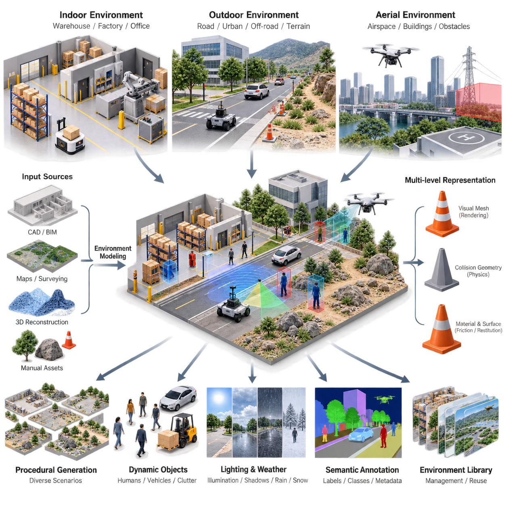
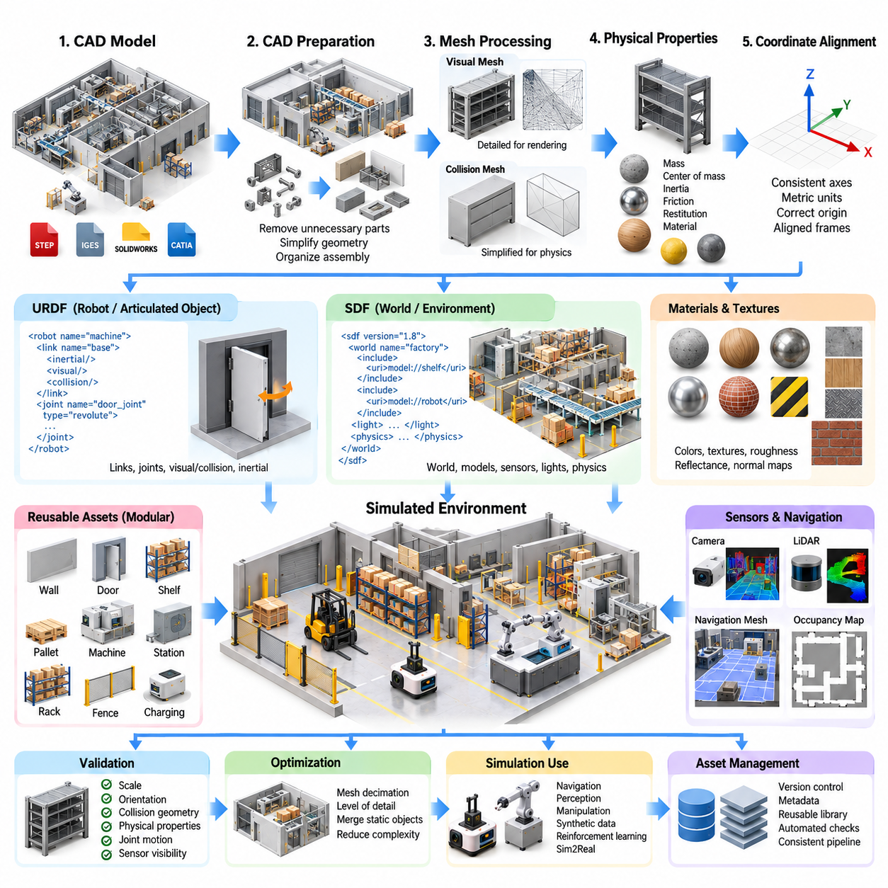
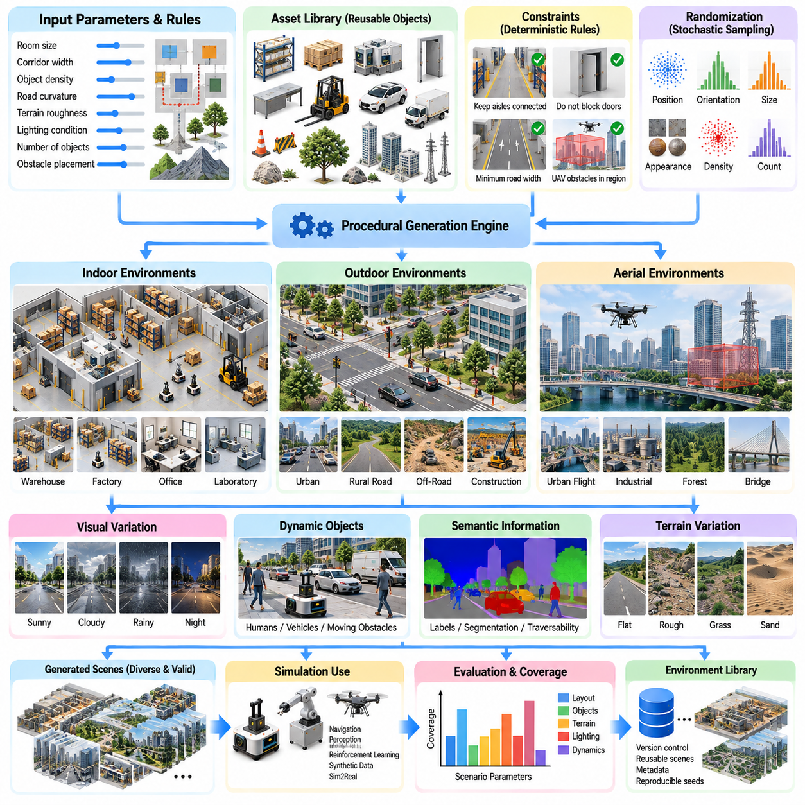
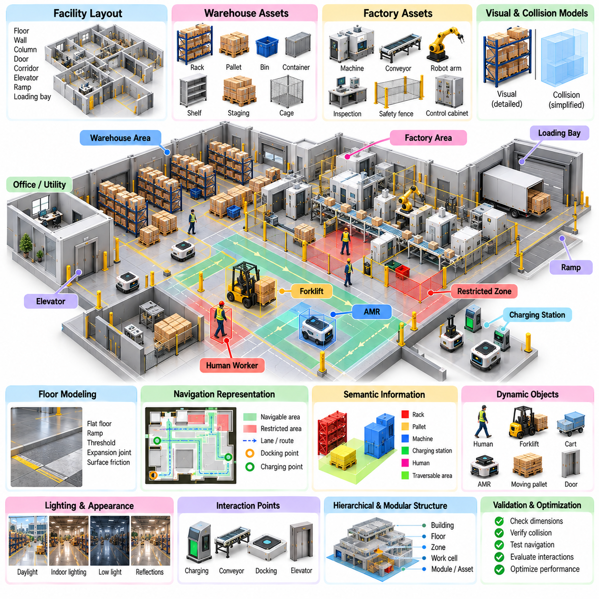
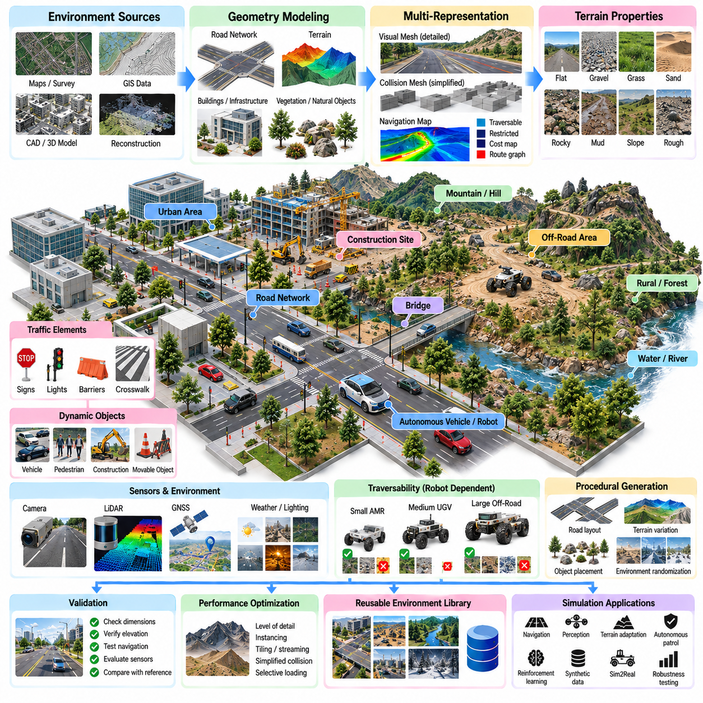
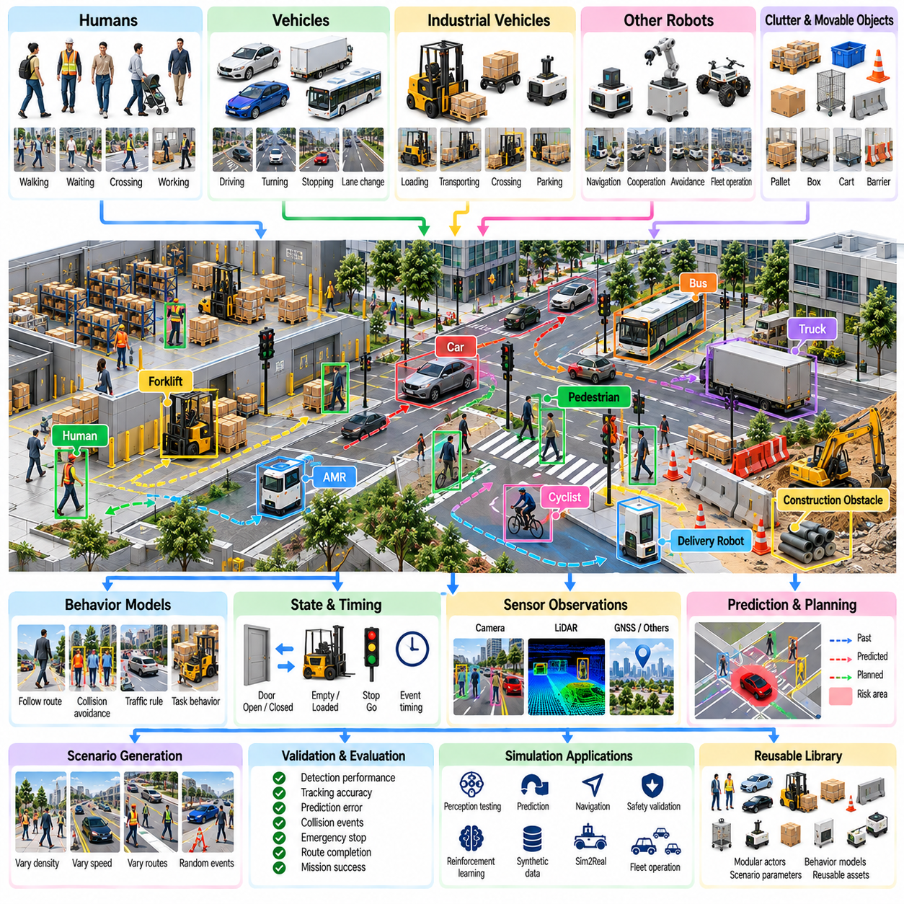
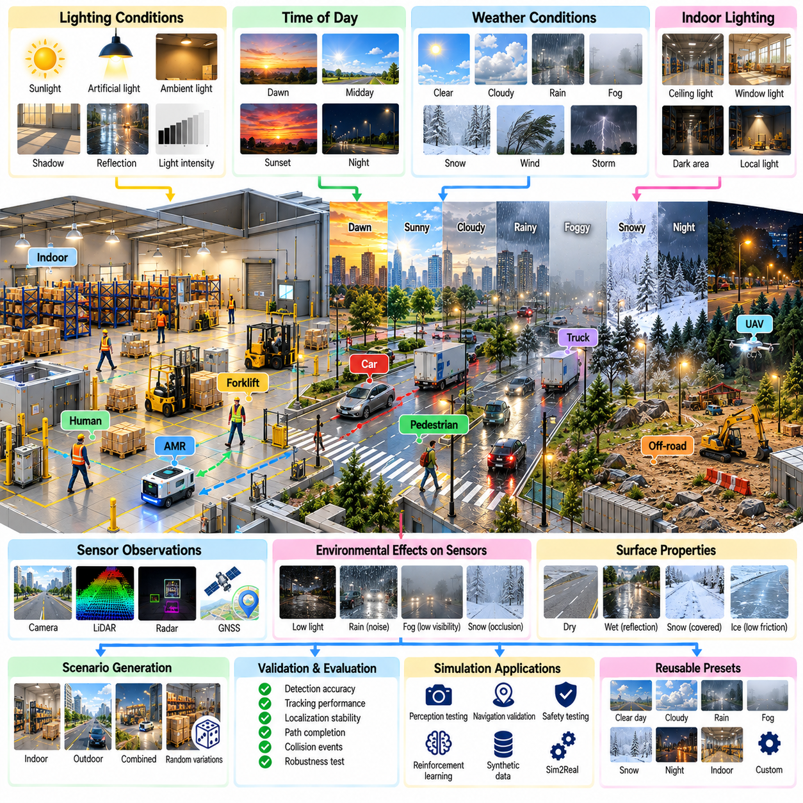
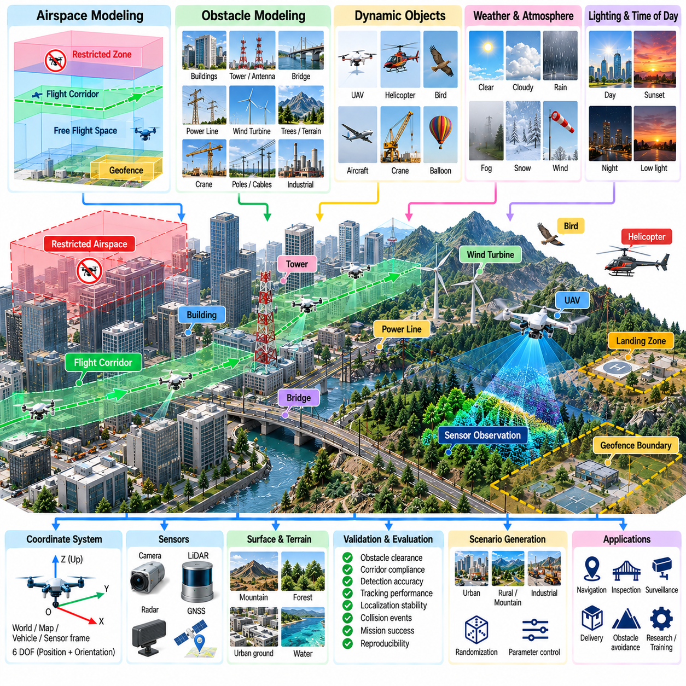
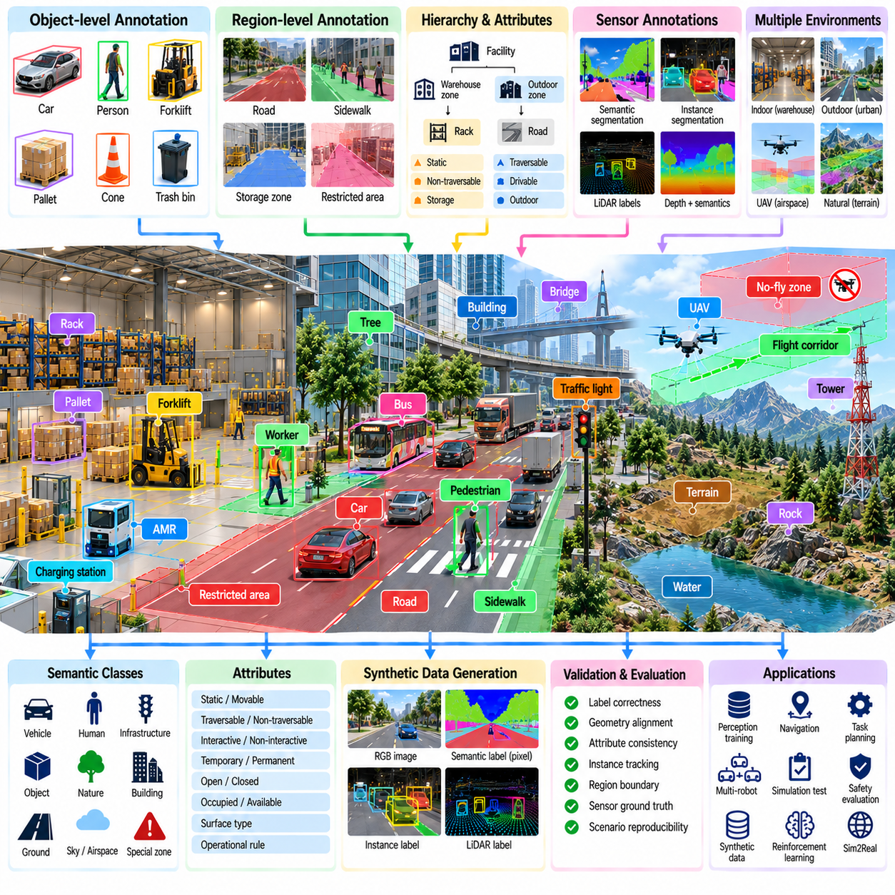
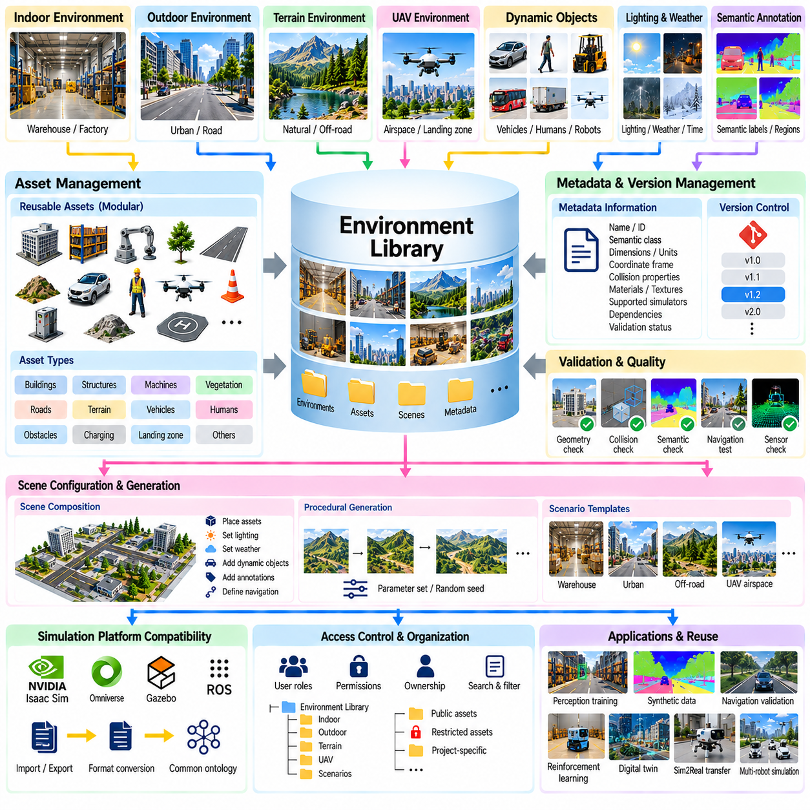

**Volume 11. Simulation and Digital Twin**

# Chapter 05. Environment Modeling

## 05.01. Environment Modeling Overview Indoor Outdoor Aerial

{width="7.268055555555556in" height="7.268055555555556in"}

환경 모델링(Environment Modeling)은 로봇이 작동하는 물리적 세계를 시뮬레이션 환경으로 구성하는 과정이며, 여기에는 형상(geometry), 물리적 특성(physical properties), 의미 정보(semantic meaning), 동적 조건(dynamic conditions) 등이 포함된다. 로봇 시뮬레이션에서 환경은 단순한 시각적 배경이 아니다. 환경은 인식(perception), 위치 추정(localization), 내비게이션(navigation), 경로 계획(planning), 제어(control), 상호작용(interaction)에 필요한 공간적·물리적 맥락을 제공한다. 따라서 유용한 환경 모델은 로봇의 동작에 영향을 주는 요소를 표현하면서도 시뮬레이션 충실도(fidelity)와 계산 비용(computational cost) 사이에서 적절한 균형을 유지해야 한다. 환경 모델링 장은 로봇 모델링과 센서 모델링 이후에 배치되며, 이후의 시뮬레이션 및 디지털 트윈(digital twin) 작업을 위한 장면 기반(scene foundation)을 제공한다.

실내 환경(Indoor environments)은 일반적으로 창고(warehouse), 공장(factory), 사무실(office), 연구실(laboratory), 복도(corridor), 방(room), 선반(shelf), 작업대(workstation), 문(door) 및 기타 인프라와 같이 구조화된 공간으로 구성된다. 이러한 환경의 형상은 비교적 명확하게 정의되어 있으므로 CAD 또는 건물 배치(building-layout) 정보를 시뮬레이션에 유용하게 활용할 수 있다. 그러나 실내 모델은 좁은 통로, 교차로, 장애물, 적재 구역, 제한 구역, 충돌 경계와 같은 실제 내비게이션 제약조건도 표현해야 한다. AMR의 경우 이러한 구조는 위치 추정, 경로 계획, 장애물 회피, 교통 행동에 직접적인 영향을 준다. 따라서 실내 환경 모델링에서는 로봇이 의도한 작업을 안전하고 효과적으로 수행할 수 있는지를 결정하는 공간적 관계를 유지하는 것이 중요하다.

실외 환경(Outdoor environments)은 훨씬 더 큰 기하학적 및 물리적 변동성을 가진다. 도로, 보도, 식생, 건물, 연석, 경사면, 불균일한 지형, 암석, 배수 구조물 및 기타 자연적·인공적 요소가 차량의 움직임과 센서 관측에 영향을 줄 수 있다. 실외 AMR의 경우 지형 형상은 휠 접촉, 서스펜션 동작, 접지력, 안정성 및 주행 가능성(traversability)과 밀접하게 연결된다. 따라서 도로 및 비포장 환경(off-road environments)은 시각적으로 그럴듯한 표면만 필요한 것이 아니라 로봇과 지면 사이의 물리적 상호작용을 의미 있게 표현할 수 있는 지형 특성이 필요하다. 시뮬레이션 환경은 대상 운용 영역에서 중요한 특징을 표현하되, 목표 동작에 거의 영향을 주지 않는 세부사항을 불필요하게 모델링하지 않아야 한다.

공중 환경(Aerial environments)은 로봇이 주로 지면을 따라 이동하는 것이 아니라 3차원 공역(airspace)을 통해 이동하기 때문에 서로 다른 표현 방식이 필요하다. UAV 환경에는 건물, 타워, 전선, 나무, 교량, 제한 구역, 착륙 영역 및 3차원 공간에 분포하는 다양한 장애물이 포함될 수 있다. 따라서 환경은 수평 위치뿐만 아니라 고도(altitude)에 대한 공간적 추론도 지원해야 한다. 공역 제약조건(airspace constraints)과 장애물 형상은 비행 계획, 충돌 회피 및 임무 수행에 영향을 줄 수 있다. 따라서 UAV 시뮬레이션을 위한 환경 모델링은 물리적 장면 표현과 항공기가 어디에서 어떻게 이동할 수 있는지를 정의하는 내비게이션 및 운용 제약조건을 연결해야 한다.

환경 모델링에서 중요한 고려사항 중 하나는 기하학적 표현(geometric representation)과 물리적 의미(physical meaning)를 분리하는 것이다. 하나의 가시 객체는 렌더링(rendering)을 위해 매우 상세한 메시(mesh)로 표현하면서도 물리 계산을 위해서는 단순화된 충돌 형상(collision geometry)을 사용할 수 있다. 이러한 구분을 통해 충돌 감지(collision detection)와 동역학 계산에 불필요한 계산 비용을 부과하지 않으면서 시각적 사실성을 유지할 수 있다. 마찰(friction), 반발 계수(restitution), 표면 특성(surface properties) 및 기타 물리 파라미터는 로봇의 동작에 영향을 미치는 객체에 연결할 수 있다. 따라서 하나의 기하학 표현이 모든 시뮬레이션 하위 시스템에 최적이라고 가정하기보다는 렌더링, 충돌, 물리, 내비게이션 및 인식을 위해 각각 적절한 여러 수준의 표현을 제공하는 것이 바람직하다.

환경 모델은 CAD 시스템, 건물 정보(building information), 지도(map), 측량 데이터(surveying data), 지리정보(geographic information), 3D 장면 재구성(3D scene reconstruction), 수작업으로 제작된 에셋(asset) 등 다양한 소스로부터 생성될 수 있다. 시뮬레이션 워크플로우는 이러한 서로 다른 소스를 선택한 시뮬레이터가 일관되게 해석할 수 있는 표현으로 변환해야 한다. 이 장의 다음 절에서는 특히 SDF 및 URDF와 같은 형식을 이용한 CAD-to-simulation 파이프라인과 환경 가져오기(environment import)를 다룬다. 이는 환경 구축이 독립적인 모델링 작업이 아니라 엔지니어링 데이터 파이프라인으로 다루어져야 함을 의미한다. 변환 과정에서 형상, 좌표계, 스케일, 재질, 충돌 특성 및 객체 간 관계가 일관되게 유지되어야 한다.

절차적 환경 생성(Procedural environment generation)은 특히 로봇 AI 시스템이 다양한 조건을 경험해야 할 때 중요한 또 하나의 접근법이다. 모든 장면을 수작업으로 구성하는 대신 환경의 레이아웃(layout), 객체 배치(object placement), 지형 특성(terrain characteristics) 및 기타 속성을 제어하는 파라미터를 사용하여 환경을 생성할 수 있다. 이러한 방식은 사전에 정의된 제약조건을 유지하면서 다양한 시뮬레이션 조건을 생성할 수 있게 한다. 이는 학습 기반 로봇 시스템에서 특히 중요하다. 소수의 고정된 장면에서 학습한 정책(policy)은 해당 장면에 특화될 수 있기 때문이다. 따라서 절차적 생성은 이후의 합성 데이터(synthetic data) 및 Sim2Real 워크플로우를 위한 체계적인 환경 변형을 지원할 수 있다.

실내 창고 및 공장 환경(Indoor warehouse and factory environments)은 반복적인 구조와 운용 레이아웃의 영향을 크게 받기 때문에 전문적인 모델링이 필요하다. 선반, 팔레트, 생산 장비, 작업대, 충전 구역, 보행자 공간 및 운송 경로는 내비게이션과 작업 수행 사이에 복잡한 상호작용을 만들어낼 수 있다. 유용한 시뮬레이션 환경은 정적인 형상뿐만 아니라 로봇이 어디로 이동할 수 있고 어떤 위치에서 상호작용이 발생하는지를 결정하는 운용 구조(operational structure)도 표현해야 한다. 이러한 모델은 AMR 내비게이션, 교통 관리, 작업 할당, 인식 및 안전 행동을 실제 로봇에 적용하기 전에 통제된 환경에서 평가할 수 있는 기반을 제공한다.

실외 지형 및 도로 모델링(Outdoor terrain and road modeling)은 환경 형상과 차량 이동성(vehicle mobility) 사이의 관계를 고려해야 한다. 평평한 시각적 평면만으로는 경사, 불균일한 표면, 연석, 움푹 팬 곳 또는 비포장 지형이 차량 동역학에 미치는 영향을 충분히 재현할 수 없다. 따라서 지형 표현에는 적절한 고도 정보(elevation information), 표면 특성(surface properties) 및 충돌 형상(collision geometry)이 필요할 수 있다. 실외 AMR의 경우 이러한 특성은 휠-지면 접촉, 서스펜션 반응, 접지력 및 경로 실행 가능성(path feasibility)과 연결될 수 있다. 목표는 현실 세계의 모든 물리적 세부사항을 재현하는 것이 아니라 로봇의 움직임과 임무 수행에 실질적인 영향을 미치는 환경 요인을 표현하는 것이다.

환경 모델링은 시간에 따라 변화하는 객체도 표현해야 한다. 사람, 차량, 이동식 장비, 장애물 및 기타 형태의 클러터(clutter)는 시뮬레이션이 시작된 이후 장면을 변화시킬 수 있다. 따라서 동적 객체 시뮬레이션(dynamic-object simulation)은 정적 환경을 보완하면서 로봇의 운용 조건에 시간적 변화를 추가한다. 이는 인식 및 계획 시스템을 평가할 때 중요하다. 로봇은 세계의 형상뿐만 아니라 그 세계에서 발생하는 변화에도 대응해야 하기 때문이다. 따라서 동적 객체는 시나리오 생성, 내비게이션 검증, 센서 평가 및 자율 의사결정 실험의 일부가 될 수 있다.

조명 및 기상 조건(Lighting and weather conditions)은 특히 실외 로봇과 비전 기반 AI에서 또 하나의 환경 변화 계층을 제공한다. 조도, 그림자, 강수, 가시성 및 이와 관련된 조건의 변화는 기본적인 물리적 형상이 그대로 유지되는 경우에도 센서 관측을 변화시킬 수 있다. 따라서 환경 모델은 제어된 환경 조건의 변화를 통해 인식 및 내비게이션 시스템의 강건성을 평가하는 데 활용될 수 있다. 항공 로봇의 경우 환경에는 비행 시나리오에 적합한 공역 및 장애물 표현을 추가해야 한다. 마지막으로 시뮬레이션 환경의 의미론적 주석(semantic annotation)과 환경 라이브러리 관리(environment-library management)는 시뮬레이션 장면에 의미 있는 라벨을 부여하고, 이를 실험, 데이터셋, 검증 절차 및 디지털 트윈 워크플로우에서 체계적으로 재사용할 수 있도록 한다.

## 05.02. CAD to Sim Pipeline SDF URDF Environment Import [w/Code]

{width="7.268055555555556in" height="7.268055555555556in"}

CAD-시뮬레이션 파이프라인(CAD-to-simulation pipeline)은 기계 설계를 위해 제작된 엔지니어링 모델을 로봇의 물리 시뮬레이션(physics simulation), 센싱(sensing), 내비게이션(navigation), 상호작용(interaction)에 안정적으로 사용할 수 있는 시뮬레이션 준비 에셋(simulation-ready assets)으로 변환하는 과정이다. CAD 어셈블리(CAD assembly)는 일반적으로 제조 수준의 형상, 상세 부품, 설계 메타데이터를 포함하며, 이들 중 상당수는 시뮬레이션에서는 불필요하거나 높은 계산 비용을 발생시킨다. 따라서 변환 과정은 단순한 파일 형식 변경 이상의 작업이다. 엔지니어링 형상을 시각 형상(visual geometry), 충돌 형상(collision geometry), 물리적 특성(physical properties), 좌표 프레임(coordinate frames), 조인트(joints), 재질(materials), 의미론적 관계(semantic relationships)를 포함하는 구조화된 시뮬레이션 모델로 재해석해야 한다. 이 파이프라인은 기계 엔지니어링 데이터와 실행 가능한 가상 환경을 연결하는 다리 역할을 한다.

이 과정은 일반적으로 원본 CAD 어셈블리의 준비 작업에서 시작한다. 기계 모델에는 볼트, 와셔, 내부 브래킷, 배선 형상, 제조 세부사항과 같이 로봇 상호작용에는 거의 영향을 주지 않으면서 폴리곤 수와 장면 복잡도를 크게 증가시키는 수천 개의 작은 부품이 포함될 수 있다. 내보내기(export) 전에 불필요한 부품을 제거하고, 반복 구조를 단순화하며, 시뮬레이션 목적에 맞게 어셈블리를 재구성할 수 있다. 목표는 모든 제조 세부사항을 보존하는 것이 아니라 충돌, 가시성, 접근성, 센싱 또는 물리적 상호작용에 영향을 주는 형상과 구조를 유지하는 것이다. 이 단계에서 신중하게 준비하면 이후의 변환 문제와 시뮬레이션 부하를 줄일 수 있다.

좌표계 일관성(coordinate-system consistency)은 CAD 변환 과정에서 가장 중요한 요구사항 중 하나이다. 서로 다른 CAD 도구, 그래픽 패키지, 로보틱스 프레임워크 및 시뮬레이터는 서로 다른 축 규약(axis conventions), 단위(units), 원점(origins), 변환 규칙(transformation rules)을 사용할 수 있다. 잘못된 축 방향으로 내보낸 모델은 시뮬레이터로 가져왔을 때 회전되거나, 반전되거나, 위치가 이동하거나, 잘못된 크기로 나타날 수 있다. 따라서 환경 에셋은 명확하게 정의된 기준 프레임(reference frames)과 일관된 미터법 단위(metric units)를 사용해야 한다. 월드 프레임(world frame), 건물 원점(building origin), 바닥 높이(floor elevation), 로봇 기준 프레임(robot reference frame), 객체 로컬 프레임(object-local frames)은 예측 가능한 관계를 유지해야 하며, 이를 통해 지도, 센서, 로봇 및 환경 형상을 반복적인 수동 수정 없이 정렬할 수 있다.

CAD 형상은 일반적으로 시뮬레이션 기술 형식에 통합되기 전에 폴리곤 메시 형식(polygonal mesh formats)으로 변환된다. 시각 메시(visual meshes)는 객체가 카메라와 렌더링 시스템에서 어떻게 보이는지를 결정하므로 비교적 상세한 형상을 유지할 수 있다. 반면 충돌 메시(collision meshes)는 물리 엔진이 충돌 감지와 접촉 계산 과정에서 반복적으로 평가하기 때문에 일반적으로 단순화해야 한다. 따라서 복잡한 기계 외장, 선반, 벽 또는 지형 객체는 시각 렌더링을 위한 메시와 물리 계산을 위한 별도의 단순화 표현을 가질 수 있다. 볼록 분해(convex decomposition), 기본 도형 근사(primitive approximation), 메시 단순화(mesh decimation), 상세도(level-of-detail) 기술은 의미 있는 상호작용에 필요한 기하학적 특성을 유지하면서 계산 부하를 줄일 수 있다.

가져온 에셋이 단순한 정적 배경이 아니라 동역학(dynamics)에 참여한다면 물리적 특성을 추가해야 한다. 질량(mass), 질량 중심(center of mass), 관성(inertia), 마찰(friction), 반발 계수(restitution), 접촉 관련 파라미터는 객체가 로봇에 의해 밀리거나, 떨어지거나, 파지되거나, 그 위를 주행하거나, 충돌했을 때 어떻게 반응하는지를 결정한다. CAD 시스템에 재질 및 질량 정보가 포함되어 있을 수 있지만 이러한 특성이 항상 시뮬레이션 형식으로 직접 또는 정확하게 전달되는 것은 아니다. 따라서 엔지니어는 기하학적 변환만으로 올바른 동역학 모델이 자동 생성된다고 가정해서는 안 되며 결과 물리 모델을 검증해야 한다. 정적 환경 구조물은 이동 장비, 팔레트, 문, 도구, 차량 및 기타 물리적으로 의미 있는 동작이 필요한 객체와 다르게 처리할 수 있다.

통합 로봇 기술 형식(URDF, Unified Robot Description Format)은 로보틱스 분야에서 링크 구조(linked structures), 조인트, 형상, 관성 특성 및 기준 프레임을 기술하기 위해 널리 사용된다. URDF는 주로 로봇 모델과 관련되어 있지만 ROS 기반 시스템과의 통합이 중요한 경우 구조화된 객체와 비교적 단순한 환경 에셋을 기술하는 데도 사용할 수 있다. 링크(link)는 개별 강체(rigid body)를 제공하고, 조인트는 이들 사이의 관계를 정의하며, 시각 요소(visual elements)와 충돌 요소(collision elements)는 서로 분리된 기하학적 표현을 정의한다. URDF는 가져온 CAD 어셈블리에 문, 게이트, 메커니즘 또는 이동식 설비와 같은 관절형 구성요소가 포함되어 있고 로보틱스 소프트웨어 워크플로우 내에서 명시적인 운동학적 관계(kinematic relationships)를 표현해야 할 때 특히 유용하다.

시뮬레이션 기술 형식(SDF, Simulation Description Format)은 시뮬레이션 월드(world), 모델, 센서, 조명, 물리 파라미터, 플러그인 및 환경 구조를 기술하기 위한 보다 폭넓은 기능을 제공한다. 따라서 SDF는 Gazebo와 같은 시스템에서 완전한 시뮬레이션 환경을 표현하는 데 특히 적합하다. 하나의 월드에는 여러 모델, 정적 구조물, 동적 객체, 조명 조건 및 시뮬레이터별 설정을 통합된 계층 구조로 포함할 수 있다. 따라서 URDF와 SDF는 일부 기능이 중첩되지만 서로 다른 목적을 가진다. URDF는 로봇과 관절형 모델의 기술에 강하게 초점을 맞추는 반면, SDF는 더 큰 시뮬레이션 장면과 그 운용 맥락을 표현할 수 있다. 변환 파이프라인에서는 대상 에셋이 로봇, 메커니즘, 환경 객체 또는 전체 월드인지에 따라 두 형식을 모두 활용할 수 있다.

환경 가져오기(environment import)에서는 재사용 가능한 에셋(reusable assets)과 완전한 장면(complete scenes) 사이에 명확한 계층 구조가 필요하다. 예를 들어 창고는 하나의 거대한 메시(monolithic mesh)로 내보내는 대신 벽, 선반, 랙, 문, 작업대, 팔레트, 충전 스테이션 및 안전 구조물로 분해할 수 있다. 이러한 모듈식 접근법(modular approach)을 사용하면 개별 객체의 위치를 변경하거나, 교체하거나, 무작위화하거나, 주석을 추가하거나, 여러 환경에서 재사용할 수 있다. 또한 문제가 있는 구성요소를 개별적으로 분리할 수 있으므로 충돌 최적화와 디버깅(debugging)이 쉬워진다. 이후 장면 구성(scene composition)을 통해 일관된 좌표계와 시뮬레이션 특성을 유지하면서 이러한 재사용 가능한 모델을 완전한 공장, 창고, 연구실, 도로 또는 실외 환경으로 조립할 수 있다.

재질과 텍스처(materials and textures)는 별도로 고려해야 한다. CAD의 외관 데이터가 실시간 렌더링 시스템에 항상 직접 대응되는 것은 아니기 때문이다. 표면 색상, 텍스처 좌표(texture coordinates), 노멀 맵(normal maps), 거칠기(roughness), 반사율(reflectance) 및 기타 렌더링 특성은 형상 변환 이후 다시 구성해야 할 수 있다. 이러한 특성은 시뮬레이션 카메라를 인식 개발이나 합성 데이터 생성(synthetic-data generation)에 사용할 때 특히 중요하다. 물리적으로 타당한 충돌 모델이라도 재질과 조명이 부정확하면 비현실적인 시각 센서 데이터를 생성할 수 있다. 반대로 주로 형상과 충돌에 의존하는 내비게이션 전용 시뮬레이션에서는 매우 상세한 시각 재질이 큰 이점을 제공하지 못한다. 따라서 에셋 충실도(asset fidelity)는 시뮬레이션 목적에 맞게 선택해야 한다.

가져온 환경은 내비게이션 및 센서 표현과도 정렬되어야 한다. 시각적으로 정확한 바닥이라고 해서 자동으로 사용 가능한 내비게이션 표면이 되는 것은 아니며, 카메라에서 보이는 벽이라도 형상이나 재질 설정이 잘못되어 있다면 LiDAR 또는 충돌 시스템에서 예상한 반응을 생성하지 못할 수 있다. 따라서 점유 지도(occupancy maps), 내비게이션 메시(navigation meshes), 의미 지도(semantic maps), 충돌 계층(collision layers), 센서 가시 형상(sensor-visible geometry)을 가져온 장면과 비교하여 검증해야 한다. AMR 시뮬레이션에서는 바닥 연속성, 출입구 폭, 장애물 경계, 경사로 형상 및 주행 가능 영역(traversable regions)이 특히 중요하다. 작은 기하학적 불일치도 위치 추정 오류, 잘못된 경로, 예상하지 못한 접촉 또는 비현실적인 센서 관측을 발생시킬 수 있기 때문이다.

검증(validation)은 전체 환경이 완성된 이후에만 수행하는 것이 아니라 단계적으로 수행해야 한다. 각각의 변환된 에셋에 대해 먼저 스케일, 방향, 원점, 메시 무결성(mesh integrity), 재질 할당을 검사할 수 있다. 이후 충돌 형상을 시각화하여 렌더링 형상과 독립적으로 시험할 수 있다. 동적 객체는 안정적인 질량 및 관성 특성을 확인해야 하며, 관절형 구성요소는 예상되는 조인트 운동 범위에서 동작시켜야 한다. 개별 검증 이후에는 대표적인 로봇과 센서를 사용하여 전체 환경을 시험할 수 있다. 이러한 단계적 접근법을 사용하면 관찰된 문제가 형상 변환, 물리 설정, 좌표 변환, 장면 구성 또는 시뮬레이터 설정 중 어디에서 발생했는지를 보다 쉽게 파악할 수 있다.

환경의 규모가 커질수록 성능 최적화(performance optimization)의 중요성도 증가한다. 상세한 산업 시설에는 수백만 개의 폴리곤과 수천 개의 객체가 포함될 수 있으며, 카메라, LiDAR, 물리 계산 및 로봇 제어 워크로드가 CPU와 GPU 자원을 동시에 사용한다. 필요한 경우 정적 형상을 병합하고, 멀리 떨어진 에셋에는 낮은 상세도(level of detail)를 적용하며, 충돌 모델을 단순화하고, 관련 영역 밖의 객체를 언로드(unload)하거나 비활성화할 수 있다. 최적화는 대상 실험에 영향을 주는 특징을 보존하면서 불필요한 복잡성을 제거해야 한다. 결과 환경은 요구되는 검증 작업을 수행하기에 충분한 정확성을 가지면서 실시간 동작, 배치 시뮬레이션(batch simulation), 대규모 병렬 실행(large-scale parallel execution)을 지원할 수 있을 만큼 가벼워야 한다.

궁극적으로 제품 수준의 CAD-시뮬레이션 워크플로우는 일회성 변환 과정이 아니라 에셋 파이프라인(asset pipeline)으로 발전해야 한다. 원본 CAD 파일, 내보낸 메시, 최적화된 충돌 모델, 텍스처, URDF 또는 SDF 기술 파일, 의미론적 메타데이터(semantic metadata), 시뮬레이터별 설정을 함께 버전 관리해야 한다. 자동 검증(automated validation)을 통해 에셋이 더 큰 시뮬레이션 워크플로우에 들어가기 전에 누락된 메시, 잘못된 경로, 일관되지 않은 스케일 또는 잘못 구성된 기술 파일을 탐지할 수 있다. 이러한 과정이 표준화되면 동일한 환경 구성요소를 내비게이션 검증, 인식 시험, 합성 데이터 생성, 강화학습(reinforcement learning), Sim2Real 실험 및 디지털 트윈에 활용할 수 있으며, 엔지니어링 형상을 전체 로봇 시뮬레이션 수명주기에서 재사용 가능한 기반으로 발전시킬 수 있다.

## 05.03. Procedural Environment Generation for Diversity [w/Code]

{width="7.268055555555556in" height="7.268055555555556in"}

절차적 환경 생성(Procedural environment generation)은 모든 환경을 수작업으로 모델링하는 대신 규칙(rules), 파라미터(parameters), 제약조건(constraints), 재사용 가능한 에셋(reusable assets)을 기반으로 시뮬레이션 장면을 자동으로 생성하는 방법이다. 로보틱스에서 가장 중요한 가치는 다양성(diversity)에 있다. 소수의 고정된 장면에서만 학습하거나 검증된 로봇은 특정 레이아웃, 텍스처, 장애물 위치 또는 조명 조건에 지나치게 의존하는 동작을 학습할 수 있다. 절차적 생성은 환경의 범위를 체계적으로 확장하여 장면 구조와 실험 조건을 제어하면서도 실제 운용 영역(operational domain)에서 발생할 수 있는 다양한 변형을 시뮬레이션으로 표현할 수 있게 한다. 환경 모델링 워크플로우에서 이는 CAD 기반 가져오기를 보완하며 이후의 실내, 실외, 동적 객체, 기상 및 의미론적 시뮬레이션을 지원한다.

절차적 환경은 일반적으로 파라미터화된 장면 모델(parameterized scene model)을 통해 정의된다. 모든 객체의 정확한 위치와 외관을 지정하는 대신 설계자는 방 크기, 복도 폭, 선반 간격, 도로 곡률, 지형 고도, 장애물 밀도, 식생, 객체 수 및 객체 배치와 같은 속성에 대한 분포(distributions) 또는 허용 범위를 정의한다. 생성 알고리즘은 이러한 파라미터를 샘플링하여 유효한 장면을 구성한다. 따라서 생성된 환경은 완전히 무작위적인 것이 아니다. 엔지니어링 제약조건과 목표 운용 설계 영역(operational design domain)에 의해 변동 범위가 결정되는 제어된 환경 집합에 속한다.

장면 생성(scene generation)은 일반적으로 결정론적 규칙(deterministic rules)과 확률적 샘플링(stochastic sampling)을 결합한다. 결정론적 제약조건은 창고 통로의 연결성을 유지하고, 출입문이 막히는 것을 방지하며, 최소 도로 폭을 유지하거나, UAV 장애물이 지정된 영역 내에 존재하도록 하는 등의 필수 구조를 보존한다. 이후 확률적 과정은 객체 위치, 방향, 크기, 외관 또는 밀도와 같은 비핵심 속성을 변화시킨다. 제약되지 않은 무작위화는 불가능하거나 의미 없는 환경을 쉽게 생성할 수 있으므로 이러한 결합은 중요하다. 효과적인 절차적 생성은 실제 로봇 운용을 대표하는 물리적·기하학적·운용적 관계를 훼손하지 않으면서 다양성을 생성해야 한다.

재사용 가능한 에셋 라이브러리(reusable asset libraries)는 절차적 장면 구성을 위한 기본 구성요소를 제공한다. 선반, 팔레트, 기계, 문, 가구, 차량, 나무, 암석, 교통 인프라, 건물 및 기타 에셋을 사전에 정의된 형상, 충돌 특성, 재질, 의미 클래스(semantic classes), 연결 정보와 함께 모듈식 객체로 저장할 수 있다. 생성기는 시나리오 규칙에 따라 에셋을 선택하여 환경에 배치한다. 동일한 의미 클래스에 여러 변형을 제공하면 다양성을 더욱 증가시킬 수 있다. 또한 에셋 생성과 장면 생성을 분리하면 하나의 에셋을 업데이트했을 때 각 장면을 수작업으로 다시 구성하지 않고도 여러 생성 환경에 자동으로 반영할 수 있어 유지보수성이 향상된다.

실내 절차적 생성(Indoor procedural generation)은 여러 구조적 수준에서 수행할 수 있다. 먼저 건물 레이아웃을 통해 방, 복도, 문 및 연결성을 정의할 수 있다. 이후 각각의 공간을 창고 저장 구역, 제조 구역, 연구실, 사무실 또는 충전 구역과 같은 의미론적 목적에 따라 구성할 수 있다. 창고 내부에서는 AMR 운용에 필요한 경로를 유지하면서 랙 배치, 통로 폭, 팔레트 분포, 임시 장애물 및 작업대 위치를 변화시킬 수 있다. 계층적 생성(hierarchical generation)은 전체 토폴로지(global topology)와 지역 객체 배치(local object placement)가 서로 다른 제약조건을 갖기 때문에 유용하며, 이러한 수준을 분리하면 다양하면서도 운용적으로 유효한 장면을 보다 쉽게 생성할 수 있다.

실외 절차적 생성(Outdoor procedural generation)은 개별 객체뿐만 아니라 연속적인 환경 구조도 표현해야 한다. 도로는 구간, 교차로, 차선, 경사 및 곡률 파라미터의 네트워크로 생성할 수 있으며, 주변 지형은 고도 함수(elevation functions), 높이 맵(height maps), 노이즈 모델(noise models) 또는 사전에 정의된 지형 클래스를 이용하여 합성할 수 있다. 이후 식생, 암석, 연석, 표지판, 방호 구조물, 건물 및 기타 특징을 공간적 규칙에 따라 배치할 수 있다. 비포장 로봇(off-road robots)의 경우 경사, 거칠기, 표면 전환, 함몰부 및 장애물이 주행 가능성, 휠 접촉, 서스펜션 반응 및 경로 계획 난이도를 크게 변화시킬 수 있으므로 지형 다양성이 특히 중요하다.

공중 환경(Aerial environments)은 절차적 생성을 3차원 자유 공간(three-dimensional free space)으로 확장한다. 건물의 높이와 간격을 변화시킬 수 있고, 장애물을 서로 다른 고도 범위에 배치할 수 있으며, 착륙 구역을 옥상 또는 지상 영역에 분산시킬 수 있다. 타워, 케이블, 교량, 나무 및 제한 공간(restricted volumes)은 서로 다른 비행 계획 문제를 생성할 수 있다. 절차적으로 생성된 UAV 환경은 계획 및 회피 알고리즘을 충분히 시험할 수 있는 어려운 구성을 제공하면서도 충돌 없이 비행할 수 있는 가능성을 유지해야 한다. 장애물 밀도, 수직 여유 공간(vertical clearance), 경로 복잡도 및 목적지 배치를 파라미터화하면 비교적 단순한 비행에서 제한적인 도심 환경까지 폭넓은 항공 임무를 생성할 수 있다.

많은 인식 중심 시뮬레이션에서는 기하학적 다양성(geometric diversity)만으로 충분하지 않다. 텍스처, 색상, 재질 외관, 조명, 그림자 및 배경 객체와 같은 시각적 특성도 절차적으로 변화시킬 수 있다. 창고 바닥에 서로 다른 표면 재질을 적용하거나, 선반의 색상을 변경하거나, 실외 환경에 서로 다른 식생이나 건물 외관을 적용할 수 있다. 이러한 변화는 단일 시각 구성에 대한 의존성을 감소시키고 인식 모델을 더욱 폭넓은 관측 분포(observation distributions)에 노출한다. 그러나 사실성이 중요한 경우 시각적 무작위화는 목표 응용 분야와 일관성을 유지해야 한다. 임의적인 조합은 실제 배치 조건을 더 이상 대표하지 못하는 데이터를 생성할 수 있기 때문이다.

동적 다양성(dynamic diversity)은 이동하는 행위자(moving actors)와 시간적 이벤트(temporal events)를 절차적으로 생성하여 추가할 수 있다. 사람은 서로 다른 경로를 따라 이동할 수 있고, 차량은 장면에 진입하거나 이탈할 수 있으며, 팔레트의 위치가 변경되고, 문이 열리고 닫히며, 임무 수행 중 임시 장애물이 나타날 수 있다. 생성기는 행위자 수, 이동 궤적, 속도, 상호작용 지점 및 발생 시간을 제어할 수 있다. 이를 통해 절차적 환경 생성은 정적인 장면 변화에서 시나리오 생성(scenario generation)으로 확장된다. 자율 로봇의 경우 인식, 예측, 계획 및 제어 시스템이 고정된 형상을 단순히 통과하는 것이 아니라 변화하는 상황에 대응해야 하므로 시간적 다양성이 특히 중요하다.

의미론적 정보(semantic information)는 기하학적 환경과 동시에 생성할 수 있다. 절차적 시스템은 어떤 규칙에 의해 각각의 객체가 생성되었는지를 알고 있으므로 의미 클래스, 인스턴스 식별자(instance identifiers), 주행 가능성 속성(traversability attributes), 영역 라벨(region labels) 및 기타 메타데이터를 자동으로 할당할 수 있다. 이를 통해 실제 데이터셋에서 일반적으로 필요한 고비용의 수동 주석 작업을 줄일 수 있다. 카메라는 분할 마스크(segmentation masks)를 획득할 수 있고, LiDAR 포인트에는 객체 라벨을 부여할 수 있으며, 내비게이션 시스템은 생성된 환경으로부터 의미 지도(semantic maps)를 직접 제공받을 수 있다. 따라서 절차적 생성은 다양한 환경뿐만 아니라 인식 학습, 합성 데이터 생성, 평가 및 디버깅을 지원하는 구조화된 정답 데이터(ground truth)도 제공한다.

다양성은 단순히 존재한다고 가정하는 것이 아니라 측정할 수 있어야 한다. 수천 개의 장면을 생성하더라도 대부분이 표면적으로만 다르다면 얻을 수 있는 이점은 제한적이다. 따라서 환경 생성 파이프라인은 파라미터 분포와 함께 객체 밀도, 레이아웃 토폴로지(layout topology), 장애물 간격, 지형 거칠기, 가시성, 경로 길이 및 시나리오 난이도와 같은 장면 특성을 추적해야 한다. 커버리지 분석(coverage analysis)을 통해 파라미터 공간에서 충분히 표현되지 않은 영역을 식별할 수 있다. 또한 장애가 발생했을 때 동일한 장면을 정확하게 재현할 수 있도록 시드(seed)를 기록해야 한다. 재현성(reproducibility)은 무작위 생성을 디버깅, 회귀 시험(regression testing), 통제된 비교에 사용할 수 있는 엔지니어링 도구로 전환한다.

절차적 생성은 학습 진행 상황에 따라 환경 난이도를 변경하는 커리큘럼 전략(curriculum strategies)과 결합할 수 있다. 내비게이션 정책은 넓은 복도와 적은 장애물에서 시작한 후 점차 좁은 통로, 동적 행위자, 복잡한 교차로 또는 저하된 가시성 조건을 경험하도록 구성할 수 있다. 비포장 로봇은 평탄한 지형에서 시작하여 점차 거친 표면과 더 큰 경사를 경험하도록 할 수 있다. 모든 조건을 균등하게 샘플링하는 대신 생성기는 현재 학습 시스템에 유용한 정보를 제공하는 시나리오에 집중할 수 있다. 이를 통해 환경 생성은 단순히 무작위 장면을 공급하는 수동적 요소가 아니라 강화학습(reinforcement learning)과 자동화된 정책 개발에서 능동적인 구성요소가 될 수 있다.

대규모 시뮬레이션(large-scale simulation)은 수백 또는 수천 개의 병렬 환경을 수작업으로 제작하는 것이 현실적으로 불가능하기 때문에 절차적 생성의 중요성을 더욱 높인다. 파라미터화된 생성기는 많은 장면 변형을 자동으로 인스턴스화하고 서로 다른 랜덤 시드를 할당하며 학습 또는 검증 과정에서 새로운 구성을 지속적으로 생성할 수 있다. 동일한 접근법을 통해 다양한 환경에서 카메라 영상, 깊이 정보, 분할 데이터, 포인트 클라우드, 로봇 상태 및 주석을 수집하는 합성 데이터셋을 구축할 수도 있다. 따라서 표준화된 절차적 파이프라인은 환경 모델링을 합성 데이터, 강화학습, 병렬 시뮬레이션 및 이후의 Sim2Real 전이 단계와 연결한다.

궁극적인 목표는 무작위성 자체가 아니라 제어된 다양성(controlled diversity)이다. 절차적으로 생성된 환경은 로봇이 실제로 경험할 것으로 예상되는 조건의 의미 있는 변형을 표현하면서 물리적 유효성(physical validity), 의미론적 일관성(semantic consistency), 작업 실행 가능성(task feasibility)을 유지해야 한다. 규칙, 확률 분포, 에셋 라이브러리, 검증 제약조건 및 재현 가능한 시드를 함께 사용함으로써 이러한 제어를 달성할 수 있다. 생성된 장면을 환경 라이브러리(environment library)에 통합하면 개발 단계 전반에서 저장, 재생성, 비교 및 재사용할 수 있다. 따라서 절차적 환경 생성은 시뮬레이션을 소수의 수작업 월드 집합에서 강건한 로봇 AI 개발과 체계적인 검증을 지원할 수 있는 확장 가능한 환경 시스템으로 발전시킨다.

## 05.04. Indoor Warehouse Factory Environment Modeling [w/Code]

{width="7.268055555555556in" height="7.268055555555556in"}

실내 창고 및 공장 환경 모델링(Indoor warehouse and factory environment modeling)은 자율이동로봇(Autonomous Mobile Robot, AMR), 매니퓰레이터(manipulator), 모바일 매니퓰레이터(mobile manipulator), 지게차(forklift), 작업자(human worker)를 현실적인 운용 조건에서 시뮬레이션할 수 있는 구조화된 가상 공간을 구축하는 과정이다. 시각적 표현을 중심으로 하는 건축 모델과 달리 로보틱스 환경은 인식(perception), 위치 추정(localization), 내비게이션(navigation), 계획(planning), 제어(control)에 충분한 정확도로 형상, 충돌 경계, 주행 가능 영역, 작업 구역 및 상호작용 지점을 표현해야 한다. 따라서 환경은 단순한 건물의 3차원 표현이 아니라 실행 가능한 운용 모델(executable operational model)의 역할을 한다.

모델링 과정은 일반적으로 시설의 구조적 레이아웃(structural layout)에서 시작한다. 바닥, 벽, 기둥, 천장, 문, 하역장, 복도, 엘리베이터, 경사로 및 고정 칸막이는 로봇이 작동하는 기본적인 기하학적 공간을 형성한다. 통로 폭, 출입구 여유 공간, 천장 높이, 회전 공간 및 바닥 높이와 같은 치수는 로봇의 접근 가능성에 직접적인 영향을 준다. 시설 전체에서 좌표계와 스케일은 일관성을 유지해야 한다. 작은 치수 오류도 비현실적인 충돌 동작, 잘못된 지도 또는 실제 시설에서는 실행할 수 없는 내비게이션 경로를 생성할 수 있기 때문이다.

창고 환경(Warehouse environments)에는 랙, 선반, 팔레트, 빈(bin), 컨테이너 및 적치 구역(staging areas)과 같은 반복적인 저장 구조가 많이 존재한다. 이러한 요소의 배치는 물류 요구사항에 따라 자주 변경되므로 일반적으로 하나의 거대한 장면으로 구성하기보다는 모듈식 에셋(modular assets)으로 모델링하는 것이 적합하다. 개별 랙 모듈은 공통된 충돌 및 의미론적 특성을 유지하면서 반복적으로 인스턴스화할 수 있다. 팔레트 위치는 적재, 비어 있음 또는 부분 적재 상태로 표현할 수 있으므로 전체 환경을 다시 구축하지 않고도 동일한 기본 창고 모델에서 서로 다른 재고 상태와 운용 조건을 표현할 수 있다.

공장 환경(Factory environments)은 더욱 다양한 장비와 작업 셀(work cells)을 포함한다. 생산 기계, 컨베이어, 로봇 팔, 검사 스테이션, 조립 셀, 안전 펜스, 제어반, 지그 및 고정구, 자재 버퍼, 유지보수 공간은 기하학적 제약조건뿐만 아니라 기능적 영역도 형성한다. 이러한 요소는 모바일 로봇이 생산 시스템과 어떻게 상호작용하는지를 반영하도록 표현해야 한다. 예를 들어 하나의 기계에는 시각적 형상 외에도 배송 위치, 도킹 자세(docking pose), 제한 안전 구역 및 접근 통로가 필요할 수 있다. 이러한 운용 관계를 모델링하면 단순한 무충돌 이동을 넘어 임무 수준 시뮬레이션(mission-level simulation)을 지원할 수 있다.

유용한 실내 환경은 시각 형상(visual geometry)과 충돌 형상(collision geometry)을 분리한다. 카메라와 사실적인 렌더링을 위해 상세 메시를 유지할 수 있지만, 물리적 경계는 단순화된 박스, 원통, 볼록 껍질(convex hull) 또는 축소된 메시로 표현할 수 있다. 이러한 구분은 수백 개의 반복적인 랙, 팔레트 및 기계를 포함하는 창고에서 특히 유용하다. 복잡한 충돌 메시가 물리 계산량을 크게 증가시킬 수 있기 때문이다. 그러나 단순화된 충돌 모델에서도 선반 모서리, 기계 설치 면적, 출입구 경계 및 AMR의 안전한 통과 여부를 결정하는 장애물과 같은 핵심 치수는 유지해야 한다.

바닥 모델링(Floor modeling)은 모바일 로봇에서 특히 중요하다. 산업용 바닥은 일반적으로 평평하게 보이지만, 이러한 특징이 이동성이나 위치 추정에 영향을 준다면 경사로, 문턱, 신축 이음(expansion joints), 배수 경사, 바닥 재질 전환 및 작은 높이 차이를 시뮬레이션에서 표현해야 할 수 있다. 마찰(friction)과 같은 표면 파라미터는 가속, 제동, 회전 및 휠 슬립(wheel slip)에 영향을 줄 수 있다. 고충실도 차량 시뮬레이션에서는 국부적인 불규칙성이 서스펜션이나 휠-지면 접촉에도 영향을 줄 수 있다. 따라서 필요한 바닥의 상세 수준은 시각적 외관이 아니라 목표 실험에 따라 결정해야 한다.

내비게이션 표현(Navigation representations)은 물리적 장면과 긴밀하게 일치해야 한다. 점유 격자(occupancy grids), 내비게이션 메시(navigation meshes), 비용 지도(cost maps), 차선 그래프(lane graphs), 제한 영역, 일방통행 경로, 대기 구역, 도킹 영역 및 충전 위치가 기하학적 환경과 함께 존재할 수 있다. 창고에는 물리적으로 개방된 공간이 존재하더라도 작업자, 생산 장비, 비상 통로 또는 자재 보관을 위해 로봇의 이동이 금지된 영역이 있을 수 있다. 따라서 환경 모델링에서는 기하학적 주행 가능성(geometric traversability)과 운용상 허용 여부(operational permission)를 구분하여 내비게이션 소프트웨어가 물리적 실행 가능성과 시설 운영 규칙을 함께 판단할 수 있도록 해야 한다.

의미론적 모델링(Semantic modeling)은 단순한 기하학적 객체에 기능적 의미를 추가한다. 직육면체 구조물을 단순한 장애물로 취급하는 대신 랙, 팔레트, 기계, 충전 스테이션, 문, 보행자 구역 또는 도킹 목표로 식별할 수 있다. 의미 클래스(semantic classes)와 인스턴스 식별자(instance identifiers)는 인식 정답 데이터(perception ground truth), 합성 데이터 생성(synthetic-data generation), 작업 계획 및 자동 평가를 지원할 수 있다. 기능적 메타데이터(functional metadata)는 객체가 이동 가능한지, 통과 가능한지, 상호작용 가능한지, 제한 대상인지 또는 특정 로봇 동작과 연관되는지를 추가로 기술할 수 있다. 이를 통해 환경은 단순한 메시 집합에서 기계가 해석할 수 있는 작업 공간 표현으로 발전한다.

동적 객체(Dynamic objects)는 현실적인 창고 및 공장 시뮬레이션에 필수적이다. 작업자, 지게차, 카트, 다른 AMR, 운반 중인 팔레트, 개폐되는 문, 이동하는 컨베이어 및 임시 적재 자재는 운용 공간을 지속적으로 변화시킨다. 이러한 객체의 궤적, 속도, 행동 및 상호작용 규칙을 파라미터화하여 반복 가능한 시나리오를 생성할 수 있다. 동적 모델링을 통해 장애물 감지, 예측, 지역 경로 계획(local planning), 양보 행동, 비상 정지 및 혼잡 관리(congestion management)를 평가할 수 있다. 또한 실제 시설에서는 반복적으로 재현하기 어렵거나 위험한 상황도 시험할 수 있다.

산업용 로봇은 작업자와 공간을 공유하는 경우가 많으므로 사람의 활동(Human activity)을 특별히 고려해야 한다. 시뮬레이션 모델은 보행 경로, 교차 지점, 작업 위치, 대기 행동 및 로봇 경로의 일시적 점유를 표현할 수 있다. 목표는 반드시 완전한 인간 행동을 재현하는 것이 아니라 인식 및 계획 시스템을 시험할 수 있는 대표적인 상호작용을 생성하는 것이다. 사람 모델은 감지 및 추적을 평가하기 위한 의미 라벨과 정답 궤적(ground-truth trajectories)을 제공할 수도 있다. 시나리오 파라미터를 통해 실제 시설에서 가능한 행동을 유지하면서 작업자 밀도와 이동 패턴을 변화시킬 수 있어야 한다.

조명과 외관(Lighting and appearance)은 카메라 기반 인식을 사용하는 시뮬레이션에 영향을 준다. 창고에는 반복적인 텍스처, 반사되는 바닥, 금속 랙, 선반 아래의 그림자, 조도가 낮은 구역, 밝은 하역장 출입구 또는 창문을 통한 변화하는 자연광이 존재할 수 있다. 공장 환경에서는 추가적으로 반사면, 경고등, 디스플레이 및 복잡한 기계 표면이 나타날 수 있다. 비전 알고리즘을 평가할 경우 조명과 재질 모델은 목표 센서 조건을 충분히 대표할 수 있어야 한다. 반면 주로 LiDAR를 기반으로 하는 내비게이션 실험에서는 과도한 시각적 복잡성이 큰 이점을 제공하지 않으면서 렌더링 자원만 소비할 수 있다.

시뮬레이션에 물류 또는 제조 임무가 포함된다면 로봇 상호작용 지점(robot interaction points)을 명시적으로 모델링해야 한다. 충전 스테이션, 컨베이어 인터페이스, 팔레트 픽업 위치, 검사 위치, 엘리베이터, 자동문 및 기계 적재 스테이션에는 정의된 접근 자세(approach pose)와 상호작용 영역이 필요하다. 도킹 허용오차(docking tolerances), 정렬 요구사항 및 점유 상태는 메타데이터 또는 전용 시뮬레이션 인터페이스로 표현할 수 있다. 이를 통해 로봇이 단순히 대략적인 좌표에 도착하는 것이 아니라 목적지까지 이동하고, 정렬하고, 작업을 수행하고, 완료를 확인한 뒤 다음 임무로 이동하는 전체 워크플로우를 시험할 수 있다.

대규모 시설에서는 계층적이고 모듈화된 구성(hierarchical and modular organization)이 유용하다. 공장은 건물, 층, 생산 구역, 복도, 작업 셀 및 개별 에셋으로 구분할 수 있으며, 창고는 통로, 랙 그룹, 적치 구역 및 하역 구역을 기준으로 구성할 수 있다. 이러한 분해는 편집, 로딩, 버전 관리 및 디버깅을 단순화한다. 또한 필요한 영역만 높은 충실도로 로딩하는 선택적 시뮬레이션(selective simulation)을 가능하게 한다. 재사용 가능한 모듈은 여러 시설 구성을 지원할 수 있으며, 시뮬레이션 환경을 위한 더 광범위한 환경 생성 및 에셋 관리 워크플로우와 연계하여 절차적 생성(procedural generation)에도 활용할 수 있다.

검증(Validation)은 시뮬레이션 환경과 엔지니어링 및 운용 기준 자료를 비교하여 수행해야 한다. 환경을 알고리즘 평가에 사용하기 전에 핵심 치수, 좌표 프레임, 충돌 경계, 주행 가능 영역, 도킹 자세, 센서에 보이는 구조 및 의미 라벨을 확인해야 한다. 이후 대표적인 로봇을 사용하여 경로와 임무를 실행함으로써 불연속 영역, 막힌 통로, 잘못된 충돌 또는 비현실적인 상호작용을 발견할 수 있다. 회귀 시험(regression tests)을 사용하면 환경이 변경되더라도 이러한 특성을 지속적으로 유지할 수 있으며, 이후의 에셋 업데이트가 내비게이션 또는 임무 동작을 의도하지 않게 변경하는 것을 방지할 수 있다.

시설에 많은 반복 객체와 여러 대의 시뮬레이션 로봇이 포함되면 성능 최적화(performance optimization)가 중요해진다. 정적 형상은 필요한 범위에서 선택적으로 병합하고, 반복 에셋에는 인스턴싱(instancing)을 사용하며, 충돌 표현을 단순화하고, 멀리 있거나 관련성이 낮은 영역에는 낮은 상세도(level of detail)를 적용할 수 있다. 센서 시뮬레이션은 물리 시뮬레이션과 다른 최적화 전략이 필요할 수 있다. 카메라 렌더링, LiDAR 광선 추적(ray tracing), 충돌 감지 및 로봇 동역학은 서로 다른 계산 자원에 부하를 주기 때문이다. 따라서 환경 충실도는 시설 전체에 동일하게 적용하기보다 평가 대상 기능에 따라 배분해야 한다.

성숙한 창고 또는 공장 환경은 궁극적으로 재사용 가능한 디지털 엔지니어링 에셋(digital engineering asset)으로 발전한다. 동일한 구조화된 장면을 AMR 내비게이션 검증, 다중 로봇 교통 연구, 매니퓰레이션 워크플로우, 인식 개발, 합성 데이터 생성, 강화학습(reinforcement learning), 안전 시나리오 및 디지털 트윈(digital twin)에 활용할 수 있다. 정확한 시설 형상에 모듈식 에셋, 의미론(semantics), 동적 행위자(dynamic actors), 내비게이션 제약조건 및 상호작용 지점을 결합하면 실내 환경 모델링은 실제 배치 전에 완전한 로봇 시스템을 평가하는 데 필요한 운용 맥락을 제공하며, 시뮬레이션, 시운전(commissioning), 실제 운용 사이의 연속성을 유지하는 기반이 된다.

## 05.05. Outdoor Terrain Road and Off Road Environment [w/Code]

{width="7.268055555555556in" height="7.268055555555556in"}

실외 지형, 도로 및 비포장 환경 모델링(Outdoor terrain, road, and off-road environment modeling)은 이동 로봇과 자율주행 차량이 현실적인 지면 조건에서 작동하는 상황을 평가할 수 있는 시뮬레이션 공간을 구축하는 과정이다. 실내 환경과 달리 실외 장면은 연속적인 지형 변화, 도로 네트워크, 경사, 식생, 암석, 연석 및 기타 자연적·인공적 요소를 포함한다. 이러한 요소들은 인식(perception), 위치 추정(localization), 계획(planning), 차량 동역학(vehicle dynamics), 휠 접촉(wheel contact), 접지력(traction), 안정성(stability), 주행 가능성(traversability)에 영향을 준다. 따라서 환경은 시각적 외관뿐만 아니라 로봇이 지형을 어떻게 이동할 수 있는지를 결정하는 물리적 특성도 표현해야 한다.

도로 환경(road environments)은 일반적으로 연결된 도로 구간, 교차로, 차선, 보도, 횡단보도, 연석, 교통섬 및 주차 또는 하역 구역을 중심으로 구성된다. 도로 형상은 차선 폭, 곡률, 고도, 도로 경계 및 연결성을 유지해야 하며, 이러한 특성이 위치 추정과 경로 계획에 직접적인 영향을 주기 때문이다. 자율이동로봇(Autonomous Mobile Robot, AMR)의 경우 도로 모델에는 지정된 운용 통로, 제한 구역, 보행자 영역 및 임무별 경로도 포함할 수 있다. 시각적으로 정확한 도로라고 하더라도 기하학적 표현이 잘못된 경계를 만들거나 실행할 수 없는 내비게이션 경로를 생성한다면 충분하지 않다.

차량이 준비된 도로를 벗어나면 지형 모델링(terrain modeling)의 중요성이 더욱 증가한다. 경사, 불균일한 표면, 함몰부, 암석, 느슨한 지면, 잔디, 모래 및 기타 지형 유형은 휠과 지면의 상호작용에서 상당한 차이를 발생시킬 수 있다. 지형 표면은 높이 맵(height maps), 메시(meshes), 절차적 함수(procedural functions) 또는 이러한 방법의 조합으로 표현할 수 있다. 선택한 표현은 차량의 움직임에 영향을 주는 고도와 기하학적 특징을 보존해야 한다. 지나치게 단순화된 지형은 중요한 이동성 제약을 숨길 수 있으며, 반대로 지나치게 상세한 형상은 목표 실험의 정확도를 높이지 않으면서 충돌 및 물리 계산량을 증가시킬 수 있다.

비포장 환경(off-road environments)에서는 지형 거칠기(terrain roughness)와 표면 전환(surface transitions)을 단순한 시각적 특징이 아니라 기능적 시뮬레이션 파라미터로 취급해야 한다. 차량이 경사면, 도랑, 연석, 암석 지대 또는 불균일한 표면을 통과하면 휠 하중, 서스펜션 움직임, 접지력, 차체 자세 및 필요한 제어 입력이 변화할 수 있다. 따라서 환경 모델은 지형 영역에 마찰(friction), 거칠기, 재질 유형(material type), 주행 가능성(traversability)과 같은 특성을 연결할 수 있다. 이를 통해 동일한 차량 모델이 서로 다른 운용 조건을 경험할 수 있으며, 지형 적응형 내비게이션과 제어를 보다 의미 있게 평가할 수 있다.

도로와 지형 형상은 시뮬레이션 목적에 따라 여러 수준으로 표현해야 한다. 카메라 기반 인식을 위해 상세한 시각 메시가 필요할 수 있는 반면, 단순화된 충돌 메시(simplified collision mesh)는 효율적인 물리 상호작용을 제공할 수 있다. 내비게이션 시스템은 별도의 주행 가능성 지도(traversability map), 고도 지도(elevation map), 비용 지도(cost map) 또는 경로 그래프(route graph)를 사용할 수 있다. 이러한 분리는 시각, 물리 및 내비게이션 표현을 서로 독립적으로 발전시키면서도 공간적으로 정렬된 상태를 유지할 수 있도록 한다. 대규모 실외 환경에서는 렌더링, LiDAR 시뮬레이션, 충돌 감지 및 차량 동역학이 서로 다른 계산 요구사항을 가지므로 이러한 다중 표현 모델링(multi-representation modeling)이 특히 유용하다.

실외 환경을 지도, 측량 데이터, 지리정보, CAD 모델 또는 3D 장면 재구성으로 구축할 경우 좌표 정렬(coordinate alignment)이 매우 중요하다. 월드 프레임(world frame), 로컬 지도 프레임(local map frame), 지형 좌표(terrain coordinates), 로봇 프레임(robot frame)은 일관된 관계를 유지해야 한다. 스케일과 고도 역시 검증해야 한다. 수직 기준(vertical reference)의 오류는 경사와 차량 거동을 크게 변화시킬 수 있기 때문이다. GNSS 또는 다른 전역 위치 추정 시스템(global localization systems)을 시뮬레이션하는 경우에는 지리 좌표와 시뮬레이터의 로컬 좌표계 사이의 관계가 특히 중요하다. 일관된 기준 체계를 사용하면 시뮬레이션 전체에서 지도, 센서, 로봇 및 지형이 정렬된 상태를 유지할 수 있다.

도심 도로 환경(urban road environments)은 인공적으로 구축된 인프라에 대한 추가적인 고려가 필요하다. 건물, 보도, 교통 표지판, 기둥, 방호물, 펜스, 가로 시설물, 배수 구조물, 교량 및 도로 공사 요소는 자율 로봇의 장애물 또는 랜드마크가 될 수 있다. 이들의 형상은 센서 관측과 내비게이션에 영향을 주며, 의미론적 분류(semantic classification)는 계획 결정에도 영향을 줄 수 있다. 예를 들어 연석은 시각적으로 감지할 수 있지만 특정 로봇에서는 물리적으로 통과할 수 없는 장애물일 수 있다. 보도 역시 기하학적으로 개방되어 있지만 운용상 제한될 수 있다. 따라서 환경 모델링은 물리적 형상과 의미론적·운용적 의미를 연결해야 한다.

비포장 환경은 차량의 예상 능력에 대응하는 지형 클래스로 구성할 수 있다. 평탄한 지면, 자갈, 잔디, 진흙과 유사한 표면, 암석 지형, 가파른 경사, 얕은 함몰부 및 장애물 지대를 서로 다른 영역으로 표현할 수 있다. 목표는 자연 지형의 모든 미세한 물리적 특성을 재현하는 것이 아니라 로봇의 이동성에 실질적인 영향을 주는 특성을 포착하는 것이다. 이러한 분류는 체계적인 시험도 지원한다. 내비게이션 또는 제어 알고리즘을 각각의 지형 유형에서 개별적으로 평가한 후 여러 지형 조건의 조합에서도 평가할 수 있기 때문이다.

절차적 생성(procedural generation)은 도로 형상, 지형 고도, 장애물 배치, 식생, 표면 특성 및 환경 배치를 변화시켜 실외 환경의 다양성을 확장할 수 있다. 도로 곡률, 교차로 구조, 경사, 거칠기, 암석 밀도, 식생 분포 및 주행 가능 영역의 폭을 모두 제어 가능한 파라미터로 설정할 수 있다. 무작위화(randomization)는 생성된 장면이 물리적으로 타당하고 운용적으로 의미 있는 상태를 유지하도록 제약되어야 한다. 이러한 접근법은 강화학습(reinforcement learning), 인식 학습(perception training) 및 강건성 시험(robustness testing)에 유용하다. 로봇이 하나의 고정된 지도만 반복적으로 경험하는 것이 아니라 다양한 지형 구성을 경험할 수 있기 때문이다.

실외 로봇 운용에 영향을 주는 경우 동적 요소(dynamic elements)도 포함해야 한다. 차량, 보행자, 건설 장비, 임시 방호물 및 이동 가능한 객체는 임무 수행 중 실제 주행 가능 공간을 변화시킬 수 있다. 위치, 궤적, 속도 및 발생 시간을 변화시켜 반복 가능하면서도 다양한 시나리오를 생성할 수 있다. 기상과 조명은 센서 관측과 지형 외관을 추가적으로 변화시킬 수 있다. 정적인 지형을 동적 객체 및 환경 조건과 결합하면 실외 자율 시스템이 실제로 경험할 수 있는 변화하는 운용 맥락을 보다 잘 표현하는 시나리오를 구축할 수 있다.

실외 환경은 센서와 지형의 상호작용을 평가하는 데 특히 중요하다. LiDAR 반사(return)는 표면 형상과 반사율에 영향을 받으며, 카메라는 텍스처, 조명, 그림자, 기상 및 외관에 반응한다. 현실적인 위치 추정 조건이 필요하다면 GNSS 관측도 주변 구조물의 영향을 받을 수 있다. 따라서 환경 모델은 목표 실험에 맞는 센서 가시 형상(sensor-visible geometry)과 물리적 특성을 제공해야 한다. 인식이 주요 목적이라면 시각 및 센서 충실도를 더 중요하게 다룰 수 있고, 차량 동역학이 중심이라면 지형 형상과 접촉 특성이 더 중요해진다.

주행 가능성(traversability)은 로봇의 특성과 명시적으로 연결해야 한다. 대형 비포장 차량이 통과할 수 있는 지형이 작은 AMR에는 휠 직경, 지상고, 경사 한계 또는 안정성 제약 때문에 접근 불가능할 수 있다. 마찬가지로 하나의 플랫폼에서는 통과할 수 있는 연석이 다른 플랫폼에서는 장애물이 될 수 있다. 따라서 유용한 환경 모델은 주행 가능성을 보편적인 이진 속성(binary property)으로 정의하기보다는 지형 특성과 로봇별 이동성 제약(robot-specific mobility constraints)을 연결할 수 있어야 한다. 이를 통해 동일한 실외 환경을 여러 로봇 플랫폼에서 활용하면서도 플랫폼에 적합한 내비게이션과 계획 동작을 생성할 수 있다.

검증(validation)은 시뮬레이션 실외 환경을 엔지니어링 자료, 지도 또는 운용 기준 자료와 비교하여 수행해야 한다. 알고리즘 평가에 환경을 사용하기 전에 도로 폭, 경사, 고도 변화, 장애물 위치, 지형 경계, 좌표 프레임 및 주행 가능성 분류를 확인해야 한다. 이후 대표적인 로봇 궤적을 실행하여 예상하지 못한 충돌, 불연속 영역, 실행 불가능한 경로 또는 비현실적인 지형 상호작용을 확인할 수 있다. 센서 출력도 검사하여 시뮬레이션 환경이 의도된 형상 및 환경 설정과 일관된 관측을 생성하는지 확인해야 한다.

실외 장면이 넓어질수록 성능 최적화(performance optimization)가 중요해진다. 고해상도 지형 메시와 밀집된 식생은 메모리 사용량, 렌더링 비용 및 충돌 처리 시간을 빠르게 증가시킬 수 있다. 상세도(level of detail), 지형 타일링(terrain tiling), 인스턴싱(instancing), 단순화된 충돌 형상 및 선택적 로딩(selective loading)을 사용하여 이러한 부담을 줄일 수 있다. 환경을 여러 영역으로 나누어 로봇의 현재 운용 영역에는 높은 충실도의 시뮬레이션을 적용하고 먼 영역에는 축소된 표현을 사용할 수 있다. 이러한 최적화는 더 넓은 환경을 지원하며 실시간 운용, 배치 시뮬레이션 및 향후 대규모 병렬 시뮬레이션을 가능하게 한다.

성숙한 실외 환경 모델은 하나의 실험에만 사용되는 장면이 아니라 재사용 가능한 시뮬레이션 에셋(reusable simulation asset)으로 발전해야 한다. 도로, 지형 클래스, 식생, 장애물, 인프라, 의미 라벨, 내비게이션 표현 및 물리 파라미터를 모듈식 라이브러리로 구성하고 서로 다른 운용 시나리오에 결합할 수 있다. 이러한 환경은 실외 AMR 내비게이션, 지형 적응(terrain adaptation), 자율 순찰(autonomous patrol), 인식 검증, 강화학습, 합성 데이터 생성 및 Sim2Real 실험을 지원할 수 있다. 목표는 지형 형상, 물리적 상호작용, 센싱, 내비게이션 및 로봇 행동 사이의 일관된 관계를 구축하여 실외 자율 시스템을 실제 배치 전에 체계적으로 개발하고 검증할 수 있도록 하는 것이다.

## 05.06. Dynamic Object Simulation Humans Vehicles Clutter

{width="7.268055555555556in" height="7.268055555555556in"}

동적 객체 시뮬레이션(Dynamic object simulation)은 위치, 방향, 상태 또는 행동이 시간에 따라 변화하는 객체를 표현함으로써 정적 환경 모델(static environment model)을 확장한다. 사람, 차량, 지게차, 카트, 다른 로봇, 이동식 장비 및 임시 장애물은 자율 시스템이 사용할 수 있는 공간을 지속적으로 변화시킬 수 있다. 로봇 시뮬레이션에서 이러한 객체는 단순한 시각적 요소가 아니다. 객체의 움직임은 인식(perception), 예측(prediction), 계획(planning), 제어(control) 및 안전(safety)을 위한 관측과 제약조건을 변화시킨다. 따라서 동적 환경은 자율 로봇이 실제로 운용해야 하는 조건을 보다 현실적으로 표현할 수 있다.

사람 시뮬레이션(Human simulation)은 많은 실내 및 실외 로봇이 사람과 운용 공간을 공유하기 때문에 특히 중요하다. 시뮬레이션된 사람은 기하학적 모델과 함께 궤적(trajectory), 속도(velocity), 방향(orientation) 및 행동 상태(behavioral state)로 표현할 수 있다. 보행 경로, 교차 지점, 대기 위치, 작업 영역 및 로봇 경로의 일시적인 점유를 시나리오 요구사항에 따라 생성할 수 있다. 일반적인 목표는 인간 행동의 모든 세부사항을 재현하는 것이 아니라 제어되고 반복 가능한 조건에서 감지, 추적, 예측 및 계획 시스템을 시험할 수 있는 대표적인 움직임 패턴을 제공하는 것이다.

사람의 행동은 시뮬레이션 목적에 따라 서로 다른 수준의 복잡도로 모델링할 수 있다. 단순한 모델은 두 위치 사이의 사전 정의된 궤적을 따라 이동할 수 있는 반면, 더욱 발전된 모델은 장애물, 다른 사람 또는 로봇의 움직임에 대응하여 경로를 변경할 수 있다. 속도, 방향, 정지 시간 및 경로 선택을 변화시켜 다양한 상호작용 패턴을 생성할 수 있다. 여러 명의 보행자에게 서로 독립적인 궤적과 시간을 부여할 수도 있다. 이러한 제어된 변화를 통해 작업자는 보행자 밀도, 횡단 행동 또는 이동 방향이 변화할 때에도 로봇이 안전성을 유지하는지를 평가할 수 있다.

차량 시뮬레이션(Vehicle simulation)은 또 다른 중요한 동적 객체 클래스를 제공한다. 승용차, 트럭, 지게차, 카트, 건설 차량 및 기타 이동 플랫폼은 로봇의 운용 영역을 점유하거나 가로지를 수 있다. 이들의 움직임은 사전 정의된 궤적, 웨이포인트 네트워크(waypoint networks), 교통 규칙(traffic rules) 또는 행동 모델(behavior models)을 이용하여 표현할 수 있다. 창고 환경에서는 지게차와 카트가 하역 구역에 접근하거나, 자재를 운반하거나, 작업대 근처에서 정지하거나, AMR 경로를 가로지를 수 있다. 실외 환경에서는 차량이 교차로에 진입하거나, 차선을 변경하거나, 일시적으로 정지하거나, 공사 구역을 우회할 수 있다. 이러한 상호작용은 장애물 예측과 이동 계획(motion planning)을 평가하기 위한 현실적인 조건을 제공한다.

여러 자율 시스템이 동일한 환경에서 운용되는 경우 다른 로봇도 동적 객체로 고려해야 한다. 하나의 AMR이 다른 AMR의 장애물이 될 수 있으며, 모바일 매니퓰레이터(mobile manipulator) 또는 자율주행 차량이 이용 가능한 경로를 동적으로 변화시킬 수 있다. 시뮬레이션에서는 각각의 로봇에 독립적인 임무, 내비게이션 정책, 궤적 및 운용 상태를 부여할 수 있다. 이를 통해 교통 충돌, 혼잡, 양보, 교착 상태(deadlock), 협력 내비게이션 및 플릿 수준 행동(fleet-level behavior)을 연구할 수 있다. 따라서 동적 다중 로봇 시뮬레이션은 개별 로봇의 자율성을 공유된 물리 공간에서 여러 자율 시스템을 운용하는 보다 광범위한 문제와 연결한다.

클러터(Clutter)는 의도적인 자율 행동을 수행하지 않더라도 실제 주행 가능 환경을 변화시킬 수 있는 객체를 의미한다. 팔레트, 상자, 컨테이너, 도구, 임시 방호물, 장비 및 부분적으로 적재된 저장 위치는 서로 다른 위치와 수량으로 나타날 수 있다. 클러터는 특정 시나리오에서 정적으로 존재할 수도 있고 운용 중에 추가되거나 제거될 수도 있다. 이러한 변화는 실제 자재 배치가 기준 시설 레이아웃과 다를 수 있는 창고와 공장에서 특히 중요하다. 따라서 시뮬레이션에서는 영구적인 환경과 지역적인 주행 가능성 및 센서 관측을 변화시키는 임시 객체를 구분해야 한다.

동적 객체의 상태(dynamic object states)는 시뮬레이션 로직이 현재 조건을 명시적으로 판단할 수 있도록 표현할 수 있다. 문은 열려 있거나 닫혀 있을 수 있고, 지게차는 적재 또는 빈 상태일 수 있으며, 팔레트는 사용 가능하거나 점유된 상태일 수 있다. 차량은 이동, 정지 또는 대기 상태일 수 있다. 이러한 상태는 내비게이션 또는 작업 행동의 변화를 유발할 수 있다. 예를 들어 로봇은 문이 열릴 때까지 기다리거나, 일시적으로 점유된 하역 위치를 회피하거나, 지게차가 통로를 막고 있을 때 다른 경로를 선택해야 할 수 있다. 따라서 상태 인식형 시뮬레이션(state-aware simulation)은 객체의 움직임을 고립된 애니메이션으로 처리하는 것이 아니라 임무 수준의 의사결정과 연결한다.

시간적 행동(Temporal behavior)은 공간적 위치만큼 중요하다. 동일한 객체와 궤적을 포함하는 두 시나리오도 이벤트가 발생하는 시간이 다르면 서로 다른 결과를 만들 수 있다. 예를 들어 보행자가 로봇이 교차로에 도착하기 전에 건너는 경우와 로봇 바로 앞에서 건너는 경우는 서로 다른 상황을 만든다. 따라서 동적 시뮬레이션은 이벤트 발생 시간, 초기 상태, 이동 지속 시간 및 상호작용 순서를 제어해야 한다. 재현 가능한 시간 조건은 디버깅에 특히 유용하다. 동일한 초기 조건과 시간적 순서를 사용하여 충돌이나 계획 실패를 다시 재현할 수 있기 때문이다.

동적 객체는 센서 시뮬레이션(sensor simulation)에도 영향을 준다. 카메라는 객체의 위치, 외관, 크기 및 가림(occlusion)의 변화를 관측하며, LiDAR는 객체가 센서의 시야 영역을 이동함에 따라 변화하는 포인트 클라우드 구조를 관측한다. 이동 객체는 정적인 랜드마크를 일시적으로 가리거나 새로운 장애물을 생성하거나 모호한 관측을 발생시킬 수 있다. 여러 동적 객체는 부분적인 가림과 혼잡한 장면을 만들어 인식을 더욱 어렵게 할 수도 있다. 따라서 현실적인 동적 환경은 객체의 움직임, 센서 관측 및 평가에 사용되는 기본 정답 상태(ground-truth state) 사이의 일관성을 유지해야 한다.

예측 및 계획 시스템은 동적 객체에 미래의 움직임이나 가능한 행동을 설명하는 정보를 필요로 한다. 시뮬레이터는 평가를 위해 정확한 정답 궤적을 제공하면서 자율 시스템이 시뮬레이션된 센서 관측만으로 해당 궤적을 추정하도록 할 수 있다. 이를 통해 실제 미래 상태와 로봇의 예측 사이를 명확하게 구분할 수 있다. 이후 서로 다른 속도, 궤적, 밀도 및 상호작용 패턴에서 예측 오류를 평가할 수 있다. 이러한 시나리오는 충돌 위험, 상호작용까지의 시간(time-to-interaction), 궤적 예측 및 계획 강건성(planning robustness)을 연구하는 데 유용하다.

동적 시나리오는 제한되지 않은 무작위성보다는 적절한 제약조건을 적용하여 생성해야 한다. 보행자는 현실적인 보행 영역 안에 있어야 하며, 차량은 물리적으로 의미 있는 경로를 따라야 하고, 지게차는 시설의 경계를 준수해야 하며, 임시 클러터는 이러한 상황을 의도적으로 시험하는 경우가 아니라면 불가능한 구성을 만들지 않아야 한다. 시나리오 생성(scenario generation)은 위치, 속도, 시간, 밀도 및 행동의 확률적 변화를 결정론적 규칙과 결합할 수 있다. 이를 통해 환경의 운용 구조를 유지하면서 다양한 상황을 생성할 수 있다. 이러한 접근법은 절차적 환경 생성(procedural environment generation) 및 대규모 시뮬레이션(large-scale simulation)과 특히 잘 결합된다.

동적 시뮬레이션의 복잡도는 목표 검증 문제에 맞춰야 한다. 내비게이션 시험에서는 이동 장애물과 단순한 궤적만 필요할 수 있지만, 예측 또는 다중 에이전트 계획 실험에서는 상호작용을 고려하는 행동 모델이 필요할 수 있다. 안전 평가에서는 갑작스러운 보행자 횡단, 예상하지 못한 차량 이동 또는 일시적인 경로 차단과 같이 드물지만 중요한 이벤트가 추가로 필요할 수 있다. 행동의 복잡도를 증가시키는 것은 평가 대상 기능에 대한 필요성이 명확할 때 이루어져야 한다. 매우 상세한 에이전트는 계산 비용을 증가시키고 시나리오 해석을 어렵게 만들 수 있기 때문이다. 따라서 제어된 추상화(controlled abstraction)는 동적 환경 설계에서 중요한 요소이다.

동적 객체 시뮬레이션은 의미론적 정보(semantic information)와 결합할 때 특히 높은 가치를 가진다. 각각의 객체에 클래스, 인스턴스 식별자, 이동 상태, 속도 및 시나리오 내 역할을 부여할 수 있다. 따라서 사람, 차량, AMR, 지게차, 팔레트, 문 및 임시 장애물을 물리적 외관뿐만 아니라 운용적 의미를 기준으로 구분할 수 있다. 이러한 라벨은 인식 정답 데이터(perception ground truth), 객체 추적 평가, 의미론적 예측, 내비게이션 제약조건 및 자동화된 시나리오 분석을 지원할 수 있다. 기하학, 움직임, 상태 및 의미론을 결합하면 동적 객체는 단순히 움직이는 메시가 아니라 구조화된 시뮬레이션 엔티티(simulation entities)가 된다.

검증(Validation)은 개별 객체의 행동뿐만 아니라 객체와 로봇 사이의 상호작용도 검사해야 한다. 객체의 궤적은 연속성, 속도 제한, 충돌 제약 및 시나리오 유효성 측면에서 확인해야 한다. 이후 로봇이 동적 객체가 자신의 계획된 운용 공간을 점유하거나 가로지르거나 변화시키는 상황에서 평가되어야 한다. 평가 지표에는 감지 성능, 추적 정확도, 예측 오류, 충돌 이벤트, 비상 정지, 재계획 빈도, 경로 완료 및 임무 성공 등이 포함될 수 있다. 제어된 랜덤 시드를 사용하여 반복 실행하면 서로 다른 알고리즘이나 소프트웨어 버전 사이에서 동일한 시나리오를 비교할 수 있다.

성숙한 동적 객체 시뮬레이션 시스템은 재사용 가능한 에이전트, 행동 모델, 시나리오 파라미터 및 재현 가능한 이벤트 순서를 제공해야 한다. 이러한 구성요소는 실내 창고, 공장, 실외 도로, 비포장 지형 및 공중 환경과 결합하여 점점 더 복잡한 운용 시나리오를 생성할 수 있다. 동적 사람, 차량, 로봇 및 클러터는 인식 시험, 예측, 내비게이션, 강화학습(reinforcement learning), 안전 검증, 합성 데이터 생성 및 Sim2Real 개발을 지원할 수 있다. 이러한 방식으로 동적 객체 시뮬레이션은 정적인 가상 세계를 실제 배치 환경에서 자율 시스템이 경험할 것으로 예상되는 시간적·상호작용적 조건을 평가할 수 있는 변화하는 운용 환경으로 발전시킨다.

## 05.07. Lighting and Weather Condition Simulation [w/Code]

{width="7.268055555555556in" height="7.268055555555556in"}

조명 및 기상 조건 시뮬레이션(Lighting and weather condition simulation)은 조명, 대기 상태 및 표면 외관의 변화를 재현하여 로봇의 인식과 운용에 영향을 미치는 환경 모델을 확장한다. 장면의 물리적 형상은 그대로 유지되더라도 태양의 방향, 구름, 그림자, 비, 안개, 눈 또는 야간 조건에 따라 센서 관측은 크게 달라질 수 있다. 자율 로봇에서는 이러한 변화가 카메라 영상, LiDAR 관측, 위치 추정(localization), 장애물 감지, 지형 해석 및 계획(planning)에 영향을 준다. 따라서 환경 조건은 단순한 시각 효과가 아니라 제어 가능한 시뮬레이션 파라미터로 취급해야 한다.

조명 시뮬레이션(Lighting simulation)은 조명원과 환경 사이의 관계를 표현하는 것에서 시작한다. 태양의 위치, 광도, 방향, 주변 조명(ambient illumination), 인공 조명 및 그림자를 변화시켜 서로 다른 운용 조건을 표현할 수 있다. 실내 시설에는 천장 조명, 창문, 반사 표면 및 조도가 낮은 영역이 존재할 수 있으며, 실외 환경에서는 태양의 고도와 방향이 지속적으로 변화한다. 목적은 단순히 장면을 시각적으로 아름답게 만드는 것이 아니라 센서 관측과 인식 알고리즘의 동작에 영향을 줄 수 있는 조명 조건을 재현하는 것이다.

시간대 변화(Time-of-day variation)는 환경 다양성을 확보하는 데 특히 유용한 방법이다. 하나의 실외 환경도 새벽, 정오, 일몰 및 야간에 조명의 방향과 강도가 지속적으로 변하기 때문에 상당히 다르게 보일 수 있다. 태양 고도가 낮으면 긴 그림자가 나타날 수 있으며, 태양이 높은 위치에 있으면 특정 그림자 패턴이 감소할 수 있다. 야간 운용에서는 인공 조명, 감소된 주변 조도 및 밝은 영역과 어두운 영역 사이의 강한 대비가 발생한다. 이러한 변화는 하나의 고정된 조명 구성만으로는 표현하기 어려운 조건에 인식 시스템을 노출할 수 있다.

실내 조명(Indoor lighting)은 인공 조명이 공간적으로 균일하지 않은 경우가 많기 때문에 다른 종류의 문제를 제공한다. 창고와 공장에는 밝은 작업 영역, 어두운 통로, 반사되는 금속 표면, 창문, 비상 조명 및 기계나 작업대 주변의 국부적인 조명이 존재할 수 있다. 로봇이 시설 내부를 이동함에 따라 광원은 객체의 외관을 변화시키는 그림자와 반사를 발생시킬 수도 있다. 시뮬레이션 환경은 기본 시설 형상을 유지하면서 제어된 변화를 생성할 수 있도록 조명 강도, 위치, 색온도(color temperature) 및 가시성을 파라미터화할 수 있다.

기상 시뮬레이션(Weather simulation)은 로봇의 인식과 물리적 운용에 영향을 미치는 대기 및 환경 변화를 도입한다. 비는 가시성을 감소시키고 도로와 바닥에 반사를 만들며 표면의 외관을 변화시킬 수 있다. 안개는 거리상의 대비와 가시성을 감소시킬 수 있으며, 눈은 지형을 부분적으로 덮고 환경의 시각적 구조를 변화시킬 수 있다. 바람은 비행 동역학에 직접 영향을 줄 수 있기 때문에 항공 로봇에서 특히 중요할 수 있다. 따라서 적절한 기상 모델은 모든 기상 현상을 최대 충실도로 시뮬레이션해야 하는 것이 아니라 로봇 플랫폼과 평가 대상 기능에 따라 결정해야 한다.

비 시뮬레이션(Rain simulation)은 여러 수준의 복잡도로 모델링할 수 있다. 기본적인 표현에서는 시각적 외관을 변경하고 빗방울 효과를 추가할 수 있으며, 더욱 발전된 모델에서는 젖은 표면, 반사, 감소된 가시성 및 센서별 성능 저하를 고려할 수 있다. 자율 지상 로봇의 경우 젖은 지형은 표면의 유효 마찰 특성을 변화시킬 수도 있다. 카메라 관측에는 반사와 대비 감소가 나타날 수 있으며, LiDAR 성능은 센서 모델에 따라 대기 입자 및 물과 관련된 반사(return)의 영향을 받을 수 있다. 따라서 이러한 영향이 실험에 중요하다면 기상 파라미터를 관련 센싱 및 물리 모델과 연결해야 한다.

안개와 대기 가시성(Fog and atmospheric visibility)은 장거리 인식에서 특히 중요하다. 가시성이 감소하면 카메라가 먼 객체를 구분하기 어려워지고 센서 관측의 신뢰성이 낮아질 수 있다. 시뮬레이션에서는 가시 거리, 대기 밀도, 대비 감쇠(contrast attenuation) 및 효과의 공간적 분포를 제어할 수 있다. 이를 통해 인식 시스템을 맑은 날씨만을 가정하는 것이 아니라 점진적으로 열화되는 조건에서도 평가할 수 있다. 실외 AMR과 자율주행 차량에서는 이러한 시나리오를 도로 형상, 동적 객체 및 변화하는 조명과 결합하여 인식의 불확실성이 증가할 때에도 계획이 안정적으로 유지되는지를 평가할 수 있다.

눈과 얼음(Snow and ice)은 시각적 변화와 물리적 변화를 동시에 발생시킨다. 눈은 도로, 지형, 연석 및 장애물의 겉보기 형상을 변화시킬 수 있으며, 얼음은 접지력과 제동 거동을 변화시킬 수 있다. 이러한 조건이 목표 플랫폼과 관련된다면 환경은 눈을 단순한 장식용 텍스처로 표현하는 것이 아니라 기상 상태와 적절한 표면 특성을 연결해야 한다. 이를 통해 시뮬레이션은 시각적 외관과 물리적 상호작용을 구분할 수 있다. 이 구분은 중요하다. 로봇이 표면을 건조한 상태와 시각적으로 유사하게 인식하더라도 실제 휠-지면 거동은 크게 달라질 수 있기 때문이다.

조명 및 기상 조건은 각 센서의 관점에서도 고려해야 한다. 카메라는 조명, 그림자, 노출, 반사 및 가시성에 매우 민감하다. LiDAR는 주로 형상, 재질 상호작용, 대기 효과 및 센서별 반사 특성의 영향을 받는다. 레이더(Radar)는 강수, 표면 특성 및 객체 반사율에 다르게 반응할 수 있으며, GNSS 시뮬레이션은 목표 위치 추정 실험에 영향을 주는 경우에만 환경 조건을 고려해야 할 수 있다. 따라서 현실적인 시뮬레이션은 모든 센서에 하나의 보편적인 열화 모델을 적용하기보다 각 센싱 방식에 적합한 조건 의존적 효과를 표현해야 한다.

환경 변화는 파라미터화되고 재현 가능할 때 더욱 유용해진다. 조명 강도, 태양 각도, 구름량, 강우량, 안개 밀도, 가시 거리, 적설량 및 인공 조명 조건을 제어된 범위로 정의할 수 있다. 랜덤 시드(random seed)를 기록하면 특정 조건 조합을 장애나 예상하지 못한 결과가 발생한 후에도 다시 재현할 수 있다. 이러한 접근법은 개발자가 알고리즘의 구조적인 약점과 특정 시뮬레이션 이벤트를 구분할 수 있도록 하며 체계적인 강건성 시험(robustness testing)을 지원한다. 따라서 동일한 기본 환경의 형상을 다시 구축하지 않고도 여러 제어된 환경 상태를 생성할 수 있다.

조명 및 기상 시뮬레이션은 동적 객체와 절차적 환경 생성(procedural environment generation)을 결합하여 복잡한 시나리오를 만들 수 있다. 가벼운 비가 내리는 야간에 도로를 횡단하는 보행자는 맑은 낮에 동일한 보행자가 횡단하는 경우와 다른 인식 조건을 제공한다. 균일한 조명 아래에서 동일한 경로를 이동하는 경우와 비교하면 불균일한 조명 아래에서 혼잡한 통로를 이동하는 창고 로봇 역시 다른 시각적 조건을 경험한다. 환경 파라미터를 객체 움직임, 지형 변화 및 센서 설정과 결합하면 각각의 요인을 독립적으로 평가하는 것을 넘어 여러 불확실성 요인의 상호작용을 탐색할 수 있다.

환경 조건 시뮬레이션의 충실도(fidelity)는 검증 목적에 따라 선택해야 한다. 주로 LiDAR와 기하학적 지도를 사용하는 내비게이션 실험에서는 제한적인 시각적 기상 상세도만 필요할 수 있지만, 카메라 기반 인식 시스템에서는 정확한 조명, 재질 외관, 그림자 및 대기 효과가 필요할 수 있다. 고충실도 항공 시뮬레이션에서는 바람과 가시성 모델도 추가로 필요할 수 있다. 이러한 조건은 센싱뿐만 아니라 비행 동역학에도 영향을 줄 수 있기 때문이다. 충실도를 높이면 계산 비용도 증가하므로 환경 모델링은 평가 대상 행동에 실질적인 영향을 미치는 조건에 계산 자원을 집중해야 한다.

검증(Validation)은 제어된 환경 상태에서 시뮬레이션된 센서 관측과 로봇 행동을 비교하는 방식으로 수행해야 한다. 카메라 출력은 노출, 대비, 그림자, 반사 및 가시성 측면에서 검사할 수 있으며, LiDAR 또는 레이더 출력은 선택한 환경 조건에서 예상되는 변화가 나타나는지 확인할 수 있다. 이후 맑은 상태, 열화된 상태 및 여러 조건이 결합된 상태에서 로봇의 내비게이션과 제어를 평가해야 한다. 평가 지표에는 감지 정확도, 추적 성능, 위치 추정 안정성, 경로 완료, 충돌 이벤트, 재계획 빈도 및 임무 성공 등이 포함될 수 있다. 동일한 시나리오를 서로 다른 환경 파라미터로 반복하면 강건성을 측정하기 위한 구조적인 기반을 마련할 수 있다.

성숙한 조명 및 기상 시뮬레이션 시스템은 실내, 실외, 도로, 지형 및 공중 환경과 결합할 수 있는 재사용 가능한 환경 프리셋(environmental presets)을 제공해야 한다. 맑은 날, 흐린 날, 일몰, 야간, 비, 안개, 눈 및 기타 응용 분야별 상태를 표준화된 시나리오 구성으로 만들 수 있다. 이러한 구성은 인식 개발, 합성 데이터 생성, 강화학습(reinforcement learning), 내비게이션 검증, 안전 시험 및 Sim2Real 준비를 지원할 수 있다. 조명과 기상을 단순한 장식 효과가 아니라 구조화된 시뮬레이션 변수로 취급하면 환경 모델은 보다 광범위한 실제 운용 조건을 재현할 수 있으며, 동시에 재현성과 실험적 제어를 유지할 수 있다.

## 05.08. UAV Airspace and Obstacle Environment Modeling [w/Code]

{width="7.268055555555556in" height="7.268055555555556in"}

UAV 공역 및 장애물 환경 모델링(UAV airspace and obstacle environment modeling)은 무인항공기(Unmanned Aerial Vehicle, UAV)가 비행, 내비게이션, 인식, 계획 및 임무 운용을 수행할 수 있는 3차원 시뮬레이션 공간을 구축하는 과정이다. 지상 로봇과 달리 UAV는 고도, 수직 여유 공간 및 장애물과 비행 통로 사이의 공간적 관계를 포함하여 3차원에서 위치와 움직임을 판단해야 한다. 따라서 환경은 단순히 보이는 구조물뿐만 아니라 주행 가능한 공역(navigable airspace), 제한 체적(restricted volumes), 이륙 및 착륙 영역, 그리고 자율 비행 행동에 영향을 미치는 기타 공간적 제약조건을 표현해야 한다.

UAV 환경의 기반은 일관된 3차원 좌표계(three-dimensional coordinate system)이다. 월드 좌표(world coordinates), 로컬 지도 좌표(local map coordinates), 차량 좌표(vehicle coordinates) 및 센서 프레임(sensor frames)은 명확하게 정의된 관계를 유지해야 한다. 위치와 자세는 일반적으로 6자유도(six degrees of freedom)로 표현되며, 이를 통해 UAV가 공간에서 자유롭게 이동하고 회전할 수 있다. 고도 기준(altitude reference)은 특히 중요하다. 지형 고도, 건물 높이, 장애물 여유 공간 및 착륙면은 모두 일관된 수직 기준에 의존하기 때문이다. 잘못된 스케일이나 좌표 변환은 비현실적인 비행 경로와 잘못된 충돌 관계를 발생시킬 수 있다.

공역(Airspace)은 장애물 주변의 단순한 빈 공간이 아니라 구조화된 체적(structured volume)으로 표현해야 한다. 환경에는 자유 비행 영역(free-flight regions), 제한 구역(restricted zones), 비행 금지 체적(no-fly volumes), 임무 통로(mission corridors), 지오펜스 영역(geofenced areas), 지정된 이륙 또는 착륙 영역을 포함할 수 있다. 이러한 영역에는 계획에 영향을 미치는 운용 속성(operational attributes)을 부여할 수 있다. 물리적으로 개방된 공간이라도 제한 공역 규칙이나 임무 제약 때문에 사용할 수 없을 수 있다. 기하학적 자유 공간과 운용상 허용되는 공간을 분리하면 충돌 회피와 상위 수준의 공역 준수(airspace compliance)를 모두 평가할 수 있다.

장애물 모델링(Obstacle modeling)은 UAV의 이동을 제한하는 물리적 구조물을 제공한다. 건물, 타워, 교량, 전주, 케이블, 나무, 크레인, 표지판, 산업 구조물 및 임시 객체는 서로 다른 위치와 고도 범위를 차지할 수 있다. 장애물은 카메라, LiDAR, 레이더 및 물리 시스템이 서로 일관되게 상호작용할 수 있도록 적절한 시각 표현과 충돌 표현을 가져야 한다. 특히 케이블이나 전주와 같은 매우 얇은 구조물은 시각적으로 감지하기 어려울 수 있지만 항공기의 충돌 위험은 상당할 수 있으므로 특별한 처리가 필요할 수 있다.

도심 UAV 환경(Urban UAV environments)은 건물과 수직 구조물에 대한 상세한 표현이 필요하다. 건물 높이, 옥상 형상, 좁은 통로, 골목, 교량, 타워, 안테나 및 건설 구조물은 복잡한 3차원 내비게이션 문제를 만들 수 있다. 옥상에는 잠재적인 착륙 영역, 제한 구역 또는 임무별 상호작용 위치가 포함될 수도 있다. 절차적 또는 모듈식 표현(procedural or modular representation)을 사용하면 현실적인 도시 구조를 유지하면서 건물 배치와 장애물 구성을 변화시킬 수 있다. 이러한 변화는 UAV가 서로 다른 공간 복잡도와 장애물 밀도를 어떻게 처리하는지 평가하는 데 사용할 수 있다.

자연 환경(Natural environments)은 추가적인 3차원 장애물과 지형 관계를 제공한다. 나무, 식생, 절벽, 암석, 언덕 및 불균일한 지면은 UAV의 비행 계획과 착륙 운용에 영향을 줄 수 있다. 식생은 효율적인 시뮬레이션을 위해 단순화된 충돌 체적으로 표현하면서 인식 실험에 충분한 시각적 상세도를 유지할 수 있다. 지형 고도도 중요하다. 전역 기준에 대해 안전해 보이는 비행 경로가 상승하는 경사면이나 높은 지형 위에서 충분한 여유 공간을 확보하지 못할 수 있기 때문이다. 따라서 환경은 지형, 장애물 및 UAV 고도 사이의 일관된 관계를 유지해야 한다.

비행 통로(Flight corridors)는 공역을 통과하는 선호되거나 요구되는 경로를 표현하도록 명시적으로 모델링할 수 있다. 통로는 중심선(centerline), 허용 폭, 고도 범위 또는 웨이포인트(waypoints)의 순서를 정의할 수 있다. 이러한 표현은 검사, 감시, 배송, 인프라 모니터링 및 반복적인 산업 운용과 같은 구조화된 임무에 유용하다. 통로 제약조건은 자유 비행 계획과 함께 존재할 수 있으므로 시뮬레이터가 제약된 내비게이션과 비제약 내비게이션의 행동을 비교할 수 있다. 또한 안전하고 운용상 유효한 항공 경로를 판단해야 하는 임무 수준 계획 시스템을 위한 편리한 표현을 제공한다.

이륙, 착륙 및 호버링 영역(Takeoff, landing, and hovering regions)은 표면과 구조물 주변에서 UAV의 행동이 크게 달라지기 때문에 특별한 환경 처리가 필요하다. 착륙 영역은 충분한 물리적 면적, 적절한 여유 공간 및 주변 장애물과의 명확한 관계를 제공해야 한다. 옥상 착륙 영역은 인접 구조물이 접근 궤적에 영향을 줄 수 있으므로 추가적인 제한이 필요할 수 있다. 환경에는 충전 스테이션, 배송 지점, 검사 위치 또는 임시 착륙 영역도 표현할 수 있다. 이러한 위치는 단순히 시뮬레이션 세계 내부의 임의 좌표가 아니라 명시적인 임무 상호작용 지점(mission interaction points)이 된다.

동적 장애물(Dynamic obstacles)은 현실적인 항공 운용을 표현하기 위해 도입할 수 있다. 다른 UAV, 헬리콥터, 새, 차량, 크레인, 이동 장비 및 임시 객체는 시간에 따라 이용 가능한 비행 공간을 변화시킬 수 있다. 이들의 위치, 속도, 궤적 및 행동 상태를 제어하여 반복 가능한 시나리오를 생성할 수 있다. 따라서 UAV는 접근하는 객체를 감지하고, 미래 위치를 예측하고, 궤적을 수정하거나, 사전에 정의된 통로를 일시적으로 벗어나야 할 수 있다. 동적 장애물 시뮬레이션은 정적인 공역 모델링을 인식, 예측, 계획 및 충돌 회피 기능과 연결한다.

센서 상호작용(Sensor interaction)은 UAV 장애물 환경에서 특히 중요하다. 동일한 장애물도 센싱 방식과 비행 조건에 따라 다르게 나타날 수 있기 때문이다. 카메라는 시점, 조명, 가림(occlusion) 및 대기 조건의 영향을 받는 시각 정보를 제공한다. LiDAR는 3차원 기하학적 관측을 제공하고, 레이더는 거리 및 이동 객체에 대한 보완적인 정보를 제공할 수 있다. 따라서 환경은 실험에 적합한 센서 가시 형상(sensor-visible geometry)과 재질 특성을 포함해야 한다. 센서의 배치와 방향 역시 UAV의 변화하는 6자유도 자세와 일관성을 유지해야 한다.

기상 및 대기 조건(Weather and atmospheric conditions)은 UAV 환경의 실질적인 조건을 추가적으로 변화시킬 수 있다. 바람은 차량 동역학에 영향을 주며 계획된 궤적의 실행 가능성을 변화시킬 수 있다. 안개, 비, 눈, 먼지 및 감소된 가시성은 인식을 저하시키고 유효한 센싱 거리를 감소시킬 수 있다. 이러한 조건은 단순히 시각 효과로 적용하기보다 평가 대상 기능에 따라 표현해야 한다. 예를 들어 비행 계획 실험에서는 바람과 장애물 여유 공간을 중요하게 다룰 수 있고, 인식 실험에서는 가시성, 조명, 대기 감쇠(atmospheric attenuation) 및 센서 성능 저하를 중요하게 다룰 수 있다.

절차적 생성(Procedural generation)은 UAV 공역과 장애물 구성에 폭넓은 다양성을 제공할 수 있다. 건물 높이, 장애물 밀도, 케이블 배치, 통로 폭, 고도 제약조건, 착륙 영역 위치, 지형 고도 및 임무 경로를 사전에 정의된 범위 안에서 변화시킬 수 있다. 무작위화(randomization)는 생성된 시나리오가 물리적으로 타당한 상태를 유지하도록 기하학적 및 운용적 제약조건의 적용을 받아야 한다. 재현 가능한 랜덤 시드(random seed)를 사용하면 어려운 상황을 다시 생성할 수 있으며, 제어된 파라미터 분포는 서로 다른 비행 복잡도와 장애물 밀도를 체계적으로 시험할 수 있도록 한다.

각 공역 영역과 장애물에는 의미론적 정보(semantic information)를 연결할 수 있다. 건물, 타워, 나무, 케이블, 교량, 착륙 영역, 제한 구역, 비행 통로 및 임시 장애물에는 의미 클래스(semantic classes)와 인스턴스 식별자(instance identifiers)를 부여할 수 있다. 추가적인 속성은 특정 UAV 임무에서 해당 영역이 통과 가능(traversable), 제한(restricted), 선호(preferred) 또는 금지(prohibited)되는지를 설명할 수 있다. 이러한 의미 계층(semantic layer)은 계획 시스템이 원시 기하학을 넘어 추론할 수 있도록 하며, 합성 데이터 생성(synthetic-data generation), 인식 정답 데이터(perception ground truth), 시나리오 분석 및 자동 검증을 지원한다. 결과적으로 환경은 물리적 공간과 운용상의 의미를 함께 표현하는 구조화된 모델이 된다.

검증(Validation)은 시뮬레이션 공역이 의도된 형상 및 운용 제약조건과 일관되게 동작하는지 확인해야 한다. 대표적인 비행 궤적을 실행하여 장애물 여유 공간, 통로 경계, 고도 제약조건, 이륙 및 착륙 영역 및 동적 객체 상호작용을 시험할 수 있다. 센서 출력도 검사하여 장애물이 카메라, LiDAR, 레이더 및 기타 시뮬레이션 센서에서 일관되게 표현되는지 확인해야 한다. 오류는 기록된 환경 파라미터와 랜덤 시드를 통해 재현 가능해야 한다. 이를 통해 동일한 시나리오를 디버깅, 회귀 시험(regression testing), 알고리즘 비교 및 안전 중심 평가에 사용할 수 있다.

성숙한 UAV 공역 환경은 지형, 구조물, 공역 체적, 장애물, 비행 통로, 착륙 영역, 의미 정보, 동적 행위자 및 환경 조건을 결합하는 재사용 가능한 시뮬레이션 에셋(reusable simulation asset)으로 발전해야 한다. 동일한 환경 프레임워크는 UAV 내비게이션, 자율 검사, 감시, 화물 배송, 장애물 회피, 합성 데이터 생성, 강화학습(reinforcement learning) 및 비행 동역학 검증을 지원할 수 있다. 3차원 형상을 운용상의 공역 제약조건 및 센서 상호작용과 연결함으로써 UAV 환경 모델링은 실제 운용 환경에 배치하기 전에 자율 항공 시스템을 개발하고 평가하는 데 필요한 공간적 기반을 제공한다.

## 05.09. Semantic Annotation of Simulated Environments [w/Code]

{width="7.268055555555556in" height="7.268055555555556in"}

첨부된 구조에서는 시뮬레이션 환경의 의미론적 주석(Semantic Annotation of Simulated Environments)을 환경 모델링(Environment Modeling)의 독립적인 구성요소로 정의하고 있으며, 실내, 실외, 동적 객체, 조명, 기상 및 UAV 환경 모델링 이후에 배치하고 있다. 원본 구조에는 이 항목에 대한 세부 하위 주제나 구현 사양이 제공되어 있지 않으므로, 아래 내용은 해당 장의 구성과 동일한 개념적 수준에서 내용을 전개한 것이다. 의미론적 주석은 기하학적 시뮬레이션 에셋(geometric simulation assets)에 추가적인 의미를 부여하여 로봇과 시뮬레이션 시스템이 환경을 단순한 비구조적 형상의 집합으로 처리하지 않고 객체, 영역 및 운용 기능을 구분할 수 있도록 한다.

의미론적 주석은 시뮬레이션 세계의 객체와 공간 영역에 의미 있는 범주(meaningful categories)를 할당한다. 창고의 선반은 저장 랙(storage rack), 팔레트는 운송 객체(transport object), 충전 스테이션은 서비스 위치(service location), 복도는 주행 가능 영역(traversable region)으로 식별할 수 있다. 실외 장면에서는 도로, 보도, 건물, 식생, 지형, 연석 및 제한 구역을 구분할 수 있으며, UAV 환경에서는 건물, 타워, 케이블, 비행 통로, 착륙 영역 및 비행 금지 구역을 식별할 수 있다. 이러한 라벨은 물리적 형상 위에 의미론적 계층(semantic layer)을 제공하며, 하위 시스템이 의도된 운용상의 의미에 따라 시뮬레이션 환경을 해석할 수 있도록 한다.

객체 수준 주석(Object-level annotation)은 각 시뮬레이션 엔티티에 의미 클래스(semantic class)와 인스턴스 식별자(instance identity)를 연결할 수 있다. 여러 객체가 동일한 클래스에 속하면서도 개별적으로 구분될 수 있다. 예를 들어 여러 개의 팔레트가 모두 "pallet"이라는 클래스 라벨을 공유하면서 서로 다른 인스턴스 식별자를 가질 수 있다. 동일한 방법으로 여러 대의 AMR, 사람, 지게차, 기계, 문 또는 장애물을 구분할 수 있다. 인스턴스 수준 정보는 객체 감지(object detection), 추적(tracking), 분할(segmentation), 장면 이해(scene understanding) 및 평가에 특히 유용하다. 시뮬레이터가 생성된 모든 객체의 정확한 식별자와 상태를 알고 있기 때문이다.

영역 수준 주석(Region-level annotation)은 더 넓은 공간 영역의 기능적 의미를 설명한다. 하나의 시설에는 생산 구역, 저장 구역, 보행자 영역, 충전 영역, 제한 구역, 비상 경로 및 도킹 영역이 포함될 수 있다. 실외 환경에는 도로, 갓길, 보도, 식생 영역, 거친 지형, 수역 및 접근 불가능한 영역이 포함될 수 있다. UAV 환경에는 자유 비행 공간, 지오펜스 영역, 임무 통로, 제한 공역 및 착륙 영역을 추가할 수 있다. 영역 의미론(region semantics)을 사용하면 내비게이션 및 계획 시스템이 단순히 기하학적 충돌 정보에 의존하는 것이 아니라 로봇이 어디에서 운용할 수 있고, 운용이 예상되며, 운용해야 하는지를 판단할 수 있다.

의미론적 계층은 하나의 엔티티와 연결된 물리적 및 운용적 속성(physical and operational attributes)도 표현할 수 있다. 객체는 정적 또는 이동 가능, 통과 가능 또는 통과 불가능, 상호작용 가능 또는 상호작용 불가능, 임시 또는 영구, 사용 가능 또는 제한 대상으로 표시할 수 있다. 문은 열림 또는 닫힘 상태를 가질 수 있고, 적재 위치는 점유 또는 사용 가능 상태를 가질 수 있으며, 지형 영역은 특정 표면 유형을 가질 수 있다. 이러한 속성은 의미론적 의미와 시뮬레이션 상태를 연결하며, 상위 수준 시스템이 모든 객체를 일반적인 장애물로 취급하는 대신 환경 조건에 따라 대응할 수 있도록 한다.

의미론적 계층은 합성 데이터 생성(synthetic-data generation)에서 특히 높은 가치를 가진다. 시뮬레이션 환경은 정확한 정답 데이터(ground truth)를 제공하기 때문이다. 카메라는 픽셀 수준의 의미론적 분할(semantic segmentation), 인스턴스 분할(instance segmentation) 및 객체 경계와 함께 영상을 생성할 수 있다. LiDAR 시뮬레이터는 포인트를 객체 클래스 또는 인스턴스와 연결할 수 있으며, 깊이 정보와 3차원 표현도 대응하는 의미론적 정보를 유지할 수 있다. 시뮬레이터는 모델링된 모든 엔티티의 식별자와 위치를 이미 알고 있으므로 실제 데이터셋에서 일반적으로 필요한 대규모 수동 주석 작업 없이 일관되게 라벨링된 대량의 학습 및 평가 데이터를 생성할 수 있다.

의미론적 주석은 기본 기하학 모델과 공간적으로 정렬된 상태를 유지해야 한다. 객체가 이동하면 의미 라벨과 인스턴스 식별자도 함께 이동해야 한다. 절차적 생성(procedural generation)을 통해 생성된 환경이 변경되면 새로 생성된 객체에는 적절한 주석이 자동으로 부여되어야 한다. 형상이 수정되는 경우에도 의미론적 표현은 변경된 에셋과 동기화된 상태를 유지해야 한다. 이 관계는 중요하다. 시각적으로 정확한 장면이라도 의미론적 라벨이 잘못되면 잘못된 학습 데이터와 유효하지 않은 평가 결과를 생성할 수 있기 때문이다. 따라서 형상, 물리, 움직임 및 의미론은 동일한 시뮬레이션 엔티티의 서로 연결된 계층으로 취급해야 한다.

계층적 의미론(Hierarchical semantics)은 개별 객체와 더 큰 구조 사이의 관계를 표현할 수 있다. 팔레트는 랙 영역에 속할 수 있고, 랙은 창고 구역에 속하며, 창고 구역은 특정 시설에 속할 수 있다. 마찬가지로 하나의 도로 구간은 도로 네트워크에 속할 수 있고, 건물은 도시 구역에 속할 수 있다. UAV 시뮬레이션에서는 하나의 착륙 영역이 특정 임무 영역에 속하면서 더 큰 지오펜스 영역의 규칙을 적용받을 수 있다. 이러한 계층 구조는 시뮬레이션 시스템이 서로 다른 공간적 규모에서 추론할 수 있도록 하며, 개별 객체 인식부터 시설 수준 또는 임무 수준 계획까지 다양한 응용을 지원한다.

의미론적 정보는 로봇별 주행 가능성과 운용 규칙(robot-specific traversability and operational rules)을 지원할 수도 있다. 동일한 물리적 영역도 플랫폼에 따라 서로 다른 의미를 가질 수 있다. 하나의 지표면은 대형 비포장 차량에는 주행 가능하지만 소형 AMR에는 적합하지 않을 수 있으며, 보행자 구역은 물리적으로 접근 가능하더라도 운용상 제한될 수 있다. UAV의 경우 개방된 체적이 기하학적으로 자유롭더라도 제한 공역에 속하기 때문에 금지될 수 있다. 따라서 의미론적 주석은 이러한 차이를 명시적으로 표현할 수 있는 방법을 제공하며, 내비게이션 및 계획 시스템이 물리적 실행 가능성과 플랫폼별 운용 제약조건을 결합할 수 있도록 한다.

동적 객체(Dynamic objects)는 상태와 행동에 따라 변화하는 의미론적 정보를 필요로 한다. 사람, 차량, 지게차, 다른 로봇 및 임시 클러터는 안정적인 클래스와 인스턴스 식별자를 유지하면서 시간에 따라 위치, 속도, 방향 및 운용 상태를 변화시킬 수 있다. 따라서 시뮬레이터는 정적인 의미 정보와 시간에 따라 변화하는 정답 데이터(time-dependent ground truth)를 모두 제공할 수 있다. 이는 모든 동적 객체의 예상되는 식별자와 상태를 알고 있기 때문에 감지 및 추적 시스템을 평가하는 데 유용하다. 또한 실제 미래 상태와 자율 시스템이 추정한 궤적을 분리하여 예측 성능을 평가할 수 있다.

의미론적 주석은 수동으로 생성하거나, 절차적으로 생성하거나, 가져온 엔지니어링 메타데이터(imported engineering metadata)를 이용하여 생성할 수 있다. 소수의 특수 에셋에는 수동으로 정의된 라벨이 적합할 수 있으며, 절차적 생성에서는 생성 규칙에 따라 의미론을 자동으로 할당할 수 있다. 가져온 CAD 또는 시설 모델은 시뮬레이션 온톨로지(simulation ontology)에 매핑할 수 있는 객체 이름이나 분류 정보를 제공할 수 있다. 표준화된 의미 어휘(standardized semantic vocabulary)는 중요하다. 일관되지 않은 라벨은 서로 다른 환경과 알고리즘 사이의 상호운용성을 감소시키기 때문이다. 목표는 서로 다른 시뮬레이션 장면에서 클래스, 속성, 관계 및 상태에 대해 안정적인 의미를 확립하는 것이다.

의미론적 주석의 검증(Validation of semantic annotation)은 정확성과 일관성을 모두 확인해야 한다. 필요한 모든 객체에는 적절한 클래스, 인스턴스 식별자 및 관련 속성이 있어야 하며, 공간 영역에는 유효한 경계와 운용상의 의미가 있어야 한다. 라벨은 실제 형상과 시뮬레이션 상태에 대응해야 하며, 동적 객체는 이동하는 동안에도 동일한 식별자를 유지해야 한다. 이후 합성 센서 출력은 의미론적 정답 데이터와 비교하여 생성된 분할, 감지, 추적 및 장면 이해 데이터가 내부적으로 일관된 상태인지 확인할 수 있다. 재현 가능한 환경은 회귀 절차(regression procedures)를 통해 의미론적 변경을 시험할 수 있도록 한다.

성숙한 의미론적 환경 모델(mature semantic environment model)은 형상, 물리, 내비게이션, 객체 식별, 기능적 영역, 동적 상태 및 정답 데이터를 하나의 공통 표현으로 결합한다. 이를 통해 동일한 시뮬레이션 세계를 인식 학습, 합성 데이터 생성, 내비게이션 검증, 작업 계획, 다중 로봇 협업, 강화학습(reinforcement learning), 안전 평가 및 Sim2Real 개발에 활용할 수 있다. 따라서 의미론적 주석은 물리적 환경과 그 안에서 작동하는 지능을 연결하는 정보 계층(information layer)의 역할을 한다. 보다 넓은 환경 모델링 아키텍처에서 이는 시뮬레이션 장면을 단순한 기하학적 에셋의 집합에서 자율 로봇 시스템이 일관되게 해석할 수 있는 구조화되고 기계가 읽을 수 있는 운용 세계(machine-readable operational world)로 발전시킨다.

## 05.10. Environment Library Management and Reuse Strategy

{width="7.268055555555556in" height="7.268055555555556in"}

환경 라이브러리 관리 및 재사용 전략(Environment library management and reuse strategy)은 로봇공학 프로젝트 전반에서 시뮬레이션 환경을 저장, 구성, 버전 관리, 검증 및 재사용하기 위한 체계적인 방법을 수립한다. 환경 모델링(Environment Modeling) 장에서는 실내, 실외, 동적 객체, 조명, 기상, UAV 및 의미론적 환경 모델링(Environment Modeling) 이후에 위치하므로, 이 라이브러리는 앞선 과정에서 생성된 에셋(assets)을 통합하는 계층(consolidation layer)의 역할을 한다. 목적은 각각의 시뮬레이션 프로젝트가 유사한 가상 세계를 독립적으로 다시 구축하는 것을 방지하고, 검증된 환경을 재사용 가능한 엔지니어링 자원으로 전환하는 것이다.

환경 라이브러리(Environment Library)는 환경을 재현하는 데 필요한 에셋과 메타데이터(metadata)를 완전한 장면(scene)과 함께 구성해야 한다. 창고, 공장, 실외 도로, 비포장 지형 또는 UAV 공역 환경에는 형상, 충돌 모델, 재질, 조명 구성, 동적 행위자(dynamic actors), 의미론적 주석, 내비게이션 표현 및 물리 파라미터가 포함될 수 있다. 이러한 구성요소들은 명확한 관계와 일관된 명명 규칙을 유지해야 한다. 재사용 가능한 에셋과 프로젝트별 구성을 분리하면 기본 데이터를 중복하지 않고 하나의 환경을 여러 로봇, 시뮬레이터 및 실험 시나리오에서 사용할 수 있다.

모듈성(Modularity)은 효과적인 재사용의 기반이다. 건물, 창고 랙, 기계, 도로, 지형 구간, 식생, 장애물, 차량, 사람, 충전 스테이션, 착륙 영역 및 기타 구성요소를 재사용 가능한 에셋 단위로 관리할 수 있다. 이후 특정 실험의 요구사항에 따라 이러한 단위들을 조합하여 장면을 구성할 수 있다. 모듈식 설계는 업데이트도 쉽게 만든다. 개선된 에셋을 교체하거나 이를 사용하는 여러 환경에 반영할 수 있기 때문에 모든 환경을 다시 구축할 필요가 없다. 따라서 라이브러리는 가능한 경우 대규모 단일 장면 파일(monolithic scene files)보다 조합 가능한 에셋(composable assets)을 우선해야 한다.

에셋 메타데이터(Asset metadata)는 환경 구성요소가 어떻게 사용되어야 하는지를 이해하는 데 필요한 정보를 제공한다. 메타데이터에는 크기, 좌표 프레임(coordinate frames), 단위, 의미론적 클래스(semantic classes), 충돌 특성, 물리 재질, 지원되는 시뮬레이터, 종속성 및 검증 상태를 기록할 수 있다. 환경 수준의 메타데이터에는 사용 목적, 지원되는 로봇 플랫폼, 센서 구성, 충실도 수준(fidelity level) 및 알려진 제한사항을 추가로 기록할 수 있다. 명확한 메타데이터는 특히 서로 다른 시기에 개발된 환경이 포함된 라이브러리에서 다른 엔지니어가 에셋을 재사용하거나 다른 시뮬레이션 프로젝트로 이전할 때 발생하는 모호성을 줄인다.

버전 관리(Version management)는 시뮬레이션 환경이 지속적으로 발전하기 때문에 필수적이다. 형상, 재질, 충돌 모델, 의미론적 라벨, 내비게이션 지도 또는 물리 파라미터의 변경은 실험 결과를 변화시킬 수 있다. 따라서 검증된 각각의 환경에는 추적 가능한 버전 또는 리비전 식별자(revision identity)가 있어야 한다. 이전의 실험 구성을 필요할 때 다시 구축할 수 있도록 변경 사항을 기록해야 한다. 또한 버전 관리를 통해 안정적인 릴리스와 아직 개발 중인 환경을 구분할 수 있으며, 중요한 학습 또는 평가 결과를 생성하는 데 사용된 환경이 의도하지 않게 교체되는 것을 방지할 수 있다.

검증(Validation)은 에셋이 처음 생성될 때 한 번만 수행하는 작업이 아니라 환경 라이브러리의 생명주기(lifecycle)에 포함되어야 한다. 재사용 가능한 환경은 기하학적 일관성, 충돌 정확성, 좌표 정렬, 의미론적 완전성, 센서 호환성, 내비게이션 유효성 및 예상되는 시뮬레이션 동작을 검사해야 한다. 환경이 수정된 이후에는 대표적인 로봇 시나리오를 회귀 시험(regression tests)으로 실행할 수 있다. 필수 검증에 실패한 환경은 검증된 릴리스와 동일한 것으로 취급해서는 안 된다. 이러한 구분을 통해 하위 사용자가 각 라이브러리 구성요소의 신뢰성과 의도된 상태를 이해할 수 있다.

시뮬레이션 플랫폼 간 호환성(Compatibility across simulation platforms)도 중요한 고려사항이다. 환경 장은 이후의 Isaac Sim 및 Omniverse, Gazebo 및 오픈소스 시뮬레이터, 디지털 트윈(digital twins), 합성 데이터 생성(synthetic-data generation), Sim2Real 전이(transfer) 및 대규모 병렬 시뮬레이션을 다루는 절과 연결된다. 따라서 동일한 장면을 서로 다른 시뮬레이션 프레임워크에서 사용해야 할 경우 환경 라이브러리는 원본 에셋을 보존하고 적절한 변환 또는 내보내기 경로(export paths)를 유지해야 한다. 공통적인 의미론 및 기하학적 규칙을 사용하면 변환 오류를 줄이고 서로 다른 시뮬레이터 간 비교를 더욱 실용적으로 수행할 수 있다.

유용한 라이브러리는 원본 에셋(source assets), 처리된 에셋(processed assets), 장면 구성(scene configurations) 및 실험별 오버라이드(experiment-specific overrides)를 분리한다. 원본 데이터는 CAD, 측량, 매핑, 사진측량(photogrammetry), 절차적 생성(procedural generation) 또는 수작업 모델링에서 생성될 수 있다. 처리 과정에서는 최적화된 메시, 충돌 형상, 텍스처, 의미론적 주석 또는 시뮬레이터별 표현을 생성할 수 있다. 장면 구성은 객체 배치, 조명, 기상, 동적 행위자 및 내비게이션 제약조건을 정의할 수 있다. 실험별 오버라이드는 재사용 가능한 기본 환경과 분리하여 일시적인 변경이 표준 라이브러리 에셋을 오염시키지 않도록 해야 한다.

절차적 생성(Procedural generation)은 모든 가능한 변형을 각각 독립적인 장면으로 저장하는 대신 제어된 환경군(environment families)을 생성하도록 라이브러리 관리와 통합할 수 있다. 창고 템플릿은 서로 다른 랙 배치, 팔레트 분포 또는 통로 구성을 생성할 수 있으며, 실외 지형 템플릿은 서로 다른 경사, 장애물 밀도 및 표면 조건을 생성할 수 있다. 파라미터 세트와 랜덤 시드(random seeds)는 생성기 정의와 함께 저장할 수 있다. 이를 통해 필요할 때 생성된 환경을 다시 재현할 수 있으며, 거의 동일한 장면을 대량으로 저장하는 불필요한 저장 공간 사용을 피할 수 있다.

환경을 인식 및 합성 데이터 생성에 재사용할 때는 의미론적 일관성(Semantic consistency)이 특히 중요하다. 동일한 의미론적 클래스는 서로 다른 환경에서도 안정적인 의미를 유지해야 하며, 인스턴스 식별자는 정의된 규칙을 따라야 한다. 사람, 차량, 랙, 팔레트, 도로, 건물, 지형, 제한 구역 및 착륙 영역과 같은 객체가 서로 다른 프로젝트에서 생성되었다는 이유만으로 호환되지 않는 의미를 가져서는 안 된다. 공유된 의미론적 온톨로지(semantic ontology)는 데이터셋, 평가 도구, 내비게이션 시스템 및 장면 분석 소프트웨어가 환경 라이브러리 전반에서 일관되게 동작하도록 한다.

물리 파라미터(Physical parameters) 역시 재사용 가능하고 추적 가능한 데이터로 관리해야 한다. 마찰, 반발 계수(restitution), 질량 관련 환경 특성, 지형 거칠기, 표면 유형, 바람 조건 및 기타 파라미터가 시뮬레이션 동작에 영향을 줄 수 있다. 이러한 값은 문서화 없이 개별 장면 파일 내부에 숨겨져서는 안 된다. 물리 파라미터가 변경되면 해당 변경을 식별할 수 있는 리비전(revision)이 있어야 하며, 이를 통해 로봇 행동의 차이가 알려진 환경 변경에 의해 발생했는지 판단할 수 있다. 이는 실제 측정값을 기반으로 시뮬레이션 파라미터를 보정할 수 있는 Sim2Real 개발에서 특히 중요하다.

라이브러리 구성(Library organization)은 단순한 저장을 넘어 검색(discovery)을 지원해야 한다. 엔지니어는 플랫폼, 응용 분야, 시뮬레이터, 환경 유형, 충실도, 의미론적 범위, 검증 상태 및 버전을 기준으로 환경을 식별할 수 있어야 한다. 검색 가능한 메타데이터와 표준화된 명명 규칙은 적절한 환경을 찾는 데 필요한 시간을 줄인다. 따라서 유용한 라이브러리는 내부 시뮬레이션 카탈로그(internal simulation catalog)처럼 기능할 수 있으며, 사용자가 새로운 환경을 생성하기 전에 기존의 검증된 환경을 선택할 수 있도록 한다. 이는 팀 간 재사용을 촉진하고 불필요한 중복을 줄인다.

라이브러리가 성장할수록 접근 제어와 소유권(Access control and ownership)도 중요해진다. 일부 환경은 범용 엔지니어링 자원일 수 있지만, 다른 환경에는 고객별 레이아웃, 독점적인 시설 정보 또는 제한된 운용 데이터가 포함될 수 있다. 따라서 라이브러리는 기본 에셋의 기술적 식별자를 변경하지 않으면서 접근 권한과 소유권을 구분해야 한다. 접근 제어는 검증, 유지보수 및 릴리스 결정에 대한 책임도 명확하게 유지하도록 지원한다. 공유 환경에는 결함과 호환성 문제를 체계적으로 해결할 수 있도록 식별 가능한 유지관리 담당자(maintainer)가 있어야 한다.

자동화(Automation)는 환경 라이브러리 유지관리의 운영 부담을 줄일 수 있다. 지속적 통합(Continuous Integration, CI) 파이프라인은 환경을 불러오고, 에셋 종속성을 확인하고, 장면 구조를 검증하고, 대표적인 시뮬레이션을 실행하며, 선택된 출력을 기준 결과(reference results)와 비교할 수 있다. 자동화된 검사는 누락된 파일, 끊어진 참조, 일관되지 않은 의미론적 라벨, 잘못된 충돌 형상 또는 호환되지 않는 시뮬레이터 버전도 탐지할 수 있다. 이러한 자동화는 라이브러리를 단순한 파일 저장소에서 반복 가능한 시뮬레이션 워크플로를 지원하는 능동적으로 검증되는 엔지니어링 인프라로 전환한다.

재사용(Reusability)은 저장된 에셋의 개수가 아니라 엔지니어링 가치로 측정해야 한다. 하나의 환경이 대규모 수정 없이 여러 실험, 로봇, 센서 또는 시뮬레이션 프레임워크를 지원할 수 있다면 높은 재사용 가치를 가진다. 재사용은 환경 개발 시간을 줄이고, 실험의 일관성을 높이며, 결과를 더욱 쉽게 재현할 수 있도록 한다. 동시에 지나친 일반화는 에셋을 유지하기 어렵게 만들거나 불필요하게 복잡하게 만들 수 있다. 따라서 라이브러리는 표준 재사용 가능 구성요소(canonical reusable components)와 명확하게 분리된 프로젝트별 구성을 적절하게 균형 잡아야 한다.

성숙한 환경 라이브러리(Mature environment library)는 보다 광범위한 시뮬레이션 및 디지털 트윈 워크플로의 기반이 된다. 검증된 환경은 센서 시뮬레이션, 합성 데이터 생성, Sim2Real 실험, 강화학습(reinforcement learning), 내비게이션 검증, 디지털 트윈 동기화 및 사례 연구 개발에 활용될 수 있다. 재사용 가능한 실내, 실외, 지형, UAV, 동적 객체, 조명, 기상 및 의미론적 에셋을 표준화된 시나리오군(scenario families)으로 결합한 후 서로 다른 시뮬레이션 규모에서 실행할 수 있다. 결과적으로 이러한 라이브러리는 환경 모델링과 이후의 시뮬레이션 엔지니어링 단계를 연결하여 중복 작업을 줄이는 동시에 로봇 개발 전반에서 재현성, 유지보수성 및 체계적인 검증을 향상시킨다.
