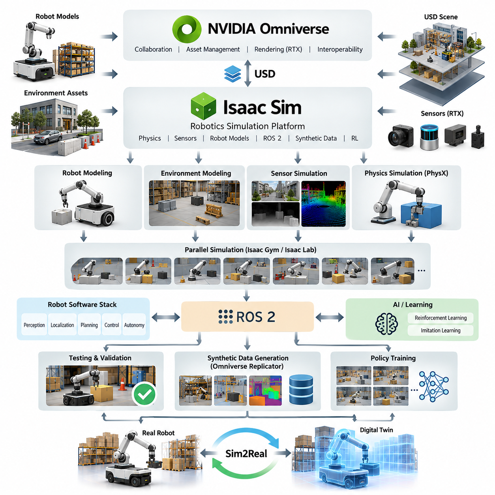
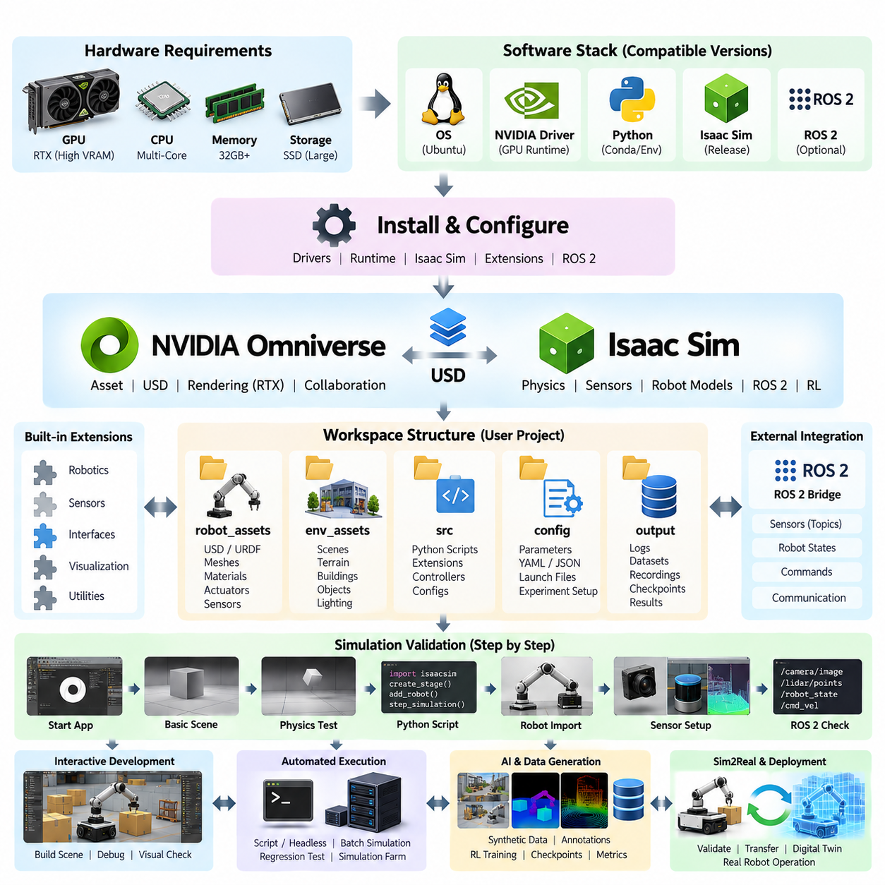
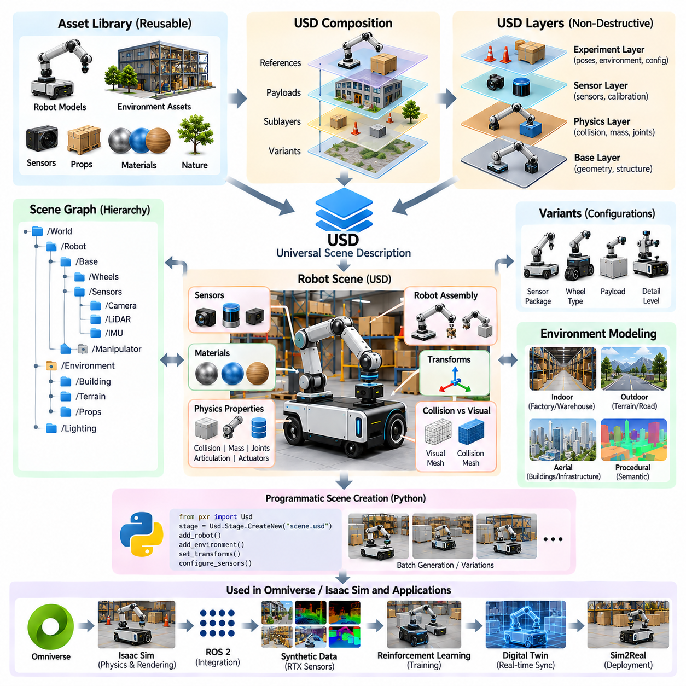
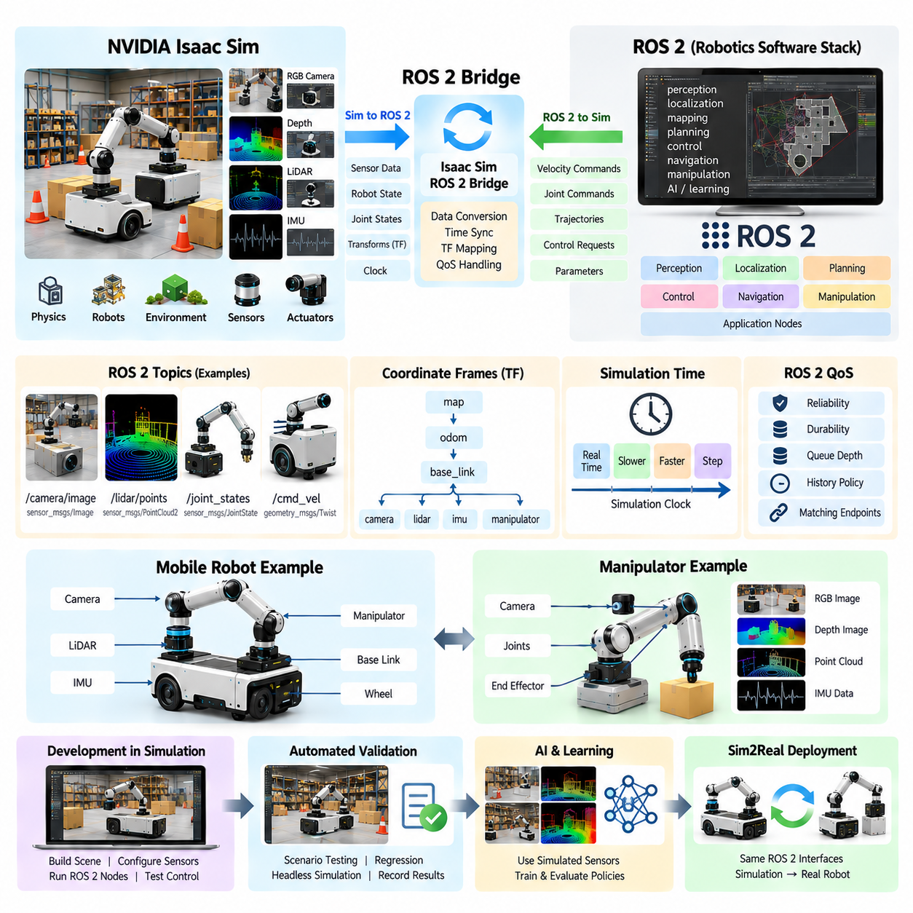
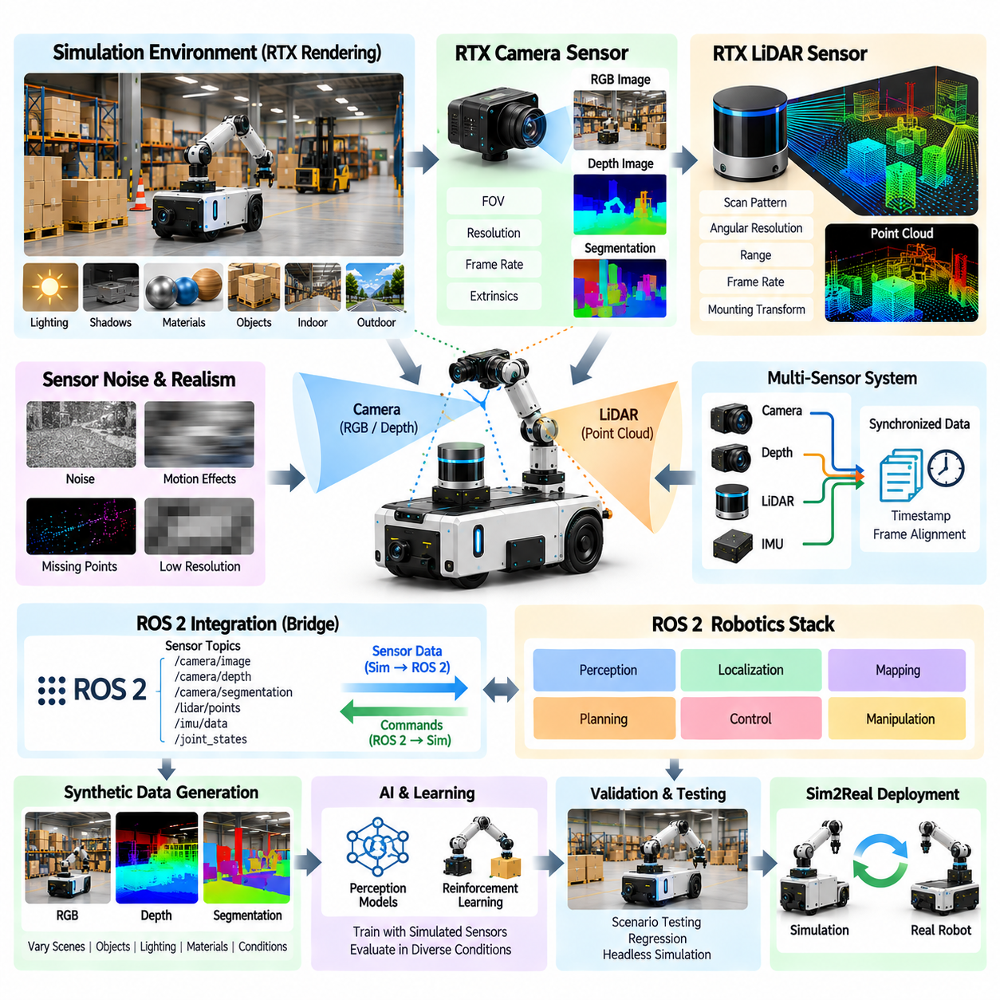
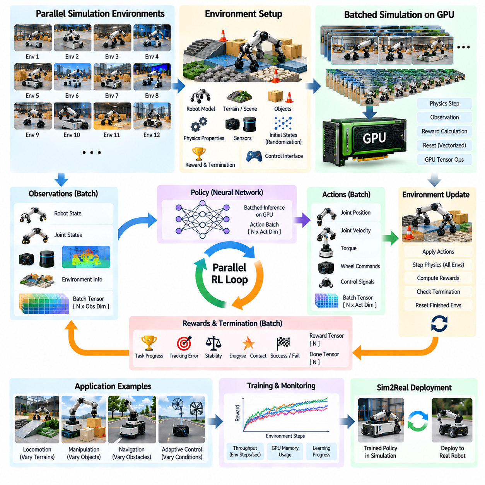
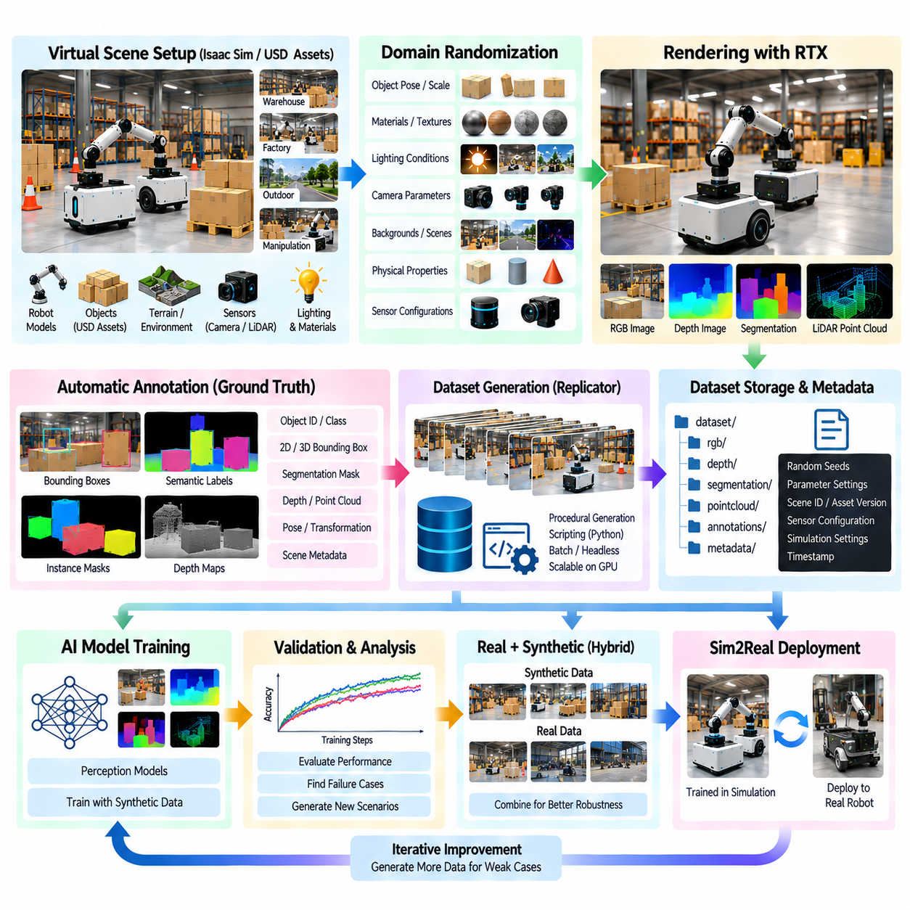
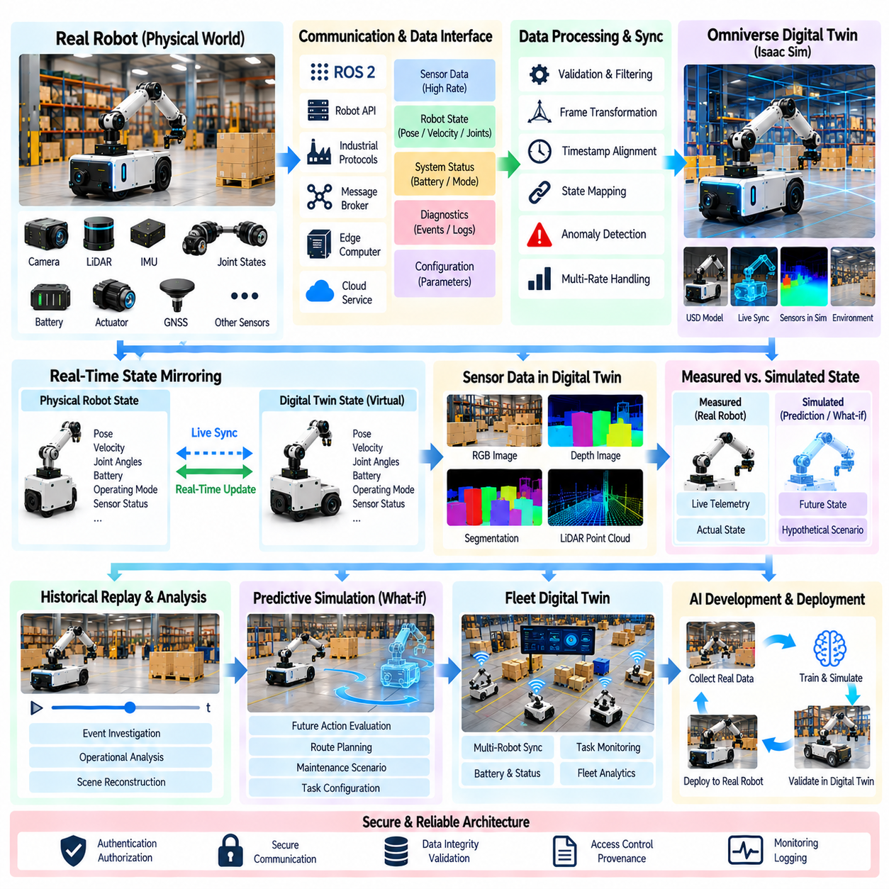
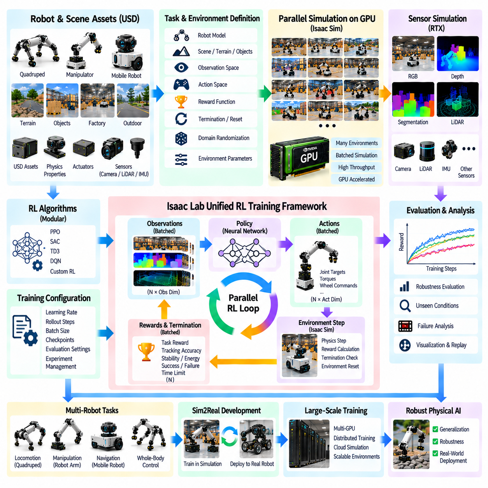
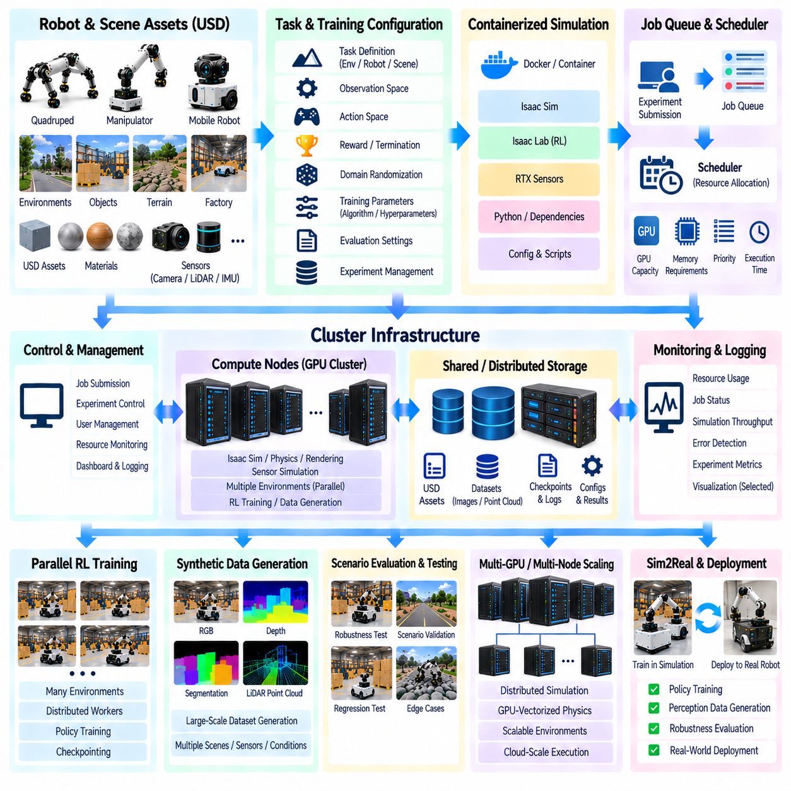

**Volume 11. Simulation and Digital Twin**

# Chapter 06. Isaac Sim and Omniverse

## 06.01. NVIDIA Omniverse and Isaac Sim Architecture Overview

{width="7.268055555555556in" height="7.268055555555556in"}

NVIDIA Omniverse and Isaac Sim form a simulation-oriented software ecosystem designed to connect physically based simulation, 3D scene representation, robotics development, synthetic data generation, and AI training within a common workflow. Omniverse provides the broader platform and collaboration foundation, while Isaac Sim provides robotics-focused simulation capabilities built around physics, sensors, robot models, and interaction with ROS 2. Together, they can support a development process that moves from virtual robot and environment modeling toward validation, synthetic data generation, reinforcement learning, and deployment on physical robots.

At the architectural level, the important concept is separation between the general 3D simulation ecosystem and robotics-specific functions. Omniverse provides the scene, asset, rendering, and interoperability foundation, while Isaac Sim adds robotics simulation capabilities such as articulated robot models, physics interaction, sensor simulation, and robotics interfaces. This separation allows the same virtual environment and assets to support different development activities rather than creating an isolated simulation for each individual algorithm or robot subsystem.

A central representation technology in this ecosystem is Universal Scene Description, or USD. USD provides a structured way to represent scenes, objects, relationships, transforms, materials, and other properties so that complex simulation environments can be assembled from reusable components. For robotics, this is particularly important because a scene may contain a robot, terrain, buildings, vehicles, people, lighting, sensors, and semantic information simultaneously. A consistent scene representation makes it easier to construct, modify, reuse, and manage increasingly complex simulation scenarios.

Isaac Sim extends this scene-based approach with robot-oriented simulation. A robot can be represented using its physical structure, joints, actuators, collision geometry, sensors, and associated properties, allowing software behavior to be evaluated against simulated physical interaction. The simulation therefore goes beyond visual rendering: robot motion, contact, collision, sensor observations, and environmental interaction can become inputs to the same software architecture that will eventually operate the physical system. This supports simulation-driven development across the robot lifecycle.

Physics simulation is another major architectural layer. The simulator must calculate how rigid bodies, joints, contacts, forces, and motion evolve over simulation time. The quality of this layer directly affects whether a virtual robot behaves sufficiently like its physical counterpart. Earlier simulation fundamentals therefore remain important when using Isaac Sim: time-step selection, numerical stability, rigid-body dynamics, contact modeling, and benchmarking all influence the usefulness of simulation results.

Sensor simulation connects the physical world model to perception and AI software. Cameras can generate image observations, while depth sensors, LiDAR, radar, IMU, GNSS, and other simulated devices can provide corresponding virtual measurements. The objective is not simply to create visually attractive scenes but to reproduce the characteristics that matter to algorithms, including measurement noise, environmental effects, sensor timing, and geometric relationships. Photorealistic rendering and RTX-based techniques become particularly valuable when visual perception models must be trained or evaluated under realistic conditions.

The connection between Isaac Sim and a robot software stack is especially important for Physical AI development. Through a ROS 2 integration layer, simulated sensors can publish observations and simulated actuators can receive commands using interfaces familiar to the physical robot. This enables perception, localization, planning, control, and higher-level autonomy software to be tested without requiring the complete physical system for every experiment. The same architectural interfaces can therefore help reduce the difference between simulation testing and hardware testing.

Isaac Sim also becomes useful when simulation is treated as a data-generation system rather than only a testing environment. NVIDIA Omniverse Replicator can be used to construct controlled variations of scenes, objects, lighting, camera configurations, and other parameters and generate synthetic datasets with corresponding annotations. This is particularly relevant for AI systems because collecting and labeling rare events in the physical world can be expensive or difficult. Synthetic data can supplement real-world datasets while maintaining explicit control over scenario diversity.

Reinforcement learning introduces another architectural dimension. Isaac Gym and the subsequent Isaac Lab framework provide approaches for running large numbers of simulated environments for policy learning. Instead of executing one expensive simulation repeatedly, many environments can be evaluated in parallel, allowing an agent to collect substantially more experience from different initial conditions and environmental configurations. This architecture is particularly useful for locomotion, manipulation, navigation, and other control problems in which learning requires repeated interaction with a simulated physical environment.

For a Physical AI development pipeline, the overall architecture can therefore be understood as a chain connecting models, environments, physics, sensors, robot software, AI, and physical validation. Robot and environment models establish the virtual world; the physics engine determines physical interaction; simulated sensors generate observations; ROS 2 or equivalent interfaces connect those observations to robotics software; AI models make decisions or learn policies; and simulation results can be compared with real-robot behavior. This creates a foundation for iterative simulation, testing, training, calibration, and eventual Sim2Real transfer.

The architecture also provides a foundation for digital twins, where the simulated representation is connected to information from a real robot rather than remaining a completely static virtual model. Real-world state, telemetry, sensor information, configuration, and operational data can be associated with a corresponding virtual representation. This makes it possible to use simulation not only before deployment but also during operation for visualization, analysis, predictive experiments, and what-if evaluation. The later digital-twin chapters build on this concept through synchronization, state mirroring, visualization, predictive simulation, and fleet-level aggregation.

The practical value of Omniverse and Isaac Sim is therefore not a single simulation feature but the integration of multiple development stages into a common ecosystem. Robot modeling, environment construction, physics simulation, sensor generation, ROS 2 integration, synthetic data generation, reinforcement learning, and digital-twin workflows can be treated as connected components of one development process. For an AMR, quadruped, humanoid, manipulator, or UAV program, this architecture provides a way to progressively increase simulation fidelity while keeping the same fundamental objective: reduce dependence on physical testing while increasing the amount and quality of evidence available before deployment.

## 06.02. Isaac Sim Installation and Workspace Setup [w/Code]

{width="7.268055555555556in" height="7.268055555555556in"}

Isaac Sim installation should be treated as the creation of a complete robotics simulation development environment rather than the installation of a single desktop application. The environment combines NVIDIA GPU acceleration, simulation runtime components, USD-based scene assets, physics and rendering services, Python APIs, robotics extensions, and external middleware such as ROS 2. A reliable setup therefore begins by considering the complete software and hardware stack that will execute simulation workloads.

The host workstation must first provide sufficient GPU, CPU, memory, and storage resources for the intended simulation scale. GPU capability is particularly important because Isaac Sim combines physics computation with RTX-based rendering and potentially multiple simulated sensors. Complex environments containing high-resolution cameras, LiDAR, articulated robots, and detailed assets can consume substantial GPU memory. Storage planning is also important because USD scenes, textures, robot models, synthetic datasets, checkpoints, and experiment outputs can rapidly expand a workspace.

The software environment should be prepared as a controlled dependency stack. The operating system, NVIDIA graphics driver, GPU runtime, Isaac Sim release, Python environment, and optional ROS 2 distribution must be mutually compatible. Installing components independently without considering version relationships can produce failures that appear unrelated to the original dependency. For this reason, installation should follow a reproducible configuration in which software versions and environment variables are documented rather than relying on an organically modified workstation.

Isaac Sim can be organized so that the simulator installation and the user\'s project workspace remain logically separate. The simulator contains runtime libraries, built-in extensions, rendering components, physics services, and standard assets, while the workspace contains project-specific robot models, environments, scripts, configuration files, experiments, and generated results. This separation reduces accidental modification of simulator files and makes projects easier to migrate between workstations, GPU servers, or future Isaac Sim releases.

A practical workspace can be structured around several persistent resource categories. Robot assets may contain USD, URDF, meshes, materials, actuator parameters, and sensor configurations. Environment assets can contain factories, warehouses, outdoor terrain, roads, obstacles, and lighting configurations. Source directories can contain Python simulation scripts and extensions, while configuration directories preserve experiment parameters. Separate output directories can store logs, datasets, recordings, checkpoints, and evaluation results without mixing generated artifacts with source assets.

USD becomes an important organizational mechanism inside this workspace because robot and environment scenes can be composed rather than repeatedly duplicated. A base robot asset can be referenced by multiple experiments, while sensors, payloads, materials, or environmental objects can be added through scene composition. This approach supports reusable simulation assets and allows a development team to maintain a controlled source representation while individual experiments create specialized scene configurations. The following section of the volume therefore treats USD as a dedicated foundation for robot scenes.

After installation, the first validation should confirm the simulator itself before introducing a complicated robot project. A minimal scene can verify application startup, GPU rendering, physics initialization, timeline execution, and basic object interaction. A simple rigid body falling under gravity or colliding with a ground plane provides a useful first physics test. This staged validation separates installation problems from errors caused later by imported meshes, robot descriptions, sensors, controllers, or middleware.

The Python execution environment should then be verified independently because automation is central to serious Isaac Sim workflows. A minimal script should be able to initialize a simulation, create or load a stage, insert objects, advance simulation steps, inspect state, and terminate correctly. Once this basic execution path works, larger experiments can be implemented as scripts rather than relying entirely on manual graphical operations. Script-based execution also improves reproducibility and becomes essential for batch simulation and large-scale experimentation.

Extensions form another important part of the workspace architecture. Isaac Sim functionality is assembled from modular services and extensions that provide capabilities such as robotics utilities, sensors, interfaces, visualization, and workflow-specific tools. Projects should enable only the components required for their intended workload and record important extension dependencies. Custom extensions can then isolate organization-specific functions from the simulator core, allowing reusable tools or robot-specific functionality to evolve without directly modifying the base installation.

ROS 2 integration should be configured only after the standalone simulator and Python environment operate correctly. The ROS 2 bridge connects simulated sensors, robot states, commands, and robotics software through ROS-compatible communication interfaces. Environment configuration, message definitions, domain settings, and topic conventions must remain consistent between the simulator and ROS 2 processes. Validating the bridge separately prevents communication errors from being confused with physics, rendering, or robot-model problems.

Robot import represents the next level of workspace validation. A URDF or other robot description should be imported and checked for link hierarchy, joint axes, limits, inertial properties, collision geometry, and actuator behavior before autonomous software is connected. Visual correctness alone is insufficient because an apparently correct robot may contain unrealistic mass distributions or collision models. Simulation quality depends strongly on the robot modeling principles established earlier in the volume, including inertia calculation, mesh optimization, actuator modeling, and mobile robot configuration.

Sensor setup should follow the same incremental approach. A camera can first confirm rendering and image acquisition before depth, LiDAR, IMU, radar, or other sensors are added. Coordinate frames, mounting transforms, update rates, timestamps, resolution, noise characteristics, and data interfaces should be checked individually. This process is important because sensor simulation is not merely a visualization feature; sensor outputs eventually become inputs to perception, localization, mapping, planning, and AI pipelines.

Workspace configuration should also distinguish interactive development from automated execution. During scene construction and debugging, graphical operation is useful for inspecting geometry, transforms, collisions, sensors, and robot behavior. Once an experiment becomes stable, script-driven or headless execution becomes more appropriate for regression testing, dataset generation, reinforcement learning, and simulation farms. Maintaining both modes allows developers to move naturally from visual debugging toward scalable automation without rebuilding the experiment architecture.

For AI-oriented projects, generated data should be treated as a managed output rather than stored arbitrarily inside the simulator directory. Synthetic RGB images, depth maps, segmentation labels, point clouds, trajectories, demonstrations, reinforcement-learning checkpoints, and evaluation metrics may become substantially larger than the simulation source itself. Dataset locations, experiment identifiers, random seeds, configuration snapshots, and model versions should therefore be recorded so that results can be traced back to the exact simulation conditions that generated them.

A mature workspace should finally support reproducibility across local workstations, on-premise GPU servers, and larger simulation infrastructure. Source code, configuration files, lightweight scene definitions, and metadata can be version controlled, while large assets and datasets are managed separately. Installation verification scripts and standardized project layouts reduce machine-specific assumptions. This becomes increasingly important as Isaac Sim expands from individual development toward Isaac Lab training, synthetic data pipelines, digital twins, and massively parallel simulation.

The completed installation should therefore be viewed as a validated simulation platform rather than merely a successfully launched application. GPU rendering, physics, Python execution, USD assets, robot models, sensors, extensions, ROS 2 interfaces, and output management should each be verified incrementally. Once these foundations are stable, the same workspace can evolve from simple robot experiments into synthetic data generation, reinforcement learning, Sim2Real validation, digital-twin operation, and large-scale parallel simulation without repeatedly rebuilding the development environment.

## 06.03. USD Universal Scene Description for Robot Scenes [w/Code]

{width="7.268055555555556in" height="7.268055555555556in"}

Universal Scene Description, commonly abbreviated as USD, provides the scene representation foundation used by NVIDIA Omniverse and Isaac Sim to construct, organize, exchange, and modify complex virtual environments. Rather than treating a robot simulation as one monolithic model file, USD represents a scene as a hierarchy of interconnected elements. Robots, sensors, buildings, terrain, materials, lighting, and dynamic objects can therefore remain separate assets while participating in a unified simulation scene.

The fundamental unit of a USD scene is the prim, or primitive. A prim represents an identifiable object or organizational element within the scene hierarchy and may describe geometry, a transform, a camera, a light, a material, or another structured entity. Prims are organized through paths that form a scene graph. For robot simulation, this hierarchy provides a natural mechanism for representing assemblies such as a mobile base containing wheels, sensors, payload modules, and manipulators.

USD separates scene organization from the raw geometry used to visualize objects. A robot link may reference a mesh while maintaining its own transform, physical properties, material assignments, and relationships to other scene elements. This separation is useful because the same geometric asset can be reused in multiple robots or environments without copying its complete data. Large simulation projects can consequently maintain libraries of reusable components while keeping individual scene descriptions relatively compact.

One of the most important USD concepts is composition. A scene can be assembled from multiple layers and assets rather than permanently merging every component into a single file. References allow an existing asset to appear inside another scene, while payloads can support selective loading of complex content. Sublayers can combine independently authored scene information, and variants can represent alternative configurations. Together, these mechanisms enable a simulation scene to evolve without destroying the original source assets.

Layering is particularly valuable for robotics development because different engineering concerns can be maintained independently. A base layer may describe the robot geometry, another may introduce physical properties, another may configure sensors, and an experiment-specific layer may change initial poses or environmental conditions. Engineers can therefore modify the information relevant to an experiment while preserving upstream assets. This non-destructive workflow is well suited to repeated simulation, calibration, and validation.

Variants provide another powerful mechanism for managing robot configurations. A single robot asset may require different sensor packages, wheel configurations, payloads, materials, or levels of geometric detail. Instead of maintaining a separate complete model for every combination, variant sets can represent selectable alternatives within the same asset structure. This reduces duplicated data and helps ensure that related robot configurations continue to share a controlled common foundation.

Transforms define how objects are positioned and oriented relative to their parents in the scene hierarchy. For robotics, transform consistency is critical because sensor measurements, collision geometry, joint structures, and control interfaces depend on correct spatial relationships. A camera attached to a mobile robot, for example, must preserve the intended translation and rotation relative to the robot body. Errors in transform hierarchy can propagate into perception, localization, mapping, and sensor-fusion results.

Robot scenes also require physical semantics beyond visual geometry. Collision shapes, rigid-body properties, masses, inertia, joints, articulation structures, and actuator-related information determine how the simulated robot interacts with the environment. USD-based scenes used by Isaac Sim can associate such simulation properties with scene objects while retaining the broader scene hierarchy. This connects the modeling concepts introduced earlier for URDF, MJCF, inertia, meshes, actuators, and mobile robot structures with the Isaac Sim environment.

Visual geometry and collision geometry should not necessarily be identical. Detailed meshes may be appropriate for rendering but unnecessarily expensive or unstable for repeated collision calculations. A robot asset can therefore preserve detailed visual representations while using simplified collision approximations. This separation becomes increasingly important when scenes contain many robots, articulated mechanisms, or environmental objects because physics performance depends strongly on the complexity of collision representations.

Materials and appearance information form another layer of the scene representation. Surface appearance can include properties required for realistic rendering, while simulation applications may associate objects with additional semantic or physical information. For synthetic data generation, the visual characteristics of surfaces become particularly important because textures, reflectance, lighting, and object appearance influence camera observations. USD enables these properties to remain associated with reusable scene assets rather than being recreated for every experiment.

Sensors can also be organized as components of the robot scene hierarchy. Cameras, LiDAR, radar, IMU, and other simulated sensors require mounting transforms and configuration parameters that relate them to the robot body. Their placement within a structured scene representation makes sensor configurations easier to inspect, reuse, and modify. This becomes the basis for later Isaac Sim workflows involving ROS 2 integration and RTX sensor simulation, both of which are treated as subsequent topics in the chapter.

USD is equally important for environment modeling. A warehouse scene can reference shelves, pallets, doors, machines, lighting systems, and navigation obstacles as independent assets, while an outdoor environment may combine terrain, roads, vegetation, buildings, vehicles, and infrastructure. Reusable asset composition allows environments to be assembled systematically rather than modeled as isolated monolithic worlds. This supports the indoor, outdoor, aerial, procedural, and semantic environment workflows defined earlier in the volume.

Scene instancing becomes important when the same object occurs many times. Warehouses may contain hundreds of similar pallets or storage racks, while outdoor scenes may repeat barriers, vegetation, signs, or infrastructure elements. Representing repeated objects through shared assets can reduce unnecessary duplication and improve scene management. Similar principles apply to multi-robot simulation, where multiple instances of a common robot platform may operate within one environment while maintaining independent poses and states.

A well-designed USD hierarchy should therefore reflect meaningful asset boundaries rather than merely reproduce the organization of an imported CAD model. Robot body assemblies, sensors, manipulators, payloads, environment modules, and reusable infrastructure should have clear ownership and naming conventions. Stable paths and predictable hierarchy become especially valuable when Python scripts, extensions, synthetic-data tools, or ROS interfaces need to locate and manipulate particular objects automatically.

USD also supports the transition from manually assembled scenes toward programmable simulation. Python-based workflows can create prims, load assets, modify transforms, select variants, configure scene properties, and generate experiment-specific environments. This makes the scene description part of an automated simulation pipeline rather than a static visualization artifact. Large experiment sets can consequently share common source assets while scripts generate controlled variations for testing, reinforcement learning, and synthetic data generation.

For Physical AI development, the broader significance of USD is that it provides a common scene representation connecting many stages of the simulation lifecycle. Robot models, environments, physics properties, sensors, rendering information, semantic metadata, and experiment configurations can coexist within a composable scene structure. The resulting scene can then support Isaac Sim physics, ROS 2 interfaces, RTX sensors, synthetic data generation, reinforcement learning, digital twins, and eventually Sim2Real validation without requiring an entirely separate representation for every workflow.

## 06.04. Isaac Sim ROS2 Bridge Integration [w/Code]

{width="7.268055555555556in" height="7.268055555555556in"}

ROS 2 Bridge integration allows NVIDIA Isaac Sim to communicate with a robotics software stack through the same message-oriented interfaces commonly used by physical robots. Instead of developing separate perception, navigation, planning, and control software exclusively for simulation, developers can connect ROS 2 nodes to simulated robots and sensors. Isaac Sim then acts as the virtual physical system, while ROS 2 provides the distributed software communication layer surrounding it.

The architectural boundary between Isaac Sim and ROS 2 is important. Isaac Sim is responsible for the simulated world, including robot dynamics, collisions, joints, actuators, cameras, LiDAR, IMU, and other virtual devices. ROS 2 nodes operate outside or alongside that simulation and consume observations, estimate state, generate plans, or produce commands. The bridge converts information between these domains so that simulation data can participate in a conventional ROS 2 computation graph.

Communication is fundamentally bidirectional. In the simulation-to-ROS direction, Isaac Sim can provide sensor observations, robot state, joint information, transforms, clock information, and other simulated measurements. In the ROS-to-simulation direction, ROS 2 software can provide velocity commands, joint commands, trajectories, or higher-level control requests. This closed communication loop allows the simulated robot to respond to essentially the same software logic that will later interact with physical hardware.

Topics provide the most familiar ROS 2 communication mechanism for this integration. Simulated cameras may publish image data, LiDAR systems can provide point-cloud or scan information, and robot components can expose joint or odometry states. Control nodes can publish command messages in the opposite direction. Maintaining stable topic names and message types is important because it allows application software to switch between simulated and physical data sources with minimal architectural changes.

Coordinate frames are equally important because robot software interprets nearly every measurement spatially. ROS 2 commonly organizes these relationships through a transform tree connecting frames such as the world, map, odometry, robot base, sensors, and articulated links. Isaac Sim contains its own scene hierarchy and transforms through USD. Integration therefore requires a consistent mapping between the simulated scene hierarchy and the coordinate-frame conventions expected by ROS 2 software.

A mobile robot illustrates this requirement clearly. Its simulation may contain a world frame, chassis, wheels, camera, LiDAR, IMU, and manipulator as related USD objects. The ROS 2 stack may simultaneously expect map, odom, base_link, camera, lidar, and other frames. These relationships must describe the same physical arrangement. Incorrect frame orientation or sensor mounting offsets can produce errors that appear to originate in localization, mapping, perception, or sensor fusion even when the underlying algorithm is correct.

Simulation time also requires explicit treatment. Isaac Sim advances according to a simulation timeline that may operate in real time, slower than real time, faster than real time, or under controlled stepping. ROS 2 algorithms that use timestamps, timers, transforms, synchronization, or timeout logic must therefore operate with an appropriate simulation clock. Consistent time semantics prevent simulated sensor messages from being interpreted according to an unrelated host-system clock.

Sensor synchronization becomes particularly important when multiple simulated devices participate in the same perception pipeline. Camera images, LiDAR scans, IMU measurements, depth information, and robot state may operate at different update rates. The bridge must preserve meaningful timestamps so that ROS 2 nodes can associate measurements correctly. This extends the broader simulation requirement for sensor synchronization and timestamp management introduced in the sensor simulation portion of the volume.

ROS 2 Quality of Service, or QoS, adds another integration consideration. High-rate sensor streams and low-rate configuration or state messages do not necessarily require identical delivery behavior. Reliability, durability, queue depth, and history policies influence how publishers and subscribers exchange data. A mismatch between endpoints can make a valid simulated sensor appear unavailable. Bridge validation should therefore examine both message definitions and communication policies rather than checking topic names alone.

The control path should be validated independently from the perception path. For a mobile robot, a simple velocity command can first confirm that ROS 2 messages reach the simulated controller and produce expected wheel or steering behavior. For a manipulator, joint position, velocity, effort, or trajectory commands can verify actuator interfaces. Only after basic command execution works reliably should navigation, manipulation planning, behavior trees, or autonomous mission logic be introduced.

The sensor path can similarly be introduced incrementally. A camera stream may first verify image transport before LiDAR, depth, IMU, or other sensors are connected. Each stream should be checked for frame identity, timestamp, update rate, resolution, data format, and physical mounting configuration. This incremental approach separates bridge configuration errors from problems in the simulated sensor model itself, whose fidelity and noise characteristics are separate concerns.

Once basic communication is established, the ROS 2 stack can treat Isaac Sim as a virtual robot platform. Localization algorithms can consume simulated odometry, IMU, GNSS, or LiDAR observations; perception nodes can process rendered camera or point-cloud data; planners can generate paths through simulated environments; and controllers can return motion commands. The result is a software-in-the-loop environment in which significant portions of the autonomous stack can execute before physical hardware is available.

This approach is particularly valuable when the same robot software must operate across simulation and hardware. Hardware abstraction and stable interfaces reduce the number of simulation-specific assumptions embedded in application logic. A navigation or perception component should ideally depend on defined ROS 2 interfaces rather than on whether its input originated from Isaac Sim or a physical sensor. This principle aligns with broader robotics software architecture requirements for componentization, hardware abstraction, and mixed system integration.

Bridge integration also enables repeatable automated validation. A scripted Isaac Sim scenario can initialize a robot at a defined pose, start ROS 2 nodes, generate sensor observations, execute commands, and record outputs. The same scenario can then be repeated after software modifications to detect behavioral regressions. When combined with headless simulation and controlled scene generation, ROS 2 integration becomes part of a continuous testing infrastructure rather than merely an interactive demonstration tool.

For Physical AI, the bridge provides a path for connecting learned models to realistic virtual interaction. AI perception models can consume simulated sensor streams, while learned policies or higher-level decision systems can generate actions through ROS 2 interfaces. Synthetic environments can expose these models to different objects, lighting conditions, terrain, obstacles, and operating scenarios before hardware deployment. The simulation therefore becomes an executable environment surrounding the AI rather than only a source of offline training data.

The broader objective is to maintain an interface boundary that survives the transition from simulation to reality. Isaac Sim supplies the virtual physics, sensors, and robot state during development, while the physical robot later supplies corresponding real-world signals. ROS 2 remains the communication framework connecting perception, localization, planning, control, and autonomy. With consistent topics, frames, timestamps, message definitions, and command interfaces, the bridge becomes a practical foundation for software-in-the-loop testing, Sim2Real validation, and progressively more complete robot-system integration.

## 06.05. RTX Sensor Rendering LiDAR Camera in Isaac [w/Code]

{width="7.268055555555556in" height="7.268055555555556in"}

RTX-based sensor rendering in Isaac Sim provides a physically oriented approach for generating camera and LiDAR observations from a simulated environment. Instead of treating sensors as simple visual effects, the simulator models how virtual sensing devices observe geometry, materials, lighting, and spatial relationships. This makes sensor rendering an important connection between the simulated physical world and the perception systems that will later operate on a real robot.

Camera simulation can generate RGB observations that resemble the inputs of a physical vision system. The virtual camera has a defined position, orientation, field of view, resolution, and update frequency within the robot scene. Because the camera is attached to the simulated robot through the scene hierarchy, its viewpoint changes naturally as the robot moves. This allows perception algorithms to process image sequences generated from realistic robot motion rather than isolated static images.

RTX rendering becomes particularly valuable when the visual appearance of the environment affects perception performance. Lighting, shadows, reflections, surface materials, object geometry, and environmental conditions can influence the resulting camera image. A warehouse, road, factory, or outdoor terrain can therefore be rendered with different visual conditions while keeping the underlying physical scene consistent. Such variation provides a foundation for evaluating perception robustness across controlled simulation scenarios.

Depth sensing extends camera simulation from appearance into geometric perception. A simulated depth camera can provide distance information associated with image pixels, allowing algorithms to estimate object surfaces and spatial structure. RGB and depth observations can be generated from the same virtual camera configuration, maintaining consistent spatial relationships. This is useful for applications such as obstacle detection, 3D reconstruction, manipulation, navigation, and sensor fusion.

LiDAR simulation follows a different sensing principle from camera rendering. Instead of producing an image based on projected light, a simulated LiDAR generates range measurements according to rays or beams interacting with objects in the environment. The resulting point cloud represents the spatial structure observed from the sensor position. Parameters such as scanning pattern, angular resolution, range, update rate, and mounting transform determine the characteristics of the generated measurements.

For a mobile robot, LiDAR placement must be represented accurately because the sensor output depends directly on its relationship to the robot body. A LiDAR mounted above the chassis, for example, observes a different region from one mounted near the ground. The simulation must therefore preserve the sensor transform while the robot moves, rotates, climbs terrain, or interacts with obstacles. Incorrect mounting parameters can produce perception behavior that differs substantially from the intended physical configuration.

Sensor noise and imperfections should also be considered when RTX-generated observations are used for AI or perception development. A perfectly clean simulated image or point cloud may not represent the characteristics of a physical sensor. Noise, missing measurements, limited resolution, motion effects, timing differences, and environmental influences can contribute to the simulation-to-reality gap. The broader sensor simulation architecture therefore treats fidelity and noise modeling as important elements rather than assuming that visual realism alone guarantees physical realism.

Multiple sensors can be combined to construct a richer virtual perception system. RGB cameras can provide appearance information, depth sensors can provide geometric information, and LiDAR can provide relatively direct range measurements. IMU or other simulated measurements can additionally provide motion-related information. When these sensors share a common robot coordinate structure and meaningful timestamps, their outputs can be combined by perception and localization software in ways that resemble a real multi-sensor robot.

Timestamp management is especially important when simulated sensor streams are used together. Cameras, LiDAR, and other sensors may operate at different frequencies and may not produce observations at exactly the same simulation step. Each measurement should therefore retain meaningful temporal information so that downstream software can determine which observations belong together. This becomes essential for motion estimation, sensor fusion, tracking, mapping, and other algorithms that depend on temporal consistency.

RTX sensor rendering also supports synthetic data generation because the simulator can repeatedly render controlled variations of the same virtual scene. Camera images, depth information, segmentation information, and other sensor outputs can be generated while changing object locations, lighting, materials, environmental conditions, or robot poses. The resulting datasets can provide both observations and simulation-derived information that would otherwise require expensive manual annotation in the physical world.

The connection to ROS 2 allows simulated sensor outputs to become inputs to the same robotics software architecture used elsewhere in the development process. Camera images, LiDAR point clouds, depth data, and related sensor information can be transferred through ROS 2 interfaces to perception, localization, mapping, planning, or AI nodes. This makes the sensor renderer part of an executable robotics pipeline rather than an isolated visualization system.

For Physical AI, the major value of RTX sensor rendering is that it connects visual and geometric simulation with learning and decision-making. A perception model can receive camera or LiDAR observations, estimate the surrounding environment, and provide information to downstream planning or control components. Reinforcement-learning and synthetic-data workflows can then expose the model or policy to many variations of sensing conditions. This creates a scalable environment in which perception behavior can be evaluated before transferring the resulting system to physical hardware.

The final objective is not simply to create visually convincing sensor images but to establish a controllable and repeatable virtual sensing system. Robot pose, sensor configuration, environment geometry, materials, lighting, timing, noise, and simulation conditions should be treated as parameters that can be recorded and reproduced. With this approach, RTX camera and LiDAR rendering becomes a core component of Isaac Sim-based development, supporting perception validation, synthetic data generation, AI training, ROS 2 integration, and ultimately Sim2Real evaluation.

## 06.06. Isaac Gym Parallel RL Environment Setup [w/Code]

{width="7.268055555555556in" height="7.268055555555556in"}

Isaac Gym provides a GPU-oriented approach to reinforcement learning in which many simulation environments can be executed concurrently rather than running one environment at a time. The central idea is to expose a large collection of virtual robots to different states, actions, and environmental conditions so that a learning algorithm can collect experience at high throughput. In the broader Isaac ecosystem, this approach connects physics simulation, GPU computation, batched environments, policy learning, and later Sim2Real transfer.

A parallel reinforcement-learning environment begins with a common robot and task definition that can be instantiated many times. Each environment maintains its own robot state, object states, observations, actions, rewards, and episode status, while the underlying computational structure is shared. This makes it possible to train a single policy against many simultaneous experiences. For example, a locomotion task can create numerous copies of the same robot, each beginning with different poses, velocities, terrain conditions, or task parameters.

The main architectural advantage comes from executing simulation and learning operations in batches. Instead of transferring every environment state independently between CPU and GPU memory, large collections of states can be represented as tensors and processed together. Physics updates, observation construction, reward calculation, reset operations, and policy inference can therefore be organized around vectorized computation. The efficiency of this approach depends on keeping the simulation pipeline highly parallel and minimizing unnecessary synchronization or data movement.

Environment initialization should establish all parameters required for repeatable training. Robot models, terrain, objects, physical properties, sensors, control interfaces, episode limits, reward definitions, and initial-state distributions should be configured before the learning loop begins. When thousands of environments are created, manual configuration becomes impractical. A programmatic environment definition therefore becomes essential for maintaining consistent structure while allowing controlled differences between individual instances.

Randomization is particularly important because identical environments provide limited training diversity. Initial robot poses, velocities, object positions, terrain characteristics, friction parameters, masses, actuator properties, sensor conditions, and other task variables can be varied across environments. These variations allow a policy to experience a broader distribution of conditions during training. Such diversity is also important for reducing overfitting to a single simulated configuration and preparing policies for the variability encountered during physical deployment.

The observation pipeline converts simulation state into information available to the policy. Depending on the task, observations may include robot position, orientation, linear and angular velocity, joint positions, joint velocities, contact information, sensor measurements, target information, or historical state. The observation representation should remain consistent across parallel environments so that the policy receives a batch of observations with the same semantic structure. Normalization and scaling may also be applied to improve numerical behavior during learning.

Actions are similarly represented as batches. A policy receives observations from many environments and produces an action vector for each corresponding environment. These actions may represent target joint positions, velocities, torques, wheel commands, or other control quantities depending on the robot and task. The simulation then applies the actions, advances the physical state, generates new observations, and calculates rewards. This repeated interaction forms the basic reinforcement-learning loop across all active environments simultaneously.

Reward computation must also be vectorized when large numbers of environments are used. Each environment calculates a reward based on task progress, stability, energy use, tracking error, contact behavior, or other objectives. Termination conditions determine whether an episode has succeeded, failed, or reached its time limit. Environments that terminate can be reset while other environments continue operating, allowing the overall training process to maintain a high level of utilization instead of waiting for every environment to finish at the same time.

Reset logic is therefore a critical part of a parallel environment. A reset may restore the robot to an initial state, regenerate task objects, select new terrain parameters, and clear episode-specific variables. Efficient reset operations should avoid reconstructing the entire simulation unnecessarily. Instead, only the state associated with the terminated environment should be restored or modified. This enables continuous collection of experience even when different environments complete their episodes at different times.

For locomotion, parallel environments can represent different terrain profiles, slopes, surface properties, disturbances, or command velocities. A quadruped policy can consequently experience many combinations of conditions during a single training iteration. For manipulation, environments can vary object locations, orientations, grasp configurations, and physical properties. For mobile robots, parallel instances can represent different obstacle layouts, target locations, navigation conditions, or sensor configurations. The same architectural principle applies even though the observations, actions, and rewards differ between tasks.

Policy inference should remain closely integrated with the batched simulation loop. After the simulator produces observations, the policy processes the entire observation batch and returns corresponding actions. The simulator advances all environments, after which new observations and rewards are generated. Keeping these operations on the GPU when practical can significantly reduce communication overhead and increase training throughput. The resulting architecture treats simulation and learning as a unified computational pipeline rather than two completely independent programs.

Large-scale parallel training also requires careful monitoring of computational resources. Increasing the number of environments does not automatically improve performance because GPU memory, physics computation, rendering, sensor processing, and policy inference all compete for resources. The appropriate environment count therefore depends on the robot model, physics complexity, observation size, sensor configuration, and available GPU capacity. Performance should be measured using meaningful throughput indicators such as environment steps per second, policy inference time, memory utilization, and learning progress.

Rendering can be separated from the core reinforcement-learning loop when visual output is not required for every simulation step. A learning experiment may operate primarily on physical states and compact observations while rendering is enabled only for debugging, evaluation, recording, or selected environments. This distinction is important because photorealistic rendering and high-resolution sensor simulation can consume substantial computational resources. The sensor simulation architecture described elsewhere in the volume provides the foundation for cases where visual observations are actually part of the learning problem.

The resulting parallel environment becomes a foundation for large-scale policy learning. Thousands of simulated episodes can be collected while a policy is continuously updated from accumulated experience. This is especially useful for problems in which successful behavior emerges only after extensive interaction, such as locomotion, manipulation, navigation, and adaptive control. The later Isaac Lab and massive parallel simulation topics extend this concept toward more unified reinforcement-learning frameworks and distributed GPU execution.

For Physical AI development, the important outcome is not simply faster training but a scalable experimental architecture. A single task definition can generate many controlled experiences, evaluate policy behavior under diverse conditions, and provide checkpoints and metrics for systematic comparison. The trained policy can then be evaluated in new simulation conditions before being transferred toward physical hardware. Consequently, Isaac Gym-style parallel reinforcement learning forms an important bridge between GPU-accelerated physics simulation, AI policy learning, robustness evaluation, and the broader Sim2Real development process.

## 06.07. Replicator Synthetic Data Generation Pipeline [w/Code]

{width="7.268055555555556in" height="7.268055555555556in"}

NVIDIA Omniverse Replicator provides a programmable framework for generating synthetic data from controlled virtual scenes. Within the Isaac Sim ecosystem, it can connect scene assets, robot models, cameras, lighting, materials, object placement, semantic information, and randomized parameters into an automated data-generation process. The central purpose is to produce large and diverse datasets with known ground truth while avoiding the cost and time associated with collecting and manually labeling every example in the physical world. The chapter structure places Replicator after RTX sensor rendering and parallel reinforcement-learning environments, making it a practical bridge between simulation and AI dataset construction.

A Replicator pipeline begins with a virtual scene that contains the objects and environmental elements relevant to the target AI problem. The scene may represent a warehouse, factory, road, outdoor environment, manipulation workspace, or another operational domain. Robot models and sensor configurations can be incorporated when the objective is to generate observations from a robot-mounted sensor rather than from a fixed virtual camera. Because the scene is represented through reusable assets and USD composition, the same underlying environment can support many generated variations without creating a completely separate scene for every dataset sample.

Randomization is a central mechanism for increasing dataset diversity. Object positions, orientations, scales, textures, materials, lighting conditions, camera parameters, backgrounds, and environmental configurations can be varied according to defined distributions. Physical parameters can also be varied when the generated data depends on simulated interaction. The purpose is not uncontrolled randomness but structured variation that covers the range of conditions an AI system may encounter. This principle is consistent with the broader synthetic-data and domain-randomization strategy defined in the volume.

A useful pipeline separates scene configuration, randomization, rendering, annotation, and data storage. Scene configuration establishes the objects and sensor setup, randomization produces a particular scenario instance, rendering generates the sensor observation, and annotation provides ground-truth information associated with that observation. The resulting sample should retain enough metadata to identify the scene configuration and randomization state that produced it. This separation makes the pipeline easier to debug and allows individual stages to be changed without redesigning the entire dataset-generation system.

Camera-based synthetic data can include RGB images, depth information, and segmentation-related outputs. An image may be accompanied by object identities, class labels, bounding information, masks, depth values, or other ground-truth representations depending on the target perception task. Because the simulator knows the underlying scene state, these annotations can be generated automatically rather than manually labeled frame by frame. This is one of the fundamental advantages of simulation-based dataset generation for supervised perception development.

Semantic information connects rendered pixels to the logical identity of simulated objects. A warehouse pallet, vehicle, robot, obstacle, or component can be associated with a class or semantic identifier that remains available during data generation. Instance-level information can further distinguish multiple objects belonging to the same class. Such information is useful for object detection, semantic segmentation, instance segmentation, pose estimation, and other computer-vision tasks. The quality of the resulting dataset depends on whether the semantic structure correctly represents the intended learning problem.

Lighting randomization is particularly important for visual AI. The same object can appear substantially different under changes in illumination direction, intensity, color temperature, shadow conditions, and surrounding reflections. A Replicator workflow can generate controlled variations rather than relying on one fixed lighting configuration. This can expose perception models to a broader visual distribution and help evaluate whether their behavior depends excessively on a particular illumination condition.

Material and texture variation provides another source of visual diversity. Surface color, roughness, reflectance, texture patterns, and material assignments can be modified while preserving the underlying object geometry. This is useful when an AI model must recognize objects across different manufacturing surfaces, environments, wear conditions, or appearance domains. The objective is to vary visual properties systematically while maintaining semantic consistency so that the generated labels remain correct.

Camera configuration can also participate in randomization. Position, orientation, field of view, focal properties, resolution, and other sensor parameters can be varied within realistic boundaries. For a robot-mounted camera, these variations may represent manufacturing tolerances, mounting differences, or changes in sensor configuration. Care must be taken not to generate physically impossible configurations, because unrealistic samples can shift the training distribution away from the operational domain rather than improving robustness.

The same concept can be extended to LiDAR and other simulated sensors. LiDAR observations can be generated from different viewpoints, scanning configurations, environmental structures, and object arrangements. Point-cloud outputs can then be associated with known scene geometry and semantic information. When combined with camera, depth, IMU, or other measurements, the resulting synthetic dataset can support multi-modal perception and sensor-fusion research. The RTX sensor-rendering architecture described previously provides the sensing foundation for these workflows.

A major strength of Replicator is procedural generation. Instead of manually constructing thousands of scenes, a script can define rules describing where objects may appear, how many instances should be created, which materials may be assigned, and how lighting or sensor parameters should change. The generator can then repeatedly create new scene states and render observations. This transforms synthetic-data generation from a manual content-production task into a programmable data pipeline that can be executed repeatedly and scaled according to dataset requirements.

The generated dataset should be organized together with metadata and reproducibility information. Random seeds, parameter distributions, scene identifiers, asset versions, sensor configurations, simulation settings, and generation timestamps can be retained alongside the generated samples. This allows a problematic sample to be traced back to the conditions that produced it. It also makes it possible to reproduce a particular scenario when debugging a perception model or investigating an unexpected training result.

Synthetic data generation should not be evaluated only by dataset size. A very large dataset generated from a narrow or unrealistic distribution may provide less useful information than a smaller dataset that represents the operational domain carefully. Coverage of object variation, environmental conditions, sensor viewpoints, lighting, geometry, and task-specific edge cases should therefore be considered when designing the generation strategy. The goal is to construct a useful training distribution rather than simply maximize the number of generated images or point clouds.

Real data can also be combined with synthetic data rather than treated as an alternative to it. Physical datasets provide evidence of real sensor characteristics, environmental appearance, and operational variability, while synthetic data can efficiently expand coverage and provide automatically generated ground truth. A hybrid strategy can therefore use real samples to anchor the data distribution and synthetic samples to fill gaps that are expensive or difficult to collect physically. The later synthetic-data chapter addresses this broader real-and-synthetic dataset mixing strategy explicitly.

The pipeline can be integrated with AI training and evaluation so that generated data becomes part of an iterative development loop. A dataset can be generated, a perception model can be trained, validation results can identify weaknesses, and new synthetic scenarios can then be generated to target those weaknesses. This creates a closed improvement cycle in which simulation is used not only to produce initial training data but also to systematically explore difficult conditions. Such an approach is particularly relevant to Physical AI systems that must operate across diverse environments and sensor conditions.

Automation becomes increasingly important as dataset scale increases. Generation jobs can be executed in batch or headless mode, distributed across available GPU resources, and organized by experiment configuration. Failed jobs, incomplete outputs, and generation statistics should be tracked so that large datasets remain manageable. The same infrastructure can later connect to continuous integration, dataset validation, model training, and regression testing, creating a more complete simulation-to-AI development pipeline.

For robotics, the final objective is to ensure that synthetic observations remain connected to meaningful physical and operational conditions. A generated image or point cloud should correspond to a valid robot pose, sensor configuration, environment state, and simulation condition. When interaction is involved, the scene should also represent physically plausible object and robot relationships. This requirement distinguishes a useful robotics dataset from a collection of visually diverse images that lack a meaningful connection to the robot\'s actual operating problem.

In the broader Physical AI workflow, Replicator therefore acts as a programmable bridge between simulation and machine learning. USD-based scenes provide reusable assets, Isaac Sim provides physics and sensor simulation, RTX rendering produces realistic observations, Replicator introduces controlled variation and automatic annotation, and the resulting datasets support perception and AI training. The generated models can then be evaluated under new simulated conditions before progressing toward real-world testing and Sim2Real transfer. This makes synthetic data generation an integrated part of the simulation lifecycle rather than an isolated preprocessing step.

## 06.08. Omniverse Digital Twin Live Sync with Real Robot [w/Code]

{width="7.268055555555556in" height="7.268055555555556in"}

An Omniverse digital twin can connect a virtual robot representation with the state of a real robot so that the simulated world continuously reflects physical operation. Instead of treating the digital twin as a static 3D visualization, the system maintains a relationship between real telemetry, robot state, sensor information, configuration data, and the corresponding USD-based virtual scene. Omniverse and Isaac Sim can provide the virtual representation, while external robot software and data interfaces provide the live information required to update it.

The foundation of live synchronization is a well-defined correspondence between physical assets and their digital representations. A real AMR, manipulator, quadruped, or other robot should have a corresponding virtual model whose structure, coordinate frames, sensors, actuators, and relevant properties are consistently defined. The digital twin must know which virtual object represents each physical component and which incoming data fields control its state. Without this identity and mapping layer, live synchronization becomes a collection of unrelated telemetry streams rather than a coherent digital twin.

Real-time state mirroring transfers selected physical robot states into the virtual environment. Position, orientation, velocity, joint angles, battery state, actuator status, operating mode, sensor status, and other telemetry can be mapped to corresponding USD or simulation properties. The virtual robot can then move and change state according to the physical robot. The objective is not necessarily to reproduce every internal hardware variable but to maintain the subset of states required for visualization, analysis, simulation, diagnostics, and operational decision support.

Time synchronization is essential because a digital twin represents a changing physical system rather than a sequence of unrelated snapshots. Sensor measurements and telemetry should contain meaningful timestamps so that the system can determine when each state existed. Differences between robot time, sensor time, network time, and simulation time can otherwise produce apparent motion errors or inconsistent system states. A robust architecture therefore treats timestamp provenance, synchronization, update frequency, and latency as explicit parts of the live-twin interface.

Network communication forms the data path between the physical robot and the digital twin. Depending on the system architecture, telemetry may pass through ROS 2, industrial protocols, robot APIs, message brokers, edge computers, or cloud services before reaching the Omniverse environment. The communication layer should distinguish high-rate state information from lower-rate configuration, diagnostic, or event data. This prevents every data source from being handled as though it required identical bandwidth, latency, reliability, and update behavior.

The digital twin should not blindly mirror every incoming measurement. A state-processing layer can validate, filter, transform, timestamp, and reconcile incoming data before applying it to the virtual model. Coordinate conversion may be required between robot-local, map, world, and simulation frames. Invalid measurements, stale packets, temporary communication loss, or sensor anomalies should be detected rather than directly propagated into the virtual scene. This creates a controlled boundary between physical telemetry and the digital representation.

The USD scene hierarchy provides the structural foundation for representing the synchronized robot and its environment. Robot bodies, sensors, wheels, manipulators, payloads, and surrounding assets can remain organized as identifiable scene elements. Live state updates can then modify the appropriate transforms or properties without reconstructing the entire scene. This is particularly useful when the same digital asset must support visualization, simulation, historical replay, predictive analysis, and what-if experiments.

Sensor data can also participate in the digital twin when the application requires more than robot-state visualization. Camera, LiDAR, IMU, GNSS, radar, and other sensor information can be associated with the corresponding simulated sensor or virtual robot state. In some applications, the digital twin may display the latest measurements, while in others the data can be processed to update environmental objects or validate the consistency between the physical and virtual worlds. Sensor synchronization and timestamp management therefore remain important even when the primary purpose is operational monitoring.

Live synchronization can operate at different update rates depending on the information being mirrored. Fast-changing motion states may require frequent updates, while battery condition, equipment configuration, or maintenance information may change much more slowly. Separating these streams allows the system to allocate computing and network resources according to actual requirements. The digital twin can therefore maintain a high-frequency operational state without forcing every associated data source to operate at the same rate.

A useful digital twin also maintains the distinction between measured state and simulated state. Physical telemetry represents what the real robot is currently experiencing, while simulation can represent predicted, reconstructed, or hypothetical conditions. If the two are mixed without clear provenance, an operator may not know whether a displayed value originated from the robot or from a simulation. The architecture should therefore preserve the source and status of important data so that measured, estimated, and simulated information can be interpreted correctly.

Once live synchronization is established, the digital twin can support historical replay and operational analysis. Recorded robot states can be replayed through the virtual environment to investigate an event or reproduce a particular operating condition. The same virtual scene can then be used to examine how the robot interacted with terrain, obstacles, other robots, or equipment. This extends the digital twin from real-time visualization toward an engineering analysis tool that connects operational data with simulation.

The synchronized twin can also support predictive and what-if simulation. A current physical state can serve as the initial condition for a virtual experiment in which future actions, environmental changes, or operational strategies are evaluated without immediately affecting the real robot. For example, a planner can evaluate an alternative route, a maintenance scenario can examine a suspected component condition, or an operator can study the effect of a changed task configuration. These simulations must remain clearly separated from live control unless a deliberate closed-loop control architecture has been established.

For fleet applications, the same architecture can be extended from one robot to many physical assets. Each robot can have an individual digital representation while a higher-level Omniverse environment provides a common operational view. Fleet-level information can include robot positions, mission states, battery conditions, task assignments, faults, and environmental interactions. This provides a foundation for the later fleet-level digital-twin architecture, where multiple individual twins can be aggregated for analytics and operational coordination.

Live synchronization also introduces security and data-integrity requirements. A digital twin may receive information from operational robots and may expose sensitive system state to operators or other services. Authentication, authorization, secure communication, data validation, access control, and provenance become necessary components of a production architecture. The system should also distinguish between data that may safely be visualized and data that could affect operational control or expose protected information.

For Physical AI development, live digital twins can connect simulation with the actual operating world. A physical robot supplies real observations and state, while Omniverse and Isaac Sim provide a structured virtual representation in which those states can be visualized, analyzed, replayed, or used as initial conditions for additional simulation. This creates a continuous relationship between Real Robot, Live State, Digital Twin, Simulation, and Analysis rather than treating simulation as an isolated development activity.

The final architecture can therefore be understood as a controlled synchronization loop rather than a simple data feed. Real Robot state is acquired through sensors and telemetry, transported through defined interfaces, validated and time-aligned, mapped into the USD-based digital representation, and displayed or analyzed within Omniverse. Simulation results can then be used for prediction, replay, or what-if analysis while maintaining clear separation from measured physical state. This architecture provides the basis for progressing from descriptive digital twins toward synchronized, predictive, and eventually more autonomous digital-twin systems.

## 06.09. Isaac Lab Unified RL Training Framework [w/Code]

{width="7.268055555555556in" height="7.268055555555556in"}

Isaac Lab provides a unified framework for developing and training robot learning policies on top of GPU-accelerated simulation. It extends the parallel-environment concept introduced by Isaac Gym into a more structured system for defining robot assets, environments, observations, actions, rewards, terminations, and training configurations. Within the broader Isaac ecosystem, Isaac Lab connects simulation, reinforcement learning, task design, sensor modeling, domain randomization, and Sim2Real development into a common workflow rather than treating each experiment as an isolated implementation.

The framework is designed around reusable task and environment definitions. A learning task can specify the robot, scene, physical properties, observation space, action space, reward functions, reset conditions, and environmental parameters while allowing the same structure to be instantiated across many parallel environments. This organization is important because reinforcement-learning experiments frequently require repeated changes to terrain, objects, robot configurations, or reward functions. A unified task representation reduces duplicated implementation and makes experiments easier to reproduce and extend.

Isaac Lab inherits the central advantage of GPU-based parallel simulation: many environments can advance concurrently while their states are represented in batched computational structures. Observations from multiple environments can be processed together by a policy, and the resulting actions can be returned as a batch. Simulation stepping, observation generation, reward calculation, termination handling, and environment resets can therefore participate in a common high-throughput loop. This architecture is especially suitable for learning problems that require very large amounts of interaction.

The environment layer provides the bridge between a physical simulation and a reinforcement-learning algorithm. It defines how a robot is initialized, what the robot can observe, which actions it can execute, how the task progresses, and when an episode terminates. A locomotion environment, for example, may expose joint states, body motion, contact information, terrain information, and velocity commands. A manipulation environment may instead expose object poses, end-effector states, joint states, and task-specific observations. The same framework can accommodate these different problem structures.

Robot assets form another important part of the unified framework. A robot may be represented through USD assets and associated physical, visual, actuator, and sensor properties. The environment can then place that robot into a common scene and configure its interaction with terrain or task objects. This approach connects the USD-based robot-scene representation discussed earlier with reinforcement-learning task construction, allowing the same robot asset to participate in different learning experiments without rebuilding its entire simulation representation.

Observation and action definitions provide the interface between the simulated robot and the learning algorithm. Observations should contain information that is available to the policy under the intended deployment conditions, while actions should correspond to controllable quantities such as joint targets, joint velocities, torques, wheel commands, or other actuator-level commands. Maintaining this interface explicitly helps separate task logic from policy implementation and makes it possible to evaluate different learning algorithms using the same simulated task.

Reward and termination logic determine the learning objective and the boundaries of each episode. A reward function can combine task progress with stability, tracking accuracy, energy usage, contact behavior, or other measurable objectives. Termination conditions can identify successful completion, failure, unsafe states, or time limits. Because these calculations are executed across many environments, the task definition should be expressed in a form that supports efficient batched computation rather than relying on individually processed simulation episodes.

Domain randomization can be integrated directly into the environment configuration. Terrain, friction, mass, actuator parameters, object positions, initial states, sensor properties, lighting, and other variables can be sampled within controlled ranges. The purpose is to expose the policy to a distribution of conditions rather than a single fixed simulation. This connects Isaac Lab training with the broader Sim2Real methodology in which simulation parameters are deliberately varied to reduce sensitivity to differences between virtual and physical environments.

Sensor observations can also become part of the unified training framework when the learning policy depends on visual or geometric information. Cameras, depth sensors, LiDAR, IMU, and other simulated sensors can provide observations to the environment, which then transforms them into policy inputs. For computationally intensive visual learning, the simulation and sensor pipeline must be designed carefully because rendering and sensor generation can compete with physics and policy inference for GPU resources. The earlier RTX sensor-rendering architecture provides the corresponding simulation foundation.

Isaac Lab also separates the environment and task definition from the reinforcement-learning algorithm as much as practical. The same task can be connected to different policy-learning methods or training configurations without rewriting the complete simulation environment. This separation is valuable for systematic experimentation because researchers can compare algorithms while keeping the robot, observations, actions, rewards, and physical conditions consistent. It also helps distinguish changes caused by the learning method from changes caused by the simulation environment.

Training configuration includes parameters governing policy optimization, rollout collection, batch processing, learning schedules, checkpoints, evaluation, and experiment management. These parameters should be stored in structured configurations rather than scattered throughout application code. Such separation makes experiments easier to reproduce and allows large collections of training runs to be generated systematically. Checkpoints can then preserve intermediate policy states so that training can be resumed, evaluated, or transferred to another stage of the development process.

Evaluation should be treated as a separate phase from training. A policy may achieve high reward under the exact conditions used during training while performing differently when terrain, objects, disturbances, sensor conditions, or initial states change. Isaac Lab-style workflows therefore benefit from evaluation environments that deliberately test conditions beyond the training distribution. This makes the simulation framework useful not only for optimizing a policy but also for measuring robustness before physical deployment.

The unified framework becomes particularly useful when different robot classes share a common development infrastructure. Locomotion tasks for quadrupeds, manipulation tasks for robot arms, navigation tasks for mobile robots, and potentially more complex whole-body control tasks can follow common environment, observation, action, reward, and training concepts. The robot-specific implementation changes, but the overall experimental structure remains recognizable. This creates an extensible foundation for a broader Physical AI training system.

GPU utilization and environment count must still be managed according to the actual workload. More parallel environments can increase experience throughput, but they also consume GPU memory and computational capacity. Complex articulated robots, high-dimensional observations, cameras, LiDAR, and sophisticated physics can reduce the practical number of environments that can run concurrently. Performance measurement should therefore consider simulation throughput, policy inference, memory consumption, rendering cost, and training progress rather than treating environment count alone as the primary optimization target.

Headless execution is valuable for large-scale Isaac Lab training because most reinforcement-learning iterations do not require continuous visual rendering. Training can run without displaying every simulated environment while selected episodes or evaluation runs are rendered for inspection. This reduces unnecessary graphical overhead and allows available GPU resources to focus on physics, sensor processing, and policy computation. Visualization can then be enabled selectively for debugging, demonstrations, failure analysis, and qualitative evaluation.

The framework also provides a natural connection to multi-GPU and large-scale simulation. Once a task is expressed as a reusable parallel environment, multiple groups of environments can be distributed across available accelerators or simulation processes. The subsequent massive-scale simulation chapter extends this concept toward multi-GPU distributed reinforcement-learning training, GPU-vectorized physics, cloud-scale simulation farms, resource scheduling, and fault-tolerant checkpointing. Thus Isaac Lab provides an important intermediate abstraction between single-GPU parallel learning and larger distributed simulation infrastructure.

For Sim2Real development, Isaac Lab can serve as the policy-training layer connecting controlled simulation with physical robot deployment. A policy can first learn through large numbers of simulated interactions, then be evaluated under randomized and previously unseen conditions, and finally be prepared for transfer using calibrated robot and sensor parameters. The effectiveness of this process depends on the quality of the underlying physical model, sensor representation, actuator behavior, delays, and domain-randomization strategy rather than on the learning framework alone.

The broader significance of Isaac Lab is therefore its role as a unified experimental framework rather than simply another reinforcement-learning library. USD assets provide reusable robot and environment representations, Isaac Sim supplies physics and sensors, parallel environments provide scalable interaction, task definitions specify observations and objectives, training configurations organize policy optimization, and evaluation establishes a controlled path toward deployment. In this structure, simulation becomes a repeatable AI development platform connecting robot modeling, reinforcement learning, robustness testing, large-scale computation, and the later Sim2Real transfer process.

## 06.10. Isaac Sim Large Scale Parallel Cluster Deployment

{width="7.268055555555556in" height="7.268055555555556in"}

Large-scale Isaac Sim deployment extends the single-machine parallel simulation concept into a distributed computing architecture capable of executing many simulation workloads concurrently. Instead of concentrating every environment on one GPU or workstation, simulation jobs can be distributed across multiple GPUs, compute nodes, or cluster resources. This approach is particularly important when reinforcement learning, synthetic data generation, regression testing, and large-scale scenario evaluation require substantially more simulation throughput than a single system can provide.

The basic architecture separates simulation workloads into independently executable jobs while maintaining a common software and asset foundation. Each job can contain one or more Isaac Sim environments, robot models, sensors, physics configurations, and task definitions. A scheduler assigns these workloads to available compute resources according to GPU capacity, memory requirements, execution priority, and other constraints. This separation allows additional compute nodes to be added without redesigning the robot or simulation model itself.

A cluster deployment typically contains a control layer, a scheduling layer, compute nodes, shared or distributed storage, and monitoring services. The control layer submits and manages simulation experiments, while the scheduler determines where individual jobs should execute. Compute nodes provide CPU and GPU resources for Isaac Sim, physics, rendering, sensor generation, and AI workloads. Storage provides access to USD assets, robot models, environments, configuration files, checkpoints, and generated datasets. Monitoring connects these components through resource and job-status information.

GPU allocation is a central consideration because Isaac Sim workloads can consume substantial accelerator resources. Different experiments may require different GPU capacities depending on the number of parallel environments, robot complexity, sensor configuration, rendering requirements, and reinforcement-learning workload. A scheduler should therefore treat GPU memory and compute capacity as explicit resources rather than simply counting available machines. This allows large simulation jobs to be assigned to appropriate nodes while smaller workloads can share available capacity when the architecture permits it.

Containerization can provide a controlled execution environment for distributed simulation. Isaac Sim applications, Python dependencies, configuration files, and supporting software can be packaged into reproducible runtime images. A cluster can then launch the same software environment across multiple nodes while changing only the experiment configuration. This reduces inconsistencies caused by differences in operating-system packages, Python environments, drivers, or application versions and makes large experiment campaigns easier to reproduce.

The USD asset system is important when simulation workloads are distributed because every compute node must access compatible robot and environment assets. Large environments may contain detailed meshes, materials, textures, sensor configurations, and physical properties that should not be independently reconstructed for every job. Shared storage, cached assets, or controlled asset distribution can reduce repeated transfer overhead. Asset versioning is also necessary so that an experiment can be traced to the exact robot and environment representation used during execution.

Parallel reinforcement-learning workloads can be divided across many workers, with each worker executing a collection of environments and returning observations, rewards, trajectories, metrics, or checkpoints. The training architecture can aggregate these results or maintain distributed policy updates depending on the selected learning method. Isaac Lab provides the task and environment abstraction that can be extended from single-GPU execution toward multi-GPU distributed training. The broader Chapter 11 structure explicitly connects this progression with GPU-vectorized physics and large-scale simulation infrastructure.

Large-scale synthetic-data generation can use the same cluster principle. Instead of generating images, depth maps, segmentation masks, or point clouds on one workstation, independent generation jobs can operate concurrently across multiple GPU nodes. Each job can receive a different random seed, scene configuration, camera pose, lighting condition, object arrangement, or environmental parameter range. This enables a large dataset to be produced through distributed execution while retaining controlled and reproducible generation conditions.

A job queue becomes necessary when simulation demand exceeds available compute resources. Jobs can be submitted with information describing required GPUs, memory, expected execution time, priority, dataset destination, and experiment configuration. The scheduler can then place waiting jobs onto available resources while preventing workloads from exceeding node capacity. Queue-based execution also allows large experiment campaigns to continue without requiring an engineer to manually start every simulation process.

Resource scheduling should consider more than simple first-come-first-served execution. A large reinforcement-learning experiment may require several GPUs continuously, while a smaller regression test may require only a fraction of the available capacity. The scheduling policy can therefore consider workload size, priority, resource availability, and estimated execution characteristics. Appropriate scheduling improves utilization while reducing unnecessary idle time and preventing large jobs from blocking all smaller validation workloads.

Headless execution becomes especially important at cluster scale. Most reinforcement-learning iterations and many synthetic-data generation jobs do not require interactive visualization. Isaac Sim can therefore operate without displaying every environment, allowing GPU resources to focus on physics, sensor generation, rendering when required, and AI computation. Visualization can remain available for selected evaluation jobs, failure investigation, qualitative inspection, and debugging rather than consuming resources continuously across the entire cluster.

Distributed simulation also requires centralized monitoring and logging. Each job should report execution status, resource utilization, simulation throughput, errors, output locations, and relevant experiment metrics. Monitoring makes it possible to identify overloaded nodes, failed processes, memory exhaustion, stalled simulations, or abnormal throughput. Centralized logs also help distinguish software failures from infrastructure problems when hundreds or thousands of simulation jobs are running concurrently.

Fault tolerance becomes increasingly important as the number of distributed jobs increases. A single failed process should not necessarily invalidate an entire simulation campaign. Jobs should therefore preserve intermediate results, checkpoints, or completed dataset partitions so that failed workloads can be restarted without repeating all previous computation. The Chapter 11 structure explicitly extends this requirement toward fault-tolerant distributed simulation checkpointing, making recovery an architectural capability rather than an afterthought.

Data movement can become a significant bottleneck in large-scale deployment. Simulation nodes may generate large volumes of camera images, LiDAR point clouds, depth maps, trajectories, and diagnostic information. If every output is transferred immediately to a central storage system, network bandwidth can become the limiting factor instead of GPU computation. Data pipelines should therefore distinguish essential real-time information from bulk results and may use local staging, batch transfer, compression, or distributed storage to control network load.

Cloud infrastructure can extend the same architecture beyond an on-premise cluster. Simulation workloads can be submitted to cloud GPU resources when local capacity is insufficient or when a temporary increase in computational demand is required. Cloud-scale simulation farms can provide elastic capacity, allowing the number of active compute instances to change according to workload demand. However, storage transfer, GPU pricing, startup time, data locality, and workload duration become important factors when determining whether cloud execution is appropriate.

Cost optimization is closely related to resource utilization. Large-scale simulation may spend substantial amounts of compute time on environments that provide little additional learning or validation value. Efficient environment counts, appropriate GPU selection, headless operation, workload scheduling, checkpoint reuse, and selective rendering can reduce unnecessary computation. The Chapter 11 structure further connects this issue with spot-instance usage and simulation cost optimization, indicating that economic efficiency should be considered alongside raw simulation throughput.

A mature deployment can therefore operate as a simulation cluster rather than a collection of independent workstations. Experiment definitions, USD assets, robot models, environment configurations, training parameters, and evaluation protocols can be centrally managed while execution is distributed across available GPU resources. Results can return to a common data and experiment-management system, allowing large collections of simulation runs to be compared systematically. This transforms simulation from an interactive engineering tool into scalable computational infrastructure.

For Physical AI development, large-scale Isaac Sim deployment provides the computational foundation for expanding the entire simulation lifecycle. Isaac Sim can provide physics and sensor simulation, Isaac Lab can provide unified reinforcement-learning environments, Replicator can generate synthetic observations, and distributed infrastructure can execute these workloads at substantially larger scale. The resulting system can support policy training, perception-data generation, robustness evaluation, regression testing, and Sim2Real preparation within a common computational environment.

The final architecture can be viewed as a hierarchy from experiment definition to distributed execution. A researcher defines the robot, task, environment, sensors, training or data-generation configuration, and evaluation requirements. The scheduling layer converts these requirements into executable jobs and assigns them to available GPU resources. Compute nodes execute the simulations, while monitoring, storage, checkpointing, and data pipelines collect and preserve the results. This architecture provides the foundation for progressing from single-GPU experiments toward multi-GPU clusters, cloud-scale simulation farms, and massive parallel simulation for advanced Physical AI systems.
