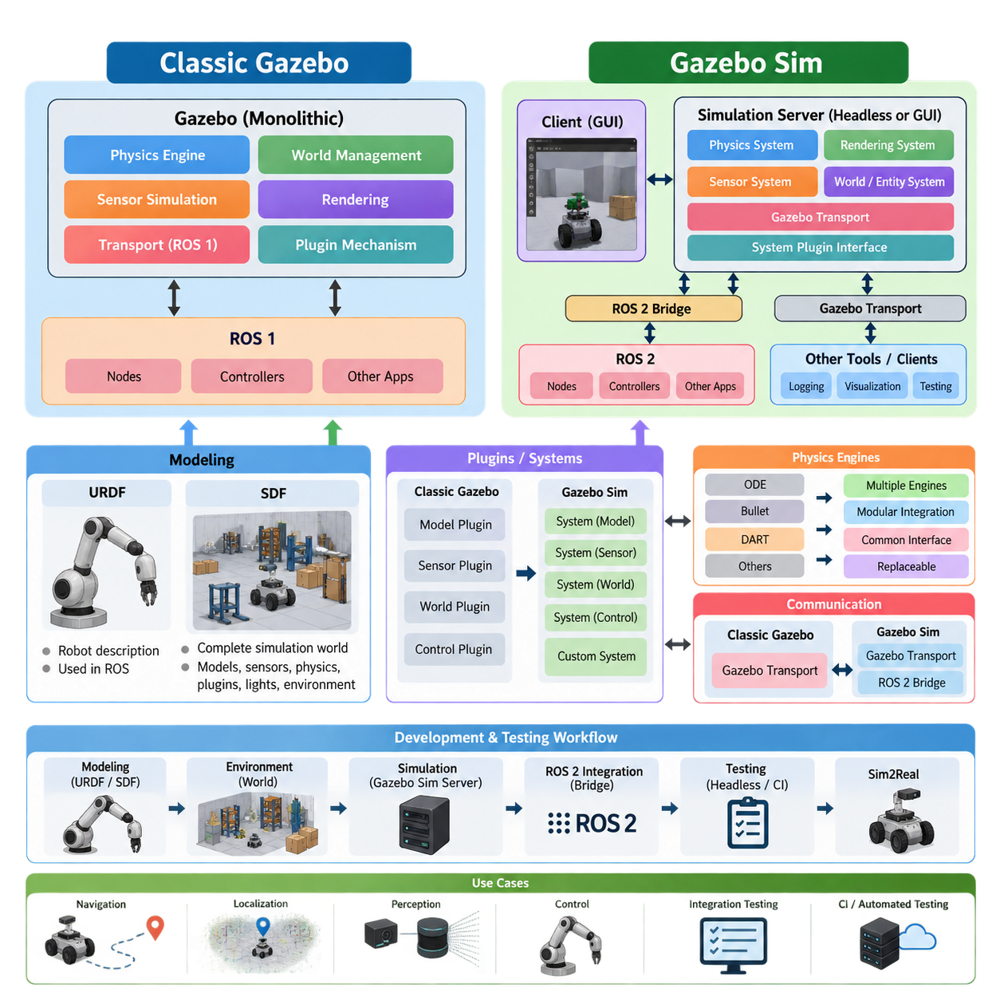
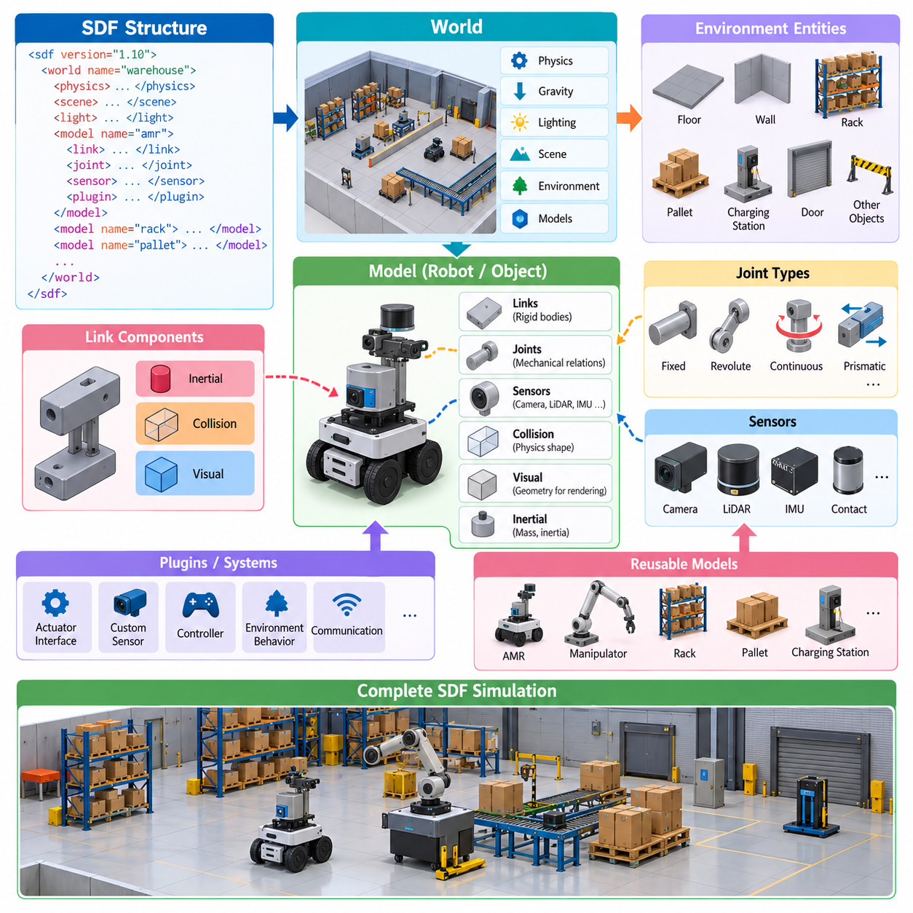
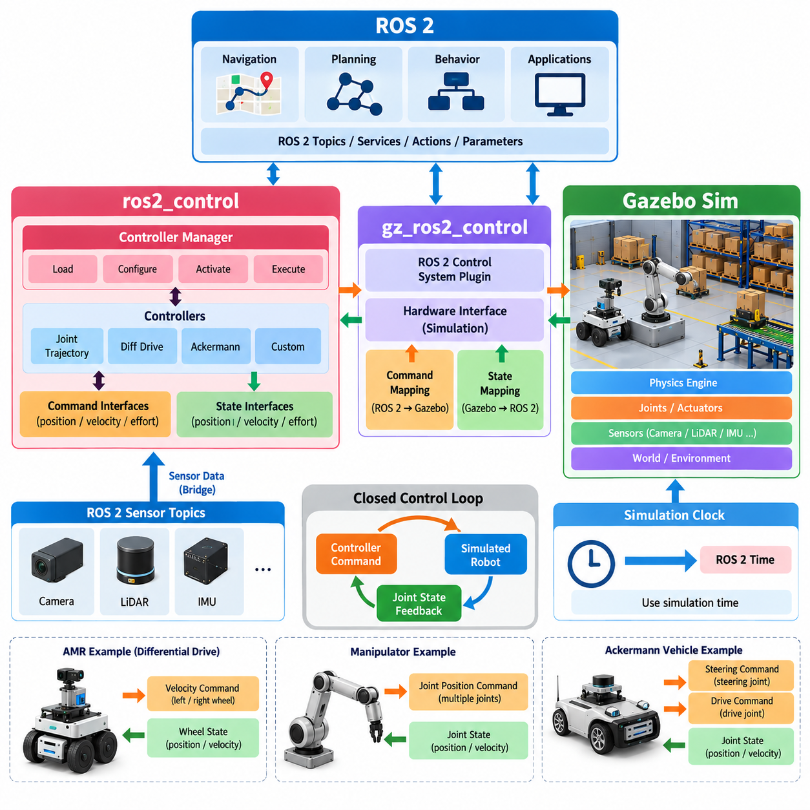
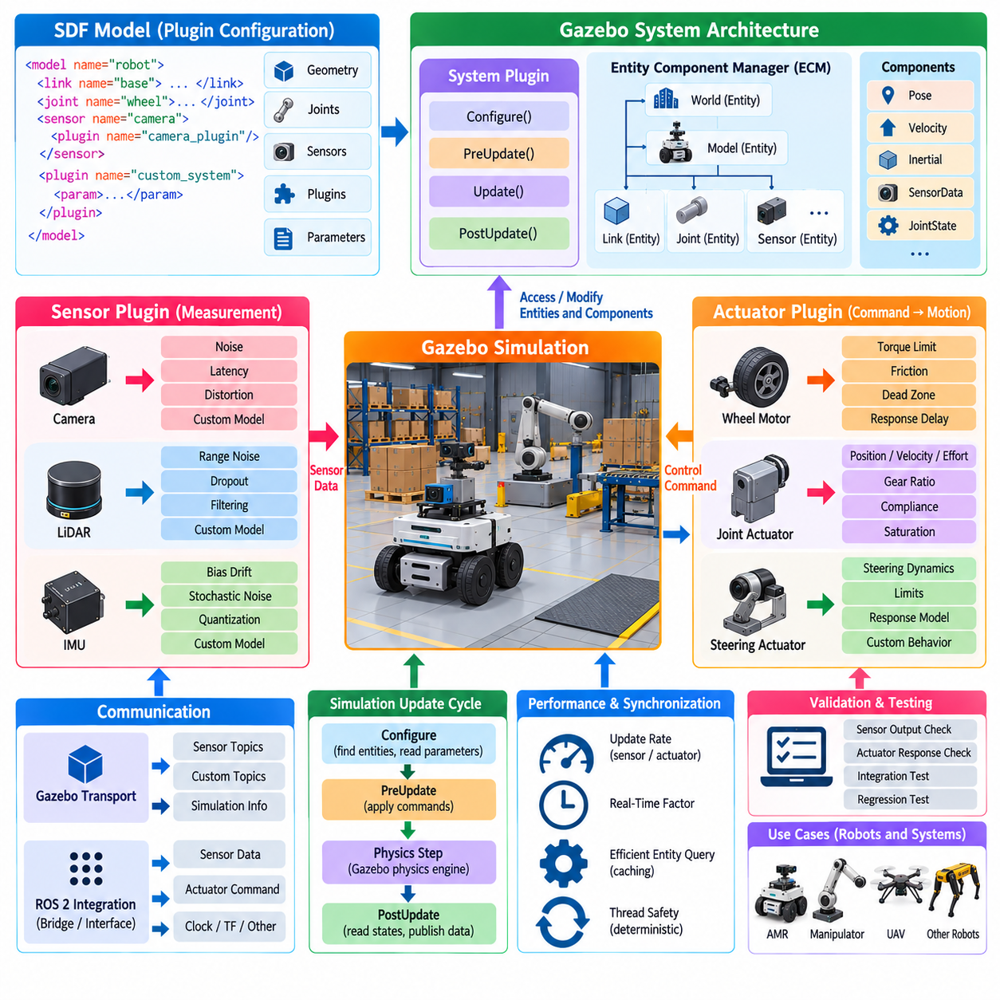
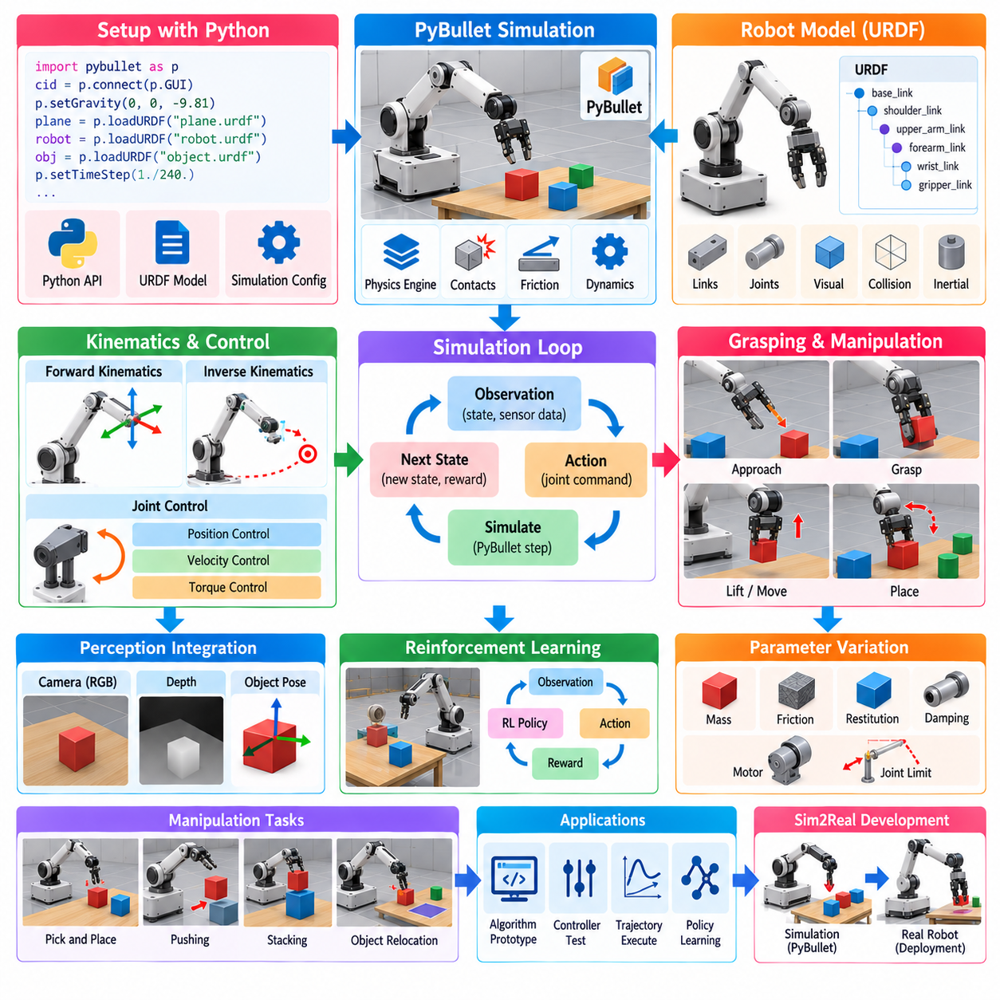
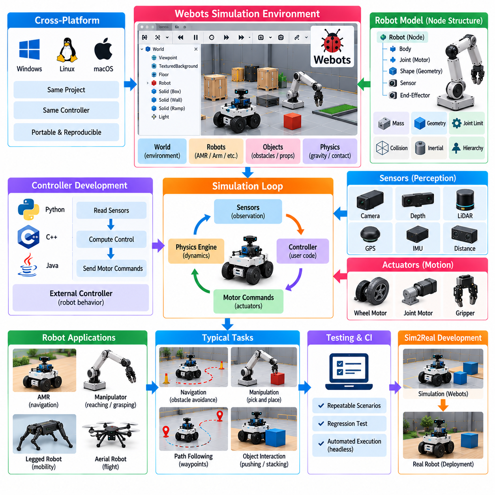
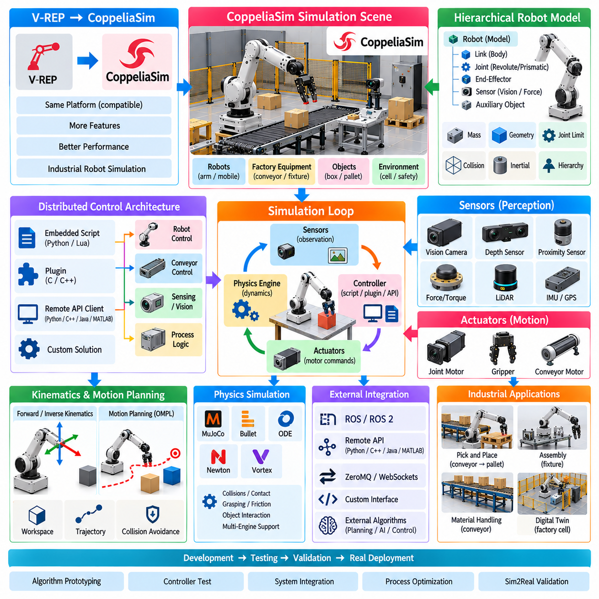
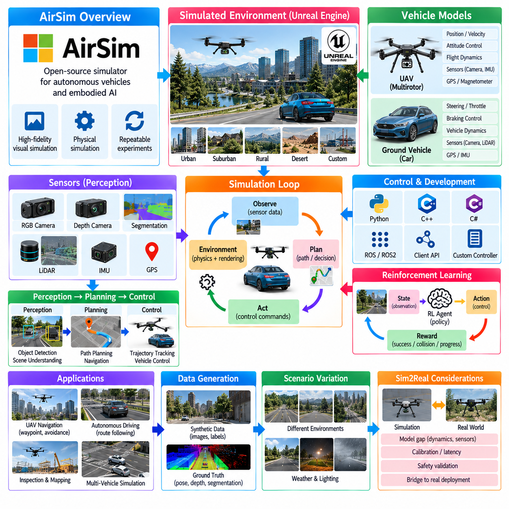
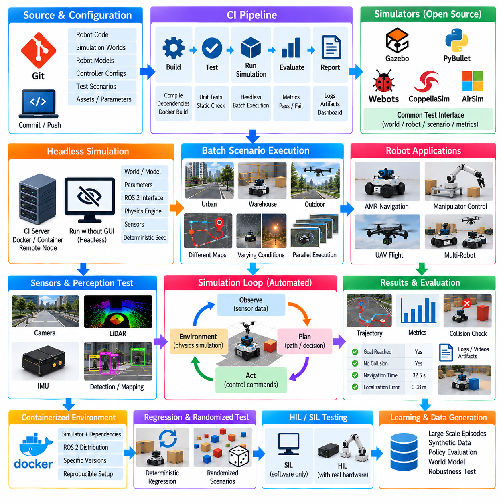
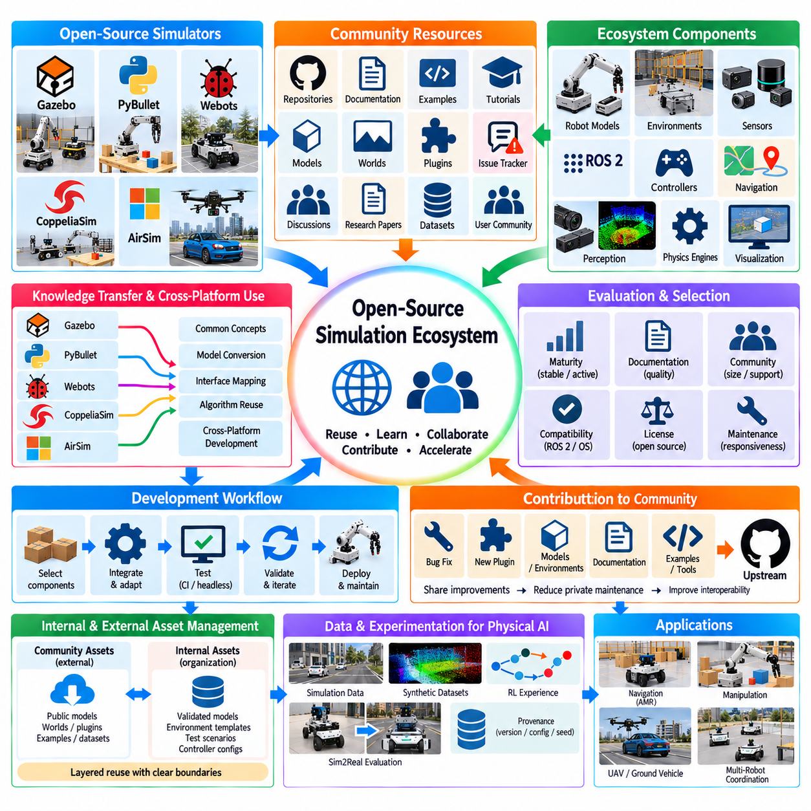

**Volume 11. Simulation and Digital Twin**


# Chapter 07. Gazebo and Open Source Sim

##  

## 07.01. Gazebo Sim vs Classic Gazebo Architecture Differences

{width="7.268055555555556in" height="7.268055555555556in"}

Gazebo has evolved from the architecture commonly associated with Classic Gazebo into a newer simulation architecture generally referred to as Gazebo Sim. The distinction is important because the change is not simply a new graphical interface or a renamed software package. It reflects a broader restructuring of the simulator around more modular services, modern middleware integration, and clearer separation between simulation components. This evolution is particularly relevant when Gazebo is used as part of a modern robot software architecture rather than as an isolated visualization tool.

Classic Gazebo was built around a relatively centralized simulation architecture in which the physics engine, world management, sensor simulation, rendering, transport, and plugin mechanisms were closely integrated. Its development history is strongly connected with ROS and ROS 1 workflows, and many existing robot projects still contain Classic Gazebo models, plugins, launch files, and integration code. This ecosystem became highly mature and widely adopted, making Classic Gazebo an important reference point for understanding existing robotics simulation assets.

Gazebo Sim adopts a more modular architecture in which the simulation server, physics systems, rendering systems, sensor systems, and other functions can be treated as distinct components. Instead of relying on one large monolithic simulator structure, functionality is organized through systems and services that interact through defined interfaces. This architecture makes it easier to replace or extend individual simulation capabilities without requiring the entire simulator to follow the implementation assumptions of an older integrated design.

One of the most visible architectural changes is the separation between the simulation engine and the graphical client. In Gazebo Sim, the simulation server can execute the world and physics independently from the graphical interface, while a client can connect to the running simulation for visualization and interaction. This separation is useful for headless execution, automated testing, remote simulation, and continuous integration because simulation does not fundamentally depend on a graphical desktop being present.

The underlying physics architecture is also more explicitly modular. Gazebo Sim can work with supported physics engines through a common simulation framework, while physics-related behavior is exposed through system interfaces. This allows robot models and environments to be constructed independently from many implementation details of the physics backend. The practical benefit is that a simulation application can maintain a stable higher-level structure while physics configuration and related components evolve.

The transition also changes the role of plugins. Classic Gazebo commonly used plugins that were tightly associated with particular model, sensor, world, or control functions. Gazebo Sim retains an extensibility mechanism but organizes functionality around systems and modern plugin interfaces. A system can implement behavior associated with entities in the simulated world, allowing developers to add custom sensors, actuators, controllers, environmental behavior, or other simulation logic while maintaining a more structured architecture.

The communication layer has also changed significantly. Classic Gazebo used its own transport architecture, which became deeply embedded in many older workflows. Gazebo Sim uses modern Gazebo Transport and related interfaces, while ROS 2 integration is provided through dedicated bridges and packages. This distinction is important because Gazebo Transport and ROS 2 are not identical communication mechanisms. A modern robot application may therefore contain Gazebo-native communication internally and use a ROS 2 bridge where simulation data must enter the robot\'s ROS 2 software architecture.

The modeling workflow is centered on SDF, or Simulation Description Format. SDF is not merely a replacement for URDF; it is designed to describe complete simulation worlds, including models, links, joints, sensors, physics properties, plugins, lights, and environmental elements. URDF remains highly important in ROS-based robot description workflows, but Gazebo Sim can use SDF as a richer simulation-oriented representation. This distinction becomes particularly important when moving from a robot description to a complete simulation environment.

For ROS 2-based development, Gazebo Sim therefore provides a useful boundary between robot software and simulation infrastructure. ROS 2 nodes can continue to implement perception, localization, planning, control, navigation, and other robot functions, while Gazebo provides simulated physics and sensors. Bridges and control integrations connect these domains. This supports the broader software-architecture principle of separating robot application logic from the underlying simulation implementation.

The architectural difference is especially valuable for automated testing. Because Gazebo Sim can operate without continuously running its graphical client, the same simulation environment can be executed as a headless process in a test or CI environment. Robot software can then receive simulated sensor data and publish control commands in a manner similar to operation with physical hardware. This makes simulation suitable not only for demonstrations but also for regression testing, integration testing, and repeatable validation.

For AMR development, the distinction can be viewed in practical terms. A Classic Gazebo project may contain an established world file, robot model, plugins, ROS 1 nodes, and launch configuration that were designed around the older architecture. Migrating such a system is therefore not simply a matter of opening the same files in a newer simulator. Model descriptions, plugins, transport interfaces, ROS integration, controllers, and launch mechanisms may all require examination and adaptation.

Gazebo Sim is particularly suitable when the simulation environment is intended to become part of a larger Simulation-Driven Development workflow. The simulator can provide repeatable environments for validating navigation, localization, sensor processing, controller behavior, and robot-system integration. This aligns with the broader simulation structure in which fidelity, physics, sensors, environment modeling, automated testing, and eventually Sim2Real transfer are treated as connected engineering activities rather than independent experiments.

The distinction between Classic Gazebo and Gazebo Sim should therefore be understood as an architectural transition rather than a simple product-version change. Classic Gazebo remains relevant because of its large installed base and existing robotics software, while Gazebo Sim represents the newer modular direction for open-source robot simulation. For a new ROS 2-oriented project, understanding the newer architecture helps developers design simulation interfaces that remain independent from individual physics engines, rendering clients, and simulator-specific implementation details. This approach also fits the broader robotics software architecture principle of separating application functions from infrastructure components.

Gazebo는 일반적으로 Classic Gazebo와 연관되어 있던 아키텍처에서 Gazebo Sim이라고 불리는 새로운 시뮬레이션 아키텍처로 발전해 왔다. 이러한 차이는 단순히 새로운 그래픽 인터페이스가 추가되거나 소프트웨어의 이름이 변경된 것을 의미하지 않는다. 이는 시뮬레이션을 보다 모듈화된 서비스 구조, 현대적인 미들웨어 통합, 그리고 시뮬레이션 구성 요소 간의 명확한 분리를 중심으로 재구성한 결과이다. 특히 Gazebo를 독립적인 시각화 도구가 아니라 현대적인 로봇 소프트웨어 아키텍처의 일부로 사용하는 경우 이러한 변화의 의미가 중요하다.

Classic Gazebo는 물리 엔진, 월드 관리, 센서 시뮬레이션, 렌더링, 통신, 플러그인 메커니즘 등이 비교적 중앙 집중적인 시뮬레이션 아키텍처 안에서 밀접하게 통합된 구조를 가지고 있었다. 개발 역사는 ROS 및 ROS 1 기반의 워크플로와 강하게 연결되어 있으며, 많은 기존 로봇 프로젝트에는 여전히 Classic Gazebo 모델, 플러그인, 실행 파일 및 통합 코드가 포함되어 있다. 이러한 생태계는 오랜 기간 성숙하면서 광범위하게 사용되었기 때문에 Classic Gazebo는 기존 로봇 시뮬레이션 자산을 이해하는 데 중요한 기준점이 된다.

Gazebo Sim은 시뮬레이션 서버, 물리 시스템, 렌더링 시스템, 센서 시스템 및 기타 기능을 보다 독립적인 구성 요소로 취급할 수 있는 모듈식 아키텍처를 채택한다. 하나의 거대한 모놀리식 시뮬레이터 구조에 의존하기보다는 기능을 시스템과 서비스 단위로 구성하고 정의된 인터페이스를 통해 서로 상호작용하도록 설계한다. 이러한 구조는 전체 시뮬레이터가 기존의 통합 설계 방식에 의존하지 않고도 개별 시뮬레이션 기능을 교체하거나 확장하기 쉽게 만든다.

가장 눈에 띄는 아키텍처 변화 중 하나는 시뮬레이션 엔진과 그래픽 클라이언트의 분리이다. Gazebo Sim에서는 시뮬레이션 서버가 그래픽 인터페이스와 독립적으로 월드와 물리를 실행할 수 있으며, 클라이언트는 실행 중인 시뮬레이션에 연결하여 시각화와 상호작용을 수행할 수 있다. 이러한 분리는 헤드리스 실행, 자동화된 테스트, 원격 시뮬레이션 및 지속적 통합에 유용하다. 그래픽 데스크톱이 항상 존재해야만 시뮬레이션이 실행되는 구조에서 벗어날 수 있기 때문이다.

기반이 되는 물리 아키텍처 역시 더욱 명확하게 모듈화되었다. Gazebo Sim은 공통 시뮬레이션 프레임워크를 통해 지원되는 여러 물리 엔진과 함께 사용할 수 있으며, 물리와 관련된 동작은 시스템 인터페이스를 통해 노출된다. 이를 통해 로봇 모델과 환경을 물리 백엔드의 여러 구현 세부사항으로부터 어느 정도 독립적으로 구성할 수 있다. 실질적으로는 시뮬레이션 애플리케이션이 보다 높은 수준의 안정적인 구조를 유지하면서 물리 설정과 관련 구성 요소를 발전시킬 수 있다는 장점이 있다.

플러그인의 역할 역시 변화하였다. Classic Gazebo에서는 특정 모델, 센서, 월드 또는 제어 기능에 밀접하게 연결된 플러그인이 일반적으로 사용되었다. Gazebo Sim 역시 확장 메커니즘을 유지하지만, 기능을 시스템과 현대적인 플러그인 인터페이스를 중심으로 구성한다. 하나의 시스템은 시뮬레이션 월드에 존재하는 엔티티와 관련된 동작을 구현할 수 있으며, 이를 통해 개발자는 보다 구조화된 아키텍처를 유지하면서 사용자 정의 센서, 액추에이터, 컨트롤러, 환경 동작 또는 기타 시뮬레이션 기능을 추가할 수 있다.

통신 계층 역시 크게 변화하였다. Classic Gazebo는 자체적인 Transport 아키텍처를 사용했으며, 이것은 여러 기존 워크플로에 깊게 통합되었다. Gazebo Sim은 현대적인 Gazebo Transport와 관련 인터페이스를 사용하며, ROS 2 통합은 별도의 브리지와 패키지를 통해 제공된다. 따라서 Gazebo Transport와 ROS 2는 동일한 통신 메커니즘이 아니라는 점이 중요하다. 현대적인 로봇 애플리케이션에서는 Gazebo 내부에서 Gazebo 고유의 통신 방식을 사용하면서, 시뮬레이션 데이터를 로봇의 ROS 2 소프트웨어 아키텍처로 전달해야 하는 부분에서는 ROS 2 브리지를 사용할 수 있다.

모델링 워크플로는 SDF(Simulation Description Format)를 중심으로 구성된다. SDF는 단순히 URDF를 대체하기 위한 형식이 아니라 전체 시뮬레이션 월드를 표현하기 위한 형식으로 설계되었다. 여기에는 모델, 링크, 조인트, 센서, 물리 속성, 플러그인, 조명 및 환경 요소 등을 포함할 수 있다. ROS 기반 로봇 설명 워크플로에서 URDF는 여전히 매우 중요하지만, Gazebo Sim에서는 SDF를 보다 풍부한 시뮬레이션 중심 표현 방식으로 사용할 수 있다. 따라서 로봇의 설명에서 완전한 시뮬레이션 환경으로 확장할 때 이 차이를 이해하는 것이 중요하다.

ROS 2 기반 개발에서는 Gazebo Sim이 로봇 소프트웨어와 시뮬레이션 인프라 사이의 유용한 경계를 제공한다. ROS 2 노드는 인식, 위치 추정, 경로 계획, 제어, 내비게이션 및 기타 로봇 기능을 계속 구현할 수 있으며, Gazebo는 가상 물리 환경과 센서 시뮬레이션을 제공한다. 브리지와 제어 통합 계층은 이 두 영역을 연결한다. 이러한 구조는 로봇 애플리케이션의 로직을 하부 시뮬레이션 구현으로부터 분리한다는 보다 일반적인 소프트웨어 아키텍처 원칙을 지원한다.

이러한 아키텍처 차이는 특히 자동화된 테스트에서 유용하다. Gazebo Sim은 그래픽 클라이언트를 계속 실행하지 않고도 동작할 수 있기 때문에 동일한 시뮬레이션 환경을 테스트 또는 CI 환경에서 헤드리스 프로세스로 실행할 수 있다. 그러면 로봇 소프트웨어는 실제 하드웨어를 사용할 때와 유사한 방식으로 시뮬레이션 센서 데이터를 수신하고 제어 명령을 발행할 수 있다. 따라서 시뮬레이션을 단순한 시연 도구가 아니라 회귀 테스트, 통합 테스트 및 반복 가능한 검증을 위한 환경으로 활용할 수 있다.

AMR 개발에서는 Classic Gazebo와 Gazebo Sim의 차이를 보다 실용적인 관점에서 볼 수 있다. Classic Gazebo 프로젝트에는 기존 월드 파일, 로봇 모델, 플러그인, ROS 1 노드 및 실행 설정이 포함되어 있을 수 있으며, 이들은 기존 아키텍처를 기반으로 설계되어 있다. 따라서 이러한 시스템을 새로운 시뮬레이터로 이전하는 작업은 단순히 동일한 파일을 새로운 시뮬레이터에서 여는 것으로 끝나지 않는다. 모델 설명, 플러그인, Transport 인터페이스, ROS 통합, 컨트롤러 및 실행 메커니즘 등을 모두 검토하고 필요에 따라 수정해야 할 수 있다.

Gazebo Sim은 시뮬레이션 환경을 보다 광범위한 SDD(Simulation-Driven Development) 워크플로의 일부로 활용하려는 경우 특히 적합하다. 시뮬레이터는 내비게이션, 위치 추정, 센서 처리, 컨트롤러 동작 및 로봇 시스템 통합을 검증하기 위한 반복 가능한 환경을 제공할 수 있다. 이는 시뮬레이션 충실도, 물리, 센서, 환경 모델링, 자동화된 테스트 및 궁극적으로 Sim2Real 전환을 서로 독립적인 실험으로 취급하기보다는 서로 연결된 엔지니어링 활동으로 다루는 전체적인 시뮬레이션 구조와 일치한다.

따라서 Classic Gazebo와 Gazebo Sim의 차이는 단순한 제품 버전 변경이 아니라 아키텍처의 전환으로 이해해야 한다. Classic Gazebo는 광범위한 기존 사용 기반과 기존 로봇 소프트웨어를 보유하고 있기 때문에 여전히 중요하며, Gazebo Sim은 오픈소스 로봇 시뮬레이션이 향하는 새로운 모듈식 방향을 나타낸다. 새로운 ROS 2 기반 프로젝트에서는 이러한 새로운 아키텍처를 이해함으로써 개별 물리 엔진, 렌더링 클라이언트 및 시뮬레이터의 특정 구현 세부사항으로부터 독립적인 시뮬레이션 인터페이스를 설계할 수 있다. 이러한 접근 방식은 애플리케이션 기능과 인프라 구성 요소를 분리하는 로봇 소프트웨어 아키텍처의 일반적인 원칙과도 부합한다.

##  

## 07.02. Gazebo SDF World and Model Creation [w/Code]

{width="7.268055555555556in" height="7.268055555555556in"}

SDF, or Simulation Description Format, is the primary scene-description format used by Gazebo to represent robots, objects, sensors, and complete simulation environments. Unlike robot-centered formats that mainly describe links and joints, SDF provides a hierarchical structure capable of defining an entire simulated world. A world can contain multiple models, lighting, physics configuration, environmental properties, plugins, and other entities required to reproduce a robotics scenario.

An SDF document is organized as a hierarchy of elements. At the highest level, the SDF element specifies the format version and contains a world or model definition. A world acts as the container for the complete simulation scene, while a model represents an individual physical system such as an AMR, manipulator, vehicle, rack, pallet, or obstacle. Models are further decomposed into links, joints, sensors, collision geometries, and visual geometries.

World creation begins by defining the global properties of the simulation. These properties can include gravity, physics-engine parameters, scene configuration, lighting, and environmental entities. A warehouse world, for example, may contain a floor, walls, racks, pallets, charging stations, and multiple robots. Organizing these components as reusable models allows the same assets to be assembled into different test environments without reconstructing every object for each simulation.

The model element represents a logical physical object within the world. A model may contain a single rigid object or a complex articulated mechanism consisting of many links and joints. Each link represents a rigid body with physical properties such as mass and inertia, while joints define mechanical relationships between links. This structure allows SDF to represent everything from simple obstacles to differential-drive AMRs and multi-joint robotic manipulators.

A link normally combines inertial, collision, and visual information. The inertial description determines how the physics engine calculates dynamic motion, while collision geometry defines the shape used for contact and collision calculations. Visual geometry determines how the object appears in the rendering system. Separating collision and visual representations is important because highly detailed graphical meshes can often be replaced by simpler collision shapes to improve simulation performance.

Pose definitions determine where entities are located and how they are oriented relative to reference frames. Correct pose management becomes increasingly important as models become more complex because robots may contain sensors, wheels, manipulators, payloads, and nested subassemblies. Modern SDF supports structured frame semantics that help developers express relationships among coordinate frames rather than relying only on manually accumulated transformations.

Joints connect links and constrain their relative motion. Common joint types include fixed, revolute, continuous, prismatic, and other mechanical relationships supported by the simulation environment. Joint definitions specify properties such as axes, limits, dynamics, and relationships between connected bodies. For mobile robots, wheel joints translate actuator commands into simulated movement, while manipulator joints reproduce the articulated structure of the physical arm.

Sensors can be incorporated directly into SDF models so that simulated robots expose measurements corresponding to their physical sensor configurations. Cameras, depth sensors, LiDAR, IMUs, contact sensors, and other sensor types can be attached to appropriate links with defined poses and update characteristics. The simulator then generates observations based on the evolving virtual environment, enabling perception and localization software to operate against simulated sensor streams.

World and model descriptions should distinguish reusable assets from scenario-specific configuration. A robot model should normally describe the robot itself, while a world should determine where that robot operates and which external objects surround it. This separation allows the same AMR model to be inserted into a warehouse, hospital, factory, outdoor test area, or synthetic validation environment without duplicating the robot description for every scenario.

Reusable models can also be composed from smaller components. A mobile manipulator, for example, can conceptually combine a mobile base, robotic arm, sensor mast, compute enclosure, and payload interface. Maintaining these components with clear reference frames and interfaces reduces duplication and simplifies configuration management. Changes to a sensor mounting position or collision geometry can then be propagated without rebuilding every simulation world that contains the robot.

Plugins and systems extend the static SDF description with executable simulation behavior. They can implement actuator interfaces, custom sensors, environmental behavior, controllers, or communication functions that cannot be represented only through geometry and physical parameters. In Gazebo Sim, this mechanism supports a modular relationship between declarative scene description and runtime simulation functionality, allowing SDF to define entities while systems provide their dynamic behavior.

SDF model creation therefore requires more than visually reproducing CAD geometry. Mass, center of gravity, inertia tensors, joint constraints, friction, collision geometry, actuator behavior, and sensor placement influence whether simulated behavior resembles the physical robot. Excessively detailed meshes may reduce execution speed without improving useful physical fidelity, while inaccurate inertial or collision properties can produce unrealistic motion even when the rendered robot looks geometrically correct.

A practical model-development process typically begins with a minimal structure and progressively adds physical and sensing detail. Developers can first verify links, poses, and joints, then validate collision behavior and dynamics before introducing sensors and application-specific systems. This incremental approach makes errors easier to isolate because problems in coordinate frames, inertia, contact, or plugins can otherwise interact and make complex simulation failures difficult to diagnose.

For AMR simulation, the resulting SDF environment can combine the robot model with structured infrastructure such as walls, aisles, racks, doors, docking stations, ramps, and dynamic obstacles. Sensor models generate observations from these surroundings while wheel dynamics and contact models determine vehicle motion. Navigation and control software can therefore be evaluated against repeatable scenarios before equivalent experiments are performed on physical hardware.

SDF world and model creation ultimately forms the structural foundation of a Gazebo-based Simulation-Driven Development pipeline. Robot models define physical and sensing characteristics, world descriptions provide operational context, and runtime systems add dynamic behavior and software interfaces. These elements can then support automated testing, ROS 2 integration, synthetic scenario execution, regression validation, and later Sim2Real activities within the broader simulation architecture described by the volume structure.

SDF(Simulation Description Format)는 Gazebo에서 로봇, 객체, 센서 및 전체 시뮬레이션 환경을 표현하기 위해 사용되는 주요 장면 기술 형식(Scene Description Format)이다. 주로 링크(Link)와 조인트(Joint)를 중심으로 로봇을 기술하는 형식과 달리, SDF는 전체 시뮬레이션 월드(World)를 정의할 수 있는 계층적 구조를 제공한다. 하나의 월드는 여러 모델(Model), 조명(Lighting), 물리 설정(Physics Configuration), 환경 속성(Environmental Properties), 플러그인(Plugin) 및 로봇 시나리오 재현에 필요한 다양한 엔티티(Entity)를 포함할 수 있다.

SDF 문서(SDF Document)는 요소(Element)의 계층 구조로 구성된다. 최상위 수준에서 SDF 요소는 형식 버전(Format Version)을 지정하고 월드(World) 또는 모델(Model) 정의를 포함한다. 월드는 전체 시뮬레이션 장면을 담는 컨테이너(Container) 역할을 하며, 모델은 AMR, 매니퓰레이터(Manipulator), 차량(Vehicle), 랙(Rack), 팔레트(Pallet), 장애물(Obstacle)과 같은 개별 물리 시스템을 나타낸다. 모델은 다시 링크(Link), 조인트(Joint), 센서(Sensor), 충돌 형상(Collision Geometry), 시각 형상(Visual Geometry)으로 세분화된다.

월드 생성(World Creation)은 시뮬레이션의 전역 속성(Global Properties)을 정의하는 것에서 시작한다. 이러한 속성에는 중력(Gravity), 물리 엔진 매개변수(Physics Engine Parameters), 장면 설정(Scene Configuration), 조명(Lighting), 환경 엔티티(Environmental Entities) 등이 포함될 수 있다. 예를 들어 창고 월드(Warehouse World)는 바닥, 벽, 랙, 팔레트, 충전 스테이션(Charging Station), 여러 대의 로봇을 포함할 수 있다. 이러한 구성 요소를 재사용 가능한 모델(Reusable Model)로 구성하면 매번 모든 객체를 새로 만들지 않고도 서로 다른 시험 환경을 구성할 수 있다.

모델 요소(Model Element)는 월드 내부의 논리적인 물리 객체(Logical Physical Object)를 표현한다. 모델은 하나의 강체 객체(Rigid Object)만 포함할 수도 있고, 여러 링크와 조인트로 구성된 복잡한 관절형 메커니즘(Articulated Mechanism)을 포함할 수도 있다. 각각의 링크는 질량(Mass)과 관성(Inertia) 같은 물리적 특성을 가진 강체(Rigid Body)를 나타내며, 조인트는 링크 사이의 기계적 관계(Mechanical Relationship)를 정의한다. 이러한 구조를 통해 SDF는 단순한 장애물부터 차동 구동 AMR(Differential-Drive AMR)과 다관절 로봇 매니퓰레이터(Multi-Joint Robotic Manipulator)까지 표현할 수 있다.

하나의 링크(Link)는 일반적으로 관성(Inertial), 충돌(Collision), 시각(Visual) 정보를 결합한다. 관성 기술(Inertial Description)은 물리 엔진이 동적 운동(Dynamic Motion)을 계산하는 방법을 결정하고, 충돌 형상(Collision Geometry)은 접촉 및 충돌 계산에 사용되는 형상을 정의한다. 시각 형상(Visual Geometry)은 렌더링 시스템(Rendering System)에서 객체가 어떻게 보이는지를 결정한다. 충돌 표현과 시각 표현을 분리하는 것은 중요하며, 그래픽적으로 매우 복잡한 메시(Mesh)를 단순한 충돌 형상으로 대체하면 시뮬레이션 성능을 향상시킬 수 있다.

자세 정의(Pose Definition)는 엔티티가 기준 좌표계(Reference Frame)에 대해 어디에 위치하고 어떤 방향을 가지는지를 결정한다. 로봇 모델이 복잡해질수록 정확한 자세 관리(Pose Management)는 더욱 중요해진다. 로봇에는 센서, 바퀴, 매니퓰레이터, 페이로드(Payload), 중첩된 하위 조립체(Nested Subassembly) 등이 포함될 수 있기 때문이다. 현대적인 SDF는 구조화된 프레임 의미 체계(Frame Semantics)를 지원하여 개발자가 수동으로 변환(Transformation)을 누적하는 대신 좌표 프레임(Coordinate Frame) 사이의 관계를 명시적으로 표현할 수 있도록 한다.

조인트(Joint)는 링크를 연결하고 링크 사이의 상대 운동(Relative Motion)을 제한한다. 일반적인 조인트 유형에는 고정형(Fixed), 회전형(Revolute), 연속 회전형(Continuous), 직선 이동형(Prismatic) 및 시뮬레이션 환경이 지원하는 기타 기계적 관계가 포함된다. 조인트 정의에는 축(Axis), 한계(Limit), 동역학(Dynamics), 연결된 강체 사이의 관계 등이 포함된다. 이동 로봇에서는 휠 조인트(Wheel Joint)가 액추에이터 명령(Actuator Command)을 시뮬레이션상의 움직임으로 변환하며, 매니퓰레이터 조인트는 실제 로봇 팔의 관절 구조를 재현한다.

센서(Sensor)는 SDF 모델 내부에 직접 포함될 수 있으며, 이를 통해 시뮬레이션 로봇이 실제 로봇의 센서 구성에 대응하는 측정값을 생성할 수 있다. 카메라(Camera), 깊이 센서(Depth Sensor), LiDAR, IMU, 접촉 센서(Contact Sensor) 및 기타 센서를 적절한 링크에 연결하고 자세와 갱신 특성(Update Characteristics)을 정의할 수 있다. 이후 시뮬레이터는 변화하는 가상 환경을 기반으로 관측값(Observation)을 생성하여 인식(Perception) 및 위치 추정(Localization) 소프트웨어가 시뮬레이션 센서 스트림을 이용해 동작할 수 있도록 한다.

월드와 모델 기술(World and Model Description)에서는 재사용 가능한 자산(Reusable Asset)과 시나리오별 설정(Scenario-Specific Configuration)을 구분하는 것이 중요하다. 로봇 모델은 일반적으로 로봇 자체를 기술하고, 월드는 해당 로봇이 어디에서 동작하며 주변에 어떤 외부 객체가 존재하는지를 정의한다. 이러한 분리를 통해 동일한 AMR 모델을 중복 작성하지 않고도 창고, 병원, 공장, 야외 시험장 또는 합성 검증 환경(Synthetic Validation Environment)에 배치할 수 있다.

재사용 가능한 모델(Reusable Model)은 더 작은 구성 요소(Component)를 조합하여 구성할 수도 있다. 예를 들어 이동형 매니퓰레이터(Mobile Manipulator)는 이동 베이스(Mobile Base), 로봇 팔(Robotic Arm), 센서 마스트(Sensor Mast), 컴퓨팅 인클로저(Compute Enclosure), 페이로드 인터페이스(Payload Interface)를 개념적으로 결합할 수 있다. 이러한 구성 요소를 명확한 기준 프레임(Reference Frame)과 인터페이스로 관리하면 중복을 줄이고 설정 관리(Configuration Management)를 단순화할 수 있다. 센서 장착 위치나 충돌 형상이 변경되더라도 로봇을 포함하는 모든 시뮬레이션 월드를 다시 구축할 필요가 줄어든다.

플러그인과 시스템(Plugins and Systems)은 정적인 SDF 기술에 실행 가능한 시뮬레이션 동작(Runtime Simulation Behavior)을 추가한다. 이들은 형상과 물리 매개변수만으로 표현하기 어려운 액추에이터 인터페이스(Actuator Interface), 사용자 정의 센서(Custom Sensor), 환경 동작(Environmental Behavior), 컨트롤러(Controller), 통신 기능(Communication Function) 등을 구현할 수 있다. Gazebo Sim에서는 이러한 메커니즘을 통해 선언적 장면 기술(Declarative Scene Description)과 실행 시뮬레이션 기능 사이의 모듈식 관계를 구성하며, SDF가 엔티티를 정의하고 시스템(System)이 동적 동작을 제공하도록 할 수 있다.

따라서 SDF 모델 생성(Model Creation)은 단순히 CAD 형상을 시각적으로 재현하는 것 이상의 작업을 요구한다. 질량(Mass), 무게중심(Center of Gravity), 관성 텐서(Inertia Tensor), 조인트 제약(Joint Constraint), 마찰(Friction), 충돌 형상(Collision Geometry), 액추에이터 동작(Actuator Behavior), 센서 배치(Sensor Placement)는 시뮬레이션 동작이 실제 로봇과 얼마나 유사한지에 영향을 준다. 지나치게 상세한 메시는 유용한 물리적 충실도(Physical Fidelity)를 높이지 않으면서 실행 속도를 저하시킬 수 있으며, 부정확한 관성이나 충돌 속성은 렌더링된 로봇의 외형이 정확하더라도 비현실적인 움직임을 발생시킬 수 있다.

실용적인 모델 개발 과정(Model Development Process)은 일반적으로 최소 구조(Minimal Structure)에서 시작하여 물리적 세부사항과 센서 정보를 점진적으로 추가하는 방식으로 진행된다. 개발자는 먼저 링크, 자세, 조인트를 검증하고 이후 충돌 동작(Collision Behavior)과 동역학(Dynamics)을 확인한 다음 센서와 애플리케이션별 시스템을 추가할 수 있다. 이러한 점진적 접근 방식(Incremental Approach)은 좌표 프레임, 관성, 접촉 또는 플러그인의 문제가 서로 영향을 주면서 복잡한 시뮬레이션 오류를 발생시키는 상황에서 문제의 원인을 보다 쉽게 분리할 수 있게 한다.

AMR 시뮬레이션에서는 완성된 SDF 환경을 로봇 모델과 벽, 통로, 랙, 문, 도킹 스테이션(Docking Station), 경사로(Ramp), 동적 장애물(Dynamic Obstacle) 등의 구조화된 인프라(Infrastructure)와 결합할 수 있다. 센서 모델은 이러한 주변 환경으로부터 관측값을 생성하며, 휠 동역학(Wheel Dynamics)과 접촉 모델(Contact Model)은 차량의 움직임을 결정한다. 따라서 내비게이션(Navigation)과 제어(Control) 소프트웨어를 실제 하드웨어에서 동일한 실험을 수행하기 전에 반복 가능한 시나리오에서 평가할 수 있다.

궁극적으로 SDF 월드 및 모델 생성(SDF World and Model Creation)은 Gazebo 기반 시뮬레이션 주도 개발(Simulation-Driven Development) 파이프라인의 구조적 기반을 형성한다. 로봇 모델은 물리적 특성과 센싱 특성을 정의하고, 월드 기술(World Description)은 운영 환경을 제공하며, 런타임 시스템(Runtime System)은 동적 동작과 소프트웨어 인터페이스를 추가한다. 이러한 요소들은 이후 자동화 테스트(Automated Testing), ROS 2 통합(ROS 2 Integration), 합성 시나리오 실행(Synthetic Scenario Execution), 회귀 검증(Regression Validation), 그리고 Sim2Real 활동을 전체 시뮬레이션 아키텍처 안에서 지원할 수 있다.

##  

## 07.03. Gazebo ROS2 Integration gz ros2 control [w/Code]

{width="7.268055555555556in" height="7.268055555555556in"}

ROS 2 integration with Gazebo Sim creates a structured connection between the simulated robot and the same control software architecture used for physical hardware. Gazebo provides physics, joints, sensors, contacts, and simulated actuators, while ROS 2 provides communication, lifecycle management, controllers, planning, and higher-level robot applications. The integration boundary is important because simulation-specific implementation can remain separated from robot control logic.

The ros2_control framework provides a standardized architecture for connecting ROS 2 controllers to robot hardware through defined command and state interfaces. Instead of allowing every controller to communicate directly with individual motors or simulation joints, ros2_control introduces a hardware abstraction layer. Controllers operate against standardized interfaces, allowing similar control software to be reused across simulated robots, test systems, and physical hardware.

Within Gazebo Sim, gz_ros2_control provides the integration mechanism that connects simulated joints and actuators to the ros2_control ecosystem. It implements the simulation-side hardware interface required by ros2_control and maps commands generated by ROS 2 controllers to Gazebo entities. Joint states calculated by the simulator are returned through corresponding state interfaces, producing a bidirectional control path between ROS 2 and the simulated physical system.

The resulting architecture can be understood as a closed control loop. A ROS 2 controller generates commands such as position, velocity, or effort references. ros2_control routes these commands through its resource and hardware interfaces, and gz_ros2_control applies them to simulated joints. Gazebo advances the physical simulation and calculates new joint states, which are then returned through gz_ros2_control and made available to controllers and other ROS 2 components.

The Controller Manager is a central component of ros2_control. It manages controller loading, configuration, activation, deactivation, and execution while coordinating access to available hardware interfaces. Different controllers can therefore be assigned to different robot resources without embedding controller management inside the Gazebo model itself. This separation improves modularity and allows the controller configuration to evolve independently from much of the simulation environment.

Robot descriptions typically define the interfaces required by ros2_control alongside the mechanical structure of the robot. Joints can expose command interfaces such as position, velocity, or effort and state interfaces representing measured joint position, velocity, or other quantities. The simulation integration interprets these definitions and associates them with corresponding simulated joints, creating the software contract between the controller architecture and the Gazebo model.

For a differential-drive AMR, for example, left and right wheel joints can expose velocity command interfaces and position or velocity state interfaces. A suitable ROS 2 controller generates wheel commands from higher-level motion requests, while Gazebo calculates wheel rotation, contact forces, and resulting base movement. The control architecture therefore remains separated from the physics responsible for determining how commanded wheel motion affects the simulated vehicle.

The same principle extends to Ackermann vehicles and robotic manipulators. Steering and drive joints can be represented through appropriate interfaces for mobile platforms, while articulated robots may expose position, velocity, or effort interfaces for multiple joints. Controllers can then execute trajectories without needing direct knowledge of Gazebo\'s internal physics representation, which makes the control layer more portable between simulation and real robot implementations.

Sensor integration follows a related but distinct communication path. Cameras, LiDAR, IMUs, and other simulated sensors generate data inside the Gazebo environment, while ROS 2 applications typically expect ROS-compatible topics and message types. Gazebo-to-ROS bridges can translate relevant simulation messages into ROS 2 communication. Consequently, actuator control through gz_ros2_control and sensor communication through bridging mechanisms can coexist within the same simulated robot architecture.

This distinction is useful when designing the software boundary. gz_ros2_control primarily connects the ros2_control hardware and controller architecture with simulated actuation and joint state, whereas general Gazebo and ROS 2 communication may use bridge mechanisms for sensors, clocks, poses, or other simulation information. Keeping these responsibilities explicit prevents the integration layer from becoming a collection of tightly coupled simulator-specific interfaces.

Simulation time is another important integration consideration. Robot algorithms may depend on timers, timestamps, controller update periods, sensor rates, and transform synchronization. When simulation does not run at exactly wall-clock speed, ROS 2 components should consistently use the intended simulation clock where appropriate. This allows algorithms to behave according to simulated elapsed time even when the simulator runs slower or faster than real time.

Controller update rates and physics time steps should also be coordinated carefully. The Gazebo physics engine may update at a high internal frequency, while ros2_control controllers execute at another configured rate. An inappropriate relationship between these rates can produce unstable control, delayed responses, or unnecessary computation. Simulation design should therefore consider physics integration, controller frequency, sensor update rates, and ROS 2 timing as parts of the same timing architecture.

A major engineering advantage of this integration is software reuse between simulation and hardware. Higher-level components such as navigation, trajectory generation, behavior control, and mission logic can interact with standard ROS 2 interfaces rather than simulator-specific APIs. When the physical robot provides compatible ros2_control hardware interfaces, much of the controller and application architecture can remain unchanged while the backend changes from Gazebo simulation to real devices.

This approach also supports automated validation. Gazebo Sim can execute headlessly while ROS 2 launches controllers and robot applications around it, enabling repeatable test scenarios to be executed without a graphical client. Tests can verify controller activation, command execution, joint response, navigation behavior, fault handling, and system integration. Such scenarios can become part of continuous integration pipelines and regression testing for robot software.

For AMR and mobile-manipulator development, the architecture provides a practical path from virtual prototypes toward physical systems. An AMR base, wheel controllers, manipulator joints, sensors, and navigation software can first be integrated in Gazebo, while ROS 2 preserves consistent application-level interfaces. As hardware becomes available, simulated interfaces can progressively be replaced by physical drivers while retaining substantial portions of the controller and application software.

Gazebo, gz_ros2_control, ros2_control, and ROS 2 therefore form complementary layers rather than competing control frameworks. Gazebo represents the simulated physical world, gz_ros2_control connects simulated resources to the hardware abstraction, ros2_control manages standardized controller interfaces, and ROS 2 provides the wider distributed robot software environment. Together they establish a reusable integration architecture for simulation-driven development, automated testing, and eventual Sim2Real deployment.

Gazebo Sim과 ROS 2의 통합은 시뮬레이션 로봇과 실제 하드웨어에서 사용하는 동일한 제어 소프트웨어 아키텍처 사이에 구조화된 연결을 형성한다. Gazebo는 물리(Physics), 조인트(Joint), 센서(Sensor), 접촉(Contact), 시뮬레이션 액추에이터(Simulated Actuator)를 제공하며, ROS 2는 통신(Communication), 수명주기 관리(Lifecycle Management), 컨트롤러(Controller), 계획(Planning), 상위 수준 로봇 애플리케이션을 제공한다. 이러한 통합 경계를 명확하게 유지하면 시뮬레이션에 특화된 구현과 로봇 제어 로직을 분리할 수 있다.

ros2_control 프레임워크는 정의된 명령 인터페이스(Command Interface)와 상태 인터페이스(State Interface)를 통해 ROS 2 컨트롤러를 로봇 하드웨어에 연결하기 위한 표준화된 아키텍처를 제공한다. 각 컨트롤러가 개별 모터나 시뮬레이션 조인트와 직접 통신하도록 구성하는 대신, ros2_control은 하드웨어 추상화 계층(Hardware Abstraction Layer)을 도입한다. 컨트롤러는 표준화된 인터페이스를 기반으로 동작하므로 동일하거나 유사한 제어 소프트웨어를 시뮬레이션 로봇, 시험 시스템 및 실제 하드웨어에서 재사용할 수 있다.

Gazebo Sim 내부에서 gz_ros2_control은 시뮬레이션 조인트와 액추에이터를 ros2_control 생태계에 연결하는 통합 메커니즘(Integration Mechanism)을 제공한다. 이는 ros2_control에서 요구하는 시뮬레이션 측 하드웨어 인터페이스(Hardware Interface)를 구현하고, ROS 2 컨트롤러가 생성한 명령을 Gazebo 엔티티(Entity)에 매핑한다. 시뮬레이터에서 계산된 조인트 상태는 대응되는 상태 인터페이스를 통해 다시 전달되며, 이를 통해 ROS 2와 시뮬레이션 물리 시스템 사이에 양방향 제어 경로(Bidirectional Control Path)가 형성된다.

결과적인 아키텍처는 폐루프 제어(Closed Control Loop) 구조로 이해할 수 있다. ROS 2 컨트롤러는 위치(Position), 속도(Velocity), 힘 또는 토크(Effort) 등의 기준 명령을 생성한다. ros2_control은 이러한 명령을 리소스(Resource) 및 하드웨어 인터페이스를 통해 전달하고, gz_ros2_control은 이를 시뮬레이션 조인트에 적용한다. Gazebo는 물리 시뮬레이션을 진행하면서 새로운 조인트 상태를 계산하고, 계산된 상태는 다시 gz_ros2_control을 통해 ROS 2 컨트롤러와 다른 구성 요소에 제공된다.

컨트롤러 관리자(Controller Manager)는 ros2_control의 핵심 구성 요소이다. 컨트롤러의 로딩(Loading), 설정(Configuration), 활성화(Activation), 비활성화(Deactivation), 실행(Execution)을 관리하는 동시에 사용 가능한 하드웨어 인터페이스에 대한 접근을 조정한다. 따라서 서로 다른 컨트롤러를 서로 다른 로봇 리소스에 할당할 수 있으며, 컨트롤러 관리 기능을 Gazebo 모델 자체에 포함할 필요가 없다. 이러한 분리는 모듈성(Modularity)을 향상시키며 컨트롤러 설정을 시뮬레이션 환경의 상당 부분과 독립적으로 변경할 수 있게 한다.

로봇 기술(Robot Description)은 일반적으로 로봇의 기계적 구조와 함께 ros2_control에 필요한 인터페이스를 정의한다. 조인트는 위치, 속도, 힘 또는 토크와 같은 명령 인터페이스를 제공할 수 있으며, 측정된 조인트 위치와 속도 등의 상태를 나타내는 상태 인터페이스도 제공할 수 있다. 시뮬레이션 통합 계층은 이러한 정의를 해석하고 대응되는 시뮬레이션 조인트와 연결함으로써 컨트롤러 아키텍처와 Gazebo 모델 사이의 소프트웨어 계약(Software Contract)을 형성한다.

예를 들어 차동 구동 AMR(Differential-Drive AMR)의 왼쪽과 오른쪽 휠 조인트는 속도 명령 인터페이스(Velocity Command Interface)와 위치 또는 속도 상태 인터페이스를 제공할 수 있다. 적절한 ROS 2 컨트롤러는 상위 수준의 이동 명령으로부터 휠 명령을 생성하고, Gazebo는 휠 회전, 접촉력(Contact Force), 그리고 그 결과 발생하는 베이스 이동을 계산한다. 따라서 제어 아키텍처는 명령된 휠 운동이 시뮬레이션 차량의 움직임에 어떠한 영향을 미치는지를 계산하는 물리 시뮬레이션과 분리된다.

동일한 원리는 애커먼 차량(Ackermann Vehicle)과 로봇 매니퓰레이터(Robotic Manipulator)에도 적용된다. 이동 플랫폼에서는 조향 및 구동 조인트를 적절한 인터페이스를 통해 표현할 수 있으며, 관절형 로봇에서는 여러 조인트에 위치, 속도 또는 힘·토크 인터페이스를 제공할 수 있다. 이후 컨트롤러는 Gazebo 내부의 물리 표현 방식을 직접 알 필요 없이 궤적(Trajectory)을 실행할 수 있으며, 이를 통해 제어 계층을 시뮬레이션과 실제 로봇 구현 사이에서 보다 쉽게 이식할 수 있다.

센서 통합(Sensor Integration)은 이와 관련되지만 서로 다른 통신 경로를 사용한다. 카메라(Camera), LiDAR, IMU 및 기타 시뮬레이션 센서는 Gazebo 환경 내부에서 데이터를 생성하는 반면, ROS 2 애플리케이션은 일반적으로 ROS 호환 토픽(Topic)과 메시지 유형(Message Type)을 사용한다. Gazebo-ROS 브리지(Gazebo-to-ROS Bridge)는 관련 시뮬레이션 메시지를 ROS 2 통신으로 변환할 수 있다. 따라서 gz_ros2_control을 통한 액추에이터 제어와 브리지 메커니즘을 통한 센서 통신이 동일한 시뮬레이션 로봇 아키텍처 안에서 함께 동작할 수 있다.

이러한 구분은 소프트웨어 경계(Software Boundary)를 설계할 때 중요하다. gz_ros2_control은 주로 ros2_control의 하드웨어 및 컨트롤러 아키텍처를 시뮬레이션 액추에이션(Simulated Actuation)과 조인트 상태(Joint State)에 연결한다. 반면 일반적인 Gazebo와 ROS 2 사이의 통신에서는 센서, 클록(Clock), 자세(Pose) 또는 기타 시뮬레이션 정보를 전달하기 위해 브리지 메커니즘을 사용할 수 있다. 이러한 역할을 명확히 구분하면 통합 계층이 시뮬레이터에 종속된 인터페이스들의 복잡한 집합으로 변하는 것을 방지할 수 있다.

시뮬레이션 시간(Simulation Time) 역시 중요한 통합 요소이다. 로봇 알고리즘은 타이머(Timer), 타임스탬프(Timestamp), 컨트롤러 업데이트 주기(Controller Update Period), 센서 주기(Sensor Rate), 좌표 변환 동기화(Transform Synchronization)에 의존할 수 있다. 시뮬레이션이 실제 시간(Wall-Clock Time)과 정확히 같은 속도로 실행되지 않는 경우 ROS 2 구성 요소는 필요에 따라 일관된 시뮬레이션 클록을 사용해야 한다. 이를 통해 시뮬레이터가 실제 시간보다 느리거나 빠르게 실행되더라도 알고리즘이 시뮬레이션상의 경과 시간에 따라 동작할 수 있다.

컨트롤러 업데이트 주기와 물리 시뮬레이션 시간 간격(Physics Time Step)도 신중하게 조정해야 한다. Gazebo 물리 엔진은 높은 내부 주파수로 갱신될 수 있지만 ros2_control 컨트롤러는 별도로 설정된 주기로 실행될 수 있다. 이러한 주기 사이의 관계가 적절하지 않으면 불안정한 제어, 지연된 응답 또는 불필요한 연산이 발생할 수 있다. 따라서 시뮬레이션 설계에서는 물리 적분(Physics Integration), 컨트롤러 주파수, 센서 갱신 주기 및 ROS 2 타이밍을 하나의 통합된 타이밍 아키텍처(Timing Architecture)로 고려해야 한다.

이러한 통합의 주요 엔지니어링 장점은 시뮬레이션과 실제 하드웨어 사이에서 소프트웨어를 재사용할 수 있다는 것이다. 내비게이션(Navigation), 궤적 생성(Trajectory Generation), 행동 제어(Behavior Control), 임무 로직(Mission Logic)과 같은 상위 수준 구성 요소는 시뮬레이터 전용 API 대신 표준 ROS 2 인터페이스와 상호작용할 수 있다. 실제 로봇이 호환되는 ros2_control 하드웨어 인터페이스를 제공하면 백엔드가 Gazebo 시뮬레이션에서 실제 장치로 변경되더라도 컨트롤러와 애플리케이션 아키텍처의 상당 부분을 유지할 수 있다.

이러한 접근 방식은 자동화 검증(Automated Validation)도 지원한다. Gazebo Sim을 헤드리스(Headless) 방식으로 실행하면서 ROS 2가 컨트롤러와 로봇 애플리케이션을 실행하도록 구성하면 그래픽 클라이언트 없이 반복 가능한 시험 시나리오를 수행할 수 있다. 시험에서는 컨트롤러 활성화, 명령 실행, 조인트 응답, 내비게이션 동작, 장애 처리(Fault Handling), 시스템 통합 등을 검증할 수 있다. 이러한 시나리오는 로봇 소프트웨어의 지속적 통합(Continuous Integration) 파이프라인과 회귀 테스트(Regression Testing)의 일부로 구성할 수 있다.

AMR 및 이동형 매니퓰레이터(Mobile Manipulator) 개발에서 이러한 아키텍처는 가상 프로토타입(Virtual Prototype)에서 실제 시스템으로 발전하기 위한 실용적인 경로를 제공한다. AMR 베이스, 휠 컨트롤러, 매니퓰레이터 조인트, 센서 및 내비게이션 소프트웨어를 먼저 Gazebo에서 통합할 수 있으며, ROS 2는 일관된 애플리케이션 수준 인터페이스를 유지한다. 실제 하드웨어가 준비되면 컨트롤러 및 애플리케이션 소프트웨어의 상당 부분을 유지하면서 시뮬레이션 인터페이스를 실제 하드웨어 드라이버(Physical Hardware Driver)로 점진적으로 교체할 수 있다.

따라서 Gazebo, gz_ros2_control, ros2_control 및 ROS 2는 서로 경쟁하는 제어 프레임워크가 아니라 상호 보완적인 계층(Complementary Layers)을 구성한다. Gazebo는 시뮬레이션 물리 세계(Simulated Physical World)를 표현하고, gz_ros2_control은 시뮬레이션 리소스를 하드웨어 추상화 계층과 연결하며, ros2_control은 표준화된 컨트롤러 인터페이스를 관리하고, ROS 2는 보다 광범위한 분산 로봇 소프트웨어 환경(Distributed Robot Software Environment)을 제공한다. 이들이 결합됨으로써 시뮬레이션 주도 개발(Simulation-Driven Development), 자동화 테스트(Automated Testing), 그리고 최종적인 Sim2Real 배포를 위한 재사용 가능한 통합 아키텍처가 형성된다.

##  

## 07.04. Gazebo Plugin Development Sensor Actuator [w/Code]

{width="7.268055555555556in" height="7.268055555555556in"}

Gazebo plugin development provides a mechanism for extending simulation behavior beyond the capabilities available through static SDF model descriptions. An SDF file can define geometry, mass, joints, sensors, and physical properties, while a plugin or system introduces executable logic that interacts with the evolving simulation state. This separation allows custom robot functionality to be implemented without modifying the core simulator and supports reusable simulation components for sensors, actuators, environments, and control systems.

In modern Gazebo Sim, extensibility is organized primarily around the system architecture. A system plugin can access entities and components representing models, links, joints, sensors, poses, velocities, and other simulation properties. Rather than embedding all behavior inside a monolithic simulator process, developers implement specific functionality as systems that participate in the simulation lifecycle. This architecture makes custom functionality easier to isolate, maintain, test, and reuse across different worlds and robot models.

The Entity Component Manager provides a central abstraction for accessing simulation objects. Entities identify objects such as models, links, joints, and sensors, while components store associated state or configuration information. A plugin can query relevant entities, inspect their components, and update permitted simulation data. This entity-component approach reduces direct dependency on internal object hierarchies and provides a structured interface between custom systems and the simulator.

System execution is synchronized with the simulation update cycle through defined callbacks. Configuration logic initializes the plugin and locates required entities, while update callbacks allow computation before or after a simulation step. Pre-update processing is useful for applying actuator commands before physics calculation, whereas post-update processing can observe resulting states after the simulation has advanced. Correct placement of operations is important for deterministic and physically consistent behavior.

A sensor plugin extends or customizes how simulated measurements are generated and delivered. The plugin may obtain the pose, velocity, acceleration, environmental state, or other information associated with a sensor entity and convert these values into a measurement representation. Additional logic can model noise, bias, latency, quantization, saturation, failure states, or device-specific behavior that is not sufficiently represented by a basic idealized sensor model.

For example, an IMU extension can introduce bias drift and stochastic noise into simulated acceleration and angular-velocity measurements. A LiDAR-related system can apply range-dependent uncertainty, dropout behavior, or application-specific filtering, while a camera extension may emulate timing or exposure-related effects. Such additions are valuable when the objective is not merely visualization but validation of perception and estimation algorithms under realistic sensor imperfections.

Sensor plugins should preserve a clear distinction between ground-truth simulation state and observable measurements. The simulator may know the exact pose and velocity of every object, but real robot software normally receives uncertain and delayed sensor information. A well-designed sensor extension transforms ideal simulation state into an observation that reflects the intended sensor characteristics. This distinction becomes increasingly important for localization, sensor fusion, autonomy validation, and Sim2Real experiments.

Actuator plugins operate in the opposite direction by converting commands into physical effects within the simulation. A simple actuator system may receive a desired joint position, velocity, or effort and apply the corresponding command to a simulated joint. More advanced models can represent motor torque limits, gearbox ratios, friction, dead zones, saturation, compliance, thermal constraints, response delay, or other characteristics that affect the relationship between commanded and actual motion.

For an AMR, actuator logic can represent wheel motors and steering mechanisms. A command from the robot control stack can be translated into wheel velocity or torque, after which the physics engine determines vehicle motion from contact, friction, inertia, and environmental geometry. For manipulators, the same architecture can represent joint motors, transmissions, and limits. This preserves the distinction between control commands and the physical response generated by the simulated mechanism.

Communication is another important responsibility of plugin design. Custom systems may exchange data through Gazebo Transport, while ROS 2 integration can expose selected information to external robot applications through appropriate bridges or control interfaces. The plugin should avoid unnecessary coupling to higher-level application logic whenever possible. Keeping simulation-specific behavior behind stable interfaces improves portability and allows the same robot software architecture to operate with simulation or physical hardware.

Plugin configuration can be associated with SDF entities so that reusable behavior is instantiated as part of a model or world description. Parameters can specify topics, entity names, update rates, noise properties, gains, limits, or other characteristics without hard-coding them into the implementation. This separation between executable code and configuration allows one plugin implementation to support multiple robot variants, sensor configurations, and experimental scenarios.

Performance must be considered when plugins execute at high simulation frequencies. Sensor processing, actuator calculations, message publication, and entity queries may occur hundreds or thousands of times per second. Expensive operations inside every update callback can reduce the real-time factor of the simulator. Developers should therefore minimize repeated searches, cache stable entity references where appropriate, control publication rates, and separate high-frequency physical operations from lower-frequency monitoring or logging.

Threading and synchronization also require careful design. Simulation state may be updated according to a defined execution sequence, while communication callbacks or external interfaces can operate asynchronously. Shared command and state data should therefore be handled in a manner that prevents race conditions and inconsistent updates. Deterministic simulation is particularly important when plugins are used for regression testing because identical scenarios should produce behavior that can be meaningfully compared across software revisions.

Validation of a custom sensor or actuator plugin should occur at multiple levels. The implementation can first be tested with simple models where expected behavior is analytically understandable, followed by integration with realistic robot models and controllers. Sensor outputs can be compared with configured noise and timing characteristics, while actuator responses can be evaluated against expected limits, dynamics, and command tracking. This prevents visually plausible behavior from being mistaken for physically meaningful simulation.

For Simulation-Driven Development, plugins provide an important bridge between generic simulator capabilities and the characteristics of a target robot. Standard physics and sensor models establish the basic virtual environment, while custom systems introduce hardware-specific behavior needed for meaningful engineering validation. The same plugin architecture can support AMRs, manipulators, legged robots, UAVs, industrial equipment, and specialized payloads without requiring modifications to Gazebo\'s core architecture.

Gazebo sensor and actuator plugin development therefore should be treated as interface and behavior modeling rather than merely simulator customization. Sensors transform simulated physical state into realistic observations, actuators transform software commands into simulated physical actions, and system plugins coordinate these interactions with the simulation lifecycle. Together with SDF, Gazebo Transport, ROS 2 integration, and physics simulation, these extensions create a modular foundation for robot validation, automated testing, and Sim2Real development.

Gazebo 플러그인 개발(Gazebo Plugin Development)은 정적인 SDF 모델 기술(Static SDF Model Description)만으로 제공하기 어려운 시뮬레이션 동작을 확장하기 위한 메커니즘을 제공한다. SDF 파일은 형상(Geometry), 질량(Mass), 조인트(Joint), 센서(Sensor), 물리 속성(Physical Property)을 정의할 수 있으며, 플러그인(Plugin) 또는 시스템(System)은 변화하는 시뮬레이션 상태와 상호작용하는 실행 가능한 로직을 추가한다. 이러한 분리를 통해 핵심 시뮬레이터를 수정하지 않고도 사용자 정의 로봇 기능을 구현할 수 있으며 센서, 액추에이터, 환경 및 제어 시스템을 위한 재사용 가능한 시뮬레이션 구성 요소를 구축할 수 있다.

현대적인 Gazebo Sim에서 확장성(Extensibility)은 주로 시스템 아키텍처(System Architecture)를 중심으로 구성된다. 시스템 플러그인(System Plugin)은 모델, 링크(Link), 조인트, 센서, 자세(Pose), 속도(Velocity) 및 기타 시뮬레이션 속성을 나타내는 엔티티(Entity)와 컴포넌트(Component)에 접근할 수 있다. 모든 동작을 하나의 모놀리식 시뮬레이터 프로세스 내부에 포함하는 대신, 개발자는 시뮬레이션 수명주기(Simulation Lifecycle)에 참여하는 시스템으로 특정 기능을 구현한다. 이러한 구조는 사용자 정의 기능을 서로 분리하고 유지보수, 테스트 및 여러 월드와 로봇 모델에서 재사용하기 쉽게 만든다.

엔티티 컴포넌트 관리자(Entity Component Manager)는 시뮬레이션 객체에 접근하기 위한 핵심 추상화(Central Abstraction)를 제공한다. 엔티티는 모델, 링크, 조인트, 센서 등의 객체를 식별하며, 컴포넌트는 관련된 상태 또는 설정 정보를 저장한다. 플러그인은 필요한 엔티티를 조회하고 해당 컴포넌트를 확인하며 허용된 시뮬레이션 데이터를 갱신할 수 있다. 이러한 엔티티-컴포넌트(Entity-Component) 방식은 내부 객체 계층에 대한 직접적인 의존성을 줄이고 사용자 정의 시스템과 시뮬레이터 사이에 구조화된 인터페이스를 제공한다.

시스템 실행(System Execution)은 정의된 콜백(Callback)을 통해 시뮬레이션 업데이트 주기(Simulation Update Cycle)와 동기화된다. 설정 로직(Configuration Logic)은 플러그인을 초기화하고 필요한 엔티티를 찾으며, 업데이트 콜백(Update Callback)은 시뮬레이션 단계 전후에 연산을 수행할 수 있도록 한다. 사전 업데이트 처리(Pre-Update Processing)는 물리 계산 전에 액추에이터 명령을 적용하는 데 유용하며, 사후 업데이트 처리(Post-Update Processing)는 시뮬레이션이 진행된 이후 결과 상태를 관찰하는 데 사용할 수 있다. 연산의 적절한 배치는 결정론적이고 물리적으로 일관된 동작을 구현하는 데 중요하다.

센서 플러그인(Sensor Plugin)은 시뮬레이션 측정값이 생성되고 전달되는 방법을 확장하거나 사용자 정의한다. 플러그인은 센서 엔티티와 관련된 자세, 속도, 가속도(Acceleration), 환경 상태(Environmental State) 또는 기타 정보를 가져와 측정값 표현(Measurement Representation)으로 변환할 수 있다. 추가적인 로직을 통해 기본적인 이상적 센서 모델만으로 충분히 표현하기 어려운 노이즈(Noise), 바이어스(Bias), 지연(Latency), 양자화(Quantization), 포화(Saturation), 고장 상태(Failure State) 또는 장치별 특성을 모델링할 수 있다.

예를 들어 IMU 확장 기능은 시뮬레이션된 가속도 및 각속도(Angular Velocity) 측정값에 바이어스 드리프트(Bias Drift)와 확률적 노이즈(Stochastic Noise)를 추가할 수 있다. LiDAR 관련 시스템은 거리에 따른 불확실성(Range-Dependent Uncertainty), 데이터 손실(Dropout) 또는 애플리케이션별 필터링을 적용할 수 있으며, 카메라 확장 기능은 타이밍(Timing)이나 노출(Exposure)과 관련된 효과를 모사할 수 있다. 이러한 기능은 단순한 시각화가 아니라 현실적인 센서 불완전성 아래에서 인식 및 추정 알고리즘을 검증하는 것이 목적일 때 중요하다.

센서 플러그인은 실제값 시뮬레이션 상태(Ground-Truth Simulation State)와 관측 가능한 측정값(Observable Measurement)을 명확하게 구분해야 한다. 시뮬레이터는 모든 객체의 정확한 자세와 속도를 알고 있을 수 있지만, 실제 로봇 소프트웨어는 일반적으로 불확실성과 지연이 포함된 센서 정보만을 수신한다. 잘 설계된 센서 확장 기능은 이상적인 시뮬레이션 상태를 목표 센서의 특성이 반영된 관측값으로 변환한다. 이러한 구분은 위치 추정(Localization), 센서 융합(Sensor Fusion), 자율주행 검증(Autonomy Validation), Sim2Real 실험에서 더욱 중요해진다.

액추에이터 플러그인(Actuator Plugin)은 반대 방향으로 동작하여 명령(Command)을 시뮬레이션 내부의 물리적 효과로 변환한다. 단순한 액추에이터 시스템은 목표 조인트 위치, 속도 또는 힘·토크(Effort)를 입력받아 해당 명령을 시뮬레이션 조인트에 적용할 수 있다. 보다 고급화된 모델에서는 모터 토크 한계(Motor Torque Limit), 기어비(Gear Ratio), 마찰(Friction), 데드존(Dead Zone), 포화, 컴플라이언스(Compliance), 열적 제약(Thermal Constraint), 응답 지연(Response Delay) 등 명령과 실제 운동 사이의 관계에 영향을 미치는 특성을 표현할 수 있다.

AMR의 경우 액추에이터 로직(Actuator Logic)은 휠 모터(Wheel Motor)와 조향 메커니즘(Steering Mechanism)을 표현할 수 있다. 로봇 제어 스택(Control Stack)에서 전달된 명령은 휠 속도 또는 토크로 변환되고, 이후 물리 엔진은 접촉(Contact), 마찰, 관성(Inertia), 환경 형상(Environmental Geometry)을 이용하여 차량의 움직임을 결정한다. 매니퓰레이터(Manipulator)의 경우에도 동일한 아키텍처를 사용하여 조인트 모터, 변속기(Transmission), 동작 한계(Limit)를 표현할 수 있다. 이를 통해 제어 명령과 시뮬레이션 메커니즘에서 발생하는 물리적 응답을 명확하게 분리할 수 있다.

통신(Communication) 역시 플러그인 설계의 중요한 역할이다. 사용자 정의 시스템은 Gazebo Transport를 통해 데이터를 교환할 수 있으며, ROS 2 통합에서는 적절한 브리지(Bridge) 또는 제어 인터페이스(Control Interface)를 통해 선택된 정보를 외부 로봇 애플리케이션에 제공할 수 있다. 가능한 경우 플러그인이 상위 수준 애플리케이션 로직과 불필요하게 결합되지 않도록 해야 한다. 시뮬레이션 전용 동작을 안정적인 인터페이스 뒤에 유지하면 이식성(Portability)이 향상되고 동일한 로봇 소프트웨어 아키텍처를 시뮬레이션과 실제 하드웨어에서 사용할 수 있다.

플러그인 설정(Plugin Configuration)은 SDF 엔티티와 연결하여 재사용 가능한 동작이 모델 또는 월드 기술의 일부로 인스턴스화되도록 구성할 수 있다. 매개변수(Parameter)를 통해 토픽(Topic), 엔티티 이름, 업데이트 주기(Update Rate), 노이즈 특성, 게인(Gain), 제한값(Limit) 및 기타 특성을 구현 코드에 하드코딩하지 않고 지정할 수 있다. 이러한 실행 코드와 설정(Configuration)의 분리는 하나의 플러그인 구현을 여러 로봇 변형, 센서 구성 및 실험 시나리오에 활용할 수 있게 한다.

플러그인이 높은 시뮬레이션 주파수에서 실행될 경우 성능(Performance)을 고려해야 한다. 센서 처리, 액추에이터 계산, 메시지 발행(Message Publication), 엔티티 조회 등이 초당 수백 번 또는 수천 번 수행될 수 있다. 모든 업데이트 콜백에서 비용이 높은 연산을 실행하면 시뮬레이터의 실시간 계수(Real-Time Factor)가 저하될 수 있다. 따라서 개발자는 반복적인 검색을 최소화하고, 필요한 경우 안정적인 엔티티 참조를 캐싱(Cache)하며, 발행 주기를 제어하고, 고주파 물리 연산과 저주파 모니터링 또는 로깅(Logging)을 분리해야 한다.

스레딩(Threading)과 동기화(Synchronization) 역시 신중한 설계가 필요하다. 시뮬레이션 상태는 정의된 실행 순서에 따라 갱신될 수 있지만, 통신 콜백이나 외부 인터페이스는 비동기적(Asynchronous)으로 동작할 수 있다. 따라서 공유되는 명령 및 상태 데이터는 경쟁 상태(Race Condition)와 일관되지 않은 업데이트를 방지하는 방식으로 처리해야 한다. 특히 플러그인을 회귀 테스트(Regression Testing)에 사용하는 경우 동일한 시나리오가 소프트웨어 버전 간에 의미 있게 비교 가능한 동작을 생성해야 하므로 결정론적 시뮬레이션(Deterministic Simulation)이 중요하다.

사용자 정의 센서 또는 액추에이터 플러그인의 검증(Validation)은 여러 수준에서 수행해야 한다. 먼저 예상 동작을 해석적으로 이해할 수 있는 단순한 모델을 사용하여 구현을 시험하고, 이후 현실적인 로봇 모델 및 컨트롤러와 통합할 수 있다. 센서 출력은 설정된 노이즈 및 타이밍 특성과 비교할 수 있으며, 액추에이터 응답은 예상되는 한계, 동역학(Dynamics), 명령 추종(Command Tracking) 성능을 기준으로 평가할 수 있다. 이를 통해 시각적으로 그럴듯한 동작을 물리적으로 의미 있는 시뮬레이션으로 잘못 판단하는 것을 방지할 수 있다.

시뮬레이션 주도 개발(Simulation-Driven Development)에서 플러그인은 범용 시뮬레이터 기능과 목표 로봇의 실제 특성 사이를 연결하는 중요한 역할을 한다. 표준 물리 및 센서 모델은 기본적인 가상 환경을 구성하고, 사용자 정의 시스템은 의미 있는 엔지니어링 검증에 필요한 하드웨어별 동작(Hardware-Specific Behavior)을 추가한다. 동일한 플러그인 아키텍처는 Gazebo의 핵심 구조를 수정하지 않고도 AMR, 매니퓰레이터, 다족 로봇(Legged Robot), UAV, 산업 장비 및 특수 페이로드(Specialized Payload)를 지원할 수 있다.

따라서 Gazebo 센서 및 액추에이터 플러그인 개발은 단순한 시뮬레이터 사용자 정의가 아니라 인터페이스 및 동작 모델링(Interface and Behavior Modeling)으로 이해해야 한다. 센서는 시뮬레이션된 물리 상태를 현실적인 관측값으로 변환하고, 액추에이터는 소프트웨어 명령을 시뮬레이션상의 물리적 동작으로 변환하며, 시스템 플러그인은 이러한 상호작용을 시뮬레이션 수명주기와 조정한다. SDF, Gazebo Transport, ROS 2 통합 및 물리 시뮬레이션과 결합된 이러한 확장 기능은 로봇 검증(Robot Validation), 자동화 테스트(Automated Testing), Sim2Real 개발을 위한 모듈식 기반을 형성한다.

##  

## 07.05. PyBullet Rapid Prototyping for Manipulation [w/Code]

{width="7.268055555555556in" height="7.268055555555556in"}

PyBullet is a Python-oriented interface to the Bullet physics engine that enables rapid development and evaluation of robotic manipulation systems. Its main value is the ability to construct a simulation, load robot models, apply joint commands, observe contacts, and collect state information with relatively little infrastructure. For manipulation research, this makes PyBullet useful for quickly testing kinematics, dynamics, grasping, trajectory generation, inverse dynamics, and reinforcement-learning environments before moving to more complex simulation platforms.

A typical PyBullet manipulation workflow begins by creating a physics client and configuring the simulation environment. The developer can load a robot model, ground plane, objects, and supporting fixtures using available model descriptions. Robot structures can commonly be represented through URDF files, allowing links, joints, visual geometry, collision geometry, and inertial properties to be loaded into the simulator. This provides a practical connection between robot modeling and executable manipulation experiments without requiring a large simulation infrastructure.

Robot joint control is central to PyBullet manipulation experiments. Joints can be commanded using position, velocity, or torque-oriented control mechanisms depending on the experiment. A controller can calculate a desired joint configuration and send commands to the corresponding simulated joints, while PyBullet advances the physical simulation and returns updated joint states. This closed-loop interaction allows researchers to prototype low-level control, trajectory tracking, and higher-level manipulation behaviors using Python-based experimentation.

Forward and inverse kinematics can be incorporated into the manipulation workflow. Forward kinematics determines the end-effector pose from a given set of joint values, while inverse kinematics estimates joint configurations that achieve a desired end-effector position or orientation. PyBullet provides practical functions for these calculations, allowing a developer to connect target poses with joint commands quickly. Although such functions simplify prototyping, the resulting solutions should still be evaluated against joint limits, singularities, collision constraints, and the actual kinematic structure of the physical robot.

Contact and collision modeling are particularly important for manipulation. A gripper must interact with objects through physical contact rather than simply moving through them as independent geometric entities. PyBullet\'s physics simulation can calculate contacts between collision bodies and provide information about contact points and related physical quantities. This enables experiments involving grasping, pushing, placing, object manipulation, and interaction with constrained environments, although contact behavior remains sensitive to physical parameters and solver configuration.

Grasping experiments can be constructed by combining a robot arm, end-effector, and target object inside a controlled scene. The gripper can approach the object through a planned trajectory, close its fingers, establish contact, and then attempt to lift or move the object. The experiment can evaluate whether the object remains stable under the simulated forces and whether the robot reaches the intended target pose. Such experiments are valuable for testing manipulation logic before implementing equivalent behavior on physical hardware.

PyBullet also supports rapid experimentation with different physical parameters. Mass, friction, restitution, damping, joint limits, motor characteristics, and object geometry can be varied between experiments. This enables researchers to examine how manipulation behavior changes when object properties or robot parameters are uncertain. Parameter variation can also be used to generate diverse training environments for learning-based manipulation policies, although simulation results should not automatically be interpreted as equivalent to real-world performance.

The Python interface is particularly useful for research workflows that combine simulation with machine learning. A reinforcement-learning environment can reset the scene, generate an observation, apply an action, advance the simulation, calculate a reward, and return the next observation. This interaction naturally forms the environment loop required by many learning algorithms. PyBullet can therefore serve as a lightweight experimental platform for studying grasp policies, reaching, pushing, object relocation, and other manipulation tasks.

For perception-driven manipulation, simulated camera observations can be combined with robot state and object information. A virtual camera can generate images or depth information that are processed by a perception model, while the resulting object pose or target location is passed to the manipulation controller. This creates an integrated perception-to-action loop in which sensing, estimation, planning, and control can be evaluated together. Such a workflow is useful for testing AI-based manipulation concepts before integrating physical cameras and robot hardware.

PyBullet is also suitable for testing trajectory generation and control algorithms independently from the final robot platform. A developer can generate joint-space or Cartesian trajectories, execute them in simulation, and examine tracking errors, joint velocities, accelerations, and contact behavior. Different control gains or trajectory profiles can be compared rapidly because simulation resets are inexpensive. This makes PyBullet valuable during the early stage of algorithm development, when the primary objective is to determine whether a proposed approach is conceptually workable.

However, rapid prototyping should not be confused with high-fidelity physical validation. Simplified contact models, actuator representations, sensor assumptions, friction parameters, and numerical integration can create differences between PyBullet and a physical robot. A manipulation policy that succeeds consistently in simulation may fail when applied to an actual gripper because of compliance, backlash, calibration error, unmodeled friction, sensor noise, latency, or object variability. Simulation should therefore be treated as an experimental approximation whose limitations must be explicitly considered.

A useful engineering strategy is to begin with a simple PyBullet model and progressively increase the level of physical realism. Basic kinematic behavior can be validated first, followed by joint dynamics, collision behavior, grasping, sensor observations, and actuator characteristics. Once the algorithm demonstrates stable behavior, more detailed simulation or hardware-in-the-loop testing can be introduced. This staged process reduces development time while avoiding the assumption that every simulation parameter must be perfectly accurate at the beginning.

PyBullet can also serve as a reference implementation when transitioning to larger simulation environments. Manipulation concepts developed with a lightweight Python simulation can later be reproduced in Gazebo, Isaac Sim, MuJoCo, or another simulator when higher sensor fidelity, larger environments, GPU acceleration, or more advanced digital-twin capabilities are required. The important engineering principle is to keep manipulation logic, observation definitions, action interfaces, and evaluation criteria sufficiently independent from simulator-specific implementation details.

For mobile manipulators, PyBullet can combine a mobile base, robotic arm, end-effector, and manipulation objects in a single experimental environment. This enables early investigation of coordinated navigation and manipulation behaviors, including approaching an object, positioning the base, reaching with the arm, grasping the object, and transporting it. Such experiments can help identify interface requirements between navigation, motion planning, manipulation, and control before these components are integrated into a more complex production architecture.

The overall role of PyBullet in manipulation development is therefore rapid algorithm prototyping rather than replacing every stage of a complete simulation and validation pipeline. Its lightweight Python workflow makes it effective for quickly testing robot models, joint control, kinematics, contact, grasping, trajectory execution, and learning environments. These experiments can then provide a foundation for more detailed simulation, automated validation, Sim2Real calibration, and physical robot testing within a broader simulation architecture. The volume structure places PyBullet specifically within the open-source simulation section alongside Gazebo, Webots, CoppeliaSim, and AirSim, emphasizing its role as one component of a broader simulator ecosystem.

PyBullet은 Bullet 물리 엔진(Bullet Physics Engine)에 대한 Python 중심 인터페이스(Python-Oriented Interface)를 제공하며, 로봇 매니퓰레이션 시스템(Robotic Manipulation System)을 신속하게 개발하고 평가할 수 있도록 한다. 주요 장점은 비교적 적은 인프라만으로 시뮬레이션을 구성하고, 로봇 모델을 불러오며, 조인트 명령을 적용하고, 접촉을 관찰하며, 상태 정보를 수집할 수 있다는 점이다. 매니퓰레이션 연구에서 PyBullet은 복잡한 시뮬레이션 플랫폼으로 이동하기 전에 운동학(Kinematics), 동역학(Dynamics), 파지(Grasping), 궤적 생성(Trajectory Generation), 역동역학(Inverse Dynamics), 강화학습(Reinforcement Learning) 환경 등을 신속하게 시험하는 데 유용하다.

일반적인 PyBullet 매니퓰레이션 워크플로는 물리 클라이언트(Physics Client)를 생성하고 시뮬레이션 환경을 설정하는 것에서 시작한다. 개발자는 사용 가능한 모델 기술(Model Description)을 이용하여 로봇 모델, 바닥면, 객체 및 지지 구조물을 불러올 수 있다. 로봇 구조는 일반적으로 URDF 파일을 통해 표현할 수 있으며, 이를 통해 링크, 조인트, 시각 형상(Visual Geometry), 충돌 형상(Collision Geometry), 관성 속성(Inertial Property)을 시뮬레이터에 로드할 수 있다. 이는 대규모 시뮬레이션 인프라 없이도 로봇 모델링과 실행 가능한 매니퓰레이션 실험을 연결할 수 있는 실용적인 방법을 제공한다.

로봇 조인트 제어(Joint Control)는 PyBullet 매니퓰레이션 실험의 핵심이다. 실험 목적에 따라 조인트는 위치(Position), 속도(Velocity), 토크(Torque) 중심의 제어 방식을 사용할 수 있다. 컨트롤러(Controller)는 원하는 조인트 구성을 계산하고 해당 시뮬레이션 조인트에 명령을 전달할 수 있으며, PyBullet은 물리 시뮬레이션을 진행하고 갱신된 조인트 상태를 반환한다. 이러한 폐루프 상호작용(Closed-Loop Interaction)을 통해 Python 기반 실험 환경에서 저수준 제어(Low-Level Control), 궤적 추종(Trajectory Tracking), 상위 수준 매니퓰레이션 동작을 신속하게 프로토타이핑할 수 있다.

순기구학(Forward Kinematics)과 역기구학(Inverse Kinematics)은 매니퓰레이션 워크플로에 포함할 수 있다. 순기구학은 주어진 조인트 값으로부터 엔드 이펙터(End-Effector)의 자세(Pose)를 계산하며, 역기구학은 원하는 엔드 이펙터 위치 또는 방향을 달성하기 위한 조인트 구성을 추정한다. PyBullet은 이러한 계산을 위한 실용적인 함수를 제공하므로 개발자는 목표 자세와 조인트 명령을 빠르게 연결할 수 있다. 그러나 이러한 기능으로 계산된 결과 역시 조인트 한계(Joint Limit), 특이점(Singularity), 충돌 제약(Collision Constraint), 실제 로봇의 운동학적 구조를 기준으로 평가해야 한다.

접촉(Contact)과 충돌 모델링(Collision Modeling)은 매니퓰레이션에서 특히 중요하다. 그리퍼(Gripper)는 독립적으로 움직이는 기하학적 객체가 아니라 실제 접촉을 통해 객체와 상호작용해야 한다. PyBullet의 물리 시뮬레이션은 충돌 바디(Collision Body) 사이의 접촉을 계산하고 접촉점(Contact Point) 및 관련 물리량에 대한 정보를 제공할 수 있다. 이를 통해 파지, 밀기(Pushing), 배치(Placing), 객체 조작(Object Manipulation), 제약 환경과의 상호작용 등을 포함하는 실험을 구성할 수 있다. 다만 접촉 동작은 물리 매개변수와 솔버 설정에 민감하다는 점을 고려해야 한다.

파지 실험(Grasping Experiment)은 로봇 팔, 엔드 이펙터 및 목표 객체를 제어된 장면에 결합하여 구성할 수 있다. 그리퍼는 계획된 궤적을 따라 객체에 접근하고, 손가락을 닫으며, 접촉을 형성한 후 객체를 들어 올리거나 이동할 수 있다. 실험에서는 시뮬레이션된 힘에 의해 객체가 안정적으로 유지되는지, 그리고 로봇이 의도한 목표 자세에 도달하는지를 평가할 수 있다. 이러한 실험은 실제 하드웨어에서 동일한 동작을 구현하기 전에 매니퓰레이션 로직을 검증하는 데 유용하다.

PyBullet은 다양한 물리 매개변수(Physical Parameter)를 신속하게 실험하는 데에도 적합하다. 질량, 마찰, 반발계수(Restitution), 감쇠(Damping), 조인트 한계, 모터 특성, 객체 형상 등을 실험마다 변경할 수 있다. 이를 통해 객체 특성이나 로봇 매개변수가 불확실할 때 매니퓰레이션 동작이 어떻게 변화하는지 조사할 수 있다. 매개변수 변화(Parameter Variation)는 학습 기반 매니퓰레이션 정책(Manipulation Policy)을 위한 다양한 학습 환경을 생성하는 데에도 사용할 수 있지만, 시뮬레이션 결과를 실제 환경의 성능과 동일하다고 자동으로 해석해서는 안 된다.

Python 인터페이스(Python Interface)는 시뮬레이션과 머신러닝(Machine Learning)을 결합하는 연구 워크플로에 특히 유용하다. 강화학습 환경(Reinforcement Learning Environment)은 장면을 초기화하고, 관측값(Observation)을 생성하고, 행동(Action)을 적용하고, 시뮬레이션을 진행하며, 보상(Reward)을 계산하고, 다음 관측값을 반환하도록 구성할 수 있다. 이러한 상호작용은 여러 학습 알고리즘에서 요구하는 환경 루프(Environment Loop)를 자연스럽게 형성한다. 따라서 PyBullet은 파지 정책(Grasp Policy), 도달(Reaching), 밀기, 객체 이동(Object Relocation) 및 기타 매니퓰레이션 작업을 연구하기 위한 경량 실험 플랫폼으로 활용할 수 있다.

인식 기반 매니퓰레이션(Perception-Driven Manipulation)에서는 시뮬레이션된 카메라 관측값을 로봇 상태 및 객체 정보와 결합할 수 있다. 가상 카메라는 이미지 또는 깊이 정보를 생성할 수 있고, 이를 인식 모델(Perception Model)이 처리하며, 그 결과 얻어진 객체 자세 또는 목표 위치를 매니퓰레이션 컨트롤러에 전달할 수 있다. 이를 통해 센싱(Sensing), 추정(Estimation), 계획(Planning), 제어(Control)를 함께 평가하는 통합 인식-행동 루프(Perception-to-Action Loop)를 구성할 수 있다. 이러한 워크플로는 실제 카메라와 로봇 하드웨어를 통합하기 전에 AI 기반 매니퓰레이션 개념을 검증하는 데 유용하다.

PyBullet은 최종 로봇 플랫폼과 독립적으로 궤적 생성(Trajectory Generation) 및 제어 알고리즘을 시험하는 데에도 적합하다. 개발자는 조인트 공간(Joint Space) 또는 데카르트 공간(Cartesian Space) 궤적을 생성하고, 이를 시뮬레이션에서 실행한 다음 추종 오차(Tracking Error), 조인트 속도, 가속도 및 접촉 동작을 분석할 수 있다. 시뮬레이션 초기화가 저렴하기 때문에 서로 다른 제어 게인(Control Gain)이나 궤적 프로파일(Trajectory Profile)을 빠르게 비교할 수 있다. 따라서 PyBullet은 제안된 접근 방식이 개념적으로 실현 가능한지를 판단하는 알고리즘 개발 초기 단계에서 유용하다.

그러나 신속한 프로토타이핑(Rapid Prototyping)을 고충실도 물리 검증(High-Fidelity Physical Validation)과 동일하게 취급해서는 안 된다. 단순화된 접촉 모델, 액추에이터 표현, 센서 가정, 마찰 매개변수 및 수치 적분(Numerical Integration)은 PyBullet과 실제 로봇 사이에 차이를 만들 수 있다. 시뮬레이션에서 일관되게 성공하는 매니퓰레이션 정책도 실제 그리퍼에 적용하면 컴플라이언스(Compliance), 백래시(Backlash), 보정 오차(Calibration Error), 모델링되지 않은 마찰, 센서 노이즈, 지연 또는 객체 변동성 때문에 실패할 수 있다. 따라서 시뮬레이션은 한계가 명확하게 고려되어야 하는 실험적 근사(Experimental Approximation)로 취급해야 한다.

유용한 엔지니어링 전략은 단순한 PyBullet 모델에서 시작하여 물리적 현실성(Physical Realism)을 점진적으로 높이는 것이다. 먼저 기본적인 운동학적 동작을 검증하고, 이후 조인트 동역학, 충돌 동작, 파지, 센서 관측, 액추에이터 특성을 추가하여 검증할 수 있다. 알고리즘이 안정적인 동작을 보여주면 보다 상세한 시뮬레이션 또는 HIL(Hardware-in-the-Loop) 테스트를 도입할 수 있다. 이러한 단계적 접근 방식은 개발 시간을 줄이면서도 초기부터 모든 시뮬레이션 매개변수가 완벽하게 정확해야 한다는 가정을 피할 수 있게 한다.

PyBullet은 더 큰 시뮬레이션 환경으로 전환할 때 기준 구현(Reference Implementation)으로도 활용할 수 있다. 경량 Python 시뮬레이션에서 개발한 매니퓰레이션 개념은 이후 더 높은 센서 충실도, 대규모 환경, GPU 가속 또는 고급 디지털 트윈(Digital Twin) 기능이 필요한 경우 Gazebo, Isaac Sim, MuJoCo 또는 다른 시뮬레이터에서 재현할 수 있다. 중요한 엔지니어링 원칙은 매니퓰레이션 로직, 관측 정의(Observation Definition), 행동 인터페이스(Action Interface), 평가 기준(Evaluation Criteria)을 특정 시뮬레이터의 구현 세부사항으로부터 충분히 독립적으로 유지하는 것이다.

이동형 매니퓰레이터(Mobile Manipulator)의 경우 PyBullet을 이용하여 이동 베이스, 로봇 팔, 엔드 이펙터 및 매니퓰레이션 객체를 하나의 실험 환경에 결합할 수 있다. 이를 통해 객체에 접근하고, 베이스를 위치시키고, 팔을 뻗고, 객체를 파지하고, 객체를 운반하는 과정과 같은 내비게이션 및 매니퓰레이션 협조 동작(Coordinated Behavior)을 초기 단계에서 연구할 수 있다. 이러한 실험은 보다 복잡한 실제 시스템 아키텍처에 통합하기 전에 내비게이션, 모션 계획(Motion Planning), 매니퓰레이션 및 제어 사이의 인터페이스 요구사항을 식별하는 데 도움을 줄 수 있다.

PyBullet의 전체적인 역할은 완전한 시뮬레이션 및 검증 파이프라인의 모든 단계를 대체하는 것이 아니라 신속한 알고리즘 프로토타이핑(Rapid Algorithm Prototyping)을 지원하는 것이다. 경량 Python 워크플로를 통해 로봇 모델, 조인트 제어, 운동학, 접촉, 파지, 궤적 실행 및 학습 환경을 빠르게 시험할 수 있다. 이러한 실험은 이후 보다 상세한 시뮬레이션, 자동화 검증(Automated Validation), Sim2Real 보정(Calibration), 실제 로봇 테스트를 위한 기반으로 활용할 수 있다. 전체적인 볼륨 구조에서도 PyBullet은 Gazebo, Webots, CoppeliaSim, AirSim과 함께 오픈소스 시뮬레이션(Open-Source Simulation) 영역에 배치되어 있으며, 이는 PyBullet이 보다 광범위한 시뮬레이터 생태계(Simulator Ecosystem)의 하나의 구성 요소로서 수행하는 역할을 보여준다.

##  

## 07.06. Webots Cross Platform Robot Simulation [w/Code]

{width="7.268055555555556in" height="7.268055555555556in"}

Webots is an open-source, cross-platform robot simulator designed to support robot modeling, physics simulation, sensor simulation, controller development, and experimental validation within a unified environment. Its cross-platform design allows the same simulation projects and controller concepts to be developed across commonly used desktop operating systems. This makes Webots useful when portability, reproducibility, and relatively straightforward setup are important requirements for robotics education, research, and early-stage development.

A Webots simulation is organized around a virtual world containing robots, objects, environments, sensors, actuators, and physical properties. The world defines the spatial and physical context in which robots operate, while individual robot models describe their mechanical structure and attached devices. This separation allows a single robot configuration to be evaluated in different environments without rebuilding the complete simulation from the beginning.

Robot models in Webots are composed from hierarchical nodes representing bodies, joints, shapes, sensors, motors, and other simulation entities. A robot can therefore be constructed from a mobile base, wheels, arms, cameras, LiDAR devices, inertial sensors, and additional components. Physical properties such as mass, geometry, joint limits, and collision characteristics contribute to the dynamic behavior of the simulated system, allowing controller software to interact with a model that has explicit physical structure.

Webots provides a controller-based programming model in which robot behavior is implemented externally from the world description. Controllers can be developed using supported programming languages and communicate with simulated devices through defined interfaces. A controller can read sensor measurements, calculate a control response, and send commands to motors or other actuators. This structure makes it possible to test robot software while keeping much of the application logic independent from the graphical representation of the simulated world.

Sensor simulation is an important part of the Webots workflow. Virtual cameras, depth sensors, LiDAR, GPS, IMU, distance sensors, and other devices can provide observations to the controller. These measurements can then be processed using the same general perception and control concepts applied to physical robots. By changing sensor placement, field of view, measurement characteristics, or environmental conditions, developers can examine how robot behavior changes under different sensing configurations.

Actuator simulation provides the corresponding connection from software commands to simulated physical motion. Motor commands can drive wheels, joints, or other mechanisms, while the physics engine determines the resulting movement based on the robot\'s mechanical configuration and environmental interactions. For an AMR, wheel motors can generate vehicle motion, while for a manipulator, joint motors can execute articulated movements. This enables controller algorithms to be evaluated before connection to physical actuators.

Webots is particularly useful for cross-platform development because the simulation environment and controller workflow can be maintained consistently across development machines. A robotics team may use different operating systems during development while maintaining a common world, robot model, and experimental configuration. This reduces dependence on a single development platform and can simplify the sharing of simulation scenarios among researchers, students, and engineering teams.

Cross-platform simulation also supports reproducibility. A well-defined world file, robot model, controller, and parameter configuration can describe an experiment sufficiently for another developer to recreate the same basic scenario. Reproducibility is important when comparing navigation algorithms, control strategies, sensor configurations, or robot behaviors. It also provides a useful foundation for regression testing when software changes need to be evaluated against previously validated scenarios.

Webots can be applied to several classes of robots, including wheeled mobile robots, robotic arms, legged systems, aerial robots, and educational platforms. The same general simulation concepts can be used to construct environments and controllers for different robot configurations. This flexibility makes it useful as a general-purpose robotics simulator rather than a platform dedicated to only one type of robot or application.

For mobile robot development, Webots can represent indoor environments containing walls, corridors, obstacles, rooms, and other structures. An AMR controller can use simulated range or vision sensors to estimate its surroundings and generate motion commands. Navigation experiments can therefore examine obstacle avoidance, waypoint following, localization concepts, and motion control within repeatable virtual environments before equivalent tests are performed on physical robots.

For manipulation, a robot arm can be constructed with multiple joints, motors, end-effectors, and sensors. Controller software can generate joint trajectories or end-effector motions while the physics simulation determines the resulting articulated behavior. Objects can be placed within the environment to create reaching, grasping, pushing, or placement experiments. These experiments provide an accessible way to evaluate manipulation algorithms before moving to more detailed simulation or physical hardware.

The controller architecture also makes Webots useful for integrating external robotics algorithms. A controller can process simulated observations and invoke perception, planning, or machine-learning components implemented outside the simulator\'s world description. This allows the simulator to serve as a controlled environment in which algorithms can be exercised repeatedly. For learning-based systems, the simulation can also provide observations and actions suitable for constructing training or evaluation loops.

An important consideration is the relationship between simulation fidelity and portability. A cross-platform simulator can provide an efficient development environment, but the simulated physical and sensor behavior remains an approximation of the real system. Differences in friction, actuator dynamics, contact behavior, sensor noise, latency, calibration, and mechanical compliance can create a Sim2Real gap. Webots experiments should therefore be interpreted as controlled simulation results rather than direct evidence that an algorithm will perform identically on physical hardware.

Webots can occupy an intermediate position within a broader simulation strategy. Lightweight experiments can be developed and tested in a portable environment, while more demanding applications can later be transferred to simulators offering different physics, rendering, GPU acceleration, sensor fidelity, or large-scale parallel execution. Maintaining clear interfaces between robot application logic and simulator-specific components makes such transitions easier and reduces unnecessary redevelopment.

For CI and automated testing, a cross-platform simulator can also provide repeatable execution of robot scenarios. Controllers can be started with predefined worlds and parameters, simulated sensors can provide deterministic or controlled inputs, and resulting robot states can be evaluated against expected behavior. Headless or automated execution can be incorporated into software validation workflows where appropriate, allowing changes to navigation, control, perception, or robot integration software to be tested systematically.

The broader value of Webots is therefore its combination of accessible robot modeling, physics-based simulation, sensor and actuator modeling, controller integration, and cross-platform operation. Within an open-source simulation ecosystem, it provides an alternative development environment alongside Gazebo, PyBullet, CoppeliaSim, and other simulators. The chapter structure places Webots specifically within this open-source simulator ecosystem, emphasizing its role as a cross-platform robotics simulation option rather than as a replacement for every other simulation platform.

Webots는 로봇 모델링(Robot Modeling), 물리 시뮬레이션(Physics Simulation), 센서 시뮬레이션(Sensor Simulation), 컨트롤러 개발(Controller Development), 실험 검증(Experimental Validation)을 하나의 통합 환경에서 지원하도록 설계된 오픈소스(Open-Source) 크로스 플랫폼 로봇 시뮬레이터(Cross-Platform Robot Simulator)이다. 크로스 플랫폼 설계를 통해 동일한 시뮬레이션 프로젝트와 컨트롤러 개념을 일반적으로 사용되는 다양한 데스크톱 운영체제에서 개발할 수 있다. 이러한 특성은 이식성(Portability), 재현성(Reproducibility), 비교적 간단한 설정이 중요한 로봇 교육, 연구 및 초기 개발 단계에서 Webots를 유용하게 만든다.

Webots 시뮬레이션은 로봇, 객체, 환경, 센서, 액추에이터 및 물리적 특성을 포함하는 가상 월드(Virtual World)를 중심으로 구성된다. 월드는 로봇이 동작하는 공간적 및 물리적 환경을 정의하며, 개별 로봇 모델은 기계적 구조와 장착된 장치를 정의한다. 이러한 분리를 통해 전체 시뮬레이션을 처음부터 다시 구축하지 않고도 동일한 로봇 구성을 서로 다른 환경에서 평가할 수 있다.

Webots의 로봇 모델은 바디(Body), 조인트(Joint), 형상(Shape), 센서(Sensor), 모터(Motor) 및 기타 시뮬레이션 엔티티(Simulation Entity)를 나타내는 계층적 노드(Hierarchical Node)로 구성된다. 따라서 로봇은 이동 베이스(Mobile Base), 휠, 로봇 팔, 카메라, LiDAR 장치, 관성 센서(Inertial Sensor) 및 기타 구성 요소를 이용하여 구성할 수 있다. 질량, 형상, 조인트 한계 및 충돌 특성과 같은 물리적 속성은 시뮬레이션 시스템의 동적 동작에 영향을 주며, 컨트롤러 소프트웨어가 명시적인 물리 구조를 가진 모델과 상호작용할 수 있도록 한다.

Webots는 로봇 동작이 월드 기술(World Description)과 분리된 외부 컨트롤러(External Controller) 형태로 구현되는 컨트롤러 기반 프로그래밍 모델(Controller-Based Programming Model)을 제공한다. 컨트롤러는 지원되는 프로그래밍 언어를 사용하여 개발할 수 있으며 정의된 인터페이스를 통해 시뮬레이션 장치와 통신한다. 컨트롤러는 센서 측정값을 읽고 제어 응답을 계산한 후 모터 또는 기타 액추에이터에 명령을 전달할 수 있다. 이러한 구조를 통해 가상 월드의 그래픽 표현과 애플리케이션 로직을 분리하면서 로봇 소프트웨어를 시험할 수 있다.

센서 시뮬레이션(Sensor Simulation)은 Webots 워크플로의 중요한 부분이다. 가상 카메라, 깊이 센서(Depth Sensor), LiDAR, GPS, IMU, 거리 센서(Distance Sensor) 및 기타 장치는 컨트롤러에 관측값(Observation)을 제공할 수 있다. 이러한 측정값은 실제 로봇에 적용되는 것과 동일한 일반적인 인식 및 제어 개념을 이용하여 처리할 수 있다. 센서의 배치, 시야각(Field of View), 측정 특성 또는 환경 조건을 변경함으로써 개발자는 서로 다른 센싱 구성이 로봇 동작에 미치는 영향을 분석할 수 있다.

액추에이터 시뮬레이션(Actuator Simulation)은 소프트웨어 명령에서 시뮬레이션된 물리적 운동으로 이어지는 대응되는 연결을 제공한다. 모터 명령은 휠, 조인트 또는 기타 메커니즘을 구동할 수 있으며, 물리 엔진(Physics Engine)은 로봇의 기계적 구성과 환경과의 상호작용을 기반으로 결과적인 움직임을 계산한다. AMR의 경우 휠 모터가 차량의 움직임을 생성할 수 있으며, 매니퓰레이터의 경우 조인트 모터가 관절 운동을 실행할 수 있다. 이를 통해 실제 액추에이터에 연결하기 전에 제어 알고리즘을 평가할 수 있다.

Webots는 크로스 플랫폼 개발(Cross-Platform Development)에 특히 유용하다. 시뮬레이션 환경과 컨트롤러 워크플로를 서로 다른 개발 컴퓨터에서 일관되게 유지할 수 있기 때문이다. 로봇 개발팀은 개발 과정에서 서로 다른 운영체제를 사용할 수 있지만 공통된 월드, 로봇 모델 및 실험 구성을 유지할 수 있다. 이를 통해 특정 개발 플랫폼에 대한 의존성을 줄이고 연구자, 학생 및 엔지니어링 팀 사이에서 시뮬레이션 시나리오를 공유하는 작업을 단순화할 수 있다.

크로스 플랫폼 시뮬레이션은 재현성(Reproducibility)도 지원한다. 잘 정의된 월드 파일, 로봇 모델, 컨트롤러 및 매개변수 설정은 다른 개발자가 동일한 기본 시나리오를 재현할 수 있도록 실험을 충분히 기술할 수 있다. 재현성은 내비게이션 알고리즘, 제어 전략, 센서 구성 또는 로봇 동작을 비교할 때 중요하다. 또한 소프트웨어 변경 사항을 기존에 검증된 시나리오와 비교해야 하는 회귀 테스트(Regression Testing)를 위한 유용한 기반을 제공한다.

Webots는 차륜형 이동 로봇(Wheeled Mobile Robot), 로봇 팔(Robotic Arm), 다족 시스템(Legged System), 비행 로봇(Aerial Robot) 및 교육용 플랫폼(Educational Platform)을 포함한 다양한 로봇 유형에 적용할 수 있다. 서로 다른 로봇 구성을 위한 환경과 컨트롤러를 구축하는 데 동일한 일반적인 시뮬레이션 개념을 사용할 수 있다. 이러한 유연성은 Webots를 특정 로봇이나 하나의 애플리케이션에만 특화된 플랫폼이 아니라 범용 로봇 시뮬레이터(General-Purpose Robotics Simulator)로 활용할 수 있도록 한다.

이동 로봇 개발에서 Webots는 벽, 통로, 장애물, 방 및 기타 구조물을 포함하는 실내 환경(Indoor Environment)을 표현할 수 있다. AMR 컨트롤러는 시뮬레이션된 거리 센서 또는 비전 센서를 사용하여 주변 환경을 추정하고 이동 명령을 생성할 수 있다. 따라서 실제 로봇에서 동일한 시험을 수행하기 전에 반복 가능한 가상 환경에서 장애물 회피(Obstacle Avoidance), 웨이포인트 추종(Waypoint Following), 위치 추정 개념 및 이동 제어(Motion Control)를 실험할 수 있다.

매니퓰레이션의 경우 다수의 조인트, 모터, 엔드 이펙터(End-Effector) 및 센서를 갖춘 로봇 팔을 구성할 수 있다. 컨트롤러 소프트웨어는 조인트 궤적(Joint Trajectory) 또는 엔드 이펙터 운동을 생성하고, 물리 시뮬레이션은 그 결과로 발생하는 관절 동작을 계산한다. 객체를 환경에 배치하여 도달(Reaching), 파지(Grasping), 밀기(Pushing) 또는 배치(Placement) 실험을 구성할 수 있다. 이러한 실험은 보다 상세한 시뮬레이션이나 실제 하드웨어로 이동하기 전에 매니퓰레이션 알고리즘을 평가할 수 있는 접근성 높은 방법을 제공한다.

컨트롤러 아키텍처는 Webots를 외부 로봇 알고리즘과 통합하는 데에도 유용하게 만든다. 컨트롤러는 시뮬레이션된 관측값을 처리하고 월드 기술과 독립적으로 구현된 인식, 계획 또는 머신러닝 구성 요소를 호출할 수 있다. 이를 통해 시뮬레이터를 알고리즘을 반복적으로 실행할 수 있는 통제된 환경(Control Environment)으로 사용할 수 있다. 학습 기반 시스템에서는 시뮬레이션이 학습 또는 평가 루프를 구성하는 데 적합한 관측값과 행동(Action)을 제공할 수도 있다.

중요한 고려사항은 시뮬레이션 충실도(Simulation Fidelity)와 이식성(Portability)의 관계이다. 크로스 플랫폼 시뮬레이터는 효율적인 개발 환경을 제공할 수 있지만, 시뮬레이션된 물리 및 센서 동작은 여전히 실제 시스템의 근사값이다. 마찰, 액추에이터 동역학, 접촉 동작, 센서 노이즈, 지연, 보정(Calibration) 및 기계적 컴플라이언스(Mechanical Compliance)의 차이는 Sim2Real 격차(Sim2Real Gap)를 발생시킬 수 있다. 따라서 Webots 실험은 통제된 시뮬레이션 결과로 해석해야 하며, 알고리즘이 실제 하드웨어에서 동일하게 동작한다는 직접적인 증거로 해석해서는 안 된다.

Webots는 보다 광범위한 시뮬레이션 전략에서 중간 단계의 역할을 수행할 수 있다. 경량 실험은 이식성이 높은 환경에서 개발하고 테스트할 수 있으며, 이후 더 높은 수준의 물리, 렌더링, GPU 가속, 센서 충실도 또는 대규모 병렬 실행이 필요한 애플리케이션은 다른 시뮬레이터로 이전할 수 있다. 로봇 애플리케이션 로직과 시뮬레이터별 구성 요소 사이의 인터페이스를 명확하게 유지하면 이러한 전환이 쉬워지고 불필요한 재개발을 줄일 수 있다.

CI(Continuous Integration)와 자동화 테스트(Automated Testing)에서도 크로스 플랫폼 시뮬레이터는 로봇 시나리오의 반복 가능한 실행을 제공할 수 있다. 컨트롤러는 사전에 정의된 월드와 매개변수로 시작할 수 있고, 시뮬레이션 센서는 결정론적이거나 통제된 입력을 제공할 수 있으며, 결과적인 로봇 상태는 예상되는 동작과 비교하여 평가할 수 있다. 적절한 경우 헤드리스(Headless) 또는 자동화된 실행을 소프트웨어 검증 워크플로에 포함할 수 있으며, 이를 통해 내비게이션, 제어, 인식 또는 로봇 통합 소프트웨어의 변경 사항을 체계적으로 테스트할 수 있다.

Webots의 전체적인 가치는 접근하기 쉬운 로봇 모델링, 물리 기반 시뮬레이션, 센서 및 액추에이터 모델링, 컨트롤러 통합, 크로스 플랫폼 동작을 결합한다는 데 있다. 오픈소스 시뮬레이션 생태계(Open-Source Simulation Ecosystem)에서 Webots는 Gazebo, PyBullet, CoppeliaSim 및 기타 시뮬레이터와 함께 하나의 대안적인 개발 환경을 제공한다. 볼륨의 구조에서도 Webots는 이러한 오픈소스 시뮬레이터 생태계 내에 배치되어 있으며, 모든 시뮬레이션 플랫폼을 대체하는 것이 아니라 크로스 플랫폼 로봇 시뮬레이션 옵션으로서의 역할을 강조한다.

##  

## 07.07. CoppeliaSim V REP Industrial Robot Simulation [w/Code]

{width="7.268055555555556in" height="7.268055555555556in"}

CoppeliaSim, formerly known as V-REP, is a robotics simulation platform designed for rapid prototyping, testing, and validation of complex robotic systems. Its architecture emphasizes distributed control, allowing individual objects or models to be controlled through embedded scripts, plugins, remote API clients, or custom solutions. This structure is particularly useful for industrial robotics because robot behavior, auxiliary equipment, and simulation logic can be developed as relatively independent components rather than being forced into a single centralized control program. ([Coppelia Robotics][1])

The V-REP to CoppeliaSim transition should be understood primarily as an evolution of the same simulation platform rather than an entirely unrelated simulator. Coppelia Robotics describes CoppeliaSim as fully compatible with V-REP while providing additional capabilities and performance improvements. Consequently, existing V-REP concepts remain important when studying industrial robot simulation, particularly embedded scripts, plugins, remote APIs, scene models, and distributed control. ([Coppelia Robotics][1])

CoppeliaSim represents a simulation scene as a collection of objects and models arranged in a hierarchical structure. A robot can contain links, joints, end-effectors, sensors, and auxiliary objects, while an industrial cell can additionally contain conveyors, fixtures, pallets, safety structures, and other equipment. This object-oriented scene representation makes it possible to compose a complete automation cell from reusable components and then modify individual elements without reconstructing the entire environment.

A major characteristic of CoppeliaSim is its distributed control architecture. Individual objects or models can be controlled through embedded Python or Lua scripts, C or C++ plugins, remote API clients, or other custom mechanisms. This allows different parts of an industrial cell to have separate control entities. For example, a robot controller can operate the manipulator while another component controls a conveyor and another process manages sensing or production logic. ([Coppelia Robotics][1])

Embedded scripting is useful when control logic must operate closely with the simulation scene. Scripts can access simulation objects, read sensor information, calculate trajectories, modify object properties, and issue actuator commands. Python and Lua provide relatively rapid development, while C or C++ plugins can be used when higher performance or deeper integration is required. This separation between the simulation scene and executable behavior supports iterative development of industrial automation algorithms.

CoppeliaSim also provides external control through APIs. A remote application can communicate with the simulator and control objects from outside the simulation process. Supported approaches include Python, C, C++, Java, MATLAB, and other interfaces, depending on the API mechanism and current version. This is particularly useful when the robot controller, planning algorithm, or AI model is developed independently from the simulator and needs to interact with the simulated industrial cell through a defined software interface. ([Coppelia Robotics][1])

Physics simulation is another important capability for industrial robot validation. CoppeliaSim currently supports multiple dynamics engines, including MuJoCo, Bullet, ODE, Newton, and Vortex, allowing users to select different physical simulation characteristics for particular experiments. Physics calculations can represent collision response, grasping, object interaction, and other dynamic effects. This multi-engine architecture also provides an opportunity to investigate how sensitive an algorithm is to the selected physical model. ([Coppelia Robotics][1])

Industrial robot applications often require a combination of kinematic and dynamic reasoning. CoppeliaSim provides forward and inverse kinematics capabilities for different mechanical structures, including branched, closed, redundant, and nested-loop mechanisms. An industrial manipulator can therefore be evaluated for reachable workspace, end-effector positioning, joint configuration, singularity-related behavior, and trajectory generation before equivalent operations are performed on physical equipment. ([Coppelia Robotics][1])

Collision and distance computation are particularly important in industrial automation. A robot operating near fixtures, conveyors, pallets, or other manipulators must maintain appropriate spatial relationships throughout its motion. CoppeliaSim provides collision checking and minimum-distance calculations for supported geometric representations such as meshes, octrees, and point clouds. These capabilities can be integrated into motion planning and safety-related validation workflows. ([Coppelia Robotics][1])

Sensor simulation allows industrial robot algorithms to be tested with virtual observations rather than relying exclusively on perfect internal state information. CoppeliaSim supports vision sensors and volumetric proximity sensors, as well as force/torque sensing and other perception-related functionality. Sensor outputs can be processed by robot control software to create perception-driven behaviors such as object detection, localization, approach, grasping, and placement. ([Coppelia Robotics][1])

A typical industrial manipulation scenario can therefore combine robot kinematics, physics, sensors, motion planning, and control. Consider a robot that must pick a box from a conveyor and place it on a pallet. The simulation can represent the robot, gripper, conveyor, box, pallet, collision geometry, and sensor configuration. The controller can detect the target, calculate a suitable approach trajectory, close the gripper, transport the object, and release it at the destination while the simulator evaluates the corresponding physical and geometric interactions.

CoppeliaSim is also designed to allow different simulation mechanisms to be enabled according to the requirements of a particular model or experiment. An industrial process does not necessarily require full dynamic computation for every component at every stage. A robot\'s grasping operation may require detailed dynamic interaction, while another part of the process may be adequately represented through kinematic or event-based behavior. This flexibility can reduce unnecessary computation while maintaining the physical detail required for the specific engineering question. ([Coppelia Robotics][2])

Motion planning can be integrated into this environment through available planning functionality and the OMPL-based planning interface. A planner can generate collision-free paths while considering the robot\'s configuration space and environmental constraints. The resulting path can then be executed through the robot\'s controller and evaluated inside the simulated industrial cell. This creates a useful relationship between planning, kinematics, collision checking, and physical execution rather than treating each function as an isolated algorithm.

ROS and ROS 2 integration provides another route for connecting CoppeliaSim with broader robotics software architectures. ROS interfaces can exchange information between simulated robots and external ROS nodes, while other communication mechanisms such as ZeroMQ, WebSockets, and remote APIs can be used for different system designs. This allows CoppeliaSim to function as a simulation component within a distributed robotics architecture rather than requiring all robot intelligence to be implemented inside the simulator. ([Coppelia Robotics][1])

For industrial digital-twin development, CoppeliaSim can reproduce a robot cell together with equipment, processes, sensors, and control logic. The virtual model can be used to study alternative configurations, test algorithms, and investigate operational scenarios before physical installation. Coppelia Robotics also identifies digital-twin creation, factory automation simulation, algorithm prototyping, and verification among CoppeliaSim\'s application areas. ([Coppelia Robotics][1])

A significant engineering consideration is the separation between simulation fidelity and production validation. Even when robot geometry and motion appear realistic, differences in actuator dynamics, friction, gearbox behavior, compliance, sensor latency, calibration, payload properties, and contact conditions can produce a Sim2Real gap. CoppeliaSim should therefore be used to answer clearly defined engineering questions, while physical experiments remain necessary for validating behavior that depends strongly on hardware-specific characteristics.

For an industrial robotics workflow, CoppeliaSim can consequently serve as a flexible prototyping and integration environment. Robot models, factory equipment, sensors, controllers, planners, and external applications can be composed into a single simulation scenario while retaining relatively independent control paths. This architecture is well suited to experiments involving robotic arms, assembly cells, material handling, conveyor systems, grasping, motion planning, and automation logic.

CoppeliaSim therefore occupies a distinctive position within an open-source and commercial-capable simulation ecosystem. Its V-REP heritage, distributed control architecture, multiple programming interfaces, multiple physics engines, kinematics, sensor simulation, collision analysis, motion planning, and ROS/ROS 2 connectivity make it particularly relevant to industrial robot prototyping and system integration. Within the simulation volume structure, it belongs alongside Gazebo, PyBullet, Webots, and AirSim as one of the complementary simulator options available for different robot-development requirements.

CoppeliaSim은 과거 V-REP(Virtual Robot Experimentation Platform)으로 알려졌던 로봇 시뮬레이션 플랫폼으로, 복잡한 로봇 시스템의 신속한 프로토타이핑(Rapid Prototyping), 시험(Testing), 검증(Validation)을 위해 설계되었다. 이 플랫폼의 아키텍처는 분산 제어(Distributed Control)를 강조하며, 개별 객체 또는 모델을 내장 스크립트(Embedded Script), 플러그인(Plugin), 원격 API 클라이언트(Remote API Client) 또는 사용자 정의 솔루션을 통해 제어할 수 있도록 한다. 이러한 구조는 로봇의 동작, 보조 장비 및 시뮬레이션 로직을 하나의 중앙 집중식 제어 프로그램에 강제로 통합하기보다는 비교적 독립적인 구성 요소로 개발할 수 있기 때문에 산업용 로봇에 특히 유용하다.

V-REP에서 CoppeliaSim으로의 전환은 완전히 다른 시뮬레이터로의 변경이라기보다는 동일한 시뮬레이션 플랫폼의 발전으로 이해하는 것이 적절하다. Coppelia Robotics는 CoppeliaSim이 V-REP과 완전히 호환되면서 추가적인 기능과 성능 향상을 제공한다고 설명한다. 따라서 기존 V-REP의 개념은 산업용 로봇 시뮬레이션을 이해할 때 여전히 중요하며, 특히 내장 스크립트, 플러그인, 원격 API, 장면 모델(Scene Model), 분산 제어와 같은 요소가 중요하다.

CoppeliaSim은 시뮬레이션 장면(Simulation Scene)을 계층적 구조로 배치된 객체(Object)와 모델(Model)의 집합으로 표현한다. 하나의 로봇은 링크(Link), 조인트(Joint), 엔드 이펙터(End-Effector), 센서(Sensor) 및 보조 객체를 포함할 수 있으며, 산업용 로봇 셀(Industrial Robot Cell)은 컨베이어(Conveyor), 지그 및 픽스처(Fixture), 팔레트(Pallet), 안전 구조물(Safety Structure) 및 기타 장비를 추가로 포함할 수 있다. 이러한 객체 중심의 장면 표현(Object-Oriented Scene Representation)을 통해 완전한 자동화 셀(Automation Cell)을 재사용 가능한 구성 요소로 조합하고, 전체 환경을 다시 구축하지 않고도 개별 요소를 수정할 수 있다.

CoppeliaSim의 주요 특징 중 하나는 분산 제어 아키텍처(Distributed Control Architecture)이다. 개별 객체 또는 모델은 내장 Python 또는 Lua 스크립트, C 또는 C++ 플러그인, 원격 API 클라이언트 또는 기타 사용자 정의 메커니즘을 통해 제어할 수 있다. 이를 통해 산업용 셀의 서로 다른 부분에 독립적인 제어 주체(Control Entity)를 둘 수 있다. 예를 들어 로봇 컨트롤러는 매니퓰레이터를 제어하고, 다른 구성 요소는 컨베이어를 제어하며, 또 다른 프로세스는 센싱 또는 생산 로직을 관리할 수 있다.

내장 스크립팅(Embedded Scripting)은 제어 로직이 시뮬레이션 장면과 밀접하게 동작해야 하는 경우 유용하다. 스크립트는 시뮬레이션 객체에 접근하고, 센서 정보를 읽고, 궤적(Trajectory)을 계산하고, 객체 속성을 변경하며, 액추에이터 명령을 전달할 수 있다. Python과 Lua는 비교적 빠른 개발을 가능하게 하며, 더 높은 성능이나 보다 깊은 통합이 필요한 경우 C 또는 C++ 플러그인을 사용할 수 있다. 시뮬레이션 장면과 실행 가능한 동작(Executable Behavior)을 분리하는 이러한 구조는 산업 자동화 알고리즘의 반복적인 개발을 지원한다.

CoppeliaSim은 API를 통한 외부 제어(External Control)도 제공한다. 외부 애플리케이션은 시뮬레이터와 통신하여 시뮬레이션 객체를 제어할 수 있다. API 방식과 현재 버전에 따라 Python, C, C++, Java, MATLAB 및 기타 인터페이스를 사용할 수 있다. 이러한 방식은 로봇 컨트롤러, 계획 알고리즘(Planning Algorithm) 또는 AI 모델이 시뮬레이터와 독립적으로 개발되고, 정의된 소프트웨어 인터페이스를 통해 시뮬레이션된 산업용 셀과 상호작용해야 하는 경우 특히 유용하다.

물리 시뮬레이션(Physics Simulation)은 산업용 로봇 검증에서 또 하나의 중요한 기능이다. CoppeliaSim은 현재 MuJoCo, Bullet, ODE, Newton, Vortex 등을 포함한 여러 동역학 엔진(Dynamics Engine)을 지원하므로 특정 실험에 적합한 물리 시뮬레이션 특성을 선택할 수 있다. 물리 계산은 충돌 반응(Collision Response), 파지(Grasping), 객체 상호작용(Object Interaction) 및 기타 동적 효과를 표현할 수 있다. 이러한 다중 엔진 구조(Multi-Engine Architecture)는 알고리즘이 선택된 물리 모델에 얼마나 민감한지를 조사할 수 있는 기회도 제공한다.

산업용 로봇 애플리케이션은 운동학적 추론(Kinematic Reasoning)과 동역학적 추론(Dynamic Reasoning)을 함께 요구하는 경우가 많다. CoppeliaSim은 분기형(Branched), 폐루프형(Closed), 여유 자유도형(Redundant), 중첩 루프형(Nested-Loop) 메커니즘을 포함한 다양한 기계 구조에 대해 순기구학(Forward Kinematics)과 역기구학(Inverse Kinematics) 기능을 제공한다. 따라서 산업용 매니퓰레이터를 실제 장비에서 동일한 작업을 수행하기 전에 작업공간(Workspace), 엔드 이펙터 위치, 조인트 구성, 특이점(Singularity) 관련 동작 및 궤적 생성을 평가할 수 있다.

충돌 및 거리 계산(Collision and Distance Computation)은 산업 자동화에서 특히 중요하다. 픽스처, 컨베이어, 팔레트 또는 다른 매니퓰레이터 주변에서 동작하는 로봇은 전체 운동 과정에서 적절한 공간적 관계를 유지해야 한다. CoppeliaSim은 메시(Mesh), 옥트리(Octree), 포인트 클라우드(Point Cloud)와 같은 지원되는 기하학적 표현에 대해 충돌 검사(Collision Checking)와 최소 거리 계산(Minimum-Distance Calculation)을 제공한다. 이러한 기능은 모션 계획(Motion Planning) 및 안전 관련 검증(Safety-Related Validation) 워크플로에 통합할 수 있다.

센서 시뮬레이션(Sensor Simulation)은 완벽한 내부 상태 정보에만 의존하지 않고 가상 관측값(Virtual Observation)을 이용하여 산업용 로봇 알고리즘을 시험할 수 있도록 한다. CoppeliaSim은 비전 센서(Vision Sensor), 체적 근접 센서(Volumetric Proximity Sensor), 힘·토크 센싱(Force/Torque Sensing) 및 기타 인식 관련 기능을 지원한다. 센서 출력은 로봇 제어 소프트웨어에 의해 처리되어 객체 검출(Object Detection), 위치 추정(Localization), 접근(Approach), 파지 및 배치(Placement)와 같은 인식 기반 동작(Perception-Driven Behavior)을 구현할 수 있다.

따라서 일반적인 산업용 매니퓰레이션 시나리오는 로봇 운동학, 물리, 센서, 모션 계획 및 제어를 결합할 수 있다. 예를 들어 로봇이 컨베이어에서 상자를 집어 팔레트에 배치해야 하는 상황을 생각할 수 있다. 시뮬레이션에서는 로봇, 그리퍼, 컨베이어, 상자, 팔레트, 충돌 형상 및 센서 구성을 표현할 수 있다. 컨트롤러는 목표 객체를 검출하고 적절한 접근 궤적을 계산하며, 그리퍼를 닫고 객체를 운반한 다음 목적지에서 객체를 놓을 수 있다. 이 과정에서 시뮬레이터는 해당 동작과 관련된 물리적 및 기하학적 상호작용을 평가한다.

CoppeliaSim은 특정 모델이나 실험의 요구사항에 따라 서로 다른 시뮬레이션 메커니즘을 활성화할 수 있도록 설계되어 있다. 산업 공정의 모든 구성 요소가 모든 단계에서 완전한 동역학 계산을 필요로 하는 것은 아니다. 예를 들어 로봇의 파지 작업에는 정밀한 동적 상호작용이 필요할 수 있지만, 공정의 다른 부분은 운동학적(Kinematic) 또는 이벤트 기반(Event-Based) 동작으로 충분히 표현할 수 있다. 이러한 유연성은 특정 엔지니어링 문제에 필요한 물리적 세부사항은 유지하면서 불필요한 계산을 줄일 수 있도록 한다.

모션 계획(Motion Planning)은 CoppeliaSim에서 제공되는 계획 기능과 OMPL 기반 계획 인터페이스(OMPL-Based Planning Interface)를 통해 통합할 수 있다. 계획기는 로봇의 구성 공간(Configuration Space)과 환경 제약(Environmental Constraint)을 고려하면서 충돌이 없는 경로(Collision-Free Path)를 생성할 수 있다. 생성된 경로는 로봇 컨트롤러를 통해 실행되고 시뮬레이션된 산업용 셀 내부에서 평가할 수 있다. 이를 통해 계획, 운동학, 충돌 검사 및 물리적 실행 사이에 유용한 관계를 구성할 수 있으며, 각각을 서로 독립적인 알고리즘으로 취급하지 않아도 된다.

ROS 및 ROS 2 통합은 CoppeliaSim을 보다 광범위한 로봇 소프트웨어 아키텍처와 연결하는 또 하나의 방법을 제공한다. ROS 인터페이스를 통해 시뮬레이션된 로봇과 외부 ROS 노드 사이에서 정보를 교환할 수 있으며, ZeroMQ, WebSockets, 원격 API(Remote API)와 같은 다른 통신 메커니즘도 시스템 설계에 따라 사용할 수 있다. 이를 통해 CoppeliaSim은 모든 로봇 지능을 시뮬레이터 내부에 구현하도록 요구하는 것이 아니라 분산 로봇 아키텍처(Distributed Robotics Architecture)의 하나의 시뮬레이션 구성 요소로 동작할 수 있다.

산업용 디지털 트윈(Industrial Digital Twin) 개발에서 CoppeliaSim은 로봇 셀을 장비, 공정, 센서 및 제어 로직과 함께 재현할 수 있다. 가상 모델은 실제 설치 전에 다양한 구성, 알고리즘 및 운영 시나리오를 연구하는 데 사용할 수 있다. Coppelia Robotics 역시 디지털 트윈 생성, 공장 자동화 시뮬레이션(Factory Automation Simulation), 알고리즘 프로토타이핑 및 검증을 CoppeliaSim의 주요 적용 영역으로 제시하고 있다.

중요한 엔지니어링 고려사항은 시뮬레이션 충실도(Simulation Fidelity)와 실제 생산 시스템 검증(Production Validation)을 분리하는 것이다. 로봇의 형상과 움직임이 현실적으로 보이더라도 액추에이터 동역학, 마찰, 기어박스 동작(Gearbox Behavior), 컴플라이언스(Compliance), 센서 지연, 보정(Calibration), 페이로드 특성 및 접촉 조건의 차이로 인해 Sim2Real 격차(Sim2Real Gap)가 발생할 수 있다. 따라서 CoppeliaSim은 명확하게 정의된 엔지니어링 문제에 대한 답을 얻기 위한 도구로 사용해야 하며, 하드웨어에 크게 의존하는 동작의 검증에는 실제 물리 실험이 여전히 필요하다.

산업용 로봇 워크플로에서 CoppeliaSim은 유연한 프로토타이핑 및 통합 환경으로 활용할 수 있다. 로봇 모델, 공장 장비, 센서, 컨트롤러, 계획기 및 외부 애플리케이션을 하나의 시뮬레이션 시나리오에 구성하면서도 각각의 제어 경로를 비교적 독립적으로 유지할 수 있다. 이러한 아키텍처는 로봇 팔, 조립 셀(Assembly Cell), 자재 취급(Material Handling), 컨베이어 시스템, 파지, 모션 계획 및 자동화 로직과 관련된 실험에 적합하다.

따라서 CoppeliaSim은 오픈소스 및 상용 활용이 가능한 시뮬레이션 생태계(Simulation Ecosystem)에서 독특한 위치를 차지한다. V-REP에서 이어진 기술적 기반, 분산 제어 아키텍처, 다양한 프로그래밍 인터페이스, 다중 물리 엔진, 운동학, 센서 시뮬레이션, 충돌 분석, 모션 계획, ROS/ROS 2 연결 기능은 산업용 로봇 프로토타이핑과 시스템 통합에 특히 적합하다. 시뮬레이션 볼륨의 전체 구조에서 CoppeliaSim은 Gazebo, PyBullet, Webots, AirSim과 함께 서로 다른 로봇 개발 요구사항을 지원하는 상호 보완적인 시뮬레이터 옵션 중 하나로 위치한다.

##  

## 07.08. AirSim UAV and Ground Vehicle Simulation [w/Code]

{width="7.268055555555556in" height="7.268055555555556in"}

AirSim is a simulator originally developed for research in autonomous vehicles and embodied AI, with particular relevance to unmanned aerial vehicles and ground vehicles. Its design emphasizes high-fidelity visual and physical simulation so that autonomous systems can be developed and evaluated without immediately relying on physical platforms. The simulator can provide virtual environments, vehicle dynamics, cameras, and other sensing capabilities that allow perception, planning, control, and learning algorithms to operate within repeatable simulated conditions.

A central characteristic of AirSim is its ability to simulate different vehicle types within a common simulation framework. UAVs such as multirotor aircraft can be represented alongside ground vehicles, allowing researchers to study aerial navigation, autonomous driving, and related robotic behaviors. This makes AirSim different from simulators designed around only one robot morphology. The same general development philosophy can therefore be applied to aerial and terrestrial autonomous systems while adapting the vehicle-specific dynamics and control interfaces.

For UAV simulation, AirSim models the relationship between vehicle commands and resulting motion through a simulated physical environment. A multirotor controller can generate commands associated with position, velocity, attitude, or other flight-control quantities, while the simulation calculates the resulting vehicle state. The virtual vehicle can then provide updated observations to the control and perception stack. This creates a closed-loop process in which sensing, estimation, planning, control, and vehicle dynamics interact continuously.

AirSim\'s visual simulation capability is particularly relevant to autonomous UAV research. Virtual cameras can provide images from viewpoints attached to the simulated aircraft, allowing computer-vision algorithms to process observations while the vehicle moves through the environment. Perception algorithms can estimate scene structure, detect objects, track motion, or identify navigable regions. These outputs can then be supplied to planning and control algorithms, creating an end-to-end autonomous-flight experiment without requiring physical flight testing for every development iteration.

Ground-vehicle simulation follows a similar closed-loop principle but uses vehicle dynamics appropriate to terrestrial motion. A simulated vehicle can receive steering, throttle, braking, or related commands and produce corresponding motion through the virtual environment. Cameras and other sensors provide observations for perception and navigation. This makes AirSim relevant to autonomous-driving research as well as robotic ground-vehicle experiments in which the vehicle must follow routes, avoid obstacles, and respond to changing environmental conditions.

The physical and visual simulation layers should be considered together. Autonomous systems do not respond only to ideal vehicle state; they normally operate from sensor observations affected by viewpoint, lighting, environmental structure, and measurement limitations. By combining vehicle dynamics with simulated sensing, AirSim can provide a more complete experimental loop in which perception errors can influence planning and control, and vehicle motion can in turn change subsequent observations.

AirSim is also useful for reinforcement learning and learning-based autonomy. A learning agent can receive observations from the simulated vehicle, produce an action, advance the simulation, and obtain the resulting state or reward. Repeating this interaction creates an environment loop suitable for training and evaluating policies. The simulator can therefore support experiments in autonomous navigation, vehicle control, obstacle avoidance, and other sequential decision-making problems. The broader embodied-AI literature identifies AirSim as a simulator used for drone simulation, autonomous driving, and reinforcement learning.

One important advantage of simulation is the ability to perform experiments that would be expensive, difficult, or unsafe to reproduce repeatedly with physical vehicles. Autonomous UAV experiments may involve flight conditions, obstacle configurations, or failure situations that require substantial preparation in the physical world. Ground-vehicle experiments can similarly require controlled environments and repeated vehicle operation. A simulator allows many such scenarios to be reset and reproduced while keeping the experimental conditions under software control.

Scenario variation is particularly useful for evaluating autonomous behavior. The virtual environment can contain different roads, obstacles, structures, terrain conditions, and object configurations. A UAV can be tested in environments that require waypoint following, obstacle avoidance, or visual navigation, while a ground vehicle can be evaluated under different routes and traffic-like situations. Repeating these scenarios helps expose algorithmic behavior that may not be visible in a single manually configured experiment.

AirSim can also contribute to synthetic-data generation because the simulator has access to internal information about the virtual world. Camera images can be associated with simulated vehicle poses and environmental states, providing structured information for perception experiments. When the simulation environment exposes corresponding ground-truth information, it can support the generation of training or evaluation data without requiring every observation to be manually annotated. This principle is consistent with the broader role of simulation environments in automatic labeling and synthetic-data generation.

For autonomous-driving research, the combination of visual simulation and vehicle dynamics enables an integrated perception-to-control workflow. A ground vehicle can observe the virtual scene through cameras, estimate road structure or obstacles, generate a driving decision, and send control commands back to the simulated vehicle. The resulting vehicle motion changes the next visual observation, closing the loop. This allows perception and control algorithms to be evaluated as an integrated system rather than as independent modules.

For UAV applications, the same concept extends into three-dimensional navigation. The vehicle must reason about position, altitude, orientation, obstacles, and motion through a three-dimensional environment. A perception system can interpret camera observations while localization and planning components estimate the vehicle state and generate a safe trajectory. The flight controller then converts the planned behavior into vehicle commands. AirSim can therefore provide an experimental environment for studying the complete chain from visual sensing to autonomous flight behavior.

AirSim\'s role is not limited to testing a final autonomous policy. It can also be used during algorithm development to investigate individual components. Perception algorithms can be tested against simulated camera observations, planning algorithms can be evaluated using predefined vehicle states, and control algorithms can be exercised against simulated vehicle dynamics. This layered approach makes it possible to identify whether a failure originates from sensing, estimation, planning, control, or vehicle-model assumptions.

At the same time, simulation fidelity must be interpreted carefully. A simulated vehicle may reproduce important aspects of visual appearance and physical behavior without reproducing every characteristic of a real aircraft or ground vehicle. Real systems contain actuator limitations, sensor noise, calibration errors, latency, mechanical variation, environmental disturbances, and hardware-specific behavior. Consequently, successful AirSim experiments should be regarded as evidence within the simulated conditions rather than as automatic proof of equivalent real-world performance.

The Sim2Real transition therefore requires additional validation. Policies or controllers developed in AirSim can be transferred conceptually toward physical vehicles, but the interface between simulation and hardware must be examined carefully. Sensor coordinate systems, vehicle dynamics, control rates, command conventions, timing, and safety constraints should be aligned before deployment. Differences between simulated and physical systems can then be measured and used to refine the model, controller, or policy.

AirSim can also be positioned within a broader simulator ecosystem rather than treated as a universal replacement for other platforms. The literature categorizes it as a general-purpose simulator with particular application areas in drone simulation, autonomous driving, and reinforcement learning, while other platforms emphasize robotics navigation, multi-robot systems, manipulation, or high-performance learning. This makes simulator selection a matter of matching the simulation architecture and experimental requirements to the intended robot and workload.

For a Physical AI development workflow, AirSim can therefore provide a bridge between vehicle-level simulation and learning-based autonomy. UAVs and ground vehicles can operate in repeatable virtual environments while perception, planning, control, and reinforcement-learning components are developed around simulated sensor and vehicle interfaces. The resulting experiments can contribute to synthetic-data generation, algorithm validation, scenario testing, and preparation for physical-system deployment.

AirSim ultimately represents a simulation approach centered on autonomous vehicle interaction with visually and physically simulated environments. Its significance within the open-source simulator ecosystem comes from combining vehicle simulation, high-quality visual sensing, autonomous-driving research, UAV experimentation, and reinforcement-learning workflows. In the broader simulation structure, it complements Gazebo, PyBullet, Webots, CoppeliaSim, and other platforms by providing a vehicle-oriented environment in which perception, dynamics, control, and learning can be evaluated together.

AirSim은 자율주행 차량과 임바디드 AI(Embodied AI) 연구를 위해 처음 개발된 시뮬레이터로, 특히 무인항공기(UAV)와 지상 차량(Ground Vehicle)에 적합하다. AirSim의 설계는 높은 수준의 시각적 및 물리적 시뮬레이션(High-Fidelity Visual and Physical Simulation)을 강조하므로, 실제 플랫폼에 즉시 의존하지 않고도 자율 시스템을 개발하고 평가할 수 있다. 시뮬레이터는 가상 환경, 차량 동역학(Vehicle Dynamics), 카메라 및 기타 센싱 기능을 제공하여 인식(Perception), 계획(Planning), 제어(Control), 학습(Learning) 알고리즘을 반복 가능한 시뮬레이션 조건에서 동작시킬 수 있다.

AirSim의 핵심적인 특징은 하나의 공통 시뮬레이션 프레임워크 안에서 다양한 차량 유형을 시뮬레이션할 수 있다는 점이다. 멀티로터 항공기(Multirotor Aircraft)와 같은 UAV를 지상 차량과 함께 표현할 수 있으며, 이를 통해 공중 내비게이션(Aerial Navigation), 자율주행(Autonomous Driving) 및 관련 로봇 동작을 연구할 수 있다. 이러한 특성은 하나의 로봇 형태만을 중심으로 설계된 시뮬레이터와 차별화된다. 따라서 차량별 동역학과 제어 인터페이스를 조정하면서도 동일한 일반적인 개발 철학을 공중 및 지상 자율 시스템에 적용할 수 있다.

UAV 시뮬레이션에서 AirSim은 차량 명령과 가상 물리 환경에서 발생하는 실제적인 운동 사이의 관계를 모델링한다. 멀티로터 컨트롤러(Multirotor Controller)는 위치(Position), 속도(Velocity), 자세(Attitude) 또는 기타 비행 제어량과 관련된 명령을 생성할 수 있으며, 시뮬레이션은 그 결과로 발생하는 차량 상태를 계산한다. 가상 차량은 이후 제어 및 인식 시스템에 갱신된 관측값(Observation)을 제공한다. 이를 통해 센싱, 상태 추정(Estimation), 계획, 제어 및 차량 동역학이 지속적으로 상호작용하는 폐루프 프로세스(Closed-Loop Process)를 구성할 수 있다.

AirSim의 시각적 시뮬레이션 기능은 자율 UAV 연구에서 특히 중요하다. 가상 카메라는 시뮬레이션된 항공기에 장착된 관점에서 영상을 제공할 수 있으며, 차량이 환경을 이동하는 동안 컴퓨터 비전(Computer Vision) 알고리즘이 이러한 관측값을 처리할 수 있다. 인식 알고리즘은 장면 구조를 추정하고, 객체를 검출하며, 움직임을 추적하거나, 주행 가능한 영역을 식별할 수 있다. 이러한 결과는 계획 및 제어 알고리즘에 전달되어 모든 개발 반복 과정에서 실제 비행 시험을 수행하지 않고도 종단 간 자율 비행 실험(End-to-End Autonomous Flight Experiment)을 구성할 수 있다.

지상 차량 시뮬레이션도 유사한 폐루프 원리를 따르지만 지상 이동에 적합한 차량 동역학을 사용한다. 시뮬레이션된 차량은 조향(Steering), 스로틀(Throttle), 제동(Braking) 또는 관련 명령을 입력받고 가상 환경에서 그에 대응하는 움직임을 생성할 수 있다. 카메라와 기타 센서는 인식 및 내비게이션을 위한 관측값을 제공한다. 따라서 AirSim은 자율주행 연구뿐만 아니라 차량이 경로를 따라 이동하고 장애물을 회피하며 변화하는 환경 조건에 대응해야 하는 지상 로봇 실험에도 활용할 수 있다.

물리 시뮬레이션과 시각적 시뮬레이션 계층은 함께 고려해야 한다. 자율 시스템은 이상적인 차량 상태에만 반응하는 것이 아니라 일반적으로 시점(Viewpoint), 조명, 환경 구조 및 측정 한계의 영향을 받는 센서 관측값을 기반으로 동작한다. 차량 동역학과 시뮬레이션된 센싱을 결합하면 인식 오류가 계획 및 제어에 영향을 미치고, 차량의 움직임이 다시 다음 관측값을 변화시키는 보다 완전한 실험 루프를 구성할 수 있다.

AirSim은 강화학습(Reinforcement Learning) 및 학습 기반 자율 시스템(Learning-Based Autonomy)을 실험하는 데에도 유용하다. 학습 에이전트(Learning Agent)는 시뮬레이션 차량으로부터 관측값을 받고, 행동(Action)을 생성하며, 시뮬레이션을 진행하고, 그 결과 상태 또는 보상(Reward)을 얻을 수 있다. 이러한 상호작용을 반복하면 정책(Policy)을 학습하고 평가하는 데 적합한 환경 루프(Environment Loop)를 구성할 수 있다. 따라서 AirSim은 자율 내비게이션, 차량 제어, 장애물 회피 및 기타 순차적 의사결정(Sequential Decision-Making) 문제를 연구하는 데 활용할 수 있다. 임바디드 AI 관련 연구에서는 AirSim을 드론 시뮬레이션, 자율주행 및 강화학습에 사용되는 시뮬레이터로 분류하고 있다.

시뮬레이션의 중요한 장점 중 하나는 실제 차량을 이용하여 반복하기에는 비용이 많이 들거나 어렵거나 안전상 문제가 있는 실험을 수행할 수 있다는 것이다. 자율 UAV 실험에는 실제 환경에서 상당한 준비가 필요한 비행 조건, 장애물 구성 또는 고장 상황이 포함될 수 있다. 지상 차량 실험 역시 통제된 환경과 반복적인 차량 운용을 요구할 수 있다. 시뮬레이터를 사용하면 이러한 시나리오를 소프트웨어적으로 통제되는 조건에서 반복적으로 초기화하고 재현할 수 있다.

시나리오 변화(Scenario Variation)는 자율 동작을 평가하는 데 특히 유용하다. 가상 환경에는 서로 다른 도로, 장애물, 구조물, 지형 조건 및 객체 구성을 포함할 수 있다. UAV는 웨이포인트 추종(Waypoint Following), 장애물 회피 또는 시각적 내비게이션(Visual Navigation)이 필요한 환경에서 시험할 수 있으며, 지상 차량은 서로 다른 경로와 교통 유사 상황에서 평가할 수 있다. 이러한 시나리오를 반복하면 하나의 수동 구성 실험에서는 발견하기 어려운 알고리즘의 동작 특성을 확인할 수 있다.

AirSim은 시뮬레이터가 가상 환경의 내부 정보에 접근할 수 있기 때문에 합성 데이터 생성(Synthetic Data Generation)에도 활용할 수 있다. 카메라 영상은 시뮬레이션된 차량 자세 및 환경 상태와 연계할 수 있으며, 이를 통해 인식 실험을 위한 구조화된 정보를 제공할 수 있다. 시뮬레이션 환경이 관련 Ground Truth 정보를 제공하는 경우 모든 관측값을 사람이 직접 주석 처리하지 않고도 학습 또는 평가 데이터를 생성할 수 있다. 이러한 원리는 자동 라벨링(Automatic Labeling)과 합성 데이터 생성에서 시뮬레이션 환경이 수행하는 보다 광범위한 역할과 일치한다.

자율주행 연구에서는 시각적 시뮬레이션과 차량 동역학의 결합을 통해 통합된 인식-제어 워크플로(Perception-to-Control Workflow)를 구성할 수 있다. 지상 차량은 카메라를 통해 가상 장면을 관측하고, 도로 구조 또는 장애물을 추정하며, 주행 결정을 생성한 다음 시뮬레이션 차량에 제어 명령을 전달할 수 있다. 결과적인 차량 움직임은 다음 시각적 관측값을 변화시키며 폐루프를 형성한다. 이를 통해 인식 및 제어 알고리즘을 독립적인 모듈로만 평가하지 않고 통합된 시스템으로 평가할 수 있다.

UAV 애플리케이션에서는 동일한 개념을 3차원 내비게이션(Three-Dimensional Navigation)으로 확장할 수 있다. 차량은 3차원 환경을 이동하면서 위치, 고도, 방향, 장애물 및 움직임을 고려해야 한다. 인식 시스템은 카메라 관측값을 해석하고, 위치 추정 및 계획 구성 요소는 차량 상태를 추정하여 안전한 궤적(Safe Trajectory)을 생성할 수 있다. 비행 컨트롤러는 계획된 동작을 차량 명령으로 변환한다. 따라서 AirSim은 시각적 센싱에서 자율 비행 동작에 이르는 전체 과정을 연구하는 실험 환경을 제공할 수 있다.

AirSim의 역할은 최종 자율 정책을 시험하는 것에만 한정되지 않는다. 알고리즘 개발 과정에서 개별 구성 요소를 조사하는 데에도 사용할 수 있다. 인식 알고리즘은 시뮬레이션된 카메라 관측값을 대상으로 시험할 수 있고, 계획 알고리즘은 사전에 정의된 차량 상태를 이용하여 평가할 수 있으며, 제어 알고리즘은 시뮬레이션된 차량 동역학을 대상으로 실행할 수 있다. 이러한 계층적 접근 방식을 사용하면 센싱, 추정, 계획, 제어 또는 차량 모델 가정 중 어디에서 오류가 발생했는지를 구분할 수 있다.

동시에 시뮬레이션 충실도(Simulation Fidelity)는 신중하게 해석해야 한다. 시뮬레이션된 차량이 시각적 외형과 물리적 동작의 중요한 요소를 재현할 수 있더라도 실제 항공기나 지상 차량의 모든 특성을 동일하게 재현하지는 못할 수 있다. 실제 시스템에는 액추에이터 한계, 센서 노이즈, 보정 오차(Calibration Error), 지연(Latency), 기계적 편차 및 하드웨어 특유의 동작이 존재한다. 따라서 AirSim에서 성공한 실험은 해당 시뮬레이션 조건에서의 결과로 이해해야 하며, 실제 환경에서도 동일한 성능을 보인다는 자동적인 증거로 간주해서는 안 된다.

따라서 Sim2Real 전환(Sim2Real Transition)에는 추가적인 검증이 필요하다. AirSim에서 개발된 정책이나 컨트롤러는 실제 차량을 대상으로 개념적으로 이전할 수 있지만, 시뮬레이션과 하드웨어 사이의 인터페이스를 신중하게 검토해야 한다. 센서 좌표계, 차량 동역학, 제어 주기, 명령 규약(Command Convention), 타이밍(Timing) 및 안전 제약(Safety Constraint)을 실제 배포 전에 정렬해야 한다. 이후 시뮬레이션 시스템과 실제 시스템의 차이를 측정하고 그 결과를 이용하여 모델, 컨트롤러 또는 정책을 개선할 수 있다.

AirSim은 다른 플랫폼을 대체하는 범용 시뮬레이터라기보다는 보다 광범위한 시뮬레이터 생태계(Simulator Ecosystem)의 하나로 위치시킬 수 있다. 관련 연구에서는 AirSim을 드론 시뮬레이션, 자율주행 및 강화학습에 특화된 적용 영역을 가진 범용 시뮬레이터로 분류하고 있으며, 다른 플랫폼은 로봇 내비게이션, 다중 로봇 시스템(Multi-Robot System), 매니퓰레이션, 고성능 학습 등에 보다 강점을 가진다. 따라서 시뮬레이터 선택은 대상 로봇과 워크로드에 맞추어 시뮬레이션 아키텍처와 실험 요구사항을 연결하는 문제로 이해할 수 있다.

Physical AI 개발 워크플로에서 AirSim은 차량 수준 시뮬레이션과 학습 기반 자율 시스템 사이의 연결 역할을 할 수 있다. UAV와 지상 차량은 반복 가능한 가상 환경에서 동작할 수 있으며, 인식, 계획, 제어 및 강화학습 구성 요소는 시뮬레이션된 센서와 차량 인터페이스를 기반으로 개발할 수 있다. 이러한 실험은 합성 데이터 생성, 알고리즘 검증, 시나리오 시험 및 실제 시스템 배포 준비에 기여할 수 있다.

AirSim은 궁극적으로 시각적 및 물리적으로 시뮬레이션된 환경과 자율 차량의 상호작용을 중심으로 하는 시뮬레이션 접근 방식을 나타낸다. 오픈소스 시뮬레이터 생태계(Open-Source Simulator Ecosystem)에서 AirSim의 의미는 차량 시뮬레이션, 고품질 시각 센싱, 자율주행 연구, UAV 실험 및 강화학습 워크플로를 결합한다는 데 있다. 전체 시뮬레이션 구조에서 AirSim은 Gazebo, PyBullet, Webots, CoppeliaSim 및 기타 플랫폼과 상호 보완적으로 사용될 수 있으며, 인식, 동역학, 제어 및 학습을 하나의 차량 중심 환경에서 함께 평가할 수 있도록 한다.

##  

## 07.09. Open Source Sim CI Integration Headless Batch [w/Code]

{width="7.268055555555556in" height="7.268055555555556in"}

Continuous Integration (CI) integration for open-source robot simulators provides a way to execute simulation-based validation automatically whenever robot software, models, configurations, or simulation assets change. Instead of relying only on manual execution through a graphical simulator interface, the simulation can become part of an automated software pipeline. This approach is especially useful for robotics because navigation, control, perception, sensor processing, and robot integration can be repeatedly evaluated under predefined virtual conditions.

A CI-oriented simulation workflow normally begins with source and configuration management. Robot application code, simulation worlds, robot models, controller configurations, test scenarios, and supporting assets should be version controlled so that a particular test can be associated with a known software state. A commit can then trigger an automated pipeline that validates the software, builds the required components, launches the simulator, executes predefined scenarios, evaluates results, and reports whether the expected behavior was maintained.

Headless execution is a central mechanism for this workflow. A simulator operates without opening its normal graphical user interface, allowing it to run on a CI server, workstation, container, or remote compute node. The simulation process receives its world, robot model, parameters, and test instructions from the automation environment. This removes the requirement for a developer to interact with the simulator manually and makes repeated execution practical for regression testing and batch experiments.

The separation between simulation server and graphical client is particularly valuable for Gazebo Sim. A simulation can execute its physics, sensors, robot systems, and world logic without requiring a visualization window. Developers can still use a graphical client during interactive debugging, but automated validation can use the same underlying simulation in headless mode. This creates a useful distinction between development-time visualization and machine-executed validation.

Batch simulation extends this concept by executing many predefined experiments automatically. A test suite can contain different maps, robot configurations, sensor parameters, initial poses, obstacle arrangements, payload conditions, or controller settings. The CI system can run these cases sequentially or in parallel depending on available resources. Results from each case can be collected into structured logs and metrics, making it possible to compare behavior across software revisions.

For an AMR, a batch test might execute the same navigation stack across multiple warehouse layouts. Each scenario can specify a starting pose, goal position, obstacle configuration, sensor setup, and expected outcome. The test can measure whether the robot reaches the goal, whether collisions occur, how long navigation takes, and whether localization remains within a defined tolerance. Repeating the same suite after a software change provides a practical regression mechanism for autonomous-navigation development.

Simulation tests can also be applied to controllers and actuators. A predefined command sequence can be sent to simulated joints or wheel motors, while the test system records resulting positions, velocities, accelerations, and other states. Expected trajectories or acceptable error bounds can then be used as validation criteria. This makes it possible to detect changes in controller behavior without requiring physical hardware for every software revision.

Sensor and perception pipelines can similarly be tested through recorded or procedurally generated simulation scenarios. A simulator can produce camera, LiDAR, IMU, or other sensor outputs under controlled conditions, and the resulting data can be passed through the perception stack. Automated tests can examine detection results, localization estimates, map construction, sensor timing, or other measurable outputs. This connects simulation with the broader testing strategy for perception and autonomy rather than treating the simulator only as a visualization environment.

Containerization can further improve reproducibility. A CI job can execute the simulator and robot software inside a defined software environment containing specific dependencies, configuration files, and runtime tools. This reduces differences between individual development machines and automated test environments. Containers are particularly useful when several simulator versions, ROS 2 distributions, physics engines, or supporting libraries must coexist within a larger robotics development workflow.

Build and simulation stages should remain logically separated even when they are executed within the same CI pipeline. The build stage verifies that source code and dependencies produce valid artifacts, while the simulation stage verifies that those artifacts behave correctly in predefined scenarios. A typical workflow can therefore move from source validation and compilation to unit tests, simulation startup, scenario execution, result evaluation, artifact collection, and final reporting. This layered structure makes failures easier to localize.

Simulation startup should also be deterministic and explicit. The automation system should specify the simulator version, world file, robot model, configuration parameters, random seed when applicable, simulation time, physics settings, and required ROS 2 interfaces. Hidden dependencies on a developer\'s desktop environment should be avoided. The objective is to ensure that a test represents a defined experimental condition rather than an informal collection of manually configured settings.

The simulation clock and execution speed require particular attention in automated environments. A headless simulation may run faster or slower than real time depending on physics complexity, sensor generation, rendering requirements, and available CPU or GPU resources. Tests should therefore rely on simulation time and explicit completion conditions rather than assuming that a scenario will always take the same amount of wall-clock time. Timeouts can still be used as protection against stalled simulations.

Randomized testing can be added after deterministic regression scenarios are established. Random seeds can generate variations in initial poses, object locations, sensor noise, environmental conditions, or other parameters. Each test should preserve the seed and configuration used for execution so that an observed failure can be reproduced. This creates a useful relationship between stochastic scenario generation and deterministic failure reproduction.

Result evaluation should produce machine-readable outputs whenever possible. Instead of relying only on screenshots or human interpretation, the simulation can generate structured logs, metrics, trajectories, sensor statistics, collision events, and pass/fail indicators. These outputs can then be consumed by CI tools or stored for later analysis. A robotics simulation test therefore becomes a measurable software artifact rather than simply a visual demonstration.

The concept also extends to multiple open-source simulators. Gazebo, PyBullet, Webots, CoppeliaSim, and other platforms can occupy different roles depending on the physical model, sensor requirements, robot type, or research objective. The CI framework should therefore separate common test definitions and evaluation criteria from simulator-specific launch mechanisms. This makes it possible to maintain a common validation philosophy even when different experiments use different simulation platforms. The source material identifies these simulators as complementary general-purpose embodied-simulation platforms with different capabilities and application areas.

A multi-simulator CI architecture can define a common scenario specification containing the robot, environment, initial state, action interface, observation requirements, and evaluation metrics. Each simulator adapter then translates this specification into its own world format, launch procedure, controller interface, and data-extraction mechanism. Such an adapter-based design reduces direct coupling between the CI system and a particular simulator and supports gradual migration when a project adopts a different simulation platform.

Hardware-in-the-loop (HIL) and software-in-the-loop (SIL) testing can also be connected to the same strategy. A simulation-only test can validate application behavior against a virtual robot, while HIL can introduce physical controllers or hardware interfaces into the loop. The same scenario definition and evaluation concepts can be retained where appropriate, while the execution backend changes. This creates a progression from software validation to increasingly hardware-representative testing.

For learning-based Physical AI systems, headless batch simulation provides an additional capability: large-scale experience generation. A simulator can execute many episodes with different initial states and environments, collect observations and actions, and store successful and unsuccessful outcomes. These episodes can later contribute to policy evaluation, world-model experiments, synthetic-data generation, or robustness analysis. General embodied-simulation research emphasizes simulation as a means of controlled experimentation, training-data generation, evaluation, and standardized benchmarking.

The final objective is not simply to automate simulator startup but to make simulation a repeatable engineering test layer. Source changes should lead to reproducible builds, predefined simulations should execute without manual intervention, measurable results should be collected automatically, and failures should be traceable to specific software, model, configuration, or scenario changes. This transforms open-source simulation from an individual developer tool into an integrated component of continuous validation.

Open-source simulation CI therefore connects version control, automated builds, headless simulation, batch scenario execution, metric extraction, regression analysis, and deployment validation into one repeatable workflow. Gazebo and other simulators provide the virtual physical environment, while the CI infrastructure provides automation and repeatability. When combined with ROS 2, robot controllers, perception pipelines, and learning systems, this approach supports a broader Simulation-Driven Development process in which virtual experiments become continuously executable tests rather than isolated manual demonstrations.

오픈소스 로봇 시뮬레이터(Open-Source Robot Simulator)를 위한 지속적 통합(CI, Continuous Integration)은 로봇 소프트웨어, 모델, 구성(Configuration) 또는 시뮬레이션 자산이 변경될 때마다 시뮬레이션 기반 검증(Simulation-Based Validation)을 자동으로 실행할 수 있는 방법을 제공한다. 일반적인 그래픽 시뮬레이터 인터페이스를 통한 수동 실행에만 의존하는 대신, 시뮬레이션 자체를 자동화된 소프트웨어 파이프라인의 일부로 구성할 수 있다. 이러한 접근 방식은 내비게이션(Navigation), 제어(Control), 인식(Perception), 센서 처리(Sensor Processing) 및 로봇 통합(Robot Integration)을 사전에 정의된 가상 조건에서 반복적으로 평가할 수 있기 때문에 로봇공학에서 특히 유용하다.

CI 중심의 시뮬레이션 워크플로(Simulation Workflow)는 일반적으로 소스 및 구성 관리(Source and Configuration Management)에서 시작한다. 로봇 애플리케이션 코드, 시뮬레이션 월드(World), 로봇 모델, 컨트롤러 구성, 테스트 시나리오 및 관련 자산은 버전 관리되어 특정 테스트가 명확한 소프트웨어 상태와 연결될 수 있어야 한다. 이후 커밋(Commit)이 자동화 파이프라인을 실행하면 시스템은 소프트웨어를 검증하고 필요한 구성 요소를 빌드하며, 시뮬레이터를 실행하고, 사전에 정의된 시나리오를 수행하며, 결과를 평가하고, 예상 동작이 유지되었는지를 보고할 수 있다.

헤드리스 실행(Headless Execution)은 이러한 워크플로의 핵심 메커니즘이다. 시뮬레이터는 일반적인 그래픽 사용자 인터페이스(GUI, Graphical User Interface)를 열지 않고 동작할 수 있으며, 이를 통해 CI 서버, 워크스테이션, 컨테이너(Container) 또는 원격 연산 노드에서 실행할 수 있다. 시뮬레이션 프로세스는 자동화 환경으로부터 월드, 로봇 모델, 파라미터 및 테스트 명령을 전달받는다. 이를 통해 개발자가 시뮬레이터와 직접 상호작용할 필요가 없어지며, 회귀 테스트(Regression Testing)와 배치 실험(Batch Experiment)을 반복적으로 수행하기가 쉬워진다.

시뮬레이션 서버와 그래픽 클라이언트의 분리는 Gazebo Sim에서 특히 유용하다. 시뮬레이션은 시각화 창을 요구하지 않고도 물리 계산, 센서, 로봇 시스템 및 월드 로직을 실행할 수 있다. 개발자는 대화형 디버깅(Interactive Debugging)을 수행할 때 그래픽 클라이언트를 사용할 수 있지만, 자동화된 검증에서는 동일한 기본 시뮬레이션을 헤드리스 모드(Headless Mode)로 사용할 수 있다. 이를 통해 개발 단계의 시각화와 기계가 실행하는 자동 검증을 명확하게 분리할 수 있다.

배치 시뮬레이션(Batch Simulation)은 이러한 개념을 확장하여 사전에 정의된 여러 실험을 자동으로 실행한다. 테스트 스위트(Test Suite)는 서로 다른 지도(Map), 로봇 구성, 센서 파라미터, 초기 자세, 장애물 배치, 페이로드 조건 또는 컨트롤러 설정을 포함할 수 있다. CI 시스템은 사용 가능한 컴퓨팅 자원에 따라 이러한 테스트를 순차적으로 또는 병렬로 실행할 수 있다. 각 테스트의 결과는 구조화된 로그와 메트릭으로 수집되어 소프트웨어 버전별 동작을 비교할 수 있다.

AMR의 경우 하나의 내비게이션 스택(Navigation Stack)을 여러 창고 레이아웃에서 반복 실행하는 방식으로 배치 테스트를 구성할 수 있다. 각 시나리오는 시작 위치, 목표 위치, 장애물 구성, 센서 설정 및 예상 결과를 지정할 수 있다. 테스트에서는 로봇이 목표에 도달했는지, 충돌이 발생했는지, 내비게이션에 얼마나 많은 시간이 걸렸는지, 위치 추정(Localization)이 정의된 허용 오차 내에서 유지되었는지를 측정할 수 있다. 소프트웨어가 변경된 이후 동일한 테스트 스위트를 다시 실행하면 자율 내비게이션 개발을 위한 실용적인 회귀 검증 메커니즘을 구축할 수 있다.

시뮬레이션 테스트는 컨트롤러와 액추에이터(Actuator)에도 적용할 수 있다. 사전에 정의된 명령 시퀀스를 시뮬레이션된 관절이나 휠 모터에 전달하고, 그 결과로 발생하는 위치, 속도, 가속도 및 기타 상태를 기록할 수 있다. 이후 예상 궤적 또는 허용 가능한 오차 범위를 검증 기준으로 사용할 수 있다. 이를 통해 모든 소프트웨어 버전마다 실제 하드웨어를 사용하지 않고도 컨트롤러 동작의 변화를 검출할 수 있다.

센서 및 인식 파이프라인(Sensor and Perception Pipeline) 역시 기록된 시뮬레이션 시나리오 또는 절차적으로 생성된 시나리오를 통해 테스트할 수 있다. 시뮬레이터는 통제된 조건에서 카메라, LiDAR, IMU 또는 기타 센서 출력을 생성할 수 있으며, 생성된 데이터를 인식 스택에 전달할 수 있다. 자동화된 테스트는 검출 결과, 위치 추정값, 지도 생성, 센서 타이밍 또는 기타 측정 가능한 출력값을 검사할 수 있다. 이를 통해 시뮬레이터를 단순한 시각화 환경이 아니라 인식 및 자율 시스템을 위한 종합적인 테스트 전략의 일부로 사용할 수 있다.

컨테이너화(Containerization)는 재현성(Reproducibility)을 더욱 향상시킬 수 있다. CI 작업은 특정 의존성, 구성 파일 및 실행 도구를 포함하는 정의된 소프트웨어 환경 안에서 시뮬레이터와 로봇 소프트웨어를 실행할 수 있다. 이를 통해 개별 개발자의 컴퓨터와 자동화된 테스트 환경 사이의 차이를 줄일 수 있다. 컨테이너는 여러 시뮬레이터 버전, ROS 2 배포판, 물리 엔진 또는 지원 라이브러리가 하나의 대규모 로봇 개발 워크플로 안에서 함께 존재해야 하는 경우 특히 유용하다.

빌드 단계와 시뮬레이션 단계는 동일한 CI 파이프라인에서 실행되더라도 논리적으로 분리되어야 한다. 빌드 단계는 소스 코드와 의존성이 정상적인 산출물(Artifact)을 생성하는지를 검증하고, 시뮬레이션 단계는 이러한 산출물이 사전에 정의된 시나리오에서 올바르게 동작하는지를 검증한다. 따라서 일반적인 워크플로는 소스 검증과 컴파일에서 단위 테스트(Unit Test), 시뮬레이션 시작, 시나리오 실행, 결과 평가, 산출물 수집 및 최종 보고로 이어질 수 있다. 이러한 계층적 구조는 오류의 원인을 보다 쉽게 구분할 수 있도록 한다.

시뮬레이션 시작 과정 역시 결정론적(Deterministic)이고 명시적이어야 한다. 자동화 시스템은 시뮬레이터 버전, 월드 파일, 로봇 모델, 구성 파라미터, 랜덤 시드(Random Seed)가 필요한 경우 해당 값, 시뮬레이션 시간, 물리 설정 및 필요한 ROS 2 인터페이스를 명확하게 지정해야 한다. 개발자의 데스크톱 환경에 숨겨진 의존성이 존재해서는 안 된다. 목적은 테스트가 개발자가 임의로 구성한 설정이 아니라 명확하게 정의된 실험 조건을 나타내도록 하는 것이다.

시뮬레이션 클록(Simulation Clock)과 실행 속도는 자동화 환경에서 특별히 주의해야 한다. 헤드리스 시뮬레이션은 물리 계산의 복잡도, 센서 생성, 렌더링 요구사항 및 사용 가능한 CPU 또는 GPU 자원에 따라 실제 시간보다 빠르거나 느리게 실행될 수 있다. 따라서 테스트는 항상 동일한 벽시계 시간(Wall-Clock Time)이 소요된다는 가정을 하기보다 시뮬레이션 시간과 명시적인 완료 조건을 사용해야 한다. 정지된 시뮬레이션에 대비하기 위해 타임아웃(Timeout)을 사용할 수도 있다.

결정론적 회귀 시나리오가 확립된 이후에는 무작위화 테스트(Randomized Testing)를 추가할 수 있다. 랜덤 시드를 이용하여 초기 위치, 객체 위치, 센서 노이즈, 환경 조건 또는 기타 파라미터를 변화시킬 수 있다. 각 테스트는 관찰된 오류를 재현할 수 있도록 실행에 사용된 시드와 구성을 함께 보존해야 한다. 이를 통해 확률적 시나리오 생성과 결정론적 오류 재현 사이의 연결을 구축할 수 있다.

가능한 경우 결과 평가는 기계가 읽을 수 있는 형식(Machine-Readable Output)으로 생성해야 한다. 단순히 스크린샷이나 사람의 해석에만 의존하는 대신 시뮬레이션은 구조화된 로그, 메트릭, 궤적, 센서 통계, 충돌 이벤트 및 통과/실패 지표를 생성할 수 있다. 이러한 결과는 CI 도구에서 처리하거나 이후 분석을 위해 저장할 수 있다. 따라서 로봇 시뮬레이션 테스트는 단순한 시각적 시연이 아니라 측정 가능한 소프트웨어 산출물이 된다.

이러한 개념은 여러 오픈소스 시뮬레이터로 확장할 수도 있다. Gazebo, PyBullet, Webots, CoppeliaSim 및 기타 플랫폼은 물리 모델, 센서 요구사항, 로봇 유형 또는 연구 목적에 따라 서로 다른 역할을 수행할 수 있다. 따라서 CI 프레임워크는 공통 테스트 정의와 평가 기준을 시뮬레이터별 실행 방식으로부터 분리해야 한다. 이렇게 하면 서로 다른 시뮬레이션 플랫폼을 사용하더라도 공통적인 검증 철학을 유지할 수 있다. 관련 자료에서도 이러한 시뮬레이터들을 서로 다른 기능과 적용 영역을 가진 상호 보완적인 범용 임바디드 시뮬레이션 플랫폼으로 설명한다.

다중 시뮬레이터 CI 아키텍처(Multi-Simulator CI Architecture)는 로봇, 환경, 초기 상태, 행동 인터페이스(Action Interface), 관측 요구사항 및 평가 메트릭을 포함하는 공통 시나리오 사양(Common Scenario Specification)을 정의할 수 있다. 각각의 시뮬레이터 어댑터(Simulator Adapter)는 이 사양을 해당 시뮬레이터의 월드 형식, 실행 절차, 컨트롤러 인터페이스 및 데이터 추출 방식으로 변환한다. 이러한 어댑터 기반 설계는 CI 시스템이 특정 시뮬레이터에 직접 결합되는 것을 줄이고, 프로젝트가 다른 시뮬레이션 플랫폼으로 전환할 때에도 점진적인 마이그레이션을 지원할 수 있다.

하드웨어 인 더 루프(HIL, Hardware-in-the-Loop)와 소프트웨어 인 더 루프(SIL, Software-in-the-Loop) 테스트도 동일한 전략에 연결할 수 있다. 시뮬레이션 전용 테스트는 가상 로봇에 대한 애플리케이션 동작을 검증할 수 있으며, HIL은 실제 컨트롤러나 하드웨어 인터페이스를 루프에 추가할 수 있다. 가능한 경우 동일한 시나리오 정의와 평가 개념을 유지하면서 실행 백엔드(Execution Backend)를 변경할 수 있다. 이를 통해 소프트웨어 검증에서 시작하여 점차 실제 하드웨어를 더 많이 반영하는 테스트로 발전시킬 수 있다.

학습 기반 Physical AI 시스템에서는 헤드리스 배치 시뮬레이션이 대규모 경험 생성(Large-Scale Experience Generation)이라는 추가적인 기능을 제공한다. 시뮬레이터는 서로 다른 초기 상태와 환경을 사용하여 많은 에피소드(Episode)를 실행하고, 관측값과 행동을 수집하며, 성공 및 실패 결과를 저장할 수 있다. 이러한 에피소드는 이후 정책 평가(Policy Evaluation), 월드 모델(World Model) 실험, 합성 데이터 생성(Synthetic Data Generation) 또는 강건성 분석(Robustness Analysis)에 활용될 수 있다. 일반적인 임바디드 시뮬레이션 연구에서도 시뮬레이션은 통제된 실험, 학습 데이터 생성, 평가 및 표준화된 벤치마킹을 위한 수단으로 강조된다.

최종적인 목적은 단순히 시뮬레이터의 시작 과정을 자동화하는 것이 아니라 시뮬레이션을 반복 가능한 엔지니어링 테스트 계층(Engineering Test Layer)으로 만드는 것이다. 소스 코드의 변경은 재현 가능한 빌드로 이어져야 하며, 사전에 정의된 시뮬레이션은 수동 개입 없이 실행되어야 하고, 측정 가능한 결과가 자동으로 수집되어야 하며, 오류는 특정 소프트웨어, 모델, 구성 또는 시나리오 변경과 연결될 수 있어야 한다. 이를 통해 오픈소스 시뮬레이션은 개별 개발자를 위한 도구에서 지속적인 검증 프로세스의 통합 구성 요소로 발전할 수 있다.

오픈소스 시뮬레이션 CI(Open-Source Simulation CI)는 버전 관리(Version Control), 자동화된 빌드(Automated Build), 헤드리스 시뮬레이션(Headless Simulation), 배치 시나리오 실행(Batch Scenario Execution), 메트릭 추출(Metric Extraction), 회귀 분석(Regression Analysis) 및 배포 검증(Deployment Validation)을 하나의 반복 가능한 워크플로로 연결한다. Gazebo와 기타 시뮬레이터는 가상 물리 환경을 제공하고, CI 인프라는 자동화와 반복성을 제공한다. ROS 2, 로봇 컨트롤러, 인식 파이프라인 및 학습 시스템과 결합하면 이러한 접근 방식은 보다 광범위한 시뮬레이션 기반 개발(SDD, Simulation-Driven Development)을 지원하며, 가상 실험을 개별적인 수동 시연이 아니라 지속적으로 실행 가능한 테스트로 전환할 수 있다.

##  

## 07.10. Open Source Sim Community and Ecosystem Leverage

{width="7.268055555555556in" height="7.268055555555556in"}

Open-source simulation communities provide an important engineering resource because robotics development rarely depends on a single simulator, library, or organization. Platforms such as Gazebo, PyBullet, Webots, CoppeliaSim, and AirSim are surrounded by repositories, documentation, examples, plugins, models, issue trackers, tutorials, academic publications, and user communities. Effective ecosystem leverage therefore means treating these resources as reusable engineering assets rather than rebuilding every simulation capability independently.

A community-driven ecosystem can significantly reduce the initial development effort for robot simulation. Existing robot models, world files, sensor configurations, controller examples, ROS 2 interfaces, physics settings, and utility libraries can provide starting points for new experiments. Developers can inspect established implementations, adapt them to the target robot, and validate the modified behavior. This approach is particularly valuable during early prototyping, when the objective is to establish a functional simulation workflow before investing in highly customized infrastructure.

Gazebo and related open-source projects demonstrate the value of reusable software components. A robot application can combine a simulator with ROS 2 packages, robot descriptions, navigation components, controllers, sensor-processing libraries, and visualization tools. Instead of considering the simulator as an isolated application, the development team can construct a broader simulation stack from interoperable community-maintained components. The resulting architecture can then be adapted as the robot platform, sensor configuration, or software requirements evolve.

Repositories are another important source of practical knowledge. Public source code can reveal how simulation worlds are organized, how robot models are constructed, how plugins communicate with the simulator, and how controllers interact with sensors and actuators. Reading repository history, documentation, examples, tests, and issue discussions can also expose implementation assumptions that may not be visible from a high-level tutorial. However, reused code should be inspected for licensing, dependency, maintenance, compatibility, and security considerations before being incorporated into an engineering product.

Community examples are particularly useful for learning simulator-specific conventions. A developer may understand the general principles of physics simulation but still encounter practical questions involving SDF structure, URDF integration, ROS 2 topics, plugin interfaces, sensor configuration, controller timing, or simulator launch procedures. Existing examples can provide concrete reference points for these implementation details. The purpose is not to copy an example blindly, but to understand its assumptions and adapt the relevant pattern to the target system.

Issue trackers and community discussions can also function as engineering knowledge bases. Simulation problems often arise from interactions between multiple software layers, such as the simulator version, ROS 2 distribution, operating system, physics engine, graphics driver, robot model, and plugin implementation. Previous reports may reveal known compatibility conditions or workarounds. When using such information, developers should distinguish an officially documented behavior from an individual user\'s workaround and verify that the information applies to the current software versions.

Academic research provides another layer of ecosystem leverage. Robotics simulation methods are often described through papers, benchmark datasets, open-source implementations, and reproducible experiments. These resources can provide theoretical foundations for physics modeling, reinforcement learning, sensor simulation, domain randomization, motion planning, and Sim2Real transfer. A practical development process can therefore connect community software with academic methods rather than treating research publications and engineering repositories as completely separate information sources.

Open-source communities also enable knowledge transfer between different simulation platforms. A manipulation algorithm developed in PyBullet may provide a conceptual reference for implementation in Gazebo or CoppeliaSim. A robot model developed for Gazebo may be adapted to another simulator after the relevant geometry, dynamics, sensor, and control representations are translated. The exact implementation cannot always be transferred directly, but separating application concepts from simulator-specific mechanisms makes cross-platform reuse more practical.

Standard interfaces are especially important for this ecosystem strategy. ROS 2, common robot-description formats, messaging conventions, controller interfaces, and standardized data representations can reduce the coupling between robot software and individual simulation platforms. When these interfaces are maintained consistently, the simulator can become an interchangeable execution backend for selected workloads. This supports a broader architecture in which navigation, perception, planning, control, and AI modules are developed independently from the simulation engine whenever practical.

Community leverage should also include systematic evaluation of software maturity. An open-source project may have a large number of users but still contain components that are experimental, poorly maintained, or incompatible with the required production environment. Conversely, a smaller project may provide a highly relevant component for a specialized workload. Evaluation should therefore examine release activity, documentation quality, test coverage, issue responsiveness, compatibility, license conditions, dependency health, and the availability of maintainers or contributors rather than relying only on popularity.

Version management becomes critical when community components are integrated into a robotics system. Simulator versions, ROS 2 distributions, plugins, Python packages, physics engines, and robot models can change independently. A configuration that works today may behave differently after an upstream update. Pinning important versions, recording dependencies, maintaining reproducible environments, and testing upgrades through CI can reduce this risk. The community ecosystem becomes more useful when external changes are incorporated deliberately rather than automatically.

Open-source contribution can also become part of an organization\'s engineering strategy. When a team develops a generic bug fix, simulator plugin, model conversion utility, documentation improvement, or reusable integration component, contributing appropriate changes upstream can reduce the need to maintain a long-lived private fork. Upstream contribution can also improve interoperability with future versions. However, proprietary algorithms, confidential robot configurations, customer-specific information, and security-sensitive components should remain separated from public contributions.

For a robotics organization, an internal simulation asset library can complement the external community ecosystem. Public components can provide general-purpose foundations, while internally maintained repositories can contain validated robot models, environment templates, sensor configurations, test scenarios, controller interfaces, and CI procedures. This creates a layered reuse model in which community resources form the external foundation and organization-specific assets capture verified engineering knowledge.

The relationship between external and internal assets should be controlled through clear boundaries. A public simulator package can remain an upstream dependency, while a validated internal adapter provides the interface required by the organization\'s robot platforms. Similarly, a public robot model can be used as a reference, while the internal version contains calibrated mass properties, sensor locations, actuator parameters, and validated configuration. This prevents uncontrolled external dependencies from becoming embedded directly into production-critical software.

Community ecosystems are also valuable for troubleshooting and accelerated learning. When a developer encounters a simulation problem, searching existing documentation, examples, issue discussions, source code, and related research can often narrow the problem space before custom debugging begins. The resulting knowledge should then be converted into internal documentation or automated tests when it represents a recurring engineering condition. This turns temporary community assistance into reusable organizational knowledge.

The ecosystem approach becomes particularly important when multiple simulators coexist in the same Physical AI development environment. Gazebo can support ROS-oriented robot integration, PyBullet can support lightweight manipulation experiments, Webots can provide cross-platform simulation, CoppeliaSim can support industrial robot and automation scenarios, and AirSim can support UAV and ground-vehicle research. The goal is not to force every workload into one platform, but to define common interfaces and validation practices that allow the appropriate simulator to be selected for each experimental purpose.

CI integration provides the mechanism for maintaining this multi-platform ecosystem over time. Community-derived components and internally developed adapters can be continuously tested against predefined simulation scenarios. Headless execution, batch testing, dependency pinning, structured metrics, and regression tests can detect when an upstream update or local software change modifies expected behavior. In this way, community reuse becomes compatible with disciplined engineering rather than depending entirely on manual validation.

For Physical AI, ecosystem leverage extends beyond software reuse into data and experimentation. Open-source simulators can provide environments for generating trajectories, sensor observations, synthetic datasets, reinforcement-learning experiences, and Sim2Real evaluation cases. Public models and environments can be combined with internally developed scenarios to increase experimental diversity. The resulting data and experiments should retain provenance information such as simulator version, model version, parameter configuration, random seed, and scenario definition so that results remain reproducible.

The most effective ecosystem strategy is therefore based on selective reuse, verification, abstraction, and contribution. External projects provide mature foundations, examples, research implementations, and collective troubleshooting knowledge. Internal engineering adds robot-specific models, calibrated parameters, validated interfaces, production constraints, and automated tests. A clear boundary between these layers allows an organization to benefit from community development while maintaining control over the components that are critical to its own systems.

Open-source simulation communities ultimately function as an extended engineering ecosystem rather than merely a collection of free software packages. Gazebo, PyBullet, Webots, CoppeliaSim, AirSim, ROS 2, related repositories, research communities, and user knowledge can collectively accelerate simulation development when their components are selected and validated systematically. Within the structure of this volume, this ecosystem perspective follows the simulator-specific chapters and the CI integration chapter, providing the foundation for moving from individual simulation tools toward reusable, maintainable, and continuously validated simulation infrastructure.

오픈소스 시뮬레이션 커뮤니티(Open-Source Simulation Community)는 로봇공학 개발이 하나의 시뮬레이터, 라이브러리 또는 조직에만 의존하는 경우가 드물기 때문에 중요한 엔지니어링 자원을 제공한다. Gazebo, PyBullet, Webots, CoppeliaSim 및 AirSim과 같은 플랫폼은 저장소(Repository), 문서, 예제, 플러그인, 모델, 이슈 트래커(Issue Tracker), 튜토리얼, 학술 논문 및 사용자 커뮤니티로 구성된 생태계에 둘러싸여 있다. 따라서 생태계 활용(Ecosystem Leverage)은 모든 시뮬레이션 기능을 독립적으로 다시 구축하는 것이 아니라 이러한 자원을 재사용 가능한 엔지니어링 자산으로 취급하는 것을 의미한다.

커뮤니티 기반 생태계(Community-Driven Ecosystem)는 로봇 시뮬레이션의 초기 개발 노력을 크게 줄일 수 있다. 기존 로봇 모델, 월드 파일(World File), 센서 구성, 컨트롤러 예제, ROS 2 인터페이스, 물리 설정 및 유틸리티 라이브러리는 새로운 실험을 시작하기 위한 기반을 제공할 수 있다. 개발자는 이미 구축된 구현을 검토하고 이를 대상 로봇에 맞게 수정한 다음 변경된 동작을 검증할 수 있다. 이러한 접근 방식은 고도로 맞춤화된 인프라에 투자하기 전에 기능적인 시뮬레이션 워크플로를 구축하는 것이 목표인 초기 프로토타이핑 단계에서 특히 유용하다.

Gazebo와 관련 오픈소스 프로젝트는 재사용 가능한 소프트웨어 구성 요소의 가치를 보여준다. 로봇 애플리케이션은 시뮬레이터와 ROS 2 패키지, 로봇 기술(description), 내비게이션 구성 요소, 컨트롤러, 센서 처리 라이브러리 및 시각화 도구를 결합할 수 있다. 시뮬레이터를 독립적인 애플리케이션으로 보는 대신, 개발팀은 상호운용 가능한 커뮤니티 유지 구성 요소(Community-Maintained Component)로 보다 광범위한 시뮬레이션 스택을 구성할 수 있다. 이후 로봇 플랫폼, 센서 구성 또는 소프트웨어 요구사항이 변화함에 따라 이러한 아키텍처를 조정할 수 있다.

저장소(Repository)는 실질적인 지식을 얻을 수 있는 또 하나의 중요한 원천이다. 공개 소스 코드는 시뮬레이션 월드가 어떻게 구성되는지, 로봇 모델이 어떻게 만들어지는지, 플러그인이 시뮬레이터와 어떻게 통신하는지, 컨트롤러가 센서 및 액추에이터와 어떻게 상호작용하는지를 보여줄 수 있다. 저장소의 변경 이력, 문서, 예제, 테스트 및 이슈 토론을 살펴보면 상위 수준의 튜토리얼에서는 보이지 않는 구현상의 가정을 발견할 수도 있다. 그러나 재사용한 코드를 엔지니어링 제품에 포함하기 전에 라이선스, 의존성, 유지보수, 호환성 및 보안 측면을 검토해야 한다.

커뮤니티 예제(Community Example)는 시뮬레이터별 사용 규칙과 구현 관례를 학습하는 데 특히 유용하다. 개발자가 물리 시뮬레이션의 일반적인 원리를 이해하고 있더라도 SDF 구조, URDF 통합, ROS 2 토픽(Topic), 플러그인 인터페이스, 센서 구성, 컨트롤러 타이밍 또는 시뮬레이터 실행 절차와 같은 실무적인 문제에 직면할 수 있다. 기존 예제는 이러한 구현 세부사항에 대한 구체적인 참고점을 제공할 수 있다. 목적은 예제를 그대로 복사하는 것이 아니라 그 예제가 가진 가정을 이해하고 대상 시스템에 적합한 패턴으로 수정하는 것이다.

이슈 트래커(Issue Tracker)와 커뮤니티 토론(Community Discussion) 역시 엔지니어링 지식베이스로 활용할 수 있다. 시뮬레이션 문제는 시뮬레이터 버전, ROS 2 배포판, 운영체제, 물리 엔진, 그래픽 드라이버, 로봇 모델 및 플러그인 구현과 같은 여러 소프트웨어 계층의 상호작용에서 발생하는 경우가 많다. 기존 문제 보고서는 알려진 호환성 조건이나 해결 방법을 제공할 수 있다. 이러한 정보를 사용할 때에는 공식적으로 문서화된 동작과 특정 사용자가 제시한 임시 해결책을 구분하고, 해당 정보가 현재 소프트웨어 버전에 적용되는지 확인해야 한다.

학술 연구(Academic Research)는 생태계를 활용할 수 있는 또 하나의 계층을 제공한다. 로봇 시뮬레이션 방법은 논문, 벤치마크 데이터셋, 오픈소스 구현 및 재현 가능한 실험을 통해 설명되는 경우가 많다. 이러한 자원은 물리 모델링, 강화학습, 센서 시뮬레이션, 도메인 랜덤화(Domain Randomization), 모션 계획(Motion Planning) 및 Sim2Real 전환에 대한 이론적 기반을 제공할 수 있다. 따라서 실질적인 개발 과정에서는 연구 논문과 엔지니어링 저장소를 완전히 분리된 정보원으로 취급하기보다 커뮤니티 소프트웨어와 학술적 방법을 연결할 수 있다.

오픈소스 커뮤니티는 서로 다른 시뮬레이션 플랫폼 사이의 지식 이전(Knowledge Transfer)도 가능하게 한다. PyBullet에서 개발된 매니퓰레이션 알고리즘은 Gazebo 또는 CoppeliaSim에서 구현할 때 개념적인 참고 자료가 될 수 있다. Gazebo용으로 개발된 로봇 모델은 관련된 형상, 동역학, 센서 및 제어 표현을 변환한 후 다른 시뮬레이터에 적용할 수 있다. 정확한 구현을 항상 직접 이전할 수 있는 것은 아니지만, 애플리케이션의 개념과 시뮬레이터별 메커니즘을 분리하면 크로스 플랫폼 재사용(Cross-Platform Reuse)을 보다 현실적으로 수행할 수 있다.

표준 인터페이스(Standard Interface)는 이러한 생태계 전략에서 특히 중요하다. ROS 2, 공통 로봇 기술 형식(Robot Description Format), 메시징 규칙, 컨트롤러 인터페이스 및 표준화된 데이터 표현은 로봇 소프트웨어와 개별 시뮬레이션 플랫폼 사이의 결합도를 낮출 수 있다. 이러한 인터페이스를 일관되게 유지하면 시뮬레이터를 특정 워크로드의 교체 가능한 실행 백엔드(Execution Backend)로 활용할 수 있다. 이를 통해 내비게이션, 인식, 계획, 제어 및 AI 모듈을 가능한 범위에서 특정 시뮬레이션 엔진과 독립적으로 개발할 수 있는 보다 광범위한 아키텍처를 구성할 수 있다.

커뮤니티 활용은 소프트웨어 성숙도(Software Maturity)에 대한 체계적인 평가도 포함해야 한다. 오픈소스 프로젝트가 많은 사용자를 보유하고 있더라도 일부 구성 요소는 실험적이거나 유지보수가 부족하거나 요구되는 생산 환경과 호환되지 않을 수 있다. 반대로 규모가 작은 프로젝트가 특정 워크로드에 매우 적합한 전문 구성 요소를 제공할 수도 있다. 따라서 평가는 단순한 인기도에만 의존하기보다 릴리스 활동, 문서 품질, 테스트 범위, 이슈 대응성, 호환성, 라이선스 조건, 의존성 상태 및 유지관리자나 기여자의 존재 여부를 함께 검토해야 한다.

커뮤니티 구성 요소를 로봇 시스템에 통합할 때는 버전 관리(Version Management)가 중요해진다. 시뮬레이터 버전, ROS 2 배포판, 플러그인, Python 패키지, 물리 엔진 및 로봇 모델은 서로 독립적으로 변경될 수 있다. 오늘 정상적으로 동작하는 구성이 상위 프로젝트의 업데이트 이후 다르게 동작할 수도 있다. 중요한 버전을 고정하고, 의존성을 기록하며, 재현 가능한 환경을 유지하고, CI를 통해 업그레이드를 테스트하면 이러한 위험을 줄일 수 있다. 커뮤니티 생태계는 외부 변경사항을 자동으로 받아들이기보다 의도적으로 통합할 때 더욱 유용해진다.

오픈소스 기여(Open-Source Contribution)는 조직의 엔지니어링 전략에 포함될 수도 있다. 팀이 일반적인 버그 수정, 시뮬레이터 플러그인, 모델 변환 유틸리티, 문서 개선 또는 재사용 가능한 통합 구성 요소를 개발했다면 적절한 변경사항을 업스트림(Upstream)에 기여함으로써 장기간 유지해야 하는 사설 포크(Private Fork)의 필요성을 줄일 수 있다. 업스트림 기여는 향후 버전과의 상호운용성을 향상시키는 데에도 도움이 될 수 있다. 그러나 독점 알고리즘, 기밀 로봇 구성, 고객별 정보 및 보안에 민감한 구성 요소는 공개 기여와 분리하여 유지해야 한다.

로봇공학 조직에서는 내부 시뮬레이션 자산 라이브러리(Internal Simulation Asset Library)를 외부 커뮤니티 생태계와 함께 활용할 수 있다. 공개 구성 요소는 범용 기반을 제공하고, 내부에서 유지되는 저장소는 검증된 로봇 모델, 환경 템플릿, 센서 구성, 테스트 시나리오, 컨트롤러 인터페이스 및 CI 절차를 포함할 수 있다. 이를 통해 커뮤니티 자원을 외부 기반으로 활용하면서 조직별 검증된 엔지니어링 지식을 내부 자산으로 축적하는 계층적 재사용 모델(Layered Reuse Model)을 구축할 수 있다.

외부 자산과 내부 자산 사이의 관계는 명확한 경계를 통해 관리해야 한다. 공개 시뮬레이터 패키지는 업스트림 의존성(Upstream Dependency)으로 유지하고, 검증된 내부 어댑터(Internal Adapter)는 조직의 로봇 플랫폼에 필요한 인터페이스를 제공할 수 있다. 마찬가지로 공개 로봇 모델을 참고 자료로 사용하면서 내부 버전에는 보정된 질량 특성, 센서 위치, 액추에이터 파라미터 및 검증된 설정을 포함할 수 있다. 이렇게 하면 통제되지 않은 외부 의존성이 생산에 중요한 소프트웨어에 직접 포함되는 것을 방지할 수 있다.

커뮤니티 생태계는 문제 해결과 학습 속도 향상에도 유용하다. 개발자가 시뮬레이션 문제에 직면했을 때 기존 문서, 예제, 이슈 토론, 소스 코드 및 관련 연구를 검색하면 사용자 정의 디버깅을 시작하기 전에 문제 영역을 좁힐 수 있는 경우가 많다. 이러한 정보가 반복적으로 발생하는 엔지니어링 조건을 나타낸다면 그 결과를 내부 문서나 자동화된 테스트로 전환해야 한다. 이를 통해 일시적인 커뮤니티의 지원을 재사용 가능한 조직 지식으로 발전시킬 수 있다.

여러 시뮬레이터가 동일한 Physical AI 개발 환경에서 공존하는 경우 생태계 접근 방식은 더욱 중요해진다. Gazebo는 ROS 중심의 로봇 통합을 지원하고, PyBullet은 경량 매니퓰레이션 실험을 지원하며, Webots는 크로스 플랫폼 시뮬레이션을 제공하고, CoppeliaSim은 산업용 로봇 및 자동화 시나리오를 지원하며, AirSim은 UAV 및 지상 차량 연구를 지원할 수 있다. 목적은 모든 워크로드를 하나의 플랫폼에 강제로 적용하는 것이 아니라, 각 실험 목적에 적합한 시뮬레이터를 선택할 수 있도록 공통 인터페이스와 검증 방법을 정의하는 것이다.

CI 통합(CI Integration)은 이러한 다중 플랫폼 생태계를 지속적으로 유지하기 위한 메커니즘을 제공한다. 커뮤니티에서 가져온 구성 요소와 내부에서 개발한 어댑터는 사전에 정의된 시뮬레이션 시나리오를 대상으로 지속적으로 테스트할 수 있다. 헤드리스 실행(Headless Execution), 배치 테스트(Batch Testing), 의존성 고정(Dependency Pinning), 구조화된 메트릭(Structured Metrics) 및 회귀 테스트(Regression Test)를 사용하면 업스트림 업데이트나 로컬 소프트웨어 변경으로 인해 예상 동작이 변경되는지를 검출할 수 있다. 이를 통해 커뮤니티 재사용을 수동 검증에만 의존하지 않는 체계적인 엔지니어링 방식으로 전환할 수 있다.

Physical AI에서 생태계 활용은 소프트웨어 재사용을 넘어 데이터와 실험으로 확장된다. 오픈소스 시뮬레이터는 궤적(Trajectory), 센서 관측값, 합성 데이터셋, 강화학습 경험 및 Sim2Real 평가 사례를 생성하기 위한 환경을 제공할 수 있다. 공개 모델과 환경을 내부에서 개발한 시나리오와 결합하면 실험의 다양성을 높일 수 있다. 생성된 데이터와 실험은 시뮬레이터 버전, 모델 버전, 파라미터 구성, 랜덤 시드 및 시나리오 정의와 같은 출처 정보(Provenance Information)를 보존해야 결과를 재현할 수 있다.

가장 효과적인 생태계 전략은 선택적 재사용(Selective Reuse), 검증(Verification), 추상화(Abstraction) 및 기여(Contribution)를 기반으로 한다. 외부 프로젝트는 성숙한 기반, 예제, 연구 구현 및 집단적인 문제 해결 지식을 제공한다. 내부 엔지니어링은 로봇별 모델, 보정된 파라미터, 검증된 인터페이스, 생산 제약조건 및 자동화된 테스트를 추가한다. 이러한 계층 사이에 명확한 경계를 설정하면 조직은 커뮤니티 개발의 이점을 활용하면서 자체 시스템에 중요한 구성 요소에 대한 통제력을 유지할 수 있다.

오픈소스 시뮬레이션 커뮤니티는 궁극적으로 단순한 무료 소프트웨어 패키지의 집합이 아니라 확장된 엔지니어링 생태계(Extended Engineering Ecosystem)로 기능한다. Gazebo, PyBullet, Webots, CoppeliaSim, AirSim, ROS 2, 관련 저장소, 연구 커뮤니티 및 사용자 지식은 구성 요소를 체계적으로 선택하고 검증할 경우 시뮬레이션 개발을 함께 가속할 수 있다. 본 볼륨의 구조에서는 이러한 생태계 관점이 시뮬레이터별 챕터와 CI 통합 챕터에 이어지며, 개별 시뮬레이션 도구에서 재사용 가능하고 유지보수 가능하며 지속적으로 검증되는 시뮬레이션 인프라로 발전하기 위한 기반을 제공한다.
