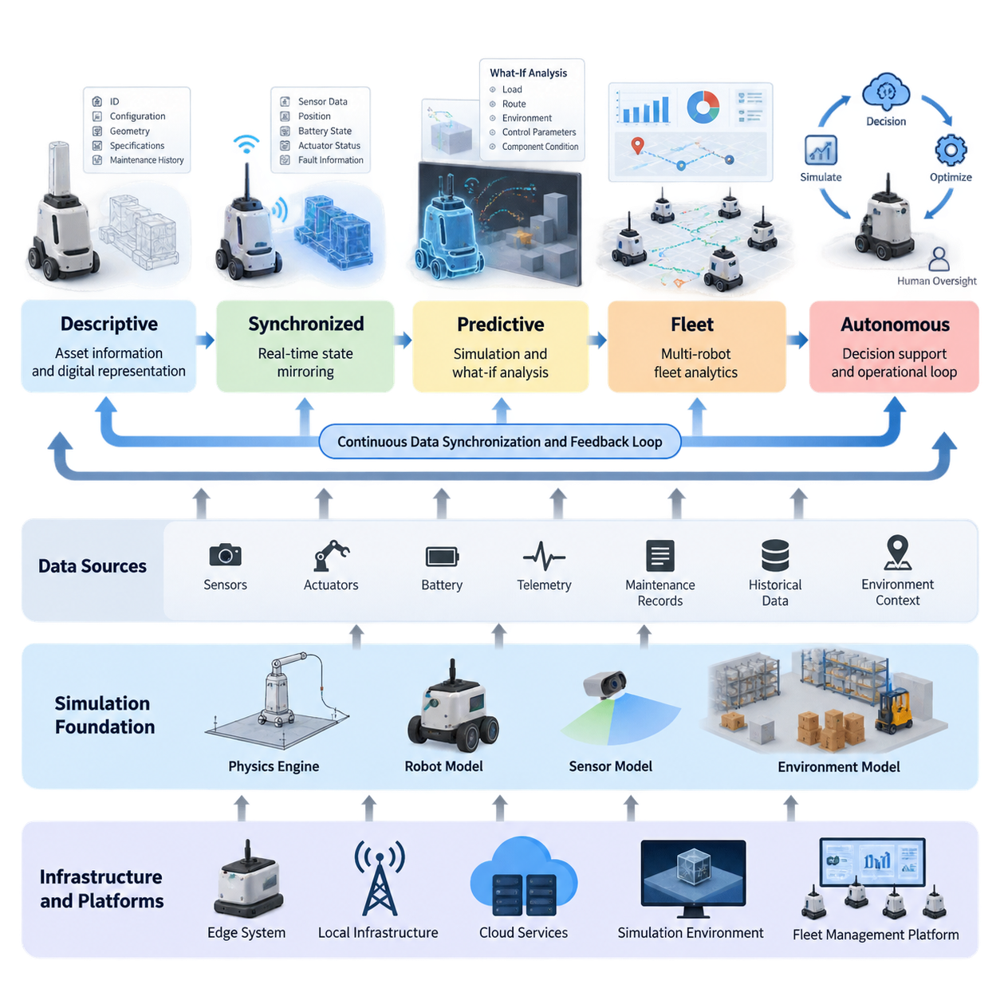
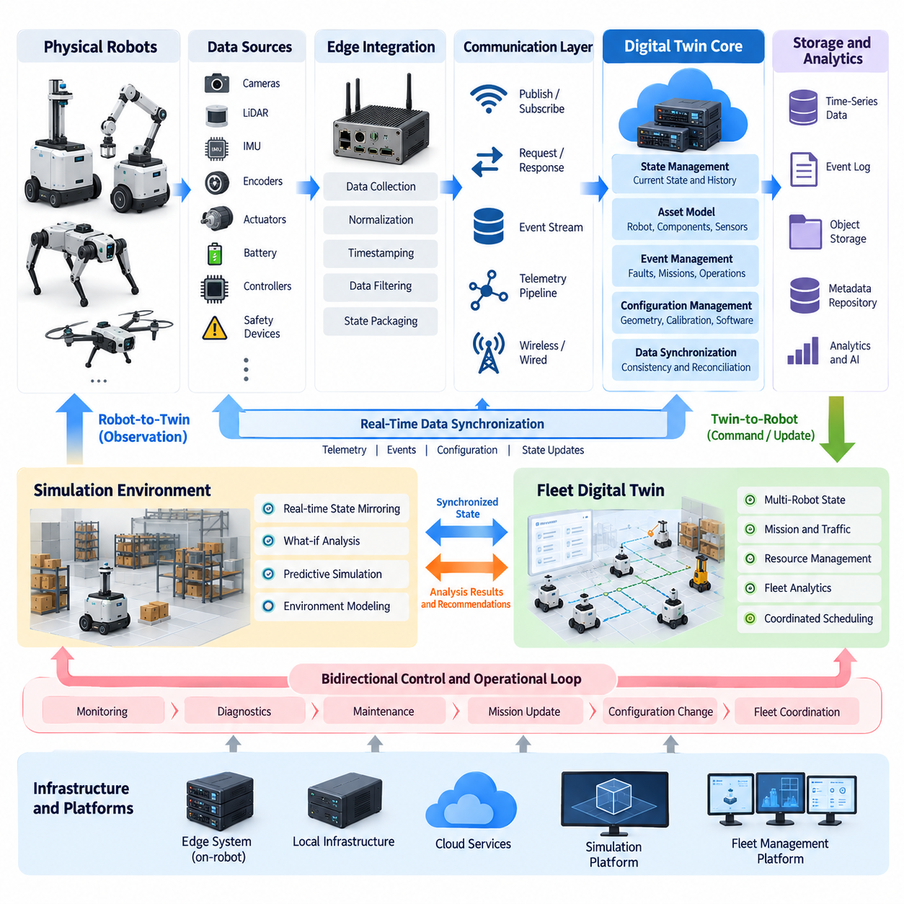
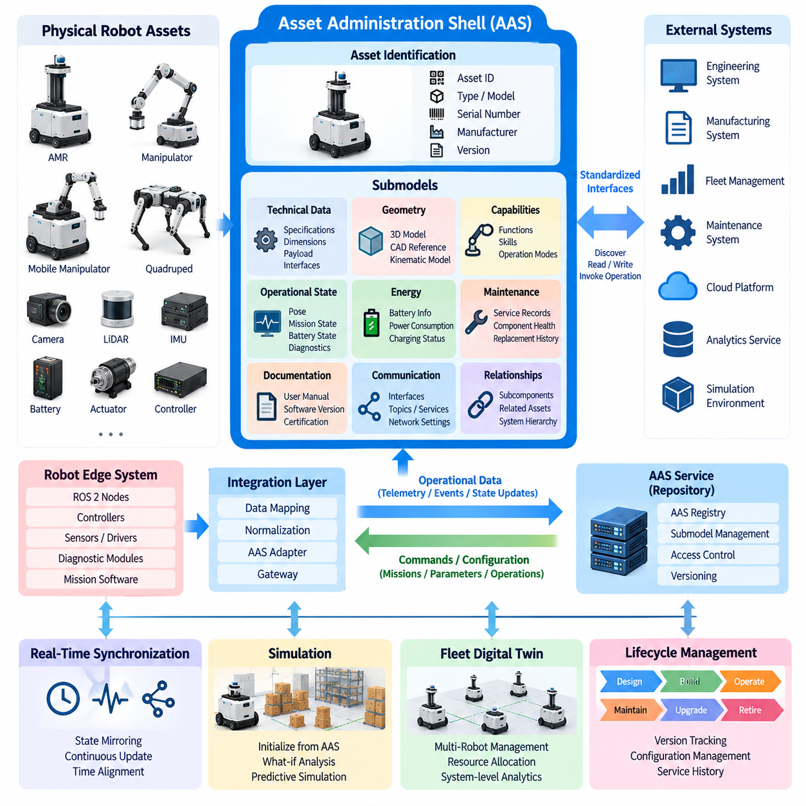
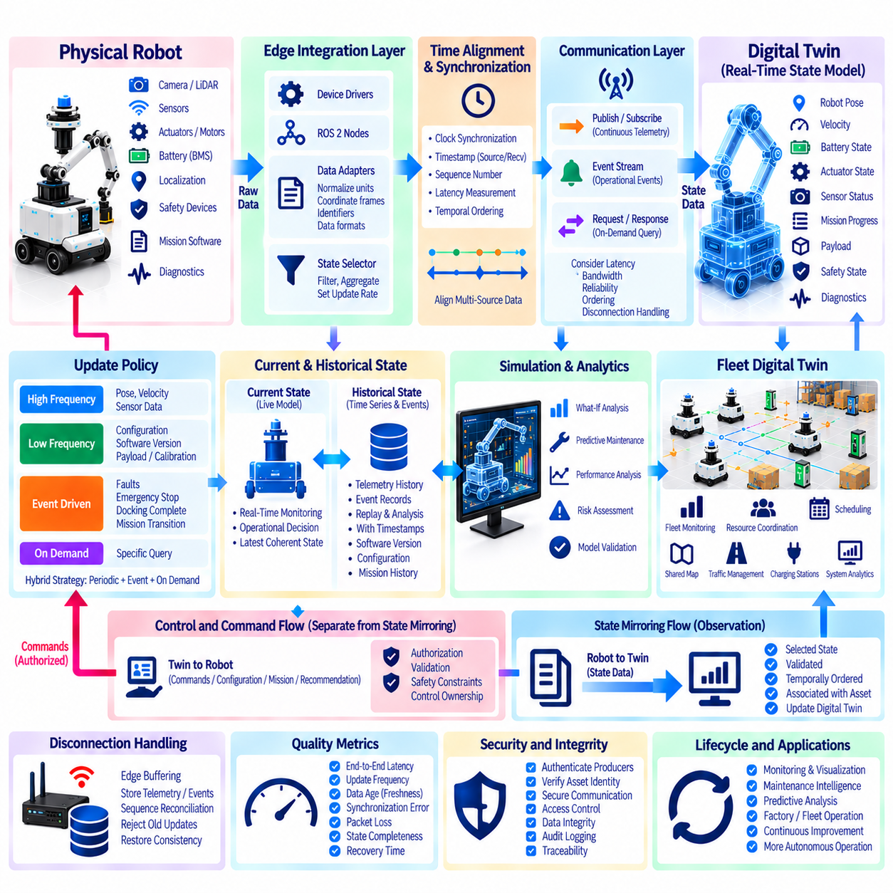
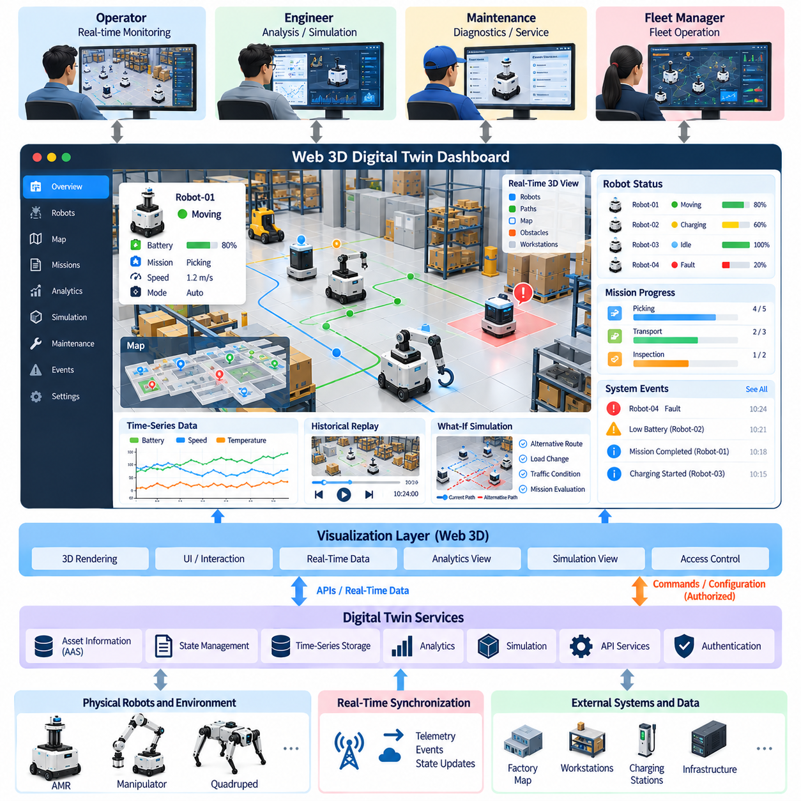
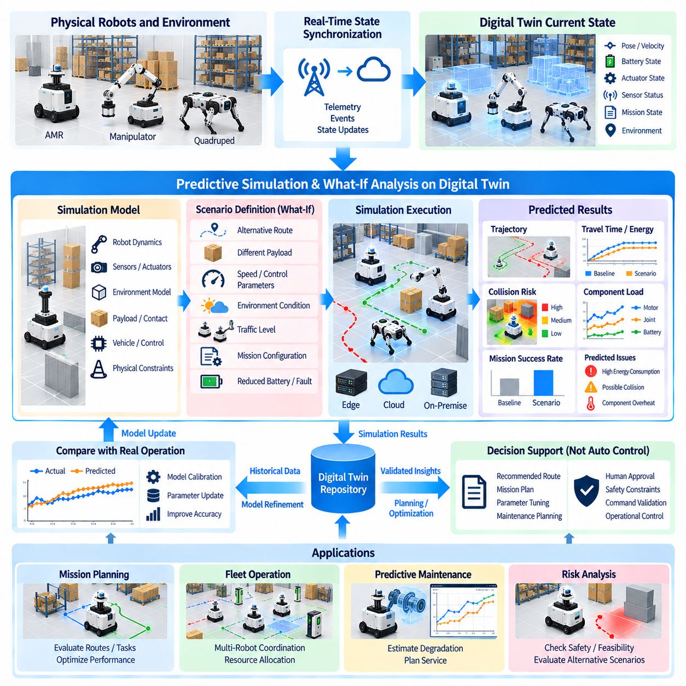
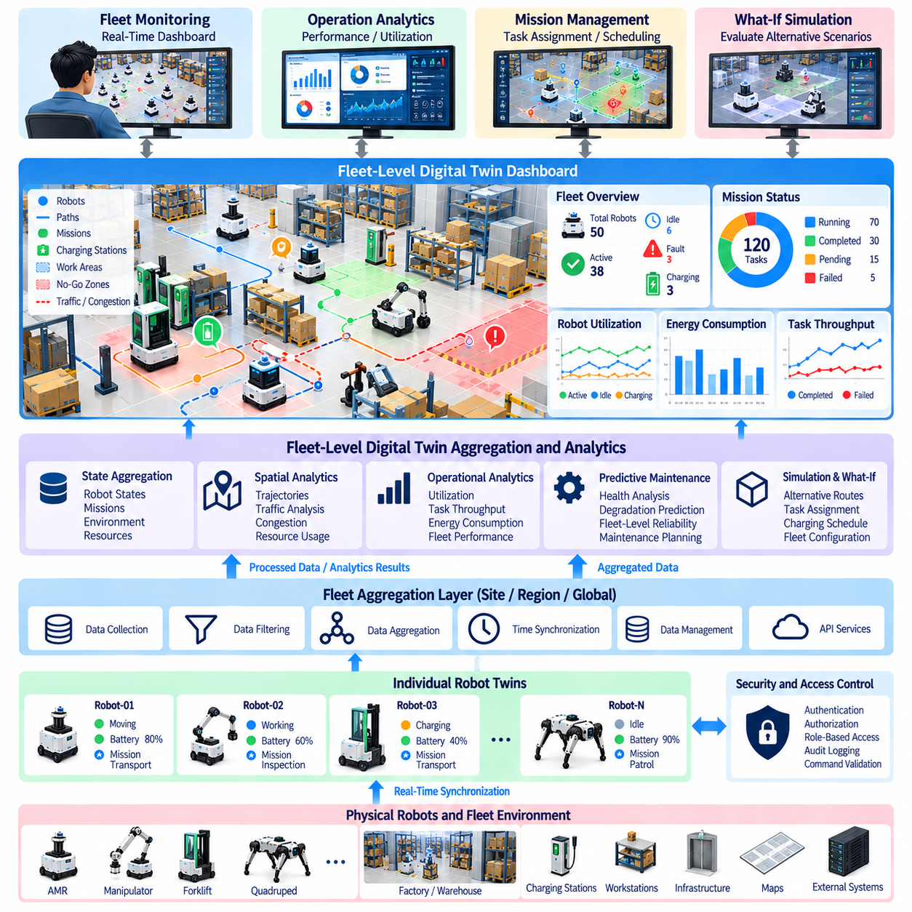
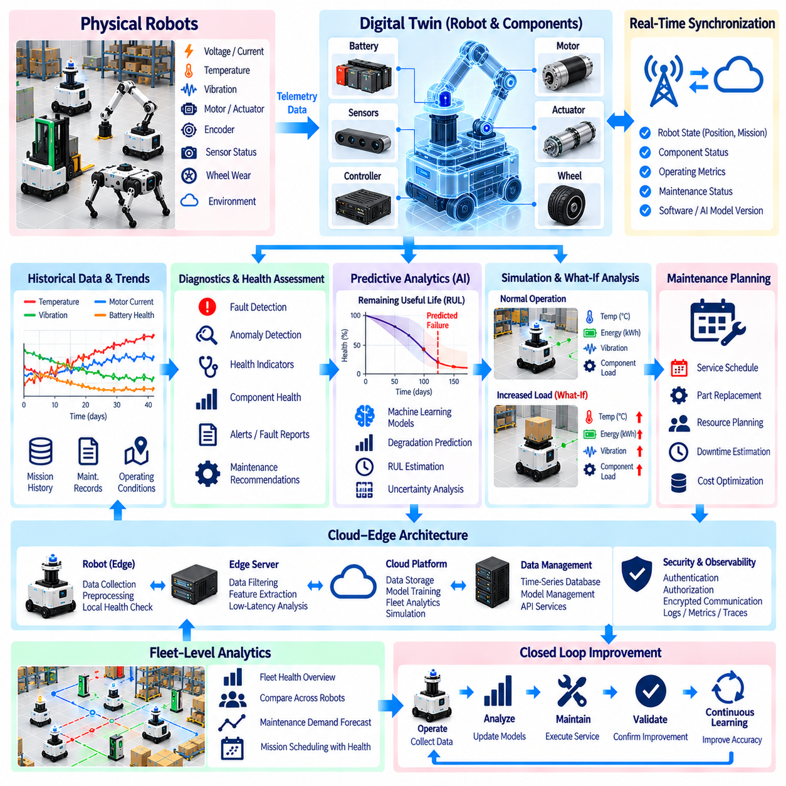
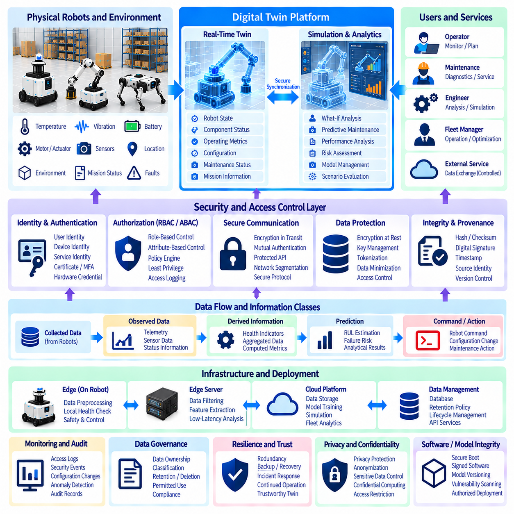
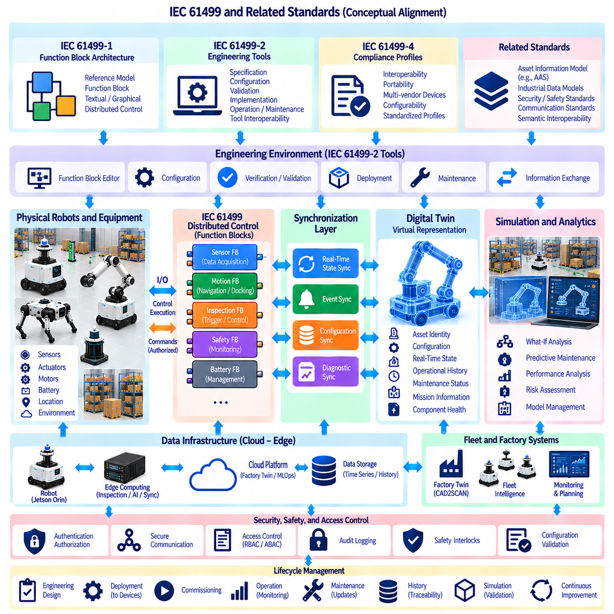

**Volume 11. Simulation and Digital Twin**

# Chapter 08. Digital Twin Architecture

## 08.01. Digital Twin Maturity Levels Descriptive to Autonomous

{width="7.268055555555556in" height="7.268055555555556in"}

A digital twin is not simply a three-dimensional model of a physical robot or facility. It is a continuously connected digital representation that describes the identity, configuration, state, behavior, and operational context of a physical asset. Its value increases as the relationship between the physical system and its digital counterpart becomes more complete and more interactive. In robotics, this connection can extend from basic visualization to real-time state mirroring, predictive simulation, fleet analytics, and eventually autonomous decision support. This maturity perspective provides a useful framework for understanding how digital twins evolve.

The first level can be described as a descriptive digital twin. At this stage, the digital representation primarily records and presents information about the physical system. Robot specifications, component identities, geometric models, configuration parameters, maintenance records, and historical operating data can be organized into a common digital representation. The twin answers questions such as what the asset is, how it is configured, and what information has previously been recorded. However, it does not necessarily maintain a live connection with the physical system or continuously interpret its operational condition.

The next level introduces synchronized operational information, transforming the twin from a static description into a dynamic representation. Sensor measurements, robot position, battery state, actuator status, fault information, and other telemetry can be transferred from the physical robot to the digital environment. Time synchronization becomes important because the usefulness of a twin depends not only on the values being correct but also on knowing when those values were observed. Real-time state mirroring therefore establishes the foundation for monitoring robots through their digital counterparts.

At a predictive level, the digital twin begins to combine live operational data with simulation models and historical information. Instead of merely showing that a motor temperature is increasing, the twin can provide a computational environment in which alternative operating conditions can be examined. What-if analysis can evaluate possible changes in load, route, environment, control parameters, or component condition before those changes are applied to the physical robot. This creates a bridge between simulation and operation, allowing the digital twin to become an engineering tool rather than only a monitoring interface.

A more advanced maturity level incorporates predictive analytics and condition-based reasoning. Historical telemetry, simulated behavior, maintenance records, and current sensor measurements can be analyzed together to identify patterns associated with degradation or abnormal operation. For example, changes in vibration, temperature, current consumption, or operating cycles may become inputs to predictive-maintenance models. The digital twin can consequently support maintenance planning by estimating when an asset should be inspected or serviced, while retaining the distinction between measured observations, model predictions, and maintenance decisions.

At the fleet level, the concept expands from an individual robot twin to an aggregated digital representation of many robots operating within a shared environment. Individual states can be combined with task assignments, spatial information, traffic conditions, battery status, mission history, and operational performance. This enables analysis across the fleet rather than examining robots independently. A fleet digital twin can therefore provide a common operational context for identifying system-level patterns, comparing robot behavior, analyzing utilization, and understanding how individual asset conditions affect overall fleet performance.

The autonomous maturity level introduces a closed or partially closed feedback relationship between the digital environment and the physical system. The twin can evaluate current conditions, simulate possible actions, compare predicted outcomes, and provide recommendations or control inputs to the operational system. In a robotics application, this may involve selecting alternative routes, adjusting mission priorities, changing operating parameters, or initiating maintenance workflows. Autonomy should not be interpreted as unrestricted automatic control; safety constraints, authorization mechanisms, validation procedures, and human oversight remain architectural requirements.

This maturity progression also depends on the fidelity of the underlying simulation. A digital twin intended only for visualization may require relatively limited physical detail, whereas predictive applications require increasingly accurate representations of robot dynamics, sensors, actuators, environments, and timing behavior. The simulation foundation therefore connects directly with physics engines, robot models, sensor models, and environmental models developed elsewhere in the simulation architecture. Higher twin maturity does not automatically require maximum simulation fidelity; the appropriate fidelity should be determined by the decisions and analyses the twin must support.

Data synchronization forms another fundamental architectural dimension. A useful twin must establish consistent identities for physical assets, define the meaning and units of data, preserve timestamps, manage communication delays, and distinguish current state from historical state. As the architecture becomes more sophisticated, synchronization may occur between robot edge systems, local infrastructure, cloud services, simulation environments, and fleet-management platforms. The digital twin should therefore be treated as a distributed information architecture rather than as a single visualization application.

The final maturity perspective is therefore better understood as a progression of capabilities rather than a rigid sequence of technologies. A descriptive twin establishes digital identity and information structure; a synchronized twin represents current operational state; a predictive twin uses simulation and analytics to evaluate future conditions; a fleet twin coordinates information across multiple assets; and an autonomous twin can participate in decision and operational loops under defined constraints. This progression allows organizations to begin with practical monitoring capabilities while establishing an architecture that can gradually support predictive simulation, maintenance, fleet intelligence, and increasingly autonomous operation.

## 08.02. Digital Twin Data Synchronization Architecture [w/Code]

{width="7.268055555555556in" height="7.268055555555556in"}

A digital twin data synchronization architecture establishes the continuous information relationship between a physical asset and its digital counterpart. In robotics, synchronization must capture not only geometry or configuration but also position, velocity, battery condition, actuator states, sensor observations, mission status, faults, and environmental context. The architecture therefore acts as the operational data backbone that keeps the digital representation consistent with the evolving state of the real robot.

Synchronization begins at the physical asset, where sensors, motor controllers, battery management systems, localization modules, safety devices, and application software generate heterogeneous data streams. These sources operate at different frequencies and may use different interfaces, coordinate systems, units, and timestamps. A synchronization architecture must normalize these differences before the information becomes meaningful to the twin, while preserving enough source metadata to trace where and when each observation originated.

An edge integration layer commonly provides the first synchronization boundary. Robot middleware, device drivers, gateways, or dedicated edge services collect raw information and transform it into standardized state representations. High-frequency control signals may remain entirely inside the robot, while selected operational states are exported to the twin. This separation prevents the digital twin infrastructure from interfering with deterministic control loops while still providing sufficient information for monitoring, simulation, diagnostics, and fleet-level analysis.

Time is a fundamental dimension of synchronization. Sensor observations and robot states become ambiguous when their temporal relationships are unknown, particularly when cameras, LiDAR, IMUs, encoders, controllers, and external infrastructure operate independently. Each synchronized data object should therefore contain an appropriate timestamp and, where necessary, information about acquisition time, processing time, and transmission time. Clock synchronization and timestamp provenance allow the twin to reconstruct a coherent sequence of physical events.

The communication layer transports state information between robots, edge infrastructure, digital twin services, simulation environments, and fleet platforms. Depending on system requirements, communication may use publish-subscribe messaging, request-response interfaces, event streams, or persistent telemetry pipelines. Different channels can be assigned according to latency, reliability, bandwidth, and persistence requirements. The architecture should avoid assuming that every data item requires identical delivery behavior because synchronization requirements vary considerably across data classes.

State management converts incoming data streams into a coherent digital representation of the asset. Instead of treating every telemetry message as an isolated event, the twin maintains an evolving state containing the latest validated values and their relationships. Robot pose, operating mode, mission state, battery level, component health, payload condition, and environmental observations may become part of this state model. Historical versions can also be retained so that previous conditions can be reconstructed for diagnostics, analytics, or simulation.

Synchronization should distinguish between telemetry, events, configuration, and commands. Telemetry represents continuously changing measurements such as temperature or velocity, while events represent discrete occurrences such as faults, docking completion, or emergency stops. Configuration describes relatively persistent properties such as robot geometry or sensor calibration. Commands flow toward the physical system and may modify its behavior. Separating these information classes improves consistency and prevents operational commands from being confused with observed physical state.

A robust architecture must also tolerate communication delay, packet loss, temporary disconnection, duplicated messages, and out-of-order delivery. Mobile robots frequently move through environments where wireless connectivity varies, making perfect continuous synchronization unrealistic. Edge buffering, sequence identifiers, timestamps, acknowledgments, retry policies, and state reconciliation can preserve consistency during degraded connectivity. When communication is restored, the twin should determine which information remains valid rather than blindly replaying obsolete state.

Bidirectional synchronization extends the architecture beyond simple robot-to-twin monitoring. The physical robot supplies observations to the digital environment, while validated information can also flow from the twin toward the robot or its supervisory systems. Examples include updated missions, configuration changes, maintenance instructions, simulation-derived recommendations, or fleet coordination decisions. However, bidirectional connectivity requires explicit authorization and safety boundaries because a digital representation capable of influencing physical behavior becomes part of the operational control architecture.

Simulation becomes especially valuable when synchronized state can initialize or continuously update a virtual environment. The current pose, payload, battery condition, actuator status, environmental state, and mission context can be transferred into a simulation to reproduce the operational situation. The twin may then execute what-if experiments or predict future behavior without disturbing the physical robot. This capability connects real-time state mirroring with predictive simulation, which is a central progression within the digital twin architecture.

Fleet-level synchronization introduces another hierarchy. Each robot maintains its own asset state, while a higher-level aggregation service combines robot states with shared maps, missions, traffic information, charging resources, infrastructure status, and operational constraints. The resulting fleet twin represents relationships among multiple physical assets rather than simply storing independent robot records. This enables fleet analytics, coordinated scheduling, congestion analysis, resource allocation, and system-level operational monitoring.

Data storage should reflect the different temporal characteristics of synchronized information. Current state may require low-latency access, high-frequency telemetry may be stored in time-series systems, events may be preserved in event logs, and large sensor outputs may require object storage. Configuration and asset metadata can reside in structured repositories. Maintaining links among these stores allows engineers to reconstruct not only what happened but also which configuration, software version, mission, and environmental conditions existed when an event occurred.

Data integrity and access control become increasingly important as synchronization becomes bidirectional and distributed. The architecture should identify trusted data producers, authenticate communicating components, control which services can read or modify twin state, and preserve records of significant changes. Commands capable of affecting physical robots require stronger authorization than ordinary monitoring data. These mechanisms become particularly important when digital twin services span robot edge computers, local infrastructure, cloud systems, simulation environments, and fleet-management platforms.

The resulting synchronization architecture can therefore be understood as a continuous pipeline linking physical state acquisition, edge integration, temporal alignment, communication, state management, storage, simulation, analytics, and controlled feedback. Its objective is not to copy every physical signal into a digital system, but to maintain an accurate, timely, traceable, and operationally meaningful representation. When these mechanisms are designed together, the digital twin becomes a dependable foundation for real-time monitoring, predictive analysis, fleet intelligence, maintenance, and progressively autonomous robotic operation.

## 08.03. Asset Administration Shell AAS for Robot Twins [w/Code]

{width="7.268055555555556in" height="7.268055555555556in"}

The Asset Administration Shell, commonly abbreviated as AAS, provides a standardized digital representation of an industrial asset and offers a structured foundation for building interoperable robot twins. Instead of defining every digital twin with proprietary data models and interfaces, AAS organizes information about an asset into a consistent machine-readable structure. For robots, the represented asset may be an AMR, manipulator, mobile manipulator, sensor module, battery, actuator, or another identifiable physical or logical component.

An AAS can be understood as a digital envelope surrounding an asset. The physical robot remains the operational entity, while its AAS contains structured information that software systems can discover, interpret, exchange, and update. This separation is important because the lifecycle of digital information may differ from the lifecycle of the physical machine. Engineering data can exist before deployment, operational information evolves during service, and maintenance or historical records may remain useful after individual hardware components have been replaced.

The information inside an AAS is organized into submodels. Each submodel represents a particular aspect of the asset, such as identification, technical specifications, geometry, capabilities, operational state, energy information, maintenance, documentation, or communication interfaces. A robot twin can therefore be composed from multiple domain-specific information structures instead of one monolithic data object. This modular organization allows different engineering and operational systems to use only the portions of the digital representation that are relevant to their responsibilities.

Submodels contain structured elements representing properties, collections, references, files, relationships, operations, and other information associated with the asset. For a mobile robot, properties might describe dimensions, payload capacity, maximum velocity, battery capacity, sensor configuration, or software version. Operational submodels can expose current mission state, localization status, charging condition, or diagnostic information. The important architectural principle is that these values are given explicit semantic and structural context rather than being exchanged as unrelated telemetry fields.

Identification is fundamental when AAS is applied to robot twins. A fleet may contain many robots with similar mechanical configurations but different serial numbers, calibration parameters, installed sensors, software versions, maintenance histories, and operating conditions. Each asset and its associated digital representation therefore require stable identifiers. References can then connect the robot AAS to subcomponents, documentation, external data, or other digital assets, creating a navigable information structure across the robotic system.

Semantic interoperability is one of the major motivations for using AAS. Two systems may technically exchange a numeric value but still interpret it differently if its meaning, unit, context, or definition is unclear. A structured semantic model allows information consumers to understand what a property represents rather than relying only on application-specific field names. This becomes particularly important when robot manufacturers, fleet platforms, factory systems, simulation environments, maintenance applications, and analytics services must exchange asset information across organizational boundaries.

For a robot digital twin, static and dynamic information should be distinguished. Static or slowly changing information includes mechanical dimensions, mass, payload limits, component types, interface definitions, and nominal specifications. Dynamic information includes pose, battery state, operating mode, mission status, fault condition, or component health. AAS can provide the structured asset model around these information classes, while real-time synchronization mechanisms continuously update operational values from the physical robot into the digital representation.

The AAS should therefore not be interpreted as a replacement for robot middleware, real-time control networks, or high-frequency telemetry transport. Motor control, safety loops, sensor acquisition, and deterministic motion control may continue to operate through dedicated robot software and communication mechanisms. The AAS operates at a different architectural level by providing standardized asset information and interfaces that higher-level systems can understand. This distinction prevents digital-twin interoperability mechanisms from being unnecessarily inserted into latency-critical control paths.

A practical robot twin architecture can connect the robot edge system to an AAS service through an integration layer. ROS 2 nodes, controllers, battery systems, diagnostic modules, and mission software can provide selected states to adapters or gateways, which map robot-specific data into appropriate AAS submodels. In the opposite direction, authorized applications may interact with exposed operations or configuration information. This mapping layer separates internal robot implementation details from the standardized representation presented to external systems.

AAS becomes particularly useful when a robot contains many independently managed components. A mobile manipulator, for example, may combine a mobile base, robotic arm, gripper, cameras, LiDAR, safety scanners, batteries, and computing units. These components can be represented as related assets with their own information structures while remaining associated with the complete robot system. Such composition supports component replacement, configuration tracking, maintenance analysis, and lifecycle management without treating the entire robot as an indivisible digital object.

The relationship between AAS and simulation is also important for digital twins. Structured asset information can provide simulation systems with robot configuration, geometry references, component characteristics, calibration data, or operating parameters. Conversely, simulation results can be associated with the relevant asset or operational context. A digital twin can therefore connect standardized asset descriptions with the simulation foundation, real-time state mirroring, and predictive analysis functions defined elsewhere in the architecture.

At fleet scale, AAS can provide a consistent representation for heterogeneous robots and supporting infrastructure. Individual robot twins may expose common categories of information even when their hardware and internal software differ. Fleet-management systems can discover assets, inspect capabilities, identify configuration differences, access health information, and associate robots with chargers, workstations, tools, or other resources. Standardized representations reduce the amount of custom integration required whenever a new asset type enters the operational environment.

Lifecycle management further extends the value of the AAS model. A robot evolves from engineering and manufacturing through commissioning, operation, maintenance, upgrades, and eventual retirement. Different submodels can preserve information relevant to these stages, including technical documentation, configuration versions, service records, and operational characteristics. When hardware or software changes, the digital representation can record the updated configuration so that later diagnostics and analytics can be associated with the correct version of the physical system.

Security and governance remain necessary because an AAS may expose valuable operational and engineering information. Identity management, authentication, authorization, access policies, and audit mechanisms should determine which systems can discover, read, modify, or invoke elements of the digital representation. Read-only technical specifications require different protection from configuration changes or operations capable of influencing a robot. These controls become increasingly significant when robot twins are accessible across edge, factory, enterprise, and cloud environments.

Within the overall digital twin architecture, AAS therefore functions as a standardized information and interoperability layer rather than the complete twin by itself. Real-time synchronization supplies current physical state, simulation predicts possible behavior, storage preserves historical information, analytics derives operational knowledge, and fleet systems coordinate multiple assets. AAS provides a structured way to identify and describe those assets and expose their information consistently, enabling robot twins to evolve from isolated proprietary representations toward interoperable components of larger industrial digital ecosystems.

## 08.04. Real Time State Mirroring Robot to Digital Twin [w/Code]

{width="7.268055555555556in" height="7.268055555555556in"}

Real-time state mirroring is the process of continuously reproducing the operational state of a physical robot inside its digital twin with sufficient temporal accuracy and semantic consistency. The mirrored representation may include robot pose, velocity, battery condition, actuator state, sensor status, mission progress, payload information, safety state, and diagnostic conditions. Unlike a static digital model, the twin evolves as the physical robot operates, creating a continuously updated digital view of the real system.

The mirroring process begins inside the physical robot, where sensors, controllers, localization modules, battery management systems, safety devices, and mission software generate state information at different rates. A camera or LiDAR may generate high-bandwidth observations, while battery temperature or maintenance counters change much more slowly. The architecture must therefore determine which information should be mirrored, at what frequency, and with what level of detail rather than transferring every internal signal without discrimination.

An edge integration layer converts heterogeneous robot data into a coherent representation suitable for the digital twin. Device drivers, ROS 2 nodes, controllers, diagnostic modules, and application software may expose information through different message structures and interfaces. Adapters normalize units, coordinate frames, identifiers, and data formats before packaging selected states for transmission. This abstraction separates the internal implementation of the robot from the representation consumed by digital-twin services.

Time alignment is essential because a digital twin must represent not only what happened but also when it happened. Robot pose, velocity, sensor observations, actuator feedback, and mission events may originate from independent clocks and processing pipelines. Accurate timestamps allow the twin to correlate these observations and reconstruct a consistent operational state. Clock synchronization, timestamp provenance, sequence numbers, and latency measurements help distinguish actual physical changes from artifacts introduced by processing or communication delays.

Not every mirrored variable requires the same update policy. Motion states such as pose and velocity may require frequent updates, whereas configuration, software version, payload limits, or calibration parameters change infrequently. Event-driven updates are appropriate for faults, emergency stops, docking completion, or mission transitions. A hybrid synchronization strategy combining periodic telemetry, event-triggered updates, and on-demand queries reduces unnecessary network traffic while maintaining the information needed by the digital twin.

Communication transports mirrored states from the robot or edge gateway to the digital-twin platform. Publish-subscribe mechanisms are well suited to continuous telemetry, while event streams can represent discrete operational changes and request-response interfaces can retrieve specific information. The communication architecture must consider latency, bandwidth, reliability, ordering, and temporary disconnection. Real-time mirroring should therefore be understood as bounded and measurable synchronization rather than an assumption of mathematically instantaneous duplication.

The digital twin maintains a current-state model after receiving robot data. Incoming messages are validated, temporally ordered, and associated with the correct asset before updating the corresponding digital representation. The state model can contain robot pose, operating mode, battery level, mission status, component health, faults, and environmental context. Maintaining the latest coherent state provides applications with a stable representation instead of forcing every consumer to reconstruct robot condition independently from raw telemetry streams.

Historical state should be maintained separately from the current-state representation. Current state supports monitoring and operational decisions, while time-series telemetry and event histories allow previous robot conditions to be reconstructed. Engineers can examine how battery state, localization quality, motor temperature, mission progress, or diagnostic conditions changed before a failure. Linking historical states with timestamps, software versions, configurations, and missions transforms state mirroring into a foundation for traceability and operational analysis.

Connectivity interruptions are unavoidable for mobile robots operating through wireless networks. When communication is temporarily unavailable, the robot should continue performing safety-critical and real-time functions independently of the remote twin. Edge buffering can preserve selected telemetry and events until communication becomes available again. After reconnection, sequence identifiers and timestamps allow the synchronization service to reconcile states, reject obsolete updates, and restore consistency without incorrectly treating delayed information as the current physical condition.

Mirroring can also connect the current robot state directly to a simulation environment. The digital twin may initialize a virtual robot using the physical robot\'s pose, velocity, payload, battery condition, actuator status, mission state, and surrounding environmental information. Simulation can then evaluate possible future states or alternative operating conditions. This creates the transition from descriptive monitoring toward predictive digital twins in which synchronized operational data becomes the starting condition for what-if analysis.

The relationship between mirroring and control must remain architecturally explicit. Robot-to-twin synchronization primarily represents observation, while twin-to-robot communication can introduce commands, configuration updates, mission changes, or recommendations. These two directions should not be treated as equivalent data flows. Information capable of changing physical behavior requires authorization, validation, safety constraints, and clearly defined control ownership so that digital-twin functionality does not bypass the robot\'s safety and real-time control architecture.

For fleets, state mirroring scales from one robot to many synchronized asset representations. Each robot contributes its current pose, mission, battery condition, health, and availability to a fleet-level digital twin. Shared maps, traffic conditions, charging resources, workstations, and infrastructure states can then be combined with individual robot states. The resulting representation enables fleet monitoring, resource coordination, congestion analysis, scheduling, and system-level analytics based on the current operational condition of multiple robots.

The quality of real-time mirroring can be evaluated through measurable properties such as end-to-end latency, update frequency, data age, synchronization error, packet loss, state completeness, and recovery time after disconnection. A twin displaying a robot position several seconds late may appear operational while being unsuitable for time-sensitive analysis. Consequently, freshness and confidence should accompany important state information so downstream applications can determine whether the mirrored value is sufficiently current and reliable for their intended purpose.

Security and integrity are equally important because mirrored state may influence monitoring, maintenance, simulation, and operational decisions. The architecture should authenticate data producers, verify asset identity, protect communication channels, control access to state information, and maintain traceable records of significant changes. Incorrect or manipulated state data can cause the digital representation to diverge from physical reality, undermining the fundamental assumption on which digital-twin applications depend.

Real-time state mirroring therefore forms the operational bridge between physical robots and their digital twins. Its purpose is not merely to stream sensor data but to maintain a temporally aligned, semantically meaningful, traceable, and resilient representation of physical operation. When combined with historical storage, simulation, analytics, fleet aggregation, and controlled feedback, state mirroring enables the digital twin to progress from visualization toward predictive analysis, maintenance intelligence, coordinated fleet operation, and increasingly autonomous robotic systems.

## 08.05. Digital Twin Visualization Web 3D Dashboard [w/Code]

{width="7.268055555555556in" height="7.268055555555556in"}

A digital twin visualization system provides a web-based interface through which the operational state of physical robots and their digital representations can be observed, explored, and analyzed. Unlike a conventional monitoring screen that primarily presents numerical telemetry, a digital twin dashboard combines three-dimensional scenes, robot states, spatial information, alerts, historical data, and operational context into a unified interface. The objective is to make complex digital-twin information understandable while preserving the connection between the physical system and its digital representation.

The visualization layer normally sits above the digital twin core and consumes structured asset information, synchronized state data, events, and analytical results. The dashboard should not become the primary source of truth for robot state; instead, it acts as a presentation and interaction layer over authoritative digital-twin services. This separation allows the visualization interface to evolve independently from robot middleware, synchronization services, databases, and simulation systems. Multiple dashboards can therefore consume the same twin data for operators, engineers, maintenance personnel, and fleet managers.

A Web 3D environment represents robots, equipment, buildings, work areas, maps, obstacles, and other relevant assets within a spatial scene. Three-dimensional geometry can be derived from CAD models, simulation assets, map data, or simplified visualization models depending on the required level of detail. The visualization model does not necessarily need the same geometric fidelity used by physics simulation. Its purpose is to provide spatial understanding, so rendering complexity should be balanced against browser performance, network bandwidth, and the number of simultaneously displayed assets.

Real-time robot state can be overlaid directly onto the three-dimensional scene. Position, orientation, velocity, operating mode, battery condition, mission status, and fault information can be represented through robot markers, labels, icons, trajectories, status indicators, or contextual panels. When the physical robot moves, the corresponding digital representation should update according to the synchronized state received from the digital twin. This creates an intuitive visual connection between the actual robot and its virtual counterpart and makes state changes easier to interpret.

The dashboard should combine spatial visualization with structured operational information rather than relying exclusively on the 3D scene. A selected robot may expose detailed information such as asset identity, software version, battery status, sensor condition, actuator state, current mission, diagnostics, and recent events. Different information levels can be presented progressively so that an operator can first identify an abnormal robot and then inspect the detailed information responsible for the observed condition.

Temporal information is also important for digital-twin visualization. Operators may need to examine how robot state changed during a mission, when a fault occurred, or how a component condition evolved over time. Time-series graphs, event timelines, historical trajectories, and replay functions can connect current visualization with stored operational history. Such functions transform the dashboard from a live status display into an analysis interface that supports diagnosis and post-operation investigation.

Visualization can also provide access to simulation and what-if analysis. A current physical state may be transferred into a virtual environment, where alternative routes, operating conditions, loads, or mission configurations can be evaluated. The resulting predictions can be displayed alongside the current state without directly changing the physical robot. This separation allows users to compare observed behavior with simulated or predicted behavior and provides an interface between real-time digital-twin monitoring and predictive simulation.

A fleet dashboard extends the same concept from a single asset to many robots. Multiple robots can be displayed simultaneously on a shared map or three-dimensional environment, together with mission assignments, battery states, traffic conditions, charging resources, and fault conditions. Aggregated views can show fleet utilization, task progress, robot availability, and operational events, while individual robot views provide detailed inspection. This hierarchical visualization allows operators to move from fleet-level awareness to asset-level diagnosis without changing the underlying digital-twin architecture.

Web technologies are particularly useful because they can provide browser-based access without requiring a specialized visualization application on every operator workstation. A typical architecture may use a web client, a 3D rendering engine, backend APIs, real-time messaging services, digital-twin repositories, and authentication services. The browser receives only the information required for visualization and interaction, while computationally intensive processing, state management, analytics, and simulation remain on appropriate backend or edge infrastructure.

Performance becomes a major architectural consideration when the dashboard contains complex 3D scenes or large robot fleets. Geometry level of detail, instancing, visibility culling, texture management, update frequency, data compression, and selective state streaming can reduce rendering and communication costs. High-frequency internal robot data should not automatically be transmitted to every browser client. Instead, the visualization layer should receive an appropriate representation of the state according to the user\'s purpose and the required visual update rate.

The dashboard should distinguish between measured state, derived information, prediction, and user commands. A measured battery value represents an observation, while a health indicator may be calculated from multiple measurements. A predicted failure time is an analytical result rather than a direct physical measurement. Similarly, a recommended route is different from a command that has actually been issued to the robot. Clearly representing these distinctions prevents users from confusing physical observations with analytical interpretations or pending operational actions.

Interaction with the digital twin must also respect operational and security boundaries. Viewing a robot state generally requires less authority than changing configuration, updating a mission, or issuing an operational command. Therefore, visualization systems should integrate authentication, authorization, role-based access, audit logging, and command confirmation where appropriate. A Web 3D dashboard should remain a controlled interface to the digital-twin system rather than becoming an unrestricted pathway to physical robot control.

Visualization can further support maintenance and engineering workflows by linking physical components to their digital information. Selecting a robot component in the 3D representation may expose specifications, maintenance records, diagnostic measurements, replacement history, or associated documentation. When combined with standardized asset information such as an Asset Administration Shell, the dashboard can provide a visual entry point into structured asset data while maintaining separation between presentation and underlying information models.

A well-designed dashboard should therefore be organized around operational questions rather than around the technical structure of the database. An operator may need to know which robots require attention, where they are located, what missions they are executing, and whether any safety or communication problems exist. An engineer may instead need historical telemetry, sensor status, simulation comparisons, or detailed component information. The same digital-twin backend can support these different perspectives through role-specific views while maintaining a common underlying state representation.

The overall architecture can be viewed as a layered relationship connecting physical robots, real-time synchronization, digital-twin state management, historical storage, analytics and simulation, and the Web 3D visualization layer. Physical observations are synchronized into the twin, processed into meaningful state representations, and exposed through APIs or real-time data services. The visualization layer converts these representations into spatial scenes, dashboards, graphs, alerts, timelines, and interactive views. When commands or configuration changes are permitted, the reverse path is explicitly controlled through the appropriate operational interfaces.

The Web 3D digital-twin dashboard is therefore more than a graphical display. It provides a human-accessible representation of a continuously evolving cyber-physical system and connects spatial understanding with real-time state, historical evidence, simulation results, analytics, and fleet operations. When designed with clear data semantics, synchronization boundaries, scalable rendering, security controls, and separation between observation and control, it becomes an important operational interface for transforming digital-twin data into information that engineers and operators can directly use.

## 08.06. Predictive Simulation What If Analysis on DT [w/Code]

{width="7.268055555555556in" height="7.268055555555556in"}

Predictive simulation extends a digital twin from representing the current condition of a physical asset to estimating how that asset may behave under future or alternative conditions. The synchronized state of the physical robot provides the initial condition for a virtual experiment, while the simulation model represents robot dynamics, sensors, actuators, environment, payload, and operational constraints. The digital twin can therefore evaluate possible outcomes before changes are applied to the real system, connecting real-time state mirroring with predictive analysis.

The basic workflow begins by obtaining a validated snapshot of the physical system. Robot pose, velocity, battery state, actuator condition, payload, mission status, and environmental information can be transferred from the synchronized digital twin into a simulation environment. The simulation initializes a corresponding virtual robot and environment from this information. The closer the initial digital state is to the physical state, the more meaningful the resulting prediction becomes, although the simulation should still explicitly represent uncertainty and modeling limitations.

What-if analysis allows users to change selected conditions while keeping other variables controlled. A digital twin may examine alternative routes, different payloads, changed operating speeds, environmental conditions, traffic levels, control parameters, or mission configurations. Each scenario is executed in the virtual environment and its results are compared with the current or baseline condition. This approach allows engineers and operators to investigate possible consequences without exposing the physical robot to unnecessary risk.

Predictive simulation depends strongly on the quality of the underlying models. Robot geometry, mass properties, inertial parameters, actuator characteristics, contact behavior, sensor models, and environmental representations influence prediction accuracy. A highly detailed model is not automatically better for every application because excessive complexity can increase computational cost without improving the decision being evaluated. Model fidelity should therefore be selected according to the prediction objective, required accuracy, available computation, and time constraints.

The current state of the digital twin can also be used to establish scenario-specific initial conditions. For example, an AMR approaching a constrained passage can be represented with its current position, velocity, battery condition, payload, and surrounding obstacles. The simulation can then evaluate alternative trajectories or operating parameters. Similarly, a mobile manipulator can begin from its current joint configuration and payload state before evaluating different grasp or motion strategies. This creates a direct connection between operational data and predictive simulation.

Scenario generation is an important part of the architecture because useful prediction requires more than one hypothetical condition. A scenario can modify a single parameter or combine multiple changes. Load variation may be combined with terrain changes, reduced battery capacity, communication delay, or altered traffic conditions. The scenario definition should record which variables were changed from the baseline so that simulation results remain traceable and comparable. This enables systematic exploration rather than informal experimentation.

The simulation results should be represented as predictions rather than physical observations. Estimated travel time, predicted energy consumption, collision risk, actuator load, trajectory deviation, or component temperature are outputs of a computational model. They should therefore be associated with model versions, simulation parameters, initial conditions, and uncertainty information. Maintaining this distinction prevents users from interpreting a simulated outcome as though it were a directly measured property of the physical robot.

Comparison between predicted and observed behavior provides an important feedback mechanism. After a robot executes a real mission, measured telemetry can be compared with the corresponding simulation prediction. Differences may reveal inaccurate physical parameters, actuator characteristics, sensor models, environmental assumptions, or timing behavior. These discrepancies can then be used for system identification, model calibration, and refinement of the digital twin. In this way, real operation continuously contributes evidence for improving predictive capability.

Predictive simulation can support maintenance as well as mission planning. Current component conditions and historical telemetry can be incorporated into a virtual analysis to estimate how alternative operating patterns may affect future degradation. A digital twin can compare normal and increased-load scenarios, for example, to investigate their potential influence on temperature, energy consumption, vibration, or component utilization. Such results can support maintenance planning while keeping the final maintenance decision separate from the simulation prediction.

At fleet level, what-if analysis can evaluate interactions among multiple robots and shared resources. The digital twin can represent robot positions, missions, charging stations, traffic conditions, maps, and infrastructure simultaneously. Alternative task assignments, charging schedules, routes, or fleet configurations can then be simulated before implementation. This allows fleet-management systems to examine system-level consequences rather than optimizing each robot independently.

The architecture should separate simulation execution from operational control. A simulation may recommend a different route, mission sequence, configuration, or operating parameter, but the result should not automatically become a physical command unless the system has explicitly authorized such behavior. Safety constraints, command validation, authorization, and operational ownership remain necessary. This separation creates a controlled decision-support loop in which the digital twin can evaluate alternatives while the physical robot remains protected by its own real-time and safety architecture.

Computational requirements also influence predictive simulation design. Some what-if analyses can be completed in seconds, while high-fidelity physics or large-scale fleet simulations may require substantial computing resources. Edge systems can handle latency-sensitive or localized analysis, whereas cloud or on-premise clusters can execute larger scenario sets. Parallel simulation can further evaluate many alternatives simultaneously. The appropriate execution location should therefore depend on scenario complexity, response-time requirements, data locality, connectivity, and available computing capacity.

A mature predictive digital twin maintains a traceable relationship among the physical state, simulation model, scenario definition, simulation result, and subsequent real-world outcome. This allows engineers to determine not only what the model predicted but also which conditions produced the prediction and how closely the prediction corresponded to reality. Such traceability is essential when predictive results influence engineering decisions, maintenance planning, fleet operations, or autonomous behavior.

Predictive simulation and what-if analysis therefore transform the digital twin from a passive representation into an environment for evaluating possible futures. Real-time synchronization supplies the current state, simulation provides a virtual execution environment, scenario management defines alternative conditions, analytics evaluates the results, and controlled feedback connects validated conclusions to operational workflows. This architecture enables digital twins to support planning, diagnosis, optimization, predictive maintenance, and progressively more autonomous decision-making while preserving a clear distinction between physical measurements, computational predictions, and authorized actions.

## 08.07. Fleet Level Digital Twin Aggregation and Analytics [w/Code]

{width="7.268055555555556in" height="7.268055555555556in"}

A fleet-level digital twin extends the digital-twin concept from an individual physical asset to a coordinated digital representation of multiple robots and their shared operational environment. Instead of maintaining isolated robot states, the fleet twin aggregates information from individual robot twins together with missions, maps, traffic conditions, charging resources, infrastructure, and operational constraints. This creates a common system-level representation that can describe not only the condition of each robot but also the relationships and interactions among multiple assets.

Each physical robot contributes a continuously updated digital state to the fleet-level architecture. Position, velocity, battery condition, operating mode, mission status, faults, component health, payload state, and availability can be synchronized from individual robot twins. The aggregation layer associates these states with stable robot identities and maintains the relationship between individual assets and the overall fleet. This allows fleet applications to distinguish the condition of one robot from system-wide operational conditions without requiring every application to directly access raw robot telemetry.

Fleet aggregation also incorporates shared environmental and infrastructure information. A robot\'s operational condition cannot always be interpreted independently because its behavior may depend on map topology, traffic, charging-station availability, work areas, obstacles, communication coverage, or other robots occupying the same environment. The fleet twin therefore combines individual robot states with common spatial and operational context. This creates a system-level representation in which robot state and environmental state can be analyzed together.

A hierarchical architecture is useful for managing this information at scale. Individual robot twins maintain asset-specific state, while regional or site-level services aggregate multiple robots and shared resources. A higher fleet layer can then combine these groups into a broader operational representation. Such hierarchy reduces unnecessary data movement and allows information to be processed at an appropriate level. High-frequency robot control remains local, while fleet-level aggregation focuses on coordination, monitoring, analytics, planning, and system-wide optimization.

Data aggregation should preserve the temporal and semantic properties of the original information. A fleet dashboard may display the current location of hundreds of robots, but the underlying system must retain timestamps, asset identity, data source, and state validity. Events such as faults, mission completion, docking, or charging transitions should remain distinguishable from continuously changing telemetry. Preserving these relationships allows fleet analytics to determine not only what is happening across the fleet but also when and under which operational conditions it occurred.

Fleet analytics can transform aggregated states into higher-level operational indicators. Robot utilization, mission completion rate, idle time, charging frequency, energy consumption, fault frequency, travel distance, task throughput, and resource utilization can be derived from synchronized fleet data. These indicators provide a system-level view that is difficult to obtain by examining individual robots separately. Historical aggregation also enables comparisons across robots, missions, locations, time periods, and operating conditions.

Spatial analytics is particularly important for mobile robot fleets. The fleet twin can combine robot trajectories with maps, restricted areas, work zones, charging locations, and traffic conditions. Repeated trajectory patterns may reveal congestion or inefficient routes, while the spatial distribution of idle robots may indicate resource imbalance. By maintaining a shared spatial representation, the fleet twin can analyze interactions among robots rather than treating each robot as an independent operational entity.

Mission and task information can be integrated with fleet state to evaluate operational performance. A fleet may contain robots performing transportation, inspection, cleaning, security, or other missions simultaneously. The digital twin can associate each robot with its current task, priority, destination, progress, and resource requirements. Fleet analytics can then evaluate whether available robots and resources are sufficient for the current workload and identify conditions that may require rescheduling or reassignment.

Resource management becomes another important function at the fleet level. Charging stations, docking areas, workstations, elevators, tools, communication infrastructure, and other shared resources can be represented as digital assets within the same operational model. Their availability can be analyzed together with robot state and mission requirements. This enables the fleet twin to identify resource conflicts, estimate future demand, and support allocation decisions without requiring each robot to independently optimize access to shared infrastructure.

Fleet-level analytics can also support predictive maintenance by combining information across multiple robots of the same or related configurations. Maintenance records, component health indicators, operating cycles, temperature histories, vibration measurements, and energy consumption can be compared across assets. Patterns observed across the fleet may provide useful evidence for identifying abnormal behavior or potential degradation. The digital twin can therefore connect individual predictive-maintenance information with broader fleet-level reliability analysis.

The fleet twin can further interact with simulation and what-if analysis. A current fleet state can be used as the initial condition for a virtual representation containing multiple robots, shared resources, and the operating environment. Alternative task assignments, routes, charging schedules, fleet sizes, or traffic conditions can then be evaluated before changes are applied to the physical fleet. This creates a connection between fleet analytics and predictive simulation, allowing system-level consequences to be investigated rather than evaluating each robot independently.

Scalability becomes increasingly important as the number of robots grows. A fleet architecture must avoid sending every high-frequency sensor measurement from every robot to a central analytics system. Instead, edge systems can perform local filtering, aggregation, and feature extraction before transmitting information required by fleet services. The fleet layer can maintain current state at appropriate resolution while storing selected historical information for deeper analysis. This distributed approach reduces bandwidth and computational requirements while preserving the information necessary for fleet-level intelligence.

Data consistency and conflict management are also necessary because multiple systems may modify or report related information. A robot may report its current mission state while a fleet manager maintains a higher-level task assignment. Charging infrastructure may independently report station availability, while a scheduler maintains reservations. The architecture must define ownership, update rules, timestamps, and reconciliation mechanisms so that conflicting information does not produce an inconsistent fleet representation.

Security and access control become more complex at fleet scale because the digital twin may expose information about many physical assets simultaneously. Different users and services may require different levels of access to robot state, maintenance information, mission data, configuration, or fleet analytics. Authentication, authorization, role-based access, audit logging, and controlled interfaces should therefore be integrated into the fleet architecture. Operational commands should remain subject to explicit validation and control boundaries rather than being treated as ordinary analytics outputs.

A mature fleet-level digital twin maintains relationships among robots, missions, resources, environments, historical records, simulations, and analytical results. The value is not simply the quantity of aggregated data but the ability to preserve the relationships needed to understand fleet behavior. An individual robot fault, for example, may affect mission allocation, charging demand, task completion, and the utilization of other robots. Fleet analytics becomes more useful when these dependencies can be represented and analyzed together.

Fleet-level digital twin aggregation and analytics therefore form the system-level intelligence layer above individual robot twins. Individual assets provide synchronized operational states, the aggregation layer establishes a common fleet representation, analytics converts accumulated information into operational indicators, and simulation can evaluate alternative future conditions. Combined with appropriate synchronization, historical storage, security, and controlled operational interfaces, this architecture provides a foundation for fleet monitoring, resource coordination, performance analysis, predictive maintenance, mission planning, and increasingly sophisticated multi-robot operation.

## 08.08. Digital Twin for Predictive Maintenance PdM [w/Code]

{width="7.268055555555556in" height="7.268055555555556in"}

A digital twin for predictive maintenance creates a continuously updated digital representation of a robot and its major components so that current condition, historical behavior, and potential future degradation can be analyzed together. Instead of waiting for a component failure and responding afterward, the twin connects operational telemetry with diagnostic and predictive models to identify changes that may indicate developing problems. The resulting architecture links physical robots, synchronized state data, historical records, simulation, artificial intelligence, and maintenance workflows into a continuous condition-monitoring system.

The physical robot provides the primary evidence for maintenance analysis through continuously generated operational data. Battery current and voltage, temperature, motor current signatures, actuator behavior, encoder signals, vibration, wheel wear, sensor condition, computational load, communication quality, and environmental conditions can all contribute to health assessment. These measurements have different sampling rates and characteristics, so the digital-twin architecture must preserve timestamps, asset identity, operating context, and data provenance when collecting and synchronizing them.

Real-time digital-twin synchronization mirrors selected operational states from the physical robot into its virtual representation. Robot position, battery condition, mission progress, sensor observations, maintenance status, software versions, AI models, and operational metrics can be continuously synchronized while latency-sensitive control remains onboard. This separation is important because predictive-maintenance services require broad operational information but should not interfere with deterministic motion control, safety functions, or other real-time robot processes.

The twin combines current measurements with historical information to identify changes in component behavior. A single temperature or motor-current measurement may not indicate a problem by itself, but a persistent trend across many missions can reveal degradation. Time-series telemetry allows the system to compare recent behavior with historical baselines while considering operating hours, mission type, payload, terrain, ambient conditions, and other contextual factors. This creates a condition history that is more informative than isolated fault messages.

Diagnostic services provide the first layer of interpretation by detecting abnormal operating conditions and generating alerts, fault reports, maintenance recommendations, and health assessments. Predictive maintenance extends this capability through machine-learning models that estimate future component failures before operational breakdown occurs. Historical telemetry, vibration analysis, temperature trends, battery degradation, motor-current signatures, encoder behavior, wheel wear, and environmental conditions can be combined to estimate maintenance requirements. Maintenance planning consequently becomes increasingly data-driven rather than purely reactive.

Health indicators can be maintained for individual components as well as for the complete robot. Battery state-of-health, motor condition, actuator temperature, wheel condition, sensor reliability, computing resources, and communication quality may each have separate indicators. These indicators can then be combined into a broader robot health representation. The architecture should preserve the distinction between directly measured values, calculated health indicators, and model-based predictions so that maintenance personnel can understand the evidence supporting a particular assessment.

Predictive models can estimate degradation trajectories and remaining useful life when sufficient historical data is available. A model may learn relationships between operating cycles, temperature exposure, current signatures, vibration patterns, and subsequent component degradation. However, the prediction should remain associated with its model version, training data characteristics, input conditions, and uncertainty. A predicted failure time is therefore an analytical estimate rather than a guaranteed physical event, and maintenance decisions should consider both the prediction and the operational consequences of acting on it.

Simulation and physics-based models can strengthen predictive maintenance when real-world failure data is limited. High-fidelity models can represent battery thermal behavior and degradation, motor and drivetrain loads, electronics thermal behavior, structural response, and vibration. These models can be reduced into reduced-order models or parameterized surrogate models so that computationally expensive analysis can be incorporated into operational digital-twin workflows. This allows the system to evaluate component behavior under different loads and operating conditions without repeatedly executing the most expensive physical simulation.

A hybrid twin can combine physics, live telemetry, and artificial-intelligence correction. The physics model provides a structured representation of expected component behavior, real-time telemetry describes the current physical condition, and AI models can learn discrepancies or patterns that are difficult to capture through simplified physical models alone. This combination can support more adaptable health estimation while maintaining a connection between predictions and engineering parameters. The architecture can therefore use both physical knowledge and operational evidence rather than depending exclusively on a statistical model.

Predictive maintenance can also be connected to mission and fleet operation. If a robot shows increasing motor temperature or battery degradation, the fleet system can consider its health condition when assigning future missions, scheduling charging, or planning service intervals. Maintenance does not need to be treated as an isolated workshop activity; it can become part of the operational planning process. Fleet-level analytics can compare similar components across multiple robots, identify unusual behavior relative to the fleet, and provide broader evidence for reliability and maintenance planning.

A digital twin can support what-if maintenance analysis by evaluating alternative operating conditions before they are applied to physical assets. Increased payload, longer operating cycles, higher ambient temperature, different terrain, altered charging patterns, or reduced component efficiency can be introduced into a virtual scenario. The resulting changes in energy consumption, temperature, vibration, actuator load, or predicted degradation can then be examined. This provides a mechanism for evaluating how operational decisions may influence future maintenance requirements.

Maintenance traceability is another important function of the architecture. When a component is inspected, repaired, replaced, or recalibrated, the event should be associated with the relevant robot identity, component, operating history, software version, and previous health condition. The twin can then distinguish behavior before and after maintenance and determine whether the expected improvement actually occurred. This creates a closed learning loop in which maintenance outcomes become additional evidence for improving future diagnostic and predictive models.

Model management is necessary because predictive-maintenance models evolve as more operational data becomes available. Model versions, deployment histories, evaluation results, rollback capabilities, metadata, optimization configurations, and hardware-specific inference settings should be maintained systematically. Different robot fleets may temporarily use different validated model versions. Separating AI inference from deterministic robot-control software allows predictive-maintenance models to evolve without unnecessarily changing safety-critical control functions.

Cloud-edge architecture provides a practical deployment structure for predictive maintenance. Edge systems can preprocess high-volume telemetry and perform low-latency health checks near the robot, while centralized infrastructure can store long-term histories, train predictive models, perform fleet-level analytics, and execute computationally intensive digital-twin simulations. Cloud synchronization can transfer selected telemetry, maintenance records, mission histories, and analytical results while respecting bandwidth and cybersecurity requirements. This division balances immediate operational response with long-term learning.

Observability and cybersecurity must support the complete predictive-maintenance pipeline. Logs, metrics, traces, events, diagnostic records, telemetry, model outputs, and maintenance actions should remain traceable across distributed robot, edge, and cloud systems. Authentication, authorization, encrypted communication, software integrity, certificate management, and controlled API access protect both operational data and maintenance services. Reliable predictive maintenance depends not only on accurate models but also on trustworthy data and a secure information chain.

The overall architecture forms a continuous relationship between physical operation, digital-twin synchronization, health monitoring, predictive analytics, simulation, maintenance planning, and subsequent operational feedback. Physical telemetry provides evidence of actual condition, the digital twin organizes current and historical state, diagnostic and AI models estimate health and degradation, simulation evaluates alternative conditions, and maintenance actions generate new operational evidence. In this structure, predictive maintenance becomes an integrated capability of the digital twin rather than a separate maintenance application, supporting proactive service planning, improved asset availability, fleet-level reliability analysis, and continuous refinement of robot health intelligence.

## 08.09. Digital Twin Security Data Integrity Access Control

{width="7.268055555555556in" height="7.268055555555556in"}

Security for a digital twin must protect the complete information relationship between the physical robot, its digital representation, connected services, and operational users. A digital twin can contain asset identities, configuration data, real-time telemetry, maintenance records, simulation results, mission information, and analytical outputs. Because these data may influence engineering analysis and operational decisions, security cannot be limited to the network boundary. The architecture must protect confidentiality, integrity, availability, accountability, privacy, resilience, and trustworthiness across the complete digital-twin lifecycle.

Identity and access management forms the foundation of a secure digital-twin architecture. Users, robots, devices, services, applications, and AI agents should have distinguishable identities rather than relying on a shared account or generic system credential. Authentication establishes whether an entity is genuinely the identity it claims to be, while authorization determines what that identity is permitted to access or modify. Strong authentication, certificates, hardware-backed credentials, and role-based or attribute-based policies can provide progressively stronger protection according to the sensitivity of the operation.

Least-privilege access is particularly important because digital twins contain information with different levels of operational sensitivity. An operator may need to view robot status but should not automatically have permission to modify configuration. An analytics service may read historical telemetry without being allowed to issue robot commands. A maintenance application may access component information while remaining isolated from unrelated fleet data. Role-based access control, attribute-based access control, and policy engines can enforce these distinctions while maintaining auditable records of significant access and modification activities.

Data integrity is central to the reliability of a digital twin because the digital representation must remain consistent with the physical system. Telemetry, configuration records, maintenance information, simulation inputs, and analytical results should be protected against unauthorized modification, accidental corruption, duplication, or replay. Hashes and checksums can detect changes, while digital signatures can establish the authenticity and integrity of important data objects. Version control and immutable or append-oriented storage can further preserve a traceable history of critical state changes.

Timestamp provenance is also part of data integrity. A robot state without reliable temporal information may be interpreted incorrectly when multiple sensors, robots, edge services, and cloud systems are synchronized. Important data objects should retain acquisition time, processing time, transmission information, source identity, and sequence information when required. These attributes allow the system to determine whether a value is current, delayed, duplicated, or inconsistent with other observations. Temporal integrity is therefore closely connected to the trustworthiness of real-time digital-twin state.

Data protection must cover information both during transmission and while stored. Encryption in transit protects telemetry and control-related information moving between robots, edge systems, and backend services, while encryption at rest protects databases, logs, configuration records, and historical datasets. Sensitive information may additionally require tokenization, anonymization, minimization, or controlled aggregation. Key management and certificate lifecycle management should be handled systematically so that encryption does not depend on unmanaged credentials or manually distributed secrets.

Digital-twin communication should use authenticated and controlled interfaces. Mutual authentication can allow a robot and backend service to verify each other\'s identity before exchanging sensitive information. Secure protocols and protected APIs reduce the possibility of unauthorized access or manipulation of state information. Network segmentation can separate robot control networks, edge services, enterprise systems, simulation environments, and external services so that compromise of one segment does not automatically provide unrestricted access to the complete digital-twin infrastructure.

The digital twin should distinguish between observed data, derived information, predictions, and commands. A measured battery voltage is physical telemetry, while a health score is derived information and a remaining-useful-life estimate is a model-based prediction. A maintenance recommendation is an analytical output, whereas a robot command can directly affect physical behavior. Security policies should therefore apply different protection levels to these information classes. In particular, commands and configuration changes require stronger authorization, validation, logging, and operational control than ordinary read-only observations.

Data governance provides the rules for ownership, retention, classification, and permitted use of digital-twin information. Each important data object should have a defined source and ownership relationship, together with appropriate retention and deletion policies. Asset configuration, maintenance history, mission records, sensor telemetry, and simulation results may have different lifecycle requirements. Governance also helps establish which information can be shared between robots, fleet systems, enterprise applications, simulation platforms, and external services without losing control of sensitive operational information.

Integrity verification should extend to the models and software that process digital-twin data. A compromised analytics model, simulation model, robot software component, or AI model can produce apparently valid results from trusted input data. Model and software artifacts should therefore have controlled versions, provenance records, integrity verification, and authorized deployment processes. Secure boot, signed software, protected model repositories, dependency management, vulnerability scanning, and controlled updates can help maintain confidence in the computational components supporting the twin.

Monitoring and audit mechanisms provide continuous visibility into security-relevant behavior. Authentication events, authorization decisions, configuration changes, data-access patterns, unusual telemetry behavior, API activity, software changes, and operational commands can be recorded and correlated. Anomaly detection can identify behavior that differs from established operational patterns, while audit records provide evidence for investigating incidents. Monitoring should cover both cybersecurity events and deviations between the digital representation and the expected physical behavior.

A zero-trust approach is suitable for distributed digital-twin environments because robots, edge servers, cloud services, simulation systems, and operator applications should not automatically trust one another merely because they exist inside the same network. Each access request can be evaluated according to identity, device or service status, requested resource, operational context, and applicable policy. Continuous authentication and authorization, least privilege, segmentation, and explicit verification reduce the consequences of compromised credentials or devices and limit unnecessary lateral movement across the architecture.

Privacy and confidentiality become important when digital twins contain information related to people, facilities, operations, or sensitive environments. Camera-derived information, operator identities, access records, location histories, and facility information may require additional protection. Data minimization should limit collection to what is necessary for the intended function, while anonymization or controlled aggregation can reduce unnecessary exposure. Where appropriate, privacy-preserving computation and confidential execution environments can provide additional protection for sensitive analytical workloads.

Resilience is required because a digital twin may depend on many distributed components. Network interruption, service failure, corrupted data, compromised credentials, or backend unavailability should not automatically disable safety-critical robot functions. Edge systems can maintain essential local state and continue safety and real-time control independently of remote digital-twin services. Backup, recovery, redundant services, state reconciliation, secure update mechanisms, and incident-response procedures can restore the digital representation while preventing corrupted or obsolete information from becoming authoritative after recovery.

Access control becomes particularly important when the digital twin is connected to fleet-level operations. A fleet platform may access hundreds of robots, shared infrastructure, missions, maps, maintenance records, and operational analytics. Permissions should therefore be scoped not only by user role but, when necessary, by robot, site, asset class, data type, mission, or operation. A service authorized to inspect one fleet segment should not automatically gain access to unrelated assets. This hierarchical authorization model can reduce the impact of accidental or malicious misuse.

The security architecture should also maintain traceability across the complete digital-twin lifecycle. When a configuration is changed, a model is updated, a robot receives a command, a maintenance action is performed, or historical data is modified, the relevant identity, timestamp, authorization context, and resulting state should be recorded where appropriate. This creates an auditable chain connecting physical events with digital actions. Such traceability is particularly valuable when diagnosing failures, validating simulations, investigating incidents, or determining why the digital representation diverged from the physical system.

The overall security architecture therefore forms a layered protection system connecting identity, access control, encrypted communication, data integrity, governance, monitoring, software and model protection, privacy, resilience, and controlled operational interfaces. The objective is not to make the digital twin completely isolated, because its value depends on continuous information exchange. Instead, the architecture must make that exchange identifiable, authorized, protected, verifiable, and traceable. A trustworthy digital twin is consequently built not only from accurate simulation and synchronization but also from a security framework that preserves the integrity and controlled use of information throughout the physical-to-digital lifecycle.

## 08.10. IEC 61499 and Digital Twin Standard Alignment

{width="7.268055555555556in" height="7.268055555555556in"}

IEC 61499 provides a useful architectural foundation for connecting distributed industrial control with a digital-twin environment. IEC 61499-1 defines a generic architecture for function blocks in distributed industrial-process measurement and control systems, using reference models, textual syntax, and graphical representations. For a robot or factory digital twin, this concept can be used to separate distributed control functions into explicit, reusable software units while the digital twin represents the corresponding physical assets, states, and operational context. ([IEC Webstore][1])

The central relationship is not that IEC 61499 itself defines a complete digital-twin standard. Rather, IEC 61499 can provide a control and execution architecture that operates alongside digital-twin information models and synchronization services. A robot controller, inspection system, conveyor, sensor, or actuator can expose functional behavior through structured control components, while the digital twin maintains the higher-level representation of asset identity, configuration, state, history, and relationships. This separation helps prevent the digital twin from becoming tightly coupled to a particular controller implementation.

The function block concept is particularly relevant to distributed robotic systems. A function block encapsulates a defined behavior with inputs, outputs, internal algorithms, and execution-related information. In a factory robot, functions such as sensor acquisition, motion supervision, docking, inspection triggering, safety monitoring, battery management, or mission-state transitions can be represented as logically separated control functions. The digital twin can then represent the associated asset and operational state without requiring external applications to understand every internal implementation detail.

IEC 61499 is designed for distributed systems rather than a single centralized controller. This characteristic aligns with robotic architectures in which computation is distributed across robot controllers, edge computers, inspection processors, factory equipment, and supervisory systems. The architecture can therefore maintain local execution for time-sensitive functions while higher-level digital-twin services exchange state, configuration, diagnostics, and analytical information. This separation is consistent with the project architecture in which Jetson Orin handles robot control and real-time operations while edge GPU computing supports inspection, point-cloud processing, digital-twin updates, and industrial AI.

IEC 61499-2 extends the architecture toward engineering tools. It defines requirements for software tools supporting function-block specification, resource and device-type specification, analysis and validation of distributed systems, configuration, implementation, operation, maintenance, and information exchange between tools. For a digital-twin workflow, this creates an opportunity to connect engineering descriptions with operational representations so that control-system configuration and digital-asset information can remain related throughout the lifecycle. ([IEC Webstore][2])

Compliance profiles are also relevant when interoperability is required. IEC 61499-4 defines rules for compliance profiles intended to promote interoperability among devices from multiple suppliers, portability of software between tools from multiple suppliers, and configurability of devices from different vendors by software tools from different vendors. This principle is valuable for digital-twin architectures because the twin should ideally describe heterogeneous robots and industrial equipment without requiring a completely different integration mechanism for every vendor. ([IEC Webstore][3])

For robot digital twins, the alignment can be organized around several information relationships rather than forcing everything into one standard. IEC 61499 can describe distributed control behavior and execution structure. Asset information models can describe the identity and characteristics of robots and equipment. Real-time synchronization can represent current physical state. Historical repositories can preserve operational evidence, while simulation and analytics can use the synchronized state to evaluate future behavior. The digital twin consequently becomes an integration layer connecting these representations rather than replacing the underlying control technologies.

A practical mapping can associate a physical robot with a digital asset model and a set of control functions. The robot may contain navigation, docking, inspection, battery, safety, and diagnostic functions, while the digital twin maintains corresponding properties such as operating mode, mission state, battery condition, component health, inspection status, and configuration version. State changes generated by the control system can be synchronized into the twin, while authorized configuration or operational requests can be mapped back through controlled interfaces. This establishes a clear distinction between control execution and digital representation.

The timing relationship is particularly important. A digital twin may update robot state at a relatively low frequency for monitoring and analytics, while individual IEC 61499-based control functions may execute according to much tighter operational requirements. High-frequency sensor acquisition, motor control, safety reactions, and deterministic control loops should therefore remain in the appropriate real-time architecture. The twin receives selected state information through a synchronization layer rather than becoming part of every latency-critical control path.

This architecture also supports event-oriented synchronization. A function block or distributed control component may generate an event when a robot reaches a docking state, an inspection becomes ready, a fault occurs, or a maintenance condition is detected. The event can be transformed into a digital-twin update and associated with the relevant asset, timestamp, mission, and operational context. Continuous telemetry can follow a separate data path. This distinction prevents event semantics from being lost inside large undifferentiated telemetry streams.

Semantic interoperability is necessary above the basic communication mechanism. Exchanging a value between two systems does not guarantee that both systems understand its meaning in the same way. IEC has emphasized that interoperability increasingly requires common concepts, data structures, information models, and unambiguous meaning. A digital-twin architecture should therefore define consistent semantics for properties such as velocity, battery state, operating mode, inspection status, fault state, and asset identity. ([IEC Webstore][4])

Asset Administration Shell and similar information-model approaches can complement this relationship by providing standardized digital descriptions of industrial assets. In such an architecture, IEC 61499 can describe distributed executable behavior, while the asset model describes what the physical asset is and the digital twin describes its evolving state. The three perspectives are related but should not be collapsed into one representation. This separation makes it possible to replace a controller implementation, update a software component, or change an edge-processing system while preserving the identity and lifecycle history of the corresponding physical asset.

Simulation can provide another integration point. The current digital-twin state can initialize a simulation model, while control functions represented in the operational architecture can provide behavioral constraints or interfaces for the virtual system. Simulation results can then be associated with the same asset and configuration context used by the operational twin. This supports what-if analysis, validation, predictive maintenance, and inspection planning without requiring the simulation environment to become the actual real-time controller.

The alignment is particularly useful for industrial inspection and manufacturing digital twins. The existing architecture includes mobile inspection, CAD2SCAN, factory digital-twin services, predictive quality AI, fleet intelligence, and cloud-edge MLOps. Inspection results can update the factory twin, while distributed control functions coordinate robot movement, scanning, equipment interaction, and safety-related behavior. This creates a layered relationship in which control, inspection, digital representation, analytics, and fleet coordination remain interoperable without being implemented as one monolithic application.

Lifecycle management can further benefit from this alignment. Engineering teams can define functional behavior and device structures, deploy them to distributed controllers, synchronize operational states into the digital twin, and preserve configuration and maintenance history. When a controller, sensor, actuator, or software component changes, the digital representation can retain the relationship between the physical asset and its current configuration. The resulting lifecycle chain supports commissioning, operation, diagnosis, maintenance, software updates, simulation, and subsequent system validation.

Security and safety boundaries must remain explicit. IEC 61499-based control functions should not automatically become remotely controllable simply because their state is represented in a digital twin. Authentication, authorization, secure communication, configuration validation, audit logging, and safety interlocks should govern any path capable of affecting physical behavior. The digital twin can provide visibility and controlled interfaces, while safety-critical and deterministic functions remain protected within the appropriate robot and industrial-control architecture.

The resulting standard-alignment strategy should therefore be viewed as complementary rather than as an attempt to make IEC 61499 the digital-twin standard. IEC 61499 provides a framework for distributed control functions and their engineering environment; digital-twin models provide structured representations of physical assets and their evolving states; synchronization mechanisms connect physical operation to digital state; and simulation, analytics, AI, and fleet systems consume these representations for higher-level functions. IEC 61499-4\'s emphasis on interoperability, portability, and multi-vendor configurability provides an especially useful principle for this integration. ([IEC Webstore][3])

A mature architecture can consequently establish a clear chain from physical asset to distributed control, synchronized state, digital representation, analytics, simulation, and controlled operational feedback. The physical robot executes time-sensitive functions locally, distributed control components manage industrial behavior, synchronization services update the digital twin, and higher-level systems use the resulting information for monitoring, inspection, predictive maintenance, fleet analytics, and planning. The objective is not to replace existing standards with a single technology, but to define clear interfaces and semantics so that control systems and digital-twin systems can evolve independently while remaining interoperable.
