**Volume 11. Simulation and Digital Twin**


# Chapter 09. Synthetic Data Generation

##  

## 09.01. Synthetic Data Generation Strategy for Robot AI

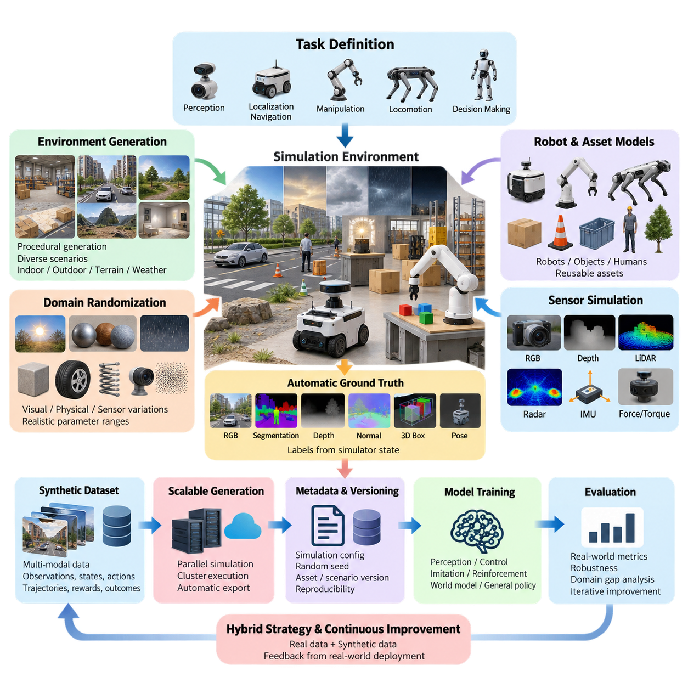{width="7.268055555555556in" height="7.268055555555556in"}

Synthetic data generation for robot AI is the systematic creation of training, validation, and testing data through simulation rather than direct collection from physical robots. A practical strategy begins by defining which capabilities require synthetic coverage, such as perception, localization, navigation, manipulation, locomotion, or autonomous decision making. The generated data should represent the operational conditions that the robot is expected to encounter while also exposing the AI model to rare, difficult, and potentially hazardous situations.

Unlike conventional computer vision datasets, robot datasets must represent interactions between perception, physical state, actions, and environmental dynamics. A synthetic data strategy therefore extends beyond rendering realistic images. It may include RGB and depth images, semantic and instance segmentation, optical flow, LiDAR point clouds, radar observations, robot joint states, poses, velocities, forces, contacts, trajectories, actions, rewards, and task outcomes. These synchronized modalities allow synthetic environments to support both perception models and embodied learning systems.

The first design decision is to identify the target task and its required data distribution. An object detector may require large variations in object appearance, pose, scale, occlusion, illumination, and background, while a navigation policy requires diverse maps, obstacle configurations, traffic patterns, and robot trajectories. Manipulation systems additionally require variation in object geometry, friction, mass, contact configuration, and grasp state. Synthetic generation should therefore be task-driven rather than simply maximizing the number of generated samples.

Simulation provides a major advantage because ground-truth labels can be generated directly from the internal state of the virtual environment. Object identities, segmentation masks, depth, surface normals, three-dimensional bounding boxes, poses, velocities, and contact states are already known by the simulator and can be exported automatically. This removes much of the manual annotation effort required for real-world datasets and makes it possible to generate complex labels that would be expensive or difficult to obtain from physical sensors.

A robust generation strategy combines environmental diversity with controlled parameterization. Robot models, objects, terrain, buildings, warehouse layouts, road structures, vegetation, humans, vehicles, and other scene elements can be represented as reusable assets. Scene-generation logic then combines these assets into many configurations. Procedural environment generation can further increase diversity by automatically changing room geometry, shelf placement, obstacle density, road topology, terrain profiles, or object arrangements between simulation episodes.

Domain randomization intentionally varies parameters that influence observations and robot behavior. Visual parameters may include textures, materials, colors, illumination, shadows, camera exposure, background objects, and weather. Physical parameters may include mass, friction, restitution, actuator strength, joint damping, payload, tire properties, and surface characteristics. Sensor parameters can include noise, bias, resolution, latency, dropout, and calibration error. These variations reduce dependence on one idealized simulator configuration and prepare models for uncertainty in real deployment.

Randomization should not be confused with arbitrary variation. Parameter ranges should reflect physically plausible conditions and the operational design domain of the robot. Excessively unrealistic samples can consume training resources without improving deployment performance, while ranges that are too narrow can produce models that overfit simulation. Effective synthetic data pipelines therefore distinguish between nominal conditions, expected variation, boundary conditions, and deliberately generated stress cases, allowing each category to serve a specific training or validation objective.

Scenario design is especially important for autonomous robots because many operational failures originate from combinations of conditions rather than individual objects. An outdoor AMR, for example, may encounter pedestrians, vehicles, uneven terrain, partial sensor occlusion, changing sunlight, rain, and localization uncertainty simultaneously. Simulation allows these factors to be systematically composed into scenarios and repeated under controlled variations. Rare events can consequently be generated at frequencies much higher than their natural occurrence in field data.

Synthetic data is also valuable for manipulation and embodied AI because simulation can produce large quantities of interaction data without damaging hardware. Robots can attempt grasps, pushes, insertions, tool operations, and other actions across thousands of object arrangements. Each interaction can record observations, actions, contact forces, robot states, success conditions, and trajectories. Such datasets can support imitation learning, reinforcement learning, behavior cloning, world models, and general-purpose robot policies in addition to conventional supervised learning.

Sensor fidelity should be selected according to the learning objective rather than maximizing realism everywhere. Photorealistic rendering may be important for RGB-based perception, whereas geometric accuracy may dominate LiDAR or depth-based tasks. Control and locomotion policies may depend more strongly on accurate dynamics, contact behavior, actuator response, and latency than visual appearance. A synthetic data architecture should therefore allocate simulation fidelity to the factors that have the strongest influence on the target model.

Scalability becomes critical once synthetic generation moves from experimentation to production. Generation pipelines should support headless execution, parallel simulation, deterministic configuration, distributed jobs, metadata capture, and automatic dataset export. GPU-accelerated simulators can execute many environments concurrently, while compute clusters can distribute generation across multiple nodes. Dataset production can consequently evolve from manually executed simulation sessions into reproducible data-generation infrastructure integrated with robot AI development workflows.

Every generated sample should remain traceable to the simulation configuration that produced it. Metadata can include simulator version, asset versions, random seeds, robot configuration, environment parameters, sensor settings, physics parameters, scenario identifiers, and annotation schemas. This provenance enables failed training runs to be investigated and useful datasets to be reproduced. Versioning is particularly important because modifications to assets, physics models, rendering pipelines, or sensors can silently change the statistical properties of synthetic datasets.

Synthetic data quality must ultimately be evaluated against the intended real-world task. Visual realism alone is not sufficient evidence of usefulness. A more meaningful approach trains or evaluates models using synthetic data and measures their behavior on representative real observations and robot scenarios. Distribution statistics, label correctness, scenario coverage, model accuracy, robustness, and domain-gap indicators can be monitored together. This creates a feedback loop in which weaknesses discovered during real-world evaluation guide the next generation of simulated data.

The strongest strategy is usually hybrid rather than purely synthetic. Real datasets provide authentic sensor characteristics, environmental complexity, and deployment-specific phenomena, while simulation provides scale, controllability, perfect labels, and coverage of rare conditions. Real observations can also be used to calibrate simulator parameters and determine realistic randomization ranges. Synthetic data can then expand the distribution around measured operating conditions instead of attempting to replace real-world information completely.

A mature robot AI pipeline therefore treats synthetic data generation as a continuous data-engineering process. Field failures and difficult examples are collected, categorized, and translated into simulation scenarios; new synthetic samples are generated around those conditions; models are retrained and validated; and improved policies are returned to simulation and physical testing. This closed loop connects real-world operation, simulation, dataset management, model training, and validation into a continuously improving development cycle.

Within a simulation-centered development architecture, synthetic data generation forms the bridge between virtual environments and scalable robot intelligence. It converts physics engines, environment models, sensor simulation, procedural generation, and scenario orchestration into reusable AI training assets. This positioning also prepares the workflow for subsequent domain randomization, specialized image and point-cloud generation, manipulation and locomotion datasets, quality validation, automated pipelines, and hybrid real-synthetic dataset strategies.

로봇 인공지능(Robot AI)을 위한 합성 데이터 생성(Synthetic Data Generation)은 물리적 로봇에서 직접 데이터를 수집하는 대신 시뮬레이션(Simulation)을 통해 학습(Training), 검증(Validation), 시험(Testing) 데이터를 체계적으로 생성하는 과정이다. 실용적인 전략은 인지(Perception), 위치추정(Localization), 내비게이션(Navigation), 조작(Manipulation), 보행(Locomotion), 자율 의사결정(Autonomous Decision Making) 등 어떤 기능에 합성 데이터가 필요한지를 정의하는 것에서 시작한다. 생성 데이터는 로봇이 실제 운용 환경에서 마주할 조건을 표현하는 동시에 희귀하고 어렵거나 잠재적으로 위험한 상황까지 인공지능 모델(AI Model)이 경험하도록 구성해야 한다.

일반적인 컴퓨터 비전 데이터셋(Computer Vision Dataset)과 달리 로봇 데이터셋(Robot Dataset)은 인지, 물리 상태(Physical State), 행동(Action), 환경 동역학(Environmental Dynamics) 사이의 상호작용을 표현해야 한다. 따라서 합성 데이터 전략은 사실적인 이미지를 렌더링(Rendering)하는 수준을 넘어선다. RGB 및 깊이 영상(Depth Image), 의미론적 분할(Semantic Segmentation), 인스턴스 분할(Instance Segmentation), 광학 흐름(Optical Flow), 라이다 포인트 클라우드(LiDAR Point Cloud), 레이더 관측(Radar Observation), 로봇 관절 상태(Joint State), 자세(Pose), 속도(Velocity), 힘(Force), 접촉(Contact), 궤적(Trajectory), 행동(Action), 보상(Reward), 작업 결과(Task Outcome) 등이 포함될 수 있다. 이러한 동기화된 다중 모달리티(Multimodality)는 합성 환경을 인지 모델뿐만 아니라 체화 학습 시스템(Embodied Learning System)에도 활용할 수 있도록 한다.

첫 번째 설계 결정은 목표 작업(Target Task)과 이에 필요한 데이터 분포(Data Distribution)를 식별하는 것이다. 객체 검출기(Object Detector)는 객체의 외형, 자세, 크기, 가림(Occlusion), 조명(Illumination), 배경 등에 대한 광범위한 변화가 필요할 수 있으며, 내비게이션 정책(Navigation Policy)은 다양한 지도, 장애물 배치, 이동 패턴, 로봇 궤적을 필요로 한다. 조작 시스템(Manipulation System)은 여기에 객체 형상(Object Geometry), 마찰(Friction), 질량(Mass), 접촉 구성(Contact Configuration), 파지 상태(Grasp State)의 변화까지 필요하다. 따라서 합성 데이터 생성은 단순히 생성 샘플 수를 최대화하는 것이 아니라 작업 중심(Task-driven)으로 설계되어야 한다.

시뮬레이션의 중요한 장점은 가상 환경(Virtual Environment)의 내부 상태로부터 정답 데이터(Ground Truth)를 직접 생성할 수 있다는 것이다. 객체 식별자(Object Identity), 분할 마스크(Segmentation Mask), 깊이(Depth), 표면 법선(Surface Normal), 3차원 경계 상자(3D Bounding Box), 자세, 속도, 접촉 상태 등의 정보는 이미 시뮬레이터(Simulator) 내부에서 알려져 있으므로 자동으로 내보낼 수 있다. 이를 통해 실제 데이터셋에서 요구되는 수작업 어노테이션(Manual Annotation)의 상당 부분을 제거하고, 물리적 센서만으로는 획득하기 어렵거나 비용이 많이 드는 복잡한 라벨(Label)을 생성할 수 있다.

견고한 생성 전략은 환경 다양성(Environmental Diversity)과 제어 가능한 매개변수화(Controlled Parameterization)를 결합한다. 로봇 모델, 객체, 지형(Terrain), 건물, 창고 배치, 도로 구조, 식생(Vegetation), 사람, 차량 및 기타 장면 요소를 재사용 가능한 자산(Reusable Asset)으로 구성할 수 있다. 이후 장면 생성 로직(Scene Generation Logic)이 이러한 자산을 다양한 형태로 조합한다. 절차적 환경 생성(Procedural Environment Generation)을 적용하면 시뮬레이션 에피소드(Simulation Episode)마다 공간 형상, 선반 배치, 장애물 밀도, 도로 토폴로지(Road Topology), 지형 프로파일(Terrain Profile), 객체 배치를 자동으로 변경하여 다양성을 더욱 확대할 수 있다.

도메인 랜덤화(Domain Randomization)는 관측과 로봇 행동에 영향을 주는 매개변수를 의도적으로 변화시키는 방법이다. 시각적 매개변수에는 텍스처(Texture), 재질(Material), 색상, 조명, 그림자, 카메라 노출(Camera Exposure), 배경 객체, 날씨 등이 포함될 수 있다. 물리 매개변수에는 질량, 마찰, 반발계수(Restitution), 액추에이터 출력(Actuator Strength), 관절 감쇠(Joint Damping), 페이로드(Payload), 타이어 특성, 표면 특성 등이 포함된다. 센서 매개변수에는 잡음(Noise), 바이어스(Bias), 해상도(Resolution), 지연시간(Latency), 데이터 손실(Dropout), 보정 오차(Calibration Error) 등이 포함될 수 있다. 이러한 변화는 하나의 이상적인 시뮬레이터 설정에 대한 모델의 의존성을 낮추고 실제 배치(Real Deployment) 환경의 불확실성에 대비하도록 한다.

그러나 랜덤화(Randomization)를 임의적인 변화와 동일하게 보아서는 안 된다. 매개변수 범위(Parameter Range)는 물리적으로 타당한 조건과 로봇의 운용 설계 영역(Operational Design Domain)을 반영해야 한다. 지나치게 비현실적인 샘플은 실제 배치 성능을 개선하지 못하면서 학습 자원만 소비할 수 있고, 반대로 지나치게 좁은 범위는 모델이 시뮬레이션 환경에 과적합(Overfitting)되도록 만들 수 있다. 따라서 효과적인 합성 데이터 파이프라인(Synthetic Data Pipeline)은 정상 조건(Nominal Condition), 예상 변화(Expected Variation), 경계 조건(Boundary Condition), 의도적으로 생성된 스트레스 조건(Stress Case)을 구분하여 각각이 특정한 학습 또는 검증 목적을 수행하도록 해야 한다.

자율 로봇(Autonomous Robot)에서는 많은 운용 실패가 개별 객체보다 여러 조건의 조합에서 발생하므로 시나리오 설계(Scenario Design)가 특히 중요하다. 예를 들어 실외 자율이동로봇(Outdoor AMR)은 보행자, 차량, 불규칙한 지형, 부분적인 센서 가림, 변화하는 햇빛, 비, 위치추정 불확실성(Localization Uncertainty)을 동시에 경험할 수 있다. 시뮬레이션에서는 이러한 요소를 체계적으로 결합하여 시나리오를 구성하고 제어된 조건 변화 아래에서 반복할 수 있다. 따라서 실제 현장 데이터에서는 매우 드물게 발생하는 사건도 훨씬 높은 빈도로 생성할 수 있다.

합성 데이터는 하드웨어 손상 없이 대규모 상호작용 데이터(Interaction Data)를 생성할 수 있기 때문에 조작(Manipulation)과 체화 인공지능(Embodied AI)에서도 중요하다. 로봇은 수천 가지 객체 배치에서 파지(Grasp), 밀기(Push), 삽입(Insertion), 도구 조작(Tool Operation) 등의 행동을 시도할 수 있다. 각각의 상호작용에서 관측, 행동, 접촉력(Contact Force), 로봇 상태, 성공 조건(Success Condition), 궤적을 기록할 수 있다. 이러한 데이터셋은 기존의 지도학습(Supervised Learning)뿐만 아니라 모방학습(Imitation Learning), 강화학습(Reinforcement Learning), 행동 복제(Behavior Cloning), 월드 모델(World Model), 범용 로봇 정책(General-purpose Robot Policy)을 지원할 수 있다.

센서 충실도(Sensor Fidelity)는 모든 부분에서 사실성을 최대화하는 것이 아니라 학습 목표에 따라 선택해야 한다. RGB 기반 인지에는 사실적 렌더링(Photorealistic Rendering)이 중요할 수 있지만, 라이다 또는 깊이 기반 작업에서는 기하학적 정확도(Geometric Accuracy)가 더욱 중요할 수 있다. 제어(Control) 및 보행 정책(Locomotion Policy)은 시각적 외형보다 정확한 동역학(Dynamics), 접촉 거동(Contact Behavior), 액추에이터 응답(Actuator Response), 지연시간에 더 크게 의존할 수 있다. 따라서 합성 데이터 아키텍처(Synthetic Data Architecture)는 목표 모델에 가장 큰 영향을 미치는 요소에 시뮬레이션 충실도(Simulation Fidelity)를 집중해야 한다.

합성 데이터 생성이 실험 단계에서 생산 단계(Production)로 발전하면 확장성(Scalability)이 핵심 요소가 된다. 생성 파이프라인은 헤드리스 실행(Headless Execution), 병렬 시뮬레이션(Parallel Simulation), 결정론적 설정(Deterministic Configuration), 분산 작업(Distributed Job), 메타데이터 수집(Metadata Capture), 자동 데이터셋 내보내기(Automatic Dataset Export)를 지원해야 한다. GPU 가속 시뮬레이터(GPU-accelerated Simulator)는 다수의 환경을 동시에 실행할 수 있으며, 컴퓨팅 클러스터(Compute Cluster)를 이용하면 생성 작업을 여러 노드(Node)에 분산할 수 있다. 이를 통해 데이터셋 생성은 수동으로 실행하는 시뮬레이션 작업에서 재현 가능한 데이터 생성 인프라(Reproducible Data-generation Infrastructure)로 발전할 수 있다.

생성된 모든 샘플은 해당 데이터를 생성한 시뮬레이션 설정(Simulation Configuration)까지 추적할 수 있어야 한다. 메타데이터(Metadata)에는 시뮬레이터 버전, 자산 버전(Asset Version), 랜덤 시드(Random Seed), 로봇 구성, 환경 매개변수, 센서 설정, 물리 매개변수, 시나리오 식별자(Scenario Identifier), 어노테이션 스키마(Annotation Schema) 등이 포함될 수 있다. 이러한 데이터 출처 추적성(Data Provenance)을 확보하면 실패한 학습 실행을 조사하고 유용한 데이터셋을 재현할 수 있다. 특히 자산, 물리 모델, 렌더링 파이프라인, 센서가 변경되면 합성 데이터셋의 통계적 특성이 조용히 변할 수 있으므로 버전 관리(Versioning)가 중요하다.

합성 데이터 품질(Synthetic Data Quality)은 궁극적으로 목표로 하는 실제 작업을 기준으로 평가해야 한다. 시각적 사실성(Visual Realism)만으로 데이터의 유용성을 판단할 수는 없다. 보다 의미 있는 접근 방법은 합성 데이터를 이용해 모델을 학습하거나 평가한 후 대표적인 실제 관측과 로봇 시나리오에서 모델의 동작을 측정하는 것이다. 분포 통계(Distribution Statistics), 라벨 정확성(Label Correctness), 시나리오 커버리지(Scenario Coverage), 모델 정확도(Model Accuracy), 강건성(Robustness), 도메인 갭 지표(Domain-gap Indicator)를 함께 모니터링할 수 있다. 이를 통해 실제 환경 평가에서 발견된 약점이 다음 세대 합성 데이터 생성을 유도하는 피드백 루프(Feedback Loop)를 구성할 수 있다.

가장 강력한 전략은 일반적으로 완전한 합성 방식보다 하이브리드 전략(Hybrid Strategy)이다. 실제 데이터셋(Real Dataset)은 진정한 센서 특성, 환경 복잡성, 실제 배치 환경 고유의 현상을 제공하며, 시뮬레이션은 규모(Scale), 제어 가능성(Controllability), 완전한 정답 데이터(Perfect Ground Truth), 희귀 조건에 대한 커버리지를 제공한다. 실제 관측 데이터는 시뮬레이터 매개변수를 보정(Calibration)하고 현실적인 랜덤화 범위를 결정하는 데에도 사용할 수 있다. 이후 합성 데이터는 실제 데이터를 완전히 대체하려는 것이 아니라 측정된 운용 조건 주변의 데이터 분포를 확장하는 역할을 수행한다.

성숙한 로봇 인공지능 파이프라인(Robot AI Pipeline)은 합성 데이터 생성을 지속적인 데이터 엔지니어링 프로세스(Data Engineering Process)로 취급한다. 현장에서 발생한 실패 사례와 어려운 사례를 수집하고 분류한 후 이를 시뮬레이션 시나리오로 변환한다. 해당 조건 주변에서 새로운 합성 샘플을 생성하고 모델을 재학습 및 검증한 다음 개선된 정책(Policy)을 다시 시뮬레이션과 실제 로봇 시험에 투입한다. 이러한 폐루프(Closed Loop)는 실제 운용, 시뮬레이션, 데이터셋 관리, 모델 학습, 검증을 하나의 지속적으로 개선되는 개발 주기로 연결한다.

시뮬레이션 중심 개발 아키텍처(Simulation-centered Development Architecture)에서 합성 데이터 생성은 가상 환경과 확장 가능한 로봇 지능(Scalable Robot Intelligence)을 연결하는 가교 역할을 한다. 이는 물리 엔진(Physics Engine), 환경 모델(Environment Model), 센서 시뮬레이션(Sensor Simulation), 절차적 생성(Procedural Generation), 시나리오 오케스트레이션(Scenario Orchestration)을 재사용 가능한 인공지능 학습 자산(AI Training Asset)으로 변환한다. 이러한 구조는 이후 도메인 랜덤화, 특화된 이미지 및 포인트 클라우드 생성, 조작 및 보행 데이터셋, 품질 검증, 자동화 파이프라인, 실제-합성 하이브리드 데이터셋 전략(Hybrid Real-Synthetic Dataset Strategy)으로 확장될 수 있는 기반을 제공한다.

##  

## 09.02. Domain Randomization Texture Lighting Physics [w/Code]

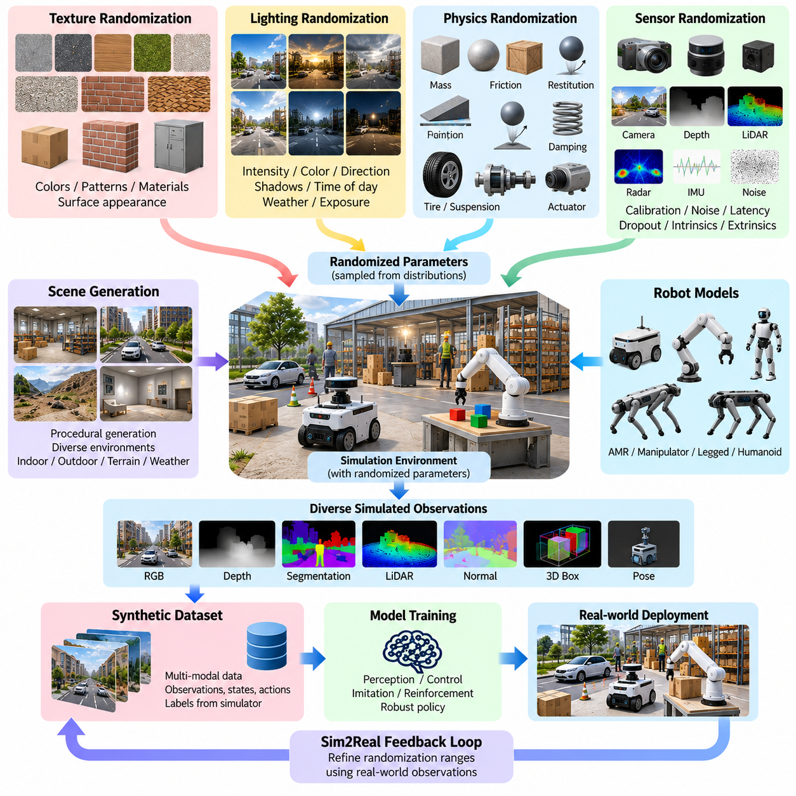{width="7.268055555555556in" height="7.268055555555556in"}

Domain randomization is a simulation technique that deliberately varies environmental, visual, sensor, and physical parameters during synthetic data generation so that a robot AI model does not become dependent on one specific simulated world. Instead of attempting to reproduce reality with a single perfectly calibrated environment, the simulator generates a distribution of possible worlds. Models trained across this distribution learn features and behaviors that remain useful when they encounter variations in real deployment.

The fundamental idea is to transform simulation parameters into random variables sampled during data generation or policy training. At the beginning of an episode, scene reset, or observation cycle, selected parameters are drawn from predefined distributions. These parameters may control textures, materials, lighting, object appearance, camera properties, friction, mass, actuator characteristics, or environmental conditions. Repeated sampling produces many related but non-identical simulation instances from the same underlying scene structure.

Texture randomization changes the visual appearance of surfaces while preserving their geometric or semantic roles. Floors, walls, roads, shelves, boxes, vehicles, furniture, terrain, and robot components can receive different colors, patterns, materials, or texture maps. The objective is not merely visual diversity. By preventing a model from associating an object or region with one fixed surface appearance, texture variation encourages learning of more general shape, geometry, context, and semantic characteristics.

Texture variation can operate at several levels of realism. A warehouse floor may alternate among concrete, epoxy, tile, or visually perturbed materials, while outdoor terrain may vary among asphalt, gravel, soil, grass, and mixed surfaces. Object textures can also be randomized independently from environmental surfaces. For perception training, this approach increases appearance diversity without requiring a completely new scene model for every generated sample, making existing simulation assets substantially more reusable.

Lighting randomization addresses one of the most significant sources of visual variation between simulation and reality. Light intensity, color temperature, direction, position, number of light sources, shadow properties, ambient illumination, and exposure conditions can be varied systematically. Outdoor environments may additionally change solar angle, sky illumination, cloud coverage, or time-of-day conditions. These variations expose vision models to scenes ranging from bright direct illumination to low-light and strongly shadowed situations.

Lighting parameters should be randomized together with camera response when realistic observation variation is required. Exposure, gain, white balance, gamma, dynamic range, motion blur, lens effects, and image noise can alter the final image even when the physical scene remains unchanged. Randomizing only the virtual lights while maintaining an ideal camera can therefore leave an important part of the domain gap unmodeled. Sensor-side variation complements rendering-side variation and creates more representative observations.

Physical domain randomization extends the same principle from appearance to robot-environment interaction. Parameters such as object mass, center of mass, friction coefficient, restitution, damping, joint friction, motor strength, gearbox efficiency, tire properties, suspension behavior, and payload can be varied between simulation runs. These parameters directly influence acceleration, braking, contact, grasping, wheel slip, stability, and locomotion, making physics randomization particularly important for control policies and embodied robot learning.

For an autonomous mobile robot, friction variation can represent different floor or terrain conditions, while payload randomization changes acceleration and braking behavior. Tire-ground interaction can be varied to represent dry pavement, wet surfaces, loose gravel, or uneven terrain. Manipulators may randomize object mass, friction, contact stiffness, and actuator response. Legged robots can vary terrain compliance, joint damping, motor torque, latency, and contact parameters to prevent locomotion policies from depending on idealized dynamics.

Parameter ranges require careful engineering because wider randomization is not automatically better. If the simulator generates physically impossible combinations, the model may spend substantial capacity learning behavior that has little relevance to deployment. Conversely, narrow distributions may preserve the simulation-specific assumptions that domain randomization is intended to remove. Parameter bounds should therefore originate from hardware specifications, measurements, system identification, field observations, engineering tolerances, and plausible operational conditions whenever possible.

Different probability distributions can represent different forms of uncertainty. Uniform distributions are useful when all values inside a range should receive similar coverage, while Gaussian or truncated distributions can concentrate samples around nominal operating values. Discrete distributions can select among material classes, weather states, sensor configurations, or object categories. Correlated sampling may also be necessary because real parameters are not always independent; environmental and physical conditions can influence several simulation variables simultaneously.

Randomization frequency is another important design choice. Some parameters should remain constant throughout an episode because they represent persistent properties such as robot mass or camera mounting geometry. Others may change between scenes, such as object textures or weather conditions. Dynamic disturbances, sensor noise, illumination fluctuations, or communication delay may vary continuously during execution. Matching the randomization timescale to the physical phenomenon helps preserve meaningful temporal relationships in generated data.

Domain randomization can also target sensor imperfections. Camera intrinsics and extrinsics, LiDAR range noise, beam behavior, radar uncertainty, IMU bias, GNSS error, calibration offsets, timestamp jitter, latency, and packet dropout can all be randomized. Such perturbations are particularly valuable when AI components consume synchronized multimodal observations. Models can otherwise become dependent on unrealistically perfect calibration, timing, or sensor measurements that cannot be maintained consistently on physical robots.

Randomization should preserve semantic correctness and label integrity. Changing a texture or illumination condition must not invalidate segmentation labels, object identities, poses, or geometric ground truth. Likewise, physics variation should remain consistent with recorded robot states, contacts, forces, and trajectories. Because the simulator controls both the randomized world and its internal state, synthetic pipelines can maintain accurate annotations while producing observation diversity that would be expensive to label manually in real environments.

A scalable implementation separates randomization configuration from scene and robot definitions. Parameter ranges, distributions, dependencies, and sampling frequencies can be stored in reusable configuration files rather than embedded directly into simulation logic. Random seeds should be recorded so that specific scenarios can be reproduced when unexpected model behavior occurs. This architecture supports automated generation, parallel simulation, dataset versioning, experiment comparison, and systematic modification of individual randomization dimensions.

Randomization effectiveness should be evaluated through model performance rather than visual inspection alone. Ablation studies can compare models trained with texture, lighting, physics, sensor, or combined randomization to determine which dimensions improve real-world performance. Validation on representative real data reveals whether expanded simulation diversity reduces the domain gap or introduces irrelevant variation. The randomization configuration can then be refined according to measured transfer performance instead of subjective realism.

In a mature synthetic data pipeline, domain randomization becomes part of a continuous Sim2Real development loop rather than a one-time preprocessing technique. Real robot observations reveal mismatches in appearance, sensors, dynamics, contacts, or timing; these mismatches are translated into improved simulation parameter distributions; new synthetic data or policy experience is generated; and the resulting models are evaluated again in reality. This iterative process progressively aligns simulation diversity with actual deployment uncertainty.

Texture, lighting, and physics randomization therefore represent complementary layers of the same robustness strategy. Texture and lighting expand visual appearance, physics variation expands interaction and dynamic behavior, and sensor randomization expands observation uncertainty. When these dimensions are coordinated within physically plausible ranges, simulation becomes not a single approximation of reality but a controlled family of possible realities from which robot AI can learn transferable representations and policies.

도메인 랜덤화(Domain Randomization)는 합성 데이터 생성(Synthetic Data Generation) 과정에서 환경, 시각, 센서, 물리 매개변수(Physical Parameter)를 의도적으로 변화시켜 로봇 인공지능 모델(Robot AI Model)이 하나의 특정 시뮬레이션 환경에 의존하지 않도록 만드는 시뮬레이션 기법(Simulation Technique)이다. 하나의 완벽하게 보정된 환경으로 현실을 재현하려 하기보다, 시뮬레이터(Simulator)가 가능한 여러 세계의 분포(Distribution)를 생성한다. 이러한 분포에서 학습된 모델은 실제 배치(Real Deployment)에서 다양한 변화에 직면하더라도 유효한 특징과 행동을 학습할 수 있다.

기본적인 개념은 시뮬레이션 매개변수(Simulation Parameter)를 데이터 생성 또는 정책 학습(Policy Training) 과정에서 샘플링되는 확률 변수(Random Variable)로 변환하는 것이다. 에피소드(Episode), 장면 초기화(Scene Reset), 관측 주기(Observation Cycle)가 시작될 때 선택된 매개변수를 사전에 정의된 분포에서 추출한다. 이러한 매개변수는 텍스처(Texture), 재질(Material), 조명(Lighting), 객체 외형(Object Appearance), 카메라 특성(Camera Property), 마찰(Friction), 질량(Mass), 액추에이터 특성(Actuator Characteristic), 환경 조건 등을 제어할 수 있다. 반복적인 샘플링을 통해 동일한 기본 장면 구조에서 서로 연관되어 있지만 동일하지 않은 다양한 시뮬레이션 인스턴스(Simulation Instance)를 생성할 수 있다.

텍스처 랜덤화(Texture Randomization)는 표면의 기하학적 또는 의미론적 역할을 유지하면서 시각적 외형을 변화시킨다. 바닥, 벽, 도로, 선반, 상자, 차량, 가구, 지형, 로봇 구성요소 등에 서로 다른 색상, 패턴, 재질 또는 텍스처 맵(Texture Map)을 적용할 수 있다. 목적은 단순히 시각적 다양성을 증가시키는 것이 아니다. 모델이 객체나 영역을 하나의 고정된 표면 외형과 연관시키지 못하도록 함으로써 텍스처 변화는 보다 일반적인 형상, 기하학, 문맥(Context), 의미론적 특성(Semantic Characteristic)을 학습하도록 유도한다.

텍스처 변화(Texture Variation)는 여러 수준의 사실성(Realism)으로 적용할 수 있다. 창고 바닥은 콘크리트, 에폭시, 타일 또는 시각적으로 변형된 재질 사이에서 변화할 수 있으며, 실외 지형은 아스팔트, 자갈, 토양, 잔디 및 혼합 표면 등으로 변화할 수 있다. 객체 텍스처 역시 환경 표면과 독립적으로 랜덤화할 수 있다. 인지 학습(Perception Training)에서는 이러한 방법을 통해 생성 샘플마다 완전히 새로운 장면 모델(Scene Model)을 제작하지 않고도 외형의 다양성을 증가시킬 수 있으므로 기존 시뮬레이션 자산(Simulation Asset)의 재사용성을 크게 높일 수 있다.

조명 랜덤화(Lighting Randomization)는 시뮬레이션과 현실 사이에서 발생하는 가장 중요한 시각적 변화 요인 중 하나를 다룬다. 광원의 세기, 색온도(Color Temperature), 방향, 위치, 광원 수, 그림자 특성, 주변 조명(Ambient Illumination), 노출 조건(Exposure Condition)을 체계적으로 변화시킬 수 있다. 실외 환경에서는 태양 각도(Solar Angle), 하늘 조명(Sky Illumination), 구름의 양, 시간대(Time of Day) 등의 조건도 추가로 변화시킬 수 있다. 이러한 변화는 밝은 직사광선 환경부터 저조도(Low-light) 및 강한 그림자가 존재하는 상황까지 다양한 장면을 비전 모델(Vision Model)이 경험하도록 한다.

현실적인 관측 변화(Observation Variation)가 필요한 경우 조명 매개변수는 카메라 응답(Camera Response)과 함께 랜덤화해야 한다. 노출(Exposure), 게인(Gain), 화이트 밸런스(White Balance), 감마(Gamma), 동적 범위(Dynamic Range), 모션 블러(Motion Blur), 렌즈 효과(Lens Effect), 이미지 잡음(Image Noise)은 물리적 장면이 동일하더라도 최종 영상을 변화시킬 수 있다. 따라서 이상적인 카메라를 유지하면서 가상 광원만 랜덤화하면 도메인 갭(Domain Gap)의 중요한 부분이 모델링되지 않을 수 있다. 센서 측 변화(Sensor-side Variation)는 렌더링 측 변화(Rendering-side Variation)를 보완하여 더욱 현실적인 관측 데이터를 생성한다.

물리 도메인 랜덤화(Physical Domain Randomization)는 동일한 개념을 시각적 외형에서 로봇과 환경 사이의 상호작용으로 확장한다. 객체 질량, 무게중심(Center of Mass), 마찰계수(Friction Coefficient), 반발계수(Restitution), 감쇠(Damping), 관절 마찰(Joint Friction), 모터 출력(Motor Strength), 기어박스 효율(Gearbox Efficiency), 타이어 특성(Tire Property), 서스펜션 거동(Suspension Behavior), 페이로드(Payload) 등의 매개변수를 시뮬레이션 실행마다 변화시킬 수 있다. 이러한 매개변수는 가속, 제동, 접촉, 파지, 휠 슬립(Wheel Slip), 안정성, 보행에 직접적인 영향을 주므로 물리 랜덤화는 제어 정책(Control Policy)과 체화 로봇 학습(Embodied Robot Learning)에서 특히 중요하다.

자율이동로봇(Autonomous Mobile Robot)의 경우 마찰 변화는 서로 다른 바닥이나 지형 조건을 나타낼 수 있으며, 페이로드 랜덤화(Payload Randomization)는 가속 및 제동 거동을 변화시킨다. 타이어와 지면의 상호작용(Tire-ground Interaction)을 변화시켜 건조 포장도로, 젖은 표면, 느슨한 자갈, 불규칙한 지형 등을 표현할 수 있다. 매니퓰레이터(Manipulator)는 객체 질량, 마찰, 접촉 강성(Contact Stiffness), 액추에이터 응답을 랜덤화할 수 있다. 보행 로봇(Legged Robot)은 지형 순응성(Terrain Compliance), 관절 감쇠, 모터 토크(Motor Torque), 지연시간(Latency), 접촉 매개변수를 변화시켜 보행 정책이 이상적인 동역학에 의존하는 것을 방지할 수 있다.

매개변수 범위(Parameter Range)는 신중하게 설계해야 하며, 랜덤화 범위가 넓다고 해서 반드시 더 좋은 것은 아니다. 시뮬레이터가 물리적으로 불가능한 조합을 생성하면 모델은 실제 배치와 거의 관련이 없는 행동을 학습하는 데 상당한 용량을 소비할 수 있다. 반대로 지나치게 좁은 분포는 도메인 랜덤화가 제거하려는 시뮬레이션 고유의 가정을 그대로 유지할 수 있다. 따라서 매개변수 경계(Parameter Bound)는 가능한 경우 하드웨어 사양, 실제 측정값, 시스템 식별(System Identification), 현장 관측(Field Observation), 공학적 공차(Engineering Tolerance), 현실적인 운용 조건을 기반으로 설정해야 한다.

서로 다른 확률 분포(Probability Distribution)를 이용하여 다양한 형태의 불확실성(Uncertainty)을 표현할 수 있다. 균등 분포(Uniform Distribution)는 범위 내부의 모든 값을 유사한 수준으로 다룰 때 유용하며, 가우시안 분포(Gaussian Distribution) 또는 절단 분포(Truncated Distribution)는 정상 운용값(Nominal Operating Value) 주변에 샘플을 집중시킬 수 있다. 이산 분포(Discrete Distribution)는 재질 종류, 날씨 상태, 센서 구성, 객체 범주 등을 선택하는 데 사용할 수 있다. 실제 매개변수들이 항상 독립적이지는 않으므로 환경 및 물리 조건이 여러 시뮬레이션 변수에 동시에 영향을 미치는 경우 상관 샘플링(Correlated Sampling)이 필요할 수도 있다.

랜덤화 빈도(Randomization Frequency) 역시 중요한 설계 요소이다. 로봇 질량이나 카메라 장착 형상처럼 지속적인 특성을 나타내는 일부 매개변수는 하나의 에피소드 동안 일정하게 유지되어야 한다. 객체 텍스처나 날씨 조건과 같은 요소는 장면마다 변경될 수 있다. 동적 교란(Dynamic Disturbance), 센서 잡음, 조명 변화, 통신 지연(Communication Delay) 등은 실행 중에도 지속적으로 변화할 수 있다. 랜덤화 시간 척도(Randomization Timescale)를 실제 물리 현상에 맞추면 생성 데이터에서 의미 있는 시간적 관계(Temporal Relationship)를 유지할 수 있다.

도메인 랜덤화는 센서의 불완전성(Sensor Imperfection)을 대상으로 할 수도 있다. 카메라 내부 및 외부 매개변수(Camera Intrinsics and Extrinsics), 라이다 거리 잡음(LiDAR Range Noise), 빔 특성(Beam Behavior), 레이더 불확실성(Radar Uncertainty), 관성측정장치 바이어스(IMU Bias), 위성항법시스템 오차(GNSS Error), 보정 오프셋(Calibration Offset), 타임스탬프 지터(Timestamp Jitter), 지연시간, 패킷 손실(Packet Dropout) 등을 모두 랜덤화할 수 있다. 이러한 교란은 인공지능 구성요소가 동기화된 다중 모달 관측(Synchronized Multimodal Observation)을 사용하는 경우 특히 중요하다. 그렇지 않으면 모델이 실제 로봇에서는 지속적으로 유지하기 어려운 비현실적으로 완벽한 보정, 시간 동기화 또는 센서 측정값에 의존할 수 있다.

랜덤화 과정에서도 의미론적 정확성(Semantic Correctness)과 라벨 무결성(Label Integrity)은 유지되어야 한다. 텍스처 또는 조명 조건의 변화가 분할 라벨(Segmentation Label), 객체 식별자(Object Identity), 자세 또는 기하학적 정답 데이터(Geometric Ground Truth)를 무효화해서는 안 된다. 마찬가지로 물리적 변화는 기록된 로봇 상태, 접촉, 힘, 궤적과 일관성을 유지해야 한다. 시뮬레이터는 랜덤화된 환경과 내부 상태를 모두 제어하므로 실제 환경에서 수작업으로 라벨링하기에는 비용이 많이 드는 다양한 관측 데이터를 생성하면서도 정확한 어노테이션(Annotation)을 유지할 수 있다.

확장 가능한 구현(Scalable Implementation)에서는 랜덤화 설정(Randomization Configuration)을 장면 및 로봇 정의와 분리한다. 매개변수 범위, 분포, 종속성(Dependency), 샘플링 빈도(Sampling Frequency)를 시뮬레이션 로직 내부에 직접 삽입하는 대신 재사용 가능한 설정 파일(Configuration File)에 저장할 수 있다. 특정 시나리오에서 예상하지 못한 모델 행동이 발생했을 때 이를 재현할 수 있도록 랜덤 시드(Random Seed)도 기록해야 한다. 이러한 아키텍처는 자동 생성, 병렬 시뮬레이션(Parallel Simulation), 데이터셋 버전 관리(Dataset Versioning), 실험 비교, 개별 랜덤화 차원(Randomization Dimension)의 체계적인 변경을 지원한다.

랜덤화의 효과는 단순한 시각적 검사보다 모델 성능(Model Performance)을 통해 평가해야 한다. 절제 연구(Ablation Study)를 통해 텍스처, 조명, 물리, 센서 또는 이들을 결합한 랜덤화를 적용하여 학습한 모델들을 비교하고 어떤 랜덤화 차원이 실제 환경 성능을 향상시키는지 확인할 수 있다. 대표적인 실제 데이터에 대한 검증(Validation)을 통해 확장된 시뮬레이션 다양성이 도메인 갭을 감소시키는지 또는 불필요한 변화를 추가하는지를 확인할 수 있다. 이후 주관적인 사실성 판단이 아니라 측정된 전이 성능(Transfer Performance)을 기준으로 랜덤화 설정을 개선할 수 있다.

성숙한 합성 데이터 파이프라인(Synthetic Data Pipeline)에서 도메인 랜덤화는 일회성 전처리 기법(Preprocessing Technique)이 아니라 지속적인 시뮬레이션-현실 전이(Sim2Real) 개발 루프의 일부가 된다. 실제 로봇의 관측 결과를 통해 외형, 센서, 동역학, 접촉, 시간 특성에서 발생하는 불일치를 발견하고, 이러한 차이를 개선된 시뮬레이션 매개변수 분포로 변환한다. 이후 새로운 합성 데이터 또는 정책 경험(Policy Experience)을 생성하고, 그 결과로 만들어진 모델을 다시 실제 환경에서 평가한다. 이러한 반복 과정은 시뮬레이션의 다양성을 실제 배치 환경의 불확실성과 점진적으로 일치시킨다.

따라서 텍스처, 조명, 물리 랜덤화는 동일한 강건성 전략(Robustness Strategy)을 구성하는 상호 보완적인 계층이다. 텍스처와 조명은 시각적 외형의 범위를 확장하고, 물리 변화는 상호작용과 동적 거동(Dynamic Behavior)의 범위를 확장하며, 센서 랜덤화(Sensor Randomization)는 관측 불확실성의 범위를 확장한다. 이러한 요소들을 물리적으로 타당한 범위 안에서 조정하면 시뮬레이션은 하나의 현실 근사치가 아니라 가능한 현실들의 제어된 집합(Controlled Family of Possible Realities)이 되며, 로봇 인공지능은 그 안에서 실제 환경으로 전이 가능한 표현(Transferable Representation)과 정책을 학습할 수 있다.

##  

## 09.03. Replicator Based Image Segmentation Data Gen [w/Code]

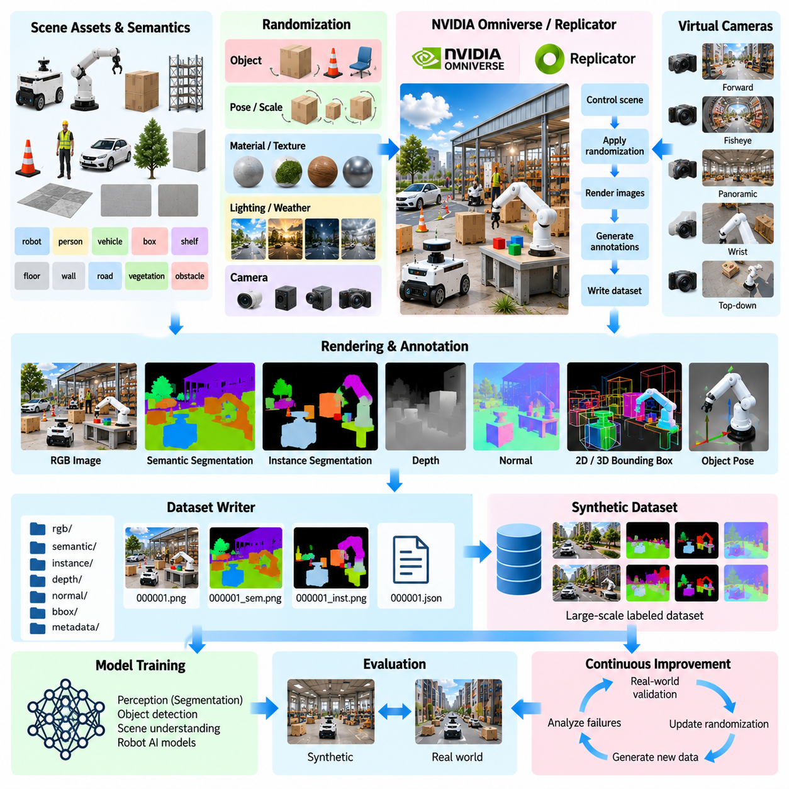{width="7.268055555555556in" height="7.268055555555556in"}

Replicator-based synthetic data generation provides a programmable approach for producing large-scale labeled image datasets directly from simulated robot environments. Within NVIDIA Omniverse and Isaac Sim, Replicator can control scene composition, rendering, randomization, camera placement, and annotation while maintaining access to the exact state of simulated objects. This makes it particularly suitable for generating RGB images together with semantic and instance segmentation labels for robot perception training.

The central advantage of Replicator is that scene generation and annotation can be expressed as a repeatable pipeline rather than a manually operated rendering process. A simulation scene contains robot models, objects, environments, lights, materials, and virtual sensors represented within the scene description. Replicator modifies selected properties according to predefined rules, triggers rendering, collects ground-truth information, and writes the resulting images and annotations into structured datasets.

Image segmentation generation generally begins with semantic information assigned to simulated assets. Objects or scene components are associated with semantic classes such as robot, person, vehicle, pallet, box, shelf, floor, wall, road, vegetation, or obstacle. Because the simulator already knows the identity and geometry of each asset, segmentation labels can be generated directly from the virtual scene without manually outlining objects at the pixel level.

Semantic segmentation assigns each visible pixel to a predefined semantic category. All objects belonging to the same category can therefore share the same class identifier even when multiple instances appear in the image. For robot AI, this representation is useful for drivable-area estimation, terrain classification, workspace understanding, obstacle recognition, environmental parsing, and other perception tasks where understanding the category of each image region is more important than identifying individual objects.

Instance segmentation extends semantic segmentation by distinguishing separate physical objects belonging to the same class. Five boxes in a warehouse, for example, can share the semantic class "box" while receiving five different instance identifiers. This distinction is important for object counting, manipulation, tracking, grasp planning, inventory operations, and interaction reasoning. Replicator can derive these masks from scene-level object identities and preserve correspondence between rendered objects and generated annotations.

A Replicator pipeline typically combines a simulation stage, randomization stage, rendering stage, annotation stage, and dataset-writing stage. Scene assets are loaded first, after which cameras, lights, objects, and environmental properties are configured. Randomizers modify selected parameters, a render product generates observations from virtual cameras, annotators extract required ground truth, and writers export the results. Repeating this sequence produces large collections of labeled samples under systematically varied conditions.

Camera configuration strongly influences the usefulness of generated segmentation datasets. Virtual cameras can vary position, orientation, focal length, field of view, resolution, clipping range, and other imaging parameters. For mobile robots, cameras may reproduce forward-facing, panoramic, fisheye, or elevated viewpoints. Manipulation systems may use wrist-mounted or workspace cameras. Randomizing camera poses within physically valid mounting or observation regions can expand viewpoint diversity while retaining meaningful robot perspectives.

Scene randomization is used to prevent the segmentation model from memorizing a limited set of simulated configurations. Objects can be translated, rotated, scaled, added, removed, or rearranged between frames or episodes. Background structures, clutter density, surface materials, lighting, and environmental conditions can also change. These transformations allow a relatively small library of simulation assets to produce a much larger space of observations and segmentation configurations.

Material and lighting variation are particularly important because segmentation models consume visual appearance even though their targets are categorical masks. Surface color, texture, reflectance, illumination intensity, shadow direction, exposure, and background appearance can influence the features learned by a neural network. Replicator-based domain randomization can vary these properties while leaving semantic identities unchanged, producing visually diverse RGB inputs that remain paired with exact segmentation labels.

Synthetic occlusion is another important capability of simulation-driven segmentation generation. Objects can be deliberately positioned behind shelves, vehicles, furniture, vegetation, other objects, or parts of the robot itself. Partial visibility can be varied systematically from minor obstruction to severe occlusion. Because the simulator retains complete object identity information, the pipeline can generate consistent visible segmentation masks even for complex scenes that would require substantial manual annotation effort in real imagery.

Replicator can generate multiple ground-truth modalities from the same rendered observation. In addition to semantic and instance segmentation, the dataset may contain RGB images, depth maps, surface normals, two-dimensional or three-dimensional bounding boxes, object poses, motion vectors, and other simulator-derived information. Synchronizing these outputs creates multimodal datasets in which different perception tasks share the same scene state, camera geometry, timestamp, and object configuration.

Dataset writers transform annotator outputs into files and metadata that can be consumed by downstream training systems. A production pipeline should define directory structures, image naming rules, class identifiers, annotation formats, frame indices, scenario identifiers, and randomization metadata consistently. The exact dataset format may be adapted to the training framework, but reproducibility requires preserving the relationship between RGB observations, segmentation masks, semantic definitions, and the simulation configuration that generated them.

Large-scale generation benefits from headless and automated execution. Instead of manually opening scenes and capturing images, scripts can repeatedly load or reset environments, sample randomization parameters, render frames, collect annotations, and save outputs. Multiple simulation instances or compute resources can further increase throughput. This approach turns synthetic image generation into a repeatable data-production workload that can be incorporated into broader robot AI data pipelines and development infrastructure.

Quality control remains necessary even when annotations originate directly from simulation. Semantic labels should be checked for missing or incorrectly assigned assets, duplicated class definitions, unexpected background categories, and objects whose semantic metadata does not match their intended role. Rendered images should also be examined for unrealistic camera placement, excessive occlusion, invalid lighting, clipping, or physically implausible scene arrangements that could reduce the usefulness of generated training samples.

Dataset balance should be managed explicitly because random generation does not automatically produce useful class distributions. Large surfaces such as floors and walls can dominate semantic segmentation pixels, while small but operationally important classes such as pedestrians, traffic signs, tools, packages, or obstacles may appear infrequently. Generation logic can increase the probability of rare classes, vary object distance and scale, and construct targeted scenarios so that the dataset provides sufficient coverage of important perception conditions.

Real-world validation determines whether Replicator-generated segmentation data improves deployed robot perception. Models trained on synthetic images can be evaluated on representative real camera datasets, and performance can be analyzed by class, environment, illumination, distance, occlusion, and scenario. Failure patterns then identify which simulated assets, textures, lighting conditions, camera configurations, or object arrangements require additional variation, forming a feedback loop between physical deployment and synthetic generation.

Replicator-based segmentation generation therefore acts as a programmable bridge between simulated environments and scalable perception learning. Scene semantics provide automatic ground truth, randomization creates observation diversity, virtual cameras define robot-relevant viewpoints, annotators extract synchronized labels, and writers convert results into reusable datasets. Within the synthetic data chapter structure, this workflow naturally extends domain randomization toward automated perception-data production before later expansion into synthetic point clouds, manipulation demonstrations, locomotion data, and other robot AI modalities.

리플리케이터 기반 합성 데이터 생성(Replicator-based Synthetic Data Generation)은 시뮬레이션된 로봇 환경에서 대규모 라벨 이미지 데이터셋(Labeled Image Dataset)을 직접 생성하기 위한 프로그래밍 가능한 접근 방식이다. NVIDIA Omniverse와 Isaac Sim 환경에서 Replicator는 시뮬레이션 객체의 정확한 상태 정보에 접근하면서 장면 구성(Scene Composition), 렌더링(Rendering), 랜덤화(Randomization), 카메라 배치(Camera Placement), 어노테이션(Annotation)을 제어할 수 있다. 따라서 로봇 인지 학습(Robot Perception Training)을 위한 RGB 영상과 의미론적 분할(Semantic Segmentation) 및 인스턴스 분할(Instance Segmentation) 라벨을 함께 생성하는 데 특히 적합하다.

Replicator의 핵심적인 장점은 장면 생성(Scene Generation)과 어노테이션을 수동으로 수행하는 렌더링 과정이 아니라 반복 가능한 파이프라인(Repeatable Pipeline)으로 표현할 수 있다는 것이다. 시뮬레이션 장면에는 장면 기술(Scene Description) 내부에 표현된 로봇 모델, 객체, 환경, 조명, 재질, 가상 센서(Virtual Sensor)가 포함된다. Replicator는 사전에 정의된 규칙에 따라 선택된 속성을 변경하고 렌더링을 실행하며, 정답 정보(Ground Truth)를 수집하고 결과 영상과 어노테이션을 구조화된 데이터셋으로 저장한다.

이미지 분할 데이터 생성(Image Segmentation Generation)은 일반적으로 시뮬레이션 자산(Simulated Asset)에 의미론적 정보(Semantic Information)를 할당하는 것에서 시작한다. 객체 또는 장면 구성요소에는 로봇, 사람, 차량, 팔레트, 상자, 선반, 바닥, 벽, 도로, 식생(Vegetation), 장애물 등의 의미론적 클래스(Semantic Class)를 연결할 수 있다. 시뮬레이터는 각 자산의 식별자와 기하학적 구조를 이미 알고 있으므로 실제 이미지에서 객체의 픽셀 경계를 사람이 직접 지정하지 않고도 분할 라벨을 가상 장면으로부터 직접 생성할 수 있다.

의미론적 분할(Semantic Segmentation)은 화면에 보이는 각각의 픽셀을 사전에 정의된 의미론적 범주(Semantic Category)에 할당한다. 따라서 영상에 동일한 범주의 객체가 여러 개 존재하더라도 해당 객체들은 동일한 클래스 식별자(Class Identifier)를 공유할 수 있다. 로봇 인공지능(Robot AI)에서는 이러한 표현을 주행 가능 영역 추정(Drivable-area Estimation), 지형 분류(Terrain Classification), 작업공간 이해(Workspace Understanding), 장애물 인식(Obstacle Recognition), 환경 파싱(Environmental Parsing) 등 개별 객체의 식별보다 영상 영역의 범주를 이해하는 것이 중요한 인지 작업에 활용할 수 있다.

인스턴스 분할(Instance Segmentation)은 의미론적 분할을 확장하여 동일한 클래스에 속하는 개별 물리 객체를 서로 구분한다. 예를 들어 창고에 다섯 개의 상자가 존재한다면 모든 상자는 동일한 의미론적 클래스인 '상자(Box)'를 공유하면서 각각 서로 다른 인스턴스 식별자(Instance Identifier)를 가질 수 있다. 이러한 구분은 객체 개수 계산(Object Counting), 조작(Manipulation), 추적(Tracking), 파지 계획(Grasp Planning), 재고 관리(Inventory Operation), 상호작용 추론(Interaction Reasoning)에서 중요하다. Replicator는 장면 수준의 객체 식별자로부터 이러한 마스크를 생성하고 렌더링된 객체와 생성된 어노테이션 사이의 대응 관계를 유지할 수 있다.

Replicator 파이프라인은 일반적으로 시뮬레이션 단계(Simulation Stage), 랜덤화 단계(Randomization Stage), 렌더링 단계(Rendering Stage), 어노테이션 단계(Annotation Stage), 데이터셋 기록 단계(Dataset-writing Stage)를 결합한다. 먼저 장면 자산을 불러온 후 카메라, 조명, 객체 및 환경 속성을 구성한다. 랜덤화 모듈(Randomizer)은 선택된 매개변수를 변경하고, 렌더 프로덕트(Render Product)는 가상 카메라로부터 관측 데이터를 생성하며, 어노테이터(Annotator)는 필요한 정답 데이터를 추출하고, 라이터(Writer)는 결과를 저장한다. 이 과정을 반복하면 체계적으로 변화하는 조건 아래에서 대규모 라벨 샘플을 생성할 수 있다.

카메라 구성(Camera Configuration)은 생성되는 분할 데이터셋의 활용성에 큰 영향을 준다. 가상 카메라는 위치, 방향, 초점거리(Focal Length), 시야각(Field of View), 해상도(Resolution), 클리핑 범위(Clipping Range) 및 기타 영상 매개변수를 변화시킬 수 있다. 이동 로봇(Mobile Robot)에서는 전방 카메라, 파노라마 카메라(Panoramic Camera), 어안 카메라(Fisheye Camera), 높은 위치의 카메라 시점을 재현할 수 있다. 조작 시스템에서는 손목 장착 카메라(Wrist-mounted Camera) 또는 작업공간 카메라(Workspace Camera)를 사용할 수 있다. 물리적으로 유효한 장착 또는 관측 영역 안에서 카메라 자세(Camera Pose)를 랜덤화하면 의미 있는 로봇 시점을 유지하면서 관점 다양성(Viewpoint Diversity)을 확대할 수 있다.

장면 랜덤화(Scene Randomization)는 분할 모델이 제한된 시뮬레이션 구성만을 암기하는 것을 방지하기 위해 사용된다. 객체는 프레임 또는 에피소드 사이에서 이동, 회전, 크기 변경, 추가, 제거 또는 재배치될 수 있다. 배경 구조, 클러터 밀도(Clutter Density), 표면 재질, 조명 및 환경 조건도 변경할 수 있다. 이러한 변환을 사용하면 비교적 작은 규모의 시뮬레이션 자산 라이브러리(Simulation Asset Library)만으로도 훨씬 더 넓은 범위의 관측 데이터와 분할 구성을 생성할 수 있다.

재질과 조명 변화(Material and Lighting Variation)는 분할 모델이 범주형 마스크(Categorical Mask)를 목표값으로 사용하더라도 시각적 외형을 입력으로 처리하기 때문에 특히 중요하다. 표면 색상, 텍스처, 반사율(Reflectance), 조명 강도, 그림자 방향, 노출(Exposure), 배경 외형은 신경망(Neural Network)이 학습하는 특징에 영향을 줄 수 있다. Replicator 기반 도메인 랜덤화(Domain Randomization)는 의미론적 식별자를 변경하지 않으면서 이러한 속성을 변화시킬 수 있으므로, 정확한 분할 라벨과 대응되는 다양한 RGB 입력 영상을 생성할 수 있다.

합성 가림(Synthetic Occlusion) 역시 시뮬레이션 기반 분할 데이터 생성의 중요한 기능이다. 객체를 선반, 차량, 가구, 식생, 다른 객체 또는 로봇 자체의 일부 뒤에 의도적으로 배치할 수 있다. 부분적인 가시성(Partial Visibility)은 작은 가림부터 심각한 가림까지 체계적으로 변화시킬 수 있다. 시뮬레이터는 완전한 객체 식별 정보를 유지하므로 실제 영상에서는 상당한 수작업 어노테이션이 필요한 복잡한 장면에서도 일관된 가시 영역 분할 마스크(Visible Segmentation Mask)를 생성할 수 있다.

Replicator는 동일한 렌더링 관측(Rendered Observation)으로부터 여러 종류의 정답 데이터 모달리티(Ground-truth Modality)를 생성할 수 있다. 의미론적 분할과 인스턴스 분할뿐만 아니라 RGB 영상, 깊이 맵(Depth Map), 표면 법선(Surface Normal), 2차원 또는 3차원 경계 상자(Bounding Box), 객체 자세(Object Pose), 모션 벡터(Motion Vector) 및 기타 시뮬레이터 기반 정보를 데이터셋에 포함할 수 있다. 이러한 출력을 동기화하면 서로 다른 인지 작업이 동일한 장면 상태, 카메라 기하학(Camera Geometry), 타임스탬프(Timestamp), 객체 구성을 공유하는 다중 모달 데이터셋(Multimodal Dataset)을 구축할 수 있다.

데이터셋 라이터(Dataset Writer)는 어노테이터 출력을 후속 학습 시스템(Downstream Training System)에서 사용할 수 있는 파일과 메타데이터(Metadata)로 변환한다. 실제 운영 수준의 파이프라인에서는 디렉터리 구조, 이미지 명명 규칙(Image Naming Rule), 클래스 식별자, 어노테이션 형식, 프레임 인덱스(Frame Index), 시나리오 식별자, 랜덤화 메타데이터를 일관성 있게 정의해야 한다. 정확한 데이터셋 형식은 학습 프레임워크(Training Framework)에 맞추어 변경할 수 있지만, 재현성(Reproducibility)을 확보하려면 RGB 관측, 분할 마스크, 의미론적 정의, 그리고 해당 데이터를 생성한 시뮬레이션 구성 사이의 관계를 유지해야 한다.

대규모 데이터 생성(Large-scale Generation)은 헤드리스 실행(Headless Execution)과 자동화된 실행을 통해 효율을 높일 수 있다. 장면을 수동으로 열어 이미지를 캡처하는 대신 스크립트를 이용하여 환경을 반복적으로 불러오거나 초기화하고, 랜덤화 매개변수를 샘플링하며, 프레임을 렌더링하고, 어노테이션을 수집하여 결과를 저장할 수 있다. 여러 시뮬레이션 인스턴스 또는 컴퓨팅 자원(Compute Resource)을 활용하면 처리량(Throughput)을 더욱 높일 수 있다. 이러한 방식은 합성 이미지 생성을 반복 가능한 데이터 생산 작업(Data-production Workload)으로 전환하여 더 광범위한 로봇 인공지능 데이터 파이프라인과 개발 인프라에 통합할 수 있도록 한다.

어노테이션이 시뮬레이션으로부터 직접 생성되더라도 품질 관리(Quality Control)는 필요하다. 의미론적 라벨은 누락되거나 잘못 할당된 자산, 중복된 클래스 정의, 예상하지 못한 배경 범주, 의도한 역할과 의미론적 메타데이터가 일치하지 않는 객체가 있는지 확인해야 한다. 렌더링된 영상 역시 비현실적인 카메라 배치, 과도한 가림, 잘못된 조명, 클리핑(Clipping), 물리적으로 타당하지 않은 장면 배치가 존재하는지 검사해야 한다. 이러한 문제는 생성된 학습 샘플의 활용성을 감소시킬 수 있다.

데이터셋 균형(Dataset Balance)은 명시적으로 관리해야 한다. 무작위 생성만으로는 유용한 클래스 분포(Class Distribution)가 자동으로 만들어지지 않기 때문이다. 바닥과 벽 같은 넓은 표면이 의미론적 분할 픽셀의 대부분을 차지할 수 있는 반면, 보행자, 교통 표지판, 도구, 화물, 장애물과 같이 운용상 중요한 작은 클래스는 매우 낮은 빈도로 나타날 수 있다. 생성 로직은 희귀 클래스(Rare Class)의 등장 확률을 증가시키고, 객체 거리와 크기를 변화시키며, 목표 시나리오(Targeted Scenario)를 구성함으로써 중요한 인지 조건을 데이터셋이 충분히 포함하도록 만들 수 있다.

실제 환경 검증(Real-world Validation)을 통해 Replicator로 생성된 분할 데이터가 실제 배치된 로봇의 인지 성능을 향상시키는지를 판단해야 한다. 합성 영상으로 학습된 모델을 대표적인 실제 카메라 데이터셋에서 평가하고, 클래스, 환경, 조명, 거리, 가림, 시나리오별로 성능을 분석할 수 있다. 실패 패턴(Failure Pattern)을 통해 어떤 시뮬레이션 자산, 텍스처, 조명 조건, 카메라 구성 또는 객체 배치에 추가적인 변화가 필요한지 파악할 수 있으며, 이를 통해 실제 로봇 운용과 합성 데이터 생성 사이에 피드백 루프(Feedback Loop)를 형성할 수 있다.

따라서 Replicator 기반 분할 데이터 생성은 시뮬레이션 환경과 확장 가능한 인지 학습(Scalable Perception Learning)을 연결하는 프로그래밍 가능한 가교 역할을 한다. 장면 의미론(Scene Semantics)은 자동 정답 데이터를 제공하고, 랜덤화는 관측 다양성을 생성하며, 가상 카메라는 로봇에 적합한 시점을 정의하고, 어노테이터는 동기화된 라벨을 추출하며, 라이터는 그 결과를 재사용 가능한 데이터셋으로 변환한다. 합성 데이터 생성 구조에서 이러한 워크플로는 도메인 랜덤화를 자동화된 인지 데이터 생산으로 확장하고, 이후 합성 포인트 클라우드(Synthetic Point Cloud), 조작 시연 데이터(Manipulation Demonstration Data), 보행 데이터(Locomotion Data) 및 기타 로봇 인공지능 모달리티로 확장하기 위한 기반을 제공한다.

##  

## 09.04. Synthetic Point Cloud and 3D Scene Generation [w/Code]

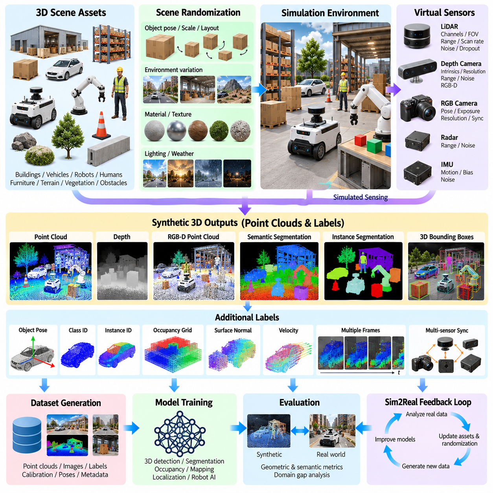{width="7.268055555555556in" height="7.268055555555556in"}

Synthetic point cloud and 3D scene generation extends synthetic data production from two-dimensional images into spatial representations required by autonomous robots. A simulator can construct geometrically defined environments, position virtual range sensors within them, and generate observations that approximate LiDAR, depth-camera, or other 3D sensing outputs. Because every object and surface originates from a known virtual scene, accurate geometry, semantic identity, pose, and spatial relationships can accompany each generated point cloud.

A synthetic 3D scene begins with geometric assets describing robots, buildings, roads, warehouse structures, terrain, vegetation, vehicles, humans, obstacles, and task-specific objects. These assets may originate from CAD models, meshes, procedural geometry, scanned environments, or reusable simulation libraries. Scene composition determines where objects are positioned and how they relate spatially, while physics and semantic information provide additional properties needed for interaction and automatic annotation.

Point clouds are typically generated by simulating the measurement process of a range sensor rather than simply sampling arbitrary points from object meshes. Virtual rays are emitted according to the sensor configuration, intersect the geometry of the simulated environment, and return range measurements from visible surfaces. The resulting three-dimensional coordinates reproduce the viewpoint-dependent structure of physical sensing, including occlusion, limited field of view, distance-dependent density, and missing observations behind foreground objects.

Virtual LiDAR configuration determines the spatial pattern and characteristics of the generated data. Parameters may include the number of vertical channels, horizontal angular resolution, vertical field of view, rotation frequency, maximum and minimum range, sensor pose, scanning pattern, and return behavior. These parameters should reflect the intended physical sensor whenever the synthetic dataset is designed for a specific robot platform, because sensor geometry strongly influences the distribution of observed points.

Depth cameras provide another source of synthetic 3D observations. A simulated depth image records the distance from the camera to visible surfaces for each valid pixel and can subsequently be projected into three-dimensional coordinates using the virtual camera intrinsics. When synchronized RGB and depth images are available, each reconstructed point can also receive color information. This enables the generation of RGB-D point clouds suitable for manipulation, scene reconstruction, object recognition, and indoor robot perception.

Sensor imperfections should be represented when synthetic point clouds are intended for real-world model training. Ideal ray intersections produce geometrically clean measurements that differ from physical sensors. Range noise, angular uncertainty, dropout, minimum and maximum range limits, reflectivity-dependent behavior, motion distortion, calibration offsets, and timing errors can therefore be introduced. Randomizing these properties across realistic ranges reduces dependence on unrealistically perfect simulated observations.

Three-dimensional scene randomization increases geometric diversity beyond the variation available from a fixed virtual environment. Objects can be repositioned, rotated, scaled, duplicated, removed, or replaced between generation episodes. Warehouse shelves may change configuration, boxes may occupy different locations, vehicles and pedestrians may appear at varying distances, and outdoor terrain can change elevation or surface structure. Procedural generation can create many spatial configurations from a limited collection of reusable assets.

Semantic information can be attached directly to points because the simulator knows which object or surface produced each measurement. Points may therefore carry semantic classes such as road, floor, wall, vehicle, pedestrian, vegetation, pallet, shelf, robot, terrain, or obstacle. Instance identifiers can additionally distinguish individual objects belonging to the same class. This automatic correspondence enables large-scale 3D semantic and instance segmentation datasets without manually labeling individual points.

Object-level ground truth can be generated together with the point cloud. Three-dimensional bounding boxes, object centers, dimensions, orientation, velocity, pose, visibility, and class identifiers can be calculated directly from the simulated scene state. Such information supports 3D object detection, tracking, pose estimation, occupancy prediction, and autonomous-driving perception. Unlike manual annotation, simulator-derived labels remain geometrically consistent with the virtual objects from which the sensor observations were generated.

Synthetic scenes can also provide occupancy representations derived from known environment geometry. Space may be divided into voxels or other spatial cells and classified as free, occupied, or unknown according to simulated observations and scene structure. Semantic classes can be added to produce semantic occupancy maps. These representations are valuable for navigation, obstacle avoidance, mapping, scene understanding, and learning-based occupancy prediction because they describe both observed surfaces and spatial structure around the robot.

Temporal point-cloud sequences are important when training systems that operate on dynamic environments. Virtual sensors can capture consecutive scans while the robot, pedestrians, vehicles, manipulators, or other objects move through the scene. Each frame can preserve timestamps, sensor poses, object trajectories, and velocity information. Such sequences support motion estimation, dynamic object detection, tracking, temporal fusion, scene flow, and learning methods that reason across multiple observations rather than isolated frames.

Multi-sensor generation can synchronize LiDAR with RGB cameras, depth cameras, radar, IMU, or robot-state information. Since all virtual sensors operate within the same simulation coordinate system, their extrinsic transformations and timestamps can be precisely controlled. The resulting multimodal dataset can provide aligned images, point clouds, poses, depth, segmentation, and motion information. Controlled perturbations can then be added to study calibration errors, synchronization uncertainty, and sensor-fusion robustness.

Coordinate-frame management is essential for reusable 3D datasets. Point clouds may be expressed in sensor, robot, local-map, or world coordinate frames, and transformations between these frames should be recorded explicitly. Robot pose, sensor extrinsics, reference-frame definitions, and units must remain consistent throughout the dataset. Without this information, geometrically correct point clouds may become difficult to use for localization, mapping, sensor fusion, or cross-frame learning tasks.

Large-scale synthetic 3D generation requires efficient data pipelines because point clouds and scene annotations can consume substantial storage and computational resources. Headless simulation, parallel rendering or ray casting, batched scene generation, compression, and distributed storage can increase throughput. Dataset writers should organize point clouds, labels, calibration parameters, poses, scene metadata, and randomization settings consistently so that millions of observations can be reproduced, searched, filtered, and reused.

Quality validation should examine both geometric correctness and similarity to the intended sensing domain. Point density, range distributions, class frequency, occlusion patterns, sensor coverage, noise characteristics, object distances, and spatial diversity can be compared with representative real measurements. Visual inspection in a 3D viewer is useful for identifying obvious errors, but quantitative comparison and downstream model performance provide stronger evidence that the synthetic dataset captures relevant real-world characteristics.

Synthetic and real point clouds are often most effective when combined. Real measurements provide authentic sensor artifacts, complex materials, environmental irregularities, and deployment-specific conditions, while simulation supplies scalable labels, rare scenarios, controllable geometry, and precise ground truth. Real datasets can therefore guide sensor calibration and randomization ranges, while synthetic generation expands coverage around measured operating conditions and creates scenarios that are difficult or unsafe to collect physically.

Synthetic point cloud and 3D scene generation ultimately transforms a simulation environment into a programmable spatial data source for robot AI. Geometry defines the world, virtual sensors convert that geometry into realistic observations, semantics and simulator state provide automatic labels, and randomization expands environmental and sensor diversity. The resulting datasets can support 3D detection, segmentation, mapping, localization, occupancy reasoning, navigation, manipulation, and multimodal perception within a scalable Sim2Real development pipeline.

합성 포인트 클라우드 및 3차원 장면 생성(Synthetic Point Cloud and 3D Scene Generation)은 합성 데이터 생성(Synthetic Data Generation)을 2차원 이미지에서 자율 로봇에 필요한 공간 표현(Spatial Representation)으로 확장한다. 시뮬레이터(Simulator)는 기하학적으로 정의된 환경을 구성하고 그 안에 가상 거리 센서(Virtual Range Sensor)를 배치하여 라이다(LiDAR), 깊이 카메라(Depth Camera) 또는 기타 3차원 센싱(3D Sensing) 출력을 모사하는 관측 데이터를 생성할 수 있다. 모든 객체와 표면이 알려진 가상 장면에서 생성되므로 정확한 기하학, 의미론적 식별자(Semantic Identity), 자세(Pose), 공간 관계(Spatial Relationship)를 각각의 포인트 클라우드와 함께 제공할 수 있다.

합성 3차원 장면(Synthetic 3D Scene)은 로봇, 건물, 도로, 창고 구조물, 지형, 식생(Vegetation), 차량, 사람, 장애물 및 작업별 객체를 표현하는 기하학적 자산(Geometric Asset)에서 시작한다. 이러한 자산은 캐드 모델(CAD Model), 메시(Mesh), 절차적 기하학(Procedural Geometry), 스캔 환경(Scanned Environment) 또는 재사용 가능한 시뮬레이션 라이브러리에서 가져올 수 있다. 장면 구성(Scene Composition)은 객체의 위치와 공간적 관계를 결정하며, 물리 및 의미론적 정보는 상호작용과 자동 어노테이션(Automatic Annotation)에 필요한 추가적인 속성을 제공한다.

포인트 클라우드(Point Cloud)는 일반적으로 객체 메시에서 임의의 점을 단순히 샘플링하는 것이 아니라 거리 센서의 측정 과정(Measurement Process)을 시뮬레이션하여 생성한다. 가상 광선(Virtual Ray)은 센서 구성에 따라 방출되어 시뮬레이션 환경의 기하학적 구조와 교차하고, 보이는 표면으로부터 거리 측정값을 반환한다. 생성된 3차원 좌표는 가림(Occlusion), 제한된 시야각(Field of View), 거리에 따른 점 밀도(Point Density), 전경 객체 뒤의 누락된 관측 등 실제 센싱에서 나타나는 시점 의존적 구조(Viewpoint-dependent Structure)를 재현한다.

가상 라이다(Virtual LiDAR)의 구성은 생성되는 데이터의 공간적 패턴과 특성을 결정한다. 매개변수에는 수직 채널 수(Number of Vertical Channels), 수평 각도 해상도(Horizontal Angular Resolution), 수직 시야각(Vertical Field of View), 회전 주파수(Rotation Frequency), 최대 및 최소 측정거리, 센서 자세(Sensor Pose), 스캔 패턴(Scanning Pattern), 반환 특성(Return Behavior) 등이 포함될 수 있다. 특정 로봇 플랫폼을 위한 합성 데이터셋을 생성하는 경우 센서의 기하학적 구조가 관측되는 점의 분포에 큰 영향을 주므로 이러한 매개변수는 실제 물리 센서를 가능한 한 적절하게 반영해야 한다.

깊이 카메라(Depth Camera)는 합성 3차원 관측 데이터를 생성하는 또 다른 방법을 제공한다. 시뮬레이션된 깊이 영상(Depth Image)은 유효한 각 픽셀에서 카메라로부터 보이는 표면까지의 거리를 기록하며, 이후 가상 카메라 내부 매개변수(Camera Intrinsics)를 사용하여 3차원 좌표로 투영할 수 있다. 동기화된 RGB 영상과 깊이 영상을 함께 사용할 경우 재구성된 각 점에 색상 정보도 부여할 수 있다. 이를 통해 조작(Manipulation), 장면 재구성(Scene Reconstruction), 객체 인식(Object Recognition), 실내 로봇 인지(Indoor Robot Perception)에 적합한 RGB-D 포인트 클라우드를 생성할 수 있다.

합성 포인트 클라우드를 실제 환경 모델 학습에 사용할 경우 센서의 불완전성(Sensor Imperfection)을 표현해야 한다. 이상적인 광선 교차(Ideal Ray Intersection)는 실제 센서와 다른 지나치게 깨끗한 기하학적 측정값을 생성한다. 따라서 거리 잡음(Range Noise), 각도 불확실성(Angular Uncertainty), 데이터 손실(Dropout), 최소 및 최대 측정거리 제한, 반사율 의존 특성(Reflectivity-dependent Behavior), 모션 왜곡(Motion Distortion), 보정 오프셋(Calibration Offset), 시간 오차(Timing Error) 등을 추가할 수 있다. 이러한 특성을 현실적인 범위에서 랜덤화하면 비현실적으로 완벽한 시뮬레이션 관측값에 대한 모델의 의존성을 줄일 수 있다.

3차원 장면 랜덤화(3D Scene Randomization)는 고정된 가상 환경에서 얻을 수 있는 변화보다 훨씬 넓은 기하학적 다양성(Geometric Diversity)을 제공한다. 객체는 생성 에피소드마다 위치 이동, 회전, 크기 변경, 복제, 제거 또는 교체될 수 있다. 창고 선반은 서로 다른 구성으로 변경되고, 상자는 다양한 위치에 배치되며, 차량과 보행자는 서로 다른 거리에서 등장할 수 있다. 실외 지형 역시 고도(Elevation) 또는 표면 구조를 변화시킬 수 있다. 절차적 생성(Procedural Generation)을 활용하면 제한된 재사용 자산만으로도 다양한 공간 구성을 생성할 수 있다.

시뮬레이터는 각각의 측정값을 생성한 객체 또는 표면을 알고 있으므로 의미론적 정보(Semantic Information)를 개별 점에 직접 연결할 수 있다. 따라서 포인트에는 도로, 바닥, 벽, 차량, 보행자, 식생, 팔레트, 선반, 로봇, 지형, 장애물 등의 의미론적 클래스(Semantic Class)를 부여할 수 있다. 인스턴스 식별자(Instance Identifier)를 추가하면 동일한 클래스에 속하는 개별 객체도 서로 구분할 수 있다. 이러한 자동 대응 관계를 이용하면 개별 점을 사람이 직접 라벨링하지 않고도 대규모 3차원 의미론적 및 인스턴스 분할 데이터셋(3D Semantic and Instance Segmentation Dataset)을 생성할 수 있다.

객체 수준의 정답 데이터(Object-level Ground Truth)도 포인트 클라우드와 함께 생성할 수 있다. 3차원 경계 상자(3D Bounding Box), 객체 중심(Object Center), 크기(Dimension), 방향(Orientation), 속도(Velocity), 자세, 가시성(Visibility), 클래스 식별자를 시뮬레이션 장면 상태에서 직접 계산할 수 있다. 이러한 정보는 3차원 객체 검출(3D Object Detection), 추적(Tracking), 자세 추정(Pose Estimation), 점유 예측(Occupancy Prediction), 자율주행 인지(Autonomous-driving Perception)를 지원한다. 시뮬레이터에서 생성된 라벨은 수작업 어노테이션과 달리 센서 관측을 생성한 가상 객체의 기하학적 구조와 일관성을 유지할 수 있다.

합성 장면은 알려진 환경 기하학으로부터 점유 표현(Occupancy Representation)도 제공할 수 있다. 공간을 복셀(Voxel) 또는 다른 공간 셀(Spatial Cell)로 나누고 시뮬레이션 관측과 장면 구조에 따라 자유 공간(Free), 점유 공간(Occupied), 미확인 공간(Unknown)으로 분류할 수 있다. 여기에 의미론적 클래스를 추가하면 의미론적 점유 지도(Semantic Occupancy Map)를 생성할 수 있다. 이러한 표현은 로봇 주변의 관측 표면과 공간 구조를 함께 나타내므로 내비게이션(Navigation), 장애물 회피(Obstacle Avoidance), 매핑(Mapping), 장면 이해(Scene Understanding), 학습 기반 점유 예측에 활용할 수 있다.

동적 환경에서 동작하는 시스템을 학습하기 위해서는 시간 연속 포인트 클라우드 시퀀스(Temporal Point-cloud Sequence)가 중요하다. 로봇, 보행자, 차량, 매니퓰레이터 또는 다른 객체가 장면 안에서 이동하는 동안 가상 센서가 연속적인 스캔을 획득할 수 있다. 각각의 프레임에는 타임스탬프(Timestamp), 센서 자세, 객체 궤적(Object Trajectory), 속도 정보를 함께 유지할 수 있다. 이러한 시퀀스는 운동 추정(Motion Estimation), 동적 객체 검출(Dynamic Object Detection), 추적, 시간 융합(Temporal Fusion), 장면 흐름(Scene Flow), 그리고 단일 프레임이 아닌 여러 관측에 걸쳐 추론하는 학습 방법을 지원한다.

다중 센서 생성(Multi-sensor Generation)을 이용하면 라이다를 RGB 카메라, 깊이 카메라, 레이더(Radar), 관성측정장치(IMU) 또는 로봇 상태 정보와 동기화할 수 있다. 모든 가상 센서는 동일한 시뮬레이션 좌표계(Simulation Coordinate System) 안에서 동작하므로 외부 매개변수 변환(Extrinsic Transformation)과 타임스탬프를 정밀하게 제어할 수 있다. 생성된 다중 모달 데이터셋(Multimodal Dataset)은 정렬된 영상, 포인트 클라우드, 자세, 깊이, 분할 정보, 운동 정보를 제공할 수 있다. 이후 제어된 교란(Controlled Perturbation)을 추가하여 보정 오차, 동기화 불확실성(Synchronization Uncertainty), 센서 융합 강건성(Sensor-fusion Robustness)을 연구할 수 있다.

좌표계 관리(Coordinate-frame Management)는 재사용 가능한 3차원 데이터셋을 구축하기 위해 필수적이다. 포인트 클라우드는 센서 좌표계(Sensor Frame), 로봇 좌표계(Robot Frame), 로컬 지도 좌표계(Local-map Frame), 월드 좌표계(World Frame) 등으로 표현할 수 있으며, 이들 좌표계 사이의 변환 관계를 명확하게 기록해야 한다. 로봇 자세, 센서 외부 매개변수(Sensor Extrinsics), 기준 좌표계 정의(Reference-frame Definition), 단위(Unit)는 데이터셋 전체에서 일관성을 유지해야 한다. 이러한 정보가 없으면 기하학적으로 정확한 포인트 클라우드라도 위치추정(Localization), 매핑, 센서 융합 또는 좌표계 간 학습 작업에서 활용하기 어려워질 수 있다.

대규모 합성 3차원 데이터 생성(Large-scale Synthetic 3D Generation)은 포인트 클라우드와 장면 어노테이션이 상당한 저장 공간과 계산 자원을 요구하므로 효율적인 데이터 파이프라인(Data Pipeline)이 필요하다. 헤드리스 시뮬레이션(Headless Simulation), 병렬 렌더링 또는 레이 캐스팅(Parallel Ray Casting), 배치 장면 생성(Batched Scene Generation), 압축(Compression), 분산 저장소(Distributed Storage)를 활용하여 처리량을 높일 수 있다. 데이터셋 라이터(Dataset Writer)는 수백만 개의 관측 데이터를 재현, 검색, 필터링, 재사용할 수 있도록 포인트 클라우드, 라벨, 보정 매개변수, 자세, 장면 메타데이터, 랜덤화 설정을 일관되게 구성해야 한다.

품질 검증(Quality Validation)은 기하학적 정확성과 목표 센싱 도메인(Target Sensing Domain)과의 유사성을 함께 평가해야 한다. 점 밀도, 거리 분포(Range Distribution), 클래스 빈도(Class Frequency), 가림 패턴(Occlusion Pattern), 센서 커버리지(Sensor Coverage), 잡음 특성(Noise Characteristic), 객체 거리, 공간적 다양성을 대표적인 실제 측정 데이터와 비교할 수 있다. 3차원 뷰어(3D Viewer)를 통한 시각적 검사는 명백한 오류를 발견하는 데 유용하지만, 정량적 비교(Quantitative Comparison)와 후속 모델 성능(Downstream Model Performance)이 합성 데이터셋이 실제 환경의 관련 특성을 반영하는지를 판단하는 더 강력한 근거가 된다.

합성 포인트 클라우드와 실제 포인트 클라우드는 함께 사용할 때 효과가 더욱 높아질 수 있다. 실제 측정 데이터는 진정한 센서 아티팩트(Sensor Artifact), 복잡한 재질, 환경적 불규칙성(Environmental Irregularity), 실제 배치 환경에 특화된 조건을 제공한다. 반면 시뮬레이션은 확장 가능한 라벨, 희귀 시나리오(Rare Scenario), 제어 가능한 기하학, 정밀한 정답 데이터를 제공한다. 따라서 실제 데이터셋을 이용해 센서 보정 및 랜덤화 범위를 결정하고, 합성 데이터 생성을 통해 측정된 운용 조건 주변의 커버리지를 확대하면서 물리적으로 수집하기 어렵거나 위험한 시나리오를 추가할 수 있다.

궁극적으로 합성 포인트 클라우드 및 3차원 장면 생성은 시뮬레이션 환경을 로봇 인공지능(Robot AI)을 위한 프로그래밍 가능한 공간 데이터 소스(Programmable Spatial Data Source)로 변환한다. 기하학은 가상 세계를 정의하고, 가상 센서는 그 기하학을 현실적인 관측 데이터로 변환하며, 의미론적 정보와 시뮬레이터 상태는 자동 라벨을 제공하고, 랜덤화는 환경 및 센서의 다양성을 확장한다. 이렇게 생성된 데이터셋은 확장 가능한 시뮬레이션-현실 전이(Sim2Real) 개발 파이프라인에서 3차원 검출, 분할, 매핑, 위치추정, 점유 추론(Occupancy Reasoning), 내비게이션, 조작 및 다중 모달 인지(Multimodal Perception)를 지원할 수 있다.

##  

## 09.05. Synthetic Manipulation Demonstration Data Gen [w/Code]

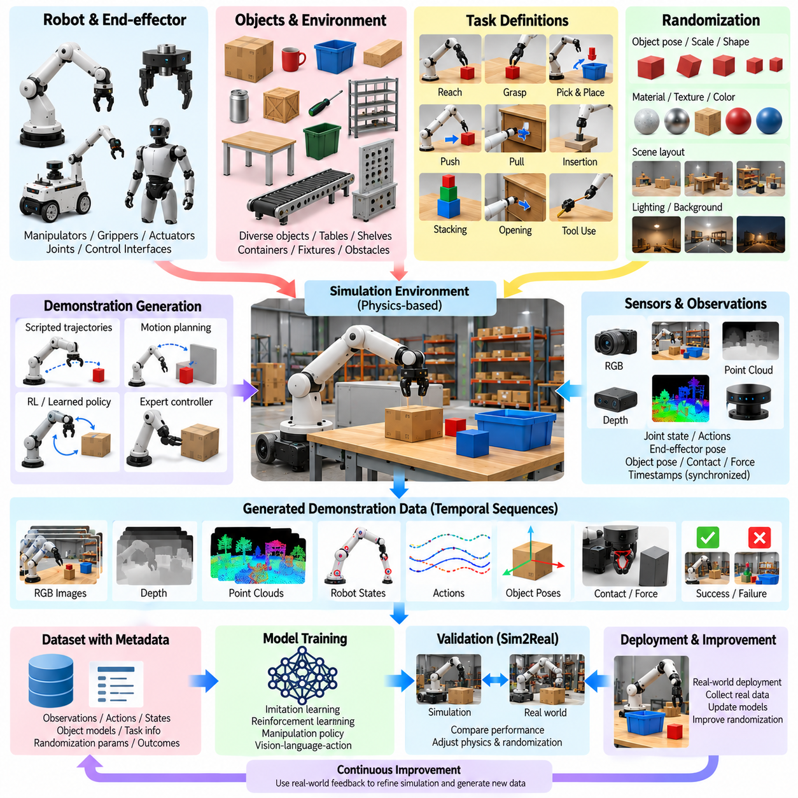{width="7.268055555555556in" height="7.268055555555556in"}

Synthetic manipulation demonstration data generation uses simulation to create large collections of robot manipulation experiences without requiring a physical robot to perform every trial. A virtual manipulator, gripper, object, workspace, and task environment are configured inside a physics-based simulator, and the robot repeatedly performs manipulation actions under controlled variations. Each trial can record observations, robot states, actions, object poses, contacts, forces, and task outcomes, creating structured demonstrations for manipulation learning.

The primary purpose is to provide training data for robots that must learn relationships between perception, action, and physical interaction. Typical tasks include reaching, grasping, picking, placing, pushing, pulling, insertion, stacking, opening, tool use, and object reorientation. Unlike ordinary image datasets, manipulation demonstrations contain temporal sequences in which the robot observes a scene, moves its joints or end-effector, interacts with an object, and produces an outcome. This makes the data useful for imitation learning and other embodied learning methods.

A synthetic manipulation environment begins with accurate robot and object models. The robot model should represent links, joints, actuators, end-effectors, collision geometry, inertial properties, and relevant control interfaces. Objects require geometric models, collision shapes, mass properties, surface characteristics, and semantic identities. The workspace may contain tables, shelves, bins, fixtures, obstacles, and other objects that influence the task. Accurate contact geometry is especially important because manipulation success depends strongly on physical interaction between the robot and its environment.

Task definitions specify what the robot is expected to accomplish and what constitutes success or failure. A grasping task may require an object to be securely enclosed by the gripper, while an insertion task may require a part to reach a specified pose within a tolerance. The simulator can evaluate these conditions automatically using object poses, relative transformations, contact states, forces, joint states, or task-specific constraints. This provides precise outcome labels without requiring human reviewers to inspect every demonstration.

Demonstrations can be generated from scripted trajectories, motion planners, expert controllers, or reinforcement learning policies. A scripted controller may provide simple demonstrations for structured tasks, while a motion planner can generate collision-free trajectories between specified start and goal configurations. An optimized or learned policy can produce more complex behavior involving sequential decisions and physical interaction. Multiple generation methods can be combined so that the dataset contains both structured demonstrations and behavioral diversity.

Object and scene randomization is essential for preventing manipulation policies from memorizing a single configuration. Object position, orientation, scale, shape, mass, friction, and appearance can be varied between episodes. The placement of obstacles, containers, fixtures, and target locations can also change. Randomization should remain within physically and operationally meaningful ranges so that generated demonstrations represent plausible manipulation conditions rather than arbitrary configurations that would not occur on a real robot.

Grasping data can contain detailed information about the relationship between the gripper and the manipulated object. The dataset may record gripper pose, finger positions, object pose, approach direction, contact points, contact forces, grasp success, and subsequent object motion. Multiple successful and unsuccessful grasp attempts can be generated by changing approach configurations and object conditions. Such data can support grasp detection, grasp pose prediction, closed-loop grasp control, and learning-based manipulation policies.

Contact and force information provide an important advantage of simulation-based demonstrations. Physical interaction can be difficult to annotate accurately from real video alone, especially when contact occurs between hidden surfaces. A simulator can directly record collision events, contact locations, normal forces, friction forces, joint torques, and other internal states. These signals can therefore be synchronized with visual observations and actions, creating multimodal demonstrations that expose relationships between what the robot sees, what it does, and how the environment responds.

Temporal synchronization should be maintained across all demonstration modalities. RGB or depth images, point clouds, robot joint positions, velocities, actuator commands, end-effector poses, object states, contact information, and force measurements should share consistent timestamps or frame indices. The resulting trajectory can be represented as a sequence of observations and actions rather than independent samples. This temporal structure is important for imitation learning, trajectory prediction, action modeling, world-model learning, and vision-language-action systems.

Demonstration diversity can be increased by varying initial conditions and execution strategies rather than changing only visual appearance. Different robot starting poses, object arrangements, approach directions, speeds, grasp configurations, and recovery behaviors can produce distinct trajectories for the same task. Controlled perturbations can also introduce small execution errors, external disturbances, or object displacement. These variations help models learn robust behavior instead of reproducing one deterministic trajectory that succeeds only under ideal conditions.

Synthetic demonstrations can also include failure cases because simulation allows unsuccessful actions to be generated safely and repeatedly. A gripper may approach an object from an unsuitable direction, collide with an obstacle, lose contact, miss the grasp, or place an object outside the target region. Recording these failures with their corresponding states and actions provides valuable negative examples. Models can use such information to learn failure prediction, recovery behavior, action selection, and more robust manipulation strategies.

The resulting dataset should preserve complete provenance for every demonstration. Metadata can identify the robot model, object assets, task definition, simulator version, physics parameters, random seed, initial state, controller or policy used to generate the trajectory, sensor configuration, and final outcome. Recording this information makes successful demonstrations reproducible and allows researchers to determine why a particular trajectory was generated. Dataset versioning is also important when robot models, object assets, physics parameters, or task definitions are modified.

Synthetic manipulation demonstrations should be validated against physical robot behavior before being treated as representative training data. Real experiments can reveal differences in actuator response, joint friction, compliance, contact behavior, object deformation, perception noise, calibration, latency, and grasp mechanics. These differences can be incorporated into simulation through system identification and parameter randomization. The objective is not necessarily to reproduce every physical detail, but to ensure that the generated demonstrations contain the variations that materially affect manipulation performance.

A hybrid strategy can combine synthetic demonstrations with real demonstrations to balance scale and realism. Simulation provides large quantities of automatically labeled trajectories and enables rare or difficult interactions to be generated safely, while real demonstrations capture physical effects that may be difficult to model accurately. Synthetic data can therefore provide broad coverage and pretraining, while real data can refine the learned policy and correct simulation-specific biases. This combination is particularly useful when physical demonstration collection is expensive or time-consuming.

Synthetic manipulation demonstration generation ultimately converts a simulated manipulation environment into a scalable source of embodied learning data. Robot and object models define the physical interaction space, task logic defines success, controllers or learned policies generate trajectories, sensors provide observations, and simulator state supplies synchronized labels. With systematic randomization, contact modeling, temporal recording, failure generation, provenance management, and real-world validation, the resulting demonstrations can support imitation learning, reinforcement learning, manipulation policy learning, and broader Physical AI systems.

합성 조작 시연 데이터 생성(Synthetic Manipulation Demonstration Data Generation)은 물리적 로봇이 모든 시도를 직접 수행하지 않아도 대규모 로봇 조작 경험(Robot Manipulation Experience)을 생성하기 위해 시뮬레이션을 사용하는 방법이다. 가상 매니퓰레이터(Virtual Manipulator), 그리퍼(Gripper), 객체(Object), 작업공간(Workspace), 작업 환경(Task Environment)을 물리 기반 시뮬레이터(Physics-based Simulator) 안에 구성하고, 제어된 변화 조건에서 로봇이 반복적으로 조작 행동을 수행하도록 한다. 각각의 시도에서 관측(Observation), 로봇 상태(Robot State), 행동(Action), 객체 자세(Object Pose), 접촉(Contact), 힘(Force), 작업 결과(Task Outcome) 등을 기록하여 조작 학습(Manipulation Learning)을 위한 구조화된 시연 데이터(Structured Demonstration)를 생성할 수 있다.

주요 목적은 인지(Perception), 행동(Action), 물리적 상호작용(Physical Interaction) 사이의 관계를 학습해야 하는 로봇을 위한 학습 데이터를 제공하는 것이다. 일반적인 작업에는 도달(Reach), 파지(Grasp), 집기(Pick), 놓기(Place), 밀기(Push), 당기기(Pull), 삽입(Insertion), 적재(Stacking), 열기(Opening), 도구 사용(Tool Use), 객체 방향 변경(Object Reorientation) 등이 포함된다. 일반적인 이미지 데이터셋과 달리 조작 시연 데이터는 로봇이 장면을 관측하고, 관절 또는 말단장치(End-effector)를 움직이며, 객체와 상호작용하고, 결과를 생성하는 시간적 시퀀스(Temporal Sequence)를 포함한다. 따라서 모방학습(Imitation Learning)과 다양한 체화 학습(Embodied Learning) 방법에 활용할 수 있다.

합성 조작 환경(Synthetic Manipulation Environment)은 정확한 로봇 및 객체 모델에서 시작한다. 로봇 모델은 링크(Links), 관절(Joints), 액추에이터(Actuators), 말단장치, 충돌 형상(Collision Geometry), 관성 특성(Inertial Properties), 관련 제어 인터페이스(Control Interface)를 표현해야 한다. 객체에는 기하학적 모델, 충돌 형상, 질량 특성(Mass Properties), 표면 특성(Surface Characteristics), 의미론적 식별자(Semantic Identity)가 필요하다. 작업공간에는 테이블, 선반, 상자, 고정구(Fixture), 장애물 및 작업에 영향을 미치는 기타 객체를 배치할 수 있다. 조작 성공은 로봇과 환경 사이의 물리적 상호작용에 크게 의존하므로 정확한 접촉 기하(Contact Geometry)가 특히 중요하다.

작업 정의(Task Definition)는 로봇이 수행해야 할 작업과 성공 또는 실패를 판단하는 기준을 지정한다. 파지 작업에서는 객체가 그리퍼에 안정적으로 고정되는 것이 필요할 수 있으며, 삽입 작업에서는 부품이 허용 오차(Tolerance) 범위 내의 지정된 자세에 도달해야 할 수 있다. 시뮬레이터는 객체 자세, 상대 변환(Relative Transformation), 접촉 상태, 힘, 관절 상태, 작업별 제약조건(Task-specific Constraint)을 사용하여 이러한 조건을 자동으로 평가할 수 있다. 이를 통해 모든 시연을 사람이 직접 검사하지 않고도 정밀한 결과 라벨(Outcome Label)을 생성할 수 있다.

시연(Demonstration)은 스크립트 궤적(Scripted Trajectory), 모션 플래너(Motion Planner), 전문가 제어기(Expert Controller), 강화학습 정책(Reinforcement Learning Policy) 등을 이용하여 생성할 수 있다. 스크립트 제어기는 구조화된 작업을 위한 간단한 시연을 제공할 수 있고, 모션 플래너는 지정된 시작 구성과 목표 구성 사이에서 충돌 없는 궤적(Collision-free Trajectory)을 생성할 수 있다. 최적화된 정책 또는 학습된 정책은 순차적인 의사결정과 물리적 상호작용이 포함된 보다 복잡한 행동을 생성할 수 있다. 여러 생성 방법을 결합하면 구조화된 시연과 행동 다양성(Behavioral Diversity)을 모두 포함하는 데이터셋을 구축할 수 있다.

조작 정책이 하나의 구성만을 암기하는 것을 방지하기 위해 객체 및 장면 랜덤화(Object and Scene Randomization)가 필수적이다. 에피소드마다 객체 위치, 방향, 크기, 형상, 질량, 마찰, 외형을 변화시킬 수 있다. 장애물, 컨테이너, 고정구, 목표 위치(Target Location)의 배치도 변경할 수 있다. 랜덤화는 물리적 및 운용적으로 의미 있는 범위 안에서 이루어져야 하며, 실제 로봇에서 발생할 수 없는 임의적인 구성이 아니라 현실적인 조작 조건을 표현해야 한다.

파지 데이터(Grasping Data)는 그리퍼와 조작 대상 객체 사이의 관계에 대한 상세한 정보를 포함할 수 있다. 데이터셋에는 그리퍼 자세, 손가락 위치, 객체 자세, 접근 방향(Approach Direction), 접촉점(Contact Point), 접촉력(Contact Force), 파지 성공 여부, 이후 객체의 움직임 등을 기록할 수 있다. 접근 구성과 객체 조건을 변화시키면서 다양한 성공 및 실패 파지 시도를 생성할 수 있다. 이러한 데이터는 파지 검출(Grasp Detection), 파지 자세 예측(Grasp Pose Prediction), 폐루프 파지 제어(Closed-loop Grasp Control), 학습 기반 조작 정책(Learning-based Manipulation Policy)을 지원할 수 있다.

접촉 및 힘 정보(Contact and Force Information)는 시뮬레이션 기반 시연이 제공하는 중요한 장점이다. 실제 영상만으로 물리적 상호작용을 정확하게 어노테이션(Annotation)하는 것은 특히 접촉이 가려진 표면 사이에서 발생할 경우 어려울 수 있다. 시뮬레이터는 충돌 이벤트(Collision Event), 접촉 위치, 법선력(Normal Force), 마찰력(Friction Force), 관절 토크(Joint Torque) 및 기타 내부 상태를 직접 기록할 수 있다. 따라서 이러한 신호를 시각적 관측과 행동에 동기화하여 로봇이 무엇을 보고, 무엇을 행동하며, 환경이 어떻게 반응하는지 사이의 관계를 보여주는 다중 모달 시연(Multimodal Demonstration)을 생성할 수 있다.

모든 시연 모달리티(Demonstration Modality) 사이에서 시간 동기화(Temporal Synchronization)를 유지해야 한다. RGB 또는 깊이 영상, 로봇 관절 위치, 속도, 액추에이터 명령, 말단장치 자세, 객체 상태, 접촉 정보, 힘 측정값은 일관된 타임스탬프(Timestamp) 또는 프레임 인덱스(Frame Index)를 공유해야 한다. 결과 궤적은 독립적인 샘플이 아니라 관측과 행동의 시퀀스로 표현할 수 있다. 이러한 시간적 구조는 모방학습, 궤적 예측(Trajectory Prediction), 행동 모델링(Action Modeling), 월드 모델(World Model) 학습, 비전-언어-행동(Vision-Language-Action) 시스템에 중요하다.

시연의 다양성(Demonstration Diversity)은 시각적 외형만 변경하는 것이 아니라 초기 조건과 실행 전략을 변화시켜 증가시킬 수 있다. 서로 다른 로봇 시작 자세, 객체 배치, 접근 방향, 속도, 파지 구성, 복구 행동(Recovery Behavior)은 동일한 작업에 대해 서로 다른 궤적을 생성할 수 있다. 제어된 교란(Controlled Perturbation)을 통해 작은 실행 오류, 외부 교란, 객체 변위(Object Displacement)를 추가할 수도 있다. 이러한 변화는 모델이 하나의 결정론적 궤적(Deterministic Trajectory)을 그대로 재현하는 대신 강건한 행동(Robust Behavior)을 학습하도록 돕는다.

합성 시연에는 실패 사례(Failure Case)도 포함할 수 있다. 시뮬레이션에서는 실패 행동을 안전하고 반복적으로 생성할 수 있기 때문이다. 그리퍼가 부적절한 방향에서 객체에 접근하거나, 장애물과 충돌하거나, 접촉을 잃거나, 파지에 실패하거나, 목표 영역 밖에 객체를 놓을 수 있다. 이러한 실패를 해당 상태 및 행동과 함께 기록하면 중요한 부정적 예제(Negative Example)가 된다. 모델은 이러한 정보를 이용하여 실패 예측(Failure Prediction), 복구 행동(Recovery Behavior), 행동 선택(Action Selection), 보다 강건한 조작 전략을 학습할 수 있다.

생성된 데이터셋은 모든 시연에 대한 완전한 데이터 출처 정보(Provenance)를 유지해야 한다. 메타데이터에는 로봇 모델, 객체 자산(Object Asset), 작업 정의, 시뮬레이터 버전, 물리 매개변수, 랜덤 시드(Random Seed), 초기 상태, 궤적을 생성하는 데 사용된 제어기 또는 정책, 센서 구성, 최종 결과를 기록할 수 있다. 이러한 정보를 기록하면 성공적인 시연을 재현할 수 있고 특정 궤적이 왜 생성되었는지를 분석할 수 있다. 로봇 모델, 객체 자산, 물리 매개변수 또는 작업 정의가 변경될 경우 데이터셋 버전 관리(Dataset Versioning)도 중요하다.

합성 조작 시연은 실제 로봇 행동과 비교하여 검증한 후 대표적인 학습 데이터로 취급해야 한다. 실제 실험에서는 액추에이터 응답(Actuator Response), 관절 마찰(Joint Friction), 순응성(Compliance), 접촉 거동(Contact Behavior), 객체 변형(Object Deformation), 인지 잡음(Perception Noise), 보정(Calibration), 지연시간(Latency), 파지 역학(Grasp Mechanics)에서 차이가 나타날 수 있다. 이러한 차이는 시스템 식별(System Identification)과 매개변수 랜덤화를 통해 시뮬레이션에 반영할 수 있다. 목표는 모든 물리적 세부사항을 완벽하게 재현하는 것이 아니라 조작 성능에 실질적으로 영향을 미치는 변화가 생성된 시연에 포함되도록 하는 것이다.

하이브리드 전략(Hybrid Strategy)은 규모와 현실성을 균형 있게 확보하기 위해 합성 시연과 실제 시연을 결합할 수 있다. 시뮬레이션은 자동으로 라벨링된 대량의 궤적을 제공하고 희귀하거나 어려운 상호작용을 안전하게 생성할 수 있는 반면, 실제 시연은 정확하게 모델링하기 어려운 물리적 효과를 포함한다. 따라서 합성 데이터는 광범위한 커버리지와 사전학습(Pretraining)을 제공하고, 실제 데이터는 학습된 정책을 정제하며 시뮬레이션 특유의 편향(Simulation-specific Bias)을 보정할 수 있다. 이러한 조합은 실제 조작 시연 데이터 수집이 비용이 높거나 시간이 오래 걸리는 경우 특히 유용하다.

궁극적으로 합성 조작 시연 데이터 생성은 시뮬레이션된 조작 환경을 체화 학습 데이터(Embodied Learning Data)를 위한 확장 가능한 데이터 소스로 변환한다. 로봇과 객체 모델은 물리적 상호작용 공간을 정의하고, 작업 로직(Task Logic)은 성공 조건을 정의하며, 제어기 또는 학습된 정책은 궤적을 생성하고, 센서는 관측 데이터를 제공하며, 시뮬레이터 상태는 동기화된 라벨을 제공한다. 체계적인 랜덤화, 접촉 모델링(Contact Modeling), 시간 정보 기록, 실패 데이터 생성, 데이터 출처 관리(Provenance Management), 실제 환경 검증(Real-world Validation)을 결합하면 이러한 시연 데이터는 모방학습, 강화학습, 조작 정책 학습(Manipulation Policy Learning), 그리고 더 광범위한 Physical AI 시스템을 지원할 수 있다.

##  

## 09.06. Synthetic Gait and Locomotion Data for Legged Robots [w/Code]

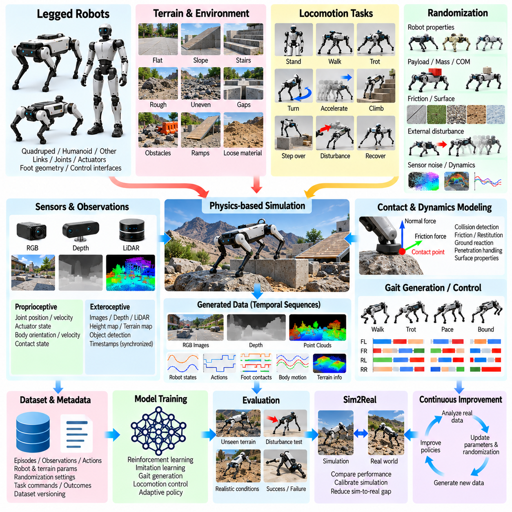{width="7.268055555555556in" height="7.268055555555556in"}

Synthetic gait and locomotion data generation provides a scalable method for training legged robots without requiring physical robots to perform every movement experiment. A physics-based simulator can model a quadruped, humanoid, or other legged platform together with terrain, contact surfaces, obstacles, and environmental conditions. The robot can then execute thousands or millions of simulated locomotion episodes while recording joint states, body motion, foot contacts, actuator commands, forces, terrain information, and task outcomes.

The central objective is to generate diverse relationships between terrain conditions, robot states, actions, and resulting motion. A locomotion dataset is therefore more than a collection of successful walking trajectories. It can include standing, starting, stopping, turning, acceleration, deceleration, stepping over obstacles, climbing slopes, recovering from disturbances, and maintaining balance. These temporal sequences provide training material for gait generation, locomotion control, reinforcement learning, imitation learning, and adaptive physical AI policies.

The simulated robot model must represent the properties that strongly influence locomotion behavior. Links, joints, inertial parameters, joint limits, actuators, transmissions, foot geometry, collision models, and control interfaces should be represented consistently. The relationship between commanded torque or position and resulting joint motion is particularly important. If the actuator model is unrealistically ideal, a learned locomotion policy may depend on capabilities that cannot be reproduced by the physical robot.

Terrain diversity is a major component of synthetic locomotion data. Flat floors can be combined with slopes, steps, stairs, uneven surfaces, gaps, ramps, loose materials, rough terrain, and height variations. Terrain geometry can be generated procedurally so that each training episode presents a different walking challenge. The objective is to expose the policy to a broad but physically plausible range of conditions rather than allowing it to memorize one fixed terrain configuration.

Contact modeling is especially important for legged robots because locomotion emerges from repeated interactions between feet and the environment. The simulator must represent collision detection, contact forces, friction, restitution, penetration handling, and ground reaction behavior with sufficient stability. Variations in friction and surface properties can be introduced to represent different terrain conditions. These variations encourage the policy to learn stable movement strategies rather than relying on a single ideal contact condition.

Gait generation can be represented through periodic leg coordination patterns or learned directly from control policies. Conventional gait structures may include walk, trot, pace, bound, or other coordinated patterns depending on the robot morphology. Synthetic data can record the timing and phase relationships between individual legs, foot trajectories, contact states, body velocity, and center-of-mass motion. These observations provide useful training signals for systems that learn to generate or adapt gait patterns according to speed and terrain.

Randomization should extend beyond terrain geometry. Robot mass, payload, center of mass, joint damping, motor strength, actuator delay, friction, contact parameters, and sensor noise can be varied within realistic ranges. External disturbances such as pushes, sudden terrain changes, or temporary loss of traction can also be introduced. Such perturbations produce recovery trajectories and encourage policies to develop robustness against uncertainty rather than optimizing only for nominal simulation conditions.

Locomotion data should contain synchronized proprioceptive and exteroceptive information whenever the target system uses both. Proprioceptive observations may include joint positions, velocities, accelerations, actuator states, body orientation, angular velocity, and estimated contact states. Exteroceptive observations may include height maps, depth images, LiDAR measurements, terrain geometry, or visual observations. Synchronizing these observations with actions and timestamps allows models to learn how sensory information should influence locomotion decisions.

Footstep and contact information provides another valuable representation of locomotion behavior. Each foot can be associated with contact timing, contact position, vertical force, tangential force, velocity, and swing or stance state. These signals allow the dataset to represent not only where the robot moves but also how its feet interact with the ground. Contact sequences can subsequently support foothold planning, gait classification, terrain adaptation, balance control, and learning-based locomotion.

Body-level dynamics should also be recorded because successful locomotion depends on maintaining a stable relationship between the robot\'s center of mass and its support region. Body position, linear velocity, angular velocity, orientation, center-of-mass trajectory, and momentum-related quantities can be synchronized with joint and contact data. These variables provide useful supervisory information for policies that must coordinate individual limbs while simultaneously maintaining whole-body stability.

Synthetic locomotion data can include both successful and unsuccessful episodes. A robot may stumble, slip, collide with terrain, lose balance, fail to clear an obstacle, or fall after an external disturbance. These events should not necessarily be discarded because they contain information about the boundaries of stable behavior. Failure trajectories can support recovery-policy learning, failure prediction, value estimation, curriculum design, and safety-oriented evaluation. The simulator allows such failures to be generated repeatedly without risking physical hardware.

Curriculum generation can gradually increase locomotion difficulty as the policy improves. Early episodes may use flat terrain and moderate commands, while later episodes introduce slopes, obstacles, higher speeds, payload changes, reduced friction, disturbances, or combinations of these conditions. Difficulty can also be selected according to measured policy performance. This creates a training process in which the simulation distribution evolves from basic locomotion toward increasingly challenging physical situations.

For reinforcement learning, the simulator can generate experience by executing a policy across many parallel environments. Each environment can use different terrain, physical parameters, initial states, disturbances, and command targets. Observations, actions, rewards, contacts, and termination conditions are collected continuously. GPU-accelerated parallel simulation can therefore produce very large experience datasets and significantly increase the number of physical situations explored during policy learning.

For imitation learning, synthetic demonstrations can be generated from expert controllers, motion planners, trajectory optimizers, or previously trained policies. These demonstrations may provide desired joint trajectories, footstep sequences, body motions, or actuator commands. Multiple expert behaviors can be generated under different terrain and command conditions, creating a broader demonstration distribution. The resulting dataset can be used for behavior cloning or as an initialization for subsequent reinforcement learning.

Simulated locomotion policies must eventually be evaluated against physical robot behavior. Real-world experiments may reveal differences in motor response, mechanical compliance, joint friction, sensor latency, actuator saturation, contact dynamics, battery state, and terrain interaction. These differences can be used to calibrate the simulator and refine its parameter distributions. The goal of this Sim2Real process is to reduce sensitivity to simulation-specific assumptions while retaining the scalability of synthetic training.

A practical pipeline should preserve the provenance of every locomotion trajectory. Metadata can include robot configuration, terrain parameters, physics settings, random seed, command target, initial state, controller or policy version, sensor configuration, and episode outcome. Recording this information makes individual trajectories reproducible and allows failures to be traced back to the conditions that produced them. Dataset versioning becomes increasingly important as robot models, simulation parameters, and policies evolve.

The generated data should be evaluated statistically as well as through downstream locomotion performance. Terrain distributions, gait frequencies, speed ranges, contact durations, body-motion statistics, failure rates, and disturbance conditions can be analyzed to identify gaps in coverage. Models trained with different synthetic distributions can then be evaluated on unseen simulated environments and physical robot tests. This separates the quality of the generated dataset from the visual appearance of the simulation and focuses evaluation on transferable locomotion behavior.

A hybrid real-synthetic strategy can combine large-scale simulation with a smaller amount of physical robot data. Simulation provides broad terrain coverage, controlled disturbances, automatic state labels, and safe failure generation, while real data provides authentic actuator, contact, sensing, and mechanical behavior. Real observations can calibrate important simulation parameters, and synthetic data can expand around those measured conditions. This approach is particularly valuable when physical locomotion experiments are expensive, slow, or potentially damaging to hardware.

Synthetic gait and locomotion data generation ultimately creates a controlled training space in which a legged robot can learn the relationship between terrain, body dynamics, foot contact, sensory observations, and control actions. Accurate robot and contact models provide the physical foundation, terrain and parameter randomization provide diversity, temporal state-action records provide learning signals, and large-scale simulation provides the experience required for policy optimization. Combined with real-world validation and iterative Sim2Real refinement, this methodology supports robust locomotion policies for quadruped, humanoid, and other legged Physical AI systems.

합성 보행 및 이동 데이터 생성(Synthetic Gait and Locomotion Data Generation)은 물리적 로봇이 모든 움직임 실험을 수행하지 않아도 다족 보행 로봇(Legged Robot)을 학습시키기 위한 대규모 데이터를 생성할 수 있는 확장 가능한 방법이다. 물리 기반 시뮬레이터(Physics-based Simulator)는 사족보행 로봇(Quadruped), 휴머노이드(Humanoid) 또는 기타 다족 플랫폼을 지형, 접촉면(Contact Surface), 장애물, 환경 조건과 함께 모델링할 수 있다. 이후 로봇은 수천 또는 수백만 개의 시뮬레이션 이동 에피소드(Locomotion Episode)를 수행하면서 관절 상태(Joint State), 본체 운동(Body Motion), 발 접촉(Foot Contact), 액추에이터 명령(Actuator Command), 힘(Force), 지형 정보(Terrain Information), 작업 결과(Task Outcome)를 기록할 수 있다.

핵심 목적은 지형 조건, 로봇 상태, 행동(Action), 결과적인 운동 사이의 다양한 관계를 생성하는 것이다. 따라서 이동 데이터셋(Locomotion Dataset)은 성공적인 보행 궤적(Walking Trajectory)만으로 구성되는 것이 아니다. 서기(Standing), 출발(Starting), 정지(Stopping), 회전(Turning), 가속(Acceleration), 감속(Deceleration), 장애물 넘기(Stepping over Obstacles), 경사면 오르기(Climbing Slopes), 교란 복구(Recovery from Disturbances), 균형 유지(Balance Maintenance) 등을 포함할 수 있다. 이러한 시간적 시퀀스(Temporal Sequence)는 보행 생성(Gait Generation), 이동 제어(Locomotion Control), 강화학습(Reinforcement Learning), 모방학습(Imitation Learning), 적응형 Physical AI 정책(Adaptive Physical AI Policy)을 위한 학습 데이터를 제공한다.

시뮬레이션된 로봇 모델은 이동 거동에 큰 영향을 미치는 특성을 표현해야 한다. 링크(Links), 관절(Joints), 관성 매개변수(Inertial Parameters), 관절 한계(Joint Limits), 액추에이터(Actuator), 전달장치(Transmission), 발 형상(Foot Geometry), 충돌 모델(Collision Model), 제어 인터페이스(Control Interface)를 일관되게 표현해야 한다. 명령된 토크(Torque) 또는 위치(Position)와 실제 관절 운동 사이의 관계가 특히 중요하다. 액추에이터 모델이 비현실적으로 이상적이면 학습된 이동 정책(Locomotion Policy)이 실제 로봇에서 재현할 수 없는 능력에 의존하게 될 수 있다.

지형 다양성(Terrain Diversity)은 합성 이동 데이터의 핵심 구성요소이다. 평평한 바닥은 경사면, 단차, 계단, 틈, 램프, 느슨한 재질, 거친 지형, 높이 변화 등과 결합할 수 있다. 지형 형상(Terrain Geometry)은 절차적으로 생성(Procedural Generation)하여 각 학습 에피소드마다 서로 다른 보행 과제를 제공할 수 있다. 목적은 하나의 고정된 지형 구성을 암기하도록 하는 것이 아니라, 광범위하면서도 물리적으로 타당한 조건에 정책이 노출되도록 하는 것이다.

접촉 모델링(Contact Modeling)은 다족 보행 로봇에서 특히 중요하다. 이동은 발과 환경 사이의 반복적인 상호작용을 통해 발생하기 때문이다. 시뮬레이터는 충돌 검출(Collision Detection), 접촉력(Contact Force), 마찰(Friction), 반발계수(Restitution), 침투 처리(Penetration Handling), 지면 반력(Ground Reaction Behavior)을 충분한 안정성으로 표현해야 한다. 서로 다른 지형 조건을 표현하기 위해 마찰과 표면 특성을 변화시킬 수 있다. 이러한 변화는 정책이 하나의 이상적인 접촉 조건에 의존하지 않고 안정적인 이동 전략을 학습하도록 한다.

보행 생성(Gait Generation)은 주기적인 다리 협응 패턴(Periodic Leg Coordination Pattern)으로 표현하거나 제어 정책(Control Policy)을 통해 직접 학습할 수 있다. 기존의 보행 구조에는 로봇 형태에 따라 워크(Walk), 트롯(Trot), 페이스(Pace), 바운드(Bound) 등의 패턴이 포함될 수 있다. 합성 데이터는 개별 다리 사이의 타이밍과 위상 관계(Phase Relationship), 발 궤적(Foot Trajectory), 접촉 상태(Contact State), 본체 속도(Body Velocity), 질량중심 운동(Center-of-mass Motion)을 기록할 수 있다. 이러한 정보는 속도와 지형에 따라 보행 패턴을 생성하거나 적응하는 시스템을 학습시키는 데 유용하다.

랜덤화(Randomization)는 지형 형상에만 적용해서는 안 된다. 로봇 질량, 페이로드(Payload), 무게중심(Center of Mass), 관절 감쇠(Joint Damping), 모터 출력(Motor Strength), 액추에이터 지연(Actuator Delay), 마찰, 접촉 매개변수(Contact Parameter), 센서 잡음(Sensor Noise)을 현실적인 범위에서 변화시킬 수 있다. 밀기(Push), 갑작스러운 지형 변화, 일시적인 접지력 상실(Loss of Traction)과 같은 외부 교란도 추가할 수 있다. 이러한 교란은 복구 궤적(Recovery Trajectory)을 생성하며, 정책이 정상적인 시뮬레이션 조건만을 최적화하는 대신 불확실성에 대한 강건성(Robustness)을 확보하도록 한다.

목표 시스템이 고유수용성(Proprioceptive) 정보와 외부환경 인지(Exteroceptive) 정보를 함께 사용하는 경우 이동 데이터에는 이들을 동기화하여 포함해야 한다. 고유수용성 관측에는 관절 위치, 속도, 가속도, 액추에이터 상태, 본체 방향(Body Orientation), 각속도(Angular Velocity), 추정 접촉 상태 등이 포함될 수 있다. 외부환경 관측에는 높이 맵(Height Map), 깊이 영상(Depth Image), 라이다 측정(LiDAR Measurement), 지형 형상 또는 시각적 관측(Visual Observation)이 포함될 수 있다. 이러한 관측을 행동 및 타임스탬프(Timestamp)와 동기화하면 모델은 감각 정보가 이동 의사결정에 어떻게 영향을 주어야 하는지를 학습할 수 있다.

발 디딤 및 접촉 정보(Footstep and Contact Information)는 이동 거동을 표현하는 또 다른 중요한 데이터이다. 각 발에는 접촉 시점(Contact Timing), 접촉 위치(Contact Position), 수직력(Vertical Force), 접선력(Tangential Force), 속도, 스윙 또는 지지 상태(Swing or Stance State)를 연결할 수 있다. 이러한 신호는 로봇이 어디로 이동하는지만이 아니라 발이 지면과 어떻게 상호작용하는지도 데이터셋에 표현할 수 있도록 한다. 접촉 시퀀스(Contact Sequence)는 이후 발 디딤 위치 계획(Foothold Planning), 보행 분류(Gait Classification), 지형 적응(Terrain Adaptation), 균형 제어(Balance Control), 학습 기반 이동에 활용할 수 있다.

본체 수준의 동역학(Body-level Dynamics)도 기록해야 한다. 성공적인 이동은 로봇의 질량중심과 지지 영역(Support Region) 사이의 안정적인 관계를 유지하는 것에 크게 의존하기 때문이다. 본체 위치, 선속도(Linear Velocity), 각속도, 방향, 질량중심 궤적, 운동량 관련 변수(Momentum-related Quantity)를 관절 및 접촉 데이터와 동기화할 수 있다. 이러한 변수는 개별 사지를 협응시키는 동시에 전체 본체의 안정성을 유지해야 하는 정책을 위한 유용한 지도 정보(Supervisory Information)를 제공한다.

합성 이동 데이터에는 성공 및 실패 에피소드(Successful and Unsuccessful Episode)를 모두 포함할 수 있다. 로봇은 비틀거리거나(Stumble), 미끄러지거나(Slip), 지형과 충돌하거나, 장애물을 넘지 못하거나, 외부 교란 이후 균형을 잃고 넘어질 수 있다. 이러한 사건을 반드시 제거할 필요는 없다. 오히려 안정적인 행동의 경계(Boundary of Stable Behavior)에 대한 정보를 포함하기 때문이다. 실패 궤적(Failure Trajectory)은 복구 정책 학습(Recovery-policy Learning), 실패 예측(Failure Prediction), 가치 추정(Value Estimation), 커리큘럼 설계(Curriculum Design), 안전 중심 평가(Safety-oriented Evaluation)를 지원할 수 있다. 시뮬레이터에서는 물리적 하드웨어에 위험을 주지 않고 이러한 실패를 반복적으로 생성할 수 있다.

커리큘럼 생성(Curriculum Generation)은 정책이 향상됨에 따라 이동 난이도를 점진적으로 높일 수 있다. 초기 에피소드에서는 평평한 지형과 중간 수준의 명령을 사용하고, 이후 경사면, 장애물, 높은 속도, 페이로드 변화, 낮은 마찰, 교란 또는 이들의 조합을 도입할 수 있다. 정책 성능을 측정한 결과에 따라 난이도를 선택할 수도 있다. 이를 통해 시뮬레이션 분포(Simulation Distribution)가 기본적인 이동에서 점점 더 어려운 물리적 상황으로 발전하는 학습 과정을 구성할 수 있다.

강화학습(Reinforcement Learning)을 위해 시뮬레이터는 여러 병렬 환경(Parallel Environment)에서 정책을 실행하여 경험(Experience)을 생성할 수 있다. 각 환경은 서로 다른 지형, 물리 매개변수, 초기 상태, 교란, 명령 목표(Command Target)를 사용할 수 있다. 관측, 행동, 보상, 접촉, 종료 조건(Termination Condition)을 지속적으로 수집한다. 따라서 GPU 가속 병렬 시뮬레이션(GPU-accelerated Parallel Simulation)은 매우 큰 경험 데이터셋을 생성하고 정책 학습 과정에서 탐색되는 물리적 상황의 수를 크게 증가시킬 수 있다.

모방학습(Imitation Learning)을 위해 합성 시연 데이터(Synthetic Demonstration)는 전문가 제어기(Expert Controller), 모션 플래너(Motion Planner), 궤적 최적화기(Trajectory Optimizer), 기존에 학습된 정책 등을 이용하여 생성할 수 있다. 이러한 시연은 목표 관절 궤적, 발 디딤 시퀀스(Footstep Sequence), 본체 운동 또는 액추에이터 명령을 제공할 수 있다. 서로 다른 지형과 명령 조건에서 여러 전문가 행동을 생성하면 보다 넓은 시연 분포(Demonstration Distribution)를 구축할 수 있다. 이러한 데이터셋은 행동 복제(Behavior Cloning)를 위해 사용하거나 이후 강화학습의 초기화 데이터로 사용할 수 있다.

시뮬레이션된 이동 정책은 궁극적으로 실제 로봇의 행동과 비교하여 평가해야 한다. 실제 환경 실험에서는 모터 응답, 기계적 순응성(Mechanical Compliance), 관절 마찰, 센서 지연, 액추에이터 포화(Actuator Saturation), 접촉 동역학(Contact Dynamics), 배터리 상태, 지형 상호작용 등에서 차이가 나타날 수 있다. 이러한 차이를 활용하여 시뮬레이터를 보정하고 매개변수 분포를 개선할 수 있다. 이러한 Sim2Real 과정의 목표는 시뮬레이션 고유의 가정에 대한 민감도를 줄이면서 합성 학습의 확장성을 유지하는 것이다.

실용적인 파이프라인은 모든 이동 궤적에 대한 데이터 출처(Provenance)를 보존해야 한다. 메타데이터에는 로봇 구성, 지형 매개변수, 물리 설정, 랜덤 시드, 명령 목표, 초기 상태, 제어기 또는 정책 버전, 센서 구성, 에피소드 결과를 포함할 수 있다. 이러한 정보를 기록하면 개별 궤적을 재현할 수 있으며, 실패가 어떤 조건에서 발생했는지도 추적할 수 있다. 로봇 모델, 시뮬레이션 매개변수, 정책이 발전함에 따라 데이터셋 버전 관리(Dataset Versioning)의 중요성은 더욱 커진다.

생성된 데이터는 후속 이동 성능(Downstream Locomotion Performance)뿐만 아니라 통계적으로도 평가해야 한다. 지형 분포, 보행 빈도, 속도 범위, 접촉 지속시간(Contact Duration), 본체 운동 통계, 실패율(Failure Rate), 교란 조건을 분석하여 데이터 커버리지의 부족한 부분을 식별할 수 있다. 서로 다른 합성 데이터 분포로 학습한 모델을 보지 못했던 시뮬레이션 환경과 실제 로봇 시험에서 평가할 수 있다. 이를 통해 생성 데이터셋의 품질과 시뮬레이션의 시각적 외형을 구분하고, 실제로 전이 가능한 이동 거동에 평가의 초점을 맞출 수 있다.

하이브리드 실제-합성 전략(Hybrid Real-synthetic Strategy)은 대규모 시뮬레이션과 소량의 실제 로봇 데이터를 결합할 수 있다. 시뮬레이션은 광범위한 지형 커버리지, 제어된 교란, 자동 상태 라벨(Automatic State Label), 안전한 실패 생성을 제공하는 반면, 실제 데이터는 진정한 액추에이터, 접촉, 센싱, 기계적 거동을 제공한다. 실제 관측은 중요한 시뮬레이션 매개변수를 보정하는 데 사용할 수 있으며, 합성 데이터는 측정된 조건 주변의 범위를 확장할 수 있다. 이러한 접근은 실제 이동 실험이 비용이 높거나 느리거나 하드웨어 손상의 위험이 있는 경우 특히 유용하다.

궁극적으로 합성 보행 및 이동 데이터 생성은 다족 보행 로봇이 지형, 본체 동역학, 발 접촉, 감각 관측, 제어 행동 사이의 관계를 학습할 수 있는 제어된 학습 공간(Controlled Training Space)을 구축한다. 정확한 로봇 및 접촉 모델은 물리적 기반을 제공하고, 지형 및 매개변수 랜덤화는 다양성을 제공하며, 시간적 상태-행동 기록(Temporal State-action Record)은 학습 신호를 제공하고, 대규모 시뮬레이션은 정책 최적화(Policy Optimization)에 필요한 경험을 제공한다. 실제 환경 검증과 반복적인 Sim2Real 개선을 결합하면 이러한 방법론은 사족보행 로봇, 휴머노이드 및 기타 다족 Physical AI 시스템을 위한 강건한 이동 정책(Robust Locomotion Policy)을 지원할 수 있다.

##  

## 09.07. UAV Flight Scenario Synthetic Data Generation [w/Code]

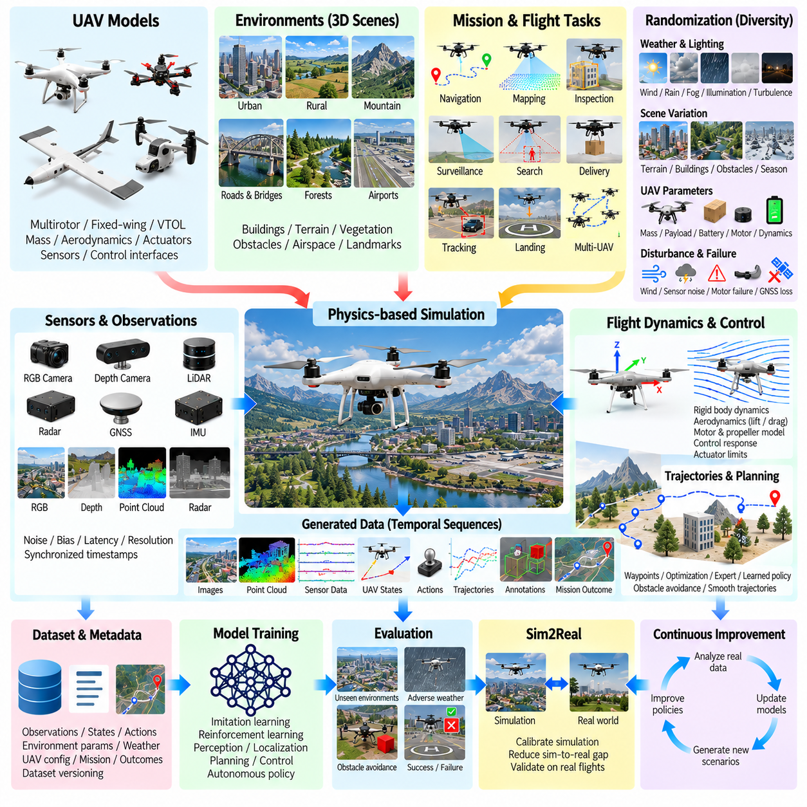{width="7.268055555555556in" height="7.268055555555556in"}

Synthetic UAV flight scenario data generation uses simulation to create large and diverse datasets for autonomous aerial robots without requiring physical flight tests for every condition. A virtual UAV can operate within a three-dimensional environment containing terrain, buildings, roads, vegetation, obstacles, airspace boundaries, and mission targets. The simulator records vehicle states, control commands, sensor observations, trajectories, and mission outcomes, providing structured training data for perception, localization, planning, flight control, and autonomous decision making.

A useful flight scenario begins with a clearly defined mission and operational context. Missions may include point-to-point navigation, waypoint following, inspection, mapping, surveillance, search, delivery, tracking, landing, or coordinated multi-UAV operations. The scenario should define the starting state, destination or mission region, flight constraints, environmental conditions, and success criteria. By changing these conditions systematically, simulation can generate many variations of the same mission while preserving the underlying task objective.

The UAV model must represent the physical properties that strongly influence flight behavior. Mass, center of gravity, inertia, aerodynamic characteristics, propulsion configuration, motor response, propeller properties, battery condition, control surfaces, and actuator limitations can be represented in the simulation. For multirotor UAVs, thrust generation, attitude dynamics, motor response, drag, and rotational coupling are particularly important. For fixed-wing or hybrid aircraft, aerodynamic lift, drag, stall behavior, control-surface response, and airspeed must also be modeled appropriately.

Flight trajectories can be generated using predefined waypoints, trajectory planners, expert controllers, optimization methods, or learned policies. A waypoint-based generator can produce structured navigation data, while trajectory optimization can generate smooth paths subject to velocity, acceleration, curvature, and obstacle constraints. Learned policies can produce more complex behavior under uncertainty. Multiple trajectory-generation methods can be combined to increase behavioral diversity and prevent an AI model from learning only one deterministic flight pattern.

Three-dimensional environment generation is essential because UAVs operate in a spatial domain that extends beyond the ground plane. Buildings, towers, bridges, power lines, trees, mountains, communication infrastructure, landing zones, and other aerial obstacles can be procedurally generated and repositioned. Terrain elevation can vary across the flight area, while urban density and obstacle configuration can change between episodes. These variations expose autonomous flight systems to different spatial structures without requiring a new physical test environment for every experiment.

Weather and atmospheric conditions provide another major source of scenario diversity. Wind speed, wind direction, gusts, turbulence, temperature, visibility, precipitation, cloud conditions, and illumination can be varied within physically meaningful ranges. Wind disturbances can affect both vehicle dynamics and the resulting trajectory, while rain, fog, or low illumination can degrade sensor observations. Coordinating environmental and vehicle variables allows the dataset to represent realistic combinations rather than treating each disturbance as an isolated factor.

Sensor simulation should reproduce the observation modalities used by the physical UAV. RGB cameras, stereo or depth cameras, LiDAR, radar, GNSS, IMU, barometers, magnetometers, and other sensors can be simulated according to the intended platform. Each sensor should have appropriate field of view, resolution, measurement range, noise, bias, latency, update frequency, and failure characteristics. Sensor observations should be synchronized with UAV state and control data so that the resulting dataset represents the complete perception-to-action relationship.

GNSS and navigation uncertainty are particularly important for autonomous UAV scenarios. Synthetic data can include nominal positioning as well as multipath effects, measurement noise, temporary signal degradation, sensor bias, or loss of navigation availability when these conditions are relevant to the operational environment. IMU bias, drift, timing errors, and other navigation imperfections can also be randomized. These conditions allow localization and navigation systems to be evaluated under uncertainty rather than relying exclusively on ideal global positioning.

Obstacle avoidance scenarios can be generated by varying obstacle location, size, height, density, and motion. Static obstacles may include buildings, towers, cables, terrain, or trees, while dynamic obstacles may include other UAVs, aircraft, birds, or moving vehicles. The simulator can generate encounters at different relative velocities and approach angles. These scenarios provide training and evaluation data for collision prediction, local planning, reactive avoidance, and risk-aware flight behavior.

Flight scenario generation should also include changes in vehicle state and mission constraints. Battery level, payload mass, available thrust, maximum velocity, altitude limits, communication range, geofencing, and mission time can be varied. Payload changes can influence acceleration, endurance, and maneuverability, while battery degradation can reduce available flight time or control authority. Such variations help models learn policies that account for changing vehicle capabilities instead of assuming constant performance throughout a mission.

Emergency and failure scenarios are particularly valuable because physical collection can be expensive or dangerous. Simulated flights can include motor degradation, partial actuator failure, sensor dropout, GNSS loss, communication interruption, excessive wind, unexpected obstacles, navigation errors, low battery, or forced landing conditions. The resulting trajectories can be labeled according to failure type, recovery behavior, and mission outcome. These data can support anomaly detection, contingency planning, fault-tolerant control, emergency landing, and autonomous recovery.

Temporal data should preserve the relationship between observations, vehicle state, actions, and environmental events. Each flight sequence can record position, velocity, acceleration, attitude, angular velocity, motor commands, thrust, sensor measurements, waypoint status, obstacle states, and mission progress. Timestamps should remain synchronized across modalities. Such sequential data are useful for trajectory prediction, state estimation, behavior learning, world-model development, reinforcement learning, and vision-language-action systems that require temporal reasoning.

Multi-UAV scenarios extend synthetic generation from individual vehicle behavior to coordinated aerial intelligence. Multiple UAVs can be assigned different starting positions, trajectories, sensing regions, communication conditions, and mission roles. Their interactions can generate formation flight, cooperative inspection, area coverage, target tracking, collision avoidance, and task allocation data. Communication delay, packet loss, limited bandwidth, and partial observability can also be introduced when studying decentralized or distributed multi-agent policies.

Synthetic UAV datasets should preserve complete simulation provenance. Metadata can include UAV configuration, aerodynamic parameters, payload, battery state, environment version, weather settings, sensor configuration, trajectory-generation method, random seed, initial conditions, mission definition, and final outcome. This information makes individual flight episodes reproducible and allows researchers to identify which conditions produced a particular behavior. Dataset versioning is important when vehicle models, environments, sensor configurations, or scenario-generation rules are updated.

Large-scale generation can use headless simulation and parallel execution to produce many flight episodes efficiently. Multiple UAV environments can be simulated simultaneously, with each instance receiving different terrain, weather, vehicle parameters, sensor conditions, and mission objectives. Automated dataset writers can store trajectories, sensor streams, ground-truth poses, object states, annotations, and metadata in consistent formats. This converts synthetic UAV generation from manual experimentation into a repeatable data-production pipeline.

Quality validation should measure whether the generated scenarios provide meaningful coverage of the intended flight domain. Flight altitude, velocity, acceleration, turning rate, wind conditions, obstacle density, sensor quality, mission duration, failure frequency, and trajectory characteristics can be analyzed statistically. Unrealistic combinations should be detected and removed or corrected. Downstream model performance on unseen simulated scenarios and representative real-world data provides stronger evidence of dataset usefulness than visual inspection alone.

A hybrid real-synthetic strategy is particularly valuable for UAV AI because real flight data can be costly and weather-dependent. Physical flights provide authentic sensor artifacts, aerodynamic effects, environmental disturbances, and hardware-specific behavior, while simulation provides scale, controllability, automatic ground truth, and safe generation of rare conditions. Real measurements can calibrate important simulation parameters, while synthetic scenarios can expand coverage around those measured operating conditions and expose models to difficult situations that are impractical to collect repeatedly.

Synthetic UAV flight scenario generation ultimately creates a controlled aerial training space connecting environment, vehicle dynamics, sensors, mission objectives, and autonomous behavior. Three-dimensional scene generation defines the world, flight dynamics determine vehicle response, weather and disturbances introduce uncertainty, sensors produce observations, and trajectory or policy generation produces actions. When these elements are combined with failure scenarios, temporal recording, provenance management, large-scale simulation, and real-world Sim2Real validation, the resulting data can support robust autonomous flight systems and broader Physical AI capabilities.

합성 UAV 비행 시나리오 데이터 생성(Synthetic UAV Flight Scenario Data Generation)은 모든 조건에 대해 물리적 비행시험을 수행하지 않고도 자율 비행 로봇(Autonomous Aerial Robot)을 위한 대규모의 다양한 데이터셋을 생성하기 위해 시뮬레이션을 사용하는 방법이다. 가상 UAV는 지형, 건물, 도로, 식생, 장애물, 공역 경계(Airspace Boundary), 임무 목표가 포함된 3차원 환경에서 운용될 수 있다. 시뮬레이터는 비행체 상태, 제어 명령, 센서 관측, 궤적, 임무 결과를 기록하여 인지(Perception), 위치추정(Localization), 계획(Planning), 비행 제어(Flight Control), 자율 의사결정(Autonomous Decision Making)을 위한 구조화된 학습 데이터를 제공한다.

유용한 비행 시나리오(Flight Scenario)는 명확하게 정의된 임무(Mission)와 운용 상황(Operational Context)에서 시작한다. 임무에는 지점 간 이동(Point-to-point Navigation), 웨이포인트 추종(Waypoint Following), 검사(Inspection), 매핑(Mapping), 감시(Surveillance), 탐색(Search), 배송(Delivery), 추적(Tracking), 착륙(Landing), 다중 UAV 협력 운용(Coordinated Multi-UAV Operation) 등이 포함될 수 있다. 시나리오는 시작 상태, 목적지 또는 임무 영역, 비행 제약조건(Flight Constraint), 환경 조건, 성공 기준(Success Criterion)을 정의해야 한다. 이러한 조건을 체계적으로 변화시키면 기본적인 임무 목표를 유지하면서 동일한 임무에 대한 다양한 변형을 생성할 수 있다.

UAV 모델은 비행 거동에 큰 영향을 미치는 물리적 특성을 표현해야 한다. 질량(Mass), 무게중심(Center of Gravity), 관성(Inertia), 공력 특성(Aerodynamic Characteristic), 추진 시스템 구성(Propulsion Configuration), 모터 응답(Motor Response), 프로펠러 특성(Propeller Property), 배터리 상태(Battery Condition), 조종면(Control Surface), 액추에이터 제한(Actuator Limitation) 등을 시뮬레이션에 표현할 수 있다. 멀티로터 UAV에서는 추력 생성(Thrust Generation), 자세 동역학(Attitude Dynamics), 모터 응답, 항력(Drag), 회전 결합(Rotational Coupling)이 특히 중요하다. 고정익 또는 하이브리드 항공기의 경우 양력(Lift), 항력, 실속(Stall) 거동, 조종면 응답, 대기속도(Airspeed) 역시 적절하게 모델링해야 한다.

비행 궤적(Flight Trajectory)은 사전에 정의된 웨이포인트, 궤적 계획기(Trajectory Planner), 전문가 제어기(Expert Controller), 최적화 방법(Optimization Method), 학습된 정책(Learned Policy)을 이용하여 생성할 수 있다. 웨이포인트 기반 생성기는 구조화된 내비게이션 데이터를 제공할 수 있으며, 궤적 최적화는 속도, 가속도, 곡률(Curvature), 장애물 제약조건을 만족하는 부드러운 경로를 생성할 수 있다. 학습된 정책은 불확실성이 존재하는 상황에서 보다 복잡한 행동을 생성할 수 있다. 여러 궤적 생성 방법을 결합하면 행동 다양성(Behavioral Diversity)을 높이고 인공지능 모델이 하나의 결정론적인 비행 패턴만 학습하는 것을 방지할 수 있다.

UAV는 지상 평면을 넘어서는 공간 영역에서 운용되므로 3차원 환경 생성(Three-dimensional Environment Generation)이 필수적이다. 건물, 타워, 교량, 전력선, 나무, 산, 통신 인프라, 착륙 구역(Landing Zone) 및 기타 공중 장애물을 절차적으로 생성하고 재배치할 수 있다. 비행 영역 전체에서 지형 고도(Terrain Elevation)를 변화시킬 수 있으며, 에피소드마다 도시 밀도(Urban Density)와 장애물 구성을 변경할 수 있다. 이러한 변화는 모든 실험마다 새로운 물리적 시험 환경을 구축하지 않고도 자율 비행 시스템이 다양한 공간 구조를 경험하도록 한다.

날씨 및 대기 조건(Weather and Atmospheric Conditions)은 시나리오 다양성의 또 다른 주요 원천이다. 풍속, 풍향, 돌풍(Gust), 난류(Turbulence), 온도, 가시성(Visibility), 강수(Precipitation), 구름 상태, 조명을 물리적으로 의미 있는 범위에서 변화시킬 수 있다. 바람 교란(Wind Disturbance)은 비행체 동역학과 결과적인 궤적 모두에 영향을 줄 수 있으며, 비, 안개(Fog), 저조도(Low Illumination)는 센서 관측을 저하시킬 수 있다. 환경 변수와 비행체 변수를 함께 조정하면 각 교란을 독립적인 요소로 취급하는 대신 현실적인 조건의 조합을 데이터셋에 표현할 수 있다.

센서 시뮬레이션(Sensor Simulation)은 실제 UAV에서 사용하는 관측 모달리티(Observation Modality)를 재현해야 한다. RGB 카메라, 스테레오 또는 깊이 카메라(Stereo or Depth Camera), 라이다, 레이더, GNSS, IMU, 기압계(Barometer), 자기계(Magnetometer) 및 기타 센서를 목표 플랫폼에 맞추어 시뮬레이션할 수 있다. 각 센서는 적절한 시야각, 해상도, 측정 범위, 잡음, 바이어스, 지연시간, 갱신 주기(Update Frequency), 고장 특성(Failure Characteristic)을 가져야 한다. 센서 관측은 UAV 상태 및 제어 데이터와 동기화되어야 하며, 이를 통해 완전한 인지-행동 관계(Perception-to-action Relationship)를 표현하는 데이터셋을 생성할 수 있다.

GNSS 및 내비게이션 불확실성(Navigation Uncertainty)은 자율 UAV 시나리오에서 특히 중요하다. 합성 데이터에는 정상적인 위치추정뿐만 아니라 운용 환경과 관련된 경우 다중경로 효과(Multipath Effect), 측정 잡음, 일시적인 신호 저하, 센서 바이어스, 내비게이션 가용성 상실(Loss of Navigation Availability) 등을 포함할 수 있다. IMU 바이어스, 드리프트(Drift), 시간 오차(Timing Error) 및 기타 내비게이션 불완전성도 랜덤화할 수 있다. 이러한 조건을 통해 위치추정 및 내비게이션 시스템을 이상적인 전역 위치 정보에만 의존하지 않고 불확실성이 존재하는 환경에서 평가할 수 있다.

장애물 회피 시나리오(Obstacle Avoidance Scenario)는 장애물의 위치, 크기, 높이, 밀도, 움직임을 변화시켜 생성할 수 있다. 정적 장애물에는 건물, 타워, 케이블, 지형, 나무 등이 포함될 수 있으며, 동적 장애물(Dynamic Obstacle)에는 다른 UAV, 항공기, 조류(Bird), 이동 차량 등이 포함될 수 있다. 시뮬레이터는 서로 다른 상대 속도(Relative Velocity)와 접근 각도(Approach Angle)에서 조우 상황을 생성할 수 있다. 이러한 시나리오는 충돌 예측(Collision Prediction), 지역 경로 계획(Local Planning), 반응형 회피(Reactive Avoidance), 위험 인지 비행(Risk-aware Flight Behavior)을 위한 학습 및 평가 데이터를 제공한다.

비행 시나리오 생성에는 비행체 상태와 임무 제약조건의 변화도 포함해야 한다. 배터리 잔량, 페이로드 질량, 가용 추력(Available Thrust), 최대 속도, 고도 제한(Altitude Limit), 통신 범위, 지오펜싱(Geofencing), 임무 시간 등을 변화시킬 수 있다. 페이로드 변화는 가속도, 비행 지속시간(Endurance), 기동성(Maneuverability)에 영향을 줄 수 있으며, 배터리 열화(Battery Degradation)는 가용 비행시간 또는 제어 권한(Control Authority)을 감소시킬 수 있다. 이러한 변화는 자율 비행 모델이 임무 전체에서 비행 성능이 일정하다고 가정하는 대신 변화하는 비행체 능력을 고려하는 정책을 학습하도록 한다.

비상 및 고장 시나리오(Emergency and Failure Scenario)는 실제 환경에서 데이터를 수집하는 데 비용이 높거나 위험할 수 있기 때문에 특히 가치가 있다. 시뮬레이션 비행에는 모터 열화(Motor Degradation), 부분 액추에이터 고장, 센서 데이터 손실, GNSS 손실, 통신 중단, 과도한 바람, 예상하지 못한 장애물, 내비게이션 오류, 저배터리(Low Battery), 강제 착륙(Forced Landing) 조건 등을 포함할 수 있다. 생성된 궤적은 고장 유형, 복구 행동, 임무 결과에 따라 라벨링할 수 있다. 이러한 데이터는 이상 탐지(Anomaly Detection), 비상 계획(Contingency Planning), 고장 허용 제어(Fault-tolerant Control), 비상 착륙(Emergency Landing), 자율 복구(Autonomous Recovery)를 지원할 수 있다.

시간적 데이터(Temporal Data)는 관측, 비행체 상태, 행동, 환경 이벤트 사이의 관계를 유지해야 한다. 각 비행 시퀀스에는 위치, 속도, 가속도, 자세, 각속도, 모터 명령, 추력, 센서 측정값, 웨이포인트 상태, 장애물 상태, 임무 진행 상황을 기록할 수 있다. 모달리티 사이의 타임스탬프는 동기화된 상태로 유지해야 한다. 이러한 순차 데이터(Sequential Data)는 궤적 예측, 상태 추정(State Estimation), 행동 학습(Behavior Learning), 월드 모델(World Model) 개발, 강화학습, 그리고 시간적 추론(Temporal Reasoning)이 필요한 비전-언어-행동(Vision-Language-Action) 시스템에 활용할 수 있다.

다중 UAV 시나리오(Multi-UAV Scenario)는 합성 데이터 생성을 개별 비행체의 행동에서 협력적 공중 지능(Coordinated Aerial Intelligence)으로 확장한다. 여러 UAV에 서로 다른 시작 위치, 궤적, 감지 영역(Sensing Region), 통신 조건, 임무 역할을 할당할 수 있다. 이러한 상호작용은 편대 비행(Formation Flight), 협력 검사(Cooperative Inspection), 영역 커버리지(Area Coverage), 목표 추적, 충돌 회피, 작업 할당(Task Allocation) 데이터를 생성할 수 있다. 분산형 또는 다중 에이전트 정책(Distributed or Multi-agent Policy)을 연구하는 경우 통신 지연, 패킷 손실, 제한된 대역폭, 부분 관측(Partial Observability)도 추가할 수 있다.

합성 UAV 데이터셋은 완전한 시뮬레이션 출처 정보(Simulation Provenance)를 보존해야 한다. 메타데이터에는 UAV 구성, 공력 매개변수, 페이로드, 배터리 상태, 환경 버전, 날씨 설정, 센서 구성, 궤적 생성 방법, 랜덤 시드, 초기 조건, 임무 정의, 최종 결과 등을 포함할 수 있다. 이러한 정보는 개별 비행 에피소드를 재현할 수 있도록 하며 특정 행동이 어떤 조건에서 생성되었는지를 식별할 수 있도록 한다. 비행체 모델, 환경, 센서 구성 또는 시나리오 생성 규칙이 업데이트될 때는 데이터셋 버전 관리(Dataset Versioning)가 중요하다.

대규모 생성(Large-scale Generation)은 헤드리스 시뮬레이션(Headless Simulation)과 병렬 실행(Parallel Execution)을 이용하여 많은 비행 에피소드를 효율적으로 생성할 수 있다. 여러 UAV 환경을 동시에 시뮬레이션하면서 각각의 인스턴스에 서로 다른 지형, 날씨, 비행체 매개변수, 센서 조건, 임무 목표를 적용할 수 있다. 자동화된 데이터셋 라이터(Dataset Writer)는 궤적, 센서 스트림(Sensor Stream), 정답 자세(Ground-truth Pose), 객체 상태, 어노테이션, 메타데이터를 일관된 형식으로 저장할 수 있다. 이를 통해 합성 UAV 데이터 생성을 수동적인 실험에서 반복 가능한 데이터 생산 파이프라인(Repeatable Data-production Pipeline)으로 전환할 수 있다.

품질 검증(Quality Validation)은 생성된 시나리오가 목표 비행 영역(Intended Flight Domain)을 의미 있게 커버하는지를 측정해야 한다. 비행 고도, 속도, 가속도, 선회율(Turning Rate), 바람 조건, 장애물 밀도, 센서 품질, 임무 지속시간, 고장 빈도, 궤적 특성을 통계적으로 분석할 수 있다. 비현실적인 조합은 탐지하여 제거하거나 수정해야 한다. 보지 못한 시뮬레이션 시나리오와 대표적인 실제 환경 데이터에서의 후속 모델 성능(Downstream Model Performance)은 단순한 시각적 검사보다 데이터셋의 유용성을 판단하는 더 강력한 근거를 제공한다.

하이브리드 실제-합성 전략(Hybrid Real-synthetic Strategy)은 UAV 인공지능에서 특히 유용하다. 실제 비행 데이터는 비용이 높고 날씨 조건에 의존할 수 있기 때문이다. 실제 비행은 진정한 센서 아티팩트(Sensor Artifact), 공력 효과, 환경 교란, 하드웨어 특유의 거동을 제공하는 반면, 시뮬레이션은 확장성, 제어 가능성, 자동 정답 데이터(Automatic Ground Truth), 희귀 조건을 안전하게 생성할 수 있는 능력을 제공한다. 실제 측정값은 중요한 시뮬레이션 매개변수를 보정하는 데 사용할 수 있으며, 합성 시나리오는 측정된 운용 조건 주변의 커버리지를 확대하고 반복적인 실제 수집이 어렵거나 비현실적인 어려운 상황에 모델을 노출시킬 수 있다.

궁극적으로 합성 UAV 비행 시나리오 생성은 환경, 비행체 동역학, 센서, 임무 목표, 자율 행동을 연결하는 제어된 공중 학습 공간(Controlled Aerial Training Space)을 구축한다. 3차원 장면 생성은 세계를 정의하고, 비행 동역학은 비행체의 응답을 결정하며, 날씨와 교란은 불확실성을 도입하고, 센서는 관측을 생성하며, 궤적 또는 정책 생성은 행동을 만들어낸다. 이러한 요소를 고장 시나리오, 시간적 데이터 기록, 출처 관리, 대규모 시뮬레이션, 실제 환경 Sim2Real 검증과 결합하면 강건한 자율 비행 시스템과 보다 광범위한 Physical AI 역량을 지원할 수 있다.

##  

## 09.08. Synthetic Data Quality Validation FID Domain Gap [w/Code]

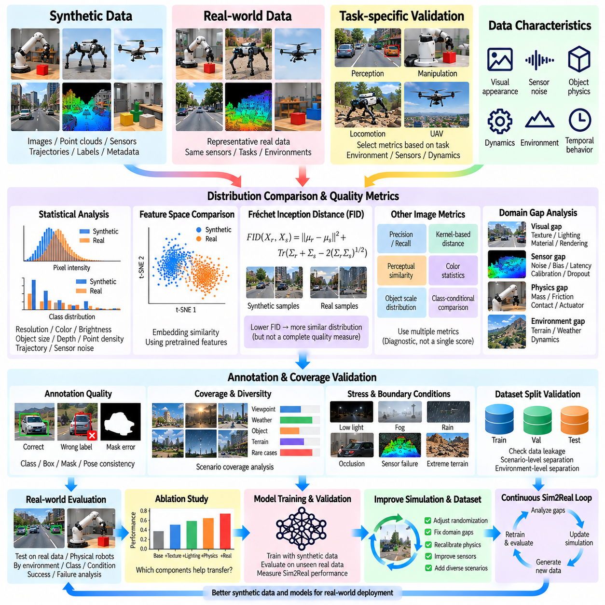{width="7.268055555555556in" height="7.268055555555556in"}

Synthetic data quality validation determines whether generated data is sufficiently realistic, diverse, consistent, and useful for training robot AI. Dataset size alone cannot demonstrate quality. Synthetic images, point clouds, trajectories, and sensor streams must be evaluated according to their intended task and compared with representative real-world data. The central objective is to identify unrealistic artifacts, insufficient diversity, annotation errors, distribution mismatch, and other factors that may reduce Sim2Real transfer.

A useful validation process begins by defining the target deployment domain and the data characteristics that matter for the intended model. A perception dataset may require realistic object appearance, illumination, occlusion, sensor noise, and class distribution, while a manipulation dataset may require accurate contact behavior, object physics, and action trajectories. Locomotion and UAV datasets require appropriate dynamics, disturbances, terrain, weather, and temporal behavior. Quality metrics should therefore be selected according to the operational task rather than applied uniformly.

Statistical distribution analysis provides a basic method for comparing synthetic and real datasets. Image resolution, color statistics, brightness, contrast, object size, class frequency, depth distribution, point density, trajectory velocity, sensor noise, and other measurable properties can be compared across domains. Significant differences may indicate a domain gap that requires additional randomization or improved simulation. Statistical analysis is particularly useful because visual inspection alone may fail to reveal systematic differences distributed across large datasets.

For image-based datasets, feature-space comparison can provide a more meaningful measure of similarity than direct pixel comparison. A trained or pretrained feature extractor can transform synthetic and real images into embedding representations, after which their distributions can be compared. Similar feature distributions suggest that the two datasets share higher-level visual characteristics, although this does not prove physical equivalence. The selected feature representation should remain relevant to the target perception task.

Fréchet Inception Distance (FID) is one commonly used metric for comparing distributions of generated and reference images. It calculates a distance between feature distributions derived from an image encoder, traditionally using Inception features. Lower FID generally indicates greater similarity between the compared image distributions. However, FID should not be interpreted as a universal measure of synthetic-data quality because it depends on the feature extractor, dataset composition, preprocessing, and domain. A good FID value does not guarantee correct labels, realistic physics, or successful robot deployment.

Other image metrics can complement FID when appropriate. Precision and recall in feature space can provide information about fidelity and coverage, while kernel-based distribution measures can compare feature distributions without relying on exactly the same assumptions as FID. Perceptual similarity, color statistics, object-scale distributions, and class-conditional comparisons can further reveal specific mismatches. For robotics, these metrics should be treated as diagnostic evidence rather than as a single overall quality score.

Domain gap analysis should examine multiple dimensions because synthetic and real data may differ in different ways. Visual gaps can arise from textures, lighting, materials, shadows, camera characteristics, and rendering artifacts. Sensor gaps may involve noise, bias, latency, calibration, resolution, dropout, or measurement geometry. Physical gaps can result from inaccurate mass, friction, contact, actuator response, or environmental dynamics. Separating these dimensions helps engineers identify which simulation assumptions require modification.

Semantic and annotation quality must be validated independently from visual realism. A visually convincing synthetic image can still contain incorrect class identifiers, incomplete masks, inconsistent object identities, invalid bounding boxes, or incorrect poses. Because synthetic data often provides automatically generated ground truth, annotation consistency should be checked against the simulator state and dataset schema. Invalid or ambiguous samples should be detected before they enter model training, particularly when they may systematically affect important classes or safety-relevant scenarios.

Coverage and diversity should also be measured explicitly. A dataset may contain millions of samples while representing only a narrow range of viewpoints, environments, object configurations, weather conditions, or robot states. Scenario coverage analysis can measure the distribution of relevant variables and identify underrepresented regions. Rare but operationally important cases should receive particular attention because natural field data usually contains far fewer examples of failures, unusual environments, and long-tail conditions.

Real-world validation provides the strongest evidence of whether synthetic data is useful. A model trained or adapted using synthetic data should be evaluated on representative real observations or physical robot scenarios that were not used to define the synthetic dataset. Performance can be analyzed by environment, class, illumination, distance, sensor condition, task difficulty, and failure mode. Improvement on real data is more meaningful for Sim2Real validation than improvement measured only on additional synthetic samples.

Ablation studies can identify which synthetic-data components contribute to transfer performance. Models can be trained with different combinations of texture randomization, lighting variation, physics randomization, sensor noise, scene diversity, and real data. Their performance can then be compared on the same real-world benchmark. This approach helps determine whether additional synthetic complexity provides measurable value or merely increases dataset size and computational cost.

Validation should include stress and boundary conditions rather than only nominal scenarios. Synthetic datasets can deliberately contain adverse lighting, severe occlusion, sensor degradation, unusual terrain, dynamic obstacles, payload changes, communication limitations, or other conditions relevant to the robot. The objective is not to maximize unrealistic difficulty, but to determine whether the model remains functional near the operational boundaries that matter for deployment.

Dataset quality must also be evaluated across training, validation, and test partitions. Leakage can occur when nearly identical scenes, objects, trajectories, or randomization configurations appear in multiple partitions. Such leakage may produce artificially high evaluation results because the model encounters conditions that are too similar to its training examples. Scenario-level and environment-level separation is therefore important when measuring generalization, especially for synthetic datasets generated from reusable assets.

A mature validation pipeline should connect metrics to actionable data-generation changes. If real images are consistently darker than synthetic images, lighting and camera response distributions can be adjusted. If point-cloud density is unrealistic, sensor configuration and noise models can be revised. If manipulation failures occur because simulated contact is too stable, friction or contact parameters can be recalibrated. This converts domain-gap measurement from a reporting activity into a mechanism for improving the simulator and subsequent datasets.

Dataset versioning and provenance are essential for meaningful quality comparisons. Each validation result should identify the dataset version, simulator version, asset version, randomization configuration, feature extractor or metric implementation, benchmark dataset, and evaluation protocol. Without this information, changes in FID or downstream model performance may be difficult to interpret. Reproducible validation allows engineers to determine whether an apparent improvement results from better data, a changed evaluation method, or an unrelated modification.

Synthetic data quality validation therefore should not depend on a single metric such as FID. A practical framework combines distribution statistics, feature-space analysis, annotation validation, scenario coverage, domain-gap analysis, downstream model performance, and real-world robot evaluation. The final objective is not to make synthetic data visually indistinguishable from reality in every respect, but to generate data that contains the relevant variations, labels, physical relationships, and operational conditions required for reliable model transfer.

The resulting process forms a continuous Sim2Real quality loop. Real-world failures and performance differences reveal gaps, domain analysis identifies their likely causes, simulation parameters and datasets are updated, new models are trained, and real-world performance is measured again. In this architecture, FID and related distribution metrics serve as useful diagnostic indicators, while task performance and physical validation provide deployment-oriented evidence. Synthetic data becomes a controlled engineering resource whose quality improves through measurement, comparison, adaptation, and repeated validation.

합성 데이터 품질 검증(Synthetic Data Quality Validation)은 생성된 데이터가 로봇 인공지능 학습에 충분할 정도로 현실적이고, 다양하며, 일관되고, 유용한지를 판단하는 과정이다. 데이터셋의 크기만으로는 품질을 입증할 수 없다. 합성 이미지, 포인트 클라우드(Point Cloud), 궤적(Trajectory), 센서 스트림(Sensor Stream)은 의도된 작업과 관련된 기준에 따라 평가하고 대표적인 실제 데이터와 비교해야 한다. 핵심 목적은 비현실적인 아티팩트(Artifact), 부족한 다양성, 어노테이션 오류, 분포 불일치, 기타 요인으로 인해 Sim2Real 전이 성능이 저하되는 문제를 식별하는 것이다.

유용한 검증 과정은 목표 배포 도메인(Target Deployment Domain)과 해당 모델에 중요한 데이터 특성을 정의하는 것에서 시작한다. 인지 데이터셋은 현실적인 객체 외형, 조명, 가림(Occlusion), 센서 잡음(Sensor Noise), 클래스 분포(Class Distribution)가 필요할 수 있으며, 조작 데이터셋은 정확한 접촉 거동(Contact Behavior), 객체 물리, 행동 궤적이 필요할 수 있다. 이동 및 UAV 데이터셋은 적절한 동역학, 교란, 지형, 날씨, 시간적 거동(Temporal Behavior)을 필요로 한다. 따라서 품질 지표(Quality Metric)는 모든 데이터에 동일하게 적용하기보다는 운용 작업(Operational Task)에 맞추어 선택해야 한다.

통계적 분포 분석(Statistical Distribution Analysis)은 합성 데이터셋과 실제 데이터셋을 비교하는 기본적인 방법이다. 이미지 해상도, 색상 통계(Color Statistics), 밝기, 대비, 객체 크기, 클래스 빈도, 깊이 분포, 포인트 밀도(Point Density), 궤적 속도, 센서 잡음 및 기타 측정 가능한 특성을 도메인 간에 비교할 수 있다. 상당한 차이가 발견되면 추가적인 랜덤화(Randomization)가 필요하거나 시뮬레이션을 개선해야 하는 도메인 갭(Domain Gap)을 나타낼 수 있다. 통계 분석은 대규모 데이터셋에 분산된 체계적인 차이를 시각적 검사만으로는 발견하기 어려운 경우 특히 유용하다.

이미지 기반 데이터셋에서는 직접적인 픽셀 비교보다 특징 공간(Feature Space) 비교가 유사성을 더욱 의미 있게 측정할 수 있다. 학습된 또는 사전학습된 특징 추출기(Feature Extractor)를 이용하여 합성 이미지와 실제 이미지를 임베딩 표현(Embedding Representation)으로 변환한 다음 두 분포를 비교할 수 있다. 유사한 특징 분포는 두 데이터셋이 높은 수준의 시각적 특성을 공유한다는 것을 의미할 수 있지만, 물리적 동등성을 증명하는 것은 아니다. 선택한 특징 표현은 목표 인지 작업과 관련성을 유지해야 한다.

Fréchet Inception Distance(FID)는 생성 이미지와 기준 이미지의 분포를 비교하는 데 일반적으로 사용되는 지표 중 하나이다. FID는 전통적으로 Inception 특징을 사용하여 얻은 특징 분포 사이의 거리를 계산한다. 일반적으로 FID가 낮을수록 비교되는 이미지 분포가 더 유사하다는 것을 의미한다. 그러나 FID는 합성 데이터 품질을 판단하는 보편적인 지표로 해석해서는 안 된다. 특징 추출기, 데이터셋 구성, 전처리(Preprocessing), 도메인에 따라 결과가 달라지기 때문이다. 좋은 FID 값이 정확한 라벨, 현실적인 물리, 성공적인 로봇 배포를 보장하는 것은 아니다.

필요한 경우 다른 이미지 지표를 FID와 함께 사용할 수 있다. 특징 공간에서의 정밀도와 재현율(Precision and Recall)은 충실도(Fidelity)와 커버리지(Coverage)에 대한 정보를 제공할 수 있으며, 커널 기반 분포 지표(Kernel-based Distribution Measure)는 FID와 다른 가정을 기반으로 특징 분포를 비교할 수 있다. 지각적 유사도(Perceptual Similarity), 색상 통계, 객체 크기 분포, 클래스 조건별 비교(Class-conditional Comparison)를 추가하면 특정한 불일치를 발견할 수 있다. 로봇 분야에서는 이러한 지표를 하나의 종합적인 품질 점수가 아니라 진단을 위한 근거로 활용해야 한다.

도메인 갭 분석(Domain Gap Analysis)은 합성 데이터와 실제 데이터가 서로 다른 여러 방식으로 차이를 보일 수 있으므로 다양한 차원을 검토해야 한다. 시각적 갭은 텍스처, 조명, 재질, 그림자, 카메라 특성, 렌더링 아티팩트에서 발생할 수 있다. 센서 갭은 잡음, 바이어스, 지연시간, 보정(Calibration), 해상도, 데이터 손실(Dropout), 측정 기하(Measurement Geometry)와 관련될 수 있다. 물리적 갭은 부정확한 질량, 마찰, 접촉, 액추에이터 응답 또는 환경 동역학에서 발생할 수 있다. 이러한 차원을 분리하면 어떤 시뮬레이션 가정을 수정해야 하는지 더욱 명확하게 식별할 수 있다.

의미론적 품질(Semantic Quality)과 어노테이션 품질은 시각적 현실성과 독립적으로 검증해야 한다. 시각적으로 매우 사실적인 합성 이미지라도 잘못된 클래스 식별자, 불완전한 마스크, 일관되지 않은 객체 ID, 잘못된 바운딩 박스 또는 부정확한 자세를 포함할 수 있다. 합성 데이터는 자동으로 생성된 정답(Ground Truth)을 제공하는 경우가 많으므로 시뮬레이터 상태와 데이터셋 스키마(Dataset Schema)를 기준으로 어노테이션 일관성을 검사해야 한다. 특히 중요한 클래스나 안전과 관련된 시나리오에 체계적으로 영향을 미칠 수 있는 잘못되거나 모호한 샘플은 모델 학습에 들어가기 전에 탐지해야 한다.

커버리지와 다양성(Coverage and Diversity)도 명시적으로 측정해야 한다. 데이터셋에 수백만 개의 샘플이 포함되어 있어도 시점(Viewpoint), 환경, 객체 구성, 날씨 조건, 로봇 상태가 매우 제한적일 수 있다. 시나리오 커버리지 분석(Scenario Coverage Analysis)은 관련 변수의 분포를 측정하고 충분히 표현되지 않은 영역을 식별할 수 있다. 자연적인 현장 데이터에는 실패, 비정상 환경, 롱테일 조건(Long-tail Condition)의 사례가 매우 적기 때문에 운영상 중요한 희귀 사례(Rare Case)에 특히 주의를 기울여야 한다.

실제 환경 검증(Real-world Validation)은 합성 데이터가 실제로 유용한지를 판단하는 가장 강력한 근거를 제공한다. 합성 데이터로 학습하거나 적응한 모델은 합성 데이터셋을 정의하는 데 사용되지 않은 대표적인 실제 관측 또는 실제 로봇 시나리오에서 평가해야 한다. 성능은 환경, 클래스, 조명, 거리, 센서 상태, 작업 난이도, 실패 모드(Failure Mode)에 따라 분석할 수 있다. 실제 데이터에서의 성능 향상은 추가적인 합성 샘플에서만 측정된 성능 향상보다 Sim2Real 검증에 더욱 의미 있는 정보를 제공한다.

절제 실험(Ablation Study)은 어떤 합성 데이터 구성요소가 전이 성능에 기여하는지를 식별할 수 있다. 텍스처 랜덤화, 조명 변화, 물리 랜덤화, 센서 잡음, 장면 다양성, 실제 데이터를 서로 다른 조합으로 사용하여 모델을 학습할 수 있다. 이후 동일한 실제 환경 벤치마크에서 성능을 비교한다. 이러한 방법은 추가적인 합성 복잡성이 측정 가능한 가치를 제공하는지 또는 단순히 데이터셋 크기와 계산 비용만 증가시키는지를 판단하는 데 도움이 된다.

검증에는 정상적인 시나리오뿐만 아니라 스트레스 및 경계 조건(Stress and Boundary Condition)도 포함해야 한다. 합성 데이터셋에는 의도적으로 불리한 조명, 심한 가림, 센서 성능 저하, 비정상적인 지형, 동적 장애물, 페이로드 변화, 통신 제한 또는 로봇과 관련된 기타 조건을 포함할 수 있다. 목적은 비현실적으로 어려운 조건을 최대화하는 것이 아니라 실제 배포에서 중요한 운용 경계 근처에서 모델이 기능을 유지하는지를 확인하는 것이다.

데이터셋 품질은 학습, 검증, 테스트 분할(Training, Validation, Test Partition) 전반에서도 평가해야 한다. 서로 거의 동일한 장면, 객체, 궤적 또는 랜덤화 구성이 여러 분할에 포함되면 데이터 누수(Data Leakage)가 발생할 수 있다. 이러한 누수는 모델이 학습 데이터와 지나치게 유사한 조건을 다시 경험하기 때문에 평가 결과를 인위적으로 높일 수 있다. 따라서 일반화 성능(Generalization)을 측정할 때는 특히 합성 데이터셋에서 시나리오 수준 및 환경 수준의 분리가 중요하다.

성숙한 검증 파이프라인은 측정 지표를 실제 데이터 생성 변경과 연결해야 한다. 실제 이미지가 합성 이미지보다 지속적으로 어둡다면 조명 및 카메라 응답(Camera Response) 분포를 조정할 수 있다. 포인트 클라우드 밀도가 비현실적이라면 센서 구성과 잡음 모델을 수정할 수 있다. 시뮬레이션된 접촉이 지나치게 안정적이어서 실제 조작 실패가 발생한다면 마찰 또는 접촉 매개변수를 재보정할 수 있다. 이를 통해 도메인 갭 측정을 단순한 보고 활동에서 시뮬레이터와 이후 데이터셋을 개선하는 메커니즘으로 전환할 수 있다.

의미 있는 품질 비교를 위해 데이터셋 버전 관리(Dataset Versioning)와 출처 관리(Provenance)가 필수적이다. 각각의 검증 결과에는 데이터셋 버전, 시뮬레이터 버전, 자산 버전, 랜덤화 구성, 특징 추출기 또는 지표 구현, 벤치마크 데이터셋, 평가 프로토콜을 식별할 수 있는 정보가 포함되어야 한다. 이러한 정보가 없으면 FID 또는 후속 모델 성능의 변화가 무엇을 의미하는지 해석하기 어려워진다. 재현 가능한 검증(Reproducible Validation)은 겉보기 성능 향상이 더 좋은 데이터 때문인지, 변경된 평가 방법 때문인지, 또는 관련 없는 수정 때문인지를 판단할 수 있도록 한다.

따라서 합성 데이터 품질 검증은 FID와 같은 하나의 지표에 의존해서는 안 된다. 실용적인 프레임워크는 분포 통계, 특징 공간 분석, 어노테이션 검증, 시나리오 커버리지, 도메인 갭 분석, 후속 모델 성능, 실제 로봇 평가를 결합한다. 최종 목표는 합성 데이터가 모든 측면에서 현실과 시각적으로 구별되지 않도록 만드는 것이 아니라, 신뢰성 있는 모델 전이에 필요한 관련 변화, 라벨, 물리적 관계, 운용 조건을 포함하는 데이터를 생성하는 것이다.

최종적으로 이러한 과정은 지속적인 Sim2Real 품질 루프(Sim2Real Quality Loop)를 형성한다. 실제 환경에서 발생하는 실패와 성능 차이가 갭을 드러내고, 도메인 분석이 가능한 원인을 식별하며, 시뮬레이션 매개변수와 데이터셋을 업데이트하고, 새로운 모델을 학습한 뒤, 실제 환경 성능을 다시 측정한다. 이 구조에서 FID와 관련 분포 지표는 유용한 진단 지표로 활용되고, 작업 성능과 물리적 검증은 배포 관점의 근거를 제공한다. 합성 데이터는 측정, 비교, 적응, 반복적인 검증을 통해 품질을 지속적으로 개선할 수 있는 제어 가능한 엔지니어링 자원으로 발전한다.

##  

## 09.09. Synthetic Data Pipeline Automation and CI Integration [w/Code]

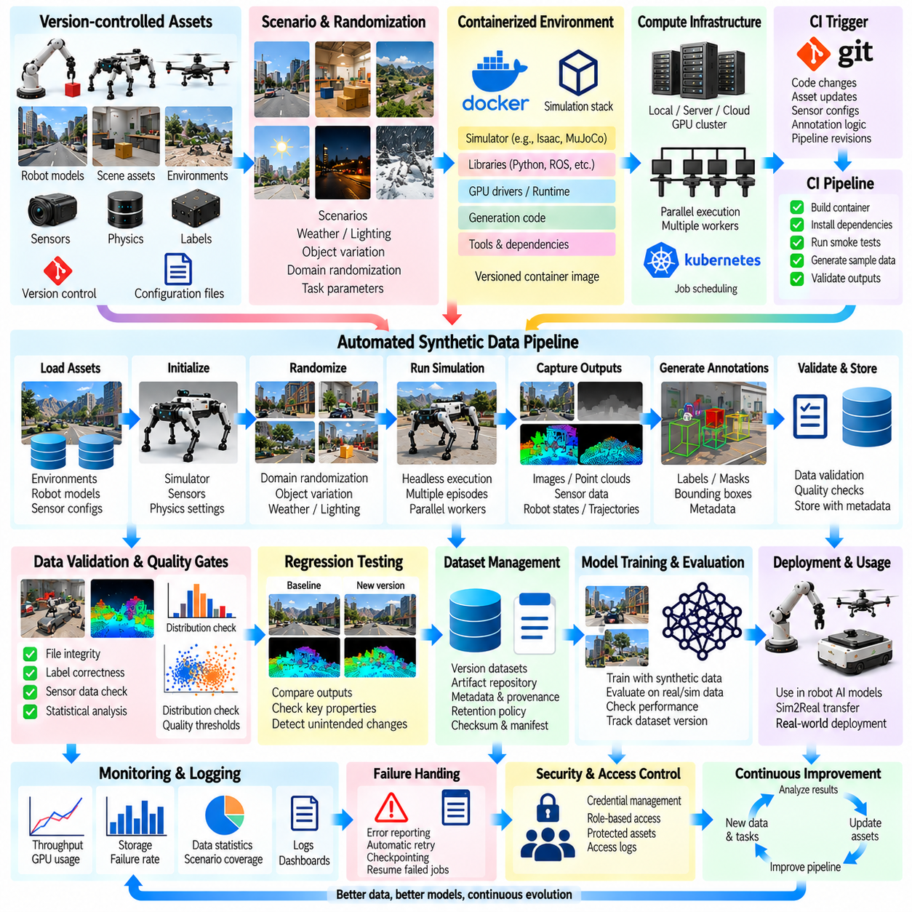{width="7.268055555555556in" height="7.268055555555556in"}

Synthetic data pipeline automation transforms simulation-based data generation from a manually executed experiment into a repeatable engineering process. Instead of launching a simulator, configuring scenes, collecting outputs, and validating datasets by hand, the complete workflow can be represented as scripts, configuration files, containers, and automated jobs. This approach enables robot AI teams to regenerate datasets consistently whenever simulation assets, sensors, algorithms, or training require

ments change.

A production pipeline usually begins with version-controlled definitions of the robot, environment, sensors, scenarios, and randomization parameters. Robot models, USD or other scene assets, camera and LiDAR configurations, physics settings, semantic labels, and generation rules should be associated with identifiable versions. Configuration-driven execution separates experiment definitions from implementation code, allowing the same generation software to produce different datasets by changing controlled parameters rather than modifying the pipeline itself.

Pipeline orchestration coordinates the sequence of operations required to produce a valid dataset. A typical execution loads simulation assets, constructs environments, initializes sensors, applies randomization, runs simulation, captures observations, generates annotations, validates outputs, and stores data with metadata. Each stage should expose clear inputs, outputs, and failure conditions. Modular stages make it possible to restart failed jobs, replace individual components, or execute selected validation steps without regenerating the entire dataset.

Automation requires deterministic control where reproducibility matters. Random seeds, simulator versions, asset versions, configuration files, software dependencies, and generation parameters should be recorded for each run. Randomization remains essential for diversity, but the sequence of random choices should be reproducible when investigating a failure or comparing pipeline revisions. A generated sample should therefore be traceable to the exact conditions and software configuration that produced it.

Headless execution is important for large-scale synthetic data production because generation should not depend on an interactive graphical session. Simulation jobs can run through command-line interfaces, containers, remote workstations, GPU servers, or cluster nodes. Rendering, physics simulation, annotation, and dataset writing can then execute unattended. This allows long-running workloads to operate overnight or across distributed infrastructure while developers continue using local systems for implementation and analysis.

Parallelization increases throughput when individual simulation episodes or scenes can be generated independently. Multiple workers may process different random seeds, scenarios, environments, or dataset partitions simultaneously. GPU resources can be assigned according to rendering and physics requirements, while CPU resources may handle preprocessing, metadata generation, compression, and validation. The orchestration layer must prevent duplicated samples and preserve consistent identifiers when outputs from parallel workers are merged.

Containerization improves reproducibility by packaging simulator dependencies, Python libraries, generation code, and supporting tools into controlled runtime environments. Containers reduce differences between developer workstations, on-premise GPU servers, and cloud infrastructure. For simulation platforms that depend strongly on GPU drivers or specialized runtimes, container definitions should clearly identify compatible software versions. The container image itself should also be versioned so that historical datasets can be associated with the environment used to create them.

Continuous Integration, or CI, extends conventional software testing into the synthetic data pipeline. When generation code, robot models, sensor configurations, scene assets, or annotation logic change, automated checks can verify that the pipeline still executes correctly. A CI job does not necessarily need to generate a complete production dataset. Instead, it can run a small representative scenario set that exercises critical generation paths and confirms that expected outputs are created without errors.

CI smoke tests can verify basic operational integrity. A test may launch the simulator, load a reference environment, generate several frames, create RGB images or point clouds, export annotations, and confirm that required files exist. Additional checks can verify image dimensions, point counts, class identifiers, timestamp consistency, coordinate frames, bounding boxes, masks, or metadata fields. These tests detect pipeline breakage before expensive large-scale generation begins.

Data validation should become an automated pipeline stage rather than a separate manual activity. Generated outputs can be checked for corrupted files, empty images, missing labels, invalid values, inconsistent dimensions, impossible poses, duplicate identifiers, or incomplete metadata. Statistical checks can monitor class balance, object counts, sensor ranges, trajectory lengths, and other dataset properties. Threshold violations can fail the job or mark a dataset for engineering review before it reaches model training.

Quality gates can connect synthetic data validation with CI decisions. A pipeline revision may be required to satisfy predefined requirements for annotation integrity, scenario coverage, sensor validity, or distribution statistics before a dataset is promoted. Quality gates should be based on measurable engineering criteria rather than visual appearance alone. They can also compare a new dataset against a known baseline to detect unexpected changes caused by modified assets, physics parameters, randomization rules, or simulator versions.

Regression testing is particularly valuable because simulation changes can silently alter generated data. Updating a material, sensor model, physics engine, coordinate transformation, or annotation component may change outputs even when the pipeline still runs successfully. Reference scenarios can therefore be regenerated after changes and compared with expected properties. The objective is not always exact pixel equality, because controlled randomization may prevent it, but important semantic, geometric, statistical, and structural properties should remain within acceptable bounds.

Continuous Delivery concepts can be applied to dataset production by treating validated datasets as versioned engineering artifacts. After generation and validation succeed, a dataset can be assigned a version, stored in an artifact repository or data storage system, and registered with its metadata. Downstream training pipelines can reference this immutable version instead of an ambiguous directory containing changing files. This creates a clear relationship among simulator configuration, generated dataset, trained model, and evaluation result.

Model training can be integrated downstream from synthetic data generation so that important pipeline changes trigger controlled experiments. A newly generated dataset may launch a lightweight training or evaluation job to determine whether the data remains usable by the intended model. More expensive full-scale training can be reserved for selected releases. This connection is important because technically valid data may still reduce model performance if its distribution, labels, or scenario composition changes in an undesirable way.

The pipeline should preserve end-to-end provenance across simulation, data, and models. A trained model should be traceable to the dataset version used for training, and that dataset should be traceable to simulation assets, configuration files, random seeds, software commits, and generation jobs. Evaluation results should similarly reference the model and benchmark versions. This lineage allows engineers to investigate performance regressions and reproduce previous results without relying on undocumented manual procedures.

Failure handling is necessary for unattended generation at scale. Individual workers may encounter simulator crashes, GPU memory exhaustion, corrupted assets, storage failures, or temporary infrastructure problems. Jobs should report structured error information, preserve useful logs, and support controlled retry or restart behavior. Completed partitions should not need to be regenerated when another partition fails. Checkpointing and idempotent job design can significantly reduce the cost of recovering from long-running generation failures.

Storage and data lifecycle management become increasingly important as synthetic datasets grow. Raw sensor outputs, intermediate files, annotations, metadata, compressed datasets, and derived training formats may consume terabytes of storage. The pipeline should define which artifacts must be retained, which can be regenerated, and which can be deleted after validation. Checksums and manifest files can verify integrity, while retention policies prevent obsolete intermediate data from consuming infrastructure indefinitely.

Monitoring provides visibility into production-scale generation. Useful measurements include simulation throughput, frames generated per unit time, GPU utilization, storage consumption, failure rate, validation errors, class distribution, and scenario coverage. Dashboards or automated reports can expose abnormal behavior early. Monitoring data can also reveal performance regressions in the generation infrastructure, such as slower rendering after a software update or unexpectedly large files after a sensor configuration change.

Security and access control should be considered when synthetic pipelines use proprietary robot models, customer environments, or restricted simulation assets. Credentials for storage systems, registries, or compute infrastructure should not be embedded directly in scripts or configuration repositories. Automated jobs should receive only the permissions required for their tasks. Dataset provenance and access records become particularly important when generated artifacts are shared across teams or used in externally delivered robot AI systems.

A mature automated pipeline therefore connects simulation development, dataset engineering, validation, and model development through a controlled CI workflow. A source or configuration change triggers tests, representative synthetic samples are generated, structural and statistical validation is performed, quality gates determine whether the change is acceptable, and approved configurations can proceed to large-scale generation. Versioned datasets then feed reproducible model training and evaluation processes.

Synthetic data pipeline automation and CI integration ultimately turn simulation data into a managed software-and-data product rather than a collection of manually generated files. Version control defines what should be generated, automated simulation produces the observations, validation verifies their integrity, CI detects regressions, artifact management preserves datasets, and provenance connects them to trained models. This architecture enables Physical AI teams to continuously evolve simulation, data, and learning systems while maintaining reproducibility, scalability, and engineering control.

합성 데이터 파이프라인 자동화(Synthetic Data Pipeline Automation)는 시뮬레이션 기반 데이터 생성을 수동으로 실행하는 실험에서 반복 가능한 엔지니어링 프로세스(Repeatable Engineering Process)로 전환한다. 시뮬레이터를 실행하고, 장면을 구성하며, 출력을 수집하고, 데이터셋을 수작업으로 검증하는 대신 전체 워크플로를 스크립트, 설정 파일(Configuration File), 컨테이너(Container), 자동화 작업(Automated Job)으로 표현할 수 있다. 이를 통해 로봇 인공지능 팀은 시뮬레이션 자산, 센서, 알고리즘 또는 학습 요구사항이 변경될 때마다 데이터셋을 일관되게 다시 생성할 수 있다.

운영 수준의 파이프라인(Production Pipeline)은 일반적으로 버전 관리(Version Control)되는 로봇, 환경, 센서, 시나리오, 랜덤화 매개변수(Randomization Parameter)의 정의에서 시작한다. 로봇 모델, USD 또는 기타 장면 자산(Scene Asset), 카메라 및 라이다 구성, 물리 설정, 의미론적 라벨(Semantic Label), 생성 규칙에는 식별 가능한 버전을 연결해야 한다. 설정 기반 실행(Configuration-driven Execution)은 실험 정의와 구현 코드를 분리하여 파이프라인 자체를 수정하지 않고도 제어된 매개변수 변경만으로 동일한 생성 소프트웨어에서 서로 다른 데이터셋을 생성할 수 있도록 한다.

파이프라인 오케스트레이션(Pipeline Orchestration)은 유효한 데이터셋을 생성하는 데 필요한 작업의 실행 순서를 조정한다. 일반적인 실행 과정에서는 시뮬레이션 자산을 불러오고, 환경을 구성하며, 센서를 초기화하고, 랜덤화를 적용하고, 시뮬레이션을 실행하며, 관측 데이터를 획득하고, 어노테이션(Annotation)을 생성하고, 출력을 검증한 후 메타데이터(Metadata)와 함께 데이터를 저장한다. 각 단계는 명확한 입력, 출력, 실패 조건을 제공해야 한다. 모듈화된 단계(Modular Stage)를 사용하면 전체 데이터셋을 다시 생성하지 않고도 실패한 작업을 재시작하거나 개별 구성요소를 교체하거나 특정 검증 단계만 실행할 수 있다.

자동화에서는 재현성(Reproducibility)이 중요한 영역에 결정론적 제어(Deterministic Control)가 필요하다. 각 실행에 사용된 랜덤 시드(Random Seed), 시뮬레이터 버전, 자산 버전, 설정 파일, 소프트웨어 의존성(Software Dependency), 생성 매개변수를 기록해야 한다. 다양성을 확보하기 위해 랜덤화는 여전히 중요하지만, 실패 원인을 조사하거나 파이프라인 버전을 비교할 때는 랜덤 선택의 순서를 재현할 수 있어야 한다. 따라서 생성된 각각의 샘플은 해당 데이터를 생성한 정확한 조건과 소프트웨어 구성까지 추적할 수 있어야 한다.

헤드리스 실행(Headless Execution)은 대규모 합성 데이터 생성에서 중요하다. 데이터 생성 과정이 대화형 그래픽 세션(Interactive Graphical Session)에 의존해서는 안 되기 때문이다. 시뮬레이션 작업은 명령줄 인터페이스(Command-line Interface), 컨테이너, 원격 워크스테이션, GPU 서버 또는 클러스터 노드(Cluster Node)를 통해 실행할 수 있다. 이후 렌더링, 물리 시뮬레이션, 어노테이션, 데이터셋 기록을 사람의 개입 없이 수행할 수 있다. 이를 통해 개발자가 로컬 시스템에서 구현과 분석을 계속하는 동안 장시간 실행되는 작업을 야간 또는 분산 인프라에서 수행할 수 있다.

병렬화(Parallelization)는 개별 시뮬레이션 에피소드 또는 장면을 독립적으로 생성할 수 있을 때 처리량(Throughput)을 증가시킨다. 여러 워커(Worker)가 서로 다른 랜덤 시드, 시나리오, 환경 또는 데이터셋 파티션(Dataset Partition)을 동시에 처리할 수 있다. GPU 자원은 렌더링 및 물리 연산 요구사항에 따라 할당할 수 있으며, CPU 자원은 전처리, 메타데이터 생성, 압축, 검증 등을 처리할 수 있다. 오케스트레이션 계층(Orchestration Layer)은 병렬 워커의 결과를 통합할 때 중복 샘플 생성을 방지하고 일관된 식별자를 유지해야 한다.

컨테이너화(Containerization)는 시뮬레이터 의존성, Python 라이브러리, 생성 코드, 지원 도구를 제어된 실행 환경으로 패키징하여 재현성을 향상시킨다. 컨테이너는 개발자 워크스테이션, 온프레미스 GPU 서버(On-premise GPU Server), 클라우드 인프라 사이의 환경 차이를 줄인다. GPU 드라이버 또는 특수 런타임에 크게 의존하는 시뮬레이션 플랫폼에서는 컨테이너 정의에 호환 가능한 소프트웨어 버전을 명확하게 지정해야 한다. 컨테이너 이미지(Container Image) 자체도 버전을 관리하여 과거 데이터셋과 해당 데이터를 생성한 실행 환경을 연결할 수 있어야 한다.

지속적 통합(Continuous Integration, CI)은 기존의 소프트웨어 테스트를 합성 데이터 파이프라인으로 확장한다. 생성 코드, 로봇 모델, 센서 구성, 장면 자산 또는 어노테이션 로직이 변경되면 자동화된 검사를 통해 파이프라인이 여전히 올바르게 실행되는지 확인할 수 있다. CI 작업에서 반드시 전체 운영 데이터셋을 생성할 필요는 없다. 대신 핵심적인 생성 경로를 실행하고 예상되는 출력이 오류 없이 생성되는지를 확인할 수 있는 소규모의 대표 시나리오 집합(Representative Scenario Set)을 실행할 수 있다.

CI 스모크 테스트(CI Smoke Test)는 기본적인 운용 무결성(Operational Integrity)을 검증할 수 있다. 테스트에서는 시뮬레이터를 실행하고, 기준 환경(Reference Environment)을 불러오며, 몇 개의 프레임을 생성하고, RGB 이미지 또는 포인트 클라우드를 생성하며, 어노테이션을 내보낸 후 필요한 파일이 존재하는지 확인할 수 있다. 추가 검사를 통해 이미지 크기, 포인트 수, 클래스 식별자, 타임스탬프 일관성, 좌표계(Coordinate Frame), 바운딩 박스(Bounding Box), 마스크(Mask), 메타데이터 필드 등을 검증할 수 있다. 이러한 테스트는 비용이 높은 대규모 데이터 생성을 시작하기 전에 파이프라인의 문제를 발견할 수 있도록 한다.

데이터 검증(Data Validation)은 별도의 수동 작업이 아니라 자동화된 파이프라인 단계가 되어야 한다. 생성된 출력에 손상된 파일, 빈 이미지, 누락된 라벨, 잘못된 값, 일관되지 않은 차원, 불가능한 자세(Pose), 중복 식별자 또는 불완전한 메타데이터가 있는지 검사할 수 있다. 통계적 검사를 통해 클래스 균형(Class Balance), 객체 수, 센서 범위, 궤적 길이 및 기타 데이터셋 특성을 모니터링할 수 있다. 임계값(Threshold)을 위반하면 작업을 실패 처리하거나 데이터셋이 모델 학습으로 전달되기 전에 엔지니어링 검토 대상으로 표시할 수 있다.

품질 게이트(Quality Gate)는 합성 데이터 검증 결과와 CI 의사결정을 연결할 수 있다. 파이프라인의 새로운 버전은 데이터셋으로 승격(Promotion)되기 전에 어노테이션 무결성, 시나리오 커버리지(Scenario Coverage), 센서 유효성, 분포 통계 등에 대해 사전에 정의된 요구조건을 만족하도록 할 수 있다. 품질 게이트는 단순한 시각적 외형이 아니라 측정 가능한 엔지니어링 기준에 기반해야 한다. 또한 새로운 데이터셋을 알려진 기준 데이터(Baseline)와 비교하여 자산, 물리 매개변수, 랜덤화 규칙 또는 시뮬레이터 버전 변경으로 발생한 예상하지 못한 변화를 탐지할 수 있다.

회귀 테스트(Regression Testing)는 시뮬레이션 변경이 생성 데이터에 눈에 띄지 않는 변화를 일으킬 수 있기 때문에 특히 중요하다. 재질, 센서 모델, 물리 엔진, 좌표 변환(Coordinate Transformation), 어노테이션 구성요소를 업데이트하면 파이프라인 자체는 정상적으로 실행되더라도 출력이 변경될 수 있다. 따라서 변경 이후 기준 시나리오를 다시 생성하고 예상되는 특성과 비교할 수 있다. 제어된 랜덤화로 인해 항상 정확한 픽셀 단위 일치가 필요한 것은 아니지만, 중요한 의미론적, 기하학적, 통계적, 구조적 특성은 허용 가능한 범위 안에서 유지되어야 한다.

지속적 전달(Continuous Delivery)의 개념은 검증된 데이터셋을 버전이 지정된 엔지니어링 산출물(Engineering Artifact)로 취급함으로써 데이터셋 생산에도 적용할 수 있다. 생성과 검증이 성공하면 데이터셋에 버전을 부여하고 아티팩트 저장소(Artifact Repository) 또는 데이터 저장 시스템에 저장한 후 관련 메타데이터와 함께 등록할 수 있다. 이후 학습 파이프라인은 지속적으로 파일이 변경되는 모호한 디렉터리 대신 변경되지 않는 특정 데이터셋 버전을 참조할 수 있다. 이를 통해 시뮬레이터 구성, 생성 데이터셋, 학습된 모델, 평가 결과 사이에 명확한 관계를 형성할 수 있다.

모델 학습(Model Training)은 합성 데이터 생성의 후속 단계에 통합하여 중요한 파이프라인 변경이 제어된 실험으로 이어지도록 할 수 있다. 새롭게 생성된 데이터셋은 경량 학습 또는 평가 작업을 실행하여 해당 데이터가 목표 모델에서 계속 사용할 수 있는지를 확인할 수 있다. 계산 비용이 높은 전체 규모 학습(Full-scale Training)은 선택된 릴리스에 대해서만 수행할 수 있다. 기술적으로 유효한 데이터라도 분포, 라벨 또는 시나리오 구성이 바람직하지 않은 방향으로 변경되면 모델 성능을 저하시킬 수 있기 때문에 이러한 연결은 중요하다.

파이프라인은 시뮬레이션, 데이터, 모델 전체에 걸친 엔드투엔드 출처 추적(End-to-end Provenance)을 유지해야 한다. 학습된 모델은 학습에 사용된 데이터셋 버전까지 추적할 수 있어야 하며, 해당 데이터셋은 다시 시뮬레이션 자산, 설정 파일, 랜덤 시드, 소프트웨어 커밋(Software Commit), 생성 작업까지 추적할 수 있어야 한다. 평가 결과 역시 모델과 벤치마크 버전을 참조해야 한다. 이러한 계보(Lineage)를 통해 엔지니어는 문서화되지 않은 수동 절차에 의존하지 않고 성능 회귀(Performance Regression)의 원인을 조사하고 이전 결과를 재현할 수 있다.

대규모 무인 데이터 생성(Unattended Generation)을 위해서는 실패 처리(Failure Handling)가 필요하다. 개별 워커에서 시뮬레이터 충돌, GPU 메모리 부족, 손상된 자산, 저장장치 오류 또는 일시적인 인프라 문제가 발생할 수 있다. 작업은 구조화된 오류 정보를 보고하고 유용한 로그(Log)를 보존하며 제어된 재시도 또는 재시작을 지원해야 한다. 하나의 파티션에서 문제가 발생했다고 해서 이미 완료된 다른 파티션을 다시 생성할 필요는 없어야 한다. 체크포인팅(Checkpointing)과 멱등성 작업 설계(Idempotent Job Design)는 장시간 실행되는 데이터 생성 작업의 복구 비용을 크게 줄일 수 있다.

합성 데이터셋의 규모가 증가할수록 저장소 및 데이터 수명주기 관리(Storage and Data Lifecycle Management)가 더욱 중요해진다. 원시 센서 출력, 중간 파일, 어노테이션, 메타데이터, 압축 데이터셋, 파생된 학습 형식(Derived Training Format)은 테라바이트 규모의 저장 공간을 사용할 수 있다. 파이프라인에서는 어떤 산출물을 보존해야 하는지, 어떤 데이터를 다시 생성할 수 있는지, 검증 이후 어떤 데이터를 삭제할 수 있는지를 정의해야 한다. 체크섬(Checksum)과 매니페스트 파일(Manifest File)을 사용하여 무결성을 확인할 수 있으며, 보존 정책(Retention Policy)을 통해 불필요한 중간 데이터가 인프라를 계속 점유하는 것을 방지할 수 있다.

모니터링(Monitoring)은 운영 규모의 데이터 생성 상태를 확인할 수 있도록 한다. 유용한 측정값에는 시뮬레이션 처리량, 단위 시간당 생성 프레임 수, GPU 사용률, 저장 공간 사용량, 실패율, 검증 오류, 클래스 분포, 시나리오 커버리지 등이 포함된다. 대시보드(Dashboard) 또는 자동화 보고서(Automated Report)를 이용하면 비정상적인 동작을 조기에 확인할 수 있다. 모니터링 데이터는 소프트웨어 업데이트 이후 렌더링 속도가 감소하거나 센서 구성 변경 이후 파일 크기가 예상보다 증가하는 것과 같은 생성 인프라의 성능 회귀를 발견하는 데에도 활용할 수 있다.

합성 파이프라인에서 독점적인 로봇 모델, 고객 환경 또는 접근이 제한된 시뮬레이션 자산을 사용하는 경우 보안 및 접근 제어(Security and Access Control)도 고려해야 한다. 저장 시스템, 레지스트리(Registry), 컴퓨팅 인프라에 대한 인증 정보(Credential)를 스크립트나 설정 저장소에 직접 삽입해서는 안 된다. 자동화 작업에는 해당 작업을 수행하는 데 필요한 최소한의 권한만 제공해야 한다. 생성된 산출물이 여러 팀에서 공유되거나 외부에 제공되는 로봇 인공지능 시스템에서 사용되는 경우 데이터셋 출처 정보와 접근 기록(Access Record)이 특히 중요하다.

성숙한 자동화 파이프라인은 시뮬레이션 개발, 데이터셋 엔지니어링(Dataset Engineering), 검증, 모델 개발을 제어된 CI 워크플로를 통해 연결한다. 소스 또는 설정 변경이 테스트를 실행하고, 대표적인 합성 샘플이 생성되며, 구조적 및 통계적 검증이 수행되고, 품질 게이트가 변경의 허용 여부를 판단한 후 승인된 구성이 대규모 데이터 생성으로 진행된다. 이후 버전이 지정된 데이터셋은 재현 가능한 모델 학습과 평가 프로세스에 입력된다.

궁극적으로 합성 데이터 파이프라인 자동화와 CI 통합(Synthetic Data Pipeline Automation and CI Integration)은 시뮬레이션 데이터를 수작업으로 생성된 파일들의 집합이 아니라 관리 가능한 소프트웨어 및 데이터 제품(Managed Software-and-data Product)으로 전환한다. 버전 관리는 무엇을 생성할지를 정의하고, 자동화된 시뮬레이션은 관측 데이터를 생성하며, 검증은 데이터의 무결성을 확인하고, CI는 회귀를 탐지하며, 아티팩트 관리는 데이터셋을 보존하고, 출처 관리는 데이터셋과 학습된 모델을 연결한다. 이러한 아키텍처를 통해 Physical AI 팀은 재현성, 확장성, 엔지니어링 제어를 유지하면서 시뮬레이션, 데이터, 학습 시스템을 지속적으로 발전시킬 수 있다.

##  

## 09.10. Hybrid Real and Synthetic Dataset Mixing Strategy

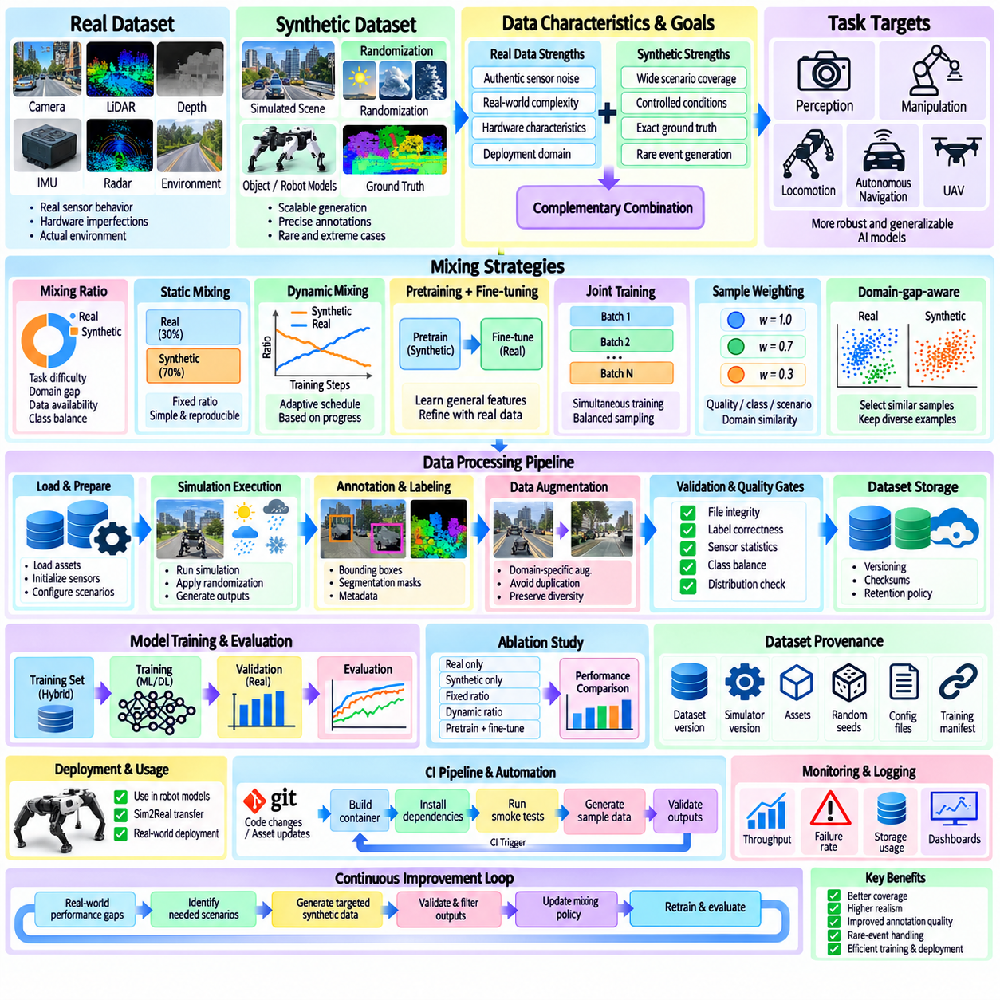{width="7.268055555555556in" height="7.268055555555556in"}

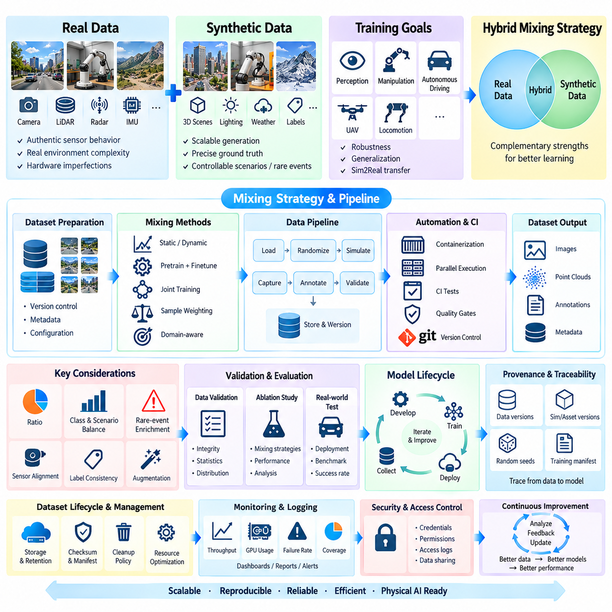{width="7.268055555555556in" height="7.268055555555556in"}

Hybrid real and synthetic dataset mixing combines physically collected data with simulation-generated data to exploit the complementary strengths of both sources. Real data captures authentic sensor behavior, environmental complexity, hardware imperfections, and operational variability, while synthetic data provides scalable generation, precise ground truth, controllable scenarios, and access to rare conditions. A successful mixing strategy treats these sources as parts of one training distribution rather than simply concatenating two independent datasets.

The first design decision is to identify the role of each data source within the learning objective. Real data can anchor the model to the deployment domain, while synthetic data can expand coverage beyond conditions that are practical to collect physically. For perception, simulation may increase diversity in object poses, lighting, weather, and occlusion. For manipulation, locomotion, or autonomous navigation, synthetic data can additionally provide controlled physical states, failures, disturbances, and precisely labeled temporal interactions.

The mixing ratio between real and synthetic samples should not be selected only according to dataset size. A very large synthetic dataset can dominate optimization if samples are drawn uniformly, causing the model to overfit simulation-specific patterns despite the presence of real data. Conversely, using too little synthetic data may fail to exploit its coverage advantage. The effective ratio should therefore reflect task difficulty, domain gap, real-data availability, synthetic quality, class balance, and the stage of model training.

Static mixing uses a fixed sampling ratio throughout training. For example, every training batch can contain predefined proportions of real and synthetic samples. This approach is simple, reproducible, and easy to analyze, making it useful as a baseline. However, a fixed ratio assumes that the value of both domains remains constant during learning. In practice, the optimal contribution of synthetic and real data may change as the model progresses from learning general representations toward adapting to deployment-specific characteristics.

Dynamic mixing changes the sampling ratio during training. Early stages can emphasize synthetic data to expose the model to broad scenario diversity, while later stages progressively increase the proportion of real data to refine domain-specific behavior. This strategy resembles curriculum learning because the training distribution evolves with model maturity. The schedule can be based on epochs, optimization steps, validation performance, domain-gap measurements, or other indicators of model readiness.

Pretraining and fine-tuning provide another practical hybrid strategy. A model can first be pretrained on a large synthetic dataset to learn useful visual, geometric, temporal, or behavioral representations. It can then be fine-tuned using a smaller real dataset that contains authentic deployment characteristics. This approach is particularly useful when synthetic data is abundant but real annotations are expensive. Fine-tuning should retain useful representations while correcting simulation-specific biases rather than completely replacing knowledge acquired during pretraining.

Joint training mixes both domains simultaneously and can preserve diversity throughout optimization. Batch construction becomes important because uncontrolled random sampling may produce unstable domain proportions, especially when dataset sizes differ greatly. Domain-aware samplers can explicitly control the number of real and synthetic examples in each batch. They can also balance classes, environments, scenarios, difficulty levels, or failure conditions so that important examples are not overwhelmed by more common samples.

Sample weighting provides a more flexible mechanism than changing only the number of examples. Real and synthetic samples can contribute different weights to the training objective, and those weights may vary according to class, confidence, scenario, or domain similarity. High-quality synthetic samples that closely represent deployment conditions may receive greater importance, while samples with obvious domain mismatch can receive less. Weighting allows a large synthetic dataset to remain available without requiring every generated example to influence optimization equally.

Domain-gap-aware mixing can use measurements of similarity between synthetic and real data to guide sample selection. Feature embeddings, sensor statistics, environmental attributes, object distributions, or task-specific performance can identify synthetic samples that are close to the target domain. Training can prioritize these samples while retaining more distant examples for diversity and robustness. This creates a continuum between domain matching and domain randomization rather than treating all synthetic samples as equally representative.

Class and scenario balance must be considered separately from the overall real-to-synthetic ratio. Real datasets frequently contain many common situations but relatively few rare events, unusual objects, failures, or hazardous conditions. Synthetic generation can deliberately increase these underrepresented categories. The objective is not necessarily to reproduce the natural frequency of every event during training, but to provide sufficient learning exposure while preserving awareness of the true deployment distribution during validation and probability calibration.

Rare-event enrichment is one of the strongest reasons to combine synthetic and real data. Dangerous robot interactions, severe sensor degradation, unusual obstacle configurations, extreme weather, manipulation failures, UAV emergencies, or locomotion disturbances may be difficult to collect safely at meaningful scale. Simulation can generate controlled examples of these situations and attach precise labels. Real data can then establish whether the synthetic representation of those events is sufficiently relevant to actual system behavior.

Sensor characteristics should be aligned when mixing datasets. Synthetic cameras, LiDAR, radar, depth sensors, IMUs, or other modalities may differ from their physical counterparts in resolution, noise, dynamic range, sampling frequency, latency, calibration, or missing-data behavior. Preprocessing should avoid introducing unnecessary differences between domains. Where appropriate, synthetic sensor models can be calibrated using measured real-data statistics so that the learning system does not exploit trivial cues that reveal whether a sample originated from simulation.

Label consistency is equally important because real and synthetic datasets may use different annotation conventions. Class taxonomies, coordinate systems, bounding-box definitions, segmentation policies, temporal labels, pose conventions, and invalid-data handling should be harmonized before training. Synthetic ground truth may be more precise than human-generated annotations, but precision alone does not guarantee compatibility. A shared dataset schema prevents the model from learning annotation-source differences instead of the intended task.

Data augmentation can be applied differently across domains. Real data may benefit from transformations that expand limited physical observations, while synthetic data may already contain extensive variation from domain randomization. Applying identical augmentation policies without analysis can distort one domain unnecessarily. Augmentation should therefore complement the diversity already present in each source. The combined pipeline should distinguish variation generated by simulation from transformations introduced during model training.

Validation sets should remain carefully separated from the mixing process. Real-world validation data is particularly important because final deployment occurs in the physical domain. Synthetic validation can measure simulation-side generalization, but it should not replace evaluation on representative real data. Test sets should also remain independent from simulation calibration where possible. Otherwise, synthetic generation may become indirectly optimized toward the same real samples used to claim transfer performance.

Ablation experiments can determine whether hybrid mixing actually improves performance. Useful comparisons include real-only training, synthetic-only training, fixed-ratio mixing, dynamic mixing, synthetic pretraining followed by real fine-tuning, and selected domain-aware strategies. Results should be evaluated on the same real-world benchmark. Such experiments reveal whether additional synthetic data contributes useful coverage, whether the domain gap limits transfer, and whether a particular mixing schedule provides measurable benefits.

The optimal mixing strategy may differ across the model lifecycle. During early development, synthetic-heavy training can accelerate experimentation and expose architecture weaknesses across many controlled conditions. As physical data accumulates, the balance can shift toward real observations. After deployment, newly collected failure cases and difficult scenarios can be incorporated into the real dataset, while simulation can generate targeted variations around those cases. The dataset therefore evolves together with the robot system.

Dataset provenance must preserve the origin and generation history of every sample. Real data should record platform, sensor configuration, environment, collection session, and annotation version, while synthetic data should record simulator version, assets, randomization parameters, seeds, and scenario definitions. Training manifests should identify exactly which versions and mixing policies were used. This information allows model behavior to be traced back to changes in data composition and supports reproducible comparisons between experiments.

Hybrid mixing can also be integrated with automated synthetic-data pipelines and continuous model evaluation. Real-world performance gaps can identify scenarios requiring additional data, simulation can generate targeted samples, validation can filter unsuitable outputs, and a revised mixing policy can produce a new training dataset. The resulting model can then be evaluated again on real benchmarks. This creates a closed data-engineering loop in which physical observations continuously guide synthetic generation.

Ultimately, hybrid real and synthetic dataset mixing is not simply a question of choosing a percentage of simulated data. It is a systematic strategy for allocating the strengths of each domain across coverage, realism, annotation quality, rare-event representation, and training efficiency. Real data anchors learning to physical deployment, synthetic data expands the accessible experience space, and controlled sampling, weighting, scheduling, validation, and provenance connect the two. Properly managed, this hybrid approach provides a scalable foundation for robust Sim2Real learning across perception, manipulation, locomotion, autonomous driving, UAV systems, and broader Physical AI applications.

하이브리드 실제 및 합성 데이터셋 혼합(Hybrid Real and Synthetic Dataset Mixing)은 물리적으로 수집된 데이터와 시뮬레이션으로 생성된 데이터를 결합하여 두 데이터 소스가 가진 상호보완적인 장점을 활용하는 방법이다. 실제 데이터(Real Data)는 실제 센서 거동, 환경의 복잡성, 하드웨어 불완전성, 운용 환경의 변동성을 반영하며, 합성 데이터(Synthetic Data)는 확장 가능한 생성, 정밀한 정답 데이터(Ground Truth), 제어 가능한 시나리오, 희귀 조건에 대한 접근성을 제공한다. 성공적인 혼합 전략은 두 개의 독립적인 데이터셋을 단순히 결합하는 것이 아니라 하나의 학습 분포(Training Distribution)를 구성하는 요소로 다룬다.

첫 번째 설계 결정은 학습 목표(Learning Objective)에서 각각의 데이터 소스가 담당하는 역할을 정의하는 것이다. 실제 데이터는 모델을 실제 배포 도메인(Deployment Domain)에 연결하는 기준점 역할을 할 수 있으며, 합성 데이터는 물리적으로 수집하기 어려운 조건까지 커버리지를 확장할 수 있다. 인지(Perception)에서는 시뮬레이션을 통해 객체 자세, 조명, 날씨, 가림(Occlusion)의 다양성을 증가시킬 수 있다. 조작(Manipulation), 이동(Locomotion), 자율 내비게이션(Autonomous Navigation)에서는 합성 데이터를 이용하여 제어된 물리 상태, 실패, 교란(Disturbance), 정밀하게 라벨링된 시간적 상호작용까지 추가할 수 있다.

실제 샘플과 합성 샘플 사이의 혼합 비율(Mixing Ratio)은 단순히 데이터셋 크기만을 기준으로 결정해서는 안 된다. 매우 큰 합성 데이터셋에서 균일하게 샘플을 추출하면 합성 데이터가 최적화 과정(Optimization)을 지배하여 실제 데이터가 존재함에도 모델이 시뮬레이션 특유의 패턴에 과적합(Overfitting)될 수 있다. 반대로 합성 데이터를 지나치게 적게 사용하면 커버리지 확장이라는 장점을 충분히 활용하지 못한다. 따라서 실질적인 혼합 비율은 작업 난이도, 도메인 갭(Domain Gap), 실제 데이터 가용성, 합성 데이터 품질, 클래스 균형(Class Balance), 모델 학습 단계를 고려하여 결정해야 한다.

고정 혼합(Static Mixing)은 전체 학습 과정에서 일정한 샘플링 비율(Sampling Ratio)을 사용한다. 예를 들어 각 학습 배치(Training Batch)에 사전에 정의된 비율의 실제 및 합성 샘플을 포함할 수 있다. 이러한 방식은 단순하고 재현 가능하며 분석하기 쉬워 기준선(Baseline)으로 활용하기에 적합하다. 그러나 고정된 비율은 학습 과정 전체에서 두 도메인의 가치가 일정하다고 가정한다. 실제로는 모델이 일반적인 표현(General Representation)을 학습하는 단계에서 실제 배포 환경의 특성에 적응하는 단계로 발전함에 따라 합성 및 실제 데이터의 적절한 기여도가 달라질 수 있다.

동적 혼합(Dynamic Mixing)은 학습 과정에서 샘플링 비율을 변경한다. 초기 단계에서는 합성 데이터의 비중을 높여 모델을 광범위한 시나리오 다양성에 노출시키고, 이후 단계에서는 실제 데이터 비율을 점진적으로 증가시켜 도메인 특화 거동(Domain-specific Behavior)을 정제할 수 있다. 이러한 전략은 모델의 성숙도에 따라 학습 분포가 변화한다는 점에서 커리큘럼 학습(Curriculum Learning)과 유사하다. 혼합 스케줄(Mixing Schedule)은 에포크(Epoch), 최적화 스텝(Optimization Step), 검증 성능, 도메인 갭 측정 또는 기타 모델 준비도 지표에 따라 결정할 수 있다.

사전학습 및 미세조정(Pretraining and Fine-tuning)은 또 다른 실용적인 하이브리드 전략이다. 모델을 먼저 대규모 합성 데이터셋으로 사전학습하여 유용한 시각적, 기하학적, 시간적 또는 행동적 표현을 학습시킬 수 있다. 이후 실제 배포 특성이 포함된 상대적으로 작은 실제 데이터셋으로 미세조정할 수 있다. 이러한 접근법은 합성 데이터는 풍부하지만 실제 데이터의 어노테이션(Annotation) 비용이 높은 경우 특히 유용하다. 미세조정은 사전학습 과정에서 획득한 유용한 표현을 완전히 대체하는 것이 아니라 유지하면서 시뮬레이션 특유의 편향(Simulation-specific Bias)을 보정해야 한다.

공동 학습(Joint Training)은 두 도메인을 동시에 혼합하여 최적화 전체 과정에서 다양성을 유지할 수 있다. 특히 데이터셋의 크기가 크게 다른 경우 제어되지 않은 무작위 샘플링(Random Sampling)은 도메인 비율을 불안정하게 만들 수 있으므로 배치 구성이 중요하다. 도메인 인지 샘플러(Domain-aware Sampler)는 각 배치에 포함되는 실제 및 합성 샘플 수를 명시적으로 제어할 수 있다. 또한 클래스, 환경, 시나리오, 난이도 또는 실패 조건을 균형 있게 구성하여 중요한 사례가 일반적인 샘플에 의해 압도되는 것을 방지할 수 있다.

샘플 가중치(Sample Weighting)는 단순히 샘플 수를 변경하는 것보다 유연한 제어 방법을 제공한다. 실제 및 합성 샘플이 학습 목적함수(Training Objective)에 서로 다른 가중치로 기여하도록 할 수 있으며, 이러한 가중치는 클래스, 신뢰도(Confidence), 시나리오 또는 도메인 유사도(Domain Similarity)에 따라 달라질 수 있다. 실제 배포 조건을 잘 표현하는 고품질 합성 샘플에는 더 높은 중요도를 부여하고, 명확한 도메인 불일치를 가진 샘플에는 낮은 가중치를 적용할 수 있다. 이를 통해 대규모 합성 데이터셋을 유지하면서도 모든 생성 샘플이 최적화에 동일하게 영향을 미치는 것을 방지할 수 있다.

도메인 갭 인지 혼합(Domain-gap-aware Mixing)은 합성 데이터와 실제 데이터 사이의 유사도 측정 결과를 샘플 선택에 활용할 수 있다. 특징 임베딩(Feature Embedding), 센서 통계, 환경 속성, 객체 분포 또는 작업별 성능을 이용하여 목표 도메인에 가까운 합성 샘플을 식별할 수 있다. 학습 과정에서는 이러한 샘플을 우선적으로 사용하면서 더 멀리 떨어진 샘플도 다양성과 강건성(Robustness)을 확보하기 위해 유지할 수 있다. 이를 통해 모든 합성 샘플을 동일하게 대표적인 것으로 간주하지 않고 도메인 매칭(Domain Matching)과 도메인 랜덤화(Domain Randomization) 사이의 연속적인 관계를 구성할 수 있다.

클래스 및 시나리오 균형(Class and Scenario Balance)은 전체적인 실제-합성 비율과 별도로 고려해야 한다. 실제 데이터셋에는 일반적인 상황이 많이 포함되지만 희귀 이벤트(Rare Event), 비정상 객체, 실패 또는 위험 조건은 상대적으로 적은 경우가 많다. 합성 데이터 생성을 통해 이러한 부족한 범주를 의도적으로 증가시킬 수 있다. 학습 과정의 목적은 모든 사건의 자연 발생 빈도를 그대로 재현하는 것만이 아니라 충분한 학습 노출(Learning Exposure)을 제공하는 것이다. 동시에 검증과 확률 보정(Probability Calibration) 과정에서는 실제 배포 환경의 분포를 고려해야 한다.

희귀 이벤트 강화(Rare-event Enrichment)는 합성 데이터와 실제 데이터를 결합하는 가장 중요한 이유 중 하나이다. 위험한 로봇 상호작용, 심각한 센서 성능 저하, 비정상적인 장애물 구성, 극한 날씨, 조작 실패, UAV 비상상황 또는 이동 교란은 실제 환경에서 안전하게 충분한 규모로 수집하기 어려울 수 있다. 시뮬레이션에서는 이러한 상황의 제어된 사례를 생성하고 정확한 라벨을 제공할 수 있다. 이후 실제 데이터를 이용하여 이러한 이벤트의 합성 표현이 실제 시스템 거동과 충분히 관련되는지를 확인할 수 있다.

데이터셋을 혼합할 때 센서 특성(Sensor Characteristics)을 정렬해야 한다. 합성 카메라, 라이다, 레이더, 깊이 센서, IMU 또는 기타 모달리티(Modality)는 해상도, 잡음, 동적 범위(Dynamic Range), 샘플링 주파수, 지연시간, 보정(Calibration), 결측 데이터(Missing-data) 거동에서 실제 센서와 차이가 있을 수 있다. 전처리(Preprocessing)는 도메인 사이에 불필요한 차이를 추가하지 않도록 구성해야 한다. 필요한 경우 실제 데이터에서 측정된 통계를 이용하여 합성 센서 모델을 보정함으로써 학습 시스템이 샘플이 시뮬레이션에서 생성되었는지를 나타내는 단순한 특징을 학습하는 것을 방지할 수 있다.

라벨 일관성(Label Consistency) 역시 중요하다. 실제 데이터셋과 합성 데이터셋은 서로 다른 어노테이션 규칙(Annotation Convention)을 사용할 수 있기 때문이다. 클래스 분류체계(Class Taxonomy), 좌표계(Coordinate System), 바운딩 박스 정의, 분할 정책(Segmentation Policy), 시간적 라벨, 자세 규칙(Pose Convention), 유효하지 않은 데이터의 처리 방법을 학습 전에 통일해야 한다. 합성 정답 데이터는 사람이 생성한 어노테이션보다 더 정밀할 수 있지만, 정밀도 자체가 호환성을 보장하지는 않는다. 공통 데이터셋 스키마(Shared Dataset Schema)를 사용하면 모델이 의도한 작업 대신 어노테이션 출처의 차이를 학습하는 것을 방지할 수 있다.

데이터 증강(Data Augmentation)은 도메인별로 서로 다르게 적용할 수 있다. 실제 데이터는 제한된 물리적 관측을 확장하는 변환의 이점을 얻을 수 있는 반면, 합성 데이터는 이미 도메인 랜덤화를 통해 광범위한 변화를 포함할 수 있다. 분석 없이 동일한 증강 정책(Augmentation Policy)을 두 도메인에 적용하면 한쪽 도메인을 불필요하게 왜곡할 수 있다. 따라서 데이터 증강은 각 데이터 소스에 이미 존재하는 다양성을 보완하도록 구성해야 한다. 통합 파이프라인에서는 시뮬레이션으로 생성된 변화와 모델 학습 과정에서 추가되는 변환을 구분해야 한다.

검증 데이터셋(Validation Set)은 혼합 과정과 신중하게 분리해야 한다. 최종 배포가 물리적 환경에서 이루어지기 때문에 실제 환경 검증 데이터가 특히 중요하다. 합성 검증 데이터는 시뮬레이션 내부에서의 일반화 성능을 측정할 수 있지만 대표적인 실제 데이터 평가를 대체해서는 안 된다. 가능하면 테스트 데이터셋(Test Set)도 시뮬레이션 보정 과정과 독립적으로 유지해야 한다. 그렇지 않으면 합성 데이터 생성 과정이 전이 성능을 주장하는 데 사용되는 동일한 실제 샘플에 간접적으로 최적화될 수 있다.

절제 실험(Ablation Experiment)을 이용하면 하이브리드 혼합이 실제로 성능을 향상시키는지를 확인할 수 있다. 유용한 비교에는 실제 데이터만을 이용한 학습, 합성 데이터만을 이용한 학습, 고정 비율 혼합, 동적 혼합, 합성 데이터 사전학습 후 실제 데이터 미세조정, 선택된 도메인 인지 전략 등이 포함된다. 결과는 동일한 실제 환경 벤치마크(Real-world Benchmark)를 이용하여 평가해야 한다. 이러한 실험을 통해 추가적인 합성 데이터가 유용한 커버리지를 제공하는지, 도메인 갭이 전이를 제한하는지, 특정 혼합 스케줄이 측정 가능한 이점을 제공하는지를 확인할 수 있다.

최적의 혼합 전략은 모델 수명주기(Model Lifecycle)에 따라 달라질 수 있다. 개발 초기에는 합성 데이터 중심의 학습을 통해 실험 속도를 높이고 다양한 제어 조건에서 모델 아키텍처의 약점을 확인할 수 있다. 실제 데이터가 축적되면 실제 관측의 비중을 증가시킬 수 있다. 배포 이후에는 새롭게 수집된 실패 사례와 어려운 시나리오를 실제 데이터셋에 추가하고, 시뮬레이션을 이용하여 이러한 사례 주변의 다양한 조건을 생성할 수 있다. 따라서 데이터셋은 로봇 시스템과 함께 지속적으로 발전한다.

데이터셋 출처 관리(Dataset Provenance)는 모든 샘플의 원본과 생성 이력을 보존해야 한다. 실제 데이터에는 플랫폼, 센서 구성, 환경, 데이터 수집 세션(Collection Session), 어노테이션 버전을 기록해야 하며, 합성 데이터에는 시뮬레이터 버전, 자산(Asset), 랜덤화 매개변수, 랜덤 시드, 시나리오 정의를 기록해야 한다. 학습 매니페스트(Training Manifest)에는 정확히 어떤 데이터 버전과 혼합 정책이 사용되었는지를 명시해야 한다. 이러한 정보는 모델의 행동을 데이터 구성 변화까지 추적할 수 있게 하고 실험 간 재현 가능한 비교를 지원한다.

하이브리드 혼합은 자동화된 합성 데이터 파이프라인(Automated Synthetic-data Pipeline) 및 지속적인 모델 평가(Continuous Model Evaluation)와 통합할 수도 있다. 실제 환경에서 발견된 성능 갭(Performance Gap)을 이용하여 추가 데이터가 필요한 시나리오를 식별하고, 시뮬레이션에서 목표 합성 샘플을 생성하며, 검증 과정을 통해 부적절한 출력을 제거하고, 수정된 혼합 정책으로 새로운 학습 데이터셋을 구성할 수 있다. 이후 생성된 모델을 실제 환경 벤치마크에서 다시 평가할 수 있다. 이를 통해 물리적 관측이 합성 데이터 생성을 지속적으로 안내하는 폐루프 데이터 엔지니어링(Closed-loop Data Engineering) 구조를 형성할 수 있다.

궁극적으로 하이브리드 실제 및 합성 데이터셋 혼합은 단순히 시뮬레이션 데이터의 비율을 결정하는 문제가 아니다. 이는 커버리지, 현실성, 어노테이션 품질, 희귀 이벤트 표현, 학습 효율성 측면에서 각 도메인의 장점을 체계적으로 배분하는 전략이다. 실제 데이터는 학습을 물리적 배포 환경에 연결하고, 합성 데이터는 접근 가능한 경험 공간(Experience Space)을 확장하며, 제어된 샘플링, 가중치, 스케줄링, 검증, 출처 관리가 두 영역을 연결한다. 이러한 하이브리드 접근법을 적절하게 관리하면 인지, 조작, 이동, 자율주행, UAV 시스템 및 보다 광범위한 Physical AI 응용을 위한 강건한 Sim2Real 학습의 확장 가능한 기반을 제공할 수 있다.
