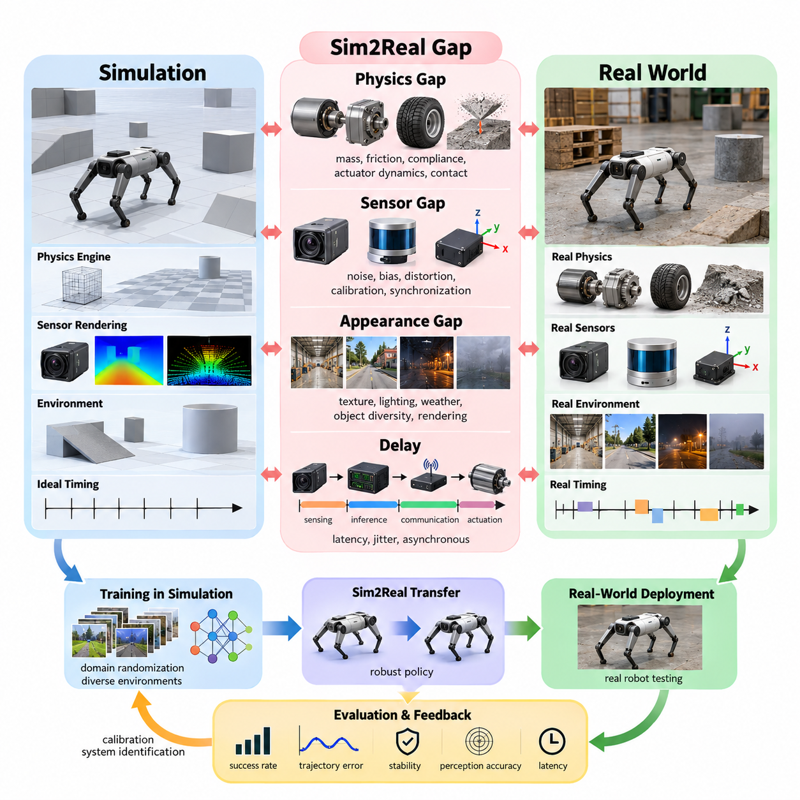
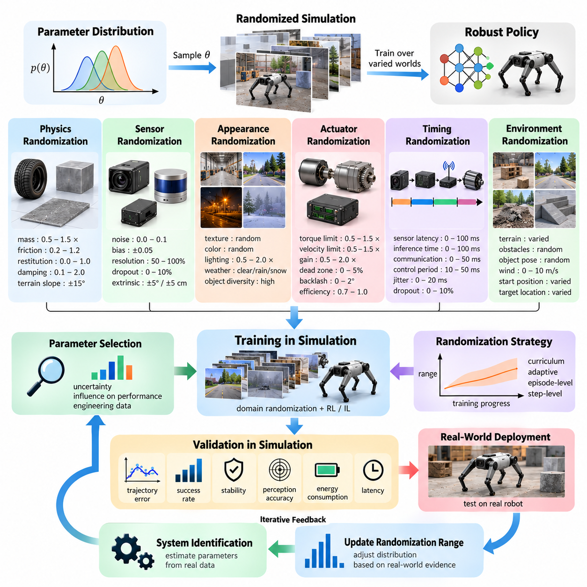
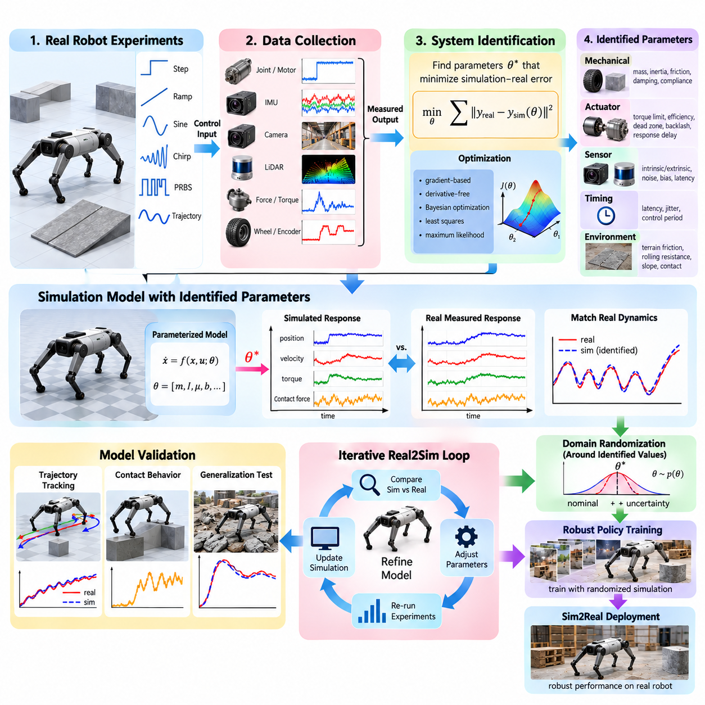
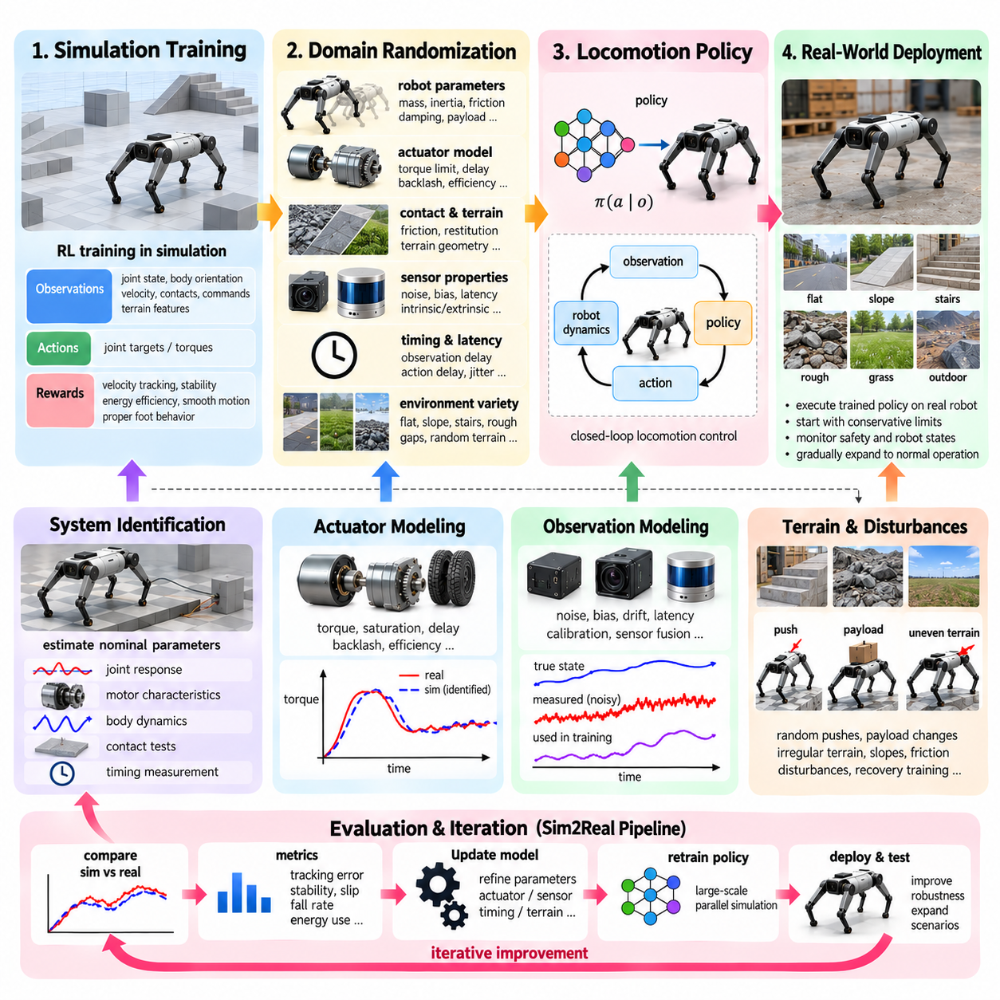
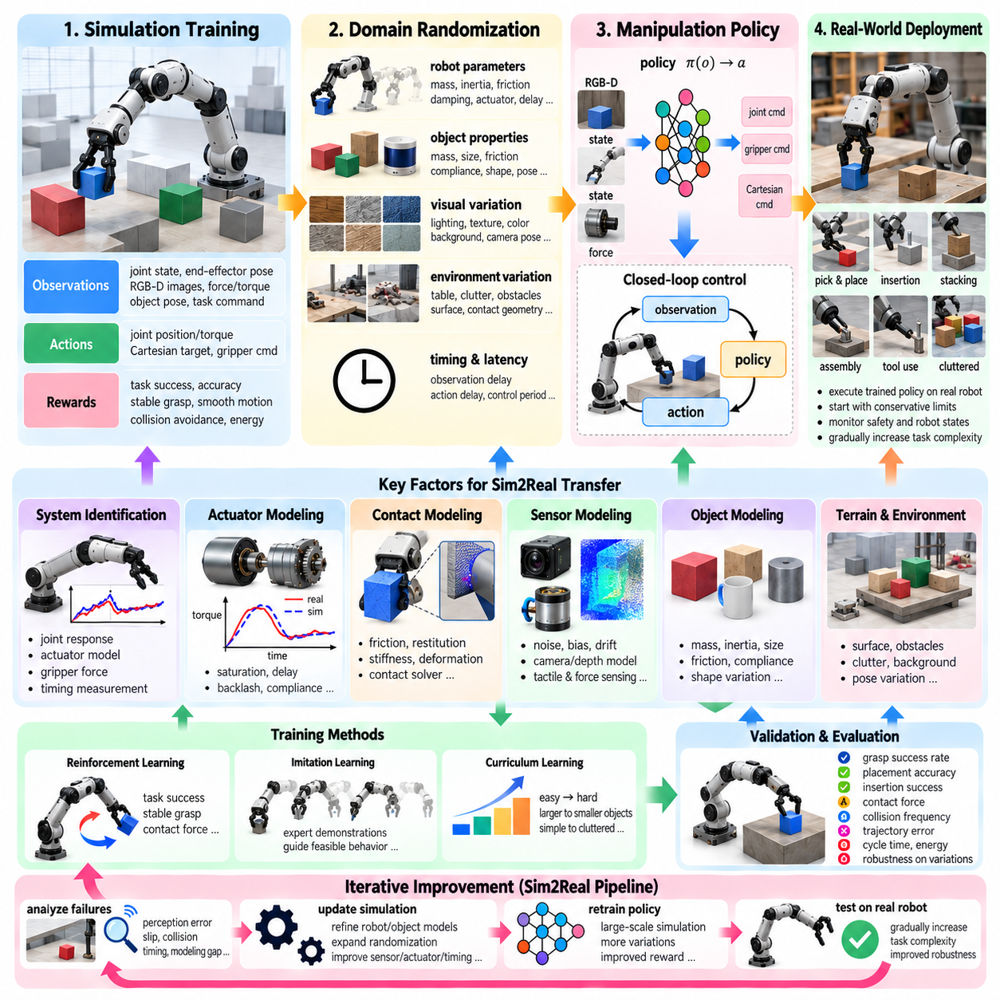
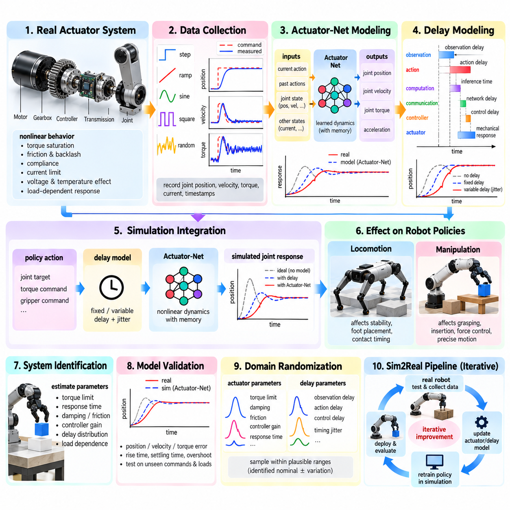
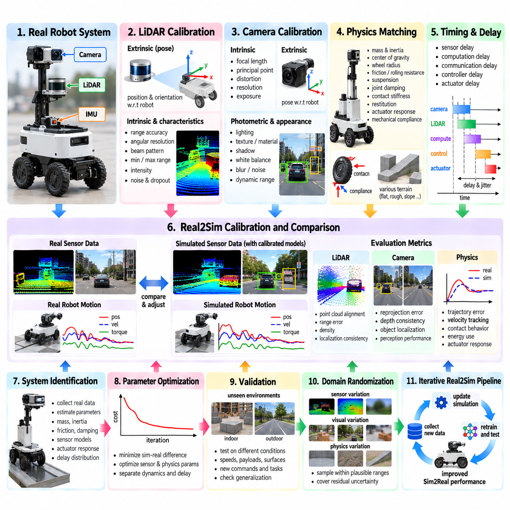
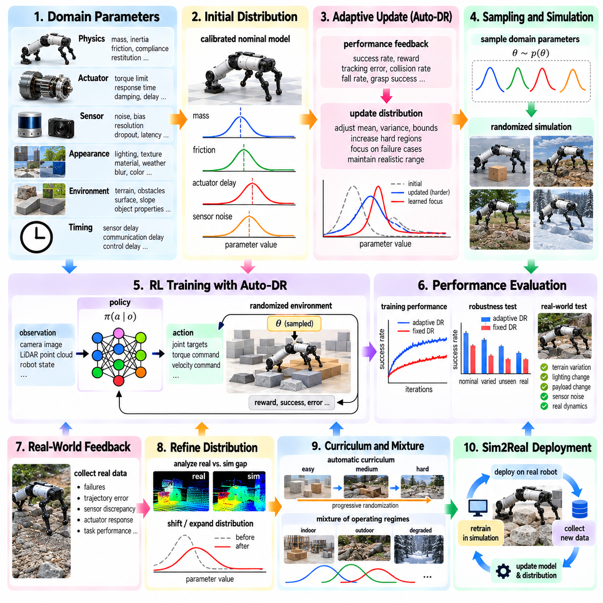
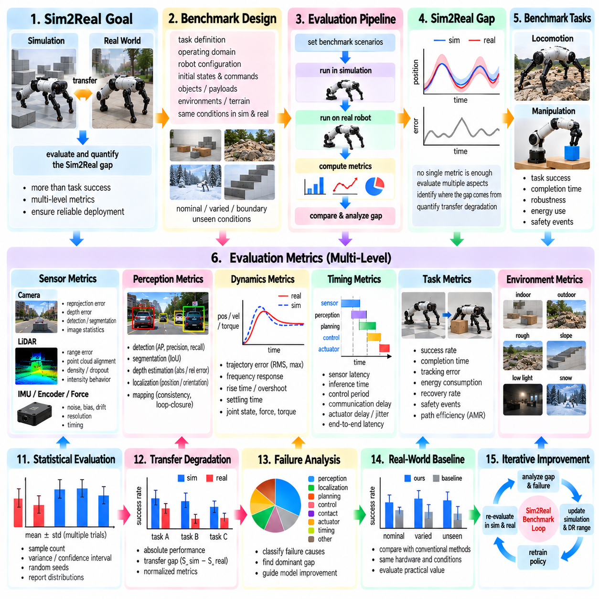
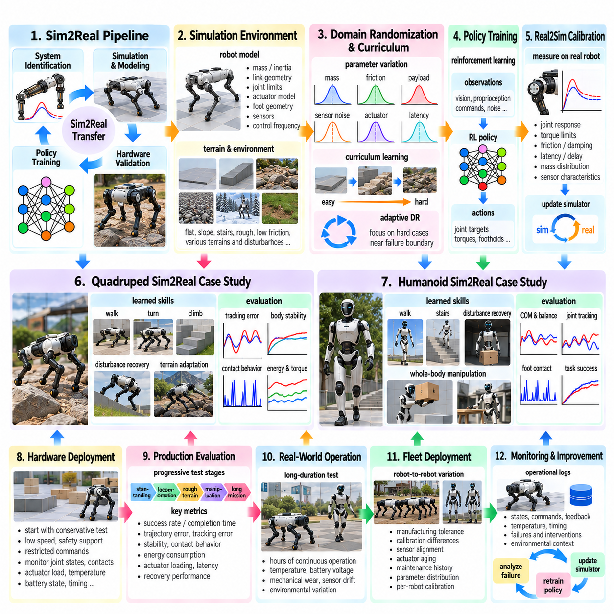

**Volume 11. Simulation and Digital Twin**


# Chapter 10. Sim2Real Transfer

##  

## 10.01. Sim2Real Gap Sources Physics Sensor Appearance Delay

{width="7.268055555555556in" height="7.268055555555556in"}

Sim2Real transfer addresses the problem of moving robot behaviors, perception models, and control policies developed in simulation into physical systems. A simulator represents reality through mathematical models and approximations, so even a highly detailed environment cannot reproduce every property of the real world. The resulting discrepancy is called the simulation-to-reality gap, or Sim2Real gap, and it directly influences whether a policy that performs reliably in simulation remains stable, accurate, and safe after deployment.

Within the simulation and digital twin workflow, Sim2Real transfer follows physics modeling, sensor simulation, environment modeling, synthetic data generation, and simulator-based training. The chapter structure therefore treats the Sim2Real gap as a multidimensional problem involving physics, sensing, appearance, and delay before introducing domain randomization, system identification, actuator modeling, Real2Sim calibration, and transfer evaluation.

The physics gap originates from differences between simulated dynamics and the behavior of actual mechanical systems. Robot mass, center of gravity, inertia tensors, friction coefficients, restitution, joint damping, compliance, backlash, tire deformation, motor characteristics, and contact forces may all differ from their simulated values. Small errors in these parameters can accumulate through closed-loop control and produce substantially different trajectories, particularly during high-speed motion, manipulation, locomotion, or operation on irregular terrain.

Contact dynamics are an especially important source of physics mismatch because real contact involves complex material deformation, surface roughness, vibration, impact, and nonlinear friction. Physics engines approximate these phenomena using discrete time steps, collision geometries, constraint solvers, and simplified friction models. A simulated wheel may therefore maintain ideal traction where a physical tire slips, while a simulated robotic hand may establish a stable grasp that fails on the real object because of compliance or uncertain friction.

Actuators introduce another major gap. Simulated joints frequently receive ideal torque, velocity, or position commands, whereas physical actuators contain motors, gearboxes, transmissions, current controllers, mechanical elasticity, saturation limits, dead zones, thermal effects, and internal control loops. Commanded torque is consequently not identical to delivered torque. This discrepancy becomes particularly significant for dynamically controlled quadrupeds, humanoids, manipulators, and high-performance mobile robots whose policies exploit rapid actuator responses.

The sensor gap arises because simulated observations are generated from idealized computational models while physical sensors interact with complicated optical, electrical, mechanical, and environmental processes. Cameras experience exposure variation, lens distortion, motion blur, rolling-shutter effects, noise, reflections, and limited dynamic range. LiDAR systems exhibit range uncertainty, missing returns, multipath effects, material-dependent reflectivity, and interference, while IMUs accumulate bias, noise, scale-factor error, temperature effects, and drift.

Sensor mismatch is not limited to measurement noise. Calibration and coordinate transformations can also differ between simulation and hardware. A camera, LiDAR, radar, or IMU mounted a few millimeters or degrees away from its modeled pose changes the spatial relationship between observations. Timestamp errors and synchronization differences further distort multi-sensor fusion. A perception or localization system trained with perfectly aligned simulated measurements can therefore become unexpectedly sensitive when deployed on a physical robot.

The appearance gap concerns differences between rendered simulation and visual observations from the physical environment. Geometry, textures, materials, illumination, shadows, reflections, weather, object diversity, clutter, and camera response determine the statistical distribution of images. Even photorealistic rendering cannot guarantee that these distributions match every deployment environment. Neural perception systems may learn simulation-specific visual cues that correlate with labels during training but disappear when the same model observes real warehouses, roads, factories, or outdoor terrain.

Appearance mismatch can also arise from insufficient environmental diversity rather than poor rendering quality alone. A visually realistic warehouse containing only a small set of floor textures, pallets, lighting configurations, and obstacle arrangements may provide less transferable training data than a less photorealistic environment with broad randomized variation. Sim2Real design therefore focuses not only on reproducing one real environment precisely, but also on exposing models to enough variation that irrelevant visual properties are not treated as reliable features.

Delay represents a less visible but equally critical dimension of the Sim2Real gap. Simulation pipelines often execute sensing, inference, planning, communication, and actuation with deterministic timing or unrealistically small latency. Physical systems introduce camera exposure time, sensor acquisition delay, network transmission, middleware queues, GPU inference time, operating-system scheduling, controller execution, fieldbus communication, actuator response, and timestamp jitter. The robot therefore acts on information describing a world that has already changed.

Latency becomes particularly dangerous when a control policy depends on high-frequency feedback. A policy trained with nearly instantaneous state observations may oscillate or become unstable when deployed with tens of milliseconds of end-to-end delay. Variable delay can be even more difficult than constant latency because the controller cannot compensate using a fixed offset. Accurate simulation must therefore represent both average latency and its temporal distribution, including jitter, dropped messages, asynchronous sensors, and computation spikes.

These gap sources interact rather than operating independently. Incorrect tire friction changes vehicle motion, which changes camera and LiDAR observations; sensor latency causes perception to represent an earlier vehicle pose; actuator delay alters the commanded trajectory; and appearance changes affect perception confidence. The final deployment error is therefore not simply the sum of isolated modeling errors. Sim2Real must be treated as a system-level problem spanning the complete perception, estimation, planning, control, communication, and mechanical loop.

The relative importance of each gap depends on the robotic application. For an AMR, wheel-ground friction, payload-dependent dynamics, LiDAR characteristics, localization uncertainty, and communication delay may dominate. Manipulation emphasizes contact mechanics, actuator behavior, object properties, and camera calibration. Legged robots are highly sensitive to contact, actuator dynamics, latency, and state estimation, while UAVs require accurate aerodynamic forces, motor response, inertial sensing, environmental disturbances, and timing behavior.

A practical Sim2Real workflow begins by identifying which simulated parameters have the greatest influence on real-world performance rather than attempting to reproduce reality perfectly. Measurements from the physical robot can be compared with simulation trajectories, sensor outputs, actuator responses, and timing traces. These differences provide evidence for system identification and Real2Sim calibration, while uncertain parameters become candidates for domain randomization. The objective is a simulation distribution that adequately contains realistic operating behavior.

Domain randomization deliberately varies uncertain properties such as mass, friction, lighting, textures, sensor noise, actuator strength, and latency during training. Instead of optimizing a policy for one nominal simulator configuration, training exposes it to a family of possible worlds. System identification serves a complementary purpose by estimating physical parameters from real measurements. Together, calibration and randomization can reduce dependence on inaccurate assumptions while improving robustness against variations that cannot be modeled exactly.

The Sim2Real gap should ultimately be evaluated through measurable differences between simulation and physical deployment. Trajectory error, task success rate, control stability, energy consumption, perception accuracy, localization error, contact behavior, intervention frequency, and latency distributions can reveal different failure modes. Evaluation should examine not only average performance but also difficult boundary conditions where combinations of modeling errors cause failures that were absent during simulation.

Sim2Real transfer is therefore not a single conversion step performed after simulation training. It is an iterative engineering loop connecting simulation, physical experiments, parameter estimation, calibration, randomization, policy training, deployment, and validation. As real-world observations reveal new discrepancies, the simulator is updated and training is repeated. This feedback process gradually transforms simulation from an isolated virtual environment into an engineering instrument for developing robot intelligence that remains effective under real physical uncertainty.

시뮬레이션-현실 전이(Sim2Real Transfer)는 시뮬레이션(Simulation)에서 개발된 로봇 행동(Robot Behavior), 인지 모델(Perception Model), 제어 정책(Control Policy)을 실제 물리 시스템(Physical System)으로 이전하는 문제를 다룬다. 시뮬레이터(Simulator)는 수학적 모델(Mathematical Model)과 근사화(Approximation)를 통해 현실을 표현하므로, 매우 상세한 환경이라도 현실 세계의 모든 특성을 완벽하게 재현할 수는 없다. 이러한 차이를 시뮬레이션-현실 격차(Sim2Real Gap)라고 하며, 시뮬레이션에서 안정적으로 동작하던 정책이 실제 배치(Deployment) 이후에도 안정성, 정확성, 안전성을 유지할 수 있는지를 직접적으로 좌우한다.

시뮬레이션 및 디지털 트윈(Simulation and Digital Twin) 워크플로에서 시뮬레이션-현실 전이(Sim2Real Transfer)는 물리 모델링(Physics Modeling), 센서 시뮬레이션(Sensor Simulation), 환경 모델링(Environment Modeling), 합성 데이터 생성(Synthetic Data Generation), 시뮬레이터 기반 학습(Simulator-Based Training)의 후속 단계에 위치한다. 따라서 시뮬레이션-현실 격차(Sim2Real Gap)는 물리(Physics), 센싱(Sensing), 외관(Appearance), 지연(Delay)을 포함하는 다차원 문제(Multidimensional Problem)로 다루어지며, 이후 도메인 랜덤화(Domain Randomization), 시스템 식별(System Identification), 액추에이터 모델링(Actuator Modeling), 현실-시뮬레이션 보정(Real2Sim Calibration), 전이 평가(Transfer Evaluation)로 확장된다.

물리 격차(Physics Gap)는 시뮬레이션된 동역학(Simulated Dynamics)과 실제 기계 시스템(Physical Mechanical System)의 거동 차이에서 발생한다. 로봇의 질량(Mass), 무게중심(Center of Gravity), 관성 텐서(Inertia Tensor), 마찰 계수(Friction Coefficient), 반발 계수(Restitution), 관절 감쇠(Joint Damping), 컴플라이언스(Compliance), 백래시(Backlash), 타이어 변형(Tire Deformation), 모터 특성(Motor Characteristics), 접촉력(Contact Force) 등이 모두 시뮬레이션 값과 달라질 수 있다. 이러한 매개변수의 작은 오차도 폐루프 제어(Closed-Loop Control) 과정에서 누적되어 고속 이동, 조작, 보행, 불규칙 지형 주행에서 상당한 궤적 차이를 발생시킬 수 있다.

접촉 동역학(Contact Dynamics)은 특히 중요한 물리 불일치(Physics Mismatch)의 원인이다. 실제 접촉에는 복잡한 재료 변형(Material Deformation), 표면 거칠기(Surface Roughness), 진동(Vibration), 충격(Impact), 비선형 마찰(Nonlinear Friction)이 포함된다. 물리 엔진(Physics Engine)은 이를 이산 시간 간격(Discrete Time Step), 충돌 형상(Collision Geometry), 제약조건 솔버(Constraint Solver), 단순화된 마찰 모델(Friction Model)을 사용하여 근사한다. 따라서 시뮬레이션의 바퀴가 이상적인 접지력을 유지하는 상황에서도 실제 타이어는 미끄러질 수 있으며, 시뮬레이션에서 안정적으로 물체를 파지한 로봇 손도 실제 환경에서는 컴플라이언스나 불확실한 마찰 때문에 파지에 실패할 수 있다.

액추에이터(Actuator) 역시 중요한 격차를 발생시킨다. 시뮬레이션된 관절(Simulated Joint)은 흔히 이상적인 토크(Torque), 속도(Velocity), 위치(Position) 명령을 입력받지만, 실제 액추에이터에는 모터(Motor), 기어박스(Gearbox), 전달계(Transmission), 전류 제어기(Current Controller), 기계적 탄성(Mechanical Elasticity), 포화 한계(Saturation Limit), 데드존(Dead Zone), 열 영향(Thermal Effect), 내부 제어 루프(Internal Control Loop)가 존재한다. 따라서 명령 토크(Commanded Torque)와 실제 전달 토크(Delivered Torque)는 동일하지 않으며, 이러한 차이는 빠른 액추에이터 응답을 활용하는 사족보행 로봇(Quadruped), 휴머노이드(Humanoid), 매니퓰레이터(Manipulator), 고성능 모바일 로봇에서 특히 중요하다.

센서 격차(Sensor Gap)는 시뮬레이션 관측값이 이상화된 계산 모델(Idealized Computational Model)에서 생성되는 반면 실제 센서는 복잡한 광학적, 전기적, 기계적, 환경적 과정과 상호작용하기 때문에 발생한다. 카메라(Camera)는 노출 변화(Exposure Variation), 렌즈 왜곡(Lens Distortion), 모션 블러(Motion Blur), 롤링 셔터(Rolling Shutter), 노이즈(Noise), 반사(Reflection), 제한된 동적 범위(Dynamic Range)의 영향을 받는다. 라이다(LiDAR)는 거리 불확실성(Range Uncertainty), 누락된 반사값(Missing Return), 다중경로 효과(Multipath Effect), 재료별 반사율(Material-Dependent Reflectivity), 간섭(Interference)이 발생하며, 관성 측정 장치(IMU)는 바이어스(Bias), 노이즈, 스케일 팩터 오차(Scale-Factor Error), 온도 영향(Temperature Effect), 드리프트(Drift)를 누적한다.

센서 불일치(Sensor Mismatch)는 측정 노이즈에만 국한되지 않는다. 보정(Calibration)과 좌표 변환(Coordinate Transformation) 역시 시뮬레이션과 실제 하드웨어 사이에서 차이가 발생할 수 있다. 카메라, 라이다, 레이더(Radar), 관성 측정 장치(IMU)가 모델링된 위치에서 몇 밀리미터 또는 몇 도만 벗어나 장착되어도 관측값 사이의 공간적 관계가 달라진다. 타임스탬프(Timestamp) 오차와 동기화(Synchronization) 차이는 다중 센서 융합(Multi-Sensor Fusion)을 추가로 왜곡한다. 따라서 완벽하게 정렬된 시뮬레이션 측정값으로 학습된 인지 또는 위치추정 시스템(Localization System)은 실제 로봇에 배치되었을 때 예상보다 높은 민감성을 나타낼 수 있다.

외관 격차(Appearance Gap)는 렌더링된 시뮬레이션(Rendered Simulation)과 실제 환경에서 얻은 시각적 관측(Visual Observation)의 차이를 의미한다. 형상(Geometry), 텍스처(Texture), 재질(Material), 조명(Illumination), 그림자(Shadow), 반사(Reflection), 날씨(Weather), 객체 다양성(Object Diversity), 클러터(Clutter), 카메라 응답(Camera Response)이 이미지의 통계적 분포(Statistical Distribution)를 결정한다. 사실적 렌더링(Photorealistic Rendering)을 사용하더라도 이러한 분포가 모든 실제 배치 환경과 일치한다고 보장할 수 없다. 신경망 기반 인지 시스템(Neural Perception System)은 학습 과정에서 레이블과 상관관계가 있지만 실제 창고, 도로, 공장, 야외 지형에서는 존재하지 않는 시뮬레이션 특유의 시각적 단서를 학습할 수 있다.

외관 불일치(Appearance Mismatch)는 렌더링 품질이 낮기 때문만이 아니라 환경 다양성(Environmental Diversity)이 부족하기 때문에 발생할 수도 있다. 제한된 바닥 텍스처, 팔레트, 조명 조건, 장애물 배치만을 포함하는 매우 사실적인 창고 환경은 폭넓은 무작위 변형(Randomized Variation)을 포함한 상대적으로 덜 사실적인 환경보다 전이 가능한 학습 데이터(Transferable Training Data)를 적게 제공할 수 있다. 따라서 시뮬레이션-현실 전이 설계(Sim2Real Design)는 하나의 실제 환경을 정밀하게 복제하는 것뿐 아니라 모델이 중요하지 않은 시각적 특성을 신뢰할 수 있는 특징으로 학습하지 않도록 충분한 변형에 노출시키는 데 중점을 둔다.

지연(Delay)은 눈에 잘 드러나지 않지만 시뮬레이션-현실 격차에서 동일하게 중요한 요소이다. 시뮬레이션 파이프라인(Simulation Pipeline)은 센싱(Sensing), 추론(Inference), 계획(Planning), 통신(Communication), 구동(Actuation)을 결정론적 타이밍(Deterministic Timing) 또는 비현실적으로 작은 지연시간(Latency)으로 실행하는 경우가 많다. 실제 시스템에는 카메라 노출 시간(Camera Exposure Time), 센서 획득 지연(Sensor Acquisition Delay), 네트워크 전송(Network Transmission), 미들웨어 큐(Middleware Queue), GPU 추론 시간(GPU Inference Time), 운영체제 스케줄링(OS Scheduling), 제어기 실행(Controller Execution), 필드버스 통신(Fieldbus Communication), 액추에이터 응답(Actuator Response), 타임스탬프 지터(Timestamp Jitter)가 존재한다. 따라서 로봇은 이미 변화한 세계를 나타내는 정보를 기반으로 행동하게 된다.

제어 정책(Control Policy)이 고주파 피드백(High-Frequency Feedback)에 의존하는 경우 지연시간(Latency)은 특히 위험해진다. 거의 즉각적인 상태 관측(State Observation)을 기반으로 학습된 정책은 실제 시스템에서 수십 밀리초의 종단간 지연(End-to-End Delay)이 발생하면 진동하거나 불안정해질 수 있다. 가변 지연(Variable Delay)은 고정 오프셋(Fixed Offset)으로 보상할 수 없기 때문에 일정한 지연보다 더욱 어려운 문제가 될 수 있다. 따라서 정확한 시뮬레이션은 평균 지연뿐만 아니라 지터(Jitter), 메시지 손실(Dropped Message), 비동기 센서(Asynchronous Sensor), 연산 시간 급증(Computation Spike)을 포함하는 시간적 분포(Temporal Distribution)까지 표현해야 한다.

이러한 격차의 원인들은 독립적으로 작용하지 않고 서로 상호작용한다. 부정확한 타이어 마찰은 차량 움직임을 변화시키고, 이는 다시 카메라와 라이다 관측을 변화시킨다. 센서 지연은 인지 시스템이 과거의 차량 자세(Vehicle Pose)를 표현하도록 만들며, 액추에이터 지연은 명령된 궤적(Commanded Trajectory)을 변경하고, 외관 변화는 인지 신뢰도(Perception Confidence)에 영향을 미친다. 따라서 최종 배치 오차(Deployment Error)는 개별 모델링 오차의 단순한 합이 아니다. 시뮬레이션-현실 전이(Sim2Real)는 인지, 상태 추정(Estimation), 계획, 제어, 통신, 기계 시스템 전체를 포함하는 시스템 수준 문제(System-Level Problem)로 다루어야 한다.

각 격차의 상대적 중요성은 로봇 응용 분야에 따라 달라진다. 자율이동로봇(AMR)의 경우 바퀴-지면 마찰(Wheel-Ground Friction), 적재량에 따른 동역학(Payload-Dependent Dynamics), 라이다 특성, 위치추정 불확실성(Localization Uncertainty), 통신 지연이 중요할 수 있다. 조작(Manipulation)에서는 접촉 역학(Contact Mechanics), 액추에이터 거동, 물체 특성(Object Properties), 카메라 보정(Camera Calibration)이 중요하다. 보행 로봇(Legged Robot)은 접촉, 액추에이터 동역학, 지연, 상태 추정에 매우 민감하며, 무인항공기(UAV)는 정확한 공기역학적 힘(Aerodynamic Force), 모터 응답(Motor Response), 관성 센싱(Inertial Sensing), 환경 교란(Environmental Disturbance), 타이밍 특성을 필요로 한다.

실용적인 시뮬레이션-현실 전이 워크플로(Sim2Real Workflow)는 현실을 완벽하게 재현하려고 시도하기보다 실제 성능에 가장 큰 영향을 미치는 시뮬레이션 매개변수를 식별하는 것에서 시작한다. 실제 로봇의 측정 데이터를 시뮬레이션 궤적, 센서 출력, 액추에이터 응답, 타이밍 추적(Timing Trace)과 비교할 수 있다. 이러한 차이는 시스템 식별(System Identification)과 현실-시뮬레이션 보정(Real2Sim Calibration)을 위한 근거를 제공하며, 불확실한 매개변수는 도메인 랜덤화(Domain Randomization)의 후보가 된다. 목표는 현실적인 동작 범위를 충분히 포함하는 시뮬레이션 분포(Simulation Distribution)를 구축하는 것이다.

도메인 랜덤화(Domain Randomization)는 학습 과정에서 질량, 마찰, 조명, 텍스처, 센서 노이즈, 액추에이터 출력, 지연시간과 같은 불확실한 특성을 의도적으로 변화시킨다. 하나의 명목상 시뮬레이터 설정(Nominal Simulator Configuration)에 정책을 최적화하는 대신, 학습 과정에서 가능한 다양한 세계에 정책을 노출한다. 시스템 식별(System Identification)은 실제 측정값으로부터 물리 매개변수(Physical Parameter)를 추정함으로써 이를 보완한다. 보정(Calibration)과 랜덤화(Randomization)를 함께 적용하면 부정확한 가정에 대한 의존성을 줄이고 정확하게 모델링하기 어려운 변화에 대한 강건성(Robustness)을 향상시킬 수 있다.

시뮬레이션-현실 격차(Sim2Real Gap)는 궁극적으로 시뮬레이션과 실제 배치 사이의 측정 가능한 차이를 통해 평가해야 한다. 궤적 오차(Trajectory Error), 작업 성공률(Task Success Rate), 제어 안정성(Control Stability), 에너지 소비(Energy Consumption), 인지 정확도(Perception Accuracy), 위치추정 오차(Localization Error), 접촉 거동(Contact Behavior), 개입 빈도(Intervention Frequency), 지연시간 분포(Latency Distribution)는 서로 다른 실패 모드(Failure Mode)를 드러낼 수 있다. 평가는 평균 성능뿐 아니라 여러 모델링 오차가 결합되어 시뮬레이션에서는 나타나지 않았던 실패를 발생시키는 어려운 경계 조건(Boundary Condition)까지 검토해야 한다.

따라서 시뮬레이션-현실 전이(Sim2Real Transfer)는 시뮬레이션 학습 이후 한 번 수행하는 단순한 변환 단계가 아니다. 이는 시뮬레이션, 실제 실험(Physical Experiment), 매개변수 추정(Parameter Estimation), 보정, 랜덤화, 정책 학습(Policy Training), 배치, 검증(Validation)을 연결하는 반복적 엔지니어링 루프(Iterative Engineering Loop)이다. 실제 관측을 통해 새로운 불일치가 발견되면 시뮬레이터를 업데이트하고 학습을 반복한다. 이러한 피드백 과정(Feedback Process)을 통해 시뮬레이션은 독립된 가상 환경을 넘어 실제 물리적 불확실성(Physical Uncertainty)에서도 효과적으로 동작하는 로봇 지능(Robot Intelligence)을 개발하기 위한 엔지니어링 도구로 발전한다.

##  

## 10.02. Domain Randomization Theory and Parameter Ranges [w/Code]

{width="7.268055555555556in" height="7.268055555555556in"}

Domain randomization is a Sim2Real technique that trains a robot policy or perception model across a distribution of simulated worlds rather than a single nominal environment. Parameters describing physics, sensors, appearance, actuators, timing, and environment configuration are deliberately varied during training. The objective is not to reproduce one physical system perfectly, but to make the learned model robust to the uncertainty and variability encountered when simulation-trained intelligence is deployed on real hardware.

The theoretical foundation of domain randomization can be expressed by treating simulation parameters as random variables. Instead of training under one fixed parameter vector θ, each simulation episode samples θ from a probability distribution p(θ). The policy therefore experiences different dynamics, observations, disturbances, and environmental conditions throughout training. Optimization seeks behavior that performs well over this distribution, reducing dependence on specific assumptions embedded in the nominal simulator.

A useful interpretation is that the real system represents an unknown point, or a changing region, within a larger family of possible systems. If the randomized simulation distribution adequately covers this region, a policy trained across that distribution has a greater probability of functioning on the real robot. This idea is sometimes described as making reality appear as another variation of simulation rather than treating the physical system as an entirely separate domain.

Parameter selection is therefore central to domain randomization. Randomizing every simulator property indiscriminately can make training inefficient or produce physically unrealistic experiences. Parameters should instead be selected according to their uncertainty and their influence on task performance. System identification, engineering tolerances, sensor measurements, CAD data, hardware specifications, and field experiments can provide initial estimates for determining which parameters require randomization and how broadly they should vary.

Physics randomization commonly includes mass, center of gravity, inertia, friction, restitution, damping, compliance, joint limits, terrain properties, and contact characteristics. For a mobile robot, wheel radius, wheel-ground friction, payload mass, rolling resistance, and terrain slope may be important. For manipulators and legged robots, link inertia, joint friction, contact stiffness, foot friction, object mass, and surface properties can strongly influence learned behavior.

Parameter ranges should normally be centered around physically plausible nominal values. A parameter with nominal value θ₀ may initially be sampled from an interval such as [θ₀−Δ, θ₀+Δ], where Δ represents expected uncertainty. Equivalent multiplicative ranges can be used when uncertainty scales with magnitude. The appropriate range should originate from measurement uncertainty, manufacturing tolerance, operating variation, or observed differences between simulation and hardware rather than an arbitrary percentage.

Probability distributions determine how frequently different parameter values appear during training. Uniform distributions provide equal exposure across a bounded interval and are simple to configure. Gaussian distributions concentrate samples near nominal values while still presenting moderate deviations. Log-uniform distributions can be useful for parameters spanning orders of magnitude, while categorical distributions can represent discrete alternatives such as different terrain types, sensor modes, materials, or payload configurations.

Correlated parameters require special attention because physical variables are not always independent. Increasing payload changes total mass, center of gravity, wheel loading, suspension behavior, braking response, and sometimes actuator demand simultaneously. Sampling these quantities independently may generate physically inconsistent robots. Structured randomization preserves relationships between variables by sampling higher-level physical conditions first and deriving dependent parameters from those sampled conditions.

Sensor domain randomization introduces uncertainty into observations presented to the learning system. Camera parameters can include exposure, gain, focal length, distortion, blur, resolution, mounting pose, and image noise. LiDAR randomization may alter range noise, dropout probability, intensity, beam characteristics, extrinsic calibration, and measurement rate. IMU models can vary bias, drift, noise density, scale error, mounting orientation, and sampling frequency to approximate realistic sensing uncertainty.

Appearance randomization modifies visual characteristics that should not determine the desired behavior. Textures, colors, materials, illumination intensity, light direction, shadows, object models, background geometry, weather, clutter, and camera properties can all be changed between scenes or episodes. The goal is to prevent perception models from relying on accidental correlations, such as associating a particular floor texture, wall color, or lighting pattern with a specific class, location, or action.

Appearance ranges must nevertheless preserve task-relevant semantics. Excessive randomization can destroy relationships that the robot genuinely needs to learn. If every object receives arbitrary colors, dimensions, reflectance, or geometry regardless of its physical identity, training data may become inconsistent with deployment conditions. Effective domain randomization therefore separates nuisance variables, which should vary broadly, from task-critical variables whose physical or semantic structure must remain valid.

Actuator randomization is particularly important for policies controlling physical motion. Motor strength, torque limits, velocity limits, damping, gearbox efficiency, controller gains, command scaling, dead zones, backlash, and response dynamics can vary across hardware units and operating conditions. Battery voltage, temperature, payload, wear, and manufacturing differences may further modify actuator behavior. Training with such variation discourages policies from depending on unrealistically precise actuator responses.

Timing randomization addresses differences between ideal simulation timing and real computing systems. Observation latency, action delay, inference time, communication latency, control period, sensor synchronization error, and timing jitter can be sampled during training. Some observations or commands may occasionally be delayed or dropped. This forces the policy to tolerate stale or asynchronous information and can be essential for high-speed locomotion, manipulation, autonomous driving, and distributed robotic systems.

Environmental randomization extends beyond visual appearance to operational conditions. Terrain geometry, obstacle placement, object pose, pedestrian motion, wind, slopes, floor irregularities, available free space, starting position, and target location can be varied. For outdoor robots, weather and terrain conditions may also influence physics and sensing simultaneously. Environmental randomization therefore provides both geometric diversity and behavioral diversity rather than merely changing rendered images.

Randomization can be performed at different temporal scales. Episode-level randomization samples parameters when an environment is reset and holds them constant throughout the episode, making each episode represent a different robot or world. Step-level randomization changes selected quantities during execution and can represent disturbances or time-varying uncertainty. Some parameters, such as robot mass, are usually episode-level variables, while wind, sensor noise, or communication delay may vary continuously.

The width of the randomization range creates an important tradeoff. A range that is too narrow may fail to contain the real system, leaving a residual Sim2Real gap. A range that is excessively broad can make the learning problem unnecessarily difficult and produce conservative or low-performance policies. The objective is therefore not maximum randomization but sufficient coverage of credible real-world uncertainty while retaining a learnable and physically meaningful training distribution.

Curriculum strategies can progressively expand parameter ranges as learning advances. Training may begin near nominal simulation conditions so that the policy can discover useful behavior, after which friction, mass, sensor noise, disturbances, latency, and other uncertainties are gradually increased. This avoids exposing an untrained policy to extreme variability immediately and provides a controlled transition from easier nominal environments toward the broader conditions required for robust deployment.

Adaptive domain randomization extends this idea by modifying parameter distributions according to training or real-world performance. Parameters that are already handled reliably may be expanded, while difficult dimensions can receive targeted sampling. Real-world evaluation can reveal where the current simulation distribution fails to represent physical behavior, allowing subsequent training cycles to shift or widen relevant ranges rather than manually adjusting every parameter.

Domain randomization and system identification are complementary rather than competing approaches. System identification attempts to move the simulator toward measured reality by estimating accurate physical parameters, whereas domain randomization acknowledges that many parameters remain uncertain or change during operation. A practical Sim2Real pipeline can first calibrate nominal simulation parameters from real measurements and then randomize around those calibrated values according to measured uncertainty.

Validation should verify both parameter coverage and resulting policy robustness. Engineers can sweep individual parameters, test combinations near distribution boundaries, compare simulated and real trajectories, and evaluate success rate, stability, perception accuracy, energy consumption, and safety-related behavior. Failures observed on physical hardware should be mapped back to relevant simulation parameters whenever possible, creating evidence for adjusting the next randomization distribution.

Domain randomization is ultimately a method for managing uncertainty rather than simply adding noise to simulation. Its effectiveness depends on identifying meaningful variables, defining physically justified parameter ranges, preserving important correlations, choosing suitable probability distributions, and continuously refining those distributions using real-world evidence. When integrated with system identification, Real2Sim calibration, evaluation, and iterative retraining, it provides a systematic mechanism for producing robot policies that remain robust beyond the exact conditions represented by the original simulator.

도메인 랜덤화(Domain Randomization)는 단일한 명목 환경(Nominal Environment)이 아니라 다양한 시뮬레이션 세계(Simulated World)의 분포에 걸쳐 로봇 정책(Robot Policy)이나 인지 모델(Perception Model)을 학습시키는 시뮬레이션-현실 전이(Sim2Real) 기법이다. 물리(Physics), 센서(Sensor), 외관(Appearance), 액추에이터(Actuator), 타이밍(Timing), 환경 구성(Environment Configuration)을 설명하는 매개변수를 학습 과정에서 의도적으로 변화시킨다. 목표는 하나의 물리 시스템을 완벽하게 재현하는 것이 아니라, 시뮬레이션에서 학습된 지능이 실제 하드웨어에 배치될 때 마주치는 불확실성과 변동성에 강건하도록 만드는 것이다.

도메인 랜덤화(Domain Randomization)의 이론적 기반은 시뮬레이션 매개변수를 확률 변수(Random Variable)로 취급하는 방식으로 표현할 수 있다. 하나의 고정된 매개변수 벡터 θ에서 학습하는 대신, 각 시뮬레이션 에피소드(Simulation Episode)는 확률 분포 p(θ)로부터 θ를 샘플링한다. 따라서 정책은 학습 과정에서 서로 다른 동역학(Dynamics), 관측값(Observation), 외란(Disturbance), 환경 조건(Environmental Condition)을 경험한다. 최적화(Optimization)는 이러한 분포 전반에서 우수하게 동작하는 행동을 찾으며, 명목 시뮬레이터에 포함된 특정 가정에 대한 의존성을 감소시킨다.

유용한 해석 방법은 실제 시스템(Real System)을 더 큰 규모의 가능한 시스템 집합 안에 존재하는 알려지지 않은 하나의 지점 또는 변화하는 영역으로 간주하는 것이다. 랜덤화된 시뮬레이션 분포(Randomized Simulation Distribution)가 이 영역을 충분히 포함한다면, 해당 분포에서 학습된 정책이 실제 로봇에서도 동작할 가능성이 높아진다. 이러한 개념은 실제 물리 시스템을 완전히 별개의 도메인으로 취급하는 대신, 현실을 시뮬레이션에서 생성될 수 있는 또 하나의 변형(Variation)으로 만드는 것으로 설명할 수 있다.

따라서 매개변수 선택(Parameter Selection)은 도메인 랜덤화의 핵심이다. 모든 시뮬레이터 속성을 무차별적으로 랜덤화하면 학습 효율이 저하되거나 물리적으로 비현실적인 경험을 생성할 수 있다. 대신 매개변수는 해당 값의 불확실성과 작업 성능(Task Performance)에 미치는 영향에 따라 선택해야 한다. 시스템 식별(System Identification), 공학적 공차(Engineering Tolerance), 센서 측정값(Sensor Measurement), CAD 데이터, 하드웨어 사양(Hardware Specification), 현장 실험(Field Experiment)은 어떤 매개변수를 랜덤화해야 하는지와 어느 정도 범위로 변화시켜야 하는지를 결정하기 위한 초기 추정값을 제공할 수 있다.

물리 랜덤화(Physics Randomization)는 일반적으로 질량(Mass), 무게중심(Center of Gravity), 관성(Inertia), 마찰(Friction), 반발(Restitution), 감쇠(Damping), 컴플라이언스(Compliance), 관절 한계(Joint Limit), 지형 특성(Terrain Property), 접촉 특성(Contact Characteristic)을 포함한다. 모바일 로봇(Mobile Robot)의 경우 바퀴 반경(Wheel Radius), 바퀴-지면 마찰(Wheel-Ground Friction), 적재 질량(Payload Mass), 구름 저항(Rolling Resistance), 지형 경사(Terrain Slope)가 중요할 수 있다. 매니퓰레이터(Manipulator)와 보행 로봇(Legged Robot)에서는 링크 관성(Link Inertia), 관절 마찰(Joint Friction), 접촉 강성(Contact Stiffness), 발 마찰(Foot Friction), 물체 질량(Object Mass), 표면 특성(Surface Property)이 학습된 행동에 큰 영향을 줄 수 있다.

매개변수 범위(Parameter Range)는 일반적으로 물리적으로 타당한 명목값(Nominal Value)을 중심으로 설정해야 한다. 명목값이 θ₀인 매개변수는 초기에 [θ₀−Δ, θ₀+Δ]와 같은 구간에서 샘플링할 수 있으며, 여기에서 Δ는 예상되는 불확실성을 나타낸다. 불확실성이 값의 크기에 비례하는 경우에는 동일한 개념의 곱셈형 범위(Multiplicative Range)를 사용할 수 있다. 적절한 범위는 임의의 백분율이 아니라 측정 불확실성(Measurement Uncertainty), 제조 공차(Manufacturing Tolerance), 운용 변동(Operating Variation), 또는 시뮬레이션과 하드웨어 사이에서 관측된 차이를 기반으로 결정해야 한다.

확률 분포(Probability Distribution)는 학습 과정에서 서로 다른 매개변수 값이 얼마나 자주 나타나는지를 결정한다. 균등 분포(Uniform Distribution)는 제한된 구간 전체에 동일한 노출을 제공하며 설정이 간단하다. 가우시안 분포(Gaussian Distribution)는 명목값 근처에 샘플을 집중시키면서 중간 수준의 편차도 제공한다. 로그 균등 분포(Log-Uniform Distribution)는 여러 자릿수 범위에 걸쳐 변화하는 매개변수에 유용할 수 있으며, 범주형 분포(Categorical Distribution)는 서로 다른 지형 유형, 센서 모드(Sensor Mode), 재질(Material), 적재 구성(Payload Configuration)과 같은 이산적인 대안을 표현할 수 있다.

상관관계를 가진 매개변수(Correlated Parameter)는 물리 변수가 항상 서로 독립적이지 않기 때문에 특별한 주의가 필요하다. 적재량(Payload)이 증가하면 전체 질량, 무게중심, 바퀴 하중(Wheel Loading), 서스펜션 거동(Suspension Behavior), 제동 응답(Braking Response), 경우에 따라 액추에이터 요구량까지 동시에 변화한다. 이러한 값들을 독립적으로 샘플링하면 물리적으로 일관되지 않은 로봇이 생성될 수 있다. 구조화된 랜덤화(Structured Randomization)는 먼저 상위 수준의 물리 조건을 샘플링하고, 해당 조건으로부터 종속 매개변수를 계산함으로써 변수 간 관계를 유지한다.

센서 도메인 랜덤화(Sensor Domain Randomization)는 학습 시스템에 제공되는 관측값에 불확실성을 도입한다. 카메라(Camera) 매개변수에는 노출(Exposure), 게인(Gain), 초점거리(Focal Length), 왜곡(Distortion), 블러(Blur), 해상도(Resolution), 장착 자세(Mounting Pose), 이미지 노이즈(Image Noise)가 포함될 수 있다. 라이다(LiDAR) 랜덤화는 거리 노이즈(Range Noise), 드롭아웃 확률(Dropout Probability), 강도(Intensity), 빔 특성(Beam Characteristic), 외부 보정(Extrinsic Calibration), 측정 주기(Measurement Rate)를 변화시킬 수 있다. 관성 측정 장치(IMU) 모델에서는 바이어스(Bias), 드리프트(Drift), 노이즈 밀도(Noise Density), 스케일 오차(Scale Error), 장착 방향(Mounting Orientation), 샘플링 주파수(Sampling Frequency)를 변화시켜 실제 센싱 불확실성을 근사할 수 있다.

외관 랜덤화(Appearance Randomization)는 목표 행동을 결정해서는 안 되는 시각적 특성을 변화시킨다. 텍스처(Texture), 색상(Color), 재질(Material), 조명 강도(Illumination Intensity), 빛의 방향(Light Direction), 그림자(Shadow), 객체 모델(Object Model), 배경 형상(Background Geometry), 날씨(Weather), 클러터(Clutter), 카메라 특성(Camera Property)을 장면이나 에피소드마다 변경할 수 있다. 목표는 인지 모델이 특정 바닥 텍스처, 벽 색상, 조명 패턴과 특정 클래스(Class), 위치(Location), 행동(Action)을 연결하는 것과 같은 우연한 상관관계(Accidental Correlation)에 의존하지 않도록 만드는 것이다.

그러나 외관 범위(Appearance Range)는 작업과 관련된 의미 구조(Task-Relevant Semantics)를 유지해야 한다. 지나친 랜덤화는 로봇이 실제로 학습해야 하는 관계를 파괴할 수 있다. 모든 객체에 물리적 정체성과 무관하게 임의의 색상, 크기, 반사율(Reflectance), 형상(Geometry)을 부여하면 학습 데이터가 실제 배치 조건과 불일치할 수 있다. 따라서 효과적인 도메인 랜덤화는 폭넓게 변화시켜야 하는 비본질 변수(Nuisance Variable)와 물리적 또는 의미적 구조를 유지해야 하는 작업 핵심 변수(Task-Critical Variable)를 구분해야 한다.

액추에이터 랜덤화(Actuator Randomization)는 실제 물리적 움직임을 제어하는 정책에서 특히 중요하다. 모터 출력(Motor Strength), 토크 한계(Torque Limit), 속도 한계(Velocity Limit), 감쇠(Damping), 기어박스 효율(Gearbox Efficiency), 제어기 게인(Controller Gain), 명령 스케일링(Command Scaling), 데드존(Dead Zone), 백래시(Backlash), 응답 동역학(Response Dynamics)은 하드웨어 개체와 운용 조건에 따라 달라질 수 있다. 배터리 전압(Battery Voltage), 온도(Temperature), 적재량, 마모(Wear), 제조 편차(Manufacturing Variation) 역시 액추에이터 거동을 변화시킬 수 있다. 이러한 변화를 포함하여 학습하면 정책이 비현실적으로 정밀한 액추에이터 응답에 의존하는 것을 방지할 수 있다.

타이밍 랜덤화(Timing Randomization)는 이상적인 시뮬레이션 타이밍과 실제 컴퓨팅 시스템 사이의 차이를 다룬다. 관측 지연(Observation Latency), 행동 지연(Action Delay), 추론 시간(Inference Time), 통신 지연(Communication Latency), 제어 주기(Control Period), 센서 동기화 오차(Sensor Synchronization Error), 타이밍 지터(Timing Jitter)를 학습 과정에서 샘플링할 수 있다. 일부 관측이나 명령은 간헐적으로 지연되거나 손실될 수도 있다. 이를 통해 정책은 오래되거나 비동기적인 정보에 대한 내성을 확보할 수 있으며, 이는 고속 보행(High-Speed Locomotion), 조작(Manipulation), 자율주행(Autonomous Driving), 분산 로봇 시스템(Distributed Robotic System)에서 특히 중요하다.

환경 랜덤화(Environmental Randomization)는 시각적 외관을 넘어 실제 운용 조건까지 확장된다. 지형 형상(Terrain Geometry), 장애물 배치(Obstacle Placement), 물체 자세(Object Pose), 보행자 움직임(Pedestrian Motion), 바람(Wind), 경사(Slope), 바닥 불규칙성(Floor Irregularity), 자유 공간(Free Space), 시작 위치(Starting Position), 목표 위치(Target Location)를 변화시킬 수 있다. 야외 로봇(Outdoor Robot)의 경우 날씨와 지형 조건이 물리와 센싱에 동시에 영향을 미칠 수 있다. 따라서 환경 랜덤화는 단순히 렌더링 이미지를 변화시키는 것이 아니라 기하학적 다양성(Geometric Diversity)과 행동적 다양성(Behavioral Diversity)을 모두 제공한다.

랜덤화(Randomization)는 서로 다른 시간적 스케일(Temporal Scale)에서 수행될 수 있다. 에피소드 수준 랜덤화(Episode-Level Randomization)는 환경이 초기화될 때 매개변수를 샘플링하고 해당 에피소드 동안 값을 일정하게 유지하여 각 에피소드가 서로 다른 로봇이나 세계를 나타내도록 한다. 스텝 수준 랜덤화(Step-Level Randomization)는 실행 중 선택된 값을 변화시켜 외란이나 시간에 따라 변하는 불확실성을 표현할 수 있다. 로봇 질량과 같은 매개변수는 일반적으로 에피소드 수준 변수이지만, 바람, 센서 노이즈, 통신 지연 등은 지속적으로 변화할 수 있다.

랜덤화 범위(Randomization Range)의 폭은 중요한 절충 관계(Tradeoff)를 형성한다. 범위가 지나치게 좁으면 실제 시스템을 포함하지 못해 잔여 시뮬레이션-현실 격차(Residual Sim2Real Gap)가 남을 수 있다. 반대로 범위가 지나치게 넓으면 학습 문제가 불필요하게 어려워지고 보수적이거나 낮은 성능의 정책이 만들어질 수 있다. 따라서 목표는 최대한 넓은 랜덤화가 아니라 학습 가능하고 물리적으로 의미 있는 학습 분포를 유지하면서 신뢰할 수 있는 실제 불확실성(Credible Real-World Uncertainty)을 충분히 포함하는 것이다.

커리큘럼 전략(Curriculum Strategy)은 학습이 진행됨에 따라 매개변수 범위를 점진적으로 확대할 수 있다. 초기 학습은 명목 시뮬레이션 조건 근처에서 시작하여 정책이 유용한 행동을 발견하도록 하고, 이후 마찰, 질량, 센서 노이즈, 외란, 지연시간 및 기타 불확실성을 점차 증가시킬 수 있다. 이는 아직 학습되지 않은 정책을 처음부터 극단적인 변동성에 노출하는 것을 방지하고, 상대적으로 쉬운 명목 환경에서 강건한 배치에 필요한 광범위한 조건으로 통제된 전환을 제공한다.

적응형 도메인 랜덤화(Adaptive Domain Randomization)는 학습 또는 실제 환경 성능에 따라 매개변수 분포를 수정함으로써 이러한 개념을 확장한다. 이미 안정적으로 처리되는 매개변수는 범위를 확대할 수 있으며, 어려운 차원에는 표적화된 샘플링(Targeted Sampling)을 적용할 수 있다. 실제 환경 평가(Real-World Evaluation)를 통해 현재의 시뮬레이션 분포가 물리적 거동을 충분히 표현하지 못하는 영역을 발견하고, 모든 매개변수를 수동으로 조정하는 대신 후속 학습 주기에서 관련 범위를 이동하거나 확대할 수 있다.

도메인 랜덤화(Domain Randomization)와 시스템 식별(System Identification)은 경쟁 관계가 아니라 상호보완적 접근법이다. 시스템 식별은 정확한 물리 매개변수를 추정하여 시뮬레이터를 측정된 현실에 가깝게 이동시키는 반면, 도메인 랜덤화는 많은 매개변수가 여전히 불확실하거나 운용 중 변화한다는 사실을 인정한다. 실용적인 시뮬레이션-현실 전이 파이프라인(Sim2Real Pipeline)은 먼저 실제 측정값으로 명목 시뮬레이션 매개변수를 보정한 다음, 측정된 불확실성에 따라 해당 보정값 주변을 랜덤화할 수 있다.

검증(Validation)은 매개변수 범위의 포함 여부와 결과 정책의 강건성(Policy Robustness)을 모두 확인해야 한다. 엔지니어는 개별 매개변수를 스윕(Parameter Sweep)하고, 분포 경계 근처의 조합을 시험하며, 시뮬레이션과 실제 궤적을 비교하고, 성공률(Success Rate), 안정성(Stability), 인지 정확도(Perception Accuracy), 에너지 소비(Energy Consumption), 안전 관련 행동(Safety-Related Behavior)을 평가할 수 있다. 실제 하드웨어에서 관측된 실패는 가능한 경우 관련 시뮬레이션 매개변수로 다시 연결하여 다음 랜덤화 분포를 조정하기 위한 근거로 활용해야 한다.

궁극적으로 도메인 랜덤화(Domain Randomization)는 단순히 시뮬레이션에 노이즈를 추가하는 방법이 아니라 불확실성을 관리하는 방법이다. 그 효과는 의미 있는 변수의 식별, 물리적으로 타당한 매개변수 범위 정의, 중요한 상관관계 보존, 적절한 확률 분포 선택, 실제 환경의 증거를 활용한 지속적인 분포 개선에 달려 있다. 시스템 식별(System Identification), 현실-시뮬레이션 보정(Real2Sim Calibration), 평가(Evaluation), 반복 재학습(Iterative Retraining)과 통합될 경우, 도메인 랜덤화는 초기 시뮬레이터가 표현한 정확한 조건을 넘어 실제 환경에서도 강건하게 동작하는 로봇 정책을 생성하기 위한 체계적인 메커니즘을 제공한다.

##  

## 10.03. System Identification for Accurate Simulation [w/Code]

{width="7.268055555555556in" height="7.268055555555556in"}

System identification is the process of estimating mathematical models and physical parameters from measured input-output behavior of a real robot or subsystem. In Sim2Real engineering, it provides a systematic way to reduce differences between simulated and physical dynamics. Rather than assuming that CAD values, datasheets, or nominal specifications perfectly describe the deployed machine, system identification uses experiments to determine how the actual system responds under representative operating conditions.

A simulation model can be expressed as a parameterized system whose behavior depends on a vector θ containing quantities such as mass, inertia, friction, damping, actuator characteristics, sensor bias, and delay. The real robot produces measured trajectories when known control inputs are applied. System identification searches for parameter values that cause simulated trajectories to reproduce these measurements as closely as possible, converting real-world observations into calibrated simulation parameters.

The identification problem typically begins by defining measurable inputs and outputs. Inputs may include motor current, commanded torque, wheel velocity, steering command, joint position command, or thrust request. Outputs may include position, velocity, acceleration, orientation, force, torque, motor speed, or sensor observations. The selected signals should expose the dynamics of interest while remaining observable with sufficient accuracy and sampling frequency.

Experimental excitation is critical because parameters cannot be estimated reliably if the robot is operated only under nearly constant conditions. Step inputs, ramps, sinusoidal signals, chirps, pseudo-random sequences, controlled trajectories, and repeated maneuvers can stimulate different dynamic modes. Excitation must remain within safe hardware limits while providing enough variation to distinguish effects such as inertia, friction, damping, actuator lag, and structural compliance.

Data quality strongly influences identification accuracy. Measurements should use synchronized timestamps and consistent coordinate frames, while sensor calibration, sampling frequency, filtering, dropped samples, and communication latency must be considered. Noise can obscure dynamic relationships, but excessive filtering can remove important high-frequency behavior or introduce phase delay. The data acquisition pipeline should therefore preserve both signal magnitude and temporal relationships required by the model.

Mechanical parameters form one major identification target. Robot mass may be measured directly, while center of gravity and inertia can require dedicated experiments or optimization against measured motion. Joint friction, viscous damping, rolling resistance, tire-ground friction, suspension characteristics, contact stiffness, and restitution may also require empirical estimation. Payload changes can alter several of these quantities simultaneously and should be represented explicitly when they affect operational behavior.

Actuator identification is particularly important because ideal actuator models often create substantial Sim2Real errors. Physical motors and transmissions exhibit torque saturation, velocity limits, gearbox losses, dead zones, backlash, compliance, current-control dynamics, and response delays. Experiments relating commands to measured motion or force can estimate these effects. For learning-based controllers, accurate actuator dynamics can be as important as rigid-body parameters because policies frequently exploit fast transient responses.

Mobile robots require identification of wheel and terrain interactions in addition to rigid-body dynamics. Effective wheel radius, rolling resistance, longitudinal and lateral friction, steering response, drivetrain efficiency, and slip behavior influence trajectory prediction. Outdoor AMRs may require separate parameter sets or parameter distributions for asphalt, concrete, gravel, soil, wet surfaces, slopes, and payload conditions because a single deterministic contact model may not describe all environments.

Manipulators introduce identification problems associated with multi-link dynamics and contact. Link mass and inertia, joint friction, motor constants, gearbox behavior, gravity compensation, structural flexibility, and controller gains affect end-effector motion. When manipulation involves physical contact, object mass, surface friction, contact stiffness, gripper compliance, and force-sensor characteristics also become relevant. Identification may therefore combine free-space motion experiments with controlled contact experiments.

Legged robots place particularly strong demands on system identification because locomotion depends on rapid interaction among actuator dynamics, rigid-body motion, contact, state estimation, and control latency. Small errors in foot friction, joint damping, motor response, link inertia, or communication delay can alter gait stability. Identification experiments commonly examine joint responses, body motion, ground contact, and actuator behavior across multiple poses and loading conditions.

Sensor parameters can also be identified as part of simulation calibration. Camera intrinsic and extrinsic parameters, LiDAR mounting transforms, IMU bias and scale factors, encoder offsets, GNSS uncertainty, sensor noise, and measurement latency influence the observations available to perception and control algorithms. Estimating these properties allows simulated sensors to reproduce not only ideal geometry but also realistic uncertainty, calibration offsets, and temporal behavior.

Timing identification should be treated as a system-level task rather than a minor implementation detail. The complete sensing-to-action path can contain acquisition delay, timestamp generation, middleware transport, queueing, inference, planning, controller execution, network communication, and actuator response. Measuring timestamps at multiple points allows engineers to estimate both fixed latency and jitter. These measurements can then be incorporated into simulation to reproduce realistic closed-loop timing.

Mathematically, identification can be formulated as an optimization problem. A candidate parameter vector θ is applied to the simulator, the same or equivalent input sequence is executed, and an objective function measures the discrepancy between simulated and real outputs. Position error, velocity error, orientation error, force difference, frequency response, or combinations of several metrics may be used. Optimization then searches for parameter values that minimize the selected discrepancy.

Different optimization methods are suitable for different models. Gradient-based optimization can be efficient when the simulation model is differentiable and sufficiently smooth. Derivative-free methods such as evolutionary optimization, Bayesian optimization, or direct search can be useful when contact, discontinuities, or complex simulator behavior make gradients unreliable. Parameter estimation can also employ classical least-squares, maximum-likelihood, filtering, or probabilistic inference depending on the available model structure.

Identifiability is a fundamental limitation. Different parameter combinations can sometimes produce nearly identical measured behavior, making it impossible to estimate each value independently from a given experiment. For example, increased mass and reduced actuator strength may create similar acceleration changes. Experimental design should therefore excite conditions that separate parameter effects, while poorly identifiable parameters may need to be constrained using engineering measurements, manufacturer data, or physically plausible bounds.

Overfitting is another important risk. Parameters optimized against one trajectory, payload, speed, or surface may reproduce that experiment extremely well while failing under different conditions. Identification should therefore use separate calibration and validation datasets. A calibrated simulator should reproduce multiple trajectories and operating regimes that were not directly used during optimization, demonstrating that identified parameters represent physical behavior rather than one specific experiment.

System identification does not imply that every physical phenomenon must be represented by one exact deterministic value. Real robots change with temperature, battery state, payload, wear, terrain, and component variation. After estimating nominal parameters, engineers can measure residual variation and represent it as parameter distributions. This creates a natural connection between system identification and domain randomization: identification determines where simulation should be centered, while randomization represents remaining uncertainty.

An iterative Real2Sim workflow can continuously improve model fidelity. Initial parameters are obtained from CAD, specifications, and engineering estimates, followed by controlled experiments on the physical robot. Measured data are compared with simulation, parameters are optimized, and the updated model is validated using independent experiments. Remaining discrepancies reveal missing dynamics or uncertain parameters, leading to additional experiments and another calibration cycle.

Validation should consider task-level behavior as well as parameter-level accuracy. A model can reproduce individual motor responses yet still predict robot trajectories poorly because contact, timing, or sensing is inaccurate. Conversely, some parameter errors may have little effect on the intended task. Simulation fidelity should therefore be evaluated using metrics relevant to deployment, including trajectory error, control stability, contact behavior, energy consumption, perception consistency, latency, and task success.

For production Sim2Real systems, identified parameters, experimental datasets, simulator versions, robot hardware revisions, and calibration conditions should be managed as traceable engineering artifacts. A parameter set valid for one robot revision or payload may not remain valid after changing motors, tires, sensors, firmware, or mechanical structure. Version-controlled identification data enables simulation models to evolve together with the physical platform rather than becoming disconnected from deployed hardware.

System identification ultimately provides the measurement-driven foundation for accurate simulation. It connects physical experiments with mathematical models, transforms observed discrepancies into calibrated parameters, and identifies uncertainty that cannot be eliminated through deterministic modeling. Combined with domain randomization, Real2Sim calibration, robust policy training, and repeated validation, it turns simulation into an evolving representation of the physical robot suitable for reliable Sim2Real transfer.

시스템 식별(System Identification)은 실제 로봇 또는 하위 시스템(Subsystem)에서 측정된 입력-출력 거동(Input-Output Behavior)을 기반으로 수학적 모델(Mathematical Model)과 물리 매개변수(Physical Parameter)를 추정하는 과정이다. 시뮬레이션-현실 전이(Sim2Real) 엔지니어링에서는 시뮬레이션 동역학(Simulated Dynamics)과 실제 물리 동역학(Physical Dynamics) 사이의 차이를 체계적으로 줄이는 방법을 제공한다. CAD 값, 데이터시트(Datasheet), 명목 사양(Nominal Specification)이 실제 배치된 장비를 완벽하게 설명한다고 가정하는 대신, 시스템 식별은 실험을 통해 대표적인 운용 조건에서 실제 시스템이 어떻게 응답하는지를 결정한다.

시뮬레이션 모델(Simulation Model)은 질량(Mass), 관성(Inertia), 마찰(Friction), 감쇠(Damping), 액추에이터 특성(Actuator Characteristics), 센서 바이어스(Sensor Bias), 지연(Delay) 등의 값을 포함하는 매개변수 벡터 θ에 따라 동작하는 매개변수화 시스템(Parameterized System)으로 표현할 수 있다. 실제 로봇에 알려진 제어 입력(Control Input)을 적용하면 측정된 궤적(Measured Trajectory)이 생성된다. 시스템 식별은 시뮬레이션 궤적이 이러한 측정 결과를 가능한 한 가깝게 재현하도록 만드는 매개변수 값을 탐색하여 실제 환경의 관측 결과를 보정된 시뮬레이션 매개변수(Calibrated Simulation Parameter)로 변환한다.

식별 문제(Identification Problem)는 일반적으로 측정 가능한 입력(Input)과 출력(Output)을 정의하는 것에서 시작한다. 입력에는 모터 전류(Motor Current), 명령 토크(Commanded Torque), 바퀴 속도(Wheel Velocity), 조향 명령(Steering Command), 관절 위치 명령(Joint Position Command), 추력 요청(Thrust Request) 등이 포함될 수 있다. 출력에는 위치(Position), 속도(Velocity), 가속도(Acceleration), 자세(Orientation), 힘(Force), 토크(Torque), 모터 속도(Motor Speed), 센서 관측값(Sensor Observation) 등이 포함될 수 있다. 선택된 신호는 충분한 정확도와 샘플링 주파수(Sampling Frequency)를 유지하면서 관심 대상 동역학을 충분히 관측할 수 있어야 한다.

실험적 가진(Experimental Excitation)은 매개변수를 안정적으로 추정하기 위해 매우 중요하다. 로봇이 거의 일정한 조건에서만 동작한다면 매개변수를 신뢰성 있게 식별하기 어렵다. 계단 입력(Step Input), 램프 입력(Ramp Input), 정현파 신호(Sinusoidal Signal), 처프 신호(Chirp Signal), 의사 난수 시퀀스(Pseudo-Random Sequence), 제어된 궤적(Controlled Trajectory), 반복 기동(Repeated Maneuver)을 사용하여 서로 다른 동적 모드(Dynamic Mode)를 자극할 수 있다. 가진은 안전한 하드웨어 한계 내에서 수행되어야 하며 관성, 마찰, 감쇠, 액추에이터 지연, 구조적 컴플라이언스(Structural Compliance)의 영향을 구분할 수 있을 정도의 충분한 변화를 제공해야 한다.

데이터 품질(Data Quality)은 식별 정확도(Identification Accuracy)에 큰 영향을 미친다. 측정 데이터는 동기화된 타임스탬프(Synchronized Timestamp)와 일관된 좌표계(Coordinate Frame)를 사용해야 하며, 센서 보정(Sensor Calibration), 샘플링 주파수, 필터링(Filtering), 누락 샘플(Dropped Sample), 통신 지연(Communication Latency)을 고려해야 한다. 노이즈(Noise)는 동적 관계를 불분명하게 만들 수 있지만 과도한 필터링은 중요한 고주파 거동을 제거하거나 위상 지연(Phase Delay)을 발생시킬 수 있다. 따라서 데이터 획득 파이프라인(Data Acquisition Pipeline)은 모델에 필요한 신호 크기와 시간적 관계를 모두 보존해야 한다.

기계적 매개변수(Mechanical Parameter)는 주요 식별 대상 중 하나이다. 로봇 질량은 직접 측정할 수 있지만, 무게중심(Center of Gravity)과 관성은 전용 실험이나 측정된 운동과의 최적화(Optimization)가 필요할 수 있다. 관절 마찰(Joint Friction), 점성 감쇠(Viscous Damping), 구름 저항(Rolling Resistance), 타이어-지면 마찰(Tire-Ground Friction), 서스펜션 특성(Suspension Characteristics), 접촉 강성(Contact Stiffness), 반발(Restitution)도 경험적 추정(Empirical Estimation)이 필요할 수 있다. 적재량(Payload) 변화가 이러한 값에 동시에 영향을 미치는 경우 운용 거동에 미치는 영향을 명시적으로 표현해야 한다.

액추에이터 식별(Actuator Identification)은 이상적인 액추에이터 모델(Ideal Actuator Model)이 상당한 시뮬레이션-현실 오차(Sim2Real Error)를 발생시키는 경우가 많기 때문에 특히 중요하다. 실제 모터와 전달계(Transmission)는 토크 포화(Torque Saturation), 속도 한계(Velocity Limit), 기어박스 손실(Gearbox Loss), 데드존(Dead Zone), 백래시(Backlash), 컴플라이언스(Compliance), 전류 제어 동역학(Current-Control Dynamics), 응답 지연(Response Delay)을 갖는다. 명령과 측정된 운동 또는 힘 사이의 관계를 조사하는 실험을 통해 이러한 특성을 추정할 수 있다. 학습 기반 제어기(Learning-Based Controller)에서는 정책이 빠른 과도 응답(Transient Response)을 활용하는 경우가 많으므로 정확한 액추에이터 동역학이 강체 매개변수(Rigid-Body Parameter)만큼 중요할 수 있다.

모바일 로봇(Mobile Robot)은 강체 동역학뿐 아니라 바퀴와 지형의 상호작용(Wheel-Terrain Interaction)에 대한 식별도 필요하다. 유효 바퀴 반경(Effective Wheel Radius), 구름 저항, 종방향 및 횡방향 마찰(Longitudinal and Lateral Friction), 조향 응답(Steering Response), 구동계 효율(Drivetrain Efficiency), 슬립 거동(Slip Behavior)은 궤적 예측(Trajectory Prediction)에 영향을 미친다. 야외 자율이동로봇(Outdoor AMR)은 아스팔트(Asphalt), 콘크리트(Concrete), 자갈(Gravel), 토양(Soil), 젖은 노면(Wet Surface), 경사면(Slope), 적재 조건에 따라 별도의 매개변수 집합 또는 매개변수 분포(Parameter Distribution)가 필요할 수 있다. 하나의 결정론적 접촉 모델(Deterministic Contact Model)만으로 모든 환경을 설명하기 어려울 수 있기 때문이다.

매니퓰레이터(Manipulator)는 다중 링크 동역학(Multi-Link Dynamics)과 접촉(Contact)에 관련된 식별 문제를 추가로 갖는다. 링크 질량(Link Mass)과 관성, 관절 마찰, 모터 상수(Motor Constant), 기어박스 거동(Gearbox Behavior), 중력 보상(Gravity Compensation), 구조적 유연성(Structural Flexibility), 제어기 게인(Controller Gain)은 엔드 이펙터 운동(End-Effector Motion)에 영향을 미친다. 조작 작업이 물리적 접촉을 포함하면 물체 질량(Object Mass), 표면 마찰(Surface Friction), 접촉 강성, 그리퍼 컴플라이언스(Gripper Compliance), 힘 센서 특성(Force-Sensor Characteristics)도 중요해진다. 따라서 식별 과정에서는 자유 공간 운동(Free-Space Motion) 실험과 제어된 접촉 실험(Controlled Contact Experiment)을 함께 사용할 수 있다.

보행 로봇(Legged Robot)은 이동 과정에서 액추에이터 동역학, 강체 운동(Rigid-Body Motion), 접촉, 상태 추정(State Estimation), 제어 지연(Control Latency)이 빠르게 상호작용하기 때문에 시스템 식별에 특히 높은 정확도를 요구한다. 발 마찰(Foot Friction), 관절 감쇠, 모터 응답, 링크 관성, 통신 지연의 작은 오차도 보행 안정성(Gait Stability)을 변화시킬 수 있다. 식별 실험에서는 일반적으로 여러 자세(Pose)와 하중 조건(Loading Condition)에서 관절 응답, 몸체 운동(Body Motion), 지면 접촉(Ground Contact), 액추에이터 거동을 분석한다.

센서 매개변수(Sensor Parameter)도 시뮬레이션 보정(Simulation Calibration)의 일부로 식별할 수 있다. 카메라 내부 및 외부 매개변수(Camera Intrinsic and Extrinsic Parameters), 라이다 장착 변환(LiDAR Mounting Transform), 관성 측정 장치 바이어스와 스케일 팩터(IMU Bias and Scale Factor), 엔코더 오프셋(Encoder Offset), 위성항법시스템 불확실성(GNSS Uncertainty), 센서 노이즈, 측정 지연(Measurement Latency)은 인지 및 제어 알고리즘에 제공되는 관측값에 영향을 미친다. 이러한 특성을 추정하면 시뮬레이션 센서가 이상적인 기하학적 관계뿐 아니라 현실적인 불확실성, 보정 오프셋(Calibration Offset), 시간적 거동(Temporal Behavior)까지 재현하도록 만들 수 있다.

타이밍 식별(Timing Identification)은 사소한 구현 세부사항이 아니라 시스템 수준 작업(System-Level Task)으로 다루어야 한다. 전체 센싱-행동 경로(Sensing-to-Action Path)에는 데이터 획득 지연(Acquisition Delay), 타임스탬프 생성(Timestamp Generation), 미들웨어 전송(Middleware Transport), 큐잉(Queueing), 추론(Inference), 계획(Planning), 제어기 실행(Controller Execution), 네트워크 통신(Network Communication), 액추에이터 응답이 포함될 수 있다. 여러 지점에서 타임스탬프를 측정하면 고정 지연(Fixed Latency)과 지터(Jitter)를 모두 추정할 수 있으며, 이러한 측정 결과를 시뮬레이션에 반영하여 현실적인 폐루프 타이밍(Closed-Loop Timing)을 재현할 수 있다.

수학적으로 시스템 식별은 최적화 문제(Optimization Problem)로 공식화할 수 있다. 후보 매개변수 벡터 θ를 시뮬레이터에 적용하고 동일하거나 동등한 입력 시퀀스(Input Sequence)를 실행한 다음, 목적 함수(Objective Function)를 사용하여 시뮬레이션 출력과 실제 출력 사이의 차이를 측정한다. 위치 오차(Position Error), 속도 오차(Velocity Error), 자세 오차(Orientation Error), 힘 차이(Force Difference), 주파수 응답(Frequency Response), 또는 여러 지표의 조합을 사용할 수 있다. 이후 최적화 과정은 선택된 차이를 최소화하는 매개변수 값을 탐색한다.

서로 다른 모델에는 서로 다른 최적화 방법(Optimization Method)이 적합하다. 시뮬레이션 모델이 미분 가능(Differentiable)하고 충분히 매끄러운 경우 경사 기반 최적화(Gradient-Based Optimization)가 효율적일 수 있다. 접촉, 불연속성(Discontinuity), 복잡한 시뮬레이터 거동 때문에 경사값을 신뢰하기 어려운 경우 진화 최적화(Evolutionary Optimization), 베이지안 최적화(Bayesian Optimization), 직접 탐색(Direct Search)과 같은 미분 비사용 방법(Derivative-Free Method)이 유용할 수 있다. 사용 가능한 모델 구조에 따라 고전적인 최소제곱법(Least Squares), 최대우도법(Maximum Likelihood), 필터링(Filtering), 확률적 추론(Probabilistic Inference)을 매개변수 추정에 사용할 수도 있다.

식별 가능성(Identifiability)은 근본적인 한계이다. 서로 다른 매개변수 조합이 거의 동일한 측정 거동을 생성하는 경우 하나의 실험만으로 각 값을 독립적으로 추정하는 것이 불가능할 수 있다. 예를 들어 질량 증가와 액추에이터 출력 감소는 유사한 가속도 변화를 발생시킬 수 있다. 따라서 실험 설계(Experimental Design)는 각 매개변수의 영향을 구분할 수 있는 조건을 충분히 자극해야 하며, 식별 가능성이 낮은 매개변수는 공학적 측정값, 제조사 데이터(Manufacturer Data), 물리적으로 타당한 경계값(Physically Plausible Bounds)을 사용하여 제한해야 할 수 있다.

과적합(Overfitting) 역시 중요한 위험 요소이다. 하나의 궤적, 적재량, 속도 또는 노면을 기준으로 최적화된 매개변수는 해당 실험을 매우 정확하게 재현하면서도 다른 조건에서는 실패할 수 있다. 따라서 시스템 식별은 별도의 보정 데이터셋(Calibration Dataset)과 검증 데이터셋(Validation Dataset)을 사용해야 한다. 보정된 시뮬레이터는 최적화에 직접 사용되지 않은 여러 궤적과 운용 영역(Operating Regime)에서도 실제 거동을 재현해야 하며, 이를 통해 식별된 매개변수가 특정 실험 하나가 아니라 실제 물리적 거동을 표현한다는 것을 확인할 수 있다.

시스템 식별이 모든 물리 현상을 하나의 정확한 결정론적 값(Deterministic Value)으로 표현해야 한다는 의미는 아니다. 실제 로봇은 온도(Temperature), 배터리 상태(Battery State), 적재량, 마모(Wear), 지형(Terrain), 부품 편차(Component Variation)에 따라 변화한다. 명목 매개변수(Nominal Parameter)를 추정한 이후 잔여 변동(Residual Variation)을 측정하여 매개변수 분포(Parameter Distribution)로 표현할 수 있다. 이는 시스템 식별과 도메인 랜덤화(Domain Randomization)를 자연스럽게 연결한다. 시스템 식별은 시뮬레이션 분포의 중심을 결정하고, 랜덤화는 남아 있는 불확실성을 표현한다.

반복적인 현실-시뮬레이션 워크플로(Iterative Real2Sim Workflow)를 통해 모델 충실도(Model Fidelity)를 지속적으로 향상시킬 수 있다. 초기 매개변수는 CAD, 사양, 공학적 추정값에서 얻고 이후 실제 로봇을 이용한 제어된 실험을 수행한다. 측정 데이터를 시뮬레이션과 비교하고 매개변수를 최적화한 후, 독립적인 실험을 이용하여 업데이트된 모델을 검증한다. 남아 있는 차이는 누락된 동역학(Missing Dynamics) 또는 불확실한 매개변수를 나타내며, 이를 기반으로 추가 실험과 새로운 보정 주기(Calibration Cycle)를 수행한다.

검증(Validation)은 매개변수 수준의 정확도뿐 아니라 작업 수준 거동(Task-Level Behavior)도 고려해야 한다. 개별 모터 응답을 정확하게 재현하는 모델이라도 접촉, 타이밍 또는 센싱이 부정확하면 로봇 궤적을 제대로 예측하지 못할 수 있다. 반대로 일부 매개변수 오차는 목표 작업에 거의 영향을 주지 않을 수도 있다. 따라서 시뮬레이션 충실도(Simulation Fidelity)는 궤적 오차(Trajectory Error), 제어 안정성(Control Stability), 접촉 거동(Contact Behavior), 에너지 소비(Energy Consumption), 인지 일관성(Perception Consistency), 지연시간(Latency), 작업 성공률(Task Success Rate) 등 실제 배치와 관련된 지표를 이용하여 평가해야 한다.

생산 단계의 시뮬레이션-현실 전이 시스템(Production Sim2Real System)에서는 식별된 매개변수, 실험 데이터셋, 시뮬레이터 버전(Simulator Version), 로봇 하드웨어 개정( Robot Hardware Revision), 보정 조건(Calibration Condition)을 추적 가능한 엔지니어링 산출물(Traceable Engineering Artifact)로 관리해야 한다. 특정 로봇 개정 또는 적재량에 유효한 매개변수 집합은 모터, 타이어, 센서, 펌웨어(Firmware), 기계 구조가 변경된 이후에는 더 이상 유효하지 않을 수 있다. 버전 관리된 식별 데이터(Version-Controlled Identification Data)를 사용하면 시뮬레이션 모델이 실제 배치 하드웨어와 분리되지 않고 물리 플랫폼과 함께 지속적으로 발전할 수 있다.

궁극적으로 시스템 식별(System Identification)은 정확한 시뮬레이션(Accurate Simulation)을 구축하기 위한 측정 기반 토대(Measurement-Driven Foundation)를 제공한다. 이는 실제 물리 실험과 수학적 모델을 연결하고, 관측된 차이를 보정된 매개변수로 변환하며, 결정론적 모델링만으로 제거할 수 없는 불확실성을 식별한다. 도메인 랜덤화(Domain Randomization), 현실-시뮬레이션 보정(Real2Sim Calibration), 강건한 정책 학습(Robust Policy Training), 반복 검증(Repeated Validation)과 결합하면 시뮬레이션을 신뢰할 수 있는 시뮬레이션-현실 전이를 위한 지속적으로 발전하는 실제 로봇의 표현으로 만들 수 있다.

##  

## 10.04. Sim2Real Transfer for Locomotion Policies [w/Code]

{width="7.268055555555556in" height="7.268055555555556in"}

Locomotion policies control how legged robots generate coordinated motion while maintaining balance, stability, and task-directed movement. Policies trained in simulation can acquire complex behaviors such as walking, running, turning, climbing, recovering from disturbances, and traversing irregular terrain without exposing physical hardware to millions of risky training interactions. Sim2Real transfer makes these simulation-trained behaviors executable on real robots despite unavoidable differences between simulated and physical dynamics.

The locomotion Sim2Real problem is particularly demanding because locomotion forms a tightly coupled closed-loop interaction among robot dynamics, actuators, ground contact, state estimation, sensing, and control timing. A small discrepancy in joint torque, foot friction, body inertia, or observation latency can change foot placement and contact forces. These changes affect the next robot state, causing errors to propagate rapidly through subsequent control cycles and potentially destabilize the entire gait.

Simulation training commonly represents locomotion as a reinforcement learning problem in which a policy maps observations to actions. Observations may contain joint positions and velocities, body orientation, angular velocity, estimated linear velocity, previous actions, contact information, commanded velocity, and terrain features. Actions often represent desired joint positions, joint torques, or targets for lower-level controllers. Reward functions encourage velocity tracking, stability, energy efficiency, smooth motion, and appropriate foot behavior.

A nominal simulation model alone is rarely sufficient for reliable transfer. Real robots differ from their simulated counterparts because of uncertain mass distribution, link inertia, joint friction, structural compliance, gearbox behavior, motor characteristics, battery state, and mechanical wear. Locomotion policies can exploit small inaccuracies in simulation to discover behaviors that achieve high simulated reward but depend on dynamics unavailable on physical hardware. Such simulator-specific strategies often fail immediately after deployment.

Accurate actuator modeling is therefore one of the most important components of locomotion Sim2Real. Physical actuators exhibit torque limits, motor saturation, transmission losses, backlash, damping, command tracking error, thermal variation, and response delay. Instead of assuming that requested actions are executed perfectly, simulation should approximate the relationship between controller commands and actual joint response. Identified actuator models or learned actuator networks can reproduce nonlinear behavior that simple idealized models cannot capture.

Contact modeling creates another major transfer challenge. Real feet deform, surfaces have spatially varying friction, and impact generates vibration and transient forces that simplified contact solvers cannot reproduce exactly. Terrain may also contain small geometric irregularities absent from the simulated mesh. Rather than relying entirely on highly precise contact simulation, locomotion training can randomize friction, restitution, contact stiffness, terrain geometry, and disturbance forces so that the policy learns behaviors tolerant of contact uncertainty.

Domain randomization expands this robustness across the robot itself. Link masses, center of gravity, inertia, motor strength, joint damping, controller gains, payload, foot friction, and other physical parameters can be sampled around identified nominal values. Each simulated environment effectively represents a slightly different robot. A policy trained across this population is discouraged from depending on one exact dynamic model and instead learns control strategies that remain effective over a family of plausible physical systems.

Timing and latency randomization are equally important because real locomotion controllers operate under finite computation and communication delays. Sensor acquisition, state estimation, neural-network inference, middleware communication, motor command transmission, and actuator response all consume time. Training with observation delay, action delay, control-period variation, and jitter helps prevent policies from depending on unrealistically instantaneous feedback and improves tolerance to the timing characteristics of the deployed computing platform.

Observation robustness must also be addressed. Simulation can provide exact body velocity, orientation, joint states, and contact information, while a physical robot obtains these quantities through encoders, IMUs, force sensors, kinematic estimation, and sensor fusion. Estimated states contain noise, bias, drift, and delay. Training should therefore expose the policy to realistic observation noise and uncertainty, and privileged simulator-only information should be prevented from becoming an input required during real-world execution.

Privileged information can nevertheless be valuable during training through asymmetric learning. A critic or teacher may receive complete simulator state, terrain properties, contact forces, or other quantities unavailable on the robot, while the deployed actor receives only realistic observations. This allows simulation to accelerate learning without requiring impossible measurements at deployment. Teacher-student methods can similarly transfer behaviors from a policy with privileged perception to a policy operating with onboard sensing.

Terrain diversity is essential for locomotion policies intended for real environments. Training environments can include flat floors, slopes, stairs, blocks, gaps, uneven surfaces, loose-looking terrain geometries, and randomly generated height fields. Terrain difficulty can be increased progressively using curriculum learning. The policy first develops stable locomotion under simple conditions and is subsequently exposed to larger slopes, obstacles, disturbances, and geometric variation as its performance improves.

External disturbance training improves recovery behavior. Random pushes, impulses, payload changes, unexpected contact, or temporary command perturbations can be introduced during simulation. The objective is not merely to maintain nominal walking but to teach the policy how to return toward a stable state after deviations. This capability is important because real-world locomotion continuously experiences disturbances that are difficult to predict or reproduce exactly during simulator construction.

System identification provides the nominal foundation around which locomotion randomization can be constructed. Joint response experiments, motor characterization, body motion measurements, contact tests, and timing traces can estimate actuator dynamics, friction, inertia, damping, and delay. Simulation parameters are then calibrated against physical measurements. Randomization ranges should represent residual uncertainty around these identified values rather than compensate for an arbitrarily inaccurate nominal model.

Policy architecture and action representation also influence transferability. Policies that directly output highly dynamic torque commands may be sensitive to actuator mismatch, while policies producing joint targets for a stable low-level controller can sometimes isolate learning from part of the hardware dynamics. The appropriate interface depends on robot design and performance requirements. In either case, policy frequency and lower-level control frequency must be represented consistently between simulation and physical deployment.

Safety constraints become critical when the trained policy first reaches hardware. Initial tests should operate within conservative velocity, torque, joint-position, and terrain limits while monitoring body orientation, contact behavior, actuator load, temperature, and communication health. Emergency stopping and fallback control should remain independent of the learned policy. Deployment can then expand gradually from supported or constrained tests toward normal locomotion as simulation-to-real behavior is validated.

Transfer evaluation should compare more than whether the robot can walk. Command tracking error, body stability, foot slip, fall rate, energy consumption, joint torque, impact behavior, gait consistency, disturbance recovery, and performance across terrain conditions provide a more complete view. Simulation and real-world trajectories can be compared to identify where the policy or simulator diverges, providing evidence for another system-identification or randomization cycle.

A useful locomotion Sim2Real pipeline is therefore iterative rather than one directional. Physical experiments improve system identification, identified parameters update the simulator, domain randomization covers remaining uncertainty, large-scale simulation trains the policy, and controlled hardware testing reveals residual gaps. These observations return to simulation as updated actuator models, parameter distributions, delay models, terrain conditions, or training objectives.

Large-scale parallel simulation makes this process especially powerful for legged robots. Thousands of randomized environments can execute simultaneously on GPUs, exposing a policy to different robot parameters, terrains, disturbances, and initial conditions in a relatively short training period. This diversity allows reinforcement learning to search for behaviors that are not merely optimal for one simulated robot but robust across a broad distribution of possible physical conditions.

For quadrupeds and humanoids, successful transfer ultimately depends on combining model accuracy with learned robustness. Accurate system identification reduces unnecessary mismatch, actuator and timing models reproduce critical hardware behavior, and domain randomization prevents excessive dependence on uncertain details. Terrain curricula and disturbance training broaden operational capability, while careful validation ensures that improved simulated performance corresponds to meaningful physical behavior.

Sim2Real locomotion should therefore be understood as continuous co-development of simulation, learning, and hardware rather than as a final policy-export operation. The simulator provides scalable experience, the physical robot provides evidence about reality, and repeated comparison connects the two. Through this cycle, locomotion policies can evolve from behaviors optimized for virtual dynamics into robust controllers capable of maintaining stable and adaptive movement under the uncertainty of real physical environments.

보행 정책(Locomotion Policy)은 보행 로봇(Legged Robot)이 균형(Balance), 안정성(Stability), 작업 지향적 이동(Task-Directed Movement)을 유지하면서 협응된 움직임(Coordinated Motion)을 생성하는 방법을 제어한다. 시뮬레이션에서 학습된 정책은 실제 하드웨어를 수백만 번의 위험한 학습 상호작용에 노출하지 않고도 걷기(Walking), 달리기(Running), 회전(Turning), 등반(Climbing), 외란 복구(Disturbance Recovery), 불규칙 지형 횡단(Irregular Terrain Traversal)과 같은 복잡한 행동을 습득할 수 있다. 시뮬레이션-현실 전이(Sim2Real Transfer)는 시뮬레이션과 실제 물리 동역학 사이에 불가피한 차이가 존재하더라도 이러한 시뮬레이션 학습 행동을 실제 로봇에서 실행할 수 있도록 한다.

보행 시뮬레이션-현실 전이(Locomotion Sim2Real) 문제는 로봇 동역학(Robot Dynamics), 액추에이터(Actuator), 지면 접촉(Ground Contact), 상태 추정(State Estimation), 센싱(Sensing), 제어 타이밍(Control Timing)이 긴밀하게 결합된 폐루프 상호작용(Closed-Loop Interaction)을 형성하기 때문에 특히 어렵다. 관절 토크(Joint Torque), 발 마찰(Foot Friction), 몸체 관성(Body Inertia), 관측 지연(Observation Latency)의 작은 차이도 발 배치(Foot Placement)와 접촉력(Contact Force)을 변화시킬 수 있다. 이러한 변화는 다음 로봇 상태에 영향을 미치면서 이후 제어 주기 전체로 빠르게 전파되어 보행(Gait) 전체를 불안정하게 만들 수 있다.

시뮬레이션 학습(Simulation Training)은 일반적으로 정책(Policy)이 관측값(Observation)을 행동(Action)으로 매핑하는 강화학습(Reinforcement Learning) 문제로 보행을 표현한다. 관측값에는 관절 위치와 속도(Joint Position and Velocity), 몸체 자세(Body Orientation), 각속도(Angular Velocity), 추정 선속도(Estimated Linear Velocity), 이전 행동(Previous Action), 접촉 정보(Contact Information), 명령 속도(Commanded Velocity), 지형 특성(Terrain Feature)이 포함될 수 있다. 행동은 주로 목표 관절 위치(Desired Joint Position), 관절 토크(Joint Torque), 또는 하위 수준 제어기(Lower-Level Controller)를 위한 목표값을 나타낸다. 보상 함수(Reward Function)는 속도 추종(Velocity Tracking), 안정성, 에너지 효율(Energy Efficiency), 부드러운 움직임(Smooth Motion), 적절한 발 동작(Foot Behavior)을 유도한다.

단일 명목 시뮬레이션 모델(Nominal Simulation Model)만으로는 신뢰할 수 있는 전이를 달성하기 어렵다. 실제 로봇은 불확실한 질량 분포(Mass Distribution), 링크 관성(Link Inertia), 관절 마찰(Joint Friction), 구조적 컴플라이언스(Structural Compliance), 기어박스 거동(Gearbox Behavior), 모터 특성(Motor Characteristics), 배터리 상태(Battery State), 기계적 마모(Mechanical Wear) 때문에 시뮬레이션 모델과 차이가 발생한다. 보행 정책은 시뮬레이션의 작은 부정확성을 이용하여 높은 시뮬레이션 보상(Simulated Reward)을 얻으면서도 실제 하드웨어에서는 구현할 수 없는 동역학에 의존하는 행동을 발견할 수 있다. 이러한 시뮬레이터 특화 전략(Simulator-Specific Strategy)은 실제 배치 직후 실패하는 경우가 많다.

따라서 정확한 액추에이터 모델링(Actuator Modeling)은 보행 시뮬레이션-현실 전이에서 가장 중요한 요소 중 하나이다. 실제 액추에이터는 토크 한계(Torque Limit), 모터 포화(Motor Saturation), 전달 손실(Transmission Loss), 백래시(Backlash), 감쇠(Damping), 명령 추종 오차(Command Tracking Error), 열적 변화(Thermal Variation), 응답 지연(Response Delay)을 갖는다. 요청된 행동이 완벽하게 실행된다고 가정하는 대신 시뮬레이션은 제어기 명령과 실제 관절 응답 사이의 관계를 근사해야 한다. 식별된 액추에이터 모델(Identified Actuator Model) 또는 학습된 액추에이터 네트워크(Learned Actuator Network)는 단순한 이상적 모델이 표현하기 어려운 비선형 거동(Nonlinear Behavior)을 재현할 수 있다.

접촉 모델링(Contact Modeling)은 또 다른 주요 전이 문제를 발생시킨다. 실제 로봇의 발은 변형되고, 표면의 마찰은 공간적으로 변화하며, 충격은 단순화된 접촉 솔버(Contact Solver)가 정확하게 재현하기 어려운 진동과 과도력(Transient Force)을 발생시킨다. 지형에도 시뮬레이션 메시(Simulation Mesh)에 존재하지 않는 작은 기하학적 불규칙성이 있을 수 있다. 매우 정밀한 접촉 시뮬레이션에만 의존하기보다 마찰(Friction), 반발(Restitution), 접촉 강성(Contact Stiffness), 지형 형상(Terrain Geometry), 외란력(Disturbance Force)을 랜덤화하여 정책이 접촉 불확실성(Contact Uncertainty)에 강건한 행동을 학습하도록 할 수 있다.

도메인 랜덤화(Domain Randomization)는 이러한 강건성을 로봇 자체의 특성까지 확장한다. 링크 질량(Link Mass), 무게중심(Center of Gravity), 관성(Inertia), 모터 출력(Motor Strength), 관절 감쇠(Joint Damping), 제어기 게인(Controller Gain), 적재량(Payload), 발 마찰 등의 물리 매개변수를 식별된 명목값(Identified Nominal Value) 주변에서 샘플링할 수 있다. 각각의 시뮬레이션 환경은 사실상 조금씩 다른 로봇을 나타낸다. 이러한 로봇 집단(Robot Population)에 걸쳐 학습된 정책은 하나의 정확한 동역학 모델에 대한 의존성이 감소하고, 가능한 물리 시스템의 범위에서 유효한 제어 전략을 학습하게 된다.

타이밍 및 지연 랜덤화(Timing and Latency Randomization) 역시 중요하다. 실제 보행 제어기(Locomotion Controller)는 유한한 연산 및 통신 지연(Computation and Communication Delay) 아래에서 동작하기 때문이다. 센서 데이터 획득(Sensor Acquisition), 상태 추정, 신경망 추론(Neural-Network Inference), 미들웨어 통신(Middleware Communication), 모터 명령 전송(Motor Command Transmission), 액추에이터 응답에는 모두 시간이 필요하다. 관측 지연, 행동 지연(Action Delay), 제어 주기 변화(Control-Period Variation), 지터(Jitter)를 포함하여 학습하면 정책이 비현실적인 즉각적 피드백(Instantaneous Feedback)에 의존하는 것을 방지하고 실제 컴퓨팅 플랫폼의 타이밍 특성에 대한 내성을 향상시킬 수 있다.

관측 강건성(Observation Robustness)도 고려해야 한다. 시뮬레이션에서는 정확한 몸체 속도, 자세, 관절 상태(Joint State), 접촉 정보를 제공할 수 있지만 실제 로봇에서는 엔코더(Encoder), 관성 측정 장치(IMU), 힘 센서(Force Sensor), 운동학적 추정(Kinematic Estimation), 센서 융합(Sensor Fusion)을 통해 이러한 값을 얻는다. 추정 상태(Estimated State)에는 노이즈(Noise), 바이어스(Bias), 드리프트(Drift), 지연이 포함된다. 따라서 학습 과정에서 현실적인 관측 노이즈와 불확실성에 정책을 노출해야 하며, 시뮬레이터에서만 사용할 수 있는 특권 정보(Privileged Information)가 실제 실행 시 반드시 필요한 입력으로 사용되지 않도록 해야 한다.

그러나 특권 정보(Privileged Information)는 비대칭 학습(Asymmetric Learning)을 통해 학습 과정에서 유용하게 활용할 수 있다. 비평가(Critic) 또는 교사 모델(Teacher)은 완전한 시뮬레이터 상태(Complete Simulator State), 지형 특성, 접촉력 또는 실제 로봇에서는 사용할 수 없는 다른 정보를 제공받을 수 있지만, 실제 배치되는 행위자(Actor)는 현실적으로 획득 가능한 관측값만을 사용한다. 이를 통해 실제 배치에서 불가능한 측정을 요구하지 않으면서 시뮬레이션을 활용하여 학습을 가속할 수 있다. 교사-학생 방법(Teacher-Student Method)을 사용하면 특권 인지(Privileged Perception)를 사용하는 정책의 행동을 온보드 센싱(Onboard Sensing)만으로 동작하는 정책으로 전이할 수도 있다.

실제 환경에서 동작하도록 설계된 보행 정책에는 지형 다양성(Terrain Diversity)이 필수적이다. 학습 환경에는 평탄한 바닥(Flat Floor), 경사면(Slope), 계단(Stair), 블록(Block), 간격(Gap), 불규칙 표면(Uneven Surface), 느슨한 지형을 모사하는 형상, 무작위 생성 높이장(Randomly Generated Height Field)을 포함할 수 있다. 지형 난이도(Terrain Difficulty)는 커리큘럼 학습(Curriculum Learning)을 통해 점진적으로 증가시킬 수 있다. 정책은 먼저 단순한 조건에서 안정적인 보행을 학습한 다음 성능이 향상됨에 따라 더 큰 경사, 장애물, 외란, 기하학적 변형에 노출된다.

외부 외란 학습(External Disturbance Training)은 복구 행동(Recovery Behavior)을 향상시킨다. 무작위 밀기(Random Push), 충격(Impulse), 적재량 변화, 예상하지 못한 접촉, 일시적인 명령 교란(Command Perturbation)을 시뮬레이션 중에 도입할 수 있다. 목표는 단순히 명목 조건에서 걷는 것이 아니라 정상 상태에서 벗어난 이후 다시 안정적인 상태로 복귀하는 방법을 정책에 학습시키는 것이다. 실제 환경의 보행에서는 시뮬레이터 구축 과정에서 정확하게 예측하거나 재현하기 어려운 외란이 지속적으로 발생하므로 이러한 능력이 중요하다.

시스템 식별(System Identification)은 보행 랜덤화(Locomotion Randomization)를 구성하는 명목 기반(Nominal Foundation)을 제공한다. 관절 응답 실험(Joint Response Experiment), 모터 특성 분석(Motor Characterization), 몸체 운동 측정(Body Motion Measurement), 접촉 시험(Contact Test), 타이밍 추적(Timing Trace)을 통해 액추에이터 동역학, 마찰, 관성, 감쇠, 지연을 추정할 수 있다. 이후 실제 측정값에 맞추어 시뮬레이션 매개변수를 보정한다. 랜덤화 범위(Randomization Range)는 임의로 부정확한 명목 모델을 보완하기 위한 것이 아니라 이러한 식별값 주변에 남아 있는 잔여 불확실성(Residual Uncertainty)을 표현해야 한다.

정책 아키텍처(Policy Architecture)와 행동 표현(Action Representation)도 전이 가능성(Transferability)에 영향을 미친다. 매우 동적인 토크 명령을 직접 출력하는 정책은 액추에이터 불일치에 민감할 수 있는 반면, 안정적인 하위 수준 제어기를 위한 관절 목표값을 출력하는 정책은 학습 시스템을 일부 하드웨어 동역학으로부터 분리할 수 있다. 적절한 인터페이스는 로봇 설계와 성능 요구사항에 따라 달라진다. 어느 방식을 사용하더라도 정책 주파수(Policy Frequency)와 하위 수준 제어 주파수(Lower-Level Control Frequency)는 시뮬레이션과 실제 배치에서 일관되게 표현되어야 한다.

학습된 정책을 처음 실제 하드웨어에 적용할 때는 안전 제약조건(Safety Constraint)이 매우 중요하다. 초기 시험은 보수적인 속도(Velocity), 토크, 관절 위치(Joint Position), 지형 한계 내에서 수행하면서 몸체 자세, 접촉 거동, 액추에이터 부하(Actuator Load), 온도, 통신 상태(Communication Health)를 모니터링해야 한다. 비상 정지(Emergency Stop)와 폴백 제어(Fallback Control)는 학습 정책과 독립적으로 유지되어야 한다. 이후 시뮬레이션-현실 거동이 검증됨에 따라 지지 또는 제한된 시험 환경에서 정상 보행 조건으로 배치 범위를 점진적으로 확대할 수 있다.

전이 평가(Transfer Evaluation)는 단순히 로봇이 걸을 수 있는지만 비교해서는 안 된다. 명령 추종 오차(Command Tracking Error), 몸체 안정성(Body Stability), 발 미끄러짐(Foot Slip), 낙상률(Fall Rate), 에너지 소비(Energy Consumption), 관절 토크, 충격 거동(Impact Behavior), 보행 일관성(Gait Consistency), 외란 복구, 다양한 지형 조건에서의 성능을 함께 평가해야 한다. 시뮬레이션과 실제 환경의 궤적을 비교하면 정책이나 시뮬레이터가 어느 지점에서 차이를 보이는지 파악할 수 있으며, 이는 다음 시스템 식별 또는 랜덤화 주기를 위한 근거가 된다.

따라서 유용한 보행 시뮬레이션-현실 전이 파이프라인(Locomotion Sim2Real Pipeline)은 단방향 과정이 아니라 반복적 과정(Iterative Process)이다. 실제 물리 실험은 시스템 식별을 개선하고, 식별된 매개변수는 시뮬레이터를 업데이트하며, 도메인 랜덤화는 남아 있는 불확실성을 포함한다. 대규모 시뮬레이션(Large-Scale Simulation)을 통해 정책을 학습한 후 통제된 하드웨어 시험(Controlled Hardware Testing)을 수행하여 잔여 격차(Residual Gap)를 발견한다. 이러한 관측 결과는 업데이트된 액추에이터 모델, 매개변수 분포, 지연 모델(Delay Model), 지형 조건 또는 학습 목표(Training Objective)의 형태로 다시 시뮬레이션에 반영된다.

대규모 병렬 시뮬레이션(Large-Scale Parallel Simulation)은 이러한 과정을 보행 로봇에서 특히 강력하게 만든다. GPU에서 수천 개의 랜덤화된 환경(Randomized Environment)을 동시에 실행하여 비교적 짧은 학습 시간 동안 서로 다른 로봇 매개변수, 지형, 외란, 초기 조건(Initial Condition)에 정책을 노출할 수 있다. 이러한 다양성을 통해 강화학습은 하나의 시뮬레이션 로봇에만 최적화된 행동이 아니라 가능한 광범위한 물리적 조건의 분포에서 강건하게 동작하는 행동을 탐색할 수 있다.

사족보행 로봇(Quadruped)과 휴머노이드(Humanoid)의 성공적인 전이는 궁극적으로 모델 정확도(Model Accuracy)와 학습된 강건성(Learned Robustness)을 결합하는 데 달려 있다. 정확한 시스템 식별은 불필요한 불일치를 줄이고, 액추에이터 및 타이밍 모델은 중요한 하드웨어 거동을 재현하며, 도메인 랜덤화는 불확실한 세부사항에 대한 과도한 의존성을 방지한다. 지형 커리큘럼(Terrain Curriculum)과 외란 학습은 운용 능력을 확대하며, 세심한 검증을 통해 향상된 시뮬레이션 성능이 실제 물리적 성능 향상으로 연결되는지를 확인할 수 있다.

따라서 보행 시뮬레이션-현실 전이(Sim2Real Locomotion)는 최종 단계에서 정책을 단순히 내보내는 작업(Policy Export Operation)이 아니라 시뮬레이션, 학습, 하드웨어를 지속적으로 공동 개발(Co-Development)하는 과정으로 이해해야 한다. 시뮬레이터는 확장 가능한 경험(Scalable Experience)을 제공하고, 실제 로봇은 현실에 대한 증거(Evidence about Reality)를 제공하며, 반복적인 비교 과정이 두 영역을 연결한다. 이러한 순환 과정을 통해 보행 정책은 가상 동역학에 최적화된 행동에서 실제 물리 환경의 불확실성에서도 안정적이고 적응적인 움직임을 유지할 수 있는 강건한 제어기(Robust Controller)로 발전할 수 있다.

##  

## 10.05. Sim2Real Transfer for Manipulation Policies [w/Code]

{width="7.268055555555556in" height="7.268055555555556in"}

Manipulation policies enable robots to perceive objects, select grasps, coordinate multiple joints, regulate contact forces, and complete physical tasks such as picking, placing, insertion, assembly, and tool use. Simulation provides a scalable environment for training these policies without repeatedly risking expensive hardware or objects. However, transferring a manipulation policy from simulation to a real robot is difficult because manipulation depends strongly on contact mechanics, object properties, sensing accuracy, actuator behavior, and precise timing.

Manipulation differs from locomotion because the robot must establish and maintain controlled physical contact with external objects. A small error in object pose, gripper position, friction coefficient, contact stiffness, or actuator response can change whether an object is successfully grasped or inserted. These errors can propagate through the entire task sequence. A policy that achieves nearly perfect simulated success may therefore fail on the physical robot when the object slips, deforms, collides unexpectedly, or is positioned slightly differently.

A manipulation policy generally maps observations of the robot and environment to actions that control the manipulator. Observations may include joint positions and velocities, end-effector pose, camera images, depth information, force or torque measurements, object pose estimates, and task commands. Actions can represent joint positions, joint velocities, torques, Cartesian targets, gripper commands, or parameters for a lower-level controller. The policy must transform uncertain perception into precise physical interaction while continuously responding to changes in contact state.

The simulation model should represent the complete manipulation loop rather than only the robot geometry. Robot kinematics, dynamics, joint limits, actuator behavior, gripper geometry, object mass, inertia, friction, restitution, contact stiffness, collision geometry, and environmental constraints all influence task execution. Sensor models must also reproduce realistic camera, depth, tactile, and force measurements. The objective is not necessarily perfect physical reproduction, but sufficient fidelity in the variables that determine manipulation success.

Object modeling is particularly important because the manipulated object is part of the dynamic system. Its mass, center of gravity, inertia, dimensions, surface friction, compliance, and contact geometry influence grasp stability and motion. Objects in real applications also exhibit manufacturing variation, wear, deformation, and uncertain placement. A policy trained only on one exact object model may learn highly specific contact strategies that fail when the physical object differs from its simulated representation.

Grasping creates a strong dependency between perception and contact dynamics. The policy must estimate where the object is, determine a suitable grasp configuration, move the end effector toward the target, establish contact, and generate sufficient gripping force without damaging or excessively displacing the object. Simulation can expose the policy to many grasp configurations, but the transfer process must account for camera calibration, depth uncertainty, gripper compliance, friction variation, and actuator limitations that determine whether the planned grasp can actually be achieved.

Contact modeling is therefore a central Sim2Real challenge for manipulation. Physics engines approximate contact through collision geometries, constraint solvers, friction models, and discrete integration. Real contact includes deformation, surface roughness, microscopic geometry, material compliance, vibration, and transient impact forces. The difference becomes especially important for insertion, sliding, stacking, pushing, and precision assembly, where millimeter-level changes in contact configuration can produce qualitatively different outcomes.

Domain randomization can make manipulation policies less dependent on one precise physical configuration. Object mass, friction, restitution, contact stiffness, dimensions, pose, robot dynamics, actuator strength, sensor noise, lighting, camera pose, and control latency can be varied during training. The ranges should remain physically plausible and should reflect measured uncertainty whenever possible. Randomization encourages the policy to discover strategies that remain effective across a family of possible objects and robot configurations.

Object pose randomization is particularly useful because real objects are rarely presented in exactly the same location and orientation as simulated training examples. Initial translation, rotation, height, graspable region, and relative position between robot and object can be varied. The policy then learns to compensate for spatial uncertainty rather than memorizing a fixed trajectory. This approach becomes increasingly important when manipulation is performed in cluttered environments or when objects arrive from upstream processes with variable placement.

Visual domain randomization complements physical randomization. Camera exposure, lighting direction, texture, material appearance, background, object color, shadows, depth noise, blur, and camera extrinsic parameters can be varied. The purpose is to prevent the policy from depending on visual features that are specific to the simulator. At the same time, task-relevant appearance must remain meaningful so that the policy can still distinguish object boundaries, graspable regions, holes, insertion features, and other information required for successful manipulation.

Force and tactile sensing introduce another important transfer dimension. Simulated force measurements may be clean and perfectly synchronized, while real force-torque sensors contain bias, noise, calibration error, drift, quantization, and mechanical vibration. Tactile sensors can also exhibit nonlinear responses and spatially varying sensitivity. Policies trained with ideal contact information may therefore react incorrectly when real measurements indicate a slightly different force or contact state. Realistic sensor models and noise injection can reduce this dependency.

Action execution must also be modeled realistically. A simulated command may instantly produce the requested joint position or torque, whereas a real manipulator has servo dynamics, gearbox friction, backlash, compliance, saturation, current limits, and communication delay. The resulting end-effector motion may differ from the commanded trajectory. Including actuator dynamics and lower-level controller behavior in simulation helps the learned policy account for the actual response characteristics of the robot.

Timing errors can become critical during contact-rich manipulation. Camera acquisition, image processing, object detection, pose estimation, policy inference, communication, controller execution, and actuator response introduce latency. When an object is moving or contact is changing rapidly, an outdated observation can cause the policy to act on an incorrect estimate of the current state. Simulation can randomize observation delay, action delay, control period, and jitter so that the policy becomes more tolerant of realistic temporal uncertainty.

Privileged information can accelerate training while maintaining realistic deployment inputs. During simulation, a teacher or critic may access exact object pose, contact forces, object velocity, surface properties, or complete simulator state. The deployed policy, however, should operate using only the measurements available from real sensors. This asymmetric learning approach can help the training process exploit information that is useful for learning while preventing the final policy from becoming dependent on information that cannot be measured on the physical robot.

Manipulation policies can be trained using reinforcement learning, imitation learning, or combinations of both. Reinforcement learning can optimize task completion, grasp stability, collision avoidance, force behavior, and motion efficiency through large numbers of simulated trials. Imitation learning can provide useful demonstrations that guide the policy toward feasible behaviors before reinforcement learning performs further optimization. The choice depends on task complexity, availability of demonstrations, simulation speed, and the degree of contact uncertainty.

Reward design has a strong influence on transfer. A reward based only on final task success may encourage inefficient or physically aggressive behavior, while a reward containing intermediate objectives can guide the policy toward stable manipulation. Position accuracy, orientation alignment, grasp stability, contact force, collision avoidance, smoothness, energy use, and task completion can be incorporated when appropriate. However, excessive shaping can cause the policy to optimize artificial simulation-specific objectives rather than the intended physical task.

For precision manipulation, curriculum learning can gradually increase task difficulty. Training may begin with large objects, simple backgrounds, accurate initial poses, and generous tolerances. Later stages can introduce smaller objects, clutter, uncertain poses, tighter insertion tolerances, lower friction, moving targets, sensor noise, and actuator delay. This progressive strategy allows the policy to first acquire basic manipulation skills and then develop robustness against the conditions that dominate real-world deployment.

System identification provides the physical foundation for this process. Real robot experiments can measure joint response, actuator behavior, gripper force, end-effector accuracy, object motion, contact response, and timing characteristics. These measurements can be used to calibrate the simulation before policy training. Remaining uncertainty can then be represented through domain randomization. This creates a practical combination in which system identification establishes realistic nominal behavior while randomization covers variations that cannot be represented by one fixed parameter set.

Real2Sim calibration should include both robot and object properties. Robot-side calibration may estimate joint friction, actuator response, kinematic offsets, compliance, and controller behavior. Object-side calibration can estimate mass, dimensions, friction, and contact characteristics. Sensor calibration should align camera and depth observations with the robot coordinate system. When these elements are jointly calibrated, the simulated manipulation scene becomes a more useful approximation of the physical task rather than an isolated virtual experiment.

Validation should compare task-level behavior between simulation and hardware. Important measures include grasp success rate, placement accuracy, insertion success, contact force, object slip, collision frequency, trajectory error, cycle time, energy consumption, and recovery behavior. Repeating the same task under different object poses and environmental conditions can reveal whether the policy has learned a general manipulation strategy or has simply memorized a narrow simulation configuration.

Real-world deployment should proceed progressively. Initial experiments can use simple objects, low speeds, large workspace margins, and conservative force or torque limits. Once the policy demonstrates stable behavior, task complexity and operating range can be increased. Monitoring should include robot state, joint loads, end-effector position, contact forces, sensor quality, and communication status. Independent safety mechanisms should remain active so that a learned policy cannot command unsafe motion outside the permitted operating envelope.

Failure analysis is an important part of manipulation Sim2Real development. A failed grasp may originate from visual pose error, incorrect friction, inaccurate object geometry, actuator delay, gripper compliance, or an unsuitable policy action. Instead of treating every failure as a generic policy problem, engineers should trace the failure through perception, estimation, planning, control, and physical interaction. The identified cause can then be converted into a better simulation parameter, a broader randomization range, a revised reward, or additional training scenarios.

Large-scale simulation can provide substantial diversity for manipulation policy learning. Many environments can vary object models, initial poses, robot parameters, lighting, sensor conditions, contact properties, and task configurations simultaneously. Parallel training allows the policy to experience a large number of manipulation attempts without corresponding physical hardware usage. The resulting policy can therefore be evaluated over a distribution of conditions before being transferred to the real manipulator.

For mobile manipulators, Sim2Real transfer becomes a combined problem involving base motion, arm dynamics, grasping, and environmental interaction. Errors in the mobile base pose can propagate directly into end-effector placement, while arm motion can shift the center of mass and affect base stability. Simulation should therefore represent the coupling between the mobile platform and manipulator, particularly for tasks involving navigation to an object, reaching, grasping, transporting, and placing it at another location.

A robust manipulation Sim2Real pipeline is ultimately iterative. Simulation generates large-scale experience, system identification improves physical fidelity, domain randomization represents remaining uncertainty, and real-robot testing exposes discrepancies that simulation did not capture. Those discrepancies are converted into updated robot parameters, object models, sensor models, actuator dynamics, timing models, or training conditions. The revised simulation is then used for additional policy training and validation.

The objective is not to make a manipulation policy believe that simulation and reality are identical. Instead, the policy should learn behaviors that remain successful when the simulated assumptions are imperfect. Accurate modeling reduces systematic error, domain randomization provides robustness, realistic sensing and timing prevent dependence on ideal observations, and iterative hardware validation closes the remaining gap. This combination allows manipulation intelligence developed at simulation scale to become practical physical behavior on real robotic systems.

조작 정책(Manipulation Policy)은 로봇이 객체(Object)를 인지하고, 파지(Grasp)를 선택하며, 여러 관절(Multiple Joint)을 협응하고, 접촉력(Contact Force)을 조절하여 집기(Picking), 배치(Placing), 삽입(Insertion), 조립(Assembly), 도구 사용(Tool Use)과 같은 물리적 작업을 수행할 수 있도록 한다. 시뮬레이션(Simulation)은 고가의 하드웨어나 객체를 반복적으로 위험에 노출하지 않고 이러한 정책을 학습할 수 있는 확장 가능한 환경(Scalable Environment)을 제공한다. 그러나 조작 정책을 시뮬레이션에서 실제 로봇으로 이전하는 것은 접촉 역학(Contact Mechanics), 객체 특성(Object Properties), 센싱 정확도(Sensing Accuracy), 액추에이터 거동(Actuator Behavior), 정밀한 타이밍(Precise Timing)에 크게 의존하기 때문에 어렵다.

조작(Manipulation)은 로봇이 외부 객체와 제어된 물리적 접촉(Controlled Physical Contact)을 형성하고 유지해야 한다는 점에서 보행(Locomotion)과 다르다. 객체 자세(Object Pose), 그리퍼 위치(Gripper Position), 마찰 계수(Friction Coefficient), 접촉 강성(Contact Stiffness), 액추에이터 응답(Actuator Response)의 작은 오차도 객체를 성공적으로 파지하거나 삽입할 수 있는지를 변화시킬 수 있다. 이러한 오차는 전체 작업 시퀀스(Task Sequence)를 따라 전파될 수 있다. 따라서 시뮬레이션에서 거의 완벽한 성공률을 달성한 정책도 실제 로봇에서는 객체가 미끄러지거나, 변형되거나, 예상하지 못한 충돌이 발생하거나, 위치가 조금만 달라져도 실패할 수 있다.

조작 정책(Manipulation Policy)은 일반적으로 로봇과 환경에 대한 관측값(Observation)을 로봇을 제어하는 행동(Action)으로 변환한다. 관측값에는 관절 위치와 속도(Joint Position and Velocity), 엔드 이펙터 자세(End-Effector Pose), 카메라 이미지(Camera Image), 깊이 정보(Depth Information), 힘 또는 토크 측정값(Force or Torque Measurement), 객체 자세 추정값(Object Pose Estimate), 작업 명령(Task Command)이 포함될 수 있다. 행동은 관절 위치(Joint Position), 관절 속도(Joint Velocity), 토크(Torque), 직교 좌표계 목표(Cartesian Target), 그리퍼 명령(Gripper Command), 또는 하위 수준 제어기(Lower-Level Controller)를 위한 매개변수로 표현될 수 있다. 정책은 불확실한 인지 결과를 정밀한 물리적 상호작용으로 변환하면서 접촉 상태(Contact State)의 변화에 지속적으로 대응해야 한다.

시뮬레이션 모델(Simulation Model)은 로봇의 형상(Geometry)만 표현하는 것이 아니라 전체 조작 루프(Complete Manipulation Loop)를 표현해야 한다. 로봇 운동학(Robot Kinematics), 동역학(Dynamics), 관절 한계(Joint Limit), 액추에이터 거동(Actuator Behavior), 그리퍼 형상(Gripper Geometry), 객체 질량(Object Mass), 관성(Inertia), 마찰(Friction), 반발(Restitution), 접촉 강성(Contact Stiffness), 충돌 형상(Collision Geometry), 환경 제약조건(Environmental Constraint)은 모두 작업 수행에 영향을 미친다. 센서 모델(Sensor Model) 역시 현실적인 카메라(Camera), 깊이(Depth), 촉각(Tactile), 힘 측정(Force Measurement)을 재현해야 한다. 목표는 반드시 물리 현상을 완벽하게 재현하는 것이 아니라 조작 성공을 결정하는 변수에서 충분한 충실도(Fidelity)를 확보하는 것이다.

객체 모델링(Object Modeling)은 조작 대상 객체 자체가 동적 시스템(Dynamic System)의 일부이기 때문에 특히 중요하다. 객체의 질량, 무게중심(Center of Gravity), 관성, 치수(Dimension), 표면 마찰(Surface Friction), 컴플라이언스(Compliance), 접촉 형상(Contact Geometry)은 파지 안정성(Grasp Stability)과 운동에 영향을 미친다. 실제 응용에서는 제조 편차(Manufacturing Variation), 마모(Wear), 변형(Deformation), 불확실한 배치(Uncertain Placement)도 발생한다. 하나의 정확한 객체 모델만으로 학습된 정책은 실제 객체가 시뮬레이션 모델과 다를 때 매우 특정한 접촉 전략에 의존하게 되어 실패할 수 있다.

파지(Grasping)는 인지(Perception)와 접촉 역학(Contact Dynamics) 사이의 강한 의존성을 만든다. 정책은 객체의 위치를 추정하고, 적절한 파지 구성을 결정하며, 엔드 이펙터를 목표물로 이동시키고, 접촉을 형성한 후 객체를 손상시키거나 과도하게 이동시키지 않으면서 충분한 파지력을 생성해야 한다. 시뮬레이션은 다양한 파지 구성을 정책에 제공할 수 있지만, 실제 전이 과정에서는 카메라 보정(Camera Calibration), 깊이 불확실성(Depth Uncertainty), 그리퍼 컴플라이언스(Gripper Compliance), 마찰 변화(Friction Variation), 액추에이터 한계(Actuator Limitation)를 고려해야 한다. 이러한 요소들이 실제 파지를 성공할 수 있는지를 결정하기 때문이다.

따라서 접촉 모델링(Contact Modeling)은 조작 시뮬레이션-현실 전이(Sim2Real)의 핵심적인 문제이다. 물리 엔진(Physics Engine)은 충돌 형상, 제약조건 솔버(Constraint Solver), 마찰 모델(Friction Model), 이산 시간 적분(Discrete Integration)을 통해 접촉을 근사한다. 실제 접촉에는 변형(Deformation), 표면 거칠기(Surface Roughness), 미세 형상(Microscopic Geometry), 재료 컴플라이언스(Material Compliance), 진동(Vibration), 과도 충격력(Transient Impact Force)이 포함된다. 이러한 차이는 삽입(Insertion), 미끄러짐(Sliding), 적층(Stacking), 밀기(Pushing), 정밀 조립(Precision Assembly)에서 특히 중요하며, 접촉 구성의 밀리미터 수준 변화도 질적으로 다른 결과를 만들 수 있다.

도메인 랜덤화(Domain Randomization)는 조작 정책이 하나의 정밀한 물리 구성에 과도하게 의존하는 것을 줄일 수 있다. 객체 질량, 마찰, 반발, 접촉 강성, 치수, 자세, 로봇 동역학, 액추에이터 출력(Actuator Strength), 센서 노이즈(Sensor Noise), 조명(Lighting), 카메라 자세(Camera Pose), 제어 지연(Control Latency)을 학습 과정에서 변화시킬 수 있다. 이러한 범위는 물리적으로 타당하게 유지되어야 하며 가능한 경우 측정된 불확실성을 반영해야 한다. 랜덤화는 정책이 하나의 특정 객체와 로봇 구성에 의존하지 않고 다양한 가능한 객체와 로봇 구성에서 효과적인 전략을 발견하도록 한다.

객체 자세 랜덤화(Object Pose Randomization)는 실제 객체가 시뮬레이션 학습 사례와 정확히 동일한 위치와 방향으로 제공되는 경우가 드물기 때문에 특히 유용하다. 초기 이동 위치(Initial Translation), 회전(Rotation), 높이(Height), 파지 가능 영역(Graspable Region), 로봇과 객체 사이의 상대 위치(Relative Position)를 변화시킬 수 있다. 그러면 정책은 고정된 궤적(Fixed Trajectory)을 기억하는 대신 공간적 불확실성(Spatial Uncertainty)을 보상하는 방법을 학습한다. 이러한 접근은 조작이 복잡한 환경이나 상류 공정(Upstream Process)에서 다양한 위치로 공급되는 객체를 대상으로 수행될 때 더욱 중요해진다.

시각적 도메인 랜덤화(Visual Domain Randomization)는 물리적 랜덤화를 보완한다. 카메라 노출(Camera Exposure), 조명 방향(Lighting Direction), 텍스처(Texture), 재질 외관(Material Appearance), 배경(Background), 객체 색상(Object Color), 그림자(Shadow), 깊이 노이즈(Depth Noise), 블러(Blur), 카메라 외부 매개변수(Camera Extrinsic Parameter)를 변화시킬 수 있다. 목적은 정책이 시뮬레이터에 특화된 시각적 특징에 의존하지 않도록 하는 것이다. 동시에 작업과 관련된 외관(Task-Relevant Appearance)은 의미를 유지해야 하며, 정책이 객체 경계(Object Boundary), 파지 가능 영역, 구멍(Hole), 삽입 특징(Insertion Feature) 및 성공적인 조작에 필요한 정보를 계속 구분할 수 있어야 한다.

힘 및 촉각 센싱(Force and Tactile Sensing)은 또 다른 중요한 전이 요소이다. 시뮬레이션된 힘 측정값은 깨끗하고 완벽하게 동기화될 수 있지만 실제 힘-토크 센서(Force-Torque Sensor)는 바이어스(Bias), 노이즈, 보정 오차(Calibration Error), 드리프트(Drift), 양자화(Quantization), 기계적 진동(Mechanical Vibration)을 포함한다. 촉각 센서(Tactile Sensor)는 비선형 응답(Nonlinear Response)과 공간적으로 변화하는 감도(Spatially Varying Sensitivity)를 나타낼 수도 있다. 이상적인 접촉 정보로 학습된 정책은 실제 측정값이 약간 다른 힘이나 접촉 상태를 나타낼 때 잘못 반응할 수 있다. 현실적인 센서 모델과 노이즈 주입(Noise Injection)은 이러한 의존성을 줄일 수 있다.

행동 실행(Action Execution) 역시 현실적으로 모델링해야 한다. 시뮬레이션 명령은 요청된 관절 위치나 토크를 즉시 생성할 수 있지만 실제 매니퓰레이터(Manipulator)는 서보 동역학(Servo Dynamics), 기어박스 마찰(Gearbox Friction), 백래시, 컴플라이언스, 포화(Saturation), 전류 한계(Current Limit), 통신 지연을 갖는다. 그 결과 실제 엔드 이펙터 운동은 명령된 궤적과 달라질 수 있다. 시뮬레이션에 액추에이터 동역학과 하위 수준 제어기 거동을 포함하면 학습된 정책이 실제 로봇의 응답 특성을 고려할 수 있다.

접촉이 많은 조작(Contact-Rich Manipulation)에서는 타이밍 오차(Timing Error)가 매우 중요해질 수 있다. 카메라 획득(Camera Acquisition), 이미지 처리(Image Processing), 객체 검출(Object Detection), 자세 추정(Pose Estimation), 정책 추론(Policy Inference), 통신(Communication), 제어기 실행(Controller Execution), 액추에이터 응답은 모두 지연을 발생시킨다. 객체가 움직이거나 접촉 상태가 빠르게 변할 때 오래된 관측값(Outdated Observation)은 정책이 현재 상태에 대한 잘못된 추정을 기반으로 행동하도록 만들 수 있다. 시뮬레이션에서 관측 지연, 행동 지연, 제어 주기(Control Period), 지터를 랜덤화하면 정책이 현실적인 시간적 불확실성(Temporal Uncertainty)에 더욱 강건해질 수 있다.

특권 정보(Privileged Information)는 현실적인 배치 입력을 유지하면서 학습을 가속할 수 있다. 시뮬레이션에서 교사(Teacher) 또는 비평가(Critic)는 정확한 객체 자세, 접촉력, 객체 속도, 표면 특성(Surface Property), 전체 시뮬레이터 상태에 접근할 수 있다. 그러나 실제 배치 정책(Deployed Policy)은 실제 센서에서 이용 가능한 측정값만 사용해야 한다. 이러한 비대칭 학습(Asymmetric Learning)은 학습 과정에서 유용한 정보를 활용하면서 최종 정책이 실제 로봇에서 측정할 수 없는 정보에 의존하는 것을 방지한다.

조작 정책은 강화학습(Reinforcement Learning), 모방학습(Imitation Learning), 또는 이들의 조합을 사용하여 학습할 수 있다. 강화학습은 대규모 시뮬레이션 시행을 통해 작업 완료, 파지 안정성, 충돌 회피, 힘 거동, 운동 효율을 최적화할 수 있다. 모방학습은 실행 가능한 행동을 제공하는 시연(Demonstration)을 통해 정책이 유효한 조작 행동을 먼저 학습하도록 하고, 이후 강화학습을 통해 추가 최적화를 수행할 수 있다. 적절한 방법은 작업 복잡도(Task Complexity), 시연 데이터의 가용성, 시뮬레이션 속도, 접촉 불확실성의 정도에 따라 달라진다.

보상 설계(Reward Design)는 전이 성능에 큰 영향을 미친다. 최종 작업 성공만을 기준으로 하는 보상은 비효율적이거나 물리적으로 공격적인 행동을 유도할 수 있는 반면, 중간 목표(Intermediate Objective)를 포함하는 보상은 정책이 안정적인 조작을 수행하도록 유도할 수 있다. 위치 정확도(Position Accuracy), 자세 정렬(Orientation Alignment), 파지 안정성, 접촉력, 충돌 회피, 부드러움(Smoothness), 에너지 사용(Energy Use), 작업 완료를 적절하게 포함할 수 있다. 그러나 과도한 보상 형성(Reward Shaping)은 정책이 의도한 실제 작업이 아니라 시뮬레이션에 특화된 인공적 목표를 최적화하도록 만들 수 있다.

정밀 조작(Precision Manipulation)을 위해 커리큘럼 학습(Curriculum Learning)을 사용하여 작업 난이도를 점진적으로 높일 수 있다. 학습은 큰 객체, 단순한 배경, 정확한 초기 자세, 넓은 허용 오차(Tolerance)에서 시작할 수 있다. 이후 더 작은 객체, 클러터(Clutter), 불확실한 자세, 더 좁은 삽입 허용 오차, 낮은 마찰, 움직이는 목표물(Moving Target), 센서 노이즈, 액추에이터 지연을 도입할 수 있다. 이러한 점진적 전략을 통해 정책은 먼저 기본 조작 능력을 습득한 다음 실제 환경에서 지배적인 조건에 대한 강건성을 개발할 수 있다.

시스템 식별(System Identification)은 이러한 과정의 물리적 기반을 제공한다. 실제 로봇 실험을 통해 관절 응답, 액추에이터 거동, 그리퍼 힘, 엔드 이펙터 정확도, 객체 운동, 접촉 응답, 타이밍 특성을 측정할 수 있다. 이러한 측정값은 정책 학습 전에 시뮬레이션을 보정하는 데 사용할 수 있다. 이후 남아 있는 불확실성을 도메인 랜덤화로 표현할 수 있다. 이 과정은 시스템 식별이 현실적인 명목 거동(Nominal Behavior)을 확립하고, 랜덤화가 하나의 고정된 매개변수 집합으로 표현할 수 없는 변화를 포함하는 실용적인 결합 방법을 제공한다.

현실-시뮬레이션 보정(Real2Sim Calibration)은 로봇과 객체의 특성을 모두 포함해야 한다. 로봇 측 보정(Robot-Side Calibration)에서는 관절 마찰, 액추에이터 응답, 운동학적 오프셋(Kinematic Offset), 컴플라이언스, 제어기 거동을 추정할 수 있다. 객체 측 보정(Object-Side Calibration)에서는 질량, 치수, 마찰, 접촉 특성을 추정할 수 있다. 센서 보정(Sensor Calibration)은 카메라와 깊이 관측값을 로봇 좌표계(Robot Coordinate System)에 정렬해야 한다. 이러한 요소를 함께 보정하면 시뮬레이션 조작 장면(Simulated Manipulation Scene)이 독립적인 가상 실험이 아니라 실제 물리적 작업을 더욱 유용하게 근사할 수 있다.

검증(Validation)은 시뮬레이션과 하드웨어 사이의 작업 수준 거동(Task-Level Behavior)을 비교해야 한다. 중요한 지표에는 파지 성공률(Grasp Success Rate), 배치 정확도(Placement Accuracy), 삽입 성공률(Insertion Success), 접촉력, 객체 미끄러짐(Object Slip), 충돌 빈도(Collision Frequency), 궤적 오차(Trajectory Error), 사이클 시간(Cycle Time), 에너지 소비, 복구 행동(Recovery Behavior)이 포함된다. 서로 다른 객체 자세와 환경 조건에서 동일한 작업을 반복하면 정책이 일반적인 조작 전략을 학습했는지 아니면 제한적인 시뮬레이션 구성만을 기억했는지를 확인할 수 있다.

실제 환경 배치(Real-World Deployment)는 점진적으로 수행해야 한다. 초기 실험에서는 단순한 객체, 낮은 속도, 넓은 작업 공간 여유(Workspace Margin), 보수적인 힘 또는 토크 한계를 사용할 수 있다. 정책이 안정적인 거동을 보이면 작업 복잡도와 운용 범위를 확대할 수 있다. 모니터링에는 로봇 상태(Robot State), 관절 부하(Joint Load), 엔드 이펙터 위치, 접촉력, 센서 품질(Sensor Quality), 통신 상태(Communication Status)가 포함되어야 한다. 학습 정책이 허용된 운용 범위를 벗어난 위험한 움직임을 명령할 수 없도록 독립적인 안전 메커니즘(Independent Safety Mechanism)을 계속 활성화해야 한다.

실패 분석(Failure Analysis)은 조작 시뮬레이션-현실 전이 개발에서 중요한 부분이다. 파지 실패는 시각적 자세 오차(Visual Pose Error), 잘못된 마찰, 부정확한 객체 형상, 액추에이터 지연, 그리퍼 컴플라이언스, 부적절한 정책 행동에서 발생할 수 있다. 모든 실패를 일반적인 정책 문제로 취급하기보다 인지, 추정(Estimation), 계획(Planning), 제어, 물리적 상호작용을 따라 실패 원인을 추적해야 한다. 이후 확인된 원인을 더 나은 시뮬레이션 매개변수, 더 넓은 랜덤화 범위, 수정된 보상, 또는 추가 학습 시나리오로 변환할 수 있다.

대규모 시뮬레이션(Large-Scale Simulation)은 조작 정책 학습에 상당한 다양성을 제공할 수 있다. 많은 환경에서 객체 모델, 초기 자세, 로봇 매개변수, 조명, 센서 조건, 접촉 특성, 작업 구성을 동시에 변화시킬 수 있다. 병렬 학습(Parallel Training)을 사용하면 이에 상응하는 실제 하드웨어 사용 없이 매우 많은 조작 시도를 수행할 수 있다. 따라서 정책은 실제 매니퓰레이터로 이전되기 전에 다양한 조건의 분포에서 평가될 수 있다.

모바일 매니퓰레이터(Mobile Manipulator)의 경우 시뮬레이션-현실 전이는 베이스 운동(Base Motion), 팔 동역학(Arm Dynamics), 파지, 환경 상호작용(Environmental Interaction)이 결합된 문제가 된다. 모바일 베이스 자세의 오차는 엔드 이펙터 배치로 직접 전파될 수 있으며, 팔의 움직임은 무게중심을 변화시키고 베이스 안정성(Base Stability)에 영향을 미칠 수 있다. 따라서 시뮬레이션은 모바일 플랫폼과 매니퓰레이터 사이의 결합(Coupling)을 표현해야 하며, 특히 객체로 이동하고, 도달하고, 파지하고, 운반하고, 다른 위치에 배치하는 작업에서는 이러한 결합이 중요하다.

강건한 조작 시뮬레이션-현실 전이 파이프라인(Robust Manipulation Sim2Real Pipeline)은 궁극적으로 반복적인 과정이다. 시뮬레이션은 대규모 경험을 생성하고, 시스템 식별은 물리적 충실도를 향상시키며, 도메인 랜덤화는 남아 있는 불확실성을 표현하고, 실제 로봇 시험은 시뮬레이션에서 포착하지 못한 차이를 드러낸다. 이러한 차이는 업데이트된 로봇 매개변수, 객체 모델, 센서 모델, 액추에이터 동역학, 타이밍 모델, 학습 조건으로 변환된다. 이후 수정된 시뮬레이션을 사용하여 추가적인 정책 학습과 검증을 수행한다.

목표는 조작 정책이 시뮬레이션과 현실이 동일하다고 믿도록 만드는 것이 아니다. 대신 시뮬레이션의 가정이 완벽하지 않더라도 성공을 유지하는 행동을 학습하도록 만드는 것이다. 정확한 모델링은 체계적인 오차(Systematic Error)를 줄이고, 도메인 랜덤화는 강건성을 제공하며, 현실적인 센싱과 타이밍은 이상적인 관측에 대한 의존을 방지하고, 반복적인 하드웨어 검증은 남아 있는 격차를 줄인다. 이러한 결합을 통해 시뮬레이션 규모에서 개발된 조작 지능(Manipulation Intelligence)을 실제 로봇 시스템에서 실행 가능한 물리적 행동(Physical Behavior)으로 발전시킬 수 있다.

##  

## 10.06. Actuator Net and Delay Modeling for Sim2Real [w/Code]

{width="7.268055555555556in" height="7.268055555555556in"}

Actuator dynamics are a critical source of the Sim2Real gap because a simulated robot often assumes that commanded actions are applied almost instantaneously and accurately, while real actuators respond through motors, gearboxes, controllers, transmissions, and mechanical structures. The difference between commanded and delivered motion can significantly change a learned policy. Actuator-Net modeling addresses this problem by learning or approximating the physical input-to-response relationship and embedding that behavior into simulation during policy training.

A useful actuator model represents the relationship between the policy action, the lower-level controller, the actuator state, and the resulting joint motion. The input may be a desired joint position, velocity, torque, or motor command, while the output can include actual position, velocity, torque, and acceleration. Instead of assuming an ideal mapping such as direct action-to-torque conversion, the model introduces realistic dynamics between command and physical response. This allows the simulated policy to experience behavior closer to the hardware.

Real actuators contain several nonlinear effects that are difficult to reproduce with a simple first-order model. Motor torque may saturate, gearboxes introduce friction and backlash, mechanical structures exhibit compliance, and controller gains determine how quickly commands are followed. Current limits, voltage variation, thermal conditions, and load-dependent behavior can further modify the response. An actuator model should therefore focus on the dynamic characteristics that materially influence the robot policy rather than attempting to reproduce every internal motor phenomenon.

Actuator-Net can be implemented as a learned neural network that approximates the relationship between recent command and state history and the next physical actuator response. The network may receive current and previous actions together with joint position, velocity, and other available states. By using temporal information, it can represent effects such as delayed response, hysteresis, saturation, and short-term actuator memory. The trained network can then replace or augment an analytical actuator model inside the simulator.

Training an Actuator-Net requires paired command and response data collected from the real robot. A known command sequence is applied while joint position, velocity, torque, current, and timing information are recorded. The resulting dataset should contain sufficient excitation to expose both steady-state and transient behavior. Step commands reveal response time and settling behavior, while ramps, oscillatory commands, and varied loads provide information about nonlinear response and frequency-dependent behavior.

The quality of actuator identification depends strongly on synchronized measurements. A command timestamp must be related accurately to the corresponding physical response because an apparent actuator characteristic can actually be caused by communication or sensing delay. Measurement systems should therefore record controller commands, sensor observations, actuator feedback, and relevant middleware timestamps using a consistent clock whenever possible. This allows actuator dynamics and system-level latency to be separated rather than incorrectly combined into a single learned response.

Delay modeling is closely related but conceptually distinct from actuator dynamics. Actuator dynamics describe how the physical system responds after receiving a command, whereas delay describes when that command or observation becomes effective. A robot may have computation delay, communication delay, controller delay, sensor delay, and mechanical response delay. Separating these components makes the simulator easier to calibrate and allows different timing conditions to be randomized independently during Sim2Real training.

A simple delay model can represent a fixed number of simulation steps between command generation and command application. However, real systems rarely have perfectly constant latency. Operating-system scheduling, GPU inference, network traffic, middleware queues, sensor acquisition, and controller execution can introduce jitter. A more realistic model can therefore represent delay as a distribution rather than a single value. During training, the policy can experience different delays so that it does not depend on unrealistically synchronized feedback.

Actuator-Net and delay modeling can also be combined into a unified temporal model. The network can receive a sequence of recent commands and states and predict the actuator response after an explicit or learned delay. This architecture can represent both dynamic response and temporal dependency. Care must be taken, however, to avoid hiding all timing effects inside a black-box network because explicit latency parameters remain useful for debugging, validation, and domain randomization.

For locomotion policies, actuator and delay errors can have a strong effect on stability. A small delay in leg movement changes foot placement, contact timing, and body momentum. The resulting state difference affects the next policy action, creating a feedback loop in which a small initial mismatch can rapidly increase. Training with realistic actuator dynamics and latency can therefore encourage policies to develop behaviors that remain stable even when commands are not executed exactly as they are in the nominal simulator.

For manipulation policies, actuator modeling affects grasping, insertion, force regulation, and precise end-effector motion. A simulated gripper may close exactly according to a commanded trajectory, while the physical gripper responds more slowly or exhibits compliance and backlash. During insertion, even a small delay can cause the end effector to contact an edge before the controller reacts. Including actuator response and timing uncertainty during training helps the policy learn to tolerate these differences rather than depending on idealized instantaneous motion.

Actuator models should also account for operating conditions when they materially affect response. Battery voltage can change available motor torque, temperature can alter resistance and controller behavior, and payload changes can modify acceleration and settling characteristics. Mechanical wear can increase backlash or friction over time. Instead of building one actuator model that assumes permanent nominal behavior, a calibrated nominal model can be combined with parameter randomization to represent plausible variation across hardware units and operating conditions.

System identification provides the initial parameters and training data for Actuator-Net construction. Physical experiments can establish nominal torque limits, response times, damping, friction, controller gains, and delay distributions. The learned network can then model residual nonlinear behavior that is difficult to describe analytically. This creates a hybrid approach in which known physical structure is preserved while data-driven modeling captures complex effects. Such a combination can be more interpretable and easier to validate than relying exclusively on a black-box model.

The actuator model should be validated independently before being used for policy training. Commands not included in the training dataset should be applied to the real actuator and simulated actuator, and their responses should be compared. Position error, velocity error, torque error, rise time, settling time, overshoot, steady-state error, and frequency response can reveal different types of mismatch. Validation should also cover different command amplitudes, directions, speeds, loads, and operating conditions when those factors are relevant.

Model complexity should be controlled carefully. An excessively simple actuator model may leave a large Sim2Real gap, while an excessively complex neural model can overfit the identification dataset or behave unpredictably outside its training distribution. A useful model should reproduce the dynamic characteristics that influence policy behavior while remaining computationally efficient enough for large-scale parallel simulation. This is particularly important when thousands of environments are executed simultaneously for reinforcement learning.

Actuator-Net training data can be augmented through controlled variation and simulation-assisted generation, but real measurements should remain the reference for physical behavior. Synthetic data can help cover combinations that are difficult or unsafe to measure, yet simulated actuator responses inherit the assumptions of the simulator. Real-to-simulation calibration should therefore be performed first where possible, followed by model fitting and residual analysis. Differences that remain after calibration can guide additional experiments and refinement of the learned actuator model.

Domain randomization can be applied to both actuator parameters and delay characteristics during policy training. Motor strength, torque limits, damping, friction, controller gains, command scaling, response time, observation delay, action delay, and timing jitter can be sampled within physically justified ranges. The purpose is not to make the actuator arbitrarily unpredictable, but to expose the policy to credible variations around the identified physical behavior. This improves robustness while preserving a meaningful relationship between simulation and hardware.

A curriculum can gradually introduce actuator uncertainty during training. Early training may use a calibrated nominal actuator model so that the policy first learns useful behavior. Later stages can increase response variation, saturation, friction, backlash, delay, and timing jitter. This progression prevents excessive uncertainty from making initial learning unnecessarily difficult. As the policy becomes competent, broader actuator variation can be introduced to test whether the learned behavior remains stable across the expected physical operating range.

The final Sim2Real workflow connects real-robot measurement, actuator identification, Actuator-Net training, delay estimation, simulation integration, domain randomization, policy learning, and hardware validation. Real commands and responses establish the physical reference, while the learned model reproduces important actuator behavior inside simulation. Explicit delay models represent temporal uncertainty, and randomized parameters broaden the training distribution. Physical deployment then provides new evidence that can be used to refine the actuator model and repeat the cycle.

Actuator-Net and delay modeling should therefore be regarded as an important bridge between high-level AI policies and real robot hardware. The policy does not directly control an ideal mathematical actuator; it interacts with a dynamic, delayed, nonlinear physical system. Representing that system realistically during training reduces the tendency of policies to exploit simulation artifacts. Combined with system identification, domain randomization, and iterative Real2Sim calibration, actuator and delay modeling provides a practical foundation for transferring learned robot intelligence from simulation to physical operation.

액추에이터 동역학(Actuator Dynamics)은 시뮬레이션-현실 전이(Sim2Real) 격차의 중요한 원인이다. 시뮬레이션 로봇은 명령된 행동(Commanded Action)이 거의 즉각적이고 정확하게 적용된다고 가정하는 경우가 많지만, 실제 액추에이터는 모터(Motor), 기어박스(Gearbox), 제어기(Controller), 전달계(Transmission), 기계 구조(Mechanical Structure)를 통해 응답한다. 명령된 운동과 실제로 전달되는 운동의 차이는 학습된 정책(Learned Policy)을 크게 변화시킬 수 있다. 액추에이터 네트워크(Actuator-Net) 모델링은 이러한 문제를 해결하기 위해 물리적 입력-응답 관계(Physical Input-Response Relationship)를 학습하거나 근사하고, 정책 학습 과정에서 이러한 거동을 시뮬레이션에 포함한다.

유용한 액추에이터 모델(Actuator Model)은 정책 행동(Policy Action), 하위 수준 제어기(Lower-Level Controller), 액추에이터 상태(Actuator State), 그리고 결과적인 관절 운동(Joint Motion) 사이의 관계를 표현한다. 입력은 목표 관절 위치(Desired Joint Position), 속도(Velocity), 토크(Torque), 또는 모터 명령(Motor Command)이 될 수 있으며, 출력은 실제 위치(Position), 속도, 토크, 가속도(Acceleration)를 포함할 수 있다. 이상적인 행동-토크 변환(Action-to-Torque Conversion)을 가정하는 대신 명령과 물리적 응답 사이에 현실적인 동역학을 도입한다. 이를 통해 시뮬레이션에서 실제 하드웨어에 가까운 거동을 정책이 경험하도록 할 수 있다.

실제 액추에이터는 단순한 1차 모델(First-Order Model)로 재현하기 어려운 여러 비선형 효과(Nonlinear Effect)를 포함한다. 모터 토크는 포화(Saturation)될 수 있고, 기어박스는 마찰(Friction)과 백래시(Backlash)를 발생시키며, 기계 구조는 컴플라이언스(Compliance)를 나타낸다. 제어기 게인(Controller Gain)은 명령이 얼마나 빠르게 추종되는지를 결정하며, 전류 한계(Current Limit), 전압 변화(Voltage Variation), 열적 조건(Thermal Condition), 부하 의존적 거동(Load-Dependent Behavior)은 응답을 추가로 변화시킬 수 있다. 따라서 액추에이터 모델은 모든 내부 모터 현상을 재현하기보다는 로봇 정책에 실질적으로 영향을 미치는 동적 특성(Dynamic Characteristics)에 집중해야 한다.

액추에이터 네트워크(Actuator-Net)는 최근 명령과 상태 이력(State History)으로부터 다음 물리적 액추에이터 응답을 예측하는 학습된 신경망(Learned Neural Network)으로 구현할 수 있다. 네트워크는 현재 및 이전 행동과 함께 관절 위치, 속도 및 기타 이용 가능한 상태를 입력으로 받을 수 있다. 시간적 정보(Temporal Information)를 사용하면 지연된 응답(Delayed Response), 히스테리시스(Hysteresis), 포화, 단기 액추에이터 메모리(Short-Term Actuator Memory)와 같은 효과를 표현할 수 있다. 학습된 네트워크는 시뮬레이터 내부에서 해석적 액추에이터 모델(Analytical Actuator Model)을 대체하거나 보완할 수 있다.

Actuator-Net을 학습하려면 실제 로봇에서 수집한 명령과 응답의 쌍(Paired Command and Response Data)이 필요하다. 알려진 명령 시퀀스(Command Sequence)를 적용하면서 관절 위치, 속도, 토크, 전류(Current), 타이밍 정보를 기록한다. 생성된 데이터셋에는 정상 상태(Steady-State)와 과도 응답(Transient Behavior)을 모두 충분히 드러낼 수 있는 가진(Excitation)이 포함되어야 한다. 계단 명령(Step Command)은 응답 시간(Response Time)과 정착 거동(Settling Behavior)을 보여주며, 램프(Ramp), 진동 명령(Oscillatory Command), 다양한 부하 조건은 비선형 응답과 주파수 의존 거동(Frequency-Dependent Behavior)에 대한 정보를 제공한다.

액추에이터 식별(Actuator Identification)의 품질은 동기화된 측정(Synchronized Measurement)에 크게 의존한다. 명령 타임스탬프(Command Timestamp)는 해당 물리적 응답과 정확하게 연결되어야 한다. 그렇지 않으면 실제 액추에이터 특성처럼 보이는 현상이 통신 지연이나 센싱 지연 때문에 발생할 수 있다. 따라서 측정 시스템은 가능한 경우 일관된 클록(Consistent Clock)을 사용하여 제어기 명령, 센서 관측값, 액추에이터 피드백(Actuator Feedback), 관련 미들웨어 타임스탬프를 기록해야 한다. 이를 통해 액추에이터 동역학과 시스템 수준 지연(System-Level Latency)을 분리하고, 이들을 하나의 학습된 응답으로 잘못 결합하는 것을 방지할 수 있다.

지연 모델링(Delay Modeling)은 액추에이터 동역학과 밀접하게 관련되어 있지만 개념적으로는 구별된다. 액추에이터 동역학은 명령을 받은 이후 물리 시스템이 어떻게 응답하는지를 설명하는 반면, 지연은 해당 명령 또는 관측값이 언제 실제로 유효해지는지를 설명한다. 로봇에는 연산 지연(Computation Delay), 통신 지연(Communication Delay), 제어기 지연(Controller Delay), 센서 지연(Sensor Delay), 기계적 응답 지연(Mechanical Response Delay)이 존재할 수 있다. 이러한 요소를 분리하면 시뮬레이터를 더욱 쉽게 보정할 수 있으며, Sim2Real 학습 과정에서 서로 다른 시간 조건을 독립적으로 랜덤화할 수 있다.

단순한 지연 모델(Simple Delay Model)은 명령 생성과 명령 적용 사이에 시뮬레이션 스텝(Simulation Step)을 일정하게 두는 방식으로 표현할 수 있다. 그러나 실제 시스템에서는 지연이 완벽하게 일정한 경우가 드물다. 운영체제 스케줄링(OS Scheduling), GPU 추론(GPU Inference), 네트워크 트래픽(Network Traffic), 미들웨어 큐(Middleware Queue), 센서 획득(Sensor Acquisition), 제어기 실행은 지터(Jitter)를 발생시킬 수 있다. 따라서 보다 현실적인 모델은 지연을 하나의 값이 아니라 분포(Distribution)로 표현할 수 있다. 학습 중 정책이 다양한 지연을 경험하도록 하면 비현실적으로 동기화된 피드백에 의존하는 것을 방지할 수 있다.

액추에이터 네트워크와 지연 모델링은 통합된 시간 모델(Unified Temporal Model)로 결합할 수도 있다. 네트워크는 최근 명령과 상태의 시퀀스를 입력받아 명시적인 또는 학습된 지연 이후의 액추에이터 응답을 예측할 수 있다. 이러한 구조는 동적 응답과 시간적 의존성(Temporal Dependency)을 모두 표현할 수 있다. 그러나 모든 시간 효과를 블랙박스 네트워크(Black-Box Network) 내부에 숨기지 않도록 주의해야 한다. 명시적인 지연 매개변수(Explicit Latency Parameter)는 디버깅(Debugging), 검증(Validation), 도메인 랜덤화(Domain Randomization)에서 여전히 유용하기 때문이다.

보행 정책(Locomotion Policy)의 경우 액추에이터와 지연 오차가 안정성(Stability)에 강한 영향을 미칠 수 있다. 다리 움직임의 작은 지연도 발 배치(Foot Placement), 접촉 타이밍(Contact Timing), 몸체 운동량(Body Momentum)을 변화시킨다. 이렇게 변화된 상태는 다음 정책 행동에 영향을 주면서 초기의 작은 불일치가 빠르게 증가하는 피드백 루프(Feedback Loop)를 형성할 수 있다. 따라서 현실적인 액추에이터 동역학과 지연을 사용하여 학습하면 명령이 명목 시뮬레이터(Nominal Simulator)에서와 정확히 동일하게 실행되지 않아도 안정성을 유지하는 행동을 정책이 학습하도록 할 수 있다.

조작 정책(Manipulation Policy)에서는 액추에이터 모델링이 파지(Grasping), 삽입(Insertion), 힘 제어(Force Regulation), 정밀 엔드 이펙터 운동(Precise End-Effector Motion)에 영향을 미친다. 시뮬레이션의 그리퍼(Gripper)는 명령된 궤적에 따라 정확하게 닫힐 수 있지만, 실제 그리퍼는 더 느리게 응답하거나 컴플라이언스와 백래시를 나타낼 수 있다. 삽입 작업에서는 작은 지연만으로도 제어기가 반응하기 전에 엔드 이펙터가 모서리에 접촉할 수 있다. 학습 중 액추에이터 응답과 시간적 불확실성(Temporal Uncertainty)을 포함하면 정책은 이상적인 즉각적 운동에 의존하지 않고 이러한 차이를 견디는 방법을 학습할 수 있다.

액추에이터 모델은 응답에 실질적인 영향을 미치는 경우 운용 조건(Operating Condition)도 고려해야 한다. 배터리 전압은 사용 가능한 모터 토크를 변화시킬 수 있고, 온도는 저항(Resistance)과 제어기 거동에 영향을 줄 수 있으며, 적재량 변화는 가속도와 정착 특성을 변화시킬 수 있다. 기계적 마모는 시간이 지나면서 백래시나 마찰을 증가시킬 수 있다. 따라서 영구적인 명목 거동(Nominal Behavior)을 가정한 하나의 액추에이터 모델을 만드는 대신, 보정된 명목 모델(Calibrated Nominal Model)과 매개변수 랜덤화(Parameter Randomization)를 결합하여 여러 하드웨어와 운용 조건에서 발생 가능한 변화를 표현할 수 있다.

시스템 식별(System Identification)은 Actuator-Net 구축을 위한 초기 매개변수와 학습 데이터를 제공한다. 실제 물리 실험을 통해 명목 토크 한계(Nominal Torque Limit), 응답 시간, 감쇠(Damping), 마찰, 제어기 게인, 지연 분포(Delay Distribution)를 결정할 수 있다. 이후 학습된 네트워크는 해석적으로 표현하기 어려운 잔여 비선형 거동(Residual Nonlinear Behavior)을 모델링할 수 있다. 이러한 하이브리드 접근법(Hybrid Approach)은 알려진 물리적 구조를 유지하면서 데이터 기반 모델링(Data-Driven Modeling)을 통해 복잡한 효과를 포착한다. 또한 블랙박스 모델에 전적으로 의존하는 방식보다 해석 가능하고 검증하기 쉬울 수 있다.

정책 학습에 사용하기 전에 액추에이터 모델을 독립적으로 검증해야 한다. 학습 데이터셋에 포함되지 않은 명령을 실제 액추에이터와 시뮬레이션 액추에이터에 각각 적용하고 응답을 비교할 수 있다. 위치 오차, 속도 오차, 토크 오차, 상승 시간(Rise Time), 정착 시간, 오버슈트(Overshoot), 정상 상태 오차(Steady-State Error), 주파수 응답(Frequency Response)을 통해 서로 다른 유형의 불일치를 확인할 수 있다. 관련성이 있는 경우 명령 크기, 방향, 속도, 부하, 운용 조건을 다양화하여 검증해야 한다.

모델 복잡도(Model Complexity)는 신중하게 관리해야 한다. 지나치게 단순한 액추에이터 모델은 큰 Sim2Real 격차를 남길 수 있는 반면, 지나치게 복잡한 신경망 모델은 식별 데이터셋에 과적합(Overfitting)하거나 학습 분포를 벗어난 조건에서 예측 불가능하게 동작할 수 있다. 유용한 모델은 정책 거동에 영향을 미치는 동적 특성을 재현하면서도 대규모 병렬 시뮬레이션(Large-Scale Parallel Simulation)에서 충분히 효율적으로 실행될 수 있어야 한다. 이는 강화학습(Reinforcement Learning)을 위해 수천 개의 환경을 동시에 실행할 때 특히 중요하다.

Actuator-Net 학습 데이터는 통제된 변화(Controlled Variation)와 시뮬레이션 기반 데이터 생성(Simulation-Assisted Generation)을 통해 확장할 수 있지만, 실제 측정값은 물리적 거동의 기준(Reference)으로 유지되어야 한다. 합성 데이터(Synthetic Data)는 측정하기 어렵거나 위험한 조건을 포함하는 데 도움이 될 수 있지만, 시뮬레이션된 액추에이터 응답 역시 시뮬레이터의 가정을 물려받는다. 따라서 가능한 경우 먼저 실제 환경에서 현실-시뮬레이션 보정(Real2Sim Calibration)을 수행한 다음 모델을 학습하고 잔차(Residual)를 분석해야 한다. 보정 이후에도 남아 있는 차이는 추가 실험과 학습된 액추에이터 모델의 개선을 위한 지침이 될 수 있다.

정책 학습 과정에서는 액추에이터 매개변수와 지연 특성 모두에 도메인 랜덤화(Domain Randomization)를 적용할 수 있다. 모터 출력(Motor Strength), 토크 한계, 감쇠, 마찰, 제어기 게인, 명령 스케일(Command Scaling), 응답 시간(Response Time), 관측 지연(Observation Delay), 행동 지연(Action Delay), 타이밍 지터(Timing Jitter)를 물리적으로 타당한 범위에서 샘플링할 수 있다. 목적은 액추에이터를 임의로 예측 불가능하게 만드는 것이 아니라 식별된 물리적 거동 주변에서 신뢰할 수 있는 변화를 정책에 경험시키는 것이다. 이를 통해 의미 있는 시뮬레이션-하드웨어 관계를 유지하면서 강건성(Robustness)을 향상시킬 수 있다.

학습 과정에서 액추에이터 불확실성(Actuator Uncertainty)을 점진적으로 도입하기 위해 커리큘럼(Curriculum)을 사용할 수 있다. 초기 학습에서는 보정된 명목 액추에이터 모델을 사용하여 정책이 먼저 유용한 행동을 학습하도록 한다. 이후 응답 변화, 포화, 마찰, 백래시, 지연, 타이밍 지터를 점진적으로 증가시킬 수 있다. 이러한 과정은 초기 학습 단계에서 과도한 불확실성 때문에 학습이 불필요하게 어려워지는 것을 방지한다. 정책의 능력이 향상되면 예상되는 실제 운용 범위에 맞추어 더 넓은 액추에이터 변화를 도입할 수 있다.

최종적인 Sim2Real 워크플로는 실제 로봇 측정(Real-Robot Measurement), 액추에이터 식별, Actuator-Net 학습, 지연 추정(Delay Estimation), 시뮬레이션 통합(Simulation Integration), 도메인 랜덤화, 정책 학습, 하드웨어 검증(Hardware Validation)을 연결한다. 실제 명령과 응답은 물리적 기준을 확립하고, 학습된 모델은 시뮬레이션 내부에서 중요한 액추에이터 거동을 재현한다. 명시적인 지연 모델은 시간적 불확실성을 표현하며, 랜덤화된 매개변수는 학습 분포를 확장한다. 실제 배치는 새로운 증거를 제공하고, 이 결과는 액추에이터 모델을 개선하고 다시 순환시키는 데 사용될 수 있다.

Actuator-Net과 지연 모델링은 따라서 고수준 AI 정책(High-Level AI Policy)과 실제 로봇 하드웨어 사이를 연결하는 중요한 가교(Bridge)로 볼 수 있다. 정책은 이상적인 수학적 액추에이터를 직접 제어하는 것이 아니라 동적이고 지연되며 비선형적인 물리 시스템과 상호작용한다. 학습 과정에서 이러한 시스템을 현실적으로 표현하면 정책이 시뮬레이션의 인공적 특성(Simulation Artifact)을 이용하는 경향을 줄일 수 있다. 시스템 식별, 도메인 랜덤화, 반복적인 현실-시뮬레이션 보정과 결합하면 액추에이터 및 지연 모델링은 학습된 로봇 지능을 시뮬레이션에서 실제 물리적 운용으로 이전하기 위한 실용적인 기반을 제공한다.

##  

## 10.07. Real2Sim Calibration LIDAR Camera Physics Match [w/Code]

{width="7.268055555555556in" height="7.268055555555556in"}

Real2Sim calibration is the process of adjusting a simulation so that its sensor observations and physical behavior correspond closely to measurements from a real robotic system. For LiDAR, camera, and physics matching, the objective is not to reproduce every microscopic property of reality, but to align the simulation variables that strongly influence perception, localization, planning, control, and learned policies. A calibrated simulator should therefore reproduce the geometry, sensing characteristics, timing, and dynamic response that the robot actually experiences during representative operation.

LiDAR calibration begins with the geometric relationship between the sensor and the robot coordinate system. The LiDAR extrinsic transformation must represent its exact position and orientation relative to the robot body, while intrinsic characteristics such as range accuracy, angular resolution, beam pattern, minimum and maximum range, intensity behavior, and dropout characteristics should also be considered. Small errors in extrinsic calibration can produce systematic displacement of point clouds, which can subsequently affect localization, obstacle detection, mapping, ground segmentation, and collision avoidance.

Real LiDAR observations contain uncertainty that should be reflected in simulation. Range noise, angular noise, missing returns, multipath effects, reflective surfaces, limited resolution, and environmental occlusion can cause measurements to differ from ideal geometric ray intersections. A useful calibration process compares simulated and real point clouds under the same robot pose and environment. Differences in range distribution, point density, surface coverage, and spatial alignment can then be used to adjust sensor parameters rather than assuming that the simulator already provides realistic measurements.

Camera calibration requires both geometric and photometric matching. Intrinsic parameters include focal length, principal point, resolution, distortion, exposure, and other imaging characteristics, while extrinsic parameters define the camera pose relative to the robot and other sensors. The simulated camera should reproduce the field of view and projection behavior of the physical camera. Even a small camera pose error can create significant differences in object position, depth estimation, and multi-sensor fusion, especially when the camera is mounted far from the robot reference frame.

Visual appearance should also be calibrated because a physically correct camera model can still produce unrealistic images. Illumination, material reflectance, texture, shadow, exposure, white balance, blur, sensor noise, and dynamic range influence the appearance received by perception models. Real2Sim calibration should therefore compare real and simulated images under corresponding viewpoints and environmental conditions. The purpose is not necessarily pixel-perfect reproduction, but sufficient similarity in the visual characteristics that affect object detection, segmentation, depth estimation, localization, and policy decisions.

Camera and LiDAR calibration become more important when their observations are fused. The relative transformation between the sensors must be consistent with the physical robot, and their timestamps must correspond to the same or appropriately interpolated state. A point projected from LiDAR into the camera image should align with the corresponding physical surface. Calibration can therefore use common targets, geometric features, or naturally occurring scene structures to verify spatial alignment. Temporal misalignment should also be measured because even a correctly calibrated transformation can produce apparent spatial errors when the robot or environment is moving.

Physics matching extends Real2Sim calibration from sensing to the physical behavior of the robot. Relevant parameters can include total mass, center of gravity, inertia, wheel radius, friction, rolling resistance, suspension characteristics, joint damping, actuator response, contact stiffness, restitution, and mechanical compliance. For mobile robots, wheel-ground interaction is particularly important because small differences in friction or wheel radius can change acceleration, turning behavior, stopping distance, and trajectory tracking. The calibrated model should reproduce the behavior that matters for the intended operating conditions.

System identification provides the measurements required for physics calibration. Controlled experiments can apply known velocity, torque, steering, or joint commands while recording position, velocity, acceleration, current, torque, and orientation. Real trajectories are then compared with simulated trajectories under equivalent initial conditions and commands. Parameter optimization can minimize differences between the two systems, while independent validation experiments determine whether the resulting parameters generalize beyond the measurements used for calibration.

Actuator and timing behavior should be included in the physics match because an apparently incorrect physical parameter may actually be caused by delay. Motor response, controller dynamics, command latency, sensor latency, communication delay, and inference time can all influence observed trajectories. A useful Real2Sim model separates physical dynamics from temporal effects whenever possible. This allows engineers to determine whether a trajectory mismatch originates from incorrect friction or inertia, for example, or from a delayed command that reaches the physical actuator later than expected.

Calibration should be performed under representative operating conditions rather than a single ideal experiment. Different speeds, payloads, surface types, lighting conditions, sensor viewpoints, and environmental configurations can reveal variations that are hidden under nominal conditions. For an outdoor AMR, calibration may need to consider asphalt, concrete, gravel, slopes, wet surfaces, and different payload states. For manipulation, object mass, friction, compliance, and grasp configuration can similarly change the relationship between commanded motion and physical response.

The calibration objective should be defined using task-relevant metrics rather than relying exclusively on parameter-level similarity. LiDAR calibration can evaluate point-cloud alignment, range error, density, and localization consistency. Camera calibration can evaluate reprojection error, depth consistency, object localization, and perception performance. Physics calibration can evaluate trajectory error, velocity tracking, contact behavior, energy consumption, and actuator response. This makes it possible to prioritize parameters that have the greatest effect on actual robot performance instead of spending excessive effort on variables with little operational significance.

Real2Sim calibration should be followed by residual analysis and uncertainty modeling. Even after careful calibration, some differences will remain because real environments contain manufacturing variation, sensor noise, temperature effects, surface variability, mechanical wear, and unmodeled dynamics. These residual differences should be measured rather than simply ignored. Their observed ranges can then become the basis for domain randomization, allowing the simulator to represent both a calibrated nominal system and a realistic family of possible physical conditions.

A practical calibration loop connects real-world measurement, parameter estimation, simulation comparison, validation, and iterative refinement. Real sensor data and robot trajectories establish the physical reference, while the simulator reproduces the corresponding scenario using candidate parameters. Differences are analyzed across LiDAR, camera, timing, and physics domains, and the parameters responsible for significant discrepancies are updated. New real-world experiments then test the updated model. This cycle continues until the simulation provides sufficiently accurate and robust behavior for the intended Sim2Real application.

For Physical AI development, Real2Sim calibration should therefore be treated as a continuously maintained engineering asset rather than a one-time simulator setup. Changes to camera or LiDAR mounting, robot geometry, tires, actuators, payload configuration, firmware, computing hardware, or environmental conditions can invalidate previously calibrated parameters. Versioning sensor models, extrinsic transforms, physics parameters, datasets, calibration experiments, and simulator configurations makes the relationship between a specific physical robot and its corresponding simulation traceable and reproducible.

The final objective is a simulation in which LiDAR observations, camera images, robot dynamics, contact behavior, actuator response, and timing characteristics are sufficiently consistent with the physical system for meaningful training and evaluation. Exact identity between simulation and reality is neither necessary nor generally achievable. Instead, Real2Sim calibration establishes a physically grounded nominal model, while uncertainty modeling and domain randomization cover the remaining variation. Together, these mechanisms reduce the Sim2Real gap and create a reliable foundation for perception, planning, control, and learning-based robotics.

현실-시뮬레이션 보정(Real2Sim Calibration)은 시뮬레이션이 실제 로봇 시스템에서 측정되는 센서 관측값과 물리적 거동에 밀접하게 대응하도록 조정하는 과정이다. LiDAR, 카메라(Camera), 물리 모델(Physics Model) 매칭의 목적은 현실의 모든 미시적 특성을 재현하는 것이 아니라 인지(Perception), 위치 추정(Localization), 계획(Planning), 제어(Control), 학습된 정책(Learned Policy)에 큰 영향을 미치는 시뮬레이션 변수를 정렬하는 것이다. 따라서 보정된 시뮬레이터는 로봇이 실제 운용 중 경험하는 기하학(Geometry), 센싱 특성(Sensing Characteristics), 타이밍(Timing), 동적 응답(Dynamic Response)을 재현할 수 있어야 한다.

LiDAR 보정(LiDAR Calibration)은 센서와 로봇 좌표계(Robot Coordinate System) 사이의 기하학적 관계에서 시작한다. LiDAR 외부 보정값(Extrinsic Transformation)은 로봇 본체에 대한 센서의 정확한 위치와 방향을 표현해야 하며, 거리 정확도(Range Accuracy), 각도 해상도(Angular Resolution), 빔 패턴(Beam Pattern), 최소 및 최대 측정 거리, 반사 강도(Intensity) 특성, 데이터 누락(Dropout) 특성과 같은 내부적 특성도 고려해야 한다. 외부 보정의 작은 오차도 포인트 클라우드(Point Cloud)에 체계적인 위치 오차를 발생시킬 수 있으며, 이는 이후 위치 추정, 장애물 검출(Obstacle Detection), 지도 작성(Mapping), 지면 분할(Ground Segmentation), 충돌 회피(Collision Avoidance)에 영향을 줄 수 있다.

실제 LiDAR 관측값에는 불확실성(Uncertainty)이 포함되어 있으며, 이를 시뮬레이션에서도 반영해야 한다. 거리 노이즈(Range Noise), 각도 노이즈(Angular Noise), 누락된 반환값(Missing Return), 다중 경로 효과(Multipath Effect), 반사 표면(Reflective Surface), 제한된 해상도, 환경적 가림(Environmental Occlusion)은 이상적인 기하학적 광선 교차(Geometric Ray Intersection)와 실제 측정값 사이에 차이를 발생시킬 수 있다. 유용한 보정 과정에서는 동일한 로봇 자세와 환경에서 시뮬레이션 및 실제 포인트 클라우드를 비교한다. 이후 거리 분포(Range Distribution), 포인트 밀도(Point Density), 표면 커버리지(Surface Coverage), 공간적 정렬(Spatial Alignment)의 차이를 이용하여 센서 매개변수를 조정할 수 있으며, 시뮬레이터가 이미 현실적인 측정값을 제공한다고 가정하지 않는다.

카메라 보정(Camera Calibration)은 기하학적 매칭(Geometric Matching)과 광학적·영상학적 매칭(Photometric Matching)을 모두 필요로 한다. 내부 매개변수(Intrinsic Parameter)에는 초점거리(Focal Length), 주점(Principal Point), 해상도(Resolution), 왜곡(Distortion), 노출(Exposure) 및 기타 영상 특성이 포함되며, 외부 매개변수(Extrinsic Parameter)는 로봇 및 다른 센서에 대한 카메라의 자세를 정의한다. 시뮬레이션 카메라는 실제 카메라의 시야각(Field of View)과 투영(Projection) 특성을 재현해야 한다. 카메라 자세의 작은 오차도 객체 위치(Object Position), 깊이 추정(Depth Estimation), 다중 센서 융합(Multi-Sensor Fusion)에 상당한 차이를 발생시킬 수 있으며, 특히 카메라가 로봇 기준 좌표계에서 멀리 장착된 경우 더욱 중요하다.

물리적으로 정확한 카메라 모델이라도 비현실적인 이미지를 생성한다면 시각적 외관(Visual Appearance) 역시 보정해야 한다. 조명(Illumination), 재질 반사(Material Reflectance), 텍스처(Texture), 그림자(Shadow), 노출, 화이트 밸런스(White Balance), 블러(Blur), 센서 노이즈(Sensor Noise), 동적 범위(Dynamic Range)는 인지 모델(Perception Model)이 입력받는 영상의 외관에 영향을 미친다. 따라서 현실-시뮬레이션 보정에서는 대응하는 시점(Viewpoint)과 환경 조건에서 실제 이미지와 시뮬레이션 이미지를 비교해야 한다. 목표는 반드시 픽셀 단위의 완벽한 재현이 아니라 객체 검출, 분할(Segmentation), 깊이 추정, 위치 추정, 정책 결정(Policy Decision)에 영향을 미치는 시각적 특성에서 충분한 유사성을 확보하는 것이다.

카메라와 LiDAR의 보정은 두 센서의 관측값을 융합할 때 더욱 중요해진다. 센서 사이의 상대 변환(Relative Transformation)은 실제 로봇과 일치해야 하며, 타임스탬프(Timestamp) 역시 동일한 로봇 상태 또는 적절하게 보간된 상태(Interpolated State)에 대응해야 한다. LiDAR 포인트를 카메라 이미지에 투영했을 때 대응하는 실제 표면과 정렬되어야 한다. 따라서 공통 보정 타깃(Common Calibration Target), 기하학적 특징(Geometric Feature), 또는 자연적으로 존재하는 장면 구조(Natural Scene Structure)를 사용하여 공간적 정렬을 검증할 수 있다. 로봇이나 환경이 움직이는 경우 시간적 불일치(Temporal Misalignment) 역시 측정해야 한다. 변환 자체가 정확하게 보정되어 있더라도 센서 데이터의 시간 차이로 인해 겉보기 공간 오차가 발생할 수 있기 때문이다.

물리 매칭(Physics Matching)은 현실-시뮬레이션 보정을 센싱 영역에서 로봇의 물리적 거동으로 확장한다. 관련 매개변수에는 총 질량(Total Mass), 무게중심(Center of Gravity), 관성(Inertia), 휠 반경(Wheel Radius), 마찰(Friction), 구름 저항(Rolling Resistance), 서스펜션 특성(Suspension Characteristics), 관절 감쇠(Joint Damping), 액추에이터 응답(Actuator Response), 접촉 강성(Contact Stiffness), 반발 계수(Restitution), 기계적 컴플라이언스(Mechanical Compliance)가 포함될 수 있다. 이동 로봇에서는 휠-지면 상호작용(Wheel-Ground Interaction)이 특히 중요하다. 마찰이나 휠 반경의 작은 차이도 가속, 회전, 정지 거리, 궤적 추종(Trajectory Tracking)을 변화시킬 수 있기 때문이다. 보정된 모델은 의도된 운용 조건에 중요한 거동을 재현할 수 있어야 한다.

시스템 식별(System Identification)은 물리 보정에 필요한 측정값을 제공한다. 제어된 실험(Controlled Experiment)을 통해 알려진 속도, 토크, 조향(Steering), 관절 명령을 입력하면서 위치, 속도, 가속도, 전류, 토크, 자세(Orientation)를 기록할 수 있다. 이후 동일한 초기 조건과 명령을 사용하여 실제 궤적과 시뮬레이션 궤적을 비교한다. 매개변수 최적화(Parameter Optimization)는 두 시스템 사이의 차이를 최소화하도록 수행할 수 있으며, 독립적인 검증 실험(Independent Validation Experiment)을 통해 보정된 매개변수가 학습에 사용되지 않은 측정 조건에서도 일반화되는지를 확인할 수 있다.

액추에이터와 타이밍 거동(Actuator and Timing Behavior)은 물리 매칭에 포함되어야 한다. 겉보기에는 잘못된 물리 매개변수처럼 보이는 현상이 실제로는 지연(Delay)에 의해 발생할 수 있기 때문이다. 모터 응답(Motor Response), 제어기 동역학(Controller Dynamics), 명령 지연(Command Latency), 센서 지연(Sensor Latency), 통신 지연(Communication Delay), 추론 시간(Inference Time)은 모두 관측되는 궤적에 영향을 미칠 수 있다. 유용한 현실-시뮬레이션 모델은 가능한 경우 물리적 동역학과 시간적 효과(Temporal Effect)를 분리한다. 이를 통해 궤적 불일치가 잘못된 마찰이나 관성 때문인지, 아니면 실제 액추에이터에 명령이 늦게 도달했기 때문인지를 구분할 수 있다.

보정은 단일한 이상적인 실험이 아니라 대표적인 운용 조건(Representative Operating Condition)에서 수행해야 한다. 다양한 속도, 적재량, 표면 유형, 조명 조건, 센서 시점, 환경 구성을 사용하면 명목 조건(Nominal Condition)에서는 나타나지 않는 변화를 확인할 수 있다. 야외 AMR의 경우 아스팔트(Asphalt), 콘크리트(Concrete), 자갈(Gravel), 경사면(Slope), 젖은 표면(Wet Surface), 서로 다른 적재 상태(Payload State)를 고려해야 할 수 있다. 조작(Manipulation)의 경우에도 객체 질량, 마찰, 컴플라이언스, 파지 구성(Grasp Configuration)에 따라 명령된 운동과 실제 운동 사이의 관계가 달라질 수 있다.

보정 목적(Calibration Objective)은 단순히 매개변수 수준의 유사성(Parameter-Level Similarity)에만 의존하지 않고 작업과 관련된 지표(Task-Relevant Metric)를 사용하여 정의해야 한다. LiDAR 보정에서는 포인트 클라우드 정렬, 거리 오차, 포인트 밀도, 위치 추정 일관성(Localization Consistency)을 평가할 수 있다. 카메라 보정에서는 재투영 오차(Reprojection Error), 깊이 일관성(Depth Consistency), 객체 위치 추정, 인지 성능(Perception Performance)을 평가할 수 있다. 물리 보정에서는 궤적 오차, 속도 추종, 접촉 거동(Contact Behavior), 에너지 소비, 액추에이터 응답을 평가할 수 있다. 이를 통해 실제 로봇 성능에 가장 큰 영향을 미치는 매개변수에 우선순위를 둘 수 있으며, 운용상 영향이 작은 변수에 과도한 노력을 투입하는 것을 방지할 수 있다.

현실-시뮬레이션 보정 이후에는 잔차 분석(Residual Analysis)과 불확실성 모델링(Uncertainty Modeling)을 수행해야 한다. 정밀한 보정을 수행하더라도 제조 편차(Manufacturing Variation), 센서 노이즈, 온도 영향, 표면 변화, 기계적 마모(Mechanical Wear), 모델링되지 않은 동역학(Unmodeled Dynamics) 때문에 일부 차이는 남는다. 이러한 잔여 차이는 단순히 무시하지 말고 측정해야 한다. 이후 관측된 범위를 도메인 랜덤화(Domain Randomization)의 기반으로 사용할 수 있으며, 이를 통해 시뮬레이터가 보정된 명목 시스템과 현실적으로 가능한 물리 조건의 범위를 함께 표현하도록 할 수 있다.

실용적인 보정 루프(Calibration Loop)는 실제 환경 측정(Real-World Measurement), 매개변수 추정(Parameter Estimation), 시뮬레이션 비교(Simulation Comparison), 검증(Validation), 반복적 개선(Iterative Refinement)을 연결한다. 실제 센서 데이터와 로봇 궤적은 물리적 기준(Physical Reference)을 제공하며, 시뮬레이터는 후보 매개변수를 사용하여 동일한 시나리오를 재현한다. LiDAR, 카메라, 타이밍, 물리 영역에서 차이를 분석하고 중요한 불일치를 발생시키는 매개변수를 업데이트한다. 이후 새로운 실제 실험을 통해 업데이트된 모델을 검증한다. 이러한 순환 과정은 시뮬레이션이 의도된 Sim2Real 응용에 충분히 정확하고 강건한 거동을 제공할 때까지 반복된다.

Physical AI 개발에서 현실-시뮬레이션 보정은 일회성 시뮬레이터 설정 작업이 아니라 지속적으로 관리되는 엔지니어링 자산(Engineering Asset)으로 취급해야 한다. 카메라 또는 LiDAR 장착 위치, 로봇 형상, 타이어(Tire), 액추에이터, 적재 구성, 펌웨어(Firmware), 컴퓨팅 하드웨어(Computing Hardware), 환경 조건이 변경되면 기존에 보정된 매개변수가 더 이상 유효하지 않을 수 있다. 센서 모델, 외부 변환, 물리 매개변수, 보정 실험 데이터, 시뮬레이터 구성(Simulator Configuration)을 버전 관리(Versioning)하면 특정 실제 로봇과 대응하는 시뮬레이션 사이의 관계를 추적 가능하고 재현 가능하게 만들 수 있다.

최종 목표는 LiDAR 관측값, 카메라 이미지, 로봇 동역학(Robot Dynamics), 접촉 거동, 액추에이터 응답, 타이밍 특성이 학습과 평가에 의미가 있을 정도로 실제 시스템과 일관성을 갖는 시뮬레이션을 구축하는 것이다. 시뮬레이션과 현실 사이의 완전한 동일성(Exact Identity)은 필요하지 않으며 일반적으로 달성하기도 어렵다. 대신 현실-시뮬레이션 보정은 물리적으로 근거가 있는 명목 모델(Physically Grounded Nominal Model)을 구축하고, 불확실성 모델링과 도메인 랜덤화가 남아 있는 변화를 포함하도록 한다. 이러한 메커니즘을 함께 사용하면 Sim2Real 격차를 줄이고 인지, 계획, 제어, 학습 기반 로봇공학(Learning-Based Robotics)을 위한 신뢰성 있는 기반을 구축할 수 있다.

##  

## 10.08. Adaptive Domain Randomization Auto DR Methods [w/Code]

{width="7.268055555555556in" height="7.268055555555556in"}

Adaptive Domain Randomization (Auto-DR) extends conventional domain randomization by automatically adjusting the simulation parameter distribution according to training progress and real-world performance. Instead of selecting fixed randomization ranges manually and keeping them unchanged throughout training, Auto-DR observes how the policy responds to different domains and modifies the sampling distribution accordingly. The objective is to concentrate training effort on challenging but relevant regions while maintaining sufficient diversity for robust Sim2Real transfer.

Conventional domain randomization usually defines a parameter vector θ and samples it from a predefined distribution p(θ). Parameters may include mass, friction, actuator strength, sensor noise, lighting, latency, terrain properties, and object characteristics. The effectiveness of the policy therefore depends strongly on whether the chosen distribution contains the important real-world conditions. If the range is too narrow, the policy may overfit to simulation. If it is too broad, training may become unnecessarily difficult and computationally inefficient.

Adaptive Domain Randomization treats the randomization distribution itself as a variable that can be optimized. The center, variance, bounds, sampling probability, or mixture weights of selected parameters can be updated according to policy performance. The system can identify which simulated domains are already mastered and which domains expose weaknesses. Training resources can then be redirected toward difficult regions instead of spending equal effort on conditions that the policy already handles reliably.

A practical Auto-DR system requires a definition of domain parameters and measurable performance signals. Domain parameters may describe physics, sensors, appearance, environment, timing, and actuators. Performance signals can include episode reward, task success, tracking error, collision rate, fall rate, grasp success, trajectory deviation, or stability metrics. For Sim2Real development, real-robot evaluation results can provide an additional signal indicating which parts of the simulation distribution remain insufficiently representative of physical behavior.

One important strategy is to begin with a calibrated nominal simulation and gradually increase uncertainty. System identification provides realistic starting values for mass, inertia, friction, actuator response, sensor characteristics, and delay. Auto-DR then expands or shifts the corresponding distributions according to observed learning behavior. This avoids the common problem of starting training with extremely broad randomization ranges that contain many physically possible but operationally irrelevant conditions.

Performance-driven adaptation can be implemented by monitoring how policy performance changes across sampled domains. If performance remains high across a parameter interval, the system may expand that interval to test greater robustness. If performance collapses in a particular region, that region can receive additional samples or be introduced more gradually through a curriculum. The adaptation mechanism should distinguish between useful difficulty and pathological simulation conditions that do not correspond to credible real-world states.

Curriculum-based Auto-DR provides a controlled progression from simple to difficult environments. Early training can emphasize nominal dynamics and moderate sensor uncertainty, allowing the policy to establish basic task competence. As performance improves, the system can introduce larger variations in friction, mass, terrain, latency, actuator response, visual appearance, or disturbances. The curriculum can be automatically advanced when predefined performance conditions are satisfied rather than relying entirely on manually selected training stages.

Adversarial or failure-focused sampling provides another form of adaptive randomization. Instead of sampling domains only according to their prior probability, the system searches for conditions under which the current policy performs poorly. These difficult domains are then added more frequently to training. For locomotion, such domains may contain unfavorable friction, unexpected terrain geometry, actuator delay, or external disturbances. For manipulation, they may involve difficult object poses, low friction, inaccurate perception, contact uncertainty, or insertion tolerances near the failure boundary.

The relationship between difficulty and realism must be carefully controlled. A domain that causes policy failure is not automatically useful for training if its parameters are physically impossible. Auto-DR should therefore operate within credible parameter bounds derived from measurements, engineering specifications, environmental observations, or previously validated models. This creates a constrained adaptive distribution in which the system can search for difficult cases without generating arbitrary physics that have no relationship to the intended deployment environment.

Real-world feedback can make Auto-DR especially powerful. After deploying a policy on physical hardware, engineers can collect failures, trajectory errors, sensor discrepancies, actuator responses, and task-level performance. These observations can be compared with the simulated parameter distribution to determine where reality appears to lie outside the current training coverage. The randomization distribution can then be shifted or expanded toward those regions, creating a feedback connection between physical experiments and subsequent simulation training.

A useful architecture separates nominal calibration, adaptive distribution control, and policy learning. The calibrated simulator provides the baseline physical model, the Auto-DR controller determines how domain parameters are sampled, and the learning algorithm updates the policy from the resulting experiences. Evaluation provides feedback to the Auto-DR controller. This separation makes it easier to determine whether a performance change originates from the policy, the simulator, or the randomization strategy.

Auto-DR can also use multiple domain variables simultaneously, but correlations should be preserved. Real changes often affect several parameters together. Increasing payload can modify mass distribution, wheel loading, actuator demand, and motion response. Lower battery voltage can reduce available torque while changing acceleration behavior. Weather can simultaneously affect appearance, sensor quality, terrain friction, and visibility. Adaptive sampling should therefore modify structured parameter groups when physical relationships require them rather than independently changing every variable.

Mixture distributions can provide an efficient way to represent multiple operating regimes. One component may represent nominal indoor operation, another may represent rough outdoor terrain, and another may represent degraded sensing or actuator conditions. Auto-DR can modify the mixture weights according to policy performance, increasing exposure to regimes where additional learning is needed. This approach is useful when the deployment environment naturally consists of several distinct operating modes rather than one continuous parameter space.

For reinforcement learning, Auto-DR can be integrated with the training loop without changing the fundamental policy optimization algorithm. At environment reset, the adaptive sampler selects a domain configuration, initializes the simulator, and executes an episode. The resulting performance contributes to both policy learning and domain-distribution updates. Over many iterations, the policy becomes stronger while the sampling strategy increasingly focuses on informative domains. Care must be taken to prevent unstable feedback between policy improvement and domain difficulty.

Evaluation should therefore use a separate validation distribution rather than measuring progress only on the adaptive training distribution. A policy may appear to improve because Auto-DR has stopped sampling difficult cases, while its actual generalization capability remains unchanged. Fixed benchmark domains, unseen randomized conditions, boundary cases, and real-robot tests provide independent evidence of robustness. Comparing training performance with validation performance helps determine whether adaptive randomization is genuinely improving transfer.

The stopping condition for Auto-DR should be defined in terms of deployment requirements rather than unlimited robustness. Once the policy achieves acceptable performance across the validated operating distribution, continuously expanding the domain may provide diminishing returns and increase training cost. The target is sufficient robustness within the expected physical envelope. For safety-critical robotics, additional stress testing can still be performed separately to understand failure boundaries without necessarily incorporating every extreme case into normal policy training.

Auto-DR also provides a systematic mechanism for discovering missing simulation coverage. If repeated real-world failures cannot be reproduced within the current randomized parameter space, the problem may indicate an omitted variable or an incorrect simulation assumption. Engineers can investigate whether the missing factor is related to contact behavior, sensor timing, actuator dynamics, environment geometry, calibration, or another system component. The discovery can then lead to a new simulator parameter, measurement experiment, or model refinement.

The complete Auto-DR cycle can therefore be viewed as a closed-loop process connecting real-world evidence, system identification, calibrated simulation, adaptive sampling, policy learning, validation, and deployment. Real measurements establish the physical reference, while simulation provides scalable experience. Auto-DR continuously adjusts where that experience is generated, emphasizing uncertain and informative regions while remaining within physically credible bounds. The resulting policy is repeatedly evaluated against both simulated and physical conditions.

Adaptive Domain Randomization should ultimately be understood as a mechanism for allocating learning effort intelligently rather than simply increasing randomization. Fixed randomization assumes that engineers already know which variations matter and how frequently they should occur. Auto-DR allows the training system to learn more about this distribution from policy behavior and real-world evidence. Combined with system identification, Real2Sim calibration, curriculum learning, failure-focused sampling, and independent validation, Auto-DR can make Sim2Real training more efficient while improving robustness to the uncertainties that matter most in physical robot deployment.

적응형 도메인 랜덤화(Adaptive Domain Randomization, Auto-DR)는 학습 진행 상황과 실제 환경 성능에 따라 시뮬레이션 매개변수 분포(Simulation Parameter Distribution)를 자동으로 조정함으로써 기존의 도메인 랜덤화를 확장한다. 사전에 랜덤화 범위를 수동으로 설정하고 학습 전체 과정에서 이를 그대로 유지하는 대신, Auto-DR은 정책(Policy)이 서로 다른 도메인에 어떻게 반응하는지를 관찰하고 그에 따라 샘플링 분포(Sampling Distribution)를 변경한다. 목적은 충분한 다양성을 유지하면서도 어렵지만 관련성이 높은 영역에 학습 자원을 집중하여 강건한 Sim2Real 전이를 달성하는 것이다.

일반적인 도메인 랜덤화는 보통 도메인 매개변수 벡터(Domain Parameter Vector) θ를 정의하고 미리 정해진 분포 p(θ)에서 샘플링한다. 매개변수에는 질량(Mass), 마찰(Friction), 액추에이터 출력(Actuator Strength), 센서 노이즈(Sensor Noise), 조명(Lighting), 지연(Latency), 지형 특성(Terrain Property), 객체 특성(Object Characteristic) 등이 포함될 수 있다. 따라서 정책의 효과는 선택된 분포가 중요한 실제 환경 조건을 포함하고 있는지에 크게 좌우된다. 범위가 너무 좁으면 정책이 시뮬레이션에 과적합(Overfitting)할 수 있고, 반대로 너무 넓으면 학습이 불필요하게 어려워지고 계산 효율도 낮아질 수 있다.

적응형 도메인 랜덤화(Adaptive Domain Randomization)는 랜덤화 분포 자체를 최적화할 수 있는 변수로 취급한다. 선택된 매개변수의 중심(Center), 분산(Variance), 경계(Bound), 샘플링 확률(Sampling Probability), 혼합 가중치(Mixture Weight)를 정책 성능에 따라 업데이트할 수 있다. 시스템은 이미 학습된 시뮬레이션 도메인과 정책의 취약점을 드러내는 도메인을 식별할 수 있다. 이후 모든 조건에 동일한 학습 자원을 사용하는 대신 어려운 영역에 학습 자원을 재분배할 수 있다.

실용적인 Auto-DR 시스템은 도메인 매개변수와 측정 가능한 성능 신호(Performance Signal)를 정의해야 한다. 도메인 매개변수는 물리(Physics), 센서(Sensor), 외관(Appearance), 환경(Environment), 타이밍(Timing), 액추에이터(Actuator)를 표현할 수 있다. 성능 신호에는 에피소드 보상(Episode Reward), 작업 성공(Task Success), 추종 오차(Tracking Error), 충돌률(Collision Rate), 전도율(Fall Rate), 파지 성공률(Grasp Success), 궤적 편차(Trajectory Deviation), 안정성 지표(Stability Metric) 등이 포함될 수 있다. Sim2Real 개발에서는 실제 로봇 평가 결과를 추가적인 신호로 사용하여 시뮬레이션 분포의 어느 부분이 실제 물리적 거동을 충분히 대표하지 못하는지 확인할 수 있다.

중요한 전략 중 하나는 보정된 명목 시뮬레이션(Calibrated Nominal Simulation)에서 시작하여 불확실성을 점진적으로 증가시키는 것이다. 시스템 식별(System Identification)은 질량, 관성, 마찰, 액추에이터 응답, 센서 특성, 지연에 대한 현실적인 초기값을 제공한다. 이후 Auto-DR은 관측된 학습 거동에 따라 해당 분포를 확장하거나 이동시킨다. 이렇게 하면 처음부터 지나치게 넓은 랜덤화 범위를 사용하여 물리적으로 가능한 조건이지만 실제 운용과 관련성이 낮은 수많은 조건을 포함하는 문제를 피할 수 있다.

성능 기반 적응(Performance-Driven Adaptation)은 샘플링된 서로 다른 도메인에서 정책 성능이 어떻게 변화하는지를 관찰하여 구현할 수 있다. 특정 매개변수 범위에서 성능이 계속 높게 유지된다면 시스템은 더 높은 강건성을 시험하기 위해 해당 범위를 확장할 수 있다. 반대로 특정 영역에서 성능이 급격히 떨어진다면 해당 영역에 더 많은 샘플을 할당하거나 커리큘럼(Curriculum)을 통해 점진적으로 도입할 수 있다. 적응 메커니즘은 유용한 난이도와 실제로 신뢰할 수 있는 환경 조건과 대응하지 않는 비정상적인 시뮬레이션 조건을 구분해야 한다.

커리큘럼 기반 Auto-DR(Curriculum-Based Auto-DR)은 단순한 환경에서 어려운 환경으로 점진적으로 이동하는 과정을 제공한다. 초기 학습에서는 명목 동역학(Nominal Dynamics)과 중간 수준의 센서 불확실성을 중심으로 구성하여 정책이 기본적인 작업 능력을 확보하도록 할 수 있다. 성능이 향상되면 마찰, 질량, 지형, 지연, 액추에이터 응답, 시각적 외관(Visual Appearance), 외란(Disturbance)에 더 큰 변화를 도입할 수 있다. 사전에 수동으로 정의한 학습 단계에만 의존하지 않고, 미리 정의된 성능 조건이 충족될 때 커리큘럼을 자동으로 다음 단계로 진행시킬 수 있다.

적대적 또는 실패 중심 샘플링(Adversarial or Failure-Focused Sampling)은 또 다른 형태의 적응형 랜덤화를 제공한다. 현재 정책이 낮은 성능을 보이는 조건을 찾도록 시스템이 탐색하는 방식이다. 이러한 어려운 도메인은 이후 학습 과정에서 더 높은 빈도로 샘플링된다. 보행(Locomotion)에서는 불리한 마찰, 예상하지 못한 지형 형상, 액추에이터 지연, 외부 외란 등이 이러한 조건이 될 수 있다. 조작(Manipulation)에서는 어려운 객체 자세, 낮은 마찰, 부정확한 인지, 접촉 불확실성, 삽입 허용 오차(Insertion Tolerance)가 실패 경계(Failure Boundary)에 가까운 조건 등이 포함될 수 있다.

난이도(Difficulty)와 현실성(Realism)의 관계는 신중하게 관리해야 한다. 정책을 실패하게 만드는 도메인이 항상 학습에 유용한 것은 아니다. 해당 매개변수가 물리적으로 불가능하다면 실제 환경 전이에 도움이 되지 않을 수 있다. Auto-DR은 따라서 측정값, 엔지니어링 사양(Engineering Specification), 환경 관측(Environmental Observation), 또는 이전에 검증된 모델에서 도출된 신뢰할 수 있는 매개변수 범위 내에서 작동해야 한다. 이를 통해 시스템은 실제 배치 환경과 관련이 없는 임의의 물리를 생성하지 않고도 어려운 조건을 탐색할 수 있다.

실제 환경의 피드백(Real-World Feedback)은 Auto-DR을 더욱 강력하게 만들 수 있다. 정책을 실제 하드웨어에 배치한 후 엔지니어는 실패 사례, 궤적 오차, 센서 불일치(Sensor Discrepancy), 액추에이터 응답, 작업 수준 성능을 수집할 수 있다. 이러한 관측값을 시뮬레이션 매개변수 분포와 비교하면 현재 학습 범위 밖에 있는 현실 조건이 어디에 존재하는지를 확인할 수 있다. 이후 랜덤화 분포를 해당 영역으로 이동하거나 확장하여 물리적 실험과 다음 시뮬레이션 학습 사이에 피드백 연결(Feedback Connection)을 구축할 수 있다.

유용한 아키텍처는 명목 보정(Nominal Calibration), 적응형 분포 제어(Adaptive Distribution Control), 정책 학습(Policy Learning)을 분리한다. 보정된 시뮬레이터는 기본 물리 모델을 제공하고, Auto-DR 제어기는 도메인 매개변수가 어떻게 샘플링될지를 결정하며, 학습 알고리즘은 생성된 경험을 통해 정책을 업데이트한다. 평가(Evaluation)는 Auto-DR 제어기에 피드백을 제공한다. 이러한 분리를 통해 성능 변화가 정책 자체에서 발생했는지, 시뮬레이터에서 발생했는지, 또는 랜덤화 전략에서 발생했는지를 보다 쉽게 판단할 수 있다.

Auto-DR은 여러 도메인 변수를 동시에 사용할 수도 있지만, 물리적 상관관계(Correlation)는 보존해야 한다. 실제 변화는 여러 매개변수에 동시에 영향을 미치는 경우가 많다. 적재량(Payload)이 증가하면 질량 분포(Mass Distribution), 휠 하중(Wheel Loading), 액추에이터 요구량(Actuator Demand), 운동 응답(Motion Response)이 함께 변화할 수 있다. 배터리 전압이 낮아지면 사용 가능한 토크가 감소하면서 가속 거동도 변화할 수 있다. 날씨는 외관, 센서 품질, 지형 마찰, 가시성(Visibility)에 동시에 영향을 줄 수 있다. 따라서 적응형 샘플링은 물리적 관계가 요구되는 경우 모든 변수를 독립적으로 변경하기보다 구조화된 매개변수 그룹(Structured Parameter Group)을 함께 변경해야 한다.

혼합 분포(Mixture Distribution)는 여러 운용 영역(Operating Regime)을 효율적으로 표현하는 방법을 제공한다. 하나의 구성 요소는 일반적인 실내 운용(Nominal Indoor Operation)을 표현하고, 다른 구성 요소는 거친 야외 지형(Rough Outdoor Terrain)을 표현하며, 또 다른 구성 요소는 센싱 성능 저하 또는 액추에이터 조건 저하를 표현할 수 있다. Auto-DR은 정책 성능에 따라 혼합 가중치를 변경하여 추가 학습이 필요한 영역에 대한 노출을 증가시킬 수 있다. 이러한 접근은 배치 환경이 하나의 연속적인 매개변수 공간이 아니라 여러 개의 구별되는 운용 모드로 구성되어 있을 때 유용하다.

강화학습(Reinforcement Learning)의 경우 Auto-DR은 기본적인 정책 최적화 알고리즘을 변경하지 않고 학습 루프(Training Loop)에 통합할 수 있다. 환경 리셋(Environment Reset) 시 적응형 샘플러(Adaptive Sampler)가 도메인 구성을 선택하고, 시뮬레이터를 초기화한 후 에피소드를 실행한다. 그 결과로 얻어진 성능은 정책 학습과 도메인 분포 업데이트 모두에 기여한다. 이러한 과정이 반복되면서 정책은 강화되고 샘플링 전략은 점점 더 많은 정보를 제공하는 도메인에 집중하게 된다. 그러나 정책 개선과 도메인 난이도 사이의 불안정한 피드백을 방지하기 위한 주의가 필요하다.

따라서 평가는 적응형 학습 분포와 별도의 검증 분포(Validation Distribution)를 사용해야 한다. 정책은 Auto-DR이 어려운 조건의 샘플링을 중단했기 때문에 향상된 것처럼 보일 수 있지만, 실제 일반화 능력(Generalization Capability)은 변하지 않았을 수 있다. 고정된 벤치마크 도메인(Fixed Benchmark Domain), 학습에 사용되지 않은 랜덤화 조건(Unseen Randomized Condition), 경계 조건(Boundary Case), 실제 로봇 시험은 강건성에 대한 독립적인 증거를 제공한다. 학습 성능과 검증 성능을 비교하면 적응형 랜덤화가 실제로 전이 성능을 향상시키는지를 판단하는 데 도움이 된다.

Auto-DR의 종료 조건(Stopping Condition)은 무제한적인 강건성이 아니라 실제 배치 요구사항(Deployment Requirement)을 기준으로 정의해야 한다. 정책이 검증된 운용 분포에서 충분한 성능을 달성한 후에도 계속해서 도메인을 확장하면 추가적인 효과는 감소하고 학습 비용은 증가할 수 있다. 목표는 예상되는 물리적 운용 범위(Physical Operating Envelope)에서 충분한 강건성을 확보하는 것이다. 안전이 중요한 로봇에서는 정상적인 정책 학습에 모든 극단적인 조건을 포함시키지 않더라도 실패 경계를 이해하기 위한 추가적인 스트레스 테스트(Stress Test)를 별도로 수행할 수 있다.

Auto-DR은 또한 누락된 시뮬레이션 범위(Simulation Coverage)를 체계적으로 발견할 수 있는 방법을 제공한다. 반복되는 실제 환경 실패가 현재의 랜덤화 매개변수 공간 안에서 재현되지 않는다면, 이는 누락된 변수 또는 잘못된 시뮬레이션 가정(Simulation Assumption)을 의미할 수 있다. 엔지니어는 누락된 요소가 접촉 거동, 센서 타이밍, 액추에이터 동역학, 환경 형상, 보정 또는 다른 시스템 구성요소와 관련되어 있는지 조사할 수 있다. 발견된 요소는 새로운 시뮬레이션 매개변수, 측정 실험, 또는 모델 개선으로 연결될 수 있다.

전체적인 Auto-DR 사이클은 실제 환경 증거(Real-World Evidence), 시스템 식별, 보정된 시뮬레이션, 적응형 샘플링, 정책 학습, 검증, 배치를 연결하는 폐루프 과정(Closed-Loop Process)으로 볼 수 있다. 실제 측정값은 물리적 기준을 제공하고, 시뮬레이션은 확장 가능한 경험을 제공한다. Auto-DR은 이러한 경험이 생성되는 위치를 지속적으로 조정하여 불확실하고 정보 가치가 높은 영역을 강조하면서도 물리적으로 신뢰할 수 있는 범위를 유지한다. 이렇게 생성된 정책은 시뮬레이션 조건과 실제 물리 조건 모두에서 반복적으로 평가된다.

적응형 도메인 랜덤화는 궁극적으로 단순히 랜덤화를 증가시키는 방법이 아니라 학습 자원을 지능적으로 배분하는 메커니즘으로 이해해야 한다. 고정된 랜덤화는 어떤 변화가 중요한지와 얼마나 자주 발생해야 하는지를 엔지니어가 이미 알고 있다고 가정한다. Auto-DR은 정책의 거동과 실제 환경 증거를 통해 이러한 분포에 대해 더 많은 정보를 학습할 수 있도록 한다. 시스템 식별, 현실-시뮬레이션 보정(Real2Sim Calibration), 커리큘럼 학습, 실패 중심 샘플링, 독립적인 검증과 결합하면 Auto-DR은 학습 효율을 향상시키면서 실제 로봇 배치에서 가장 중요한 불확실성에 대한 강건성을 높이는 데 기여할 수 있다.

##  

## 10.09. Sim2Real Evaluation Metrics and Benchmark Protocol

{width="7.268055555555556in" height="7.268055555555556in"}

Sim2Real evaluation determines whether a system developed in simulation preserves its intended behavior after deployment to physical hardware. Evaluation should measure more than simple task completion because successful execution can hide important differences in perception, dynamics, timing, energy use, or safety margins. A rigorous protocol therefore compares simulation and reality at multiple levels, from individual sensor and actuator responses to closed-loop trajectories and complete task performance.

The central concept is the Sim2Real gap, which can be represented as a measurable difference between corresponding simulated and real observations, states, actions, trajectories, or task outcomes. No single metric fully describes this gap. A perception system may produce similar detection accuracy while generating different depth errors, and a control policy may achieve the same success rate while consuming more energy or operating closer to stability limits on hardware. Evaluation should therefore use a structured collection of complementary metrics.

Benchmark design begins by defining the task, operating domain, robot configuration, and conditions under which simulation and reality will be compared. The same initial states, commands, objects, trajectories, payloads, terrain classes, and environmental conditions should be reproduced as closely as practical. Exact duplication is rarely possible, so the protocol should document unavoidable differences. Without controlled correspondence, measured performance differences may reflect different test conditions rather than an actual Sim2Real transfer gap.

Sensor-level metrics evaluate whether simulated observations reproduce characteristics relevant to algorithms operating on real data. Camera evaluation can include reprojection error, depth error, image statistics, detection accuracy, segmentation quality, feature consistency, and calibration residuals. LiDAR evaluation can measure range error, point-cloud alignment, point density, dropout rate, intensity behavior, and geometric consistency. IMU, encoder, force, and tactile sensors require corresponding noise, bias, drift, resolution, and timing measurements.

Perception-level evaluation examines the outputs of algorithms rather than comparing raw sensor data alone. Object detection can use precision, recall, average precision, localization error, and class-specific failure rates. Segmentation can use intersection over union and boundary accuracy, while depth estimation can use absolute and relative depth errors. Localization and mapping can be evaluated through position error, orientation error, trajectory drift, map consistency, and loop-closure behavior under equivalent simulated and physical scenarios.

Dynamics-level metrics quantify how closely the simulated robot reproduces physical motion. Position, velocity, acceleration, orientation, angular velocity, joint state, force, and torque trajectories can be compared over time. Root mean square error, maximum deviation, integrated error, frequency response, rise time, overshoot, and settling time reveal different forms of mismatch. These measurements help distinguish systematic modeling errors from short transient differences that may have limited influence on task performance.

Timing metrics are essential because two systems with similar geometric trajectories can behave differently when their temporal characteristics differ. Sensor latency, observation age, inference time, planning time, control period, communication delay, actuator delay, and jitter should be measured where relevant. End-to-end sensing-to-action latency is particularly important for closed-loop control. Both average latency and distribution statistics should be reported because occasional large delays may create failures that are hidden by mean values.

For locomotion policies, evaluation should include command tracking, body stability, gait consistency, foot placement, contact timing, slip, energy consumption, disturbance recovery, and fall frequency. Tests should cover different velocities, turning commands, terrain types, slopes, payloads, and external disturbances. Comparing simulated and physical performance across these conditions reveals whether the policy has learned robust locomotion or depends on contact and actuator properties that exist only in simulation.

Manipulation benchmarks require metrics appropriate to contact-rich interaction. Grasp success, placement accuracy, insertion error, object slip, contact force, collision frequency, completion time, recovery behavior, and object damage risk can be measured. Precision tasks should report translational and rotational tolerances rather than success alone. Repeated trials with varied object poses, friction conditions, payloads, and sensor uncertainty help determine whether successful transfer generalizes beyond one favorable configuration.

Task-level metrics provide the most direct measure of deployment utility. Success rate, completion time, intervention frequency, recovery rate, energy use, throughput, mission completion, and safety-related events can be evaluated under equivalent test scenarios. For autonomous mobile robots, additional measures may include path efficiency, obstacle clearance, localization failure, replanning frequency, docking accuracy, and mission interruption. These metrics connect low-level simulation fidelity to operational performance.

A useful Sim2Real benchmark should separate absolute performance from transfer degradation. Absolute performance describes how well the physical system performs, while transfer degradation measures how much performance changes when moving from simulation to reality. If a simulated policy achieves a task success rate S_sim and the physical system achieves S_real, the difference or normalized ratio can provide a simple transfer measure. Similar comparisons can be constructed for tracking error, energy consumption, latency, or other task-specific quantities.

Normalized metrics are useful when different tasks operate at different physical scales. A five-centimeter trajectory error may be insignificant for a large outdoor vehicle but unacceptable for precision insertion. Errors can therefore be normalized by path length, object dimension, workspace scale, command magnitude, or task tolerance. The normalization rule should be defined before evaluation so that results cannot be selectively rescaled after observing performance.

Statistical reliability is important because physical robot experiments contain natural variation. A single successful or failed trial provides weak evidence about transfer quality. Benchmark protocols should use repeated trials and report sample count, mean, variance, standard deviation, confidence intervals, or other appropriate uncertainty measures. Random seeds, initial conditions, and domain parameters should be recorded in simulation, while corresponding environmental and hardware conditions should be documented for physical experiments.

Benchmark scenarios should include nominal, varied, and boundary conditions. Nominal tests measure performance near the calibrated operating point. Variation tests change parameters within the expected deployment distribution, including payload, friction, lighting, sensor noise, object pose, or terrain. Boundary tests approach the limits of the intended operating envelope. Separating these categories helps distinguish basic transfer capability from robustness and prevents extreme stress cases from being confused with normal operational evaluation.

Unseen conditions are valuable for testing generalization. If every benchmark condition was repeatedly used during policy training or simulator calibration, strong benchmark performance may reflect overfitting. A portion of environments, object configurations, terrain layouts, disturbances, or parameter combinations should therefore remain hidden from training. Performance on these held-out conditions provides stronger evidence that the policy has learned transferable behavior rather than memorized a known simulation distribution.

Real-world baseline comparisons improve interpretation. A learned Sim2Real policy can be compared with a conventional controller, manually tuned policy, previous system version, or other appropriate reference operating on the same hardware. The purpose is not merely to demonstrate that transfer occurred but to determine whether the transferred system provides meaningful operational capability. Baselines should use equivalent sensors, hardware constraints, task definitions, and evaluation conditions whenever possible.

A benchmark protocol should also define failure taxonomy. Failures can originate from perception, localization, planning, control, contact, actuator response, timing, communication, or safety mechanisms. Recording only a binary task failure hides information needed to improve the system. Classifying failure causes allows engineers to determine whether the dominant Sim2Real gap originates from sensor modeling, physics modeling, policy robustness, system integration, or another component.

Correlation analysis between simulation and reality can provide deeper evidence than comparing average values independently. If simulation predicts that one terrain, object configuration, or parameter regime is more difficult than another, physical tests should show a similar trend. Rank correlation, trajectory similarity, and condition-dependent performance relationships can indicate whether the simulator preserves meaningful relative behavior even when exact numerical values differ.

Evaluation should also examine calibration and randomization coverage. Real measurements can be mapped against the distributions used during domain randomization to determine whether deployed conditions lie inside the training envelope. Frequent physical observations near or outside distribution boundaries indicate that the randomization range may require adjustment. Conversely, extremely broad simulated ranges that are never observed physically may consume training capacity without improving deployment robustness.

Reproducibility requires strict management of benchmark artifacts. Simulator version, physics engine configuration, robot model, policy checkpoint, sensor parameters, domain-randomization ranges, software revision, hardware revision, firmware, calibration data, benchmark scenes, and random seeds should be recorded. Real-world tests should additionally document payload, surface, environmental conditions, battery state, and sensor configuration when these factors materially affect results.

A benchmark report should present both aggregate results and condition-specific results. Overall success rates can summarize performance, but breakdowns by terrain, object type, payload, speed, lighting, disturbance, or other relevant variables reveal where transfer succeeds or fails. Distributions and worst-case behavior can be as important as averages for robotic systems because rare failures may dominate operational risk even when mean performance appears strong.

Regression testing turns Sim2Real evaluation into a continuous engineering process. When the simulator, robot hardware, sensor calibration, policy, or control software changes, a standardized subset of benchmark scenarios can be rerun. Differences from previous validated results reveal whether the change improved transfer, introduced regression, or shifted failure modes. Automated simulation benchmarks can run frequently, while selected physical tests provide periodic confirmation that virtual improvements remain meaningful on hardware.

For safety-related systems, benchmark results should not be interpreted as proof that all possible physical conditions are safe. Testing demonstrates performance only within the evaluated scenarios and statistical coverage. Safety validation may require additional hazard analysis, independent safety mechanisms, fault injection, boundary testing, and applicable engineering standards. Sim2Real metrics should therefore contribute evidence to a broader verification and validation process rather than replacing system-level safety engineering.

A complete benchmark protocol ultimately forms a closed loop between simulation, physical testing, analysis, and model improvement. Simulation predicts behavior across controlled conditions, physical experiments measure corresponding outcomes, metrics quantify the gap, and failure analysis identifies its sources. The resulting evidence updates calibration, domain randomization, sensor models, actuator models, policy training, or system integration before the benchmark is repeated.

Sim2Real evaluation should therefore be treated as a multidimensional engineering discipline rather than a single success-rate comparison. Sensor fidelity, perception accuracy, dynamic response, timing, task performance, robustness, statistical confidence, failure modes, and reproducibility together determine the quality of transfer. A standardized benchmark protocol makes these differences measurable and traceable, providing the evidence required to improve simulation systematically and deploy learned robotic systems with greater confidence.

시뮬레이션-현실 전이 평가(Sim2Real Evaluation)는 시뮬레이션에서 개발된 시스템이 실제 물리 하드웨어(Physical Hardware)에 배치된 이후에도 의도된 거동을 유지하는지를 판단하는 과정이다. 평가는 단순한 작업 완료(Task Completion) 여부 이상을 측정해야 한다. 성공적인 작업 수행만으로는 인지(Perception), 동역학(Dynamics), 타이밍(Timing), 에너지 사용(Energy Use), 안전 여유(Safety Margin)의 중요한 차이가 드러나지 않을 수 있기 때문이다. 따라서 엄격한 평가 프로토콜(Evaluation Protocol)은 개별 센서와 액추에이터 응답부터 폐루프 궤적(Closed-Loop Trajectory), 전체 작업 성능까지 여러 수준에서 시뮬레이션과 현실을 비교해야 한다.

핵심 개념은 시뮬레이션-현실 격차(Sim2Real Gap)이며, 이는 서로 대응하는 시뮬레이션 및 실제 관측값(Observation), 상태(State), 행동(Action), 궤적(Trajectory), 작업 결과(Task Outcome) 사이의 측정 가능한 차이로 표현할 수 있다. 하나의 지표만으로 이러한 격차를 완전히 설명할 수는 없다. 인지 시스템은 유사한 검출 정확도(Detection Accuracy)를 보이면서도 서로 다른 깊이 오차(Depth Error)를 발생시킬 수 있으며, 제어 정책(Control Policy)은 동일한 성공률을 달성하면서도 실제 하드웨어에서 더 많은 에너지를 소비하거나 안정성 한계(Stability Limit)에 더 가깝게 동작할 수 있다. 따라서 평가는 서로 보완적인 지표의 구조화된 집합을 사용해야 한다.

벤치마크 설계(Benchmark Design)는 시뮬레이션과 현실을 비교할 작업(Task), 운용 영역(Operating Domain), 로봇 구성(Robot Configuration), 시험 조건(Test Condition)을 정의하는 것에서 시작한다. 동일한 초기 상태(Initial State), 명령(Command), 객체(Object), 궤적, 적재량(Payload), 지형 종류(Terrain Class), 환경 조건(Environmental Condition)을 가능한 한 유사하게 재현해야 한다. 완벽하게 동일한 조건을 구현하기는 어렵기 때문에 피할 수 없는 차이를 프로토콜에 기록해야 한다. 통제된 대응 관계(Controlled Correspondence)가 없다면 측정된 성능 차이가 실제 Sim2Real 전이 격차가 아니라 서로 다른 시험 조건에서 발생했을 가능성이 있다.

센서 수준 지표(Sensor-Level Metric)는 시뮬레이션된 관측값이 실제 데이터를 사용하는 알고리즘과 관련된 특성을 얼마나 잘 재현하는지를 평가한다. 카메라 평가는 재투영 오차(Reprojection Error), 깊이 오차, 이미지 통계(Image Statistics), 검출 정확도, 분할 품질(Segmentation Quality), 특징 일관성(Feature Consistency), 보정 잔차(Calibration Residual)를 포함할 수 있다. LiDAR 평가는 거리 오차(Range Error), 포인트 클라우드 정렬(Point-Cloud Alignment), 포인트 밀도(Point Density), 누락률(Dropout Rate), 반사 강도 특성(Intensity Behavior), 기하학적 일관성(Geometric Consistency)을 측정할 수 있다. IMU, 엔코더(Encoder), 힘 센서(Force Sensor), 촉각 센서(Tactile Sensor)는 각각 노이즈, 바이어스(Bias), 드리프트(Drift), 해상도(Resolution), 타이밍에 대한 측정이 필요하다.

인지 수준 평가(Perception-Level Evaluation)는 원시 센서 데이터(Raw Sensor Data)만을 비교하는 대신 알고리즘의 출력 결과를 평가한다. 객체 검출(Object Detection)은 정밀도(Precision), 재현율(Recall), 평균 정밀도(Average Precision), 위치 오차(Localization Error), 클래스별 실패율(Class-Specific Failure Rate)을 사용할 수 있다. 분할(Segmentation)은 교집합 대비 합집합(Intersection over Union)과 경계 정확도(Boundary Accuracy)를 사용할 수 있으며, 깊이 추정(Depth Estimation)은 절대 및 상대 깊이 오차를 사용할 수 있다. 위치 추정(Localization)과 지도 작성(Mapping)은 대응하는 시뮬레이션 및 실제 시나리오에서 위치 오차, 자세 오차(Orientation Error), 궤적 드리프트(Trajectory Drift), 지도 일관성(Map Consistency), 루프 폐쇄 거동(Loop-Closure Behavior)을 통해 평가할 수 있다.

동역학 수준 지표(Dynamics-Level Metric)는 시뮬레이션 로봇이 실제 물리적 움직임을 얼마나 유사하게 재현하는지를 정량화한다. 위치(Position), 속도(Velocity), 가속도(Acceleration), 자세(Orientation), 각속도(Angular Velocity), 관절 상태(Joint State), 힘(Force), 토크(Torque)의 시간 궤적을 비교할 수 있다. 평균제곱근 오차(Root Mean Square Error), 최대 편차(Maximum Deviation), 누적 오차(Integrated Error), 주파수 응답(Frequency Response), 상승 시간(Rise Time), 오버슈트(Overshoot), 정착 시간(Settling Time)을 통해 서로 다른 형태의 불일치를 확인할 수 있다. 이러한 측정은 체계적인 모델링 오차(Systematic Modeling Error)와 작업 성능에 제한적인 영향을 주는 짧은 과도 차이(Transient Difference)를 구분하는 데 도움이 된다.

타이밍 지표(Timing Metric)는 기하학적으로 유사한 궤적을 보이는 두 시스템도 시간적 특성이 다르면 서로 다른 방식으로 동작할 수 있기 때문에 중요하다. 센서 지연(Sensor Latency), 관측 데이터의 경과 시간(Observation Age), 추론 시간(Inference Time), 계획 시간(Planning Time), 제어 주기(Control Period), 통신 지연(Communication Delay), 액추에이터 지연(Actuator Delay), 지터(Jitter)를 필요에 따라 측정해야 한다. 종단 간 센싱-행동 지연(End-to-End Sensing-to-Action Latency)은 폐루프 제어에서 특히 중요하다. 평균 지연뿐 아니라 지연 분포(Delay Distribution)에 대한 통계도 보고해야 한다. 평균값만으로는 드물게 발생하는 큰 지연으로 인한 실패를 확인하기 어렵기 때문이다.

보행 정책(Locomotion Policy)의 평가에는 명령 추종(Command Tracking), 몸체 안정성(Body Stability), 보행 일관성(Gait Consistency), 발 배치(Foot Placement), 접촉 타이밍(Contact Timing), 미끄러짐(Slip), 에너지 소비(Energy Consumption), 외란 복구(Disturbance Recovery), 전도 빈도(Fall Frequency)가 포함되어야 한다. 시험은 서로 다른 속도, 회전 명령(Turning Command), 지형 유형, 경사면(Slope), 적재량, 외부 외란을 포함해야 한다. 이러한 조건에서 시뮬레이션과 실제 성능을 비교하면 정책이 강건한 보행을 학습했는지, 아니면 시뮬레이션에만 존재하는 접촉 및 액추에이터 특성에 의존하는지를 확인할 수 있다.

조작 벤치마크(Manipulation Benchmark)는 접촉이 많은 상호작용(Contact-Rich Interaction)에 적합한 지표가 필요하다. 파지 성공률(Grasp Success), 배치 정확도(Placement Accuracy), 삽입 오차(Insertion Error), 객체 미끄러짐(Object Slip), 접촉력(Contact Force), 충돌 빈도(Collision Frequency), 완료 시간(Completion Time), 복구 행동(Recovery Behavior), 객체 손상 위험(Object Damage Risk)을 측정할 수 있다. 정밀 작업(Precision Task)은 성공 여부만 보고하는 대신 병진 및 회전 허용 오차(Translational and Rotational Tolerance)를 함께 보고해야 한다. 객체 자세, 마찰 조건, 적재량, 센서 불확실성을 변화시키며 반복 시험하면 성공적인 전이가 하나의 유리한 구성에 한정되지 않고 일반화되는지를 확인할 수 있다.

작업 수준 지표(Task-Level Metric)는 실제 배치 유용성(Deployment Utility)을 가장 직접적으로 측정한다. 성공률(Success Rate), 완료 시간, 개입 빈도(Intervention Frequency), 복구율(Recovery Rate), 에너지 사용, 처리량(Throughput), 임무 완료(Mission Completion), 안전 관련 이벤트(Safety-Related Event)를 동등한 시험 시나리오에서 평가할 수 있다. 자율이동로봇(Autonomous Mobile Robot)의 경우 경로 효율(Path Efficiency), 장애물 여유 거리(Obstacle Clearance), 위치 추정 실패(Localization Failure), 재계획 빈도(Replanning Frequency), 도킹 정확도(Docking Accuracy), 임무 중단(Mission Interruption) 등의 추가 지표를 사용할 수 있다. 이러한 지표는 저수준 시뮬레이션 충실도(Simulation Fidelity)를 실제 운용 성능과 연결한다.

유용한 Sim2Real 벤치마크는 절대 성능(Absolute Performance)과 전이 성능 저하(Transfer Degradation)를 구분해야 한다. 절대 성능은 실제 물리 시스템이 얼마나 잘 동작하는지를 나타내고, 전이 성능 저하는 시뮬레이션에서 현실로 이동하면서 성능이 얼마나 변화하는지를 측정한다. 시뮬레이션 정책의 작업 성공률을 S_sim, 실제 시스템의 성공률을 S_real이라고 하면 두 값의 차이 또는 정규화된 비율(Normalized Ratio)을 간단한 전이 지표로 사용할 수 있다. 이와 유사한 비교를 추종 오차, 에너지 소비, 지연 또는 기타 작업별 지표에도 적용할 수 있다.

서로 다른 작업이 서로 다른 물리적 규모(Physical Scale)에서 수행되는 경우 정규화 지표(Normalized Metric)가 유용하다. 5cm의 궤적 오차는 대형 야외 차량에서는 중요하지 않을 수 있지만 정밀 삽입(Precision Insertion)에서는 허용할 수 없는 수준일 수 있다. 따라서 오차를 경로 길이(Path Length), 객체 크기(Object Dimension), 작업 공간 크기(Workspace Scale), 명령 크기(Command Magnitude), 작업 허용 오차(Task Tolerance)를 기준으로 정규화할 수 있다. 평가 결과를 확인한 후 선택적으로 스케일을 변경하는 것을 방지하기 위해 정규화 규칙(Normalization Rule)은 평가 전에 정의해야 한다.

통계적 신뢰성(Statistical Reliability)은 실제 로봇 실험에 자연적인 변동이 존재하기 때문에 중요하다. 단 한 번의 성공 또는 실패 시험은 전이 품질에 대한 충분한 근거를 제공하지 못한다. 벤치마크 프로토콜은 반복 시험(Repeated Trial)을 수행하고 표본 수(Sample Count), 평균(Mean), 분산(Variance), 표준편차(Standard Deviation), 신뢰구간(Confidence Interval) 또는 적절한 다른 불확실성 지표를 보고해야 한다. 시뮬레이션에서는 랜덤 시드(Random Seed), 초기 조건, 도메인 매개변수를 기록하고, 실제 실험에서는 이에 대응하는 환경 및 하드웨어 조건을 문서화해야 한다.

벤치마크 시나리오(Benchmark Scenario)는 명목 조건(Nominal Condition), 변동 조건(Varied Condition), 경계 조건(Boundary Condition)을 포함해야 한다. 명목 시험은 보정된 운용점(Calibrated Operating Point) 근처의 성능을 측정한다. 변동 시험은 적재량, 마찰, 조명, 센서 노이즈, 객체 자세, 지형과 같이 예상되는 배치 분포(Deployment Distribution) 내부의 매개변수를 변경한다. 경계 시험은 의도된 운용 범위(Operating Envelope)의 한계에 접근한다. 이러한 범주를 분리하면 기본적인 전이 능력과 강건성을 구분할 수 있으며 극단적인 스트레스 조건을 정상 운용 평가와 혼동하는 것을 방지할 수 있다.

미관측 조건(Unseen Condition)은 일반화(Generalization)를 평가하는 데 유용하다. 모든 벤치마크 조건이 정책 학습이나 시뮬레이터 보정 과정에서 반복적으로 사용되었다면 높은 벤치마크 성능이 과적합을 의미할 수 있다. 따라서 환경, 객체 구성(Object Configuration), 지형 배치(Terrain Layout), 외란, 매개변수 조합의 일부는 학습 과정에서 제외하여 유지해야 한다. 이러한 홀드아웃 조건(Held-Out Condition)에서의 성능은 정책이 알려진 시뮬레이션 분포를 단순히 기억한 것이 아니라 전이 가능한 행동(Transferable Behavior)을 학습했다는 보다 강한 근거를 제공한다.

실제 환경 기준선 비교(Real-World Baseline Comparison)는 평가 결과의 해석을 개선한다. 학습된 Sim2Real 정책은 동일한 하드웨어에서 동작하는 기존 제어기(Conventional Controller), 수동 튜닝 정책(Manually Tuned Policy), 이전 시스템 버전(Previous System Version), 또는 기타 적절한 기준 시스템과 비교할 수 있다. 목적은 단순히 전이가 발생했음을 보여주는 것이 아니라 전이된 시스템이 의미 있는 운용 능력을 제공하는지를 판단하는 것이다. 가능한 경우 기준선은 동일한 센서, 하드웨어 제약조건, 작업 정의, 평가 조건을 사용해야 한다.

벤치마크 프로토콜은 실패 분류 체계(Failure Taxonomy)도 정의해야 한다. 실패는 인지, 위치 추정, 계획, 제어, 접촉(Contact), 액추에이터 응답, 타이밍, 통신(Communication), 안전 메커니즘(Safety Mechanism)에서 발생할 수 있다. 단순히 이진 형태의 작업 실패(Binary Task Failure)만 기록하면 시스템 개선에 필요한 정보를 얻기 어렵다. 실패 원인을 분류하면 주요 Sim2Real 격차가 센서 모델링, 물리 모델링, 정책 강건성(Policy Robustness), 시스템 통합(System Integration), 또는 다른 구성요소 중 어디에서 발생하는지를 파악할 수 있다.

시뮬레이션과 현실 사이의 상관 분석(Correlation Analysis)은 평균값을 독립적으로 비교하는 것보다 더 깊이 있는 근거를 제공할 수 있다. 시뮬레이션에서 특정 지형, 객체 구성, 매개변수 영역이 다른 조건보다 어렵다고 예측한다면 실제 시험에서도 유사한 경향이 나타나야 한다. 순위 상관(Rank Correlation), 궤적 유사도(Trajectory Similarity), 조건 의존적 성능 관계(Condition-Dependent Performance Relationship)를 사용하면 정확한 수치가 일치하지 않더라도 시뮬레이터가 의미 있는 상대적 거동(Relative Behavior)을 보존하고 있는지를 판단할 수 있다.

평가에서는 보정 및 랜덤화 범위(Calibration and Randomization Coverage)도 조사해야 한다. 실제 측정값을 도메인 랜덤화(Domain Randomization)에 사용된 분포와 비교하여 실제 배치 조건이 학습 범위(Training Envelope) 내부에 존재하는지를 확인할 수 있다. 실제 관측값이 분포의 경계 근처 또는 외부에서 빈번하게 나타난다면 랜덤화 범위를 조정해야 할 수 있다. 반대로 실제 환경에서는 거의 관측되지 않는 지나치게 넓은 시뮬레이션 범위는 배치 강건성을 향상시키지 않으면서 학습 용량(Training Capacity)을 소모할 수 있다.

재현성(Reproducibility)을 확보하려면 벤치마크 산출물(Benchmark Artifact)을 엄격하게 관리해야 한다. 시뮬레이터 버전(Simulator Version), 물리 엔진 설정(Physics Engine Configuration), 로봇 모델, 정책 체크포인트(Policy Checkpoint), 센서 매개변수, 도메인 랜덤화 범위, 소프트웨어 개정(Software Revision), 하드웨어 개정(Hardware Revision), 펌웨어(Firmware), 보정 데이터(Calibration Data), 벤치마크 장면(Benchmark Scene), 랜덤 시드를 기록해야 한다. 실제 시험에서는 결과에 실질적인 영향을 미치는 경우 적재량, 노면, 환경 조건, 배터리 상태(Battery State), 센서 구성(Sensor Configuration)도 추가로 문서화해야 한다.

벤치마크 보고서(Benchmark Report)는 종합 결과(Aggregate Result)와 조건별 결과(Condition-Specific Result)를 모두 제시해야 한다. 전체 성공률은 성능을 요약할 수 있지만, 지형, 객체 유형, 적재량, 속도, 조명, 외란 또는 기타 관련 변수별 분석을 통해 전이가 성공하거나 실패하는 영역을 확인할 수 있다. 로봇 시스템에서는 드물게 발생하는 실패가 평균 성능이 우수하더라도 실제 운용 위험(Operational Risk)을 지배할 수 있기 때문에 분포(Distribution)와 최악 조건 거동(Worst-Case Behavior) 역시 평균값만큼 중요할 수 있다.

회귀 시험(Regression Testing)은 Sim2Real 평가를 지속적인 엔지니어링 과정(Continuous Engineering Process)으로 전환한다. 시뮬레이터, 로봇 하드웨어, 센서 보정, 정책 또는 제어 소프트웨어가 변경되면 표준화된 벤치마크 시나리오의 일부를 다시 실행할 수 있다. 이전에 검증된 결과와의 차이를 통해 변경 사항이 전이 성능을 개선했는지, 성능 회귀(Regression)를 발생시켰는지, 또는 실패 모드(Failure Mode)를 변화시켰는지를 확인할 수 있다. 자동화된 시뮬레이션 벤치마크는 빈번하게 실행할 수 있으며, 선택된 실제 시험을 통해 가상 환경의 개선이 실제 하드웨어에서도 의미가 있는지를 주기적으로 확인할 수 있다.

안전 관련 시스템(Safety-Related System)의 경우 벤치마크 결과를 가능한 모든 물리 조건이 안전하다는 증거로 해석해서는 안 된다. 시험은 평가된 시나리오와 통계적 범위(Statistical Coverage) 안에서의 성능만을 보여준다. 안전 검증(Safety Validation)에는 추가적인 위험 분석(Hazard Analysis), 독립적인 안전 메커니즘, 결함 주입(Fault Injection), 경계 시험, 관련 엔지니어링 표준(Engineering Standard)이 필요할 수 있다. 따라서 Sim2Real 지표는 시스템 수준의 안전 엔지니어링을 대체하는 것이 아니라 더 광범위한 검증 및 확인(Verification and Validation) 과정에 근거를 제공해야 한다.

완전한 벤치마크 프로토콜은 궁극적으로 시뮬레이션, 실제 시험(Physical Testing), 분석(Analysis), 모델 개선(Model Improvement)을 연결하는 폐루프(Closed Loop)를 형성한다. 시뮬레이션은 통제된 조건에서 거동을 예측하고, 실제 실험은 이에 대응하는 결과를 측정하며, 지표는 두 영역 사이의 격차를 정량화하고, 실패 분석은 그 원인을 식별한다. 이러한 결과를 기반으로 보정(Calibration), 도메인 랜덤화, 센서 모델, 액추에이터 모델, 정책 학습, 시스템 통합을 업데이트한 후 벤치마크를 다시 수행한다.

따라서 Sim2Real 평가는 단일 성공률을 비교하는 방식이 아니라 다차원적인 엔지니어링 분야(Multidimensional Engineering Discipline)로 다루어야 한다. 센서 충실도(Sensor Fidelity), 인지 정확도(Perception Accuracy), 동적 응답(Dynamic Response), 타이밍, 작업 성능(Task Performance), 강건성(Robustness), 통계적 신뢰도(Statistical Confidence), 실패 모드, 재현성이 함께 전이 품질(Transfer Quality)을 결정한다. 표준화된 벤치마크 프로토콜(Standardized Benchmark Protocol)은 이러한 차이를 측정 가능하고 추적 가능하게 만들어 시뮬레이션을 체계적으로 개선하고 학습된 로봇 시스템을 실제 환경에 보다 높은 신뢰도로 배치하기 위한 근거를 제공한다.

##  

## 10.10. Production Sim2Real Transfer Case Studies Quadruped Humanoid

{width="7.268055555555556in" height="7.268055555555556in"}

Production Sim2Real transfer moves beyond laboratory demonstrations by requiring learned robot policies to operate repeatedly, safely, and predictably on physical hardware under real deployment conditions. Quadruped and humanoid robots are demanding examples because their behavior depends on continuous balance, dynamic contact, actuator response, state estimation, and rapid closed-loop control. A successful production pipeline must therefore integrate simulation fidelity, domain randomization, system identification, policy training, hardware validation, and operational monitoring.

Quadruped locomotion provides a representative case because four-legged robots must coordinate multiple joints while repeatedly establishing and breaking ground contact. Simulation enables millions of locomotion episodes across different commands, terrains, disturbances, and robot parameters. Policies can learn walking, turning, climbing, disturbance recovery, and terrain adaptation without exposing physical hardware to the wear and failure associated with early-stage learning. The main challenge is ensuring that these simulated skills remain stable when transferred to the real robot.

A production quadruped simulator should represent robot mass, inertia, link geometry, joint limits, actuator characteristics, foot geometry, friction, contact behavior, control frequency, and sensing. Terrain models should cover the expected deployment envelope, including flat surfaces, slopes, steps, rough ground, and changes in surface friction. The simulator does not need perfect reproduction of every physical phenomenon, but errors affecting foot contact, body stability, actuator loading, or state estimation must be sufficiently controlled for reliable transfer.

System identification establishes a realistic nominal model before large-scale policy training. Engineers can measure joint response, torque limits, motor dynamics, damping, friction, latency, body mass distribution, and sensor characteristics on the physical quadruped. These measurements are used to calibrate simulation parameters and actuator models. Remaining uncertainty can then be represented through domain randomization rather than forcing one fixed simulator configuration to approximate every physical operating condition.

Actuator modeling is especially important for dynamic quadrupeds. A policy may command joint targets at high frequency, but the physical motor and transmission respond with finite bandwidth, saturation, friction, delay, and temperature-dependent behavior. Learned actuator models or calibrated analytical models can reproduce these effects during simulation. Randomizing motor strength, response time, damping, command latency, and joint friction further reduces the possibility that the locomotion policy exploits unrealistically ideal actuator behavior.

Domain randomization broadens quadruped training beyond the calibrated nominal robot. Mass, center of gravity, payload, ground friction, terrain geometry, external disturbances, sensor noise, actuator parameters, and latency can vary between simulated episodes. The ranges should reflect plausible physical conditions rather than arbitrary extremes. A policy exposed to structured variation learns locomotion strategies that tolerate uncertainty while maintaining balance, command tracking, and contact stability across the intended operating envelope.

Curriculum learning can make this process more efficient. Initial training may use flat terrain, moderate velocity commands, nominal dynamics, and limited disturbances. As locomotion becomes stable, the curriculum can introduce slopes, stairs, rough terrain, reduced friction, payload changes, pushes, sensor uncertainty, and actuator variation. Adaptive domain randomization can further concentrate training on conditions near the current policy\'s failure boundary while keeping parameter values physically credible.

Hardware deployment should begin conservatively. Early quadruped tests can use low velocity, flat terrain, safety supports, restricted joint commands, and conservative torque limits. Joint states, body orientation, foot contacts, actuator loads, temperatures, battery state, and control timing should be monitored. Differences between predicted and observed behavior provide evidence for Real2Sim calibration. Hardware failures should therefore become structured data for simulator refinement rather than isolated trial-and-error events.

Humanoid Sim2Real transfer increases the challenge because balance, locomotion, upper-body motion, manipulation, and whole-body coordination are tightly coupled. A humanoid may contain dozens of actuated degrees of freedom, creating a large state and action space. Small modeling errors in foot contact, joint response, center of mass, or timing can propagate through the entire body. Simulation is therefore essential for generating sufficient experience while avoiding the cost and safety risk of learning unstable behaviors directly on hardware.

Humanoid locomotion requires accurate representation of whole-body dynamics. Link masses, inertia tensors, joint axes, transmission behavior, foot geometry, contact friction, compliance, and control delays influence balance. The policy must regulate the center of mass and momentum while coordinating feet, legs, torso, and often arms. Domain randomization across these properties helps prevent dependence on one exact model, while calibrated nominal parameters keep the randomized distribution anchored to the physical robot.

State estimation is another critical transfer component. Simulation can provide exact base position, velocity, contact state, and joint information, but production robots depend on IMUs, encoders, force sensors, cameras, and estimation algorithms. Policies trained exclusively with perfect simulator states can fail when exposed to noisy and delayed measurements. Training should therefore reproduce observation noise, bias, drift, latency, and estimation uncertainty, while privileged simulator information can be reserved for training components such as critics or teachers.

Humanoid recovery behavior deserves particular attention because small disturbances can lead to large whole-body failures. Training can expose the policy to pushes, uneven contact, imperfect foot placement, payload variation, and temporary state-estimation errors. The objective is not only to maximize nominal walking performance but also to develop behaviors that restore stable motion after perturbations. Recovery capability can substantially increase practical deployment reliability even when simulation and physical dynamics do not match perfectly.

Whole-body manipulation introduces another layer of coupling. When a humanoid reaches, carries, pushes, or lifts an object, the object\'s mass and interaction forces modify balance and actuator loading. Simulated training should therefore vary object properties, grasp configurations, contact forces, and payload distribution while preserving physically realistic relationships. Policies may need to coordinate locomotion and manipulation simultaneously rather than treating the upper and lower body as independent control problems.

Production systems generally benefit from hierarchical control. A learned high-level or mid-level policy can generate desired motion, joint targets, footholds, or task commands, while lower-level controllers enforce actuator limits and stabilize execution. Independent safety mechanisms can constrain joint position, velocity, torque, workspace, and other operational boundaries. This architecture prevents the learned policy from being the only layer responsible for maintaining safe physical behavior during deployment.

Sim2Real validation should proceed through increasingly difficult test stages. Initial tests can verify standing, joint tracking, state estimation, and low-speed motion before progressing to dynamic locomotion, terrain variation, disturbances, manipulation, and longer missions. Each stage should compare simulation and reality using trajectory error, command tracking, stability, contact behavior, energy consumption, actuator loading, latency, recovery performance, and task success. Repeated trials are required because individual demonstrations provide limited evidence of robustness.

Production evaluation must also consider duration. A policy that succeeds for several minutes may still fail during hours of continuous operation because actuator temperature, battery voltage, mechanical wear, sensor drift, or environmental conditions gradually change. Long-duration tests expose these effects and can reveal variables missing from the simulation distribution. Such observations can be converted into additional domain parameters or operating regimes for subsequent policy training.

Fleet deployment introduces robot-to-robot variation. Two nominally identical quadrupeds or humanoids may differ because of manufacturing tolerances, calibration, joint friction, sensor alignment, actuator aging, or maintenance history. A production Sim2Real strategy should therefore avoid tuning exclusively for one prototype. Parameter distributions can represent measured fleet variation, while per-robot calibration can update selected parameters without requiring complete policy retraining for every physical unit.

Monitoring continues after deployment. Operational logs can capture state estimates, commands, actuator feedback, temperatures, timing, failures, interventions, and environmental context. These records support regression analysis and identify conditions where the policy approaches its performance boundary. Representative failures can be reconstructed in simulation, allowing engineers to determine whether the cause is missing domain coverage, inaccurate physics, perception error, actuator behavior, or policy limitations.

The resulting development process forms a continuous Real2Sim-to-Sim2Real loop. Physical measurements calibrate the simulator, simulation generates large-scale experience, domain randomization exposes the policy to uncertainty, and hardware testing measures transfer quality. Deployment then generates additional real-world evidence that updates the simulator and training distribution. Each cycle improves the correspondence between the virtual development environment and the conditions encountered by physical robots.

Quadruped and humanoid case studies demonstrate that production Sim2Real transfer is not achieved by one algorithm or one highly realistic simulator. Reliable transfer emerges from the coordinated use of system identification, actuator modeling, sensor modeling, timing models, domain randomization, curriculum learning, robust policy optimization, staged hardware testing, safety constraints, and continuous operational feedback. Each component addresses a different source of uncertainty between simulated and physical operation.

The final objective is not perfect equality between simulation and reality, but reliable physical behavior despite their remaining differences. For quadrupeds, this means maintaining stable and adaptive locomotion across terrain, payload, disturbance, and hardware variation. For humanoids, it additionally requires whole-body balance, high-dimensional coordination, recovery, and interaction with objects. A production Sim2Real pipeline transforms simulation from a training environment into a continuously calibrated engineering system that supports development, validation, deployment, and improvement of Physical AI robots.

프로덕션 시뮬레이션-현실 전이(Production Sim2Real Transfer)는 실험실 수준의 시연을 넘어, 학습된 로봇 정책(Learned Robot Policy)이 실제 배치 조건에서 물리적 하드웨어(Physical Hardware)를 통해 반복적이고 안전하며 예측 가능하게 동작하도록 하는 것을 요구한다. 사족보행 로봇(Quadruped Robot)과 휴머노이드 로봇(Humanoid Robot)은 지속적인 균형(Balance), 동적 접촉(Dynamic Contact), 액추에이터 응답(Actuator Response), 상태 추정(State Estimation), 고속 폐루프 제어(Closed-Loop Control)에 의존하기 때문에 특히 까다로운 사례이다. 따라서 성공적인 프로덕션 파이프라인(Production Pipeline)은 시뮬레이션 충실도(Simulation Fidelity), 도메인 랜덤화(Domain Randomization), 시스템 식별(System Identification), 정책 학습(Policy Training), 하드웨어 검증(Hardware Validation), 운용 모니터링(Operational Monitoring)을 통합해야 한다.

사족보행(Quadruped Locomotion)은 네 개의 다리에 있는 여러 관절을 협응하면서 지면과의 접촉을 반복적으로 형성하고 해제해야 하기 때문에 대표적인 사례를 제공한다. 시뮬레이션을 사용하면 다양한 명령, 지형(Terrain), 외란(Disturbance), 로봇 매개변수(Robot Parameter)에 걸쳐 수백만 회의 보행 에피소드(Locomotion Episode)를 생성할 수 있다. 정책은 초기 학습 과정에서 발생하는 마모와 고장에 실제 하드웨어를 노출하지 않고도 걷기, 회전, 등반, 외란 복구(Disturbance Recovery), 지형 적응(Terrain Adaptation)을 학습할 수 있다. 주요 과제는 이러한 시뮬레이션 기술이 실제 로봇으로 전이된 이후에도 안정적으로 유지되도록 하는 것이다.

프로덕션용 사족보행 시뮬레이터(Production Quadruped Simulator)는 로봇 질량(Mass), 관성(Inertia), 링크 형상(Link Geometry), 관절 한계(Joint Limit), 액추에이터 특성(Actuator Characteristics), 발 형상(Foot Geometry), 마찰(Friction), 접촉 거동(Contact Behavior), 제어 주파수(Control Frequency), 센싱(Sensing)을 표현해야 한다. 지형 모델(Terrain Model)은 평탄한 노면, 경사면(Slope), 계단(Step), 거친 지면(Rough Ground), 노면 마찰 변화 등 예상되는 배치 운용 범위(Deployment Envelope)를 포함해야 한다. 시뮬레이터가 모든 물리 현상을 완벽하게 재현할 필요는 없지만, 발 접촉(Foot Contact), 몸체 안정성(Body Stability), 액추에이터 부하(Actuator Loading), 상태 추정에 영향을 주는 오차는 신뢰할 수 있는 전이를 위해 충분히 관리되어야 한다.

시스템 식별(System Identification)은 대규모 정책 학습 전에 현실적인 명목 모델(Nominal Model)을 구축한다. 엔지니어는 실제 사족보행 로봇에서 관절 응답(Joint Response), 토크 한계(Torque Limit), 모터 동역학(Motor Dynamics), 감쇠(Damping), 마찰, 지연(Latency), 몸체 질량 분포(Body Mass Distribution), 센서 특성(Sensor Characteristics)을 측정할 수 있다. 이러한 측정값은 시뮬레이션 매개변수와 액추에이터 모델(Actuator Model)을 보정하는 데 사용된다. 이후 남아 있는 불확실성(Uncertainty)은 하나의 고정된 시뮬레이터 구성이 모든 물리적 운용 조건을 근사하도록 강제하는 대신 도메인 랜덤화를 통해 표현할 수 있다.

액추에이터 모델링(Actuator Modeling)은 동적 사족보행 로봇(Dynamic Quadruped)에 특히 중요하다. 정책은 높은 주파수로 관절 목표값(Joint Target)을 명령할 수 있지만 실제 모터와 전달계(Transmission)는 제한된 대역폭(Finite Bandwidth), 포화(Saturation), 마찰, 지연, 온도 의존적 거동(Temperature-Dependent Behavior)을 갖는다. 학습된 액추에이터 모델(Learned Actuator Model) 또는 보정된 해석적 모델(Calibrated Analytical Model)을 사용하면 이러한 효과를 시뮬레이션에서 재현할 수 있다. 모터 출력(Motor Strength), 응답 시간(Response Time), 감쇠, 명령 지연(Command Latency), 관절 마찰(Joint Friction)을 랜덤화하면 보행 정책이 비현실적으로 이상적인 액추에이터 거동을 이용할 가능성을 더욱 줄일 수 있다.

도메인 랜덤화(Domain Randomization)는 보정된 명목 로봇을 넘어 사족보행 학습의 범위를 확장한다. 질량, 무게중심(Center of Gravity), 적재량(Payload), 지면 마찰(Ground Friction), 지형 형상(Terrain Geometry), 외부 외란(External Disturbance), 센서 노이즈(Sensor Noise), 액추에이터 매개변수, 지연 등을 시뮬레이션 에피소드마다 변화시킬 수 있다. 이러한 범위는 임의의 극단적 조건이 아니라 현실적으로 가능한 물리적 조건을 반영해야 한다. 구조화된 변화를 경험한 정책은 의도된 운용 범위에서 균형, 명령 추종(Command Tracking), 접촉 안정성(Contact Stability)을 유지하면서 불확실성을 견디는 보행 전략을 학습하게 된다.

커리큘럼 학습(Curriculum Learning)은 이러한 과정을 더욱 효율적으로 만들 수 있다. 초기 학습에서는 평탄한 지형, 중간 수준의 속도 명령, 명목 동역학(Nominal Dynamics), 제한된 외란을 사용할 수 있다. 보행이 안정되면 경사면, 계단, 거친 지형, 낮은 마찰, 적재량 변화, 외부 충격(Push), 센서 불확실성, 액추에이터 변화를 도입할 수 있다. 적응형 도메인 랜덤화(Adaptive Domain Randomization)는 매개변수 값을 물리적으로 타당한 범위로 유지하면서 현재 정책의 실패 경계(Failure Boundary)에 가까운 조건에 학습을 더욱 집중시킬 수 있다.

하드웨어 배치(Hardware Deployment)는 보수적으로 시작해야 한다. 초기 사족보행 시험에서는 낮은 속도, 평탄한 지형, 안전 지지 장치(Safety Support), 제한된 관절 명령, 보수적인 토크 한계를 사용할 수 있다. 관절 상태(Joint State), 몸체 자세(Body Orientation), 발 접촉, 액추에이터 부하, 온도(Temperature), 배터리 상태(Battery State), 제어 타이밍(Control Timing)을 모니터링해야 한다. 예측된 거동과 실제 관측된 거동 사이의 차이는 현실-시뮬레이션 보정(Real2Sim Calibration)을 위한 근거를 제공한다. 따라서 하드웨어 실패는 단순한 시행착오가 아니라 시뮬레이터 개선을 위한 구조화된 데이터(Structured Data)로 전환되어야 한다.

휴머노이드 시뮬레이션-현실 전이(Humanoid Sim2Real Transfer)는 균형, 보행, 상체 운동(Upper-Body Motion), 조작(Manipulation), 전신 협응(Whole-Body Coordination)이 긴밀하게 결합되어 있기 때문에 난이도가 더욱 증가한다. 휴머노이드는 수십 개의 구동 자유도(Actuated Degrees of Freedom)를 가질 수 있어 매우 큰 상태 공간(State Space)과 행동 공간(Action Space)을 형성한다. 발 접촉, 관절 응답, 무게중심, 타이밍의 작은 모델링 오차도 전신으로 전파될 수 있다. 따라서 불안정한 행동을 실제 하드웨어에서 직접 학습할 때 발생하는 비용과 안전 위험을 피하면서 충분한 경험을 생성하기 위해 시뮬레이션이 필수적이다.

휴머노이드 보행(Humanoid Locomotion)은 정확한 전신 동역학(Whole-Body Dynamics) 표현을 필요로 한다. 링크 질량(Link Mass), 관성 텐서(Inertia Tensor), 관절 축(Joint Axis), 전달계 거동(Transmission Behavior), 발 형상, 접촉 마찰(Contact Friction), 컴플라이언스(Compliance), 제어 지연(Control Delay)이 균형에 영향을 미친다. 정책은 발, 다리, 몸통(Torso), 그리고 많은 경우 팔까지 협응하면서 무게중심과 운동량(Momentum)을 조절해야 한다. 이러한 특성에 대한 도메인 랜덤화는 하나의 정확한 모델에 대한 의존성을 줄이며, 보정된 명목 매개변수는 랜덤화 분포가 실제 물리 로봇을 중심으로 유지되도록 한다.

상태 추정(State Estimation)은 또 다른 핵심적인 전이 요소이다. 시뮬레이션에서는 정확한 베이스 위치(Base Position), 속도, 접촉 상태(Contact State), 관절 정보를 제공할 수 있지만, 프로덕션 로봇은 IMU, 엔코더(Encoder), 힘 센서(Force Sensor), 카메라(Camera), 상태 추정 알고리즘에 의존한다. 완벽한 시뮬레이터 상태만으로 학습된 정책은 노이즈와 지연이 포함된 실제 측정값에 노출될 때 실패할 수 있다. 따라서 학습에서는 관측 노이즈(Observation Noise), 바이어스(Bias), 드리프트(Drift), 지연, 추정 불확실성(Estimation Uncertainty)을 재현해야 하며, 특권 시뮬레이터 정보(Privileged Simulator Information)는 비평가(Critic)나 교사(Teacher)와 같은 학습 구성요소에 제한적으로 사용할 수 있다.

휴머노이드 복구 거동(Humanoid Recovery Behavior)은 작은 외란이 큰 전신 실패로 이어질 수 있기 때문에 특별히 중요하다. 학습 과정에서 정책을 외부 충격, 불균일한 접촉(Uneven Contact), 불완전한 발 배치(Imperfect Foot Placement), 적재량 변화, 일시적인 상태 추정 오차에 노출할 수 있다. 목표는 단순히 명목 보행 성능을 최대화하는 것이 아니라 외란 이후 안정적인 운동을 회복하는 행동을 개발하는 것이다. 복구 능력(Recovery Capability)은 시뮬레이션과 실제 동역학이 완벽하게 일치하지 않더라도 실제 배치 신뢰성(Deployment Reliability)을 크게 향상시킬 수 있다.

전신 조작(Whole-Body Manipulation)은 또 다른 수준의 결합을 추가한다. 휴머노이드가 객체에 손을 뻗거나, 운반하거나, 밀거나, 들어 올릴 때 객체의 질량과 상호작용력(Interaction Force)은 균형과 액추에이터 부하를 변화시킨다. 따라서 시뮬레이션 학습에서는 물리적으로 현실적인 관계를 유지하면서 객체 특성(Object Property), 파지 구성(Grasp Configuration), 접촉력(Contact Force), 적재 분포(Payload Distribution)를 변화시켜야 한다. 정책은 상체와 하체를 독립적인 제어 문제로 다루기보다 보행과 조작을 동시에 협응해야 할 수 있다.

프로덕션 시스템(Production System)은 일반적으로 계층적 제어(Hierarchical Control)를 통해 이점을 얻을 수 있다. 학습된 고수준 또는 중간 수준 정책(High-Level or Mid-Level Policy)은 원하는 운동, 관절 목표, 발 디딤 위치(Foothold), 작업 명령(Task Command)을 생성할 수 있으며, 하위 수준 제어기(Lower-Level Controller)는 액추에이터 한계를 적용하고 실행을 안정화한다. 독립적인 안전 메커니즘(Independent Safety Mechanism)은 관절 위치, 속도, 토크, 작업 공간(Workspace), 기타 운용 경계(Operational Boundary)를 제한할 수 있다. 이러한 아키텍처는 실제 배치 과정에서 학습된 정책만이 안전한 물리적 거동을 유지해야 하는 유일한 계층이 되는 것을 방지한다.

Sim2Real 검증(Sim2Real Validation)은 점차 난도가 높아지는 시험 단계를 통해 진행해야 한다. 초기 시험에서는 서기(Standing), 관절 추종(Joint Tracking), 상태 추정, 저속 운동을 검증한 후 동적 보행(Dynamic Locomotion), 지형 변화, 외란, 조작, 장시간 임무(Long-Duration Mission)로 확장할 수 있다. 각 단계에서는 궤적 오차(Trajectory Error), 명령 추종, 안정성, 접촉 거동, 에너지 소비, 액추에이터 부하, 지연, 복구 성능, 작업 성공률을 사용하여 시뮬레이션과 현실을 비교해야 한다. 단일 시연은 강건성에 대한 근거가 제한적이므로 반복 시험(Repeated Trial)이 필요하다.

프로덕션 평가(Production Evaluation)는 운용 지속 시간(Duration)도 고려해야 한다. 몇 분 동안 성공하는 정책이라도 수 시간 동안 연속 운용하면 액추에이터 온도, 배터리 전압(Battery Voltage), 기계적 마모(Mechanical Wear), 센서 드리프트, 환경 조건이 점진적으로 변화하면서 실패할 수 있다. 장시간 시험(Long-Duration Test)은 이러한 효과를 드러내고 시뮬레이션 분포에서 누락된 변수를 발견하는 데 도움이 된다. 이러한 관측 결과는 이후 정책 학습을 위한 추가적인 도메인 매개변수(Domain Parameter) 또는 운용 영역(Operating Regime)으로 변환할 수 있다.

플릿 배치(Fleet Deployment)는 로봇 간 편차(Robot-to-Robot Variation)를 추가한다. 명목상 동일한 두 대의 사족보행 로봇이나 휴머노이드도 제조 공차(Manufacturing Tolerance), 보정 상태(Calibration), 관절 마찰, 센서 정렬(Sensor Alignment), 액추에이터 노화(Actuator Aging), 유지보수 이력(Maintenance History) 때문에 차이가 발생할 수 있다. 따라서 프로덕션 Sim2Real 전략은 하나의 프로토타입(Prototype)에만 최적화하는 것을 피해야 한다. 매개변수 분포를 통해 측정된 플릿 편차를 표현하고, 로봇별 보정(Per-Robot Calibration)을 통해 각 물리 장치에 대해 전체 정책을 다시 학습하지 않고도 선택된 매개변수를 업데이트할 수 있다.

모니터링(Monitoring)은 배치 이후에도 계속된다. 운용 로그(Operational Log)는 상태 추정값, 명령, 액추에이터 피드백(Actuator Feedback), 온도, 타이밍, 실패, 개입(Intervention), 환경적 맥락(Environmental Context)을 기록할 수 있다. 이러한 기록은 회귀 분석(Regression Analysis)을 지원하고 정책이 성능 경계에 접근하는 조건을 식별하는 데 사용된다. 대표적인 실패 사례는 시뮬레이션에서 재구성할 수 있으며, 이를 통해 원인이 누락된 도메인 범위(Missing Domain Coverage), 부정확한 물리 모델, 인지 오차(Perception Error), 액추에이터 거동, 정책 한계 중 어디에 있는지를 분석할 수 있다.

결과적으로 개발 과정은 지속적인 현실-시뮬레이션-현실 전이(Real2Sim-to-Sim2Real) 루프를 형성한다. 실제 측정값은 시뮬레이터를 보정하고, 시뮬레이션은 대규모 경험을 생성하며, 도메인 랜덤화는 정책을 불확실성에 노출시키고, 하드웨어 시험은 전이 품질(Transfer Quality)을 측정한다. 이후 실제 배치는 시뮬레이터와 학습 분포를 업데이트할 수 있는 추가적인 실제 환경 증거(Real-World Evidence)를 생성한다. 각각의 반복 과정은 가상 개발 환경(Virtual Development Environment)과 물리 로봇이 실제로 경험하는 조건 사이의 대응 관계를 개선한다.

사족보행 로봇과 휴머노이드 사례는 프로덕션 Sim2Real 전이가 하나의 알고리즘이나 하나의 고충실도 시뮬레이터(High-Fidelity Simulator)만으로 달성되지 않는다는 것을 보여준다. 신뢰성 있는 전이는 시스템 식별, 액추에이터 모델링, 센서 모델링(Sensor Modeling), 타이밍 모델(Timing Model), 도메인 랜덤화, 커리큘럼 학습, 강건한 정책 최적화(Robust Policy Optimization), 단계적 하드웨어 시험(Staged Hardware Testing), 안전 제약조건(Safety Constraint), 지속적인 운용 피드백(Operational Feedback)을 조화롭게 사용하는 과정에서 형성된다. 각각의 구성요소는 시뮬레이션과 실제 물리 운용 사이에 존재하는 서로 다른 불확실성의 원인을 다룬다.

최종 목표는 시뮬레이션과 현실을 완벽하게 동일하게 만드는 것이 아니라, 두 환경 사이에 차이가 남아 있더라도 신뢰할 수 있는 물리적 거동(Reliable Physical Behavior)을 구현하는 것이다. 사족보행 로봇에서는 지형, 적재량, 외란, 하드웨어 편차에 걸쳐 안정적이고 적응적인 보행을 유지하는 것을 의미한다. 휴머노이드에서는 여기에 전신 균형(Whole-Body Balance), 고차원 협응(High-Dimensional Coordination), 복구, 객체와의 상호작용이 추가된다. 프로덕션 Sim2Real 파이프라인은 시뮬레이션을 단순한 학습 환경에서 벗어나 Physical AI 로봇의 개발, 검증, 배치, 지속적 개선을 지원하는 지속적으로 보정되는 엔지니어링 시스템(Continuously Calibrated Engineering System)으로 전환한다.
