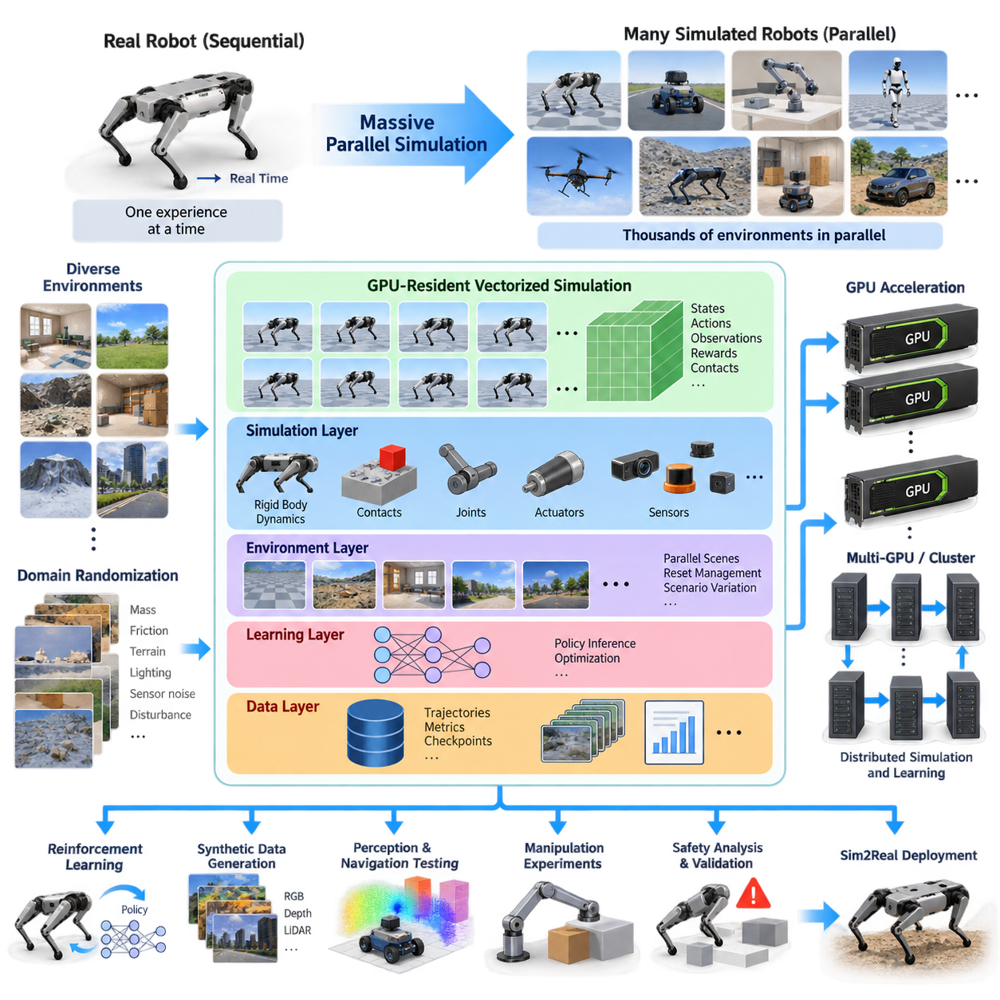
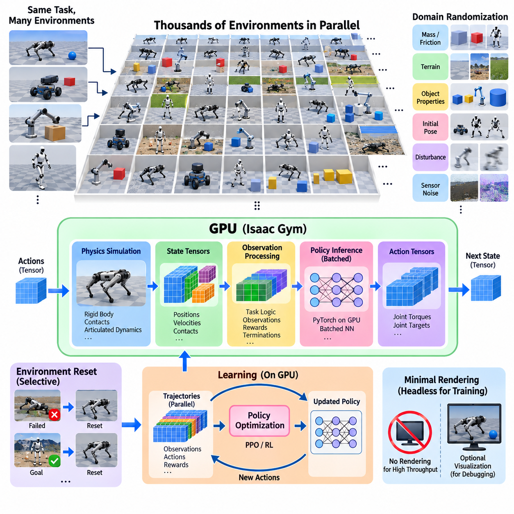
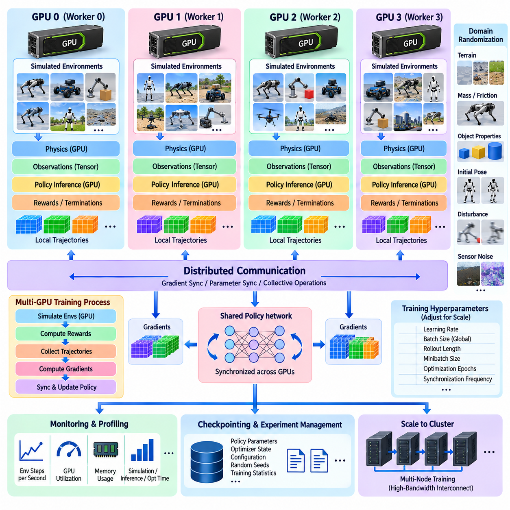
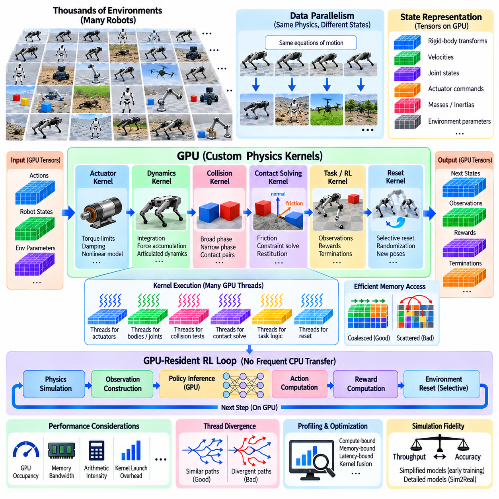
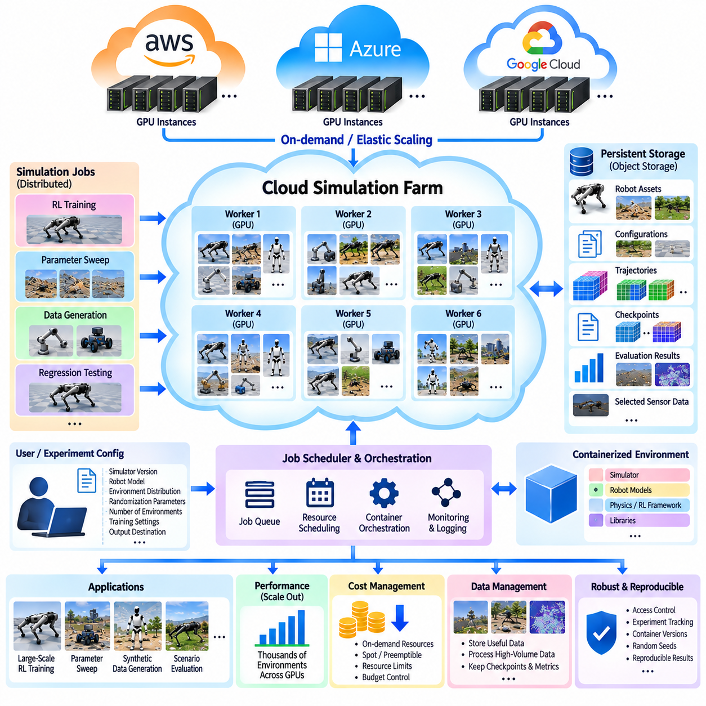
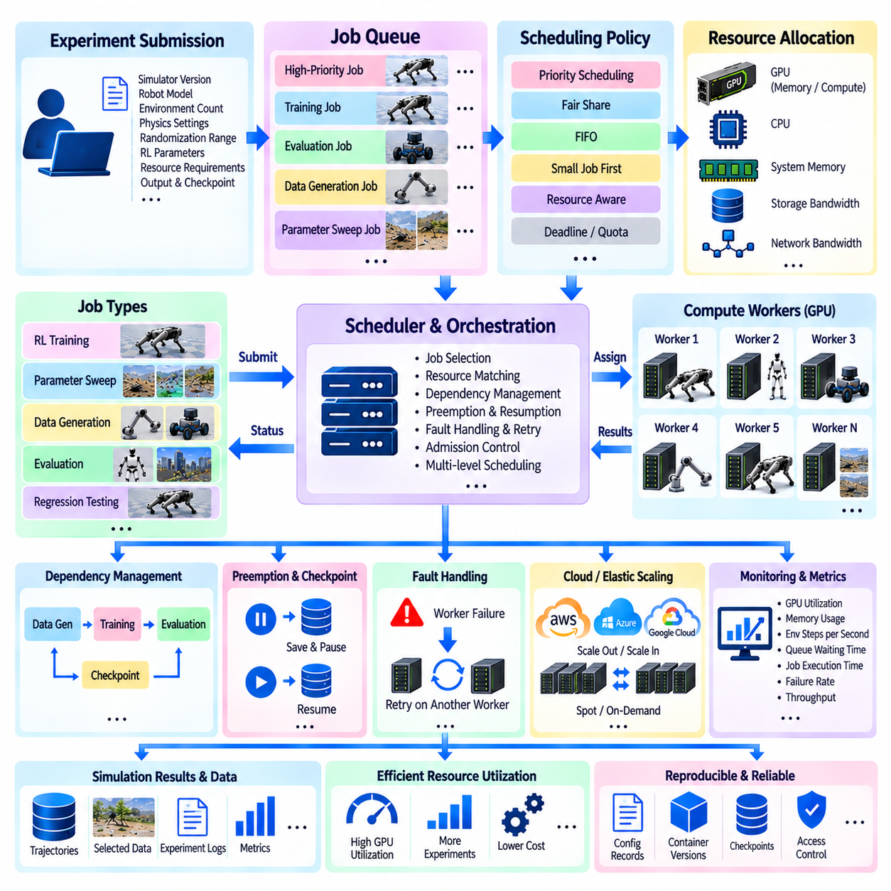
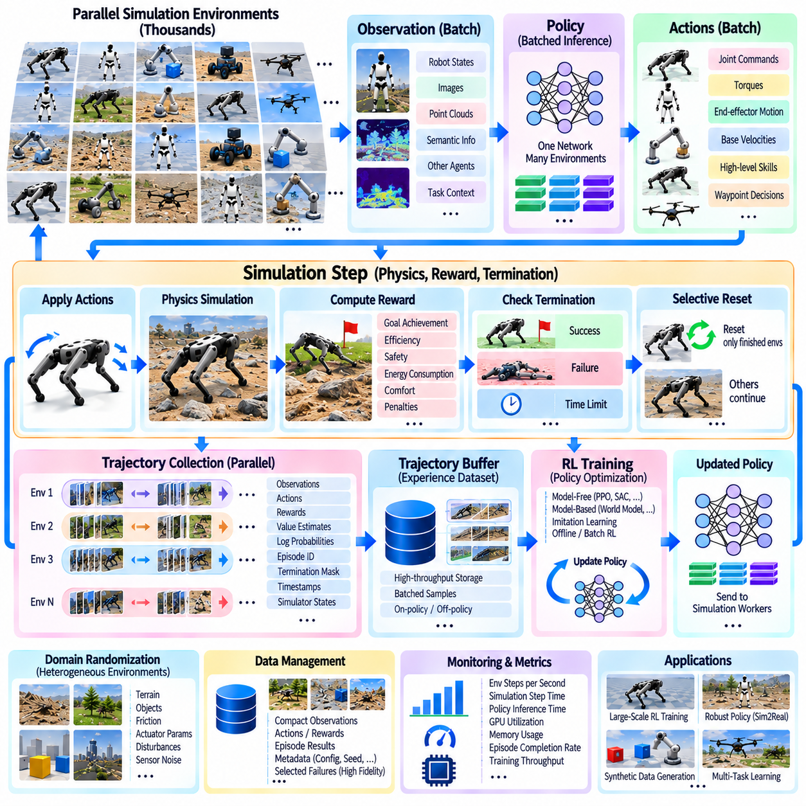
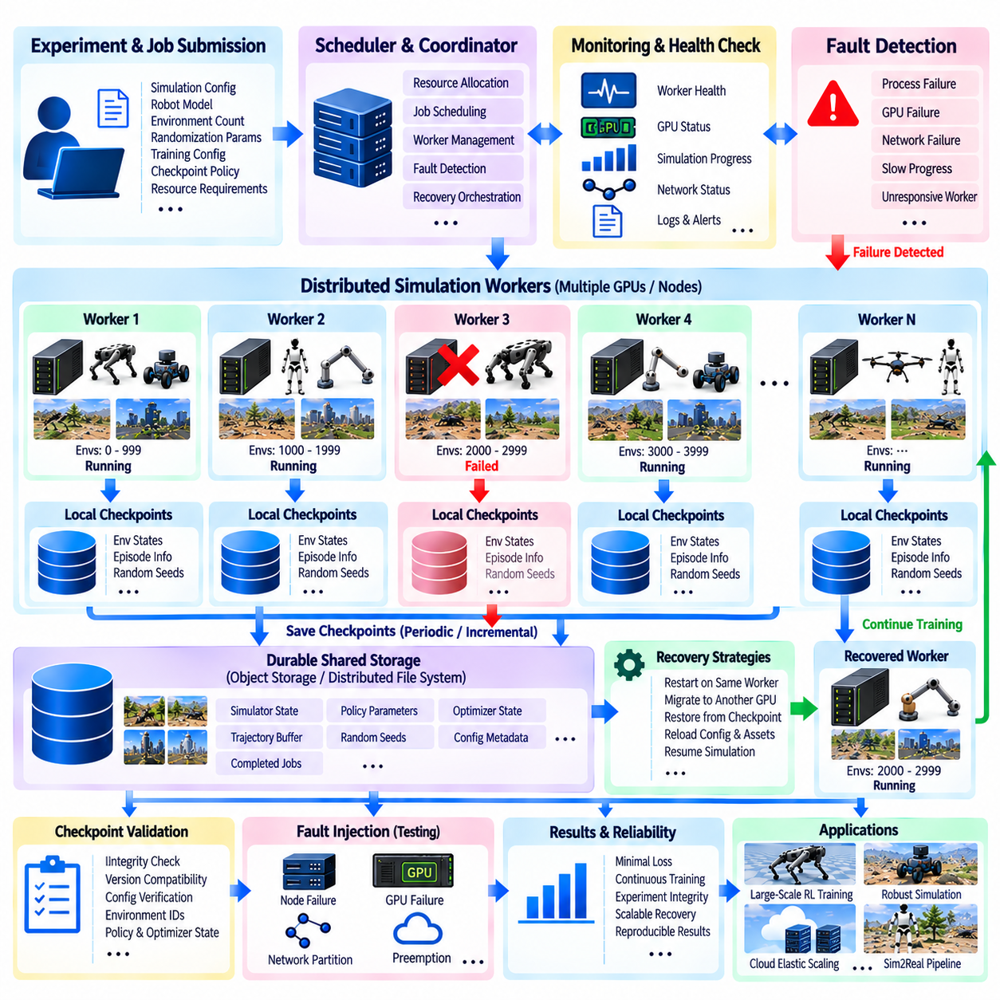
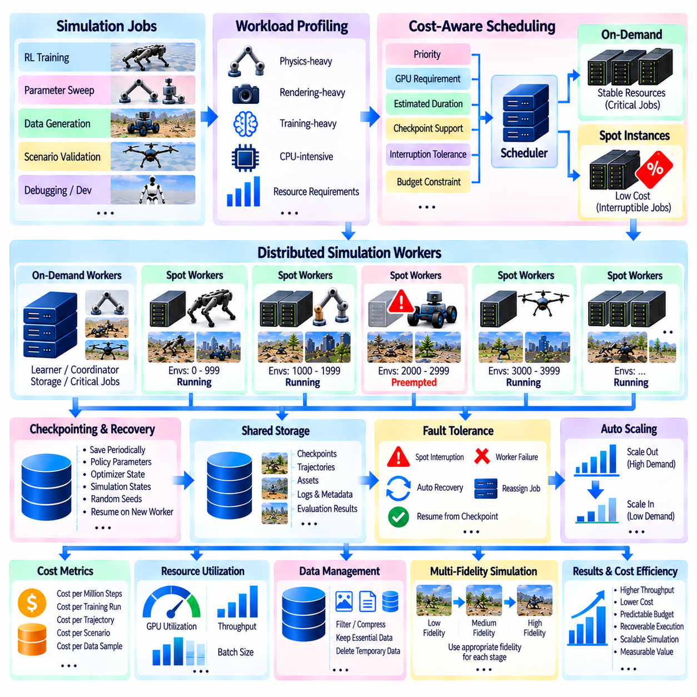
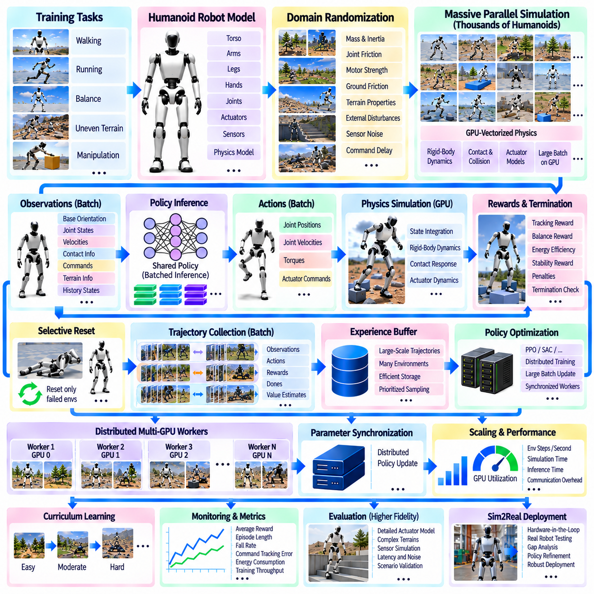

**Volume 11. Simulation and Digital Twin**

# Chapter 11. Massive Scale Parallel Simulation

## 11.01. Massively Parallel Simulation Motivation and Architecture

{width="7.268055555555556in" height="7.268055555555556in"}

대규모 병렬 시뮬레이션(Massively Parallel Simulation)은 현대 로보틱스(Robotics)와 피지컬 AI(Physical AI)가 직면하는 근본적인 병목 중 하나인 지능형 행동의 학습·시험·검증에 필요한 막대한 상호작용 경험(Interaction Experience)의 문제를 해결하기 위한 접근법이다. 실제 로봇은 현실 시간(Real Time)이 허용하는 속도로만 경험을 수집할 수 있지만, 시뮬레이션(Simulation)은 수많은 독립적인 가상 로봇과 환경을 생성하여 동시에 실행할 수 있다. 따라서 병렬화(Parallelism)는 시뮬레이션을 단일 실험 도구에서 로봇 경험을 생성하는 확장 가능한 컴퓨팅 인프라(Computational Infrastructure)로 전환한다.

이러한 필요성은 특히 강화학습(Reinforcement Learning)에서 중요해진다. 강화학습 정책(Policy)은 안정적인 행동을 학습하기까지 수백만 또는 수십억 개의 상태 전이(State Transition)를 요구할 수 있다. 하나의 시뮬레이션 로봇을 순차적으로 실행하면 이러한 학습 과정이 비현실적으로 오래 걸릴 수 있다. 대규모 병렬 시뮬레이션은 환경을 수백, 수천, 경우에 따라 수만 개로 복제하여 서로 다른 궤적(Trajectory)을 동시에 생성하고, 관측(Observation), 행동(Action), 보상(Reward), 상태 전이(Transition)가 생성되는 속도를 크게 향상시킨다.

이 접근법은 강화학습을 넘어 자연스럽게 확장된다. 대규모 시뮬레이션 집단은 합성 데이터 생성(Synthetic Data Generation), 인지 시험(Perception Testing), 내비게이션 검증(Navigation Validation), 조작 실험(Manipulation Experiment), 도메인 랜덤화(Domain Randomization), 시스템 식별(System Identification), 안전성 분석(Safety Analysis)을 지원할 수 있다. 각각의 환경에는 서로 다른 지형, 조명, 객체, 센서 파라미터, 로봇 구성, 외란 또는 고장 조건을 적용할 수 있다. 따라서 병렬 실행은 하나의 결정론적 시뮬레이션(Deterministic Simulation)을 반복하는 것보다 훨씬 넓은 운영 공간(Operational Space)을 탐색할 수 있게 한다.

이 아키텍처의 기반은 일반적으로 벡터화 환경 모델(Vectorized Environment Model)이다. 각각의 시뮬레이터 인스턴스(Simulator Instance)를 독립적인 프로세스, 렌더링 루프(Rendering Loop), 통신 스택(Communication Stack)을 가진 별도의 애플리케이션으로 취급하는 대신, 시스템은 다수 환경의 상태를 대규모 텐서(Tensor) 또는 구조화 배열(Structured Array)로 표현한다. 로봇 자세, 관절 상태, 속도, 액추에이터 명령, 접촉력, 보상, 종료 플래그 등을 집합적으로 처리할 수 있으며, 이러한 구조는 GPU의 고도 병렬 실행 모델과 자연스럽게 결합된다.

GPU 상주 시뮬레이션(GPU-Resident Simulation)은 프로세서 간 데이터 이동이라는 주요 오버헤드(Overhead)를 추가로 감소시킨다. 전통적인 파이프라인에서는 CPU에서 물리 계산을 수행하고, 관측 데이터를 신경망 추론(Neural Network Inference)을 위해 GPU로 전송한 뒤, 다시 행동 데이터를 CPU로 반환하는 과정을 매 시뮬레이션 스텝마다 반복할 수 있다. 대규모 환경에서는 이러한 전송 비용이 크게 증가한다. 따라서 GPU 중심 아키텍처(GPU-Centric Architecture)는 가능한 경우 물리 상태, 관측 생성, 정책 추론, 보상 계산, 환경 초기화 연산을 가속기(Accelerator) 내부에 유지하도록 설계된다.

일반적인 아키텍처는 동일한 장치에서 실행되더라도 여러 논리적 계층(Logical Layer)으로 구성된다. 시뮬레이션 계층(Simulation Layer)은 강체 동역학, 접촉, 관절, 액추에이터, 센서를 처리하고, 환경 계층(Environment Layer)은 수천 개의 독립적인 장면과 각각의 초기화 조건을 관리한다. 학습 계층(Learning Layer)은 배치 기반 신경망 추론과 최적화를 수행하며, 데이터 계층(Data Layer)은 궤적, 메트릭(Metric), 체크포인트(Checkpoint), 선택된 시뮬레이션 출력을 수집한다. 높은 처리량(Throughput)을 유지하려면 이러한 계층 사이의 효율적인 인터페이스가 필수적이다.

벡터화(Vectorization)는 시뮬레이션 소프트웨어의 설계 방식 자체를 변화시킨다. 하나의 환경에서는 비용이 작은 연산이라도 수천 개 환경에서 순차 루프(Sequential Loop)를 통해 반복되면 심각한 병목이 될 수 있다. 따라서 효율적인 구현에서는 배치 텐서 연산(Batched Tensor Operation), GPU 커널(GPU Kernel), 공유 모델 표현(Shared Model Representation), 비동기 실행(Asynchronous Execution), 병렬 접근에 최적화된 메모리 배치를 선호한다. 환경 초기화와 리셋(Reset) 과정에서도 개별 에피소드가 종료될 때 전체 시뮬레이션 장면을 불필요하게 다시 생성하지 않도록 설계해야 한다.

메모리 용량(Memory Capacity)은 순수한 연산 성능만큼 중요하다. 각각의 병렬 환경에는 로봇, 객체, 제약조건, 센서, 관측, 보상, 학습 버퍼에 대한 상태 정보가 필요하다. 고해상도 카메라, LiDAR 시뮬레이션, 복잡한 다관절 구조(Articulated Body), 정밀한 접촉 모델(Contact Model)은 메모리 소비량을 빠르게 증가시킬 수 있다. 따라서 최대 병렬 환경 수는 시뮬레이션 충실도(Simulation Fidelity), 상태 크기, 센서 복잡도, 신경망 연산량, GPU 메모리, 요구되는 시뮬레이션 처리량 사이의 균형에 의해 결정된다.

대규모 병렬 아키텍처에서는 물리 연산 중심 워크로드(Physics-Intensive Workload)와 렌더링 중심 워크로드(Rendering-Intensive Workload)를 구분해야 한다. 비교적 단순한 수천 개의 물리 환경은 하나의 GPU에서도 효율적으로 실행될 수 있지만, 포토리얼리스틱(Photorealistic) 카메라 시뮬레이션은 훨씬 많은 연산과 메모리를 소비할 수 있다. 따라서 실용적인 시스템에서는 높은 처리량의 정책 학습과 고충실도 시각 검증(High-Fidelity Visual Validation)을 분리하는 경우가 많다. 경량 시뮬레이션으로 막대한 상호작용 경험을 생성하고, 이후 선택된 시나리오를 보다 현실적인 센서와 렌더링을 이용해 평가한다.

하나의 GPU를 넘어 확장하면 또 다른 아키텍처 계층이 등장한다. 여러 GPU는 각각 독립적인 환경 그룹을 실행할 수 있으며, 분산 학습(Distributed Learning) 메커니즘을 통해 그래디언트(Gradient), 모델 파라미터, 궤적 또는 통계 정보를 집계할 수 있다. 하나의 컴퓨팅 노드(Compute Node)에 여러 가속기가 포함될 수 있고, 여러 노드를 결합하여 시뮬레이션 클러스터(Simulation Cluster)를 구성할 수도 있다. 이러한 계층 구조는 병렬 시뮬레이션을 분산 시뮬레이션 인프라(Distributed Simulation Infrastructure)로 확장하며, 환경 실행, 정책 최적화, 데이터 수집, 체크포인트 관리를 서로 조정해야 한다.

아키텍처에서는 동기화(Synchronization)를 최소화해야 한다. 전역 배리어(Global Barrier)는 병렬 실행으로 얻는 성능상의 이점을 크게 감소시킬 수 있기 때문이다. 각 환경은 서로 다른 시점에 종료되고, 접촉 상황에 따라 계산 부하가 달라지며, 복잡한 장면은 단순한 장면보다 더 많은 연산을 요구할 수 있다. 비동기 또는 부분 동기화 실행(Partially Synchronized Execution)을 적용하면 가장 느린 환경을 기다리는 대신 사용 가능한 자원이 계속 작업할 수 있다. 따라서 효과적인 워크로드 분할(Workload Partitioning)과 스케줄링(Scheduling)은 부수적인 구현 요소가 아니라 확장성(Scalability)을 결정하는 핵심 요소가 된다.

랜덤화(Randomization)는 대규모 병렬화와 결합될 때 특히 강력하다. 시뮬레이션 파라미터를 실험마다 순차적으로 변경하는 대신, 각 환경에서 질량, 마찰, 액추에이터 응답, 지형 형상, 센서 노이즈, 조명, 지연시간, 외란 등의 서로 다른 조합을 동시에 적용할 수 있다. 이러한 분포에서 학습되는 정책은 매 최적화 주기마다 광범위한 물리적 조건에 노출된다. 따라서 대규모 시뮬레이션은 강건성 공학(Robustness Engineering)과 시뮬레이션-현실 전이(Sim2Real Transfer)에 직접 연결된다.

대규모 시뮬레이션은 검증 방법론(Validation Methodology)도 변화시킨다. 희귀한 충돌, 불안정한 구성, 위치추정 실패, 인지 모호성, 비정상적인 환경 조건 조합 등을 막대한 수의 가상 에피소드에서 탐색할 수 있다. 파라미터 스윕(Parameter Sweep)과 시나리오 생성(Scenario Generation)을 이용하면 실제 환경에서 재현하기에는 비용이 높거나 시간이 오래 걸리거나 위험한 운영 경계를 체계적으로 탐색할 수 있다. 따라서 시뮬레이션은 단순한 학습 엔진을 넘어 로봇 소프트웨어와 자율 시스템을 위한 통계적 시험 인프라(Statistical Testing Infrastructure)로 발전한다.

전체 아키텍처는 결국 컴퓨팅 자원(Computational Resources)을 다양하고 방대한 물리적 상호작용 경험으로 변환하는 파이프라인으로 이해할 수 있다. GPU는 벡터화 물리 연산과 AI 계산을 제공하고, 환경 관리자(Environment Manager)는 독립적인 실험 세계를 생성하며, 분산 인프라는 여러 가속기와 노드로 처리 용량을 확장한다. 데이터 시스템은 유용한 궤적과 메트릭을 보존한다. 이러한 구성요소들은 이후 다루게 될 GPU 벡터화, 멀티 GPU 학습(Multi-GPU Training), 클라우드 시뮬레이션 팜(Cloud Simulation Farm), 스케줄링, 분산 데이터 수집, 장애 허용성(Fault Tolerance), 비용 최적화(Cost Optimization)의 기반을 형성한다.

피지컬 AI에서 대규모 병렬 시뮬레이션의 궁극적인 의미는 물리적 가능성(Physical Possibility)을 컴퓨팅 속도로 탐색할 수 있다는 데 있다. 하나의 실제 로봇은 한 번에 하나의 궤적만 경험할 수 있지만, 병렬 시뮬레이션 플랫폼은 수많은 대안 행동, 환경, 고장 상황, 물리 파라미터 조합을 동시에 탐색할 수 있다. 이러한 계산적 다중성(Computational Multiplicity)은 점점 더 범용적인 로봇 정책을 학습하는 데 필요한 경험 규모를 제공하며, 실제 로봇 실험은 보정(Calibration), 검증(Verification), 최종 배치 검증(Deployment Validation)에 집중할 수 있도록 한다.

## 11.02. Isaac Gym Thousands of Parallel Envs on Single GPU [w/Code]

{width="7.268055555555556in" height="7.268055555555556in"}

Isaac Gym은 로봇 강화학습(Reinforcement Learning)을 가속하기 위한 핵심 아이디어를 기반으로 설계되었다. 물리 시뮬레이션(Physics Simulation)과 신경망 연산(Neural Network Computation)을 동일한 GPU 내부에 유지하면 학습 속도를 크게 향상시킬 수 있다. 소수의 시뮬레이터 인스턴스를 별도의 CPU 프로세스로 실행하는 대신, Isaac Gym은 대규모 환경 집단을 GPU 상주 데이터(GPU-Resident Data)로 표현한다. 이를 통해 수천 대의 로봇이 동시에 시뮬레이션 동역학을 수행하면서 정책 학습(Policy Learning)에 필요한 경험을 매우 높은 처리량으로 생성할 수 있다.

전통적인 강화학습 파이프라인(Reinforcement Learning Pipeline)은 상당한 통신 오버헤드(Communication Overhead)를 발생시키는 경우가 많다. 물리 연산은 CPU에서 실행되고, 관측값은 정책 추론(Policy Inference)을 위해 GPU로 복사되며, 행동은 다시 CPU로 전송된 후 다음 물리 스텝이 시작된다. 이러한 전송을 다수의 환경에서 반복하면 확장성이 제한된다. Isaac Gym은 시뮬레이션 상태를 GPU 텐서(GPU Tensor)로 직접 제공함으로써 물리 연산, 관측 처리, 정책 추론, 보상 계산, 학습 연산 대부분을 GPU 메모리 내부에 유지하여 이러한 병목을 줄인다.

병렬 환경(Parallel Environment)은 일반적으로 하나의 로봇 작업을 복제한 다수의 인스턴스로 구성된다. 각각의 인스턴스는 동일한 로봇 모델과 기본 작업 구조를 사용할 수 있지만 위치, 속도, 접촉 상태, 행동, 보상, 에피소드 상태는 독립적으로 유지한다. 수천 개의 환경이 하나의 시뮬레이션 프로세스 내부에 동시에 존재할 수 있으며, GPU가 이들의 동역학을 병렬로 처리한다. 따라서 원래 수천 번 순차적으로 실행해야 할 시뮬레이션 스텝을 고도로 벡터화된 연산(Vectorized Computation)으로 변환할 수 있다.

환경 집단은 일반적으로 개별 시뮬레이션 세계가 서로 간섭하지 않도록 공간적으로 배치된다. 각 환경에는 자체 로봇과 관련 객체가 할당되며, 가능한 경우 공통 자산 정의(Asset Definition)를 공유한다. 환경들이 동일한 형상과 로봇 모델을 사용하더라도 각각의 동적 상태(Dynamic State)는 독립적으로 유지된다. 이러한 아키텍처는 강화학습에 필요한 논리적 독립성을 보존하면서도 수천 개의 별도 시뮬레이터 애플리케이션을 실행할 때 발생하는 오버헤드를 방지한다.

각 제어 스텝(Control Step)에서 시뮬레이터는 전체 환경 배치(Environment Batch)의 물리 상태를 전진시킨다. 관절 위치, 관절 속도, 강체 자세, 접촉 정보 등의 물리량은 텐서 형태로 제공될 수 있다. 작업 로직(Task Logic)은 이러한 텐서를 정책 관측값(Policy Observation)으로 변환하고, 신경망은 배치 추론(Batched Inference)을 통해 다수 환경을 동시에 평가한다. 생성된 행동 텐서(Action Tensor)는 다음 물리 스텝이 시작되기 전에 시뮬레이션 로봇에 다시 적용된다.

이러한 텐서 중심 워크플로(Tensor-Oriented Workflow)는 특히 PyTorch 기반 강화학습과 잘 결합된다. 관측값을 GPU 텐서로 직접 표현하고 신경망에서 처리하여 행동으로 변환할 수 있으므로 서로 독립적인 소프트웨어 구성요소 사이에서 데이터를 반복적으로 직렬화하거나 전송할 필요가 줄어든다. 보상 함수(Reward Function)와 종료 조건(Termination Condition) 역시 벡터화된 텐서 연산으로 구현할 수 있다. 그 결과 시뮬레이션 루프는 전통적인 독립 시뮬레이터 프로세스 집합보다 하나의 대규모 GPU 계산 그래프(Computation Graph)에 가까운 형태로 변화한다.

환경 리셋(Environment Reset)은 높은 처리량을 유지하기 위한 또 다른 중요한 구성요소이다. 강화학습에서는 서로 다른 로봇이 각기 다른 시점에 실패하거나 목표에 도달하거나 넘어지거나 충돌하거나 에피소드 시간 제한을 초과할 수 있다. 하나의 에피소드가 종료될 때마다 전체 시뮬레이션을 다시 시작하면 상당한 연산 자원이 낭비된다. 대신 리셋 로직은 영향을 받은 환경만 식별하여 해당 로봇 상태, 객체 구성, 목표, 에피소드 변수를 복원하고 나머지 환경은 계속 실행하도록 한다.

대규모 환경 복제는 도메인 랜덤화(Domain Randomization)를 효율적으로 수행하는 방법도 제공한다. 로봇 질량, 마찰, 액추에이터 특성, 초기 자세, 목표 위치, 지형 특성, 외란, 선택된 센서 특성 등을 환경마다 다르게 설정할 수 있다. 따라서 수천 가지 파라미터 조합을 동시에 평가할 수 있다. 학습 정책은 하나의 명목상 시뮬레이터 구성만 반복적으로 경험하는 대신 다양한 물리 조건의 분포에 노출되며, 이는 강건한 정책 학습(Robust Policy Learning)과 시뮬레이션-현실 전이(Sim2Real Transfer)의 기반을 강화한다.

실행할 수 있는 병렬 환경의 수는 작업 복잡도(Task Complexity)에 크게 의존한다. 단순한 관측값을 사용하는 비교적 간결한 보행 작업(Locomotion Task)은 복잡한 접촉 상호작용, 많은 수의 다관절 강체(Articulated Body), 계산 비용이 높은 센서를 포함하는 장면보다 훨씬 많은 환경을 지원할 수 있다. 또한 각각의 환경에는 동적 상태, 관측값, 행동, 보상 변수와 강화학습 알고리즘이 사용하는 추가 버퍼가 필요하기 때문에 GPU 메모리 역시 실질적인 환경 수의 한계를 결정한다.

따라서 물리 시뮬레이션 처리량(Physics Simulation Throughput)과 학습 처리량(Learning Throughput) 사이의 균형이 필요하다. 환경 수를 증가시키면 단위 시간당 더 많은 경험을 생성할 수 있지만, 정책 신경망 역시 더 큰 관측 배치를 처리해야 하고 학습 알고리즘은 생성된 궤적을 소비해야 한다. 일정 수준을 넘으면 신경망 추론, 최적화, 메모리 대역폭 또는 궤적 처리가 주요 병목으로 전환되어 추가 환경의 효과가 감소할 수 있다. 따라서 최대 환경 수만으로 전체 성능을 평가하는 것은 적절하지 않다.

대규모 강화학습에서는 시각화(Rendering)가 물리 연산과 정책 계산에 사용할 자원을 소비할 수 있기 때문에 일반적으로 최소화된다. 헤드리스 실행(Headless Execution)을 사용하면 사람이 확인하기 위한 영상을 지속적으로 생성하지 않고 시뮬레이터가 환경을 전진시킬 수 있다. 시각화는 디버깅(Debugging), 평가(Evaluation), 시연(Demonstration) 등의 목적으로 선택적으로 활성화할 수 있다. 이러한 분리를 통해 수천 개의 물리 환경을 효율적으로 실행하면서 필요한 경우 대표적인 궤적을 확인할 수 있다.

동일한 원칙은 센서 충실도(Sensor Fidelity)에도 적용된다. 관절 위치, 속도, 자세, 접촉 상태, 힘 정보와 같은 고유수용성 관측(Proprioceptive Observation)은 비교적 데이터 크기가 작아 대규모 병렬 학습에 적합하다. 반면 고해상도 카메라나 정교한 광선 기반 센서(Ray-Based Sensor)는 GPU 연산량과 메모리 소비를 크게 증가시킬 수 있다. 따라서 학습 아키텍처에서는 작업에 필요한 최소한의 관측 표현을 사용하는 경우가 많으며, 인지 자체가 학습 문제에 포함될 때 더 높은 비용의 센서를 추가한다.

Isaac Gym의 단일 GPU 병렬 처리(Single-GPU Parallelism)는 특히 보행 및 제어 문제에서 중요하다. 사족보행 로봇(Quadruped), 휴머노이드(Humanoid), 매니퓰레이터(Manipulator) 및 기타 다관절 로봇은 거대한 CPU 시뮬레이션 팜(CPU Simulation Farm)을 구축하지 않고도 방대한 양의 시뮬레이션 동작 경험을 축적할 수 있다. 서로 다른 환경에서 다양한 초기 조건과 외란을 정책에 제공함으로써 성공 행동과 실패 행동을 동시에 발생시키고 정책 최적화를 위한 밀도 높은 학습 데이터를 생성할 수 있다.

이러한 아키텍처는 로봇 학습의 실제 반복 주기(Iteration Cycle)도 변화시킨다. 하이퍼파라미터(Hyperparameter), 보상 함수 구성, 제어 주기, 랜덤화 범위, 액추에이터 모델 등을 실제 로봇에서는 수행하기 어려운 대규모 실험 집단을 통해 평가할 수 있다. 연구자는 몇 개의 궤적에서 결론을 도출하는 대신 수천 개 에피소드의 통계적 행동을 관찰할 수 있다. 이에 따라 시뮬레이션은 로봇 동역학과 학습 설계에 관한 가설을 빠르게 시험할 수 있는 실험 엔진(Experimental Engine)으로 발전한다.

따라서 Isaac Gym은 단순히 많은 로봇을 화면에 표시할 수 있는 시뮬레이터가 아니라 GPU 물리 연산(GPU Physics)과 GPU 기반 기계학습(GPU-Based Machine Learning)을 긴밀하게 결합한 아키텍처로 이해해야 한다. 핵심적인 장점은 벡터화 환경(Vectorized Environment), GPU 상주 상태 텐서(GPU-Resident State Tensor), 배치 정책 추론(Batched Policy Inference), 선택적 환경 리셋(Selective Environment Reset), CPU-GPU 통신 최소화에서 발생한다. 이러한 원리는 단일 GPU 기반 강화학습을 멀티 GPU(Multi-GPU) 및 분산 학습(Distributed Training) 아키텍처로 확장하기 위한 계산적 기반을 형성한다.

## 11.03. Isaac Lab Multi GPU Distributed RL Training [w/Code]

{width="7.268055555555556in" height="7.268055555555556in"}

Isaac Lab은 GPU 가속 로봇 시뮬레이션(GPU-Accelerated Robot Simulation)을 단일 장치 병렬 처리(Single-Device Parallelism)에서 멀티 GPU 분산 강화학습(Multi-GPU Distributed Reinforcement Learning)으로 확장한다. 이를 통해 더 큰 규모의 시뮬레이션 환경 집단을 여러 가속기(Accelerator)에 분산할 수 있다. 하나의 GPU가 모든 환경과 학습 연산을 처리하도록 하는 대신, 분산 학습(Distributed Training)은 환경 그룹을 개별 GPU 작업자(GPU Worker)에 할당한다. 각 작업자는 로컬에서 경험을 생성하면서 공유 로봇 정책(Shared Robot Policy)의 최적화에 참여한다.

기본적인 확장 단위(Scaling Unit)는 하나의 GPU와 연결된 학습 프로세스(Training Process)이다. 각 프로세스는 시뮬레이션 환경의 일부를 담당하여 물리 시뮬레이션(Physics Simulation)을 실행하고, 관측값을 구성하며, 정책을 평가하고, 보상을 계산하고, 궤적(Trajectory)을 수집한다. 예를 들어 4개의 GPU를 사용할 경우 전체 환경 집단을 네 개의 그룹으로 분할할 수 있다. 이러한 아키텍처는 효율적인 GPU 로컬 시뮬레이션(GPU-Local Simulation)을 유지하면서 각 학습 구간에서 생성되는 전체 경험량을 증가시킨다.

분산 강화학습 아키텍처(Distributed Reinforcement Learning Architecture)는 GPU 상주 시뮬레이션(GPU-Resident Simulation)이 제거하려 했던 통신 병목을 다시 발생시키지 않으면서 시뮬레이션과 학습을 조정해야 한다. 일반적으로 환경 상태는 GPU 사이에서 지속적으로 복사되지 않고 해당 환경의 시뮬레이션을 담당하는 GPU 내부에 유지된다. 신경망 그래디언트(Gradient), 파라미터(Parameter), 선택된 학습 통계와 같이 분산 학습에 필요한 정보만 작업자 사이에서 교환된다.

데이터 병렬 학습(Data-Parallel Training)은 이러한 아키텍처에 자연스럽게 적용된다. 각 GPU는 정책 신경망(Policy Network)의 복제본을 유지하고 로컬 환경 집단에서 생성된 관측값을 처리한다. 최적화 과정에서 각 작업자는 자신의 궤적 배치(Trajectory Batch)를 이용하여 그래디언트를 계산한다. 이후 분산 통신 메커니즘(Distributed Communication Mechanism)이 이러한 그래디언트를 집계하거나 동기화하여 정책 복제본들이 일관된 상태를 유지하도록 한다. 동기화가 완료되면 각 작업자는 업데이트된 정책 파라미터를 사용하여 시뮬레이션을 계속한다.

이러한 설계는 환경 병렬 처리(Environment Parallelism)와 모델 동기화(Model Synchronization)를 분리한다. 환경 병렬 처리는 더 많은 로봇 인스턴스를 동시에 실행하여 경험 생성 처리량을 증가시키고, 분산 최적화(Distributed Optimization)는 독립적인 환경 집단에서 생성된 학습 정보를 결합한다. 두 가지 병렬화 방식은 신중하게 균형을 맞춰야 한다. 과도한 동기화는 확장성을 저하시킬 수 있으며, 동기화 간격이 지나치게 길면 강화학습 알고리즘에 따라 각 작업자가 점차 서로 다른 정책 상태를 기반으로 학습하게 될 수 있다.

Isaac Lab 환경은 로봇 상태, 관측값, 행동, 보상, 종료 신호를 배치 텐서 연산(Batched Tensor Operation)으로 표현할 수 있기 때문에 이러한 구조에 특히 적합하다. 따라서 각 GPU는 CPU에 대한 의존성을 제한하면서 완전한 로컬 시뮬레이션-학습 파이프라인(Local Simulation-Learning Pipeline)을 실행할 수 있다. 물리 연산과 정책 추론은 환경 데이터 가까이에 유지되며, GPU 사이의 통신은 전역적으로 조정해야 하는 정보에 집중된다.

전체 시뮬레이션 환경을 하나의 가속기에 집중시킬 필요는 없다. 하나의 GPU에서 메모리 또는 연산 한계에 도달하는 복잡한 로봇 작업은 환경 집단을 여러 장치로 분산할 수 있다. 이러한 방식은 상태 차원(State Dimension), 접촉 계산(Contact Calculation), 관측값, 정책 신경망 등에 상당한 GPU 자원이 필요한 휴머노이드(Humanoid), 사족보행 로봇(Quadruped), 모바일 매니퓰레이터(Mobile Manipulator) 및 기타 다관절 시스템(Articulated System)에서 더욱 중요해진다.

멀티 GPU 확장(Multi-GPU Scaling)은 자동적으로 선형적인 성능 향상을 제공하지 않는다. GPU 수가 증가하면 통신 및 동기화 비용도 증가한다. 그래디언트 교환, 집합 연산(Collective Operation), 궤적 준비, 체크포인트(Checkpoint), 프로세스 간 조정은 시뮬레이션 물리를 직접 전진시키지 않으면서 실행 시간을 소비한다. 따라서 실제 목표는 단순히 GPU 수를 최대화하는 것이 아니라 단위 실제 시간(Wall-Clock Time)당 유효한 환경 스텝과 정책 업데이트 횟수를 증가시키는 것이다.

학습 시스템의 규모가 증가하면 통신 토폴로지(Communication Topology)가 중요해진다. 높은 대역폭의 장치 인터커넥트(Device Interconnect)로 연결된 GPU는 느린 통신 경로를 사용하는 가속기보다 학습 데이터를 효율적으로 교환할 수 있다. 학습이 여러 컴퓨팅 노드(Compute Node)로 확장되면 네트워크 대역폭과 지연시간도 추가적인 제약조건이 된다. 따라서 분산 강화학습 아키텍처는 GPU 토폴로지, 인터커넥트 성능, 프로세스 배치(Process Placement), 통신 주기를 시뮬레이션 시스템 설계의 일부로 고려해야 한다.

분산 실행에서는 배치 크기(Batch Size)도 변화한다. 각각의 작업자가 로컬 환경에서 생성한 궤적을 제공하기 때문에 GPU가 추가될수록 유효 전역 학습 배치(Effective Global Training Batch)가 증가할 수 있다. 더 큰 배치는 계산 효율성을 향상시킬 수 있지만 최적화 동작을 변화시킬 수도 있다. 따라서 단일 GPU 실험에서 분산 학습으로 전환할 때 학습률(Learning Rate), 롤아웃 길이(Rollout Length), 미니배치 크기(Minibatch Size), 최적화 에포크 수(Optimization Epoch), 기타 강화학습 하이퍼파라미터(Hyperparameter)를 조정해야 할 수 있다.

랜덤화(Randomization)는 더 큰 환경 집단으로부터 직접적인 이점을 얻는다. 서로 다른 작업자는 지형, 로봇 파라미터, 마찰, 액추에이터 특성, 초기 조건, 외란, 작업 구성의 서로 다른 조합을 시뮬레이션할 수 있다. 따라서 학습 알고리즘에 제공되는 통합 경험은 동일한 실제 시간 동안 더욱 광범위한 물리 조건의 분포를 포함할 수 있다. 이는 최종적인 시뮬레이션-현실 전이(Sim2Real Deployment)를 목표로 하는 강건 제어 정책(Robust Control Policy)에 특히 유용하다.

재현성(Reproducibility)이 중요한 경우 분산 학습에서도 결정론적인 실험 관리(Deterministic Experiment Management)가 필요하다. 난수 시드(Random Seed), 환경 식별자(Environment Identifier), 구성 파일(Configuration File), 정책 버전, 체크포인트, 학습 통계 등을 여러 프로세스에 걸쳐 추적해야 한다. 실험 구성이 체계적으로 관리되지 않으면 작업자 사이의 차이가 의도적인 도메인 랜덤화(Domain Randomization)에서 발생한 것인지 구분하기 어려워질 수 있다. 따라서 대규모 학습은 시뮬레이션 아키텍처와 체계적인 구성 및 데이터 관리를 함께 요구한다.

프로세스와 GPU의 수가 증가할수록 장애 처리(Failure Handling)의 중요성도 커진다. 단일 장치 실험에서는 실행을 중단시킬 수 있는 구성요소가 비교적 적지만, 분산 학습에서는 다수의 작업자, 통신 그룹, 저장 연산, 동기화 지점이 추가된다. 주기적인 체크포인팅(Checkpointing)을 통해 정책 파라미터, 옵티마이저 상태(Optimizer State), 관련 학습 진행 정보를 보존하면 장시간 수행되는 고비용 실험이 중단되더라도 처음부터 다시 시작해야 하는 상황을 줄일 수 있다.

모니터링(Monitoring)에서는 시뮬레이션 성능과 학습 성능을 구분해야 한다. 유용한 측정 항목에는 초당 환경 스텝(Environment Steps per Second), 물리 스텝 시간, 정책 추론 시간, 최적화 시간, GPU 사용률, GPU 메모리 소비량, 동기화 오버헤드, 통신 지연시간 등이 포함된다. 보상 곡선(Reward Curve)만으로는 분산 자원이 효율적으로 사용되는지 판단할 수 없다. 따라서 시뮬레이션, 신경망 연산, 통신, 데이터 처리 중 어느 요소가 확장성을 제한하는지 확인하기 위한 성능 프로파일링(Performance Profiling)이 필요하다.

멀티 GPU 학습은 하나의 GPU에서 이미 충분히 벡터화된 워크로드(Vectorized Workload)가 실행되고 있으며 추가적인 처리량이 실제로 필요한 경우 특히 유용하다. 벡터화가 제대로 이루어지지 않은 환경, 비용이 높은 CPU 콜백(CPU Callback), 과도한 렌더링(Rendering), 빈번한 호스트-장치 데이터 전송(Host-Device Transfer)은 분산화 이전에 해결하는 것이 일반적으로 바람직하다. 비효율적인 파이프라인에 GPU만 추가하면 비례적인 가속을 얻는 대신 동일한 병목을 더 많은 하드웨어에 복제할 수 있다.

최종적으로 이러한 구조는 병렬 처리의 계층 구조(Hierarchy of Parallelism)를 형성한다. 각 GPU 내부에서는 수천 개의 환경이 벡터화 물리 연산(Vectorized Physics)과 배치 정책 추론(Batched Policy Inference)을 통해 실행될 수 있다. 여러 GPU 사이에서는 다수의 작업자가 동시에 경험을 생성하고 학습 업데이트를 동기화한다. 여러 컴퓨팅 노드로 확장하면 동일한 원리를 클러스터 규모 학습(Cluster-Scale Training)으로 발전시킬 수 있다. 따라서 Isaac Lab은 대규모 병렬 시뮬레이션의 GPU 중심 원칙을 유지하면서 로컬 GPU 시뮬레이션에서 분산 로봇 학습 인프라(Distributed Robot-Learning Infrastructure)로 확장할 수 있는 경로를 제공한다.

## 11.04. GPU Vectorized Physics Simulation Custom Kernels [w/Code]

{width="7.268055555555556in" height="7.268055555555556in"}

GPU 벡터화 물리 시뮬레이션(GPU-Vectorized Physics Simulation)은 로봇 동역학 계산을 환경별로 순차 처리하는 방식에서 수천 개의 GPU 스레드(GPU Thread)가 수행하는 대규모 병렬 수치 연산으로 변환한다. 각각의 로봇을 CPU 루프(CPU Loop)를 통해 독립적으로 전진시키는 대신, 다수의 시뮬레이션 환경 상태를 텐서(Tensor) 또는 구조화 버퍼(Structured Buffer)로 구성한다. 위치, 속도, 힘, 관절, 제약조건, 접촉 데이터를 동시에 처리하여 강화학습(Reinforcement Learning)과 피지컬 AI(Physical AI)를 위한 대규모 시뮬레이션 처리량을 확보할 수 있다.

핵심 원리는 데이터 병렬성(Data Parallelism)이다. 수천 개의 시뮬레이션 로봇은 서로 다른 수치 상태를 가지면서 동일한 운동방정식(Equations of Motion)을 공유할 수 있다. GPU는 이러한 유사한 계산을 다수의 병렬 스레드에 할당하여 적분(Integration), 힘 누적(Force Accumulation), 액추에이터 계산(Actuator Evaluation), 제약조건 처리를 대규모 배치에 걸쳐 수행한다. 따라서 시뮬레이션 워크로드는 독립적인 로봇 시뮬레이터를 반복 호출하는 구조에서 벡터화된 수치 커널(Vectorized Numerical Kernel)의 집합으로 변화한다.

효율적인 벡터화(Vectorization)는 시뮬레이션 상태를 어떻게 구성하는가에서 시작된다. 강체 변환(Rigid-Body Transform), 선속도와 각속도, 관절 좌표, 액추에이터 명령, 질량, 관성, 환경 파라미터 등을 효율적인 병렬 메모리 접근이 가능한 형태로 저장해야 한다. 데이터 배치가 비효율적이면 GPU 스레드가 분산된 메모리 트랜잭션을 수행해야 하지만, 연속적이거나 병합된 메모리 접근(Coalesced Memory Access)을 사용하면 메모리 시스템의 실효 대역폭을 크게 향상시킬 수 있다.

사용자 정의 GPU 커널(Custom GPU Kernel)은 범용 시뮬레이터 인터페이스만으로 효율적으로 표현하기 어려운 시뮬레이션 연산을 구현하는 방법을 제공한다. 하나의 커널이 모든 로봇, 관절, 접촉 또는 환경에 대해 특수 연산을 동시에 수행할 수 있다. 대표적인 예로 사용자 정의 액추에이터 동역학, 보상 계산, 관측값 구성, 지형 상호작용 로직, 상태 필터링, 리셋 연산 또는 특정 로봇 시스템에서 요구되는 응용 분야별 물리 근사(Application-Specific Physical Approximation)가 있다.

커널 설계(Kernel Design)는 일반적으로 개별 계산 요소를 GPU 스레드에 매핑한다. 하나의 스레드가 강체, 관절, 접촉 후보 또는 환경 상태를 처리할 수 있으며, 스레드 블록(Thread Block)은 서로 연관된 계산 그룹을 조정한다. 적절한 매핑 방식은 워크로드 구조와 데이터 의존성(Data Dependency)에 따라 달라진다. 독립성이 높은 계산은 자연스럽게 병렬화되지만, 순차적 의존성, 불규칙한 분기, 광범위한 동기화를 포함하는 알고리즘은 효과적인 GPU 가속을 위해 더욱 세밀한 분해가 필요하다.

강체 동역학(Rigid-Body Dynamics)은 이러한 어려움을 잘 보여준다. 중력 적용이나 독립적인 강체 상태의 적분과 같은 일부 연산은 쉽게 병렬화할 수 있다. 그러나 다관절 로봇 동역학(Articulated Robot Dynamics)은 운동학 트리(Kinematic Tree)와 관절 제약조건을 통한 의존성을 발생시키며, 충돌 및 접촉 처리는 동적으로 변화하는 상호작용 그래프(Interaction Graph)를 생성한다. 따라서 효율적인 GPU 물리 연산은 단순한 데이터 병렬 커널과 제약조건 해석, 다관절 시스템, 충돌 검출, 접촉 응답을 위한 특수 알고리즘을 결합한다.

충돌 검출(Collision Detection)은 일반적으로 광역 단계(Broad Phase)와 정밀 단계(Narrow Phase)로 구분된다. 광역 단계 알고리즘은 불필요한 기하학적 검사를 줄이면서 잠재적으로 상호작용할 수 있는 객체 쌍을 식별한다. 이후 정밀 단계 알고리즘은 후보 객체 쌍에 대한 상세한 접촉 정보를 계산한다. 대규모 병렬 환경에서는 각 장면마다 객체와 접촉 수가 다르기 때문에 불규칙한 워크로드가 발생하며, 이를 적절히 구성하고 스케줄링하지 않으면 GPU 효율이 저하될 수 있다.

접촉 해석(Contact Solving)은 접촉이 제약조건을 통해 여러 물체를 결합하기 때문에 또 다른 계산상의 어려움을 발생시킨다. 마찰, 침투 보정(Penetration Correction), 반발(Restitution), 관절 제한 등의 제약조건은 반복적인 수치 해법을 요구할 수 있다. 병렬 솔버(Parallel Solver)는 물리적 정확도와 수치적 안정성을 적절히 유지하면서 가능한 많은 독립적인 계산을 병렬화한다. 핵심은 단순히 많은 스레드를 실행하는 것이 아니라 동기화와 메모리 경합을 관리할 수 있도록 제약조건 계산을 구성하는 것이다.

사용자 정의 커널(Custom Kernel)은 로봇 모델에 특수한 액추에이터 동작이 포함될 때 특히 유용하다. 실제 모터는 토크 제한, 속도 의존 출력, 기어박스 효과, 컴플라이언스(Compliance), 감쇠(Damping), 명령 지연, 열적 제한 또는 비선형 응답을 포함할 수 있다. 이러한 효과를 각각의 시뮬레이션 로봇에 대해 CPU 콜백(CPU Callback)으로 처리하는 대신 GPU 커널을 사용하면 수천 개 관절의 액추에이터 모델을 동시에 계산하고 생성된 힘이나 토크를 시뮬레이션 버퍼에 직접 기록할 수 있다.

동일한 접근법은 강화학습 작업 로직(Reinforcement-Learning Task Logic)도 가속할 수 있다. 관측 벡터에는 좌표 변환, 속도 정규화, 지형 샘플링, 접촉 상태 추출, 목표 상대 특징(Target-Relative Feature), 이력 처리 등이 필요할 수 있다. 보상은 추종 오차, 에너지 소비, 안정성, 충돌, 관절 제한, 작업 완료 등을 결합할 수 있다. 이러한 연산을 배치 GPU 표현이나 사용자 정의 커널로 구현하면 학습 신호를 계산하기 위해 시뮬레이션 상태를 반복적으로 CPU로 전송할 필요가 줄어든다.

환경 리셋(Environment Reset) 역시 높은 수준의 병렬화가 가능한 연산이다. 동일한 학습 구간에서 수백 개의 환경이 종료되면 해당 로봇의 자세, 속도, 객체 위치, 목표, 랜덤화 파라미터를 동시에 다시 생성할 수 있다. 벡터화된 리셋 커널(Vectorized Reset Kernel)은 선택된 환경 인덱스만 수정한다. 이러한 선택적 GPU 측 리셋(Selective GPU-Side Reset)은 전체 시뮬레이션 집단의 실행 중단을 방지하고 비용이 높은 순차 제어 로직을 통해 전체 장면을 다시 생성하는 과정을 피할 수 있게 한다.

성능은 CPU-GPU 데이터 전송을 얼마나 최소화하는지에 크게 좌우된다. 아무리 빠른 물리 커널이라도 매 스텝마다 시뮬레이션 상태를 호스트 메모리(Host Memory)로 복사한다면 그 효과가 제한된다. 따라서 고처리량 아키텍처에서는 가능한 경우 물리 버퍼, 관측값, 행동, 보상, 종료 마스크(Termination Mask), 학습 텐서를 GPU에 유지한다. 이상적인 제어 루프는 일상적인 호스트 동기화 없이 물리 연산, 관측값 구성, 정책 추론, 행동 계산, 보상 평가, 환경 리셋을 연속적으로 수행한다.

시뮬레이션 시간 간격이 짧을 경우 커널 실행 오버헤드(Kernel Launch Overhead)도 중요하다. 매우 작은 커널을 다수 실행하면 각 커널에서 수행되는 유효 연산량에 비해 스케줄링 오버헤드가 상당히 커질 수 있다. 커널 융합(Kernel Fusion)을 사용하면 관측값 변환과 정규화처럼 서로 호환되는 연산을 결합하여 실행 횟수를 줄일 수 있다. 그러나 과도한 융합은 레지스터 압력(Register Pressure)을 증가시키거나 유연성을 감소시킬 수 있으므로 커널 경계는 알고리즘 구조와 실제 GPU 성능 측정 결과를 함께 고려하여 결정해야 한다.

스레드 분기(Thread Divergence) 역시 비효율의 원인이 된다. GPU 스레드는 인접한 스레드들이 유사한 제어 경로를 실행할 때 가장 효율적으로 동작한다. 로봇 시뮬레이션에서는 접촉, 실패, 서로 다른 지형 유형, 다양한 관절 구성으로 인해 조건부 동작이 자주 발생한다. 동일한 실행 그룹의 스레드들이 서로 다른 분기를 많이 수행하면 하드웨어 활용률이 감소한다. 따라서 벡터화 물리 구현에서는 가능한 경우 유사한 계산 경로를 수행하는 워크로드를 함께 처리하도록 구성한다.

GPU 점유율(GPU Occupancy), 메모리 대역폭(Memory Bandwidth), 산술 집약도(Arithmetic Intensity), 동기화 비용(Synchronization Cost)은 단순한 스레드 수보다 유용한 최적화 정보를 제공한다. 수백만 개의 스레드를 실행하는 커널이라도 메모리 접근이나 동기화에 제한되면 낮은 성능을 보일 수 있다. 프로파일링 도구(Profiling Tool)를 이용하면 실행이 연산 제한(Compute-Bound), 메모리 제한(Memory-Bound), 지연시간 제한(Latency-Bound), 또는 커널 실행 오버헤드에 의해 제한되는지 파악할 수 있다. 따라서 최적화는 단순한 병렬화 수준이 아니라 실제 측정된 병목을 기준으로 수행해야 한다.

수치적 정확성(Numerical Accuracy) 역시 설계의 중요한 부분으로 유지되어야 한다. 공격적인 최적화, 낮은 정밀도(Reduced Precision), 더 큰 적분 시간 간격, 단순화된 접촉 모델 또는 근사 사용자 정의 물리 연산은 처리량을 향상시킬 수 있지만 학습된 로봇 행동을 변화시킬 수 있다. 요구되는 충실도(Fidelity)는 시뮬레이션 목적에 따라 달라진다. 초기 정책 탐색에서는 단순화된 동역학을 허용할 수 있지만 최종 시뮬레이션-현실 전이(Sim2Real) 검증에서는 보다 정확한 액추에이터, 접촉, 마찰, 지연, 센서 모델이 필요할 수 있다.

궁극적으로 GPU 벡터화 물리 연산(GPU-Vectorized Physics)은 기존의 순차 실행 방식을 넘어 로봇 시뮬레이션을 확장하기 위한 계산적 기반을 제공한다. 효율적인 상태 배치(State Layout)는 데이터 병렬성을 확보하고, 물리 커널은 수천 개 시스템을 동시에 전진시키며, 사용자 정의 커널은 로봇별 특수 계산을 가속기 내부로 직접 이동시킨다. 이러한 기술을 GPU 상주 학습(GPU-Resident Learning) 및 분산 실행(Distributed Execution)과 결합하면 이후의 클라우드 규모 시뮬레이션, 스케줄링, 데이터 수집, 대규모 로봇 정책 학습에 필요한 대규모 병렬 시뮬레이션 아키텍처를 구축할 수 있다.

## 11.05. Cloud Scale Simulation Farm AWS Azure GCP [w/Code]

{width="7.268055555555556in" height="7.268055555555556in"}

클라우드 규모 시뮬레이션 팜(Cloud-Scale Simulation Farm)은 다수의 컴퓨팅 인스턴스를 탄력적인 시뮬레이션 인프라스트럭처(Elastic Simulation Infrastructure)로 결합하여 로컬 워크스테이션이나 온프레미스 GPU 클러스터의 처리 용량을 넘어 로봇 시뮬레이션을 확장한다. 실험이 없을 때에도 항상 사용 가능한 상태로 유지해야 하는 고정된 GPU 수를 구축하는 대신, 대규모 시뮬레이션 워크로드가 필요할 때 클라우드 자원을 할당할 수 있다. 이러한 모델은 강화학습(Reinforcement Learning), 합성 데이터 생성(Synthetic Data Generation), 대규모 파라미터 스윕(Parameter Sweep), 회귀 테스트(Regression Testing) 및 대규모 병렬 실행의 이점을 얻는 기타 워크로드에 특히 유용하다.

클라우드 시뮬레이션 팜은 일반적으로 워크로드를 독립적인 시뮬레이션 작업(Simulation Job)으로 분리하고, 이를 가상 머신(Virtual Machine) 또는 GPU 지원 컴퓨팅 인스턴스에 분산한다. 각각의 작업자는 정의된 수의 시뮬레이션 환경을 실행하고, 궤적(Trajectory) 또는 평가 결과를 수집하며, 이를 공유 스토리지(Shared Storage) 또는 중앙 조정 서비스(Central Coordination Service)에 보고한다. 따라서 시뮬레이션은 배치 컴퓨팅 문제(Batch Computing Problem)로 전환되며, 수천 개의 환경을 동일한 물리적 시스템에서 실행하지 않고도 여러 GPU 작업자에게 분산할 수 있다.

AWS, Azure, Google Cloud Platform은 GPU 지원 가상 머신, 객체 스토리지(Object Storage), 네트워크, 컨테이너 오케스트레이션(Container Orchestration), 모니터링 및 작업 관리(Job Management)를 서로 다른 방식으로 제공하며 이러한 아키텍처를 지원할 수 있다. 구체적인 서비스 이름과 사용 가능한 GPU 구성은 시간이 지나면서 변경되므로 특정 공급자에 대한 의존성보다는 아키텍처 원칙이 더 중요하다. 이식 가능한 시뮬레이션 시스템(Portable Simulation System)은 가능한 경우 기본 클라우드 인프라와 독립적으로 워크로드, 컨테이너, 데이터 인터페이스, 체크포인트 및 작업 메타데이터를 정의해야 한다.

컨테이너화(Containerization)는 재현 가능한 시뮬레이션 팜(Reproducible Simulation Farm)의 핵심 구성요소이다. 시뮬레이터, 로봇 모델, 물리 설정, 강화학습 프레임워크 및 필요한 라이브러리를 하나의 컨테이너 이미지(Container Image)로 패키징할 수 있다. 그러면 작업자는 여러 클라우드 인스턴스에서 동일한 소프트웨어 환경을 실행할 수 있다. 이를 통해 시스템 간 구성 차이를 줄이고, 실험을 재현하며, 서로 다른 인프라 제공업체 간에 워크로드를 이동하고, 장기간 수행되는 연구 프로그램에서 일관된 시뮬레이션 버전을 유지하기가 쉬워진다.

객체 스토리지(Object Storage)는 대규모 시뮬레이션 워크로드를 위한 영속적 데이터 계층(Persistent Data Layer)을 제공한다. 로봇 자산, 환경 모델, 구성 파일, 생성된 궤적, 평가 결과, 체크포인트 및 선택된 센서 데이터를 시뮬레이션을 실행하는 컴퓨팅 인스턴스와 독립적으로 저장할 수 있다. 이러한 분리는 클라우드 작업자가 동적으로 생성되고 종료될 수 있기 때문에 중요하다. 따라서 영속 스토리지는 해당 데이터를 생성하는 데 사용된 임시 컴퓨팅 자원이 해제된 이후에도 실험 결과를 보존한다.

작업 관리 계층(Job Management Layer)은 시뮬레이션 팜을 조정한다. 하나의 실험은 시뮬레이터 버전, 로봇 모델, 환경 분포, 랜덤화 파라미터, 환경 수, 학습 설정 및 출력 위치를 포함하는 구성(Configuration)으로 설명할 수 있다. 스케줄러(Scheduler)는 이러한 실험 설명을 실행 가능한 작업으로 변환하고 사용 가능한 GPU 작업자에게 할당한다. 따라서 대규모 실험은 하나의 초대형 머신을 요구하는 대신 동시에 실행되는 다수의 작은 작업으로 분할할 수 있다.

클라우드 규모 시뮬레이션은 파라미터 스윕과 시나리오 탐색(Scenario Exploration)에 특히 유용하다. 서로 다른 작업자는 마찰, 질량, 액추에이터 특성, 지형 속성, 초기 상태, 외란, 센서 노이즈 또는 제어 파라미터의 서로 다른 조합을 평가할 수 있다. 로컬 머신에서 한 번에 하나의 파라미터만 변경하는 대신 수천 개의 조합을 동시에 평가할 수 있다. 생성된 결과 데이터셋은 이후 강건한 구성, 실패 영역, 성능 경계 또는 유망한 학습 조건을 식별하는 데 사용될 수 있다.

강화학습은 시뮬레이션과 정책 최적화(Policy Optimization)가 결합되어 있기 때문에 다소 다른 워크로드 패턴을 갖는다. 작업자는 로컬에서 궤적을 생성하고 학습자는 경험을 집계하여 정책을 업데이트할 수 있다. 아키텍처에 따라 작업자는 주기적으로 새로운 정책 파라미터를 전달받고, 로컬 롤아웃(Local Rollout)을 계산하며, 경험 데이터를 학습 시스템으로 반환할 수 있다. 이러한 통신 패턴은 신중하게 설계해야 한다. 과도한 네트워크 동기화는 더 많은 클라우드 GPU를 추가하여 얻는 성능 향상을 상쇄할 수 있기 때문이다.

따라서 클라우드 네트워킹(Cloud Networking)은 단순한 인프라 세부사항이 아니라 시뮬레이션 아키텍처의 일부가 된다. 대규모 분산 학습 작업에서는 작업자 사이에서 모델 파라미터, 그래디언트, 궤적 메타데이터, 체크포인트 또는 모니터링 정보를 교환할 수 있다. 빈번한 동기화가 필요한 경우에는 높은 대역폭의 통신이 중요하지만, 독립적인 배치 시뮬레이션은 훨씬 약한 결합으로도 수행할 수 있다. 따라서 워크로드 아키텍처는 실제 시뮬레이션 및 학습 알고리즘의 의존성 구조에 맞추어 네트워크 요구사항을 결정해야 한다.

탄력적 확장(Elastic Scaling)은 클라우드 실행의 주요 장점 가운데 하나이다. 소규모 개발 워크로드는 하나의 GPU 인스턴스를 사용할 수 있고, 대규모 실험은 일시적으로 수십 또는 수백 개의 작업자로 확장할 수 있다. 실험이 종료되면 사용하지 않는 인스턴스를 해제할 수 있다. 이를 통해 최대 하드웨어 용량을 항상 보유할 필요 없이 실험 수요에 따라 컴퓨팅 용량을 조절할 수 있다. 그러나 확장은 명확한 자원 한도(Resource Limit), 작업 우선순위(Job Priority) 및 예산 정책(Budget Policy)에 의해 통제되어야 한다.

시뮬레이션 워크로드가 대규모로 운영되면 비용 관리(Cost Management)가 필수적이다. 특히 고성능 가속기를 지속적으로 사용하는 경우 GPU 인스턴스 비용이 높아질 수 있다. 따라서 시뮬레이션 작업은 단순한 총 컴퓨팅 사용량보다는 실제 유효 처리량(Useful Throughput)을 측정해야 한다. 초당 환경 스텝(Environment Steps per Second), 성공적인 학습 업데이트, 완료된 실험, 유효한 평가 시나리오와 같은 지표는 추가적인 클라우드 자원이 의미 있는 이점을 제공하는지 판단하는 더 좋은 기준이 된다.

선점형 또는 스팟(Spot) 방식의 컴퓨팅 자원은 중단을 허용할 수 있는 워크로드에서 비용을 줄이는 데 사용할 수 있다. 이러한 자원은 시뮬레이션 작업이 주기적으로 체크포인트를 저장하고 이전에 완료된 작업부터 재개할 수 있을 때 적합하다. 따라서 장애 허용형 작업 설계(Fault-Tolerant Job Design)는 클라우드 비용 최적화와 밀접하게 연결된다. 하나의 작업자 장애가 전체 실험을 무효화하기보다는 실험의 일부만 중단시키도록 설계하는 것이 이상적이다.

클라우드 규모 시뮬레이션에서는 데이터 규모 관리(Data-Volume Management) 역시 중요하다. 수백만 개의 시뮬레이션 스텝에서 생성되는 모든 렌더링 프레임, 포인트 클라우드, 접촉 상태 및 내부 물리 변수를 저장하면 데이터 규모가 빠르게 비현실적인 수준으로 증가할 수 있다. 따라서 유용한 아키텍처는 학습에 필요한 정보, 검증에 필요한 정보, 디버깅에만 필요한 정보를 구분한다. 대용량 중간 데이터는 로컬에서 처리하고, 압축된 궤적, 메트릭, 체크포인트 및 선택된 실패 사례만 영속 스토리지로 전송할 수 있다.

보안(Security)과 재현성(Reproducibility)은 시뮬레이션 팜 설계의 일부로 유지되어야 한다. 시뮬레이션 자산, 실험 구성, 학습된 정책 및 생성된 데이터셋에 대한 접근은 프로젝트 요구사항에 따라 통제해야 한다. 실험 식별자, 컨테이너 버전, 구성 파일, 난수 시드, 시뮬레이터 버전 및 체크포인트를 기록하여 결과가 해당 결과를 생성한 정확한 컴퓨팅 조건까지 추적될 수 있도록 해야 한다. 이는 많은 작업자가 서로 다른 실험을 동시에 수행할 때 더욱 중요해진다.

성숙한 클라우드 시뮬레이션 팜은 원격 GPU 머신의 집합이라기보다는 분산 컴퓨팅 플랫폼(Distributed Computational Platform)에 가깝게 동작한다. 컨테이너는 재현 가능한 실행을 제공하고, 객체 스토리지는 영속적인 데이터 관리를 제공하며, 스케줄링은 워크로드를 분산하고, GPU 작업자는 병렬 환경을 실행하며, 네트워킹은 필요한 동기화를 지원하고, 모니터링은 자원 사용률과 성능을 측정한다. AWS, Azure 및 Google Cloud Platform은 기반 인프라를 제공할 수 있지만, 해당 자원을 로봇 학습 경험과 검증 결과로 얼마나 효율적으로 전환할 수 있는지는 시뮬레이션 아키텍처에 의해 결정된다.

피지컬 AI(Physical AI) 개발에서 클라우드 규모 시뮬레이션의 궁극적인 목적은 단순히 더 많은 GPU를 임대하는 것이 아니다. 목표는 대규모의 다양한 물리적 경험을 생성하고, 광범위한 시나리오 공간을 시험하며, 정책을 학습하고, 실패를 평가하고, 재현 가능한 결과를 보존할 수 있는 탄력적인 실험 시스템(Elastic Experimental System)을 구축하는 것이다. GPU 벡터화 시뮬레이션(GPU-Vectorized Simulation) 및 멀티 GPU 분산 학습(Multi-GPU Distributed Learning)과 결합하면 시뮬레이션 팜은 개별 실험에서 벗어나 체계적인 대규모 로봇 지능 개발로 발전하는 데 필요한 인프라를 제공한다.

## 11.06. Simulation Resource Scheduling and Job Queue [w/Code]

{width="7.268055555555556in" height="7.268055555555556in"}

대규모 시뮬레이션 시스템에는 수천 개의 환경, 여러 GPU 작업자(GPU Worker), 서로 다른 시뮬레이션 모델, 그리고 동일한 컴퓨팅 자원을 경쟁적으로 사용하는 수많은 실험이 포함될 수 있다. 자원 스케줄링(Resource Scheduling)이 없다면 작업이 GPU를 예측할 수 없는 방식으로 점유하고, 메모리가 과도하게 할당되며, 높은 우선순위의 실험이 장시간 실행되는 백그라운드 작업에 의해 지연될 수 있다. 따라서 자원 스케줄링은 어떤 시뮬레이션 작업을 실행할지, 어디에서 실행할지, 어느 정도의 하드웨어를 할당할지, 그리고 언제 일시 중지, 재개 또는 종료할지를 결정하는 제어 계층(Control Layer)을 제공한다.

시뮬레이션 작업(Simulation Job)은 단순히 GPU 하나를 점유하는 프로그램이 아니라 구조화된 컴퓨팅 단위(Computational Unit)로 취급해야 한다. 그 구성에는 시뮬레이터 버전, 로봇 모델, 환경 수, 물리 설정, 랜덤화 범위, 강화학습 파라미터, 필요한 GPU 메모리, 예상 실행 시간, 출력 위치, 체크포인트 정책 등을 포함할 수 있다. 스케줄러(Scheduler)는 이러한 정보를 이용하여 작업을 사용 가능한 작업자에게 할당할 수 있는지를 결정한다. 이를 통해 자원 할당을 보다 예측 가능하게 만들고 동일한 시뮬레이션 인프라에서 서로 다른 실험을 함께 실행할 수 있다.

작업 큐(Job Queue)는 실험 제출과 실제 실행 사이의 중간 계층을 제공한다. 연구자가 현재 사용 가능한 GPU가 즉시 실행할 수 있는 것보다 많은 실험을 제출하면 작업을 무분별하게 실행하는 대신 대기 상태로 배치한다. 큐는 우선순위, 자원 요구사항, 제출 시간, 실험 소유자, 의존성 상태, 예상 실행 시간 등의 메타데이터를 관리할 수 있다. 자원을 사용할 수 있게 되면 작업자는 실행 가능한 작업을 가져온다. 이를 통해 실험 수요와 순간적인 하드웨어 가용성을 분리하고 통제된 실행 모델을 구축할 수 있다.

스케줄링 정책(Scheduling Policy)은 대기 중인 작업을 선택하는 순서를 결정한다. 단순한 선입선출(FIFO) 방식은 예측 가능한 동작을 제공할 수 있지만, 대규모 로보틱스 프로젝트에서는 추가적인 정책이 필요한 경우가 많다. 우선순위가 높은 검증 실험은 탐색적 학습보다 먼저 자원에 접근해야 할 수 있으며, 전체적인 자원 활용률을 높이기 위해 작은 작업을 대규모 작업과 함께 실행할 수도 있다. 공정 공유(Fair-Share) 스케줄링은 특정 사용자나 프로젝트가 사용 가능한 GPU를 지속적으로 독점하는 것을 방지할 수 있다. 따라서 스케줄러는 우선순위, 공정성, 자원 효율성 및 프로젝트 일정을 균형 있게 고려해야 한다.

GPU 할당(GPU Allocation)은 단순히 사용 가능한 장치의 수만 고려해서는 안 된다. 서로 다른 시뮬레이션 작업은 GPU 메모리, 연산 능력, CPU 자원, 시스템 메모리, 스토리지 대역폭, 네트워크 대역폭을 서로 다르게 요구할 수 있다. 경량 물리 워크로드는 다른 호환 가능한 워크로드와 하나의 머신을 효율적으로 공유할 수 있지만, GPU 메모리 대부분을 요구하는 대규모 시뮬레이션은 독점적인 접근 권한을 받아야 할 수 있다. 자원 인식형 스케줄링(Resource-Aware Scheduling)은 GPU가 사용 가능한 것처럼 보이지만 실제로는 메모리 또는 연산 제약 때문에 요청된 작업을 실행하지 못하는 상황을 방지한다.

시뮬레이션 환경(Simulation Environment) 자체도 스케줄링 단위가 될 수 있다. 수만 개의 환경으로 구성된 대규모 실험은 더 작은 배치로 분할하여 여러 작업자에게 분산할 수 있다. 스케줄러는 사용 가능한 메모리와 측정된 시뮬레이션 처리량에 따라 각 GPU에 일정한 수의 환경을 할당할 수 있다. 이를 통해 전체 환경 집단을 수용할 수 있는 하나의 대형 머신을 요구하지 않고 실험을 점진적으로 확장할 수 있다. 또한 이러한 할당은 서로 다른 GPU 자원에 맞추어 조정할 수도 있다.

의존성(Dependency)은 시뮬레이션이 더 큰 실험 파이프라인의 일부일 때 중요하다. 정책 학습 작업(Policy Training Job)은 데이터셋 생성 작업(Data Generation Job)에 의존할 수 있으며, 평가 작업은 학습이 완료된 체크포인트에 의존할 수 있다. 시뮬레이션 팜은 이러한 관계를 명시적으로 표현하여 필요한 입력이 준비된 경우에만 후속 작업이 실행되도록 할 수 있다. 이를 통해 정책이나 데이터가 생성되기 전에 평가 작업을 실행하여 컴퓨팅 자원을 낭비하는 것을 방지하고 자동화된 실험 파이프라인을 지원할 수 있다.

장시간 실행되는 강화학습 실험은 자원 수요가 여러 시간 또는 여러 날 동안 지속될 수 있기 때문에 또 다른 스케줄링 고려사항을 발생시킨다. 스케줄러는 지속적인 실행이 필요한 작업과 안전하게 중단할 수 있는 워크로드를 구분해야 한다. 체크포인트 기능이 있는 작업은 더 높은 우선순위의 작업이 도착하면 일시 중지하고 이후 다시 시작할 수 있다. 이러한 선점(Preemption) 방식은 이전에 완료된 학습 진행 상황을 보호하면서 부족한 GPU 자원을 동적으로 재할당할 수 있게 한다.

장애 처리(Fault Handling)는 큐 관리와 통합되어야 한다. 작업자는 하드웨어 문제, 소프트웨어 오류, 메모리 고갈, 네트워크 중단 또는 시뮬레이터 불안정성으로 인해 장애가 발생할 수 있다. 스케줄러는 비정상적인 작업 종료를 감지하고 해당 작업자를 영구적으로 사용 가능한 상태로 처리하는 대신 장애 상태를 기록해야 한다. 유효한 체크포인트가 존재한다면 작업을 다시 큐에 넣어 다른 작업자에서 복구할 수 있다. 재시도 횟수 제한(Retry Limit)을 설정하면 근본적으로 잘못된 구성의 작업을 반복적으로 재시작하여 상당한 컴퓨팅 자원을 낭비하는 것을 방지할 수 있다.

자원 스케줄링은 개발(Development), 학습(Training), 검증(Validation), 운영 환경과 유사한 워크로드(Production-Style Workload)를 분리하는 방식으로도 효과를 높일 수 있다. 대화형 디버깅(Interactive Debugging)은 소규모 컴퓨팅 자원에 빠르게 접근해야 하는 반면, 대규모 강화학습 실험은 일정 시간 큐에서 대기하더라도 이후 충분한 GPU 자원을 받는 것을 허용할 수 있다. 회귀 테스트(Regression Testing)는 예측 가능한 실행 시간이 필요할 수 있으며, 파라미터 스윕(Parameter Sweep)은 사용되지 않는 자원을 채울 수 있는 다수의 독립 작업으로 구성될 수 있다. 서로 다른 큐 클래스를 사용하면 동일한 인프라에서 이러한 다양한 운영 패턴을 지원하면서 모든 워크로드를 동일하게 취급하지 않을 수 있다.

모니터링(Monitoring)은 스케줄링 결정을 개선하는 데 필요한 피드백을 제공한다. 시스템은 GPU 사용률, 메모리 사용량, 초당 환경 스텝, 작업 실행 시간, 큐 대기 시간, 장애 빈도, 시뮬레이션 처리량, 자원 할당 효율성 등을 측정할 수 있다. 이러한 측정값은 GPU가 충분히 활용되지 않는지, 작업이 과도하게 대기하는지, 또는 특정 워크로드가 예상보다 지속적으로 많은 자원을 사용하는지를 보여준다. 과거 측정값은 향후 자원 요구량을 보다 정확하게 예측하고 스케줄링 결정을 개선하는 데에도 사용할 수 있다.

유용한 스케줄러는 자원 수요가 실제 시스템 용량을 초과하지 않도록 승인 제어(Admission Control)를 지원해야 한다. 모든 제출된 실험이 즉시 대규모 GPU 자원을 예약하려고 하면 개별 작업은 정상적이더라도 시스템 전체가 불안정해질 수 있다. 승인 제어는 활성 환경의 총 수, GPU 예약량, 메모리 소비량, 스토리지 트래픽 또는 동시 실행 작업 수를 제한할 수 있다. 이를 통해 실험 수요와 사용 가능한 인프라 사이에 통제 가능한 경계를 설정할 수 있으며, 공유 클라우드 또는 온프레미스 환경에서 특히 중요하다.

클라우드 기반 시뮬레이션 팜은 자원을 동적으로 생성할 수 있기 때문에 추가적인 스케줄링 차원을 제공한다. 스케줄러는 기존 GPU가 사용 가능해질 때까지 기다릴지, 새로운 클라우드 인스턴스를 시작할지, 비용이 낮은 선점형 자원(Preemptible Resource)을 사용할지, 또는 적절한 자원이 उपलब्ध할 때까지 작업을 연기할지를 결정할 수 있다. 이러한 결정에는 예상 작업 시간, 긴급성, 체크포인트 가능 여부, GPU 요구사항 및 비용 제약을 고려해야 한다. 따라서 자원 스케줄링은 탄력적 확장(Elastic Scaling) 및 클라우드 비용 최적화(Cloud Cost Optimization)와 밀접하게 연결된다.

대규모 시뮬레이션 캠페인에서는 스케줄러가 여러 수준에서 동시에 동작할 수 있다. 프로젝트 수준 스케줄러(Project-Level Scheduler)는 하나의 실험에 전체 GPU 예산을 할당하고, 클러스터 수준 스케줄러(Cluster-Level Scheduler)는 개별 작업을 여러 머신에 분산할 수 있다. 각 작업자는 다시 시뮬레이션 환경과 학습 배치에 대한 로컬 스케줄링을 수행할 수 있다. 이러한 계층 구조는 모든 환경이 전역 자원을 직접 경쟁하는 것을 방지하고, 상위 시스템은 공정성, 용량 및 실험 우선순위를 관리하면서 로컬 실행 메커니즘은 최적화된 상태로 유지할 수 있게 한다.

자원 스케줄링의 궁극적인 목적은 제한된 컴퓨팅 용량을 예측 가능한 실험 처리량으로 변환하는 것이다. 잘 설계된 시스템은 순간적인 GPU 사용률만 최대화하는 것이 아니라 작업 우선순위, 자원 요구사항, 큐 동작, 환경 할당, 의존성, 체크포인트, 장애 복구, 모니터링 및 비용을 함께 조정한다. GPU 벡터화 시뮬레이션(GPU-Vectorized Simulation), 분산 강화학습(Distributed Reinforcement Learning), 클라우드 규모 인프라(Cloud-Scale Infrastructure)와 통합되면 작업 큐(Job Queue)는 대규모 로봇 시뮬레이션 워크로드를 안정적이고 효율적으로 운영하기 위한 핵심 제어 메커니즘이 된다.

## 11.07. Parallel Sim Data Collection Pipeline for RL [w/Code]

{width="7.268055555555556in" height="7.268055555555556in"}

병렬 시뮬레이션(Parallel Simulation)은 강화학습 데이터 수집(Reinforcement Learning Data Collection)을 순차적인 상호작용 과정에서 고처리량 경험 생성 파이프라인(High-Throughput Experience Generation Pipeline)으로 변화시킨다. 하나의 로봇 환경이 한 번에 하나의 궤적(Trajectory)을 생성하도록 하는 대신, 수천 개의 시뮬레이션 환경을 동시에 실행할 수 있다. 각 환경은 관측값(Observation), 행동(Action), 보상(Reward), 종료 신호(Termination Signal)를 반복적으로 생성하여 정책 최적화(Policy Optimization)에 필요한 대규모 경험 스트림을 만든다. 이러한 접근법은 다양한 상태, 작업, 환경 및 물리적 조건을 포함하는 상호작용 데이터가 필요한 피지컬 AI(Physical AI)에서 특히 중요하다.

파이프라인(Pipeline)은 로봇, 객체, 지형, 센서 및 작업 정의를 포함하는 병렬 시뮬레이션 환경 집단(Population of Parallel Simulation Environments)에서 시작한다. 각각의 환경은 독립적인 물리 상태(Physical State)를 유지하면서 가능한 경우 공통 로봇 자산과 시뮬레이션 자산을 공유한다. 각 시뮬레이션 스텝(Simulation Step)에서 물리 엔진(Physics Engine)은 환경을 전진시키고 현재 상태를 생성한다. 이후 관측 계층(Observation Layer)은 물리 정보를 정책(Policy)이 사용하는 표현으로 변환한다. 작업에 따라 관측값에는 로봇 상태, 이미지, 포인트 클라우드, 의미 정보(Semantic Information), 위치 추정(Localization), 다른 에이전트, 미션 컨텍스트 또는 멀티모달 센서 표현(Multimodal Sensor Representation)이 포함될 수 있다.

정책(Policy)은 여러 환경에서 수집된 관측값 배치(Batch of Observations)를 입력받아 이에 대응하는 행동 배치(Batch of Actions)를 생성한다. 연속 제어 로봇(Continuous-Control Robot)의 경우 행동은 속도, 토크, 관절 명령, 엔드 이펙터 움직임 또는 기타 제어량을 나타낼 수 있다. 상위 수준 시스템에서는 행동이 모드, 스킬, 작업 또는 웨이포인트 결정(Waypoint Decision)을 나타낼 수 있다. 배치 정책 추론(Batched Policy Inference)을 사용하면 하나의 신경망 실행으로 대규모 환경 집단의 관측값을 처리할 수 있다. 생성된 행동은 해당 환경으로 다시 전달되어 상호작용 루프를 완성하며, 가능한 경우 주요 연산을 GPU에 유지한다.

행동이 적용되면 시뮬레이터는 물리 상태를 전진시키고 작업별 보상(Task-Specific Reward)을 계산한다. 보상 설계(Reward Design)는 목표 달성, 효율성, 안전성, 에너지 소비, 편안함, 협력 및 바람직하지 않거나 위험한 행동에 대한 페널티를 표현할 수 있다. 보상 신호(Reward Signal)는 이를 생성한 관측값 및 행동과 시간적으로 동기화된 상태를 유지해야 한다. 병렬 수집에서는 각각의 환경이 독립적인 보상과 종료 상태를 생성할 수 있으므로 성공한 에피소드, 실패한 에피소드 및 시간 제한 에피소드가 전체 시뮬레이션 집단을 중단시키지 않고 동일한 배치 안에서 함께 존재할 수 있다.

각 환경은 관측값, 행동, 보상 및 관련 상태 정보의 시퀀스를 포함하는 궤적(Trajectory)을 생성한다. 학습 알고리즘에 따라 추가 정보에는 가치 추정값(Value Estimate), 로그 확률(Log Probability), 은닉 상태(Hidden State), 에피소드 식별자(Episode Identifier), 종료 마스크(Termination Mask), 타임스탬프 또는 시뮬레이터별 물리량이 포함될 수 있다. 궤적 버퍼(Trajectory Buffer)는 이러한 기록을 정책 최적화에 적합한 배치로 구성한다. 수천 개의 환경이 동시에 데이터를 생성할 수 있기 때문에 실제 로봇과의 상호작용에 비해 상대적으로 짧은 실제 시간(Wall-Clock Time) 안에 상당한 양의 경험을 축적할 수 있다.

병렬 수집(Parallel Collection)은 환경 집단이 서로 다른 조건을 가지는 경우 특히 효과적이다. 서로 다른 인스턴스는 서로 다른 초기 상태와 함께 서로 다른 지형, 객체 구성, 마찰값, 액추에이터 파라미터, 외란 또는 센서 노이즈를 사용할 수 있다. 따라서 도메인 랜덤화(Domain Randomization)를 별도의 순차적 실험으로 수행하지 않고 데이터 생성 과정에서 적용할 수 있다. 이렇게 생성된 경험은 다양한 물리적 조건의 분포를 나타내므로 정책이 하나의 고정된 시뮬레이션 구성에 지나치게 의존하지 않도록 학습하는 데 도움이 되며, 시뮬레이션-현실 전이(Sim2Real Adaptation)를 위한 중요한 기반을 제공한다.

에피소드 종료(Episode Termination)는 중요한 구현 요구사항을 발생시킨다. 대규모 환경 배치에서는 일부 로봇이 작업을 완료하는 동안 다른 로봇은 계속 동작할 수 있다. 따라서 데이터 파이프라인은 종료된 환경을 독립적으로 식별하고 해당 인스턴스만 리셋(Reset)해야 한다. 나머지 환경이 경험을 계속 수집하는 동안 새로운 초기 상태, 목표, 객체 및 랜덤화 파라미터를 생성할 수 있다. 이러한 선택적 리셋 메커니즘(Selective Reset Mechanism)은 계산 자원의 낭비를 방지하고 전체 시뮬레이션 집단에서 지속적인 학습 데이터 흐름을 유지한다.

수집된 경험은 서로 다른 강화학습 패러다임(Reinforcement Learning Paradigm)에 따라 처리될 수 있다. 모델 프리 방법(Model-Free Method)은 샘플링된 상호작용 경험으로부터 직접 학습하는 반면, 모델 기반 방법(Model-Based Method)은 수집된 궤적을 사용하여 학습된 동역학 모델(Dynamics Model) 또는 월드 모델(World Model)을 개선하고 이후 예측과 계획을 지원할 수 있다. 모방학습(Imitation Learning)은 시연 궤적(Demonstration Trajectory)을 통합할 수 있으며, 오프라인 또는 배치 강화학습(Offline or Batch Reinforcement Learning)은 이전에 수집된 데이터셋에서 학습할 수 있다. 따라서 동일한 병렬 시뮬레이션 인프라를 사용하면서 궤적을 저장, 샘플링 및 소비하는 방식을 변경하여 다양한 학습 접근법을 지원할 수 있다.

시뮬레이션 규모가 증가할수록 데이터 관리(Data Management)가 더욱 중요해진다. 모든 내부 시뮬레이터 변수를 영구적으로 저장할 필요는 없다. 고주파 물리 상태(High-Frequency Physics State)는 학습이나 디버깅에 필요한 경우에만 보존하고, 압축된 관측값, 행동, 보상, 에피소드 결과 및 메타데이터를 주요 학습 데이터셋으로 구성할 수 있다. 선택된 실패 사례와 비정상적인 시나리오는 이후 분석을 위해 더 높은 충실도(High Fidelity)로 보존할 수 있다. 이러한 구분은 시뮬레이션 환경 수와 스텝 수가 증가함에 따라 스토리지 요구량이 불필요하게 증가하는 것을 방지한다.

파이프라인은 대규모 실험에서 재현성(Reproducibility)도 유지해야 한다. 시뮬레이션 버전, 로봇 모델, 환경 구성, 랜덤화 파라미터, 난수 시드(Random Seed), 정책 체크포인트(Policy Checkpoint), 제어 주파수(Control Frequency), 환경 수 및 학습 구성을 수집된 궤적과 연결해야 한다. 멀티모달 관측값(Multimodal Observation)이 사용되는 경우 일관된 타임스탬프와 식별자가 특히 중요하다. 이러한 메타데이터를 사용하면 하나의 궤적이 해당 데이터를 생성한 정확한 계산 조건까지 추적될 수 있으며, 서로 다른 실험 간의 비교도 더욱 의미 있게 수행할 수 있다.

성능 모니터링(Performance Monitoring)은 데이터 품질과 계산 효율성을 연결한다. 중요한 측정값에는 초당 환경 스텝(Environment Steps per Second), 시뮬레이션 스텝 시간, 정책 추론 시간, GPU 사용률, 메모리 사용량, 궤적 버퍼 사용량, 에피소드 완료율 및 유효 학습 처리량(Effective Training Throughput)이 포함된다. 엄청난 양의 데이터를 생성하더라도 텐서 전송이나 동기화를 기다리는 데 대부분의 시간을 소비한다면 실제로 유용한 확장성을 제공하지 못할 수 있다. 따라서 프로파일링(Profiling)은 물리 시뮬레이션부터 관측값 구성, 정책 추론, 보상 계산, 궤적 저장 및 학습까지 전체 경로를 분석해야 한다.

전체 파이프라인은 하나의 연속적인 루프(Continuous Loop)로 볼 수 있다. 병렬 환경이 물리 상태를 생성하고, 관측값이 구성되며, 정책이 행동을 생성하고, 시뮬레이터가 상태를 전진시키며, 보상과 종료 신호가 계산되고, 궤적이 저장된 후 학습 알고리즘이 정책을 업데이트한다. 업데이트된 정책은 다시 시뮬레이션 작업자(Simulation Worker)에게 전달되어 다음 데이터 수집 사이클을 수행한다. 이러한 구조는 대규모 강화학습(Large-Scale Reinforcement Learning)의 기반을 형성하며 Isaac Gym, Isaac Lab, GPU 벡터화 물리 시뮬레이션(GPU-Vectorized Physics), 분산 학습(Distributed Training), 합성 데이터 생성(Synthetic Data Generation), 시뮬레이션-현실 전이(Sim2Real), 지속적 피지컬 AI 학습 파이프라인(Continuous Physical AI Learning Pipeline)과 자연스럽게 연결된다.

## 11.08. Fault Tolerant Distributed Simulation Checkpointing [w/Code]

{width="7.268055555555556in" height="7.268055555555556in"}

고장 허용 분산 시뮬레이션(Fault-Tolerant Distributed Simulation)은 개별 계산 워커(Compute Worker), GPU 장치, 네트워크 링크 또는 소프트웨어 프로세스에 장애가 발생하더라도 유용한 시뮬레이션 진행 상태를 유지하도록 설계된다. 시뮬레이션 팜(Simulation Farm)이 소수의 GPU에서 여러 장비와 분산 노드로 확장되면 장시간 실험 중 개별 장애가 발생할 가능성도 증가한다. 따라서 신뢰성 있는 아키텍처는 장애를 예외적인 상황이 아니라 예상 가능한 운영 조건으로 취급한다. 목표는 모든 워커가 항상 중단 없이 실행되도록 하는 것이 아니라, 실험의 무결성(Experiment Integrity)을 보존하면서 최소한의 계산 손실로 유용한 연산을 복구하는 것이다.

분산 시뮬레이션 워크로드(Distributed Simulation Workload)는 일반적으로 여러 워커로 분할되며, 각 워커는 시뮬레이션 환경의 일부를 담당한다. 각 워커는 로컬 물리 상태(Local Physics State), 관측값(Observation), 행동(Action), 보상(Reward), 에피소드 정보(Episode Information) 및 기타 실행 데이터를 유지한다. 중앙 코디네이터(Central Coordinator) 또는 분산 제어 계층(Distributed Control Layer)은 워커 상태, 작업 상태, 진행 상황 및 자원 할당을 추적한다. 하나의 워커를 사용할 수 없게 되면 시스템은 어떤 시뮬레이션 환경이 영향을 받았는지 판단하고, 다른 환경에서 생성된 결과를 무효화하지 않으면서 해당 계산을 재구성하거나 재개할 수 있는지를 결정해야 한다.

체크포인트(Checkpointing)는 분산 시뮬레이션 진행 상태를 보존하는 핵심 메커니즘을 제공한다. 체크포인트는 초기 설정부터 실험을 다시 시작하는 대신, 알려진 계산 지점에서 실험을 재시작할 수 있도록 충분한 상태 정보를 기록한다. 시뮬레이션과 학습 알고리즘에 따라 여기에는 로봇 상태, 환경 상태, 랜덤화 파라미터(Randomization Parameters), 에피소드 카운터, 정책 파라미터(Policy Parameters), 옵티마이저 상태(Optimizer State), 궤적 버퍼(Trajectory Buffer), 난수 시드(Random Seed), 구성 메타데이터(Configuration Metadata) 및 완료된 작업 정보가 포함될 수 있다. 필요한 체크포인트 내용은 모든 내부 시뮬레이터 변수를 무차별적으로 저장하는 것이 아니라 복구 목표에 따라 정의해야 한다.

체크포인트 주기(Checkpoint Frequency)는 복구 능력과 저장 오버헤드(Storage Overhead) 사이의 절충 관계를 나타낸다. 체크포인트를 매우 자주 생성하면 장애 발생 후 손실될 수 있는 계산량이 감소하지만, 저장 트래픽이 증가하고 시뮬레이션 또는 학습 성능이 중단될 수 있다. 체크포인트를 드물게 생성하면 오버헤드는 감소하지만 상당한 양의 계산을 다시 수행해야 할 수 있다. 따라서 실용적인 시스템은 작업의 지속 시간, 장애 발생 가능성, 저장 장치의 대역폭, 시뮬레이션 비용 및 손실된 경험을 재생성할 수 있는 능력을 기준으로 체크포인트 간격을 선택한다.

대규모 병렬 환경 집합에서는 전역 체크포인트(Global Checkpoint)가 항상 필요한 것은 아니다. 워커 수준(Worker-Level) 또는 샤드 수준(Shard-Level) 체크포인트는 특정 워커에 할당된 환경의 상태만 보존할 수 있다. 하나의 GPU 프로세스가 실패하면 다른 워커는 계속 실행하면서 실패한 샤드를 가장 최근의 체크포인트로부터 복구할 수 있다. 이러한 국소적 복구 전략(Localized Recovery Strategy)은 하나의 장애로 인해 전체 시뮬레이션 캠페인을 다시 시작해야 하는 상황을 방지하며, 수천 개의 환경이 많은 독립 워커에 분산되어 있을 때 특히 유용하다.

체크포인트는 시뮬레이션 상태와 학습 상태 사이의 일관성(Consistency)도 보존해야 한다. 강화학습(Reinforcement Learning)이 동시에 실행되는 상황에서는 시뮬레이터 상태만 저장하는 것으로 충분하지 않을 수 있다. 정책 파라미터, 옵티마이저 상태, 롤아웃 위치(Rollout Position) 및 궤적 버퍼가 저장된 물리 상태와 더 이상 일치하지 않을 수 있기 때문이다. 반대로 신경망 모델만 저장해서는 정확한 시뮬레이션 환경 집합을 복원할 수 없다. 따라서 일관된 체크포인트는 관련된 시뮬레이션, 학습, 랜덤화 및 데이터 수집 상태가 서로 호환되는 복구 경계(Recovery Boundary)를 정의해야 한다.

분산 동기화(Distributed Synchronization)는 또 다른 일관성 요구사항을 발생시킨다. 환경마다 계산 복잡도가 다르기 때문에 워커들은 약간씩 다른 속도로 진행될 수 있다. 해당 전역 진행 상태를 기록하지 않고 체크포인트를 독립적으로 생성하면 복구 과정에서 중복 경험이나 누락된 경험이 발생할 수 있다. 따라서 시스템은 체크포인트를 전역 실험 식별자(Global Experiment Identifier), 워커 식별자(Worker Identifier), 환경 범위(Environment Range), 학습 반복 횟수(Training Iteration), 타임스탬프(Timestamp) 및 이미 완료된 계산을 정확하게 판단하는 데 필요한 기타 메타데이터와 연결해야 한다.

난수 상태(Random-Number State)는 재현성(Reproducibility)에 특히 중요하다. 대규모 시뮬레이션에서는 지형, 마찰, 액추에이터 파라미터, 외란, 객체 배치 및 센서 특성에 대해 무작위 초기화와 도메인 랜덤화(Domain Randomization)를 자주 사용한다. 난수 생성기 상태가 보존되지 않으면 체크포인트에서 다시 시작하더라도 서로 다른 물리 조건이 생성되어 결과적으로 다른 궤적이 만들어질 수 있다. 항상 완전한 결정론적 재현성(Deterministic Reproducibility)이 필요한 것은 아니지만, 아키텍처는 결정론적 복구(Deterministic Recovery)와 통계적으로 동등한 복구(Statistically Equivalent Recovery)를 명확하게 구분해야 한다.

워커 장애 감지(Worker Failure Detection)는 일반적으로 상태 모니터링(Health Monitoring)과 하트비트(Heartbeat) 메커니즘에 의존한다. 코디네이터는 프로세스 생존 상태, GPU 상태, 시뮬레이션 진행 상황, 통신 상태 및 예상 업데이트 주기를 추적할 수 있다. 워커가 응답을 중단하거나 진행 상황이 허용 가능한 범위를 벗어나면 시스템은 해당 워커를 장애 상태로 표시하고 추가 작업이 할당되지 않도록 할 수 있다. 이를 통해 나머지 워커는 계속 실행하면서 장애 워크로드를 격리하고 복구를 준비할 수 있다.

네트워크 장애(Network Failure)는 계산 장애와는 다른 방식으로 처리해야 한다. 일시적인 통신 중단이 반드시 시뮬레이션 워커 자체의 장애를 의미하는 것은 아니다. 시스템은 지연(Latency), 패킷 손실(Packet Loss), 일시적 연결 끊김(Temporary Disconnection), 네트워크 파티션(Network Partition) 및 완전한 워커 장애(Complete Worker Failure)를 구분해야 한다. 각각의 조건에는 서로 다른 복구 대응이 필요하기 때문이다. 분산 멀티로봇 및 멀티노드 시뮬레이션에서는 네트워크 성능 저하 자체가 평가 대상 시나리오일 수도 있으므로, 인프라 수준의 통신 장애와 애플리케이션 수준의 시뮬레이션 장애를 자동으로 동일시해서는 안 된다.

복구(Recovery)는 실험 아키텍처에 따라 여러 전략을 사용할 수 있다. 장애가 발생한 워커는 로컬에서 최신 체크포인트로부터 다시 시작하거나, 자신의 시뮬레이션 샤드를 다른 GPU로 마이그레이션(Migration)하거나, 공유 스토리지(Shared Storage) 또는 객체 스토리지(Object Storage)에 저장된 내구성 있는 체크포인트(Durable Checkpoint)로부터 영향을 받은 환경을 재구성할 수 있다. 대체 워커(Replacement Worker)는 실행을 재개하기 전에 올바른 시뮬레이터 버전, 구성, 환경 정의 및 체크포인트 메타데이터를 전달받아야 한다. 따라서 복구는 단순한 프로세스 재시작이 아니라 제어된 상태 전이(Controlled State Transition)로 취급해야 한다.

클라우드 인프라의 선점(Preemption)과 장애는 체크포인트 기반 복구의 가치를 더욱 높인다. 클라우드 워커는 자원 회수(Resource Reclamation), 인프라 유지보수 또는 의도적인 비용 최적화 때문에 중단될 수 있다. 시뮬레이션 작업이 유효한 체크포인트를 주기적으로 보존하고 있다면, 스케줄러는 영향을 받은 자원을 해제하거나 교체하면서 전체 실험을 폐기하지 않을 수 있다. 이를 통해 체크포인트 설계, 장애 허용성(Fault Tolerance), 탄력적 확장(Elastic Scaling) 및 대규모 GPU 시뮬레이션 팜의 경제적 자원 활용 사이에 직접적인 관계가 형성된다.

체크포인트 저장소(Checkpoint Storage)는 가능한 경우 임시 계산 자원과 분리해야 한다. 장애가 발생한 워커의 로컬 디스크에만 체크포인트가 저장되어 있다면, 복구가 필요한 바로 그 순간 해당 체크포인트에 접근할 수 없게 될 수 있다. 내구성 있는 공유 스토리지 또는 객체 스토리지는 더욱 안정적인 복구 경계(Recovery Boundary)를 제공한다. 동시에 대규모 체크포인트는 상당한 저장 공간과 네트워크 트래픽을 발생시킬 수 있으므로 압축(Compression), 증분 체크포인트(Incremental Checkpoint), 상태 분할(State Partitioning) 및 보존 정책(Retention Policy)을 사용하여 데이터 규모를 관리할 수 있다.

복구 검증(Recovery Validation)은 복원된 시뮬레이션이 학습 데이터를 다시 생성하도록 허용되기 전에 필요하다. 시스템은 체크포인트 무결성(Checkpoint Integrity), 시뮬레이터 및 소프트웨어 버전, 구성 호환성, 환경 식별자, 정책 버전 및 관련 상태 메타데이터를 검증해야 한다. 손상되었거나 서로 일치하지 않는 체크포인트가 검증 없이 학습 파이프라인에 들어가서는 안 된다. 이는 일관성이 없는 궤적을 발생시키거나 실험 결과의 유효성을 훼손할 수 있기 때문이다. 따라서 복구 과정에는 명시적인 무결성 검사와 정상 실행 상태로 복귀하기 위한 제어된 전환이 포함되어야 한다.

장애 주입(Fault Injection)은 분산 시뮬레이션 아키텍처가 실제로 의도한 복원력을 제공하는지를 검증하는 데 사용할 수 있다. 워커를 의도적으로 중단하거나, 통신 링크를 저하시키거나, 네트워크 파티션을 발생시키거나, 자원 경합(Resource Contention)을 시뮬레이션할 수 있다. 관련 평가 시나리오에는 노드 장애(Node Failure), 에이전트 장애(Agent Failure), 네트워크 성능 저하(Network Degradation), 네트워크 파티션(Network Partition), 계산 마이그레이션(Compute Migration), 복구 및 재참여(Recovery and Rejoin), 미션 지속 또는 중단(Mission Continuation or Abort)이 포함된다. 이러한 시나리오는 장애와 복구 동작을 가정하는 것이 아니라 실제로 관찰해야 하는 분산 시스템 역량 검증 요구사항과 일치한다.

전체 아키텍처는 복원력 있는 루프(Resilient Loop)를 형성한다. 시뮬레이션 워커가 경험을 생성하고, 체크포인트가 복구 가능한 상태를 보존하며, 모니터링이 비정상 상태를 감지하고, 스케줄러가 장애 자원을 격리하며, 복구 메커니즘이 영향을 받은 워크로드를 복원하고, 시뮬레이션이 제어된 상태에서 계속 실행된다. 이러한 접근법은 모든 GPU와 노드가 중단 없이 계속 동작해야 한다는 전제 없이 대규모 병렬 시뮬레이션(Massive Parallel Simulation)을 확장할 수 있게 한다. 분산 강화학습(Distributed Reinforcement Learning), 클라우드 규모 스케줄링(Cloud-Scale Scheduling), 내구성 있는 데이터 관리(Durable Data Management) 및 체계적인 장애 주입(Systematic Fault Injection)과 통합될 경우, 체크포인트는 대규모 피지컬 AI 시뮬레이션 인프라(Physical AI Simulation Infrastructure)의 핵심 신뢰성 메커니즘이 된다.

## 11.09. Simulation Cost Optimization Spot Instances [w/Code]

{width="7.268055555555556in" height="7.268055555555556in"}

대규모 로봇 시뮬레이션(Large-Scale Robot Simulation)은 강화학습(Reinforcement Learning), 합성 데이터 생성(Synthetic Data Generation), 파라미터 스윕(Parameter Sweep), 검증 캠페인(Validation Campaign) 등에 수천 GPU 시간이 필요할 수 있기 때문에 상당한 컴퓨팅 자원을 소비할 수 있다. 따라서 비용 최적화(Cost Optimization)는 최종적인 회계 작업이 아니라 아키텍처 설계의 핵심 요소가 된다. 목표는 워크로드 특성에 적합한 컴퓨팅 자원을 배치하고, 유휴 용량을 줄이며, 데이터 이동을 제어하고, 실험 무결성(Experiment Integrity)을 훼손하지 않는 경제적인 실행 모델을 선택함으로써 주어진 예산에서 유효한 시뮬레이션 처리량을 최대화하는 것이다.

시뮬레이션 비용(Simulation Cost)은 단순한 하드웨어 사용량이 아니라 유효한 계산 결과(Useful Computational Output)를 기준으로 측정해야 한다. 백만 환경 스텝당 비용(Cost per Million Environment Steps), 완료된 학습 실행당 비용, 생성된 궤적당 비용, 검증된 시나리오당 비용 또는 합성 데이터 샘플당 비용과 같은 지표가 효율성을 더욱 의미 있게 보여준다. 저렴한 GPU 인스턴스라도 처리량이 낮아 실행 시간이 크게 증가한다면 전체 비용은 오히려 높아질 수 있으며, 고가의 가속기도 시간당 훨씬 많은 유효 시뮬레이션 작업을 완료할 수 있다면 경제적일 수 있다.

워크로드 프로파일링(Workload Profiling)은 비용 인식형 자원 선택(Cost-Aware Resource Selection)의 기반을 제공한다. 물리 연산 중심 시뮬레이션, 렌더링 중심 센서 워크로드, 신경망 학습, CPU 중심 전처리는 서로 매우 다른 하드웨어 요구사항을 가질 수 있다. GPU 메모리 대역폭에 의해 제한되는 워크로드는 더 높은 산술 연산 성능을 제공하는 고가의 가속기에서 비례적인 성능 향상을 얻지 못할 수 있다. 마찬가지로 경량 시뮬레이션 환경은 가장 큰 GPU 인스턴스를 예약하는 대신 중간 규모의 자원에 여러 작업을 함께 배치하는 것이 경제적으로 더 효율적일 수 있다.

스팟 또는 선점형 컴퓨팅 인스턴스(Spot or Preemptible Compute Instance)는 장애 허용형 시뮬레이션 워크로드(Fault-Tolerant Simulation Workload)의 비용을 절감하기 위한 중요한 방법을 제공한다. 클라우드 제공자는 사용되지 않는 컴퓨팅 용량을 낮은 가격으로 제공하면서 필요할 경우 해당 자원을 회수할 수 있다. 따라서 이러한 자원은 중단을 허용할 수 있는 시뮬레이션에 가장 적합하다. 파라미터 스윕, 독립적인 시나리오 평가, 합성 데이터 생성 및 체크포인트가 지원되는 강화학습 작업은 중단된 작업을 다시 시작하거나 재할당할 수 있기 때문에 이러한 모델을 효과적으로 활용할 수 있다.

체크포인팅(Checkpointing)은 중단 가능한 자원을 안전하게 사용하기 위한 핵심 아키텍처 요구사항이다. 중간 상태를 저장하지 않는 장시간 학습 프로세스는 스팟 인스턴스가 회수될 경우 수 시간의 계산 결과를 잃을 수 있다. 주기적인 체크포인트는 정책 파라미터(Policy Parameters), 옵티마이저 상태(Optimizer State), 시뮬레이션 진행 상태, 랜덤화 정보 및 복구에 필요한 기타 데이터를 보존한다. 이후 스케줄러(Scheduler)는 전체 실험을 처음부터 다시 시작하는 대신 워크로드를 다른 사용 가능한 자원으로 이동시키고 최근 복구 지점(Recovery Point)에서 실행을 재개할 수 있다.

체크포인트 주기(Checkpoint Frequency) 자체에도 경제적인 고려가 필요하다. 상태를 지나치게 자주 저장하면 스토리지 대역폭, 네트워크 트래픽 및 시뮬레이션 실행 시간을 소비하지만, 너무 드물게 저장하면 중단 시 손실되는 계산량이 증가한다. 최적의 저장 간격은 체크포인트 크기, 워크로드 비용, 예상 중단 특성, 스토리지 성능 및 복구 시간에 따라 달라진다. 따라서 비용 최적화는 대규모 분산 시뮬레이션 시스템에서 사용하는 장애 허용 체크포인팅(Fault-Tolerant Checkpointing) 아키텍처와 직접적으로 연결된다.

모든 워크로드에 스팟 용량(Spot Capacity)을 사용해야 하는 것은 아니다. 짧은 대화형 디버깅(Interactive Debugging), 긴밀하게 동기화된 분산 학습(Distributed Training), 마감 시간이 중요한 검증 작업 또는 복구 비용이 높은 작업은 안정적인 온디맨드 자원(On-Demand Resource)을 사용하는 것이 유리할 수 있다. 따라서 혼합 용량 전략(Mixed-Capacity Strategy)이 더욱 효과적일 수 있다. 안정적인 자원은 코디네이터(Coordinator), 학습기(Learner), 스토리지 서비스 및 중요 작업을 담당하고, 중단 가능한 작업자는 독립적인 시뮬레이션이나 확장 가능한 환경 집단의 일부를 실행할 수 있다.

작업 큐(Job Queue)와 스케줄러는 이러한 혼합 자원 전략을 가능하게 한다. 각각의 시뮬레이션 작업에는 우선순위, GPU 요구사항, 예상 실행 시간, 체크포인트 지원 여부, 중단 허용 수준 및 예산 제약조건에 대한 정보를 포함할 수 있다. 스케줄러는 이러한 속성을 사용하여 작업을 안정적인 자원에서 즉시 실행할지, 더 저렴한 자원이 제공될 때까지 대기할지, 또는 중단 가능한 작업자에서 실행할지를 결정할 수 있다. 따라서 비용은 성능, 우선순위, 공정성 및 자원 가용성과 함께 또 하나의 스케줄링 차원(Scheduling Dimension)이 된다.

탄력적 확장(Elastic Scaling)은 조직이 최대 시뮬레이션 용량에 대해 지속적으로 비용을 지불하는 것을 방지한다. 일반적인 개발 단계에서는 소수의 GPU만 필요할 수 있지만, 대규모 학습 또는 검증 캠페인에서는 일시적으로 많은 작업자가 필요할 수 있다. 클라우드 자원은 이러한 수요 증가 시 확장되고 작업이 완료되면 다시 축소될 수 있다. 경제적 이점은 자원을 얼마나 신속하게 해제하는가에 달려 있다. 유휴 GPU 인스턴스는 유효한 환경 스텝을 생성하지 않는 동안에도 계속 비용이 발생하기 때문이다.

따라서 자동 확장 정책(Autoscaling Policy)은 의미 있는 워크로드 신호에 반응해야 한다. 큐 깊이(Queue Depth), 대기 시간, GPU 사용률, 환경 처리량, 작업 우선순위 및 예산 제한을 기준으로 추가 작업자를 시작할지 결정할 수 있다. 작업자가 유휴 상태가 되거나 대기 중인 워크로드가 더 이상 운영 비용을 정당화하지 못하면 축소해야 한다. 잘못 설계된 자동 확장은 불필요한 인스턴스 생성과 종료를 반복하거나 과도한 용량을 계속 유지할 수 있으므로, 확장 결정에서는 시작 시간과 예상되는 잔여 워크로드를 함께 고려해야 한다.

GPU 사용률(GPU Utilization)은 또 다른 주요 비용 요소이다. 고가의 가속기가 낮은 사용률로 동작하면 시뮬레이션 자체가 정상적으로 실행되더라도 경제적 효율성이 떨어질 수 있다. CPU 병목(CPU Bottleneck), 과도한 렌더링, 비효율적인 데이터 전송, 작은 배치, 동기화 장벽(Synchronization Barrier), 또는 제대로 벡터화되지 않은 환경은 GPU 자원을 유휴 상태로 만들 수 있다. 따라서 성능 최적화(Performance Optimization)와 비용 최적화는 밀접하게 연결된다. 벡터화를 개선하거나 CPU 병목을 제거하는 것이 더 저렴한 인스턴스를 선택하는 것보다 전체 인프라 비용을 효과적으로 줄일 수 있다.

멀티 GPU 작업(Multi-GPU Job)은 비효율적인 확장이 성능보다 비용을 더 빠르게 증가시킬 수 있기 때문에 추가적인 주의가 필요하다. GPU 수를 두 배로 늘린다고 해서 학습 시간이 반드시 절반으로 감소하는 것은 아니다. 그래디언트 동기화(Gradient Synchronization), 통신 지연, 중복 데이터 및 워크로드 불균형(Workload Imbalance)은 확장 효율성을 감소시킬 수 있다. 따라서 중요한 지표는 추가 비용에 비해 유효 처리량이 얼마나 향상되는가이다. 일정 규모를 넘으면 더 적은 수의 GPU를 조금 더 오래 실행하는 것이 전체적으로 더 경제적일 수 있다.

스토리지와 네트워크 트래픽 역시 시뮬레이션 비용의 중요한 요소가 될 수 있다. 수천 개의 환경에서 렌더링 이미지, 포인트 클라우드, 물리 상태 및 궤적을 지속적으로 저장하면 매우 큰 영속 데이터셋(Persistent Dataset)이 생성될 수 있다. 따라서 데이터는 그 가치에 따라 분류해야 한다. 필수 체크포인트, 압축된 학습 궤적, 평가 메트릭 및 선택된 실패 사례는 보존하면서 임시 중간 데이터는 로컬 처리 후 필터링, 압축, 집계 또는 삭제할 수 있다.

시뮬레이션 충실도(Simulation Fidelity) 역시 개발 단계에 맞게 조정해야 한다. 모든 실험을 최대 렌더링 품질, 복잡한 센서 모델 및 가장 작은 물리 시간 간격(Physics Time Step)으로 실행하면 불필요한 자원을 소비할 수 있다. 초기 알고리즘 탐색에서는 단순화된 물리 모델, 낮은 센서 충실도 또는 압축된 관측값을 사용할 수 있으며, 높은 충실도의 시뮬레이션은 선택된 정책과 최종 검증 단계에 집중할 수 있다. 이러한 다중 충실도 전략(Multi-Fidelity Strategy)은 현실성 증가가 의미 있는 공학적 가치를 제공하는 영역에 고비용 계산 자원을 집중시킨다.

실험 재사용(Experiment Reuse)은 불필요한 계산을 추가로 줄일 수 있다. 이전에 생성된 궤적, 학습된 체크포인트, 검증된 시나리오, 캐시된 자산(Cached Asset), 재사용 가능한 환경 구성을 자동으로 다시 생성하는 대신 체계적으로 관리해야 한다. 파라미터 스윕은 이미 평가된 조합을 제외할 수 있으며, 실패한 실험은 알려진 체크포인트에서 재개할 수 있다. 재현 가능한 메타데이터(Reproducible Metadata)를 사용하면 기존 결과가 어떤 시뮬레이터 버전, 정책, 구성 및 랜덤화 설정에서 생성되었는지 정확하게 판단할 수 있으므로 이러한 재사용이 가능해진다.

비용 거버넌스(Cost Governance)는 대규모 시뮬레이션 인프라의 최종 제어 계층(Control Layer)을 제공한다. 프로젝트별로 GPU 시간 예산(GPU-Hour Budget), 최대 동시 작업자 수, 비용 임계값(Spending Threshold), 큐 우선순위 및 유휴 또는 비정상 작업에 대한 자동 종료 정책을 정의할 수 있다. 모니터링은 재정적 자원 소비를 환경 스텝, 완료된 에피소드, 학습 진행 상황 및 검증 범위와 같은 기술적 지표와 연결해야 한다. 이를 통해 상당한 자원을 소비하면서도 그에 비례하는 공학적 가치를 생성하지 못하는 워크로드를 식별할 수 있다.

궁극적으로 시뮬레이션 비용 최적화(Simulation Cost Optimization)는 인프라 경제성(Infrastructure Economics)과 시뮬레이션 아키텍처를 결합한다. 스팟 인스턴스(Spot Instance)는 중단을 허용할 수 있는 연산 비용을 낮추고, 체크포인팅은 진행 상태를 보호하며, 스케줄러는 워크로드를 적합한 자원에 배치하고, 자동 확장은 수요에 따라 컴퓨팅 용량을 조절하며, 프로파일링은 하드웨어 활용도를 향상시키고, 데이터 정책은 스토리지 오버헤드를 제어한다. 이러한 메커니즘을 함께 적용하면 대규모 피지컬 AI(Physical AI) 시뮬레이션 캠페인은 예측 가능한 예산, 복구 가능한 실행 구조 및 할당된 모든 자원에서 측정 가능한 가치를 유지하면서 계산 규모를 확장할 수 있다.

## 11.10. Massive Parallel Sim for Humanoid Policy Learning Case

{width="7.268055555555556in" height="7.268055555555556in"}

휴머노이드 정책 학습(Humanoid Policy Learning)은 많은 구동 관절, 불안정한 전신 동역학(Whole-Body Dynamics), 빈번한 접촉, 큰 행동 공간(Action Space)을 동시에 다루어야 하기 때문에 로봇 강화학습(Robot Reinforcement Learning)에서 가장 까다로운 응용 분야 중 하나이다. 소수의 시뮬레이션 환경만으로 강건한 행동을 학습하려면 지나치게 긴 실제 시간(Wall-Clock Time)이 필요할 수 있으며, 정책이 충분히 다양한 상태를 경험하지 못할 수도 있다. 대규모 병렬 시뮬레이션(Massive Parallel Simulation)은 수천 개의 휴머노이드 인스턴스가 동시에 물리적 경험을 생성하도록 하여 이러한 한계를 해결한다.

일반적인 휴머노이드 학습 환경(Humanoid Training Environment)은 몸통, 다리, 팔, 발 그리고 경우에 따라 손이나 추가 관절을 포함하는 다관절 로봇 모델(Articulated Robot Model)로 구성된다. 각 환경은 관절 위치, 속도, 강체 자세(Rigid-Body Pose), 접촉력(Contact Force), 액추에이터 상태, 명령, 보상 및 종료 조건을 유지한다. 수천 개의 독립적인 복제본을 하나의 벡터화 시뮬레이션 배치(Vectorized Simulation Batch)에 배치할 수 있다. 동일한 로봇 정의와 정책 신경망을 공유하더라도 각각의 휴머노이드는 독립적인 물리 상태와 랜덤화된 조건에 따라 변화한다.

GPU 벡터화 물리 연산(GPU-Vectorized Physics)은 이러한 규모를 가능하게 하는 계산적 기반을 제공한다. 강체 동역학, 관절 제약조건, 액추에이터 힘, 충돌 검출, 접촉 응답 및 상태 적분(State Integration)을 순차적인 CPU 시뮬레이션 루프가 아니라 대규모 배치 단위로 계산한다. 생성된 물리 상태는 GPU 메모리에 유지되며 정책 관측값으로 직접 변환할 수 있다. 이러한 아키텍처는 CPU-GPU 데이터 전송을 최소화하고 시뮬레이션과 신경망 연산을 하나의 고처리량 학습 파이프라인(High-Throughput Learning Pipeline)으로 동작하게 한다.

휴머노이드 제어를 위한 관측 공간(Observation Space)은 일반적으로 신체 방향, 관절 구성, 관절 속도, 베이스 움직임, 접촉 정보, 동작 명령 및 작업 관련 상태를 표현한다. 추가적인 표현에는 지형, 목표 방향, 기준 동작(Reference Motion) 또는 최근 상태 이력이 포함될 수 있다. 모든 활성 휴머노이드의 관측값은 하나의 대규모 텐서(Tensor)로 구성되고 배치 정책 추론(Batched Policy Inference)을 통해 평가된다. 생성된 행동 텐서(Action Tensor)는 다음 제어 주기 동안 전체 시뮬레이션 집단에 대한 명령을 제공한다.

행동(Action)은 목표 관절 위치, 관절 속도, 토크 또는 하위 수준 액추에이터 모델(Low-Level Actuator Model)이 해석하는 파라미터를 나타낼 수 있다. 비현실적으로 높은 제어 능력은 실제 로봇으로 전이할 수 없는 움직임을 생성할 수 있기 때문에 휴머노이드 학습은 액추에이터 동작에 민감하다. 따라서 시뮬레이션에는 토크 제한, 감쇠(Damping), 모터 출력 변화, 지연(Latency), 컴플라이언스(Compliance) 및 기타 액추에이터 특성을 포함할 수 있다. 이러한 모델을 병렬로 적용하면 동일한 학습 사이클에서 수천 개의 휴머노이드가 조금씩 다른 제어 동역학을 경험할 수 있다.

보상 설계(Reward Design)는 환경 집단이 원하는 행동을 학습하도록 유도한다. 보행 정책(Locomotion Policy)은 명령된 속도와 방향을 추종하면 보상을 받을 수 있으며, 추가적인 보상 항은 균형, 부드러운 움직임, 적절한 발 배치, 에너지 효율 및 안정적인 신체 자세를 유도할 수 있다. 페널티(Penalty)는 과도한 관절 움직임, 바람직하지 않은 접촉, 미끄러짐 또는 불안정한 행동을 억제할 수 있다. 보상 항은 전체 환경 배치에 걸쳐 계산되므로 환경별 CPU 처리를 피할 수 있는 벡터화 연산(Vectorized Operation)을 사용하여 구현해야 한다.

넘어짐(Falling)은 초기 휴머노이드 학습에서 정상적으로 발생하는 과정이며 효율적으로 처리해야 한다. 서로 다른 휴머노이드는 서로 다른 시점에 균형을 잃기 때문에 하나의 로봇이 넘어질 때마다 전체 시뮬레이션 배치를 다시 시작하면 상당한 계산 자원이 낭비된다. 종료 마스크(Termination Mask)는 실패하거나 완료된 환경을 식별하며, 선택적 리셋(Selective Reset)은 해당 휴머노이드만 초기 상태로 복원한다. 나머지 환경이 계속 경험을 생성하는 동안 새로운 초기 자세, 명령, 지형 조건 및 랜덤화된 물리 파라미터를 할당할 수 있다.

학습된 정책을 실제 로봇에 배포하려면 도메인 랜덤화(Domain Randomization)가 특히 중요해진다. 로봇 질량, 질량 중심(Center of Mass), 관절 마찰, 모터 출력, 지면 마찰, 명령 지연, 외란, 지형 특성 및 선택된 센서 특성을 환경마다 변화시킬 수 있다. 하나의 완벽하게 알려진 시뮬레이션 휴머노이드만 학습하는 대신 정책은 서로 연관되어 있지만 조금씩 다른 물리 시스템의 집단을 경험한다. 이를 통해 모델링 불확실성(Modeling Uncertainty)에서도 효과적인 행동을 학습하도록 유도하고 이후의 시뮬레이션-현실 전이(Sim2Real Transfer)를 지원한다.

커리큘럼 학습(Curriculum Learning)은 대규모 병렬 시뮬레이션과 결합하여 작업 난이도를 관리할 수 있다. 초기 환경은 안정적인 자세, 적당한 속도 명령, 평탄한 지형 및 제한적인 외란에서 시작할 수 있다. 학습이 진행되면서 다른 환경에는 더 빠른 움직임, 강한 외란, 불규칙한 표면 또는 더 어려운 작업을 적용할 수 있다. 서로 다른 난이도의 환경이 동일한 집단 내에 함께 존재할 수 있으므로 학습 시스템은 달성 가능한 경험과 도전적인 사례를 지속적으로 동시에 생성할 수 있다.

생성된 궤적(Trajectory)은 관측값, 행동, 보상, 종료 상태, 가치 추정값(Value Estimate) 및 기타 알고리즘 의존 정보를 포함한다. 수천 개의 휴머노이드에서 생성된 롤아웃(Rollout)은 정책 최적화를 위한 대규모 학습 배치를 빠르게 형성할 수 있다. 정책 그래디언트 방법(Policy-Gradient Method)과 같은 알고리즘은 이렇게 집계된 경험을 이용하여 신경망을 업데이트하고, 수정된 정책을 다시 시뮬레이션 환경 집단에 전달할 수 있다. 병렬 롤아웃, 최적화 및 정책 재배포 과정은 필요한 행동이 적절한 성능 수준에 도달할 때까지 반복된다.

단일 GPU를 넘어 확장하면 휴머노이드 환경 집단을 더욱 크게 구성할 수 있다. 각각의 GPU는 자체적으로 벡터화된 환경 그룹을 실행하면서 정책 신경망의 복제본을 유지할 수 있다. 작업자(Worker)는 로컬 궤적을 생성하고 동기화된 학습 업데이트를 통해 분산 정책 최적화(Distributed Policy Optimization)에 참여한다. 따라서 이 아키텍처는 각 가속기 내부에서 실행되는 수천 개의 환경과 하나의 노드 또는 컴퓨팅 클러스터 전체에서 동시에 동작하는 여러 가속기라는 두 수준의 병렬성(Parallelism)을 갖는다.

더 많은 GPU를 사용한다고 해서 자동으로 비례하여 빠른 학습이 이루어지는 것은 아니다. 휴머노이드 시뮬레이션은 접촉 계산, 정책 추론, GPU 메모리, 궤적 처리 또는 작업자 간 동기화에 의해 제한될 수 있다. 매우 큰 전역 배치(Global Batch)는 최적화 동작 자체를 변화시킬 수도 있다. 따라서 시뮬레이션 휴머노이드 수만 최대화하는 대신 환경 수, 롤아웃 길이, 미니배치 크기(Minibatch Size), 학습률(Learning Rate), 통신 주기 및 정책 신경망 복잡도를 함께 조정해야 한다.

모니터링(Monitoring)은 학습 품질과 계산 효율성을 모두 측정해야 한다. 보상 변화, 에피소드 지속 시간, 넘어짐 빈도, 명령 추종 오차, 에너지 소비 및 작업 성공률은 정책 동작을 나타내며, 초당 환경 스텝(Environment Steps per Second), 물리 연산 시간, 추론 시간, 최적화 시간, GPU 사용률, 메모리 사용량 및 동기화 오버헤드는 인프라 성능을 나타낸다. 두 종류의 지표를 함께 분석하면 추가적인 시뮬레이션 자원이 실제로 유용한 학습 진전을 만들어내는지를 판단할 수 있다.

체크포인팅(Checkpointing)은 비용이 높은 학습 캠페인을 작업자 장애, 소프트웨어 오류 또는 인프라 중단으로부터 보호한다. 정책 파라미터, 옵티마이저 상태, 학습 반복 횟수, 랜덤화 구성 및 기타 필요한 복구 정보를 주기적으로 저장할 수 있다. 분산 실행에서는 작업자 또는 환경 샤드(Environment Shard) 정보도 추적하여 중단된 계산을 다른 자원에 재할당할 수 있다. 이를 통해 장시간 실행되는 휴머노이드 실험에서 이전의 모든 학습 진행 상태를 중단 없는 실행에 의존하지 않으면서 대규모 클러스터나 중단 가능한 클라우드 자원을 활용할 수 있다.

시뮬레이션 학습 이후에는 정책 평가(Policy Evaluation)의 물리적 현실성과 시나리오 난이도를 점진적으로 높여야 한다. 고처리량 학습(High-Throughput Training)은 먼저 효율적인 시뮬레이션을 이용하여 광범위한 행동 분포를 탐색하고, 이후 선택된 정책을 보다 정교한 액추에이터, 접촉, 센서, 지연 및 지형 모델을 사용하여 평가할 수 있다. 그 다음 하드웨어 인 더 루프(Hardware-in-the-Loop) 또는 실제 로봇 시험을 통해 시뮬레이션과 현실 사이에 남아 있는 차이를 검토할 수 있다. 이러한 단계적 워크플로(Staged Workflow)는 초기 정책 탐색 단계에서 최고 충실도 시뮬레이션이 계산 병목이 되는 것을 방지한다.

따라서 대규모 병렬 휴머노이드 학습(Massive Parallel Humanoid Learning)은 벡터화 GPU 물리 연산, 배치 정책 추론, 선택적 리셋, 도메인 랜덤화, 커리큘럼 학습, 분산 최적화, 모니터링 및 체크포인트 기반 복구(Checkpoint-Based Recovery)를 하나의 연속적인 학습 시스템으로 결합한다. 수천 개의 시뮬레이션 휴머노이드가 제어 문제를 집단적으로 탐색하고 공유 정책(Shared Policy)은 이들이 생성한 통합 경험으로부터 학습한다. 이 사례는 대규모 시뮬레이션이 휴머노이드 학습을 느린 순차적 실험에서 확장 가능한 피지컬 AI 개발 프로세스(Scalable Physical AI Development Process)로 전환하는 방법을 보여준다.
