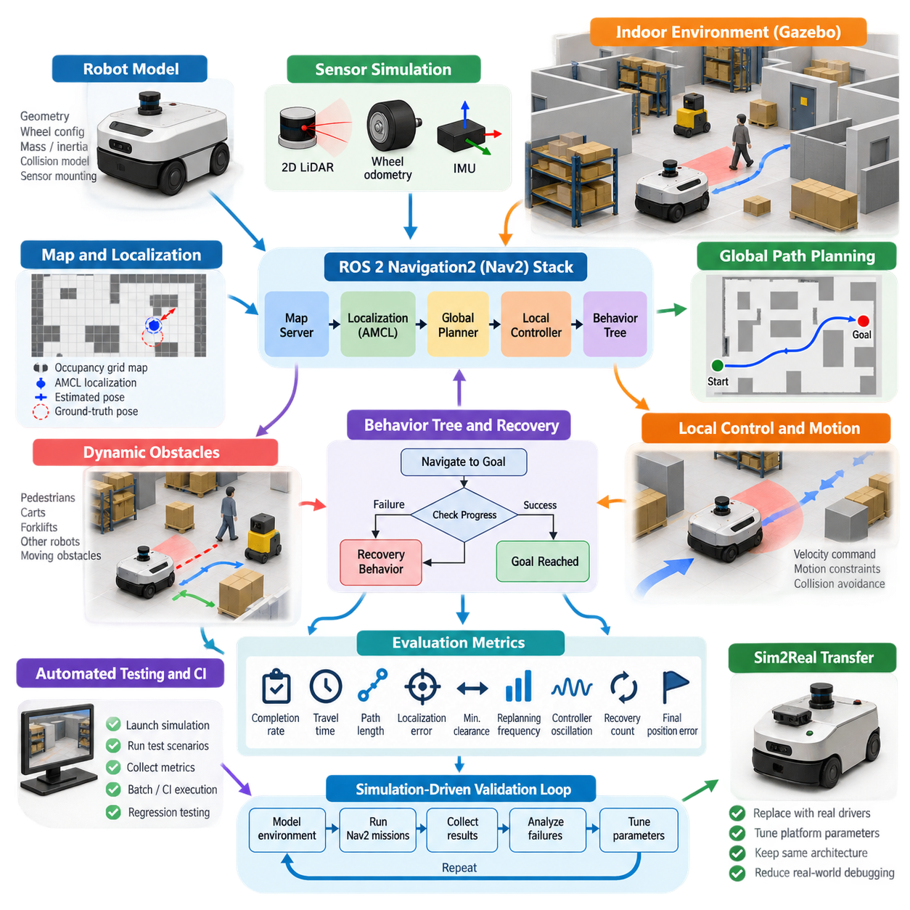
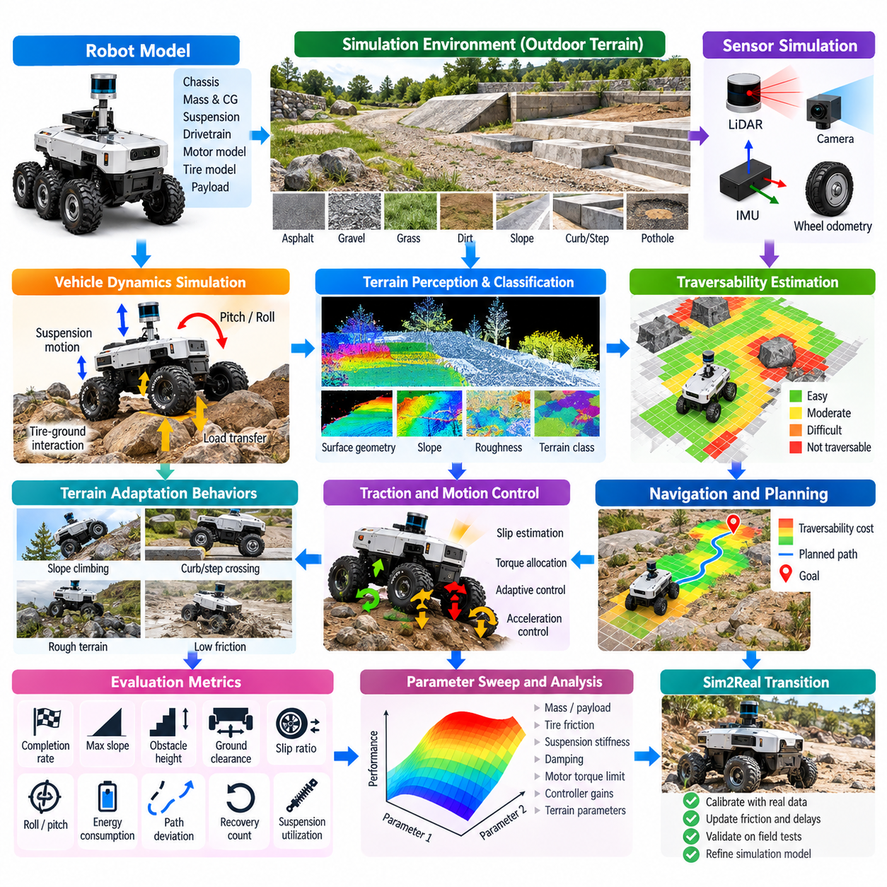
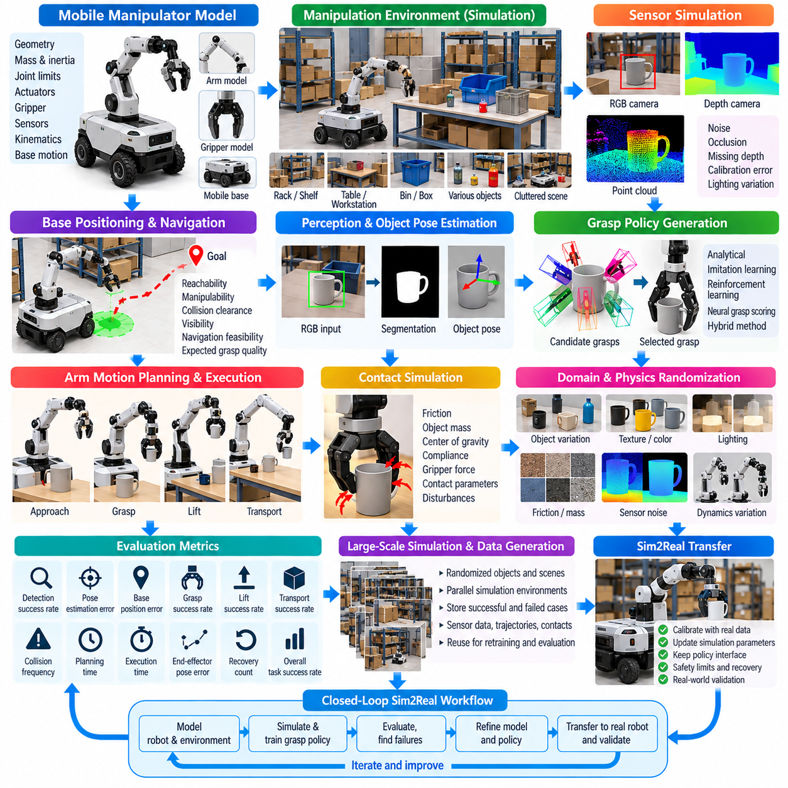
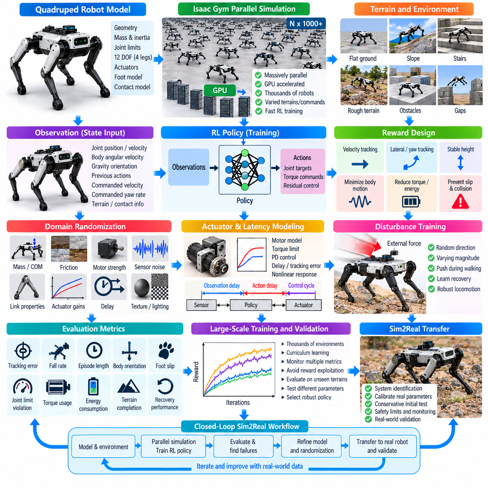
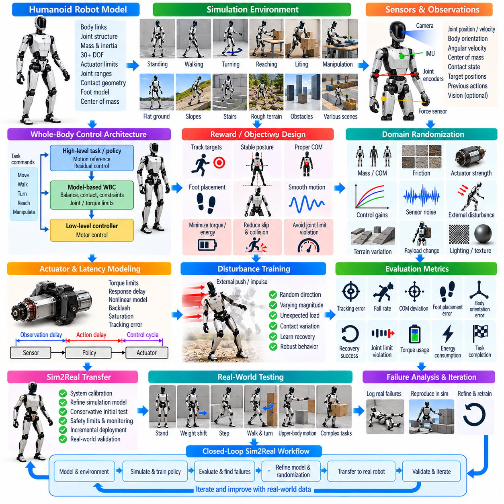
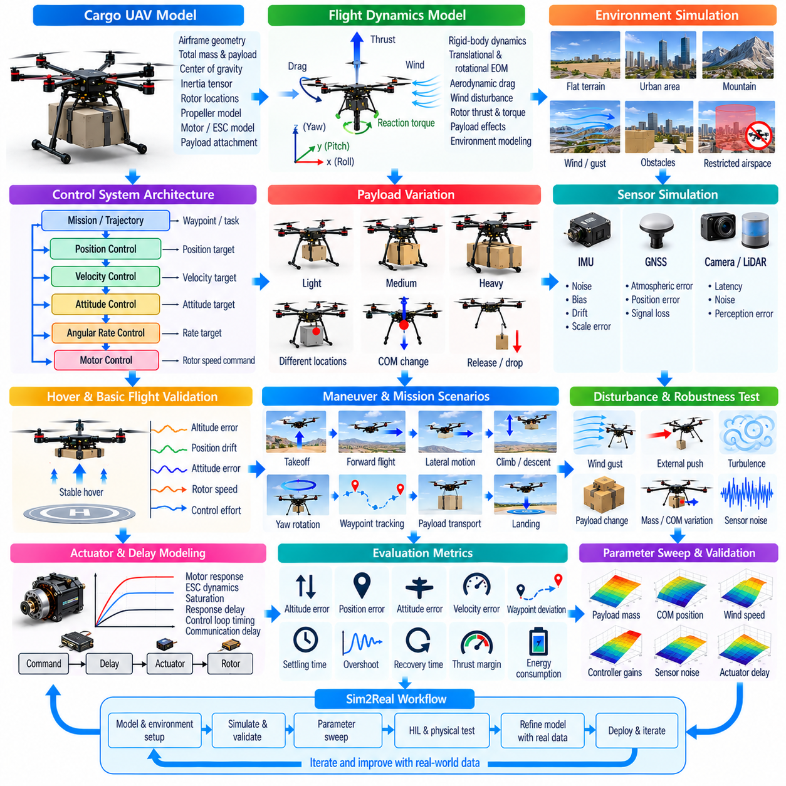
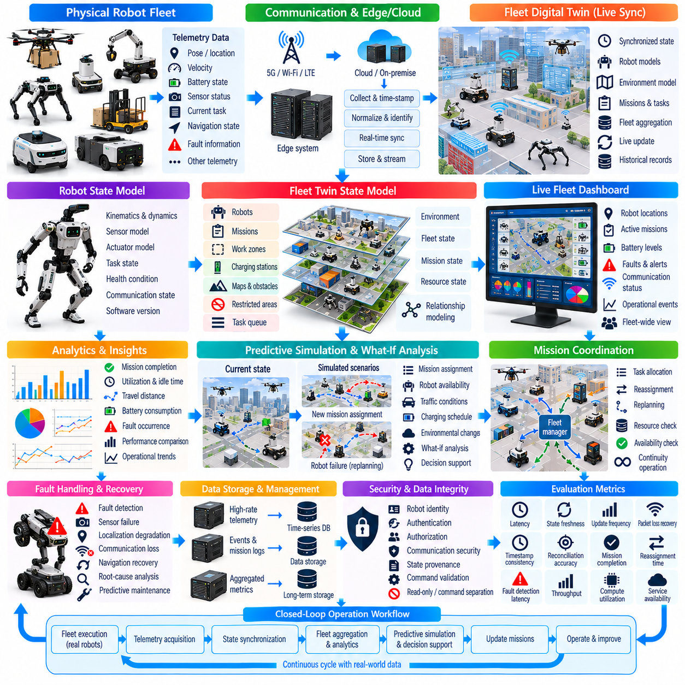
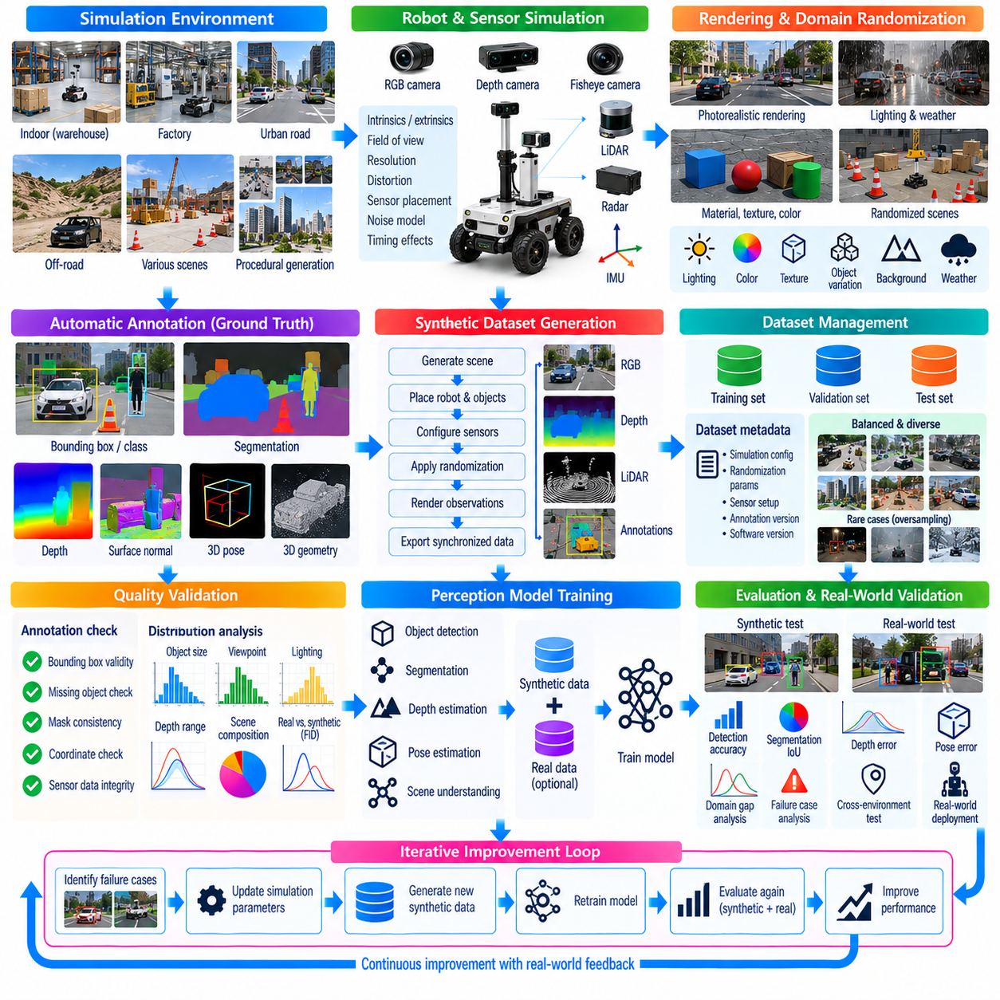
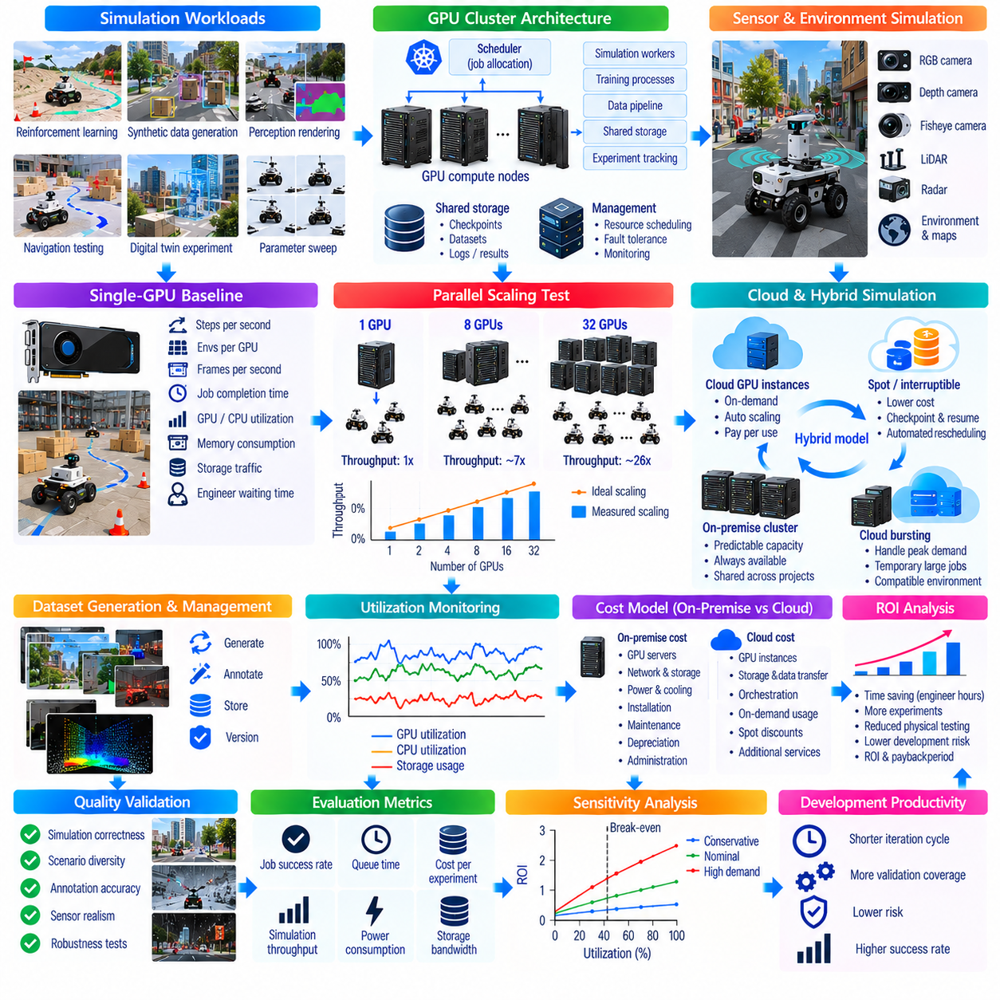
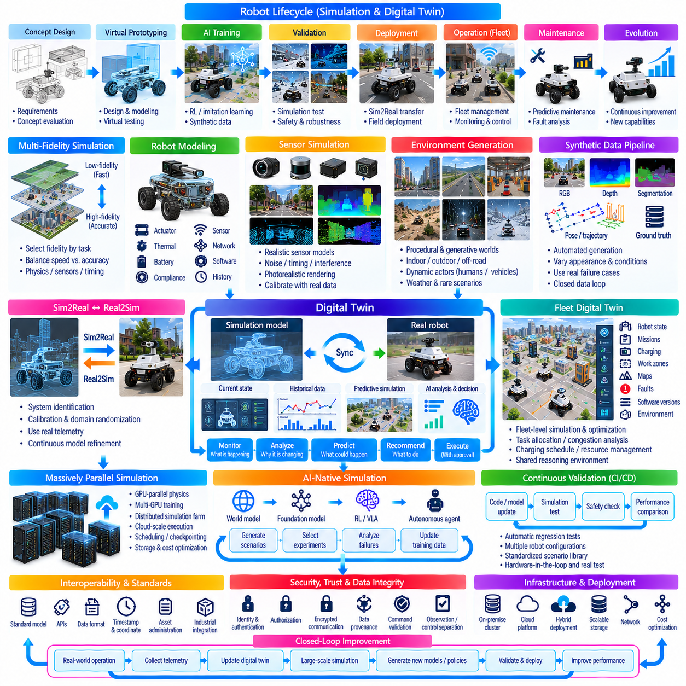

**Volume 11. Simulation and Digital Twin**

# Chapter 12. Simulation Case Studies

## 12.01. Indoor AMR Nav2 Validation with Gazebo Sim Case

{width="7.268055555555556in" height="7.268055555555556in"}

실내 자율이동로봇(Autonomous Mobile Robot, AMR)은 실제 하드웨어에 내비게이션 소프트웨어를 배포하기 전에 ROS 2 내비게이션2(Navigation2, Nav2) 스택과 가제보(Gazebo) 기반 시뮬레이션 환경을 결합하여 효과적으로 검증할 수 있다. 이 사례에서는 복도, 교차로, 선반, 벽, 도킹 구역, 임시 장애물 등을 포함하는 창고형 실내 작업 공간을 시뮬레이션으로 구현한다. 실제 AMR에 적용할 것과 동일한 ROS 2 내비게이션 아키텍처를 시뮬레이션 로봇에 연결함으로써 위치추정(Localization), 경로계획(Planning), 장애물 회피(Obstacle Avoidance), 모션 제어(Motion Control)를 하나의 통합 시스템으로 평가할 수 있다.

시뮬레이션 AMR은 실제 플랫폼의 형상, 휠 구성, 질량, 관성(Inertia), 충돌 경계(Collision Boundary), 센서 장착 위치를 근사한 로봇 모델에서 시작한다. 실내 물류 로봇에는 차동구동(Differential Drive) 구성이 일반적으로 적합하지만, 동일한 검증 방법론을 전방향(Omnidirectional) 또는 애커먼(Ackermann) 플랫폼에도 적용할 수 있다. 가제보(Gazebo)는 휠과 지면의 상호작용 및 로봇 운동을 계산하는 물리 환경을 제공하며, ROS 2 인터페이스는 속도 명령, 조인트 상태(Joint State), 오도메트리(Odometry), 센서 정보를 내비게이션 소프트웨어에 제공한다.

센서 시뮬레이션(Sensor Simulation)은 Nav2가 시뮬레이터의 완전한 상태정보가 아니라 환경 관측정보에 의존하기 때문에 특히 중요하다. 시뮬레이션된 2D 라이다(LiDAR)는 벽, 선반, 팔레트 및 기타 장애물에 대한 거리 측정값을 발행할 수 있으며, 휠 오도메트리(Wheel Odometry)와 관성측정장치(Inertial Measurement Unit, IMU)는 운동 관련 정보를 제공한다. map, odom, base_link 및 센서 프레임 사이의 좌표 관계는 실제 로봇에서 계획한 구성을 재현해야 한다. 잘못된 프레임 정의, 타임스탬프(Timestamp), 센서 방향 또는 갱신 주기는 플래너(Planner)나 컨트롤러(Controller)의 문제처럼 보이는 내비게이션 오류를 발생시킬 수 있다.

첫 번째 검증 단계에서는 지도(Map)와 위치추정(Localization) 파이프라인을 구축한다. 사전에 생성된 점유격자지도(Occupancy Grid Map)를 Nav2 맵 서버(Map Server)를 통해 불러오고, 적응형 몬테카를로 위치추정(Adaptive Monte Carlo Localization, AMCL)을 이용하여 라이다 관측과 오도메트리로부터 로봇의 자세(Pose)를 추정할 수 있다. 가제보의 실측 기준 자세(Ground-Truth Pose)는 내비게이션 알고리즘에 직접 제공하지 않고 검증 기준으로만 유지한다. 추정 자세와 시뮬레이션 자세를 비교하면 위치추정 수렴(Localization Convergence), 누적 오차, 복구 동작(Recovery Behavior), 모호한 실내 형상에 대한 민감도를 관찰할 수 있다.

위치추정이 안정화되면 시뮬레이션 시설 전체에 걸쳐 내비게이션 목표(Navigation Goal)를 반복적으로 지정하여 전역 경로계획(Global Path Planning)을 시험할 수 있다. 전역 플래너(Global Planner)는 팽창된 장애물 영역(Inflated Obstacle Region)과 로봇 풋프린트(Robot Footprint) 제약조건을 고려하면서 점유지도에서 충돌 없는 경로를 생성한다. 시험 목적지는 단순한 직선 경로뿐만 아니라 좁은 복도, 급격한 회전, 교차로, 제한된 통로, 대형 고정 장애물을 우회하는 경로까지 포함해야 한다. 이러한 시험은 편리한 소수의 시작점과 목표점만 사용했을 때 발견되지 않는 설정 문제를 노출할 수 있다.

다음으로 시뮬레이션 AMR이 전역 경로를 추종하는 동안 로컬 궤적 제어(Local Trajectory Control)를 평가한다. Nav2 컨트롤러는 로컬 코스트맵(Local Costmap)과 현재 로봇 상태를 이용하여 선속도, 각속도, 가속도, 감속도에 설정된 제한조건을 준수하면서 속도 명령을 생성한다. 따라서 시뮬레이션 플랫폼에는 실제 AMR을 대표할 수 있는 운동 제약조건(Motion Constraints)을 적용해야 한다. 지나치게 낙관적인 가속이나 회전 파라미터를 사용하면 시뮬레이션에서는 성공하지만 무거운 실제 플랫폼에서는 재현할 수 없는 결과가 발생하여 검증의 실질적인 가치가 감소할 수 있다.

동적 장애물(Dynamic Obstacle) 시나리오는 정적 내비게이션을 넘어 시험 범위를 확장한다. 시뮬레이션된 보행자, 카트, 지게차 또는 다른 이동로봇이 계획된 경로를 가로지르거나 복도에 진입하고 목적지 접근을 일시적으로 차단하도록 구성할 수 있다. 로컬 코스트맵은 이러한 변화를 감지하고 상황에 따라 내비게이션 시스템이 감속, 정지, 장애물 우회 또는 경로 재계획(Replanning)을 수행하도록 해야 한다. 이러한 실험은 인지 지연(Perception Latency), 코스트맵 갱신 주기, 장애물 유지시간, 컨트롤러 동작, 시뮬레이션에 반영된 물리적 정지 특성 사이의 상호작용을 확인할 수 있게 한다.

Nav2 행동트리(Behavior Tree) 역시 중요한 검증 대상이다. 성공적인 자율주행은 정상적인 경로 실행만으로 구성되지 않기 때문이다. 계획 실패, 경로 차단, 위치추정 불확실성, 컨트롤러 정체(Controller Stall), 일시적으로 도달할 수 없는 목표 등의 상황을 의도적으로 생성할 수 있다. 이후 코스트맵 초기화(Costmap Clearing), 경로 재계획, 대기, 회전 또는 임무 취소와 같은 복구 동작을 체계적으로 관찰할 수 있다. 시뮬레이션에서는 이러한 비정상 조건을 반복적으로 재현할 수 있으므로 실제 로봇을 위험하거나 바람직하지 않은 운용 상태에 반복적으로 배치하지 않고도 소프트웨어 동작을 분석할 수 있다.

효과적인 시험 캠페인(Test Campaign)은 시나리오를 단순히 시각적으로 관찰하는 대신 측정 가능한 내비게이션 평가 기준으로 변환한다. 주요 측정항목에는 임무 완료율(Mission Completion Rate), 이동시간, 경로 길이, 위치추정 오차, 최소 장애물 이격거리, 경로 재계획 빈도, 컨트롤러 진동(Oscillation), 복구 횟수, 최종 정지 위치 오차 등이 포함된다. ROS 2 백(ROS 2 Bag)과 내비게이션 로그를 이용하면 센서 토픽, 좌표변환(Transform), 코스트맵, 경로, 속도 명령, 상태 메시지를 보존할 수 있으며, 이를 통해 실패한 실행을 재구성하고 성공적인 설정과 비교할 수 있다.

반복성(Repeatability)은 가제보 기반 검증의 가장 강력한 장점 중 하나이다. 동일한 로봇 자세, 목적지, 장애물 배치, 내비게이션 파라미터를 플래너, 컨트롤러, 코스트맵, 행동트리 또는 로봇 모델 변경 후에도 반복적으로 실행할 수 있다. 따라서 회귀시험(Regression Testing)을 통해 소프트웨어 변경이 특정 시나리오를 개선하면서 다른 시나리오의 성능을 저하시키는지를 판단할 수 있다. 이러한 접근법은 로보틱스 소프트웨어 개발수명주기(Software Development Lifecycle)의 시뮬레이션 기반 검증(Simulation-Based Validation) 및 자동화 시험(Automated Testing)과 자연스럽게 연결된다.

자동화 실행(Automated Execution)을 적용하면 시뮬레이터를 단순한 개발 시각화 도구에서 검증 인프라(Validation Infrastructure)로 전환할 수 있다. 실행 스크립트(Launch Script)는 가제보 월드(Gazebo World)를 초기화하고 AMR을 생성하며 ROS 2와 Nav2 노드를 시작한 후 초기 자세를 설정하고 내비게이션 목표를 전달하며 결과 지표를 기록할 수 있다. 여러 지도와 파라미터 구성을 배치(Batch) 또는 지속적 통합(Continuous Integration, CI) 환경에서 실행할 수 있다. 따라서 내비게이션 소프트웨어가 변경되면 실제 AMR에 새로운 버전을 배포하기 전에 사전에 정의된 시뮬레이션 시험을 자동으로 수행할 수 있다.

그러나 시뮬레이션 충실도(Simulation Fidelity)는 신중하게 관리해야 한다. 가제보가 휠 슬립(Wheel Slip), 불균일한 바닥, 적재중량에 따른 동역학 변화, 센서 반사, 통신 지터(Communication Jitter), 기계적 공차, 예측하기 어려운 사람의 행동 등 실제 창고의 모든 특성을 자동으로 재현할 수 있는 것은 아니다. 따라서 가능한 경우 실제 로봇에서 측정한 값을 이용하여 파라미터를 보정(Calibration)해야 한다. 특히 센서 노이즈, 액추에이터 응답, 지연시간(Latency), 마찰, 가속도 제한, 로봇 풋프린트 크기는 비현실적인 설정이 시뮬레이션과 현장 성능 사이에 잘못된 차이를 만들 수 있기 때문에 중요하다.

실제 AMR로 전환할 때에는 검증된 소프트웨어 아키텍처를 유지하면서 시뮬레이션 인터페이스를 실제 하드웨어 드라이버(Hardware Driver)로 교체해야 한다. 플랫폼 동역학이나 센서 특성에 크게 의존하는 내비게이션 파라미터는 추가적인 튜닝이 필요할 수 있지만, 지도 처리, 위치추정 구조, 경로계획 파이프라인, 행동트리 로직, 시험 시나리오는 대부분 일관되게 유지할 수 있다. 이를 통해 고가의 실제 하드웨어에서 수행해야 하는 디버깅을 줄이고 시운전(Commissioning) 과정에서 소프트웨어 결함을 기계, 전기, 센서 및 환경 문제와 분리하여 분석할 수 있다.

결과적으로 이 워크플로는 AMR과 환경을 모델링하고, Nav2 임무를 실행하며, 정량적 결과를 수집하고, 실패 모드(Failure Mode)를 식별한 뒤 파라미터 또는 소프트웨어를 수정하고 동일한 시나리오를 다시 실행하는 시뮬레이션 주도 검증 루프(Simulation-Driven Validation Loop)를 형성한다. 시뮬레이션 성공만으로 실제 로봇의 올바른 동작을 보장할 수는 없지만, 실제 환경 시험에 진입하기 전 통제된 엔지니어링 검증 게이트(Engineering Validation Gate)를 제공한다. 이 실내 AMR 사례는 로봇 모델링, 센서 시뮬레이션, 오픈소스 시뮬레이션, 내비게이션 소프트웨어, 자동화 시험, 시뮬레이션-현실 전이(Sim2Real) 검증이 하나의 연속적인 개발 프로세스로 통합될 수 있음을 보여준다.

## 12.02. Outdoor AMR Terrain Adaptation Simulation Case

{width="7.268055555555556in" height="7.268055555555556in"}

실외 자율이동로봇(Autonomous Mobile Robot, AMR)은 지형 자체가 차량 동역학(Vehicle Dynamics) 문제의 일부가 되기 때문에 실내 AMR보다 훨씬 다양한 물리적 조건에서 운용된다. 따라서 지형 적응 시뮬레이션(Terrain-Adaptation Simulation)은 단순한 충돌 없는 내비게이션을 넘어 불규칙한 지면에서도 로봇이 이동성(Mobility), 안정성(Stability), 견인력(Traction), 제어가능성(Controllability)을 유지할 수 있는지를 평가해야 한다. 시뮬레이션 환경은 경사로, 연석, 자갈, 잔디, 포트홀, 램프, 연약 지반, 불규칙한 포장도로 및 서로 다른 노면 사이의 전환 구간을 실제적인 로봇 동역학과 함께 표현해야 한다.

가상 AMR은 차체 형상, 휠 직경, 휠베이스(Wheelbase), 윤거(Track Width), 질량 분포, 페이로드(Payload), 무게중심(Center of Gravity), 서스펜션 형상, 모터 특성, 구동계 감속비(Drivetrain Reduction), 타이어-지면 상호작용을 표현하는 동역학 모델(Dynamic Model)에서 시작한다. 고중량 실외 플랫폼의 지형 검증에는 단순화된 운동학적 움직임만으로는 충분하지 않다. 실제 시험 전에 이동성 한계를 확인하려면 휠 접촉력, 서스펜션 스트로크, 종방향 및 횡방향 타이어 힘, 피치(Pitch)와 롤(Roll) 동역학, 하중이동(Load Transfer)을 충분한 충실도로 표현해야 한다.

지형 모델링(Terrain Modeling)은 실험의 유용성을 결정하는 핵심 요소이다. 시뮬레이션 월드(Simulation World)는 구조화된 도로 표면과 함께 램프, 단차, 배수로, 연석, 거친 지면 및 외관과 물리적 특성이 서로 다른 지형 영역을 결합할 수 있다. 높이지도(Height Map), 메시(Mesh), 절차적 지형 생성(Procedural Terrain Generation)을 이용하면 지면 형상을 체계적으로 변화시킬 수 있다. 또한 마찰계수와 접촉 파라미터를 조정하여 모든 시험마다 완전히 다른 환경을 만들지 않고도 아스팔트, 콘크리트, 젖은 노면, 자갈, 토양 및 저마찰 영역을 구분할 수 있다.

개별 휠이 서로 다른 높이의 지형을 통과할 때 서스펜션 동작(Suspension Behavior)은 특히 중요해진다. 롱 트래블 서스펜션(Long-Travel Suspension)은 과도한 차체 롤과 피치를 억제하면서 휠의 지면 접촉을 유지하는 데 도움을 줄 수 있지만, 그 효과는 스프링 강성(Spring Stiffness), 감쇠(Damping), 사용 가능한 압축 및 리바운드 스트로크(Compression and Rebound Travel), 비현가질량(Unsprung Mass), 서스펜션 형상에 따라 달라진다. 시뮬레이션에서는 이러한 파라미터를 반복적으로 변경하면서 휠 수직하중과 차체 자세를 측정하여 특정 휠의 하중이 크게 감소하거나 일시적으로 지면 접촉을 잃는 조건을 확인할 수 있다.

견인력 적응(Traction Adaptation)은 각 휠의 회전속도, 차량 속도, 추정 슬립률(Slip Ratio), 모터 토크, 수직하중을 모니터링하여 평가할 수 있다. 구동 휠이 저마찰 영역에 진입했을 때 과도한 토크가 가해지면 유효한 종방향 구동력을 생성하지 못하고 휠 스핀(Wheel Spin)이 발생할 수 있다. 지형 인지형 컨트롤러(Terrain-Aware Controller)는 슬립이 발생한 휠의 토크를 감소시키고 다른 구동 휠에 사용 가능한 구동력을 재분배하거나 명령 가속도를 조정할 수 있다. 이러한 제어 전략은 혼합 노면을 주행하는 사륜구동(Four-Wheel Drive) 및 육륜구동(Six-Wheel Drive) 실외 AMR에서 특히 중요하다.

육륜 플랫폼(Six-Wheel Platform)은 추가적인 구동계 및 지면 접촉 특성을 가진다. 견고한 포장도로에서 직진할 때에는 모든 휠이 효율적으로 구동력에 기여할 수 있지만, 회전하거나 불규칙한 지형을 통과할 때에는 각 휠에 서로 다른 회전속도와 토크가 요구될 수 있다. 시뮬레이션을 통해 고마찰 노면에서 불필요한 타이어 스크럽(Tire Scrub)을 감소시키면서 험지에서는 다시 추진력을 확보할 수 있는 토크 분배 전략을 검토할 수 있다. 목표는 단순히 모터 토크를 최대화하는 것이 아니라 휠 접촉, 슬립, 지형 상태 및 현재의 운동 요구조건에 따라 견인력을 적절하게 배분하는 것이다.

지형 인지(Terrain Perception)를 동역학 시뮬레이션과 통합하면 시뮬레이터가 제공하는 특권적 상태정보(Privileged Simulator Knowledge)가 아니라 실제 로봇에서 획득할 수 있는 정보를 기반으로 지형 적응을 수행할 수 있다. 라이다(LiDAR), 깊이 카메라(Depth Camera), 스테레오 비전(Stereo Vision), 관성측정장치(Inertial Measurement Unit, IMU), 휠 오도메트리(Wheel Odometry)를 통해 지면 형상, 경사도, 거칠기, 장애물 및 차량 자세를 추정할 수 있다. 지형 분류(Terrain Classification) 또는 주행가능성(Traversability) 모듈은 이러한 관측정보를 로컬 비용(Local Cost) 또는 위험 표현(Risk Representation)으로 변환하여 모션 플래너(Motion Planner)와 저수준 컨트롤러(Low-Level Controller)가 활용하도록 할 수 있다.

주행가능성 추정(Traversability Estimation)은 인지(Perception)와 내비게이션(Navigation)을 연결한다. 기하학적으로 충돌이 없는 경로라도 차량의 성능 한계를 초과하는 경사, 휠이 안전하게 넘을 수 없는 높은 연석, 차체 하부 접촉 위험이 있는 좁은 함몰부 또는 충분한 견인력을 확보할 수 없는 지형을 포함한다면 실제 주행에는 적합하지 않을 수 있다. 따라서 플래너는 경사도, 거칠기, 단차 높이, 지상고(Ground Clearance), 예측 휠 접촉 및 추정 마찰계수를 기반으로 비용을 부여할 수 있다. 이를 통해 단순히 기하학적 거리를 최소화하는 것이 아니라 물리적으로 주행 가능한 지형을 우선하는 경로를 생성할 수 있다.

지상고와 장애물 극복(Obstacle Negotiation)은 서스펜션 운동과 함께 검증해야 한다. 로봇이 정적인 상태에서는 충분한 지상고를 가지고 있더라도 정상부(Crest), 함몰부, 연석 또는 램프 전환 구간을 통과하면서 피치가 변화하면 차체 하부가 지면과 접촉할 수 있다. 시뮬레이터는 최소 차체-지면 거리, 서스펜션 압축량, 접근각(Approach Angle), 이탈각(Departure Angle), 브레이크오버(Breakover) 조건을 추적할 수 있다. 이러한 측정은 개별 휠이 이론적으로 장애물을 넘을 수 있는 경우에도 플랫폼 전체가 어려움을 겪을 수 있는 지형 형상을 식별하는 데 도움을 준다.

경사 시험(Slope Testing)은 또 하나의 통제된 검증 영역을 제공한다. AMR을 점진적으로 증가하는 종방향 및 횡방향 경사에서 주행시키면서 페이로드 질량과 무게중심 위치를 변화시킬 수 있다. 모터 토크, 휠 슬립, 차체 피치와 롤, 서스펜션 변위, 안정성 여유(Stability Margin)를 측정하면 페이로드가 이동성에 미치는 영향을 파악할 수 있다. 내리막 시나리오 역시 중요하다. 등판 성능이 충분하더라도 제동 성능, 회생 토크(Regenerative Torque), 휠 접지력, 속도 제어가 제한 요소가 될 수 있기 때문이다.

동적 지형 시나리오(Dynamic Terrain Scenario)는 정상상태의 노면만이 아니라 서로 다른 노면 사이의 전환 과정도 평가해야 한다. 아스팔트에서 자갈로 이동하거나, 평지에서 램프로 진입하거나, 대각선 방향으로 연석을 넘거나, 차량 한쪽 휠이 함몰부를 통과하는 상황에서는 빠른 하중이동과 순간적인 휠 슬립이 발생할 수 있다. 이러한 이벤트는 컨트롤러 응답시간과 센서 지연시간(Sensor Latency)을 평가하는 데 유용하다. 정상상태에서는 우수하게 동작하는 지형 적응 알고리즘도 짧은 이동거리 안에서 노면 특성이 급격히 변하면 충분히 빠르게 대응하지 못할 수 있다.

정량적 평가(Quantitative Evaluation)는 지형 실험을 엔지니어링 근거로 변환한다. 유용한 평가 지표에는 임무 완료율(Mission Completion Rate), 최대 주행 가능 경사도, 장애물 높이 극복 능력, 최소 지상고, 휠 슬립률, 서스펜션 사용률(Suspension Utilization), 차체 롤과 피치, 모터 토크 여유(Motor Torque Margin), 에너지 소비량, 경로 편차 및 복구 빈도 등이 포함된다. 특히 휠 접촉 손실과 과도한 차체 하부 접촉은 명시적으로 기록해야 한다. 내비게이션 임무 자체는 완료되더라도 장기간 운용에서는 허용할 수 없는 기계적 상태가 발생할 수 있기 때문이다.

파라미터 스윕(Parameter Sweep)은 플랫폼 개발 과정에서 시뮬레이션이 제공하는 중요한 장점이다. 차량 질량, 페이로드 위치, 타이어 마찰, 서스펜션 강성, 감쇠, 모터 토크 제한, 휠 직경, 컨트롤러 게인(Controller Gain), 지형 파라미터를 수백 또는 수천 번의 실행에서 자동으로 변화시킬 수 있다. 이렇게 생성된 데이터는 실제 프로토타입 시험만으로 발견하기 어려운 민감도 관계(Sensitivity Relationship)를 보여줄 수 있다. 이후 최악조건 조합(Worst-Case Combination)을 선정하여 모든 가능한 지형 조건을 실험적으로 재현하는 대신 집중적인 실제 시험을 수행할 수 있다.

시뮬레이션-현실 전이(Sim2Real Transition)에서는 지형 접촉이 정확하게 모델링하기 가장 어려운 물리 현상 중 하나이므로 보정(Calibration)이 필요하다. 실제 타이어는 변형되고, 느슨한 지면은 이동하며, 마찰은 습도와 오염에 따라 변하고, 서스펜션 부품은 비선형성(Nonlinearity)을 가지며, 구동계 백래시(Drivetrain Backlash)는 이상적인 시뮬레이션 모델에서 생략될 수 있는 동작을 발생시킨다. 따라서 대표적인 지형 시험에서 획득한 실제 측정값을 이용하여 마찰, 액추에이터, 서스펜션 및 지연 파라미터를 갱신하고 시뮬레이터를 점진적으로 더욱 유용한 엔지니어링 근사 모델로 발전시켜야 한다.

완성된 사례는 환경 모델링(Environment Modeling), 차량 동역학(Vehicle Dynamics), 지형 인지(Terrain Perception), 주행가능성 추정(Traversability Estimation), 경로계획(Planning), 견인력 제어(Traction Control), 서스펜션 분석(Suspension Analysis), 정량적 평가가 함께 동작하는 폐루프 지형 검증 워크플로(Closed Terrain-Validation Workflow)를 형성한다. 시뮬레이션은 실제 시험이 필요한 지형 조건을 식별하고, 현장 측정값은 이후 개발 주기를 위해 시뮬레이션 모델을 개선한다. 이러한 관점에서 지형 적응 시뮬레이션은 단순히 실외 AMR을 가상으로 시연하는 도구가 아니라 실제 배포 전에 강건한 이동성(Robust Mobility)을 설계하고 검증하기 위한 엔지니어링 프레임워크(Engineering Framework)가 된다.

## 12.03. Mobile Manipulator Grasp Policy Sim2Real Case

{width="7.268055555555556in" height="7.268055555555556in"}

모바일 매니퓰레이터(Mobile Manipulator)는 자율이동베이스(Autonomous Mobile Base)와 로봇팔(Robotic Arm), 그리퍼(Gripper)를 결합한 시스템으로, 매니퓰레이션 성능은 내비게이션 정확도와 로봇팔 수준의 제어 성능 모두에 영향을 받는다. 따라서 시뮬레이션-현실 전이(Sim2Real) 기반 파지 정책(Grasp Policy) 사례에서는 파지를 독립적인 매니퓰레이터 문제로만 평가할 수 없다. 전체 워크플로는 모바일 베이스 위치결정, 로봇팔 운동학, 인지, 물체 자세 불확실성, 충돌 제약, 파지 생성, 접촉 동역학, 실행 복구를 하나의 통합 시뮬레이션 환경에서 표현해야 한다.

시뮬레이션은 실제 로봇의 형상, 질량, 관성(Inertia), 관절 한계(Joint Limits), 액추에이터 특성, 그리퍼 치수, 센서 위치, 베이스 운동 제약을 근사하는 모바일 매니퓰레이터의 디지털 모델(Digital Model)에서 시작한다. 모바일 베이스, 로봇팔 베이스, 엔드이펙터(End Effector), 카메라 및 기타 센서 사이의 상대 좌표변환(Relative Transformation)은 특히 중요하다. 작은 보정 오차도 운동학 체인(Kinematic Chain)을 통해 누적되어 시뮬레이션에서 학습된 파지 정책이 정확해 보이는 경우에도 상당한 엔드이펙터 위치 오차를 발생시킬 수 있다.

매니퓰레이션 환경(Manipulation Environment)은 이상적인 테이블 위에 고립된 물체만 배치하는 것이 아니라 실제 운용 작업공간을 재현해야 한다. 선반, 랙, 작업대, 빈(Bin), 팔레트, 벽 및 접근 제한 영역은 베이스 위치와 로봇팔 움직임을 동시에 제한할 수 있다. 물체는 서로 다른 위치, 방향, 높이 및 다양한 혼잡도(Clutter) 상태로 배치되어야 한다. 이를 통해 시스템은 목표물을 안전하게 인지하고, 도달하고, 파지하고, 회수할 수 있는 실행 가능한 베이스 자세(Base Pose)를 찾는 실질적인 모바일 매니퓰레이션 문제를 해결해야 한다.

인지(Perception)는 시뮬레이션 장면과 파지 정책을 연결한다. RGB 카메라, 깊이 카메라(Depth Camera), 스테레오 센서 또는 포인트클라우드(Point Cloud)는 실제 시스템에서 사용할 것으로 예상되는 것과 동일한 관측 형식으로 시뮬레이션할 수 있다. 시뮬레이터가 제공하는 완벽한 물체 좌표를 직접 사용하는 대신 정책에는 추정 물체 자세, 분할 마스크(Segmentation Mask), 깊이 관측 또는 학습된 시각 특징(Visual Feature)을 제공해야 한다. 이후 센서 노이즈, 가림(Occlusion), 깊이정보 손실, 보정 오차, 조명 변화를 추가하여 이상적인 합성 관측정보에 지나치게 의존하는 것을 방지할 수 있다.

파지 정책 파이프라인(Grasp-Policy Pipeline)은 이러한 관측정보를 후보 파지 자세(Candidate Grasp Pose), 엔드이펙터 궤적 또는 직접적인 매니퓰레이션 행동으로 변환할 수 있다. 시스템 아키텍처에 따라 정책은 해석적 파지 생성(Analytical Grasp Generation), 모방학습(Imitation Learning), 강화학습(Reinforcement Learning), 신경망 기반 파지 점수화(Neural Grasp Scoring) 또는 하이브리드 방식에 기반할 수 있다. 시뮬레이션에서는 많은 물체 구성을 자동 생성할 수 있으므로 정책이 제한된 시연 데이터만 암기하는 것이 아니라 물체 크기, 형상, 방향, 표면 특성, 혼잡도 및 접근 방향에 걸쳐 일반화되는지를 평가할 수 있다.

베이스 위치결정(Base Positioning)과 매니퓰레이션 계획(Manipulation Planning)은 함께 고려해야 한다. 모바일 베이스 관점에서는 적절한 내비게이션 목표라도 목표 물체가 매니퓰레이터 작업공간 밖에 위치하거나 로봇팔이 특이점(Singularity)에 가까운 자세를 취하도록 만들 수 있다. 반대로 로봇팔에 최적인 베이스 자세는 모바일 플랫폼이 안전하게 접근하기 어려울 수 있다. 따라서 시뮬레이션에서는 로봇이 최종 접근을 수행하기 전에 도달가능성(Reachability), 조작성(Manipulability), 충돌 여유, 가시성, 베이스 내비게이션 실행가능성 및 예상 파지 품질을 이용하여 후보 도킹 또는 매니퓰레이션 자세를 평가할 수 있다.

엔드이펙터가 물체에 도달하면 접촉 시뮬레이션(Contact Simulation)이 중요해진다. 그리퍼 핑거 형상, 마찰, 물체 질량, 무게중심(Center of Gravity), 컴플라이언스(Compliance), 접촉 솔버 파라미터(Contact Solver Parameters), 파지력은 물체를 들어 올리고 운반하는 동안 파지가 안정적으로 유지되는지에 영향을 미친다. 시각적으로는 성공적으로 파지된 것처럼 보이더라도 실제로는 물체가 불안정하게 구속되어 있을 수 있다. 시뮬레이션된 외란, 작은 자세 오차 또는 마찰계수의 통제된 변화는 물체를 들어 올린 직후나 모바일 베이스의 후속 이동 과정에서 실패하는 파지를 식별할 수 있게 한다.

도메인 랜덤화(Domain Randomization)는 하나의 이상적인 시뮬레이터 설정에 대한 의존성을 줄일 수 있다. 물체 텍스처, 색상, 조명, 카메라 노출, 배경 외관, 물체 자세, 질량, 마찰, 관절 감쇠, 센서 노이즈, 액추에이터 지연 및 보정 오프셋을 에피소드마다 변화시킬 수 있다. 목표는 단순히 시뮬레이션의 시각적 다양성을 높이는 것이 아니라 실제 시스템에서 발생할 수 있는 변화를 포함하는 조건 분포에 파지 정책을 노출하는 것이다. 따라서 임의적으로 큰 랜덤화 범위를 사용하는 것보다 적절한 파라미터 범위를 설정하는 것이 더욱 중요하다.

물리 랜덤화(Physics Randomization)는 접촉 동작을 정확하게 재현하기 어렵기 때문에 매니퓰레이션에서 특히 중요하다. 마찰계수, 물체 질량, 그리퍼 힘, 액추에이터 응답, 관절 백래시(Joint Backlash), 접촉 강성(Contact Stiffness)을 물리적으로 의미 있는 범위에서 변화시킬 수 있다. 특정한 하나의 마찰계수에서만 성공하는 파지는 실제 환경에서 강건하게 동작하기 어렵다. 파라미터 분포 전체에 걸쳐 학습하고 평가하면 불확실성을 견딜 수 있는 정책을 유도하는 동시에 어떤 물리 파라미터가 파지 성공에 가장 큰 영향을 미치는지도 파악할 수 있다.

완전한 작업 에피소드(Task Episode)는 최초의 물체 접촉 이후까지 확장되어야 한다. 로봇은 작업대에 접근하고, 매니퓰레이션 준비가 완료된 베이스 자세를 확보하며, 목표물을 감지하고, 파지를 생성하거나 선택한 후, 로봇팔 움직임을 계획하고, 그리퍼를 닫고, 물체를 들어 올리고, 파지 안정성을 확인하며, 로봇팔을 후퇴시키고, 물체를 목적지 방향으로 운반한다. 어느 단계에서든 실패가 발생하면 단순히 일반적인 실패 에피소드로 기록하는 대신 경로 재계획, 새로운 파지 후보 선택, 베이스 재배치 또는 안전한 작업 종료를 실행할 수 있는 관측 가능한 상태로 처리해야 한다.

정량적 평가(Quantitative Evaluation)는 서로 다른 실패 메커니즘을 구분해야 한다. 유용한 측정항목에는 물체 감지 성공률, 자세 추정 오차, 베이스 위치결정 오차, 파지 성공률, 들어올리기 성공률, 운반 중 물체 유지율, 충돌 빈도, 계획시간, 실행시간, 엔드이펙터 자세 오차, 복구 횟수 및 전체 작업 성공률이 포함된다. 인지, 계획, 접촉, 실행 단계의 실패를 분리하여 분석하면 상위 수준의 성공률만으로 실제 물리적 성능 저하의 원인이 되는 구성요소가 가려지는 문제를 방지할 수 있다.

대규모 시뮬레이션(Large-Scale Simulation)을 이용하면 고비용의 실제 하드웨어 시험을 시작하기 전에 수천 번의 파지 시도를 생성할 수 있다. 물체와 장면을 자동으로 랜덤화할 수 있으며, 컴퓨팅 자원이 허용되는 경우 여러 시뮬레이션 환경을 병렬로 실행할 수 있다. 실패 사례는 센서 관측정보, 물체 상태, 예측된 파지 자세, 로봇 궤적 및 접촉정보와 함께 저장할 수 있다. 이러한 어려운 사례를 정책 재학습, 집중 평가 또는 커리큘럼 생성(Curriculum Generation)에 다시 활용하면 시뮬레이션 데이터 생성과 정책 개선 사이에 지속적인 학습 루프를 형성할 수 있다.

첫 번째 실제 로봇 배포(Physical Deployment)에서는 즉시 작업 처리량을 최대화하기보다 시뮬레이션-현실 차이(Sim2Real Gap)를 측정하는 데 집중해야 한다. 카메라 외부 파라미터(Camera Extrinsics), 깊이 정확도, 로봇팔 영점 위치, 그리퍼 치수, 액추에이터 지연, 관절 추종 오차, 물체 마찰 및 모바일 베이스 도킹 정확도를 실제 시스템에서 측정하여 시뮬레이션과 비교할 수 있다. 이러한 관측 결과는 현실-시뮬레이션 보정(Real2Sim Calibration)을 지원하며, 추가적인 정책 학습이나 파라미터 튜닝을 수행하기 전에 가상 로봇과 환경을 갱신할 수 있게 한다.

실제 로봇으로 전이할 때에는 시뮬레이션에서 사용한 정책 인터페이스와 관측-행동 구조(Observation-Action Structure)를 유지해야 한다. 실제 플랫폼에서 이에 상응하는 측정값을 얻을 수 없는 경우 시뮬레이션 전용 상태정보는 배포 파이프라인에서 제거해야 한다. 안전 한계, 충돌 모니터링, 속도 제한, 작업공간 제약 및 복구 로직은 학습된 정책 주변에서 함께 동작하여 예상하지 못한 정책 출력이 제한 없는 로봇 움직임으로 직접 이어지지 않도록 해야 한다. 따라서 정책은 로봇에 대한 유일한 제어 권한이 아니라 더 큰 매니퓰레이션 아키텍처를 구성하는 하나의 구성요소가 된다.

완성된 시뮬레이션-현실 전이 워크플로(Sim2Real Workflow)는 로봇 모델링, 합성 인지(Synthetic Perception), 파지 정책 학습, 접촉 시뮬레이션, 도메인 랜덤화, 모바일 매니퓰레이션 계획, 실제 시스템 보정 및 현실 환경 검증을 연결하는 폐루프 개선 사이클(Closed Improvement Cycle)을 형성한다. 시뮬레이션은 대규모 실행과 반복성을 제공하고 실제 실험은 시뮬레이션만으로 예측하기 어려운 모델링 오차를 드러낸다. 양방향으로 지식을 반복적으로 전이함으로써 모바일 매니퓰레이터는 이상적인 가상 파지에서 출발하여 실제 환경의 불확실성, 다양성 및 운용 제약조건에서도 강건하게 물체를 다룰 수 있는 시스템으로 발전할 수 있다.

## 12.04. Quadruped RL Locomotion Isaac Gym to Real Case

{width="7.268055555555556in" height="7.268055555555556in"}

강화학습(Reinforcement Learning, RL)은 불규칙한 지형에서 보행할 때 균형을 유지하면서 다수의 관절을 지속적으로 협조 제어해야 하므로 사족보행 로봇(Quadruped Robot)의 이동 제어에 실용적인 접근법을 제공한다. 아이작 짐-현실 전이(Isaac Gym-to-Real) 워크플로는 대규모 병렬 시뮬레이션(Massively Parallel Simulation)을 활용하여 실제 하드웨어에 배포하기 전에 수천 대의 가상 로봇에서 보행 정책(Locomotion Policy)을 학습한다. 목표는 단순히 시각적으로 자연스러운 보행을 생성하는 것이 아니라 동역학, 지형, 센싱, 구동 및 외부 외란의 불확실성에서도 안정적으로 동작하는 정책을 개발하는 것이다.

시뮬레이션은 실제 로봇의 몸체 형상, 링크 질량, 관성(Inertia), 관절 위치, 관절 한계(Joint Limits), 액추에이터 특성, 발 형상 및 접촉 특성을 표현하는 사족보행 로봇 동역학 모델(Dynamic Quadruped Model)에서 시작한다. 일반적인 사족보행 로봇은 네 개의 다리에 분산된 12개의 구동 자유도(Actuated Degrees of Freedom)를 가지므로 정확한 운동학적 및 동역학적 관계가 중요하다. 질량 분포, 관절 방향, 모터 출력 또는 발 접촉 모델의 오차는 정책이 시뮬레이터에 특화된 동작을 이용하도록 만들고 실제 로봇으로 전이했을 때 실패를 발생시킬 수 있다.

아이작 짐(Isaac Gym)은 GPU 가속 물리 시뮬레이션(GPU-Accelerated Physics)을 이용하여 많은 독립적인 로봇 인스턴스를 동시에 실행할 수 있다. 하나의 환경에서 순차적으로 경험을 수집하는 대신 수천 대의 사족보행 로봇이 서로 다른 상태, 지형 조건, 명령 및 외란을 병렬로 탐색할 수 있다. 이를 통해 강화학습 알고리즘이 활용할 수 있는 경험의 양을 크게 증가시킬 수 있다. 또한 병렬 시뮬레이션은 어려운 조건을 충분히 빈번하게 발생시켜 실제 시험에서 처음 발견하는 대신 학습 과정에서 복구 동작(Recovery Behavior)을 습득할 수 있게 한다.

보행 정책(Locomotion Policy)은 일반적으로 로봇의 내부 운동 상태와 명령된 동작을 나타내는 관측정보(Observation)를 입력으로 받는다. 이러한 관측정보에는 관절 위치, 관절 속도, 몸체 각속도, 중력 방향, 이전 행동, 명령 선속도 및 명령 요레이트(Yaw Rate)가 포함될 수 있다. 아키텍처에 따라 지형정보 또는 추정 접촉상태(Estimated Contact State)를 추가로 제공할 수도 있다. 정책은 관절 목표값, 토크 관련 명령 또는 잔차 제어신호(Residual Control Signal)를 출력하며, 이는 저수준 컨트롤러(Low-Level Controller)를 통해 액추에이터 명령으로 변환된다.

보상 설계(Reward Design)는 학습 과정에서 어떤 보행 동작을 장려할 것인지를 결정한다. 양의 보상항은 명령된 전진, 횡방향 및 회전 속도 추종을 장려할 수 있으며, 페널티 항은 과도한 몸체 움직임, 관절 속도, 토크, 발 미끄러짐, 충돌 또는 에너지 소비를 억제할 수 있다. 추가적인 보상항을 이용하여 안정적인 발 배치와 적절한 몸체 높이를 유도할 수도 있다. 보상 구조는 작업 성능과 물리적으로 의미 있는 움직임 사이의 균형을 유지해야 하며, 속도 추종만을 극대화하는 공격적인 정책은 불안정하거나 기계적으로 바람직하지 않은 움직임을 생성할 수 있다.

정책이 평지만을 대상으로 보행을 학습하지 않도록 다양한 지형(Terrain Diversity)을 도입한다. 학습 환경에는 경사면, 계단, 거친 표면, 불연속 장애물, 틈, 높이 변화 및 무작위 지면 프로파일을 포함할 수 있다. 커리큘럼 학습(Curriculum Learning)은 비교적 단순한 지형에서 시작하여 정책 성능이 향상됨에 따라 난이도를 점진적으로 증가시킬 수 있다. 이를 통해 로봇은 심각한 지형 조건에 직면하기 전에 기본적인 보행 협조 제어를 습득할 수 있으며, 초기 학습 단계에서 과도한 넘어짐과 비효율적인 탐색이 발생하는 것을 줄일 수 있다.

도메인 랜덤화(Domain Randomization)는 학습된 정책을 아이작 짐에서 실제 사족보행 로봇으로 전이하는 데 핵심적인 역할을 한다. 링크 질량, 무게중심 위치, 관절 마찰, 모터 출력, 액추에이터 게인, 지면 마찰, 반발계수(Restitution), 센서 노이즈 및 기타 물리 파라미터를 시뮬레이션 환경마다 무작위로 변화시킬 수 있다. 따라서 각 로봇 인스턴스는 조금씩 다른 동역학 시스템을 경험하게 된다. 이를 통해 정책은 하나의 정확한 시뮬레이터 설정에 의존하기보다 현실적으로 가능한 다양한 로봇 모델에서 효과적으로 동작하는 보행 전략을 학습하게 된다.

액추에이터 모델링(Actuator Modeling)은 실제 로봇에서 정책이 이상적인 수학적 관절을 직접 제어하지 않기 때문에 특별한 주의가 필요하다. 전기모터, 기어박스, 통신 버스 및 저수준 컨트롤러는 포화(Saturation), 지연, 추종 오차, 비선형 응답 및 열적 제한을 발생시킨다. 명령된 토크를 즉시 완벽하게 적용하는 시뮬레이션은 비현실적인 이점을 만들 수 있다. 모터 모델, 토크 제한, 비례-미분 제어(Proportional-Derivative Control, PD Control), 액추에이터 네트워크(Actuator Network) 또는 학습 기반 액추에이터 근사 모델을 적용하여 정책이 실제 시스템과 보다 유사한 응답을 경험하도록 할 수 있다.

지연 랜덤화(Latency Randomization)는 강건성(Robustness)을 더욱 향상시킨다. 실제 시스템에는 센서 데이터 획득, 상태추정(State Estimation), 정책 추론(Policy Inference), 통신 및 액추에이터 응답 사이에 지연이 존재한다. 몇 번의 제어 주기에 해당하는 짧은 지연이라도 동적으로 균형을 유지하는 로봇에 영향을 미칠 수 있다. 따라서 학습 과정에서 관측 지연(Observation Delay), 행동 지연(Action Delay) 또는 두 요소 모두를 현실적인 범위 내에서 무작위로 변화시킬 수 있다. 이를 통해 정책은 시뮬레이션에서만 가능한 즉각적인 상태정보와 액추에이터 실행에 의존하지 않고 불완전한 시간 조건에서도 보행할 수 있도록 학습한다.

외부 외란(External Disturbance)은 강건한 보행을 개발하기 위한 또 다른 방법을 제공한다. 사족보행 로봇이 걷거나 서 있는 동안 다양한 방향과 크기의 무작위 힘 또는 충격(Impulse)을 시뮬레이션된 몸통에 가할 수 있다. 정책은 발 배치와 관절 동작을 수정하여 균형을 회복하는 방법을 학습한다. 외란 학습(Perturbation Training)은 복구 가능한 상태와 복구 불가능한 상태 사이의 경계를 파악하는 데에도 활용할 수 있으며, 동일한 시험을 실제 로봇에서 수행하기 전에 안전 한계와 복구 전략을 정의하는 데 유용한 정보를 제공한다.

대규모 학습(Large-Scale Training)에서는 누적 보상(Cumulative Reward)에만 의존하지 않고 체계적인 모니터링이 필요하다. 유용한 평가 지표에는 명령 추종 오차, 넘어짐 비율(Fall Rate), 에피소드 길이, 몸체 자세, 발 미끄러짐, 관절 한계 위반, 토크 사용률, 기계적 출력(Mechanical Power), 에너지 소비, 지형 완주율 및 복구 성능이 포함된다. 이러한 항목을 모니터링하면 정책이 높은 수치적 보상을 얻으면서도 실제 사족보행 로봇에서는 바람직하지 않거나 위험한 움직임을 생성하는 보상 악용(Reward Exploitation)을 식별하는 데 도움이 된다.

정책 평가(Policy Evaluation)는 학습에서 경험한 조건과 다른 환경을 이용해야 한다. 학습되지 않은 지형 프로파일, 마찰계수, 페이로드 변화, 외란, 속도 명령 및 다양한 파라미터 변화의 조합은 학습 분포에 대한 과적합(Overfitting)을 드러낼 수 있다. 고정된 난수 시드(Random Seed)를 사용하여 평가를 반복하면 서로 다른 정책 버전을 직접 비교할 수도 있다. 실제 로봇으로 전이할 정책은 소수의 유리한 시뮬레이션 에피소드에서 최대 성능을 보이는 정책이 아니라 검증 분포(Validation Distribution) 전반에서 일관된 강건성을 보이는 정책을 기준으로 선정해야 한다.

하드웨어 전환은 시스템 식별(System Identification)과 보정(Calibration)에서 시작한다. 실제 로봇의 질량, 무게중심, 관절 오프셋, 모터 응답, 제어 지연, 발 마찰 및 추종 동작을 측정하여 시뮬레이션과 비교할 수 있다. 이러한 측정 결과를 이용하면 도메인 랜덤화에 사용되는 범위를 정교화하고 학습 분포에서 비현실적인 영역을 줄일 수 있다. 따라서 현실-시뮬레이션 보정(Real2Sim Calibration)은 랜덤화를 보완하며, 전자는 기준 모델의 정확성을 높이고 후자는 남아 있는 불확실성에 대해 정책을 보호하는 역할을 한다.

초기 실제 환경 배포에서는 보수적인 속도 명령, 제한된 운용 영역, 안전 지지장치 및 관절과 몸체 상태에 대한 지속적인 모니터링을 사용해야 한다. 학습된 정책은 시뮬레이션에서 사용한 것과 동일한 관측-행동 인터페이스(Observation-Action Interface)를 통해 명령을 생성하지만, 실제 안전 계층(Safety Layer)은 토크, 위치, 속도, 온도 및 작업공간 제한을 강제할 수 있다. 단계적인 시험을 통해 평지에서의 기립과 저속 보행에서 시작하여 회전, 고속 이동, 외란, 경사면 및 점차 불규칙한 지형으로 시험 범위를 확장할 수 있다.

실제 로봇에서 관찰된 실패는 다음 시뮬레이션 주기를 위한 정보로 활용해야 한다. 관절 상태, 관성측정장치(Inertial Measurement Unit, IMU) 측정값, 명령, 추종 오차, 접촉 동작 및 실패 발생 시점을 포함하는 로그를 분석하면 시뮬레이터에는 존재하지 않았던 불일치를 확인할 수 있다. 이후 해당 조건을 아이작 짐에서 재현하거나 근사하고 물리 파라미터를 조정하며 발견된 취약점을 대상으로 추가적인 랜덤화 학습을 수행할 수 있다. 이를 통해 일회성 전이가 아니라 현실-시뮬레이션-현실(Real2Sim-to-Sim2Real) 피드백 루프가 형성된다.

완성된 사례는 대규모 병렬 물리 시뮬레이션(Massively Parallel Physics Simulation), 강화학습, 지형 커리큘럼(Terrain Curriculum), 도메인 랜덤화, 액추에이터 및 지연 모델링, 외란 학습, 시스템 식별 및 단계적 하드웨어 검증을 하나의 보행 개발 파이프라인으로 구성할 수 있음을 보여준다. 아이작 짐은 광범위한 경험 분포를 탐색하는 데 필요한 규모를 제공하고, 실제 실험은 시뮬레이션 가정을 개선하는 데 필요한 근거를 제공한다. 이러한 과정을 반복함으로써 사족보행 정책은 가상 환경에서의 보행 학습에서 출발하여 현실적인 지형과 운용 조건에서도 강건하게 동작하는 실제 로봇 보행으로 발전할 수 있다.

## 12.05. Humanoid Whole Body Control Sim2Real Transfer Case

{width="7.268055555555556in" height="7.268055555555556in"}

휴머노이드 로봇(Humanoid Robot)의 전신 제어(Whole-Body Control)는 균형을 유지하고 여러 물리적 제약조건을 만족시키면서 다리, 몸통, 팔, 머리를 동시에 협조 제어해야 한다. 따라서 시뮬레이션-현실 전이(Sim2Real Transfer) 사례에서는 휴머노이드를 서로 독립적인 관절 컨트롤러의 집합이 아니라 결합된 동역학 시스템(Coupled Dynamic System)으로 다룬다. 시뮬레이션은 실제 로봇에 배포하기 전에 전신 제어 전략을 개발하고 검증할 수 있는 통제된 환경을 제공하며, 전이 과정에서는 동역학, 센싱, 액추에이션, 접촉 및 시간 특성에서 발생하는 시뮬레이션 로봇과 실제 로봇 사이의 차이를 줄이는 데 초점을 둔다.

시뮬레이션은 실제 플랫폼의 바디 링크(Body Link), 관절 구조(Joint Structure), 관성 특성(Inertial Property), 액추에이터 제한(Actuator Limit), 관절 범위(Joint Range), 접촉 형상(Contact Geometry), 무게중심(Center of Mass) 특성을 포함하는 상세한 휴머노이드 모델에서 시작한다. 30개 이상의 자유도(Degree of Freedom)를 가진 휴머노이드는 신체 한 부분의 움직임이 전체 시스템의 균형과 움직임에 영향을 미치기 때문에 강한 동역학적 결합(Dynamic Coupling)을 가진다. 따라서 의미 있는 시뮬레이션 결과를 얻고 비현실적인 시뮬레이터 동작에 의존하는 정책을 방지하려면 정확한 질량 분포, 관절축, 발 치수 및 액추에이터 특성이 중요하다.

전신 제어(Whole-Body Control)는 높은 수준의 동작 목표(High-Level Motion Objective)와 낮은 수준의 물리적 제약조건(Low-Level Physical Constraint)을 결합한다. 일반적인 목표에는 무게중심을 적절한 지지 영역(Support Region) 안에 유지하는 것, 몸통 방향을 제어하는 것, 원하는 위치에 발을 배치하는 것, 손이나 머리의 목표를 추종하는 것, 관절 구성을 조절하는 것이 포함된다. 이러한 목표들은 동일한 자유도를 공유하기 때문에 컨트롤러는 중요도에 따라 작업의 우선순위를 결정해야 한다. 일반적으로 균형과 접촉 제약조건에 높은 우선순위를 부여하고, 자세 최적화나 상체 위치 조정과 같은 2차 작업은 전체 신체의 실행 가능한 움직임에 맞추어 조정한다.

시뮬레이션 환경에는 대표적인 기립, 보행, 회전, 도달, 들어올리기 및 매니퓰레이션 시나리오가 포함되어야 한다. 휴머노이드는 팔을 움직이는 동안 균형을 유지하거나, 발을 내딛기 전에 무게중심을 이동하거나, 다리가 몸체를 안정화하는 동안 양팔을 협조하여 움직여야 할 수 있다. 지면과의 접촉은 넘어짐을 방지하는 주요 외력을 발이 제공하기 때문에 특히 중요하다. 따라서 시뮬레이터는 반복적인 제어 실험을 수행할 수 있을 정도의 안정성을 확보하면서 발-지면 접촉, 마찰, 충돌 형상 및 접촉 전환(Contact Transition)을 표현해야 한다.

제어 아키텍처(Control Architecture)는 모델 기반 전신 제어(Model-Based Whole-Body Control)와 학습 기반 정책(Learned Policy)을 결합할 수 있다. 모델 기반 계층(Model-Based Layer)은 관절 한계, 토크 한계, 접촉 제약조건 및 균형 요구사항을 만족하면서 동역학적으로 실행 가능한 관절 명령을 계산할 수 있다. 이후 학습 정책(Learning Policy)은 움직임 기준값(Motion Reference), 잔차 보정(Residual Correction) 또는 작업 수준 행동(Task-Level Action)을 제공할 수 있다. 이러한 하이브리드 구조는 안전에 중요한 물리적 제약조건을 학습된 행동으로부터 분리하며, 학습된 구성요소가 모든 물리적 제약조건을 독립적으로 발견할 필요가 없도록 하기 때문에 Sim2Real 전이를 보다 관리하기 쉽게 만들 수 있다.

관측 설계(Observation Design)는 전이 성능에 큰 영향을 미친다. 시뮬레이션 정책은 관절 위치와 속도, 몸체 방향, 각속도, 무게중심 정보, 접촉 상태, 목표 위치 및 이전 행동을 사용할 수 있다. 학습 과정에서는 정확한 지면 접촉 상태나 시뮬레이터 내부 상태와 같은 특권적 정보(Privileged Information)가 유용할 수 있지만, 실제 센서에서 동등한 정보를 얻을 수 없다면 이러한 정보를 실제 로봇 정책에 제공해서는 안 된다. 따라서 최종 관측 인터페이스(Observation Interface)는 엔코더, IMU, 힘 센서, 카메라 또는 기타 탑재 센싱 시스템에서 현실적으로 획득할 수 있는 측정값을 기반으로 구성해야 한다.

보상 및 목표 설계(Reward and Objective Design)는 개별 관절의 성능이 아니라 안정적이고 유용한 전신 동작을 장려해야 한다. 보상 항목은 목표 동작 추종, 안정적인 몸체 방향, 적절한 무게중심 동작, 발 배치, 부드러운 관절 움직임 및 작업 완료를 장려할 수 있다. 페널티 항목은 과도한 토크, 에너지 소비, 관절 한계 위반, 발 미끄러짐, 원하지 않는 접촉 및 큰 몸체 진동을 억제할 수 있다. 목표 구조는 학습 시스템이 실제 휴머노이드에서 불안정하거나 비효율적이거나 기계적으로 바람직하지 않은 움직임을 통해 높은 수치적 보상을 얻는 것을 방지해야 한다.

도메인 랜덤화(Domain Randomization)는 실제 배포 전에 컨트롤러가 불확실성에 노출되도록 하는 데 사용된다. 몸체 질량, 무게중심 위치, 관절 마찰, 액추에이터 출력, 제어 게인(Control Gain), 지면 마찰, 센서 노이즈, 접촉 특성 및 외부 외란을 시뮬레이션 에피소드마다 변화시킬 수 있다. 목적은 모든 시뮬레이션을 완전히 다르게 만드는 것이 아니라 예상되는 로봇 특성 주변에서 물리적으로 가능한 범위를 포괄하는 것이다. 이러한 분포를 대상으로 학습된 정책은 기준 시뮬레이션 모델에 의존하기보다 실제 로봇의 특성이 달라져도 효과적으로 동작할 수 있는 행동을 개발하도록 유도된다.

액추에이터와 지연 모델링(Actuator and Latency Modeling)은 동적인 휴머노이드 제어에서 특히 중요하다. 실제 모터와 구동계(Transmission)는 토크 한계, 응답 지연, 비선형성, 백래시(Backlash), 포화(Saturation) 및 추종 오차를 발생시킨다. 센서와 통신 시스템 역시 실제 움직임과 제어 연산 사이에 지연을 발생시킨다. 시뮬레이션에서 순간적인 센싱과 완벽한 액추에이션을 제공하면 학습된 컨트롤러가 실제 플랫폼에서는 존재하지 않는 시간 특성에 의존할 수 있다. 따라서 관측 및 행동 지연의 랜덤화, 액추에이터 응답 모델 및 현실적인 저수준 제어 루프를 적용하면 전이 과정의 강건성을 향상시킬 수 있다.

외란 학습(Disturbance Training)은 균형 복구(Balance Recovery)를 개발하기 위한 또 다른 방법을 제공한다. 휴머노이드가 서 있거나 걷는 동안 제어된 밀기, 충격(Impulse), 예상하지 못한 하중 변화 및 발 접촉 변화 등을 적용할 수 있다. 컨트롤러는 무게중심을 조정하고 관절 움직임을 변경하며 발 위치를 변화시켜 안정성을 회복하는 방법을 학습할 수 있다. 이러한 실험은 복구 한계(Recovery Boundary)를 추정하고 로봇이 기존 동작 명령을 계속 수행하기보다 정지하거나 발을 내딛거나 보호 동작(Protective Behavior)에 진입해야 하는 상태를 식별하는 방법도 제공한다.

평가(Evaluation)는 학습에 사용된 것과 동일하지 않은 시나리오를 사용해야 한다. 휴머노이드는 서로 다른 보행 속도, 회전 명령, 페이로드, 마찰 조건, 외란, 목표 위치 및 다양한 모델 불확실성의 조합을 사용하여 시험할 수 있다. 중요한 평가 지표에는 추종 오차(Tracking Error), 몸체 방향 오차, 무게중심 편차, 발 위치 오차, 넘어짐 빈도, 복구 성공률, 관절 한계 위반, 토크 사용률, 에너지 소비 및 작업 완료율이 포함된다. 이러한 측정값은 실패가 동작 계획(Motion Planning), 균형 제어(Balance Control), 인지(Perception), 액추에이션, 접촉 모델링 또는 부적절한 학습 정책 중 어느 부분에서 발생했는지를 구분하는 데 도움을 준다.

Sim2Real 전이는 실제 플랫폼의 보정(Calibration)에서 시작한다. 가능한 경우 관절 영점 오프셋, 링크 치수, 질량 특성, 액추에이터 응답, 센서 정렬, IMU 특성, 접촉 동작 및 제어 루프 시간 특성을 측정해야 한다. 측정된 데이터는 시뮬레이션 모델을 정교화하고 적절한 랜덤화 범위를 정의하는 데 사용할 수 있다. 이러한 현실-시뮬레이션(Real2Sim) 과정은 도메인 랜덤화를 보완한다. 보정은 기준 모델의 정확도를 높이고, 랜덤화는 남아 있는 불확실성에 대해 컨트롤러가 강건성을 갖도록 한다.

초기 실제 환경 시험은 안정적인 기립에서 시작하여 단순한 무게 이동, 발 내딛기, 저속 보행, 회전, 상체 움직임 및 더욱 복잡한 전신 작업으로 점진적으로 진행해야 한다. 보수적인 관절 한계, 토크 한계, 속도 한계, 비상 정지(Emergency Stop) 및 넘어짐 방지 메커니즘(Fall-Protection Mechanism)이 학습 또는 최적화된 컨트롤러를 둘러싸야 한다. 초기 목적은 즉시 속도나 작업 처리량을 최대화하는 것이 아니라 관측-행동 인터페이스와 기본적인 동역학 가정이 실제 시스템으로 올바르게 전이되는지를 확인하는 것이다. 각 단계는 운용 범위를 확대하기 전에 평가해야 한다.

실제 로봇에서 발생한 실패는 새로운 시뮬레이션 시나리오로 변환하여 기록해야 한다. 관절 상태, IMU 데이터, 액추에이터 명령, 추종 오차, 접촉 정보, 컨트롤러 출력 및 실패 발생 시점을 분석하면 기존 시뮬레이션에서 충분히 표현되지 않았던 차이를 발견할 수 있다. 이후 이러한 조건을 가상 환경에서 재현하거나 근사하고, 모델을 개선하거나 추가적인 랜덤화를 적용하거나 정책을 재학습할 수 있다. 이를 통해 일회성 전이가 아니라 실제 실험이 시뮬레이터를 개선하고 시뮬레이터가 다음 실제 실험의 성능을 개선하는 지속적인 현실-시뮬레이션-현실(Real2Sim-to-Sim2Real) 루프를 구축할 수 있다.

완성된 사례는 휴머노이드 전신 제어를 통합된 시뮬레이션 및 전이 파이프라인을 통해 개발할 수 있음을 보여준다. 상세한 로봇 모델링, 접촉을 고려한 물리 시뮬레이션(Contact-Aware Physics), 작업 계층(Task Hierarchy), 관측 설계, 보상 또는 목표 설계, 도메인 랜덤화, 액추에이터 및 지연 모델링, 외란 학습, 정량적 평가, 실제 시스템 보정 및 단계적 배포가 모두 최종 결과에 기여한다. 핵심 원칙은 Sim2Real 전이가 단순히 마지막에 수행하는 배포 단계가 아니라 시뮬레이션과 실제 시험이 서로를 지속적으로 개선하는 반복적인 엔지니어링 프로세스(Iterative Engineering Process)라는 것이다.

## 12.06. Cargo UAV Flight Dynamics Simulation Validation Case

{width="7.268055555555556in" height="7.268055555555556in"}

화물 UAV(Cargo UAV)는 기체 질량, 공기역학적 힘, 추진 시스템, 제어 입력 및 환경 조건 사이의 상호작용을 표현할 수 있는 비행 동역학 모델(Flight Dynamics Model)을 필요로 한다. 따라서 시뮬레이션 기반 검증 사례(Simulation-Based Validation Case)는 단순히 멀티로터가 공중에 떠 있을 수 있는지를 평가하는 것에 그치지 않는다. 호버링 안정성, 병진 운동, 자세 응답, 페이로드 영향, 에너지 소비, 액추에이터 한계 및 대표적인 운용 조건에서의 복구 동작까지 평가한다. 이 사례는 시뮬레이션 아키텍처에서 정의된 화물 UAV 공력 및 멀티로터 모델링(Aerodynamic and Multirotor Modeling) 범위를 기반으로 구성된다.

가상 화물 UAV(Virtual Cargo UAV)는 기체 형상, 총질량, 무게중심(Center of Gravity), 관성 텐서(Inertia Tensor), 로터 위치, 프로펠러 특성, 모터 응답 및 페이로드 장착 구성을 설명하는 강체 모델(Rigid-Body Model)에서 시작한다. 페이로드가 증가하면 질량 분포와 관성 모멘트가 크게 변할 수 있으며, 이는 가속도, 자세 응답 및 제어 권한(Control Authority)에 영향을 미친다. 따라서 검증 과정 전체에서 고정된 빈 기체 구성을 가정하기보다는 페이로드 질량과 장착 위치를 변화시킬 수 있도록 시뮬레이션을 구성해야 한다.

비행 동역학 모델(Flight-Dynamics Model)은 병진 및 회전 운동 방정식(Equations of Motion)을 추진력과 공기역학적 효과와 결합한다. 각 로터는 회전 속도와 추진 모델에 따라 추력(Thrust)과 반작용 토크(Reaction Torque)를 생성하며, 결합된 로터 힘은 수직 가속도와 자세 제어를 결정한다. 필요한 운용 시나리오에서는 공기역학적 항력(Aerodynamic Drag), 바람 외란(Wind Disturbance) 및 속도에 의존하는 힘을 추가할 수 있다. 이러한 모델의 충실도(Fidelity)는 검증 목적에 따라 선택해야 한다. 지나치게 복잡한 모델은 평가하려는 엔지니어링 의사결정을 개선하지 않으면서 계산 비용만 증가시킬 수 있기 때문이다.

제어 시스템(Control System)은 자세 제어(Attitude Control), 각속도 제어(Angular-Rate Control), 위치 제어(Position Control), 속도 제어(Velocity Control) 및 상위 수준의 궤적 또는 미션 명령을 포함하는 계층적 아키텍처(Hierarchical Architecture)를 통해 평가할 수 있다. 저수준 컨트롤러(Low-Level Controller)는 원하는 자세 또는 추력 명령을 개별 로터 속도 목표값으로 변환하면서 액추에이터 한계를 준수한다. 시뮬레이션을 사용하면 기체 질량, 관성, 모터 동역학 및 페이로드가 변화하는 상황에서 컨트롤러 응답을 조사할 수 있다. 또한 실제 항공기에 공격적인 비행 조건을 적용하기 전에 제어 게인(Control Gain)을 조정할 수 있는 통제된 환경을 제공한다.

호버링 검증(Hover Validation)은 현실적인 제어 입력을 사용하여 시뮬레이션 UAV가 위치와 자세를 유지할 수 있는지를 확인하는 첫 번째 기본 비행 시험이다. 시험은 공칭 페이로드(Nominal Payload)에서 시작한 후 질량, 무게중심, 센서 노이즈 및 외부 힘에 대한 외란을 점진적으로 추가할 수 있다. 주요 관찰 항목에는 고도 오차(Altitude Error), 위치 드리프트(Position Drift), 롤 및 피치 오차, 요 안정성(Yaw Stability), 로터 속도 변화 및 제어 입력이 포함된다. 안정적인 호버링 모델은 이후 더욱 복잡한 병진 운동, 기동 및 페이로드 시나리오와 비교할 수 있는 기준선을 제공한다.

화물 UAV 검증에서는 페이로드 변화(Payload Variation)가 특히 중요하다. 페이로드는 항공기의 동역학을 직접 변화시키기 때문이다. 서로 다른 질량의 페이로드를 서로 다른 위치에 장착하여 무게중심과 관성의 변화를 조사할 수 있다. 시뮬레이터는 이륙 가속도, 호버링 추력 여유도(Hover Thrust Margin), 상승 성능, 제동 응답 및 자세 복구를 평가할 수 있다. 관련 운용 상황에서는 페이로드의 분리 또는 재배치도 모델링할 수 있다. 질량이나 무게중심의 갑작스러운 변화가 과도한 자세 편차 없이 컨트롤러가 처리해야 하는 과도 응답(Transient Response)을 발생시킬 수 있기 때문이다.

환경 모델링(Environmental Modeling)은 이상적인 실험실 조건에서 실제 운용 비행에 가까운 조건으로 검증 범위를 확장한다. 의도된 운용 범위에 따라 풍속, 돌풍(Gust), 난류(Turbulence), 온도 관련 영향 및 대기 밀도를 변화시킬 수 있다. 또한 이러한 요소가 비행 거동에 영향을 미치는 경우 이륙 및 착륙 구역, 장애물, 제한 공역(Restricted Airspace) 및 미션 경로를 시뮬레이션 환경에 표현해야 한다. UAV 공역 및 장애물 모델링(UAV Airspace and Obstacle Modeling)은 전체 시뮬레이션 구조에 명시적으로 포함되어 있으며, 비행 동역학과 자율 운용을 연결하기 위한 기반을 제공한다.

완전한 비행 제어 루프(Flight-Control Loop)를 검증할 때는 센서 시뮬레이션(Sensor Simulation)이 필요하다. IMU 측정값에는 바이어스(Bias), 노이즈(Noise), 스케일 오차(Scale Error) 및 드리프트(Drift)가 포함될 수 있으며, GNSS 측정값에는 대기 및 위치 오차가 포함될 수 있다. 카메라, LiDAR 또는 기타 항법 센서는 추가적인 지연과 불확실성을 발생시킬 수 있다. 시뮬레이션 아키텍처에는 IMU 노이즈 및 드리프트 모델링, GNSS 대기 오차 시뮬레이션 및 센서 동기화(Sensor Synchronization)가 포함되어 있으므로 이러한 요소가 항법 또는 제어 검증에 실질적인 영향을 미치는 경우 이를 반영할 수 있다.

대표적인 검증 시퀀스(Validation Sequence)는 초기화와 이륙에서 시작하여 호버링, 상승, 하강, 전진 비행, 측면 이동, 요 회전, 웨이포인트 추종(Waypoint Tracking), 페이로드 운송 및 착륙으로 진행할 수 있다. 각 단계에는 정의된 운용 한계와 측정 가능한 합격 기준(Acceptance Criteria)이 있어야 한다. 이후 동일한 미션을 서로 다른 페이로드, 바람 조건, 컨트롤러 파라미터, 센서 오류 및 액추에이터 특성에서 반복할 수 있다. 이렇게 하면 단순한 비행 시연을 제어된 시스템 변화를 통해 성능 차이를 분석할 수 있는 반복 가능한 엔지니어링 실험으로 전환할 수 있다.

액추에이터와 통신 지연(Actuator and Communication Delay)은 실제 화물 UAV가 모든 명령에 즉각적으로 반응할 수 없기 때문에 포함되어야 한다. 모터 응답 시간, ESC 동역학, 포화(Saturation), 최대 로터 속도, 명령 업데이트 주기, 센서 지연, 상태 추정 지연(State-Estimation Delay) 및 제어 루프 시간 특성은 안정성에 영향을 미칠 수 있다. 지연과 액추에이터 파라미터를 랜덤화하면 강건성(Robustness)을 추가로 평가할 수 있다. 이는 액추에이터 응답과 지연 모델링을 통해 이상적인 시뮬레이션 동작에 대한 의존성을 줄이는 기존 Sim2Real 방법론과 일치한다.

정량적 검증(Quantitative Validation)은 비행 성능과 물리적 자원 사용량을 모두 평가해야 한다. 관련 지표에는 고도 오차, 위치 오차, 자세 오차, 속도 추종 오차, 웨이포인트 편차, 정착 시간(Settling Time), 최대 오버슈트(Maximum Overshoot), 복구 시간(Recovery Time), 로터 속도 사용률, 추력 여유도, 액추에이터 포화, 에너지 소비 및 미션 완료율이 포함된다. 페이로드 관련 측정값에는 최대 운송 질량, 상승 능력, 호버링 여유도 및 착륙 정확도가 포함될 수 있다. 이러한 측정값은 다양한 기체 구성을 비교하고 추가적인 엔지니어링 검토가 필요한 운용 조건을 식별하기 위한 구조화된 기준을 제공한다.

이후 파라미터 스윕(Parameter Sweep)을 통해 화물 UAV 운용 범위의 경계를 탐색할 수 있다. 기체 질량, 페이로드 질량, 무게중심 위치, 관성, 모터 출력, 프로펠러 특성, 컨트롤러 게인, 풍속, 센서 노이즈 및 제어 지연을 체계적으로 변화시킬 수 있다. 수천 회의 시뮬레이션 비행을 통해 불안정한 거동이나 허용할 수 없는 성능을 발생시키는 조건의 조합을 발견할 수 있다. 이렇게 얻어진 민감도 정보(Sensitivity Information)는 모든 조합을 실제 항공기에서 시험하지 않고도 하드웨어 크기 결정, 컨트롤러 튜닝, 페이로드 한계 및 실제 비행시험 조건을 결정하는 데 활용할 수 있다.

소프트웨어 기반 시뮬레이션 단계 이후에는 HIL(Hardware-in-the-Loop)과 단계적 실제 검증(Staged Physical Validation)을 수행할 수 있다. 비행 컨트롤러 소프트웨어를 시뮬레이션된 센서 및 기체 동역학에 연결하면 실제 배포에 보다 가까운 조건에서 제어 스택(Control Stack)을 운용할 수 있다. 이후 실제 모터와 ESC 측정값을 사용하여 액추에이터 모델을 개선하고, 실제 IMU와 GNSS 데이터를 이용하여 센서 모델을 정교화할 수 있다. 시뮬레이션은 정적인 이론적 항공기 표현으로 남아 있기보다는 이러한 측정값을 점진적으로 통합해야 한다.

최종 검증 루프(Final Validation Loop)는 공력 및 멀티로터 모델링, 환경 시뮬레이션, 센서 모델링, 비행 제어, 페이로드 변화, 외란 시험, 정량적 평가 및 실제 시스템 보정을 연결한다. 시뮬레이션이 비행시험을 대체하는 것은 아니지만, 비용이 많이 드는 실제 하드웨어 시험을 수행하기 전에 비행 영역(Flight Envelope)을 반복적으로 탐색하고 고위험 조건을 식별할 수 있는 방법을 제공한다. 이후 실제 비행 데이터를 사용하여 모델을 개선하고, 개선된 시뮬레이션을 추가 검증의 기반으로 활용할 수 있다. 이러한 현실-시뮬레이션에서 시뮬레이션-현실로 이어지는 루프(Real2Sim-to-Sim2Real Cycle)는 화물 UAV 시뮬레이션을 비행 동역학 검증과 자율 비행 개발을 위한 지속적인 엔지니어링 프로세스로 전환한다.

## 12.07. Fleet Digital Twin Live Sync Operation Case

{width="7.268055555555556in" height="7.268055555555556in"}

플릿(fleet) 수준의 디지털 트윈은 개별 로봇 트윈이라는 개념을 확장하여, 공유된 환경에서 운영되는 다수의 로봇에 대한 동기화된 가상 표현으로 만든 것이다. 이 경우의 목표는, 물리적 플릿이 실제 임무를 수행하는 동안 로봇들의 상태, 임무, 위치, 건강 상태, 운영 맥락에 대해 지속적으로 업데이트되는 디지털 뷰를 유지하는 것이다. 디지털 트윈은 단순히 시각화 모델로만 기능하는 것이 아니라, 플릿 행동을 관찰하고, 축적된 데이터를 분석하며, 시뮬레이션 기반 의사결정을 지원하는 운영 계층이 된다.

플릿 트윈은 개별 로봇 트윈으로부터 정보를 취합하고, 이를 공유 환경 및 임무 정보와 결합한다. 각 로봇은 자신의 위치(pose), 속도, 배터리 상태, 센서 상태, 현재 작업, 내비게이션 상태, 결함 정보 등의 텔레메트리를 제공할 수 있다. 취합 계층은 개별 로봇 상태와 플릿 수준 상태 간의 관계를 유지하여, 운영자와 소프트웨어 서비스가 단일 로봇과 전체 플릿을 모두 이해할 수 있도록 한다. 이러한 아키텍처는, 플릿 수준의 취합 및 분석이 개별 로봇 트윈 위에 위치한 별도 계층을 형성하는 더 넓은 디지털 트윈 구조에 대응한다.

실시간 동기화를 위해서는 물리적 로봇, 엣지 시스템, 클라우드 또는 온프레미스 인프라, 그리고 디지털 트윈 사이에 잘 정의된 데이터 경로가 필요하다. 로봇 텔레메트리는 사용 가능한 통신 인터페이스를 통해 수집되며, 타임스탬프가 찍히고, 정규화되며, 트윈 상태에 통합되기 전에 해당 로봇의 신원과 연결된다. 명령과 임무 업데이트는 반대 방향으로 이동할 수 있다. 동기화 메커니즘은 현재 상태와 과거 기록을 구분할 수 있어야 하며, 그래야 트윈이 현재 일어나고 있는 일과 이전에 일어난 일을 모두 표현할 수 있다.

여러 로봇이 동시에 운영될 때 시간적 일관성(time consistency)은 특히 중요하다. 센서 관측값, 오도메트리, 위치추정 결과, 배터리 측정값, 작업 이벤트, 결함 메시지는 서로 다른 속도와 서로 다른 통신 지연을 가지고 도착할 수 있다. 따라서 플릿 트윈은 공통 타임스탬프, 시퀀스 정보, 출처 식별, 데이터 품질 지표를 갖추는 것이 유리하다. 지연된 측정값이 단지 나중에 도착했다는 이유만으로 더 최신 상태를 자동으로 덮어써서는 안 된다. 시간적 출처(temporal provenance)를 유지하면 후속 분석 및 시뮬레이션 서비스가 플릿 상태를 올바르게 해석할 수 있다.

운영용 디지털 트윈은 모든 로봇에 대한 상태 모델을 유지함과 동시에, 임무, 작업 구역, 충전소, 도킹 구역, 지도, 제한 구역, 작업 큐와 같은 공유 플릿 객체도 유지할 수 있다. 이는 로봇과 로봇이 운영되는 환경 사이의 관계를 형성한다. 예를 들어, 로봇의 내비게이션 상태는 현재 임무 및 작업 공간과 함께 해석될 수 있으며, 배터리 상태는 남은 경로 및 이용 가능한 충전 자원에 비추어 평가될 수 있다. 이러한 관계는 트윈을, 고립된 텔레메트리 대시보드 모음보다 운영적 추론에 더 유용하게 만든다.

실시간 플릿 대시보드는 웹 기반 또는 3차원 시각화 계층을 통해 동기화된 상태를 노출할 수 있다. 운영자는 플릿 전체에 대한 뷰를 유지하면서 로봇 위치, 활성 임무, 배터리 수준, 결함, 통신 상태, 운영 이벤트를 확인할 수 있다. 시각화는 그 자체가 상태 모델이 되어서는 안 되며, 어디까지나 기저 상태 모델의 표현으로 남아 있어야 한다. 디지털 트윈은 구조화된 기계 판독 가능 정보를 보존해야 하며, 그래야 자동화된 서비스가 인간의 화면 해석에 의존하지 않고 모니터링, 분석, 시뮬레이션, 의사결정 지원을 수행할 수 있다.

플릿 수준 분석은 단일 로봇에서는 관찰하기 어려운 패턴을 식별할 수 있다. 취합된 임무 소요시간, 이동 거리, 유휴 시간, 충전 빈도, 결함 발생, 내비게이션 복구, 배터리 소모, 작업 완료 데이터는 운영상의 경향을 드러낼 수 있다. 로봇 간 비교는 또한 하드웨어 구성, 소프트웨어 버전, 운영 구역, 페이로드, 가동률과 관련된 차이를 드러낼 수 있다. 따라서 취합의 목적은 단순히 더 큰 대시보드를 만드는 것이 아니라, 개별 로봇 관측치를 플릿 수준의 운영 정보로 전환하는 것이다.

디지털 트윈은 또한 실시간 운영을 예측적 시뮬레이션 및 what-if 분석과 연결할 수 있다. 현재의 플릿 상태는 가상 실험의 초기 조건으로 사용될 수 있으며, 이 실험에서는 임무 할당, 로봇 가용성, 교통 상황, 충전 일정, 환경적 제약 등이 변경된다. 그 결과 시뮬레이션이 물리적 플릿을 직접 변경하는 것은 아니며, 대신 추가적인 의사결정 지원 계층을 제공한다. 이는 예측적 시뮬레이션과 what-if 분석이 동기화된 트윈 상태 위에 구축되는 역량으로 위치하는, 더 넓은 디지털 트윈 아키텍처를 따른다.

플릿 상태와 디지털 트윈 상태가 지속적으로 동기화될 때 임무 조정(mission coordination)은 더욱 강력해진다. 플릿 매니저는 어떤 로봇이 이용 가능한지, 어디에 위치해 있는지, 어떤 작업을 수행 중인지, 배터리 및 건강 상태가 새로운 임무 할당과 양립 가능한지를 평가할 수 있다. 만약 어떤 로봇이 이용 불가능해지면, 디지털 표현은 재할당이나 재계획에 필요한 업데이트된 플릿 맥락을 제공할 수 있다. 따라서 트윈은 플릿 실행에 참여하는 자원에 대한 공유 표현을 유지함으로써 운영의 연속성을 지원한다.

실시간 동기화는 또한 통신 중단을 고려해야 한다. 야외 또는 산업용 로봇은 일시적으로 네트워크 연결을 잃거나, 패킷 손실을 겪거나, 간헐적인 대역폭 상태에서 운영될 수 있다. 따라서 로봇은 연결이 끊겼을 때에도 안전한 운영을 계속할 수 있을 만큼의 충분한 로컬 자율성을 유지해야 하며, 디지털 트윈은 마지막으로 확인된 상태와 그에 대응하는 타임스탬프를 기록해야 한다. 통신이 재개되면, 상태 조정(reconciliation) 과정을 통해 어떤 정보가 여전히 유효한지, 그리고 로봇이 연결 해제 상태였던 동안 어떤 이벤트가 발생했는지를 판단할 수 있다.

결함 처리(fault handling)는 또 다른 중요한 운영 기능이다. 로봇 결함, 센서 고장, 위치추정 성능 저하, 비정상적인 배터리 거동, 통신 두절, 내비게이션 복구 이벤트는 비정형 메시지가 아니라 구조화된 상태 전이(state transition)로 표현될 수 있다. 플릿 트윈은 이러한 이벤트를 로봇 신원, 임무 맥락, 위치, 소프트웨어 버전, 이전 운영 조건과 연결할 수 있다. 이는 이후의 근본 원인 분석(root-cause analysis) 및 예측 정비(predictive maintenance)를 위한 토대를 제공하는 동시에, 플릿 운영자에게 현재 운영 리스크에 대한 일관된 뷰를 제공한다.

데이터 저장은 고빈도 텔레메트리를 운영 이벤트 및 장기 이력 기록과 구분해야 한다. 고빈도 센서 또는 제어 정보는 엣지나 특화된 시계열 저장소에 남아 있을 수 있는 반면, 임무 요약, 상태 전이, 결함, 취합된 플릿 지표는 장기 분석을 위해 보존될 수 있다. 디지털 트윈 자체가 모든 원시 센서 샘플의 저장소가 될 필요는 없다. 대신, 디지털 트윈은 권위 있는 현재 상태와, 더 깊은 분석에 필요한 데이터에 대한 참조를 유지해야 한다.

보안 및 데이터 무결성은 플릿 트윈이 운영 시스템에 연결될수록 점점 더 중요해진다. 로봇 신원, 인증, 권한 부여, 통신 보안, 상태 출처(state provenance), 명령 검증은 아키텍처의 일부로 고려되어야 한다. 읽기 전용 모니터링 인터페이스와 명령 실행이 가능한 인터페이스는 운영 리스크에 따라 분리되어야 한다. 손상된 텔레메트리 메시지는 분석에 영향을 줄 수 있는 반면, 승인되지 않은 명령은 물리적 로봇에 영향을 줄 수 있다. 따라서 디지털 트윈은 관찰, 분석, 시뮬레이션, 물리적 작동(actuation) 사이에 통제된 인터페이스를 필요로 한다.

유용한 검증 시나리오는 여러 로봇이 서로 다른 임무를 동시에 수행하는 것으로 시작한다. 이들의 위치, 작업, 배터리 상태, 내비게이션 상태, 결함이 플릿 트윈으로 동기화된다. 시스템은 정보를 취합하고, 운영 조건을 식별하며, 새로운 텔레메트리가 도착함에 따라 플릿 수준 상태를 업데이트한다. 그런 다음 운영자 또는 플릿 관리 서비스는 임무 진행 상황을 평가하고, 자원 제약을 식별하며, 임무 할당을 변경하기 전에 what-if 시뮬레이션을 시작할 수 있다. 그 결과로 나타나는 워크플로우는 실시간 동기화와 예측 역량이 함께 작동하는 방식을 보여준다.

정량적 평가는 동기화 품질뿐 아니라 운영상의 유용성도 측정해야 한다. 관련 지표로는 텔레메트리 지연시간, 상태 신선도(freshness), 업데이트 빈도, 패킷 손실 복구, 타임스탬프 일관성, 상태 조정 정확도, 플릿 임무 완료율, 작업 재할당 시간, 결함 탐지 지연시간, 대시보드-소스 간 일관성 등이 있다. 더 큰 규모의 배치에서는 메시지 처리량, 저장소 부하, 컴퓨트 사용률, 서비스 가용성과 같은 인프라 지표 또한 중요해진다. 이러한 측정치들은 디지털 트윈이 의도한 플릿 규모를 지원할 수 있는지 여부를 판단하는 데 도움을 준다.

완성된 운영은 물리적 플릿 실행, 텔레메트리 획득, 상태 동기화, 플릿 수준 취합, 분석, 시각화, 예측적 시뮬레이션, 운영 의사결정 지원을 연결하는 연속적인 루프를 형성한다. 디지털 트윈은 물리적 플릿으로부터 증거를 받아 동기화된 가상 상태를 유지하며, 시뮬레이션과 분석은 그 상태를 이용해 가능한 미래 조건들을 검토한다. 물리적 플릿이 변화하면 트윈은 다시 업데이트되며, 이를 통해 실제 세계의 실행이 디지털 표현에 지속적으로 정보를 제공하고 디지털 표현은 다시 이후의 플릿 의사결정을 지원하는 반복적인 운영 사이클이 만들어진다.

## 12.08. Synthetic Data Pipeline for Perception Model Case

{width="7.268055555555556in" height="7.268055555555556in"}

로봇 인지(Robot Perception)를 위한 합성 데이터 파이프라인(Synthetic-Data Pipeline)은 실제 환경에서 데이터를 수집하는 데 비용과 시간이 많이 들거나 대규모 확장이 어려운 경우, 대량의 라벨링된 학습 데이터(Labeled Training Data)를 생성할 수 있는 통제된 방법을 제공한다. 이 사례는 환경 모델링(Environment Modeling), 로봇 및 센서 시뮬레이션(Robot and Sensor Simulation), 의미론적 주석(Semantic Annotation), 렌더링(Rendering), 데이터셋 생성(Dataset Generation), 품질 검증(Quality Validation) 및 모델 학습(Model Training)을 반복 가능한 워크플로로 연결한다. 목적은 단순히 시각적으로 사실적인 이미지를 만드는 것이 아니라 객체 검출(Object Detection), 분할(Segmentation), 깊이 추정(Depth Estimation), 자세 추정(Pose Estimation) 및 광범위한 장면 이해(Scene Understanding) 모델을 지원할 수 있는 구조화된 인지 데이터를 생성하는 것이다.

파이프라인은 로봇, 대상 객체, 배경 구조, 조명 조건 및 운용 상황을 포함하는 시뮬레이션 환경에서 시작한다. 실내 창고, 공장, 야외 도로, 오프로드 지형 및 기타 환경을 의도된 인지 작업에 맞게 표현할 수 있다. 절차적 환경 생성(Procedural Environment Generation)을 이용하면 객체 배치, 형상, 복잡도 및 장면 구성을 통제된 방식으로 변화시킬 수 있다. 이를 통해 물리적 환경에서 체계적으로 수집하기 어려운 조합까지 데이터셋에 포함할 수 있으며, 동시에 알려진 정답 데이터(Ground Truth)를 유지할 수 있다.

센서 구성은 실제 로봇에서 예상되는 관측 특성을 재현해야 한다. RGB 카메라, 깊이 카메라, 어안 카메라(Fisheye Camera), LiDAR, 레이더(Radar) 및 기타 센서를 실제 배치 목적에 맞게 시뮬레이션할 수 있다. 카메라 내부 파라미터(Camera Intrinsics), 외부 파라미터(Extrinsics), 시야각(Field of View), 해상도, 왜곡(Distortion) 및 센서 장착 위치는 대상 하드웨어에 대응해야 한다. 이후 센서 노이즈, 측정 누락, 보정 오차(Calibration Error) 및 시간 특성(Timing Effect)을 추가하여 인지 모델이 실제 플랫폼에서 재현할 수 없는 이상적인 관측만을 학습하지 않도록 할 수 있다.

합성 장면(Synthetic Scene)은 기계가 판독할 수 있는 정답 데이터(Machine-Readable Ground Truth)와 함께 렌더링된다. 객체 클래스, 바운딩 박스(Bounding Box), 인스턴스 식별자(Instance Identity), 의미론적 분할(Semantic Segmentation), 깊이(Depth), 표면 법선(Surface Normal), 객체 자세(Object Pose) 및 3차원 형상을 시뮬레이션 장면에서 직접 생성할 수 있다. 이러한 자동 주석(Automatic Annotation) 기능은 수작업으로 그림을 그리거나 측정하지 않고도 일관된 라벨을 생성할 수 있다는 점에서 합성 데이터의 주요 장점 중 하나이다. 그러나 생성된 라벨은 실제 데이터셋 및 이후 인지 파이프라인에서 사용하는 동일한 정의와 좌표계 규칙을 따라야 한다.

도메인 랜덤화(Domain Randomization)는 생성되는 학습 분포의 다양성을 증가시킨다. 객체의 외관, 텍스처(Texture), 색상, 크기, 자세, 조명, 카메라 노출, 배경, 날씨, 센서 노이즈 및 장면 구성을 생성 샘플마다 변화시킬 수 있다. 인지 작업이 객체의 움직임이나 센서와의 상호작용에 의존하는 경우 물리 관련 파라미터도 랜덤화할 수 있다. 목적은 인지 모델이 특정 객체 클래스를 좁은 시각적 패턴과 연결하는 것을 방지하고, 서로 다른 환경과 운용 조건에서도 유용하게 유지되는 안정적인 특징을 학습하도록 하는 것이다.

시각적 외관이 모델 성능에 강하게 영향을 미치는 경우 사실적인 렌더링(Photorealistic Rendering)을 적용할 수 있다. 레이 트레이싱(Ray Tracing), 현실적인 재질, 그림자, 반사, 전역 조명(Global Illumination) 및 다양한 조명 조건을 사용하면 합성 이미지와 실제 이미지 사이의 일부 시각적 차이를 줄일 수 있다. 그러나 사실적인 외관만으로 전이가 보장되는 것은 아니다. 시각적으로 매우 그럴듯한 데이터셋도 비현실적인 객체 분포, 카메라 동작, 라벨 또는 장면 구성을 포함할 수 있다. 따라서 렌더링 품질과 함께 데이터셋의 다양성과 물리적 개연성(Physical Plausibility)을 함께 고려해야 한다.

대표적인 데이터 생성 사이클(Generation Cycle)은 장면을 생성하고, 로봇과 대상 객체를 배치하며, 센서를 구성하고, 무작위화된 환경 파라미터를 적용하고, 관측값을 렌더링한 후 동기화된 주석 데이터를 출력하는 과정으로 구성된다. 여러 센서의 출력은 하나의 공통 타임스탬프(Common Timestamp)에 연결하여 동일한 시뮬레이션 상태에 대응하도록 만들 수 있다. 이는 멀티모달 인지(Multimodal Perception)와 센서 융합(Sensor Fusion) 모델에 특히 유용하다. 시뮬레이션 내부에서는 관측값 사이의 정답 관계가 정확하게 알려져 있기 때문이다.

생성된 데이터셋은 인지 모델의 요구사항에 따라 구성해야 한다. 이미지와 주석 데이터는 학습(Training), 검증(Validation) 및 테스트(Test) 세트로 분리할 수 있으며, 서로 매우 유사한 장면이 서로 다른 세트에 중복으로 포함되는 데이터 누수(Data Leakage)를 방지해야 한다. 객체 카테고리, 환경 조건, 카메라 시점 및 난이도 수준은 의도적으로 구성해야 한다. 실제 운용에서 중요하지만 드물게 발생하는 조건은 필요한 경우 오버샘플링(Oversampling)할 수 있다. 데이터셋 메타데이터에는 시뮬레이션 구성, 랜덤화 파라미터, 센서 설정, 주석 버전 및 데이터 생성 소프트웨어 버전을 저장하여 개별 샘플을 추적하고 재현할 수 있도록 해야 한다.

합성 데이터 품질 검증(Synthetic-Data Quality Validation)은 생성된 관측값의 라벨과 분포를 모두 평가해야 한다. 주석 검사는 잘못된 바운딩 박스, 누락된 객체, 부정확한 분할 마스크, 일관되지 않은 좌표계 또는 손상된 센서 출력을 탐지할 수 있다. 분포 분석은 객체 크기, 시점(Viewpoint), 조명 조건, 깊이 범위 및 장면 구성을 데이터셋의 서로 다른 부분에서 비교할 수 있다. 실제 데이터가 존재하는 경우 FID(Fréchet Inception Distance)와 같은 특징 분포 측정값을 사용하여 시각적 도메인 차이(Visual Domain Difference)를 정량적으로 나타낼 수 있다. 다만 이러한 지표를 인지 성능의 완전한 척도로 간주해서는 안 된다.

하이브리드 데이터셋(Hybrid Dataset)은 하나의 데이터 소스가 다른 소스를 대체하도록 하기보다는 합성 데이터와 실제 관측값을 결합할 수 있다. 실제 데이터는 실제 센서 특성, 환경적 아티팩트(Artifact) 및 예상하지 못한 사례를 제공하는 반면, 합성 데이터는 확장 가능한 데이터 범위와 정밀한 주석을 제공한다. 두 데이터의 비율은 인지 작업과 관찰된 도메인 차이에 따라 조정할 수 있다. 실제 환경에서 발생한 어려운 실패 사례를 대응하는 시뮬레이션 시나리오로 변환할 수도 있으며, 이를 통해 합성 데이터 파이프라인은 물리적 운용에서 발견된 취약점을 대상으로 추가적인 사례를 생성할 수 있다.

이후 생성된 데이터셋을 이용하여 기본 인지 시스템(Baseline Perception System)을 구축할 수 있다. 객체 검출 모델은 객체의 종류와 위치를 학습하고, 분할 모델은 픽셀 수준의 장면 구조를 학습하며, 깊이 또는 자세 모델은 기하학적 관계를 학습할 수 있다. 학습 과정에서는 데이터 생성 구성과 모델 평가를 명확하게 분리해야 한다. 이를 통해 인지 모델의 성능 향상이 합성 데이터 분포의 변화에 의해 발생한 것인지 혼동하지 않을 수 있다. 실제 환경 검증은 여전히 필요하며, 합성 테스트 데이터에서 높은 성능을 보이는 것만으로 실제 로봇에서 성공적인 배포가 이루어졌다고 판단할 수는 없다.

가장 유용한 파이프라인은 일회성 데이터셋 생성기가 아니라 폐루프 개발 프로세스(Closed Development Loop)로 동작한다. 인지 모델 학습은 실패 사례를 드러내고, 실제 환경 시험은 도메인에 특화된 취약점을 식별하며, 이러한 취약점은 새로운 시뮬레이션 파라미터나 시나리오로 변환된다. 합성 데이터 생성기는 추가적인 데이터를 생성하고, 모델은 재학습되며, 수정된 모델은 다시 합성 및 실제 데이터셋에서 평가된다. 이러한 피드백 과정을 통해 합성 데이터 분포는 고정된 무작위 장면 집합으로 남는 것이 아니라 실제 인지 요구사항에 따라 지속적으로 발전할 수 있다.

합성 데이터가 실제 인지 개발 프로세스의 일부가 되면 자동화(Automation)가 중요해진다. 생성 작업은 배치(Batch) 단위로 실행할 수 있으며, 구성 파일은 센서 파라미터, 환경 라이브러리, 객체 분포, 랜덤화 범위 및 주석 형식을 정의한다. 데이터셋 버전은 모델 버전과 함께 추적하여 실험을 재현하고 비교할 수 있다. 또한 생성 코드, 환경 에셋(Environment Asset), 주석 로직 또는 인지 학습 파이프라인이 변경될 때마다 지속적 통합(Continuous Integration)을 통해 검증 검사를 자동으로 실행할 수 있다.

완성된 사례는 환경 생성, 센서 시뮬레이션, 의미론적 주석, 도메인 랜덤화, 사실적 렌더링, 데이터셋 관리, 품질 검증, 인지 모델 학습, 실제 환경 평가 및 반복적 개선을 하나의 통합된 파이프라인으로 연결한다. 핵심 원칙은 합성 데이터를 단순한 인공 이미지가 아니라 엔지니어링된 인지 데이터 인프라(Engineered Perception-Data Infrastructure)로 취급해야 한다는 것이다. 시뮬레이션 파라미터, 주석, 데이터셋 구성 및 실제 환경 피드백을 체계적으로 관리하면, 이 파이프라인은 확장 가능한 학습 범위를 제공하면서 가상 인지 개발과 실제 로봇 운용 사이의 지속적인 연결을 유지할 수 있다.

## 12.09. Parallel Simulation GPU Cluster ROI Analysis Case

{width="7.268055555555556in" height="7.268055555555556in"}

GPU 클러스터(GPU Cluster) 기반 병렬 시뮬레이션(Parallel Simulation)은 로봇 개발 과정에서 워크스테이션이나 단일 GPU가 주어진 엔지니어링 일정 내에 처리할 수 있는 수준보다 더 많은 실험이 필요할 때 경제적인 의미를 갖는다. 따라서 비즈니스 관점의 핵심 질문은 단순히 GPU를 추가하면 시뮬레이션이 더 빨라지는지가 아니라, 실험 시간 단축, 시나리오 적용 범위 확대, 자동화된 검증 및 높은 하드웨어 활용률(Hardware Utilization)이 인프라 비용을 정당화할 수 있는가이다. 투자수익률 분석(ROI Analysis)은 시뮬레이션 처리량(Simulation Throughput)을 엔지니어링 생산성과 개발 위험에 연결한다.

분석은 하드웨어를 먼저 선택하는 것이 아니라 시뮬레이션 워크로드(Simulation Workload)를 정의하는 것에서 시작한다. 대표적인 워크로드에는 강화학습 환경(Reinforcement-Learning Environment), 합성 데이터 생성(Synthetic-Data Generation), 인지 렌더링(Perception Rendering), 내비게이션 회귀 시험(Navigation Regression Test), 디지털 트윈 실험(Digital-Twin Experiment) 또는 대규모 파라미터 스윕(Parameter Sweep)이 포함될 수 있다. 각 워크로드는 GPU 연산, 그래픽 메모리, CPU 자원, 스토리지 대역폭, 네트워크 통신 및 시뮬레이션 충실도(Simulation Fidelity)에 대해 서로 다른 요구사항을 가진다. 대표적인 작업을 벤치마킹하면 추가 자원이 전체 실행 시간에 어떤 영향을 미치는지 추정하기 위한 기준선을 확보할 수 있다.

단일 GPU 기준선(Single-GPU Baseline)은 경제성 비교를 위한 기준점을 설정한다. 개발팀은 초당 시뮬레이션 스텝(Simulation Steps per Second), GPU당 환경 수, 초당 렌더링 프레임 수, 작업 완료 시간, GPU 활용률, CPU 활용률, 메모리 소비량 및 스토리지 트래픽을 기록한다. 또한 시뮬레이션이 이후 작업의 진행을 차단하는 경우 엔지니어 대기 시간(Engineer Waiting Time)도 기준선에 포함해야 한다. 이러한 기준이 없다면 클러스터가 기술적으로 강력해 보이더라도 실제 개발 워크플로에서 측정 가능한 개선을 거의 제공하지 못할 수 있다.

이후 확장성 시험(Scaling Test)에서는 GPU와 시뮬레이션 워커(Simulation Worker)의 수를 증가시키면서 처리량 효율(Throughput Efficiency)을 측정한다. 이상적으로는 8개의 GPU가 하나의 GPU보다 약 8배의 처리량을 제공해야 하지만, 동기화, 통신, 데이터 로딩, 렌더링 및 스케줄러 오버헤드(Scheduler Overhead)로 인해 확장 효율이 감소한다. 일부 워크로드는 각 시뮬레이션 에피소드가 통신 없이 독립적으로 실행될 수 있기 때문에 거의 선형적으로 확장되지만, 분산 강화학습(Distributed Reinforcement Learning)은 파라미터 동기화(Parameter Synchronization)가 필요할 수 있다. 따라서 ROI 계산에는 이론적인 GPU 최대 성능이 아니라 실제 측정된 확장 성능을 사용해야 한다.

클러스터 아키텍처(Cluster Architecture)는 시뮬레이션 워커, 학습 프로세스, 스토리지 서비스, 스케줄링 및 실험 추적(Experiment Tracking)을 분리할 수 있다. GPU 노드는 물리 시뮬레이션, 렌더링 또는 신경망 추론(Neural Inference)을 실행하고, CPU 자원은 환경을 준비하고 결과를 처리한다. 공유 스토리지(Shared Storage)는 체크포인트, 궤적(Trajectory), 합성 데이터셋, 로그 및 평가 결과물을 보존한다. 스케줄러(Scheduler)는 사용 가능한 자원과 워크로드 우선순위에 따라 작업을 할당한다. 이러한 아키텍처는 클러스터 배포, 자원 스케줄링, 병렬 데이터 수집 및 내결함성 체크포인팅(Fault-Tolerant Checkpointing)을 포함하는 대규모 병렬 시뮬레이션 구조를 반영한다.

활용률(Utilization)은 재무 모델에서 가장 중요한 변수 중 하나이다. 고가의 GPU 클러스터가 일주일 대부분의 시간 동안 유휴 상태로 유지된다면 개별 작업을 빠르게 수행하더라도 경제성이 낮을 수 있다. 반대로 강화학습, 합성 데이터 생성, 인지 모델 학습, 시뮬레이션 검증 및 디지털 트윈 워크로드가 공유하면서 지속적으로 사용하는 클러스터는 자본 비용(Capital Cost)을 여러 프로젝트에 분산시킬 수 있다. 따라서 활용률은 최대 벤치마크 결과를 기반으로 추정하기보다는 현실적인 월간 또는 연간 운용 기간을 기준으로 측정해야 한다.

온프레미스 클러스터(On-Premise Cluster)의 직접 비용 모델에는 GPU 서버, CPU, 메모리, 네트워크, 스토리지, 랙(Rack), 전력 인프라, 설치 비용, 필요한 경우 소프트웨어 라이선스 및 유지보수 비용이 포함된다. 전력과 냉각은 반복적인 운영비용(Operating Expense)을 발생시키며, 하드웨어 감가상각(Depreciation)은 예상 사용 수명에 걸쳐 자본 지출(Capital Expenditure)을 분산한다. 시스템 관리, 하드웨어 고장, 스토리지 확장 및 엔지니어링 지원 비용도 고려해야 한다. GPU 구매 가격만 비교하는 것보다 현실적인 총소유비용(Total Cost of Ownership) 모델을 사용하는 것이 더 유용하다.

클라우드 시뮬레이션(Cloud Simulation)은 비용 구조를 자본 지출에서 사용량 기반 운영 지출(Consumption-Based Operating Expenditure)로 변화시킨다. GPU 인스턴스는 작업이 실행될 때만 할당하고 완료 후 해제할 수 있기 때문에 클라우드 인프라는 불규칙하거나 빠르게 변화하는 워크로드에 적합할 수 있다. 그러나 지속적으로 높은 활용률을 유지하면 상당한 컴퓨팅 비용이 누적될 수 있으며, 스토리지, 데이터 전송 및 오케스트레이션(Orchestration) 비용도 추가된다. 따라서 대규모 병렬 시뮬레이션에서는 모든 워크로드에 하나의 인프라 모델을 적용하기보다는 클라우드 규모 시뮬레이션 팜(Cloud-Scale Simulation Farm)과 비용 최적화(Cost Optimization)를 별도의 중요한 요소로 다룬다.

스팟 인스턴스 또는 중단 가능 인스턴스(Spot or Interruptible Instance)는 선점(Preemption)을 허용할 수 있는 워크로드에서 클라우드 컴퓨팅 비용을 절감할 수 있다. 병렬 시뮬레이션은 대규모 실험을 다수의 독립적인 작업으로 분할할 수 있기 때문에 이러한 방식에 적합한 경우가 많지만, 워크플로에는 중단 처리(Interruption Handling)가 설계되어야 한다. 주기적 체크포인팅(Periodic Checkpointing), 재개 가능한 작업 정의, 결정론적 구성 기록(Deterministic Configuration Record) 및 자동 재스케줄링(Automated Rescheduling)을 통해 작업 손실이 경제적 이점을 상쇄하는 것을 방지할 수 있다. 따라서 내결함성(Fault Tolerance)과 체크포인팅은 단순한 소프트웨어 신뢰성 문제가 아니라 인프라 경제성과 직접적으로 연결된다.

하이브리드 모델(Hybrid Model)은 지속적으로 활용되는 온프레미스 GPU 클러스터와 일시적인 수요 증가를 처리하기 위한 클라우드 자원을 결합할 수 있다. 일상적인 시뮬레이션, 모델 학습 및 회귀 시험 워크로드는 로컬 인프라에서 실행하고, 비정상적으로 큰 규모의 실험은 클라우드 용량으로 확장할 수 있다. 이 방식은 일상적인 개발을 위한 예측 가능한 컴퓨팅 용량을 유지하면서 최대 가능 워크로드를 처리하기 위해 과도한 하드웨어를 구매하는 것을 방지한다. 경제성 비교에서는 두 환경 사이에서 호환되는 컨테이너(Container), 데이터셋, 소프트웨어 버전 및 작업 정의를 유지하기 위해 필요한 운영 복잡성도 포함해야 한다.

ROI 방정식의 주요 편익 요소는 엔지니어링 시간(Engineering Time)이다. 하나의 워크스테이션에서 며칠이 필요한 시뮬레이션 캠페인(Simulation Campaign)을 클러스터에서 몇 시간 만에 완료할 수 있다면 엔지니어는 결과를 훨씬 빨리 평가하고 다음 반복 개발을 시작할 수 있다. 절약된 일정 시간(Calendar Time)은 프로젝트 기간 동안 완료할 수 있는 설계 반복 횟수를 증가시킬 수 있다. 이러한 편익은 시뮬레이션이 독립적인 백그라운드 작업으로 실행되는 경우보다 모델 수정, 학습, 검증 및 실제 시험 사이의 핵심 경로(Critical Path)에 위치할 때 특히 중요하다.

두 번째 편익은 검증 범위 확대(Expanded Validation Coverage)에서 발생한다. 더 많은 컴퓨팅 자원을 확보하면 실제 배포 전에 추가적인 지형 조건, 페이로드, 센서 오류, 외란, 컨트롤러 파라미터, 로봇 구성 및 랜덤 시드(Random Seed)를 시험할 수 있다. 경제적 가치는 단순히 완료된 시뮬레이션의 개수만으로 결정되지 않는다. 불안정한 제어, 인지 실패, 안전하지 않은 구성 또는 정책 일반화(Policy Generalization) 문제를 조기에 발견하면 비용이 많이 드는 프로토타입 시험을 줄이고 개발 후반의 재설계를 방지할 수 있다. 따라서 시뮬레이션 컴퓨팅 용량은 단순한 생산성뿐만 아니라 위험 감소(Risk Reduction)에도 기여한다.

실용적인 ROI 모델(ROI Model)은 연간 환산 인프라 비용(Annualized Infrastructure Cost)과 정량화된 연간 편익을 비교할 수 있다. 편익에는 절감된 엔지니어 작업 시간, 감소된 실제 시험, 줄어든 프로토타입 반복 횟수, 단축된 학습 주기, 회피된 클라우드 비용 및 동일한 개발 일정 내에서 추가로 수행할 수 있게 된 실험 등이 포함될 수 있다. 간단한 ROI 표현에서는 연간 순편익(Net Annual Benefit)을 연간 환산 인프라 비용으로 나눌 수 있으며, 투자 회수 기간(Payback Period)은 누적 절감액이 초기 투자비용을 회수하는 데 필요한 시간을 나타낸다. 특히 활용률에 대한 불확실성이 결과를 크게 변화시킬 수 있으므로 각 항목의 가정은 명확하게 유지해야 한다.

따라서 민감도 분석(Sensitivity Analysis)이 필수적이다. GPU 활용률, 전력 가격, 클라우드 인스턴스 비용, 확장 효율, 하드웨어 수명, 엔지니어 비용, 워크로드 증가율 및 예상 시뮬레이션 수요를 보수적 시나리오(Conservative Scenario), 기준 시나리오(Nominal Scenario), 고수요 시나리오(High-Demand Scenario)로 변화시킬 수 있다. 이후 온프레미스 인프라와 클라우드 실행의 경제성이 유사해지는 워크로드 수준을 식별하여 손익분기 활용률(Break-Even Utilization)을 추정할 수 있다. 목적은 영구적으로 유효한 하나의 ROI 수치를 만드는 것이 아니라 어떤 가정이 인프라 의사결정을 좌우하는지를 이해하는 것이다.

클러스터가 구축된 이후에도 운영 지표(Operational Metric)를 지속적으로 측정해야 한다. GPU 활용률, 작업 큐 대기 시간, 작업 실패율, 시뮬레이션 처리량, 스토리지 대역폭, 전력 소비량, 실험 완료 시간 및 성공적인 시뮬레이션 캠페인당 비용을 지속적으로 추적할 수 있다. 이러한 측정값을 통해 예상했던 ROI가 실제로 달성되고 있는지를 확인할 수 있다. 이후 스케줄링 정책을 조정하고, 유휴 자원을 통합하며, 스토리지 병목현상(Storage Bottleneck)을 제거하고, 우선순위가 낮은 워크로드를 자원이 사용되지 않는 시간대로 이동할 수 있다.

완성된 사례는 대규모 병렬 시뮬레이션(Massive Parallel Simulation), GPU 클러스터 아키텍처, 스케줄링, 데이터 파이프라인, 체크포인팅, 클라우드 버스팅(Cloud Bursting), 비용 최적화 및 엔지니어링 생산성을 하나의 통합된 인프라 의사결정 프레임워크(Infrastructure Decision Framework)로 연결한다. 적절한 클러스터 규모는 반드시 GPU 개수가 가장 많은 구성이 아니라, 지속 가능한 활용률을 유지하면서 충분한 처리량을 제공하고 개발 시간과 실제 시험 위험을 줄일 수 있는 구성이다. 따라서 ROI 분석은 병렬 시뮬레이션을 단순한 하드웨어 구매 문제에서 측정 가능한 엔지니어링 역량 전략(Engineering-Capacity Strategy)으로 전환한다.

## 12.10. Future Simulation and Digital Twin Roadmap

{width="7.268055555555556in" height="7.268055555555556in"}

로봇 시뮬레이션(Robot Simulation)과 디지털 트윈(Digital Twin)의 미래는 독립적인 엔지니어링 도구에서 지속적으로 연결되는 개발 및 운영 인프라(Development and Operational Infrastructure)로 이동하고 있다. 시뮬레이션은 개념 설계와 가상 프로토타이핑(Virtual Prototyping)에서 시작하여 AI 학습, 소프트웨어 검증, 배포, 플릿 운영, 유지보수 및 시스템 진화까지 로봇의 전체 수명주기(Robot Lifecycle)를 점차 지원하게 될 것이다. 디지털 트윈은 시뮬레이션 표현을 실제 로봇 및 운영 데이터와 연결함으로써 이러한 프로세스를 확장하고, 가상 엔지니어링과 실제 환경 실행 사이에 지속적인 연결을 형성한다.

시뮬레이션 충실도(Simulation Fidelity)는 물리, 센서, 환경, 액추에이터, 통신 및 시간 동작(Timing Behavior) 전반에서 지속적으로 향상될 것이다. 미래의 플랫폼은 모든 영역에서 충실도를 최대화하기보다는 작업 목적에 따라 적절한 수준을 선택하게 될 것이다. 빠르고 단순화된 모델은 대규모 강화학습(Reinforcement Learning) 실험에 활용할 수 있으며, 고충실도 동역학(High-Fidelity Dynamics)과 센서 렌더링은 검증 과정에서 활성화할 수 있다. 이러한 다중 충실도 접근법(Multi-Fidelity Approach)은 엔지니어링 팀이 각 실험의 목적에 따라 계산 비용, 시뮬레이션 속도 및 물리적 정확성 사이의 균형을 조정할 수 있도록 한다.

로봇 모델(Robot Model)은 정적인 형상과 운동학적 기술(Kinematic Description)에서 완전한 물리 시스템을 표현하는 더욱 풍부한 계산 모델(Computational Representation)로 발전할 것이다. 미래의 모델에는 액추에이터 특성, 열적 거동(Thermal Behavior), 배터리 열화(Battery Degradation), 구조적 유연성(Structural Compliance), 센서 불확실성, 네트워크 지연, 소프트웨어 상태 및 운용 이력이 포함될 수 있다. 이러한 모델을 통해 시뮬레이션은 로봇이 어디로 이동하는지만이 아니라 구성요소가 시간에 따라 어떻게 동작하는지도 표현할 수 있으며, 시스템 수준 최적화(System-Level Optimization), 고장 분석 및 예지보전(Predictive Maintenance)을 위한 더욱 강력한 기반을 제공한다.

인지(Perception)와 체화형 AI(Embodied AI)가 자율 로봇에서 더 큰 역할을 담당함에 따라 센서 시뮬레이션(Sensor Simulation)의 중요성도 증가할 것이다. 카메라, LiDAR, 레이더(Radar), IMU, 촉각(Tactile), 힘 센서(Force Sensor), GNSS 및 멀티모달 센서(Multimodal Sensor) 모델에는 현실적인 노이즈, 시간 특성, 간섭, 고장 및 환경 효과가 필요하다. 사실적 렌더링(Photorealistic Rendering)과 물리 기반 센서 시뮬레이션(Physically Based Sensor Simulation)은 학습과 검증을 위한 확장 가능한 관측 데이터를 제공할 수 있으며, 실제 환경에서 측정된 데이터는 시뮬레이션 센서를 지속적으로 보정하여 가상 관측과 실제 관측 사이의 차이를 줄이는 데 활용할 수 있다.

환경 생성(Environment Generation)은 수작업으로 구성된 장면에서 절차적 및 생성형 월드 생성(Procedural and Generative World Creation)으로 이동할 것이다. 실내 시설, 도시, 도로, 오프로드 지형, 공역, 동적인 사람과 차량, 날씨 및 드물게 발생하는 위험 조건을 시나리오 사양(Scenario Specification)에 따라 자동으로 생성할 수 있다. 대규모 환경 라이브러리(Environment Library)는 여러 프로젝트에서 재사용을 지원하고, 의미론적 기술(Semantic Description)은 객체와 영역을 AI 시스템이 이해할 수 있도록 한다. 이러한 전환을 통해 모든 시나리오를 수작업으로 모델링하지 않고도 더욱 광범위한 운용 영역(Operational Domain)을 시뮬레이션할 수 있다.

합성 데이터(Synthetic Data)는 실제 데이터를 보완하는 부차적인 수단이 아니라 인지 및 피지컬 AI(Physical AI) 개발의 표준 구성요소로 발전할 것이다. 자동화된 파이프라인은 외관과 물리 조건을 변화시키면서 RGB 이미지, 깊이, 분할(Segmentation), 포인트 클라우드(Point Cloud), 자세(Pose), 궤적(Trajectory) 및 기타 정답 데이터(Ground Truth)를 생성할 수 있다. 실제 환경에서 발생한 실패 사례는 새로운 시뮬레이션 시나리오로 변환될 수 있으며, 이를 통해 현장 관측이 합성 데이터 생성을 안내하고 합성 데이터가 차세대 인지 모델을 강화하는 폐루프 데이터 구조(Closed Data Loop)를 형성할 수 있다.

시뮬레이션-현실 전이(Sim2Real)와 현실-시뮬레이션 전이(Real2Sim) 프로세스는 점차 양방향 보정 루프(Bidirectional Calibration Loop)로 동작하게 될 것이다. 시스템 식별(System Identification), 센서 보정, 액추에이터 모델링, 도메인 랜덤화(Domain Randomization), 지연 모델링 및 실제 환경 텔레메트리(Telemetry)를 이용하여 시뮬레이터를 지속적으로 개선할 수 있다. 시뮬레이션에서 학습된 정책과 인지 모델을 실제 로봇으로 전이하여 평가하고, 발견된 차이를 다시 가상 모델에 반영할 수 있다. 장기적인 목적은 현실 격차(Reality Gap)를 완전히 제거하는 것이 아니라 운용 성능에 영향을 미치는 차이를 측정하고 관리하며 점진적으로 감소시키는 것이다.

대규모 병렬 시뮬레이션(Massively Parallel Simulation)은 로봇 지능을 학습하고 시험할 수 있는 규모를 크게 변화시킬 것이다. GPU 벡터화 물리 시뮬레이션(GPU-Vectorized Physics), 다중 GPU 학습(Multi-GPU Training), 분산 시뮬레이션 팜(Distributed Simulation Farm) 및 클라우드 규모 실행(Cloud-Scale Execution)을 통해 수천 개의 환경과 파라미터 조합을 동시에 평가할 수 있다. 스케줄링, 체크포인팅(Checkpointing), 스토리지 및 비용 최적화는 핵심 인프라 기능이 될 것이다. 이러한 기능의 경제적 가치는 단순한 GPU 개수가 아니라 활용률(Utilization)과 엔지니어링 생산성에 따라 결정되며, 시뮬레이션 아키텍처를 개발 투자수익률(ROI)과 직접 연결하게 된다.

디지털 트윈은 설명적 시각화(Descriptive Visualization)에서 예측형(Predictive)이며 점차 자율적인 운용 시스템으로 발전할 것이다. 설명형 트윈(Descriptive Twin)은 현재 발생하고 있는 상황을 보고하지만, 더욱 발전된 트윈은 상태가 왜 변화하는지를 분석하고 가능한 미래 상태를 시뮬레이션하며 대응 방법을 제안하고, 궁극적으로 통제된 인터페이스를 통해 승인된 대응을 실행할 수 있다. 따라서 실시간 상태 동기화, 이력 데이터, 시뮬레이션 모델, 분석 및 AI 추론(AI Reasoning)은 각 로봇과 주변 환경을 지속적으로 갱신하는 운용 표현(Operational Representation)으로 통합될 수 있다.

플릿 수준 디지털 트윈(Fleet-Level Digital Twin)은 이러한 지능을 개별 기계에서 협력하는 로봇 집단으로 확장할 것이다. 로봇 상태, 미션 진행 상황, 충전 자원, 작업 구역, 지도, 고장, 소프트웨어 버전 및 환경 정보를 공통 플릿 모델(Common Fleet Model)에 통합할 수 있다. 예측 시뮬레이션(Predictive Simulation)은 실제 운용 변경을 적용하기 전에 작업 할당, 혼잡, 충전 일정, 고장 및 자원 부족을 평가할 수 있다. 이에 따라 디지털 트윈은 단순한 모니터링 대시보드가 아니라 플릿 오케스트레이션(Fleet Orchestration)을 위한 공유 추론 환경(Shared Reasoning Environment)으로 발전한다.

AI 네이티브 시뮬레이션(AI-Native Simulation)은 월드 모델(World Model), 파운데이션 모델(Foundation Model), 강화학습, 비전-언어-행동 모델(Vision-Language-Action Model) 및 자율 에이전트(Autonomous Agent)를 물리 기반 가상 환경과 더욱 긴밀하게 연결할 것이다. AI 시스템은 점차 줄어드는 수작업 개입을 통해 시나리오를 생성하고, 어려운 사례를 식별하며, 실험을 선택하고, 실패를 분석하고, 학습 데이터 분포를 수정할 수 있다. 시뮬레이션은 로봇 지능이 실제 하드웨어에서 동일한 행동을 시도하기 전에 반복적으로 예측하고, 행동하고, 결과를 관측하고, 개선하는 상호작용형 학습 환경(Interactive Learning Environment)이 될 수 있다.

미래의 개발 워크플로는 지속적 통합(Continuous Integration) 및 지속적 검증(Continuous Validation)의 일부로 시뮬레이션을 더욱 적극적으로 활용할 것이다. 소프트웨어 변경은 여러 로봇 구성과 운용 조건에 대한 가상 회귀 시험(Virtual Regression Test)을 자동으로 실행할 수 있다. AI 모델 업데이트는 실제 배포 전에 표준화된 시나리오 라이브러리, 안전 제약조건 및 이전 성능 기준선(Performance Baseline)을 기준으로 평가할 수 있다. 하드웨어 인 더 루프(Hardware-in-the-Loop)와 실제 환경 시험은 여전히 필요하지만, 시뮬레이션을 통해 검증의 더 많은 부분을 개발 초기 단계로 이동시켜 고장을 보다 적은 비용으로 진단하고 수정할 수 있다.

디지털 트윈이 로봇, 공장, 물류 시스템, 클라우드 플랫폼 및 산업 자동화 시스템 전반으로 확장됨에 따라 상호운용성(Interoperability)이 핵심 요소가 될 것이다. 표준화된 자산 기술(Asset Description), 의미론적 모델(Semantic Model), API, 타임스탬프, 좌표계, 식별 메커니즘 및 데이터 인터페이스를 통해 엔지니어링 시스템과 운용 시스템 사이에서 정보를 전달할 수 있다. 자산 관리 셸(Asset Administration Shell)과 산업 제어 통합(Industrial Control Integration)과 같은 표준 중심 접근법은 기본 구성요소를 제공하지만, 실질적인 상호운용성은 일관된 정보 모델과 명확하게 관리되는 인터페이스에도 의존한다.

보안(Security), 신뢰(Trust) 및 데이터 무결성(Data Integrity)은 연결성의 발전과 함께 향상되어야 한다. 실제 액추에이션(Physical Actuation)에 연결된 디지털 트윈은 손상된 상태 정보나 승인되지 않은 명령이 실제 기계에 영향을 줄 수 있기 때문에 오프라인 시뮬레이션 모델과는 다른 결과를 초래할 수 있다. 따라서 로봇 식별, 인증(Authentication), 권한 부여(Authorization), 암호화 통신, 출처 추적(Provenance), 명령 검증(Command Validation) 및 관측과 제어 인터페이스의 분리는 필수적인 아키텍처 요구사항이 될 것이다. 자율적인 트윈 기능 역시 운용 의사결정을 검사하고 감사할 수 있도록 추적 가능성(Traceability)을 유지해야 한다.

장기적인 아키텍처는 실제 로봇, 운용 텔레메트리, 현실-시뮬레이션 보정(Real2Sim Calibration), 디지털 트윈, 대규모 시뮬레이션, 합성 데이터, AI 학습, 시뮬레이션-현실 전이(Sim2Real Transfer), 검증, 배포 및 플릿 피드백을 연결하는 폐루프 수명주기(Closed Lifecycle)를 형성한다. 각각의 실제 배포는 가상 모델을 개선하기 위한 새로운 근거 데이터를 생성하고, 가상 실험은 검증 이후 실제 시스템으로 다시 전달되는 정책, 모델 및 의사결정을 생성한다. 이러한 지속적인 정보 순환은 시뮬레이션을 배포 이전의 단순한 엔지니어링 단계에서 로봇 지능과 운용을 지원하는 지속적 인프라(Persistent Infrastructure)로 변화시킨다.

궁극적으로 로드맵은 가상 개발과 물리적 개발이 더 이상 분리된 활동이 아닌 시뮬레이션 주도(Simulation-Driven) 및 디지털 트윈 주도(Twin-Driven) 피지컬 AI 시스템을 지향한다. 엔지니어는 계속해서 요구사항, 안전 경계(Safety Boundary), 검증 기준 및 시스템 아키텍처를 정의하지만, 점차 자동화되는 시뮬레이션 인프라는 실제 시험만으로는 불가능한 규모에서 다양한 대안을 탐색할 수 있다. 전략적 목표는 시뮬레이션이 학습을 가속하고, 디지털 트윈이 운용 상황을 유지하며, 실제 환경의 근거 데이터가 가상 표현을 지속적으로 수정하고 강화하는 지속적 개선 로봇 생태계(Continuously Improving Robot Ecosystem)를 구축하는 것이다.
